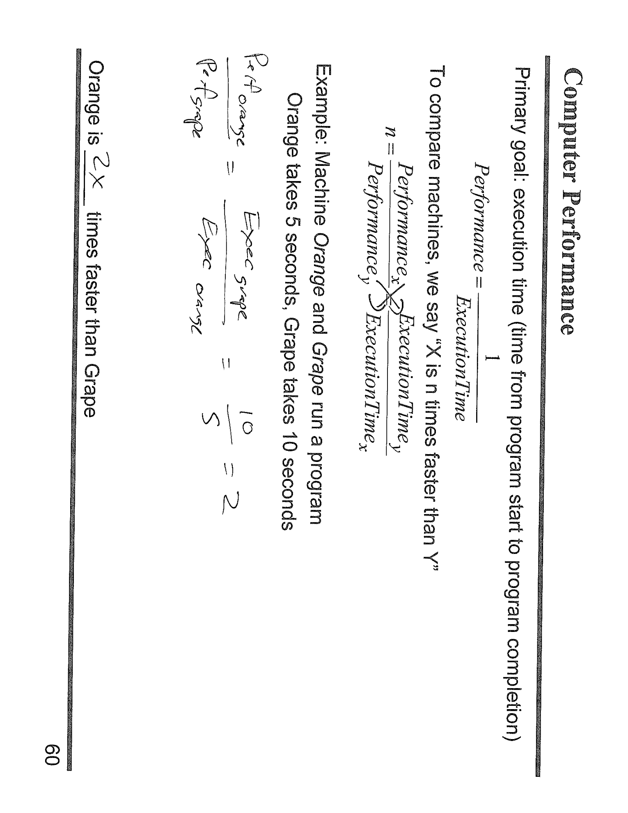

---

## 第 1 页


这张图的题目是：

> 在不使用乘法或除法指令的情况下，用汇编把 **X1 = X0 \* 5** 算出来。
> （图中看起来是 AArch64/ARM64 栈的寄存器记法：X0、X1 等）

图上手写了几种**等价的做法**，核心思路都是：用**移位**（相当于乘 2 的幂）和**加法**拼出 5 倍。

---

## 方法一：移位 + 加法（蓝色写法）

```
LSL   X1, X0, #2     // X1 = X0 << 2  =>  相当于 X1 = 4 * X0
ADD   X1, X1, X0     // X1 = X1 + X0  =>  变成 5 * X0
```

解释：

* `LSL` = Logical Shift Left，左移 2 位等于乘以 2^2 = 4。
* 先把 `X0` 左移 2 位存进 `X1`，得到 `4*X0`，再加一次 `X0`，得到 `5*X0`。

> 这正是图上蓝笔旁注“// X1 = X0\*4”的意思。

---

## 方法二：连续加法/倍增（红色写法示例）

一种更原始但同样正确的写法，用加法“倍增”再加一次：

```
ADD   X1, X0, X0     // X1 = 2 * X0
ADD   X1, X1, X1     // X1 = 4 * X0
ADD   X1, X1, X0     // X1 = 5 * X0
```

解释：

* 先把 `X0+X0` 得到 `2*X0`；
* 再做一次自加得到 `4*X0`；
* 最后再加 `X0` 变成 `5*X0`。
图中红笔的两列就是在展示类似思路（先得到 2X、再到 4X、最后 +X）。

---

## 方法三：一条加法（利用“带移位的加法”）

AArch64 的 `ADD` 支持对第二个源操作数先做移位再相加，因此可以**一条指令**完成：

```
ADD   X1, X0, X0, LSL #2   // X1 = X0 + (X0 << 2) = X0 + 4*X0 = 5*X0
```

这也满足“不用乘除”的限制，而且更精练。

---

### 小结要点

* **思路**：5 = 4 + 1 ⇒ 先算 4×（通过左移 2 位），再加 1×；或用加法把 2×、4×拼出来再加一次。
* **LSL #2**：等价于乘以 4（对无符号/普通整数运算成立）。
* **寄存器**：`X0` 为输入，`X1` 为输出；注意不要把输入覆盖掉（所以上述都把结果存到 `X1`）。
* **更优写法**：在 ARM64 上可用 `ADD X1, X0, X0, LSL #2` 一条指令完成。

---

\[口语化表达]
这题意思就是：别用乘号，想办法把 **X1 = 5 × X0** 拼出来。方法很简单——5 就是 4 加 1，所以先把 X0 左移两位得到 4×X0，再加一次 X0，OK（两条指令：`LSL` 然后 `ADD`）。如果喜欢只用加法，也能先做成 2×、再到 4×、最后再加一次，还是 5×。而在 ARM64 里还有更帅的一招：`ADD X1, X0, X0, LSL #2`，一条指令直接算出 5×X0。整张图就是在展示这些等价写法和它们为什么成立。


---

## 第 2 页



这张图讲的是\*\*计算机性能（Computer Performance）\*\*的基本比较方法，也就是怎么判断“哪台机器更快”。我们来逐步解释内容。

---

## 一、核心目标：执行时间（Execution Time）

计算机性能的首要目标是——程序从开始执行到结束所花的时间。
执行得越快，性能越好。

公式：

$$
\text{Performance} = \frac{1}{\text{Execution Time}}
$$

意思是：**性能与执行时间成反比**，时间越短，性能越高。

---

## 二、比较两台机器的快慢

假设我们有两台机器 **X** 和 **Y**。
我们想知道“X 比 Y 快多少倍”，就用下面的公式：

$$
n = \frac{\text{Performance}_x}{\text{Performance}_y} = \frac{\text{Execution Time}_y}{\text{Execution Time}_x}
$$

也就是说，“X 比 Y 快 n 倍” ⇔ “Y 的执行时间 / X 的执行时间 = n”。

---

## 三、例子讲解：Orange 和 Grape 两台机器

题目举例：

* Orange 跑完程序用了 **5 秒**
* Grape 跑完同样的程序用了 **10 秒**

那么：

$$
\frac{\text{Performance}_{Orange}}{\text{Performance}_{Grape}} = \frac{\text{Execution Time}_{Grape}}{\text{Execution Time}_{Orange}} = \frac{10}{5} = 2
$$

表示 Orange 的性能是 Grape 的 2 倍，
也就是 **Orange 比 Grape 快 2 倍（2× faster）**。

---

## 四、公式与结论总结

* 性能定义：Performance = 1 / Execution Time
* 性能比较公式：
$n = \frac{Performance_X}{Performance_Y} = \frac{Execution Time_Y}{Execution Time_X}$
* 例子结果：Orange 比 Grape 快 2 倍。

---

\[口语化表达]
这页讲的是“计算机快不快”的最基础概念。其实判断谁更快就看谁跑完程序用的时间短。性能其实就是时间的倒数，时间越短性能越高。要比两台机器快多少倍，就用对方的时间除以自己的时间。像例子里，Orange 跑 5 秒、Grape 跑 10 秒，那 Orange 就是快两倍。简单来说，**性能就是反着算时间的快慢**，跑得越快性能越好。


---

## 第 3 页


这张图讲的是\*\*程序执行时间（Execution Time）\*\*的类型与测量方法，主要分为 “Elapsed Time（总耗时）” 和 “CPU Time（CPU 执行时间）”，以及它们的区别。下面详细解释：

---

## 一、Elapsed Time（总耗时 / 实际经过时间）

**定义：** 程序从开始执行到结束所经历的**总时间**。
包括所有过程：

* 磁盘访问（disk access）
* 内存访问（memory access）
* 输入输出（I/O）
* 以及系统切换、等待等所有因素

也就是说，Elapsed Time 是用户从外部看到的“整个程序跑完花了多长时间”。

**特点：**

* 它包含了许多与程序本身无关的开销（比如系统中断、别的程序占 CPU 等）。
* 所以它是一个**有用但不太适合性能比较**的指标，因为受到太多外部因素影响。

---

## 二、CPU Time（CPU 时间）

**定义：** 程序在 CPU 上真正“执行指令”的时间，不包含等待 I/O 或操作系统的切换时间。

CPU Time 通常又分为两个部分：

1. **User Time**：程序本身在用户空间中执行的时间（即执行你写的代码的那部分）。
2. **System Time**：CPU 在内核态（系统调用、文件操作、I/O 等）花费的时间。

**公式：**

$$
CPU\ Time = User\ Time + System\ Time
$$

---

## 三、示例：Unix 的 `time` 命令

命令：

```
linux1.5> time javac CircuitViewer.java
```

运行 Java 编译器编译一个文件后，输出类似：

```
3.370u  0.570s  0:12.44  31%
```

解释：

* **3.370u** → user time（3.37 秒，CPU 真正在跑你的程序的时间）
* **0.570s** → system time（0.57 秒，用于系统调用的时间）
* **0:12.44** → elapsed time（总共花了 12.44 秒）
* **31%** → CPU 利用率（程序执行时 CPU 被占用的比例）

说明：虽然程序花了 12 秒多才跑完，但实际上 CPU 只花了约 4 秒在执行它，其他时间可能在等待磁盘或系统资源。

---

## 四、重点关注：User CPU Time

文末写着：

> Our focus: user CPU time
> time spent executing the lines of code that are "in" our program

意思是：
我们真正关心的，是**用户级 CPU 时间**——也就是 CPU 在执行程序内部指令（你写的那段代码）所花的时间。
因为它最能反映程序本身的效率，而不是外部系统干扰的因素。

---

\[口语化表达]
这页讲的是“程序花的时间”其实有好几种。表面上看到的总时间（Elapsed Time）包括一切：磁盘、I/O、排队、系统调度……但这不完全代表程序本身跑得快不快。真正有意义的是 CPU Time，也就是 CPU 真正干活的时间，它又分成系统时间（帮你做系统调用的那部分）和用户时间（在跑你代码的那部分）。像用 Linux 的 `time` 命令跑程序时，看到的几个数字就是这三种时间的对比。我们一般最关注 **user time**，因为那才是程序代码本身的效率。


---

## 第 4 页


这张图讲的是 **CPU 执行时间（CPU Time）** 的计算方法，以及一个关于“时钟频率（Clock Rate）与时钟周期（Clock Cycle）”的应用例题。它解释了如何通过程序运行时间、时钟频率和执行周期的关系来求解新的机器性能。我们来分步骤详细说明：

---

## 一、CPU 执行时间的基本公式

最上方的公式写着：

$$
\text{CPU execution time for a program} = \text{CPU clock cycles for a program} \times \text{Clock period}
$$

或者等价地写为：

$$
\text{CPU execution time} = \frac{\text{CPU clock cycles}}{\text{Clock rate}}
$$

意思是：

> 程序执行时间 = 执行所需的总时钟周期数 ÷ 时钟频率。

---

## 二、例题内容

例子是这样说的：

> 一台计算机 **Orange** 的时钟频率是 400 MHz，运行某个程序需要 **10 秒**。
> 现在我们设计一台新的计算机 **Grape**，它每条指令要比 Orange 多花 **1.2 倍** 的时钟周期（也就是效率稍差），
> 但我们希望这台新机器能在 **6 秒内** 跑完同一个程序。
> 问：Grape 的时钟频率必须是多少？

---

## 三、分析与计算步骤

### 1️⃣ 计算 Orange 的总时钟周期数

已知：

* Orange 运行时间 = 10 秒
* 时钟频率 = 400 MHz = $4 \times 10^8$ Hz

根据公式：

$$
\text{Clock cycles} = \text{Execution time} \times \text{Clock rate}
$$

所以：

$$
\text{Clock cycles}_{Orange} = 10 \times 4 \times 10^8 = 4 \times 10^9\ \text{cycles}
$$

---

### 2️⃣ Grape 需要更多周期

题目说：

> Grape 需要 1.2 倍的周期数来执行同样的程序。

因此：

$$
\text{Clock cycles}_{Grape} = 1.2 \times \text{Clock cycles}_{Orange} = 1.2 \times 4 \times 10^9 = 4.8 \times 10^9
$$

---

### 3️⃣ 要求 Grape 在 6 秒内完成

所以用公式：

$$
\text{Execution time} = \frac{\text{Clock cycles}}{\text{Clock rate}}
$$

代入：

$$
6 = \frac{4.8 \times 10^9}{\text{Clock rate}}
$$

求得：

$$
\text{Clock rate} = \frac{4.8 \times 10^9}{6} = 0.8 \times 10^9 = 800\ \text{MHz}
$$

---

## 四、结论

要让 Grape 在 6 秒内跑完同样的程序，即使每条指令多花 1.2 倍的时钟周期，它的时钟频率必须达到 **800 MHz**，也就是 **两倍于 Orange（400 MHz）**。

---

\[口语化表达]
这页其实就是在讲，程序跑的快不快，除了看“用多少秒跑完”，还得看“CPU 一秒能跑多少个时钟周期”。公式很简单：执行时间 = 时钟周期数 ÷ 时钟频率。例子里，老机器 Orange 400MHz，跑完要10秒；新机器 Grape 每条指令要多花点时间（慢了1.2倍），但我们想让它只用6秒跑完。那怎么办？只好把频率拉高。算下来得开到800MHz，也就是比原来快一倍。换句话说，虽然新机器每步更慢，但通过更高的时钟频率，整体速度又提上来了。


---

## 第 5 页


这张图讲的是 **CPI（Cycles Per Instruction，每条指令平均需要的时钟周期数）**，以及它与程序执行时间之间的关系。
这是衡量 CPU 性能的一个非常核心的公式。

---

## 一、问题：程序中的指令数量和执行时间有什么关系？

右上角的问题：

> How do the # of instructions in a program relate to the execution time?
> 意思是：“程序中的指令数量（Instruction count）是怎么影响执行时间的？”

答案就是通过 **CPI**（每条指令平均耗费的时钟周期数）来联系起来。

---

## 二、基本关系式

### (1) 从时钟周期的角度看：

$$
\text{CPU clock cycles for a program} = \text{Instructions for a program} \times \text{Average cycles per instruction (CPI)}
$$

也就是：

> 总时钟周期数 = 指令总数 × 平均每条指令需要的周期数。

这说明如果程序的指令更多，或者每条指令平均更慢（CPI 高），总的执行时间就会更长。

---

### (2) 把它代入 CPU 执行时间公式：

$$
\text{CPU execution time} = \text{CPU clock cycles} \times \text{Clock period}
$$

又因为：

$$
\text{Clock period} = \frac{1}{\text{Clock rate}}
$$

代入得到：

$$
\text{CPU execution time} = \text{Instructions} \times \text{CPI} \times \frac{1}{\text{Clock rate}}
$$

---

## 三、最终的通用公式（重点）

$$
\boxed{\text{CPU time} = \frac{\text{Instructions} \times \text{CPI}}{\text{Clock rate}}}
$$

这个公式总结了 CPU 性能的三个关键因素：

1. **指令数 (Instruction count)** → 程序的规模和编译优化程度有关
2. **CPI (每条指令的平均周期)** → CPU 设计效率（流水线、并行性、缓存等）
3. **Clock rate (时钟频率)** → CPU 每秒执行周期的速度（硬件性能）

三者共同决定程序执行的总时间。

---

## 四、理解：不同层次的性能影响

* 编译器优化代码 → 减少指令数（Instructions）
* 改进 CPU 架构 → 降低 CPI（让指令平均更快执行）
* 提高硬件时钟频率 → 增大 Clock rate（单位时间执行更多周期）

这三者任何一项提升，都会让程序运行更快。

---

\[口语化表达]
这页讲的就是一个非常关键的性能公式。程序跑慢不慢，取决于三件事：写了多少条指令（Instructions）、每条指令平均要多少个周期（CPI）、还有CPU一秒能跑多少个周期（Clock Rate）。三个一乘一除，就能算出整个程序要跑多久。简单说，如果你代码写得多，或者CPU设计效率低、每条指令要很多周期，那自然就慢；相反，指令少、CPI低、频率高，就快。这个公式就是计算机性能分析的“总开关”——所有优化最后都能归结到减少指令数、降低CPI、或提高时钟频率。


---

## 第 6 页


这张图是 **CPI（每条指令平均时钟周期数）** 的一个例题，讲的是如何比较两台机器在同一个程序下的性能，判断哪台更快、快多少倍。

---

## 一、题目内容

题目设定：

> 有两个使用相同指令集（ISA）的实现版本：
> Machine A：时钟周期（Clock Cycle Time）= 10 ns，CPI = 2.0
> Machine B：时钟周期（Clock Cycle Time）= 20 ns，CPI = 1.2
> 问：哪台机器在运行同一个程序时更快？快多少倍？

---

## 二、使用公式

CPU 执行时间的基本公式是：

$$
\text{CPU time} = \text{Instruction count} \times \text{CPI} \times \text{Clock cycle time}
$$

因为两个机器的指令集一样、运行的是同一个程序 → **Instruction count 相同**，所以可以忽略这一项比较。

于是：

$$
\frac{\text{Exec}_B}{\text{Exec}_A} = \frac{\text{CPI}_B \times \text{CycleTime}_B}{\text{CPI}_A \times \text{CycleTime}_A}
$$

---

## 三、代入数值计算

给定：

* $\text{CPI}_A = 2.0$
* $\text{CycleTime}_A = 10\ ns$
* $\text{CPI}_B = 1.2$
* $\text{CycleTime}_B = 20\ ns$

代入：

$$
\frac{\text{Exec}_B}{\text{Exec}_A} = \frac{1.2 \times 20}{2.0 \times 10} = \frac{24}{20} = 1.2
$$

这代表：

> Machine B 的执行时间是 A 的 1.2 倍
> 换句话说，**Machine A 比 Machine B 快 1.2 倍**。

---

## 四、结论

* Machine A 更快。
* Machine B 花的时间多 1.2 倍。
* 所以 A 的性能比 B 高约 20%。

---

## 五、额外理解

这题说明一个关键点：
**更低的 CPI 并不一定代表更快。**
虽然 Machine B 每条指令只要 1.2 个周期（比 A 的 2.0 小），但它的时钟周期（20ns）比 A 慢一倍（A 是 10ns）。
结果叠加起来后，A 反而整体执行得更快。

---

\[口语化表达]
这页是拿两台机器 A 和 B 来比谁跑得快。A 的时钟周期短（10ns）、但每条指令要 2 个周期；B 的时钟周期长一倍（20ns）、但每条指令平均只要 1.2 个周期。看起来 B 的 CPI 比 A 小，好像效率更高，但算下来总时间却更长，因为它“每拍子”太慢。最后结果是 B 跑同样的程序要花 1.2 倍的时间，也就是说 **A 比 B 快 1.2 倍**。所以不能光看 CPI 小不小，还得看时钟周期快不快，两者要一起算。


---

## 第 7 页


这张图讲的是如何**计算一个程序的平均 CPI（每条指令的平均时钟周期数）**。
不同类型的指令（例如 ALU 运算、内存读写、分支跳转）执行所需的周期不同，因此要用加权平均来得到总的 CPI。

---

## 一、公式说明

右上角的公式：

$$
CPI = \sum_{\text{types}} (Cycles_{\text{type}} \times Frequency_{\text{type}})
$$

意思是：

> 程序的整体平均 CPI = 各类指令的（每条指令平均所需周期 × 该类指令在程序中所占比例）的总和。

也就是一个加权平均公式。

---

## 二、表格解读

| Instruction Type | Type Cycles | Type Frequency | Cycles × Freq |
| ---------------- | ----------- | -------------- | ------------- |
| ALU（算术逻辑）        | 1           | 50%            | 0.5           |
| Load（载入内存）       | 5           | 20%            | 1.0           |
| Store（存入内存）      | 3           | 10%            | 0.3           |
| Branch（分支）       | 2           | 20%            | 0.4           |
| **合计 (ΣCPI)**    |             |                | **2.2**       |

---

## 三、计算过程详细说明

1. ALU 指令：

$$
1 \times 0.5 = 0.5
$$

2. Load 指令：

$$
5 \times 0.2 = 1.0
$$

3. Store 指令：

$$
3 \times 0.1 = 0.3
$$

4. Branch 指令：

$$
2 \times 0.2 = 0.4
$$

最后：

$$
CPI_{total} = 0.5 + 1.0 + 0.3 + 0.4 = 2.2
$$

---

## 四、结论

> 该程序的平均 CPI 为 **2.2**。
> 这意味着：平均每条指令需要 2.2 个时钟周期来执行。
> CPI 越小，说明 CPU 平均每条指令执行得越快，性能越好。

---

## 五、额外理解

* 不同类型指令的 **执行时间差距大**，例如内存访问（Load/Store）往往比 ALU 运算慢得多。
* 程序整体的性能，不仅取决于 CPU 硬件（每种指令的周期数），还取决于程序结构（各种指令的比例）。
* 所以优化程序时，**减少慢指令的比例**（比如内存操作）可以有效降低 CPI、提升性能。

---

\[口语化表达]
这页是讲怎么算出程序的平均 CPI，也就是“每条指令平均要花多少拍子”。不同类型的指令速度不一样，比如算术运算（ALU）最快只要 1 个周期，内存加载（Load）最慢要 5 个周期。那就得按它们在程序中出现的比例加权平均。像这里，ALU 占 50%、Load 占 20%、Store 占 10%、Branch 占 20%，算下来总共是 2.2。意思就是平均每条指令要 2.2 个时钟周期才能跑完。简单说，这张表教你怎么算“综合平均速度”，让你知道整个程序跑起来到底快不快。


---

## 第 8 页


这张图讲的是 **CPI（每条指令的平均周期数）与处理器优化（Processor Tradeoffs）** 的关系，展示了当改进某一部分硬件性能时（比如缓存、分支预测、并行执行），整机性能会提升多少。
它延续了上一页的例子（CPI=2.2），然后通过三种不同的改进方案计算出性能提升倍数。

---

## 一、背景复习

原始条件（来自上一页）：

| Instruction Type | Type Cycles | Type Frequency |
| ---------------- | ----------- | -------------- |
| ALU              | 1           | 50%            |
| Load             | 5           | 20%            |
| Store            | 3           | 10%            |
| Branch           | 2           | 20%            |

原始总 CPI =

$$
(1×0.5) + (5×0.2) + (3×0.1) + (2×0.2) = 2.2
$$

---

## 二、问题 1：改进缓存（减少 Load 指令的周期）

题目说：

> 数据缓存（Data Cache）将平均 Load 时间从 5 个周期减少到 2 个周期。

新的 CPI：

$$
CPI_{new} = (1×0.5) + (2×0.2) + (3×0.1) + (2×0.2) = 1.6
$$

性能提升倍数：

$$
\text{Speedup} = \frac{旧CPI}{新CPI} = \frac{2.2}{1.6} = 1.375
$$

👉 **机器变快 1.375 倍（约提升 37.5%）**

---

## 三、问题 2：改进分支预测（减少 Branch 的周期）

题目说：

> 分支预测技术（Branch Prediction）让 Branch 指令少用一个周期（从 2 → 1）。

新的 CPI：

$$
CPI_{new} = (1×0.5) + (5×0.2) + (3×0.1) + (1×0.2) = 2.0
$$

性能提升倍数：

$$
\frac{2.2}{2.0} = 1.1
$$

👉 **机器变快 1.1 倍（约提升 10%）**

---

## 四、问题 3：支持双发射（一次执行两条 ALU 指令）

题目说：

> ALU 指令可以两条同时执行（相当于 ALU 指令周期减半，从 1→0.5）。

新的 CPI：

$$
CPI_{new} = (0.5×0.5) + (5×0.2) + (3×0.1) + (2×0.2) = 1.95
$$

性能提升倍数：

$$
\frac{2.2}{1.95} = 1.13
$$

👉 **机器变快 1.13 倍（约提升 13%）**

---

## 五、对比与总结

| 优化项              | 新的 CPI | 提升倍数   | 性能提升比例 |
| ---------------- | ------ | ------ | ------ |
| 改进缓存（Load=2）     | 1.6    | 1.375× | +37.5% |
| 改进分支预测（Branch=1） | 2.0    | 1.1×   | +10%   |
| 双发射 ALU          | 1.95   | 1.13×  | +13%   |

由此可见：

* **减少 Load 周期（改进内存访问）带来的收益最大。**
* **分支预测和 ALU 并行**也有效果，但相对提升较小。

---

\[口语化表达]
这页讲的就是：如果我们去优化 CPU 的某些部分，能让机器跑快多少。原来的平均 CPI 是 2.2。
第一种方法是加缓存，让 Load 从 5 拍降到 2 拍，结果速度提升 1.375 倍，最有效。
第二种是改分支预测，让跳转指令少花一个周期，提速 1.1 倍。
第三种是让 ALU 一次能执行两条运算指令（相当于效率翻倍），结果提速 1.13 倍。
对比下来，最大的瓶颈在 **内存访问（Load）**，所以改善缓存性能比单纯提高 ALU 并行度更划算。简单说：
👉 **“抓大头”才最有效率，别优化小头。”**


---

## 第 9 页


这张图讲的是非常著名的 **阿姆达尔定律（Amdahl’s Law）**，它告诉我们一个关键道理：

> **“性能提升的上限取决于程序中被改进部分所占的比例。”**
> 换句话说：即使你把某一部分提速无穷倍，**整体加速效果也不会超过剩下部分的限制**。

---

## 一、基本公式

阿姆达尔定律写作：

$$
\text{Execution time after improvement} = \text{Execution time of unaffected part} + \frac{\text{Execution time of affected part}}{\text{Amount of improvement}}
$$

其中：

* “unaffected part” = 程序中 **没被改进的部分**
* “affected part” = 被改进（加速）的部分
* “Amount of improvement” = 加速倍数（例如加快 4 倍 → 4）

---

## 二、例题讲解

题目说：

> 程序原本运行 100 秒，
> 其中有 80 秒是在执行乘法（multiply）操作。
> 我们要让整个程序快 4 倍，
> 问：乘法部分得加速多少倍？

---

### 1️⃣ 设变量

* 总执行时间：100 秒
* 乘法部分（可优化）占 80 秒
* 其他部分（不可优化）占 20 秒
* 目标：加速后运行时间 = 100 / 4 = **25 秒**
* 要求：乘法部分的加速倍数 = $\text{improve}$

---

### 2️⃣ 代入公式

$$
25 = 20 + \frac{80}{\text{improve}}
$$

---

### 3️⃣ 求解

$$
25 - 20 = \frac{80}{\text{improve}} \Rightarrow \text{improve} = \frac{80}{5} = 16
$$

👉 也就是说，乘法部分必须 **加速 16 倍**，整个程序才能变成原来的 1/4 时间（快 4 倍）。

---

## 三、延伸讨论：如果想要快 5 倍呢？

同样代入：

$$
20 + \frac{80}{\text{improve}} = 100 / 5 = 20
$$

这就变成：

$$
20 = 20 + \frac{80}{\text{improve}} \Rightarrow \frac{80}{\text{improve}} = 0
$$

这意味着 **improve → ∞**，也就是说必须让乘法部分“无限快”才可能实现。
即便乘法部分完全不耗时了，程序仍然要跑 20 秒（因为那部分没法优化）。
所以整体加速最多只有 5 倍，这就是 Amdahl’s Law 的核心思想。

---

## 四、结论总结

| 项目           | 数值            |
| ------------ | ------------- |
| 原始时间         | 100 秒         |
| 可改进部分        | 80 秒（占 80%）   |
| 目标加速比        | 4 倍           |
| 所需改进倍数       | 16 倍          |
| 最大可能加速（理论极限） | 5 倍（即使无限优化乘法） |

---

\[口语化表达]
这页讲的是阿姆达尔定律，其实就是告诉我们“再牛的优化也有极限”。
举个例子：程序跑 100 秒，其中 80 秒都花在乘法上。你想让整机变快 4 倍，算下来乘法那部分得快 16 倍才行。
但你要是想让程序快 5 倍？对不起，除非乘法不用时间（无限快），因为还有 20 秒是别的操作动不了。
所以核心结论是：**你只能优化那部分真正占时间的东西**，而且再怎么加速，没被改进的部分永远是性能瓶颈。
一句话总结：**“别花时间把不慢的东西优化到极致。”**


---

## 第 10 页


这张图讲的是一个常见的误区警告：

> **“更高的 MHz、MIPS、GHz ≠ 性能更好！”**
> 也就是说，CPU 时钟频率或每秒执行指令数高，不代表程序一定跑得更快。
> 实际性能还取决于 **CPI（每条指令平均周期）** 和 **执行的指令数量（指令总数）**。

---

## 一、核心公式回顾

程序的执行时间计算公式：

$$
\text{Execution Time} = \frac{\text{Instructions} \times \text{CPI}}{\text{Clock Rate}}
$$

三个因素共同决定性能：

* 指令总数（由编译器、程序结构决定）
* CPI（由 CPU 设计和代码类型决定）
* 时钟频率（由硬件决定）

---

## 二、例子 1：Orange vs Grape 两台计算机

| 机器         | 时钟频率             | CPI | 程序指令数     | 计算结果                              | 执行时间  |
| ---------- | ---------------- | --- | --------- | --------------------------------- | ----- |
| **Orange** | 1000 MHz (1 GHz) | 2.5 | 1 Billion | $1×10^9 × 2.5 / 1×10^9 = 2.5$ 秒   | 2.5 秒 |
| **Grape**  | 500 MHz          | 1.1 | 1 Billion | $1×10^9 × 1.1 / 0.5×10^9 = 2.2$ 秒 | 2.2 秒 |

结果：
虽然 **Grape 的时钟频率只有 Orange 一半（500MHz vs 1GHz）**，但它的 CPI 更低（1.1 vs 2.5），所以反而**执行时间更短（2.2s vs 2.5s）**。
👉 **Grape 实际性能更好！**

---

## 三、例子 2：编译器 A vs 编译器 B（同一台 1GHz CPU）

表格数据（右下方）：

| Instruction Type | Cycles | 说明     |
| ---------------- | ------ | ------ |
| ALU              | 1      | 算术逻辑运算 |
| Load             | 5      | 内存读取   |
| Store            | 3      | 内存写入   |
| Branch           | 2      | 分支跳转   |

假设两种编译器生成的代码不同：

* **编译器 A：**

* 10 Billion ALU 指令 + 1 Billion Load 指令
* CPI 约 1.5
* 执行时间 = $(10×10^9 + 1×10^9) × 1.5 / 1×10^9 = 16.5 秒$（图中近似 15s）

* **编译器 B：**

* 5 Billion ALU + 1 Billion Load
* CPI 约 1.2
* 执行时间 = $(5×10^9 + 1×10^9) × 1.2 / 1×10^9 = 7.2 秒$（图中约 10s）

虽然它们跑在**同一台 1GHz 机器**上，但指令数量差异让执行时间完全不同。
👉 指令少 + CPI 低的程序更快。

---

## 四、结论总结

| 指标        | 含义        | 越高越好吗？              |
| --------- | --------- | ------------------- |
| MHz / GHz | 时钟频率      | ❌ 不一定快（要看 CPI 和指令数） |
| MIPS      | 每秒执行百万条指令 | ❌ 不可靠（不同指令的复杂度不同）   |
| 执行时间      | 真正的性能指标   | ✅ 越低越好              |

**关键点：**

> 不能只看“频率高”或“MIPS大”就说CPU快，
> 只有比较**同一程序的执行时间**，才能说明哪台机器性能更好。

---

\[口语化表达]
这页其实是在提醒我们：别被“GHz 越高越快”这种表象骗了。真正的性能要看程序跑完要花多久。例子里，Orange 1GHz 看起来比 Grape 500MHz 牛，但因为 Grape 每条指令更高效（CPI 更低），它反而跑得更快。同样地，两个编译器在同一台机器上，生成的指令多少不同，速度差距也能很大。所以不能只看频率或 MIPS，得看“整个程序的执行时间”才是真正的快慢。简单说：**“时钟快不代表机器快，程序跑得快才是真的快。”**
