---

## 第 1 页

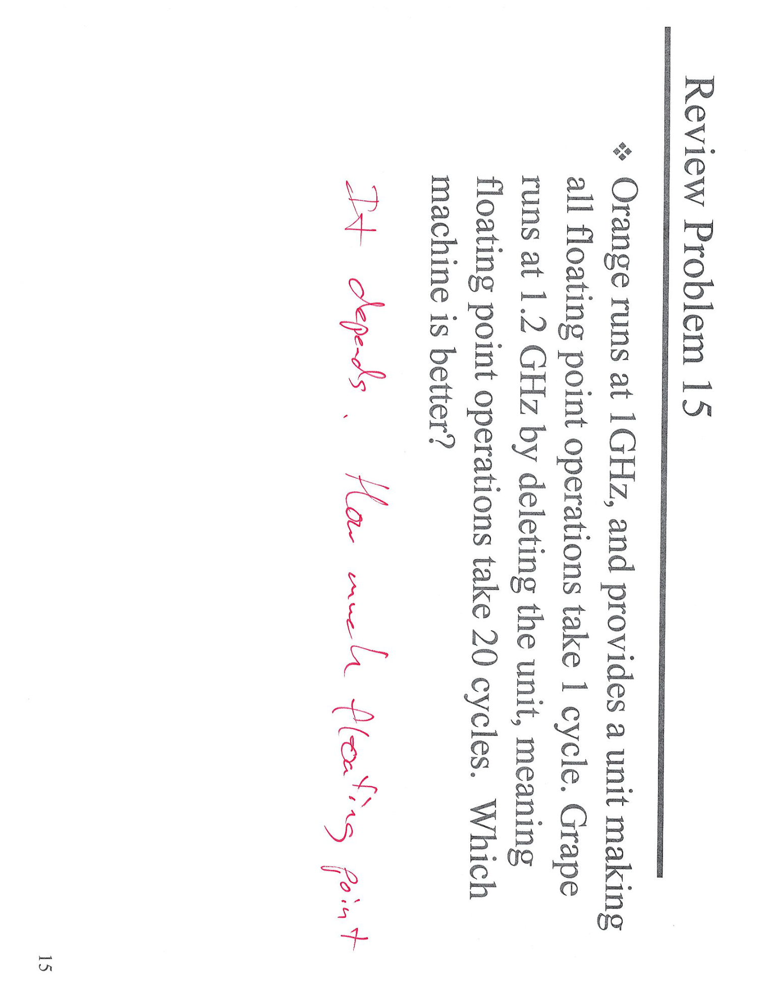

这个截图中的问题描述了一个计算机硬件性能对比的情况，涉及到两种处理器单位的浮点运算能力。具体地，Orange和Grape是两种不同的硬件，Orange每秒钟的时钟频率为1GHz，并且每次浮点运算需要1个时钟周期；而Grape的时钟频率为1.2GHz，但是浮点运算需要20个时钟周期。

这里的问法是“哪一台机器更好？”并且回答是“取决于情况”，也就是这两台机器的性能会受到不同因素的影响，比如任务的性质、机器的其他硬件配合等。

\[口语化表达] 这个问题是对比两台计算机硬件的性能。Orange的时钟频率是1GHz，每次浮点计算只需要1个周期，而Grape的时钟频率是1.2GHz，但浮点计算需要20个周期。所以哪台机器更好，得看具体的情况。

---

## 第 2 页

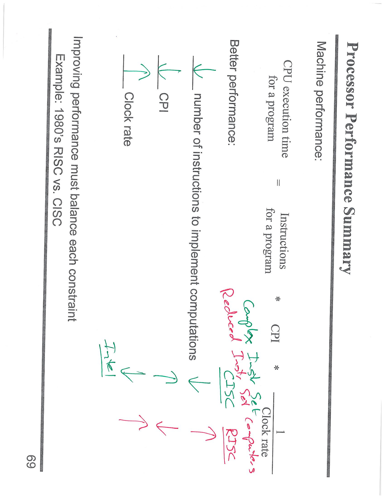

这张截图总结了影响处理器性能的几个关键因素。主要内容是：CPU执行时间（CPU execution time）= 程序所需指令数（Instructions for a program） × 每条指令的周期数（CPI） × 时钟周期（Clock rate）。从这个公式可以看出，优化处理器性能有三个主要因素可以控制：

1. **时钟速率（Clock rate）**：增加时钟频率可以提高性能。
2. **每条指令的周期数（CPI）**：降低CPI可以加快每条指令的执行速度。
3. **指令集数量（Number of instructions）**：减少需要执行的指令数量也有助于提高性能。

接着，截图提到1980年代的两种处理器架构——CISC（复杂指令集计算机）和RISC（简化指令集计算机）的对比。CISC处理器通常具有更复杂的指令集，可能每条指令需要的周期更多，但是指令的数量较少。而RISC则采用简单的指令集，但每条指令可能需要更多的周期。Intel等公司通常使用CISC架构，而RISC则常用于一些高效能的处理器。

\[口语化表达] 这张图总结了影响处理器性能的几个关键因素，包括时钟速率、每条指令的周期数（CPI）和指令数量。它还提到CISC和RISC两种架构的不同，CISC指令复杂但数量少，RISC指令简单但数量多。提高性能得看怎样平衡这些因素。

---

## 第 3 页

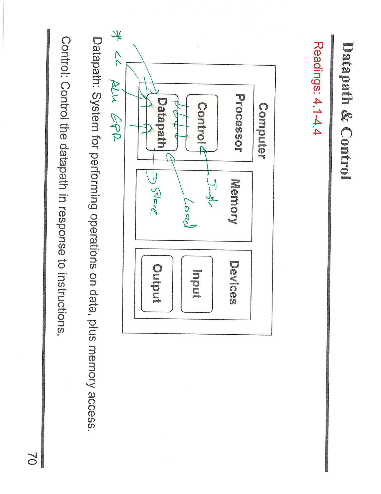

这张截图展示了计算机系统中\*\*数据路径（Datapath）**和**控制（Control）\*\*模块的关系。简要来说：

1. **Datapath**：这是一个执行操作的系统，负责在数据上进行计算和处理。在图中，Datapath包括了像**ALU（算术逻辑单元）**和**寄存器文件**等重要部件。这些部件协同工作，执行各种指令，如加法、存储数据等。指令中的“Load”和“Store”操作也会涉及到这个模块，负责数据的加载和存储。

2. **Control**：控制模块负责根据输入的指令控制**Datapath**的操作。当CPU执行指令时，控制模块决定哪个操作需要执行，并控制数据路径中各个组件的行为。

这两个模块共同协作，完成从内存读取数据、执行计算操作到将结果存储回内存等过程。图中描述了CPU和内存之间的数据流动以及如何通过控制逻辑执行具体操作。

\[口语化表达] 这张图讲的是计算机系统里的数据路径和控制模块怎么协作。数据路径就像是负责处理数据和运算的部分，里面有算术逻辑单元和寄存器，负责执行加法、存储数据等操作。控制模块则根据指令控制数据路径，让它执行正确的操作，像是加载或存储数据。这两个部分合作完成所有的计算机指令任务。

---

## 第 4 页

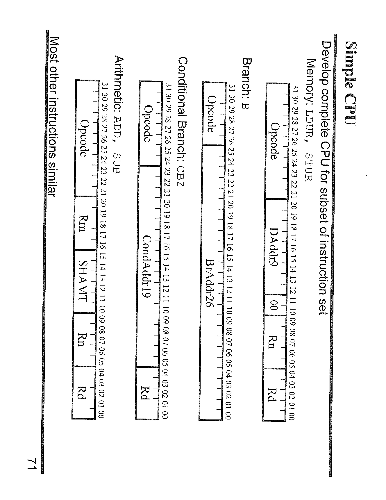

这张截图展示了一个简化的CPU设计，特别是对几种指令集的编码格式和结构进行了展示。它包含了几种指令（如算术运算、条件跳转、内存操作等）的编码方式。下面是主要内容的解释：

1. **算术指令（ADD, SUB）**：这些是基础的算术操作指令，每条指令都有一个操作码（Opcode），指定了具体的操作类型（如加法或减法），以及源寄存器（Rn）和目标寄存器（Rd）。

2. **条件跳转指令（CBZ）**：这个指令用于条件跳转，它的操作码（Opcode）后跟着一个条件码，通常用于判断寄存器的值是否为零，并决定是否跳转到指定的地址。

3. **分支指令（B）**：这个指令用于无条件跳转到指定地址，它的操作码后跟着跳转地址（Addr26），这是一个16位的地址值。

4. **内存操作指令（LDUR, STUR）**：这些指令用于数据加载（Load）和存储（Store），它们涉及到从内存读取或写入数据，并且包括目标寄存器和内存地址等参数。

每种指令的二进制编码格式都有明确的位分配，操作码占有固定的位数，而寄存器和地址等信息则被分配到指令的其他部分。

\[口语化表达] 这张图展示了简单CPU设计中的指令格式。不同的指令类型（比如加法、减法、跳转和内存操作）都有不同的编码方式。每条指令都有一个操作码，后面跟着寄存器或地址的信息。通过这些编码，CPU可以知道执行什么操作以及在哪里操作数据。

---

## 第 5 页

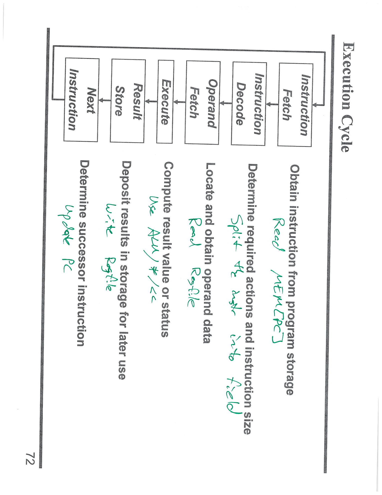

这张截图展示了\*\*执行周期（Execution Cycle）\*\*的流程图，描述了CPU执行指令的不同阶段。整个执行周期由几个主要阶段组成，具体步骤如下：

1. **指令获取（Instruction Fetch）**：CPU从程序存储器中获取指令。这个过程通过读取存储器来进行。

2. **指令解码（Instruction Decode）**：对获取的指令进行解码，确定需要执行的操作类型，并判断需要哪些操作数和指令的大小。

3. **操作数获取（Operand Fetch）**：根据指令的要求，从存储器或寄存器中获取操作数。

4. **执行（Execute）**：执行指令所需的计算操作，例如加法、乘法等。这里使用ALU（算术逻辑单元）进行具体计算。

5. **结果存储（Result Store）**：计算结果被存储到寄存器或内存中。

6. **更新程序计数器（Update PC）**：更新程序计数器（Program Counter，PC），以准备获取下一条指令。

每个阶段依赖于前一个阶段的结果，形成一个循环过程，直到所有指令完成执行。

\[口语化表达] 这张图描述了CPU如何一步步执行指令。首先，CPU从存储器取出指令，然后解码指令，接着从寄存器或者内存里取出需要的数据。然后，CPU执行计算操作，最后把结果存储回寄存器或内存，更新程序计数器，准备执行下一条指令。

---

## 第 6 页

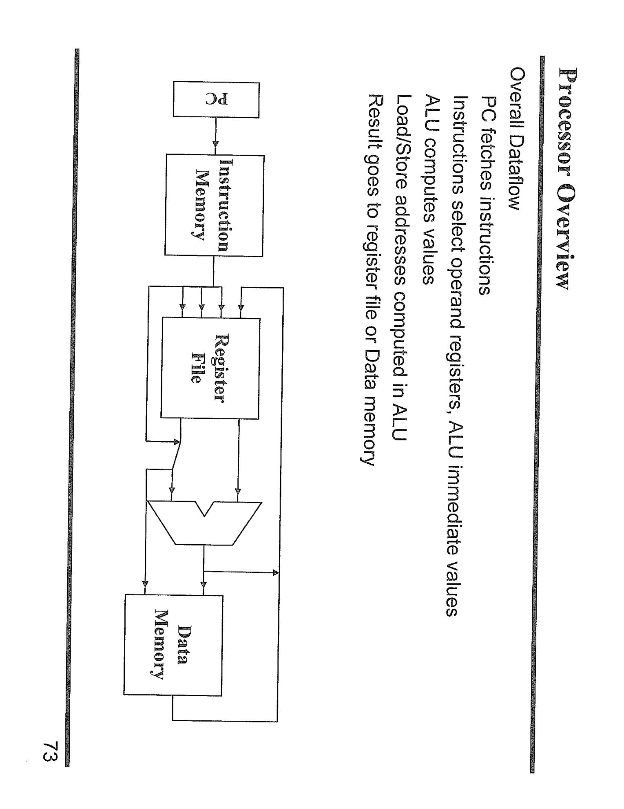

这张截图展示了\*\*处理器数据流（Overall Dataflow）\*\*的简化图示，展示了指令如何在处理器内部流动并执行。具体流程如下：

1. **程序计数器（PC）**：程序计数器负责跟踪下一条要执行的指令的地址。它从**指令存储器**（Instruction Memory）获取指令。

2. **指令存储器（Instruction Memory）**：存储器包含着所有的程序指令。处理器根据程序计数器的值从这里获取指令。

3. **寄存器文件（Register File）**：从指令中提取的操作数被存储在寄存器文件中。寄存器文件用于快速存取操作数，帮助进行计算或数据处理。

4. **算术逻辑单元（ALU）**：ALU执行具体的计算操作，比如加法、减法等。它也负责计算**加载/存储操作的地址**，并通过指令中的操作数执行计算。

5. **数据存储器（Data Memory）**：在加载或存储操作时，数据存储器会被用于读写数据。ALU计算出地址后，数据会从存储器中读取或写入。

6. **结果传送**：计算结果通过寄存器文件或数据存储器存储，供后续使用。

整体上，处理器通过这种数据流动来依次执行指令，每个组件之间相互协调，完成从获取指令、执行计算、到存储结果的过程。

\[口语化表达] 这张图描述了处理器内部指令如何流动。程序计数器（PC）从指令存储器取出指令，然后通过寄存器文件获取需要的数据，ALU计算操作，再把结果存储到寄存器或数据存储器中。每个部分紧密合作，确保指令按顺序执行。

---

## 第 7 页

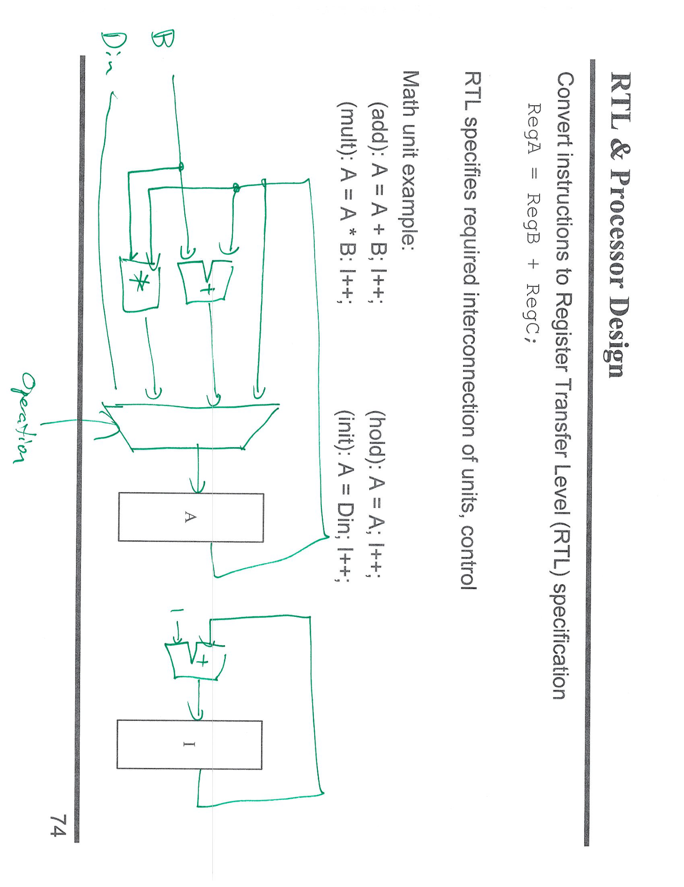

这张截图展示了\*\*寄存器传输级（RTL）\*\*和处理器设计的例子，重点展示了如何将指令转化为寄存器传输级表示（Register Transfer Level）。RTL是一个描述硬件操作的抽象层次，指示了指令如何在寄存器和硬件单元之间传递数据。

图中的具体内容展示了一个**数学单元**的设计和两个操作示例：

1. **加法操作（add）**：

* 操作：`A = A + B;`
* 表示A寄存器和B寄存器的值相加，结果存回A寄存器。

2. **乘法操作（mult）**：

* 操作：`A = A * B;`
* 表示A寄存器的值与B寄存器的值相乘，结果存回A寄存器。

3. **初始化操作（init）**：

* 操作：`A = D_in;`
* 表示将输入的数据`D_in`存入A寄存器。

图中的数据流示意图显示了各个寄存器（如A、I）和操作（加法、乘法）之间的连接关系，并用箭头表示数据流动的方向。

这些RTL表示方式帮助硬件设计人员理解如何将高层次的程序指令转化为硬件实现的具体数据传输过程。

\[口语化表达] 这张图展示了怎么用寄存器传输级（RTL）来设计处理器。例如，A寄存器和B寄存器相加的加法操作会把结果存回A寄存器；A寄存器和B寄存器相乘的乘法操作会把结果也存回A寄存器；还有初始化操作，会把输入的数据存入A寄存器。这个过程通过图示展示了各个寄存器和操作之间的连接。

---

## 第 8 页

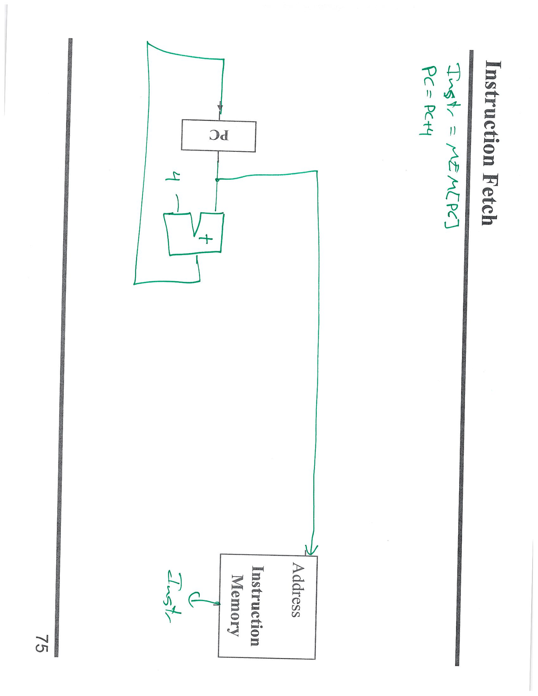

这张截图展示了\*\*指令获取（Instruction Fetch）\*\*的过程。具体步骤如下：

1. **程序计数器（PC）**：程序计数器（PC）保存着下一条指令的地址。在这个过程中，PC的值被用来从指令存储器中获取指令。

2. **地址加法**：PC的值会与4相加，得到下一个指令的地址。这里的加法是因为每条指令通常占用4个字节，因此需要将PC值增加4，指向下一条指令。

3. **指令存储器（Instruction Memory）**：根据PC加上4后的地址，指令存储器返回对应的指令。

4. **指令读取**：从指令存储器中获取的指令会被送到后续的处理阶段继续执行。

这段流程描述的是指令获取阶段，在这一阶段，处理器根据程序计数器中的地址获取指令，为后续的解码和执行做准备。

\[口语化表达] 这张图讲的是指令怎么被获取。程序计数器（PC）保存下一条指令的地址，PC加4后得到新的地址，然后从指令存储器中取出对应的指令。这是处理器执行程序的第一步。

---

## 第 9 页

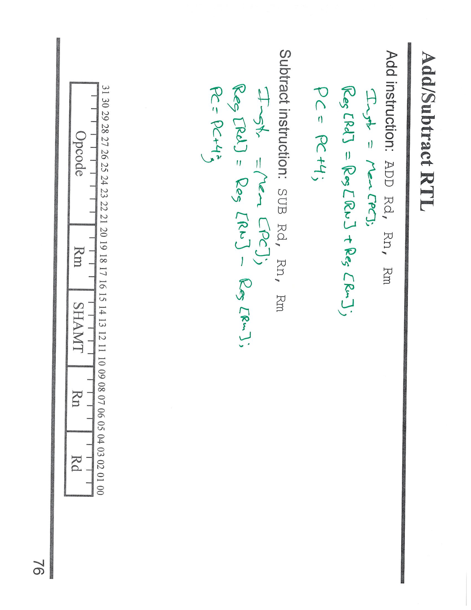

这张截图展示了\*\*加法（ADD）**和**减法（SUB）**指令的**寄存器传输级（RTL）\*\*表示。每个指令的执行过程都通过具体的寄存器操作来描述。下面是详细解释：

1. **加法指令（ADD）**：

* 操作：`R[Rd] = R[Rn] + R[Rm];`
* 这表示将寄存器**Rn**和**Rm**中的值相加，并将结果存入寄存器**Rd**。
* 在执行过程中，PC（程序计数器）会加1，指向下一条指令：`PC = PC + 4;`。

2. **减法指令（SUB）**：

* 操作：`R[Rd] = R[Rn] - R[Rm];`
* 这表示将寄存器**Rn**中的值减去寄存器**Rm**中的值，结果存入寄存器**Rd**。
* 执行完毕后，程序计数器（PC）同样加1，指向下一条指令：`PC = PC + 4;`。

这些RTL表示详细描述了每条指令如何通过寄存器与数据交互，具体执行的加法或减法操作，最终将结果存回指定的寄存器。

\[口语化表达] 这张图解释了加法和减法指令的工作原理。加法指令会把两个寄存器的值加起来，存入另一个寄存器；减法指令则是把一个寄存器的值减去另一个寄存器的值，结果存回指定的寄存器。指令执行后，程序计数器会增加4，指向下一条指令。

---

## 第 10 页

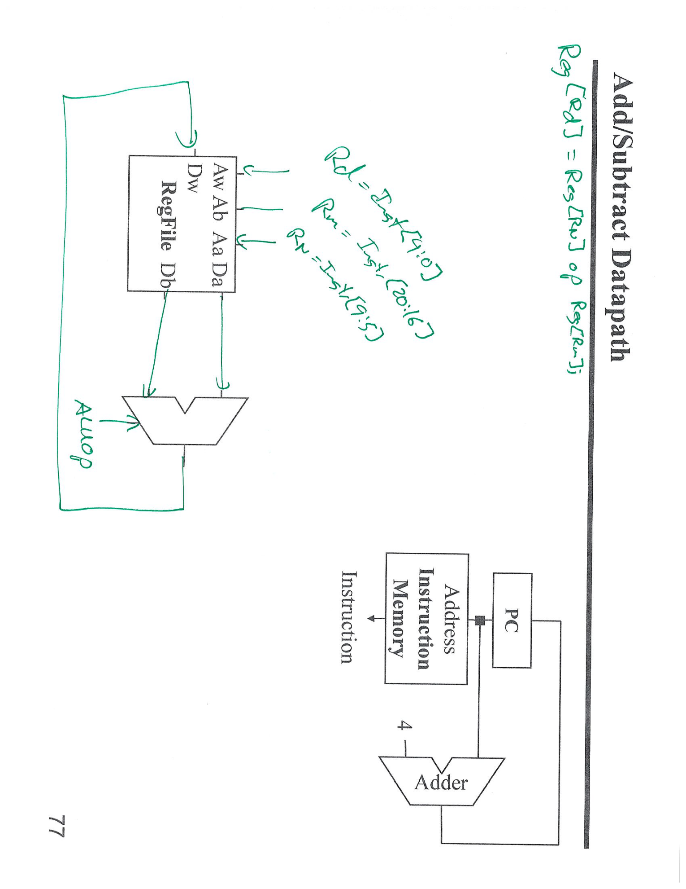

这张截图展示了加法（ADD）和减法（SUB）指令的**数据路径（Datapath）**，即数据如何在处理器内部流动。图中详细展示了执行加法或减法指令时各个组件如何协同工作。

1. **寄存器文件（RegFile）**：寄存器文件存储着CPU中的数据，图中展示了它如何通过输入输出与其他部件交互。

* `Rw` 和 `Rd`：这些寄存器用于存储数据，指令通过这些寄存器获取操作数，并存储运算结果。

2. **指令存储器（Instruction Memory）**：从指令存储器中获取指令，并通过地址来访问相应的指令。

3. **程序计数器（PC）**：PC保存下一条要执行的指令的地址，指令取出后，PC会增加4，指向下一条指令。

4. **加法器（Adder）**：加法器的作用是对指令的地址进行加法操作，通常是将PC值增加4，计算出下一条指令的地址。

5. **控制信号（AW、AB、AA、DA、DW）**：这些信号控制寄存器文件的数据传输，确保正确的寄存器值在正确的时刻传输到对应的寄存器。

6. **操作码（Op）**：控制ALU的操作，例如加法或减法。

这些数据路径组件确保了加法或减法指令在执行时，数据能够正确地从寄存器文件传送到ALU，进行计算后再存回寄存器。

\[口语化表达] 这张图讲解了加法和减法指令的执行过程。首先，程序计数器（PC）提供下一条指令的地址，指令从存储器中取出，然后通过寄存器文件读取数据，执行加法或减法。最终，结果存回寄存器，确保每一步的操作都在正确的时机进行。

---

## 第 11 页

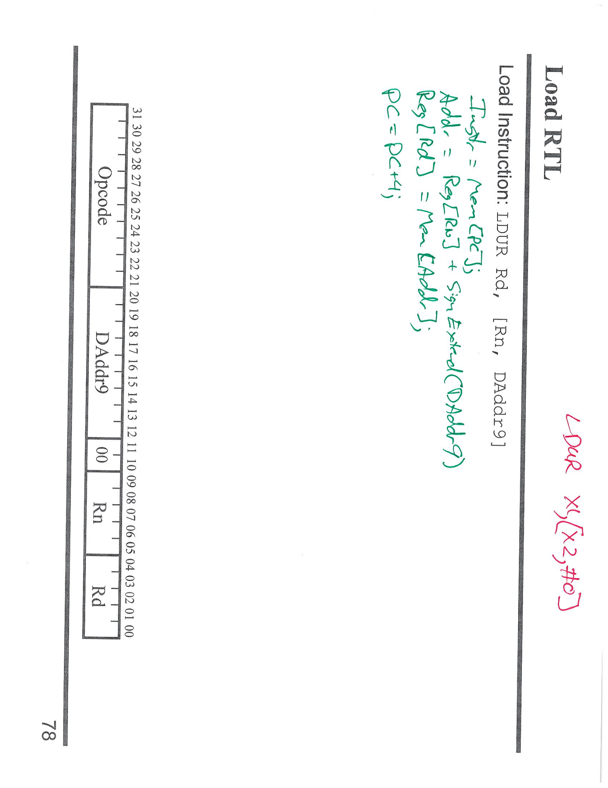

这张截图展示了\*\*加载指令（LDUR）**的**寄存器传输级（RTL）\*\*表示。具体来说，这是一条将数据从内存加载到寄存器的指令，整个过程可以分为以下几个步骤：

1. **获取指令（Instruction Fetch）**：

* `Inst = Mem[PC]`：从程序计数器（PC）指向的内存地址获取指令。

2. **计算地址（Address Calculation）**：

* `Addr = R[RN] + SignExtend(DAddr)`：首先从寄存器**Rn**中获取地址，然后将指令中的偏移量（DAddr）进行符号扩展（SignExtend），最后将结果加到寄存器中的地址\*\*R\[RN]\*\*上，得到最终的内存地址。

3. **从内存加载数据（Load Data）**：

* `R[Rd] = Mem[Addr]`：根据计算得到的地址，从内存中读取数据，并将其存入目标寄存器**Rd**。

4. **更新程序计数器（PC Update）**：

* `PC = PC + 4`：指令执行完后，程序计数器加4，指向下一条指令。

这条RTL表示展示了如何将内存地址计算和数据加载过程具体化，通过寄存器与内存之间的交互实现加载操作。

\[口语化表达] 这张图展示了加载指令（LDUR）的执行过程。首先，CPU从程序计数器获取指令，然后计算内存地址，接着从内存加载数据到指定的寄存器。最后，程序计数器更新，指向下一条指令。

---

## 第 12 页

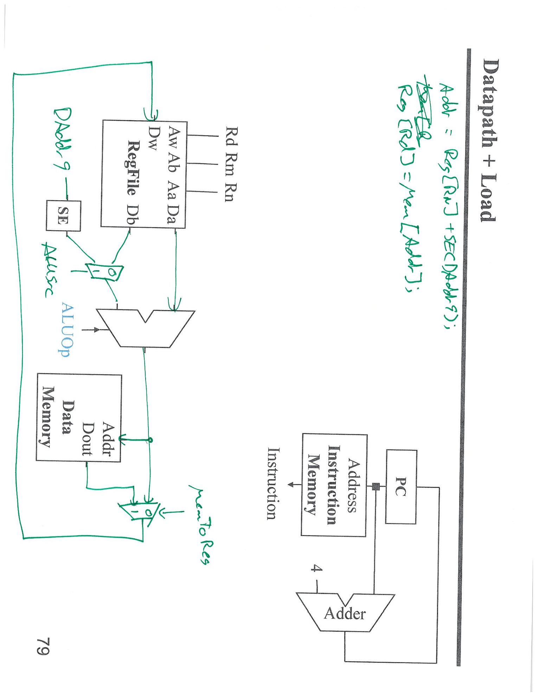

这张截图展示了**加法指令（ADD）**和**加载指令（LDUR）**的**数据路径（Datapath）**。它描绘了执行这些指令时，各个硬件组件如何协同工作。下面是详细解释：

1. **程序计数器（PC）**：

* PC提供下一条指令的地址，并送到**指令存储器（Instruction Memory）**。

2. **指令存储器（Instruction Memory）**：

* 根据PC的值，指令存储器返回当前指令。

3. **寄存器文件（RegFile）**：

* 从寄存器文件读取寄存器的值。在图中，`R[Rn]`表示从寄存器**Rn**读取数据，而`R[Rd]`表示将结果存回寄存器**Rd**。

4. **加法器（Adder）**：

* 用于计算寄存器中的地址，或者在加载指令中计算内存地址。

5. **符号扩展（Sign Extension, SE）**：

* 在加载指令中，符号扩展会扩展立即数（DAddr），使其适应内存操作的地址计算。

6. **数据存储器（Data Memory）**：

* 在加载指令（LDUR）中，根据计算出的地址从内存中读取数据，并将数据写入寄存器。

7. **ALU运算**：

* 在加法指令中，ALU用于执行加法操作。`R[Rd] = R[Rn] + R[Rm]`表示将寄存器**Rn**和**Rm**的值相加，结果存储在寄存器**Rd**。

8. **内存地址计算和存储**：

* 对于加载指令（LDUR），从内存中读取数据后，数据通过数据存储器送回寄存器**Rd**。

9. **更新程序计数器（PC）**：

* 执行完指令后，程序计数器增加4，指向下一条指令。

\[口语化表达] 这张图展示了加法和加载指令的执行过程。程序计数器先获取指令，指令存储器根据地址返回指令，然后寄存器文件提供需要的数据。加法指令通过ALU进行运算，加载指令则通过数据存储器从内存读取数据，结果存回寄存器。最后，程序计数器更新，指向下一条指令。

---

## 第 13 页

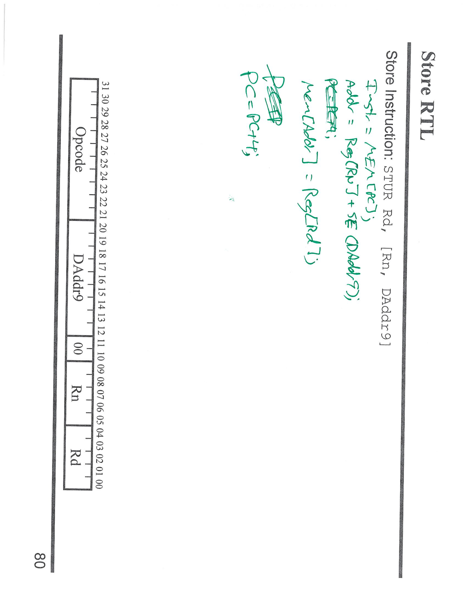

这张截图展示了\*\*存储指令（STUR）**的**寄存器传输级（RTL）\*\*表示，描述了将数据从寄存器存储到内存的过程。具体过程如下：

1. **获取指令（Instruction Fetch）**：

* `Inst = Mem[PC]`：从程序计数器（PC）指向的内存地址获取指令。

2. **计算内存地址（Address Calculation）**：

* `Addr = R[Rn] + SignExtend(DAddr)`：首先从寄存器**Rn**中获取地址值，并将指令中的偏移量**DAddr**进行符号扩展（SignExtend），得到最终的内存地址。

3. **存储数据到内存（Store Data）**：

* `Mem[Addr] = R[Rd]`：将寄存器**Rd**中的数据存储到由计算得到的内存地址**Addr**中。

4. **更新程序计数器（PC Update）**：

* `PC = PC + 4`：程序计数器增加4，指向下一条指令。

通过这些步骤，**STUR**指令从寄存器中取出数据，并将其存储到内存中，完成存储操作。

\[口语化表达] 这张图解释了存储指令（STUR）是如何工作的。首先，程序计数器（PC）取出指令，接着通过计算地址，将寄存器中的数据存到内存里。最后，程序计数器更新，指向下一条指令。
