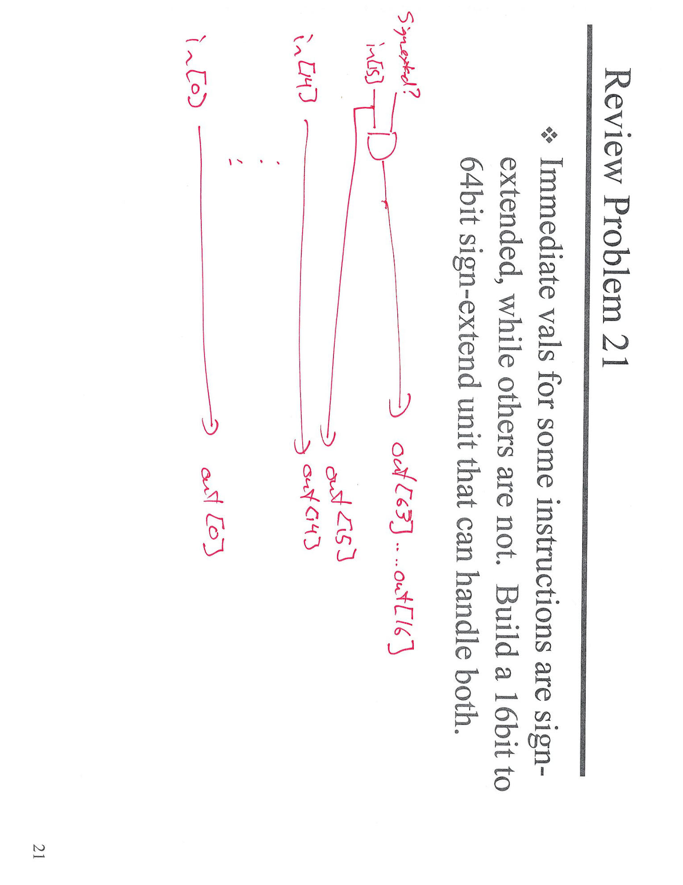
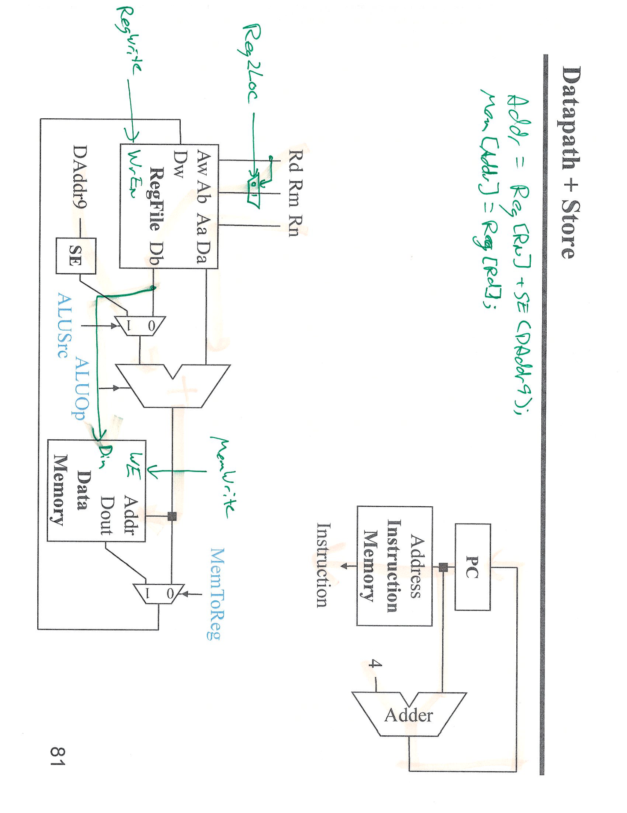
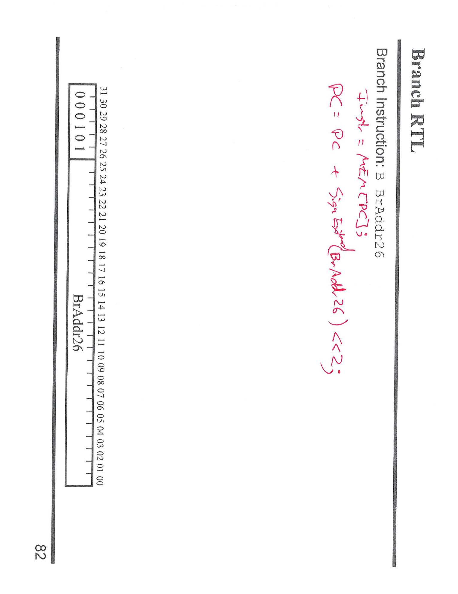
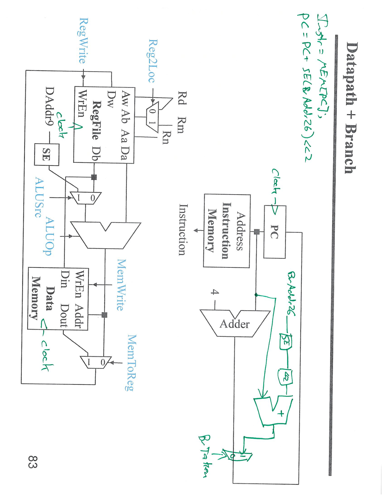
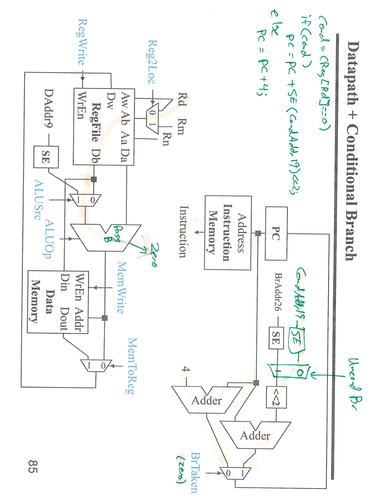
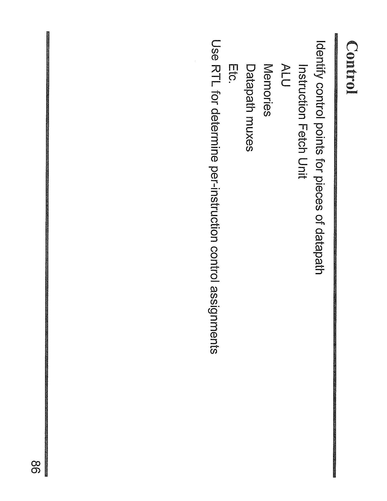
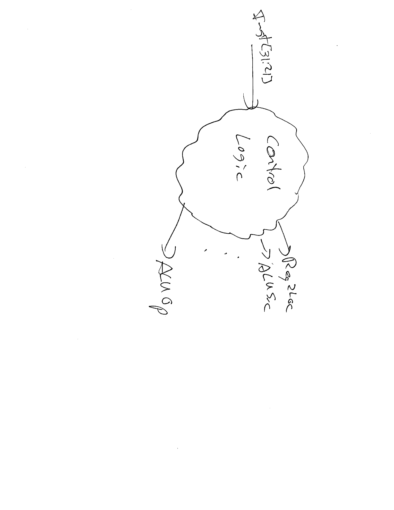
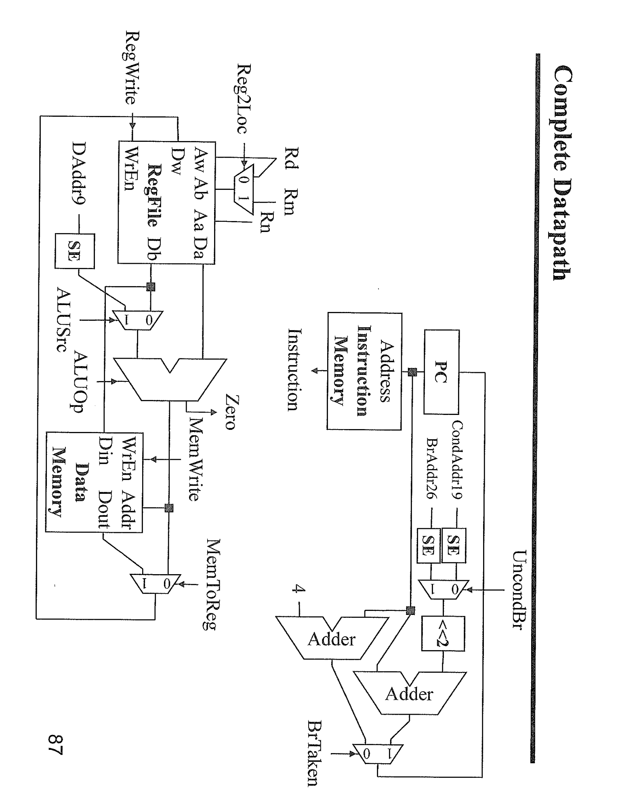

---

## 第 1 页

[media pointer="sediment://file_00000000ac8c61f7b0103eb19a6c6592"]
什么意思？详细解释，中文回答 并且在后面加一项主要归纳你的这次回答，变成一个口语化的表述，内容要覆盖整个截图，格式是[口语化表达] 正文

---

## 第 2 页

[media pointer="sediment://file_000000003de861f7a6061d89a80dc6bb"]
什么意思？详细解释，中文回答 并且在后面加一项主要归纳你的这次回答，变成一个口语化的表述，内容要覆盖整个截图，格式是[口语化表达] 正文

---

## 第 3 页

[media pointer="sediment://file_00000000fbd861f7904435b8a2205545"]
什么意思？详细解释，中文回答 并且在后面加一项主要归纳你的这次回答，变成一个口语化的表述，内容要覆盖整个截图，格式是[口语化表达] 正文

---

## 第 4 页

[media pointer="sediment://file_00000000494061f790499663f3198c7f"]
什么意思？详细解释，中文回答 并且在后面加一项主要归纳你的这次回答，变成一个口语化的表述，内容要覆盖整个截图，格式是[口语化表达] 正文

---

## 第 5 页

这张图展示了 **条件分支指令（Conditional Branch Instruction）** 的 **寄存器传输级（RTL）** 表示，具体来说是 **CBZ** 指令（即“比较寄存器并为零时跳转”指令）。

### 🧩 1. 条件分支指令（CBZ）解释

**CBZ** 指令的格式是 `CBZ Rd, CondAddr19`，它的作用是：

* **CBZ**（Compare and Branch on Zero）：如果 **Rd** 寄存器的值为零，则跳转到 **CondAddr19** 所指定的地址。
* 如果 **Rd** 不为零，则继续执行下一条指令。

### ⚙️ 2. RTL 操作流程

图中的 RTL 过程描述了如何根据 **Rd** 寄存器的值来判断是否进行分支。具体流程如下：

1. **指令获取（Instruction Fetch）**：

* 从 **PC** 获取当前指令。

2. **判断条件（Condition Check）**：

* 判断 **Rd** 寄存器的值是否为零：`Cond = (Reg[Rd] == 0)`。
* 这里，`Reg[Rd]` 表示 **Rd** 寄存器的值。如果该值为零，条件成立，执行跳转操作。

3. **计算跳转地址（Add）**：

* 如果条件成立（即 **Rd** 的值为零），通过加法器计算跳转地址：

* `PC = PC + SignExtend(CondAddr19) << 2`，这里的 **CondAddr19** 是指令中的 19 位偏移量，经过符号扩展（SignExtend）和左移两位后，得到新的跳转地址。
* 如果条件不成立，**PC** 直接加 4，指向下一条指令。

4. **更新 PC（Program Counter）**：

* 如果条件满足，**PC** 更新为计算出的跳转地址。如果不满足，**PC** 保持不变，执行下一条指令。

---

### 🧠 3. 小结

图中展示了 **CBZ** 指令的执行流程：首先判断 **Rd** 寄存器的值是否为零，如果是零，则计算跳转地址并更新 **PC**，否则直接跳到下一条指令。

---

\[口语化表达]
这张图讲解了 **CBZ**（条件跳转指令）的执行过程。如果 **Rd** 寄存器中的值是零，程序就会跳转到指定的地址。如果 **Rd** 不是零，程序就继续执行下一条指令。跳转地址的计算会根据指令中的偏移量进行符号扩展和左移处理，然后更新 **PC**（程序计数器）。

---

## 第 6 页

[media pointer="sediment://file_0000000028a461f79ee1d34985b77dc6"]
什么意思？详细解释，中文回答 并且在后面加一项主要归纳你的这次回答，变成一个口语化的表述，内容要覆盖整个截图，格式是[口语化表达] 正文

---

## 第 7 页

[media pointer="sediment://file_00000000f72061f5a56f182dc4850c04"]
什么意思？详细解释，中文回答 并且在后面加一项主要归纳你的这次回答，变成一个口语化的表述，内容要覆盖整个截图，格式是[口语化表达] 正文

---

## 第 8 页

[media pointer="sediment://file_00000000848861f7a31b812b424eab2f"]
什么意思？详细解释，中文回答 并且在后面加一项主要归纳你的这次回答，变成一个口语化的表述，内容要覆盖整个截图，格式是[口语化表达] 正文

---

## 第 9 页

[media pointer="sediment://file_00000000ab3061f79a066f9f992e5f92"]
什么意思？详细解释，中文回答 并且在后面加一项主要归纳你的这次回答，变成一个口语化的表述，内容要覆盖整个截图，格式是[口语化表达] 正文
