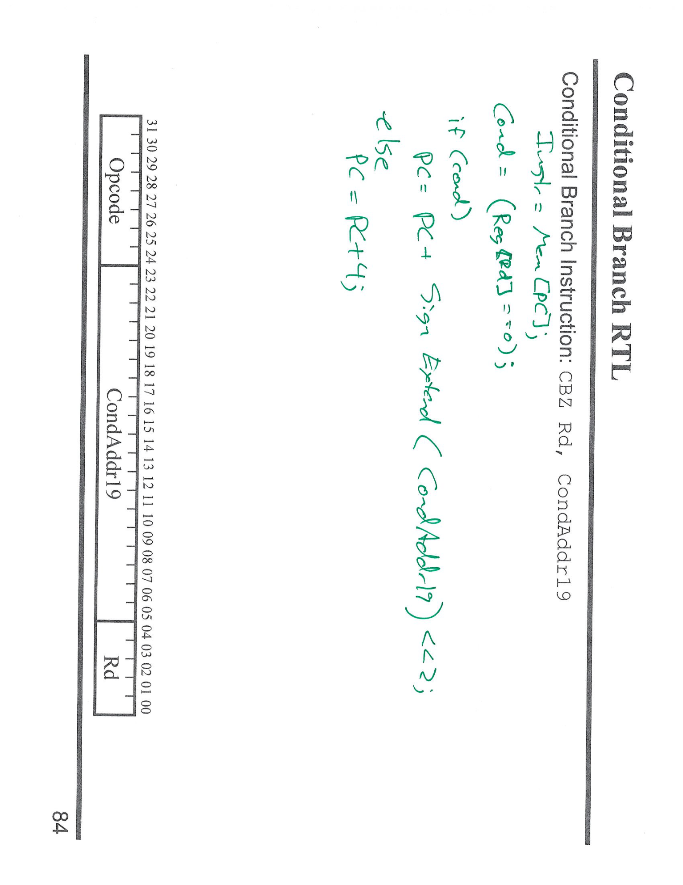

---

## 第 1 页


这道题是**计算机体系结构或数字逻辑设计**中常见的“**立即数符号扩展 (sign extension)**”问题。我们来逐步解释图片中内容。

---

### 🧩 题意分析

题目说：

> Immediate vals for some instructions are sign-extended, while others are not. Build a 16-bit to 64-bit sign-extend unit that can handle both.

意思是：
有些指令的立即数（immediate value）需要**符号扩展（sign-extend）**，而有些不需要。要求我们设计一个电路，把 16 位立即数扩展成 64 位数据，同时能根据不同指令选择是否执行符号扩展。

---

### ⚙️ 电路图解释

图片上红笔画的是一个**符号扩展单元**的大致逻辑。

1. **输入部分（in\[15:0]）**
输入是 16 位的立即数，编号从 in\[15]（最高位）到 in\[0]（最低位）。

2. **输出部分（out\[63:0]）**
输出是 64 位的数据，要么是**符号扩展**版本，要么是\*\*零扩展（zero-extend）\*\*版本。

3. **关键控制信号：SignExt？**
右上角标有 “SignExt?” 的控制信号，决定是否执行符号扩展。

* 若 `SignExt? = 1` → 执行符号扩展
* 若 `SignExt? = 0` → 执行零扩展

4. **符号扩展逻辑**

* 当需要符号扩展时，输出高位（out\[63:16]）的值由 `in[15]` 决定。

* 如果 `in[15] = 1`，表示这个立即数是负数 → 高位全部填充 1
* 如果 `in[15] = 0`，表示是正数 → 高位全部填充 0
* 当不需要符号扩展时，out\[63:16] 全部填充 0。

所以电路上画了一个与门（AND gate）：

```
out[63:16] = (SignExt?) AND in[15]
```

再通过多路复制（replicate）将结果扩展到所有高位。

---

### 🧠 最终逻辑表达式

可以写成：

```
if (SignExt?) then
out[63:16] = {48{in[15]}}   // 符号扩展
else
out[63:16] = 48'b0          // 零扩展
end if

out[15:0] = in[15:0]
```

也可以写成一条 Verilog 表达式：

```verilog
assign out = SignExt ? {{48{in[15]}}, in[15:0]} : {{48{1'b0}}, in[15:0]};
```

---

### 📘 总结

这道题考察的是**符号扩展 vs 零扩展**的概念，以及如何在硬件中根据控制信号动态选择两种扩展方式。

* **符号扩展（Sign-Extend）**：保留符号，负数高位补 1。
* **零扩展（Zero-Extend）**：无符号数，高位补 0。
* **控制信号 SignExt?** 决定使用哪一种扩展。
* 输出位宽从 16 位扩展到 64 位。

---

\[口语化表达]
这题的意思是要做一个小电路，把16位的立即数扩展成64位，有些指令要“保留正负号”（符号扩展），有些不用（零扩展）。
电路的关键是有个控制信号“SignExt?”，如果它是1，就用输入的最高位 in\[15] 去填充高的48位；如果是0，就全补0。最后拼成一个64位的输出。
简单讲，这电路就是在“要不要保留符号”的选择下，把16位扩成64位。


---

## 第 2 页


这张图展示的是**处理器数据通路（Datapath）中用于实现 Store（存储指令）操作的部分电路结构**。图上同时包括了寄存器文件（Register File）、ALU、数据存储器（Data Memory）以及控制信号之间的关系。我们来一步步讲解。

---

### 🧩 一、Store 指令的功能回顾

在一般的处理器（如 ARM 或 MIPS）中，\*\*Store 指令（如 STR 或 SW）\*\*的功能是：

```
Mem[Addr] = R[Rt]
```

也就是：

* 从寄存器取出一个值（要写入内存的内容）；
* 用另一个寄存器的值 + 立即数计算出内存地址；
* 把该数据写到内存中指定地址。

举例：
`STR R2, [R1, #8]`
意思是把寄存器 `R2` 的内容写入内存地址 `(R1 + 8)`。

---

### ⚙️ 二、图中模块详细说明

#### 1. **寄存器文件（RegFile）**

* 输入：

* `Aa`, `Ab` 是两个读地址端，用来读出两个寄存器。
* `Da` 是写入数据端（本题中 Store 指令不会写回寄存器，所以不启用）。
* `Aw` 是写入目标寄存器地址（用于其他类型的指令）。
* 输出：

* `Da`、`Db` 分别是两个读出的寄存器值。
在 Store 指令中：

* `Da` 通常作为**基址寄存器**（例如 R1）；
* `Db` 通常是**要写入内存的数据寄存器**（例如 R2）。

控制信号：

* `RegWrite` = 0，因为 Store 不写回寄存器。

---

#### 2. **多路选择器（MUX: Reg2Loc）**

* 用来选择第二个寄存器编号来源（取决于是 Rn/Rm 还是 Rd）。
* 对 Store 指令，通常选用**Rm 字段**作为第二操作数。

---

#### 3. **符号扩展（SE, Sign Extend）**

* 把指令中的偏移量（例如 9 位或 12 位立即数）扩展成 64 位，用于后续地址计算。

---

#### 4. **ALU 与 ALUSrc 控制**

* ALU 接收两个输入：

* 一个是寄存器值（基址寄存器 `Da`）；
* 另一个由 MUX 选择，可以是：

* 来自寄存器的值；
* 或来自立即数扩展后的偏移（由 `ALUSrc` 控制）。

* 对 Store 指令来说，`ALUSrc = 1`，表示选择立即数（SE输出）作为第二个输入。

* ALU 的输出是**计算出的内存地址**：

```
Addr = Reg[Rn] + SE(Addr9)
```

---

#### 5. **数据存储器（Data Memory）**

* 输入端：

* `Addr`：来自 ALU 的地址；
* `Din`：要写入的数据（寄存器 `Db` 的值）；
* 控制信号：

* `MemWrite = 1` 表示进行写操作（Store 指令）；
* `MemWrite = 0` 表示读操作（Load 指令）。

执行后：

```
Mem[Addr] = Reg[Rm]
```

---

#### 6. **MemToReg 信号**

* 控制是否把内存输出写回寄存器（Load 时用）。
* 对 Store 指令来说，这个信号无效。

---

### 🧠 三、右侧的取指部分（Instruction Memory + PC）

* 右边部分是通用的取指（Fetch）结构：

* PC（程序计数器）输出当前指令地址；
* Instruction Memory 输出对应指令；
* 加法器（Adder）负责生成 PC+4；
* 下一条指令的地址回写到 PC 中。

这个部分对所有指令（包括 Store）都是通用的。

---

### 📘 四、总结整体数据流（Store 指令）

执行顺序如下：

1. 从指令中取出 Rn（基址寄存器）和 Rm（要存储的数据寄存器）。
2. 通过符号扩展单元扩展立即数偏移。
3. ALU 计算出目标地址：`Addr = Reg[Rn] + SE(Addr9)`。
4. 将寄存器 `Rm` 的内容通过数据总线写入内存地址 `Addr`。
5. 控制信号：

* `RegWrite = 0`
* `MemWrite = 1`
* `ALUSrc = 1`
* `MemToReg` 无效
* `Reg2Loc = 1`

---

\[口语化表达]
这张图其实是讲“Store 指令在数据通路里怎么跑的”。当执行 Store 时，处理器会先从寄存器里取两个值：一个是当作内存地址的基址（Rn），另一个是要写进内存的数据（Rm）。偏移量（立即数）要先经过符号扩展，然后 ALU 把它和基址加起来得到真正的内存地址。接着，这个地址和要写的数据一起送到数据存储器里，在控制信号 MemWrite=1 的情况下完成写入。因为 Store 只是写内存不写寄存器，所以 RegWrite=0，MemToReg 也没用。整个过程就是“算地址 → 把寄存器的内容写进内存”。


---

## 第 3 页


这页讲的是**无条件跳转（Branch）指令的 RTL（寄存器传输级）语义与编码格式**。以 AArch64 的 `B` 指令为例（图左上“000101”就是 `B` 的操作码），指令格式如下：

* **\[31:26] = 000101**：操作码，表示无条件分支 `B`
* **\[25:0] = BrAddr26**：26 位带符号位的偏移量字段（branch immediate）

右侧红字给出对应的 RTL：

```
Instr = MEM[PC]                      // 取指
PC    = PC + SignExtend(BrAddr26) << 2
```

逐点解释：

1. **取指**：`Instr = MEM[PC]`，PC 指向当前要执行的指令地址，从指令存储器取出 32 位指令。

2. **分支立即数字段 BrAddr26**：这是 26 位的**有符号**偏移量。之所以要**符号扩展**（SignExtend），是为了既能向前跳（正偏移），也能向后跳（负偏移）。

3. **左移 2 位**：`<< 2` 表示把偏移量乘以 4。原因是 AArch64 指令定长 4 字节，对齐到 4 的倍数，因此偏移单位是“指令字”，不是字节；左移 2 位就把“以指令为单位的偏移”变成“以字节为单位的偏移”。

4. **PC 相对寻址**：`PC = PC + ...` 说明目标地址是**相对当前 PC 的位移**。因此，

```
目标地址 = 当前 PC + 符号扩展(BrAddr26) × 4
```

这样可实现前后方向的近距离跳转。

> 注：某些教材会写成 `PC_next = PC + 4 + (SignExtend(imm)<<2)`，这是把流水线中“取指后 PC 已经加 4”的细节显式写出来。图上的写法把这个细节省略成“相对 PC 的偏移”，本质一致：**“用 PC 相对的带符号偏移（左移 2）来更新 PC”**。

---

### 一句话对照到电路实现

* 指令的 **\[25:0]** 先经过**符号扩展**到 64 位；
* 再**左移 2 位**；
* 与当前 **PC** 通过加法器相加，得到新的 **PC**（分支目标地址）。

---

### 小结要点

* `B` 指令编码：`op = 000101`，偏移字段 `BrAddr26`。
* 计算目标：`PC ← PC + (SignExtend(BrAddr26) << 2)`。
* 左移 2 位是因为指令 4 字节对齐；符号扩展保证能向前/向后跳。
* 这是标准的**PC 相对分支**。

---

\[口语化表达]
这页在说“B 跳转指令怎么编码、怎么算目标地址”。指令高 6 位是 000101 表示 B，后面 26 位是带符号的偏移。执行时先从内存里用 PC 取出指令，然后把这 26 位偏移做**符号扩展**，再**左移两位**（因为一条指令 4 个字节，要按 4 字节对齐），最后把它加到当前 PC 上，新的 PC 就是跳转目标。一句话：**B 指令 = 用 PC 加上‘偏移×4’，偏移是 26 位带符号**。


---

## 第 4 页


这页是把**分支（Branch）指令**接入到单周期数据通路中的整体结构，题头右侧红字也写了它的 RTL 语义：

```
Instr = MEM[PC]
PC    = PC + SignExtend(BrAddr26) << 2
```

图里在“Datapath + Branch”的基础上，给出了取指、PC 更新、以及分支目标地址的生成方式和控制信号。逐块说明如下：

---

## 1) 取指与 PC+4

* 右侧“Instruction Memory”从 **PC** 指定的地址取出一条 32 位指令（Instr）。
* 下面的 **Adder** 负责产生 **PC+4**（因为每条指令 4 字节，顺序执行时 PC 每次加 4）。

## 2) 分支偏移生成：SignExtend 与 <<2

* 指令的低 26 位字段 **BrAddr26**（图右侧标注）先经过**符号扩展**（SignExtend）到 64 位，
* 再**左移 2 位**（`<<2`，把“以指令为单位”的偏移变成“字节偏移”，保证 4 字节对齐）。
* 这个偏移量与当前 PC（或 PC+4，取决于教材约定）经加法器相加，得到**分支目标地址**。

> 图右侧画的是：BrAddr26 → SE → <<2 → 加到 PC（通过加法器）→ 得到 Branch Target。

## 3) 选择下一个 PC：是否“分支成立”

* 箭头标注 **B\_taken**（或 Branch）是控制信号：

* **1**：选择**分支目标地址**作为新的 PC；
* **0**：选择**PC+4**（顺序执行）。
* 这个选择由一个 \*\*MUX（多路选择器）\*\*实现，MUX 的输出送回 **PC 寄存器**。

## 4) 左侧通用数据通路（RegFile / ALU / Data Memory）

* **RegFile（寄存器文件）**：有两个读口（Aa/Ab→Da/Db），一个写口（Aw/Dw，受 **RegWrite** 控制）。
* **ALU** 及其输入选择：

* **ALUSrc** 控制第二操作数来自寄存器还是立即数（SE 输出）。
* **ALUOp** 指明 ALU 执行的具体运算。
* **Data Memory（数据存储器）**：

* **MemWrite** 控制写内存；**MemToReg** 控制读内存结果是否回写寄存器。
* **Reg2Loc**：决定指令中第二个源寄存器字段取自哪里（不同指令编码复用字段时使用）。

> **对 Branch 指令本身**：
>
> * 不读/写数据存储器：`MemWrite = 0`；
> * 不把内存数据写回寄存器：`MemToReg` 无关；
> * 不写寄存器：`RegWrite = 0`；
> * 一般也不会使用 ALU 主数据通路做运算（分支只改 PC），ALU/Reg2Loc/ALUSrc 对本指令无关键作用。
> * **关键是分支控制信号 B\_taken 和 PC 的选择器**。

## 5) 时序（图上绿色“clock”标注）

* PC、寄存器文件写口（RegFile 的 **WE**）、数据存储器写入等，都是**在时钟沿**受控更新的。
* 也就是：在时钟到来时，若控制允许，PC 取 MUX 结果更新；寄存器/内存写端口在 **WE=1** 时执行写入。

---

## 6) 小结：分支在数据通路中的路径

1. 用 PC 从指令存储器取指。
2. 把指令中的 **BrAddr26** 做 **符号扩展**，再 **左移 2**。
3. 与 PC 经加法器相加，得到 **分支目标地址**。
4. MUX 在 **B\_taken**=1 时选目标地址，否则选 **PC+4**，把选中的值写回 **PC**。
5. 其他与 Load/Store/ALU 相关的写回、访存控制在分支指令中关闭。

---

\[口语化表达]
这页就是把“跳转怎么接进数据通路”画给你看：先用 PC 去取指；同时把指令里的 26 位偏移拿出来，做符号扩展再左移两位（因为指令 4 字节对齐），和 PC 一加就是跳转目标。然后用一个开关（MUX）在“跳还是不跳”之间选：不跳就用 PC+4，跳就用刚算出来的目标地址，最后在时钟来时把这个结果写进 PC。对分支指令来说，其它像写寄存器、写内存的控制信号基本都关掉，重点就是**算偏移 + 选下一个 PC**。


---

## 第 5 页



这页是把**分支（Branch）指令**接入到单周期数据通路中的整体结构，题头右侧红字也写了它的 RTL 语义：

```
Instr = MEM[PC]
PC    = PC + SignExtend(BrAddr26) << 2
```

图里在“Datapath + Branch”的基础上，给出了取指、PC 更新、以及分支目标地址的生成方式和控制信号。逐块说明如下：

---

## 1) 取指与 PC+4

* 右侧“Instruction Memory”从 **PC** 指定的地址取出一条 32 位指令（Instr）。
* 下面的 **Adder** 负责产生 **PC+4**（因为每条指令 4 字节，顺序执行时 PC 每次加 4）。

## 2) 分支偏移生成：SignExtend 与 <<2

* 指令的低 26 位字段 **BrAddr26**（图右侧标注）先经过**符号扩展**（SignExtend）到 64 位，
* 再**左移 2 位**（`<<2`，把“以指令为单位”的偏移变成“字节偏移”，保证 4 字节对齐）。
* 这个偏移量与当前 PC（或 PC+4，取决于教材约定）经加法器相加，得到**分支目标地址**。

> 图右侧画的是：BrAddr26 → SE → <<2 → 加到 PC（通过加法器）→ 得到 Branch Target。

## 3) 选择下一个 PC：是否“分支成立”

* 箭头标注 **B\_taken**（或 Branch）是控制信号：

* **1**：选择**分支目标地址**作为新的 PC；
* **0**：选择**PC+4**（顺序执行）。
* 这个选择由一个 \*\*MUX（多路选择器）\*\*实现，MUX 的输出送回 **PC 寄存器**。

## 4) 左侧通用数据通路（RegFile / ALU / Data Memory）

* **RegFile（寄存器文件）**：有两个读口（Aa/Ab→Da/Db），一个写口（Aw/Dw，受 **RegWrite** 控制）。
* **ALU** 及其输入选择：

* **ALUSrc** 控制第二操作数来自寄存器还是立即数（SE 输出）。
* **ALUOp** 指明 ALU 执行的具体运算。
* **Data Memory（数据存储器）**：

* **MemWrite** 控制写内存；**MemToReg** 控制读内存结果是否回写寄存器。
* **Reg2Loc**：决定指令中第二个源寄存器字段取自哪里（不同指令编码复用字段时使用）。

> **对 Branch 指令本身**：
>
> * 不读/写数据存储器：`MemWrite = 0`；
> * 不把内存数据写回寄存器：`MemToReg` 无关；
> * 不写寄存器：`RegWrite = 0`；
> * 一般也不会使用 ALU 主数据通路做运算（分支只改 PC），ALU/Reg2Loc/ALUSrc 对本指令无关键作用。
> * **关键是分支控制信号 B\_taken 和 PC 的选择器**。

## 5) 时序（图上绿色“clock”标注）

* PC、寄存器文件写口（RegFile 的 **WE**）、数据存储器写入等，都是**在时钟沿**受控更新的。
* 也就是：在时钟到来时，若控制允许，PC 取 MUX 结果更新；寄存器/内存写端口在 **WE=1** 时执行写入。

---

## 6) 小结：分支在数据通路中的路径

1. 用 PC 从指令存储器取指。
2. 把指令中的 **BrAddr26** 做 **符号扩展**，再 **左移 2**。
3. 与 PC 经加法器相加，得到 **分支目标地址**。
4. MUX 在 **B\_taken**=1 时选目标地址，否则选 **PC+4**，把选中的值写回 **PC**。
5. 其他与 Load/Store/ALU 相关的写回、访存控制在分支指令中关闭。

---

\[口语化表达]
这页就是把“跳转怎么接进数据通路”画给你看：先用 PC 去取指；同时把指令里的 26 位偏移拿出来，做符号扩展再左移两位（因为指令 4 字节对齐），和 PC 一加就是跳转目标。然后用一个开关（MUX）在“跳还是不跳”之间选：不跳就用 PC+4，跳就用刚算出来的目标地址，最后在时钟来时把这个结果写进 PC。对分支指令来说，其它像写寄存器、写内存的控制信号基本都关掉，重点就是**算偏移 + 选下一个 PC**。


---

## 第 6 页


这两页讲的是**条件分支（Conditional Branch）**，以 AArch64 的 **CBZ Rd, CondAddr19** 为例：当寄存器 `Rd` 的值为 0 时跳转，否则顺序执行。第一页给出 **RTL（寄存器传输级）** 语义与指令编码；第二页展示把“条件分支”接进数据通路后的整体走向与控制信号。

---

## 1) 指令格式与 RTL 语义（第 1 张图）

* **字段**

* `Opcode`：操作码，标识该指令是 **CBZ**（比较为零就分支）。
* `Rd`：要检测是否为零的寄存器编号。
* `CondAddr19`：19 位**带符号**的分支偏移立即数。

* **执行语义（图右侧绿字）**

```text
Instr = MEM[PC]                             // 取指
Cond  = (Reg[Rd] == 0)                      // 条件生成
if (Cond)
PC = PC + SignExtend(CondAddr19) << 2   // 成立：PC 相对跳转
else
PC = PC + 4                             // 不成立：顺序执行
```

解释：

* `CondAddr19` 是以“指令字”为单位的位移，所以**左移 2 位**（×4）变成字节偏移；
* 由于是**带符号偏移**，需要 **SignExtend**，这样既能前跳也能后跳；
* 不跳时照常 `PC+4`。

---

## 2) 接入数据通路（第 2 张图）

右图把 **CBZ** 的数据与控制走向画进单周期数据通路：

### 分支目标地址生成（右半部分）

1. 从指令中取出 **CondAddr19** → **SE（符号扩展）** → **<<2**；
2. 与 **PC**（或教材定义的 PC+4）经过加法器相加，得到**分支目标地址**；
3. 用一个 **MUX** 在“目标地址”和“PC+4”之间选择；
4. 选择信号是 **B\_taken**（是否分支）。

### 条件判定（左半部分）

* 从寄存器文件 **RegFile** 读出 **Rd** 的值；
* 经过**零检测**（Zero/==0 比较器）：输出 1 表示为 0；
* 这个零检测结果作为 **B\_taken** 送到右侧 MUX，决定是否跳转。

> 零检测可以用**或归约+取反**实现：`Zero = ~(OR-reduction of Rd)`。

### 其他控制信号（分支指令时的典型取值）

* `RegWrite = 0`（CBZ 不写寄存器）；
* `MemWrite = 0`、`MemToReg` 无关；
* `ALUOp/ALUSrc/Reg2Loc` 对 CBZ 本身不关键（CBZ 只读 Rd 做零判定，不做算术/访存）；
* **关键信号**是：`B_taken`（零检测结果）、以及右侧的分支立即数路径 `SE + <<2` 和 PC 选择 MUX。

---

## 3) 与无条件分支 B 的对比

* **B** 使用 **26 位**偏移（`BrAddr26`），直接无条件跳；
* **CBZ** 使用 **19 位**偏移（`CondAddr19`），并且**先看 Rd 是否为 0** 再决定跳不跳。
* 两者都要 **符号扩展** 并 **左移 2**，只是 B 的“是否跳转”恒为真，而 CBZ 由零检测决定。

---

## 4) 执行流程小结

1. 取指 `Instr = MEM[PC]`；
2. 从寄存器文件读 `Rd`，做零检测，得到 `B_taken`；
3. 从指令取 `CondAddr19` → `SE` → `<<2`，与 PC 相加得目标地址；
4. `B_taken=1` 选目标地址写回 PC，否则选 `PC+4`。

---

\[口语化表达]
这俩页就是在说“**CBZ** 怎么工作、数据在通路里怎么走”。先用 PC 取出指令，把寄存器 **Rd** 的值拿出来看看是不是 0；如果是 0，就把指令里的 19 位偏移量先做**符号扩展**再**左移两位**（因为指令是 4 字节对齐），加到当前 PC 上当作新 PC；如果不是 0，就老老实实走 `PC+4`。在电路里，就是：左边读 Rd 做个“是不是零”的判定，结果变成 **B\_taken**；右边把偏移 `SE` 后左移 2，和 PC 相加；最后一个开关（MUX）在“分支目标”和“PC+4”之间选，`B_taken` 是开关手。其他像写寄存器、写内存的控制信号对 CBZ 都关着。


---

## 第 7 页


这页标题是 **Control（控制）**，意思是：在处理器的**数据通路（datapath）**已经画好之后，下一步要做的是**找出所有需要被“控制信号”驱动的地方**，并且**根据每条指令的 RTL 语义**，给这些控制点分配恰当的取值。页面右侧的项目其实在列举“有哪些地方需要控制”以及“如何确定控制位”。

---

## 这页在讲哪些控制点？

1. **Instruction Fetch Unit（取指单元）**

* 需要控制：PC 的写使能、PC 的来源选择（PC+4、分支目标、跳转目标等）。
* 举例控制信号：`PCWrite`、`PCSrc`（选择哪个地址送入 PC）。

2. **ALU**

* 需要控制：ALU 做什么运算，以及第二操作数来自哪里。
* 常见控制信号：

* `ALUOp`（加、减、与、或、比较等的编码），
* `ALUSrc`（选择寄存器值还是立即数/扩展后的偏移）。

3. **Memories（存储器：指令/数据存储器）**

* 需要控制：是否读/写数据存储器，写入数据和地址来自哪里。
* 常见控制信号：`MemRead`、`MemWrite`、`MemToReg`（把内存读出的数据是否写回寄存器）。

4. **Datapath muxes（数据通路中的多路选择器）**

* 需要控制：寄存器地址来源（如 `Reg2Loc`）、写回数据来源（ALU 结果或内存读数）、下一个 PC 来源等。
* 这些 MUX 的选择位本质上都是“控制点”。

5. **Etc.（其他）**

* 例如寄存器文件写使能 `RegWrite`、立即数**符号/零扩展**选择、移位使能、条件分支的 `BranchTaken` 等等。

---

## 如何给这些控制点“按指令赋值”？

页底那句 **“Use RTL for determine per-instruction control assignments”** 的意思是：
**先写出每条指令的 RTL（寄存器传输级）描述**，再据此**倒推**每个控制信号应取的值。

* 例如：

* **Load（LDR）** 的 RTL 有“内存读→写回寄存器”，因此需要：`MemRead=1`、`MemToReg=1`、`RegWrite=1`、`ALUSrc=1`（用立即数算地址）等；
* **Store（STR）** 的 RTL 有“寄存器数据写入内存”，因此：`MemWrite=1`、`RegWrite=0`、`ALUSrc=1`；
* **无条件分支（B）**：只更新 PC，`PCSrc=BranchTarget`，`RegWrite=0`、`MemRead/Write=0`；
* **CBZ**：先零检测，若真则 `PCSrc=BranchTarget` 否则 `PCSrc=PC+4`，其余与写回/访存无关。

用这种方式，你最终会得到一张**控制信号真值表**（或“控制矩阵”）：行是“指令类型”，列是“控制信号”，表格内是该指令对每个控制位的取值。

---

## 这页的 takeaway

* 明确**所有需要被控制的地方**（PC/取指、ALU、存储器、各类 MUX、寄存器文件等）。
* **用 RTL 反推**每条指令所需的控制信号组合，形成**指令 → 控制位**的映射。
* 这就是从“数据通路”走向“控制器设计”的关键步骤。

---

\[口语化表达]
这页在提醒你：先把 CPU 的管线/数据通路画好，然后把所有要“打开开关、选通路、定动作”的地方找出来——比如 PC 选哪条路、ALU干啥、内存要不要读写、各种多路选择器选哪一路、寄存器要不要写。接着，用每条指令的 RTL 描述来倒推这些开关应该怎么拨：LDR 要读内存再写回寄存器，STR 要把寄存器的值写进内存，B/CBZ 要改 PC……最后就能整理出一张表，指令来了就按表给控制位赋值，机器就按预期跑了。


---

## 第 8 页


这张图画的是处理器控制单元（**Control Logic**）的结构逻辑框架。虽然图很简略，但它表达了控制信号是如何被生成并分配给数据通路各个部分的。我们来一步步解释。

---

## 🧩 图中结构解读

1. **上方输入：`Instr[31:21]`（Instruction bits）**

* 这是来自指令寄存器（Instruction Register）的**操作码字段**。
* 控制逻辑的输入是指令的高位编码（通常是第 31\~21 位），因为这些位标识了指令的类型（比如 `ADD`, `SUB`, `LDUR`, `STUR`, `B`, `CBZ` 等）。
* 控制逻辑根据这些比特来判断当前指令是哪一类，并输出相应的控制信号。

2. **中心部分：`Control Logic`（控制逻辑）**

* 它是一个组合逻辑模块（没有寄存器），根据指令的操作码生成控制信号。
* 可以用真值表或查找表（decode logic）实现。
* 对应前几页讲的“**用 RTL 推导控制信号**”那一步。
* 每个输出控制信号都对应数据通路某处的开关或控制点。

3. **下方输出：`ALUOp`**

* 控制 ALU 执行哪种操作（例如加法、减法、比较、逻辑运算）。
* 对于不同的指令，`ALUOp` 的编码不同：

* `ADD` → 00（加）
* `SUB` → 01（减）
* `AND` → 10（与）
* `ORR` → 11（或）
* 这个信号会送到 ALU 控制单元（ALU Control）进一步细分。

4. **右侧输出：`Reg2Loc`、`ALUSrc`、……**

* `Reg2Loc`：控制寄存器文件读口地址来自指令的哪个字段。
例如在某些指令格式里，第二个操作数寄存器可能是 `Rm`，而在其他格式里可能是 `Rt`。
这个信号决定多路选择器选哪一条线。
* `ALUSrc`：控制 ALU 第二个输入来自寄存器还是立即数（或扩展偏移）。
Load/Store 用立即数地址（`ALUSrc=1`）；R 型算术指令用寄存器值（`ALUSrc=0`）。
* 还有其他未写出的信号，如 `RegWrite`, `MemWrite`, `MemToReg`, `Branch`, `Zero`, `PCSrc` 等，都由这个控制逻辑生成。

---

## 🔁 整体工作流程总结

1. 指令的高位比特（操作码）被送进控制逻辑；
2. 控制逻辑根据该操作码**解码**出是哪种指令；
3. 对应指令类型，生成一组控制信号；
4. 这些控制信号去“驱动”数据通路的各个部分（寄存器文件、ALU、存储器、多路选择器等），让电路执行相应的 RTL 操作。

---

## 📘 这页要表达的核心思想

这张图是“控制单元”的抽象模型：

> **输入是指令（特别是操作码字段），输出是所有控制信号。**
> 控制逻辑的任务就是“解码指令 → 控制数据流动”，确保数据通路完成正确的操作。

---

\[口语化表达]
这张图其实就是在告诉你“CPU 的控制单元是怎么干活的”。指令进来后，控制逻辑先看高位那几位（就是操作码），判断这条指令是加法、存储、跳转还是什么。然后它就根据这个判断，发出一堆控制信号——比如告诉 ALU 要干啥（加、减、或）、告诉寄存器要读哪两个、告诉内存要不要写、还有 ALU 的输入是来自寄存器还是立即数。简单说，这个模块就是\*\*“大脑”\*\*：看懂指令，再指挥下面的数据通路去动。


---

## 第 9 页


这两页合在一起体现了：**控制单元（Control Logic）根据指令编码产生控制信号 → 驱动“完整数据通路（Complete Datapath）”执行不同类型的指令**。第一张是控制单元的抽象框架，第二张是把所有之前画过的部件（寄存器文件、ALU、数据存储器、PC/分支路径等）拼到一起的单周期数据通路。

---

## ① 控制单元（左图）

* **输入**：`Instr[31:21]` —— 指令高位的操作码字段。控制逻辑用它来**解码**当前是哪类指令（R 型算术、Load/Store、无条件分支 B、条件分支 CBZ/CBNZ …）。
* **输出（部分列举）**：

* `ALUOp`：告诉 ALU 做加/减/与/或/比较等哪种运算（或给“ALU 控制器”进一步译码）。
* `ALUSrc`：ALU 的第二个操作数选寄存器还是“立即数/扩展偏移”（1=立即数；0=寄存器）。
* `Reg2Loc`：寄存器文件的第二个读地址来自指令中的哪个字段（不同指令复用位段时需要）。
* 还会产生 `RegWrite`（寄存器写使能）、`MemWrite`、`MemToReg`、`Branch`/`BrTaken`（是否分支）等信号。
* **作用**：把“指令的语义（RTL）”翻译为“控制位组合”，去驱动数据通路中的 MUX/寄存器/存储器/ALU。

---

## ② 完整数据通路（右图）

图中把之前的模块全部接起来，并把无条件与条件分支的路径合并到 PC 更新路径中。

### A. 左半：通用执行/访存路径

* **RegFile（寄存器文件）**：两个读口（`Aa/Ab → Da/Db`），一个写口（`Aw/Dw`），受 `RegWrite` 控制。
* **ALU 与输入选择**：

* `ALUSrc` 选择第二输入：寄存器（R 型）或 SE(立即数/偏移)（Load/Store）。
* `ALUOp` 决定运算类型（算术/逻辑/比较等）。
* **Zero**：ALU 的零标志或专用零检测输出，供条件分支使用（如 CBZ 判断 Rd==0）。
* **数据存储器（Data Memory）**：

* 地址来自 ALU 结果；
* `MemWrite=1` 时写入（Store），`MemWrite=0` 时只读（Load）；
* `MemToReg` 选择寄存器写回数据是 ALU 结果还是内存读数。

### B. 右半：取指与分支/PC 更新

* **取指**：`PC` → 指令存储器 → 取出 `Instruction`；下方加法器产生 `PC+4`。
* **两种分支立即数共线整合**：

* `BrAddr26`（无条件分支 B 的 26 位偏移）和 `CondAddr19`（条件分支 CBZ 的 19 位偏移）分别**符号扩展（SE）**。
* 通过一个 MUX（图中标注 `UncondBr`）选择是“无条件分支的偏移”还是“条件分支的偏移”送入后级。
* 统一再 **<<2**（乘 4；指令 4 字节对齐），与当前 PC 相加得到**分支目标地址**。
* **是否采用分支目标**：

* 另一个 MUX 在“PC+4”和“分支目标地址”之间选择。
* 选择信号是 **BrTaken**：

* 对 **B**：始终为 1（或由 `UncondBr` 直接驱动），因此一定跳。
* 对 **CBZ/CBNZ**：来自零检测（`Zero`）与指令类型的组合（如 CBZ 取 `Zero`，CBNZ 取 `!Zero`）。
* **PC 更新**：在时钟沿，PC 取该 MUX 的输出。

### C. 各指令类型的典型控制组合（示例）

* **R 型算术（ADD/SUB/AND/ORR…）**：`RegWrite=1, ALUSrc=0, MemWrite=0, MemToReg=0, BrTaken=0, ALUOp=对应运算`
* **Load（LDR）**：`RegWrite=1, MemToReg=1, MemWrite=0, ALUSrc=1（用偏移算地址）, ALUOp=ADD, BrTaken=0`
* **Store（STR）**：`RegWrite=0, MemWrite=1, ALUSrc=1, ALUOp=ADD, BrTaken=0`
* **无条件分支（B）**：`RegWrite=0, MemWrite=0, UncondBr=1, BrTaken=1`
* **条件分支（CBZ/CBNZ）**：`RegWrite=0, MemWrite=0, UncondBr=0, BrTaken=Zero/!Zero`

---

## ③ 整体工作流程（一次取指到写回）

1. **取指**：`Instr = MEM[PC]`，并得到 `PC+4`
2. **控制解码**：`Instr[31:21] → Control Logic` 产生各控制信号
3. **执行**：ALU 完成地址或算术运算；必要时做 `Zero` 判定
4. **访存/写回**：按 `MemWrite`/`MemToReg`/`RegWrite` 执行内存写/读与寄存器写回
5. **更新 PC**：按 `BrTaken` 选 `PC+4` 或分支目标（SE/<<2/加法器所得）

---

\[口语化表达]
这两页想告诉你：CPU 里有个“指挥部”——**控制逻辑**。它看一眼指令高几位（操作码），就知道这条指令要干嘛，然后把一堆开关拧到合适的位置：ALU 做什么、第二个操作数用寄存器还是立即数、寄存器要不要写、内存要不要读写、PC 要不要跳。右边那张“完整数据通路”就是所有线都接齐的版本：左边负责算和访存，右边负责取指和改 PC。跳转时，把指令里的偏移先符号扩展再左移两位（因为指令 4 字节），加到 PC 上就是目标地址；对 B 直接跳，对 CBZ/CBNZ 要先看寄存器是不是 0，再决定跳不跳。不同指令来的时候，控制逻辑给出不同的控制位组合，整台机器就按预期流转：取指 → 解码 → 执行/访存 → 写回 → 更新 PC。
