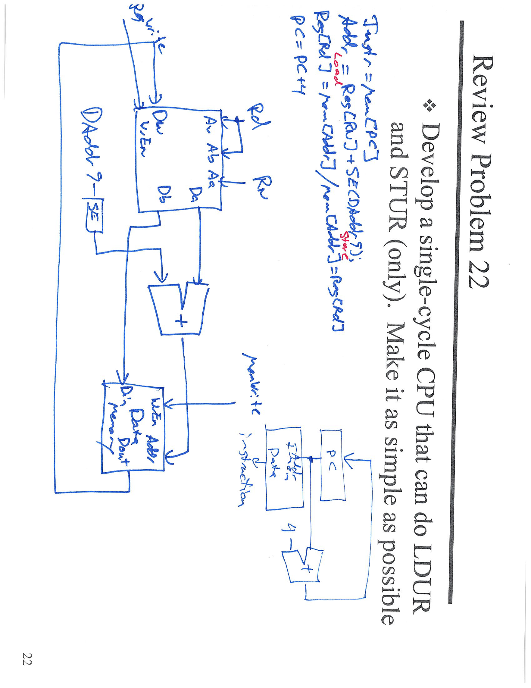
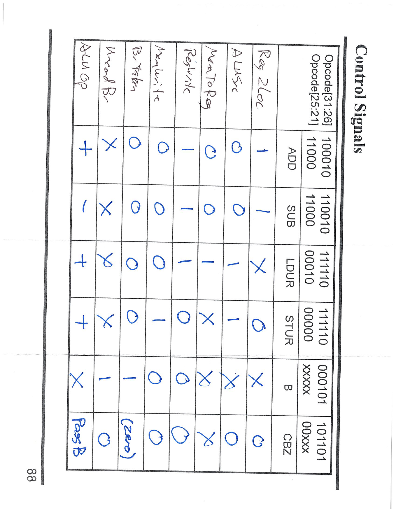
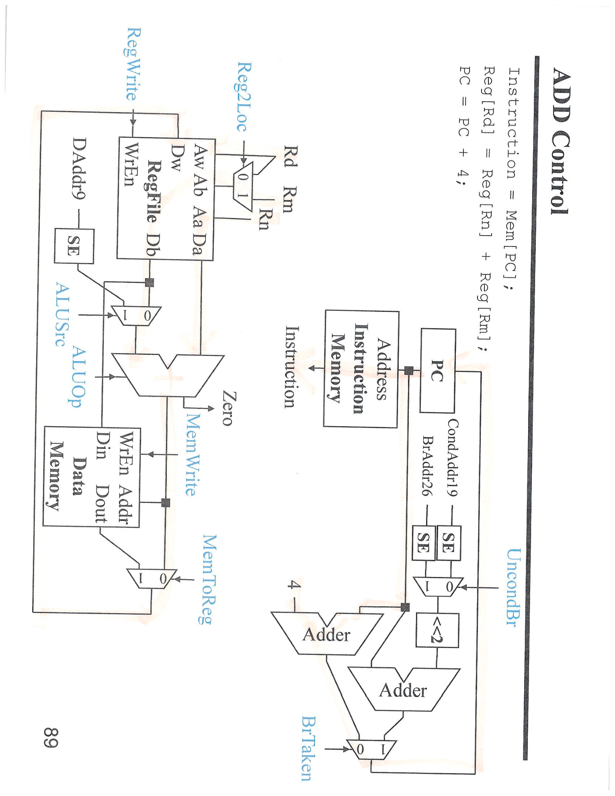
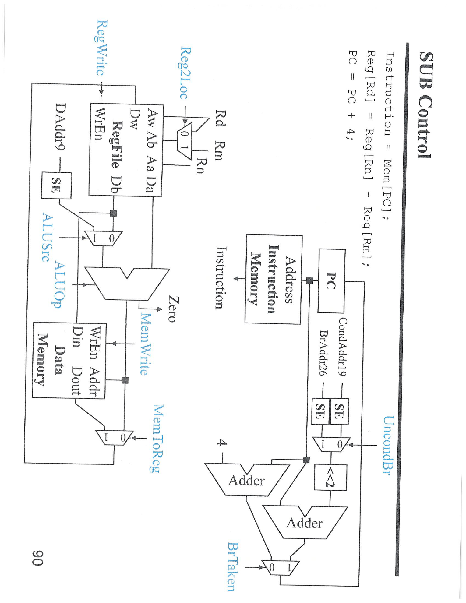
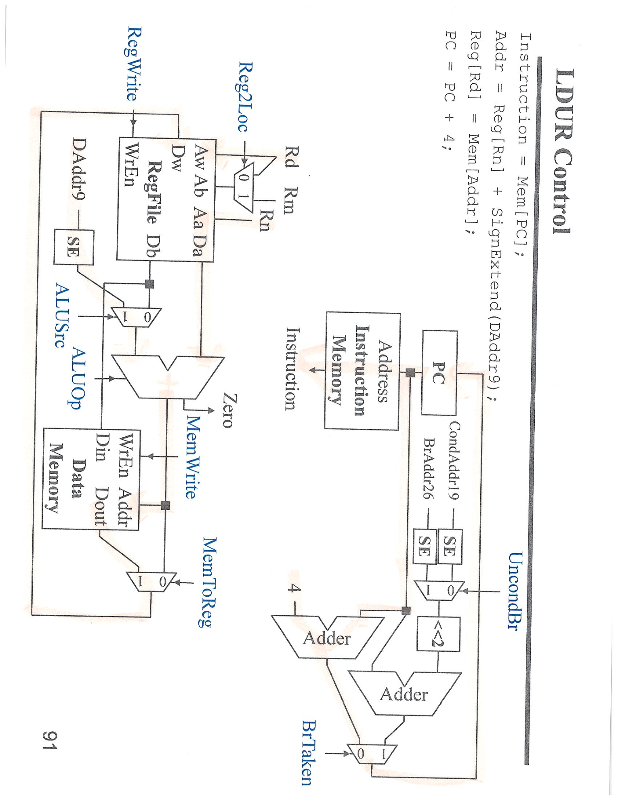
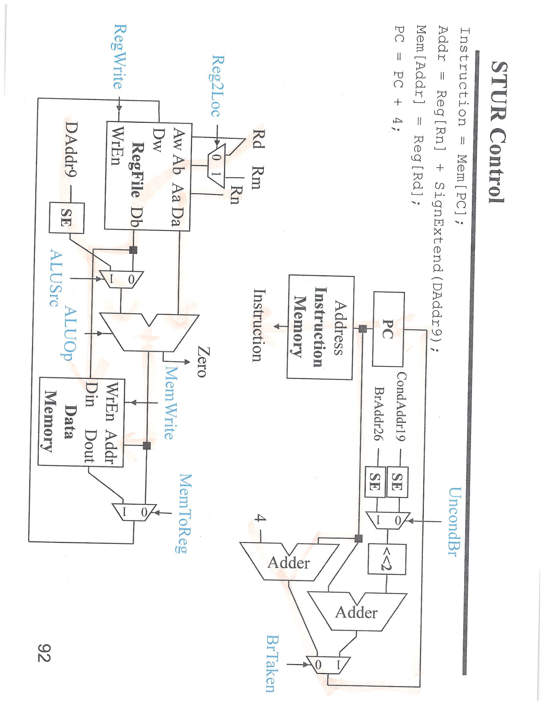

---

## 第 1 页

[media pointer="sediment://file_00000000c07861f783fc5daa67572136"]
什么意思？详细解释，中文回答 并且在后面加一项主要归纳你的这次回答，变成一个口语化的表述，内容要覆盖整个截图，格式是[口语化表达] 正文

---

## 第 2 页

[media pointer="sediment://file_00000000f87461f59db5c5dcd165c3cd"]
什么意思？详细解释，中文回答 并且在后面加一项主要归纳你的这次回答，变成一个口语化的表述，内容要覆盖整个截图，格式是[口语化表达] 正文

---

## 第 3 页

[media pointer="sediment://file_000000001c0461f59dac56951aa89c6d"]
什么意思？详细解释，中文回答 并且在后面加一项主要归纳你的这次回答，变成一个口语化的表述，内容要覆盖整个截图，格式是[口语化表达] 正文

---

## 第 4 页

[media pointer="sediment://file_0000000023a061f79e7af2ca7e7fde34"]
什么意思？详细解释，中文回答 并且在后面加一项主要归纳你的这次回答，变成一个口语化的表述，内容要覆盖整个截图，格式是[口语化表达] 正文

---

## 第 5 页

这页图解释了 LDUR（加载指令） 在 CPU 中的控制信号和数据流。右上角的指令语义是：
Reg[Rd] = Mem[Addr];
PC = PC + 4;
这表示将内存中 Addr 地址的内容加载到 Rd 寄存器中，同时 PC 递增到下一条指令的地址。
执行流程（配合图中的数据通路）
取指：
PC 从程序计数器（Program Counter）取指令，指令存储器获取 Mem[PC]，并将 PC 加 4（表示顺序执行下一条指令）。
计算地址：
SE（符号扩展）模块将 DAddr[9:0] 的地址进行符号扩展；
ALU 执行加法，计算 Mem[Addr] 地址（Reg[Rn] + SignExtend(DAddr)）；
ALUOp 和 ALUSrc 确保 ALU 计算得到正确的地址。
数据存储器：
内存地址计算结果通过 Addr 写入数据存储器（Data Memory）。MemWrite = 0，表示这是一个读取操作。
数据存储器返回的内容，通过 MemToReg 传递到寄存器。
写回：
结果通过 MemToReg = 1 写回寄存器堆 RegFile 中的 Rd 寄存器。
RegWrite = 1，允许将结果写回寄存器。
顺序到下一条：
UncondBr = 0，BrTaken = 0 表示没有发生跳转。
PC 递增 4（PC = PC + 4），准备取下条指令。
控制信号总结
MemWrite = 0（不写数据存储器）
RegWrite = 1（写寄存器 Rd）
MemToReg = 1（从内存读取数据并写回寄存器）
ALUSrc = 1（ALU 第二个操作数来自立即数）
ALUOp = ADD（ALU 执行加法，计算地址）
Reg2Loc = 0（Rn 寄存器作为源寄存器）
UncondBr = 0, BrTaken = 0（不跳转）
口语化总结
这页讲的是 LDUR（加载指令） 的操作。首先，CPU 通过 PC 取指，把指令存到内存；然后通过符号扩展和加法算出内存地址。接着，CPU 从内存中读取数据，存到寄存器 Rd 里。整个过程没有跳转，PC 按顺序走。关键的控制信号包括：让 CPU 读取内存，并把数据写回寄存器。

---

## 第 6 页

这页图解释了 **LDUR（加载指令）** 在 CPU 中的控制信号和数据流。右上角的指令语义是：

> `Reg[Rd] = Mem[Addr];`
> `PC = PC + 4;`

这表示将内存中 `Addr` 地址的内容加载到 `Rd` 寄存器中，同时 PC 递增到下一条指令的地址。

---

## 执行流程（配合图中的数据通路）

1. **取指**：

* **PC** 从程序计数器（Program Counter）取指令，指令存储器获取 `Mem[PC]`，并将 PC 加 4（表示顺序执行下一条指令）。

2. **计算地址**：

* **SE**（符号扩展）模块将 `DAddr[9:0]` 的地址进行符号扩展；
* **ALU** 执行加法，计算 `Mem[Addr]` 地址（`Reg[Rn] + SignExtend(DAddr)`）；
* **ALUOp** 和 **ALUSrc** 确保 ALU 计算得到正确的地址。

3. **数据存储器**：

* 内存地址计算结果通过 `Addr` 写入数据存储器（Data Memory）。**MemWrite = 0**，表示这是一个读取操作。
* 数据存储器返回的内容，通过 **MemToReg** 传递到寄存器。

4. **写回**：

* 结果通过 **MemToReg = 1** 写回寄存器堆 **RegFile** 中的 `Rd` 寄存器。
* **RegWrite = 1**，允许将结果写回寄存器。

5. **顺序到下一条**：

* **UncondBr = 0**，**BrTaken = 0** 表示没有发生跳转。
* PC 递增 4（`PC = PC + 4`），准备取下条指令。

---

## 控制信号总结

* **MemWrite = 0**（不写数据存储器）
* **RegWrite = 1**（写寄存器 `Rd`）
* **MemToReg = 1**（从内存读取数据并写回寄存器）
* **ALUSrc = 1**（ALU 第二个操作数来自立即数）
* **ALUOp = ADD**（ALU 执行加法，计算地址）
* **Reg2Loc = 0**（`Rn` 寄存器作为源寄存器）
* **UncondBr = 0**, **BrTaken = 0**（不跳转）

---

## 口语化总结

这页讲的是 **LDUR（加载指令）** 的操作。首先，CPU 通过 PC 取指，把指令存到内存；然后通过符号扩展和加法算出内存地址。接着，CPU 从内存中读取数据，存到寄存器 `Rd` 里。整个过程没有跳转，PC 按顺序走。关键的控制信号包括：让 CPU 读取内存，并把数据写回寄存器。
