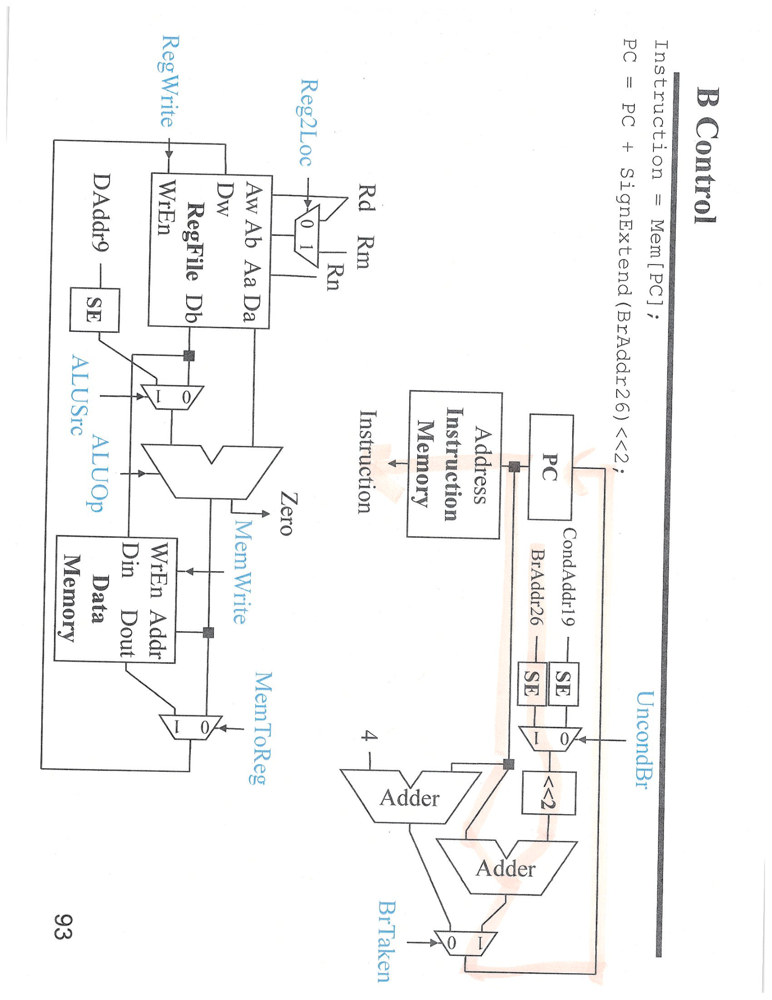
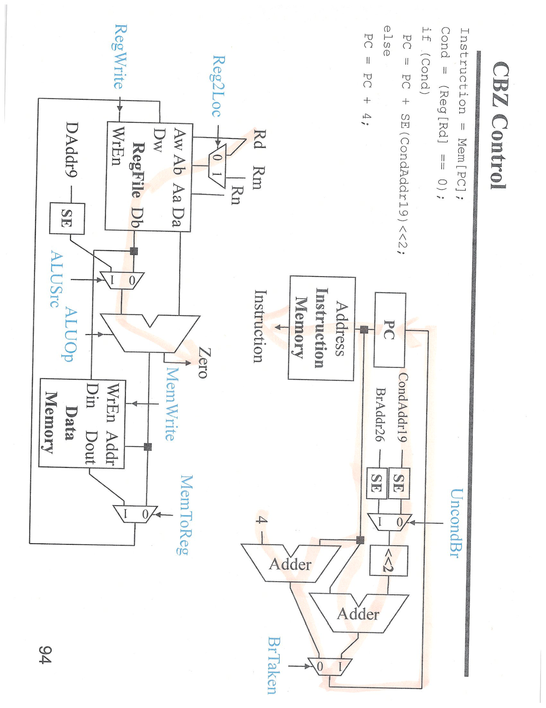
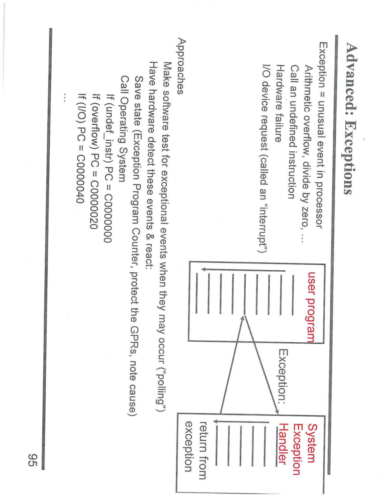

---

## 第 1 页


这张图展示的是一个**只支持 LDUR（Load Register Unsigned）和 STUR（Store Register Unsigned）两条指令**的**单周期 CPU（Single-Cycle CPU）设计示意图**。它要求“尽可能简单”，所以省略了分支、算术逻辑运算等复杂模块，只保留最基础的取数、访存、寄存器和地址计算部分。

---

## 🧩 一、整体思路

这是一个非常简化的单周期 CPU，核心功能是：

* 能**从内存取数（LDUR）**；
* 能**向内存写数（STUR）**；
* 每条指令都在一个时钟周期内完成。

程序计数器（PC）每次增加 4，表示指令按字节顺序依次执行（每条指令占 4 字节）。

---

## ⚙️ 二、数据通路（Datapath）分析

图中从左到右的模块代表执行顺序：

1. **PC（Program Counter）**

* 存储当前指令的地址；
* 每个周期更新为 `PC + 4`；
* 输出给“指令存储器（Instruction Memory）”。

2. **Instruction Memory（指令存储器）**

* 根据 PC 取出当前指令；
* 输出字段：操作码（opcode）、寄存器编号（Rs, Rt, Rd）、偏移量（offset）等；
* 输出连接到寄存器堆和控制逻辑。

3. **Register File（寄存器堆）**

* 输入：两个读地址（A、B）、一个写地址（Rd）、写数据；
* 输出：两个读数据（Da, Db）；
* 支持写入（如执行 LDUR 后把读取的数据写回寄存器）。

4. **Adder（加法器）**

* 功能：地址计算；
* 输入：`base register`（Rs的内容）+ `SE(offset)`（偏移的符号扩展）；
* 输出：访问内存的实际地址。

5. **Data Memory（数据存储器）**

* 用于加载/存储数据；
* 输入：

* 地址（来自Adder）；
* 写数据（Db，来自寄存器堆）；
* 控制信号（MemRead/MemWrite）。
* 输出：

* 读出的数据（Memory Data），返回给寄存器堆用于写回。

---

## 🧮 三、控制逻辑（Control Signals）

图中虽然没画出完整控制模块，但笔记里有相应逻辑说明：

### LDUR 指令：

```
Addr = Rs[CPU] + SE(offset)
Register[Rd] = Mem[Addr]
PC = PC + 4
```

意思是：

* 用基址寄存器 `Rs` 加上偏移得到内存地址；
* 从该地址加载数据到寄存器 `Rd`；
* PC 自增 4。

### STUR 指令：

```
Addr = Rs[CPU] + SE(offset)
Mem[Addr] = Register[Rd]
PC = PC + 4
```

意思是：

* 计算相同的地址；
* 把寄存器 `Rd` 的值写入内存；
* PC 同样加 4。

两条指令除了**读写方向不同**，路径几乎一致，因此 CPU 可以用同一套数据通路，通过 `MemWrite` 控制信号区分是读取（LDUR）还是写入（STUR）。

---

## 🔁 四、执行流程总结

以 LDUR 为例的执行过程：

1. PC 提供地址给指令存储器；
2. 指令被取出；
3. 控制逻辑解码操作码；
4. 从寄存器堆读取 Rs；
5. 偏移量符号扩展后，与 Rs 相加得到内存地址；
6. 从内存读取数据；
7. 把数据写回寄存器 Rd；
8. PC 加 4，准备执行下一条指令。

STUR 仅在第 6、7 步交换方向。

---

## 🧠 五、主要特征

* **单周期设计**：取指、译码、访存、写回都在一个周期内完成；
* **结构简单**：只支持两条数据存取指令；
* **无流水线、无控制冒险**；
* **指令固定长度（4字节）**；
* **主通路清晰**：寄存器 → 加法器 → 内存 → 寄存器。

---

## ✅ 总结归纳

\[口语化表达]
这图其实是在画一个“最小可用”的单周期 CPU，只能执行加载（LDUR）和存储（STUR）两条指令。它的工作流程是这样的：先从 PC 指定的地方拿指令，然后根据寄存器和偏移量算出一个地址，再看是要“从内存拿数据回来”还是“把数据存进去”。LDUR 就是读，STUR 就是写，最后 PC 加 4 跳到下一条指令。整套逻辑用一个加法器、一个寄存器堆、一个数据存储器就能实现，思路非常基础但完整。


---

## 第 2 页


这张图展示的是单周期 CPU 控制单元（Control Unit）的“控制信号真值表”，也就是不同指令对应的控制信号设置，用来告诉 CPU 在执行时各个模块（ALU、寄存器堆、存储器等）该怎么工作。下面我们逐项说明。

> 一句话先分清：
>
> - **Rt** 只在 **Load/Store** 指令里出现，代表 **“被搬运的数据寄存器”**（从内存读**到**它，或从它写**到**内存）。  
> - **Rm** 只在 **ALU/R-type/Compare** 等**双源操作**指令里出现，代表 **“第二个源操作数寄存器”**（参与运算，但**不**直接访存）。
>
> |        | 出现场景               | 功能                        | 编码位置（R-type） | 编码位置（D-type） |
> | ------ | ---------------------- | --------------------------- | ------------------ | ------------------ |
> | **Rt** | LDUR, STUR, LDR, STR … | 数据加载/存储的**目标或源** | 无                 | [4:0]              |
> | **Rm** | ADD, SUB, CMP, AND …   | ALU 的**第二个操作数**      | [20:16]            | 无                 |
>
> 例子对比  
> ```assembly
> ADD X0, X1, X2     // Rm = X2  (第二操作数)
> STUR X3, [X1, #8]  // Rt = X3  (要被存出去的数)
> ```
>
> 所以 **Rt 管“搬运”，Rm 管“运算”**，二者互不重叠。

> STUR 要把 **“存到内存去的那个数据”** 读出来，而这条数据正好放在 **Rt 字段**；可寄存器堆的“第二读端口”默认只认 **Rm** 字段。  
> 因此必须让 **Reg2Loc = 1**，把读端口 B 的地址源从 Rm 切到 Rt，才能拿到要写入内存的数值。
>
> - STUR 格式：  
>   `STUR Rt, [Rn, #offset]`  
>   需要同时读出：  
>   – **Rn**（基址，读端口 A）  
>   – **Rt**（要存的数据，读端口 B）
>
> - 读端口 B 的地址由 **Reg2Loc** 选择：  
>   0 → Rm（无用）  
>   1 → Rt（正是我们要的）
>
> 所以 **STUR 的 Reg2Loc 必须为 1**，否则 ALU/数据端就拿不到正确数据去写内存。


> 因为 **LDUR 根本不需要读“第二源寄存器”**，所以 Reg2Loc 这根**选择线根本“无人接单”**——让它取 0 还是 1 都无所谓，逻辑上称为 **don't-care**，表格里就用 **X** 表示。
>
> - LDUR 的格式：  
>   `LDUR Rt, [Rn, #offset]`  
>   只用到 **Rn（基址）** 和 **Rt（加载目标）**；**Rm 字段在指令编码里不存在**，寄存器堆的“第二读端口”根本不会被使能。
>
> - 控制单元在解码到 LDUR 时，**Reg2Loc 的输出被屏蔽**（或说多路器的选择无关），所以综合工具可以把这一位当成任意值优化，不必浪费硬件去硬编 0 或 1。
>
> 一句话：**LDUR 不读第二寄存器，Reg2Loc 无意义，故填 X（don't-care）**。


> 格式看起来一样，但硬件“谁被读”完全不同：
>
> | 指令                       | 需要读出的寄存器               | 第二读口要用的字段           | 因此 Reg2Loc        |
> | -------------------------- | ------------------------------ | ---------------------------- | ------------------- |
> | **LDUR** Rt, [Rn, #offset] | **Rn**（基址）                 | 无第二寄存器要读             | **X**（don't-care） |
> | **STUR** Rt, [Rn, #offset] | **Rn**（基址）+ **Rt**（数据） | 必须把读口 B 地址切到 **Rt** | **1**               |
>
> - 两者都出现 Rt，可 **LDUR 把 Rt 当“写入目标”**，只要**写端口**，不需要**读**它；  
> - **STUR 把 Rt 当“数据源”**，必须**先读出**它的值再送内存，所以得让 Reg2Loc=1 去选 Rt 作为第二读地址。
>
> 格式同源，硬件需求不同 → Reg2Loc 取值不同。

---

* 这张表是在给**简化 ARM 单周期 CPU**的 6 条指令（ADD/SUB/LDUR/STUR/B/CBZ）配置**控制信号**。
   记号说明：

  - `1/0`：该信号必须为 1/0。
  - `X`：**无关（don’t care）**，取 0 或 1 都不影响本条指令。
  - `ALUOp`：告诉 ALU 做什么（`+` 加、`-` 减、`PassB` 把 B 操作数直接透传用于“是否为零”的判断）。
  - `WrEn`≡`RegWrite`（寄存器堆写使能，同一个意思）；数据存储器右上角的 `WE`≡`MemWrite`。

  先回忆各指令要干什么（用寄存器名写法）：

  - **ADD Rd, Rn, Rm**：`Rd ← Rn + Rm`
  - **SUB Rd, Rn, Rm**：`Rd ← Rn - Rm`
  - **LDUR Rt, [Rn, #imm9]**：`Rt ← Mem[Rn + SE(imm9)]`
  - **STUR Rt, [Rn, #imm9]**：`Mem[Rn + SE(imm9)] ← Rt`
  - **B label**：无条件跳转
  - **CBZ Rt, label**：若 `Rt==0` 则跳转

  ------

  ## 每个控制信号是什么意思（结合“为什么”）

  ### Reg2Loc

  决定**寄存器堆第2个读端口**（B 端口）读谁：

  - 在这张表里：`1` 选择 **Rm**，`0` 选择 **Rt/Rd**。
    - **ADD/SUB** 需要 `Rm` → 写成 `1`。
    - **STUR** 需要把 **Rt** 读出来当写内存的数据 → 写成 `0`。
    - **LDUR** 第二个读端口不用（数据来自内存），所以 `X`。

  ### ALUSrc

  选择 ALU 的第二个操作数来自**寄存器**还是**立即数/位移**：

  - `0` 选寄存器 B（Rm 或 Rt），`1` 选 `SE(imm)`。
    - **ADD/SUB** 用寄存器与寄存器运算 → `0`。
    - **LDUR/STUR** 要做地址计算 `Rn + SE(imm9)` → 取立即数 → `1`。
    - **B** 的 ALU 不参与 → `X`。
    - **CBZ** 要把某个寄存器送去做“是否为 0”的检测 → 选寄存器 → `0`。

  ### MemToReg

  寄存器写回的数据从哪里来：`0`=ALU 结果，`1`=数据存储器读口。

  - **ADD/SUB** 写回 ALU 结果 → `0`。
  - **LDUR** 写回内存读到的数据 → `1`。
  - **STUR/B/CBZ** 不写寄存器 → `X`。

  ### RegWrite（= WrEn）

  寄存器堆写使能：

  - **ADD/SUB/LDUR** 需要写回目标寄存器 → `1`。
  - **STUR/B/CBZ** 不写回 → `0`。

  ### MemWrite（= 数据存储器 WE）

  - **只有 STUR** 要写内存 → `1`；其余都 `0`。

  ### BrTaken（条件分支使能）与 UncondBr（无条件分支）

  常见实现里 **PC 选择**= `UncondBr  OR  (Branch & Zero)`。
   这张表把“Branch”一行写成了 **BrTaken** 并在 **CBZ** 那格标注了 **(zero)**，意思是：对条件分支，是否跳要看 ALU 的 **Zero** 标志。

  - **B**：无条件跳转 → `UncondBr = 1`，`BrTaken` 无关/0。
  - **CBZ**：条件跳转 → `UncondBr = 0`，`BrTaken` 依赖 **Zero**（只有当 ALU 看到传来的寄存器值为 0 时才跳）。
  - 其它（ADD/SUB/LDUR/STUR）：都不是分支 → `BrTaken = 0`，`UncondBr = X/0`。

  ### ALUOp

  告诉 ALU 做何运算／输出：

  - **ADD**：`+`（计算 Rn+Rm）。
  - **SUB**：`-`（计算 Rn−Rm）。
  - **LDUR/STUR**：地址计算 → `+`（`Rn + SE(imm9)`）。
  - **B**：ALU 不用 → `X`。
  - **CBZ**：只需要把要检测的寄存器值送到“零检测”，故 `PassB`（把 B 端口的值原样输出，Zero=1 就表示等于 0）。

  ------

  ## 把每条指令串起来（数据怎么流）

  - **ADD/SUB**
     读 `Rn`、`Rm`（`Reg2Loc=1` 选 Rm）；`ALUSrc=0` 选寄存器 B；`ALUOp=+/-`；`MemWrite=0`；`RegWrite=1` + `MemToReg=0` → 把 ALU 结果写回 `Rd`。
  - **LDUR**
     读 `Rn`；`ALUSrc=1` 取 `SE(imm9)`；`ALUOp=+` 算地址；`MemWrite=0`；从内存读数据；`RegWrite=1` + `MemToReg=1` → 把内存数据写回 `Rt`。`Reg2Loc` 无关。
  - **STUR**
     读 `Rn` 与 **Rt**（`Reg2Loc=0` 选 Rt）；`ALUSrc=1` + `ALUOp=+` 算地址；`MemWrite=1` 把 **Rt** 写到内存；不写寄存器（`RegWrite=0`，`MemToReg=X`）。
  - **B**
     分支立即数由专用 PC 加法器形成目标地址；`UncondBr=1` 选中分支目标；其它与 ALU/内存/寄存器无关（都 0 或 X）。
  - **CBZ**
     从寄存器堆读 **Rt** 到 ALU B；`ALUSrc=0`；`ALUOp=PassB`，硬件用 ALU 的 **Zero** 标志判断是否为 0；`BrTaken` 受 Zero 控制；`UncondBr=0`；不动寄存器与内存（`RegWrite=0`，`MemWrite=0`）。

  ------

  如果你要，我可以把你们讲义里的指令字段（Rn/Rm/Rd/imm 的位段）也标在图上，顺带把 `Reg2Loc` 对应到“到底选哪几位”。

---

## 🧠 三、规律总结

| 指令类型           | 特征     | 关键控制信号                                  |
| -------------- | ------ | --------------------------------------- |
| R 型（ADD、SUB）   | 寄存器间运算 | `ALUSrc=0, RegWrite=1, MemRead/Write=0` |
| D 型（LDUR、STUR） | 内存访问类  | `ALUSrc=1, MemRead/MemWrite 有变化`        |
| B 型（B、CBZ）     | 分支跳转类  | `Branch=1, ALUOp=PassB`                 |

---

## ✅ 总结归纳

\[口语化表达]
这张表其实就是 CPU 的“操作指南”，告诉它每种指令要怎么控制各个部件。比如 ADD、SUB 是在寄存器之间算加减；LDUR 是去内存里取数；STUR 是把数据写进内存；B 是无条件跳转；CBZ 是判断寄存器是不是 0 来决定跳不跳。每个“0”“1”“X”都是控制信号的开关，控制 ALU 要不要加法、寄存器要不要写回、内存要不要读写、要不要跳转。CPU 执行指令时，就像照这张表一行一行地查，看到是哪条指令，就按对应信号去驱动整个数据通路。


---

## 第 3 页


这页是“ADD 指令的控制与数据通路（ADD Control）”示意图，展示**单周期 CPU 执行一条 `ADD` 指令**时，所有主要部件如何连线、哪些多路选择器（MUX）该选哪一路、以及控制信号该取什么值。右上角的伪代码给出本条指令的语义：

```
Instruction = Mem[PC];
Reg[Rd] = Reg[Rn] + Reg[Rm];
PC = PC + 4;
```

下面按模块说明整条指令在一个时钟内走完的路径与控制：

---

## 1) 取指 & PC 更新

* **PC** 把当前值送到 **Instruction Memory**（指令存储器）→ 取出 32 位指令。
* 右侧有两个加法器：

* 一个做 **PC+4**（下一条顺序地址）；
* 另一个用于计算**分支目标**（CondAddr19 / BrAddr26 经过符号扩展 SE，再左移后与 PC 相加）。
* 下方两个 MUX：

* **BrTaken**（条件跳转有效）和 **UncondBr**（无条件跳转）在 ADD 指令下均为 **0**，


---

## 第 4 页


这张图展示的是\*\*SUB 指令（减法）\*\*在单周期 CPU 中的控制信号路径和数据通路，也就是 CPU 执行
`Rd = Rn - Rm` 这条指令时，内部硬件是如何协同工作的。

---

## 🧩 一、整体结构概述

标题 **SUB Control** 表示这是 SUB（Subtract）指令的控制信号流程图。
右上角公式写着：

```
Instruction = Mem[PC];
Reg[Rd] = Reg[Rn] - Reg[Rm];
PC = PC + 4;
```

也就是：

1. 从指令存储器读取一条指令；
2. 执行寄存器 Rn - Rm；
3. 将结果写回 Rd；
4. PC（程序计数器）自增 4，准备执行下一条指令。

---

## ⚙️ 二、各模块功能详解

整张图的结构和“ADD 控制”图几乎相同，


---

## 第 5 页


这张图展示的是**LDUR（Load Register Unsigned）指令的控制路径图（LDUR Control）**，也就是单周期 CPU 在执行“从内存加载数据到寄存器”这条指令时，数据在 CPU 内部各个部件之间如何流动、哪些控制信号被激活。下面我来详细分解。

---

## 🧩 一、LDUR 指令的含义

在汇编语言中：

```
LDUR Rd, [Rn, #offset]
```

表示：

> 从地址 = 寄存器 Rn + 偏移量 offset 的内存位置，读取一个字（word），存入目标寄存器 Rd。

对应图中右侧伪代码：

```
Instruction = Mem[PC];
Addr = Reg[Rn] + SignExtend(DAddr9);
Reg[Rd] = Mem[Addr];
PC = PC + 4;
```

这意味着：

1. 从指令存储器中取出当前指令；
2. 取出寄存器 Rn 的值；
3. 将立即数偏移（DAddr9）进行符号扩展后与 Rn 相加，得到内存地址；
4. 从该内存地址取出数据；
5. 将数据写入寄存器 Rd；
6. PC（程序计数器）增加 4，执行下一条指令。

---

## ⚙️ 二、图中各模块与信号解释

### 1️⃣ **Instruction Memory（指令存储器）**

* 输入：来自 PC（程序计数器）的地址；
* 输出：当前指令；
* 同时 PC 每周期加 4（见右侧下方两个加法器）；
* 指令分解出：Rn、Rd、DAddr9 等字段。

---

### 2️⃣ **Register File（寄存器堆）**

* 读出 Rn（基址寄存器）的内容；
* 写回 Rd（目标寄存器）的内容；
* 控制信号：

* `RegWrite = 1` → 启用写寄存器；
* `Reg2Loc = 0` → 使用 Rn，不涉及 Rm（第二操作数在 LDUR 中无用）。

---

### 3️⃣ **ALU（算术逻辑单元）**

* 输入：

* 一个来自寄存器 Rn；
* 另一个来自符号扩展后的偏移量（由控制信号 ALUSrc 控制）；
* 操作：

* 计算 `Addr = Rn + offset`；
* 控制信号 `ALUOp = +`；
* 输出：

* 结果送入数据存储器的地址输入端。

---

### 4️⃣ **Data Memory（数据存储器）**

* 输入：

* 地址 Addr（由 ALU 计算）；
* 控制信号 `MemRead = 1`（读取模式），`MemWrite = 0`；
* 输出：

* 读取出的数据送回寄存器堆；
* 控制信号：

* `MemToReg = 1` → 选择“内存输出”写回寄存器；
* `MemWrite = 0`（因为此时只读不写）。

---

### 5️⃣ **PC + 4 更新逻辑**

* 右下角部分展示：

* 两个加法器；
* 分支选择器；
* `UncondBr` 与 `BrTaken` 控制信号；
* 在 LDUR 中这部分不使用，PC 仅简单加 4。

---

## 🔧 三、关键控制信号总结

| 控制信号                  | 含义            | LDUR 值 |
| --------------------- | ------------- | ------ |
| **Reg2Loc**           | 选择寄存器输入来源     | 0      |
| **ALUSrc**            | ALU 第二输入来自偏移量 | 1      |
| **MemToReg**          | 写回寄存器来自内存     | 1      |
| **RegWrite**          | 是否写寄存器        | 1      |
| **MemWrite**          | 是否写内存         | 0      |
| **MemRead**           | 是否读内存         | 1      |
| **ALUOp**             | ALU 操作类型      | 加法     |
| **Branch / UncondBr** | 是否跳转          | 0      |

---

## 🧠 四、数据流动路径总结

完整路径如下：

```
PC → Instruction Memory → (取出指令)
→ 寄存器堆读 Rn
→ SE 扩展偏移量
→ ALU 加法计算出地址
→ Data Memory 从该地址读出数据
→ 写回寄存器 Rd
→ PC + 4 进入下一条指令
```

---

## ✅ 五、LDUR 的特点

* 典型的“取数类（load-type）”指令；
* 涉及访存与寄存器写回；
* ALU 只用于地址计算；
* 指令执行顺序简单清晰；
* 不改变控制流（不跳转）。

---

## 🗣️ 总结归纳

\[口语化表达]
这张图其实在画 CPU 执行“从内存读数据进寄存器”的全过程。LDUR 指令干的事就是：用寄存器 Rn 的值加上偏移量去算一个地址，然后去内存那拿数据，再把拿到的结果写回 Rd。图里可以看到，ALU 在算地址，数据存储器在读数据，寄存器堆在写数据，控制信号像“MemRead=1、MemWrite=0、ALUSrc=1、MemToReg=1”这些都对应着这个过程。最后 PC 再加 4 去取下一条指令。整体上，这是一个典型的单周期“取数操作”，控制逻辑也相对最简单。


---

## 第 6 页


这张图展示的是 **STUR（Store Register Unsigned）指令的控制路径图（STUR Control）**，说明单周期 CPU 在执行“把寄存器的数据存入内存”时，内部数据是怎么流动的、各个控制信号如何起作用。它和前一页的 LDUR 图（加载指令）非常相似，只是数据流动方向相反。

---

## 🧩 一、STUR 指令的作用

在汇编语言中：

```
STUR Rt, [Rn, #offset]
```

意思是：

> 取寄存器 Rt 的值，把它写入内存中地址 = Rn + offset 的位置。

右上角的伪代码对应：

```
Instruction = Mem[PC];
Addr = Reg[Rn] + SignExtend(DAddr9);
Mem[Addr] = Reg[Rd];
PC = PC + 4;
```

也就是说：

1. 从指令存储器（Instruction Memory）取出当前指令；
2. 用 Rn 的内容 + 偏移量（经过符号扩展）计算出内存地址；
3. 从寄存器 Rd 读出要写入的数据；
4. 把这个数据写进内存；
5. PC 自增 4，准备执行下一条指令。

---

## ⚙️ 二、图中模块详细解释

### 1️⃣ **PC 与指令存储器**

* **PC**：当前指令地址；
* **Instruction Memory**：根据 PC 取出指令；
* 右下角的两个加法器负责 **PC + 4**，并提供下一条指令地址；
* STUR 不需要分支控制，因此图中右侧的 **Branch 部分（UncondBr, BrTaken）** 实际上不参与运算。

---

### 2️⃣ **寄存器堆（Register File）**

* 指令的字段包括：

* `Rn` → 基址寄存器；
* `Rd` → 存放数据的寄存器（要写入内存的数据）；
* `DAddr9` → 地址偏移。
* **Reg2Loc = 1**：控制多路选择器选择寄存器 Rm（或 Rd）作为第二输入；
* 读出两个寄存器的值：

* `Rn` → 用于计算内存地址；
* `Rd` → 要写入内存的数据；
* STUR 不需要写回寄存器，所以：

* `RegWrite = 0`；
* `MemToReg` 信号无关。

---

### 3️⃣ **ALU（算术逻辑单元）**

* 输入：

* `A` = Rn；
* `B` = SignExtend(DAddr9)（偏移量经过符号扩展）；
* 计算：

```
Addr = Rn + offset
```
* 控制信号：

* `ALUSrc = 1`（第二输入来自偏移量）；
* `ALUOp = +`（执行加法）。

ALU 的输出是目标内存地址，接入 Data Memory 的地址端口。

---

### 4️⃣ **数据存储器（Data Memory）**

* 输入：

* **地址**：来自 ALU；
* **写入数据**：来自寄存器 Rd；
* **控制信号**：

* `MemWrite = 1`（允许写入）；
* `MemRead = 0`；
* 输出：

* 无（STUR 只写不读）；
* 注意图中写入方向：`Din ← Db`，Db 就是寄存器堆输出的 Rd 内容。

---

### 5️⃣ **控制信号总结**

| 控制信号                  | 含义            | STUR 值 |
| --------------------- | ------------- | ------ |
| **Reg2Loc**           | 选择第二个寄存器字段    | 1      |
| **ALUSrc**            | ALU 第二输入来自偏移量 | 1      |
| **MemToReg**          | 不适用（X）        |        |
| **RegWrite**          | 不写回寄存器        | 0      |
| **MemWrite**          | 写内存           | 1      |
| **MemRead**           | 不读内存          | 0      |
| **ALUOp**             | 加法（地址计算）      | +      |
| **Branch / UncondBr** | 不分支           | 0      |

---

## 🔄 三、执行流程总结

执行步骤如下：

1. 从 PC 对应的地址取指令；
2. 从寄存器堆读出 Rn（基址）和 Rd（要写入的值）；
3. 符号扩展 DAddr9，并与 Rn 相加计算出内存地址；
4. 把寄存器 Rd 的数据通过数据总线送入内存；
5. 控制信号 MemWrite=1，触发写操作；
6. 写入完成后，PC += 4，进入下一条指令。

---

## 🧠 四、STUR 与 LDUR 对比

| 项目           | **LDUR（读）** | **STUR（写）** |
| ------------ | ----------- | ----------- |
| **数据流向**     | 内存 → 寄存器    | 寄存器 → 内存    |
| **MemRead**  | 1           | 0           |
| **MemWrite** | 0           | 1           |
| **RegWrite** | 1           | 0           |
| **MemToReg** | 1           | X           |
| **ALUSrc**   | 1           | 1           |
| **ALUOp**    | +           | +           |
| **核心功能**     | 取数据         | 存数据         |

---

## ✅ 五、整体理解

STUR 指令的主要功能就是 **“写入内存”**，
CPU 通过 ALU 计算出目标地址，然后把寄存器中的数据存进去。
这条指令只用到了 ALU、寄存器堆、数据存储器，不需要寄存器写回路径，也不需要分支逻辑。

---

## 🗣️ 总结归纳

\[口语化表达]
这张图画的是 CPU 执行“把寄存器数据存进内存”的整个流程。STUR 指令就是拿 Rn 的值加上偏移量算出一个内存地址，然后把寄存器 Rd 里的数据写到那儿去。图里可以看到 ALU 负责算地址，Data Memory 负责存数据，RegFile 负责提供要写入的数。控制信号方面，`MemWrite=1` 代表要写内存，`RegWrite=0` 因为不写寄存器，`ALUSrc=1` 代表地址要加偏移量。这整套逻辑和 LDUR 是对称的，一个是“从内存取”，一个是“往内存放”。


---

## 第 7 页



这页是 **B（无条件跳转）指令的控制路径图**。它专门展示：当执行 `B` 指令时，CPU 如何计算分支目标地址并把它送回 PC，从而实现跳转。图中被高亮的右侧部分就是“**更新 PC 的分支通路**”。

---

## 一、B 指令做了什么？

右上角伪代码：

```
Instruction = Mem[PC];
PC = PC + SignExtend(BrAddr26) << 2;
```

含义：

* 先按 `PC` 从指令存储器取出 `B` 指令；
* 指令中有一个 **26 位立即数 BrAddr26**（相对偏移）；
* 把它**符号扩展**到 64 位，再 **左移 2 位**（因为每条指令 4 字节、按字对齐）；
* 将这个偏移与当前 `PC` 相加，得到 **分支目标地址**；
* 把目标地址写回 `PC`，完成跳转（不走“PC+4”的顺序执行路径）。

---

## 二、图中各模块如何配合？

### 1) 取指与指令拆解

* **PC → Instruction Memory**：取到当前 `B` 指令。
* 指令被拆出 **BrAddr26** （26 位分支偏移字段）。

### 2) 偏移加工

* **SE（Sign Extend）**：把 `BrAddr26` 符号扩展到 64 位；
* **<<2**：左移 2 位，相当于乘以 4，保证与 4 字节指令边界对齐。

### 3) 目标地址计算

* **Adder（加法器）**：`PC + (SE(BrAddr26) << 2)` 得到 **目标 PC**；
* 旁边还有一个 **PC+4 的加法器**，这是顺序执行时用的地址，这里被分支路径覆盖。

### 4) 选择新 PC

* 右下方的多路复用器（MUX）在 **`UncondBr=1`** 时选择“分支目标地址”，否则选“PC+4”；
* `BrTaken` 输入对 `B` 来说恒为 1（无条件分支），因此本页让分支选择器必然走分支目标。

### 5) 其余部件状态

* **寄存器堆、ALU、数据存储器**在 `B` 指令下基本闲置：

* `RegWrite=0`（不写寄存器）
* `MemRead=0, MemWrite=0`（不访存）
* `ALUSrc/ALUOp/MemToReg/Reg2Loc` 均无关或保持默认

---

## 三、为什么要“左移 2 位”？

* 指令固定 4 字节对齐；偏移字段以“指令为单位”计数；
* 左移 2 位（×4）把“按指令计”的偏移转成“按字节计”的真实地址偏移；
* 这样与 `PC`（字节地址）相加才正确。

---

## 四、B 指令的控制信号要点

* `UncondBr = 1`（无条件分支开启）
* `RegWrite = 0`、`MemRead = 0`、`MemWrite = 0`
* 其余如 `ALUSrc / ALUOp / MemToReg / Reg2Loc` 对本指令无效（X）

---

## 五、执行流程小结

1. 取 `B` 指令；
2. 抽出 `BrAddr26`，做符号扩展并左移 2；
3. 与当前 `PC` 相加得到目标地址；
4. 由于 `UncondBr=1`，MUX 选目标地址写回 `PC`；
5. 下一周期从新 `PC` 取指，跳转完成。

---

## ✅ 结论

`B` 指令只改 **控制流**，不改数据；核心就是把 **“PC+偏移”** 的结果送回 **PC**，因此图上只有 **PC 更新通路**被激活，其它通路（寄存器/内存/ALU数据运算）都处于“旁观”状态。

---

\[口语化表达]
这一页就是在讲“跳转怎么做”。`B` 指令拿到一个 26 位的偏移量，把它先做符号扩展再左移 2 位（因为一条指令 4 个字节），然后跟当前 PC 相加得到目标地址。接着控制器把“新地址”塞回 PC，而不是用 PC+4，所以程序直接跳到新地方继续跑。整个过程中不读不写内存，也不改寄存器，纯粹就是改 PC 的值——把“往哪儿跳”这条路打通了就行。


---

## 第 8 页



这页是 **CBZ（Compare and Branch if Zero）条件跳转** 的控制路径图。它讲的是：当执行 `CBZ Rt, label` 时，CPU 如何“读取寄存器 Rt → 判断是否为 0 → 如果为 0 就按偏移跳转，否则顺序执行”。

---

## 一、指令语义与伪代码

右上角伪代码：

```
Instruction = Mem[PC];
Cond = (Reg[Rt] == 0);
if (Cond)
PC = PC + SE(CondAddr19) << 2;
else
PC = PC + 4;
```

* 从 `PC` 取指令；
* 读取寄存器 **Rt** 的值并判断是否为 **0**；
* 若为 0：把 **19 位条件偏移 CondAddr19** 符号扩展并左移 2 位，与当前 `PC` 相加，作为新 `PC`；
* 否则：`PC ← PC+4`。

---

## 二、图中关键通路与部件

### 1) 取指与偏移准备（右侧高亮的分支通路）

* **PC → Instruction Memory** 取到 `CBZ` 指令；
* 指令字段里有 **CondAddr19**（19 位条件分支立即数）；
* 经过 **SE（符号扩展）** → **<<2**（左移 2 位）得到按字节计的偏移；
* 与当前 **PC** 做加法，得到**候选目标地址**。

### 2) 读寄存器并做“是否为零”的判断（左侧）

* **Reg2Loc = 0**：从指令字段选择 **Rt** 作为读端口；
* **ALUSrc = 0**：ALU 第二输入来自寄存器（但 CBZ 不做运算，只“传递”）；
* **ALUOp = PassB**：ALU 传递寄存器值到“Zero 检测器”；
* **Zero** 单元输出 1 表示该寄存器值为 0，输出 0 表示非 0。

### 3) 选择新 PC（条件跳转）

* 右下角多路复用器（MUX）在 **BrTaken=1** 时选择“分支目标地址”，否则选择 “PC+4”；
* 对 CBZ 而言：
**BrTaken = Zero**（寄存器值为 0 → 跳转；否则不跳）。

### 4) 其余模块状态

* **数据存储器**不参与：`MemRead=0, MemWrite=0`；
* **寄存器堆**不写回：`RegWrite=0`；
* **UncondBr=0**（不是无条件分支）。

---

## 三、CBZ 的控制信号一览

| 信号                 | 值                        | 说明               |
| ------------------ | ------------------------ | ---------------- |
| Reg2Loc            | 0                        | 选择 Rt 作为读寄存器     |
| ALUSrc             | 0                        | ALU 从寄存器取第二输入    |
| ALUOp              | PassB                    | 仅将寄存器值传给 Zero 检测 |
| RegWrite           | 0                        | 不写回寄存器           |
| MemRead / MemWrite | 0 / 0                    | 不访问数据内存          |
| MemToReg           | X                        | 无关               |
| UncondBr           | 0                        | 不是无条件分支          |
| BrTaken            | Zero                     | 为 0 则跳转          |
| 目标地址               | `PC + SE(CondAddr19)<<2` | 偏移按指令对齐（左移 2）    |

---

## 四、执行流程小结

1. 取 `CBZ` 指令；
2. 读 **Rt**，通过 ALU→Zero 检测，得到 **Zero**；
3. 并行计算 `PC + SE(CondAddr19)<<2` 的**候选目标地址**；
4. 若 `Zero=1`：MUX 选目标地址写回 `PC`；否则选 `PC+4`；
5. 进入下一周期，从新 `PC` 取指。

---

## ✅ 结论

`CBZ` 是“**看某寄存器是不是 0**”再决定跳不跳的条件分支：数据通路只用到**寄存器读 + Zero 检测 + 分支目标地址计算**三处，内存与寄存器写回通路都关闭。

---

\[口语化表达]
这页就是在说“**为 0 就跳**”。CPU 先把 `CBZ` 里的那个寄存器读出来，丢给一个零检测器看是不是 0；同时把指令里的 19 位偏移做符号扩展再左移 2 位（因为一条指令 4 字节），和当前 PC 相加算出要跳到哪。最后如果检测结果是 0，就把这个新地址写回 PC，否则就按常规的 PC+4 往下走。整个过程不读写数据内存，也不改任何寄存器，主要就是“判零 + 选 PC”的控制流操作。


---

## 第 9 页



这页讲的是 **异常（Exception）机制**，即当 CPU 在执行过程中遇到“非正常情况”时，系统如何中断当前程序、转去执行异常处理（exception handler），然后再返回继续执行用户程序。

---

## 一、什么是 Exception（异常）

**异常（Exception）= 处理器运行中发生的不寻常事件。**
这些事件可能由硬件、软件或外设引起。常见的例子有：

* **算术错误（Arithmetic overflow / divide by zero）**
比如除以零、加法结果溢出；
* **非法指令（Undefined instruction）**
CPU 遇到它根本不认识的操作码；
* **硬件故障（Hardware failure）**
比如内存或总线错误；
* **输入输出请求（I/O device request）**
外设通过中断信号通知 CPU，它有任务或数据要处理。

图中提到：

> I/O device request (called an "interrupt")
> 说明中断（interrupt）其实是一类异常。

---

## 二、异常发生后 CPU 的行为

当异常发生时，CPU 会自动：

1. **保存当前状态**
保存当前指令地址（即 **Exception Program Counter, EPC**），保存通用寄存器（GPRs），记录异常原因（cause register）。

2. **跳转到操作系统的异常处理程序（Exception Handler）**

* 不同类型的异常跳到不同的固定地址（由硬件规定）。
例如：

```
if (undef_instr) PC = 0x00000000
if (overflow)    PC = 0x00000020
if (I/O)         PC = 0x00000040
```
* 这些地址就是异常处理例程的入口。

3. **由操作系统进行处理**

* 比如显示错误消息；
* 终止程序；
* 或执行 I/O 处理任务；
* 最后**返回异常前的状态**（return from exception）继续执行。

---

## 三、异常的处理流程（图中右侧）

图中流程分为两部分：

1. **用户程序（user program）**

* 正常执行；
* 如果遇到异常（例如除以 0），就**中断执行**，跳到系统异常处理程序。

2. **系统异常处理程序（System Exception Handler）**

* 执行异常处理代码；
* 处理完后再“return from exception”；
* CPU 恢复先前保存的状态；
* 返回用户程序的下一条指令。

**箭头解释：**

* 从 *user program → System Exception Handler*：异常触发跳转；
* 从 *System Exception Handler → user program*：异常处理完毕返回。

---

## 四、两种异常检测方式

文中提到两种“异常检测方法（Approaches）”：

1. **软件检测（Polling）**

* 程序自己不断检测是否出错；
* 比如每次加法后自己判断是否溢出；
* 缺点：开销大、低效。

2. **硬件检测（Hardware detect and react）**

* 硬件自动识别异常；
* 自动保存状态、转跳到异常处理程序；
* 效率高，是现代 CPU 的标准做法。

---

## 🧠 五、整体理解

* **异常（Exception）** 就是 CPU 在执行过程中被迫“打断”当前任务；
* **硬件检测到问题**（如溢出、非法指令、中断）；
* **CPU 保存现场 → 跳到系统处理程序 → 执行完返回用户程序**；
* 不同类型的异常跳到不同的处理地址；
* 最终用户程序可以被恢复或终止。

---

## ✅ 六、总结归纳

\[口语化表达]
这页讲的就是“CPU 出错了怎么办”。当程序在跑的时候，可能会出一些意外，比如除以零、指令错了、硬件坏了、外设要中断一下。碰到这种事，CPU 不会傻愣着，它会自己保存当前状态（就像做个快照），然后跳去系统里的异常处理程序。系统处理完后再回来接着跑。比如遇到除零错误可能直接结束程序，遇到 I/O 中断可能是去收数据。简单说，就是：CPU 一旦发现不对劲，就先暂停当前任务，去找操作系统“打个小报告”，等系统处理完再回来继续干活。
