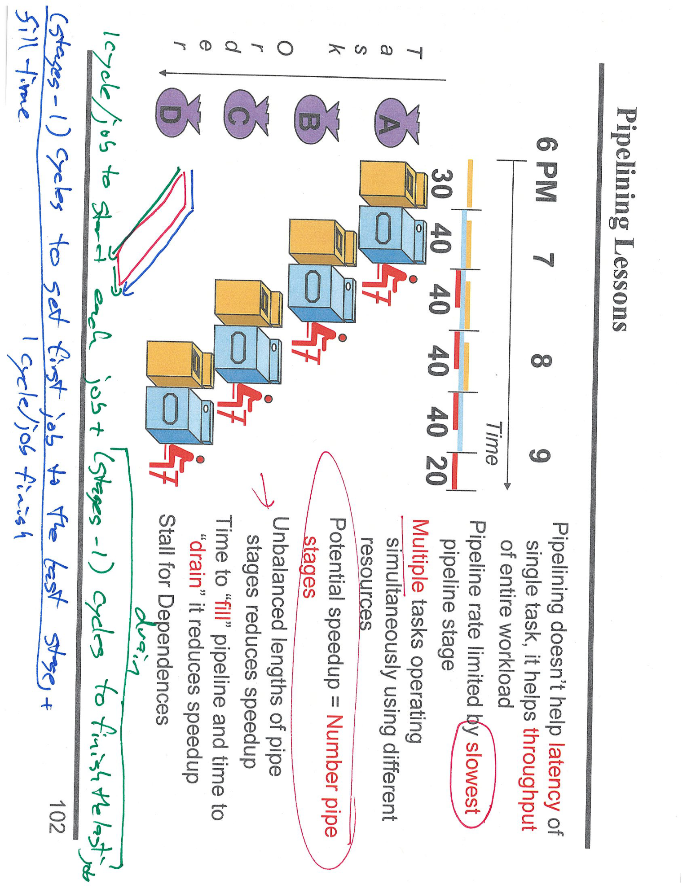

---

## 第 1 页


这张图展示的是**如何在一个简化版 CPU 上实现 `ADDI Rd, Rn, imm12` 指令**，也就是把立即数加到寄存器中，然后将结果写回另一个寄存器。下面我给你详细解释图中的每个部分及控制信号的含义。

---

### 🧠 一、指令功能说明

`ADDI Rd, Rn, imm12` 的含义是：

```
Rd = Rn + imm12
```

也就是：

* 从寄存器 `Rn` 读出一个数；
* 将指令中的立即数 `imm12`（12 位）扩展为 64 位；
* 两者相加；
* 把结果写入寄存器 `Rd`。

右上角红字写的三行伪代码说明了这个过程：

```
instr = Mem[PC]
Reg[Rd] = Reg[Rn] + 2EC(imm12)
PC = PC + 4
```

表示：

1. 从内存（指令存储器）取出当前指令；
2. 把寄存器 Rn 的值和立即数相加，结果存入 Rd；
3. PC 增加 4，指向下一条指令。

---

### ⚙️ 二、控制信号表（左上角表格）

| 信号名          | 取值  | 含义                |
| ------------ | --- | ----------------- |
| **ALUOp**    | `+` | ALU 做加法运算         |
| **UncondBr** | `X` | 无条件跳转信号无关（这里不分支）  |
| **BrTaken**  | `0` | 不进行分支跳转           |
| **MemWrite** | `0` | 不写内存（因为是算术指令）     |
| **RegWrite** | `1` | 写寄存器（结果写回 Rd）     |
| **MemToReg** | `0` | 写回的数据来自 ALU，而不是内存 |
| **ALUSrc**   | `2` | 第二个操作数来自立即数       |
| **Reg2Loc**  | `X` | 无关（因为没有第二个寄存器操作数） |

也就是说：

* ALU 执行加法；
* 不访问数据存储器；
* 把 ALU 结果写回寄存器文件；
* ALU 的第二个输入选的是立即数。

---

### 🧩 三、数据通路图分析（下方的 CPU 图）

图中展示了两个主要模块：

1. **左边是数据通路（Data Path）**

* 从寄存器堆读出 Rn；
* 通过 MUX（多路选择器）选择立即数作为第二个 ALU 输入（由 ALUSrc 控制）；
* ALU 执行加法；
* 把结果通过 `MemToReg = 0` 直接送入寄存器写回端口；
* `RegWrite = 1` 使能写入操作。

2. **右边是取指逻辑（Instruction Fetch）**

* 指令内存从 PC 取出指令；
* PC 通过加法器加 4，得到下一条指令地址；
* 因为 `BrTaken = 0`，所以 PC 直接更新为 `PC + 4`。

---

### 🧮 四、总结执行流程

1. 取指令（由 PC 定位到的地址读取指令）
2. 寄存器文件读取 `Rn`
3. 立即数 `imm12` 进行扩展（符号扩展或零扩展）
4. ALU 做加法运算：`Rn + imm12`
5. 将结果写回到寄存器 `Rd`
6. PC 自增 4，准备下一条指令

---

### 📘 五、主要归纳

**这张图的重点是说明：**

* 在 CPU 的单周期数据通路中，`ADDI` 指令不涉及内存访问或分支；
* ALU 做加法；
* ALU 第二输入来自立即数；
* 结果写回寄存器；
* PC 自动加 4；
* 控制信号设置确保正确的数据流动。

---

### \[口语化表达]

这张图其实就是在教我们 CPU 怎么执行一条“加立即数”指令。
它告诉我们，`ADDI Rd, Rn, imm12` 这条指令干的事是——从寄存器 `Rn` 里拿一个数，加上立即数 `imm12`，结果放回寄存器 `Rd`。
控制信号那一栏意思是：ALU 做加法、不访问内存、不跳转，结果写回寄存器。
图下面的电路图展示了数据的流动：从寄存器取数 → 加上立即数 → 写回寄存器 → PC 加 4，准备下一条指令。
所以总体来说，这就是 CPU 执行“寄存器 + 立即数”操作的完整过程。


---

## 第 2 页


这张图展示的是一个**单周期（Single-Cycle）CPU 各类指令的执行流程对比**，说明了不同类型指令在一个时钟周期内经历的功能部件顺序。我们逐步来看它的含义。

---

### 🧠 一、总体概念：单周期机器（Single-Cycle Machine）

所谓 **单周期 CPU**，就是：

* 每一条指令（无论是加法、存取内存、分支……）都在 **一个时钟周期（Cycle）内完成**；
* 时钟周期必须足够长，能容纳最“慢”的那条指令（比如访问内存的 Load/Store）；
* 所以每条指令都在一个周期内经过取指、译码、执行、访存、写回等步骤。

右上角红字写的 “R-type, add/sub, CPI=1 clock” 表示：

> 对于 R 型指令（如 ADD、SUB），一个指令只需 1 个周期（CPI=1）。

---

### ⚙️ 二、图中列出的指令类型及其执行流程

表格顶部从左到右列出了几种典型指令类型：

| 指令类型          | 说明                                       |
| ------------- | ---------------------------------------- |
| **B**         | Branch：无条件跳转（修改 PC）                      |
| **CBZ**       | Conditional Branch Zero：条件分支（判断寄存器是否为 0） |
| **STUR**      | Store：将寄存器数据写入内存                         |
| **LDUR**      | Load：从内存读取数据到寄存器                         |
| **ADD / SUB** | 寄存器加法或减法指令                               |

每一列展示了该指令在一个时钟周期中经过的功能单元顺序。

---

### 🧩 三、每条指令的执行步骤（按图中顺序解释）

#### **1️⃣ B（Branch）分支指令**

* **PC → Instr. Memory**：取指令；
* **Adder + MUX**：通过立即数计算跳转目标地址；
* **PC Setup**：更新 PC。

> 这类指令只涉及取指和 PC 计算，不访问寄存器或内存。

---

#### **2️⃣ CBZ（Compare and Branch if Zero）条件分支**

* **PC → Instr. Memory**：取指；
* **MUX + RegRead**：读取一个寄存器；
* **ALU**：判断该寄存器是否为零；
* **MUX + PC Setup**：如果为零则跳转。

> 即：如果寄存器为 0，则修改 PC，否则 PC+4。

---

#### **3️⃣ STUR（Store）存储指令**

* **PC → Instr. Memory**：取指；
* **RegRead**：读取寄存器；
* **ALU**：计算存储地址（基址寄存器 + 偏移）；
* **Data Memory**：把寄存器中的值写入内存。

> 不写回寄存器，所以没有 Reg Setup。

---

#### **4️⃣ LDUR（Load）加载指令**

* **PC → Instr. Memory**：取指；
* **RegRead**：读取基址寄存器；
* **ALU**：计算加载地址；
* **Data Memory**：从内存中取出数据；
* **MUX + Reg Setup**：将读取的数据写回寄存器。

> 即：把内存的数据加载进寄存器。

---

#### **5️⃣ ADD / SUB（算术运算指令）**

* **PC → Instr. Memory**：取指；
* **MUX + RegRead**：读取两个寄存器；
* **ALU**：执行加法或减法；
* **MUX + Reg Setup**：将结果写回寄存器。

> 算术运算不涉及内存，仅访问寄存器和 ALU。

---

### 🧮 四、右上角红字解释

红色标注：

```
R-type
Reg read
ALU
Reg write
Cload
```

这对应于 R 型指令（如 ADD/SUB）的执行阶段：

1. **Reg read**：从寄存器读取两个操作数；
2. **ALU**：执行加法或减法；
3. **Reg write**：将结果写回；
4. **Cload**：代表完成指令并更新状态。

---

### 🔄 五、从性能角度看（Performance）

标题“Performance of Single-Cycle Machine”指的是性能比较：

* 因为每条指令都在一个周期内完成，所以 **CPI（每条指令所需周期数）= 1**；
* 但是，这个周期必须足够长，以便最慢的指令（例如 `LDUR`）能够完成；
* 所以虽然 CPI=1，看起来高效，但**整体时钟频率变低**，效率反而不一定最高。

---

### 📘 六、总结执行特征

| 指令类型    | 是否访存   | 是否写回寄存器 | 是否修改PC | 特点    |
| ------- | ------ | ------- | ------ | ----- |
| B       | 否      | 否       | 是      | 无条件跳转 |
| CBZ     | 否      | 否       | 条件修改   | 条件分支  |
| STUR    | 是（写内存） | 否       | 否      | 存储    |
| LDUR    | 是（读内存） | 是       | 否      | 加载    |
| ADD/SUB | 否      | 是       | 否      | 算术逻辑  |

---

### \[口语化表达]

这张图其实是在告诉我们，**单周期 CPU** 是怎么在一个时钟里完成不同类型指令的。
比如说，加法（ADD）要读寄存器 → 经过 ALU → 把结果写回；
加载（LDUR）还得去内存拿数据；
存储（STUR）是把寄存器的值写进内存；
分支（B、CBZ）是用 ALU 算出跳转目标再改 PC。
虽然每条指令都只用一个时钟周期（CPI=1），但因为每条都得跑完整个电路，时钟周期就会被拖得很长。
换句话说，这张图展示了单周期 CPU 虽然看似“一条指令一个周期”，但实际上不同指令在同一个周期里干的活儿不一样，有的短有的长。


---

## 第 3 页


这张图的主题是 **“Reducing Cycle Time”（减少时钟周期时间）**，讲的是通过在电路中插入**寄存器（register）或锁存器（latch）**，把一个耗时长的组合逻辑分成两个较短的阶段，从而让 CPU 每个周期的运行时间更短，也就是\*\*“流水线化（pipelining）”的基本思想\*\*。

---

## 🧠 一、图的核心思想

图分成上下两部分：

### 🔹 上半部分：原始单周期设计

* 只有一个大的 **Acyclic Combinational Logic（无环组合逻辑）** 块。
* 输入和输出通过 **storage element（寄存器或存储单元）** 连接。
* 这表示所有逻辑（比如取指、译码、运算、写回）都在**一个周期**里完成。
* 问题是：这个逻辑块太大，信号传播时间太长，所以**时钟周期必须设置得很慢**，才能让信号跑完。

👉 换句话说：整个电路要等最慢的信号走完，才能结束一个时钟周期。

---

### 🔻 下半部分：优化后的设计（分阶段）

优化方法：
把原来的大逻辑块拆成两个较小的逻辑块：

* **Acyclic Combinational Logic (A)**
* **Acyclic Combinational Logic (B)**
中间插入一个 **storage element（寄存器）**，如图中红框部分。

这样：

1. 每个逻辑块变短；
2. 时钟周期（Clock period）可以变得更短；
3. 整体执行同样的工作，但分两次完成（两个周期）。

---

## ⚙️ 二、右侧的文字解释

右侧文字写道：

> “Cut combinational dependency graph and insert register/latch.
> Do same work in two fast cycles, rather than one slow one.”

意思是：

* **切开组合逻辑的依赖图（dependency graph）**；
* **在中间插入寄存器或锁存器**；
* 这样一来，原本要在一个很慢的周期中完成的工作，现在可以拆成两个更快的周期完成。

这就是“流水线化”的核心概念：
**通过在逻辑中插入寄存器，让每个阶段更快完成，从而提升时钟频率。**

---

## 🔄 三、执行时间比较

| 设计方式   | 周期数 | 每周期时间 | 总延迟         | 优点            |
| ------ | --- | ----- | ----------- | ------------- |
| 单周期设计  | 1   | 很长    | 1×长         | 实现简单但速度慢      |
| 分两阶段设计 | 2   | 短     | 2×短 ≈ 比之前更快 | 可提高时钟频率、支持流水线 |

虽然完成一次操作要两个周期，但因为每个周期短，CPU 的\*\*主频（Clock Frequency）\*\*提升了很多，总体执行速度反而更高。

---

## 📘 四、这张图代表的意义

这实际上是现代处理器优化的关键思想——**流水线（Pipelining）设计基础**：

* 在逻辑块之间插入寄存器；
* 让 CPU 每个阶段更快；
* 同时多个指令在不同阶段并行执行；
* 从而提高吞吐量（Throughput）。

---

## \[口语化表达]

这张图其实就是在讲：
“如果一块电路太复杂、信号要走很久，那就把它掰成两段，中间插个寄存器。”
这样一来，原本一个很慢的时钟周期，就变成两个快一点的周期。
虽然完成同样的事要多花一个周期，但因为每个周期更短，整体速度反而更快。
这就是 CPU 里流水线的原理——把一条大任务拆成几段小任务，每段跑得飞快，最后整体性能就上去了。


---

## 第 4 页


这张图展示的是一个\*\*五级流水线处理器（Pipelined Processor）\*\*的整体结构，也就是现代 CPU 的经典数据通路（datapath）划分方式。它说明了如何把单周期 CPU 拆分成多个阶段，让不同的指令可以并行执行，以提升性能。

---

## 🧠 一、标题与核心思想

标题是：

> **Pipelined Processor Overview**
> Divide datapath into multiple stages
> （流水线处理器概览：把数据通路划分为多个阶段）

这就是说，我们把 CPU 的工作流程拆分成多个部分（阶段），每个阶段专门做某一步的事，比如取指、译码、执行等，这样 CPU 就能在不同阶段**同时处理多条指令**。

---

## ⚙️ 二、五级流水线的五个阶段

图的右侧标出了五个阶段的名称：

| 阶段名（缩写）     | 英文全称                                | 中文含义         | 主要工作                |
| ----------- | ----------------------------------- | ------------ | ------------------- |
| **IF**      | Instruction Fetch                   | 取指阶段         | 从指令存储器中取出指令         |
| **RF / ID** | Register Fetch / Instruction Decode | 寄存器读出 / 指令译码 | 解析指令，读取寄存器          |
| **EX**      | Execute                             | 执行阶段         | ALU 执行计算（加减、地址计算等）  |
| **MEM**     | Memory Access                       | 访存阶段         | 访问数据存储器（Load/Store） |
| **WB**      | Write Back                          | 写回阶段         | 把计算或内存读取结果写回寄存器     |

---

## 🔩 三、图中结构详解

### 1️⃣ **PC → Instruction Memory（取指阶段 IF）**

* 程序计数器（PC）提供指令地址；
* 从\*\*指令存储器（Instr. Memory）\*\*中取出一条指令；
* 红色标注的 “Instruction Register” 表示在阶段之间插入一个寄存器来保存当前指令。

💡 **作用：**
这是流水线的第一个阶段，负责从内存中读取指令。

---

### 2️⃣ **Register File（寄存器文件，RF）**

* 指令译码后，确定要读哪些寄存器；
* 从寄存器中读出两个操作数（图中绿色标 “Read”）；
* 同时控制逻辑（Control Logic）根据指令类型产生控制信号；
* 红色竖线标出了“阶段间寄存器”，用于保存寄存器读取结果。

💡 **作用：**
完成寄存器读取与指令译码，是数据准备阶段。

---

### 3️⃣ **ALU（算术逻辑单元，EX 阶段）**

* 对寄存器读出的数据执行运算；
* 例如：加法（Add）、减法（Sub）、地址计算等；
* 结果送到下一级；
* 红笔写的“ALUout”表示 ALU 输出寄存器，用来保存运算结果。
* > ------
  >
  > ### 🔁 二、为什么 “B” 有两个输入来源？
  >
  > 看图可以看到，“B” 左边（输入端）有两路信号：
  >
  > 1. **来自寄存器堆（Register File）读出的数据**
  >     → 即两个源操作数 `Read Data 1` 和 `Read Data 2`。
  >     这些数据在 RF 阶段被读出后，需要在进入 ALU 之前暂存在流水寄存器中。
  > 2. **来自控制逻辑（Control Logic）的控制信号**
  >     → 比如 ALU 操作类型、是否需要访问数据存储器、是否写回寄存器等信号。
  >     这些控制信号也必须被同步地传递到 EX 阶段，因此同样要进入 “B” 暂存。
  >
  > 所以：
  >
  > > “B” 有多个输入来源，是因为它需要暂存不同类型的数据（操作数 + 控制信号）。
  >
  > ------
  >
  > ### 🔀 三、为什么 “B” 的输出有两个方向？
  >
  > “B” 的输出端向右连接到了：
  >
  > 1. **ALU（算术逻辑单元）**
  >     → 输出操作数（例如 ALU 的输入 A、B）。
  >     这些来自寄存器或立即数的值在执行阶段被用来做加减运算、逻辑操作、地址计算等。
  > 2. **EX 阶段后续的流水寄存器（EX/MEM）**
  >     → 部分控制信号或未修改的数据会继续传递到下一个阶段，比如存储器访问控制、寄存器写使能信号等。
  >
  > 因此：
  >
  > > “B” 的输出会被分流到不同的下游模块：数据走向 ALU，控制信号走向下一阶段。

💡 **作用：**
执行实际的计算或内存地址生成。

---

### 4️⃣ **Data Memory（数据存储器，MEM 阶段）**

* 如果是 `Load` 指令，就从内存读数据；
* 如果是 `Store` 指令，就把数据写进内存；
* 如果是算术类指令（如 ADD），这步可以跳过；
* 红字 “Mem/Data Register” 是保存访存阶段输出的寄存器。

💡 **作用：**
访问主存储器，进行数据读写操作。

---

### 5️⃣ **Register File（写回阶段 WB）**

* 从内存或 ALU 输出的数据写回寄存器（绿色标“write”）；
* 这是整个指令完成的最后一步；
* 之后，下一条指令的结果会继续推进。

💡 **作用：**
把结果保存回 CPU 内部寄存器，供后续指令使用。

---

## 🔁 四、红色线条与寄存器说明

红色横线表示**流水线阶段的分界线（pipeline registers）**：

* 每条线都表示一个阶段之间的“寄存器”；
* 例如：

* IF/ID 寄存器：保存取出的指令；
* ID/EX 寄存器：保存寄存器读出的数据；
* EX/MEM 寄存器：保存 ALU 输出；
* MEM/WB 寄存器：保存访存结果。

这些寄存器的存在，使得流水线中每个阶段可以**独立并行工作**。

---

## ⚙️ 五、左侧绿色 “Control Logic”（控制逻辑）

控制逻辑模块负责：

* 解码指令；
* 控制 ALU 操作类型；
* 控制内存读写；
* 控制寄存器写回；
* 确保各个阶段同步协作。

---

## 🚀 六、流水线的意义

* 每个阶段的逻辑更简单 → 时钟周期可以更短；
* 多条指令在不同阶段同时执行 → 提高吞吐量；
* 每个阶段之间用寄存器隔开 → 数据有序推进；
* 缺点：会引入**数据冒险（data hazard）**和**控制冒险（control hazard）**，但可以通过转发（forwarding）或暂停（stalling）解决。

---

## \[口语化表达]

这张图其实就是在讲，CPU 是怎么“分工合作”地执行指令的。
原来一条指令要从取指、译码、执行、访存、写回一步步来，现在我们给它分成五个阶段，每个阶段都有自己的小任务。
比如第一步取指令，第二步读寄存器，第三步算结果，第四步访问内存，第五步把结果写回去。
每两个阶段之间还加了寄存器，这样每一步都能独立工作。
所以在流水线里，CPU 就像工厂流水线——第一条指令在算的时候，第二条指令已经在取，第三条在译码，五条一起跑，比一条一条执行快多了。


---

## 第 5 页


这张图是一个**用“洗衣服”来比喻流水线（Pipelining）工作原理**的例子。它用日常生活中“洗、烘、叠”的流程来帮助理解计算机中“指令流水线”的概念。

---

## 🧠 一、图的主题与场景

标题是 **“Pipelining”**（流水线），
右上角写着：

> Example: Doing the laundry
> Ann, Brian, Cathy, & Dave each have one load of clothes to wash, dry, and fold.
> （例子：洗衣服。Ann、Brian、Cathy 和 Dave 每人都有一份衣物要洗、烘干、叠好。）

这意味着：

* 有 4 个人（A、B、C、D）；
* 每个人都要完成三个步骤：

1. 洗衣（Washer）
2. 烘干（Dryer）
3. 折叠（Folder）

---

## ⚙️ 二、每个步骤耗时

图中分别标出了三个阶段的时间：

| 阶段     | 内容       | 耗时    |
| ------ | -------- | ----- |
| Washer | 洗衣机洗一桶衣服 | 30 分钟 |
| Dryer  | 烘干机烘干    | 40 分钟 |
| Folder | 折叠衣物     | 20 分钟 |

---

## 🔩 三、如果没有流水线（顺序执行）

假设 **只有一个人完成所有工作**，或所有任务必须按顺序执行：

* 一个人洗完 → 烘干 → 折叠；
* 然后再开始第二个人的衣物。

那总时间会是：

> (30 + 40 + 20) × 4 = 360 分钟
> 也就是 6 个小时。

这就相当于**单周期 CPU**——每条指令从头到尾执行完，下一条才开始。

---

## 🚀 四、如果采用流水线（Pipelining）

流水线的思想是：
当第一个人洗完衣服进入烘干机后，第二个人马上可以开始洗下一桶。

换句话说：

* 洗衣机、烘干机、折叠台 **同时工作**；
* 各阶段交替进行；
* 每 20\~40 分钟就有一个人完成全部任务（取决于最慢阶段）。

这样：

* 总体“完成时间”缩短；
* 系统“吞吐率”提高；
* 每台机器都在持续工作，没有空闲时间。

这就像 CPU 的流水线：

> 各个阶段（取指、译码、执行、访存、写回）同时处理不同的指令。

---

## ⏱️ 五、计算效率提升示意（类比 CPU）

| 比喻阶段         | CPU 对应阶段                          |
| ------------ | --------------------------------- |
| 洗衣机 (Washer) | Instruction Fetch / Decode（取指与译码） |
| 烘干机 (Dryer)  | Execute / Memory Access（执行与访存）    |
| 折叠 (Folder)  | Write Back（写回阶段）                  |

当流水线稳定后：

* 每隔最长阶段的时间（这里是 40 分钟）就有一个任务完成；
* 效率远高于顺序执行的模式。

---

## 💡 六、关键概念总结

| 术语                        | 含义                                         |
| ------------------------- | ------------------------------------------ |
| **Pipeline Stage（流水线阶段）** | 系统被分成多个独立步骤，每个步骤同时运行不同任务                   |
| **Throughput（吞吐率）**       | 单位时间内完成的任务数增多                              |
| **Latency（延迟）**           | 单个任务完成的总时间并没有减少（洗+烘+叠还是 90 分钟），但多个任务可以并行推进 |
| **Bottleneck（瓶颈阶段）**      | 最耗时的阶段决定整个流水线的速度（这里是烘干机 40 分钟）             |

---

## \[口语化表达]

这张图其实就是在用洗衣服来打比方说明“流水线”的概念。
每个人都要洗、烘干、叠衣服——如果按顺序来，得一个人干完才能轮下一个，整整 6 个小时才洗完四份衣服。
但如果我们像工厂流水线那样，让洗衣机、烘干机、叠衣服的地方同时干活，那第一个人洗完的同时第二个人就能开始洗，接着烘干机和叠衣也在运转。
结果就是，每隔 40 分钟（最慢那步）就能完成一份衣服，整体速度快了好几倍。
这就像 CPU 的流水线一样——不同的“阶段”同时处理不同的指令，效率更高，机器几乎不闲着。


---

## 第 6 页


这张图是前一页“洗衣服类比流水线”的**延续说明**，但这里展示的是\*\*“非流水线（Sequential Laundry）”的情况\*\*，也就是**顺序执行**的样子。它通过时间轴的图形方式，直观地对比了为什么顺序执行效率低、流水线能大幅提速。

---

## 🧠 一、标题与背景说明

标题是：

> **Sequential Laundry**（顺序洗衣）

左侧文字写着：

> Sequential laundry takes 6 hours for 4 loads.
> If they learned pipelining: how long would laundry take?
> （顺序洗衣洗 4 份衣服需要 6 小时。如果他们学会流水线方式，会快多少？）

这句话的意思就是在比较两种工作方式：

1. **Sequential（顺序执行）** → 一次只能洗一份；
2. **Pipelined（流水线并行）** → 不同阶段同时操作多份衣服。

---

## 🧩 二、图中展示的含义

### 👕 场景

* 四个人（Ann, Brian, Cathy, Dave）每人都有一份衣服要洗；
* 三个工作阶段：

1. 洗衣（Washer）= 30 分钟
2. 烘干（Dryer）= 40 分钟
3. 折叠（Folder）= 20 分钟

---

### 🕒 图表内容（时间轴）

横轴是时间，从 **6 PM 到午夜（12 AM）**，单位是分钟。
纵向排列代表每一份衣服的任务顺序。

图中每条任务线（橙色→蓝色→红色）代表：

1. **橙色块**：洗衣机工作 30 分钟
2. **蓝色块**：烘干机工作 40 分钟
3. **红色块**：折叠工作 20 分钟

这三步必须按顺序完成，后面的任务要等前面结束。

---

## 🧮 三、顺序执行的时间计算

* 每份衣服总共需要：

```
30（洗） + 40（烘） + 20（叠） = 90 分钟
```
* 共有 4 份衣服（A, B, C, D），所以顺序执行时间为：

```
90 × 4 = 360 分钟 = 6 小时
```

也就是图上红色框线标出来的：
第一个人从 6 点开始洗，最后一个人到午夜才折叠完。

---

## ⚙️ 四、图示逻辑（顺序 vs 流水线）

在这个顺序执行模式中：

* 烘干机和叠衣的人前半段时间都是空闲的；
* 只有洗衣机在工作；
* 当洗衣机完成第一份时，烘干机才开始；
* 整个过程效率低下。

所以文字才提问：

> “If they learned pipelining, how long would laundry take?”
> 意思是：如果他们能并行工作（流水线化），会节省多少时间？

这为下一页（流水线洗衣）做铺垫。

---

## 💡 五、关键类比：CPU 顺序执行

在计算机中，这就相当于：

* CPU 一次只处理一条指令；
* 每条指令必须经过“取指→译码→执行→访存→写回”后才能开始下一条；
* 所以 CPU 的各个功能部件（例如 ALU、内存接口）大部分时间都在闲置。

**结果：**

* 效率低；
* 每条指令都花完整周期执行；
* 总执行时间长（类似这张图的 6 小时）。

---

## 📘 六、总结要点

| 概念               | 含义                  |
| ---------------- | ------------------- |
| Sequential（顺序执行） | 每个任务必须等前一个完全完成后才能开始 |
| 缺点               | 设备利用率低，大部分时间机器是闲的   |
| 对应CPU模型          | 单周期或非流水线处理器         |
| 时间消耗             | 总时间 = 每任务时间 × 任务数量  |
| 改进方式             | 引入流水线（同时运行不同阶段）     |

---

## \[口语化表达]

这张图其实就是在告诉我们，**如果洗衣服是按顺序来做，那效率会非常低。**
一个人洗完再烘干、再叠，下一份衣服要等前一份完全结束才能开始，所以四份衣服要整整 6 个小时。
前面一段时间，烘干机和叠衣的人都在闲着，浪费了很多时间。
这就像早期的 CPU，一次只能处理一条指令，后面的都得等。
所以图最后问：如果他们学会了流水线（也就是几台机器同时干活），是不是就能更快完成？——这其实就是在引出“CPU 流水线能大大提高效率”的概念。


---

## 第 7 页


这张图展示的是\*\*“流水线洗衣（Pipelined Laundry）”的情景\*\*，与上一张“顺序洗衣（Sequential Laundry）”形成对比。
它用同样的洗衣流程（洗、烘、叠）来形象说明**流水线（Pipelining）如何大幅提升效率**。

---

## 🧠 一、图的主题与核心思想

标题是：

> **Pipelined Laundry: Start work ASAP**
> 意思是：**“流水线洗衣：尽快开始下一步工作”**。

左边红字写着：

> **Pipelined laundry takes 3.5 hours for 4 loads.**
> 表示流水线方式洗 4 份衣服只需要 3.5 小时，
> 而顺序执行（上一张图）要整整 6 小时！

这说明流水线的优势非常显著。

---

## ⚙️ 二、洗衣流程与时间设置

洗衣步骤与前面一致：

| 阶段      | 设备     | 时间    | 对应CPU阶段类比       |
| ------- | ------ | ----- | --------------- |
| 1️⃣ 洗衣机 | Washer | 30 分钟 | 取指 + 译码（IF/ID）  |
| 2️⃣ 烘干机 | Dryer  | 40 分钟 | 执行 + 访存（EX/MEM） |
| 3️⃣ 折叠  | Folder | 20 分钟 | 写回（WB）          |

---

## 🧩 三、图中时间轴分析（流水线运行）

时间轴从 **6 PM 到 11 PM**。
红线标出了每份衣服（A、B、C、D）的工作顺序。

### ⏱️ 关键观察：

* 第一个人（A）：

* 洗衣 6:00–6:30
* 烘干 6:30–7:10
* 折叠 7:10–7:30
* 完成时间：7:30 PM

* 第二个人（B）：

* 一旦 A 的衣服进入烘干机（6:30），B 立刻开始洗衣；
* 他在 6:30–7:00 洗衣；
* 烘干从 7:10 开始；
* 依次交错进行。

* 之后 C、D 依次进入流水线，每隔大约 30 分钟启动。

最终：

* 所有 4 份衣服都在 9:30–9:40 PM 左右完成；
* 整个过程总共 3.5 小时，比顺序执行节省约 **2.5 小时**。

---

## 🧮 四、为什么时间能缩短？

流水线的核心原理是**并行工作**。
在顺序模式下：

> 一份衣服要洗 → 烘 → 叠，全程 90 分钟。四份要 6 小时。

而在流水线中：

> 当 A 在烘干时，B 已经在洗衣；
> 当 B 在烘干时，C 又开始洗；
> 设备从不空闲。

整个流程的总时间由\*\*最慢阶段（烘干 40 分钟）\*\*决定，
因此总体耗时为：

```
总时间 ≈ 洗衣+烘干+叠衣 + （剩余负载数 × 最慢阶段时间）
= 30 + 40 + 20 + (3 × 40)
= 210 分钟 ≈ 3.5 小时
```

---

## 💡 五、计算机类比（CPU 流水线）

这张图对应于**CPU 的指令流水线**原理：

| 洗衣任务 | 对应CPU操作                          |
| ---- | -------------------------------- |
| 洗衣机  | Instruction Fetch（取指）            |
| 烘干机  | Execute / Memory Access（执行 / 访存） |
| 折叠   | Write Back（写回）                   |

在流水线 CPU 中：

* 第一条指令在执行阶段时，第二条指令已经在取指；
* 多条指令“重叠”运行；
* CPU 吞吐量提高；
* 机器几乎一直在工作，没有空闲。

---

## 📘 六、总结对比表

| 模式    | 处理方式       | 总时间    | 每阶段并行情况 | 对应CPU结构 |
| ----- | ---------- | ------ | ------- | ------- |
| 顺序洗衣  | 一次一份，等前面结束 | 6 小时   | 无并行     | 非流水线CPU |
| 流水线洗衣 | 同时进行不同阶段   | 3.5 小时 | 三阶段同时工作 | 流水线CPU  |

---

## \[口语化表达]

这张图是在说明“流水线到底有多快”。
以前洗衣服是一个人一份一份地做，得 6 个小时。
现在他们换了方式——A 洗完的衣服进烘干机的同时，B 马上开始洗第二份，C 也紧跟着。
洗衣机、烘干机、叠衣的人都没闲着。
结果呢？四份衣服只花了 3.5 小时就搞定，比原来快了一半多。
这就像 CPU 的流水线：第一条指令在执行的时候，第二条指令已经在取指，第三条在译码——每个部分都在干活，效率直接翻倍。


---

## 第 8 页



这张图是前几页“洗衣服流水线”例子的**总结页（Pipelining Lessons）**，用来解释**流水线的关键概念、性能特点、限制因素**等。
它结合图示（洗衣机例子）与文字，说明了流水线能提高吞吐量（throughput），但不一定能减少延迟（latency），并指出了流水线中“填充”“排空”“不平衡”等问题。

---

## 🧠 一、整体主题：流水线的性能原理总结

标题是：

> **Pipelining Lessons**（流水线的经验总结）

意思是：通过洗衣机的类比，归纳出 CPU 流水线工作的几个核心规律。

---

## ⚙️ 二、图中内容详解

### 🔹 时间轴部分（上方图）

和前一页一样，仍然是四份衣服（A、B、C、D）依次进入洗、烘、叠三个阶段：

* 洗衣（Washer）→ 30 分钟
* 烘干（Dryer）→ 40 分钟
* 折叠（Folder）→ 20 分钟

但是这次重点不在过程，而在**流水线性能分析**。

旁边的彩色手写笔记说明了流水线的两个时间阶段：

#### 🟢 “Fill time”（填充时间）

* 就是流水线刚开始时，前几个阶段还没全满的那一段时间；
* 比如第一个人（A）刚开始洗衣，烘干机和折叠台还空着；
* 要经过若干周期（阶段数 - 1），流水线才“填满”。

#### 🔵 “Drain time”（排空时间）

* 当最后一个任务（D）进入流水线后，前面还有几阶段未完成；
* 所以流水线最后一段时间仍在“清空”。

手写说明（蓝绿笔）写着：

> “(stages - 1) cycles to set first job (fill time)”
> “(stages - 1) cycles to finish last job (drain time)”

意思是：

* 启动流水线和清空流水线都要花“阶段数 - 1”个周期；
* 比如 3 个阶段（洗、烘、叠），就需要 2 个周期来填充，2 个周期来排空。

---

## 🧩 三、右侧文字解析（流水线核心规律）

右边一列总结了五条关键经验：

### ① “Pipelining doesn’t help latency of single task; it helps throughput of entire workload.”

> 流水线**不会减少单个任务的延迟**，但能**提高整体任务的吞吐率**。

解释：

* 单个人洗一桶衣服，从洗到叠，时间仍然是 30+40+20=90 分钟；
* 但是流水线让多个人的衣服同时进行，**整体完成速度变快**；
* 对应 CPU 中：每条指令耗时不变，但每个周期能执行多条指令。

---

### ② “Pipeline rate limited by slowest pipeline stage.”

> 流水线的执行速率由**最慢阶段**决定。

解释：

* 烘干（40 分钟）是最慢的阶段；
* 即使洗衣和叠衣更快，也要等烘干；
* 所以整个流水线的节奏被烘干机“卡住”；
* 对应 CPU：最慢的阶段（比如访存）决定时钟周期长度。

---

### ③ “Multiple tasks operating simultaneously using different resources.”

> 多个任务**同时执行**，但**使用不同的资源**。

解释：

* 一个任务在洗衣，另一个在烘干，第三个在叠衣；
* 所以每个设备都在忙，但不互相干扰；
* 对应 CPU 各阶段并行：取指、译码、执行、访存、写回可同时处理不同指令。

---

### ④ “Potential speedup = Number of pipe stages.”

> 理论加速比 = 流水线阶段数。

解释：

* 有 3 个阶段（洗、烘、叠），理论上能加速 3 倍；
* 但由于填充/排空和不平衡阶段影响，实际达不到满速；
* 在理想条件下（各阶段耗时相同、无停顿），加速比确实等于阶段数。

---

### ⑤ “Unbalanced lengths of pipe stages reduces speedup.”

> **阶段长度不平衡会降低加速效果**。

解释：

* 烘干机最慢（40 分钟），成了瓶颈；
* 如果所有阶段耗时一致（比如都 30 分钟），流水线效率最高；
* 对应 CPU：如果某个阶段计算复杂，整个时钟周期必须拉长。

---

### 🔸 另外一行补充：

> “Time to fill pipeline and time to drain it reduces speedup.”
> 填充和排空所花的时间也会降低实际加速比。
> 换句话说，流水线的第一个任务开始慢，最后一个任务结束也慢。

---

## 📘 四、公式总结

### 理论加速比（理想条件）：

$$
S = \text{Number of stages}
$$

### 实际总时间：

$$
T = (\text{stages} - 1 + \text{jobs}) \times \text{slowest stage time}
$$

### 实际加速比：

$$
\text{Speedup} = \frac{\text{Non-pipelined time}}{\text{Pipelined time}}
$$

在例子中：

* 非流水线：6 小时
* 流水线：3.5 小时
加速比约为：

$$
\frac{6}{3.5} ≈ 1.7
$$

小于理论的 3 倍，因为有填充与不平衡延迟。

---

## \[口语化表达]

这张图就是在告诉我们：流水线虽然能让整体更快，但它也有局限。
就像洗衣服，单桶衣服还是得洗 30 分钟、烘 40 分钟、叠 20 分钟，时间没变，可几台机器一起干活后，所有人都能更快把衣服洗完。
不过效率再高，也会被最慢的那台机器（烘干机）拖后腿。
而且刚开始要等流水线“装满”，最后还得等“清空”，这两段时间也会让加速效果打折。
如果每个阶段用时不一样（比如洗衣快、烘干慢），那就更不平衡，速度提升就会更有限。
简单说，这张图教我们：流水线能让整个系统变快，但不能让单个任务变快，速度取决于最慢的环节，还要考虑启动和收尾的时间。


---

## 第 9 页


Something went wrong while generating the response. If this issue persists please contact us through our help center at help.openai.com.
