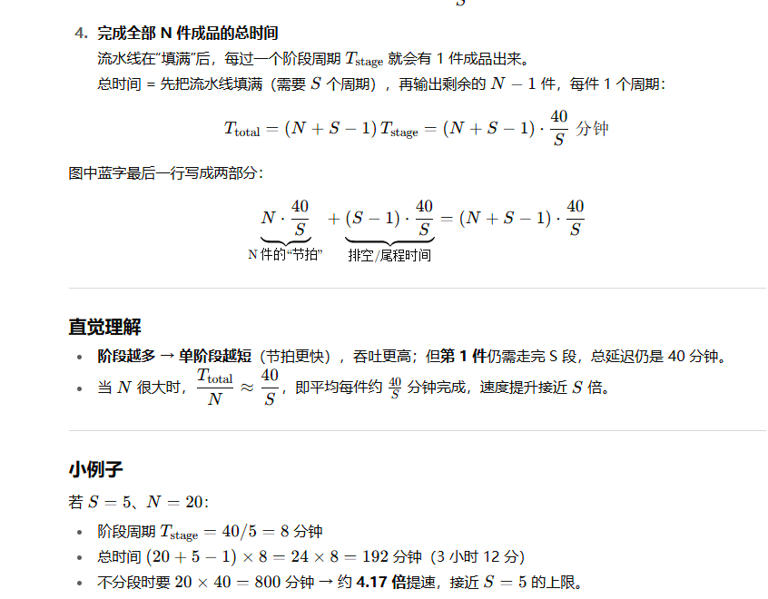

---

## 第 1 页





---

## 第 2 页


这张图的标题是 **“Single Cycle vs. Pipeline”（单周期与流水线的比较）**，它展示了计算机处理器在**单周期实现**（Single Cycle Implementation）和**流水线实现**（Pipeline Implementation）两种不同设计方式下的指令执行过程。

---

### 一、图的整体含义

这张图想说明：
在计算机处理器中，执行一条指令（例如 load、store、R-type）需要经过多个阶段（如取指、译码、执行、访存、写回）。
不同的处理器设计方式，会让这些阶段在时间上的安排不同。

* **单周期 (Single-Cycle)**：
每条指令都在一个完整的时钟周期（Cycle）里完成。也就是说，只有在第一条指令完全执行完毕后，第二条才能开始。
所以图上显示：

* 第一条指令（Load）在 Cycle 1 内执行；
* 第二条指令（Store）只能等到 Cycle 2；
* 这中间 CPU 的硬件在等待（浪费了潜力）——图里 “Waste” 就表示这种资源浪费。

* **流水线 (Pipeline)**：
指令被分为多个阶段（例如取指 IF、寄存器读 REG、执行 EXE、存储 MEM、写回 WR），这些阶段可以**并行处理不同指令的不同部分**。
例如：

* Cycle 1：取第一条指令（Load）；
* Cycle 2：Load 进入下一阶段（REG），同时开始取第二条指令（Store）；
* Cycle 3：Load 执行（EXE），Store 进入 REG，第三条指令（R-type）开始取指；
* 以此类推。

这样，在流水线中，当第一条指令进入后续阶段时，后面的指令就能依次进入前面的阶段，**实现并行执行**，极大提高了效率。

---

### 二、图中每个部分的说明

1. **上半部分：Single-Cycle Implementation**

* 每条指令占用一个完整的周期。
* Load 完成后，才开始 Store。
* 这就像“单车道桥梁”：一辆车过完，下一辆才能上桥。
* 结果：浪费时间（图中“Waste”）。

2. **下半部分：Pipeline Implementation**

* 每条指令分为多个阶段（IFetch, Reg, Exec, Mem, Wr）。
* 不同指令在不同阶段同时执行。
* 例如：

* Load 在执行时，Store 正在译码（Reg），R-type 正在取指（IFetch）。
* 这就像“多车道高速公路”：多辆车可以同时在不同路段上前进。

3. **周期 (Cycle 1, 2, 3...) 的关系**

* 横向时间轴表示时钟周期的推进。
* 纵向则是指令执行的不同阶段。
* 图上能清楚看到流水线的“重叠执行”现象。

---

### 三、总结对比

| 项目    | 单周期实现 (Single Cycle) | 流水线实现 (Pipeline)  |
| ----- | -------------------- | ----------------- |
| 执行方式  | 一次执行一条指令             | 多条指令并行执行不同阶段      |
| 速度    | 慢（每条指令需一个完整周期）       | 快（多条指令重叠执行）       |
| 硬件利用率 | 低，存在“浪费”             | 高，几乎每个阶段都在工作      |
| 实现复杂度 | 简单                   | 较复杂，需要同步控制和解决数据冲突 |

---

### 四、理解重点

* **“Cycle” 表示时钟周期**，是 CPU 执行指令的基本节拍。
* **“Pipeline” 是提高 CPU 性能的关键技术**，通过并行处理多个指令阶段，让吞吐量（每秒执行指令数）大大提升。
* **蓝色箭头** 可能表示从单周期模式到流水线模式的改进或时间对应关系。

---

### \[口语化表达]

这张图是在讲“CPU 怎么更快地干活”。
如果是单周期模式，CPU 一次只能干一件事，等这条指令干完下一条才能开始，就像单车道桥要一辆一辆过。
而流水线模式就聪明多了，它把一条指令分成几个阶段，让不同指令在不同阶段同时进行——有点像装配线或者多车道高速公路。
所以流水线能让 CPU 一边取下一条指令，一边执行上一条，还能同时写回更早的一条，速度自然快得多。


---

## 第 3 页


这张图的标题是 **“Why Pipeline?”（为什么要用流水线？）**，它通过一个例子来说明——**流水线技术能显著提高 CPU 的执行效率**。

---

### 一、图的内容结构

图中假设执行 **100 条指令（100 instructions）**，分别计算两种机器执行的总时间：

1. **Single Cycle Machine（单周期机器）**
2. **Ideal Pipelined Machine（理想流水线机器）**

---

### 二、第一部分：Single Cycle Machine（单周期机器）

* 每条指令都要完整地经过整个执行流程，所以每条指令耗时一样。
* 图上写着：

```
45 ns/cycle × 1 CPI × 100 inst = 4500 ns
```

解释如下：

* **45 ns/cycle**：每个时钟周期需要 45 纳秒；
* **1 CPI（cycles per instruction）**：每条指令要 1 个周期；
* **100 inst（instructions）**：总共有 100 条指令；
* 计算：45 × 100 = **4500 ns**。

👉 也就是说，执行 100 条指令总共需要 **4500 纳秒**。

---

### 三、第二部分：Ideal Pipelined Machine（理想流水线机器）

* 流水线可以让多条指令在不同阶段同时进行，虽然单条指令可能仍需几个阶段，但多个指令能**并行重叠执行**。
* 图中公式：

```
10 ns/cycle × (1 CPI × 100 inst + 4 cycle drain) = 1040 ns
```

拆解说明：

* **10 ns/cycle**：每个时钟周期只有 10 纳秒（比单周期的 45 ns 更短）；
* **1 CPI**：流水线状态下理想情况平均每个周期完成 1 条指令；
* **100 inst**：共有 100 条指令；
* **+4 cycle drain**：这是“流水线排空时间”（drain time），表示最后几条指令还需要额外的几个周期把流水线清空，假设流水线深度为 5 阶段，所以加 4；
* 因此：
10 × (100 + 4) = 10 × 104 = **1040 ns**。

👉 流水线机器只需 **1040 纳秒** 完成相同任务。

---

### 四、结果比较与结论

| 类型    | 每周期耗时 | 总指令数 | 总时间     | 性能差距     |
| ----- | ----- | ---- | ------- | -------- |
| 单周期机器 | 45 ns | 100  | 4500 ns | 慢        |
| 理想流水线 | 10 ns | 100  | 1040 ns | 快约 4.3 倍 |

📊 **结论**：
流水线机器通过并行处理不同指令阶段，大幅缩短总执行时间——执行效率提升约 4 倍以上。

---

### 五、理解重点

* **CPI（Cycle Per Instruction）** 表示平均每条指令花多少个时钟周期。
* 单周期机器无法并行，时间线性增加；
* 流水线机器让执行阶段重叠，所以越多指令，效率提升越明显；
* “+4 cycle drain” 表示流水线最后需要几个额外周期来完成最后几条指令。

---

### \[口语化表达]

这页的意思是说：“为什么要用流水线？因为它能让 CPU 干活更快！”
如果用老式的单周期 CPU，一条一条执行，100 条指令要花 4500 纳秒；
但如果换成理想的流水线设计，它能同时处理多条指令，只要 1040 纳秒就搞定。
就像装配线一样——以前一个人要从头干到尾，现在变成五个人分工合作，每人干一个环节，速度当然快好几倍。


---

## 第 4 页


这页讲的是 **“CPI for Pipelined Processors”（流水线处理器的 CPI）**，即在流水线 CPU 中，每条指令平均需要多少个时钟周期（Cycle Per Instruction）。
它通过一个例子说明：**即使有流水线，某些指令也会引入额外的等待周期，导致 CPI 大于 1**。

---

## 一、题目内容解析

题目内容如下（翻译并解释）：

> **Example:**
> 一个处理器在每条 *branch（分支）* 指令之后会浪费 2 个周期，在每条 *load（加载）* 指令之后会浪费 1 个周期。
> 在这段时间内，它不能发出新的指令。
> 如果一个程序中：
>
> * 10% 是 branch 指令，
> * 30% 是 load 指令，
> * 剩下 60% 是普通指令（others），
>   那么，这个程序的平均 **CPI（每条指令平均花费的周期数）是多少？**

---

## 二、逐步计算过程

### （1）已知条件

* 分支指令（branch）：占 10%，每条浪费 2 个周期。
* 加载指令（load）：占 30%，每条浪费 1 个周期。
* 其他指令（others）：占 60%，不浪费额外周期。

### （2）公式推导

CPI 的计算公式是：

$$
CPI = \sum (\text{指令比例} \times \text{每条指令的平均周期})
$$

而每类指令的平均周期 = 1（基础执行周期）+ 额外浪费的周期。

代入数据：

$$
CPI = 10\% \times (1 + 2) + 30\% \times (1 + 1) + 60\% \times (1)
$$

### （3）计算

$$
CPI = 0.1 \times 3 + 0.3 \times 2 + 0.6 \times 1
$$

$$
= 0.3 + 0.6 + 0.6 = 1.5
$$

👉 最终结果：

$$
CPI = 1.5
$$

---

## 三、结果分析

* **理想情况下（无浪费）**：CPI = 1（每个周期发出一条指令）。
* **实际情况**：因为分支和加载会造成停顿（pipeline stall），CPU 必须等待数据或跳转结果。
所以平均每条指令需要 **1.5 个周期**，性能比理想情况慢了约 50%。

换句话说，**流水线并不是万能的**，虽然能提高并行度，但如果程序里分支太多或数据依赖多，流水线就会被“卡住”。

---

## 四、延伸理解

* **Branch stall（分支停顿）**：执行跳转时，下一条指令地址还没确定，必须等待。
* **Load stall（加载停顿）**：从内存取数据时，后续指令依赖结果，也得等待。
* **Others（普通指令）**：无依赖问题，可以顺畅执行。

所以在真实 CPU 设计中，会用\*\*预测技术（branch prediction）**和**转发技术（data forwarding）\*\*来减少这些浪费。

---

### \[口语化表达]

这页意思是：虽然流水线 CPU 理论上每个时钟周期都能处理一条指令，但实际上没那么完美。
因为有些指令会让流水线“卡一下”，比如跳转（branch）要等结果出来、加载（load）要等数据返回。
这题举例说：如果程序里 10% 是跳转、30% 是加载、剩下 60% 是普通指令，那么平均每条指令得花 1.5 个周期。
简单讲，就是流水线原本能一拍一条，但因为各种“等”，最后变成“一拍半条”。


---

## 第 5 页


这页是在说明**五级流水线数据通路（pipelined datapath）**怎么被切成阶段、以及控制信号怎样随指令一起“流动”。蓝字是老师/同学写的提示。逐块解释如下：

# 图的结构

从左到右 5 个阶段（每两个阶段之间有一排“Register”，即**流水线寄存器**）：

1. **IF（Instruction Fetch）**
    从指令存储器取指；PC→指令存储器→得到指令。
    输出：取到的指令、下一 PC 等，经 IF/ID 寄存器送到下一阶段。
2. **RF/ID（Register Fetch / Decode）**
    读寄存器堆两个源操作数并译码产生控制信号。
    输出：寄存器读出的数据、立即数、以及一堆控制信号，经 ID/EX 寄存器进入 EX。
3. **EX（Execute）**
    ALU 做运算（算术/逻辑/地址计算），决定分支等。
    输出：ALU 结果、比较结果、以及后续阶段需要的控制信号，经 EX/MEM 寄存器进入 MEM。
4. **MEM（Data Memory）**
    访问数据存储器：根据控制信号进行读/写（load/store）。
    输出：读出的数据或 ALU 结果，经 MEM/WB 寄存器进入 WB。
5. **WB（Write Back）**
    把需要写回的值（ALU 结果或内存读出的数据）写回寄存器堆。

> 中间那几根灰色竖条“Register”就是**流水线寄存器**：把一个阶段的“数据 + 控制信号”锁存下来，供下一阶段在下一个时钟周期使用，从而把长组合路径切短，提高频率。

# 蓝字/批注在说什么

- 顶部蓝字：
  - **slow：** mem（存储器）、RF addr（寄存器寻址/读）、ALU、control（译码/控制）
  - **fast：** registers、muxes 等（寄存器写入、选择器）
  - **Never do 2 slow things in series within a cycle**
     → 设计阶段划分时，一个时钟周期里**不要串联两个“慢操作”**（例如“ALU + 数据存储器访问”放在同一阶段）。把慢操作分散到不同阶段，缩短临界路径，抬高时钟频率。
- 底部蓝线箭头（“Control / ALUop / MemW / RegW”）表示**控制信号随着指令一起通过流水线寄存器向右传递**：
  - **ALUop**：在 EX 阶段控制 ALU 干什么运算；从 ID 生成，经 ID/EX 送到 EX。
  - **MemW（或 MemWrite/Read）**：在 MEM 阶段决定是否写/读数据存储器；从 ID 生成，经 EX/MEM 送到 MEM。
  - **RegW（或 RegWrite）**：在 WB 阶段是否把结果写回寄存器；从 ID 生成，经 MEM/WB 送到 WB。
  - “Control”泡泡表示这类控制信号在 ID 阶段产生，然后被**逐级锁存**，确保每条指令在正确的阶段触发正确动作。

# 设计要点与含义

- **时钟周期 = 最慢阶段的组合延迟 + 寄存器开销。**
   把“慢”操作拆开、平衡各阶段延迟，才能提高主频。
- **吞吐 vs. 延迟**：流水化提高吞吐量（每周期一条完成，理想情况下），但单条指令的**总延迟**是跨 5 个阶段的，不会变短。
- **数据/控制一起流动**：不仅操作数要过寄存器，**控制信号也要被锁存并传到对应阶段**（图中蓝线标的就是这个意思）。
- **寄存器文件读/写时序**（批注“fast: registers”）：通常把“写回”安排在周期前半、“读出”在后半（或下个周期），避免读写冲突；具体取决于实现细节。

# 一句话总结

这页强调：把整条数据通路切分为 IF/ID/EX/MEM/WB 五个阶段，并用流水线寄存器隔开；**慢操作分散在不同阶段**以提高频率；在 ID 产生的**控制信号（ALUop/MemW/RegW 等）要跟着数据一起逐级前推**，确保每条指令在各自阶段做对的事。


---

## 第 6 页


这页讲的是**流水线里的控制信号如何“跟着指令一起走”**。核心思想：
 控制信号在 **Reg/Dec（寄存器读/译码）** 阶段由主控制器产生，但真正用到它们的地方在后面的不同阶段；因此必须把这些信号和该条指令一起通过**流水线寄存器**逐级传递、延迟若干个周期再使用。

# 文字说明（上半部分三行话）

- 控制器在 **Reg/Dec** 产生所有控制信号。
- **执行阶段用到的信号**（如 `ALUOp`, `ALUSrc`）→ **1 个周期后**才用（到达 EX）。
- **访存阶段用到的信号**（如 `MemWE`, `Mem2Reg` 等）→ **2 个周期后**才用（到达 MEM）。
- **写回阶段用到的信号**（如 `RegWE`）→ **3 个周期后**才用（到达 WB）。

# 图中箭头在表达什么

从左到右分别是三个流水线寄存器：`ID/EX`、`EX/MEM`、`MEM/WB`。
 不同颜色/层次的箭头表示同一条指令的控制信号如何被**锁存并前推**到正确的阶段：

1. **在 Reg/Dec（ID）阶段生成（粉色）**
   - `ALUSrc`、`ALUOp`（给 EX）
   - `MemWE`（是否写内存）、`Mem2Reg`（WB 从内存还是从 ALU 取值）、`RegWE`（是否写寄存器）等
2. **经 ID/EX 寄存器到达 EX（蓝色）**
   - `ALUSrc`、`ALUOp` 在 EX 被使用，驱动 ALU 选择与运算。
   - 其余与 MEM/WB 相关的信号先被继续锁存，不在此阶段生效。
3. **经 EX/MEM 寄存器到达 MEM（绿色）**
   - `MemWE` 决定是否对数据存储器写入；`Mem2Reg` 继续随指令前推；`RegWE` 也继续前推。
4. **经 MEM/WB 寄存器到达 WB（红色）**
   - `RegWE` 在写回阶段生效（是否把结果写入寄存器堆）；`Mem2Reg` 决定写回的数据来自 ALU 还是内存。

# 为什么要这么做？

- **对齐时序**：数据（操作数/ALU 结果/内存数据）到了哪个阶段，对应的**控制**也必须在**同一周期**到达，否则会控制到“别人的数据”。
- **简化设计**：只在 ID 生成一次控制，后面用流水寄存器搬运，避免每一阶段重新解码。
- **支持气泡/冲刷**：当发生冒险需要插入气泡或冲刷时，把相应阶段的控制信号清零（变成 NOP）即可，不会误操作后端单元。

# 小例子（以 `lw x1, 0(x2)` 为例）

- **ID** 生成：`ALUSrc=1`（用立即数）、`ALUOp=ADD`（算地址）、`MemWE=0`、`Mem2Reg=1`、`RegWE=1`。
- **下个周期到 EX**：`ALUSrc/ALUOp` 控制 ALU 做 `x2 + 0`。
- **再下周期到 MEM**：`MemWE=0` 控制读内存。
- **再下周期到 WB**：`RegWE=1` 且 `Mem2Reg=1`，把“内存读出的数据”写回 `x1`。

> 一句话：**ID 产生的控制信号随指令逐级锁存**，分别在 EX/MEM/WB 的正确周期生效：
>  EX 用 1 周期后生效，MEM 用 2 周期后生效，WB 用 3 周期后生效。


---

## 第 7 页


这页的标题是 **“Can pipelining get us into trouble?”（流水线会不会出问题？）**。
答案是 **会！(Yes)**，因为流水线虽然提高了效率，但会带来一些“危险情况”（hazards），也就是不同指令之间在同时执行时出现的**资源冲突或依赖问题**。

---

## 一、三种流水线危险（Pipeline Hazards）

流水线中会出现三种主要冲突（图上用红色字体标出）：

### 1. **Structural Hazards（结构冲突）**

* **定义**：当多条指令同时需要用到同一个硬件资源（例如内存、寄存器或 ALU）时，就会冲突。
* **例子**：
想象洗衣机和烘干机是一个组合机（只能做一件事），现在一边要洗衣服、一边要烘干另一批衣服——这时就冲突了，因为同一台机器不能同时干两件事。
* **现实中的CPU例子**：
比如取指阶段（Instruction Fetch）和数据存取阶段（Memory Access）都想访问同一个内存模块，这就会造成“资源抢占”。

---

### 2. **Data Hazards（数据冲突）**

* **定义**：当一条指令需要使用上一条指令的结果，但结果还没准备好，就会出现数据冲突。
* **例子**：
比如你在洗衣服时，一只袜子在烘干机，另一只还在洗衣机——你想配对折叠，但得等洗完才能继续。
* **CPU中的情况**：
指令2 依赖指令1 的计算结果，但指令1 还没写回寄存器。这时流水线就得“停顿”等待（称为 **stall**）。

---

### 3. **Control Hazards（控制冲突）**

* **定义**：当程序执行到分支（branch）或跳转（jump）指令时，CPU 不知道接下来该取哪条指令，就会出现控制冲突。
* **例子**：
比如洗球衣时，你不确定下一批要不要加漂白剂，得等判断结果出来才能决定下一步。
* **CPU中的情况**：
在分支跳转条件（branch condition）没确定前，流水线不知道接下来该取哪条指令。

---

## 二、解决办法

文中提到一种最简单的方法：

> **Can always resolve hazards by waiting.**
> 也就是说，可以通过\*\*等待（stall）\*\*来解决问题。
> CPU 暂停一两个周期，等资源空出来或数据准备好，再继续执行。

当然这会降低效率，因此现代处理器会使用预测（prediction）、转发（forwarding）等技术来尽量避免停顿。

---

## 三、总结对比表

| 类型         | 中文名  | 原因           | 示例         | 解决方式      |
| ---------- | ---- | ------------ | ---------- | --------- |
| Structural | 结构冲突 | 硬件资源被多指令同时请求 | 洗衣机又要洗又要烘  | 增加硬件或等待   |
| Data       | 数据冲突 | 后指令依赖前指令结果   | 一只袜子还没洗完   | 等待结果或数据转发 |
| Control    | 控制冲突 | 分支跳转不确定下一步   | 不知道该加不加漂白剂 | 分支预测或延迟槽  |

---

### \[口语化表达]

这页的意思是：流水线虽然让 CPU 干活更快，但也容易“撞车”。
有三种情况会出问题：

1. **结构冲突**——几条指令抢同一个硬件，比如两个人抢一台洗衣机；
2. **数据冲突**——后一条指令要等前一条的结果，就像袜子一只洗完一只还没干；
3. **控制冲突**——遇到跳转指令时，CPU 不确定下一步该干啥，就像洗衣服时还没决定要不要加漂白剂。
这些问题都可以靠“等一等”解决，但效率会变慢，所以后来的 CPU 设计都想办法减少这种等待。


---

## 第 8 页


这页标题是 **“Pipelining the Load Instruction”（对 Load 指令进行流水线处理）**，意思是讲解 **Load（加载）指令** 在流水线中的执行顺序，以及不同阶段（stage）是如何并行工作的。

---

## 一、图表整体概念

右边的文字列出了流水线的五个独立功能单元（functional units），它们对应五个阶段（stage）。
这些阶段分别是：

1. **Instruction Memory for the IFetch stage（取指阶段）**
→ 从指令内存中取出要执行的指令（比如 LDUR）。

2. **Register File’s Read ports (bus A and bus B) for the Reg/Dec stage（寄存器读取/译码阶段）**
→ 从寄存器读取操作数，并译码指令的类型（是 Load、Store 还是算术操作）。

3. **ALU for the Exec stage（执行阶段）**
→ 执行计算，比如计算内存地址（base + offset）。

4. **Data Memory for the Mem stage（访存阶段）**
→ 根据 ALU 计算的地址，从内存中取出数据。

5. **Register File’s Write port for the Wr stage（写回阶段）**
→ 把从内存读到的数据写回寄存器。

---

## 二、图中时间线的说明

下方的时序图展示了三条连续的 **Load 指令（LDUR）** 在流水线中的执行过程：

| 阶段符号    | 阶段名称                    | 含义         |
| ------- | ----------------------- | ---------- |
| IFetch  | Instruction Fetch       | 取指令        |
| Reg/Dec | Register Fetch / Decode | 寄存器读取与译码   |
| Exec    | Execute                 | 执行阶段（计算地址） |
| Mem     | Memory                  | 访问内存取数据    |
| Wr      | Writeback               | 写回寄存器      |

---

### 每条指令的执行过程：

* **第 1 条指令（1st LDUR）**

* Cycle1：取指（IFetch）
* Cycle2：译码（Reg/Dec）
* Cycle3：执行地址计算（Exec）
* Cycle4：访问内存（Mem）
* Cycle5：写回结果（Wr）

* **第 2 条指令（2nd LDUR）**

* 从 Cycle2 开始取指，这样可以与前一条指令的后续阶段重叠执行。
* 在 Cycle5 完成写回。

* **第 3 条指令（3rd LDUR）**

* 从 Cycle3 开始取指，依次类推。

通过这种重叠，流水线让不同指令在不同阶段同时进行，从而实现高效的并行处理。

---

## 三、流水线的特征

1. **每个阶段使用不同的硬件单元**

* 比如 IF 使用指令内存，Mem 使用数据内存。
* 所以这些单元可以同时工作，不会互相干扰。

2. **五个阶段构成一条完整的流水线**

* 每个时钟周期（Cycle），每个阶段都在处理不同的指令。
* 当流水线“满载”后，理论上每个周期都能完成一条指令。

3. **这页强调 Load 指令的典型 5 阶段执行顺序**

* 它是 MIPS / ARM 等典型 CPU 教学中的标准例子。

---

## 四、总结对比：流水线与非流水线的差别

| 特点   | 非流水线执行               | 流水线执行                 |
| ---- | -------------------- | --------------------- |
| 执行方式 | 一条指令执行完再执行下一条        | 多条指令并行、分阶段执行          |
| 执行时间 | 线性增加（n 条指令需 n×5 个周期） | 并行重叠，n 条指令≈(5+n−1)个周期 |
| 效率   | 低                    | 高（吞吐量提升）              |

---

### \[口语化表达]

这页是在讲“CPU 是怎么把一条加载指令（Load）放进流水线里跑的”。
一条 Load 指令要经过 5 个阶段：取指、读寄存器、执行（算地址）、访问内存、写回结果。
CPU 设计成流水线后，可以让第一条指令在访问内存时，第二条指令已经开始取指，第三条也在译码——就像工厂的装配线那样同时处理多条指令。
结果就是：每个时钟周期都在干活，速度比一条一条处理快多了。


---

## 第 9 页


这页的标题是 **“The Four Stages of R-type”（R型指令的四个阶段）**，内容介绍了 **R-type（寄存器类型）指令** 在流水线中经历的各个阶段，以及每个阶段具体做什么。

---

## 一、R-type 指令是什么

R-type 指令是处理器中最基本的算术或逻辑运算指令，比如：

* `ADD R1, R2, R3`（R1 = R2 + R3）
* `SUB R4, R5, R6`（R4 = R5 - R6）

它们都是在寄存器之间进行运算的，不涉及内存访问，因此只需要 4 个阶段就能完成。

---

## 二、图中四个阶段（Four Stages）

图的右边列出了这四个阶段的具体说明，下面是详细解释：

### 1. **IFetch（Instruction Fetch，取指阶段）**

* 从\*\*指令内存（Instruction Memory）\*\*中读取指令。
* CPU 根据程序计数器（PC）的地址，取出当前要执行的那条指令。
* 类似于“读到任务是什么”。

### 2. **Reg/Dec（Register Fetch and Instruction Decode，寄存器读取与指令译码阶段）**

* CPU **从寄存器文件（Register File）读取操作数**，也就是要计算的数据。
* 同时进行**指令译码（Decode）**：判断这是哪种操作（加法、减法、逻辑与等），并准备控制信号。

### 3. **Exec（Execute，执行阶段）**

* \*\*ALU（算术逻辑单元）\*\*对寄存器取出的两个操作数执行运算，比如相加、相减或逻辑运算。
* 运算结果在这一阶段生成。

### 4. **Wr（Writeback，写回阶段）**

* 把执行阶段得到的结果\*\*写回寄存器文件（Register File）\*\*中指定的寄存器。
* 比如把加法结果写入 R1。
* 至此，R-type 指令的执行完成。

---

## 三、图中时间轴解释

在下方的时序图中：

| 周期      | 阶段                |
| ------- | ----------------- |
| Cycle 1 | IFetch（取指）        |
| Cycle 2 | Reg/Dec（寄存器读取+译码） |
| Cycle 3 | Exec（执行）          |
| Cycle 4 | Wr（写回）            |

这说明 R-type 指令从取指到写回一共经历 4 个时钟周期。
相比 Load 指令的 5 阶段（多了一个访存 Mem），R-type 指令少一个阶段，因为它**不访问内存**。

---

## 四、总结：R-type 指令的特点

| 特征   | 内容                             |
| ---- | ------------------------------ |
| 指令类型 | 寄存器操作（不访问内存）                   |
| 阶段数  | 4 阶段（IF → Reg/Dec → Exec → Wr） |
| 核心操作 | ALU 执行寄存器间运算                   |
| 执行结果 | 写回到寄存器                         |

---

### \[口语化表达]

这页讲的是 CPU 里最常见的一类指令——**R-type 指令**，也就是纯寄存器之间的计算，比如加减乘除。
它的执行过程分 4 步：先取指令（知道要干嘛），再读寄存器里的数据并理解要执行什么操作，然后用 ALU 做计算，最后把结果写回寄存器。
因为这种指令不需要访问内存，所以比 Load 或 Store 那种只要 4 个阶段就搞定，速度更快、结构也更简单。


---

## 第 10 页


这页标题是 **“Structural Hazard（结构冲突）”**，右侧文字写着：**“R-type 和 Load 的交互会在写回阶段（writeback）产生结构冲突。”**
图用流水线时间表展示了多条指令（多条 **R-type**，中间穿插一条 **Load**）在各个周期的阶段重叠：**IFetch → Reg/Dec → Exec →（Load 还有 Mem）→ Wr**。

## 这张图在说明什么？

* **结构冲突的定义**：当两条（或多条）指令在**同一周期**需要**同一个硬件资源**，而该资源**只有一份**时，就会发生结构冲突（structural hazard）。
* **本页冲突点**：**寄存器文件的写端口（Write port）**。

* **R-type** 指令在 **Exec** 后立刻进入 **Wr**；
* **Load** 指令要先经过 **Mem** 取数据，再进入 **Wr**；
* 当流水线“对齐”到某个周期时，**一条 R-type 和一条 Load 可能同时需要写回**，而寄存器文件只有**一个写端口** ⇒ **冲突**。
* **图上的体现**：时间线上多条指令的 **Wr** 方块在某些周期**重叠**（尤其是“Load 的 Wr”和“相邻 R-type 的 Wr”会撞在一起），这就是“**writeback 上的结构冲突**”。

## 冲突带来的后果

* 由于两条指令**不能同时**使用同一个写回端口，流水线必须：

1. **插入气泡（stall）/等待**，推迟其中一条的写回；或
2. 采用**更贵的硬件**（例如**多写端口寄存器文件**）让两条指令**并行写回**。
* 选择 **stall** 会降低吞吐量（CPI 变大）；选择 **多端口** 会增加面积/功耗/复杂度。

## 常见的工程化缓解手段

* **增加写端口**：多端口寄存器文件允许同周期多写，但成本高。
* **调度/规避**：编译器或硬件调度避免把会同周期写回的指令放在冲突位置。
* **半周期读/写时序**（某些 MIPS 风格）：规定“**写在上半拍、读在下半拍**”以避免部分读写冲突（但**写回–写回**同拍仍需端口支持或插气泡）。
* **仲裁 + 插泡**：检测到冲突就仲裁，延后一条指令的 Wr。

---

### 核心 takeaway

* **结构冲突 ≠ 数据依赖**，它是**硬件资源数量**不够导致的“抢资源”问题。
* 本页专门举例：**R-type 与 Load 在写回端口上的资源竞争**。

---

### \[口语化表达]

这页说的是：流水线里不光有数据依赖，**硬件也会打架**。
当一条 **R-type** 要写回寄存器、另一条 **Load** 也刚好在同一个周期要写回，但**寄存器的写口只有一个**，两辆车挤一个车道就堵了——这就是**结构冲突**。
解决办法要么**等一等**（插泡，速度变慢），要么**多修一条车道**（多写端口，硬件更贵），或者想办法**排队错峰**（调度/时序技巧）。


---

## 第 11 页


这页标题是 **“Important Observation”（重要观察）**，内容讲的是——**为什么 R-type 和 Load 指令在写回阶段会产生结构冲突（structural hazard），以及怎么解决这个问题。**

---

## 一、主要问题：同一资源被不同指令同时使用

文中第一句写道：

> Each functional unit can only be used once per instruction.
> Each functional unit must be used at the same stage for all instructions.

意思是：

* 每个功能部件（functional unit，例如 ALU、寄存器文件等）**在同一个时钟周期内只能服务一条指令**。
* 而且，不同类型的指令必须在\*\*相同阶段（stage）\*\*使用相同的资源。

接下来讲到：

* **Load 指令**在第 **5 阶段（Stage 5）** 使用寄存器文件的**写端口（Write Port）**。
* **R-type 指令**在第 **4 阶段（Stage 4）** 使用同一个写端口。

→ 因为两条不同类型的指令写回阶段时间不一样，一个在第 4 阶段写，一个在第 5 阶段写，所以如果这两类指令紧密相连执行，就可能在某一周期**重叠使用同一个写端口**。这就是前一页提到的**写回阶段的结构冲突**。

---

## 二、解决方案（Solution）

解决方法写在左边：

> **Solution: Delay R-type’s register write by one cycle.**

意思是：

* 把 **R-type 指令的写回阶段**延迟**一个周期**（也就是从第 4 阶段延后到第 5 阶段）。
* 这样 R-type 的写回和 Load 的写回就都统一在 **Stage 5**，不再冲突。

图中可以看到：

* 修改后的 R-type 指令在第 4 阶段多了一个 “**Mem（绿色）**” 阶段。
* 这实际上是一个 **空操作阶段（NOOP stage）**，意思是该阶段什么都不做，仅仅起到**延迟作用**。
* 最后，所有指令的写回都集中到第 5 阶段统一进行。

---

## 三、设计逻辑与意义

通过延迟一个阶段（插入一个空操作阶段）：

1. **解决了结构冲突**（避免两条不同类型指令同时写回）；
2. **统一了流水线阶段结构**，即所有指令都变成五阶段（IF → Reg/Dec → Exec → Mem → Wr），让控制逻辑更简单；
3. 保持了流水线节奏（每个阶段都有活干），提高硬件利用率。

---

## 四、总结表格

| 指令类型   | 原阶段数 | 原写回时间     | 修改后阶段           | 冲突情况 |
| ------ | ---- | --------- | --------------- | ---- |
| R-type | 4 阶段 | 第 4 阶段 Wr | 延迟 1 阶段（第 5 阶段） | 无冲突  |
| Load   | 5 阶段 | 第 5 阶段 Wr | 不变              | 无冲突  |

---

### \[口语化表达]

这页在讲：**CPU 里同一个硬件不能同时被两条指令用**。
R-type 指令原本在第 4 阶段就要写寄存器，而 Load 指令要在第 5 阶段写回。结果两条指令一前一后执行时，就可能在同一时刻抢寄存器的写口，发生“撞车”。
解决办法很聪明：**让 R-type 等一拍**，加一个空的 “Mem” 阶段，这一拍啥都不干，只是延迟一下。
这样一来，所有指令都在第 5 阶段写回，节奏统一、冲突也消失了，流水线更顺畅。


---

## 第 12 页


这页标题是 **“Pipelining the R-type Instruction”（R型指令的流水线化）**，是前一页“解决结构冲突”的延续说明。它展示了在加入“额外的 Mem 阶段（空操作阶段）”后，R-type 指令与 Load 指令如何能**在同一流水线上并行运行而不冲突**。

---

## 一、背景回顾

之前提到过：

* **R-type** 指令原本只有 4 个阶段（IF → Reg/Dec → Exec → Wr）；
* **Load** 指令有 5 个阶段（IF → Reg/Dec → Exec → Mem → Wr）；
* 这导致两种指令的写回（Wr）阶段错位，可能在同一周期争用寄存器文件的写端口，造成**结构冲突（Structural Hazard）**。

为了解决这个问题，设计者给 R-type 加上了一个“**空的 Mem 阶段（No-op Memory Stage）**”，把它也变成一个标准的五阶段结构：

> **IF → Reg/Dec → Exec → Mem → Wr**

---

## 二、图表详解

图上展示了多条指令（包括 R-type 和 Load）的执行时间重叠情况。

| 阶段符号    | 含义                                |
| ------- | --------------------------------- |
| IFetch  | Instruction Fetch（取指）             |
| Reg/Dec | Register Fetch / Decode（寄存器读取与译码） |
| Exec    | Execute（执行计算）                     |
| Mem     | Memory（访问或空操作阶段）                  |
| Wr      | Writeback（写回寄存器）                  |

### 流水线说明：

* **每条指令都统一为 5 阶段结构**，即使 R-type 不访问内存，也在第 4 阶段“假装”有个 Mem 阶段。
* 这样，所有指令都在第 5 阶段写回（Wr），避免了“Load 写在第 5 阶段、R-type 写在第 4 阶段”的错位问题。
* 图中可以看到每条 R-type 的“Mem”阶段都用绿色表示，这个阶段实际上什么都不做，只是用来**同步阶段节奏**。

---

## 三、关键意义

1. **统一流水线阶段结构（标准化五阶段）**
所有指令都用相同的五个阶段，这样控制逻辑（控制信号时序）就更简单。
2. **解决结构冲突（structural hazard）**
因为写回都在统一的第 5 阶段执行，不会发生资源争用。
3. **维持流水线节奏**
即使插入空阶段，流水线仍然能满载运行，每个周期都在执行不同阶段的指令。
4. **增强兼容性**
无论 R-type、Load、Store 等类型的指令，都能在同一个流水线框架下执行，不需要额外逻辑区分。

---

## 四、阶段对比总结

| 指令类型   | 原结构         | 修改后结构        | 作用          |
| ------ | ----------- | ------------ | ----------- |
| R-type | 4 阶段（无 Mem） | 5 阶段（含空 Mem） | 统一阶段，防冲突    |
| Load   | 5 阶段        | 不变           | 与 R-type 对齐 |
| 冲突情况   | 会在写回阶段争资源   | 消除冲突         | ✔️更流畅       |

---

### \[口语化表达]

这页是在展示前一页方案的结果：**给 R-type 指令加一个空的 “Mem” 阶段，让所有指令都统一成五步走。**
以前 R-type 提前一拍写回寄存器，Load 要晚一拍，就容易撞车；现在让 R-type 多等一拍，在空的 Mem 阶段“假装去内存走一趟”，然后再写回。
这样一来，Load 和 R-type 都在第 5 阶段写结果，流水线节奏统一，不再打架，CPU 跑得更顺。


---

## 第 13 页


这页标题是 **“The Four Stages of Store”（Store 指令的四个阶段）**，讲的是 **Store（存储）指令** 在流水线中的执行流程，以及它与其他指令（如 Load、R-type）的兼容方式。

---

## 一、Store 指令的功能概念

在 CPU 中，**Store 指令** 是“**把寄存器里的数据写入内存**”的操作。例如：

> `STUR X2, [X3, #8]`
> 意思是：把寄存器 X2 的内容存进内存地址（X3 + 8）处。

这类指令与 Load（从内存取数据）相反，是“写入内存而不是读取内存”。

---

## 二、Store 指令的四个阶段（如图右侧说明）

| 阶段名称                     | 英文缩写                                           | 说明 |
| ------------------------ | ---------------------------------------------- | -- |
| **1. IFetch（取指阶段）**      | 从指令内存中取出这条 Store 指令。                           |    |
| **2. Reg/Dec（寄存器读取与译码）** | 从寄存器中读取两个操作数：一个是要存的数据，另一个是目标内存地址的基地址；同时译码指令。   |    |
| **3. Exec（执行阶段）**        | 用 ALU 计算出目标内存的实际地址（base + offset）。             |    |
| **4. Mem（访存阶段）**         | 把寄存器中的数据写入计算出的内存地址中（即真正的存储动作）。                 |    |
| **Wr（写回阶段）**             | **NOOP（空操作）**：Store 指令不需要把结果写回寄存器，所以这个阶段什么也不做。 |    |

---

## 三、图中时序解析

时序图（下方）显示了 Store 指令在流水线中占用的 4 个时钟周期：

| Cycle   | 阶段               |
| ------- | ---------------- |
| Cycle 1 | IFetch（取指）       |
| Cycle 2 | Reg/Dec（译码+取寄存器） |
| Cycle 3 | Exec（执行地址计算）     |
| Cycle 4 | Mem（把数据写入内存）     |
| Cycle 5 | Wr（空操作阶段）        |

你会看到图中的 Wr 用绿色标出并写着 “**NOOP**”，表示它是**空阶段**，与前面页面中的 Load、R-type 保持结构上的一致性（它们都有第 5 阶段）。

---

## 四、兼容性与设计意义

右下角一句话提到：

> **Compatible with Load & R-type instructions**
> 即 “与 Load 和 R-type 指令兼容”。

意思是：

* 尽管 Store 实际只需要 4 个有效阶段，但为了**统一流水线结构**，设计上仍保留一个“空写回阶段”。
* 这样所有指令都能遵循相同的五阶段格式（IF → Reg/Dec → Exec → Mem → Wr），便于硬件控制信号同步、阶段调度和流水线管理。

---

## 五、总结与对比

| 指令类型       | 实际阶段数        | 是否写寄存器 | 是否访存     | Wr 阶段     |
| ---------- | ------------ | ------ | -------- | --------- |
| **R-type** | 5（含空 Mem）    | ✅ 是    | ❌ 否      | 写回结果      |
| **Load**   | 5            | ✅ 是    | ✅ 从内存取数据 | 写回寄存器     |
| **Store**  | 5（Wr 为 NOOP） | ❌ 否    | ✅ 向内存写数据 | 空操作（保持统一） |

---

### \[口语化表达]

这页讲的是：**Store 指令的流水线流程**。
它的作用是“把寄存器里的数据写进内存”。
执行过程分 4 步：先取指令（IFetch），再读寄存器和译码（Reg/Dec），算出目标地址（Exec），最后把数据写进内存（Mem）。
因为 Store 不需要把结果写回寄存器，所以最后的写回阶段（Wr）其实是空的，但保留下来是为了**让流水线结构跟其他指令统一**。
这样一来，Load、Store、R-type 都是 5 个阶段，流水线设计更整齐、更容易控制。
