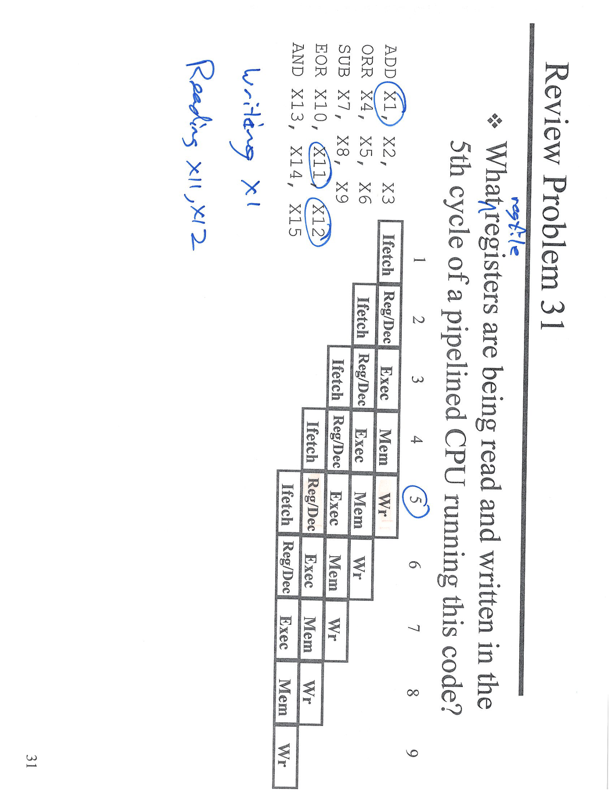
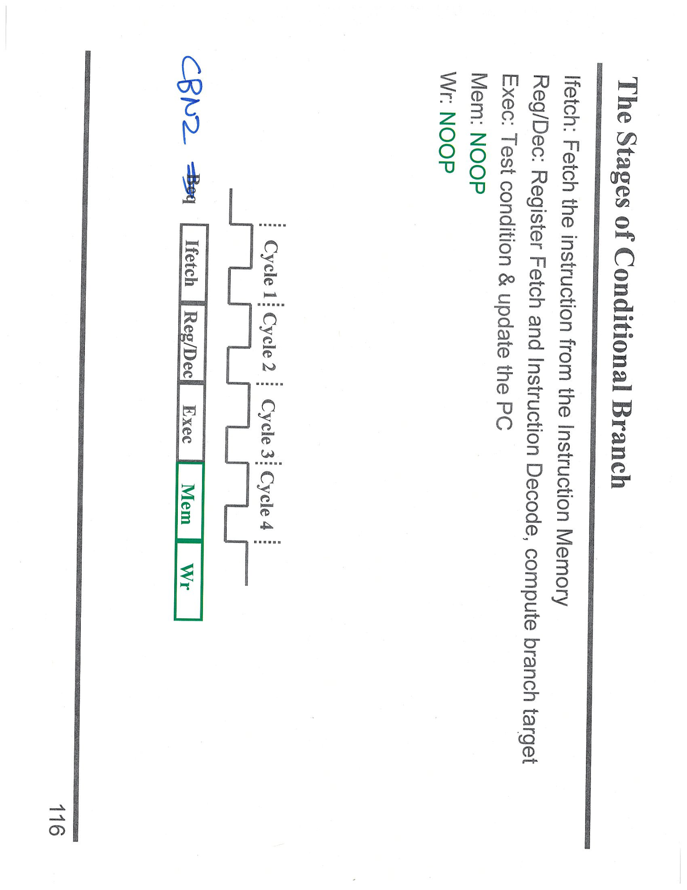
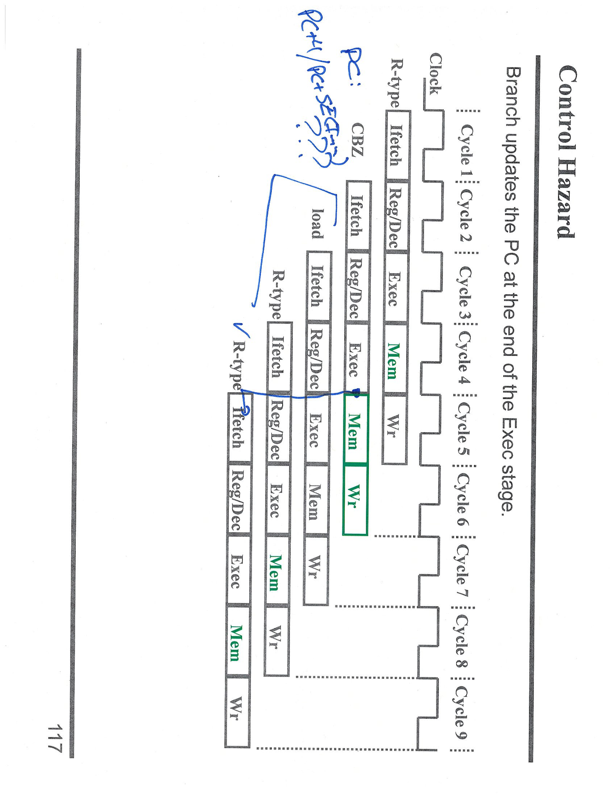
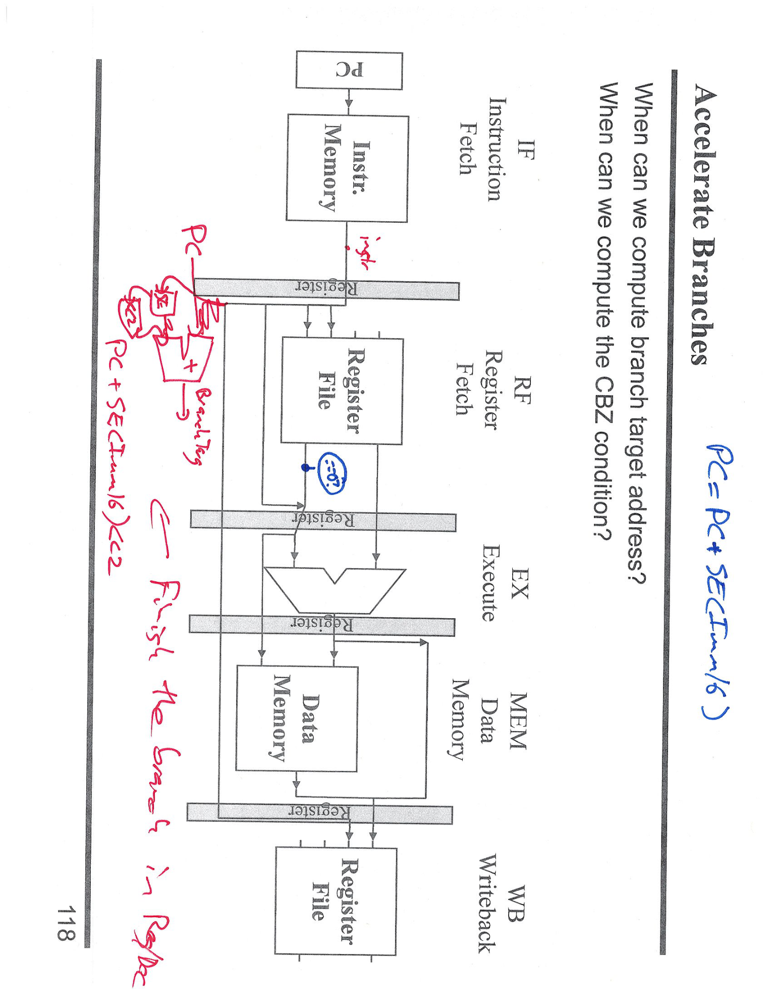
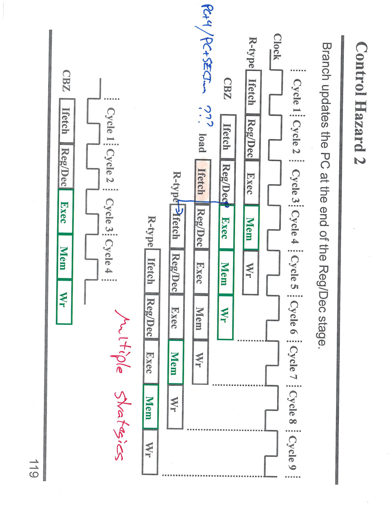
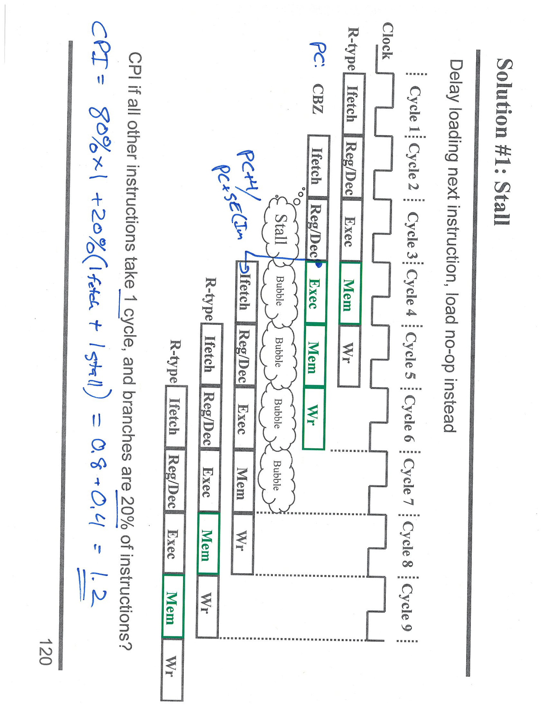
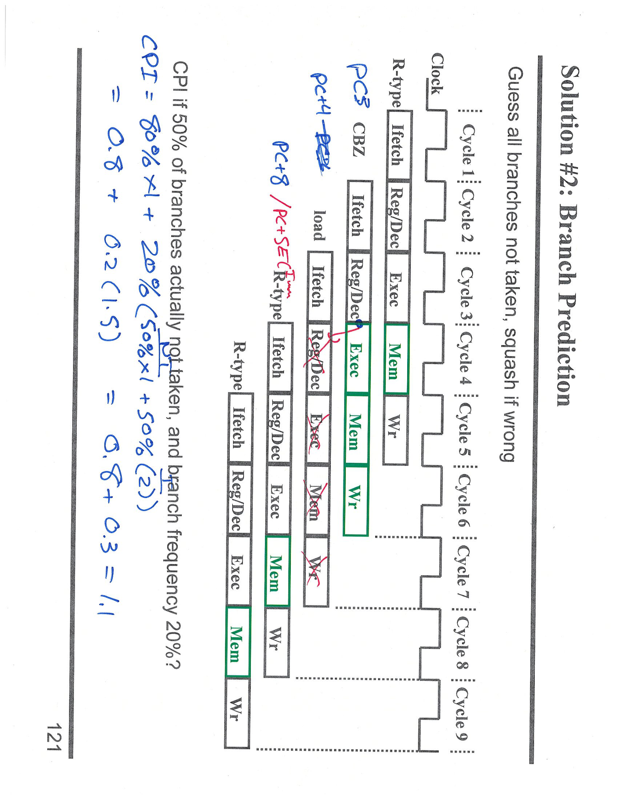

---

## 第 1 页



这道题是一个**流水线 CPU（pipelined CPU）寄存器读写分析题**。我们一步一步来看图里的内容和逻辑。

---

## 🧩 题目内容分析

题目要求：

> 在这段代码执行的第 5 个时钟周期（5th cycle）中，哪些寄存器正在被读取（read）和写入（write）？

代码如下：

```
ADD X1, X2, X3
ORR X4, X5, X6
SUB X7, X8, X9
EOR X10, X11, X12
AND X13, X14, X15
```

而右侧表格表示了一个 **五级流水线（5-stage pipeline）** 的执行阶段：

```
1. Ifetch  (取指令)
2. Reg/Dec (寄存器读 & 指令译码)
3. Exec    (执行)
4. Mem     (存储访问)
5. Wr      (写回)
```

---

## 🔍 逐周期分析

每条指令依次进入流水线：

| 周期    | 指令1     | 指令2     | 指令3      | 指令4         | 指令5        |
| ----- | ------- | ------- | -------- | ----------- | ---------- |
| 1     | Ifetch  |         |          |             |            |
| 2     | Reg/Dec | Ifetch  |          |             |            |
| 3     | Exec    | Reg/Dec | Ifetch   |             |            |
| 4     | Mem     | Exec    | Reg/Dec  | Ifetch      |            |
| **5** | **Wr**  | **Mem** | **Exec** | **Reg/Dec** | **Ifetch** |

题目要我们看的是第 **5 个周期**。

---

## 🧠 第 5 周期中每条指令的阶段

1. **指令 1：ADD X1, X2, X3**

* 当前阶段：**Wr（写回）**
* 写入寄存器：**X1**
* 它把执行结果写回到目的寄存器 X1。

2. **指令 2：ORR X4, X5, X6**

* 当前阶段：**Mem（存储访问）**
* 无寄存器读写发生（只是可能等待内存访问结果）。

3. **指令 3：SUB X7, X8, X9**

* 当前阶段：**Exec（执行阶段）**
* 这里会**读取源寄存器 X8、X9**，并进行减法运算。

4. **指令 4：EOR X10, X11, X12**

* 当前阶段：**Reg/Dec（译码阶段）**
* 译码阶段也会**读取源寄存器 X11、X12**。

5. **指令 5：AND X13, X14, X15**

* 当前阶段：**Ifetch（取指令）**
* 只是取指，还没有寄存器读写。

---

## ✅ 第 5 个周期的寄存器读写情况总结

| 操作类型          | 寄存器      | 来源                     |
| ------------- | -------- | ---------------------- |
| **写入（Write）** | X1       | 指令1（ADD X1, X2, X3）    |
| **读取（Read）**  | X8, X9   | 指令3（SUB X7, X8, X9）    |
| **读取（Read）**  | X11, X12 | 指令4（EOR X10, X11, X12） |

**最终答案：**

* 正在写入的寄存器：`X1`
* 正在读取的寄存器：`X8, X9, X11, X12`

---

## 📘 附加说明：为什么只这些在读写？

因为流水线结构中，每个周期只有不同阶段的指令“活跃”地访问寄存器：

* **Reg/Dec（译码阶段）** → 读取寄存器
* **Wr（写回阶段）** → 写入寄存器
其他阶段（Exec、Mem、Ifetch）不会直接访问寄存器文件。

---

## \[口语化表达]

这个图其实就是在考流水线 CPU 各阶段什么时候会去“碰寄存器”。
到了第 5 个周期，第 1 条指令刚好执行完，要把结果写回 X1；
第 3、4 条指令在执行或译码阶段，会去读它们的源寄存器。
所以这一拍中：
👉 写的是 X1，
👉 读的是 X8、X9（来自 SUB）还有 X11、X12（来自 EOR）。


---

## 第 2 页



这张图展示的是 **条件分支指令（Conditional Branch Instruction）在流水线（Pipeline）中的各个阶段**。我们来一步一步解释整张图的含义。

---

## 🧩 图表说明：The Stages of Conditional Branch

这张图的标题是 **“The Stages of Conditional Branch”**（条件分支的各个阶段），意思是说明一条分支指令（比如 CBNZ、CBZ 等）在流水线 CPU 中是怎么一步步被执行的。

图中标出了五个典型阶段：

| 阶段名         | 全称                      | 功能说明                                               |
| ----------- | ----------------------- | -------------------------------------------------- |
| **Ifetch**  | Instruction Fetch       | 从指令存储器中取出指令。                                       |
| **Reg/Dec** | Register Fetch / Decode | 从寄存器中取出操作数，并进行指令译码，计算分支目标地址。                       |
| **Exec**    | Execute                 | **测试条件（test condition）** 并 **更新程序计数器（PC）**，决定是否跳转。 |
| **Mem**     | Memory Access           | 对于分支指令来说，这一阶段 **不需要访问内存**，所以是 **NOOP（无操作）**。       |
| **Wr**      | Write Back              | 同样，这一阶段 **不写回寄存器**，所以也是 **NOOP**。                  |

---

## 🔍 图中执行阶段细节

图下方的表格显示了指令在流水线中的时序：

| 周期      | 阶段        |
| ------- | --------- |
| Cycle 1 | Ifetch    |
| Cycle 2 | Reg/Dec   |
| Cycle 3 | Exec      |
| Cycle 4 | Mem（NOOP） |
| Cycle 5 | Wr（NOOP）  |

这意味着：

* 在第 1 个周期，指令从内存中被取出；
* 在第 2 个周期，CPU 解码并读取寄存器；
* 在第 3 个周期，判断分支条件（例如寄存器是否为零）；
* 在第 4 和第 5 个周期，不做任何操作（NOOP），因为分支指令没有存储访问，也没有寄存器写回。

---

## 🧠 “CBNZ” 是什么？

图中手写的 “CBNZ” 代表 **“Compare and Branch if Not Zero”**，中文是“若不为零则跳转”。

* 它会检查某个寄存器的值；
* 如果寄存器内容 ≠ 0，就跳转到指定的目标地址；
* 如果寄存器内容 = 0，就顺序执行下一条指令。

例如：

```
CBNZ X9, Label
```

意思是：

> 如果 X9 ≠ 0，就跳转到 Label；否则继续执行下一条指令。

---

## 🧾 小结：条件分支的流水线行为

1. **取指令 (Ifetch)**：从内存取出 CBNZ 指令。
2. **寄存器读取和译码 (Reg/Dec)**：读取被比较的寄存器（例如 X9），同时计算跳转目标地址。
3. **执行阶段 (Exec)**：检查寄存器是否为零，并更新 PC（程序计数器）。
4. **内存阶段 (Mem)**：没有内存操作 → **NOOP**。
5. **写回阶段 (Wr)**：不写寄存器 → **NOOP**。

所以分支类指令的有效操作只发生在 **前三个阶段**，后两个阶段为空操作。

---

## \[口语化表达]

这页讲的是“条件跳转”指令（像 CBNZ）在流水线里是怎么走的。
它第一拍先取指，第二拍去读寄存器和解码，第三拍判断要不要跳转、更新程序计数器。
后面两个阶段其实啥也不干，就是空的（NOOP），因为分支指令不访问内存，也不写寄存器。
所以整条指令真正有用的就是前三步，后面只是让流水线保持节奏。


---

## 第 3 页



这页讲的是 **控制冒险（Control Hazard）**，也叫 **分支冒险（Branch Hazard）**，是流水线（Pipeline）CPU 中的一个非常重要的问题。我们来分部分解释图中每个部分的含义。

---

## 🧩 标题与主题说明

标题是 **“Control Hazard”**，中文意思是 **控制冒险**。

右上角一句话说明了关键点：

> **Branch updates the PC at the end of the Exec stage.**
> 分支指令会在 **执行阶段（Exec）结束时** 更新程序计数器（PC）。

这句话是整页的核心！

也就是说，CPU 在执行 **分支指令（如 CBZ、CBNZ）** 时，**直到执行阶段结束** 才知道是否跳转、跳到哪里。

---

## 🧠 为什么会有“控制冒险”？

在流水线 CPU 中，指令是并行执行的，比如：

| 周期 | 指令1     | 指令2     | 指令3     | 指令4     |
| -- | ------- | ------- | ------- | ------- |
| 1  | Ifetch  |         |         |         |
| 2  | Reg/Dec | Ifetch  |         |         |
| 3  | Exec    | Reg/Dec | Ifetch  |         |
| 4  | Mem     | Exec    | Reg/Dec | Ifetch  |
| 5  | Wr      | Mem     | Exec    | Reg/Dec |

假设 **指令1 是一条分支指令（CBZ）**：

* 它要到 **执行阶段（Exec）结束时** 才能确定跳转与否；
* 但是 CPU 在这之前（比如周期 2、3、4）已经**继续取了几条后面的指令（指令2、3...）**。

如果分支要跳转，那这几条提前取的指令其实是“走错路”的，就必须全部丢弃，这就是 **控制冒险**。

---

## 🔍 图中阶段详解

图中列出了不同类型的指令（R-type、Load、CBZ）的流水线阶段：

### 1️⃣ R-type（普通算术指令）

执行顺序：

```
Ifetch → Reg/Dec → Exec → Mem → Wr
```

### 2️⃣ Load（加载指令）

执行顺序：

```
Ifetch → Reg/Dec → Exec → Mem → Wr
```

与 R-type 类似，只是结果来自内存。

### 3️⃣ CBZ（Compare and Branch if Zero）

执行顺序：

```
Ifetch → Reg/Dec → Exec → Mem(NOOP) → Wr(NOOP)
```

**Exec 阶段判断是否跳转，并在这时更新 PC。**

---

## 🧮 手写标注解释

你图上的手写笔记有：

> “PC: PC+4 / PC+SEXT???”

这句话的意思是：

* 正常情况下，**PC（程序计数器）每次加 4**，即 `PC = PC + 4`，表示顺序执行下一条指令。
* 对于分支指令，如果条件成立，则 `PC = PC + SignExtend(Imm)`（符号扩展后的偏移值），即跳转到新的地址。

因此，执行阶段（Exec）结束时，CPU 会根据条件：

* 如果不跳转 → `PC = PC + 4`
* 如果跳转 → `PC = PC + SEXT(offset)`

---

## ⚙️ 图中的流水线冲突（Control Hazard）

在图中：

* 当 **CBZ** 在执行阶段（Exec）判断是否跳转时，**下一条 Load 和 R-type 指令已经被取进来了**。
* 如果 CBZ 需要跳转，那这两条指令其实应该被**丢弃（Flush）**。
* 这会造成流水线暂停或浪费周期 → **这就是控制冒险的延迟。**

---

## ✅ 总结：控制冒险的关键点

1. **分支指令（CBZ/CBNZ）在 Exec 阶段才知道跳不跳。**
2. 因为 CPU 预先取了指令（流水线重叠），所以如果跳转成立，要丢掉错取的指令。
3. 程序计数器（PC）更新方式：

* 不跳转 → `PC = PC + 4`
* 跳转 → `PC = PC + SignExtend(offset)`
4. 这种不确定性造成流水线停顿，称为 **控制冒险（Control Hazard）**。

---

## \[口语化表达]

这一页讲的是分支冒险，就是 CPU 碰到跳转指令时，流水线会“卡壳”。
像 CBZ 这种指令，得等到执行阶段才知道到底要不要跳。
可 CPU 在这之前已经把后面几条指令都取出来了，要是跳了，那些就全错了，只能丢掉重新取。
所以这时候程序计数器（PC）要么是 `PC+4`（不跳），要么是 `PC+偏移量`（跳转）。
简单讲，这页就是在说分支指令更新 PC 太晚，会让流水线白干几拍，这就是“控制冒险”。


---

## 第 4 页



这张图讲的是如何**加速条件分支（Accelerate Branches）**，也就是让分支指令（像 CBZ、CBNZ）更快判断跳不跳，从而减少 **控制冒险（Control Hazard）**。我们来一步一步详细解释。

---

## 🧩 图的整体结构：五级流水线的数据通路

整张图展示的是一个典型的 **五级流水线 CPU 数据通路（Pipeline Datapath）**，分为以下五个阶段：

| 阶段  | 名称                                    | 功能                                |
| --- | ------------------------------------- | --------------------------------- |
| IF  | Instruction Fetch（取指阶段）               | 从指令存储器（Instruction Memory）取出当前指令。 |
| RF  | Register Fetch / Decode（寄存器取数 & 指令译码） | 从寄存器文件读取操作数，同时译码指令。               |
| EX  | Execute（执行阶段）                         | 执行算术逻辑操作，或计算分支目标地址。               |
| MEM | Memory（内存访问）                          | 对数据存储器进行读写操作。                     |
| WB  | Write Back（写回阶段）                      | 把执行结果写回寄存器。                       |

---

## 🔍 关键问题：分支跳转地址什么时候能算出来？

右上角问题写着：

> When can we compute branch target address?
> When can we compute the CBZ condition?

翻译为：

> 我们什么时候可以计算出分支目标地址？
> 我们什么时候能知道 CBZ 的条件（是否为零）？

---

## 🧠 分支跳转的正常流程

一般情况下，**分支跳转目标地址（Branch Target Address）** 是这样计算的：

```
Branch Target = PC + SignExtend(Immediate) × 4
```

也就是说，跳转目标地址 = 当前 PC 加上偏移量（立即数扩展后再乘 4）。
例如，在 ARM 架构中，分支指令的跳转偏移存放在指令中一个 16 位字段内（图中红字 “SEXT(im16)” 指的就是这个）。

---

## 🚀 图中的“加速分支”优化思想

图中你可以看到手写笔记写着：

> “PC + SEXT(im16)”
> “Finish the branch in Reg/Dec”

意思是：

> 我们可以在 **Reg/Dec（寄存器取数和译码阶段）** 就把跳转目标算好，而不是等到执行阶段！

---

### 🧮 普通做法（未优化）

在普通流水线中：

* **取指（IF）**：取出分支指令；
* **译码（Reg/Dec）**：读取寄存器，但还不知道要不要跳；
* **执行（EX）**：判断条件是否为零（CBZ）并计算目标地址；
* 然后才更新 PC。

➡️ 缺点：到第 3 阶段（EX）才知道跳不跳，会造成**2 个周期的控制冒险延迟**。

---

### ⚡ 优化后（Accelerated Branch）

优化思路：

* 在 **Reg/Dec 阶段** 提前计算出跳转目标地址 `PC + SignExtend(im16)`；
* 同时也能从寄存器文件中取到要比较的寄存器值；
* 这样就可以在译码阶段就判断是否为零，从而**提前更新 PC**。

➡️ 优点：分支决策提前了一个阶段，流水线不用白白浪费那么多周期。

---

## 🧾 图中红色标注的含义解释

你图上手写的部分（红笔）意思如下：

* **PC + SEXT(im16)**：表示计算跳转目标地址的方法（当前 PC 加上符号扩展后的立即数）。
* **→ Finish the branch in Reg/Dec**：说明如果能在译码阶段完成这个计算，就可以更快地跳转。
* **Branch Target**：箭头指出目标地址来源，是由加法器计算出来的（PC 与偏移相加）。

也就是说，这个改进版的数据通路在译码阶段就能：

1. 从指令中提取立即数；
2. 把它符号扩展（Sign-Extend）；
3. 和 PC 相加；
4. 得到目标跳转地址。

这样就可以提前决定是否跳转，大幅减少分支延迟。

---

## ✅ 总结重点

1. 分支指令（CBZ、CBNZ）通常要到执行阶段才知道是否跳转。
2. 如果能在 **Reg/Dec 阶段** 同时完成分支判断（寄存器取值 + 比较）和目标地址计算（PC + 偏移），就能**加快跳转决策**。
3. 这就是“Accelerate Branch”——提前计算分支目标，减少控制冒险。

---

## \[口语化表达]

这页讲的是怎么让跳转指令跑得更快。
正常情况下，CPU 要到执行阶段才知道要不要跳，太慢了；
但如果我们在译码阶段就同时拿到寄存器值，又把 PC 加上偏移量算好，就能提早判断。
图里的红笔写的“PC+SEXT(im16)”就是在说：我们可以提早在 Reg/Dec 阶段就算出目标地址。
这样分支指令不用等到第三拍，第二拍就能决定跳不跳，流水线也就更顺畅。


---

## 第 5 页



这张图讲的是 **控制冒险 2（Control Hazard 2）** —— 也就是在改进后流水线中，**分支跳转（CBZ）** 的更新点提前了，但依然可能造成多种控制冒险的情况。它延续了你上一页的“加速分支（Accelerate Branch）”概念。下面我们来一步步解释这张图。

---

## 🧩 标题与整体意思

标题是：

> **Control Hazard 2**
> Branch updates the PC at the end of the Reg/Dec stage.

意思是：

> 在这个版本中，**分支指令会在 Reg/Dec（寄存器取数 / 指令译码阶段）结束时更新 PC**。

也就是说，分支决策比以前更早完成了——以前要等到执行阶段（EX）结束，现在提前到了译码阶段（Reg/Dec）。

---

## 🧠 背景回顾（上一页内容的延续）

在标准流水线中，CBZ（Compare and Branch if Zero）要在第 3 阶段（Exec）才能判断是否跳转，所以分支决策延迟了两个周期，造成控制冒险。
而这页图展示的是一个优化后的设计：
👉 **现在在 Reg/Dec 阶段就能完成判断与目标地址计算。**

这意味着——分支跳转可以更快更新 PC，从而减少流水线停顿。

---

## 🔍 图中内容详解

图表左侧显示了多条指令的流水线进程：

| 指令类型       | 阶段顺序                               | 特点                                 |
| ---------- | ---------------------------------- | ---------------------------------- |
| **CBZ**    | Ifetch → Reg/Dec → Exec → Mem → Wr | 在这里，分支决定在 **Reg/Dec 阶段末尾** 就更新 PC。 |
| **load**   | Ifetch → Reg/Dec → Exec → Mem → Wr | 加载数据指令。                            |
| **R-type** | Ifetch → Reg/Dec → Exec → Mem → Wr | 普通算术指令（例如 ADD）。                    |

图中标记的 **绿色方块（Mem / Wr）** 表示正在活跃的阶段；
红色手写的 “multiple strategies” 表示为了解决控制冒险，CPU 可以采用多种策略。

---

## 🧮 分支跳转逻辑的关键点

右上角手写的蓝字 “PC+4 / PC+SExtimm ???” 指的是分支跳转地址的两种可能：

1. **如果条件为假** → 顺序执行 → `PC = PC + 4`
2. **如果条件为真** → 跳转执行 → `PC = PC + SignExtend(Immediate)`

在这页中，由于分支判断提前到了 **Reg/Dec 阶段**，
CPU 能更早决定是走顺序路径还是跳转路径。

---

## ⚙️ 控制冒险的变化

当分支更新 PC 的时机提前时：

* 优点：不必等到执行阶段再判断，减少了空转周期；
* 但仍有可能导致部分指令被错误取出（因为在取指阶段还没知道跳转结果）；
* 所以 CPU 仍然需要一些策略（strategies）来应对。

---

## 🧭 “Multiple Strategies”（多种策略）解释

为了进一步减少控制冒险，CPU 通常会使用几种办法：

1. **Flush（冲刷流水线）**
当发现跳转成立，就把错误取的指令全部清空，重新取指。

2. **Branch Prediction（分支预测）**
在真正判断结果出来前，先“猜”要不要跳转。猜对了就不浪费周期，猜错了就丢掉错的指令。

3. **Branch Delay Slot（延迟槽）**
让跳转指令后面的一条指令总是执行一次，这样可以利用被浪费的一个周期。

4. **Early Branch Resolution（提前分支判定）**
就像这页展示的那样，把分支判断提早到 Reg/Dec 阶段完成。

---

## ✅ 总结：这页的核心意思

1. 这页展示的是改进版流水线，**CBZ 分支在 Reg/Dec 阶段末尾就更新 PC**；
2. 相比以前的版本（在 EX 阶段更新），这样可以减少控制冒险；
3. 分支跳转的地址仍然是 `PC + 4` 或 `PC + SignExtend(Imm)`；
4. 不同 CPU 实现会采用多种策略（multiple strategies）进一步减少分支带来的停顿；
5. 总体目标是 **更快决定跳转、减少浪费周期**。

---

## \[口语化表达]

这一页讲的是“控制冒险”的第二种情况，也就是把分支判断提早做。
以前要等到执行阶段才能知道跳不跳，现在 CPU 可以在译码阶段就算出目标地址、判断寄存器是不是零。
这样 PC 能更早更新，不用白等好几拍。
不过即使提早了，也还是有可能提前取错指令，所以还得靠“多种策略”——比如分支预测、清空错误指令、或者延迟槽来优化。
简单说，这页就是在说明：提前判断分支能让流水线更快，但仍要用不同方法来避免浪费周期。


---

## 第 6 页



这张图讲的是 **解决控制冒险（Control Hazard）的一种方法：Stall（暂停 / 插入气泡）**。
题目标题写的是：**Solution #1: Stall**。意思是：第一种解决方案是让流水线“暂停一拍”，来等待分支结果确定后再继续取下一条指令。下面我们详细分解图里的意思。

---

## 🧩 标题与题目背景

* **主题：** Control Hazard（分支冒险）
* **方案：** Stall（暂停 / 插入空周期）
* **问题：** 当遇到分支指令（比如 CBZ）时，我们不知道下一条指令到底要从哪取（跳转还是顺序执行），所以需要**暂停流水线一拍**来等结果出来。

---

## 🧠 流水线阶段回顾

五级流水线的阶段：

```
1️⃣ IF — Instruction Fetch（取指令）
2️⃣ Reg/Dec — Register Fetch / Decode（寄存器读取 & 指令译码）
3️⃣ EX — Execute（执行 / 运算）
4️⃣ MEM — Memory（访问数据存储器）
5️⃣ WB — Write Back（写回寄存器）
```

CBZ（Compare and Branch if Zero）是一条**条件跳转指令**，
它要判断某个寄存器是不是 0，然后决定：

* 若为 0 → 跳转到目标地址；
* 若不为 0 → 顺序执行。

---

## 🔍 图中关键部分详解

### 1️⃣ 分支延迟与暂停（Stall）

图上显示：

* 当流水线执行到 **CBZ** 的 **Reg/Dec 阶段** 时，
CPU 还不知道下一条指令要从哪取。
* 所以接下来的 **一个周期**，CPU 不取新指令，而是停下来等结果。

图中标注了一个 **“Stall”**（暂停气泡），
同时在下一条 R-type 指令的 Ifetch 位置写了 “Bubble”——意思是这一个周期是空的，什么都不做。

这一拍的作用是：
➡️ 等分支判断（PC + 4 或 PC + SignExtend(im)）完成。
然后再开始取正确的下一条指令。

---

### 2️⃣ 手写笔记解释

蓝笔写的 “PC+4 / PC+SExt(im)”
说明此时分支指令会根据条件更新程序计数器 PC：

* 不跳转 → PC = PC + 4
* 跳转 → PC = PC + SEXT(im)（符号扩展后的偏移值）

所以暂停一拍是为了给 CPU 时间计算并更新这个 PC。

---

### 3️⃣ CPI 计算（Cycles Per Instruction）

左侧蓝色手写公式：

```
CPI = 80% × 1 + 20% × (1 + Stall)
= 0.8 + 0.4 = 1.2
```

解释：

* 假设程序中：

* 普通指令占 80%，执行都只要 1 个周期；
* 分支指令占 20%，每条分支指令多浪费 1 个气泡周期（Stall = 1）。
* 那么平均每条指令的执行周期（CPI）就是 1.2。

✅ 这个结果说明：

> 因为分支导致的暂停，让整体性能下降了 20%。

---

## ⚙️ 整体执行顺序分析

| 周期      | CBZ     | 下一条 R-type | 说明            |
| ------- | ------- | ---------- | ------------- |
| Cycle 1 | IF      |            | 取 CBZ 指令      |
| Cycle 2 | Reg/Dec |            | 译码阶段，等待判断     |
| Cycle 3 | EX      | Stall      | 暂停一拍，等待判断结果   |
| Cycle 4 | MEM     | IF         | 根据分支结果取正确的新指令 |
| Cycle 5 | WB      | Reg/Dec    | 后续正常运行        |

可以看到，分支导致流水线“断了一拍”，形成一个气泡。

---

## ✅ 总结重点

1. **问题：** 分支指令导致控制冒险，因为不知道下一条指令从哪里取。
2. **解决方案 #1：** 暂停（Stall），插入一个空周期等待分支判断结果。
3. **结果：**

* 性能下降：每条分支指令多花 1 拍。
* 平均 CPI（每条指令周期）= 1.2。
4. **本质：** 用等待时间换取正确性——让 CPU 不取错指令。

---

## \[口语化表达]

这页讲的是：碰到跳转指令时，CPU 不知道接下来该跳到哪，所以干脆先“停一拍”。
这叫 **Stall**，意思就是插入一个空周期，等分支结果出来再继续。
图上那条 CBZ 指令就是在译码阶段卡了一下，下一条指令就被延迟取进来。
算下来，如果分支占 20%，每条指令平均就多花 0.2 拍，也就是 CPI = 1.2。
简单说，这页在讲：用“暂停一拍”来解决控制冒险，虽然安全，但会让 CPU 效率下降一点。


---

## 第 7 页



这张图讲的是 **控制冒险的第二种解决方法：Branch Prediction（分支预测）**。
也就是让 CPU **提前“猜”跳转结果**，然后继续执行；如果猜错了，再把错的指令清掉重新取。
题目标题写的是：**Solution #2: Branch Prediction**。

我们来分解图里每一部分内容并解释它的逻辑。

---

## 🧩 标题与基本思想

标题：

> **Solution #2: Branch Prediction**
> “Guess all branches not taken, squash if wrong.”

意思是：

> “假设所有分支都**不会跳转（not taken）**，如果猜错了（其实跳了），再清空错误的指令。”

这就是最常见、最简单的一种分支预测策略——
**静态预测（Static Prediction）**，假设分支不跳。

---

## 🧠 背景知识回顾

分支指令（CBZ, CBNZ）执行时有两种可能：

* **不跳转（Not taken）**：继续顺序执行下一条指令 → `PC = PC + 4`
* **跳转（Taken）**：跳到目标地址 → `PC = PC + SignExtend(Immediate)`

而 CPU 每次取指时必须提前知道“下一条指令的地址”。
所以如果它在**还没判断出分支结果**前，就**假设不跳转**，就可以让流水线继续运作。
→ 这样**不需要暂停（stall）**。

如果最后判断错了，就丢弃（squash）这些指令并重新取正确的那条。

---

## 🔍 图中流程解析

看图中各条指令的执行阶段：

| 指令            | 阶段说明                                                       |
| ------------- | ---------------------------------------------------------- |
| **CBZ**       | 在第 1 拍取指（Ifetch），第 2 拍译码（Reg/Dec），第 3 拍执行（Exec）时才真正知道是否跳转。 |
| **load**      | 在 CPU “猜不跳” 的前提下，直接顺序执行下去（PC+4）。如果后来发现猜错，就得丢掉。             |
| **R-type 指令** | 这些就是紧接着取下来的指令（假设分支没跳），如果预测错了，它们就是“错的指令”，要被清除。              |

图中有几个红色的叉（X）标在 Exec、Mem、Wr 上，就是在表示：

> 这些阶段被“squash”（清空、丢掉），因为分支预测错了。

也就是说，CPU 一开始猜错了，以为 CBZ 不跳，但后来执行阶段发现实际上应该跳，于是把错误执行的指令清除。

---

## 🧮 左侧蓝笔计算解释：CPI（每条指令平均周期）

题目问：

> If 50% of branches actually not taken, and branch frequency = 20%, what is CPI?

翻译：

> 如果分支指令占所有指令的 20%，其中有一半（50%）确实没跳转，那平均每条指令要花多少周期？

---

### ✳️ 公式解释

左侧蓝笔写的：

```
CPI = 80% × 1 + 20% × (50% × 1 + 50% × (1 + 2))
```

逐项解释：

* **80% × 1**：普通指令（非分支）占 80%，每条 1 个周期。
* **20% × (...)**：分支指令占 20%。

* 其中 50% 的分支预测正确（not taken），CPI = 1；
* 另 50% 预测错误（taken 但猜成 not taken），错的要**多浪费 2 拍**（因为需要清空两条错的指令）。

---

### ✳️ 计算过程

```
CPI = 0.8 + 0.2 × (0.5 × 1 + 0.5 × 3)
= 0.8 + 0.2 × 2
= 0.8 + 0.4
= 1.2
```

但图上似乎有简化版本写作：

```
CPI = 0.8 + 0.3 = 1.1
```

这是因为有的版本假设误预测只浪费 1.5\~2 拍，所以略做近似。
重点是：**分支预测明显比“暂停等待”的方法（CPI=1.2）更快。**

---

## ✅ 对比前一页方案（Stall vs. Prediction）

| 方案                          | 方法            | 分支时延        | CPI  | 优缺点       |
| --------------------------- | ------------- | ----------- | ---- | --------- |
| **Solution #1: Stall**      | 暂停一拍等分支判断结果   | 固定 1 拍延迟    | ≈1.2 | 简单但慢      |
| **Solution #2: Prediction** | 猜不跳继续执行，错了再清空 | 平均 ≈0.5 拍延迟 | ≈1.1 | 更高效，错时才浪费 |

---

## 📘 核心理解

1. 分支预测通过“猜测不跳”来保持流水线连续运行。
2. 如果猜对 → 不浪费周期；
如果猜错 → 清空错误指令（squash），浪费 2 拍左右。
3. 平均性能比完全暂停要好。
4. 预测正确率越高，CPI 越接近 1（理想状态）。

---

## \[口语化表达]

这页讲的是第二种办法——让 CPU 先“猜”一下分支会不会跳。
默认都猜“不跳”，如果后来发现猜对了就继续跑；要是猜错，就把那几条错的指令扔掉重来。
这样 CPU 就不用每次都停下来等结果，比之前的 Stall 快。
算下来，如果分支占 20%，其中一半猜对，一半猜错，平均 CPI 变成 1.1，比之前的 1.2 好一点。
简单说：这页在讲“猜一猜比傻等要聪明”，预测错才浪费，预测对就一路顺。
