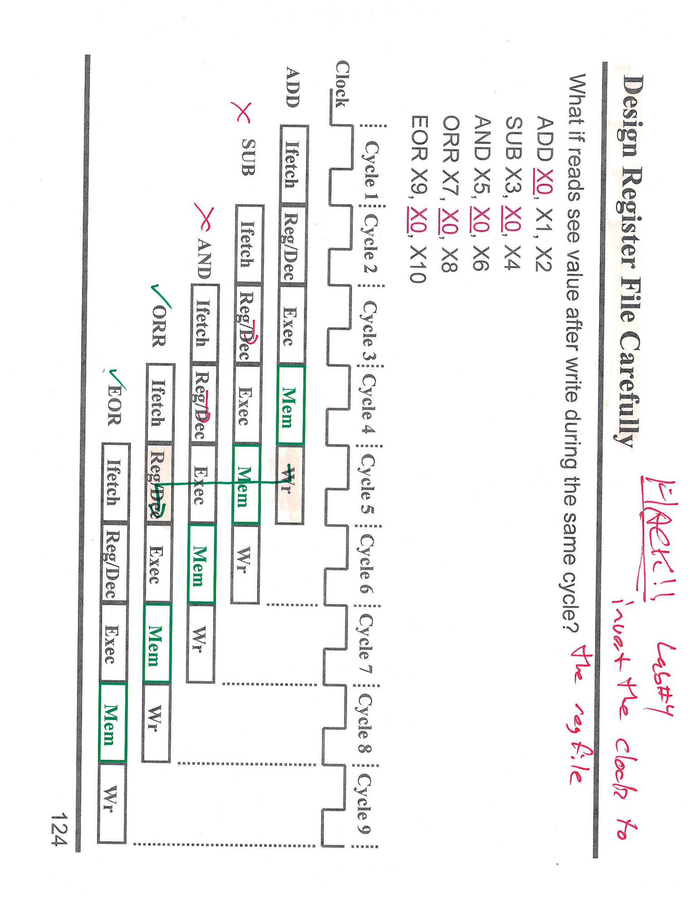

---

## 第 1 页


这张图展示的是一个五级流水线 CPU 各阶段的延迟（单位：ns），并且问题在讨论\*\*“改进哪一部分能带来更好的性能提升”\*\*。

---

### 🌟 问题内容

流水线 CPU 的五个阶段延迟如下：

| 阶段  | 模块                  | 延迟    |
| --- | ------------------- | ----- |
| IF  | 指令存储（Instr. Memory） | 25 ns |
| ID  | 寄存器堆（Register File） | 20 ns |
| EX  | ALU（算术逻辑单元）         | 20 ns |
| MEM | 数据存储（Data Memory）   | 30 ns |
| WB  | 寄存器堆（Register File） | 20 ns |

问题：

> 是否更好地将 ALU 加快 10 ns，还是将数据存储（Data Memory）加快 2 ns？

---

### ⚙️ 流水线工作原理

在流水线 CPU 中，**每个时钟周期的长度由最慢的阶段决定**。
也就是说：
时钟周期时间 = 最长阶段延迟 = `max(25, 20, 20, 30, 20) = 30 ns`。

所以整条流水线的时钟周期目前为 **30 ns**。

---

### 💡 分析选项

1. **如果把 ALU（20 ns）加快 10 ns → 变成 10 ns：**

* 各阶段延迟变为：25, 20, 10, 30, 20
* 最长阶段仍是 Data Memory（30 ns）
* 时钟周期仍为 **30 ns**
* → **没有性能提升！**

2. **如果把 Data Memory（30 ns）加快 2 ns → 变成 28 ns：**

* 各阶段延迟变为：25, 20, 20, 28, 20
* 最长阶段变为 28 ns
* 新的时钟周期 = **28 ns**
* → **性能提升 2/30 ≈ 6.7%**

✅ 所以：**加快数据存储（Data Memory）更好。**

---

### 🧠 第二个问题

> 如果是单周期 CPU（single-cycle CPU），你的答案会变吗？

单周期 CPU 的时钟周期 = **所有阶段延迟之和**，
即：25 + 20 + 20 + 30 + 20 = 115 ns。
加快 ALU 或 Memory 都会影响总延迟，但影响比例不同：

* 减少 ALU 10 ns → 新总延迟 105 ns → 改进约 8.7%
* 减少 Data Memory 2 ns → 新总延迟 113 ns → 改进约 1.7%

✅ 因此在单周期 CPU 下，**加快 ALU（10ns）更好**。

所以老师写的 “Yes. This speeds up longest path.” 是指：
在流水线 CPU 中，改善最长阶段（Data Memory）才会提高总体性能。

---

### 📋 结论总结

* **流水线 CPU**：加快 Data Memory（30ns → 28ns）提升性能。
* **单周期 CPU**：加快 ALU（20ns → 10ns）提升更多性能。
* 原因：流水线受最长阶段限制，单周期受所有阶段总和影响。

---

\[口语化表达]
这题其实在考流水线和单周期 CPU 的性能瓶颈。流水线 CPU 的时钟周期取决于最慢的阶段，所以你要加快那部分才有意义。图里最慢的是 Data Memory（30ns），所以把它提速 2ns 比 ALU 提速 10ns 更有用；但如果是单周期 CPU，就不同了，因为它一条指令要跑完所有阶段，ALU 少 10ns 会让总时间减少更多。简单说——流水线看最慢的那一块，单周期看总时间。


---

## 第 2 页


这张图讲的是 **“Branch Delay Slot（分支延迟槽）”** 的概念及其在指令流水线中的优化方法。我们来一步步拆解说明。

---

## 🧩 一、背景：分支指令的延迟问题

在流水线 CPU 中，**分支（branch）指令**（如 `CBZ X1, FOO` —— “如果 X1=0 就跳转到 FOO”）会导致流水线的控制流中断。
CPU 在取指（IF）阶段就要知道下一条指令的地址，但分支结果要等到执行（EX）阶段才能确定。这中间的几拍时间就会让流水线“卡住”，造成**分支延迟（branch delay）**。

---

## 🕳️ 二、解决方案：Branch Delay Slot（分支延迟槽）

**Branch Delay Slot** 是一种硬件与编译器的折中方法。
概念：

> “分支指令之后的一条指令（delay slot）**总会执行**，无论分支是否跳转。”

也就是说，分支不再立刻跳转，而是先执行“紧跟在分支指令后面”的一条指令。
这条“延迟槽指令”由**编译器或汇编器（compiler/assembler）来填充（fill）**。
目的是：**减少分支带来的空转周期（wasted cycles）。**

---

## 🧠 三、图中四个例子的说明

### 🔹 Ex #1

```
ADD X1, X0, X4
CBZ X2, FOO
```

旁边写着：**“No waste”**
意思是：
这里分支前的指令已经可以自然并行执行，分支延迟槽中没有浪费，性能没有损失。

---

### 🔹 Ex #2

```
SUB X2, X0, X3
ADD X1, X0, X4
CBZ X1, FOO
```

蓝笔标注：“either one, pick the likely one”
解释：
编译器可以把前面的 `ADD` 或 `SUB` 指令搬到分支延迟槽里（即放在 CBZ 后），
因为无论分支是否跳转，这条指令执行都没坏处。
这叫**填充 delay slot**，目的是避免浪费一个周期。

---

### 🔹 Ex #3

```
ADD X1, X0, X4
CBZ X1, FOO
ADD X1, X3, X3
```

蓝笔圈注：“Assume 50%”
意思是：
延迟槽中的 `ADD X1, X3, X3` 是有用的，但只有在分支不跳转时才有意义。
如果分支跳了，就白做了。
假设一半的时间分支跳，一半不跳，则**平均浪费 ½ 个周期**。

---

### 🔹 Ex #4

```
ADD X1, X0, X4
CBZ X1, FOO
ADD X31, X31, X31
```

红笔标注：“waste 1 cycle”
解释：
这里延迟槽的指令（`ADD X31, X31, X31`）与程序逻辑无关，是纯粹的占位符。
因此每次分支都会浪费这个执行周期。
即使有延迟槽，也**没有被有效利用**。

---

## ⚙️ 四、总结：编译器的作用

* 编译器在生成机器码时，会尽量寻找一条**与分支无关、但可以安全执行的指令**来填入延迟槽。
* 若找不到合适的指令，就只能填入“无操作指令（NOP）”，造成浪费。
* 延迟槽的引入能减少分支导致的气泡（pipeline bubble），但依赖编译器优化。

---

## 📋 结论

| 情况   | 延迟槽利用情况 | 性能损失      |
| ---- | ------- | --------- |
| Ex#1 | 无延迟     | 无损失       |
| Ex#2 | 填充有用指令  | 无损失       |
| Ex#3 | 指令部分有用  | 平均浪费 ½ 周期 |
| Ex#4 | 填充无用指令  | 浪费 1 周期   |

---

\[口语化表达]
这页讲的是“分支延迟槽”，也就是分支指令后面那条“延迟执行”的指令。因为分支要等结果才能跳转，流水线会空一拍，所以 CPU 规定分支后的那条指令无论跳不跳都要执行。编译器会尽量把有用的指令塞进去，减少浪费。比如 Ex2 就很聪明地重排指令，完全没浪费；Ex3 有时浪费半拍；Ex4 塞了没用的指令，每次都白跑一拍。简单说，就是让 CPU 在分支那一瞬间“别闲着”，尽量干点正事。


---

## 第 3 页


这张图讲的是 **“Data Hazards（数据冒险）”** 在流水线 CPU 中的产生与表现方式。它通过一个具体的代码示例展示了指令间的数据依赖导致的**流水线冲突（pipeline hazard）**，并配有流水线时序图说明。

---

## 🧩 一、代码与含义

右边的代码如下：

```
ADD X0, X1, X2
SUB X3, X0, X4
AND X5, X0, X6
ORR X7, X0, X8
EOR X9, X0, X10
```

我们可以看到，所有后续指令（SUB、AND、ORR、EOR）都依赖 `X0` 这个寄存器的值。
而 `X0` 是由第一条 `ADD` 指令计算得出的。
→ 所以，这里存在**数据相关（data dependency）**。

---

## ⚙️ 二、流水线阶段说明

流水线的五个阶段：

1. **IFetch（取指）**
2. **Reg/Dec（寄存器读 & 指令译码）**
3. **Exec（执行 ALU 运算）**
4. **Mem（访存）**
5. **Wr（写回寄存器）**

---

## ⚠️ 三、数据冒险（Data Hazard）产生的原因

### 🧠 概念

数据冒险是指：

> 一条指令需要的操作数还没有被上一条指令写入寄存器时，就提前去读了寄存器。

在这里，`X0` 是 ADD 的输出，但 SUB、AND、ORR、EOR 都想立刻用它。
问题在于：

* `ADD` 直到 **第 5 个周期（Wr 阶段）** 才把结果写回寄存器 X0；
* 但 `SUB` 在 **第 3 个周期（Reg/Dec 阶段）** 就尝试读取 X0。

这就造成了一个典型的 **Read-After-Write (RAW)** 数据冒险。

---

## 🧩 四、图中分析（对应时序图）

在图中：

* 每条指令的执行阶段按时间展开（每个格代表一个时钟周期）。
* 红线表示数据依赖关系。
* 例如，红线从 `ADD` 的写回阶段（Wr）指向下一条指令的寄存器读取阶段（Reg/Dec），说明该指令需要等待数据。

分析如下：

| 指令                | 依赖          | 是否冒险  | 原因                      |
| ----------------- | ----------- | ----- | ----------------------- |
| `SUB X3, X0, X4`  | 依赖 `ADD` 结果 | ✅ 有冒险 | SUB 提前读取了 X0，但 ADD 还没写回 |
| `AND X5, X0, X6`  | 依赖 `ADD` 结果 | ✅ 有冒险 | 同理                      |
| `ORR X7, X0, X8`  | 依赖 `ADD` 结果 | ✅ 有冒险 | 同理                      |
| `EOR X9, X0, X10` | 依赖 `ADD` 结果 | ✅ 有冒险 | 同理                      |

在真正的 CPU 里，为了解决这种冒险，可以采用以下几种办法：

* **数据转发（Forwarding / Bypassing）**：直接从 ALU 输出把结果“提前送”给下一条指令；
* **插入气泡（Stall）**：让流水线暂停几拍，等数据准备好；
* **编译器重排（Reordering）**：调整指令顺序，减少依赖冲突。

---

## 🧮 五、图中绿色方块和红线的意义

* **绿色框** 是正常流水阶段（Mem、Wr）。
* **红色箭头** 表示从 `ADD` 的输出（写回阶段）到其他指令的输入（寄存器读阶段）的依赖关系。
* 它指出：由于 `X0` 的值在前几拍还没准备好，后续指令必须等待。

图左边的 “✔” 表示 EOR 已经能正确获得数据 —— 说明经过前面几条指令后，`ADD` 的结果已经写回，冒险在此处解除。

---

## 📋 六、总结

这张图说明了**同一个寄存器（X0）被多个指令依赖时，流水线可能出现数据冒险**。
因为流水线重叠执行，后续指令会过早地尝试读取结果，导致错误或暂停。
解决办法就是在硬件或编译器层面引入转发或延迟机制。

---

\[口语化表达]
这页讲的是流水线里的“数据冒险”。前面的 ADD 负责算出 X0 的值，可是后面的 SUB、AND、ORR、EOR 都马上要用 X0，这就像厨房里前一个人还没切完菜，后一个人就想下锅了，结果就冲突了。图上那些红线就是在提醒：SUB 太早用了 X0，ADD 还没写回去呢，所以会出错或得等。解决办法就是让 CPU 把结果“提前传给下一个”，或者干脆“等一会再执行”。总之，就是流水线里因为数据依赖卡壳的经典例子。


---

## 第 4 页



这张图讲的是**流水线 CPU 中寄存器文件（Register File）的设计问题**，重点是——**读写在同一个时钟周期发生时，能否保证读取到最新的数据**。这是解决“数据冒险（Data Hazard）”的一种硬件级优化方案。

---

## 🧩 一、问题背景

右上角的题目写着：

> *“What if reads see value after write during the same cycle?”*
> 意思是：
> “如果寄存器在同一个时钟周期内，既被写入（write）又被读取（read），我们能否让读取操作看到最新写入的值？”

在前一页（第 123 页）中，我们看到因为 ADD 指令写回太晚，后面的指令（如 SUB、AND）在寄存器读阶段（Reg/Dec）时读到的是旧值，从而产生了**数据冒险**。

而这页的核心思想就是——
👉 如果硬件能做到“在同一个周期内先写后读”，那么后面的指令就能直接读到刚写好的新值，不会出错，也就避免了冒险。

---

## ⚙️ 二、图中分析（流水线时序）

### 🔹 程序代码（右侧）

```
ADD X0, X1, X2
SUB X3, X0, X4
AND X5, X0, X6
ORR X7, X0, X8
EOR X9, X0, X10
```

可以看到，后面每条指令都依赖于 ADD 生成的 `X0`，和上一页一样，是典型的 **Read-After-Write (RAW)** 数据相关。

---

### 🔹 图中时间线解释

* 横轴是时钟周期（Cycle 1 \~ Cycle 9）；
* 每条指令有五个阶段（Ifetch、Reg/Dec、Exec、Mem、Wr）；
* 绿色块表示各阶段正常运行；
* 红叉 ❌ 代表 “读取到了错误或旧的数据”；
* 绿色勾 ✔️ 表示 “成功读取到正确数据”。

---

## 🧠 三、关键机制：同周期写后读（Write-before-Read）

问题核心在于：
当某个寄存器在一个周期被“写”（Wr）时，另一个指令可能在**同一个周期**去“读”它。

比如：

* `ADD` 在 **Cycle 5** 写回结果到 X0；
* `SUB` 在 **Cycle 5** 的 Reg/Dec 阶段读取 X0。

如果寄存器文件的硬件电路能做到**先写后读（write before read）**，那 `SUB` 读到的就是最新值 ✅；
如果做不到，则读到的是旧值 ❌。

---

## 🔧 四、如何实现“先写后读”

右边红笔写的提示是：

> “EASY!! invert the clock to the reg file”
> 意思是：
> “很简单，把寄存器文件的时钟相位反过来即可。”

也就是说：

* 整个 CPU 的主要操作在时钟上升沿进行（正缘触发）；
* 而寄存器文件可以设计成在**下降沿**进行写入。

这样：

1. 在同一个时钟周期内，先执行写操作（下降沿）；
2. 紧接着执行读操作（上升沿）。

结果：读操作总能看到刚写入的新值 ✅。

---

## 📋 五、图中每条指令解释

| 指令  | 是否能正确读到 X0 | 原因                     |
| --- | ---------- | ---------------------- |
| SUB | ❌          | 写回太晚，读到旧值（如果未采用先写后读机制） |
| AND | ❌          | 同上                     |
| ORR | ✔️         | 在此周期中 ADD 的写回已完成，读到新值  |
| EOR | ✔️         | 已无冲突                   |

当实现“先写后读”机制后，SUB、AND 也能正确读取，从而完全避免冒险。

---

## 🧮 六、总结

这页讲的其实是硬件层面的微调：

* 如果寄存器文件设计成“写在时钟下降沿，读在上升沿”，
* 那么在同一个周期中，“写 → 读”可以顺序发生，
* 后续指令就能马上看到正确的最新结果，
* 从而大大减少数据冒险。

---

\[口语化表达]
这一页是在教你一个“聪明的电路小技巧”。前面不是说流水线因为 ADD 写 X0 太慢，后面几条指令老是读到旧值吗？其实不用加气泡、不用复杂转发，硬件上只要让寄存器在时钟下降沿写入、上升沿读取，就能在同一个周期里先写后读。这样 SUB、AND 马上就能拿到最新的 X0，不会再出错。老师右边写的 “EASY!! invert the clock” 就是这个意思——反相寄存器文件的时钟，简单又有效。


---

## 第 5 页


这张图讲的是**流水线 CPU 中解决数据冒险（Data Hazard）的一种关键技术——Forwarding（数据转发）**。
Forwarding 也叫 **bypassing（旁路传递）**，是让运算结果可以提前被下一条指令使用，而不必等它写回寄存器。

---

## 🧩 一、背景：前后指令数据相关

右边的程序代码是：

```
ADD X0, X1, X2
SUB X3, X0, X4
AND X5, X0, X6
ORR X7, X0, X8
EOR X9, X0, X10
```

可以看到：

* 第一条 `ADD` 指令计算得到 `X0`；
* 接下来的 `SUB`、`AND`、`ORR`、`EOR` 都依赖于这个 `X0`。

也就是说，这些后续指令都需要用到 `ADD` 的结果。
如果按照普通的流水线执行顺序（取指 → 译码 → 执行 → 访存 → 写回），那么：

* `ADD` 要到 **第 5 个周期（Wr 阶段）** 才把结果写回寄存器；
* 但 `SUB` 在 **第 3 个周期（Exec 阶段）** 就已经要用这个结果。

这就会导致典型的 **RAW（Read After Write）数据冒险**。

---

## ⚙️ 二、解决思路：Forwarding（数据转发）

Forwarding 的核心思想是：

> 不用等结果写回寄存器，而是直接把 ALU 的计算结果“提前传”给下一条指令的 ALU 输入。

换句话说，就是在硬件中增加“旁路”：

* 当检测到后一条指令需要用到前一条 ALU 结果时，
* 就直接把结果从 **ALU 输出端** 传到下一条指令的 **ALU 输入端**，
* 不需要经过寄存器文件。

这就像在流水线中加了一条“捷径”，直接把上一步的输出送到下一步用。

图右侧绿色字写着：

> “passing results in the FUs”（在功能单元之间传递结果）
> 这正是指 Forwarding 的实现原理。

---

## 🧠 三、图中时序说明

图的横轴表示时钟周期（Cycle 1\~9），
纵向表示每条指令在流水线中的五个阶段：

| 阶段  | 英文缩写    | 含义         |
| --- | ------- | ---------- |
| IF  | Ifetch  | 取指         |
| ID  | Reg/Dec | 寄存器读取 + 译码 |
| EX  | Exec    | 执行（ALU 运算） |
| MEM | Mem     | 访存         |
| WB  | Wr      | 写回寄存器      |

---

在这张图里，ADD 指令的执行结果可以在它的 **EX 阶段结束时（Cycle 3）** 就被 Forward 到 SUB 的 EX 阶段使用（Cycle 4）。

也就是说：

* `ADD` 在 Cycle 3 完成计算；
* `SUB` 在 Cycle 4 执行；
* Forwarding 逻辑直接把 ADD 的输出送进 SUB 的输入。
→ 这样 SUB 不必等到 ADD 写回（Cycle 5），流水线也就不会停顿。

同理，AND、ORR、EOR 都可以通过 Forwarding 获取所需的 X0 值。

---

## 🧮 四、效果总结

| 项目   | 含义                        |
| ---- | ------------------------- |
| 机制   | Forwarding / Bypassing    |
| 目的   | 消除数据冒险、避免流水线暂停            |
| 实现方式 | 把前一条 ALU 输出直接送给下一条 ALU 输入 |
| 优点   | 不需要插入等待气泡（stall）          |
| 要点   | 检测指令间的寄存器依赖，自动建立数据通路      |

---

## 📋 五、图中文字解释

* **Forwarding**（标题）：代表当前主题。
* **Add logic to pass...** ：表示“通过额外的逻辑电路，将前两条 ALU 的输出结果传递给后面的指令”。
* **passing results in the FUs**（手写注释）：功能单元之间直接传递结果。
* 整张图展示了流水线在有转发机制时，无需暂停就能保持满速运行。

---

\[口语化表达]
这一页在讲“数据转发”，也就是 CPU 里的一种聪明设计。前面的问题是 ADD 刚算完，SUB 就急着要用结果，但 ADD 还没写回寄存器，就会卡壳。现在我们加了 Forwarding 逻辑，CPU 在检测到 SUB 要用 ADD 的结果时，会直接把 ALU 的输出从 ADD 那里“顺手传过去”，让 SUB 马上能用，不用等寄存器更新。简单说，就是加了根“捷径”，让数据在流水线里直接传递，流水线也就不停顿地跑下去了。


---

## 第 6 页


这张图是上一页 **Forwarding（数据转发）** 的延续，标题“Forwarding (cont.)”代表继续讲转发机制，不过这次是从**硬件实现角度**画出的数据路径图，展示了流水线内部是怎样把数据“提前传递”给下一条指令用的。

---

## 🧩 一、Forwarding 的背景

在流水线 CPU 中，数据冒险的典型问题是：
某条指令的计算结果（例如 `ADD X0, X1, X2`）需要被下一条指令（例如 `SUB X3, X0, X4`）立即使用，但前一条指令的结果还没写回寄存器。

→ 如果不处理，就会读到旧值。
→ 解决方法：**Forwarding（旁路转发）**，直接把结果从 ALU 或存储器输出处传到需要它的地方。

---

## ⚙️ 二、图的结构说明

图中是一个五级流水线结构：

| 阶段  | 名称                | 功能         |
| --- | ----------------- | ---------- |
| IF  | Instruction Fetch | 取指         |
| RF  | Register Fetch    | 读寄存器       |
| EX  | Execute           | 执行（ALU 运算） |
| MEM | Memory            | 访存阶段       |
| WB  | Writeback         | 写回寄存器      |

在每个阶段之间都有“寄存器”（灰色方框）用来存储流水线数据。

---

## 🧠 三、Forwarding 逻辑的位置与作用

左下角红笔标注的部分写着：

> **"Forwarding control logic"**
> （转发控制逻辑）

意思是：
硬件在这里检测指令之间的**寄存器依赖关系**。
如果当前指令需要的寄存器值正在被前两条指令计算，它会自动从正确的位置“转发”结果。

蓝色箭头显示了**数据转发路径**：

* 一条来自 **ALU 输出（EX 阶段）**；
* 另一条来自 **MEM 阶段（Data Memory 的输出）**；
* 这些数据被送回到下一条指令的 ALU 输入端。

也就是说，执行阶段的 ALU 在输入数据时，可以选择：

1. 从寄存器文件（正常路径）取值；
2. 或者从之前 ALU/MEM 的输出（旁路路径）取值。

这样一来，CPU 就能直接使用最新结果，而不用等待写回。

---

## 🔄 四、控制逻辑的判断机制

转发控制逻辑会做如下比较：

> 当前指令（在 EX 阶段）使用的寄存器来源（source register）
> 与
> 前两条指令（在 MEM 和 WB 阶段）的目标寄存器（destination register）

如果发现两者相同，说明当前指令需要的是前面尚未写回的结果。
→ 硬件自动切换输入通路，
→ 从 ALU 输出或数据存储器输出那条路径拿到最新值。

所以标题中的这句话：

> “Compare sources of current instruction to destinations of previous 2”
> 意思是“比较当前指令的源寄存器与前两条指令的目标寄存器”。

---

## 🧩 五、红色和蓝色笔记说明

* **红色圈注部分**：“Forwarding control logic”
表示检测和转发机制的位置。
* **红色箭头**：指出 Forwarding 数据的方向（ALU 输出 → 寄存器输入）。
* **蓝色线条**：表示转发的具体硬件通路（从 EX/MEM 输出到 ALU 输入的回路）。
* **蓝色笔记（右上角）**：“Note: Use THIS one, not the bad one.”
意思是：这张图是正确的 Forwarding 实现方式，另一种版本（可能在书的前页或讲义中）有错误。
* **左下角红字**：“Note when the reg is written like STUR?”
意思是提醒：如果遇到像 `STUR` 这样的存储指令，它虽然会用寄存器当地址，但不会写寄存器，这时不需要转发逻辑。

---

## 🧮 六、Forwarding 的核心逻辑总结

| 项目   | 内容                            |
| ---- | ----------------------------- |
| 检测条件 | 当前指令的源寄存器 = 前一条或前两条指令的目标寄存器   |
| 数据来源 | 前一条 ALU 结果（EX 阶段）或前两条的 MEM 输出 |
| 硬件动作 | 自动把结果送回到当前 ALU 输入端            |
| 优点   | 避免数据冒险、无需暂停流水线、提升性能           |
| 特殊情况 | 对存储指令（如 STUR）或非 ALU 写回操作要区分处理 |

---

\[口语化表达]
这页讲的是 Forwarding 的硬件实现，也就是 CPU 里是怎么“偷运”数据的。前面的指令刚在 ALU 里算完结果，下一条就要用了，但它还没写回寄存器。于是 CPU 加了几条“捷径”——蓝色的那几根线，能直接把结果从 ALU 或内存阶段送回去，让下一条指令立刻用上。左边红圈圈的就是判断电路，它会检测寄存器是不是前两条指令刚算的目标，如果是，就自动开旁路，不用等写回。老师还特别提醒：“用这张图，这是正确的版本！”意思是这张图画对了转发路径。简单说，这页是讲 CPU 怎么靠加几根线和点逻辑判断，让流水线的数据冒险问题不再卡壳。


---

## 第 7 页


这张图讲的是\*\*“加载指令（Load）引起的数据冒险（Data Hazards on Loads）”\*\*，也就是在流水线 CPU 中，当一条指令从内存加载数据，而下一条指令马上想用这个数据时，会产生的冲突与延迟问题。

---

## 🧩 一、程序与场景背景

右边的代码如下：

```
LDUR X0, [X31, #0]   // 从内存加载数据到寄存器 X0
SUB  X3, X0, X4      // 立刻用 X0 做减法
AND  X5, X0, X6
ORR  X7, X0, X8
EOR  X9, X0, X10
```

可以看到：

* 第一条 `LDUR` 指令把内存里的数据读到寄存器 X0；
* 而紧接着的 `SUB` 指令马上就想用 X0。

问题是：
`LDUR` 要花时间从内存中取数据，它的结果要到 **MEM 阶段结束**（Cycle 5）才会准备好；
但 `SUB` 在 **Cycle 3 的执行阶段（EX）** 就需要这个值。
此时数据还没回来，就会出现 **数据冒险（Data Hazard）**。

---

## ⚙️ 二、图中流水线时序分析

图的横轴是时钟周期（Cycle 1 \~ 9），
纵向是每条指令的流水线阶段：

| 阶段  | 名称                | 含义               |
| --- | ----------------- | ---------------- |
| IF  | Instruction Fetch | 取指令              |
| ID  | Reg/Dec           | 译码 & 读寄存器        |
| EX  | Execute           | 执行（算术/地址计算）      |
| MEM | Memory            | 访问内存（Load/Store） |
| WB  | Writeback         | 写回寄存器            |

---

### 🔹 第一条指令：`LDUR X0, [X31, #0]`

* 在 **Cycle 4** 访问内存（MEM 阶段）。
* 在 **Cycle 5** 才完成数据加载并写回 X0。

---

### 🔹 第二条指令：`SUB X3, X0, X4`

* 在 **Cycle 3** 就进入 EX 阶段，
但此时 `X0` 的数据还没从内存读出来。
* 因此会发生 **Load-Use Data Hazard（加载-使用型数据冒险）**。

图中红色笔圈出的 “SUB” 写着：

> **“doomed”**（注定出错）

意思是——在不额外处理的情况下，这条 SUB 指令在执行时读到的是旧值，
所以结果错误或必须暂停等待。

---

## 🔧 三、为什么 Forwarding（数据转发）在这里没法救？

前几页我们学的 **Forwarding（旁路传递）** 能解决 ALU 到 ALU 的数据冒险，
例如 ADD 的结果立刻给下一条 SUB 用。

但是 **Load 指令不同**：

* ALU 在 EX 阶段只是计算内存地址；
* 真正的数据要到 MEM 阶段末尾（Cycle 5）才从内存中取到；
* 所以即使硬件支持 Forwarding，**也没有数据可传**。

这类冒险无法仅靠转发解决，必须引入 **暂停（stall）** 或 **延迟槽（delay slot）**。

---

## 🧠 四、图中文字与标注说明

### 红色笔记部分

* **“doomed”**：标出 SUB 指令因为太早使用 X0 而失败。
* **“soonest the proper value is in the CPU”**：
意思是“直到这一刻，X0 的正确值才真正进入 CPU”，
指的是在 LDUR 的 MEM 阶段结束时（Cycle 5），数据才可用。

### 绿色笔记部分

* **“forwarding AND later → easy”**
意思是：
对后面的 AND、ORR、EOR 来说就容易了，因为此时数据已经加载完了，可以通过转发机制轻松拿到正确的 X0 值。
所以只有紧接在 Load 之后的第一条指令会受害（SUB），
后面的不会。

---

## 📋 五、结论总结

| 项目        | 说明                             |
| --------- | ------------------------------ |
| 问题类型      | Load-Use 数据冒险（Load-Use Hazard） |
| 产生原因      | 下一条指令太快使用刚从内存加载的结果             |
| 影响        | 第一条使用该结果的指令会出错或必须暂停            |
| 解决办法      | 插入气泡（stall）或重排指令               |
| 是否可用转发解决  | ❌ 不行，因为数据要到 MEM 结束后才有效         |
| 后续指令是否受影响 | ✅ 不受影响（Forwarding 可用）          |

---

\[口语化表达]
这页讲的是一种“最麻烦”的数据冒险——Load-Use 型。就是当你刚用 `LDUR` 从内存加载数据到寄存器 X0，下一条 `SUB` 马上就要用它，结果数据还在半路上没回来，CPU 只能干瞪眼。这时 Forwarding 也没用，因为 ALU 根本还没拿到值。图上写的 “doomed” 就是说 SUB 这条指令注定读错。只有等到加载阶段（MEM）结束，X0 才是真的可用。好消息是，后面的 AND、ORR、EOR 就能正常用了，因为此时数据已经进 CPU，可以直接转发。简单说：**紧跟在 Load 后的那一条指令会卡壳，其它都没问题。**


---

## 第 8 页


这页是上一页 “Load 指令数据冒险（Data Hazards on Loads）” 的延续，讲的是**解决 Load-Use 冒险的办法**，以及一种叫 **“Load Delay Slot”** 的概念。红色手写笔记也对这个机制进行了补充说明。

---

## 🧩 一、问题回顾

在前一页（第 127 页）我们看到：
当 `LDUR` 从内存加载数据到寄存器时，紧接着的下一条指令（比如 `SUB`）马上要用这个值，就会出现数据冒险，因为数据还没准备好。

Forwarding（数据转发）在这种情况下也没用，因为数据还在内存阶段（MEM）里，根本没进入 CPU。

---

## ⚙️ 二、右侧正文部分——解决方案（Solution）

右边的正文写着：

> **Use same forwarding hardware & register file for hazards 2+ cycles later.**
> 使用相同的转发硬件和寄存器机制来解决那些延迟超过 2 个周期的冒险。

意思是：
对于那些要花多个周期才能拿到数据（比如 load），可以依然靠硬件的 forwarding 电路处理，只不过要从更靠后的阶段（MEM/WB）去拿数据。

---

> **Force compiler to not allow register reads within a cycle of load.**
> 强制编译器不要让“读取加载结果”的指令紧跟在 Load 后面。

也就是说，编译器必须确保 Load 指令之后的那一条指令**不会立即使用**加载出来的寄存器。
否则就要产生 stall（暂停）或插入空操作（NOP）。

---

> **Fill delay slot, or insert no-op.**
> 填充延迟槽，或者插入 NOP（空指令）。

这就是关键点：
为了避免 Load 的数据还没准备好，可以在它后面安排一条**与之无关的指令**来“占位”。
这条指令在流水线继续工作时，不会用到 Load 的结果，就能让时间自然错开。
如果没有这样的指令，就插入一条空操作指令（NOP），让 CPU 等一拍。

---

## 🧠 三、左侧红笔手写内容分析

红色笔记写的很生动：

### 1️⃣ “Delay slot means ‘CPU is busted, programmer must deal with it!’”

意思是：

> 延迟槽（delay slot）其实就是在承认：CPU 设计本身有瓶颈（数据没法及时准备好），
> 所以得靠程序员或编译器来“补救”！

也就是说，硬件搞不定的部分，只能靠软件（编译器/程序员）安排指令顺序去避免问题。

---

### 2️⃣ “Load delay slot: instr right after a load cannot read the load’s reg”

意思是：

> “Load 延迟槽”指的是：紧接在 Load 指令后面的那条指令**不能读取**刚加载的寄存器。

例如：

```
LDUR X0, [X31, #0]
SUB  X3, X0, X4   ← ❌ 不允许（因为 X0 还没准备好）
```

这条 SUB 必须延后执行，或让编译器插入别的无关指令。

---

### 3️⃣ “Branch delay slot: instr right after a branch always executes”

意思是：

> “Branch 延迟槽”是另一种延迟槽机制，
> 在分支指令后面那条指令**总会执行**（不管是否跳转）。
> 它与 Load delay slot 的概念类似，都是为了避免流水线空转。

---

### 4️⃣ “always executes”

这说明分支延迟槽的那条指令不会被跳过，
它是强制执行的，这样 CPU 不用因为跳转而清空流水线。

---

## 📋 四、整体总结

| 项目                | 内容                                      |
| ----------------- | --------------------------------------- |
| 主题                | Data Hazards on Loads（加载类数据冒险）          |
| 核心问题              | 紧跟在 load 后的指令太早使用结果                     |
| 解决方案              | 使用 forwarding（部分有效） + 编译器延迟（delay slot） |
| Load Delay Slot   | Load 后的那一条指令不能读取加载寄存器                   |
| Branch Delay Slot | 分支后的那一条指令总会执行（防流水线空拍）                   |
| 编译器责任             | 重新安排指令或插入 NOP                           |
| 手写批注要点            | “Delay slot = CPU 硬伤，程序员必须自己处理”         |

---

\[口语化表达]
这页在讲怎么解决“Load 型数据冒险”。意思就是当一条 Load 指令刚从内存拿数据，下一条又马上想用它时，CPU 来不及，只能靠编译器帮忙。最常见的办法就是用“延迟槽”：Load 后面那条指令不能碰这个寄存器，最好放一条别的、不相关的指令来顶一拍，如果实在没有，就塞个空指令（NOP）。老师还在旁边写了句吐槽：“延迟槽就是 CPU 有缺陷，得程序员来擦屁股。”😂 同时还提到了“Branch delay slot”，那是分支类的延迟槽，意思是分支后的一条指令不管跳不跳都要执行。简单说，这页告诉你：**Load 后面不能立刻用结果，编译器要想办法拖一拍。**
