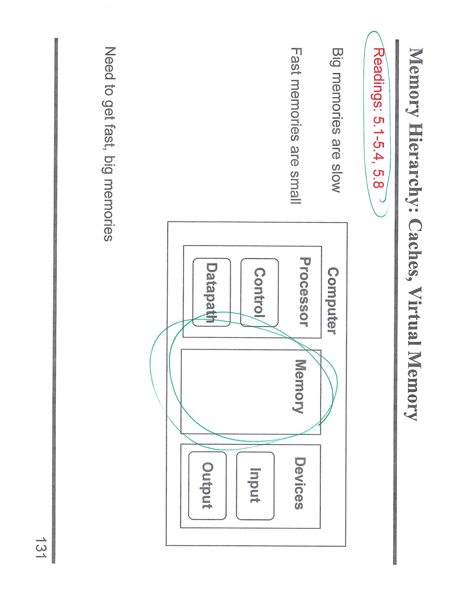

---

## 第 1 页


下面这张图是在考察 5 级流水线（Ifetch、Reg/Dec、Exec、Mem、Wr）里，给定一段指令序列时**发生了哪些数据前递（forwarding）**。题目右侧给了时间轴（用 1–9 标注的时钟周期）和 5 条指令的流水线重叠示意。

## 题目中的指令（从上到下）

1. `LDUR   X0, [X1, #0]`      —— 访存型指令，结果写到 **X0**
2. `ADD    X2, X3, X3`        —— 算术指令，结果写到 **X2**
3. `ORR    X31, X0, X4`       —— 读 **X0**，目的寄存器写 **X31**
4. `CBNZ   X2, END`           —— 判断 **X2** 是否为 0 的分支
5. `SUB    X5, X31, X2`       —— 读 **X31** 和 **X2**

> 图中用彩笔圈出的寄存器就是这些读/写相关点；右侧每一行是该指令在各周期所处的流水段。

---

## 每条指令的相关冒险与前递

### 1) `LDUR` → `ORR`：X0 的 **load-use** 相关

* **相关关系**：`ORR` 读 `X0`，而 `X0` 来自前面的 `LDUR`。
* **时序**：在 5 级流水里，`LDUR` 的数据直到 **Mem 阶段末**（图中第 **4** 周期）才可用；`ORR` 正好在第 **4** 周期处于 **Reg/Dec** 阶段、在第 **5** 周期进入 **Exec**。
* **处理方式**：把 `LDUR` 在 **Mem(4)** 产出的数据**前递**到后继指令 `ORR`，使其能在第 **5** 周期的 **Exec** 使用该值而无需额外停顿。
* **结论（对应图上批注）**：**X0 在第 4 个周期被前递**。

### 2) `ADD` → `CBNZ`：X2 的分支比较需要最新值

* **相关关系**：`CBNZ` 需要读取 `X2` 来做“非零”判断，`X2` 来自上一条 `ADD`。
* **时序**：`ADD` 在 **Exec(4)** 就得到结果；`CBNZ` 在 **Reg/Dec(5)** 读寄存器，并在 **Exec(6)** 做比较。
* **处理方式**：把 `ADD` 结果在 **4→5** 之间**前递**给 `CBNZ`，确保它在第 **6** 周期执行比较时拿到最新值。
* **结论（对应图上批注）**：**X2 在第 5 个周期被前递**。

### 3) 关于 **X31**：**不要前递！**

* 在 AArch64 里，`X31` 在多数指令语境下是**零寄存器 XZR**（读到的永远是 0，写入会被丢弃）。
* 因此：

* `ORR X31, X0, X4` 的“写 X31”只是把结果丢弃，不需要、也不应该为它建立任何前递通路。
* 之后 `SUB` 读 `X31` 其实等价于读常数 0，同样**不需要前递**。
* **结论（对应图上批注）**：**Don't forward X31!（X31 不做前递）**

### 4) `SUB` 读取 `X2`：由寄存器文件自然解决

* `SUB` 的另一个源操作数是 `X2`。`ADD` 对 `X2` 的写回发生在较早的周期（图中可见 `ADD` 在第 **6** 周期写回 `Wr`），而 `SUB` 读寄存器发生在更晚的周期，因此**直接从寄存器文件读到正确值即可**，不必再前递。
* **结论（对应图上蓝色批注）**：**“fixed by the regfile”（由寄存器文件自然解决）**。

---

## 最终答案（按题目问的“发生了哪些前递？”）

* **发生前递：**

* `X0`：**第 4 个周期**从 `LDUR` 的 **Mem** 段前递给 `ORR`（供其在第 5 周期 Exec 使用）。
* `X2`：**第 5 个周期**从 `ADD` 的结果前递给 `CBNZ`（供其在第 6 周期做比较）。
* **不需要前递：**

* **X31**（零寄存器，写入丢弃、读取恒为 0）。
* `SUB` 对 `X2` 的读取由寄存器文件在其取数阶段直接得到，不需前递。

---

\[口语化表达] 这题就是看哪几个地方要“把上一条的结果直接塞给下一条用”。`LDUR` 把值装到 X0，可直到第 4 个周期才拿得到，所以 **第 4 周期把 X0 前递**给后面的 `ORR`，它下一拍（第 5 周期）就能用上；`ADD` 算出的 X2 在第 4 周期已经有了，于是 **第 5 周期把 X2 前递**给 `CBNZ` 做分支判断；`X31` 是零寄存器，写它等于丢，读它永远是 0，**根本不用前递**；最后 `SUB` 要的 X2，等它读寄存器的时候早就写回了，**直接从寄存器文件读**就行。整体就这么几个点。


---

## 第 2 页


下面这页是在做“**流水线的 CPI 与时钟周期**”计算练习。核心信息都在表格里：四类指令（ALU、Load、Store、Branch）的比例，以及在**编译器能填满 50% delay slot** 的假设下，每一类指令的**平均需要的周期数**。左侧还给了两种实现的时钟：

* **5 级流水线**：周期 = **1 ns**
* **单周期处理器**：CPI=1.0，周期 = **4.5 ns**

---

# 题目怎么做（逐步）

## 1) 判定各类指令的“Type Cycles”

* 理想 5 级流水线里，**无冒险**的一条指令只占 **1 个周期（CPI≈1）**。
* 有 delay slot 的情况（Load/Branch）：

* 每遇到 1 个 delay slot，如果**编译器能填上 50%**，则平均只剩 **0.5 个额外周期** 的罚时。
* 因此得到表中绿色数字：

* **ALU**：1.0（无额外罚时）
* **Load**：1.0 + 0.5 = **1.5**
* **Store**：1.0（一般无读后用冒险，不罚时）
* **Branch**：1.0 + 0.5 = **1.5**

> 直观理解：Load-use 和 Branch 都有 1 个延迟槽；50% 能被有用指令填掉，平均只浪费半拍。

## 2) 乘以各类频率，求整体 CPI

指令比例（Type Frequency）给的是：ALU 50%，Load 20%，Store 10%，Branch 20%。
把“Type Cycles × 频率”逐项相乘（表格最右一列“Cycles \* Freq”）：

* ALU：1.0 × 0.50 = **0.50**
* Load：1.5 × 0.20 = **0.30**
* Store：1.0 × 0.10 = **0.10**
* Branch：1.5 × 0.20 = **0.30**

求和即**整体 CPI**：
**CPI = 0.50 + 0.30 + 0.10 + 0.30 = 1.20**

这与图中写的 **CPI = 1.2** 一致。

## 3) 计算执行 100 万条指令的总时间

* **流水线机**的总拍数 ≈ `N × CPI + (k − 1)`
其中 `k=5`（5 级流水），“+ (k−1)”是**装入/排空的额外 4 拍**。

* `N = 1,000,000`
* `CPI = 1.2`
* `t_clk = 1 ns`

所以：

```
总时间 = (1,000,000 × 1.2 + 4) × 1 ns
= 1,200,004 ns ≈ 1.200004 ms
```

图里也写成：**1.2×10^6 × 1ns + 4ns**。

* **单周期机**的总时间 = `N × 周期时间`

```
= 1,000,000 × 4.5 ns
= 4,500,000 ns = 4.5 ms
```

## 4) 速度提升（可选但常见问法）

```
Speedup = 4.5 ms / 1.200004 ms ≈ 3.75 ×
```

也就是说，在给定的指令混合与“50% 填充延迟槽”的假设下，流水线机大约快 **3.75 倍**。

---

## 常见疑问小结

* **为什么 Store 不罚时？** 常见的 5 级实现中，Store 多数只需源操作数，且写内存的时机与前后指令不形成“读后写”这种关键冒险，因此常按 1 周期计。
* **Load/Branch 为什么各多 0.5？** 它们各自有 1 个潜在延迟槽；若编译器一半时间能放进“有用指令”，平均只剩 0.5 周期损失。
* **为什么要加 4ns？** 5 级流水装入/排空成本是 `(k−1)=4` 个周期，这是处理**有限条指令**时不可忽略的固定开销。

---

\[口语化表达] 这题就是先看四种指令各要几拍：没冒险的 ALU、Store 就 1 拍；Load 和 Branch 各有 1 个延迟槽，但编译器能填一半，所以平均只多 0.5 拍，于是它俩是 1.5 拍。再按出现比例去加权：0.5（ALU）+0.3（Load）+0.1（Store）+0.3（Branch）= 总 CPI 1.2。算总时间的话，流水线一拍 1ns，还要加上 5 级流水装/排空的 4 拍，所以 100 万条指令是 1,200,004ns；单周期是 4.5ns 一条，100 万条就是 4,500,000ns。最后对比一下，流水线大概快 3.75 倍。


---

## 第 3 页


这页是整章“**流水线 CPU 总结**”的提纲。它写了两件事：

1. 目标：**Improve cycle time**（缩短时钟周期/提高频率）。
2. 代价/关注点：三类 **hazards（冒险）**

* **Structural hazards**（结构冒险）
* **Control hazards**（控制冒险）
* **Data hazards**（数据冒险）

下面把这三类冒险分别说清楚，并顺手讲清楚“考试/作业题该怎么做”。

---

## 先把大图讲明白：流水线优化的两条主线

* **为什么流水线能更快？**
把一条指令拆成若干阶段（如 IF/ID/EX/MEM/WB），在每个周期内并行处理不同指令的不同阶段，从而**提高吞吐率**、降低**单个时钟周期时间**。

* 时钟周期近似：`T_clk ≈ max{各阶段组合逻辑延迟} + pipeline寄存器开销`
* 更深的流水线 → 阶段更短 → `T_clk` 变小，但寄存器/气泡开销增大，**CPI 未必=1**。
* **性能计算常用式**

* `CPI_effective = 1 + Σ(各类停顿/罚时)`
* `执行时间 = 指令数 × CPI × T_clk`
* 速度提升（相对基线）= 基线时间 / 新方案时间

---

## 1) Structural hazards（结构冒险）

**定义**：同一周期**多个阶段争用同一个硬件资源**，比如只有一套存储器，同时要去取指（IF）又要数据访存（MEM），就冲突了。

**常见来源**

* 单端口存储器：IF 和 MEM 冲突。
* 单端口寄存器堆：同周期多读多写。
* 功能单元（乘法器/除法器）非流水或延时长，多个指令需要时会排队。

**处理方法/做题思路**

1. **加资源**：指令/数据分离（Harvard 结构）、多端口寄存器堆、复本或多发射端口。
2. **做流水**：把乘法器等功能单元做成内部流水。
3. **插气泡**：硬件 stall 一拍（或若干拍）。

> 题目给出资源配置时，先画时间轴检查是否同拍冲突；若冲突，优先考虑“是否有第二套资源/多端口”，没有就插停顿。

---

## 2) Control hazards（控制冒险）

**定义**：遇到分支/跳转时，**下一条该取哪条指令**不确定，导致取指错误需要清空（flush）。

**常见手段**

* **静态办法**：

* 分支延迟槽（delay slot；可由编译器填充，有时题目会说“能填 50%”→平均只损失 0.5 拍）。
* 总是预测不跳/总是预测跳（固定策略）。
* **动态预测**：

* 1 位/2 位饱和计数器、BTB（Branch Target Buffer）、RAS（返回栈），提高预测命中率。
* **提前求值**：

* 在 ID/EX 更早阶段算出分支条件/目标，缩短罚时。

**做题思路**

1. 明确**错误预测罚时**（通常=从发觉错误到能重新取指的阶段数）。
2. 计算**平均分支代价**：`罚时 × (分支频率) × (错误概率)`；若题面给“延迟槽 × 填充率”，罚时 = 槽数 × (1-填充率)。
3. 把这项作为 CPI 的增量并入总 CPI。

---

## 3) Data hazards（数据冒险）

**定义**：指令间存在读写依赖，后指令需要的值**尚未准备好**。

* 在顺序发射、顺序完成的标配 5 级流水中，主要是 **RAW（读后写）**；WAR/WAW 一般不会出现（那是乱序/多发射里更常见的问题）。

**三类典型场景**

1. **ALU → ALU**：上条 EX 出结果，下条 EX 需要；\*\*前递（forwarding/bypassing）\*\*可解。
2. **Load → 使用者**：Load 的数据要到 MEM/WB 才可用，**最容易出现“load-use”停顿**；常见做法：**前递 + 1 拍气泡**或“延迟槽”。
3. **长延迟单元**：乘法/除法结果更晚，需更多前递通路或插更多气泡。

**做题步骤**

* 列出每条指令的**读写寄存器**与**阶段**（何时产出/何时消耗）。
* 逐对检查是否能**前递**（来源阶段 → 目标 EX/ID 阶段）；能前递就不 stall，不能就**插气泡**。
* 汇总停顿拍数，计入 CPI 增量。

---

## “提高 cycle time”的具体落地

* **均衡阶段**：把最长的阶段拆分，使各阶段延迟更接近，降低 `max{stage}`。
* **注意寄存器开销**：每加一层流水寄存器都会有额外 `t_setup + t_clkq + t_skew`，深度过大反而得不偿失。
* **频率 vs CPI 权衡**：深流水提高频率但可能增加错误预测与前递/气泡的 CPI，题目常让比较“更深流水线是否真的更快”。

---

## 常见题型的标准解法清单

1. **给指令混合与分支/Load 填充率** → 求 **CPI**

* 把每类指令的“基础 1 拍 + 罚时”乘以频率再求和。
2. **给流水线阶段延迟** → 求 **T\_clk** 与 **速度提升**

* `T_clk = max{阶段延迟}+寄存器开销`；再算执行时间或 Speedup。
3. **给一段代码** → 标记**前递/停顿**

* 画 5×时间表，按前递规则消除能消的，剩下的计入气泡。
4. **分支预测题** → 求 **平均分支代价**

* `罚时 × 分支频率 × 错误率`，或“延迟槽 × (1-填充率)”。

---

\[口语化表达] 这一页就是在提醒你：流水线的核心是把时钟变短、吞吐拉高，但会碰到三大坑——结构冒险（资源打架）、控制冒险（分支走哪边不确定）、数据冒险（前一条的结果还没来）。做题时就照这个套路：先看有没有资源冲突，冲突就给两套资源或插气泡；再看分支，按给的预测/延迟槽去算平均罚时；最后看数据依赖，能前递就前递，前不动就加气泡。算性能就用“执行时间=指令数×CPI×时钟周期”，CPI=1再加上各种罚时的平均值，时钟周期取最长阶段加上寄存器开销。整体思路就这么几步，按它来，基本题都能搞定。


---

## 第 4 页



这页是“**Memory Hierarchy（存储层次结构）**”的章节开头导图，主要讲清楚计算机中“**为什么要分层存储**”以及“**内存的速度与容量之间的矛盾**”。它不是一道计算题，而是一页**章节逻辑导入图**。下面详细解释每个部分。

---

## 一、整体结构（图的含义）

图中画了一个典型的计算机系统结构框架：

* **Processor（处理器）**：包含

* **Datapath（数据通路）**：执行指令、算术逻辑操作
* **Control（控制单元）**：发出控制信号
* **Memory（存储器）**：保存指令和数据
* **Devices（外设）**：输入（Input）与输出（Output）设备

绿色圈出的地方（Memory）是这章的重点。也就是说，这章开始要讲**处理器和存储器之间的性能差距问题**。

---

## 二、左边和右边的文字解释

* **左侧**：“Need to get fast, big memories”
—— 我们希望内存又大又快，但现实做不到。
* **右侧**：

* “Fast memories are small”：速度快的存储器（如寄存器、缓存）容量都很小。
* “Big memories are slow”：容量大的存储器（如主存、硬盘）速度却很慢。

这两句话揭示了计算机体系结构的核心矛盾：

> **容量和速度无法兼得。**

---

## 三、解决矛盾的思路：分层存储（Memory Hierarchy）

为了解决“又要快、又要大”的矛盾，现代计算机采用**多级存储层次结构**：

| 层级  | 名称              | 特点               |
| --- | --------------- | ---------------- |
| 最高层 | 寄存器（Registers）  | 速度最快、容量最小        |
| 第二层 | 高速缓存（Cache）     | 小而快（常分 L1、L2、L3） |
| 第三层 | 主存（Main Memory） | 容量中等、速度较慢        |
| 第四层 | 磁盘/SSD          | 容量大、速度慢          |
| 最底层 | 虚拟内存/外存         | 非常大、非常慢          |

通过**时间局部性（temporal locality）**和**空间局部性（spatial locality）**，CPU 大部分访问都命中在较高层（比如 Cache），从而兼顾速度与容量。

---

## 四、页码中的红字 “Readings: 5.1–5.4, 5.8”

这表示课程指定阅读的教材章节（比如《Computer Organization and Design》）。

* **5.1–5.4**：讲解基本的内存层次、Cache 原理（命中率、缺失代价、平均访问时间）。
* **5.8**：讲虚拟内存（Virtual Memory）的概念。

这些阅读范围与本章标题 “**Memory Hierarchy: Caches, Virtual Memory**” 对应。

---

## 五、课堂理解要点

1. **为什么要有 Memory Hierarchy？**
因为处理器速度远快于内存，直接访问主存太慢。分层结构可缓冲这种速度差距。
2. **基本原理是什么？**
通过局部性（locality）提高命中率，减少访问慢层的次数。
3. **常考计算内容：**

* 平均内存访问时间（AMAT）公式：
`AMAT = Hit Time + Miss Rate × Miss Penalty`
* Cache 命中率、缺失率、替换策略（LRU、FIFO 等）
* 虚拟内存页表（page table）与 TLB（快表）

---

\[口语化表达] 这页其实是开头导图，告诉你这章要讲“存储分层”——也就是为什么电脑里要有寄存器、Cache、主存、磁盘这些不同速度的内存。因为又想快又想大不现实：快的都小、大的都慢。于是工程师搞了个“层次结构”，常用数据放上面，冷数据放下面，这样看起来又快又大。右边那两句“Fast memories are small / Big memories are slow”其实就是这章的灵魂。红字那几个章节号（5.1–5.4, 5.8）就是要去看 Cache 和虚拟内存的部分。


---

## 第 5 页


这页标题是 **“Random Access Memory（随机存取存储器）”**，重点讲了两种主流内存类型：
**DRAM（动态随机存取存储器）** 和 **SRAM（静态随机存取存储器）**，并给出它们与磁盘（Disk）的性能与成本比较。
下面逐段详细解释。

---

## 一、什么是 “Random Access Memory”（RAM）

“随机存取”是指：
CPU 访问内存中的任意地址所需的时间几乎相同（不像磁盘要移动读写头找位置）。
RAM 是计算机的**主存储器**，分为两种类型：

1. **DRAM（Dynamic RAM）**
2. **SRAM（Static RAM）**

---

## 二、Dynamic Random Access Memory（DRAM）

### 1. 关键特性

* **High density（高密度）**：在相同面积下能存更多位。
* **Low power（低功耗）**、**cheap（便宜）**。
* **But slow（但速度慢）**。
* **Dynamic（动态）**：数据必须**周期性刷新（refreshed）**，否则电容电荷泄露后数据会丢失。
→ 图右上角的简图就是一个 DRAM 单元（一个晶体管 + 一个电容）。

### 2. 工作机制

每一位数据由“电容 + 晶体管”构成：

* 有电荷表示“1”，没电荷表示“0”。
* 电荷会随时间流失，所以要**定期刷新（Refresh）**。

### 3. 性能定位

* 属于主存储器（Main Memory）。
* 速度适中，容量大，价格便宜。
* 表中标示：**访问时间约 100 个 CPU 周期**。
* 成本/容量比磁盘高约 **200 倍**。

---

## 三、Static Random Access Memory（SRAM）

### 1. 关键特性

* **Low density（低密度）**：同样面积存不下太多数据。
* **High power（高功耗）**：一直要供电维持数据。
* **Expensive（贵）**。
* **Static（静态）**：只要有电，数据就不会丢，不用刷新。
* **Fast access time（访问快）**：比 DRAM 快 2\~10 倍。

### 2. 电路结构

右侧图下方的小电路就是 **SRAM 单元**：

* 由 6 个晶体管组成一个双稳态触发器（Flip-Flop）。
* 不用刷新，但功耗更高、面积更大。

### 3. 性能定位

* 常用于 **Cache（高速缓存）**。
* 表中数据：访问时间约 **1–7 个 CPU 周期**。
* 成本/容量比磁盘高 **10,000 倍**。

---

## 四、Disk（磁盘）对比

* 机械式或固态硬盘（SSD）。
* 访问时间非常慢，约 **10K–10M 个 CPU 周期**。
* 但成本最低（作为容量对比的 1x 基准）。

---

## 五、表格总结（按性能和价格从上到下）

| 技术       | 访问时间           | 成本/容量   | 特征               |
| -------- | -------------- | ------- | ---------------- |
| **SRAM** | 1–7 cycles     | 10,000× | 快、贵、容量小，用于 Cache |
| **DRAM** | \~100 cycles   | 200×    | 慢、便宜、容量大，用于主存    |
| **Disk** | 10K–10M cycles | 1×      | 最慢、最便宜、容量最大      |

---

## 六、关键概念小结

* **DRAM → 主存（Main Memory）**
* **SRAM → 高速缓存（Cache）**
* **Disk → 辅助存储（Secondary Storage）**
* 性能关系：`SRAM > DRAM > Disk`
* 成本关系：`SRAM < DRAM < Disk`（按容量成本）

---

\[口语化表达]
这页其实是在教你区分内存的两大类型：SRAM 和 DRAM。SRAM 就是“静态内存”，不用刷新，速度快但贵，一般做 CPU 的 Cache；DRAM 是“动态内存”，靠电容存电来记 0/1，要一直刷新，便宜但慢，是我们说的主内存。表格里告诉你个量级：SRAM 访问只要 1–7 个周期，DRAM 要 100 个周期，磁盘更夸张，动辄 1 万到 1 千万周期。代价也一样反过来，SRAM 最贵、磁盘最便宜。简单说：Cache（SRAM）快但小，主存（DRAM）慢但大，硬盘更慢但更大。
