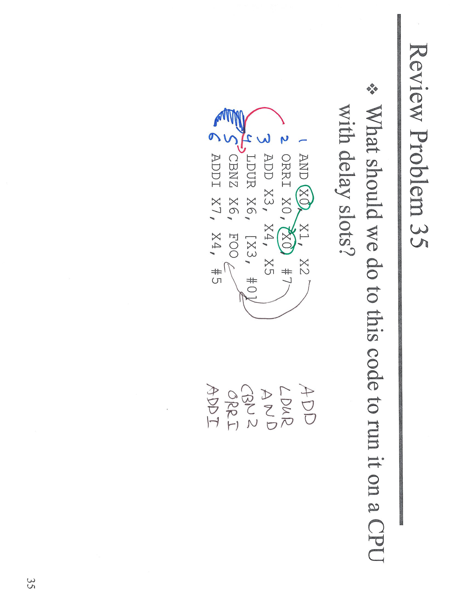
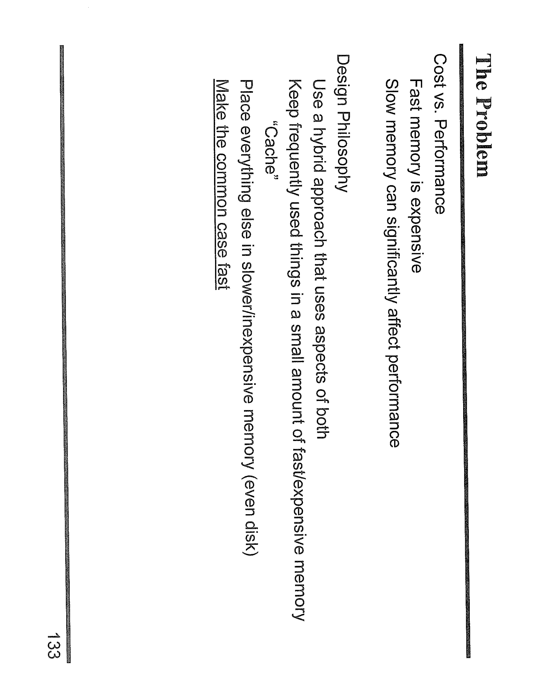
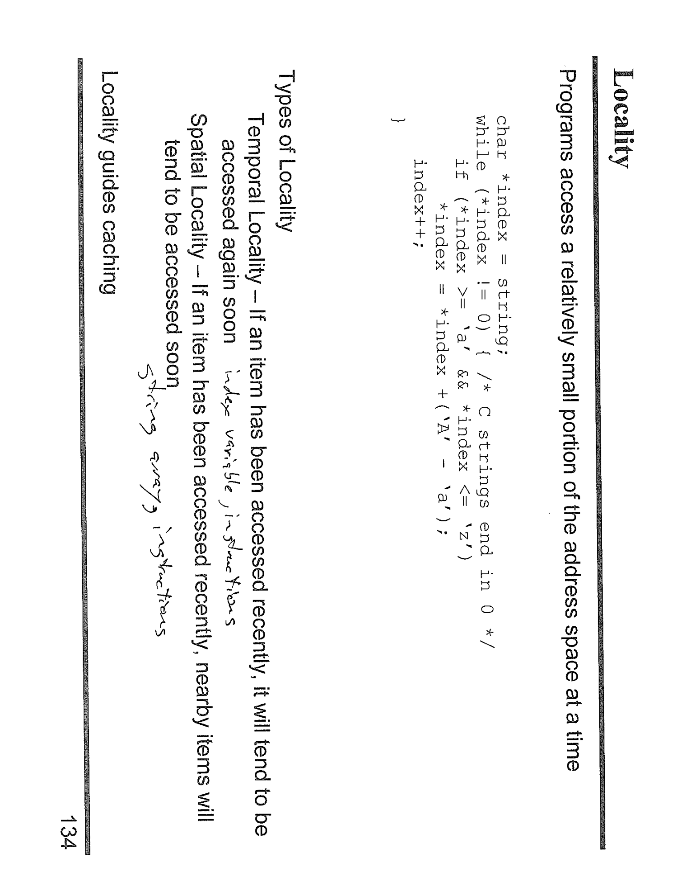
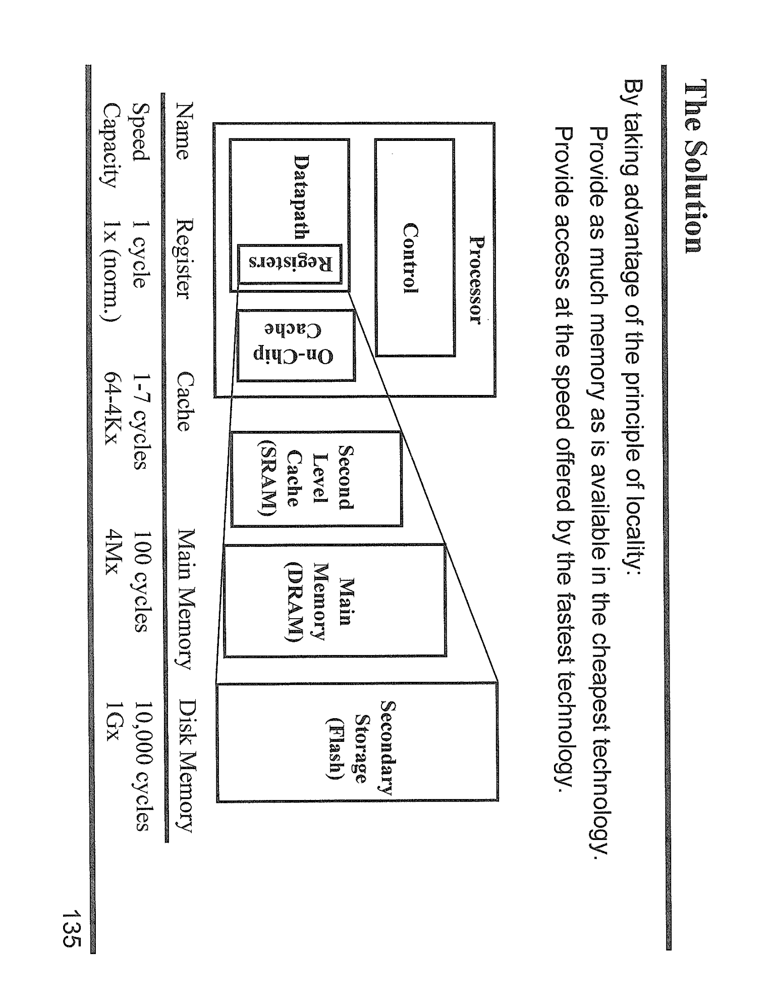
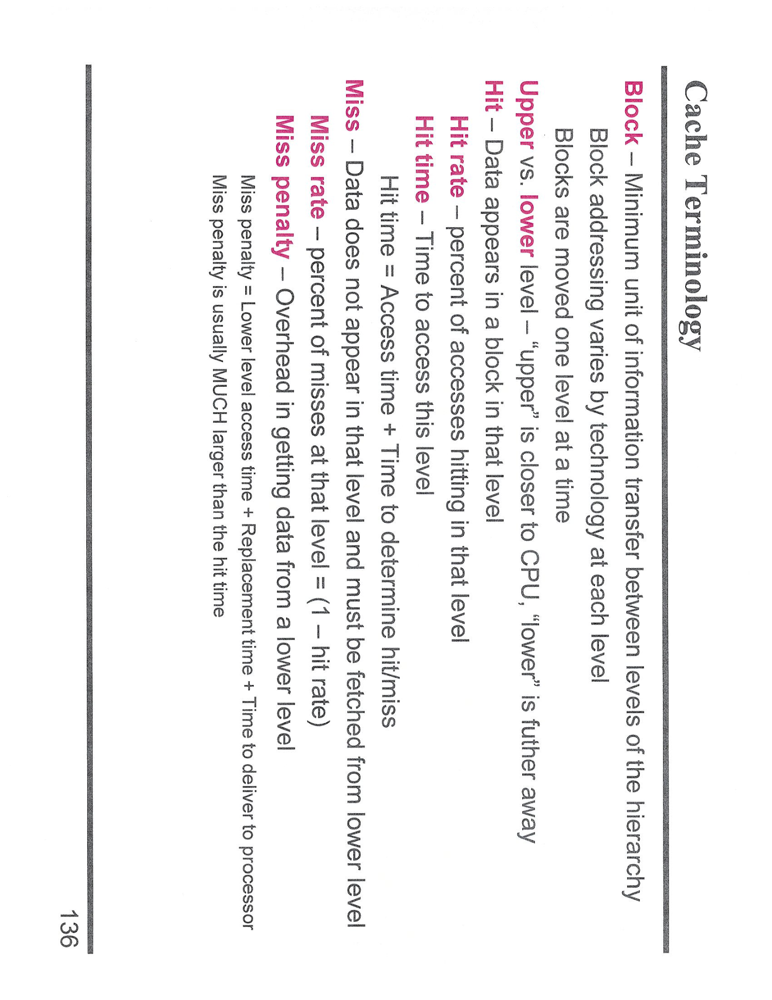
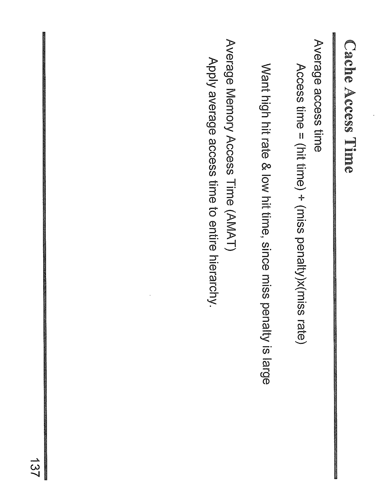
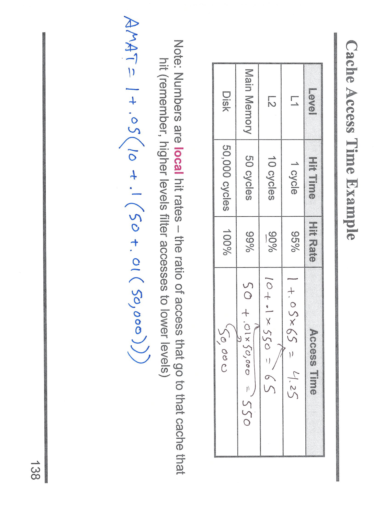

---

## 第 1 页



这张图片是一个关于\*\*MIPS/ARM 指令流水线（Pipeline）中延迟槽（Delay Slot）\*\*的问题，题目是：

> “What should we do to this code to run it on a CPU with delay slots?”
> （翻译：在有延迟槽的 CPU 上运行这段代码时，我们应该怎么做？）

---

## 一、题目代码分析

原始指令如下：

```
1. AND  X0, X1, X2
2. ORR  X0, X0, #7
3. ADD  X3, X4, X5
4. LDUR X6, [X3, #0]
5. CBNZ X6, FOO
6. ADDI X7, X4, #5
```

这段代码中：

* 第5条是一个**分支指令 (CBNZ)**，如果 `X6 ≠ 0`，则跳转到标签 `FOO`。
* 第6条是**分支后的下一条指令（延迟槽）**。
在有“delay slot”的 CPU（例如早期的 MIPS）上，分支跳转指令**会多执行一条后续指令**，也就是第6条会被执行一次，不论分支跳没跳。

---

## 二、延迟槽 (Delay Slot) 的意义

当 CPU 使用流水线时，分支跳转（如 `CBNZ`）会导致取指错误。
有延迟槽的 CPU 设计是：

> 在分支跳转的同时，仍会执行“紧接着的一条指令”（延迟槽指令），再进行跳转。

因此，我们需要**手动调整代码**，确保延迟槽中的指令不会影响逻辑。

---

## 三、分析依赖关系

* `CBNZ X6, FOO` 依赖于第4条 `LDUR X6, [X3, #0]`。
所以第5条必须在第4条之后。
* 第6条 `ADDI X7, X4, #5` 与分支无关，也不依赖前面 `X6` 或 `X0`，是一个**独立指令**。

这意味着我们可以**安全地将第6条放入延迟槽**。

---

## 四、在延迟槽 CPU 上的正确写法

正确的改写方法是：

```
1. AND  X0, X1, X2
2. ORR  X0, X0, #7
3. ADD  X3, X4, X5
4. LDUR X6, [X3, #0]
5. CBNZ X6, FOO
6. ADDI X7, X4, #5    ← 延迟槽指令（Delay Slot）
```

或者更标准的写法（明确指出延迟槽）：

```
CBNZ X6, FOO
NOP                ; 若无可用独立指令则填 NOP（空操作）
```

在这题中，因为有一条独立的 `ADDI`，我们就把它放进延迟槽中。

---

## 五、图中箭头与手写部分含义

* 红色箭头：表示第5条 `CBNZ` 跳转到 `FOO`。
* 蓝色波浪线：标出延迟槽。
* 绿色圈出的 `X0` 表示数据相关性（第1、2条间 `X0` 被读写）。
* 手写的 `ADD、LDUR、AND、CBNZ、ORR、ADDI` 是重新排列指令的尝试。

---

## 六、总结要点

1. **延迟槽指令会被执行一次**，不论分支是否成立。
2. 应当放置**与分支无关的独立指令**，避免逻辑错误。
3. 若无合适指令，则填入 `NOP`。
4. 在本题中，`ADDI X7, X4, #5` 是最佳延迟槽候选。

---

\[口语化表达]
这题是在考“有延迟槽的 CPU（比如早期 MIPS）该怎么安排指令”。简单来说，分支指令后面那一条会被多执行一次，所以我们得找一条不会出错的指令放那儿。看下来 `ADDI X7, X4, #5` 不依赖前面的数据、也不影响分支结果，正好放在延迟槽里最合适。如果没有这种指令，就用 NOP（空操作）。


---

## 第 2 页



下面这页讲的是**存储器层次结构的设计思想：在成本与性能之间做权衡**。每一条我都给你翻译+解释+怎么在题目里用。

---

# 讲义逐条翻译与解释

1. **The Problem（问题）**

* **Cost vs. Performance（成本 vs 性能）**
存储越快越贵、越慢越便宜；但程序又非常依赖内存速度。
* **Fast memory is expensive（快内存很贵）**
例如 SRAM（做缓存用）单位容量价格远高于 DRAM（主存）/SSD/磁盘。
* **Slow memory can significantly affect performance（慢内存会显著拖慢性能）**
如果每次访问都落到慢层（主存/磁盘），CPU 大量空等，整体吞吐下降。

2. **Design Philosophy（设计哲学）**

* **Use a hybrid approach that uses aspects of both（混合式方案，兼顾两者）**
不可能全用快内存也不能全用慢内存 —— 采用**层次化（hierarchy）**：少量快 + 大量慢。
* **Keep frequently used things in a small amount of fast/expensive memory (“Cache”)（把常用数据放进少量、但很快的缓存）**
这就是**缓存 Cache**：L1/L2/L3 通常用 SRAM，容量小但速度快。
* **Place everything else in slower/inexpensive memory (even disk)（其余都放慢且便宜的存储，甚至磁盘）**
主存（DRAM）、二级存储（SSD/HDD）容量大、便宜，存放不常用的大多数数据。
* **Make the common case fast（让最常见的情况足够快）**
依赖**局部性（时间/空间）**：大部分访问会命中最近用过或相邻的数据。只要把这些“常见情况”做快，整体性能就好。

---

# 落地到解题：常见题型与做法

**A. 计算平均内存访问时间（AMAT）**

* 公式（两级缓存举例）：
`AMAT = L1_HitTime + L1_MissRate × (L2_HitTime + L2_MissRate × MainMemoryTime)`
* 做法：

1. 从题目抓取命中时间（Hit Time）、缺失率（Miss Rate）/缺失惩罚（Miss Penalty）。
2. 按层代入公式；如果有三级，再往里嵌套。
3. 比较不同设计（更大缓存、更低命中时间等）哪个 AMAT 更小。

**B. 判断把哪些数据放进缓存**

* 原则：近期频繁访问（时间局部性）或相邻地址（空间局部性）的数据优先。
* 如果题目给出访问序列，按映射方式（直接映射/组相连/全相连）模拟命中与替换（LRU、FIFO 等），统计命中率。

**C. 容量/块大小/相连度的权衡**

* 块（行）太小：空间局部性利用差；太大：容易竞争冲突、提高缺失惩罚。
* 相连度提高可降低冲突缺失，但可能增加命中时间。
* 题目若让你选参数：优先“把常见情况做快”→在不显著增加命中时间的前提下，提高命中率。

**D. 何时用更慢更便宜的层**

* 当数据**体量远大于缓存**、且访问稀疏/一次性时，让其留在主存/磁盘；缓存只保留热点工作集（working set）。

**E. 分析“成本 vs 性能”**

* 计算**单位成本/性能提升**：

* 例：增加 1MB L2 使命中率从 90%→94%，AMAT 从 10ns→8ns；对比该 1MB 的成本（SRAM 单价）是否值得。
* 若题目让你“设计哲学选择”，答：**混合层次、热点进小而快的层、冷数据在慢而便宜的层、优化常见路径**。

---

# 小陷阱与答题提示

* **命中时间**和**缺失惩罚**不要混淆；缺失惩罚通常包含下一层的命中时间/访问时间。
* **写策略**（写直达 write-through / 写回 write-back）会改变惩罚和带宽需求，题目若给出要正确代入。
* **工作集变化**：程序阶段性访问不同数据，说明为什么“缓存足以提速但不必无限增大”。
* \*\*“Make the common case fast”\*\*可作为开放题的首要论点，再辅以局部性和层次结构例证。

---

\[口语化表达]
这页的意思其实就一句话：**内存越快越贵、越慢越便宜**，但程序又特别吃内存速度，所以我们采用“**小而快的缓存装常用数据，其他统统丢到慢又便宜的地方**（主存/磁盘）”，利用局部性把**常见情况做快**。解题时就围绕这个思路：算 AMAT 看整体访问时间；模拟命中率判断哪些数据应该进缓存；权衡块大小、相连度和容量，别让命中时间变慢；写策略影响缺失惩罚也要考虑。最后如果问“怎么设计更划算”，就回答——分层存储、热点进 Cache、冷数据放慢层，用数据（命中率/AMAT/成本）证明这样最值。


---

## 第 3 页



这页讲的是\*\*“局部性原理（Locality）”\*\*——这是计算机体系结构中非常核心的概念之一，用来解释为什么“缓存（cache）能提高性能”。我们来详细解释整页内容，并结合例题分析。

---

## 一、总体概念：Locality（局部性）

> Programs access a relatively small portion of the address space at a time
> 程序在任意时间点上，只会访问内存地址空间中的一小部分。

意思是说：虽然程序理论上能访问整个内存地址范围，但实际上它在某一时刻只频繁访问“某一小块区域”，而不是整个空间。
比如一个循环反复读写数组中相邻元素，或者反复使用相同变量、函数。

**→ 这就是“局部性原理”**。
CPU Cache 就是利用这个规律设计的。

---

## 二、两种局部性类型（Types of Locality）

### 1️⃣ Temporal Locality（时间局部性）

> If an item has been accessed recently, it will tend to be accessed again soon.
> 如果一个数据最近被访问过，那么很可能不久后还会再次被访问。

📌 例子：

```c
int x;
x = x + 1;
```

变量 `x` 被连续访问两次，就体现了时间局部性。
所以缓存中留着最近用过的数据非常有用，因为它“很可能马上还要再用”。

💡 适用于：

* 变量
* 栈（stack）内容
* 计数器、循环控制变量等

---

### 2️⃣ Spatial Locality（空间局部性）

> If an item has been accessed recently, nearby items will tend to be accessed soon.
> 如果某个数据被访问过，那么它附近的数据也很可能马上被访问。

📌 例子：

```c
for (i = 0; i < n; i++)
sum += A[i];
```

当访问 `A[i]` 时，接下来马上要访问 `A[i+1]`、`A[i+2]` …
→ 相邻地址被连续访问，就体现空间局部性。

💡 适用于：

* 数组元素
* 顺序扫描文件
* 程序代码（指令通常顺序执行）

---

## 三、右边的代码例子讲解

```c
char *index = string; /* C strings end in 0 */
while (*index != 0) {
if (*index == 'a')
*index = *index + ('A' - 'a');
index++;
}
```

这段代码会遍历一个 C 字符串，把所有小写字母 `'a'` 改成 `'A'`。

* 每次循环访问 `*index` → 时间局部性（index 本身反复使用）
* `index++` → 每次访问相邻的内存地址（字符串下一个字符）→ 空间局部性

💡 所以这段代码**同时体现了时间局部性和空间局部性**。

---

## 四、Locality guides caching（局部性指导缓存设计）

缓存设计正是基于这个原理：

* **时间局部性** → 最近访问的数据放在缓存里，命中率高。
* **空间局部性** → 一次取出一整“块（block）”，而不是单个字节，因为相邻数据可能马上被用到。

---

## 五、在题目中常考的做法和思路

1️⃣ **判断哪种局部性**

* 同一变量重复访问 → 时间局部性
* 连续数组访问或顺序执行 → 空间局部性

2️⃣ **分析缓存命中率变化**

* 如果访问模式打破局部性（如随机访问），命中率会显著下降。
* 若符合局部性（如循环访问数组），命中率会很高。

3️⃣ **优化代码性能**

* 尽量让访问符合局部性：

* 数据结构连续（如数组优于链表）
* 减少随机访问
* 增大循环体内的计算（让缓存数据被多次利用）

4️⃣ **解释缓存块设计**

* 缓存块（cache line）大 → 有助空间局部性
* 替换策略（LRU） → 利用时间局部性

---

\[口语化表达]
这页讲的就是“为什么缓存有用”那套逻辑：程序其实不会乱访问内存，而是老盯着一小块区域反复用。比如刚用过的变量马上又会用（时间局部性），或者访问数组时一个接一个读相邻的元素（空间局部性）。右边那个 C 程序就是例子：它每次检查字符串的一个字符，然后挨个往后移动，所以同时有两种局部性。CPU 就利用这个规律，把“最近用过的、邻近的数据”放在缓存里，这样下次用的时候就快多了。你做题时，只要判断程序访问的模式是哪种局部性，然后推断缓存命中率或性能变化就行。


---

## 第 4 页



这页讲的是上一页“局部性原理（Locality）”的实际应用——**“存储层次结构（Memory Hierarchy）”**，也就是如何通过多层存储设计来同时兼顾**速度和成本**。这就是所谓的 **The Solution（解决方案）**。

---

## 一、文字部分解释

> **By taking advantage of the principle of locality:**
> 利用局部性原理：

程序不会随机访问整个内存，而是集中访问一小块区域（见上一页讲的 temporal/spatial locality）。
所以我们可以用少量高速存储来缓存“热点数据”。

---

> **Provide as much memory as is available in the cheapest technology.**
> 使用尽可能多、但价格便宜的存储技术来提供大的容量。

例如：硬盘（Disk）或闪存（Flash）虽然慢但容量大又便宜。

---

> **Provide access at the speed offered by the fastest technology.**
> 尽量让程序以最快存储的速度进行访问。

通过分层结构，把热点数据留在快层（cache/register），让大部分访问不需要跑到慢层去。

💡总结一句话：

> **热数据用快的，冷数据放慢的**。
> 这样在平均意义上“又快又便宜”。

---

## 二、图表部分解释（Memory Hierarchy 层次结构）

图中展示的是处理器和内存的多级结构：

| 层级  | 名称                          | 典型技术         | 速度（访问延迟）            | 容量（相对值）    | 说明                     |
| --- | --------------------------- | ------------ | ------------------- | ---------- | ---------------------- |
| 1️⃣ | **Register（寄存器）**           | CPU内部        | **1 cycle**         | **1×**     | CPU运算直接访问，速度最快、容量最小    |
| 2️⃣ | **Cache（缓存）**               | SRAM         | **1–7 cycles**      | **64–4K×** | 分 L1/L2/L3 多级缓存，存放热点数据 |
| 3️⃣ | **Main Memory（主存）**         | DRAM         | **\~100 cycles**    | **4M×**    | 主内存较大但访问慢              |
| 4️⃣ | **Secondary Storage（二级存储）** | Flash / Disk | **\~10,000 cycles** | **1G×**    | 最慢但容量最大，用于长期存储         |

---

## 三、内部结构部分解释

图右边的“Processor（处理器）”包含两个部分：

* **Datapath（数据通路）**：执行指令（加、减、乘、除）
* **Control（控制单元）**：发出操作控制信号

它直接连到**Registers（寄存器）**和**On-Chip Cache（片上缓存）**。

* 片上缓存（L1 Cache）就在 CPU 内部，速度接近寄存器。
* 第二级缓存（L2 Cache）通常在 CPU 外部，用 SRAM 技术。
* 主存（Main Memory）用 DRAM 技术。
* 最外层二级存储（Secondary Storage）如 Flash 或硬盘。

这个层级系统可以总结成一句经典公式：

> **更靠近 CPU → 更快、更贵、容量更小**

---

## 四、这类题常考什么、怎么做

1️⃣ **算平均内存访问时间（AMAT）**
公式：
`AMAT = Hit TimeL1 + Miss RateL1 × (Hit TimeL2 + Miss RateL2 × MainMemoryAccessTime)`
根据每层的命中率和延迟，算出整体平均访问时间。

2️⃣ **问哪层最贵/最慢/容量最大**
答：

* 最贵、最小、最快：寄存器
* 最慢、最大、最便宜：磁盘（或闪存）

3️⃣ **考数据在不同层之间的移动**

* 当 CPU miss 时，从下一级（如主存）加载数据到 cache；
* 当 cache 满时，按替换策略（LRU、FIFO等）踢出旧数据。

4️⃣ **问为什么多级结构比单一内存好**
因为利用了**局部性原理**，让常用数据放在快层，不常用的放在慢层，使平均性能接近快内存而成本接近慢内存。

---

## 五、总结思想

* 层次结构是为了解决 “快的太贵、慢的太慢” 的矛盾。
* CPU 只和顶层（寄存器/Cache）打交道，底层负责提供容量。
* 越靠近 CPU → 更快更贵，越远 → 更大更便宜。
* **性能靠命中率支撑**，**成本靠分层节省**。

---

\[口语化表达]
这页讲的是“怎么用多层存储让电脑又快又省钱”。CPU 当然想用最快的内存，可是快的内存太贵、容量又小，所以我们才搞出“金字塔结构”：最上面寄存器超快，Cache 稍慢一点但容量大些，主存再慢一点，最下面是磁盘最大但最慢。程序有“局部性”，常用的数据会反复被访问，所以我们把这些热数据放在上层的快内存里，冷数据就丢到下层。这样 CPU 平均访问速度看起来像用快内存一样，但成本只比慢内存稍贵。这就是“存储层次结构”的核心：利用局部性、分层折中，做到既快又便宜。


---

## 第 5 页



这页标题是 **Cache Terminology（缓存相关术语）**，主要是定义缓存性能分析中常用的几个基本概念。理解这些概念是做“平均访问时间 (AMAT)” 题目的前提。这页的内容非常关键，是所有缓存计算题的基础。

---

## 一、Block（块）

> **Block – Minimum unit of information transfer between levels of the hierarchy**
> 块：层级之间传输数据的最小单位。

📘解释：
CPU 与缓存、缓存与主存之间不是一字节一字节地传数据，而是一整“块（block）”传的。
一个块里可能包含多个字（word），比如 64B 或 128B。

💡例题中常说：

* “cache block size = 64 bytes”
* 表示每次从主存加载到缓存的数据量。

---

## 二、Upper vs. Lower Level（上层 vs 下层）

> **Upper level**：更靠近 CPU 的层（例如 L1 Cache）
> **Lower level**：离 CPU 更远的层（例如主存）

📘解释：
数据在层级之间只会一层层移动：
**CPU → L1 → L2 → 主存 → 磁盘**

💡当我们说“miss”，意思是当前层找不到数据，要去“下层（lower level）”取。

---

## 三、Hit（命中）与 Miss（未命中）

### ✅ Hit

> Data appears in a block in that level
> 如果数据在该层被找到，就称为命中。

💡例：CPU 需要数据 X

* 如果 L1 cache 里有 → **Hit**
* 否则 → **Miss**

---

### ❌ Miss

> Data does not appear in that level and must be fetched from lower level
> 如果在这一层找不到，就称为未命中，需要从下层取回。

---

## 四、Hit Rate（命中率）

> **Hit rate – percent of accesses hitting in that level**
> 命中率：访问中命中的比例。

📘公式：
`Hit rate = hits / total accesses`

💡例：
如果 100 次访问中 95 次命中缓存，
→ Hit rate = 95%

---

## 五、Miss Rate（未命中率）

> **Miss rate – percent of misses at that level = (1 - hit rate)**
> 未命中率：未命中的比例。

📘公式：
`Miss rate = 1 - Hit rate`

💡例：
命中率 95%，则 Miss rate = 5%

---

## 六、Hit Time（命中时间）

> **Time to access this level**
> 命中时间：从该层取到数据的时间（包括查找+传送）。

📘公式：
`Hit time = Access time + Time to determine hit/miss`

💡例：
L1 Cache 命中时间 = 查找时间（例如 1 cycle）+ 判断命中所需时间（例如 0.2 cycle）。

---

## 七、Miss Penalty（未命中惩罚）

> **Overhead in getting data from a lower level**
> 未命中惩罚：从下一层取数据的额外耗时。

📘详细组成：
`Miss penalty = lower level access time + replacement time + time to deliver to processor`

💡重点：

* Miss penalty 通常远大于 hit time！

* L1 hit 可能只需 1ns
* 但 L1 miss 需要访问主存，可能要几百 ns。

---

## 八、这些术语如何在题目中使用

📘在计算 **平均内存访问时间（AMAT）** 时，这些术语组合成最常见的公式：

$$
\text{AMAT} = \text{Hit Time} + \text{Miss Rate} \times \text{Miss Penalty}
$$

🔹 例题：

* L1 hit time = 1 cycle
* Miss rate = 5%
* Miss penalty = 100 cycles

→ AMAT = 1 + 0.05 × 100 = **6 cycles**

📘在多级缓存系统（如 L1、L2）：

$$
\text{AMAT} = \text{L1 Hit Time} + \text{L1 Miss Rate} \times (\text{L2 Hit Time} + \text{L2 Miss Rate} \times \text{Main Memory Access Time})
$$

---

## 九、考题常问点与技巧

1️⃣ **定义题：**
“What is miss penalty?” → 答：time to get data from lower level.

2️⃣ **计算题：**
给出命中率、命中时间、惩罚时间，计算 AMAT。

3️⃣ **比较题：**

* 哪个层次更高？→ Upper closer to CPU
* Miss penalty 为什么更大？→ 因为要访问更慢的下层。

4️⃣ **推理题：**

* 提高 cache 命中率能显著降低 AMAT。
* 减少块大小或优化替换策略也可以影响命中率。

---

\[口语化表达]
这一页其实是“缓存计算”的词汇表。你得记住这几个词的意思：**Hit** 就是找到了，**Miss** 就是没找到，命中率高说明缓存好用；**Hit time** 是拿到数据要花的时间，而 **Miss penalty** 就是“没命中得去下面拿”的额外等待。因为下面的层（像主存、磁盘）都慢得多，所以 Miss penalty 一般比 hit time 大得多。考试的时候你经常要算平均访问时间（AMAT），公式就是“Hit time + Miss rate × Miss penalty”。所以理解这些词，就是在为那种计算题打基础。


---

## 第 6 页



这页标题是 **Cache Access Time（缓存访问时间）**，主要讲的是如何计算**平均内存访问时间（AMAT, Average Memory Access Time）**，这是缓存题最常见、最核心的计算公式。下面我们逐条解释。

---

## 一、Average Access Time（平均访问时间）

> **Access time = (Hit time) + (Miss penalty) × (Miss rate)**
> 平均访问时间 = 命中时间 + 未命中率 × 未命中惩罚

📘含义：

* **Hit time**：命中缓存时所需时间（快）
* **Miss rate**：访问缓存失败的比例
* **Miss penalty**：去下一级存储取数据的延迟（慢）

💡举个例子：
假设：

* 命中时间 = 1 cycle
* 未命中率 = 0.05（5%）
* Miss penalty = 100 cycles

则：

```
Average Access Time = 1 + (0.05 × 100) = 6 cycles
```

也就是说，平均每次访问需要 6 个周期。

---

## 二、公式逻辑解释

命中时：用时是 Hit time。
未命中时：除了 Hit time 还要加上 Miss penalty。

所以平均来说：

$$
\text{平均时间} = (\text{命中概率}×\text{命中时间}) + (\text{未命中概率}×(\text{命中时间+惩罚}))
$$

整理后就变成：

$$
\text{Hit time} + \text{Miss rate}×\text{Miss penalty}
$$

---

## 三、关键结论与设计目标

> **Want high hit rate & low hit time, since miss penalty is large**
> 我们希望命中率高、命中时间低，因为 miss penalty（未命中惩罚）非常大。

📘解释：

* 命中率高 → 绝大多数访问都在快层完成。
* 命中时间低 → 每次命中更快。
* Miss penalty 通常非常大（几百上千倍差距），所以要尽可能避免 miss。

💡设计时的取舍：

* 增大 cache → 命中率↑（好）但命中时间↑（坏）
* 缩小 cache → 命中时间↓但命中率↓
👉 所以要平衡。

---

## 四、Average Memory Access Time (AMAT)

> **Average Memory Access Time (AMAT)**
> 平均内存访问时间，是衡量缓存体系整体性能的指标。

📘适用于整个内存层次（Hierarchy）：

$$
AMAT = L1HitTime + L1MissRate×(L2HitTime + L2MissRate×MainMemoryAccessTime)
$$

💡举个两级缓存例子：
假设：

* L1：Hit time = 1ns，Miss rate = 10%，Miss penalty = 10ns（访问L2）
* L2：Hit time = 10ns，Miss rate = 20%，Miss penalty = 100ns（访问主存）

则：

```
AMAT = 1 + 0.1 × (10 + 0.2 × 100)
= 1 + 0.1 × (10 + 20)
= 1 + 3 = 4ns
```

这说明有多级缓存的系统能把平均延迟显著降低。

---

## 五、Apply average access time to entire hierarchy

> 将平均访问时间公式应用到整个存储层次结构中。

📘也就是说，不仅 L1 Cache 可以算 AMAT，L1+L2+主存+磁盘整个体系都可以用这个思路分析性能。

---

## 六、常考题型与解题思路

1️⃣ **直接套公式计算 AMAT**

* 给出命中率、惩罚时间，代入即可。
* 注意单位一致（cycle、ns）。

2️⃣ **比较两个设计方案**

* 比如：一个命中率高但命中时间慢，另一个命中率低但命中时间快。
* 代入公式比较 AMAT 谁更小。

3️⃣ **两级或三级缓存**

* 多级公式嵌套。先算 L1 AMAT，再往下层代。

4️⃣ **问性能影响因素**

* 提升命中率（增加容量、提高关联度）
* 降低 miss penalty（多级缓存、预取）
* 降低 hit time（更快技术）

---

\[口语化表达]
这一页讲的就是缓存计算里最重要的公式：平均访问时间怎么求。你只要记住一句话——**AMAT = 命中时间 + 未命中率 × 未命中惩罚**。命中就快，没命中就得去慢层拿数据。因为 miss penalty 特别大（有时候慢几百倍），所以我们想让命中率尽量高、命中时间尽量短。考试时通常会让你算平均访问时间，或者比较两个 cache 谁更好。算的时候只要把命中时间、miss rate、惩罚时间代进去就行。如果是两级缓存，就在公式里再套一层。简单说，这页就是在告诉你：**缓存系统的快慢，用 AMAT 这条公式就能看出来。**


---

## 第 7 页



这页是 **Cache Access Time Example（缓存访问时间示例）**，演示如何用**局部命中率（local hit rate）**逐层计算**平均内存访问时间 AMAT**。表里给了每一层的**Hit Time（命中时间）**与**Hit Rate（命中率）**，右侧一列“Access Time”就是把**该层的命中时间 + 未命中率×下一层平均时间**算出来。

---

## 一、题面数据（按从上到下的层次）

* **L1**：Hit time = **1 cycle**，Hit rate = **95%**（→ miss rate = 5%）
* **L2**：Hit time = **10 cycles**，Hit rate = **90%**（→ miss rate = 10%）
* **Main Memory（主存）**：Hit time = **50 cycles**，Hit rate = **99%**（→ miss rate = 1%）
* **Disk（磁盘）**：Hit time = **50,000 cycles**，Hit rate = **100%**（最底层一定能“命中”）

> 旁注 “Numbers are **local** hit rates” 的意思是：
> 表里的命中率都是**局部命中率**，即到达这一层的访问中，有多少在这一层命中；不是相对于最开始的全体访问（那叫 global hit rate）。

---

## 二、逐层计算 Access Time（自底向上）

**1) 磁盘层（最底层）**

* Access time\_Disk = 50,000 cycles
（底层没有再往下，所以就是自身的 hit time）

**2) 主存层**

* Miss penalty\_Main = 访问磁盘的平均时间 = 50,000
* Miss rate\_Main = 1%
* Access time\_Main
\= Hit time + Miss rate × Miss penalty
\= **50 + 0.01 × 50,000 = 550 cycles**

**3) L2 层**

* Miss penalty\_L2 = Access time\_Main = 550
* Miss rate\_L2 = 10%
* Access time\_L2
\= **10 + 0.1 × 550 = 65 cycles**

**4) L1 层（最靠近 CPU）**

* Miss penalty\_L1 = Access time\_L2 = 65
* Miss rate\_L1 = 5%
* Access time\_L1（也就是整个体系的 AMAT）
\= **1 + 0.05 × 65 = 4.25 cycles**

---

## 三、把计算写成一条嵌套公式（更直观）

$$
\text{AMAT} = 1 + 0.05\Big(10 + 0.1\big(50 + 0.01\cdot 50{,}000\big)\Big) = \mathbf{4.25\ cycles}
$$

---

## 四、易错点与提醒

1. \*\*一定用“局部命中率”\*\*计算（即到达该层的访问里有多少命中），否则数字会错。
2. **Miss penalty = 下一层的“平均访问时间”**，不是仅仅下一层的 hit time。
3. 从**底层往上**算最不易错：先出主存的平均时间，再带回到 L2，最后到 L1 得到 AMAT。

---

## 五、总结套路（遇到同类题就按这个来）

1. 自底向上，逐层用：
`Access time(level i) = Hit time(i) + Miss rate(i) × Access time(i+1)`
2. 最上层（L1）的 Access time 就是整个系统的 **AMAT**。
3. 要点：**局部命中率、嵌套代入、先底后顶**。

---

\[口语化表达]
这页在教你怎么“从底往上”把平均访问时间一步步算出来：先算主存=50+1%×磁盘(50,000)=550，再用它算 L2=10+10%×550=65，最后算 L1=1+5%×65=4.25，这个 4.25 就是整台机器的 AMAT。记住两个关键词就不怕：用**局部命中率**，**Miss penalty=下一层的平均时间**。照着这两个点把公式一层层套回去就行了。
