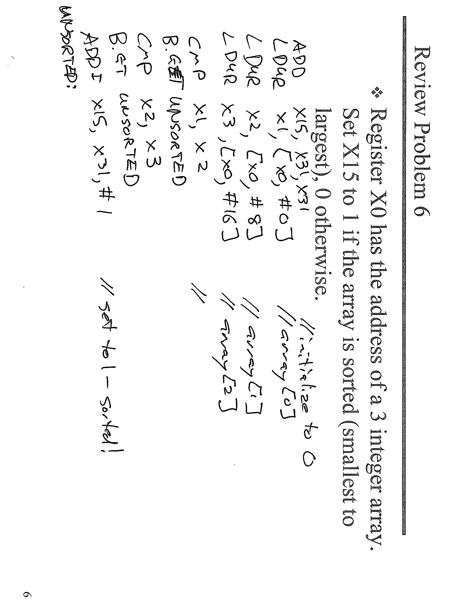
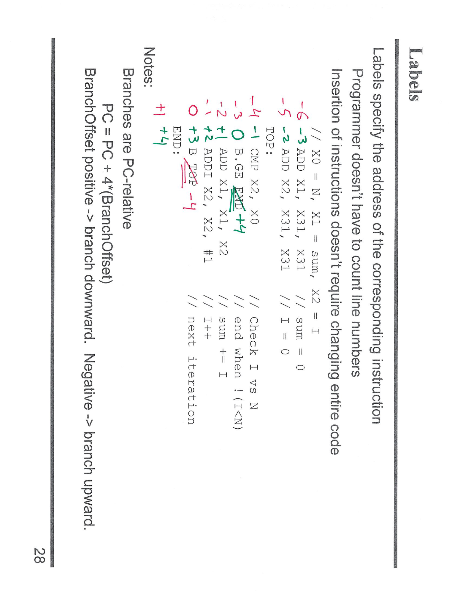
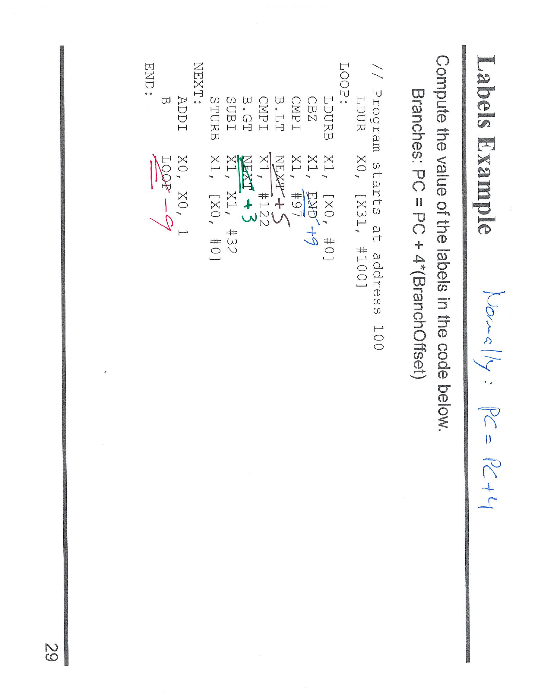
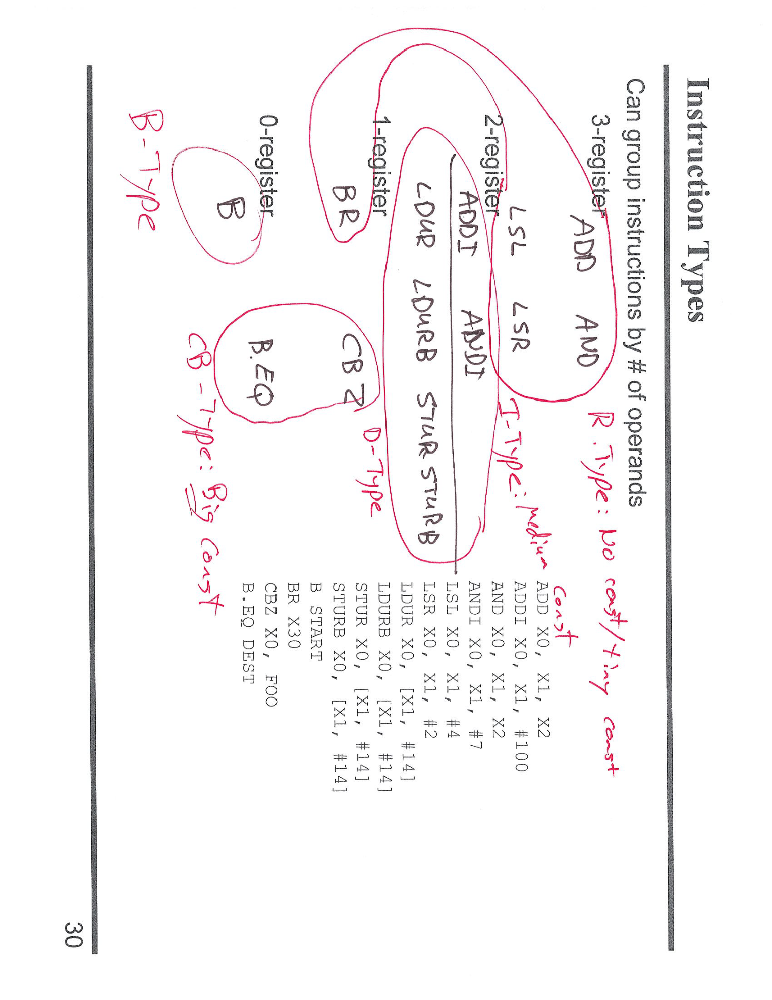
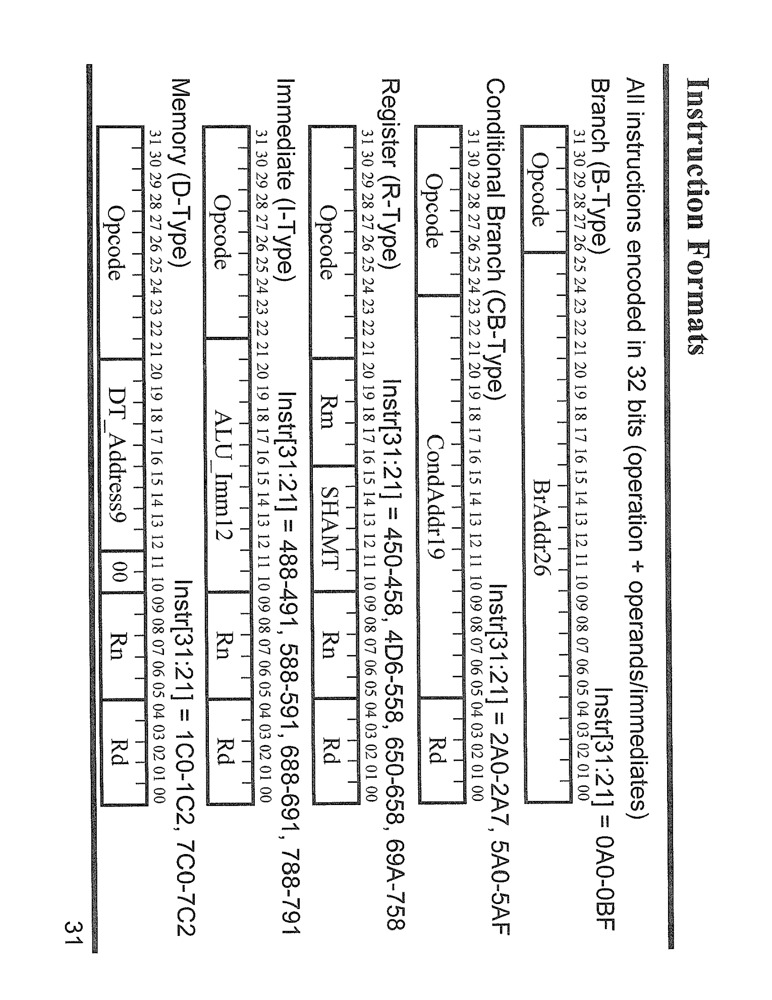
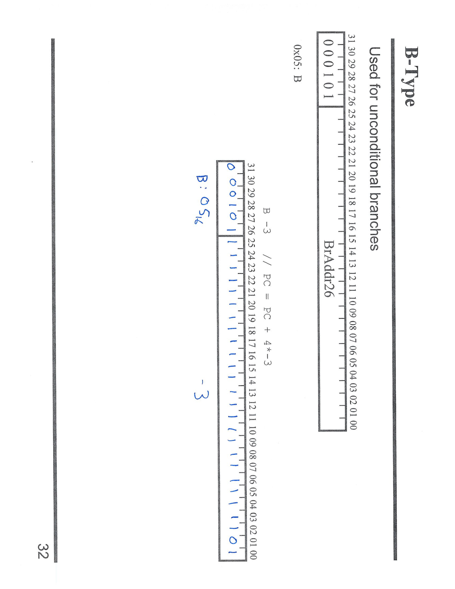
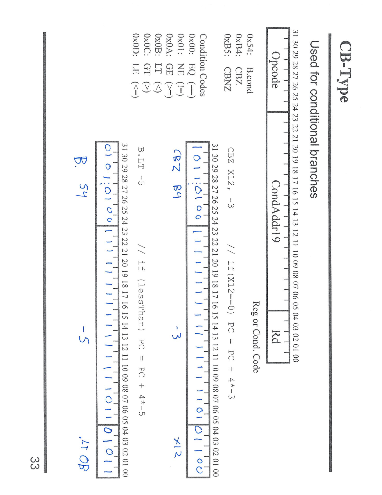
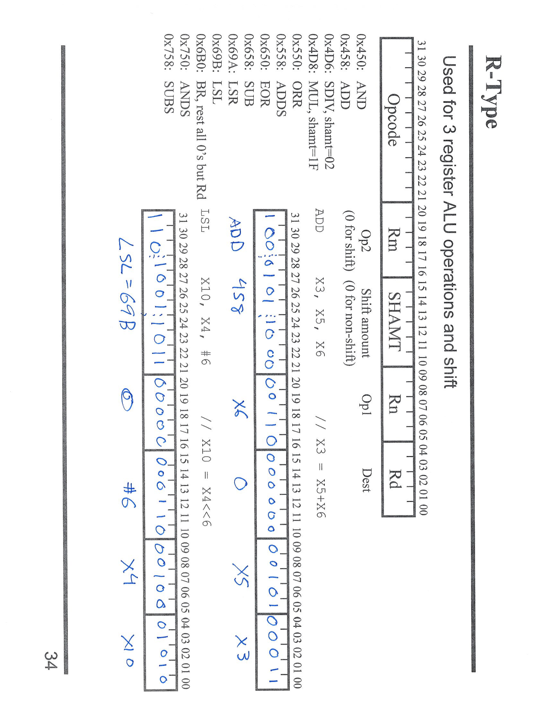
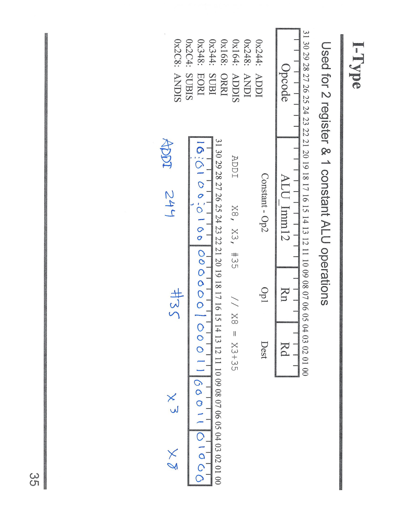
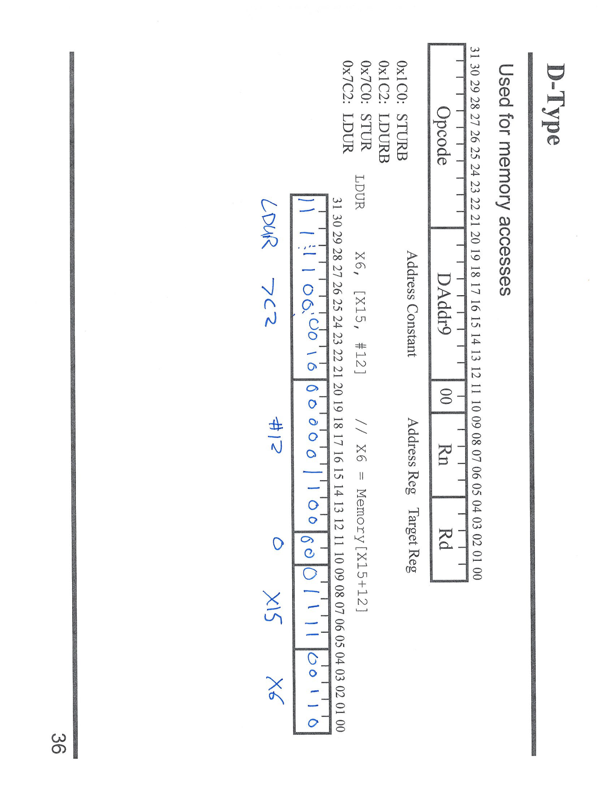

---

## 第 1 页



# 面试式讲解：判断 3 个整数是否从小到大有序

**题意**
`X0` 指向一个含 3 个整数（64 位）的数组 `a[0], a[1], a[2]`。
如果数组按 **从小到大** 排序，则把 **X15 置 1**，否则置 **0**。

---

## 汇编（与图中手写一致）

```asm
ADD   X15, X31, X31        // 结果先置 0（X31=XZR=0）

LDUR  X1, [X0, #0]         // X1 = a[0]
LDUR  X2, [X0, #8]         // X2 = a[1]
LDUR  X3, [X0, #16]        // X3 = a[2]    （64位整数，每个占8字节）

CMP   X1, X2               // 比较 a[0] 和 a[1]
B.GT  UNSORTED             // 如果 a[0] > a[1]，无序 → 跳到 UNSORTED

CMP   X2, X3               // 比较 a[1] 和 a[2]
B.GT  UNSORTED             // 如果 a[1] > a[2]，无序 → 跳到 UNSORTED

ADDI  X15, X31, #1         // 走到这里说明 a0 ≤ a1 ≤ a2，结果置 1
// （可在此直接返回）
UNSORTED:                  // 若跳到这里，X15 仍为 0
// 返回调用者
```

---

## 逐行说明

1. **初始化结果**：`X15=0`，假设无序；只有通过所有检查后才改为 1。
2. **加载数组元素**：`LDUR` 用字节偏移 `0/8/16`，因为 64 位整数大小是 8 字节。
3. **有序条件**：

* 先检查 `a[0] ≤ a[1]`。若不满足（`a0 > a1`）→ 无序。
* 再检查 `a[1] ≤ a[2]`。若不满足（`a1 > a2`）→ 无序。
* 两次检查都通过 ⇒ 全局非降序，置 `X15=1`。
4. **分支条件**：`B.GT` 是**有符号**比较的“>”。若数组是有符号整数，这个选择正确。

---

## 细节提示

* `X31` 是 **零寄存器 XZR**，值恒为 0。
* 也可用有缩放寻址写成 `LDR X1,[X0] ; LDR X2,[X0,#1] ; LDR X3,[X0,#2]`（对 64 位缩放单位为 8）。
* 若希望“严格递增”（`a0 < a1 < a2`），把两处比较换为 `B.GE`（大于等于即无序）。


---

## 第 2 页



# 面试式讲解：AArch64 里的 **Label** 与 **PC 相对分支**

## 页面在说什么

* \*\*Label（标签）\*\*就是某条指令的地址别名，比如 `TOP:`、`END:`。
* **分支指令**（`B`, `B.EQ`, `B.GE`…）不是写“绝对地址”，而是写**到目标的偏移量（offset）**。
* 在 AArch64，**偏移量按“指令字”为单位**，每条指令 4 字节，所以：

```
真实新PC = 当前PC(=下一条的地址) + 4 * BranchOffset
```
* **正偏移** → 往下跳（向后，朝更高地址）；**负偏移** → 往上跳（向前，回到更低地址）。
* 有了 **label**，汇编器会自动算出这个 offset；程序员不用手算行号，插入/删除中间指令也不怕——offset 会自动更新。

---

## 结合图中的循环示例

右侧就是我们之前的求和循环（`sum += i`），关键两条分支：

1. `B.GE  END`

* 位置：在 `TOP:` 后，完成 `CMP X2, X0`（比较 `i` vs `N`）之后。
* 含义：如果 `i >= N`（有符号比较“≥”），就**跳到标签 `END`** 结束循环。
* 由于 `END` 在**下面**，所以这是**正偏移**。图上绿色的 `+4` 就是说明“往下 4 条指令”的意思（仅做示意；实际由汇编器精确计算）。

2. `B  TOP`

* 位置：循环体尾部，在 `ADDI X2, X2, #1`（`i++`）之后。
* 含义：无条件跳回 `TOP` 重新判断。
* `TOP` 在**上面**，所以这是**负偏移**。图上红色的 `-4` 表示“往上 4 条指令处”，属于向上分支。

> 记住：**你写的是 label，机器码里是 offset**。汇编器会把 `B.GE END` 编成“从下一条开始，向后跳 `k` 条指令”；把 `B TOP` 编成“从下一条开始，向前跳 `m` 条指令”。

---

## 计算 offset 的快速口令

* 以 **“从下一条”** 为基准数指令：

* 向目标 **往下** 数 `k` 条 ⇒ `offset = +k`
* 向目标 **往上** 数 `m` 条 ⇒ `offset = -m`
* 真正写入机器码的是这个 **offset**；CPU 在取到分支指令后，先把 PC 指到下一条，再做 `PC += 4 * offset`。

---

## 小结（面试要点）

* **标签**：可读性 + 可维护性；解决“插行就要改跳转地址”的痛点。
* **PC 相对**：`PC_new = PC_next + 4*offset`；正下负上。
* **你写 label，汇编器算 offset**：避免手算易错，也让代码对插入/删除更鲁棒。


---

## 第 3 页



# 面试式讲解：Labels Example（怎么求各个 **label** 的地址与分支偏移）

> 题面：程序从 **地址 100** 开始执行。代码与前页的“字符串转大写”相同，含 3 个标签：`LOOP`、`NEXT`、`END`。AArch64 每条指令 **4 字节**，分支是 **PC-relative**：
> `PC_new = PC_next + 4 * BranchOffset`（以“下一条”的地址为基准）。

为了算出标签的位置，只要从起始地址开始 **一条指令加 4** 往下排即可：

| 行次 |  地址 | 指令/标签                               |
| -- | --: | ----------------------------------- |
| 0  | 100 | `LDUR  X0, [X31, #100]`  （准备字符串首地址） |
| 1  | 104 | **`LOOP:`** `LDRB W1, [X0, #0]`     |
| 2  | 108 | `CBZ  W1, END`                      |
| 3  | 112 | `CMP  W1, #97`                      |
| 4  | 116 | `B.LT NEXT`                         |
| 5  | 120 | `CMP  W1, #122`                     |
| 6  | 124 | `B.GT NEXT`                         |
| 7  | 128 | `SUB  W1, W1, #32`                  |
| 8  | 132 | `STRB W1, [X0, #0]`                 |
| 9  | 136 | **`NEXT:`** `ADDI X0, X0, #1`       |
| 10 | 140 | `B  LOOP`                           |
| 11 | 144 | **`END:`** （退出处）                    |

因此三个 **label 的绝对地址** 为：

* `LOOP = 104`
* `NEXT = 136`
* `END = 144`

如果你要核对图上标的“+/?/-?” 分支偏移，按下面的方法计算就行（以“下一条”的地址为基准再除以 4）：

* `CBZ W1, END` 在地址 108，下一条地址 112 → 目标 `END=144`
`offset = (144 − 112)/4 = +8`
* `B.LT NEXT` 在 116，下一条 120 → 目标 `NEXT=136`
`offset = (136 − 120)/4 = +4`
* `B.GT NEXT` 在 124，下一条 128 → 目标 136
`offset = (136 − 128)/4 = +2`
* `B LOOP` 在 140，下一条 144 → 目标 `LOOP=104`
`offset = (104 − 144)/4 = −10`

> 要点记忆：
>
> * **标签**只是地址的名字；汇编器会自动把它们换算成 **BranchOffset**。
> * **正偏移**向下跳，**负偏移**向上跳。
> * 每条指令 4 字节，所以“相隔 k 条指令 ⇒ 偏移 = k”。


---

## 第 4 页



# 面试式速解：AArch64 指令类型与操作数字段

这页把常见指令按\*\*“操作数个数/编码格式”\*\*分类，便于你快速判断该指令能否带立即数、偏移位宽多大、属于哪类跳转。

## 0/1/2/3 操作数（写法角度）

* **0 操作数**：`B label`
只有目的标签；机器里是 PC-relative 偏移（26 位）。
* **1 操作数**：`BR X30`
间接跳转到寄存器保存的地址（常见：返回 `BR X30`）。
* **2 操作数**：典型是“带立即数”的算术/逻辑

* `ADDI X0, X1, #100`（源寄存器 + 立即数 → 目的）
* `LSL X0, X1, #2`、`LSR X0, X1, #4`（移位量为立即数）
* **3 操作数**：寄存器-寄存器

* `ADD X0, X1, X2`、`AND X0, X1, X2`

## AArch64 常见**编码类型**

> 下面记住“能带什么立即数、偏移多少位”。

### R-type（寄存器型，3 操作数）

`ADD/AND/ORR/SUB …`

* 形如：`ADD Xd, Xn, Xm{, shift #imm}`
* 立即数：**无**（除了可选的移位字段）。

### I-type（算术/逻辑带立即数，2 操作数）

`ADDI/ANDI/ORRI/SUBI …`

* 形如：`ADDI Xd, Xn, #imm`
* 立即数：**12 位**，可选择整体左移 12 位（因此可表达中等大小的常量，常被称 “medium const”）。

### D-type（数据访问：Load/Store）

`LDUR/ STUR/ LDRB/ STRB …`

* 形如：`LDUR Xd, [Xn, #imm]`
* 偏移：**非缩放 9 位有符号**（`LDUR/STUR`）；
或者 `LDR/STR` 的**缩放 12 位无符号**（按数据宽度乘单位）。

### B-type（无条件跳转）

`B label` / `BL label`

* 偏移：**26 位**（以 4 字节为单位，PC-relative），能跳很远。

### B.cond（条件跳转）

`B.EQ/B.NE/B.GE/... label`

* 偏移：**19 位**（PC-relative），中等范围。

### CB-type（比较寄存器是否为零后跳转）

`CBZ/CBNZ Wn|Xn, label`

* 偏移：**19 位**（PC-relative）。
* 示例：`CBZ X0, FOO`。

---

## 载入/存储与字节指令

* `LDUR/ STUR`：按字节偏移；`LDURB/ STURB`：**byte** 版本（8 位）；
* `LDR/ STR`（缩放偏移）常与数组一起用：对 64 位数据，`[Xn, #1]` 实际等于字节偏移 `8`。

---

## 速记口诀

* **R 三参寄寄**；**I 两参带 12 位 imm（可左移 12）**。
* **D 型访问内存**：`LD/ST`，偏移看“9 位非缩放 / 12 位缩放”。
* **B 跳远（26 位），B.cond/CBZ 跳中（19 位）**。
* **BR X30**：寄存器间接跳转（子程序返回）。

理解这些分类，就能快速判断某条指令能否直接用常量、需要几个寄存器、以及跳转是否越界。


---

## 第 5 页



# 面试式讲解：AArch64 指令格式（32 位编码）

> 这页把常见 **五类** AArch64 指令的**机器码字段**画出来：每条指令都是 **32 位**，由“操作码（Opcode）+ 操作数字段（寄存器/立即数/偏移）”组成。理解这些位宽，能判断一条指令能装多大的立即数、能跳多远。

---

## 1) B-Type（无条件跳转 `B/BL`）

* **布局**：`[31:26]=Opcode | [25:0]=Imm26`
* **含义**：`Imm26` 是 **字对齐**偏移（以 4 字节为单位），执行时：
`PC_new = PC_next + sign_extend(Imm26) << 2`
* **能力**：跳转范围 ≈ ±2^27 字节（±128MB）。

---

## 2) 条件分支（两种 19 位偏移的分支）

### 2a) B.cond（按条件码跳转 `B.EQ/B.NE/...`）

* **布局**：`[31:24]=Opcode | [23:5]=Imm19 | [4:0]=Cond`
* **偏移**：`Imm19 << 2`，范围 ≈ ±1MB。
* **Cond**：4 位条件码（EQ/NE/GE/GT/…）。

### 2b) CB-Type（寄存器是否为零后跳转 `CBZ/CBNZ`）

* **布局**：`[31:24]=Opcode | [23:5]=Imm19 | [4:0]=Rt`
* **偏移**：同上 `Imm19 << 2`；`Rt` 是要测试的寄存器。

> 小结：**两者偏移都 19 位**；区别在最后 5 位是 `Cond` 还是 `Rt`。

---

## 3) R-Type（寄存器-寄存器，3 操作数，如 `ADD Xd,Xn,Xm`）

* **布局**：`[31:21]=Opcode | [20:16]=Rm | [15:10]=SHAMT/扩展 | [9:5]=Rn | [4:0]=Rd`
* **特征**：不带普通立即数（可选带位移/扩展字段），典型 3 寄存器指令：`ADD/AND/ORR/SUB/LSL/LSR（寄移）…`

---

## 4) I-Type（带立即数的算术/逻辑，如 `ADDI/ANDI/SUBI/ORRI`）

* **布局**：`[31:22]=Opcode | [21:10]=Imm12 | [9:5]=Rn | [4:0]=Rd`
* **Imm12**：12 位立即数，并常带“**位移 12**”选项（把 Imm12 左移 12 位），因此能表示 **中等大小常数**。
* **示例**：`ADDI X0, X1, #100`；`ANDI X2, X2, #0xFFF, LSL #12`

---

## 5) D-Type（数据访问：Load/Store）

* **布局**（非缩放 `LDUR/STUR`）：

* `[31:21]=Opcode | [20:12]=DT_Address9(有符号9位) | [11:10]=op2 | [9:5]=Rn | [4:0]=Rt`
* **偏移**：**字节单位**的 9 位有符号数（−256…+255）。
* **缩放形式 `LDR/STR`**：使用 **12 位无符号**偏移（按数据宽度缩放），常见数组寻址。

---

## 快速对照表（记忆位宽）

| 类别              | 立即数/偏移位宽                        | 说明          |
| --------------- | ------------------------------- | ----------- |
| `B/BL`          | **Imm26**（<<2）                  | 跳很远（±128MB） |
| `B.cond`        | **Imm19**（<<2） + **Cond\[3:0]** | 条件码跳转       |
| `CBZ/CBNZ`      | **Imm19**（<<2） + **Rt**         | 测零跳转        |
| `ADDI/ANDI/...` | **Imm12**（可 LSL #12）            | 中等常量        |
| `LDUR/STUR`     | **Imm9 (signed)**               | 非缩放字节偏移     |
| `LDR/STR`       | **Imm12 (unsigned, scaled)**    | 缩放偏移        |
| `R-Type`        | 无普通立即数                          | 3 寄存器/可带移位域 |

---

## 实战提示

* **跳转距离不够？** 用 `B`（26 位）或把远地址装入寄存器后 `BR`。
* **常量太大？** 组合 `MOVZ/MOVK` 或 `ADDI` 带 `LSL #12` 叠加构造。
* **数组/结构体**：优先用 `LDR/STR`（12 位缩放偏移）；超范围再考虑 `ADD` 算基址 + `LDUR/STUR`。

掌握这些位段，你就能从**汇编**推断**机器码**约束，也能在写代码时迅速判断“能不能直接写常量/能不能直接跳过去”。


---

## 第 6 页



# 面试式讲解：B-Type（无条件跳转 `B label`）怎么编码/怎么用

## 核心概念

* **用途**：无条件跳转（`B` / `BL`）。
* **长度**：每条指令 32 位。
* **结构**：高位是 **opcode**（固定，表示“B”），低 26 位是 **Imm26**（跳转位移）。
* **执行公式**：
**`PC_new = PC_next + (sign_extend(Imm26) << 2)`**

* `PC_next` 是“取到分支后**下一条**指令的地址”。
* `Imm26` 以 **指令字**为单位（左移 2 就变成字节偏移） 。在ARM中，每条指令的大小是4字节（32位）
* 由于是 26 位带符号，范围约 **±2^27 字节 ≈ ±128 MB**（能跳很远）。

## “正负号”的含义

* `Imm26 > 0` → **向下**（到更高地址，往后）跳。
* `Imm26 < 0` → **向上**（到更低地址，往前）跳。

## 页面上的示例：`B -3`

* 注释写着：**`PC = PC + 4 * (-3)`**，正是上面公式的特例。
* 含义：从**下一条**指令往**上**数 3 条指令处为目标。

### 如何得到 `Imm26`

1. 你要跳回 **k 条指令** ⇒ `Imm26 = -k`（带符号 26 位，两补码）。
2. 机器执行时再做 `Imm26 << 2` 变为字节位移。

> 例：`B -3`
> `Imm26 = -3` 的 26 位两补码就是低 26 位全 1 直到结尾 `…1101`（图上下面那条“26 位刻度尺”画的就是把 -3 写进 26 位）。

## 编码/反推的实操口诀

* **从汇编到机器**（你写 `B Dest`）：汇编器算
`Imm26 = (Dest - PC_next) >> 2`（带符号检查、对齐检查）。
* **从机器到汇编**（你看到二进制）：
取低 26 位 → **符号扩展**成 32/64 位 → 左移 2 → 加到 `PC_next` 得目标地址。

## 和其它分支的区别（顺口记）

* `B/BL`：**Imm26**（跳最远）。
* `B.cond`、`CBZ/CBNZ`：**Imm19**（跳中等远）。
* 都是 **PC-relative**、以 **下一条**为基准；正下负上。

这样，这页图上“`B: 0x5`”“刻度尺里写的 `-3`”等标注，就是在说明：
`B` 的高位 opcode 固定；低 26 位装进 **-3**（两补码），执行时按 `PC_next + (-3 << 2)` 计算新 PC。


---

## 第 7 页



# 面试式讲解：CB-Type / B.cond（条件分支的两种编码）

这页把 **两类“19 位偏移”的条件跳转**放在一起讲清楚：

---

## 1) **B.cond**（按条件码跳转）

* **用途**：如 `B.EQ label`、`B.LT label` 等，依赖 **NZCV** 标志位。

* **编码**（32 位）：

```
[31:24]=Opcode   [23:5]=Imm19   [4:0]=Cond
```

* **PC 更新**：`PC_new = PC_next + (sign_extend(Imm19) << 2)`

* `Imm19` 以指令为单位（左移 2 成字节偏移）。
* 正数向下跳，负数向上跳（从**下一条**为基准）。

* **常见 Cond 值（低 4 位）**

* `0000` EQ（等于，Z=1）
* `0001` NE（不等，Z=0）
* `1010` GE（≥，N==V）
* `1011` LT（<，N!=V）
* `1100` GT（>，Z=0 且 N==V）
* `1101` LE（≤，Z=1 或 N!=V）

**图上示例：** `B.LT -5`

* 含义：**若“<”条件成立**，`PC = PC_next + 4 * (-5)`（向上 5 条指令）。
* 编码要点：`Imm19 = -5`（19 位两补码），`Cond = 1101`（LT）。

---

## 2) **CB-Type**（寄存器“是否为 0”再跳）

* **指令**：`CBZ Rt, label`（等于 0 跳），`CBNZ Rt, label`（不等于 0 跳）。

* **编码**：

```
[31:24]=Opcode   [23:5]=Imm19   [4:0]=Rt
```

与 `B.cond` 唯一差别：**末 5 位是寄存器号 `Rt`，而不是条件码**。

* **PC 更新**：同样 `PC_next + (sign_extend(Imm19) << 2)`。

**图上示例：** `CBZ X12, -3`

* 语义：**如果 X12==0**，就跳到“从下一条往上 3 条”的地方。
* 编码要点：`Rt = 12`，`Imm19 = -3`。

---

## 与 `B` 的对比（顺口记）

* `B/BL`：**Imm26**（能跳最远）。
* `B.cond` / `CBZ/CBNZ`：**Imm19**（中等距离）。
* 三者都是 **PC-relative**，偏移单位都是“**指令字**”（实际执行时左移 2）。

---

## 快速判题法

1. 想按 **标志位**跳：用 **`B.cond`**，看 **Cond\[3:0]**。
2. 想测试 **某寄存器是否为 0**：用 **`CBZ/CBNZ`**，看 **Rt**。
3. 算偏移：`offset = (目标地址 - PC_next) >> 2`（带符号检查）。
4. 正下负上，数“**几条指令**”就等于偏移的数值。


---

## 第 8 页



# 面试式讲解：R-Type（3 寄存器 & 带移位的算术/逻辑）

## 这页想表达什么

AArch64 的 **R-Type** 指令用于：

* **三寄存器 ALU 运算**：`ADD Xd, Xn, Xm`、`SUB/AND/ORR/EOR …`
* **带移位的寄存器操作**：第三个操作数可附带移位（或是专门的移位指令别名）。

**编码结构（32 位）**（从高到低）：

```
[31:21] Opcode     // 指令种类（ADD、SUB、AND、ORR、EOR、LSL/LSR 等）
[20:16] Rm         // 第三操作数寄存器（可带移位）
[15:10] SHAMT      // 移位量(imm6)，或其它扩展域
[9:5]   Rn         // 第二操作数寄存器
[4:0]   Rd         // 目的寄存器
```

> 其中还包含“移位类型”位（如 LSL/LSR/ASR），教材图把它并入 Opcode/SHAMT 区里展示。

---

## 图中两个例子

### 1) `ADD X3, X5, X6`

* 语义：`X3 = X5 + X6`
* 编码要点：`Rd=3, Rn=5, Rm=6, SHAMT=0`（不移位），`Opcode` 取“ADD（64 位）”。

### 2) `LSL X10, X4, #6`

* 语义：`X10 = X4 << 6`
* 在 A64 中这是一个**别名**：等价于“对寄存器做逻辑左移 6 位”的移位类操作（或可视作采用移位域的 R-type 编码）。
* 编码要点：`Rd=10, Rn`/`Rm` 取 `X4`（按具体编码位安排），`SHAMT=6`，移位类型=**LSL**。

> 提醒：很多算术指令都支持**把第三个寄存器先移位再参与运算**，例如
> `ADD Xd, Xn, Xm, LSL #k`、`ADD Xd, Xn, Xm, LSR #k`（`k` 为 0..63）。

---

## 面试要点速记

* **R-Type = 3 寄存器**（`Rd/Rn/Rm`），可带**移位域**`SHAMT`。
* **移位既可单独成指令**（如 `LSL` 别名），也可作为 **第三操作数的修饰**（如 `ADD …, Xm, LSL #k`）。
* 指令是否是 32 位（W）还是 64 位（X）由 **Opcode** 决定；寄存器名需匹配宽度。


---

## 第 9 页



# 面试式讲解：I-Type（两寄存器 + 一个常量 的 ALU 指令）

## 核心概念

* **用途**：对寄存器和**立即数**做运算：`ADDI/SUBI`（算术）、`ANDI/ORRI/EORI`（逻辑，教材里也放在一类看）。
* **格式**（32 位）：

```
[31:22]  Opcode        // 指令种类与宽度(W/X)
[21:10]  Imm12         // 12 位立即数（对 ADD/SUB 有可选 LSL #12）
[9:5]    Rn            // 源寄存器
[4:0]    Rd            // 目的寄存器
```
* **结果**：`Rd = Rn (op) Imm`。

### 立即数规则（要点）

* **ADD/SUB 立即数**：`Imm12` 是 **无符号 12 位**（0…4095），并带一个“**shift**”位，可把它整体**左移 12 位**。
所以能表达：`imm` 或 `imm << 12`（常用于构造中等大小常量）。
* **逻辑立即数（ANDI/ORRI/EORI）**：在 A64 里属于\*\*“位掩码立即数”**编码（不是简单的 Imm12），教材把它也归为 I-Type，记住**能直接带常量\*\*即可。

---

## 图中示例：`ADDI X8, X3, #35`

* 语义：`X8 = X3 + 35`
* 字段对应：

* `Opcode`：ADDI（64 位）
* `Imm12 = 35`
* `Rn = 3`
* `Rd = 8`
* 若写成 `ADDI X8, X3, #35, LSL #12`，则实际加的是 `35 << 12 = 143,360`。

---

## 速记口诀（面试友好）

* **I-Type = 两寄存器 + 立即数**。
* **ADD/SUB**：12 位立即数，可 **LSL #12**；超不出时用它最快。
* **AND/ORR/EOR**：也有“立即数”版本（按位掩码编码）。
* 选择 **Wn/Wd** 或 **Xn/Xd** 决定 32/64 位运算，Opcode 随之不同。


---

## 第 10 页



# 面试式讲解：D-Type（内存访问指令的编码与用法）

## 这页在说什么

**D-Type** 用于**按地址读/写内存**（`LDUR/ STUR/ LDURB/ STURB` 等）的**机器码格式**。AArch64 每条指令 32 位，字段如下：

```
[31:21]  Opcode        // 指令种类与位宽：LDUR / STUR / LDURB / STURB…
[20:12]  DAddr9        // 9 位有符号偏移（单位=字节，范围 −256…+255）
[11:10]  00            // 固定位
[9:5]    Rn            // 基址寄存器（Address Reg）
[4:0]    Rt            // 目标寄存器（Load: 目的; Store: 源）
```

* **LDUR**：从 `[Rn + sign(DAddr9)]` 读到 `Rt`。
* **STUR**：把 `Rt` 写到 `[Rn + sign(DAddr9)]`。
* `…B/…H/…W/…X` 由 **Opcode** 决定（字节/半字/32 位/64 位、是否符号扩展等）。

> 这是**非缩放（unscaled）**偏移格式：偏移含义是**字节数**。和 `LDR/STR` 的**缩放 12 位偏移**不同（后者按数据宽度乘单位，范围更大）。

---

## 图中示例（蓝字）

```
LDUR  X6, [X15, #12]
```

* 语义：`X6 = Memory[ X15 + 12 ]`
* 对应字段：

* `Rt = X6`
* `Rn = X15`
* `DAddr9 = +12`（9 位有符号）
* `Opcode = LDUR (64 位)`

---

## 何时用 LDUR/STUR vs LDR/STR

* **LDUR/STUR（D-Type）**：需要**负偏移**或**小的字节级偏移**（±255 字节），编码简洁。
* **LDR/STR（缩放 12 位）**：偏移是**无符号 12 位、按数据宽度缩放**（64 位数据时单位=8，最大 4095×8=32760 字节），更适合数组索引。

---

## 面试要点速记

* **DAddr9 = 9 位有符号字节偏移**（非缩放）。
* `Rn` 是基址、`Rt` 是数据寄存器；`LDUR` 读，`STUR` 写。
* 需要更大/更远偏移？用 `ADD` 先算基址，或改用 `LDR/STR`（缩放 12 位）。
* 按数据宽度选择变体：`LDURB/LDURH/LDR/LDUR`；是否**符号扩展**选 `LDRSB/LDRSH` 等。
