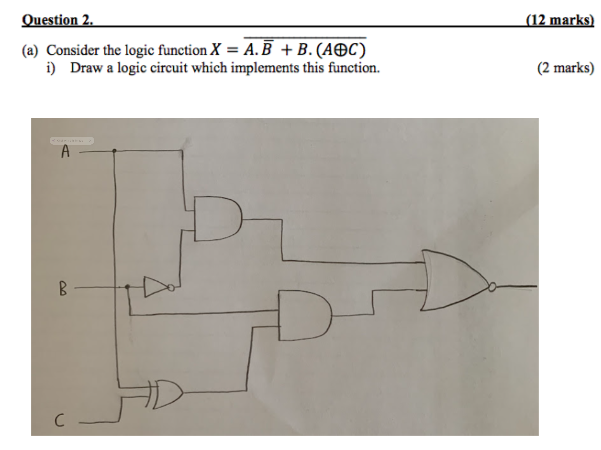

让我为你详细解释每个部分的具体计算步骤：

### (a) 十进制数 173 转换为八进制数

要将十进制数 **173** 转换为八进制，步骤如下：

1. 用 **8** 作为基数不断除十进制数 **173**，记录每次的余数。
   
   - 173 ÷ 8 = 21，余数 **5**
   - 21 ÷ 8 = 2，余数 **5**
   - 2 ÷ 8 = 0，余数 **2**

2. 将余数倒过来排列，得到 **255**（八进制数），用前导 0 表示完整的八进制为 **0255**。

---

### (b) 给定 8 位二进制数 10110110 的不同表示方式及其十进制值计算

#### 1. **8 位补码 (Two's complement)**

补码表示法用于表示负数，最高位（最左边的位）是符号位：
- 最高位是 1，表示是负数。
- 补码转换的步骤是：对二进制数取反（0变1，1变0），然后再加 1。

具体计算步骤：
1. 原二进制数：10110110
2. 取反：01001001
3. 加 1：01001001 + 1 = 01001010
4. 01001010 转换为十进制为 74，因此 **-74**。

#### 2. **8 位无符号数 (Unsigned)**

无符号数直接将二进制数看作正数，不涉及符号位。

将二进制数 **10110110** 转换为十进制，步骤如下：
- 从右到左，每一位代表 2 的幂次：
  
  \( 1 \times 2^7 + 0 \times 2^6 + 1 \times 2^5 + 1 \times 2^4 + 0 \times 2^3 + 1 \times 2^2 + 1 \times 2^1 + 0 \times 2^0 \)
  
  计算结果是：  
  \( 128 + 32 + 16 + 4 + 2 = 182 \)
  
  因此，**182** 是无符号数的十进制值。

#### 3. **8 位一补码 (One's complement)**

一补码表示法也是用于表示负数，最高位 1 表示负数，但它的规则是直接将正数的二进制表示取反。

具体步骤：
1. 原二进制数：10110110
2. 由于最高位是 1，它表示负数，因此我们需要取反，得到：01001001
3. 01001001 转换为十进制为 **73**，因此一补码的十进制值是 **-73**。

#### 4. **8 位 Excess-127 表示法**

Excess-127 表示法是一种偏移表示法。它的规则是：取二进制数的十进制值，然后减去一个固定的偏移量（127）。

具体步骤：
1. 二进制数 10110110 转换为十进制为 **182**（和无符号数相同的计算方法）。
2. 由于是 Excess-127 表示法，所以我们减去 **127**：
   
   \( 182 - 127 = 55 \)

因此，Excess-127 表示的十进制值是 **55**。

---

如果有任何部分还不清楚，请告诉我，我可以进一步解释。

这张图主要涉及两个问题，分别是关于浮点数的IEEE表示和8位补码二进制数相加的运算。让我为你详细解释：

### (c) 将65.375的IEEE单精度和双精度浮点数表示为16进制

这个问题要求将**65.375**用IEEE 754标准表示，分别计算单精度（32位）和双精度（64位）浮点数，并以16进制的形式表示。

#### 单精度（IEEE 754, 32位）
1. **符号位**：65.375是正数，所以符号位是0。
   
2. **转换成二进制**：
   - 65的二进制表示是：1000001
   - 0.375的二进制表示是：0.011
   
   因此，65.375的二进制表示是：**1000001.011**。

3. **规范化**：
   - 将二进制数表示成规范化形式：1.000001011 × 2^6
   - 因此尾数（mantissa）是：**000001011**
   - 阶码（exponent）是6。

4. **IEEE表示**：
   - **符号位**：0
   - **阶码**：6 + 127 = 133，表示为 **10000101**。
   - **尾数**：小数点后的部分补齐到23位，得到 **00000101100000000000000**。
   
   最终的单精度IEEE 754表示为：
   \[
   0 10000101 00000101100000000000000
   \]
   转换为16进制：**0x4282C000**

#### 双精度（IEEE 754, 64位）
1. **符号位**：0（正数）。

2. **转换成二进制**：二进制数保持不变，还是**1000001.011**。

3. **规范化**：1.000001011 × 2^6。

4. **IEEE表示**：
   - **符号位**：0
   - **阶码**：6 + 1023 = 1029，表示为 **10000000101**。
   - **尾数**：补齐到52位，得到 **0000010110000000000000000000000000000000000000000000**。

   最终的双精度IEEE 754表示为：
   \[
   0 10000000101 0000010110000000000000000000000000000000000000000000
   \]
   转换为16进制：**0x4050580000000000**

---

### (d) 8位补码二进制数相加

题目要求对两个8位补码二进制数**01101100**和**01101010**进行相加，并分析结果。

#### (i) 计算两个8位二进制数的和

首先将两个二进制数相加：
- **01101100** = 十进制 **108**
- **01101010** = 十进制 **106**

相加结果为：  
**108 + 106 = 214**

但是我们需要在8位补码中表示214。在8位二进制中，214的二进制是**11000110**，但由于超过了8位，所以舍弃前面的溢出位，得到：
\[
11000110
\]

因此，计算得到的8位二进制结果是 **11000110**。

#### (ii) 溢出（Overflow）、进位（Carry）、负号（Negative）和零标志（Zero Flag）

1. **V (Overflow) 溢出标志**：当两个正数相加，结果变为负数时，发生溢出。这里两个正数相加，结果为负，因此溢出标志 **V = 1**。
  
2. **C (Carry) 进位标志**：进位标志用来指示加法操作时是否产生进位。在这里有进位，因此 **C = 0**。
  
3. **N (Negative) 负号标志**：结果是负数时，负号标志为1。11000110 是一个负数（因为最高位是1），所以 **N = 1**。
  
4. **Z (Zero) 零标志**：结果是否为零。在这里，结果不为零，所以 **Z = 0**。

---

如果有其他问题或者需要进一步解释，欢迎告诉我！

### 1. 布尔表达式分析

- 

### 2. 电路实现步骤

为了实现这个逻辑表达式，我们需要以下逻辑门：

- **NOT 门**（取反）来实现 \(\overline{A}\)。
- **AND 门**来实现与运算 \(\overline{A} \cdot B\) 和 \(B \cdot (A \oplus C)\)。
- **XOR 门**来实现 \(A \oplus C\)。
- **OR 门**来实现最终的相加操作（将两部分的结果相加）。

### 3. 电路结构说明

看你上传的图片，它是一个逻辑电路图，具体如何实现：

1. 
   

### 4. 电路图解释

- 

---

### 总结

这道题是通过逻辑电路实现一个布尔表达式的题目，关键步骤是：
1. 解析布尔表达式。
2. 使用适当的逻辑门（NOT、AND、XOR、OR）实现每一步运算。
3. 最终组合成完整的逻辑电路。

