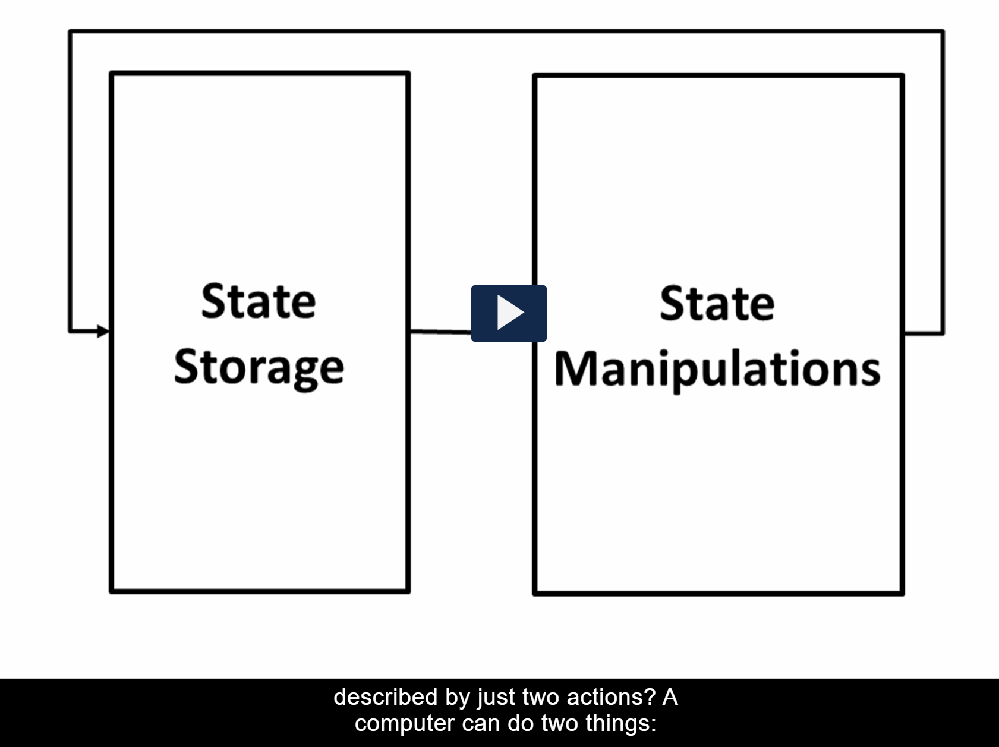
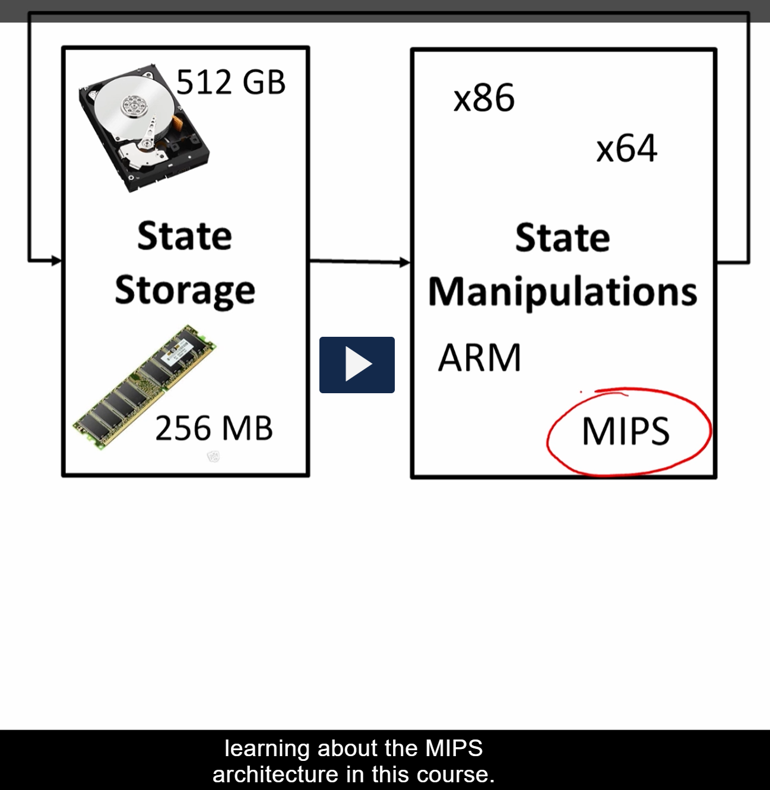
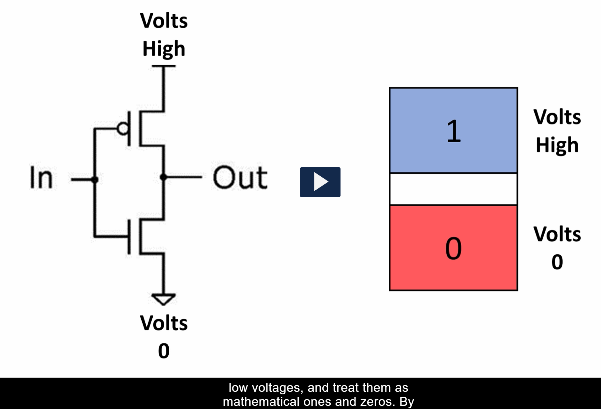
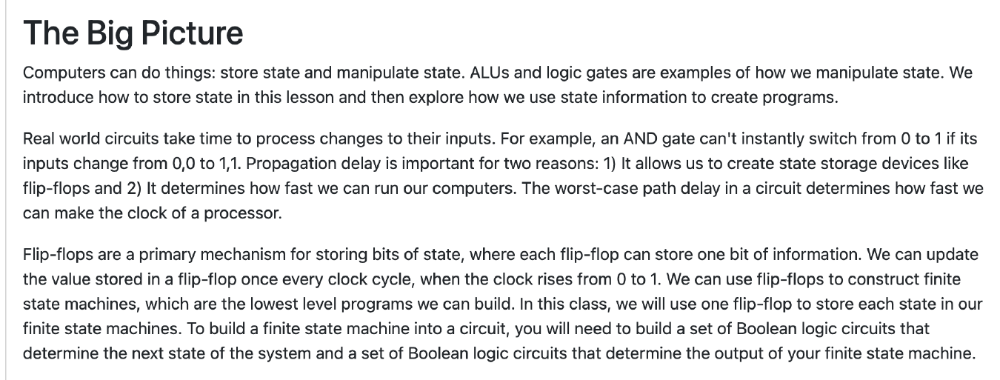
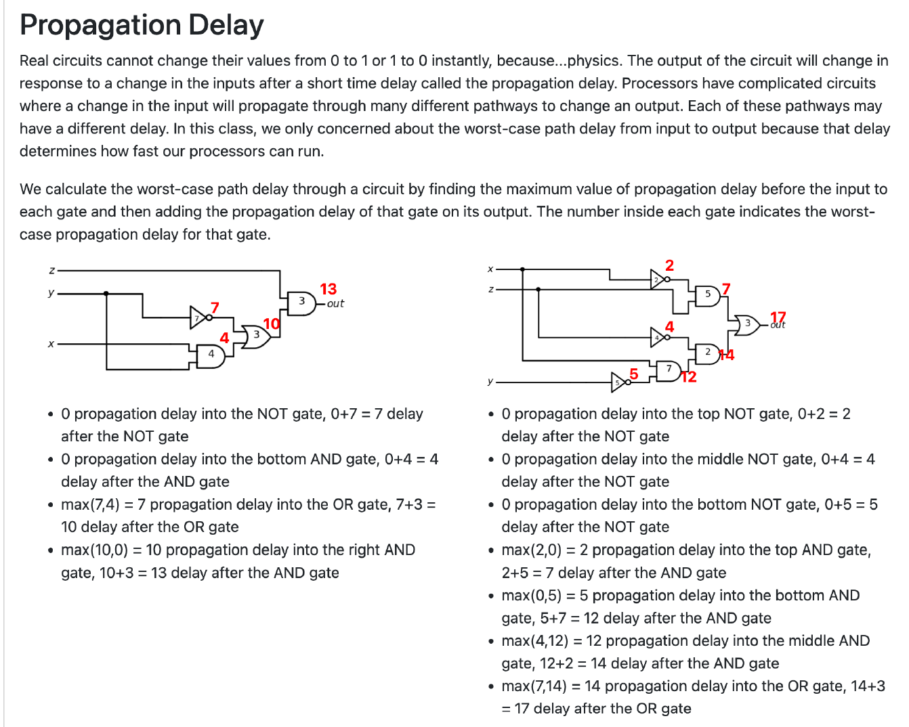
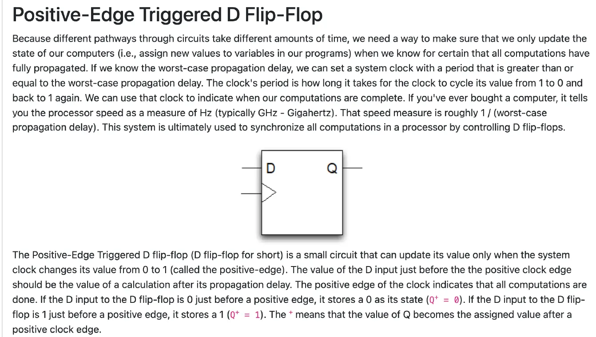
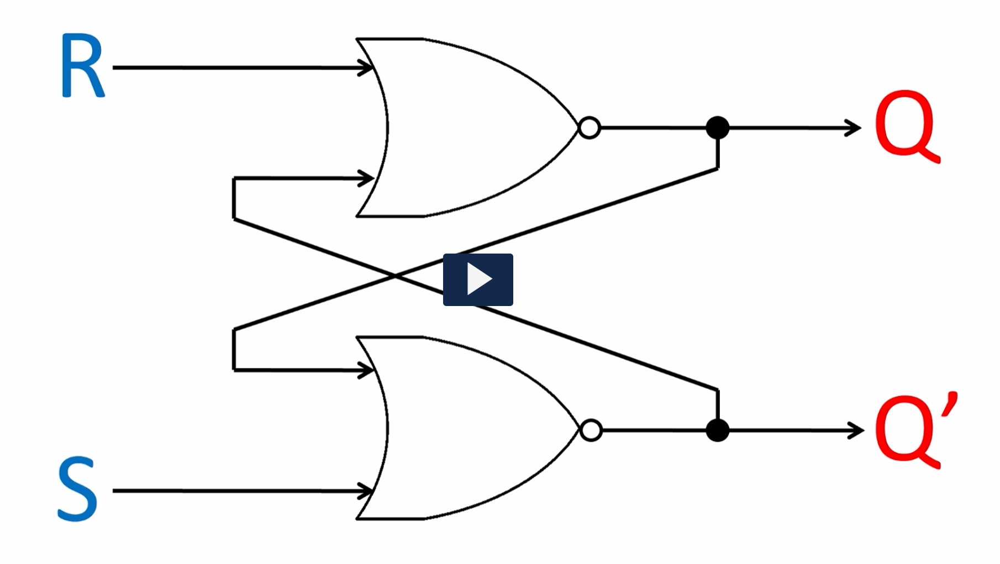

这张图描述了计算机可以进行的两项基本操作：**状态存储（State Storage）** 和 **状态操作（State Manipulations）**。

1. **状态存储（State Storage）**：计算机需要存储信息以保持系统状态。状态存储是指存储系统当前的各种数据，保持状态的持续性。它可以是内存、硬盘或其他存储介质，负责保存计算机的操作数据。
2. **状态操作（State Manipulations）**：计算机通过对存储的信息进行操作，改变当前状态。这是计算机执行任务的核心，包含了对数据的修改、处理或计算等行为。

这两个操作之间通过箭头连接，显示了一个周期性过程：从存储中读取数据，进行操作后再写回或更新存储，最终形成一个循环。这可以看作是计算机运作的基本逻辑结构——先存储信息，再操作这些信息，然后更新存储。

总结：图示强调了计算机的运作可以用两个简单的行为描述，即“存储”与“操作”。

这张图介绍了计算机系统的组成，特别是在**状态存储（State Storage）**和**状态操作（State Manipulations）**方面的硬件和架构。

1. **状态存储（State Storage）**：
   - 图中的状态存储分为两种不同的存储介质：
     - **硬盘（512 GB）**：提供大容量的持久存储，适用于存储大量数据。
     - **内存（256 MB）**：提供高速的临时存储，用于存储正在运行的程序和数据。内存的容量较小，但读写速度非常快。
2. **状态操作（State Manipulations）**：
   - 这部分包含了计算机的处理器架构。不同的架构决定了计算机如何操作存储的信息。图中列出了以下几种处理器架构：
     - **x86**：一种广泛使用的处理器架构，主要用于桌面和服务器。
     - **x64**：x86架构的64位扩展，提供更高的性能和更大的内存寻址能力。
     - **ARM**：一种常用于移动设备、嵌入式系统和低功耗设备的处理器架构。
     - **MIPS**：另一种计算机架构，广泛应用于嵌入式系统，图中标记出“学习MIPS架构”意味着当前课程关注于这类架构。

图下方的文字“learning about the MIPS architecture in this course”表明，这个图的目的是帮助理解MIPS架构在计算机中如何运作，尤其是与其他架构（如x86、x64和ARM）相比的区别。

**总结**：这张图展示了计算机的存储和操作系统，强调了不同存储介质和处理器架构如何共同工作来执行计算机任务。重点是MIPS架构的学习，特别是在嵌入式系统和计算机体系结构方面。

这张图展示了数字电路中的逻辑门工作原理。
左侧的逻辑门符号表示一个非门（NOT gate）。它有一个输入端（In）和一个输出端（Out），当输入为低电压（0伏特）时，输出为高电压；反之亦然。这体现了非门的逻辑功能：反转输入信号。
右侧的颜色块进一步解释了这种关系：
蓝色部分标示“1”和“Volts High”，代表高电压状态。
红色部分标示“0”和“Volts 0”，代表低电压状态。
底部的文字说明了在数字电路中如何处理高低电压，将其视为数学上的1和0。
总体来说，这个图旨在传达基本的二进制逻辑概念以及非门的工作方式。

这段文字讨论了计算机如何存储和处理状态信息的基本概念。以下是主要内容的概述：
存储和操纵状态：计算机能够执行任务的关键在于它能够存储和操纵状态。算术逻辑单元（ALU）和逻辑门是进行这种操作的例子。
现实世界电路的处理时间：实际电路需要时间来响应输入的变化。例如，AND门不能立即从0切换到1。传播延迟对于创建状态存储设备（如触发器）以及确定处理器时钟速度至关重要。
触发器的用途：触发器是存储位状态的主要机制，每个触发器可以存储一个比特的信息。可以通过更新触发器中的值来构造有限状态机，这些机器是最基础的可编程结构。
构建有限状态机：为了将有限状态机集成到电路中，需要设计布尔逻辑电路来确定系统的下一个状态及其输出。
总体来说，这段文字介绍了如何在硬件层面存储和处理数据，以支持计算机程序的设计和运行。

这张图片讨论的是电子电路中的“传播延迟”（Propagation Delay）。下面是对此概念的详细解释：
什么是传播延迟？
传播延迟是指当输入发生变化时，电路的输出不会立即改变，而是会经过一段时间后才会变化。这段时间称为传播延迟。这是因为物理上的限制使得电子无法瞬间从一个地方移动到另一个地方。
为什么关心传播延迟？
在复杂电路中，特别是像处理器这样的集成电路里，输入的改变可能会通过多个不同的路径传播，最终影响输出。每条路径可能有不同的延迟。因此，了解最坏情况下的路径延迟非常重要，因为它决定了处理器能运行得多快。
如何计算最坏情况的路径延迟？
要计算最坏情况的路径延迟，我们需要找到所有可能路径的最大传播延迟，然后加上相应门的延迟。每个门都有一个内部标示的最坏情况传播延迟数值。
左侧电路示例：
NOT 门:
输入延迟: 0
NOT 门延迟: 7
总延迟: (0 + 7 = 7)
AND 门:
输入延迟: 0
AND 门延迟: 4
总延迟: (0 + 4 = 4)
OR 门:
最大输入延迟: max(7, 4) = 7
OR 门延迟: 3
总延迟: (7 + 3 = 10)
右边的 AND 门:
最大输入延迟: max(10, 0) = 10
AND 门延迟: 3
总延迟: (10 + 3 = 13)
右侧电路示例：
顶部的 NOT 门:
输入延迟: 0
NOT 门延迟: 2
总延迟: (0 + 2 = 2)
中间的 NOT 门:
输入延迟: 0
NOT 门延迟: 4
总延迟: (0 + 4 = 4)
底部的 NOT 门:
输入延迟: 0
NOT 门延迟: 5
总延迟: (0 + 5 = 5)
顶部的 AND 门:
最大输入延迟: max(2, 0) = 2
AND 门延迟: 5
总延迟: (2 + 5 = 7)
底部的 AND 门:
最大输入延迟: max(0, 5) = 5
AND 门延迟: 7
总延迟: (5 + 7 = 12)
中间的 AND 门:
最大输入延迟: max(4, 12) = 12
AND 门延迟: 2
总延迟: (12 + 2 = 14)
OR 门:
最大输入延迟: max(7, 14) = 14
OR 门延迟: 3
总延迟: (14 + 3 = 17)
总结
理解传播延迟有助于设计和优化电子电路，确保它们能够在预期的性能水平上工作。通过分析不同路径的延迟，工程师可以识别瓶颈并采取措施减少延迟，提高系统整体效率。

这段文字介绍了正边沿触发的D触发器的概念及其在同步计算中的作用。以下是详细的解释和翻译：
解释：
传播延迟：由于电路的不同路径需要的时间不同，为了确保计算的准确性，我们只能在确定所有计算已经完全完成时更新系统的状态。这涉及到知道最坏情况下的传播延迟时间。
时钟周期：根据已知的最坏情况传播延迟，我们可以设置一个时钟周期大于或等于这个延迟的系统时钟。时钟周期是从1变为0再回到1所需的时间。
D触发器的作用：D触发器是一种小型的电路，它仅在系统时钟从0跳变到1的正边沿时刻更新其状态。这意味着只有在时钟的正边沿到来时，D触发器才将D输入端的值存储为其新的状态。
同步计算：这种机制被用来同步处理器中的所有计算，以确保数据的一致性和正确性。
翻译：
正边沿触发的D触发器（简称D触发器）是一种小型电路，它仅能在系统时钟从0变为1的时刻（称为正边沿）更新其值。D输入端在正时钟边缘前的值应该是经过传播延迟后的计算结果。正时钟边缘表示所有计算已完成。如果在正时钟边缘前D输入为0，则Q+的状态为0；如果为1，则Q+的状态为1。“+”表示Q的值是在正时钟边缘之后赋值的。
希望这些信息对你有所帮助！

这张图展示的是一个典型的 **SR锁存器**（Set-Reset Latch），通过两个 **NOR门** 实现。

### 工作原理：

1. **输入：** 该电路有两个输入信号，S（Set）和R（Reset）。
2. **输出：** 该电路有两个输出，Q 和 Q'，Q'是Q的反向输出。

### 锁存过程：

- 当 **S = 0，R = 0** 时，NOR门的输出保持不变，保持当前状态。这是所谓的 **记忆功能**，因为它保持上一个状态，直到输入发生变化。
- 当 **S = 1，R = 0** 时，锁存器会进入“设定”状态，Q 输出为 1，Q' 输出为 0。
- 当 **S = 0，R = 1** 时，锁存器会进入“复位”状态，Q 输出为 0，Q' 输出为 1。
- 当 **S = 1，R = 1** 时，这种状态是禁止的，因为两个NOR门的输出会变得不稳定，这是不允许的。

### 锁存的实现：

- 这个锁存器通过两个交叉连接的NOR门实现，输入信号S和R分别控制NOR门的输出。NOR门的输出信号会反馈到另一个门的输入，从而保持系统的当前状态，即“记忆”上一个输入的状态，直到新的输入发生改变。

通过这种方式，电路能够锁存一个状态并保持直到下次输入改变它。

如果你有更深入的需求或者具体问题，欢迎继续询问！