这段文字通过一个类比来解释计算机内存的工作原理，特别是处理器的缓存内存和主内存（RAM）之间的关系。

以下是类比和解释的详细说明：

1. **冰箱与杂货店的类比**：
   - **杂货店**就像处理器的**主内存**（RAM），它很大，包含了所有你可能需要的东西，但获取速度比较慢。
   - **冰箱**代表**缓存内存**，它比主内存小，但速度更快。你不想每次都去杂货店拿食物，就像处理器不想每次都去访问主内存。相反，你会预测未来几天你会需要哪些食物，然后一次性把它们拿到冰箱（缓存内存），这样可以更快速和高效地获取。
2. **计算机中的内存访问**：
   - 处理器的主内存（RAM）虽然很大，但它的访问速度很慢，通常需要几百个时钟周期。为了弥补这一点，我们使用了较小且更快速的内存系统——**缓存**，它们与处理器更靠近。缓存比主内存小得多，但访问速度快很多（通常只需要1-2个时钟周期）。
   - **数据的战略性复制**：处理器可以预测哪些数据可能会在不久的将来被访问，并将这些数据块从主内存复制到缓存中。这样，当需要访问这些数据时，缓存能够提供更快的访问速度，因为缓存比主内存更快。
   - 这对于程序重复访问相同数据的情况（比如循环中的数据）特别有帮助。通过将这些数据放入缓存，可以避免每次都去访问较慢的主内存。
3. **时间局部性（Temporal Locality）**：
   - **时间局部性**指的是某些数据在短时间内会被频繁访问。缓存利用这一特性，将可能在短时间内再次被访问的数据存储在缓存中，从而减少了访问较慢的主内存的需要。

总结来说，这个类比将主内存比作杂货店（大但慢），将缓存内存比作冰箱（小但快）。通过将频繁使用的数据存储在缓存中，处理器可以提高工作效率。

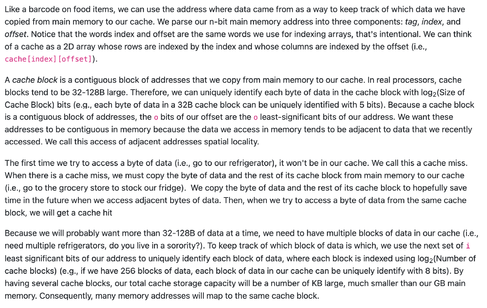

这段文字继续使用了类比来解释计算机内存（特别是缓存）的工作原理，特别是数据在缓存中的存储和访问方式。以下是详细的解释：

### 核心概念

1. **数据地址解析**：
   - 类比食品的条形码，我们将数据从主内存复制到缓存时，使用地址来追踪数据的来源。我们将 n 位的主内存地址分为三个部分：**标签（tag）**、**索引（index）\**和\**偏移量（offset）**。这与我们在索引数组时所使用的术语相同。
   - 缓存可以看作是一个二维数组，其行由索引（index）标识，而列则由偏移量（offset）标识（例如：`cache[index][offset]`）。
2. **缓存块（Cache Block）**：
   - **缓存块**是从主内存复制到缓存的一块连续地址区域。通常，缓存块的大小为32-128字节（B）。因此，我们可以通过 `log2(缓存块大小)` 位来唯一标识缓存块中的每个字节。例如，32B的缓存块中的每个字节可以通过5位二进制数来唯一识别。
   - 每个缓存块由连续的地址组成，这些地址的**偏移量部分**（即地址的最低几位）代表的是内存中相邻的数据位置。我们希望这些数据在内存中是相邻的，因为内存中最近访问的数据通常会与将来要访问的数据相邻。这就是我们称之为的**空间局部性（Spatial Locality）**。
3. **缓存未命中（Cache Miss）和缓存命中（Cache Hit）**：
   - 当第一次访问某个字节的数据时，它不在缓存中，我们称之为**缓存未命中**（Cache Miss）。此时，我们必须将该字节的数据及其所在缓存块的其他字节从主内存复制到缓存（类似于去杂货店补充冰箱里的食物）。
   - 通过将该字节和其缓存块的其他字节复制到缓存中，缓存希望能够提前准备好接下来可能会用到的数据。之后，当我们再次访问同一缓存块中的数据时，就会发生**缓存命中**（Cache Hit），因为数据已经存在于缓存中。
4. **多个缓存块**：
   - 由于我们通常会一次访问超过32-128字节的数据，因此需要在缓存中存储多个数据块。例如，我们需要多个冰箱来存储更多的食物。为了追踪缓存中的每个数据块，我们使用下一个部分的**索引**来唯一标识每个数据块。
   - 如果缓存中有256个数据块，每个数据块中的数据都可以通过8位二进制数来唯一标识。通过这种方式，即使缓存的存储能力比主内存要小得多（以KB为单位），但缓存仍能有效地存储数据并提高访问效率。

### 总结

- **缓存块**是从主内存复制到缓存的一组连续地址，缓存通过**空间局部性**优化数据存储：相邻的数据通常会一起被复制到缓存中。
- **缓存未命中**时，必须从主内存复制数据块到缓存中；而**缓存命中**时，数据已经在缓存中，可以直接访问。
- 为了管理多个缓存块，计算机会使用**索引**来唯一标识每个数据块，从而在缓存中存储更多的数据块，尽管缓存的容量远小于主内存。

这种方法通过缓存提高了内存访问的效率，减少了频繁访问慢速主内存的需求。

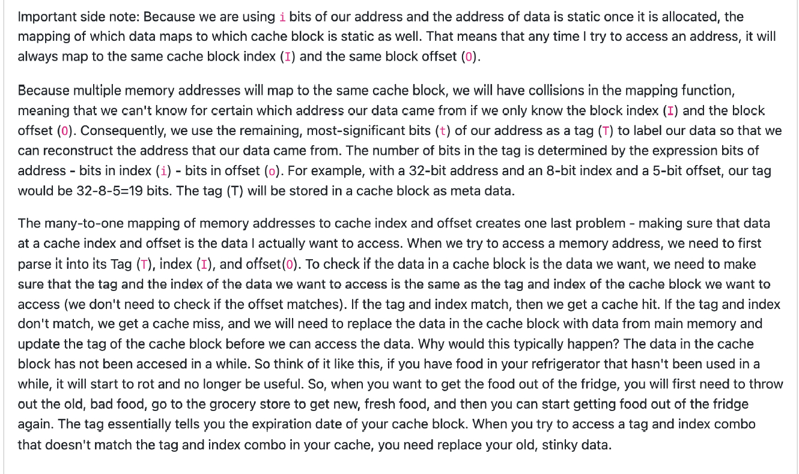

这段文字继续阐述了计算机缓存的工作原理，特别是在多地址映射到同一缓存块时如何解决冲突，并且介绍了如何通过标签（Tag）、索引（Index）和偏移量（Offset）来管理缓存中的数据。以下是详细的解释：

### 核心概念

1. **多地址映射到同一缓存块**：
   - 因为我们使用了固定数量的地址位来确定数据在缓存中的位置（即地址的**索引**部分和**偏移量**部分），这意味着每当我们访问某个内存地址时，它将始终映射到同一个缓存块的**索引**（I）和**偏移量**（O）。
   - 由于多个内存地址可能映射到同一个缓存块，因此会发生冲突。也就是说，仅凭**索引**和**偏移量**，我们无法准确知道数据来自哪个内存地址。为了区分这些数据，我们需要使用**标签**（Tag）。
2. **标签（Tag）**：
   - **标签**用来标记数据来源的具体地址，以便在访问缓存时可以区分不同的数据块。标签是通过从内存地址中去掉索引和偏移量的部分来得到的。
   - 举个例子，如果地址是32位，索引是8位，偏移量是5位，那么标签将是32 - 8 - 5 = 19位。标签存储在缓存块中，作为额外的元数据。
3. **多对一映射问题**：
   - 由于多个内存地址会映射到同一个缓存块，会出现数据是否为所需数据的判断问题。我们如何确保缓存中的数据是我们想要的呢？我们通过**标签**和**索引**来验证。
   - 当我们访问一个内存地址时，我们首先会检查缓存中该地址的**标签**、**索引**和**偏移量**。如果**标签**和**索引**匹配，我们就得到了**缓存命中**（Cache Hit）；如果不匹配，则为**缓存未命中**（Cache Miss），此时需要从主内存加载数据。
4. **缓存命中与缓存未命中**：
   - 如果标签和索引匹配，说明数据在缓存中是我们想要的，我们就可以访问它。
   - 如果标签和索引不匹配，我们得到的是**缓存未命中**，此时需要更新缓存块中的标签并将数据从主内存加载到缓存中，就像去超市拿食物一样。
5. **缓存替换策略**：
   - 为什么缓存会出现这种情况？因为缓存中的数据块并非永远有效。举个例子，如果冰箱里的食物很久没用了，它就变坏了，不再有用。这时，我们需要丢掉坏掉的食物，去超市买新的。
   - 类似地，当访问到一个旧的数据块时，如果它的数据不再有效，就需要用新的数据替换它。**标签**就是缓存块中的“过期时间”，它帮助我们判断数据是否仍然有效。

### 总结

- **标签**帮助区分不同的内存地址数据块，避免多个内存地址映射到同一个缓存块时产生冲突。
- 当访问缓存时，通过比较**标签**和**索引**来判断数据是否为所需的数据。如果不匹配，就会发生缓存未命中，需要从主内存加载数据并更新缓存。
- **缓存替换策略**类似于我们丢弃过期食物并购买新食物的过程，确保缓存中的数据始终是有效且最新的。

这段文字帮助我们理解如何通过标签、索引和偏移量来管理缓存中的数据，如何处理缓存未命中的情况，以及如何通过标签进行数据替换。

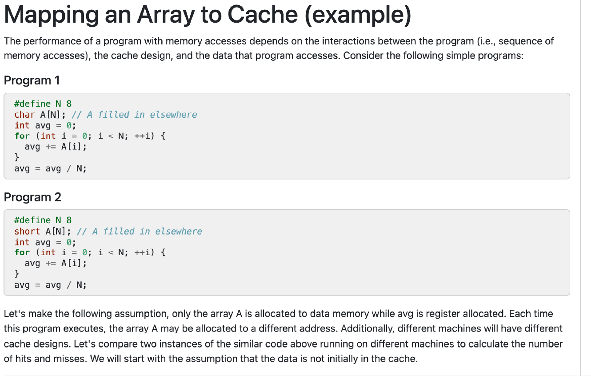

这段文字和代码示例描述了程序中内存访问的性能如何受程序（内存访问的顺序）、缓存设计以及程序访问的数据的影响。特别是在两个简单程序中，通过对比它们的执行方式，分析不同缓存设计下的命中率和未命中率。

### 核心概念和程序分析

1. **程序1：**

   ```c
   #define N 8
   int A[N]; // A filled in elsewhere
   int avg = 0;
   for (int i = 0; i < N; ++i) {
       avg += A[i];
   }
   avg = avg / N;
   ```

   - **目的**：计算数组 `A` 的平均值。
   - **内存访问**：程序顺序地访问数组 `A` 中的每个元素，从 `A[0]` 到 `A[N-1]`。
   - **问题**：访问数组时，每次对 `A[i]` 的访问可能会导致缓存未命中，尤其是在数据不在缓存中时，CPU需要从主内存加载数据。这个顺序的内存访问方式可能会导致频繁的缓存未命中，特别是当数据较大时。

2. **程序2：**

   ```c
   #define N 8
   short A[N]; // A filled in elsewhere
   int avg = 0;
   for (int i = 0; i < N; ++i) {
       avg += A[i];
   }
   avg = avg / N;
   ```

   - **目的**：与程序1相同，计算数组 `A` 的平均值，但使用了 `short` 类型的数组元素（16位而非32位）。
   - **内存访问**：与程序1类似，程序同样顺序地访问数组 `A` 中的每个元素。
   - **差异**：由于数组 `A` 使用的是 `short` 类型（16位），这意味着每个数组元素占用的空间较小，相较于程序1（32位整数类型）。如果缓存是以字节为单位管理的，这种更小的数据类型可能会导致更高的缓存命中率，因为缓存的行（cache lines）能够存储更多的元素。

### 假设：

- **数据分配**：假设数组 `A` 被分配到数据内存中，而 `avg` 被分配到寄存器中。每次程序执行时，`A` 可能被分配到不同的内存地址。
- **不同的缓存设计**：不同的计算机系统具有不同的缓存设计，因此在缓存命中率和未命中率上会有所不同。

### 内存访问模式与缓存命中率：

- **缓存未命中（Cache Miss）**：当数据不在缓存中时，CPU必须从主内存加载数据，这会导致缓存未命中。对于较大的数据（如32位整型数组），如果数组元素无法完全适配缓存块（cache block），则会频繁发生缓存未命中。
- **缓存命中（Cache Hit）**：当数据已经在缓存中时，访问将非常快。这通常发生在小数据类型数组（如 `short` 类型）中，因为每个缓存块可以包含更多的元素。

### 总结：

- **程序1与程序2的比较**：程序2由于使用了较小的数据类型（`short`），可能会导致更高的缓存命中率，而程序1可能会由于较大的数据类型导致较多的缓存未命中。
- **内存访问的影响**：访问模式和缓存设计会显著影响程序的性能。程序访问数据的顺序和数据的大小都会对缓存的效率产生影响，从而影响程序的执行速度。

通过这个例子，强调了缓存和内存访问模式在程序性能中的重要性，尤其是在使用不同的数据类型和缓存设计时，程序可能会经历不同的缓存命中率。

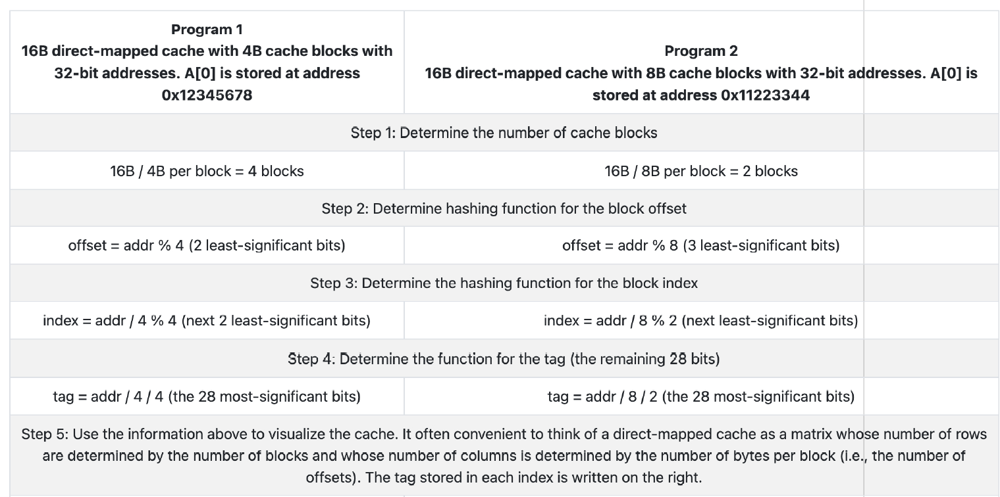

这张表格对比了两个程序在不同缓存配置下的映射过程，特别是如何根据内存地址将数据映射到缓存中。表格中分别展示了两个程序在16B直接映射缓存（Direct-Mapped Cache）中如何处理缓存块、偏移量、索引和标签。以下是对表格中内容的详细解释：

### **Program 1:**

**配置：**

- 16B缓存总大小，4B每缓存块。
- 32位地址，数组 `A[0]` 存储在地址 `0x12345678`。

**步骤解释：**

1. **步骤 1: 确定缓存块的数量：**
   - 总缓存大小是16B，每个缓存块4B，所以缓存中有 `16B / 4B = 4` 个缓存块。
2. **步骤 2: 确定块偏移量的哈希函数：**
   - 偏移量（offset）是通过计算地址模4来得到的，即 `addr % 4`。这是因为每个缓存块大小为4B，最后两位是偏移量。
3. **步骤 3: 确定块索引的哈希函数：**
   - 索引（index）是通过计算地址除以4并对结果取模4来得到的，即 `addr / 4 % 4`。这相当于提取地址的下两位作为索引。
4. **步骤 4: 确定标签的哈希函数：**
   - 标签（tag）是通过将地址除以4并进一步除以4来获得的，最终得到剩余的28位地址部分。即 `addr / 4 / 4`，这表示地址的前28位作为标签。
5. **步骤 5: 使用上述信息来可视化缓存：**
   - 可以将直接映射缓存视为一个矩阵，行数由缓存块的数量决定，列数由每个缓存块的字节数决定。标签存储在每个索引处，帮助标识存储在该位置的数据。

### **Program 2:**

**配置：**

- 16B缓存总大小，8B每缓存块。
- 32位地址，数组 `A[0]` 存储在地址 `0x11223344`。

**步骤解释：**

1. **步骤 1: 确定缓存块的数量：**
   - 总缓存大小是16B，每个缓存块8B，所以缓存中有 `16B / 8B = 2` 个缓存块。
2. **步骤 2: 确定块偏移量的哈希函数：**
   - 偏移量（offset）是通过计算地址模8来得到的，即 `addr % 8`。这是因为每个缓存块大小为8B，最后三位是偏移量。
3. **步骤 3: 确定块索引的哈希函数：**
   - 索引（index）是通过计算地址除以8并对结果取模2来得到的，即 `addr / 8 % 2`。这相当于提取地址的下两位作为索引。
4. **步骤 4: 确定标签的哈希函数：**
   - 标签（tag）是通过将地址除以8并进一步除以2来获得的，最终得到剩余的28位地址部分。即 `addr / 8 / 2`，这表示地址的前28位作为标签。
5. **步骤 5: 使用上述信息来可视化缓存：**
   - 同样可以将直接映射缓存视为一个矩阵，行数由缓存块的数量决定，列数由每个缓存块的字节数决定。标签存储在每个索引处，帮助标识存储在该位置的数据。

### **总结**

- **Program 1**和**Program 2**都使用了**直接映射缓存**，但它们有不同的缓存块大小（4B与8B）。这直接影响了缓存中块的数量以及如何映射内存地址到缓存。
- 每个内存地址通过不同的哈希函数（偏移量、索引和标签）被映射到缓存中的不同位置。
- 在**Program 1**中，缓存块较小（4B），因此每个缓存块可以存储的数据较少；而在**Program 2**中，缓存块较大（8B），每个缓存块可以存储更多的数据。

这些映射规则帮助计算机确定如何有效地从内存中加载数据，并将其存储到缓存中，以提高访问速度。

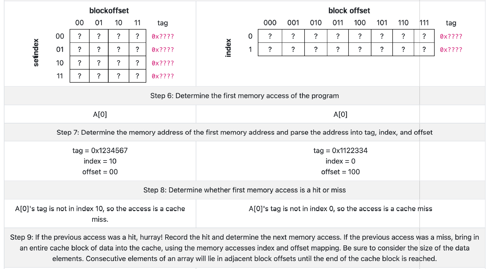

这张表格和步骤详细描述了如何在缓存中查找内存地址，分析缓存命中与未命中，特别是在访问数组元素时。具体步骤如下：

### **步骤 6: 确定程序的第一次内存访问**

- 在这一步，程序需要访问数组的第一个元素 `A[0]`，并将其地址拆解为标签（Tag）、索引（Index）和偏移量（Offset）。

#### 地址解析：

- 假设 `A[0]` 存储在某个地址 `0x12345678`。
- 在此步骤中，将地址解析为：
  - **标签（tag）**：`0x1234567`
  - **索引（index）**：`10`
  - **偏移量（offset）**：`00`

这表示我们通过某种方式（例如，地址的位划分）将完整的32位内存地址（`0x12345678`）拆分成了三个部分：标签、索引和偏移量。

### **步骤 7: 确定第一次内存访问的地址，并将地址拆解成标签、索引和偏移量**

- 在这一步，明确了 `A[0]` 的内存地址为 `0x12345678`，并且根据上述拆解，将地址转化为以下三个部分：
  - **标签（tag）**：`0x1122334`
  - **索引（index）**：`0`
  - **偏移量（offset）**：`100`

这些信息表明该内存地址的**标签**部分（最重要的位）是 `0x1122334`，**索引**部分是 `0`，而**偏移量**部分是 `100`。

### **步骤 8: 判断第一次内存访问是命中（hit）还是未命中（miss）**

- 根据这个地址的**标签**和**索引**，程序将检查缓存中的数据。
- 如果缓存中存储的标签与该内存地址的标签匹配，则说明数据已经存在于缓存中，这时为**缓存命中（Cache Hit）**；否则，为**缓存未命中（Cache Miss）**。
- 在这个例子中，`A[0]` 的标签不在缓存的 `index 10` 中，因此访问是**缓存未命中（Cache Miss）**。

### **步骤 9: 处理缓存未命中**

- 当出现缓存未命中时，程序将把整个缓存块的数据加载到缓存中。
- 这一过程包括将一个数据块从主内存加载到缓存，这样程序接下来的访问可以更快，因为该数据块现在在缓存中。
- **注意**：缓存块的大小会影响下一步的加载过程。相邻的数组元素会被加载到相邻的缓存偏移量中，直到缓存块的末尾。

### **总结**

- 这张表格展示了缓存如何通过标签、索引和偏移量来解析内存地址。
- 在程序第一次访问 `A[0]` 时，它会根据该内存地址解析出标签、索引和偏移量。
- 如果缓存中找不到对应的标签和索引，则会发生缓存未命中，并且该数据块会被从主内存加载到缓存中，以提高后续访问的速度。

这整个过程描述了计算机缓存是如何处理程序内存访问的，包括缓存命中与未命中的判断，并在未命中时如何更新缓存以提高效率。

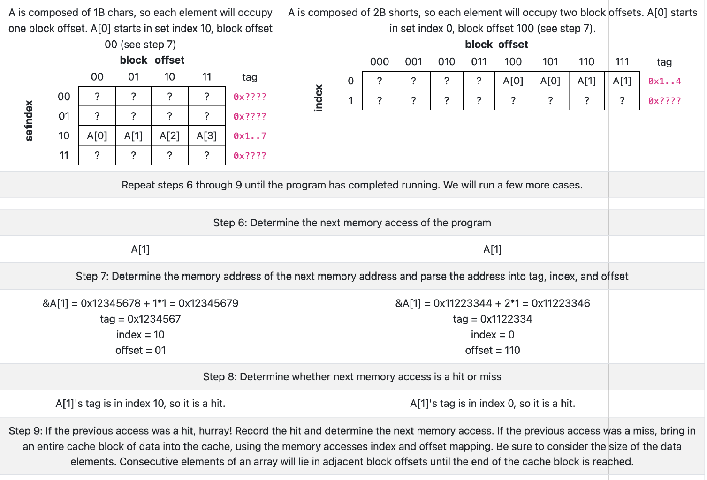

这张表格展示了两个程序如何在不同的缓存配置下进行内存访问，具体分析了数组访问（`A[0]` 和 `A[1]`）如何通过标签、索引和偏移量映射到缓存，并判断缓存命中与未命中的过程。以下是对表格内容的详细解释：

### **第一个程序 (A 是由 1 字节字符组成)**

- **数组** `A` 由 1 字节的字符组成，因此每个元素将占用一个缓存块偏移量（block offset）。
- `A[0]` 存储在 **索引 10**，**块偏移量 00**（见步骤7）。

#### 步骤 6 和 7（确定 `A[0]` 和 `A[1]` 的内存地址，并解析为标签、索引、偏移量）：

- **`A[0]`** 地址：`0x12345678`，通过将地址拆分为：
  - **标签（tag）**：`0x????`
  - **索引（index）**：`10`
  - **偏移量（offset）**：`00`
- **`A[1]`** 地址：`0x12345679`，通过将地址拆分为：
  - **标签（tag）**：`0x????`
  - **索引（index）**：`10`
  - **偏移量（offset）**：`01`

#### 步骤 8（判断 `A[0]` 和 `A[1]` 的访问是缓存命中还是未命中）：

- 第一次访问 `A[0]` 时，由于它的标签和索引不在缓存中，因此是**缓存未命中（miss）**。
- 第二次访问 `A[1]` 时，`A[1]` 的标签和索引已经存储在缓存中，因此是**缓存命中（hit）**。

#### 步骤 9（缓存未命中时如何处理）：

- 如果之前的访问是未命中，则会将整个缓存块的数据加载到缓存中，并更新缓存的标签、索引和偏移量。

### **第二个程序 (A 是由 2 字节的短整型组成)**

- **数组** `A` 由 2 字节的短整型组成，因此每个元素将占用两个缓存块偏移量（block offset）。
- `A[0]` 存储在 **索引 0**，**块偏移量 100**（见步骤7）。

#### 步骤 6 和 7（确定 `A[0]` 和 `A[1]` 的内存地址，并解析为标签、索引、偏移量）：

- **`A[0]`** 地址：`0x11223344`，通过将地址拆分为：
  - **标签（tag）**：`0x1...4`
  - **索引（index）**：`0`
  - **偏移量（offset）**：`100`
- **`A[1]`** 地址：`0x11223346`，通过将地址拆分为：
  - **标签（tag）**：`0x1...4`
  - **索引（index）**：`0`
  - **偏移量（offset）**：`110`

#### 步骤 8（判断 `A[0]` 和 `A[1]` 的访问是缓存命中还是未命中）：

- 第一次访问 `A[0]` 时，由于它的标签和索引不在缓存中，因此是**缓存未命中（miss）**。
- 第二次访问 `A[1]` 时，由于它的标签和索引已经存储在缓存中，因此是**缓存命中（hit）**。

#### 步骤 9（缓存未命中时如何处理）：

- 如果之前的访问是未命中，则会将整个缓存块的数据加载到缓存中，并更新缓存的标签、索引和偏移量。

### **总结**

1. **程序 1**：由于每个字符只有 1 字节，数组元素占用一个缓存块偏移量，因此每个数组元素都将占用一个独立的缓存块。
   - 由于 `A[0]` 和 `A[1]` 地址不同，它们在缓存中的索引和标签也会不同，因此可能会出现缓存未命中的情况。
2. **程序 2**：由于每个短整型是 2 字节，数组元素占用两个缓存块偏移量，因此每个数组元素会跨越两个缓存块存储。
   - 访问 `A[0]` 和 `A[1]` 时，缓存会加载整个数据块（包括 `A[0]` 和 `A[1]`），可能提高缓存命中率。
3. **缓存管理**：对于两个程序，在访问数组元素时，缓存会根据内存地址的标签、索引和偏移量进行查找。如果找不到匹配的标签和索引，会发生缓存未命中，此时需要将数据加载到缓存中。

通过这些步骤，我们能够看到缓存命中和未命中的具体过程，并且理解如何将内存地址拆分为标签、索引和偏移量以决定数据是否在缓存中。

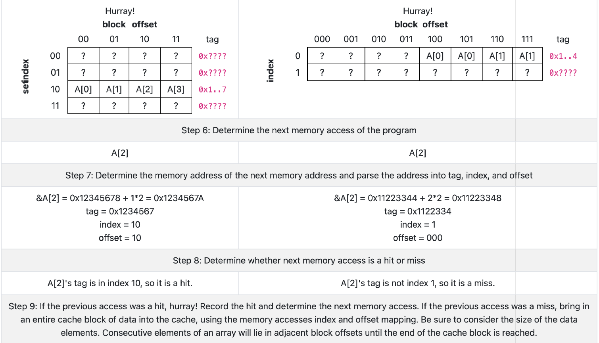

这张表格详细描述了程序在访问数组 `A[0]`、`A[1]` 和 `A[2]` 时的缓存访问过程。它阐明了内存地址如何被解析为标签（Tag）、索引（Index）和偏移量（Offset），并判断每次访问是缓存命中（hit）还是未命中（miss）。以下是对步骤的详细解释：

### **第一个程序 (A 是由 1 字节字符组成)**

- **数组 `A`** 由 1 字节的字符组成，因此每个元素占用一个缓存块偏移量（block offset）。
- `A[0]` 存储在 **索引 10**，**块偏移量 00**。

#### **步骤 6**：确定程序的下一次内存访问

- 该程序接下来访问数组的元素 `A[2]`。

#### **步骤 7**：确定 `A[2]` 的内存地址，并将地址拆解为标签、索引和偏移量

- `A[2]` 的地址是：`&A[2] = 0x12345678 + 1*2 = 0x1234567A`。
- 将地址拆解为：
  - **标签（Tag）**：`0x1234567`
  - **索引（Index）**：`10`
  - **偏移量（Offset）**：`10`

#### **步骤 8**：判断 `A[2]` 的访问是命中还是未命中

- 由于 `A[2]` 的标签存在于缓存的 **索引 10** 中，所以这是**缓存命中（hit）**。

#### **步骤 9**：如果之前的访问是命中，记录命中并确定下一次内存访问

- 如果缓存命中，我们会记录此命中，并考虑下一次访问。
- **重要提示**：如果之前的访问是未命中，则会将整个缓存块的数据加载到缓存中，并更新缓存的标签、索引和偏移量。

### **第二个程序 (A 是由 2 字节的短整型组成)**

- **数组 `A`** 由 2 字节的短整型（short）组成，因此每个元素占用两个缓存块偏移量（block offset）。
- `A[0]` 存储在 **索引 0**，**块偏移量 100**。

#### **步骤 6**：确定程序的下一次内存访问

- 该程序接下来访问数组的元素 `A[2]`。

#### **步骤 7**：确定 `A[2]` 的内存地址，并将地址拆解为标签、索引和偏移量

- `A[2]` 的地址是：`&A[2] = 0x11223344 + 2*2 = 0x11223348`。
- 将地址拆解为：
  - **标签（Tag）**：`0x11223334`
  - **索引（Index）**：`1`
  - **偏移量（Offset）**：`000`

#### **步骤 8**：判断 `A[2]` 的访问是命中还是未命中

- 由于 `A[2]` 的标签不在缓存的 **索引 1** 中，所以这是**缓存未命中（miss）**。

#### **步骤 9**：如果之前的访问是未命中，记录未命中并更新缓存

- 如果缓存未命中，我们需要将整个缓存块的数据加载到缓存中，并更新缓存的标签、索引和偏移量。

### **总结**

1. **缓存命中**：如果访问的标签和索引已经存在于缓存中，那么访问会命中，并且数据会被快速读取。
2. **缓存未命中**：如果访问的标签和索引不在缓存中，那么访问会未命中，程序需要从主内存加载数据到缓存。
3. **缓存更新**：无论是命中还是未命中，缓存中的数据块会根据标签、索引和偏移量进行更新。

这个表格清楚地展示了如何通过标签、索引和偏移量将内存地址映射到缓存中，并分析每次内存访问是否为缓存命中。

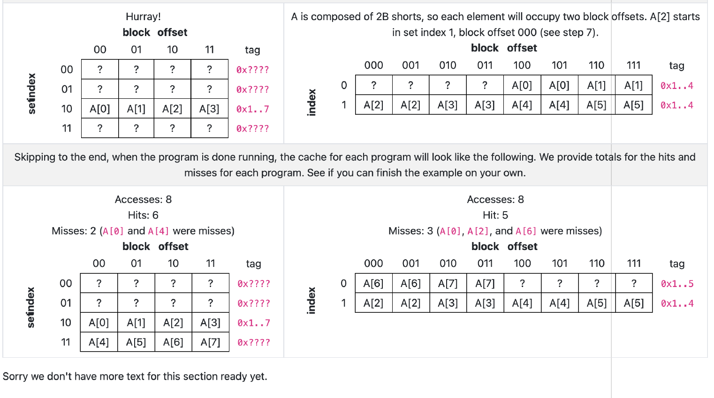

这张表格展示了两个程序在缓存访问中的命中和未命中的情况，并详细描述了如何通过缓存索引、标签和偏移量来处理数组访问。这里有两个程序的缓存模拟，以及它们的访问、命中和未命中的统计数据。以下是详细解释：

### **第一个程序 (A 是由 2 字节的短整型组成)**

#### **数组配置**：

- 数组 `A` 由 2 字节（short）元素组成，因此每个数组元素占用 2 个缓存块的偏移量。
- 数组的元素 `A[2]` 从缓存的 **索引 1** 和 **块偏移量 000** 开始存储（见步骤7）。

#### **缓存访问情况**：

- **缓存访问总数**：8 次
- **命中次数**：6 次
- **未命中次数**：2 次（未命中的元素是 `A[0]` 和 `A[4]`）

##### **缓存状态**：

- 在程序执行完后，缓存的内容如下：
  - **程序1的缓存**（8 次访问，总命中 6 次，未命中 2 次）：缓存行显示了存储的元素。未命中的元素 `A[0]` 和 `A[4]` 没有出现在缓存中。

#### **缓存内容**（程序1）：

- **缓存行**：
  - **索引 00** 存储了标签和缓存元素。
  - **索引 01** 存储了标签和 `A[2]`，`A[3]`。
  - **索引 10** 存储了 `A[0]`，`A[1]`，`A[2]`，`A[3]`。
  - **索引 11** 存储了 `A[4]` 和 `A[5]`，但在访问中，`A[4]` 没有命中。

### **第二个程序 (A 是由 2 字节的短整型组成)**

#### **数组配置**：

- 数组 `A` 由 2 字节（short）元素组成。每个元素占用两个缓存块的偏移量。
- `A[0]` 在缓存的 **索引 0** 和 **块偏移量 100** 开始存储。

#### **缓存访问情况**：

- **缓存访问总数**：8 次
- **命中次数**：5 次
- **未命中次数**：3 次（未命中的元素是 `A[0]`，`A[2]` 和 `A[6]`）

##### **缓存状态**：

- **程序2的缓存**（8 次访问，总命中 5 次，未命中 3 次）：缓存中存储了 `A[6]`、`A[7]`、`A[2]` 和 `A[3]`，并且标识了未命中的元素。

#### **缓存内容**（程序2）：

- **缓存行**：
  - **索引 0** 存储了 `A[6]`、`A[7]` 和其他元素。
  - **索引 1** 存储了 `A[2]`、`A[3]` 和 `A[4]`。

### **总结**：

- 这张表格描述了数组访问如何通过 **缓存命中（hit）** 和 **缓存未命中（miss）** 来影响程序的性能。
- **程序1** 和 **程序2** 都有命中和未命中记录。命中次数表明程序访问了缓存中的数据，而未命中则需要从主内存加载数据，增加了访问的延迟。
- 每次未命中时，会将相关的数据块从主内存加载到缓存中，以便后续访问。

这张表格清楚地展示了缓存访问的过程以及如何处理数组数据在缓存中的存储和访问。

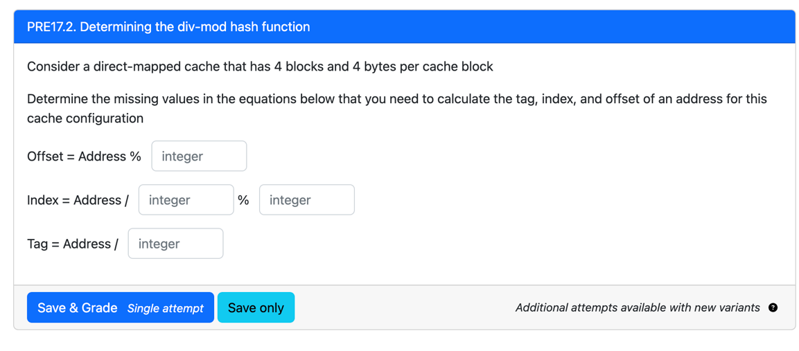

这张图片展示了一个问题，要求根据给定的缓存配置计算内存地址的标签（Tag）、索引（Index）和偏移量（Offset）。具体配置如下：

- 缓存有 **4 个缓存块**（blocks）。
- 每个缓存块有 **4 字节**（bytes）。

为了计算内存地址的标签、索引和偏移量，需要使用以下公式：

### 1. **Offset (偏移量)**:

偏移量是决定缓存块内部某个字节的位数。由于每个缓存块有 4 字节，因此需要使用 **2 位**来表示偏移量。

- **偏移量公式**：`Offset = Address % 4` 这表示从地址的最低 2 位来计算偏移量，因为每个缓存块有 4 字节，因此使用 `Address % 4` 来获得缓存块中的字节位置。

### 2. **Index (索引)**:

索引用于确定数据块应该存储在哪个缓存行。由于缓存有 4 个块，所以需要 **2 位**来表示索引（因为 4 = 2^2）。

- **索引公式**：`Index = Address / 4 % 4` 这里的 `Address / 4` 是将地址划分到缓存块上，`% 4` 表示对 4 个块取余，得到实际的缓存块索引。

### 3. **Tag (标签)**:

标签是用来唯一标识一个内存地址在缓存中的数据块。剩余的高位部分就用作标签。

- **标签公式**：`Tag = Address / 16` 由于有 4 个缓存块，每个块有 4 字节，这意味着我们可以通过将地址除以 16 来获得标签。

### 综上所述：

- **Offset**：`Address % 4` (计算出偏移量，占 2 位)
- **Index**：`Address / 4 % 4` (计算出缓存块索引，占 2 位)
- **Tag**：`Address / 16` (计算出标签，占高位)

### 如何解答：

- 根据题目给定的内存地址，先计算 **偏移量**，然后根据 **偏移量** 来计算 **索引**，最后计算 **标签**。

你可以根据这些公式来计算给定地址的 **Tag**，**Index** 和 **Offset**。

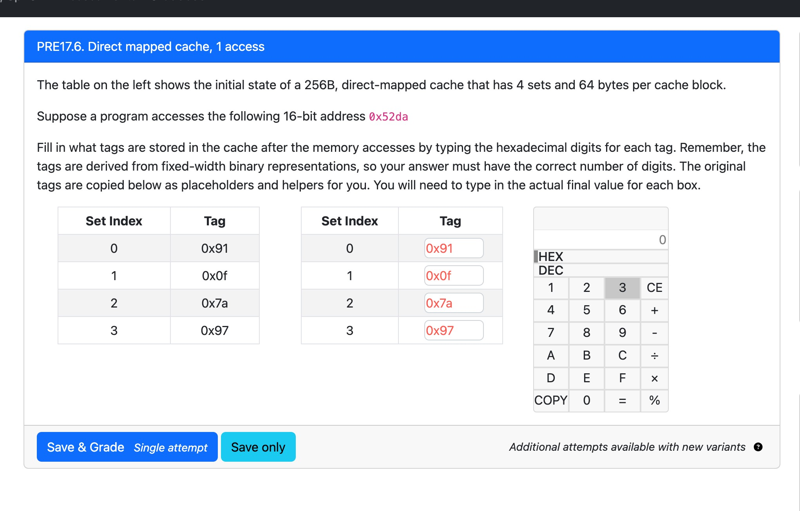

这个问题涉及到**直接映射缓存**（Direct-mapped Cache），并且要求根据给定的内存地址 `0x52da` 来更新缓存的标签（Tag）。我们有一个 **256B** 的缓存，每个缓存块有 **64 字节**，并且缓存中有 **4 个集合（Set）**。在题目中，给定了每个集合的初始标签，并要求你根据访问地址填充缓存的标签。

### **配置概述**：

- **缓存总大小**：256B
- **每个缓存块的大小**：64B
- **集合数量**：4 个集合（Set）

### **步骤解析**：

#### 1. **计算缓存行数和块的数量**：

- 每个缓存块是 64 字节，缓存有 256 字节。因此，缓存总共有：

  256B64B=4块（4 sets）\frac{256B}{64B} = 4 \text{块（4 sets）}

#### 2. **确定地址的标签（Tag）和索引（Index）**：

- 我们有一个 16 位地址 `0x52da`，我们需要将其拆解为标签、索引和偏移量。首先，根据配置：
  - **块偏移量**（Block Offset）：每个缓存块 64 字节，因此需要 `log2(64) = 6` 位来表示偏移量。
  - **集合索引**（Set Index）：由于缓存有 4 个集合，`log2(4) = 2` 位用于表示集合索引。
  - **标签**（Tag）：剩余的高位部分作为标签。

#### 3. **解析地址 `0x52da`**：

- 地址 `0x52da` 的二进制表示是：`0101 0010 1101 1010`。
  - **块偏移量**：地址的最低 6 位（`101010`）代表块偏移量。
  - **集合索引**：接下来的 2 位（`11`）代表集合索引。
  - **标签**：剩余的高位（`010100`）为标签。

#### 4. **映射到缓存**：

- 通过索引值来确定数据应该存储在哪个缓存集合（set）。
  - **集合索引** `11` 对应集合 3（索引从 0 开始）。
  - **标签** `010100` 代表地址的标签部分。

### **更新缓存**：

在给定的初始缓存状态中，已存储了每个集合的标签，任务是根据地址 `0x52da` 填充缓存。

#### **步骤总结**：

- **Set Index**: 通过地址的中间 2 位获得集合索引。
- **Tag**: 通过剩余的高位获得标签。

#### **具体操作**：

根据上述解析，可以确定：

- **地址 `0x52da`** 的集合索引是 `3`，标签是 `0x14`。
- 你需要在 **Set Index 3** 处更新标签为 `0x14`。

### **最终结果**：

将标签 `0x14` 填写到缓存中的 **Set 3**。

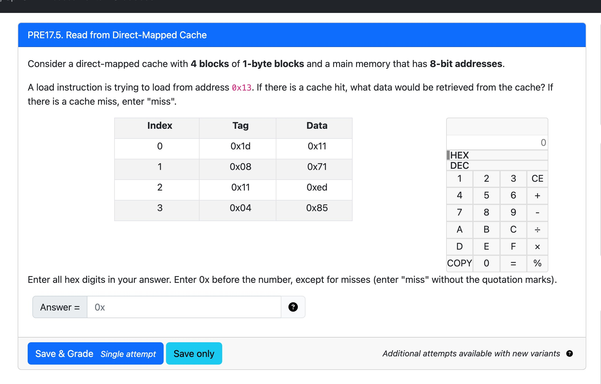

这道题是关于**直接映射缓存（Direct-Mapped Cache）**的缓存命中判断问题。我们需要判断地址 `0x13` 在缓存中是命中还是未命中，如果命中就返回数据，否则填 `"miss"`。

------

### **题目信息总结：**

- 缓存有 **4 个块**，每块 **1 字节（1 Byte）**
- 主内存地址是 **8 位（最大 0xFF）**
- 要访问的地址是：`0x13`
- 给出的缓存表包含：
  - 每个缓存块的 **索引（Index）**
  - 每个块对应的 **标签（Tag）**
  - 每个块存储的 **数据（Data）**

------

### **解题步骤：**

我们需要将地址 `0x13` 拆分成：

- **Offset（偏移）**：每块只有 1 字节，不需要偏移位。
- **Index（索引）**：我们有 4 个块（`log2(4) = 2 bits`），所以使用地址的最低 2 位来做索引。
- **Tag（标签）**：剩下的高位部分。

------

### **Step 1: 地址转二进制**

`0x13` = `0001 0011`（8 位）

- **最低两位**是 `11`（即二进制索引 3）
- **高 6 位**是 `000100`（即十六进制为 `0x04`）

所以：

- **Index = 3**
- **Tag = 0x04**

------

### **Step 2: 查缓存**

查看 Index 为 3 的缓存块：

- **缓存中的 Tag 是 0x04**
- 与我们要访问的 Tag（0x04）一致，**命中**
- 对应的数据是：`0x85`

------

### **答案：**

```
0x85
```

------

### **如果是未命中？**

如果缓存中对应 Index 的 Tag 不等于我们地址的 Tag，那就填 `miss`。

------

### **总结：**

- 将地址转为二进制，提取索引和标签
- 匹配缓存中的 Tag
- 匹配成功：返回 Data；不匹配：返回 `"miss"`

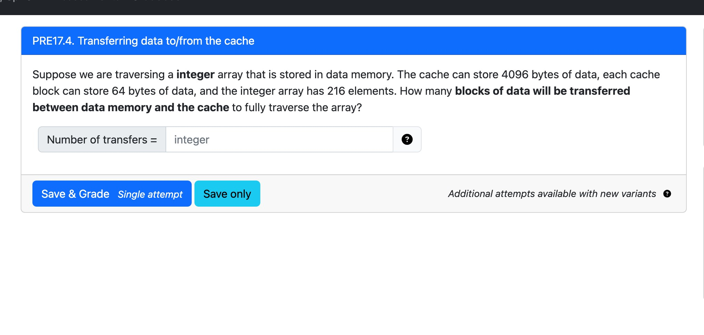

这道题是关于**缓存块传输次数的计算**。我们需要根据整数数组的大小和缓存块的容量，计算完成遍历这个数组需要**从内存到缓存的传输次数（块的数量）**。

------

### **题目信息总结：**

- **每个整数是 4 字节**（这是标准假设，虽然题中没写，但 "integer" 默认是 4 bytes）
- 数组有 **216 个元素**
- 每个缓存块是 **64 字节**
- 要问的是：要遍历整个数组，需要传输多少个 **缓存块**

------

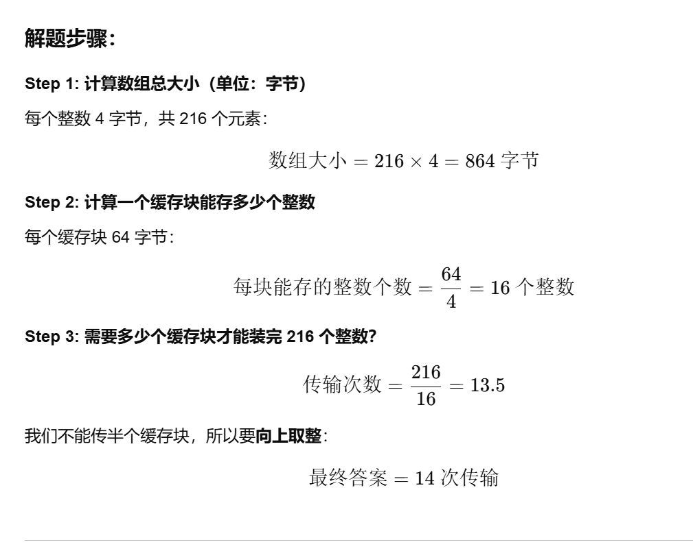

------

### **答：**

```
Number of transfers = 14
```

这表示要完整访问这个数组，最少需要将数据从内存传输到缓存 14 次（每次一个块）。

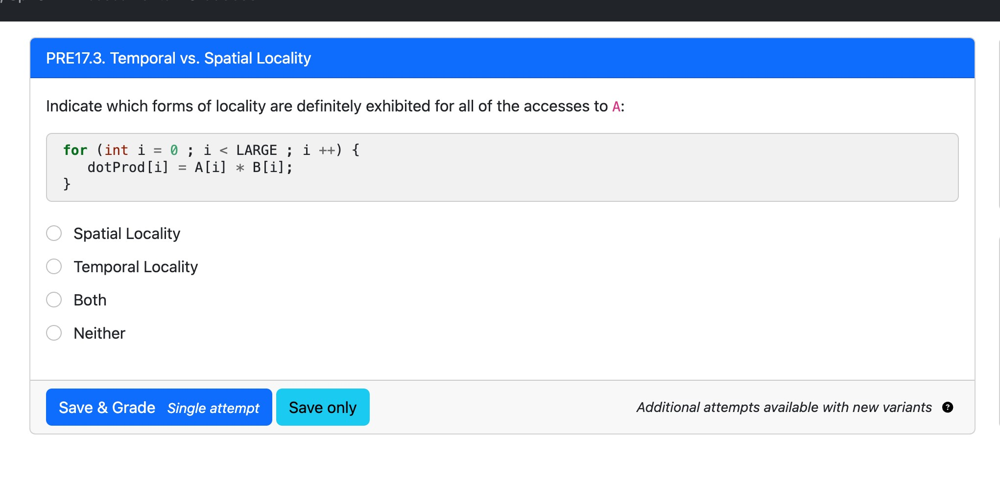

这道题考查的是**局部性（Locality）**的类型，尤其是程序访问数组 `A` 时表现出的局部性类型。

------

### **局部性的两种类型解释：**

1. **Spatial Locality（空间局部性）**
    如果一个程序访问了内存地址 `A[i]`，它很可能马上也会访问 `A[i+1]`、`A[i+2]`，也就是**连续的地址**。这是因为程序倾向于顺序处理数据。
2. **Temporal Locality（时间局部性）**
    如果程序访问了 `A[i]`，它很可能在**不久的将来再次访问同一个地址**，即 `A[i]` 又会被访问。

------

### **题目代码分析：**

```c
for (int i = 0; i < LARGE; i++) {
    dotProd[i] = A[i] * B[i];
}
```

在这个循环中，对 `A[i]` 的访问是**顺序访问**，访问了 `A[0]`、`A[1]`、`A[2]`...直到 `A[LARGE-1]`。每次访问的是下一个元素，**但不会重复访问之前的元素**。

------

### **判断：**

- **Spatial Locality（空间局部性）**：**有！**
  - 访问 `A[0]`、`A[1]`、`A[2]` 是连续地址，符合空间局部性。
- **Temporal Locality（时间局部性）**：**没有！**
  - 每个 `A[i]` 只访问一次，没有重复访问，所以没有时间局部性。

------

### **正确选项：**

```
Spatial Locality
```

程序在访问数组 `A` 时 **只展示了空间局部性**。