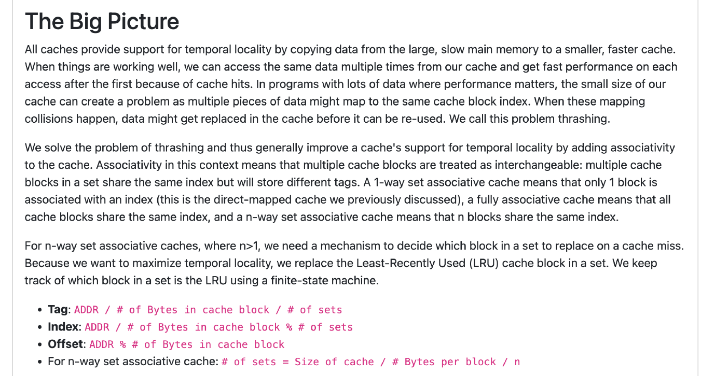
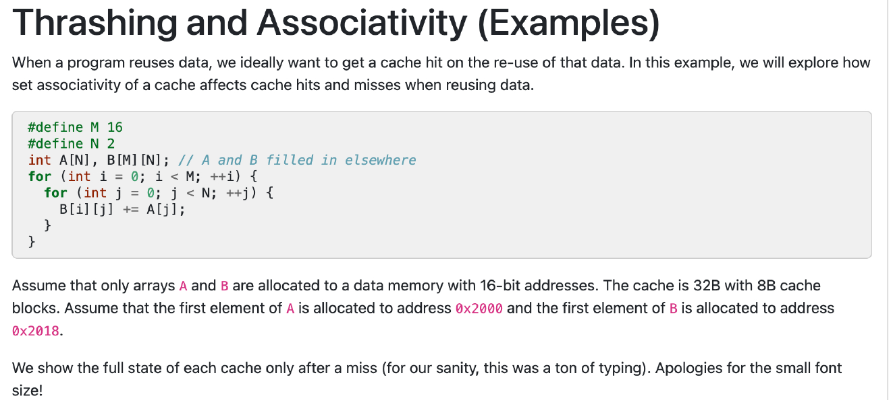
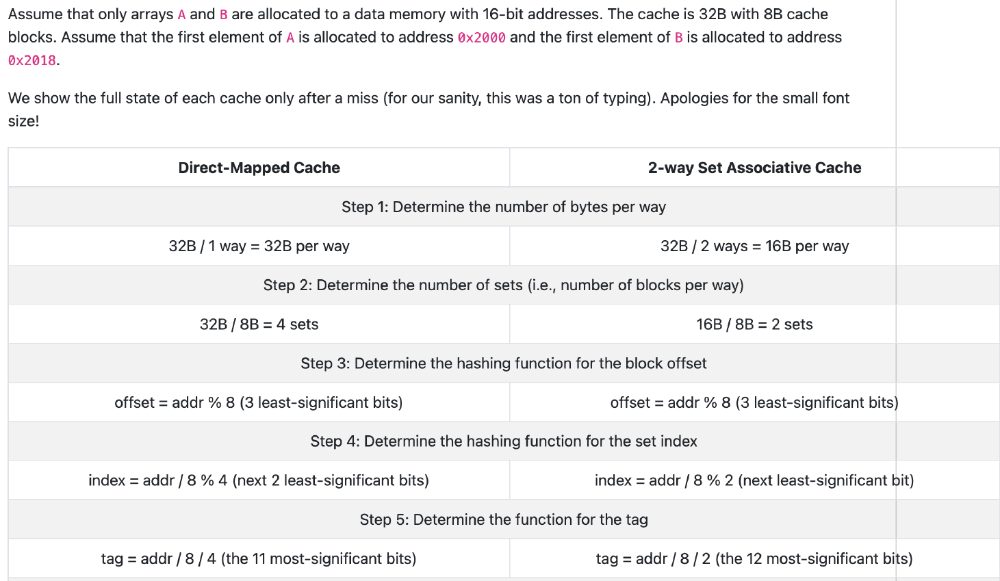
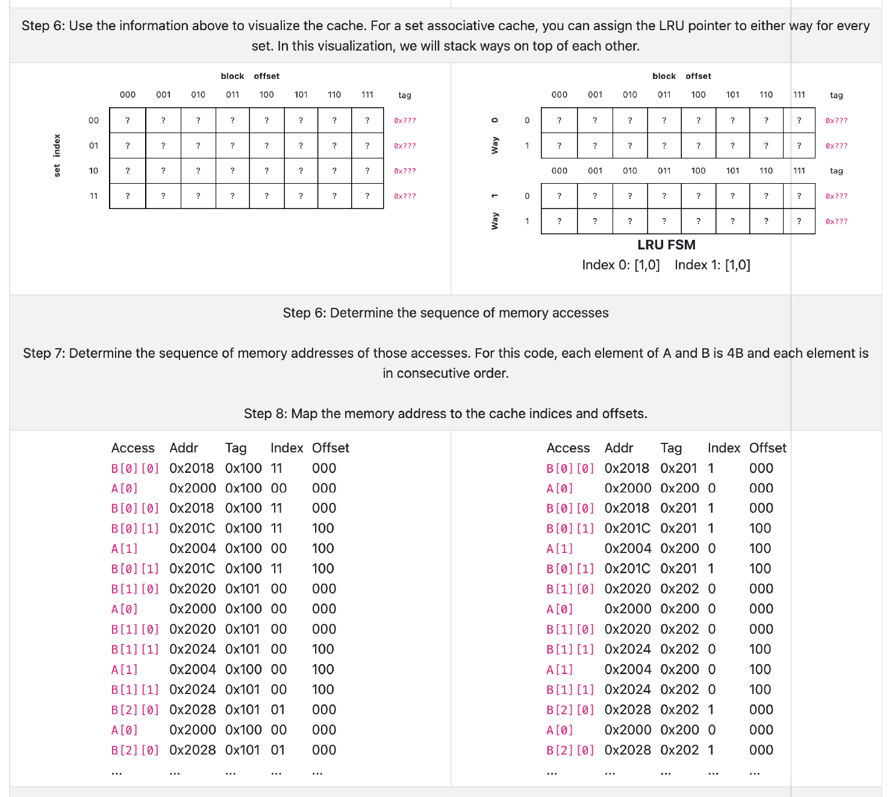
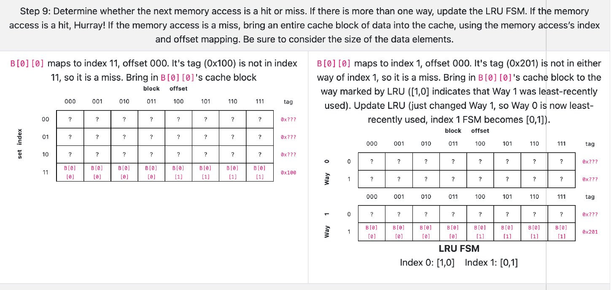
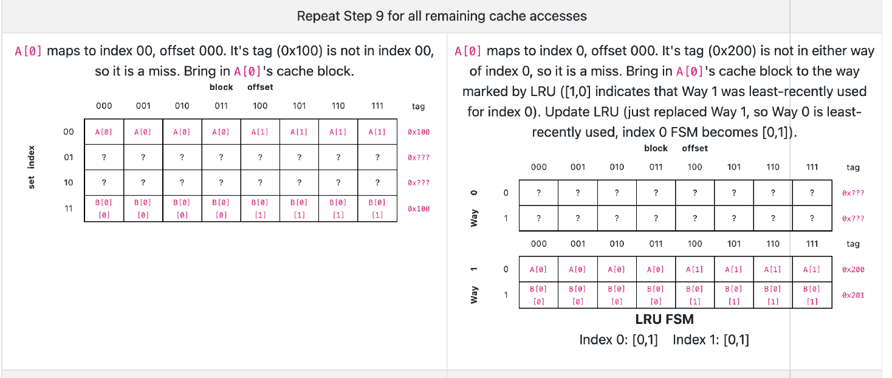
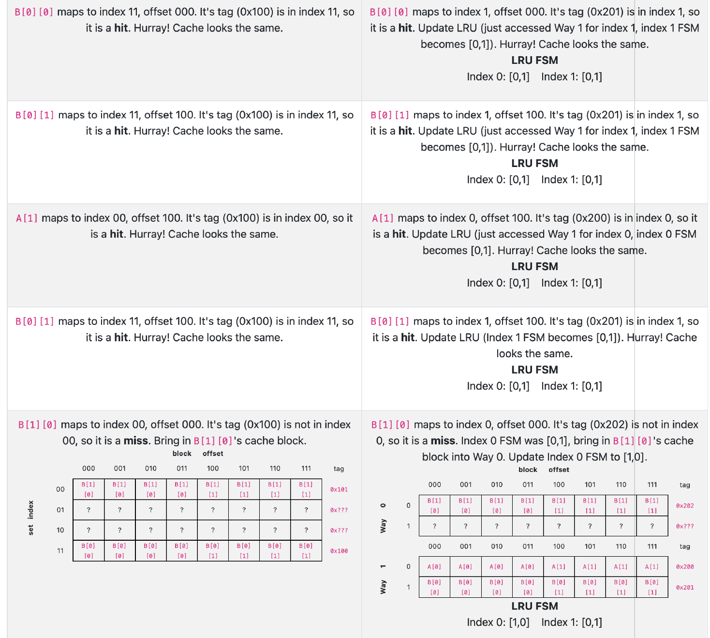
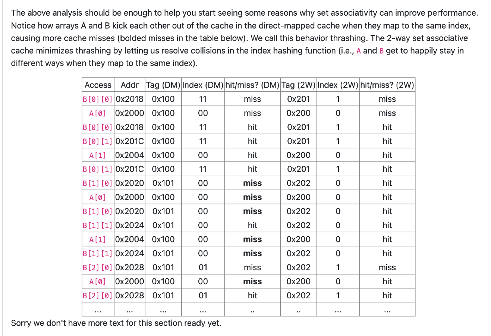

这张图讲的是**缓存（cache）设计中的一个重要概念——关联性（Associativity）**，主要是为了解决由于缓存容量有限而导致的**thrashing（抖动）问题**。我来给你逐段详细解释：

------

### 第一段：缓存的作用与问题

> **All caches provide support for temporal locality by copying data from the large, slow main memory to a smaller, faster cache...**

**翻译与解释：**

所有的缓存都支持**时间局部性（temporal locality）**。也就是说，如果某个数据在某一时刻被访问过，很可能在不久的将来还会被访问。

为了加快访问速度，计算机会把一部分数据从慢速的大内存复制到小而快的缓存中。

当程序运行顺利时，多次访问同一个数据时可以直接从缓存中获取，这叫**cache hit（命中）**，效率高。

但如果程序中数据特别多，或者缓存太小，就可能出现不同的数据**映射到相同的缓存块（block）\**的情况。结果是：旧的数据被新数据替换，还没用完就被踢出去了。这就叫\**thrashing（抖动）**。


------

### 第二段：引入“关联性”解决问题

> **We solve the problem of thrashing and thus generally improve a cache's support for temporal locality by adding associativity to the cache...**

**翻译与解释：**

为了解决这种抖动问题，我们在缓存中引入**关联性（Associativity）**。
 所谓关联性，就是说缓存中的多个块可以“共享”一个索引（index），但通过不同的标签（tag）区分存的数据。

**三种缓存类型：**

1. **1-way set associative（也叫direct-mapped 直接映射）**：一个索引只能对应一个块。
2. **fully associative（完全关联）**：所有块都可以存任何索引对应的数据。
3. **n-way set associative（n路组相联）**：每个索引对应n个块。

n路组相联是介于前两者之间的折中方案。

> 你问得非常好！我们来**用一个直观的例子**解释为什么“**关联性**”能解决“**缓存抖动（thrashing）**”的问题。
>
> ------
>
> ### 【1】什么是“抖动 thrashing”？
>
> 假设你有一个**直接映射缓存（1-way）**，缓存中每个内存地址只能映射到**固定的位置（组）**。
>
> 现在程序中恰好有两个数据 A 和 B，**它们刚好都映射到缓存中的同一个位置**。当你反复访问 A 和 B 时，A 会把 B 挤掉，B 又会把 A 挤掉，来回踢出——**你每次访问都要从主内存重新加载，非常慢！**
>
> ------
>
> ### 【2】加了“关联性”怎么就好了？
>
> 如果你换成**n路组相联缓存（n-way set associative）**，比如是**4-way**的：
>
> - 那么同一个组（Index）下，不是只有1个位置，而是**有4个位置可以放数据**。
> - A 和 B 即使映射到同一个组，它们也可以分别存在组内的不同块里，**不再互相踢出**！
>
> 也就是说，**多个映射到同一组的热点数据可以“和平共处”**，不至于因为互相顶替造成性能下降。
>
> ------
>
> ### 【3】一个类比帮助你理解
>
> 想象一个储物柜系统：
>
> - **直接映射缓存**：你只能把书放进固定编号的柜子，比如《语文》只能放进1号柜，《数学》也只能放1号柜——如果你换了一本，前一本就被扔了。
> - **4路组相联缓存**：你还是用1号组，但1号组里**有4个柜子**，你可以同时放下《语文》《数学》《英语》《物理》。除非你有第5本书才需要淘汰一本。
>
> ------
>
> ### 【4】关联性越高越好吗？
>
> **不一定。**
>
> - 关联性越高，冲突越少，但**硬件实现越复杂**，查找速度也可能变慢。
> - 所以实际中，通常用的是 **2路、4路或8路关联性**，**性能和成本的折中**。
>
> ------
>
> ### 小结一句话：
>
> **“关联性”允许多个数据共享同一个索引组，从而避免了它们互相顶替、造成缓存命中率下降的问题。**
>
> 如果你想，我可以画张图更直观地帮你理解。需要吗？

------

### 第三段：当n > 1，需要替换机制

> **For n-way set associative caches, where n>1, we need a mechanism to decide which block in a set to replace on a cache miss...**

**翻译与解释：**

当是**n路组相联缓存**，而n > 1 时（即一个索引对应多个块），我们需要一种机制来决定“哪一个块该被替换”——比如发生**cache miss（未命中）**的时候。

为此，我们使用一种叫做**LRU（Least Recently Used，最近最少使用）\**的替换策略，选择\**最久没用的那一个块**进行替换。

实现这个策略，我们可以用一个有限状态机（finite-state machine）跟踪每个块的使用情况。

------

### 最后一部分：公式说明

**几个关键的计算公式如下：**

- **Tag（标签）** = `ADDR / 块大小 / 组数`
- **Index（组号）** = `ADDR / 块大小 % 组数`
- **Offset（块内偏移）** = `ADDR % 块大小`
- **组数** = `缓存总大小 / 块大小 / n`

这些公式帮助我们根据地址（ADDR）计算出它在缓存中该放在哪一组、哪一块。

------

### 总结一张图解释：

假如你有一个64KB缓存，每块是64B，采用4路组相联（n=4）：

- 缓存块总数 = 64KB / 64B = 1024
- 每组有4个块 → 组数 = 1024 / 4 = 256
- 对某个内存地址：
  - `Index = ADDR / 64 % 256`（用于选出组号）
  - `Tag = ADDR / 64 / 256`（用于在组内识别具体数据）
  - `Offset = ADDR % 64`（表示该数据在块内的位置）

------

如果你还不太懂，可以告诉我你在哪个阶段学习这个（比如计算机组成原理？），我可以按你当前理解程度讲解。



这段内容通过一个**具体代码例子**说明**关联性（Associativity）\**如何影响缓存命中（cache hit）与未命中（cache miss）——也就是\**为什么“关联性”可以避免缓存抖动（thrashing）**。

我们来**一行一行翻译并详细解释**：

------

## **代码讲了什么？**

```c
#define M 16
#define N 2
int A[N], B[M][N];  // A 和 B 是两个数组
for (int i = 0; i < M; ++i) {
    for (int j = 0; j < N; ++j) {
        B[i][j] += A[j];  // 让 B 的每一行加上 A 的每一个元素
    }
}
```

### **这个程序干嘛的？**

你可以理解为：用一个小数组 A[]，不断加到二维数组 B[][] 的每一行里。

也就是说：

- `A` 是 **被重复使用的数据（reuse）**
- `B` 是 **每次都访问新地址（顺序访问）**

------

## **题设信息讲了什么？**

> **Assume that only arrays A and B are allocated to a data memory with 16-bit addresses. The cache is 32B with 8B cache blocks.**

翻译：

- 假设整个程序只用了两个数组 A 和 B。
- 系统的内存地址是 16 位（2 个字节的地址），也就是内存从 `0x0000` 到 `0xFFFF`。
- **缓存（Cache）大小是 32 字节，**每个块是 8 字节 → 总共有 `32 / 8 = 4 块（blocks）`。

------

> **Assume that the first element of A is allocated to address 0x2000 and the first element of B is allocated to 0x2018.**

翻译：

- 数组 A 的起始地址是 `0x2000`
- 数组 B 的起始地址是 `0x2018`
- 每个 `int` 假设是 **4 字节**

所以：

- A[0] → 地址 `0x2000`
- A[1] → 地址 `0x2004`
- B[0][0] → 地址 `0x2018`
- B[0][1] → 地址 `0x201C`
- B[1][0] → 地址 `0x2020`
- 以此类推…

------

## **重点来了：为什么这会造成缓存抖动？**

### 情况一：**1-way set associative（直接映射）**

- 缓存只有 4 个块。
- 每次从内存中加载一个 8 字节的 block。
- 地址 `0x2000` 和 `0x2018`，虽然在物理地址上不一样，但可能在缓存中**映射到同一个“组号”**。

举个例子：

```c
Index = (Address / BlockSize) % NumBlocks = (地址 / 8) % 4
```

比如：

- A[0] 地址是 `0x2000` = 8192
- B[0][0] 地址是 `0x2018` = 8216
- `(8192 / 8) % 4 = 1024 % 4 = 0`
- `(8216 / 8) % 4 = 1027 % 4 = 3`

这看起来不冲突，但**A 和 B 的其他元素可能反复落在相同组上**。

这样每次访问 B，可能就把之前缓存的 A 踢出，访问 A 又把 B 踢出，导致重复miss。

------

## **关联性可以怎么解决这个问题？**

### 情况二：**2-way 或 4-way set associative**

- 假设我们把 cache 改成 2 路：
  - 每个“组”允许有 2 个块。
  - 这样即使 A 和 B 映射到了同一个 index，它们可以“共存”在一个组内的两个位置里。

### 所以：

- **A 被多次重复使用**，如果不被踢出，就能命中（hit）
- **关联性越高，就越不容易发生替换（thrashing）**

------

## **总结一句话：**

这个例子说明：在嵌套循环中，**我们希望 A 不断复用（temporal locality）**，但由于它和 B 在地址上靠得太近，导致它们映射到缓存中相同或冲突的位置。

- **直接映射（1-way）时，会频繁踢出造成 thrashing**
- **高关联性（如 2-way、4-way）时，A 和 B 可共存，A 就能复用，性能更好**

------

如果你想，我可以再加张图或做个对比表，来更清楚地展示 cache miss 怎么发生的，要吗？



这张图是对**直接映射缓存（Direct-Mapped Cache）**和**2路组相联缓存（2-Way Set Associative Cache）**的配置和地址拆分方式做了对比，目的是帮助你理解：

**同样的地址，在不同类型的缓存结构中，会如何被划分成 offset / index / tag。**

------

我来一步步帮你解释每一列每一步的含义：

------

## **总体参数设定**

- 缓存总大小：32 字节
- 每个块大小：8 字节
- 地址：16 位（意思是最大地址是 0xFFFF）
- 内存访问粒度是 byte（按字节寻址）

------

### **Step 1: 每路的字节数（每个“way”的容量）**

| 类型              | 每路大小                       |
| ----------------- | ------------------------------ |
| 直接映射（1-way） | `32B / 1 = 32B`（只有一个way） |
| 2-way 组相联      | `32B / 2 = 16B`（有两个way）   |

------

### **Step 2: 每个way有多少个块（set数量）**

每个way用的是8B大小的块：

- 直接映射：`32B / 8B = 4 sets`
- 2-way组相联：`16B / 8B = 2 sets`

**直接映射有 4 个组（index 0~3）**
 **2路组相联每个组能存两个块，但只有 2 个组（index 0~1）**

------

### **Step 3: 块内偏移量 offset（块内字节编号）**

```
offset = addr % 8
```

因为每个块是8字节，我们需要**3位（2^3 = 8）\**来确定块内哪个字节 → 所以取地址的\**最低3位**。

对两种缓存都一样。

------

### **Step 4: Index（组号）**

这个是最关键的区别点！

- **直接映射：**
  - 总共有 4 组 → 需要 `log2(4) = 2 bits` 作为 index
  - 所以用地址的第4~5位（3位offset之后的2位）
  - 算法：`index = (addr / 8) % 4`
- **2-way组相联：**
  - 总共只有 2 组 → 只需要 `1 bit` 作为 index
  - 用地址第4位（offset后面1位）
  - 算法：`index = (addr / 8) % 2`

------

### **Step 5: Tag（用于匹配）**

Tag 是**地址剩下的高位部分**，用来区分多个地址映射到相同 index 的情况。

- 直接映射：`tag = addr / 8 / 4` → 11位
- 2-way组相联：`tag = addr / 8 / 2` → 12位

------

### 用一组真实地址举例说明（比如 0x2000）：

**十六进制 0x2000 = 十进制 8192**

- `offset = 8192 % 8 = 0` → 在块内偏移第 0 个字节
- `index = (8192 / 8) % 4 = 1024 % 4 = 0`（直接映射）
- `index = (8192 / 8) % 2 = 1024 % 2 = 0`（2-way）
- `tag = 8192 / 8 / 4 = 256`（直接映射）
- `tag = 8192 / 8 / 2 = 512`（2-way）

所以：

- 同一个地址，在两种缓存结构中，**index 和 tag 是不一样的！**
- 这就是为什么同一个地址在不同缓存中命中/不命中表现会不一样。

------

## **总结一句话：**

这张图展示的是：**给定内存地址，在不同缓存结构下会如何分解成 offset / index / tag**，而这些分解方式决定了：

- 一个数据会被放在哪个组
- 会不会被其他数据冲突顶替
- 会不会命中（hit）或不命中（miss）

------

如果你想，我可以给你画个图，展示地址是怎么被“切成三段”的，以及不同结构下图示是啥样？要不要我来画？



这张图是对 **前面 cache 设置、地址分解 和 缓存命中原理**的具体可视化。它说明了：

- 在**直接映射**和**2路组相联缓存**中，程序对数组 A 和 B 的访问顺序会如何映射到缓存；
- 为什么会发生缓存冲突（miss）；
- **关联性（Associativity）**如何缓解这个问题。

我给你逐段详细解释：

------

## **Step 6：可视化缓存结构**

### 左边是 **直接映射缓存（Direct-Mapped Cache）**

- 一共有 **4 个 set**（行 00, 01, 10, 11）
- 每个 set 只有一个 block（没有 way）
- 每个 block 有 8 个字节，标记为 offset `000` 到 `111`
- 每一行右边是 `tag`，表示当前缓存的标签

你可以理解为：
 **每次加载 8 字节，如果两个地址映射到相同 index，就会互相替换。**

------

### 右边是 **2-Way Set Associative Cache（2路组相联缓存）**

- 一共只有 **2 个 set**（Index 0 和 1）
- 每个 set 下面有两个 “way”，也就是可以存两块数据
- 上下两行表示一个 set 的两个 way（比如 Index 0 有 Way 0 和 Way 1）
- LRU FSM 表示这个 set 哪个 way 是“最近最少使用”的（用于决定替换）

这就是说：**每个组有两个空位，可以同时存下 A 和 B 的块，不容易互相替换。**

------

## **Step 7：确定内存访问顺序**

这个步骤是把前面的程序中的访问顺序列出来：

```c
for (int i = 0; i < M; ++i) {
    for (int j = 0; j < N; ++j) {
        B[i][j] += A[j];
    }
}
```

按照这个顺序，你会反复访问 `A[0]` 和 `A[1]`，同时也会访问 `B[i][j]`。这就是缓存命中/未命中的核心点！

------

## **Step 8：地址分解（关键！）**

这一步展示的是：

- 每次访问的内存地址（Address）
- 地址拆成三部分：
  - **Tag（高位）：用于比较是否命中**
  - **Index（中间位）：决定落在哪个组**
  - **Offset（低3位）：块内偏移量**

我们重点看几个关键访问：

| Access      | Addr   | Tag   | Index | Offset |
| ----------- | ------ | ----- | ----- | ------ |
| **B[0][0]** | 0x2018 | 0x100 | 11    | 000    |
| **A[0]**    | 0x2000 | 0x100 | 00    | 000    |
| **B[0][1]** | 0x201C | 0x100 | 11    | 100    |
| **A[1]**    | 0x2004 | 0x100 | 00    | 100    |

注意：

- A 的两个元素总是落在 **Index 00**
- B 的元素很多落在 **Index 11** 或 **Index 10**

------

## **发生什么了？为什么直接映射会冲突？**

在**Direct-Mapped Cache**中：

- `A[0]`、`A[1]` 反复用，**希望被缓存住**
- 但每次访问 B 的时候，它可能会映射到 `Index 00`，把 A 给替换掉
- 所以每次回来访问 A，又要重新从内存加载 → **cache miss 抖动（thrashing）**

------

## **为什么 2-Way Set Associative 能解决这个问题？**

在 2-way 中：

- 每个 Index 有两个位置（way 0 和 way 1）
- 即使 A 和 B 映射到相同的 index，它们可以共存在两个 way 中
- 只要使用合适的 LRU 策略（最近最少使用被替换），**A 会常驻缓存里**

结果是：

- A 不会被频繁踢出 → **缓存命中率大大提升**

------

## **总结一句话：**

这个图表直观地展示了：

- 同样的程序，在直接映射缓存中，会频繁 cache miss（因为 A 和 B 互相顶替）；
- 在 2-way 组相联缓存中，A 和 B 可以共存，大大减少了 miss，提升了性能。

------

如果你还想更直观，我可以画出访问顺序和缓存替换流程图，让你一眼看懂“谁替了谁”，要不要我来画？



这张图是对 **“缓存命中/未命中”过程的首次实际演示**，展示了**直接映射缓存（左图）**和**2路组相联缓存（右图）**在访问 `B[0][0]` 时的行为差异。我们一起来详细解读：

------

## **整体上下文：访问 B[0][0]**

- 地址：`0x2018`
- 对应块：大小为 8 字节 → 包括 `B[0][0]` 和它后面的字节
- 之前缓存是空的 → 所以访问一定是 **miss（未命中）**
- 接下来就是：**这个数据将被放入缓存中哪里？**

------

## **左图：Direct-Mapped Cache（直接映射）**

### **分析过程：**

- 地址 `0x2018`
- 前面分析过：
  - `offset = 000`（块内偏移）
  - `index = 11`（落在第4个组，第0编号是00）
  - `tag = 0x100`（高位部分用于匹配）

### **执行结果：**

- 这个地址对应的 block 被装载到 **index 11**
- 所以你看到：
  - 第四行（index 11）现在被 `B[0][0]` 所填充
  - 块中 `offset 000` 到 `111` 都是 `B[0][0]` 所在的8字节（也包括 `B[0][1]` 等）
  - `tag = 0x100` 显示在右侧

这时候，只能放一个 block，**将来如果有别的数据也映射到 index 11，它就会被替换！**

------

## **右图：2-Way Set Associative Cache（2路组相联）**

### **分析过程：**

- 地址还是 `0x2018`，但是：
  - `index = 1`（因为是2路，只有 index 0 和 1）
  - `tag = 0x201`（地址高位）
  - 缓存还是空的 → miss

### **LRU 替换策略机制解释：**

- 每个组有两个 way
- 当前 index 是 1，它的 LRU 状态是 `[0,1]`
  - 意思是：**Way 1 是最近最少使用的（LRU）**
- 所以我们把新的块装进 **Way 1**
- 装入后，我们**更新 LRU FSM**（Finite State Machine），使得：
  - 最近使用的是 Way 1
  - Way 0 成为新的“最少使用” → 更新为 `[1,0]`

### **执行结果：**

- index 1 的 Way 1 被填上了 `B[0][0]` 这一整块的数据
- tag 写为 `0x201`

这时，Way 0 仍然空着，**未来如果有另一个 block 也落在 index 1，它可以放入 Way 0，不影响 Way 1。**

------

## **两者对比总结：**

| 特性           | Direct-Mapped Cache                  | 2-Way Set Associative Cache                     |
| -------------- | ------------------------------------ | ----------------------------------------------- |
| 可容纳的数据块 | 每组只能放 1 个 block                | 每组可以放 2 个 block                           |
| 替换策略       | 没得选，直接替换                     | 按照 LRU（最近最少使用）决定替换哪个 way        |
| 结果           | 容易冲突 → 容易 miss                 | 可以共存多个 block → 命中率更高                 |
| 当前状态       | `B[0][0]` 填充了 index 11 的唯一位置 | `B[0][0]` 填充了 index 1 的 Way 1，Way 0 还空着 |

------

## 如果你再继续访问 A[0] 会怎么样？

- 在 Direct-Mapped 中，如果 A[0] 也落在 index 11 → 会把 `B[0][0]` 替掉！
- 在 2-Way 中，如果 A[0] 也落在 index 1：
  - 如果 Way 0 空 → 不替任何人，直接放进去
  - 如果 Way 0 已有数据，就按 LRU 决定替谁

------

## 总结一句话：

这张图告诉你：**第一次 miss 的时候，数据怎么被装进 cache 里，以及不同缓存结构怎么决定放哪、换谁。**

2路组相联之所以更优秀，就是因为它能容忍冲突、不轻易替换已有数据，从而**让我们反复访问的数据（如 A）不容易丢掉。**

你要不要我继续分析下一步 A[0] 的访问是 hit 还是 miss？我可以接着解。



这张图继续展示了**接下来访问 A[0] 时缓存的变化情况**，分为左侧 **直接映射缓存（Direct-Mapped）** 和右侧 **2路组相联缓存（2-Way Set Associative）**。

------

我们继续逐步详细解释：

------

## **访问：A[0]**

- 地址是：`0x2000`
- 这次是访问数组 A 中的第一个元素
- A 在后续的代码中会被频繁重复使用 → 是缓存中的“热点数据”

------

## **左图：Direct-Mapped Cache**

### 分析：

- `offset = 0x2000 % 8 = 000`
- `index = (0x2000 / 8) % 4 = 8192 / 8 = 1024 → 1024 % 4 = 0 → index = 00`
- `tag = 0x2000 / 8 / 4 = 1024 / 4 = 256 → 0x100`

### 执行：

- 这是访问 index 00
- 当前 index 00 是空的（之前没被使用）
- 所以是 **cache miss**
- 把 `A[0]` 所在的 8 字节 block（含 `A[0]` 和 `A[1]`）加载到 index 00 中
- 同时更新 tag 为 `0x100`

### 结果：

你看到 index 00 被填满，block 的 offset 从 000 到 111，数据是 `A[0]` 和 `A[1]`

------

## **右图：2-Way Set Associative Cache**

### 分析：

- 缓存被分成两个 set：index 0 和 1
- `offset = 0x2000 % 8 = 000`
- `index = (0x2000 / 8) % 2 = 8192 / 8 = 1024 → 1024 % 2 = 0 → index = 0`
- `tag = (0x2000 / 8) / 2 = 1024 / 2 = 512 → 0x200`

### 执行：

- index 0 的两个 way 都是空的（之前未用）
- 所以也是 **cache miss**
- 查看 LRU FSM 状态：当前是 `[1,0]` → 表示 Way 1 是最近最少使用
- 所以我们将 A[0] 所在的 block 放入 **Way 1**
- 更新 FSM：刚用了 Way 1 → Way 0 现在是 LRU → 状态变成 `[0,1]`

### 结果：

- index 0 的 Way 1 被填入 `A[0]` 和 `A[1]` 所在 block
- `tag = 0x200`
- 原先在 index 0 的 Way 0 是 `B[0][0]` 的 block，它**没有被替换**！
  - 这正是 2-Way 的优势：**A 和 B 可以共存**

------

## **对比分析总结**

| 项目         | Direct-Mapped Cache                       | 2-Way Set Associative Cache                  |
| ------------ | ----------------------------------------- | -------------------------------------------- |
| index        | 00                                        | 0                                            |
| tag          | 0x100                                     | 0x200                                        |
| 命中/未命中  | miss                                      | miss                                         |
| 替换谁？     | index 00 原本为空，无需替换               | Way 1 是 LRU，所以替换 Way 1                 |
| 谁还在缓存？ | `B[0][0]` 在 index 11，`A[0]` 在 index 00 | `B[0][0]` 和 `A[0]` 都还在，分别在不同 index |

------

## **重要现象：**

**此时，2-Way 缓存中：**

- `A[0]` 在 index 0，Way 1
- `B[0][0]` 在 index 1，Way 1 → 它们**不会冲突！**，所以可以都保持在缓存中

**但在 Direct-Mapped 中：**

- 如果下一次 `B[1][0]` 也映射到 index 00，那么它就会把 A[0] 替换掉！

这就是为什么说：“**关联性让热点数据不容易被顶掉，提高缓存命中率**”。

------

如果你想，我可以继续分析下一步，比如访问 `B[0][1]` 和 A[1] 会发生什么，也可以总结成命中/未命中表，帮你快速看懂整个执行流程。要继续吗？



这张图继续演示缓存访问过程中“命中（hit）”与“未命中（miss）”的情况。我们现在处于程序运行的中段，之前已经访问过 `A[0]`、`B[0][0]` 等数据，现在我们开始看到它们**再次被访问**，而缓存就开始真正体现出“关联性”的优势了。

我来按照时间顺序、**一条一条解释这些访问的含义**：

------

## **第一组：B[0][0] 的重复访问（访问第2次）**

- 地址仍然是 `0x2018`
- **在直接映射缓存**中：
  - 之前它被加载到 index 11，tag = 0x100
  - 所以现在是 **命中 hit**
  - 缓存保持不变
- **在 2-Way 组相联缓存**中：
  - 它被加载到了 index 1 的 Way 1，tag = 0x201
  - FSM 显示刚访问了 Way 1 → 更新为 `[0,1]`
  - **命中 hit**

------

## **第二组：B[0][1] 的访问**

- 地址 `0x201C`，和 `B[0][0]` 在一个 block 里 → 也是 **命中**
- 所以 **A 和 B 的第一个 block 都是命中**

------

## **第三组：A[1] 的访问**

- 地址 `0x2004`，在 `A[0]` 的 block 中
- 所以 offset 是 100，index 00，tag = 0x100（direct-mapped）或 0x200（2-way）

两种缓存中，A[0] 之前都已经加载：

- **命中 hit**

------

## **第四组：再访问 B[0][1]（冗余演示）**

依然是命中，重复强调这块数据已经被缓存了。

------

## **第五组：**B[1][0] 的访问（**新访问！）

### **Direct-Mapped Cache：**

- 地址 `0x2020`
- 计算：
  - offset = 000
  - index = `(0x2020 / 8) % 4 = (8224 / 8) % 4 = 1028 % 4 = 0` → index 00
  - tag = 1028 / 4 = 257 → 0x101

**冲突发生了！**

- index 00 之前是 A[0] / A[1]（tag 0x100）
- 现在 B[1][0] 要写进去，会把原来的 A 替换掉
- → **cache miss，替换 A 的块**

**结果：**

- A[0] / A[1] 从缓存中消失
- 后面再访问 A，会再次 miss！

### **2-Way Set Associative Cache：**

- index = `(0x2020 / 8) % 2 = 1028 % 2 = 0`
- tag = 1028 / 2 = 514 → 0x202

当前 index 0 的两个 way：

- Way 1：是 A[0]/A[1]，tag = 0x200
- Way 0：空着

**LRU FSM 为 [0,1] → Way 0 是最近最少用的**

→ 把 `B[1][0]` 填入 **Way 0**

**结果：**

- A[0]/A[1] 仍然在 Way 1
- B[1][0] 被装进 Way 0
- 两者共存！
- **没有冲突！命中率保持高！**

------

## **总结对比**

| 数据访问             | Direct-Mapped         | 2-Way Set Associative                 |
| -------------------- | --------------------- | ------------------------------------- |
| `B[0][0]`、`B[0][1]` | 命中                  | 命中                                  |
| `A[1]`               | 命中                  | 命中                                  |
| `B[1][0]`            | **miss**，并把 A 替掉 | **miss**，但 A 没被替掉，放入另一 Way |

------

## **为什么这很重要？**

这段执行演示了现实中常见的场景：

- A 被反复用（希望保留）
- B 是大量顺序访问（不断加载新数据）
- 在直接映射中：**新访问会把 A 顶掉**
- 在 2-Way 缓存中：**A 和 B 可以共存**

所以：

> **关联性越高，缓存越能容纳热点数据，减少冲突，提高命中率，提升程序性能！**

------

我可以继续帮你分析后续访问，比如 `B[1][1]` 和 `A[0]` 再次访问会发生什么，也可以给你一个完整总结表格。需要继续吗？



这张图是之前所有访问操作的**总结表格**，它清晰展示了：

- 每次访问数组 A 或 B 时的地址和 tag
- 在 **直接映射缓存（Direct-Mapped Cache，DM）** 和 **2路组相联缓存（2-Way Set Associative，2W）** 中分别落在哪个 index
- 是否命中（hit）或未命中（miss）

------

下面我给你按区域详细解释：

------

## **上方文字总结（非常关键！）**

> Arrays A and B kick each other out of the cache in the direct-mapped cache... We call this behavior thrashing.
>  The 2-way set associative cache minimizes thrashing...

### 翻译重点：

- 在 **直接映射缓存**中，**数组 A 和数组 B 不断互相踢出**，因为它们映射到同一个 index（组号）。
- 这导致 **频繁 cache miss**，性能变差。
- 这种行为就叫做：**thrashing（缓存抖动）**
- **2路组相联缓存**通过让 A 和 B 映射到同一个组的**不同位置（way）**，让它们可以共存，从而大大减少 miss，提升缓存命中率。

------

## **表格字段解释**

| 字段             | 含义                                   |
| ---------------- | -------------------------------------- |
| `Access`         | 当前访问的数据，比如 `A[0]`、`B[1][0]` |
| `Addr`           | 访问的内存地址（十六进制）             |
| `Tag (DM)`       | 在直接映射中，此地址对应的 tag         |
| `Index (DM)`     | 在直接映射中，此地址落在哪个组 index   |
| `hit/miss? (DM)` | 在直接映射缓存中是否命中               |
| `Tag (2W)`       | 在 2-way 中，此地址的 tag              |
| `Index (2W)`     | 在 2-way 中，此地址落在哪个组          |
| `hit/miss? (2W)` | 在 2-way 缓存中是否命中                |

------

## **关键现象：对比分析**

我们来看表格中 **加粗的 miss 行（主要在 DM 列）**：

- `B[1][0]` → index 00，**miss**
- 接下来 `A[0]` 再次访问，→ **miss**（原本它是 hit 的，现在被 `B` 替换了）
- 同理，`B[1][1]` 和 `B[2][0]` 也会冲突
- `A[1]`、`A[0]` 一再 miss...

**这些都是因为：**

> 它们都落在 **index 00**，但 DM 只有 1 个 slot，谁来就把前一个踢出去！

而对比右边 2W 缓存：

- 这些访问在 2W 缓存中大多数是 **hit**
- A 和 B 分别在不同的 way 中共存，**不会互相踢出**

------

## **总结一句话：**

这个表格强烈对比了两种缓存策略的效果：

| 缓存策略           | 命中率    | 数据是否互踢 | 效果            |
| ------------------ | --------- | ------------ | --------------- |
| 直接映射（DM）     | 多次 miss | A 和 B 互踢  | 差（thrashing） |
| 2-Way 组相联（2W） | 多数 hit  | A 和 B 共存  | 好（更高效率）  |

------

## 补充一句实战理解：

在真实程序中，像数组 A 这种**被频繁使用的热点数据**，如果不能常驻缓存，就会严重影响性能。所以现代 CPU 基本都采用组相联缓存结构，**兼顾性能与成本**。

------

如果你想，我可以把这个命中/未命中情况生成一张图表对比，或者直接计算命中率进行量化分析。要我做一下吗？