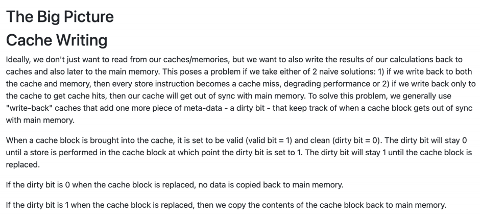
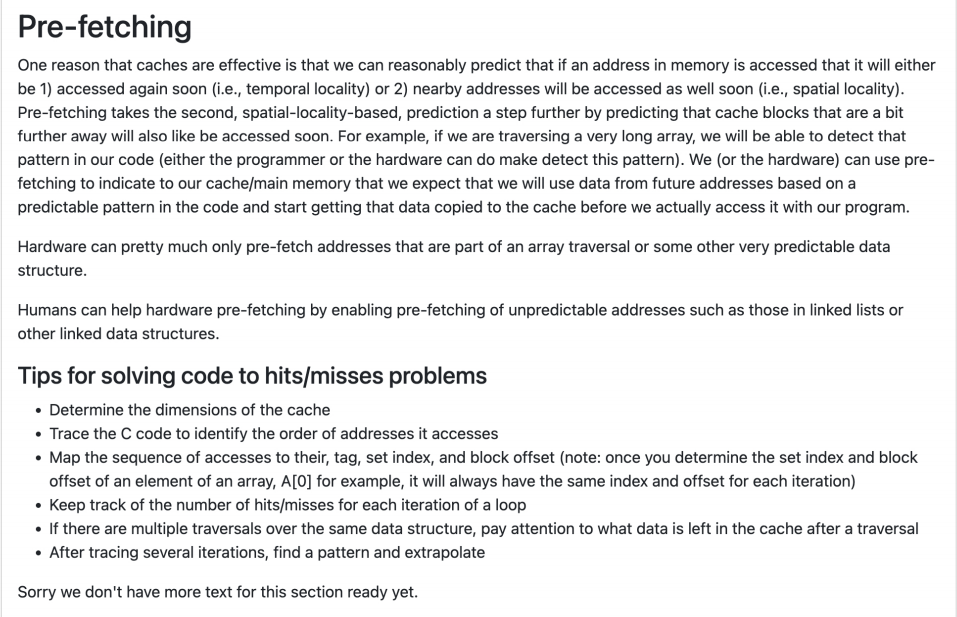

这段内容讲的是计算机体系结构中**缓存写入（Cache Writing）\**的问题和解决方法，特别是关于\**“写回（write-back）”缓存机制**的原理。下面我来给你**详细解释每一句话的含义**。

------

### 标题：《大局观：缓存写入》

------

### 第一段：问题背景和两种幼稚方案

> Ideally, we don't just want to read from our caches/memories, but we want to also write the results of our calculations back to caches and also later to the main memory.

**理想情况下**，我们不仅要从缓存或内存中读取数据，还要把计算得到的结果写回缓存，并最终写回主内存。

------

> This poses a problem if we take either of 2 naive solutions:

如果我们采用两种**幼稚的写入策略**之一，就会出现问题。

------

**幼稚方案1**：

> 1. if we write back to both the cache and memory, then every store instruction becomes a cache miss, degrading performance

如果我们**每次写操作都同时写回缓存和主内存**，那么每一次写入都会导致**缓存失效（cache miss）**，严重影响性能。

------

**幼稚方案2**：

> 1. if we write back only to the cache to get cache hits, then our cache will get out of sync with main memory.

如果我们只写回缓存以提升命中率，那缓存中的数据可能会与主内存不同步，数据不一致。

------

### 第二段：解决方案——写回缓存（write-back cache）

> To solve this problem, we generally use "write-back" caches that add one more piece of meta-data – a dirty bit – that keep track of when a cache block gets out of sync with main memory.

为了解决这个问题，我们通常使用**写回缓存（write-back cache）**。这种机制会为每个缓存块多加一个**元数据**，叫做“**脏位（dirty bit）**”，用来标记这个缓存块是否与主内存不同步。

------

### 第三段：dirty bit 的工作机制

> When a cache block is brought into the cache, it is set to be valid (valid bit = 1) and clean (dirty bit = 0).

当一个主内存的数据被加载进缓存时，它会被设置为：

- 有效（valid bit = 1）
- 干净（dirty bit = 0）

表示它和主内存数据是一致的。

------

> The dirty bit will stay 0 until a store is performed in the cache block at which point the dirty bit is set to 1.

这个脏位会保持为 0，直到有一次写操作发生在这个缓存块中，此时**脏位就会被置为 1**，表示这个缓存块已经被修改，和主内存不一样了。

------

> The dirty bit will stay 1 until the cache block is replaced.

脏位一旦变成 1，就会保持这个状态，直到这个缓存块被替换出缓存。

------

### 第四段：dirty bit 的作用

> If the dirty bit is 0 when the cache block is replaced, no data is copied back to main memory.

如果一个缓存块在被替换时脏位还是 0，说明它没被修改过，所以**不需要把数据写回主内存**。

------

> If the dirty bit is 1 when the cache block is replaced, then we copy the contents of the cache block back to main memory.

如果缓存块在被替换时脏位是 1，说明它被修改过了，所以**需要把它的内容写回主内存**，防止数据丢失。

------

### 总结：

- “写回缓存”是一种提高性能又保证数据一致性的策略。
- 脏位（dirty bit）就是判断是否需要把缓存块的数据写回主内存的标记。
- 它只在缓存块被修改后才设为 1，缓存被替换时才根据这个位来决定是否回写内存。

如果你还想了解“写直达（write-through）”策略或缓存一致性问题，我也可以详细讲解。

这段内容讲的是**预取（Pre-fetching）**在计算机缓存中的应用，及其如何帮助提高缓存效率。以下是详细解释：

------

### 预取（Pre-fetching）

#### **缓存的有效性**

> One reason that caches are effective is that we can reasonably predict that if an address in memory is accessed that it will either be 1) accessed again soon (i.e., temporal locality) or 2) nearby addresses will be accessed as well soon (i.e., spatial locality).

缓存之所以有效，一个原因是我们可以合理预测某个内存地址被访问时，它要么**很快就会再次被访问**（即**时间局部性**），要么**附近的地址很可能会被访问**（即**空间局部性**）。

------

#### **空间局部性预取**

> Pre-fetching takes the second, spatial-locality-based, prediction a step further by predicting that cache blocks that are a bit further away will also like be accessed soon.

预取是对空间局部性预测的一种扩展，它通过预测**离当前地址稍远的缓存块也会很快被访问**，来进一步提高缓存命中率。

------

#### **数组遍历示例**

> For example, if we are traversing a very long array, we will be able to detect that pattern in our code (either the programmer or the hardware can do make detect this pattern). We (or the hardware) can use pre-fetching to indicate to our cache/main memory that we expect that we will use data from future addresses based on a predictable pattern in the code and start getting that data copied to the cache before we actually access it with our program.

例如，如果我们正在遍历一个非常长的数组，我们可以在代码中识别出这个访问模式（这可以由程序员手动检测，也可以由硬件自动检测）。基于这个可预测的访问模式，我们可以使用预取来告知缓存或主内存：**我们预计将会使用未来地址的数据**，并提前将这些数据拷贝到缓存中，而无需等到程序真正访问时才加载。

------

#### **硬件和程序员的协作**

> Hardware can pretty much only pre-fetch addresses that are part of an array traversal or some other very predictable data structure.

硬件通常只能预取**数组遍历**或其他非常可预测的数据结构中的地址。

> Humans can help hardware pre-fetching by enabling pre-fetching of unpredictable addresses such as those in linked lists or other linked data structures.

程序员可以通过启用**不太可预测的地址预取**（例如链表等动态数据结构中的地址）来帮助硬件进行预取。

------

### 解决命中/未命中问题的技巧

接下来的部分介绍了一些**优化缓存命中率**的技巧：

- **确定缓存的维度**：首先需要清楚缓存的大小和结构。
- **追踪代码**：通过追踪 C 语言代码，识别程序访问内存的顺序和地址。
- **映射地址序列**：将访问的地址、标签、集索引和块偏移量进行映射。例如，在遍历数组 `A[0]` 时，每次访问的地址和偏移量都一样。
- **记录每次循环的命中/未命中次数**：通过记录每次迭代后缓存的命中与未命中次数来评估缓存效果。
- **多个遍历相同数据结构时，注意缓存的内容**：如果多次遍历同一数据结构，需要注意缓存中剩余的数据。
- **通过多次迭代总结规律**：通过追踪多个迭代的结果，找出规律并进行推断。

------

### 总结：

这段内容讲述了缓存预取机制，通过识别程序中的访问模式（如数组遍历等），提前将数据加载到缓存中，从而减少程序运行时的缓存未命中，提升性能。程序员和硬件可以协同工作，通过预取一些不可预测的地址来进一步优化缓存效率。

如果你对如何实现这些技巧或预取的具体代码有疑问，我可以进一步帮助解答。