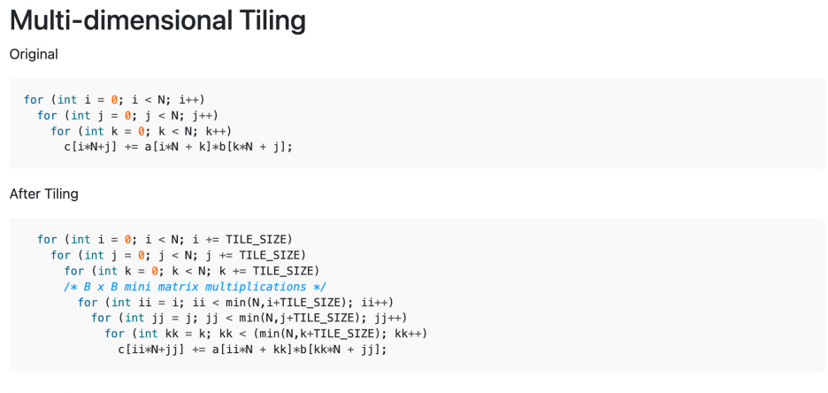
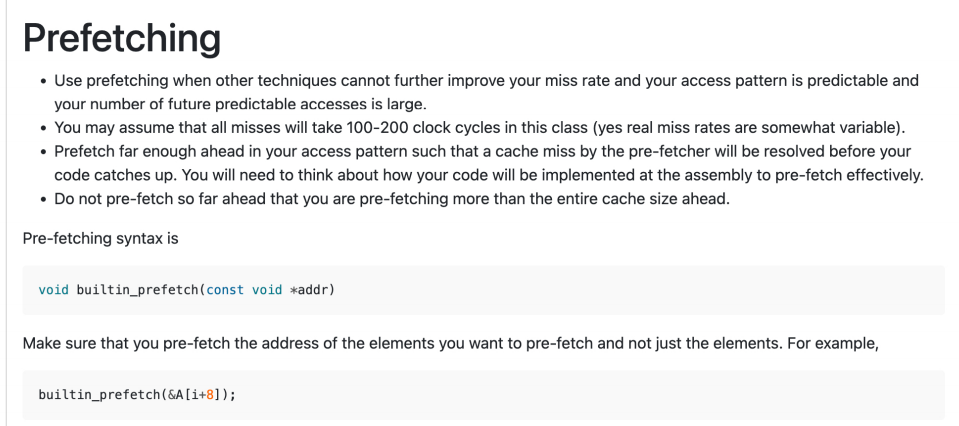

这张图讨论了几种提升代码性能的技术，具体目的是提高缓存的空间局部性或时间局部性，使代码在缓存中执行得更高效。以下是每种技术的详细解释：

1. **循环融合（Loop Fusion）**： 循环融合通过将多个对同一数组的访问操作合并在一起，从而提高时间局部性。这意味着我们将对同一数组的访问操作放在连续的循环中，而不是分别遍历整个数组，从而使数据更容易被缓存，减少了缓存失效的次数。
2. **循环分裂（Loop Fission）**： 循环分裂通过将一个大循环拆分成多个小循环来提高空间局部性。这样做的目的是让对多个数组的访问能够同时进行，如果其中一个数组的访问会与另一个数组的访问冲突，我们就将它们分开，这样可以更好地利用缓存。
3. **循环反转（Loop Inversion）**： 循环反转通过使用行遍历或其他具有高空间局部性的代码结构来提高空间局部性。这意味着我们将列遍历等低空间局部性结构转变为行遍历，或者使用具有更高空间局部性的其他结构，这样可以减少缓存未命中的情况。
4. **平铺（Tiling）**： 平铺通过将大的数据结构分解成多个较小的数据结构，提高时间局部性。这样做的目的是在数据结构中的小部分上执行多次遍历，在缓存中对这些较小的数据进行反复访问，从而提高效率。

总的来说，这些技术旨在优化代码执行时对缓存的利用，从而提高性能。


这张图展示了循环融合（Loop Fusion）技术的例子。循环融合的目的是将多个独立的循环合并为一个循环，从而提高缓存的效率，减少缓存未命中次数。

在原始代码中，有两个循环，每个循环都遍历数组 A：

```c
for (int j = 0; j < LARGE; j++) {
    sum += A[j];
}

for (int j = 0; j < LARGE; j++) {
    product *= A[j];
}
```

上面的代码中有两个循环，分别计算数组 `A` 的元素和的总和 `sum` 和元素的乘积 `product`。每个循环都遍历数组 A 一遍，这会导致两个循环分别加载数组 `A`，从而增加了缓存的未命中次数（2 x LARGE）。

通过循环融合，将两个循环合并为一个：

```c
for (int j = 0; j < LARGE; j++) {
    sum += A[j];
    product *= A[j];
}
```

合并后的代码只需要一个循环就能完成两个操作（求和和求积）。这样，循环中对数组 `A` 的每个元素的访问就变得连续且紧凑，减少了缓存未命中的次数。原来每个独立循环都需要访问 `A`，而现在两个操作可以共享一次对 `A` 数组的访问，从而提高了缓存的空间局部性。

因此，循环融合通过减少缓存未命中次数，提升了程序的性能，特别是在大数据量处理时效果更明显。


这张图展示了 **循环分裂（Loop Fission）** 技术的例子。循环分裂的目的是通过将一个大循环拆分成多个小循环来提高程序的空间局部性，减少缓存未命中的次数。

### 原始代码：

在原始的代码中，有一个外部循环（遍历 `A` 数组）和一个嵌套的内部循环（遍历 `B` 数组）。`A[j]` 和 `B[j][k]` 被同时访问，这样的嵌套结构可能导致多个缓存未命中的情况，特别是在访问 `A` 时，可能因为外部循环频繁访问不同的位置而导致缓存中的数据被清除。

```c
for (int j = 0; j < LARGE; j++) {
    sum += A[j]; // 遍历 A 数组
    for (int k = 0; k < LARGE; k++) {
        other_sum += B[j][k]; // 遍历 B 数组
    }
}
```

### 循环分裂后的代码：

通过循环分裂，原本的嵌套循环被拆分成两个独立的循环。首先处理 `A[j]` 数组，然后处理 `B[j][k]` 数组。这有助于提高空间局部性，特别是在访问 `A` 数组时，减少了频繁跳跃访问导致的缓存未命中。

```c
for (int j = 0; j < LARGE; j++) {
    sum += A[j]; // 仅处理 A 数组
}

for (j = 0; j < LARGE; j++) {
    for (int k = 0; k < LARGE; k++) {
        other_sum += B[j][k]; // 仅处理 B 数组
    }
}
```

### 关键点：

1. **原始代码：** 由于嵌套循环，`A[j]` 和 `B[j][k]` 的访问可能会导致缓存不命中，因为访问 `A[j]` 和 `B[j][k]` 的模式是交替的，可能会导致不同缓存块之间的数据冲突。
2. **循环分裂后的代码：** 将两个循环分开，使得每个数组的访问更为连续，增加了缓存的空间局部性。访问 `A[j]` 数组和 `B[j][k]` 数组不再交替进行，从而减少了缓存未命中。

### 总结：

**循环分裂** 通过将大的循环分拆成多个小的循环，可以减少数据访问之间的干扰，特别是对于大数组的处理，能显著提高程序的性能，特别是在大规模数据处理中。


好的！我用更简单的方式解释这个概念，结合图中的例子：

------

### **循环反转（Loop Inversion）的核心思想**

**问题**：当程序需要反复访问内存中的数组时，如果数据不在CPU缓存（高速缓存）中，每次都要从内存加载，速度很慢。
 **解决方法**：通过调整嵌套循环的顺序，让内层循环尽量连续访问内存（减少跳跃），从而提高缓存命中率。

------

### **具体例子解释**

#### **1. 原始代码（缓存命中差）**

假设数组`a`在内存中是连续存储的（例如：`a[0]`, `a[1]`, `a[2]`, ...）。

- **外层循环**：遍历`i`（假设`m=1000`次）。
- **内层循环**：遍历`j`（假设`n=1000`次），每次访问`a[j]`。
   **问题**：
- 当`j`从0到999时，第一次外循环（`i=0`）会加载`a[0]~a[999]`到缓存。
- 但第二次外循环（`i=1`）时，缓存可能已被其他数据覆盖，需要重新加载`a[0]~a[999]`。
- **总缓存缺失次数**：`m × n` = 1000 × 1000 = 100万次！

------

#### **2. 反转后的代码（缓存命中好）**

交换内外循环顺序：

- **外层循环**：遍历`j`（`n=1000`次）。
- **内层循环**：遍历`i`（`m=1000`次），每次访问`a[i]`。
   **优化效果**：
- 当`j`固定时，内层循环`i`连续访问`a[0]~a[999]`。
- 第一次外循环（`j=0`）加载`a[0]~a[999]`到缓存后，后续所有`i`的访问都直接读缓存。
- **总缓存缺失次数**：`n` = 1000次！性能提升1000倍！

------

### **为什么能优化？**

- **连续访问**：反转后内层循环`i`的访问是连续的（如`a[0]`, `a[1]`, `a[2]`），而原始代码内层循环`j`的访问是跳跃的（如`a[0]`, `a[1000]`, `a[2000]`）。
- **缓存块**：CPU缓存按块加载数据（例如一次加载相邻的64字节），连续访问能充分利用已加载的缓存块。

------

### **适用场景（图中的例子）**

1. **二维数组按列遍历**：
   - 原始代码：外层循环行，内层循环列 → 跳跃访问内存。
   - 反转后：外层循环列，内层循环行 → 连续访问内存。
2. **结构体数组**：
   - 原始代码：内层循环遍历结构体中的某个字段 → 跳跃访问。
   - 反转后：内层循环遍历整个结构体 → 连续访问。

------

### **一句话总结**

循环反转通过让内层循环“小步快跑”（连续访问内存），外层循环“大步慢走”（跳跃访问），大幅减少缓存缺失，从而提升程序运行速度。


这张图介绍了**平铺（Tiling）**技术，特别是在进行计算时，如何通过分割数据块来提高缓存效率，减少缓存未命中的次数。

### **平铺的使用条件：**

1. **数据重用：** 你需要多次使用同一块数据。如果你的代码没有数据重用（即你每次都访问不同的数据，而不是反复访问相同的数据），平铺就没有帮助。
2. **时间局部性：** 如果代码中的数据重用没有时间局部性（即数据在被使用前已经被移出缓存），平铺也无法提高性能。
3. **其他技术的不足：** 如果像循环分裂（Loop Fission）、循环融合（Loop Fusion）和循环反转（Loop Inversion）等技术不足以创建数据的时间局部性，可以考虑使用平铺技术。

### **平铺的缓存未命中情况：**

平铺的缓存未命中数取决于**数据块（tile size）**的大小。在选择数据块大小时，有一些需要考虑的因素：

- **确保所有数据块能完全容纳到缓存中，直到使用完这些数据块。**
- **尽可能增大数据块的大小，以提高缓存的效率。**
- **在进行计算时，记得考虑数据类型的大小**，因为数据类型的大小影响每个数据块能容纳的数据量。

### **1D 平铺的示例：**

**原始代码：** 这是一个没有使用平铺的简单例子，外层循环遍历 `i`，内层循环遍历 `j`，并进行计算：

```c
for (int i = 0; i < M; i++) {
    for (int j = 0; j < N; j++) {
        sum += a[j] / b[i];
    }
}
```

在这种情况下，程序按顺序访问数组 `a[j]` 和 `b[i]`，对于大型数据，访问的内存可能不连续，导致缓存未命中较多。

**平铺后的代码：** 使用平铺技术后，我们将数据划分为小的“块”（tile），每个块内的数据连续访问，从而提高缓存效率：

```c
for (int j = 0; j < N; j += TILE_SIZE) { // 外循环按块遍历
    for (int i = 0; i < M; i++) {
        for (int jj = j; jj < min(N, j + TILE_SIZE); jj++) {  // 内循环遍历每个小块
            sum += a[jj] / b[i];
        }
    }
}
```

在这里，`TILE_SIZE` 是一个预定义的常量，表示数据块的大小。通过这种方式，内存访问变得更加局部化，程序在每次处理一个数据块时，所有相关数据都位于缓存中，从而减少缓存未命中的概率。

### **为什么平铺有效：**

- **局部性：** 平铺技术通过将大数据集分成小块，使得在每个块内部的数据访问是连续的，能更好地利用缓存，减少从主内存中加载数据的次数。
- **减少缓存未命中：** 通过优化数据的访问顺序和范围，平铺可以减少对缓存的压力，从而提高程序的执行效率。

### **总结：**

平铺技术通过将数据分成小块进行处理，能有效地提高缓存利用率，减少缓存未命中，特别适用于需要多次访问相同数据的情况。在选择数据块大小时，需要平衡缓存的容量和数据类型的大小，以确保最佳的性能提升。



这张图展示了**多维平铺（Multi-dimensional Tiling）**的应用，特别是在矩阵乘法中的优化。

### **原始代码：**

首先，展示的是一个普通的矩阵乘法的代码实现。它使用了三个嵌套的循环，外层的两个循环遍历矩阵 `a` 和 `b` 的行和列，内层的循环进行元素相乘并累加到结果矩阵 `c` 中。

```c
for (int i = 0; i < N; i++) {
    for (int j = 0; j < N; j++) {
        for (int k = 0; k < N; k++) {
            c[i + N * j] += a[i + k * N] * b[k + j * N];
        }
    }
}
```

这种写法按标准的矩阵乘法进行计算，每个 `i`, `j`, `k` 的组合都会对矩阵 `a` 和 `b` 进行访问和计算，结果存入矩阵 `c`。然而，在数据量较大时，这种处理方式会导致大量的缓存未命中，因为数据访问是不连续的，缓存不能有效地存储和重用已经访问过的数据。

### **平铺后的代码：**

通过**多维平铺**技术，代码进行了优化，将矩阵分成多个小块（tiles）来处理，每个小块中的数据会更频繁地使用，从而减少了缓存未命中的问题。

```c
for (int i = 0; i < N; i += TILE_SIZE) {
    for (int j = 0; j < N; j += TILE_SIZE) {
        for (int k = 0; k < N; k += TILE_SIZE) {
            /* B x B mini matrix multiplications */
            for (int ii = i; ii < min(N, i + TILE_SIZE); ii++) {
                for (int jj = j; jj < min(N, j + TILE_SIZE); jj++) {
                    for (int kk = k; kk < min(N, k + TILE_SIZE); kk++) {
                        c[ii + N * jj] += a[ii + N * kk] * b[kk + N * jj];
                    }
                }
            }
        }
    }
}
```

### **优化原理：**

- **分块处理：** 将矩阵分成小块进行计算，每次处理一个小块的数据，尽量保持数据在缓存中，从而减少从主内存加载数据的次数。
- **局部性：** 由于数据块内的元素是连续访问的，这样的访问方式能够更好地利用缓存，提高缓存命中率。
- **减少缓存未命中：** 通过平铺，使得数据在缓存中得到重复使用，从而避免了频繁的缓存未命中。

### **平铺后的代码流程：**

- **外层循环：** 每次处理一个 `TILE_SIZE x TILE_SIZE` 的数据块。
- **内层循环：** 在每个小块内部，继续按照原有的矩阵乘法顺序对元素进行逐个计算。这样就能确保内存中的数据是连续的，提高数据局部性。

### **总结：**

**多维平铺（Multi-dimensional Tiling）** 通过将大数据集分割成多个较小的数据块，使得每个块中的数据都能够在缓存中被频繁使用，减少缓存未命中。这种技术尤其适用于矩阵乘法等大规模数据计算中，可以显著提高程序性能，特别是在处理大矩阵时。



这张图介绍了**预取（Prefetching）**技术，主要用于优化缓存访问，并减少缓存未命中的情况。以下是该技术的详细解释：

### **预取的应用场景：**

- **当其他技术无法进一步改善缓存未命中率时，使用预取技术。**
  - 如果你已经尝试了其他技术（例如循环反转、平铺等），并且它们没有显著改善缓存未命中率，那么可以考虑使用预取技术。
- **当你的访问模式是可预测的，并且未来的访问数量很大时。**
  - 如果你能预见接下来会访问哪些数据（即访问模式是可预测的），且未来有很多这样的访问需求，那么预取可以提高缓存命中率，减少从主内存加载数据的时间。
- **预取的时机：**
  - 预取操作应提前足够，以便缓存未命中的情况能够在程序实际访问数据之前被预先解决。
  - 你需要考虑如何实现代码，确保预取能在正确的时机工作。
  - 但不要提前得过头，预取的区域不应超过缓存的大小，否则反而可能造成缓存过载，影响性能。

### **预取的语法：**

```c
void builtin_prefetch(const void *addr);
```

- `builtin_prefetch` 是预取指令的内建函数。它要求你传入一个内存地址（`addr`），该地址指向你希望预取的元素。

### **如何正确使用预取：**

- **确保你预取的是你想访问的元素的地址，而不是仅仅预取这些元素。** 换句话说，要确保你预取的是数据的位置，而不仅仅是数据本身。

  例如：

  ```c
  builtin_prefetch(&A[i + 8]);
  ```

  这里，`&A[i + 8]` 是元素 `A[i + 8]` 的地址，表示预取该位置的数据。这样做可以确保在后续使用时，该数据已经在缓存中，提高访问效率。

### **预取的工作原理：**

- **避免不必要的缓存未命中：** 预取技术让程序在访问数据之前，先把数据加载到缓存中，这样当程序实际需要这些数据时，它们已经在缓存里，避免了缓存未命中。
- **预取适用的情况：** 适合那些访问模式可预测且数据量较大的场景。预取技术通过“提前加载”未来可能使用的数据，从而提高缓存的使用效率。

### **总结：**

预取技术通过提前将数据加载到缓存中，帮助减少缓存未命中的次数，尤其是在数据访问顺序可预测且访问量大时。它需要根据代码的实际访问模式来合理设定预取的时机和数据块的大小。