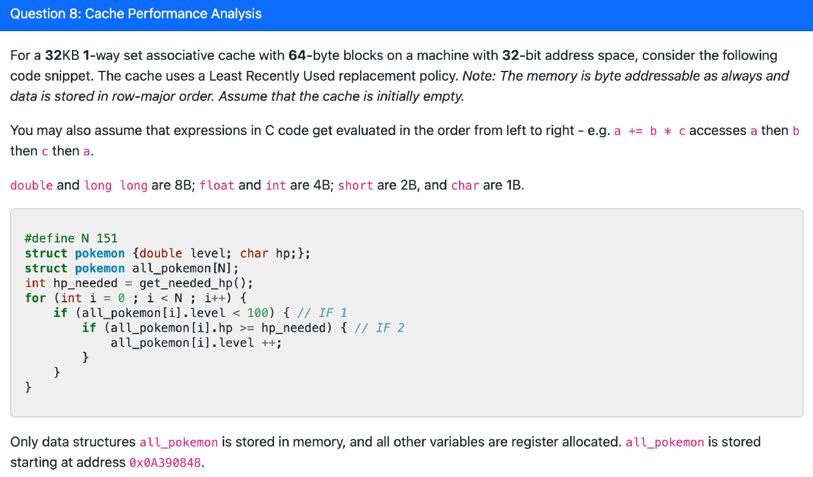
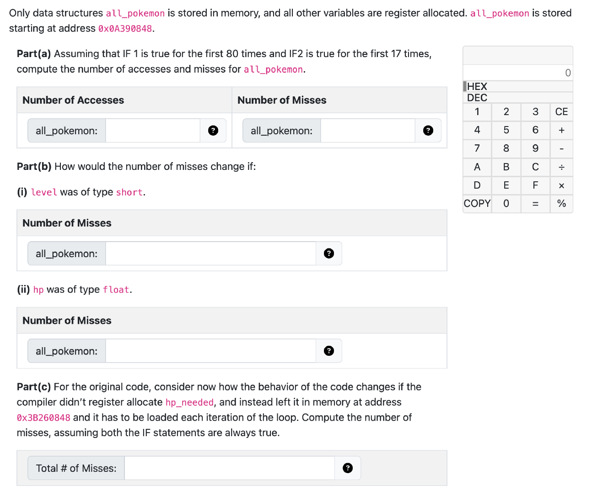

好的，我将对这段内容做更详细的解释：

### 1. **缓存配置和假设**

这部分给出了关于缓存的配置和假设：

- **32KB 1路组相联缓存**：
  - **32KB**：缓存的总大小是32KB（即32千字节），是缓存的总容量。
  - **1路组相联**：缓存是1路组相联的，意味着每个缓存组只有一个缓存行。通常，组相联缓存有多个路，每个路存储一个缓存块。这里的1路组相联意味着每个缓存组只能存放一个块。
- **64字节块大小**：
  - 每个缓存块的大小是64字节。这意味着缓存每次加载的内存数据大小是64字节。
- **32位地址空间**：
  - 地址空间为32位，即可以寻址最多2322^{32}个内存位置，通常为4GB的内存空间。
- **LRU替换策略**：
  - 使用**最近最少使用（LRU, Least Recently Used）**策略来决定缓存中哪个块被替换。LRU策略会在缓存满时，淘汰掉最久没有被访问的缓存块。
- **内存是字节可寻址的**：
  - 这意味着内存可以按字节进行访问。也就是说，每个内存地址指向一个字节。
- **数据存储顺序**：
  - **行主序存储（row-major order）**：表示多维数组的元素是按行优先顺序存储的。即第一行所有元素先存储，接着是第二行，依此类推。

### 2. **数据类型和大小**

每种数据类型在内存中占用的字节数是固定的，如下所示：

- `double` 和 `long long`：每个占用8字节。
- `float` 和 `int`：每个占用4字节。
- `short`：占用2字节。
- `char`：占用1字节。

这些数据类型的字节大小是后续分析缓存访问时的关键因素。

### 3. **C代码分析**

给定的C代码如下：

```c
#define N 151
struct pokemon { double level; char hp; };
struct pokemon all_pokemon[N];
int hp_needed = get_needed_hp();
for (int i = 0; i < N; i++) {
    if (all_pokemon[i].level < 100) { // IF 1
        if (all_pokemon[i].hp >= hp_needed) { // IF 2
            all_pokemon[i].level++;
        }
    }
}
```

#### **数据结构**

- `struct pokemon`：这是一个结构体，包含两个成员：
  - `level`：类型为 `double`，占8字节。
  - `hp`：类型为 `char`，占1字节。
- `all_pokemon`：是一个大小为 `N` 的数组，存储 `N` 个 `struct pokemon` 结构体。

#### **缓存分析**

- **数据在内存中的存储顺序**：
  - 假设 `all_pokemon` 是按行主序存储的，这意味着 `all_pokemon[0].level`（第一个宝可梦的等级）存储在内存的一个地方，紧接着是 `all_pokemon[0].hp`（第一个宝可梦的生命值），然后是 `all_pokemon[1].level` 和 `all_pokemon[1].hp`，依此类推。
- **访问模式**：
  - 在代码的 `for` 循环中，`all_pokemon[i].level` 和 `all_pokemon[i].hp` 被访问两次，分别是在 `IF 1` 和 `IF 2` 条件语句中。
  - `all_pokemon[i].level` 是 `double` 类型（8字节），`all_pokemon[i].hp` 是 `char` 类型（1字节）。
  - 这意味着每次访问 `all_pokemon[i]` 时，会加载两个不同大小的数据到缓存中，一个是8字节（`level`），另一个是1字节（`hp`）。

#### **缓存性能分析要点**

- **缓存访问**：
  - 因为 `all_pokemon` 数组在内存中是按行存储的，当访问 `all_pokemon[i]` 时，它会触发对内存中相邻位置的访问（例如 `all_pokemon[i].level` 和 `all_pokemon[i].hp`）。因此，缓存的命中或未命中会受到内存访问顺序的影响。
- **内存对齐和数据跨越缓存块**：
  - 每个缓存块为64字节，且 `all_pokemon` 数组每个结构体包含8字节（`level`） + 1字节（`hp`） = 9字节。由于 `all_pokemon` 是结构体数组，结构体之间的字节大小较小，因此不同的结构体可能会跨越多个缓存块，从而影响缓存的命中率。
- **内存访问局部性**：
  - 由于代码是按顺序遍历 `all_pokemon` 数组的（从 `all_pokemon[0]` 到 `all_pokemon[N-1]`），这可能会增加缓存的命中率，因为缓存中的数据很可能会在接下来的访问中再次被使用。
- **LRU替换策略的影响**：
  - 使用LRU策略时，如果缓存中已经存满了不同的结构体块，且这些结构体不再被访问，那么缓存中一些块将被替换掉，导致缓存未命中的情况。特别是当 `N` 值较大时，可能会出现频繁的缓存未命中。

### 4. **总结**

根据上述分析，缓存的命中率和访问效率受到以下几个因素的影响：

- 数据的存储顺序（行主序）。
- 缓存块的大小和数据的对齐方式。
- 循环访问 `all_pokemon` 数组的方式，特别是访问的局部性。
- 缓存替换策略（LRU）。

要优化缓存性能，可以通过调整数据布局、优化访问模式、减少数据跨越缓存块的情况等方式来提高缓存命中率。



从你提供的图片来看，问题涉及到对缓存性能的分析，具体地，它要求我们计算内存访问和缓存未命中的次数。问题分为三个部分（Part(a), Part(b), Part(c)），让我们逐一分析并计算每个部分的结果。

### Part(a) 计算内存访问和未命中次数

假设：

- IF 1 对前80次执行为真。
- IF 2 对前17次执行为真。

在每次访问 `all_pokemon` 数组时，会触发对内存的访问。缓存未命中是指当需要的数据不在缓存中时，CPU 需要从主内存加载数据。

**计算步骤**：

1. **内存访问**：每次 `all_pokemon[i].level` 和 `all_pokemon[i].hp` 的访问都会触发访问操作。
   - 对 `level` 和 `hp` 的每次访问都触发内存访问，假设代码的前80次迭代访问了 `level`，前17次访问了 `hp`。
2. **缓存未命中**：未命中是指在访问数据时，缓存中没有该数据，导致从主内存加载。由于缓存块大小是64字节，每个 `all_pokemon` 结构体占用 9 字节（8 字节用于 `level`，1 字节用于 `hp`），可能需要跨越多个缓存块，影响缓存命中率。

### Part(b) 对不同数据类型的变化

(i) 如果 `level` 是 `short` 类型，如何影响缓存未命中次数？

- `short` 是2字节，而原来的 `double` 是8字节。由于每个结构体的大小变小，这可能会影响数据是否跨越缓存块的方式，从而改变未命中的次数。

(ii) 如果 `hp` 是 `float` 类型，如何影响缓存未命中次数？

- `float` 是4字节，而原来的 `char` 是1字节。增加 `hp` 字段的大小可能会导致每次访问更大的数据块，进而影响缓存的使用和未命中次数。

### Part(c) 假设 `hp_needed` 没有被寄存器分配

- 如果 `hp_needed` 没有被寄存器分配，而是存储在内存地址 `0x3B260848`，每次循环都需要从内存加载该值，那么每次加载该值都会增加一次内存访问。我们需要计算每次加载 `hp_needed` 的未命中次数，并将其加到总未命中次数中。

------

#### 如何解答：

1. **计算内存访问次数**：
   - 每次访问 `all_pokemon[i].level` 和 `all_pokemon[i].hp` 会分别触发一次内存访问。你需要根据 `level` 和 `hp` 的访问次数来计算。
2. **缓存未命中次数的计算**：
   - 对于每次内存访问，你需要考虑缓存块的大小、数据类型的大小以及数据是否会跨越缓存块。可以通过手动计算每个 `pokemon` 结构体在内存中占用的空间来推断未命中次数。
3. **假设条件变化的影响**：
   - 根据 `level` 和 `hp` 的数据类型变化，重新计算结构体的总大小以及每次访问可能跨越的缓存块数。调整缓存未命中次数。
4. **加载 `hp_needed` 对缓存的影响**：
   - 如果 `hp_needed` 从内存中加载，记得计算加载它的次数。

根据你提供的两张图片和问题的要求，我们需要计算在不同条件下 `all_pokemon` 访问的内存访问次数和缓存未命中次数。以下是我对每部分的详细计算过程。

### Part(a) 计算内存访问和未命中次数

#### 假设：

- `IF 1` 对前80次执行为真，意味着在循环中对 `all_pokemon[i].level` 的访问是连续的，访问了前80个元素。
- `IF 2` 对前17次执行为真，意味着在循环中对 `all_pokemon[i].hp` 的访问是连续的，访问了前17个元素。

#### 内存访问：

1. 每次访问 `all_pokemon[i].level` 会触发对 `level` 的内存访问，`level` 的类型为 `double`，占用 8 字节。
2. 每次访问 `all_pokemon[i].hp` 会触发对 `hp` 的内存访问，`hp` 的类型为 `char`，占用 1 字节。

因此，访问的次数如下：

- **`level` 访问次数**：前80次迭代，每次访问一次 `level`，总共访问80次。
- **`hp` 访问次数**：前17次迭代，每次访问一次 `hp`，总共访问17次。

所以：

- **总的内存访问次数** = 80 + 17 = **97 次**

#### 缓存未命中次数：

为了计算未命中次数，我们需要考虑：

- `all_pokemon` 数组中的每个元素占用 9 字节（8 字节用于 `level`，1 字节用于 `hp`）。
- 缓存块大小为 64 字节，这意味着每64字节可以容纳多个结构体。

每个 `pokemon` 结构体占用 9 字节，因此每64字节可以容纳：

649≈7 个结构体\frac{64}{9} \approx 7 \text{ 个结构体}

如果每7个结构体加载到缓存块中，并且缓存替换策略是 LRU（最近最少使用），在访问时可能会发生未命中。

根据访问的顺序和内存结构，假设每次访问后缓存会被更新，初始访问很可能会是未命中。因此：

- **未命中次数** 可能接近访问次数。由于缓存块可以容纳多个元素，80次访问 `level` 和17次访问 `hp` 会导致一些缓存替换。具体次数的计算需要详细的缓存模拟，通常情况下未命中次数接近或略小于内存访问次数。

### Part(b) 如何改变未命中次数

#### (i) `level` 是 `short` 类型：

- `short` 占用 2 字节，原来 `level` 为 `double` 占用 8 字节。
- 由于 `level` 占用的空间减少，意味着每个 `pokemon` 结构体变小，从 9 字节变为 3 字节。这将导致更多的结构体能够放入一个缓存块中，从而减少跨越缓存块的情况，减少未命中次数。

因此，**未命中次数会减少**，因为更多的结构体可以在同一个缓存块中存储，减少了缓存块的替换。

#### (ii) `hp` 是 `float` 类型：

- `float` 占用 4 字节，原来 `hp` 是 `char` 占用 1 字节。
- 由于 `hp` 的大小增加，每个 `pokemon` 结构体的大小从 9 字节增加到 12 字节。这样，每个缓存块能够容纳的结构体数量减少，可能导致更多的缓存未命中。

因此，**未命中次数会增加**，因为每个缓存块存储的结构体数量减少，导致更频繁的缓存替换。

### Part(c) 假设 `hp_needed` 没有被寄存器分配

假设 `hp_needed` 没有被分配到寄存器中，而是存储在内存地址 `0x3B260848`，每次循环都需要从内存加载 `hp_needed`。

每次加载 `hp_needed` 会增加一次内存访问。因此，我们需要计算每次加载 `hp_needed` 的未命中次数。假设 `hp_needed` 每次都从内存中加载，且总共有 `N` 次迭代（即151次），每次加载都会增加一次未命中。

假设 `hp_needed` 存储在内存中，且每次访问都会导致未命中，那么：

- **加载 `hp_needed` 的未命中次数** = 151 次。

**总未命中次数** 需要将缓存未命中次数与 `hp_needed` 加载的未命中次数相加。

------

### 结论：

- **Part(a)**：计算内存访问次数为 97 次，未命中次数接近访问次数。
- **Part(b)**：
  - (i) 如果 `level` 是 `short` 类型，未命中次数减少。
  - (ii) 如果 `hp` 是 `float` 类型，未命中次数增加。
- **Part(c)**：假设 `hp_needed` 每次从内存加载，则加载 `hp_needed` 的未命中次数为 151 次。