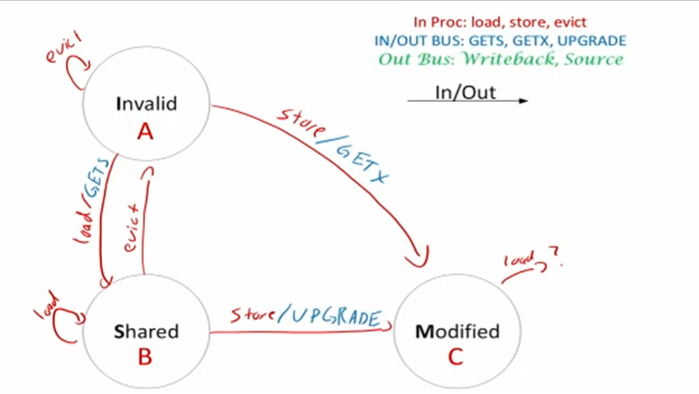

好的，我来帮你详细解释这张图的内容，中英对照讲解：

------

**The Big Picture**
 **整体概览**

------

**原文：**
 A statement T is said to be data dependent on statement S if:

**翻译：**
 如果满足以下条件之一，我们说**语句 T 对语句 S 存在数据依赖**：

- **S executes before T in the original sequential/scalar program**
   S 在原始顺序/标量程序中比 T 先执行
- **S and T access the same data item**
   S 和 T 访问了**同一个数据项**
- **At least one of the accesses is a write**
   至少其中一次访问是**写操作（写入数据）**

------

**原文：**
 By this definition, we have three types of data dependencies:

**翻译：**
 根据这个定义，我们有**三种类型的数据依赖**：

------

- **True Dependence: A Read After Write (RAW) dependency**
   **真正的依赖（True Dependence）：写后读依赖（RAW）**

  - 意思是：语句 S 写了数据，然后语句 T 读取这个数据。

  - 比如：

    ```c
    S: x = 5;
    T: y = x + 1;
    ```

    这里 T 依赖于 S，因为 T 需要读 S 写的 x。

------

- **Anti Dependence: A Write After Read (WAR) dependency**
   **反依赖（Anti Dependence）：读后写依赖（WAR）**

  - 意思是：语句 S 先读数据，语句 T 后写同样的数据。

  - 比如：

    ```c
    S: a = b + 2;
    T: b = 10;
    ```

    这里 S 读了 b，T 后面又写了 b，这种就是反依赖。

------

- **Output Dependence: A Write After Write (WAW) dependency**
   **输出依赖（Output Dependence）：写后写依赖（WAW）**

  - 意思是：语句 S 写了数据，语句 T 后面也写同样的数据。

  - 比如：

    ```c
    S: x = 7;
    T: x = 9;
    ```

    两个语句都写了 x，形成了输出依赖。

------

### 总结一遍中文要点：

- 数据依赖发生在**两个语句访问同一数据项**，而且至少有一次是**写操作**。
- 有三种依赖类型：
  - **RAW（真正依赖）**：先写后读。
  - **WAR（反依赖）**：先读后写。
  - **WAW（输出依赖）**：先写后写。


好的，这部分内容我帮你详细解释，并且给你**中英对照翻译**，一点点来讲清楚：

------

**英文原文：**

> When optimizing the performance of our code using various parallelism techniques, we can potentially change the order of execution of various statements in our programs.
>  Dependencies indicate an execution order in our program that must be honored (i.e., if T is dependent on S, we cannot execute T before S).
>  A true dependency is an integral part of the code and can not be removed.
>  Anti-dependence and output dependencies are called name dependencies because they can potentially be removed from the code by changing the name of a variable.

------

**逐句翻译和详细解释：**

1. **英文：**
    When optimizing the performance of our code using various parallelism techniques, we can potentially change the order of execution of various statements in our programs.
    **中文：**
    当我们使用各种**并行化技术**优化代码性能时，**可以有可能改变程序中不同语句的执行顺序**。

   **解释：**
    在做代码优化（比如用多线程、多核并行）时，有些语句不一定非要按照原本顺序来执行，只要不破坏程序逻辑，顺序是可以调整的。

------

1. **英文：**
    Dependencies indicate an execution order in our program that must be honored (i.e., if T is dependent on S, we cannot execute T before S).
    **中文：**
    **依赖关系**表明了程序中必须遵循的**执行顺序**（也就是说，如果 T 依赖于 S，我们就**不能在 S 执行前执行 T**）。

   **解释：**
    有依赖关系时，必须保证先执行依赖源（S），再执行依赖目标（T），否则程序的结果就可能出错。

------

1. **英文：**
    A true dependency is an integral part of the code and can not be removed.
    **中文：**
    **真正的依赖（True Dependency）**是代码中不可分割的一部分，**无法移除**。

   **解释：**
    真正依赖，比如先写后读（RAW依赖），这种是程序逻辑必须的，不能随便优化掉或重排顺序。

------

1. **英文：**
    Anti-dependence and output dependencies are called name dependencies because they can potentially be removed from the code by changing the name of a variable.
    **中文：**
    **反依赖（Anti-dependence）\**和\**输出依赖（Output Dependence）\**被称为\**名字依赖（Name Dependencies）**，因为我们可以通过**修改变量名**来潜在地**消除这种依赖关系**。

   **解释：**
    有些依赖其实只是因为用了**同一个变量名字**，导致程序需要排队执行；如果我们换个变量名，就可以消除这种假象依赖，让代码能并行得更快。

------

### 小总结（中文）：

- **真正依赖**（RAW）是**必须遵守的执行顺序**，不能打破。
- **反依赖**（WAR）和**输出依赖**（WAW）属于**名字依赖**，有时可以通过**改变量名**来消除，让程序能更灵活地重排顺序，提高性能。

------

要不要我接着给你整理一版更易记忆的小表格？
 比如"依赖类型"、"是否可以消除"、"例子"这样子总结一下？
 要的话告诉我，我顺便帮你画个简图！要不要？


## 英文原文

> Single-Instruction Multiple Data (SIMD) instructions take advantage of potential parallelism in our code by performing multiple loads or multiple arithmetic/logical operations with a single instruction.
>  SIMD instructions use a separate datapath from the one we have discussed so far that has its own vector register file and its own vector ALU.
>  In 32-bit Intel SSE processors, the vector registers store 128 bits and the vector ALU performs operations on 128 bits of data at a time.
>  These vector registers/ALU can be parsed differently based on what data type we are working with.
>  For example, if we were adding 1 to every element of an int (32 bit data type) array, we could load four elements (128/32 = 4) of the array at the same time, perform four integer additions at the same time, and store back to four elements of the array at the same time.
>  In contrast, if we were adding 1 to every element of a char (8 bit data type) array, we could load 16 (128/8 = 16) elements of the array at the same time, perform 16 char additions at the same time, and store back to 16 elements of the array at the same time.
>  We call this process, vectorizing our code.

------

## 中文翻译 + 详细解释

**标题：**
 单指令多数据（SIMD）指令概念

------

**1. 原文：**
 Single-Instruction Multiple Data (SIMD) instructions take advantage of potential parallelism in our code by performing multiple loads or multiple arithmetic/logical operations with a single instruction.
 **中文：**
 **单指令多数据（SIMD）\**指令通过\**一次指令执行多个数据加载或多个算术/逻辑运算**，从而利用了代码中的**潜在并行性**。

**解释：**
 SIMD技术的意思是，**一条指令可以同时处理很多数据**，不是一条一条慢慢处理，大大加快速度。

------

**2. 原文：**
 SIMD instructions use a separate datapath from the one we have discussed so far that has its own vector register file and its own vector ALU.
 **中文：**
 SIMD指令使用的是一条**独立的数据通路**，这条通路有**自己的向量寄存器文件和向量运算单元（ALU）**。

**解释：**
 SIMD不是用普通的CPU运算单元，而是用专门的“向量版”计算硬件，它们可以一次性处理一整组数据。

------

**3. 原文：**
 In 32-bit Intel SSE processors, the vector registers store 128 bits and the vector ALU performs operations on 128 bits of data at a time.
 **中文：**
 在32位Intel SSE处理器中，向量寄存器可以存储**128位**数据，向量运算单元（ALU）一次可以对**128位数据**进行操作。

**解释：**
 SSE（Streaming SIMD Extensions）技术让CPU一次可以处理128位数据，相比传统处理单个32位或64位要快很多。

------

**4. 原文：**
 These vector registers/ALU can be parsed differently based on what data type we are working with.
 **中文：**
 这些向量寄存器和运算单元根据**数据类型**的不同，**可以有不同的解析方式**。

**解释：**
 比如，处理32位整数时，一个128位寄存器可以分成4个32位；如果处理8位字符，那就可以分成16个8位数据块。

------

**5. 原文：**
 For example, if we were adding 1 to every element of an int (32 bit data type) array, we could load four elements (128/32 = 4) of the array at the same time, perform four integer additions at the same time, and store back to four elements of the array at the same time.
 **中文：**
 举个例子：如果我们要给一个**int数组（32位数据类型）\**的每个元素加1，我们可以\**一次性加载4个元素（128 ÷ 32 = 4）**，**同时完成4次整数加法**，并且**一次性把结果存回数组**。

**解释：**
 简单说，加快4倍速度：原本要加4次，现在一次就加完4个。

------

**6. 原文：**
 In contrast, if we were adding 1 to every element of a char (8 bit data type) array, we could load 16 (128/8 = 16) elements of the array at the same time, perform 16 char additions at the same time, and store back to 16 elements of the array at the same time.
 **中文：**
 相反，如果我们是给**char数组（8位数据类型）\**的每个元素加1，那么可以\**一次加载16个元素（128 ÷ 8 = 16）**，**同时执行16次char加法**，并且**一次存回16个元素**。

**解释：**
 处理更小单位的数据（比如8位字符），一次能加更多个（16个），效率更高。

------

**7. 原文：**
 We call this process, vectorizing our code.
 **中文：**
 我们把这个过程称为**代码向量化（Vectorizing our code）**。

**解释：**
 “向量化”就是让一条指令同时处理多个数据，最大化利用硬件的并行能力。

------

### 小总结（中文通俗版）：

- SIMD技术=一条指令处理很多数据，大大提速。
- 128位寄存器：可以同时处理4个32位整数或16个8位字符。
- 这叫**向量化（Vectorization）**，是现代CPU加速的一个关键手段。

------

要不要我也顺便给你画一个小图表，比如“单次处理数量对比（32位 vs 8位）”，一眼看懂？
 要的话告诉我，顺便帮你再列一版超简明版总结！要继续发下一张也可以～


好的，继续按照你的要求来！
 以下是这张图片内容的【什么意思 + 详细解释 + 中英互译】：

------

## 英文原文

> By performing multiple loads, adds, or stores at the same time, we are changing the execution order of a program.
>  For example, if our original program had a load, add, store, load, add, store, the vectorized code would effectively perform load, load, add, add, store, store.
>  Consequently, when vectorizing our code, we need to make sure that this reordering does not change the order of any dependencies.

------

## 中文翻译 + 详细解释

**1. 原文：**
 By performing multiple loads, adds, or stores at the same time, we are changing the execution order of a program.
 **中文：**
 当我们**同时执行多个加载、加法或存储操作**时，其实是在**改变程序的执行顺序**。

**解释：**
 向量化让很多操作同时发生，但这样做的副作用是，原本程序一条一条执行的顺序被打乱了。

------

**2. 原文：**
 For example, if our original program had a load, add, store, load, add, store, the vectorized code would effectively perform load, load, add, add, store, store.
 **中文：**
 比如，如果原来的程序执行顺序是：**加载（load）-> 加法（add）-> 存储（store）-> 加载 -> 加法 -> 存储**，
 那么向量化后的程序执行顺序可能变成：**加载、加载、加法、加法、存储、存储**。

**解释：**
 原本是**一边加载一边处理一边存储**，现在变成了**先集中加载一堆，再集中做加法，再集中存结果**。
 这样一来，**执行顺序表面上变了**，虽然可以加速，但要小心不要破坏逻辑。

------

**3. 原文：**
 Consequently, when vectorizing our code, we need to make sure that this reordering does not change the order of any dependencies.
 **中文：**
 因此，在**对代码进行向量化时**，必须**确保这种重新排序不会破坏任何依赖关系的顺序**。

**解释：**
 如果两个操作之间有**数据依赖**（比如先算再存），向量化后也必须**保住这种依赖顺序**，
 否则程序跑出来的结果就是错的！

------

## 小总结（中文通俗版）

- 向量化可以一次处理多个操作，加速程序。
- 但也会**打乱操作的执行顺序**。
- 在向量化时，必须**保护依赖关系**，不能因为加速而改变程序本来正确的逻辑。

------

要不要我顺便帮你总结一版：

- **正常执行流程图** vs **向量化后的流程图**？

这样你可以一眼看懂为什么load-load、add-add、store-store这样分组～
 要的话告诉我！
 可以继续发下一张图片！


继续按照你的要求，下面是这张图片的【什么意思 + 详细解释 + 中英互译】：

------

## 英文原文

> Up until now, we have made two simplifying assumptions about the ways processors work:
>
> 1. each program we write will be the only program running on a processor
> 2. the code and the data each program uses just magically appears and is small enough to fit in main memory.
>     The first assumption is problematic because we do want multiple programs running at the same time.
>     These different programs may want to write to the same memory addresses, meaning that different programs could theoretically overwrite each other's data in main memory.
>     The second assumption is problematic because even though our main memory is large, it is not large enough to contain all data/instructions we could possibly want to use.
>     AND main memory is volatile, meaning that all data is lost when the memory loses power (ideally we don't want to lose all programs and data from our computers when we turn them off!).
>     Consequently, we need a system that can flexibly
> 3. allow multiple programs to access data memory while not allowing them to access each other's data/instructions (i.e., provide data security)
> 4. allow our assembly code programs to pretend that data is in main memory but is actually copying data from even larger, non-volatile sources (like hard disks) to main memory without our program knowing.
>     Enter Virtual Memory.

------

## 中文翻译 + 详细解释

**1. 原文：**
 Up until now, we have made two simplifying assumptions about the ways processors work:
 **中文：**
 到目前为止，我们对处理器工作方式做了两个简化假设：

------

**2. 原文：**

1. each program we write will be the only program running on a processor
2. the code and the data each program uses just magically appears and is small enough to fit in main memory.
    **中文：**
    1）我们编写的每个程序都会是处理器上**唯一运行的程序**；
    2）每个程序使用的代码和数据会**自动出现在内存中**，而且**足够小，可以完全装进主存**。

**解释：**
 一开始为了简单，假设一台机器只跑一个程序，且内存足够放下所有内容。

------

**3. 原文：**
 The first assumption is problematic because we do want multiple programs running at the same time.
 **中文：**
 第一个假设是有问题的，因为实际上我们希望**多个程序能同时运行**。

**解释：**
 现代电脑肯定要多开程序，比如开浏览器、微信、文档同时进行，不可能只跑一个程序。

------

**4. 原文：**
 These different programs may want to write to the same memory addresses, meaning that different programs could theoretically overwrite each other's data in main memory.
 **中文：**
 这些不同的程序**可能想写入同样的内存地址**，
 这意味着**不同程序可能互相覆盖彼此在主存中的数据**。

**解释：**
 如果没有保护机制，不同程序很容易因为地址冲突而破坏对方的数据。

------

**5. 原文：**
 The second assumption is problematic because even though our main memory is large, it is not large enough to contain all data/instructions we could possibly want to use.
 **中文：**
 第二个假设也有问题，因为即使我们的主存很大，**也不足以装下所有可能需要的数据或指令**。

**解释：**
 有些大型程序或多个程序一起跑，数据量太大，内存根本放不下。

------

**6. 原文：**
 AND main memory is volatile, meaning that all data is lost when the memory loses power (ideally we don't want to lose all programs and data from our computers when we turn them off!).
 **中文：**
 而且主存是**易失性的**，也就是说**断电后所有数据都会丢失**（理想情况下，我们肯定不希望电脑关机时把程序和数据全丢了！）。

**解释：**
 内存一断电数据就消失，所以必须想办法把重要数据保存在其他地方。

------

**7. 原文：**
 Consequently, we need a system that can flexibly:
 **中文：**
 因此，我们需要一个可以灵活处理的系统，它需要能做到：

------

**8. 原文：**

1. allow multiple programs to access data memory while not allowing them to access each other's data/instructions (i.e., provide data security)
    **中文：**
    1）**允许多个程序访问主存数据**，但**又不能互相访问彼此的数据或指令**（也就是**保障数据安全**）

------

**9. 原文：**

2) allow our assembly code programs to pretend that data is in main memory but is actually copying data from even larger, non-volatile sources (like hard disks) to main memory without our program knowing.

 **中文：**
 2）**让汇编代码编写的程序以为数据都在主存里**，
 实际上，系统在后台**悄悄把更大的非易失性存储（比如硬盘）里的数据复制到主存**，程序完全不需要知道。

**解释：**
 程序员不用管数据是不是在内存，系统自动帮你从硬盘拿数据，做到“假装”数据就在主存。

------

**10. 原文：**
 Enter Virtual Memory.
 **中文：**
 这就是**虚拟内存（Virtual Memory）**登场的原因。

**解释：**
 虚拟内存系统出现，就是为了解决**多程序运行、安全隔离、主存不足、断电丢数据**等一系列问题。

------

## 小总结（中文通俗版）

- 原来的两个假设（只有一个程序、内存够用）都不现实。
- 现实情况：需要**多程序同时运行**，**防止数据冲突**，**解决内存容量不足**，**保护数据断电不丢**。
- 于是引入了**虚拟内存**，让程序以为内存无限大又安全可靠，系统后台自动搞定。

------

要不要我再顺便画一张小流程图？
 比如“实际物理内存 vs 虚拟内存”的对比流程，很直观一眼懂～
 要的话告诉我！可以继续发下一张！


好的！继续保持【什么意思 + 详细解释 + 中英互译】风格。
 这张图片内容的整理如下：

------

## 英文原文

> Virtual Memory solves both problems by using the principle of **indirection**, treating the addresses that our programs think they are writing to as references to the real addresses where their data is stored.
>  When using a load or store instruction, the address you construct is actually a virtual address.
>  The virtual memory system converts this virtual address into a physical address, which is actually where your data is stored, by looking up the virtual address in a special lookup table called the **page table** that tells it the correct physical address for each virtual address for each process (program) that is running.
>  For example, if your program tries to read from address 0x10010008 (i.e., `lw $t0, 0x10010008`), that is the virtual address.
>  The virtual memory system would look up 0x10010008 in the page table and might find that the physical address is actually 0xcafe0008.
>  Likewise, a different program might try to read from address 0x10010008 for its virtual address but the page table would tell the virtual memory system that the physical address for that program is actually 0x02330008.
>  Although both programs think they are reading from the same address, virtual memory lets both programs read their own data separate from each other.

------

## 中文翻译 + 详细解释

**1. 原文：**
 Virtual Memory solves both problems by using the principle of **indirection**, treating the addresses that our programs think they are writing to as references to the real addresses where their data is stored.
 **中文：**
 **虚拟内存（Virtual Memory）\**通过使用\**间接寻址（indirection）\**的原理，
 把程序认为自己在读写的地址，当作是\**实际存储位置的引用**，从而解决了之前提到的两个问题。

**解释：**
 程序员看到的地址并不是实际内存里的位置，而是一个“假地址”，系统帮忙找到真正的数据位置。

------

**2. 原文：**
 When using a load or store instruction, the address you construct is actually a virtual address.
 **中文：**
 当程序执行**加载（load）\**或\**存储（store）指令**时，实际使用的是**虚拟地址**。

**解释：**
 比如 `lw` （load word，加载一个字）指令里用的地址，是虚拟的，不是直接指向物理内存。

------

**3. 原文：**
 The virtual memory system converts this virtual address into a physical address, which is actually where your data is stored, by looking up the virtual address in a special lookup table called the **page table** that tells it the correct physical address for each virtual address for each process (program) that is running.
 **中文：**
 虚拟内存系统通过查找一个叫做**页表（page table）\**的特殊表，
 将虚拟地址转换成\**物理地址**（真正存放数据的地方）。
 页表为**每个进程（程序）\**维护了\**虚拟地址和物理地址的对应关系**。

**解释：**
 系统通过查询“页表”，把你想访问的虚拟地址翻译成实际物理内存的位置。

------

**4. 原文：**
 For example, if your program tries to read from address 0x10010008 (i.e., `lw $t0, 0x10010008`), that is the virtual address.
 **中文：**
 举例来说，如果你的程序尝试从地址**0x10010008**读取数据（比如 `lw $t0, 0x10010008`），
 那么**0x10010008**就是一个**虚拟地址**。

------

**5. 原文：**
 The virtual memory system would look up 0x10010008 in the page table and might find that the physical address is actually 0xcafe0008.
 **中文：**
 虚拟内存系统会在页表中查找**0x10010008**，可能发现其实际的物理地址是**0xcafe0008**。

**解释：**
 虚拟地址到物理地址的映射是系统内部控制的，程序本身不知道。

------

**6. 原文：**
 Likewise, a different program might try to read from address 0x10010008 for its virtual address but the page table would tell the virtual memory system that the physical address for that program is actually 0x02330008.
 **中文：**
 同样，另一个程序也可能尝试读取虚拟地址**0x10010008**，
 但页表会告诉虚拟内存系统，这个程序实际对应的物理地址是**0x02330008**。

**解释：**
 虽然两个程序看起来用的是一样的地址，但背后映射到的物理位置是不同的，互不干扰。

------

**7. 原文：**
 Although both programs think they are reading from the same address, virtual memory lets both programs read their own data separate from each other.
 **中文：**
 虽然两个程序以为自己在读同一个地址，
 但**虚拟内存保证它们各自读到的是自己的数据，互不干扰**。

------

## 小总结（中文通俗版）

- **程序看到的是虚拟地址，不是真实的物理内存地址。**
- **虚拟内存系统通过页表，把虚拟地址翻译成真正物理地址。**
- **不同程序即使看到相同虚拟地址，实际访问的是自己独立的数据。**
- **这就解决了多程序安全、内存管理灵活、程序之间互不干扰的问题。**

------

要不要我再帮你画一个小示意图，比如：

- 程序A看见 `0x10010008` → 实际去读 `0xcafe0008`
- 程序B也看见 `0x10010008` → 实际去读 `0x02330008`

一目了然！要的话告诉我～
 也可以继续发下一张图片！我随时接着！


好的！继续按照【什么意思 + 详细解释 + 中英互译】来整理。
 这张图片的内容如下：

------

## 英文原文

> If the virtual memory system does not find the desired virtual address in the page table, it causes a page fault (similar to a cache miss).
>  A page fault means that the desired data has not yet been copied into the memory.
>  After a page fault, the desired data is located on the disk, copied to the memory, and a new entry is added to the page table for future accesses to that entry in the page table.
>  The virtual memory system can then properly convert the virtual address into a physical address so that programs can securely access their data.

> The videos and other resources will dive a little deeper into how we actually implement the virtual memory system.

------

## 中文翻译 + 详细解释

**1. 原文：**
 If the virtual memory system does not find the desired virtual address in the page table, it causes a page fault (similar to a cache miss).
 **中文：**
 如果**虚拟内存系统**在**页表（page table）\**中找不到目标虚拟地址，
 就会发生\**缺页异常（page fault）**，（这有点像**缓存未命中（cache miss）**）。

**解释：**
 简单说，本来程序想用的数据地址，页表里没有记录，那就触发“缺页”，需要补救措施。

------

**2. 原文：**
 A page fault means that the desired data has not yet been copied into the memory.
 **中文：**
 缺页异常表示，**想要访问的数据还没有被复制到内存中**。

**解释：**
 数据还在硬盘上，程序要用的时候，才发现内存里没有，需要临时去硬盘取回来。

------

**3. 原文：**
 After a page fault, the desired data is located on the disk, copied to the memory, and a new entry is added to the page table for future accesses to that entry in the page table.
 **中文：**
 在发生缺页异常后，系统会**在磁盘上找到所需的数据**，
 **把数据复制到内存中**，然后**在页表里添加一个新条目**，
 以便将来访问这个地址时可以直接找到。

**解释：**
 第一次访问慢一点（要从硬盘搬到内存），以后再访问就快了，因为页表有记录了。

------

**4. 原文：**
 The virtual memory system can then properly convert the virtual address into a physical address so that programs can securely access their data.
 **中文：**
 这样，虚拟内存系统就能**正确地把虚拟地址转换成物理地址**，
 从而让程序**安全地访问自己的数据**。

**解释：**
 一旦补充完数据，虚拟地址到物理地址的映射就恢复正常，程序继续运行。

------

**5. 原文：**
 The videos and other resources will dive a little deeper into how we actually implement the virtual memory system.
 **中文：**
 后续的视频和其他资料将会**更深入讲解**虚拟内存系统的具体实现方法。

------

## 小总结（中文通俗版）

- 如果访问虚拟地址时，页表里没找到 → 触发**缺页异常（page fault）**。
- 系统会去**磁盘上找数据**，**复制到内存**，并且**更新页表**。
- 以后再访问这个地址，就不会再出错了，速度也快了。
- **虚拟内存机制**保证了程序员不需要管这些细节，一切自动完成。

------

要不要我再顺便给你画一个“缺页异常处理流程图”？
 比如：

访问虚拟地址 ➔ 页表查找 ➔ 找不到 ➔ 触发缺页异常 ➔ 磁盘取数据 ➔ 放入内存 ➔ 更新页表 ➔ 继续执行

一眼看懂！
 要的话告诉我～可以继续发下一张图片也可以！我都在！


好的，继续按照你的要求，【什么意思 + 详细解释 + 中英互译】！

------

## 英文原文

> First, a few important definitions:
>
> • **Processor Core**: A datapath like what we have seen during class that has an instruction cache, register file, ALU, data cache, etc.
>  • **Thread**: A program or a small part of a program that can be run independently and scheduled independently by the operating system.
>  • **Cache Coherence**: The caches from the different cores are said to have coherence for a piece of data when they all agree on the current value of that piece of data or do not have a value stored for that data.

> In a single core processor, the operating system creates the appearance of running multiple programs at a time by quickly switching between different threads based on what processes are in demand by the user.
>  By adding multiple cores in a processor, we create the ability to actually run multiple threads in parallel with each core running threads from different processes or several threads from the same process.
>  This parallelism can dramatically improve performance but at the cost of some new concerns about how to manage dependencies.

------

## 中文翻译 + 详细解释

------

### 1. 三个重要定义

**• Processor Core（处理器核心）**
 **英文原文：**
 A datapath like what we have seen during class that has an instruction cache, register file, ALU, data cache, etc.
 **中文翻译：**
 **处理器核心**是一个**数据通路**，包括了**指令缓存（instruction cache）**、**寄存器文件（register file）**、**算术逻辑单元（ALU）**、**数据缓存（data cache）**等。

**详细解释：**
 简单来说，**一个核心就像是一台微型计算机内部的操作单元**，它能独立执行运算、存储数据、读取指令。

------

**• Thread（线程）**
 **英文原文：**
 A program or a small part of a program that can be run independently and scheduled independently by the operating system.
 **中文翻译：**
 **线程**是**一个程序**或**程序的一小部分**，可以**被操作系统单独调度和独立运行**。

**详细解释：**
 一个大程序可以拆成多个小任务（线程），系统可以根据需要调度它们分别运行，提升反应速度和并发能力。

------

**• Cache Coherence（缓存一致性）**
 **英文原文：**
 The caches from the different cores are said to have coherence for a piece of data when they all agree on the current value of that piece of data or do not have a value stored for that data.
 **中文翻译：**
 **缓存一致性**指的是，当**不同核心的缓存**对于**同一块数据**的**当前值达成一致**（或者都没有缓存这个数据时），就说它们**保持一致性**。

**详细解释：**
 如果多核各自保存了一份同样的数据，**必须保证数据同步更新**，否则程序读到的内容就可能错误。

------

### 2. 单核和多核处理器下的运行机制

**英文原文：**
 In a single core processor, the operating system creates the appearance of running multiple programs at a time by quickly switching between different threads based on what processes are in demand by the user.
 **中文翻译：**
 在**单核处理器**中，操作系统通过**快速在不同线程之间切换**，
 让用户感觉**好像同时在运行多个程序**。

**详细解释：**
 单核CPU其实**一次只能干一件事**，但通过超快切换线程，让人感觉多个程序同时在跑，比如边听歌边打字。

------

**英文原文：**
 By adding multiple cores in a processor, we create the ability to actually run multiple threads in parallel with each core running threads from different processes or several threads from the same process.
 **中文翻译：**
 通过在处理器中**增加多个核心**，我们就能实现**真正的多线程并行运行**，
 每个核心可以跑**不同进程的线程**，或者是**同一进程的多个线程**。

**详细解释：**
 多核CPU可以**真正同时处理多件事情**，不是靠切换，而是每个核心独立工作。

------

**英文原文：**
 This parallelism can dramatically improve performance but at the cost of some new concerns about how to manage dependencies.
 **中文翻译：**
 这种**并行性**可以**极大提升性能**，
 但**也带来新的挑战**，比如**如何管理不同线程之间的数据依赖关系**。

**详细解释：**
 多线程同时修改数据，很容易出错，需要复杂的**同步机制**保证程序正确运行。

------

## 小总结（中文通俗版）

- **Processor Core** = 处理器核心，小型独立计算单元。
- **Thread** = 线程，程序中可独立调度的小任务。
- **Cache Coherence** = 缓存一致性，不同核心之间要统一数据。
- 单核靠**快速切换线程**伪装多任务。
- 多核可以**真正并行运行**多个任务，但要注意**同步和依赖问题**。

------

要不要我顺便帮你画个小示意图，比如：

- 单核时：线程1 → 线程2 → 线程3 （快速切换）
- 多核时：核心1跑线程1，核心2跑线程2 （并行）

一眼对比超清晰！
 要的话告诉我～继续发图片也可以！我随时在！


明白，继续按照你的要求，【什么意思 + 详细解释 + 中英互译】！

------

## 英文原文

> A critical challenge in effectively writing a single program that can concurrently run multiple threads is that each core has its own cache.
>  If we perform a write to the cache in one core, the caches of the other cores will not also be written to, causing the caches to lose coherence.
>  Therefore, we need protocols that help us keep track of when coherence is lost.
>  The **Modified-Shared-Invalid (MSI)** protocol builds on the ideas of valid and dirty bits that we have previously seen with caches.
>  Each cache block in each cache is controlled by a Finite State Machine that implements the MSI protocol.
>  The Invalid...

（图片末尾没有显示完，后面应该继续介绍MSI协议的细节）

------

## 中文翻译 + 详细解释

------

**1. 原文：**
 A critical challenge in effectively writing a single program that can concurrently run multiple threads is that each core has its own cache.
 **中文翻译：**
 在编写能够**同时运行多个线程**的单个程序时，一个**关键挑战**是：
 **每个核心都有自己的缓存（cache）**。

**详细解释：**
 多核CPU中，每个核心有自己独立的小型高速存储区域（缓存），这样访问速度更快，但也带来新的问题。

------

**2. 原文：**
 If we perform a write to the cache in one core, the caches of the other cores will not also be written to, causing the caches to lose coherence.
 **中文翻译：**
 如果我们在**某一个核心的缓存中执行写操作**，
 **其他核心的缓存不会同步更新**，导致**缓存之间失去一致性（coherence）**。

**详细解释：**
 比如核1更新了数据，但核2、核3的缓存还保存着旧数据，就出现了不一致的问题，会引发错误。

------

**3. 原文：**
 Therefore, we need protocols that help us keep track of when coherence is lost.
 **中文翻译：**
 因此，我们需要一些**协议（protocol）**，
 来**跟踪并管理缓存一致性何时丧失**的情况。

**详细解释：**
 必须有机制来检测并修正缓存内容不一致的问题，保证程序正确运行。

------

**4. 原文：**
 The **Modified-Shared-Invalid (MSI)** protocol builds on the ideas of valid and dirty bits that we have previously seen with caches.
 **中文翻译：**
 **修改-共享-失效（MSI）协议**，是基于我们以前在缓存中学到的**有效位（valid bit）**和**脏位（dirty bit）**概念建立的。

**详细解释：**
 MSI协议是一个简单但经典的缓存一致性管理方法，通过设定每块缓存的状态来控制同步行为。

------

**5. 原文：**
 Each cache block in each cache is controlled by a Finite State Machine that implements the MSI protocol.
 **中文翻译：**
 每个缓存中的**缓存块（cache block）**，
 都是由一个**有限状态机（Finite State Machine, FSM）\**来管理，
 这个状态机具体执行\**MSI协议**。

**详细解释：**
 每一块缓存区域会根据当前情况（比如是否被修改、是否被共享）在“修改（Modified）”、“共享（Shared）”、“失效（Invalid）”这三种状态之间切换。

------

## 小总结（中文通俗版）

- 每个CPU核心有自己的**缓存**，提高速度，但会带来**缓存不一致**问题。
- 当一个核心修改数据，其他核心可能不知道，数据就错了。
- 为了保证正确性，提出了**MSI协议**，管理缓存数据的状态。
- 每块缓存数据都有**自己的小状态机**，自动判断是**修改过的**、**共享的**还是**无效的**。

------

如果你想，我可以帮你画一个小图表，比如：

- Modified（已修改）
- Shared（共享）
- Invalid（失效）
   三种状态之间如何切换的小流程图！

要的话告诉我～
 可以继续发下一张图！我随时跟上！


好的，继续给你整理【什么意思 + 详细解释 + 中英互译】！

------

## 英文原文

> The Invalid state is similar to when the valid bit is 0: the data currently stored in a cache block is currently out of date and cannot be used.
>  If a cache block is accessed while in the invalid state, we would get a cache miss.
>  The Shared state is similar to when the valid bit is 1 and the dirty bit is 0: the data in the cache block has never been written to, so we can guarantee that the cache block has coherence with all other caches that are storing the same cache block.
>  Multiple caches can have the same cache block in the Shared state.
>  The Modified state is similar to when the valid bit is 1 and the dirty bit is 1: the data in the cache block has been written to, and we cannot guarantee that its contents match main memory or the other caches.
>  If any cache is storing a cache block in an invalid state, then every other cache must invalidate their copy of that cache block.
>  If a Modified cache block gets replaced, we must copy the contents of that cache block back to memory or to the other caches or both.

------

## 中文翻译 + 详细解释

------

### 1. Invalid 状态（失效状态）

**原文：**
 The Invalid state is similar to when the valid bit is 0: the data currently stored in a cache block is currently out of date and cannot be used.
 If a cache block is accessed while in the invalid state, we would get a cache miss.
 **中文翻译：**
 **Invalid（失效）状态**类似于**有效位（valid bit）为0**的情况：
 缓存块中当前存储的数据**已经过时**，**不能再使用**。
 如果我们在**Invalid状态**下访问这个缓存块，会出现**缓存未命中（cache miss）**。

**详细解释：**
 数据无效，相当于没有缓存这块内容，需要重新从主存中取数据。

------

### 2. Shared 状态（共享状态）

**原文：**
 The Shared state is similar to when the valid bit is 1 and the dirty bit is 0:
 the data in the cache block has never been written to,
 so we can guarantee that the cache block has coherence with all other caches that are storing the same cache block.
 Multiple caches can have the same cache block in the Shared state.
 **中文翻译：**
 **Shared（共享）状态**类似于**有效位是1，脏位（dirty bit）是0**的情况：
 缓存块中的数据**从未被写入修改过**，
 因此可以**保证它与其他缓存中存储同样数据块的副本保持一致性（coherence）**。
 多个缓存可以同时保存**同一个缓存块**，且都处于**Shared状态**。

**详细解释：**
 大家都只读不改，互不干扰，数据是一致的。

------

### 3. Modified 状态（修改状态）

**原文：**
 The Modified state is similar to when the valid bit is 1 and the dirty bit is 1:
 the data in the cache block has been written to,
 and we cannot guarantee that its contents match main memory or the other caches.
 **中文翻译：**
 **Modified（修改）状态**类似于**有效位是1，脏位是1**的情况：
 缓存块中的数据**已经被写入修改**，
 因此**不能保证它和主存或其他缓存中的副本一致**。

**详细解释：**
 数据被改过了，只有这个缓存里的版本是最新的，主存和其他缓存都是旧的。

------

**原文：**
 If any cache is storing a cache block in an invalid state, then every other cache must invalidate their copy of that cache block.
 **中文翻译：**
 如果有任意一个缓存把某个块标记为**Invalid（失效）**，
 那么**所有其他缓存中对应的副本也必须被标记为失效**。

**详细解释：**
 为了避免读到错的数据，一旦有地方标记了失效，所有地方都要同步失效。

------

**原文：**
 If a Modified cache block gets replaced, we must copy the contents of that cache block back to memory or to the other caches or both.
 **中文翻译：**
 如果一个**Modified（修改过的）缓存块**需要被替换出去，
 我们必须把它**的内容回写到主存或其他缓存，或者两者都写**。

**详细解释：**
 因为缓存中是最新的数据，替换时要把新数据保存下来，不能直接丢弃。

------

## 小总结（中文通俗版）

- **Invalid** = 数据无效，不可用，访问时报错。
- **Shared** = 数据可读，未被改动，多个缓存可以共享。
- **Modified** = 数据已被改动，只此处有效，需要同步回主存或其他地方。
- MSI协议就是通过这些**状态切换**，来管理**缓存一致性**。

------

要不要我帮你画一个小的【MSI状态转换图】？比如：

- 读写操作 → 状态从 Shared → Modified
- 外部更新 → 状态从 Shared/Modified → Invalid


这张幻灯片介绍的是并行计算课程中的**学习目标（Learning Objectives）**，从**指令级并行**过渡到**线程级并行（多核处理）**的内容。下面是详细解释：

------

## 标题：**Learning Objectives（学习目标）**

### 第一部分：回顾（Previously）

> **Previously, we looked at exposing parallelism at the instruction level**
>  **之前，我们学习了如何在指令级别实现并行**

- **SIMD: Single Instruction, Multiple Data**
   意思是：**单指令多数据**
   即：一条指令作用于多个数据 —— 是一种**数据层面的并行**。
   例如，用一条加法指令同时对8个数做加法（见SIMD指令如SSE/AVX）。

------

### 第二部分：现在要学习的内容（Now）

> **Now, still parallelism, but at the thread-level.**
>  **现在我们仍在探讨并行，但转向**“线程级并行”。

也就是说，我们不再只关注CPU内部执行一条指令时的并行（SIMD），而是**多个“核心”并行工作** —— 每个核心可以执行不同的线程。

------

### 四个关键问题（将要学习的）

1. **What are Multi-Core Processors?**
    什么是**多核处理器**？
2. **Why are they coming now?**
    为什么现在（而不是以前）我们才大量使用多核？
3. **How can we use them?**
    我们怎么编程、设计系统去利用这些多核？
4. **How do multiple-threads effectively share memory?**
    多个线程之间**如何有效共享内存**而不会产生冲突？

------

### 右图解释：

右边的图是一个 **AMD 双核 Opteron 处理器** 的芯片结构图：

- 有两个物理核心：**Core 0** 和 **Core 1**。
- 每个核心有自己的 **1MB L2 Cache**（二级缓存）。
- 中间部分可能是共享的 L1 或控制电路。
- 这展示了**多核结构的基本组成**，即多个核心+各自的缓存。

------

### 总结：

这张幻灯片的意思是：

> 在前面我们学的是**单核内的并行**（如SIMD），现在我们进入多核时代，要掌握如何**跨线程并行处理任务、合理共享资源、避免冲突**，这对高性能计算和现代编程非常关键。

是否需要我结合图再详细解释“线程共享内存”或“多核结构”？


这张幻灯片解释了**多核处理器（Multi-core Processor）**的基本概念，并用 IBM Power5 处理器芯片的照片做了示意图。以下是详细中文解释：

------

## 标题：

### **Multi-core processors have two (or more) complete processors on the same chip**

**多核处理器在同一个芯片上包含两个（或更多个）完整的处理器核心**

------

### 主体解释：

#### **Execute instructions from two (or more) programs/threads at same time**

**可以同时执行来自两个（或多个）程序/线程的指令**

- 每个“核心”都可以像独立的处理器一样工作。
- 多核让处理器能真正同时处理多个任务（并行处理），而不是像单核那样靠时间片轮转来“模拟”多任务。

------

#### **Multi-core is everywhere**

**多核处理器无处不在**

- 今天从笔记本电脑、手机到服务器，几乎所有设备都采用多核架构，是现代 CPU 的标准配置。

------

## 右图说明：

这是 IBM Power5 的芯片结构图，用红色标出了两个核心（Core #1 和 Core #2）：

### 每个核心中包含的功能模块：

| 缩写    | 含义                        | 功能                                   |
| ------- | --------------------------- | -------------------------------------- |
| **FPU** | Floating Point Unit         | 浮点运算单元，用于处理小数运算         |
| **ISU** | Instruction Scheduling Unit | 指令调度单元，决定哪些指令先执行       |
| **IDU** | Instruction Decode Unit     | 指令译码单元，将机器指令翻译为控制信号 |
| **IFU** | Instruction Fetch Unit      | 指令获取单元，从内存中取指令           |
| **LSU** | Load/Store Unit             | 读/写单元，处理内存加载和存储操作      |

### 下方区域：

- **多个 L2**：代表每个核心配有自己的二级缓存（L2 Cache）。
- **L3 Directory/Control**：芯片底部是三级缓存控制器（可能是共享的L3 Cache）。

------

## 总结：

> 多核处理器就是在一块芯片中集成多个**完整的运算核心**，每个核心能独立执行线程，从而大幅提升性能和并行能力。图中展示的 IBM Power5 是一个典型的双核设计，每个核心都有自己的指令处理单元和缓存系统。

你想我对图中的每个模块再逐一讲解它们的功能与运行方式吗？


这张图展示的是**摩尔定律（Moore's Law）\**的视觉化体现，它说明了芯片上\**晶体管数量随着时间呈指数增长**，带来性能的提升。

------

### 一、标题解释：

> **The number of transistors on chips keeps doubling, increasing performance**
>  **芯片上的晶体管数量持续翻倍，带来性能提升**

这是摩尔定律的核心观点，由英特尔联合创始人**戈登·摩尔（Gordon Moore）**提出。

------

### 二、图表结构说明：

- **X轴（横轴）**：表示时间，从1970年到2010年。
- **Y轴（纵轴）**：表示晶体管数量，采用**对数刻度**（log scale），从1,000到10,000,000,000。
- **黄色线条**：是摩尔定律预测的增长趋势线。

图中展示了不同时期的代表性Intel处理器及其晶体管数量，如：

| 年代 | 处理器型号          | 晶体管数量级别（约） |
| ---- | ------------------- | -------------------- |
| 1971 | Intel 4004          | 2,300个晶体管        |
| 1982 | Intel 286           | 数十万级别           |
| 1993 | Pentium             | 百万级别             |
| 2000 | Pentium 4           | 上千万               |
| 2006 | Dual-Core Itanium 2 | 十亿以上             |

------

### 三、摩尔定律是什么？

> **摩尔定律（Moore’s Law）**： 每隔大约 **18到24个月**，芯片上的**晶体管数量会翻一倍**，这通常意味着**性能翻倍**、成本下降、能耗优化。

注意：这不是自然定律，而是工程领域的经验规律。

------

### 四、图中的含义总结：

1. **过去几十年里，摩尔定律大体成立**：晶体管数量持续增长。
2. **晶体管越多，计算性能越强**：可以实现更复杂的功能、更高的速度。
3. **现代处理器已达到数十亿晶体管**：如多核处理器、高速缓存系统都依赖晶体管密度。
4. **未来挑战**：晶体管继续微缩接近物理极限，摩尔定律正逐步放缓。

------

### 五、一句话总结：

> **这张图直观地展示了芯片发展几十年来的奇迹 —— 晶体管翻倍推动了整个计算机性能革命。**

如果你想知道“晶体管增加为什么会让电脑更快”，我可以进一步解释。需要吗？


这张图的主题是：

> **“性能提升是以功耗急剧上升为代价的”**
>  （Increased performance comes at a steep and limiting cost of power）

------

## 一、图中关键内容解释

### 横轴：**Scalar Performance**（标量性能）

表示处理器的性能强度（越往右性能越强）。

### 纵轴：**Power**（功耗）

表示 CPU 在运行时消耗的功率（越往上代表越耗电）。

### 曲线公式：

> **power = performance ^ 1.73**
>  意思是：功耗 ≈ 性能 的 1.73 次方（远超线性增长）

也就是说，性能提升不是“线性”带来更多能耗，而是**指数式地增加功耗**。

------

## 二、图中数据点解释

图中标出了几个历史上的 Intel 处理器：

| 芯片        | 性能           | 功耗                 | 位置说明 |
| ----------- | -------------- | -------------------- | -------- |
| i486        | 低性能、低功耗 | 左下角               |          |
| Pentium     | 性能稍高       | 功耗上升一点         |          |
| Pentium Pro | 性能中等       | 功耗急剧上升         |          |
| Pentium 4   | 性能强         | 功耗非常高（右上角） |          |

这说明：**每一代性能越强的处理器，其功耗成本也变得非常高**。

------

## 三、图表想传达的核心问题：

### 性能越来越强 → 但功耗限制成了瓶颈

- 在摩尔定律持续生效的时代，晶体管越来越多，性能飞速提升。
- 但 **芯片发热越来越严重**，**功耗无法承受**，特别是在移动设备/服务器中。
- 这限制了继续“堆性能”的方式（如加频率、堆更多单核逻辑），于是人们转向：
  - **多核架构**
  - **并行计算**
  - **节能优化设计**

------

## 四、一句话总结：

> **继续提升处理器性能的代价越来越高，功耗（发热）成为了限制性能增长的重要因素。**

这也是为什么后来 Intel、AMD 开始推广多核、多线程，而不是一味堆高频率和单核性能的原因。

是否需要我进一步讲讲“为什么功耗上升得这么快”或“热设计功耗（TDP）”的概念？


这是一道关于**多核处理器功耗与性能关系**的选择题（Clicker 问题），用于引导学生思考**“当增加核心数量时，功耗会如何随性能增长而变化？”**

------

## **题目翻译：**

**如果我们增加核心数量，应该如何预期功耗与性能之间的变化关系？**

选项如下：

**a)** 性能翻倍，功耗**保持不变**
 **b)** 性能翻倍，功耗**也翻倍**
 **c)** 性能翻倍，功耗**变为三倍**
 **d)** 性能翻倍，功耗**变为四倍**

------

## **逐项解释：**

### **a) Doubling performance requires constant power consumption**

> 性能翻倍，功耗不变
>  **不现实。\**除非在\**电压/频率降低、极限低功耗架构**下才有可能，通常做不到。

------

### **b) Doubling performance requires doubling power consumption**

> 性能翻倍，功耗翻倍
>  **是多核设计的理想情况。**
>  如果我们**增加两个相同的核心**，并且电压频率不变，理论上性能翻倍，功耗也大致翻倍。
>  这是现代多核设计的优势所在：**更优的能效比（performance per watt）**。

------

### **c) Doubling performance requires tripling power consumption**

> 性能翻倍，功耗变三倍
>  这个是**不合理的**，只会在极度不优化的设计中发生。

------

### **d) Doubling performance requires quadrupling power consumption**

> 性能翻倍，功耗变四倍
>  这代表极低的能效，和现实多核设计背道而驰。

------

## **正确答案：**

> **b) Doubling performance requires doubling power consumption**

这是最符合现代**多核设计目标**的答案：**通过增加核心数来线性提升性能，功耗也线性增长，能效提升优于提高频率或电压。**

------

## 总结一句话：

> 相比于靠提升单核频率带来指数级功耗上升，用**多核扩展性能更节能、更可控**，因此现代 CPU 采用多核架构正是为了在性能翻倍时，只让功耗线性增加。

如果你想进一步理解“为什么多核更节能”，我可以讲讲“电压平方定律”或“动态功耗模型”。需要吗？


这张幻灯片的标题是：

> **Why does power matter?**
>  **为什么功耗（能源消耗）如此重要？**

它引导我们思考**计算性能的提升带来的能耗问题和道德、可持续性挑战**。

------

## 一、逐点翻译与解释：

### ● **Is it ethical to keep increasing our use of computing power?**

> **我们不断提升计算能力的做法是否符合伦理？**

- 随着AI、大数据、区块链等技术的迅猛发展，计算资源的需求急剧上升。
- 这带来了能源和环境代价，值得我们思考：这种技术驱动是否对地球公平？是否环保可持续？

------

### ● **Computing currently consumes 14% of the world’s energy**

> **当前计算相关活动消耗了全球 14% 的能源**

- 指包括服务器、手机、笔记本、超级计算机等所有电子设备的电力消耗。
- 这个数字非常惊人，说明数字化世界已经是全球能源大户。

------

### ● **Data centers currently consume 5% of the world’s energy**

> **数据中心目前占全球能源的 5%**

- 数据中心是计算和存储的核心基础设施，如亚马逊AWS、谷歌Cloud等。
- 数据中心不仅需要大量服务器运行，还需要庞大的冷却系统——这都在不断耗电。

#### 子项：

- **Increasingly accurate ML and AI require increased power consumption**

  > **越来越精准的机器学习与人工智能，需要更多电力**

  - 精度提升常常意味着更大模型、更多计算。

- **ML power consumption doubles every 4 months**

  > **机器学习的功耗每4个月翻一倍**

  - 说明其增长速度非常快，比摩尔定律还激进，已成重大能耗挑战。

------

### ● **Bitcoin mining consumes more power than entire countries like Switzerland**

> **比特币挖矿的耗电量超过了瑞士等整个国家**

- 加密货币挖矿本质是持续高强度的计算，特别是PoW机制（Proof of Work）下。
- 为了争夺计算权，每台矿机必须长时间全速运行，带来极高能耗。

------

## 二、总结含义：

这张幻灯片在提出一个核心问题：

> **技术发展和能耗之间，是否存在道德、环境和可持续性的矛盾？**

我们正在以惊人的速度消耗地球资源用于计算，而不是每个用途都“值得”。这给未来的计算架构、政策制定和绿色技术发展带来了巨大压力。

------

是否需要我帮你整理一个“低能耗计算的前沿技术列表”或“绿色AI的实践路径”？


这张幻灯片讲的是：**虽然多核处理器（multi-core）能带来更好的性能，但也带来了新的潜在问题。**

------

## 一、标题翻译与解释：

> **While multi-core promises better performance, it also creates new potential problems**
>  **尽管多核承诺带来更高性能，但它也引入了新的潜在问题**

### 含义：

- 多核让程序**可以并行处理**任务，比如多个线程同时工作，加快速度。
- 但如果**不合理地使用并行**，可能会带来**数据竞争、同步问题、缓存一致性问题**等。

------

## 二、中间是一个代码片段：

```c
void array_add(int A[], int B[], int C[], int length) {
    int i;
    for (i = 0; i < length; ++i) {
        C[i] = A[i] + B[i];
    }
}
```

### 这段代码含义：

- 把数组 `A` 和 `B` 中每个对应位置的元素相加，结果存在 `C` 中。
- 这是典型的**数据并行任务**：每个 `i` 的操作互不影响，**可以用多个核心同时做**。

------

## 三、底部的图：

是一颗双核处理器（可能是 IBM Power5）结构图，标注了两个核心：

- `#1` 和 `#2` 分别代表两个物理核心。
- 每个核心包含自己的运算单元：FPU、LSU、ISU、IFU 等。

------

## 四、问题引出：

虽然这个 `array_add` 函数**看起来容易并行化**，但这实际上引出了几个潜在问题：

| 潜在问题           | 解释                                                         |
| ------------------ | ------------------------------------------------------------ |
| **共享数据访问**   | 多个核心是否安全地访问 A、B、C？有没有**写冲突**或**读写不一致**？ |
| **线程调度**       | 怎么把任务平均分配给每个核心？怎么启动多个线程？             |
| **缓存一致性问题** | 如果核心 #1 修改了内存，核心 #2 的缓存中能否立即看到？（这就是**缓存一致性协议**要解决的） |
| **可扩展性瓶颈**   | 是否所有任务都适合拆分并行？过度线程化可能反而导致性能下降（线程开销过大） |

------

## 五、总结：

> 这张幻灯片借助一个简单的数组加法程序，说明： **虽然多核提供了性能提升的机会，但要想正确利用，程序员必须处理并发带来的新挑战，如同步、共享内存管理与缓存一致性。**

你想我用图来演示这个函数怎么被并行拆成两个线程分别在两个核心上执行吗？


这张幻灯片的标题是：

> **Threads and Cache Coherence in Hardware**
>  **线程与硬件中的缓存一致性**

它讲的是多核CPU中，多个**线程如何共享内存**，以及硬件如何保证**缓存数据的一致性（Cache Coherence）**。

------

## 一、两大核心问题：

### ● **What is a thread?**

> 什么是线程？

- 线程是程序中最小的执行单元，是**CPU调度的基本单位**。
- 多个线程可以并行工作，常用于提高程序执行效率。

例如，网页浏览器可用一个线程加载页面、另一个播放视频。

------

### ● **How do multiple threads share memory?**

> 多个线程如何共享内存？

- 在多核 CPU 中，不同线程可能运行在不同核心上。
- 每个核心通常有自己的**私有缓存（如L1/L2）**，但所有线程访问的全局内存通常是共享的（如堆内存、共享变量等）。
- 问题来了：**如果两个线程分别在不同核心上修改了同一变量，如何保证看到的是一致的值？**
   这就引出了缓存一致性（**cache coherence**）问题。

------

## 二、下方芯片图解释（Intel Core i7）

图中展示了一个 Intel Core i7 的芯片结构：

| 区域标注              | 说明                                                         |
| --------------------- | ------------------------------------------------------------ |
| **Core**              | 多个核心，每个核心可运行1~2个线程                            |
| **Memory Controller** | 内存控制器，协调 CPU 与主内存之间的数据传输                  |
| **Shared L3 Cache**   | 所有核心共享的三级缓存，用于跨核心共享数据，提高一致性与效率 |
| **Queue / OPT / IO**  | 其他通信、总线、IO模块等                                     |
| **MIS / QPI**         | 与其他芯片或主板连接的接口，如 Intel 的快速互连（QPI）       |

这个结构体现了硬件如何通过**共享L3缓存**来支持线程间的**高效数据共享**和一致性。

------

## 三、缓存一致性问题（Cache Coherence）

- 每个核心有自己的缓存 → 多线程访问同一变量时，可能拿到**旧值**。
- 硬件用**缓存一致性协议**（如 MESI）确保所有核心看到的值是同步的。

例如：

```c
thread1 (Core0): x = 1;
thread2 (Core3): print(x);
```

如果缓存不一致，thread2 可能打印出0而不是1。

------

## 四、总结：

这张幻灯片解释了：

1. 多线程是并发编程的基础；
2. 多核架构下线程如何共享内存；
3. 为保证线程共享时的数据一致性，硬件必须实现**缓存一致性机制**（如共享L3缓存 + 协议支持）。

是否需要我用图示具体演示一下 MESI 协议或线程缓存不一致的问题？


这张图解释了**单核（Single Core）**和**多核处理器（Multi-Core）**在**执行多线程（Multithreading）**时的区别。

------

## 一、标题解释：

> **A thread is a sequence of instructions from a process. Multi-core lets us run multiple threads concurrently**
>  **线程是一个进程中的一系列指令。多核处理器让我们能同时运行多个线程**

这句话指出：

- **线程**是执行单位；
- **多核处理器**支持真正的**并行（concurrent）执行多个线程**，效率更高。

------

## 二、图左侧：**Single Core Processor**（单核处理器）

- 标题：**Simulate concurrency by time slicing**

  > 通过“时间片切换”来**模拟并发**

### 图示说明：

- CPU 在同一时间只能执行一个线程（比如 A、B、C）。
- 所以它每隔一小段时间“切换”到另一个线程执行，形成“假并行”。
- 每个线程看起来都在进行，其实是交替执行。

### 特点：

- 实质是**串行**执行，但速度很快，看起来像“并发”。
- 存在线程切换的**开销**（上下文切换），会降低性能。

------

## 三、图右侧：**Multi-Core Processor**（多核处理器）

- 标题：**Can have true concurrency**

  > 可以实现**真正的并发**

### 图示说明：

- 有多个核心（比如两个），可以**同时运行多个线程**。
- 例如，线程 A 和 B 可以同时在两个核心上执行，而线程 C 等待或分配到任意空闲核心。

### 特点：

- 真正的**并行执行**，速度更快。
- 能充分利用多核硬件资源，提高处理能力。

------

## 四、总结对比：

| 对比项     | 单核（Single Core） | 多核（Multi-Core）                 |
| ---------- | ------------------- | ---------------------------------- |
| 执行线程数 | 同时只能1个         | 可以同时多个                       |
| 并发方式   | 模拟并发（时间片）  | 真正并发（并行）                   |
| 性能       | 较低，易拥堵        | 更高，更流畅                       |
| 开销       | 有上下文切换开销    | 核间通信一致性开销（如缓存一致性） |

------

### 一句话总结：

> 单核处理器通过“快速切换”实现线程并发，而多核处理器能让多个线程**真正同时运行**，显著提升计算效率。

需要我再补充线程调度策略或上下文切换的原理吗？


这张图展示了程序在传统操作系统中如何**划分主内存（main memory）**，是理解程序执行过程的核心知识，尤其是 C/C++ 程序的内存模型。

------

## 一、标题解释：

> **Until now, we have treated main memory as divided like this...**
>  **到目前为止，我们将主内存视为如下划分…**

意思是：接下来要讲的（比如虚拟内存、内存保护机制）将基于这种经典内存布局展开。

------

## 二、图中结构解释（自顶向下）

### 1. **Stack segment（栈段）**

- 用于存放函数调用时的**局部变量、返回地址、参数等**。
- 由**高地址向低地址增长**（图中箭头向下）。
- `$sp`（stack pointer）表示栈顶指针。
- 每次调用函数，都会压栈；返回时弹栈。

------

### 2. **Data segment（数据段）**

- 分为两个部分：
  - **Static data（静态数据）**：程序中定义的全局变量、静态变量，编译时已分配空间。
  - **Dynamic data（动态数据）**：如 `malloc`/`new` 申请的内存（即堆），运行时动态分配，**从低地址向高地址增长**。
- 这一段的起始用 `.data` 节表示。

------

### 3. **Text segment（代码段）**

- 程序的机器指令（二进制代码）就存放在这里。
- 是**只读的**，防止程序自己修改指令。
- 典型地址范围是 `0x400000` 开始。

------

### 4. **Reserved（保留区）**

- 低地址区域，通常由系统占用，不给普通程序使用，防止空指针访问等问题。

------

### 5. **地址范围说明**

- 地址从下到上逐步升高：
  - 最低是 `0x400000`
  - `0x10000000` 附近开始堆（dynamic data）
  - 栈顶部在 `0x7fffffff` 附近（32位系统）

------

## 三、总结图中动态行为

- **堆和栈是对向生长的**：
  - 堆向上（低地址→高地址）
  - 栈向下（高地址→低地址）
- 如果程序无限申请内存，有可能堆和栈“撞上”，产生“栈溢出”或“堆溢出”。

------

## 四、一句话总结：

> 这张图展示了程序在内存中的经典布局（代码段、数据段、堆、栈），理解它有助于深入掌握程序运行、内存管理、段错误等问题的根源。

需要我举例说明某个变量或函数会放在哪个段中吗？


这张图解释了**一个进程（process）包含哪些组成部分**，包括线程、代码、数据，以及内核上下文。是理解**操作系统中进程模型**的关键图示。

------

## 一、标题翻译：

> **Each process is composed of threads, code, data, and kernel context**
>  **每个进程由线程、代码、数据和内核上下文组成**

------

## 二、左侧：**线程（Thread）结构**

绿色框中表示的是**线程上下文（thread context）**，也叫**程序上下文**，包括：

| 项目                     | 含义                                   |
| ------------------------ | -------------------------------------- |
| **Data registers**       | 通用寄存器：存储运行时变量、临时结果   |
| **Condition codes**      | 标志位（如零标志、进位标志等）         |
| **Stack pointer (SP)**   | 栈指针，指向当前线程的函数栈           |
| **Program counter (PC)** | 程序计数器，记录下一条要执行的指令地址 |

- 每个线程都有自己的这些内容，表示它当前的执行状态。
- `SP` 指向栈空间，用于管理函数调用时的参数、返回地址、局部变量等。

------

## 三、右侧：**代码、数据和内核上下文**

这部分展示的是一个进程在虚拟地址空间中的布局，包含多个内存区域：

### 主体段（上到下）：

| 区域                    | 含义                                                         |
| ----------------------- | ------------------------------------------------------------ |
| **shared libraries**    | 共享库，如 libc、动态链接库                                  |
| **run-time heap**       | 堆区：运行时用 malloc/new 动态分配的内存，从 `brk` 开始向上增长 |
| **read/write data**     | 可读写数据段：如全局变量、静态变量                           |
| **read-only code/data** | 只读段：如程序的机器指令、常量字符串                         |

- `PC` 是程序计数器，指向正在执行的代码位置；
- `brk` 是当前堆区的末尾边界。

------

### 粉色部分：**Kernel context（内核上下文）**

这个部分是系统内核维护的，不属于用户空间，包含：

| 项目                 | 含义                                         |
| -------------------- | -------------------------------------------- |
| **VM structures**    | 虚拟内存管理结构，如页表信息                 |
| **brk pointer**      | 当前堆的边界，用于动态内存分配管理           |
| **Descriptor table** | 文件描述符表，管理打开的文件、网络连接等资源 |

这些信息帮助操作系统管理进程资源，是进程在内核中的“元数据”。

------

## 四、总结

### 一个进程包含以下几类内容：

| 分类           | 具体内容                     |
| -------------- | ---------------------------- |
| **线程上下文** | 线程状态，如寄存器、PC、SP   |
| **代码段**     | 可执行程序指令（只读）       |
| **数据段**     | 静态数据、堆（动态内存）、栈 |
| **内核上下文** | 虚拟内存映射、文件表、权限等 |

------

## 一句话总结：

> 一个进程不仅包含运行的代码和数据，还需要线程来驱动执行，同时有一整套内核结构帮助操作系统进行调度、资源管理和保护。

是否需要我进一步讲讲线程上下文切换或堆和栈的动态行为？


这张图解释的是：

> **“同一个进程的两个线程如何共享内存资源。”**
>  （Two threads from the same process share code, data, and kernel）

------

## 一、标题翻译：

**Two threads from the same process, share code, data, and kernel**
 **同一进程中的两个线程，共享代码段、数据段和内核上下文**

------

## 二、图解结构说明：

### 左边部分：两个线程（Thread 1 和 Thread 2）

每个线程都有自己的 **“程序上下文（program context）”**：

| 上下文内容               | 作用                               |
| ------------------------ | ---------------------------------- |
| **Data registers**       | 暂存变量和计算中间值               |
| **Condition codes**      | 存储条件判断结果（如是否为0）      |
| **Stack pointer (SP)**   | 指向自己的栈，栈独立，用于函数调用 |
| **Program counter (PC)** | 指向当前要执行的指令               |

> 每个线程**独立运行，有自己的PC、SP 和寄存器集**。
>  但它们属于同一个进程，所以**共享内存空间**。

------

### 右边部分：共享的**进程空间**

这个部分被两个线程共享，包含：

| 区域                     | 内容说明                                           |
| ------------------------ | -------------------------------------------------- |
| **read-only code/data**  | 可执行代码（如函数体），只读                       |
| **read/write data**      | 全局变量、静态变量                                 |
| **heap (run-time heap)** | 动态内存分配区域，malloc/new 的空间                |
| **shared libraries**     | 动态链接库（如 libc.so）                           |
| **kernel context**       | 包含虚拟内存映射、文件表、系统结构等，整个进程唯一 |

------

## 三、核心概念总结

| 项目                             | 是否共享 | 说明                              |
| -------------------------------- | -------- | --------------------------------- |
| **代码段**                       | 是       | 多线程执行相同程序                |
| **数据段（全局变量）**           | 是       | 多线程可读写同一变量              |
| **堆（heap）**                   | 是       | 多线程可以 malloc/free 同一片内存 |
| **栈（stack）**                  | 否       | 每个线程独立拥有自己的函数调用栈  |
| **寄存器、PC、SP**               | 否       | 每个线程有自己的执行状态          |
| **内核上下文（文件表、页表等）** | 是       | 操作系统对整个进程统一管理        |

------

## 四、示例说明

假设你写了一个多线程程序，其中线程1和线程2：

- 都执行相同的函数 `work()`（所以共享代码段）；
- 都访问全局变量 `int count`（共享数据段）；
- 分别调用自己的子函数，使用自己独立的栈空间；
- 操作系统调度它们时，会保存/恢复各自的寄存器状态。

------

## 五、一句话总结：

> 多线程=共享一套内存资源 + 各自有独立的运行轨迹。
>  它比多进程（各有私有内存）通信更快，但也更容易引发**数据竞争**、**同步问题**。

你想我再结合 `pthread_create` 等例子讲讲线程共享数据可能带来的 bug 吗？


这是一道关于**同一进程中的多个线程是如何通信的**选择题，考查你对线程通信机制的理解。

------

## 一、题干翻译：

> **How do threads from the same process communicate?**
>  **来自同一个进程的多个线程是如何进行通信的？**

------

## 二、逐个选项分析：

------

### **A) Their registers are kept in sync...**

> 它们的寄存器保持同步；当一个线程写寄存器时，写入的值会被复制到所有核心中对应的寄存器。

**错误！**

- **寄存器是线程私有的**，每个线程都有自己的寄存器副本（上下文）。
- 一个线程写自己的寄存器，不会影响其他线程的寄存器。

------

### **B) Threads have distinct register files, but can read and write each other register files directly.**

> 线程有自己独立的寄存器，但可以直接读写其他线程的寄存器。

**错误！**

- 线程之间**不能直接访问彼此的寄存器**。
- 寄存器是由 CPU 硬件隔离和保护的，只能通过切换上下文访问。

------

### **C) Threads have distinct register files and must communicate through memory...**

> 线程拥有独立的寄存器，它们必须通过内存通信：一个线程写某个内存位置，另一个线程读取。

**正确！这是标准答案！**

- 线程之间**共享内存空间**（如全局变量、堆）。
- 它们**通过读写共享内存来通信**，这也是线程通信的基础。
- 例如通过 `shared_var` 变量、`pthread_mutex` 等同步原语进行配合。

------

### **D) Threads have distinct registers and memory and must communicate through network protocols like TCP/IP.**

> 线程拥有各自独立的寄存器和内存，必须通过网络协议（如 TCP/IP）通信。

**错误！**

- 描述的是**进程间通信（IPC）**，不是线程通信。
- 线程共享进程的地址空间，不需要网络协议。

------

## 三、最终答案：

> **✔ 正确选项：C**
>  **线程通过共享内存通信，而不是寄存器或网络协议。**

------

## 四、一句话总结：

> 同一进程内的线程**拥有独立的寄存器和栈**，但**共享同一块内存空间**，因此它们通过读写共享内存来实现通信。

需要我给你举一个实际代码示例，比如用全局变量或 `mutex + cond` 实现线程通信吗？


这张幻灯片讲的是在**多核处理器系统中如何优化内存使用**，尤其要在**延迟（latency）与带宽（bandwidth）之间取得平衡**，这是高性能计算的关键问题。

------

## 一、标题翻译：

> **Optimizing memory use for multi-cores requires balancing latency and bandwidth**
>  **为多核优化内存使用，需要在延迟与带宽之间做平衡**

------

## 二、正文第一部分：

### **Memory has a single global physical address space**

> **内存有一个统一的物理地址空间**

- 所有核心访问的实际上是**同一套物理内存**。
- 所以多个处理器（或核心）可以通过访问相同的内存地址进行通信（共享内存通信）。

#### 图中红笔标注说明：

- `P1`、`P2` 是两个处理器或核心；
- `S1`、`S2` 是共享数据或变量；
- 它们都可以访问（读写）这些共享变量。

------

## 三、两个设计目标（Design Goals）

为了高效利用内存，要权衡两件事：

------

### **Design Goal 1: Minimize memory latency**

> **目标1：最小化内存访问延迟**

- **延迟（latency）**：从发起内存请求到拿到数据的时间。
- 解决策略：
   **使用“就近访问”（co-location）和缓存（cache）**
  - 尽量让**所需数据靠近运行它的核心**；
  - 利用缓存（L1/L2/L3）避免访问慢速主内存。

------

### **Design Goal 2: Maximize memory bandwidth**

> **目标2：最大化内存带宽**

- **带宽（bandwidth）**：单位时间内能传输的数据总量。
- 解决策略：
   **利用并行访问（parallelism）和缓存（cache）**
  - 多个核心**并发访问不同内存块**；
  - 减少冲突、提高吞吐量。

------

## 四、总结一句话：

> 在多核系统中，要让每个核心既能快速拿到自己需要的数据（低延迟），又能让多个核心一起高效访问内存（高带宽），这就要设计好**缓存系统和访问模式**。

------

如果你想深入，我可以讲讲**NUMA 架构下延迟优化**，或**cache coherence 和 false sharing 问题**，要吗？


这张幻灯片讨论的是：

> **如何在多核系统中设计内存架构以平衡“延迟（latency）”与“带宽（bandwidth）”之间的矛盾**

------

## 一、标题翻译：

> **There are many possible methods for balancing latency and bandwidth**
>  **有多种方式可以用来平衡内存延迟与带宽**

------

## 二、右侧图示：四种典型内存架构对比

每个图表示一种多核/多处理器的**系统结构**：

------

### **(a) Shared cache 共享缓存架构**

- 多个处理器通过**开关（switch）或网络互连**访问一个主内存；
- 主内存是**交错排列（interleaved）**的；
- 通常使用**共享缓存**作为中介，提高访问速度；
- 优点：降低缓存一致性开销；
- 缺点：带宽易受限，多个核访问主存可能拥堵。

------

### **(b) Bus-based shared memory 总线共享内存结构**（本图红框标记的是我们将使用的架构）

- 所有处理器通过**一个总线**与内存和 I/O 设备通信；
- 多个处理器共享一块主内存，彼此之间可以通过内存通信；
- **经典对称多处理（SMP）架构**；
- 优点：实现简单、支持共享内存编程模型；
- 缺点：**总线带宽瓶颈明显**，处理器数量多时冲突严重。

------

### **(c) Dancehall 架构**

- 每个处理器通过互联网络（interconnection network）连接到一个主内存；
- 所有内存仍然是全局共享的；
- 访问延迟取决于路径长度，**非一致性延迟（NUMA-like）**；
- 需要有效的缓存一致性策略。

------

### **(d) Distributed-memory 分布式内存结构**

- 每个处理器拥有自己的本地内存，互联网络负责连接；
- 不再共享全局内存，**只能通过显式通信（如MPI）交换数据**；
- 用于大规模并行计算；
- 优点：**可扩展性强**；
- 缺点：编程复杂、通信成本高。

------

## 三、结论：本课程选用的架构是 (b)

> **We’ll use this one → (b) Bus-based shared memory**

也就是“**基于总线的共享内存架构**”，因为它简单、易于实现、适合教学与通用多核处理系统。

------

## 四、一句话总结：

> 多核系统的内存架构影响了线程如何通信、延迟是否低、带宽是否高，而 (b) 总线共享结构是教学与中等规模多核系统中最常用的一种平衡方案。

是否想让我补充一下 NUMA 架构或这几种结构的真实案例（比如 Intel 还是 AMD）？


这张图讲解的是**“缓存一致性问题（cache coherence problem）”**，也就是说：
 在多核系统中，每个核心有自己的缓存（cache），这可能会导致**缓存中的数据与主内存不一致**，从而出错。

------

## 一、标题翻译

> **With multiple caches, our caches and main memory can easily get out of sync**
>  **当有多个缓存时，缓存与主存的内容很容易不同步**

------

## 二、图中角色说明

- 图中有三个处理器核心：`P1`、`P2`、`P3`
- 每个核心都有自己的缓存（标记为 `$`）
- 主内存中有变量 `u`，初始值为 `5`

------

## 三、执行步骤说明（图中蓝色步骤）

| 步骤                  | 操作                                                         | 含义 |
| --------------------- | ------------------------------------------------------------ | ---- |
| 1. `P1` 执行 `LD u`   | 加载 `u=5` 进入 `P1` 的缓存                                  |      |
| 2. `P3` 执行 `LD u`   | 同样加载 `u=5` 进入 `P3` 的缓存                              |      |
| 3. `P3` 执行 `ST u=7` | 把变量 `u` 在 `P3` 的缓存中更新为 `7`（但没有同步到主存或其他缓存） |      |
| 4. `P1` 再次 `LD u`   | 由于 `P1` 缓存中是旧值 `5`，它继续读到了错误的值 `u=5`       |      |
| 5. `P2` 再次 `LD u`   | 也可能读取过时的 `u=5`（因为没有收到 `P3` 的更新）           |      |

------

## 四、核心问题

**缓存不一致（cache incoherence）**：

- `P3` 对变量 `u` 的更新只发生在自己的缓存中；
- `P1` 和 `P2` 的缓存仍然保留旧值；
- **主内存中的值也没更新（仍然是 `u=5`）**；
- 这就造成了多个处理器看到的变量值不一致。

------

## 五、真实后果

- 如果程序依赖不同核心对共享变量的一致性认知，就可能出现：
  - **竞态条件（race condition）**
  - **不可预测行为**
  - **调试困难的 bug**

------

## 六、解决办法（未在图中给出，但需了解）

为了避免这种问题，现代 CPU 使用**缓存一致性协议（如 MESI 协议）**，确保：

- 一个核心写入缓存后，会**通知其他核心使其缓存失效**；
- 或者**将数据更新回主存，再由其他核心重新加载**。

------

## 七、一句话总结：

> 多核处理器每个核心有自己的缓存，但若没有维护一致性，可能会导致不同核心看到的共享变量值不同，从而引发严重问题。

如果你想，我可以再画一张图来解释 MESI 协议是如何解决这个问题的？


这张幻灯片讲的是**为什么我们需要保持缓存一致性（Cache Coherence）**，以及实现一致性需要满足的两个关键条件。

------

## 一、标题翻译：

> **We need to maintain Cache Coherence: keeping storage logically consistent**
>  **我们需要保持缓存一致性：让存储在逻辑上保持一致**

**缓存一致性（Cache Coherence）**：
 是指在多处理器或多核心系统中，**确保多个缓存副本中的共享数据保持一致**。

------

## 二、Coherence 要求两个条件

> **Coherence requires enforcement of 2 properties**
>  **实现一致性必须满足两个属性：**

------

### 1. **Write Propagation 写传播**

> **All writes eventually become visible to other processors**
>  **所有写操作最终对其他处理器可见**

**意思是**：
 如果某个处理器对某个内存地址进行了写操作，那么**其他处理器最终也必须看到这个更新的值**。

- 否则就会发生前一张图中的问题：P3 修改了变量 u，但 P1、P2 看不到；
- 写传播机制会通过**使缓存失效（invalidation）**或**写广播（update）**通知其他核心更新或放弃旧缓存。

------

### 2. **Write Serialization 写序列化**

> **All processors see writes to same block in same order**
>  **所有处理器看到的对同一块内存的写操作顺序必须一致**

**意思是**：
 如果多个处理器对同一变量做了写操作，**所有处理器必须看到这些写操作的顺序是相同的**。

- 举个例子：
  - P1 写 `u=5`，P2 写 `u=7`；
  - 所有其他核心要么都先看到 `u=5` 再看到 `u=7`，要么反过来；
  - **不能有核心看到 `5→7`，另一个看到 `7→5`**。

这是防止出现“**写乱序**”的关键机制。

------

## 三、总结

| 条件         | 作用                           |
| ------------ | ------------------------------ |
| **写传播**   | 确保更新最终对所有核心可见     |
| **写序列化** | 确保所有核心看到相同的写入顺序 |

> 缓存一致性不仅要求最终值一致，还要求写入操作的**传播及时且顺序统一**。

------

## 四、一句话总结：

> 要实现缓存一致性，就必须确保一个核心写的数据能及时传播给其他核心，且所有核心看到这些写入的顺序一致。

需要我再讲讲 MESI 协议是怎么实现这两个属性的吗？


这张幻灯片讲的是缓存一致性中的一个**不变式（invariant）原则**：

> **每一个内存块在任意时刻只处于三种状态之一。**

这是一种简化但重要的抽象，用于理解缓存一致性协议（比如 MESI 协议）的核心机制。

------

## 一、标题翻译：

> **Cache Coherence Invariant: Each block of memory is in exactly 3 states**
>  **缓存一致性不变式：每个内存块只可能处于以下三种状态之一**

------

## 二、三种状态详细解释：

### 1. **Uncached（未缓存）**

> **Memory has the only copy**
>  **内存是唯一拥有该数据副本的位置**

- 没有处理器的缓存中保存了这个数据块；
- 如果某个处理器需要访问它，就要从内存中加载；
- 通常是初始化阶段或被主动清除缓存后的状态。

------

### 2. **Writable（可写）**

> **Exactly 1 cache has the block and only that processor can write to it**
>  **恰好只有一个缓存保存该块，且只有对应的处理器可以写它**

- 只有一个处理器持有这块缓存；
- 它拥有写权限（有独占权）；
- 在 MESI 协议中，这类似于 “Modified（已修改）” 或 “Exclusive（独占）” 状态；
- 一旦写入发生，其他缓存必须无效，防止出现多个不同副本。

------

### 3. **Read-only（只读）**

> **Any number of caches can hold the block, and their processors can read it**
>  **多个缓存可以同时保存该块，所有对应处理器都只能读，不能写**

- 数据在多个缓存中有副本；
- 所有副本都与内存保持一致；
- 若要写这个块，必须先让其他副本失效或收回。

------

## 三、invariant（不变式）定义说明

- **Invariant** 是数学或计算机科学中一个术语：

  > “在某些操作或转换过程中保持不变的属性。”

在这里，它表示：

> **无论系统如何运行，每个内存块始终只处于这三种状态之一，且不会同时处于多种状态。**

------

## 四、一句话总结：

> 缓存一致性协议的核心原则是：每个内存块只能被一个核心独占写、多个核心共享读，或者仅存在于主存中。

如果你想深入，我可以结合这三种状态讲讲 **MESI 协议的四个状态（Modified, Exclusive, Shared, Invalid）** 是怎么扩展它们的。要继续吗？


这张幻灯片讲的是：**缓存控制器（cache controller）如何通过“嗅探总线”（bus snooping）机制维持缓存一致性**。

------

## 一、标题翻译

> **Cache controller “snoops” all transactions on the shared bus to maintain coherence**
>  **缓存控制器通过监听共享总线上的所有事务来维持一致性**

------

## 二、图示说明

图中包含多个处理器核心 `P1` 到 `Pn`，每个处理器连接了一个自己的缓存（`$` 表示 cache）。它们通过一条**共享总线（bus）**与主内存 `Mem` 和 I/O 设备通信。

------

### “Bus snooping（总线嗅探）” 是什么？

- 每个缓存控制器会**监听总线上所有的数据传输操作**；
- 当其他处理器发生读写操作时，它会判断是否对自己缓存中保留的数据有影响；
- 如果有影响，就采取对应的行为，比如：
  - **使缓存无效（invalidate）**
  - **更新自己的缓存**
  - **拦截读请求并提供最新数据**

------

## 三、红线示意说明（图中的红线）

- 比如 `Pn` 发起一个 **写操作（store u = 7）**；
- 这个写操作通过总线发送出去；
- `P1` 的缓存控制器通过嗅探总线“看到”这个操作；
- 然后它检查自己的缓存中是否也有这个地址的数据；
- 如果有，它就会执行 **失效（invalidate）** 或 **更新（update）** 操作，保持一致。

------

## 四、好处

- 不需要单独的控制中心或中央协调器；
- 利用共享总线实现简单、高效的一致性控制；
- 是 **MESI 协议**等缓存一致性协议的基础。

------

## 五、一句话总结

> 在总线共享结构中，缓存控制器通过监听所有总线操作（bus snooping），感知和响应其他处理器的读写行为，从而维持多个缓存副本的一致性。

如果你希望，我可以配合 MESI 状态机进一步说明嗅探时每种状态是怎么变化的？


这张幻灯片讲的是如何通过**有限状态机（Finite State Machine，FSM）\**来保持缓存一致性中的\**不变式（Invariant）**。

------

## 一、标题翻译

> **Maintain the invariant by building finite state machines**
>  **通过构建有限状态机来维持缓存一致性不变式**

------

## 二、核心观点解释

### ● 每个缓存块有一个“状态”字段，而不是简单的 Valid（有效）/Dirty（脏）位

> **Every cache block has an associated state rather than valid and dirty bits**

- 传统的缓存管理可能只有：
  - **Valid 位**：表示这个块是否有效
  - **Dirty 位**：表示这个块是否被修改过（和主存不同）
- 但在**现代多核系统中**，这些信息不足以表示复杂的共享关系。
- 因此，我们使用**状态（State）**来指代缓存块的当前角色：
  - 比如在 MESI 协议中，状态有：`Modified`、`Exclusive`、`Shared`、`Invalid`。

------

### ● 缓存控制器通过监听处理器行为和总线嗅探事件来更新状态

> **A cache controller updates the state of blocks in response to processor and snoop events and generates bus transactions**

- 每个缓存都有一个控制器（cache controller）：
  - 接收处理器发出的 Load / Store（读/写）操作；
  - 同时监听总线上的其他处理器操作（Snoop）；
  - 根据这些事件改变缓存块的状态（比如从共享变成无效）；
  - 触发必要的总线操作（如发出 Invalidate 或 Flush）。

------

## 三、图示说明（右侧）

图中是一个简化版的缓存结构：

- 每个缓存块包含：
  - **State（状态）**：如图中标记的 √ 和 ⊘ 表示某种状态；
  - **Tag** 和 **Data**：分别是地址标识和数据内容；
- 上面标注的 `Processor Ld/St` 表示来自处理器的读写指令；
- 下面标注的 `Snoop` 表示来自其他处理器的总线嗅探事件；
- 所有这些交互都由缓存控制器（Cache Controller）来处理。

------

### 最下方蓝字解释

- **Snoopy protocol**：嗅探协议
- **Set of states**：缓存状态集合（如 MESI 四种状态）
- **State-transition diagram**：状态转换图（表示不同事件如何导致状态跳转）
- **Actions**：每种状态下应执行的操作（如失效、写回、广播等）

------

## 四、总结

| 内容            | 含义                                       |
| --------------- | ------------------------------------------ |
| 状态代替 V/D 位 | 反映多核环境下缓存块的真实角色             |
| 缓存控制器      | 监听处理器行为 + 嗅探总线事件，维护状态    |
| 有限状态机      | 保障缓存行为合法且一致，是一致性协议的基础 |

------

## 五、一句话总结

> 缓存控制器使用有限状态机，根据处理器操作和总线嗅探事件动态维护缓存状态，从而保障多个处理器间缓存一致性。

你想继续学习 MESI 协议的状态转换图吗？我可以详细画给你看。


这张幻灯片解释了**MSI 协议（Modified-Shared-Invalid）**，它是一种用于多核系统中缓存一致性的基础协议。MSI 协议将每个缓存块限定在三种状态之一，以保证多个缓存之间的数据是一致的。

------

## 一、标题翻译

> **We will use the Modified, Shared, Invalid (MSI) protocol to maintain cache coherence**
>  **我们将使用“修改（M）-共享（S）-无效（I）”协议来维护缓存一致性**

------

## 二、三种状态解释（MSI）

### 1. **Invalid State（无效状态）**

> the data in the cache is not valid
>  缓存中的数据无效，不能被使用

- 表示当前缓存块不可用；
- 可能是被其他处理器修改了，导致当前副本失效；
- 读取这个块时必须从主存或其他缓存中重新获取。

------

### 2. **Shared State（共享状态）**

> multiple caches potentially have copies of this data; they will all have it in shared state. Memory has a copy that is consistent with the cached copy
>  多个缓存可能都持有这份数据，它们都处于共享状态，主存中的副本与缓存副本一致

- 数据没有被任何缓存独占；
- 可以被多个处理器读，但**不能写**；
- 内存中的数据和缓存副本一致，不需要写回操作；
- 如果某个处理器要写这个块，必须先将其他缓存中的副本失效。

------

### 3. **Modified or Dirty（修改/脏状态）**

> only 1 cache has a copy. Memory has a copy that is (potentially) inconsistent with the cached copy
>  只有一个缓存有这份数据，主存中对应的数据可能和缓存中的不一致

- 表示缓存是这份数据的唯一拥有者，并且缓存中的数据已被修改；
- 此时主存已经过时；
- 当这个缓存块被驱逐或另一个处理器请求它时，**必须先将数据写回主存（写回策略）**；
- 常用于写优化，提高局部性。

------

## 三、小结对比（表格形式）

| 状态             | 是否有效 | 是否独占 | 是否一致 | 是否可写 |
| ---------------- | -------- | -------- | -------- | -------- |
| **Modified (M)** | 是       | 是       | 否       | 是       |
| **Shared (S)**   | 是       | 否       | 是       | 否       |
| **Invalid (I)**  | 否       | -        | -        | 否       |

------

## 四、一句话总结

> MSI 协议通过将每个缓存块的状态限定为修改、共享、无效三种之一，配合总线嗅探机制，实现多核处理器中缓存副本之间的一致性。

你想要我画出 MSI 的状态转换图（基于 load/store 和 snoop）帮助理解吗？


这张幻灯片解释了**影响缓存的三类操作**，是理解缓存一致性协议（如 MSI 或 MESI）中的关键部分。下面是逐段解释：

------

### **标题：Three sets of actions that can affect each cache**

> 有三类操作会影响每个缓存的状态

------

## 一、处理器对缓存的三种指令（橙色部分）

> **Processor sends commands to the cache**

- **load**：从缓存中读取数据
- **store**：写数据到缓存
- **eviction**：驱逐缓存块（比如缓存满了，要替换）

这些是处理器（P）发给它本地缓存（$）的基本操作。

------

## 二、缓存之间通过总线广播的三种请求（蓝色部分）

> **Each cache uses the bus to tell other caches how they are using data**

这些操作是缓存通过总线（bus）与其他缓存沟通，维护一致性的关键：

- **GETS (Get Shared)**
   请求“共享状态”的数据，即希望能**读数据但不独占**它（不会写）。

  > 适用于读操作，其他缓存可以保留副本。

- **GETX (Get Exclusive)**
   请求“独占状态”的数据，准备对数据进行写操作。

  > 如果别的缓存有副本，它们的副本会失效。

- **UPGRADE**
   请求从共享状态“升级”为独占写状态。

  > 比 GETX 更高效，前提是该缓存已经有共享副本，只需广播通知别人失效。

------

## 三、缓存控制器之间的动作（紫色部分）

> **Cache controller actions**

- **Source Data**
   某个缓存作为“源”缓存，把数据提供给其他缓存（数据搬运）
- **Writeback**
   某个缓存将**已修改的数据写回内存**（memory），通常发生在驱逐时（eviction）

------

## 四、图示补充解释

图中标注帮助你理解以下几点：

- 上部红色：P 表示处理器，$ 表示缓存，L/S/E 表示 Load、Store、Evict 三种命令。
- 中间蓝色：两个缓存之间通过 GETS 通信。
- 下部绿色：一个缓存作为 Source Data，把数据提供给另一个缓存或写回内存。

------

## 总结理解

| 类型                  | 示例指令              | 说明                 |
| --------------------- | --------------------- | -------------------- |
| 处理器→缓存           | load/store/evict      | 局部操作，本地访问   |
| 缓存→其他缓存（总线） | GETS/GETX/UPGRADE     | 通过总线广播状态请求 |
| 缓存控制器动作        | Source Data/Writeback | 数据传输或写回主存   |

这些操作协同工作，用于实现多核系统中缓存一致性协议（如 MSI、MESI）。

是否需要我帮你画出完整的缓存一致性状态转换图？


这张图解释了**MSI缓存一致性协议**（Modified, Shared, Invalid）的三种状态，并将它扩展成了一个**二维状态图**，来帮助理解缓存数据在“有效性”和“干净/脏”状态之间的关系。

------

## **MSI协议的三种状态回顾**

1. **Invalid（无效）**
   - 表示该缓存行是无效的，不能使用。
   - 内存中可能有正确数据，但当前缓存没有有效副本。
2. **Shared（共享）**
   - 表示多个缓存拥有这份数据的副本，所有副本都与内存一致（clean）。
   - 可以被多个处理器读取，但**不能写入**。
3. **Modified（修改）**
   - 表示**只有一个缓存拥有这份数据**，且它已被**修改**，与内存不一致（dirty）。
   - 这个缓存是该数据的唯一“权威”来源。

------

## **二维图解释**

### **坐标轴：**

- **竖轴（上下）**：表示数据是否**有效（Valid）\**或\**无效（Invalid）**。
- **横轴（左右）**：表示数据是否是**干净（Clean）\**或\**脏（Dirty）**。

| 状态     | 有效性  | 脏/干净性 | 解释                                         |
| -------- | ------- | --------- | -------------------------------------------- |
| Invalid  | Invalid | 不适用    | 缓存中没有数据或数据已失效                   |
| Shared   | Valid   | Clean     | 多个缓存有副本，与内存一致                   |
| Modified | Valid   | Dirty     | 只有一个缓存持有副本，数据已修改，内存未更新 |

------

## **右上角文字说明：操作与总线事件**

- **In Proc（红色）**：处理器发出的三种指令
  - `load`：读取数据
  - `store`：写入数据
  - `evict`：驱逐缓存块（如替换）
- **IN/OUT BUS（蓝色）**：总线上缓存之间广播的指令
  - `GETS`：请求共享状态
  - `GETX`：请求修改状态（独占访问）
  - `UPGRADE`：升级为独占状态（从共享变为可写）
- **Out Bus（绿色）**：缓存控制器执行的总线动作
  - `Writeback`：将修改的数据写回内存
  - `Source`：缓存向其他缓存提供数据

------

## 总结

这张图展示了：

- MSI 三种状态如何映射到“有效性”和“脏/干净性”二维坐标上；
- 每种状态背后的语义是什么；
- 缓存状态变化与处理器操作（读写）、总线通信之间的关系。

是否需要我为你绘制 MSI 协议的**状态转换图**并解释？这将更清晰展示各状态间如何相互切换。



这张图是 **MSI 缓存一致性协议的状态转换图**，它展示了缓存块在三种状态（**Invalid、Shared、Modified**）之间如何根据不同的处理器操作（如 `load`, `store`, `evict`）或总线请求（如 `GETS`, `GETX`, `UPGRADE`）发生转变。下面是逐步的详细中文解释：

------

## **三种状态说明**

- **A: Invalid**（无效）
  - 缓存中没有这份数据，不能读也不能写。
- **B: Shared**（共享）
  - 多个缓存可以拥有该数据的副本，但只能**读取**，不能写。
- **C: Modified**（已修改）
  - **仅一个缓存**拥有这份数据，且数据已被修改，**与主存不一致**。这个缓存必须在替换前将数据写回主存。

------

## **状态转换详解**

### **从 Invalid 状态出发：**

- `load`（读）：→ `Shared (B)`
  - 通过总线发出 `GETS` 请求，表示要获取共享数据副本。
- `store`（写）：→ `Modified (C)`
  - 发出 `GETX` 请求，获取数据的**独占写权限**，之后写入，状态变为 Modified。

------

### **从 Shared 状态出发：**

- `load`：仍然保持在 `Shared` 状态。
  - 可以继续读，不需要变状态。
- `store`：→ `Modified (C)`
  - 先发 `UPGRADE` 总线信号，请求从 Shared 升级为独占写权限（不需重新取数据），然后进行写操作。
- `evict`：→ `Invalid (A)`
  - 缓存要替换当前数据，直接丢弃即可，因为 Shared 是干净数据，不需写回主存。

------

### **从 Modified 状态出发：**

- `store`：继续保持 `Modified`，因为已经有写权限。
- `evict`：→ `Invalid (A)`
  - 由于数据已被修改，所以需要先执行 `writeback` 把数据写回主存，然后丢弃缓存副本。
- **其他处理器 load（读）这个数据：**
  - 当前 Modified 缓存要把数据写回主存，同时转变为 `Shared` 状态；其他请求者变为 Shared。

------

## **右上角操作说明（颜色）**

- **红色 In Proc：** 表示由处理器发出的操作
  - `load`：读取操作
  - `store`：写入操作
  - `evict`：驱逐缓存块
- **蓝色 IN/OUT BUS：** 表示在总线上发出的缓存控制协议
  - `GETS`：请求共享读取
  - `GETX`：请求独占写入
  - `UPGRADE`：在已有共享权限的情况下请求写权限
- **绿色 Out Bus：** 表示缓存向外广播数据行为
  - `Writeback`：写回主存
  - `Source`：从该缓存发送数据给其他缓存

------

## **结论与指导**

1. **目标：保证缓存一致性。**
2. 使用 **MSI协议** 管理缓存状态，防止不同核心看到不同的数据副本。
3. 在多核或多处理器系统中，必须设计**缓存状态机**，以处理读取、写入、替换等事件。

------

如需我继续提供状态图的完整表格（触发条件与状态变化），或配合代码例子深入理解，也可以告诉我。是否要我继续？


这张图是对 **MSI 缓存一致性协议（Modified, Shared, Invalid）** 的完整**状态转换图**，展示了当处理器或总线执行某些操作时，缓存块如何在三种状态间切换。图中还明确了不同操作由**谁触发**（处理器或总线），并区分了**处理器行为（红色）**、**总线命令（蓝色）\**以及\**写回行为（绿色）**。

------

## **MSI协议三个状态回顾：**

1. **Invalid（无效）**：缓存块无效，不能读写；
2. **Shared（共享）**：多个缓存可读该数据，但不能写；
3. **Modified（已修改）**：只有一个缓存拥有该数据，且已被修改，需写回主存。

------

## **操作类型说明：**

- **红色（处理器触发）**
  - `load`：处理器读数据
  - `store`：处理器写数据
  - `evict`：处理器驱逐缓存块
- **蓝色（总线操作）**
  - `GETS`：获取共享副本（处理器读）
  - `GETX`：获取独占写权限
  - `UPGRADE`：已有共享副本，请求独占写权限
- **绿色（总线写回行为）**
  - `Writeback`：将修改后的数据写回内存
  - `Source`：当前缓存提供数据响应给其他缓存

------

## **状态转移详解：**

### **1. Invalid 状态出发：**

- `load / GETS` → Shared（获取只读数据）
- `store / GETX` → Modified（获取独占写权限）
- `evict` → 仍保持 Invalid

------

### **2. Shared 状态出发：**

- `load` → 仍为 Shared（无状态变化）
- `store / UPGRADE` → Modified（请求独占写权限）
- `evict` → Invalid（释放共享副本）
- 总线上收到 `GETX` 或 `UPGRADE` → Invalid（其他核要写该块，本核要失效）

------

### **3. Modified 状态出发：**

- `load / store` → 保持 Modified（本核有独占写权限）
- `evict` → Invalid（需要执行 Writeback 写回内存）
- 收到 `GETS`（其他核要读）→ Shared（写回 + 降级）
- 收到 `GETX`（其他核要写）→ Invalid（写回 + 失效）

------

### **其他标注解释：**

- **蓝色箭头 + 操作**：总线发出的读取或写权限请求
- **红色箭头 + 操作**：处理器直接发起的读写或驱逐命令
- **绿色文字**：缓存状态发生变化时的总线行为（如 `Writeback` 表示需写回内存）

------

## **总结关键要点：**

1. **避免多个缓存拥有已修改的数据副本。**
2. **缓存块在 Modified 状态被驱逐或被其他核请求时要写回主存。**
3. **UPGRADE 是从共享到独占的优化，不需要重复拉取数据。**
4. **GETX 是从无效到独占，需要从其他缓存拉数据（并可能强制它们失效）。**

------

这张图是理解 **多核处理器中缓存一致性机制的核心内容**。如果你希望我补充这个状态机的实现代码、示例场景、或更高级的协议（如 MESI、MOESI），可以继续告诉我！是否要继续深入？


这张图展示了**缓存一致性问题的解决方法**，结合了 **MSI 协议的三种状态（Invalid, Shared, Modified）** 和相关操作（GETS、GETX、UPGRADE）的实际使用。我们来逐步解释图中内容。

------

## **一、图中背景：**

- 有 **3 个处理器 P1, P2, P3**，它们通过总线连接在一起，并共享主存中的变量 `u = 5`。
- 当前操作是 **P1 执行 `load u`**，也就是试图读取 `u` 的值。
- 主存中当前值为 `u: 5`，但缓存中还没有。

------

## **二、MSI 协议的三种状态（图左下角）**

- `a) I (Invalid)`：无效状态
- `b) S (Shared)`：共享状态
- `c) M (Modified)`：修改状态

------

## **三、总线上的三种操作（图右下角）**

- `a) GETS`：获取共享副本（处理器要读数据）
- `b) GETX`：获取独占副本（处理器要写数据）
- `c) UPGRADE`：已有共享副本，现在要写（请求独占）

------

## **四、当前事件分析**

当前 P1 执行的是 `load u`，说明：

1. P1 需要读变量 `u`；
2. 此时 P1 的缓存中还没有 `u`（默认状态为 Invalid）；
3. 因此，P1 向总线广播一个 **GETS 请求**，从主存中获取 `u = 5`；
4. 获取后，P1 的缓存中 `u` 变为 **Shared 状态**；
5. 其他处理器 P2、P3 的缓存仍为 **Invalid**，因为它们还没有访问 `u`。

------

## **五、图中回答解释**

这其实是一个选择题配图：

- 左边 a/b/c 是当前 `u` 在 P1 缓存中的状态：
  - 正确答案是 **b) S（Shared）**
- 右边 a/b/c 是 P1 为了读取 u 向总线发送的请求：
  - 正确答案是 **a) GETS**

------

## **六、完整流程小结**

- 初始状态：所有缓存中 `u` 都是 Invalid；
- P1 执行 `load u` → 缓存无数据 → 向总线发出 `GETS`；
- 数据 `u:5` 从主存加载到 P1 的缓存；
- P1 将缓存中 `u` 标记为 Shared；
- P2、P3 的缓存仍为 Invalid；
- **缓存一致性得以维护**。

------

是否要我继续举一个包含多个线程冲突写的例子来演示 GETX 和写回行为？


这张图展示了**MSI协议下缓存一致性的进一步维护过程**，通过两个处理器对同一变量 `u` 的**读操作（load）** 来演示**共享缓存的同步机制**。我们一步步来详细解释：

------

### **一、当前场景描述**

#### 处理器与操作：

- **P1** 在图左，执行了第一个操作 `1. LD u`（读变量 u）；
- **P3** 在图右，执行了第二个操作 `2. LD u`（也读变量 u）；
- 中间是主存储器，当前值是 `u = 5`；
- 所有处理器都通过总线连接共享存储。

------

### **二、各处理器缓存状态**

- **P1 的缓存**：`u:5`，状态是 **S（Shared）**，表示它从主存中加载了 u 并可以读；
- **P3 的缓存**：也想要读 `u`，但是缓存中还没有（处于 **I（Invalid）** 状态），所以它需要请求数据；
- **P3 向总线发出 GETS 请求** 来获取变量 u。

------

### **三、处理器行为解释**

#### 第一步（编号1）：

- P1 执行 `LD u`，发现缓存中没有，于是向总线发出 **GETS 请求**；
- 主存将 `u = 5` 发送给 P1；
- P1 缓存中保存 `u:5`，状态变为 **S（Shared）**；

#### 第二步（编号2）：

- P3 执行 `LD u`，发现自己缓存中 `u` 是 **Invalid**；
- P3 向总线发出 **GETS 请求**；
- 总线会协调从主存或其他缓存中转发 `u:5` 给 P3；
- **P1 与 P3 的缓存中都保有相同副本**，状态都为 **S（Shared）**；
- 这就是 MSI 协议中“共享副本”的设计。

------

### **四、问题选项解释**

左下角的选项是对处理器状态的判断：

- **P1 当前状态**：选项 **b) S**
- **P3 当前状态（在 GETS 之前是 Invalid）**：选项 **a) I**

右下角是总线通信方式的选项：

- P3 为了读取 `u`，发送了 **GETS** 请求：选项 **a) GETS**

------

### **五、缓存一致性总结**

1. **多个处理器都可以读取同一个值，但状态是共享（Shared）**；
2. 只要是读操作，就不需要担心缓存冲突；
3. 写操作就需要更复杂的控制，如转换为 Modified 状态（之后你会看到）；
4. MSI 协议通过 GETS（读）、GETX（写）、UPGRADE（从读转写）实现精细控制。

------

是否需要我继续解释当有写操作（比如 P2 想写 u）时会如何发生状态转移？这会涉及到 GETX 和 Writeback。


这张图继续演示**MSI 缓存一致性协议**的状态转换过程，尤其是当**一个处理器对变量执行写操作（store）时**，缓存状态如何变化。

------

### 一、场景概况

操作流程如下：

1. **P1 处理器**执行 `LD u`（读变量 u），缓存中存入 `u=5`，状态为 **S（Shared）**；
2. **P3 处理器**也执行 `LD u`，通过 `GETS` 获取 `u=5`，状态也为 **S**；
3. **P3 继续执行 `ST u`（写变量 u）**。

------

### 二、写操作引发的状态转移（重点）

根据 **MSI 协议**，**写操作不能在 S 状态下进行**，需要先获得**独占访问权（Modified 状态）**，因此必须：

- **P3 发送 `UPGRADE` 消息**；
- 所有其他缓存（如 P1）中持有 `u` 的副本会**被置为 Invalid（I）**；
- **P3 的缓存状态从 Shared → Modified**，表示它是唯一能读写 u 的处理器，主存不再同步；

这就是**缓存一致性中共享转独占的经典升级机制**。

------

### 三、状态变更总结

- **P1**：原来是 `S`，被强制置为 `I`（因为 P3 需要独占）；
- **P3**：原来是 `S`，通过 `UPGRADE` 转换为 `M`，可写；
- **内存**：当前值是 5，但将不再是最新的值，因为修改发生在缓存中（M状态不立即同步主存）；

------

### 四、选项解析

#### 状态选项：

- **a) I**：P1 当前状态（因为被P3踢出了共享）；
- **b) S**：P3 原状态；
- **c) M**：P3 在执行 `ST u` 后进入的状态。

#### 总线消息选项：

- **a) GETS**：用于获取共享状态（已经发生）；
- **b) GETX**：用于获取独占写权限并加载数据；
- **c) UPGRADE**：**P3 发送的消息**，用于从 **S → M**（独占写权限）；

所以：

- 当前正确答案是：
  - **状态变化：P3 → M，P1 → I**
  - **总线命令：UPGRADE**

------

是否需要我再接着画出或讲解这个场景下一步会如何处理主存同步（如 Writeback）？


这张图展示的是**MSI缓存一致性协议**的**第四步**：当处理器 **P1 再次试图读取变量 `u`（执行 LD u）时会发生什么？**

------

### 一、当前状态分析

1. **变量 `u` 的最新值是 7**，它**只存在于 P3 的缓存中**，状态是 **M（Modified）**，说明数据与主存不一致；
2. **主存中仍是旧值 `u = 5`**；
3. **P1 想读取变量 `u`，但是自己缓存中 `u` 是 Invalid（I）状态**；
4. 因此，**P1 需要重新获取 `u` 的值**。

------

### 二、第四步操作（P1 执行 `LD u`）

1. P1 发起 **`GETS`（共享读）请求**到总线；
2. 总线上的缓存控制器检测到 P3 拥有该块，并且它是 Modified 状态；
3. 根据 MSI 协议：
   - P3 必须执行 **Writeback（将 `u=7` 写回主存）**；
   - 然后将其自身状态从 M → **S（Shared）**；
   - P1 获取 `u=7`，并将其缓存状态设置为 **S（Shared）**；

------

### 三、最终状态变化总结

- **P3 缓存**：`u=7`，状态 **M → S**
- **P1 缓存**：`u=7`，状态 **I → S**
- **主存更新**：由 `u=5` → `u=7`

------

### 四、流程关键词总结

- 操作：`LD u`
- 总线请求：`GETS`
- 响应操作：`Writeback` + `Source`
- 状态转移：
  - **P1: I → S**
  - **P3: M → S**

------

是否需要我为你画出状态转移图或把这一步翻译成伪代码流程？


这张图展示的是 **MSI 协议第 5 步**：处理器 **P2 执行 `LD u`（加载变量 `u`）** 的过程。下面是详细解释：

------

### 一、当前状态回顾（第五步之前）

- **P1** 缓存中有 `u = 7`，状态为 **S（Shared）**
- **P3** 缓存中也有 `u = 7`，状态为 **S（Shared）**
- **主存中 `u = 7`**，和缓存保持一致（因为之前 `P3` 写回过）
- **P2** 想读取变量 `u`，但是**缓存中没有该变量**

------

### 二、第五步发生的事（P2 执行 `LD u`）

1. **P2 缓存中没有 `u`，于是发出 `GETS` 请求**（共享读）；
2. **系统总线广播 `GETS` 请求**；
3. **P1 或 P3 都可以响应 `GETS` 请求，提供数据源**（标记为 `Source`）；
4. **主存中数据也同步返回给 P2，缓存 `u = 7`**；
5. **P2 将 `u = 7` 加入缓存，状态为 `S`（Shared）**。

------

### 三、状态更新后总结

| 核心 | 缓存状态 | 值   | 状态 |
| ---- | -------- | ---- | ---- |
| P1   | `u = 7`  | S    |      |
| P2   | `u = 7`  | S    |      |
| P3   | `u = 7`  | S    |      |
| Mem  | `u = 7`  |      |      |

所有处理器缓存中都保存了同一份值，并且是共享状态，**不会互相干扰读操作**。

------

### 四、关键术语总结

- **操作：** `LD u`（load）
- **请求类型：** `GETS`
- **响应数据来源：** `Source`（P1 或 P3）
- **写回：** 不需要（因为 P3 已经写回过）
- **最终状态：** 所有核 `u` 为 `Shared (S)`

------

是否需要我继续讲解如果此时 P2 执行 `ST u`（写）会触发什么 MSI 转移？


这张幻灯片解释了 **比 MSI 更复杂和更高效的缓存一致性协议**，并介绍了现代处理器在一致性处理上的新趋势。以下是详细解释：

------

### 一、MSI 协议的局限

- **MSI 协议** 是一种经典的缓存一致性协议，简单易懂，但在现代多核系统中效率不够高。
- 为了提高性能，人们提出了更先进的协议。

------

### 二、更复杂但更强的协议

- **MESI 协议**：在 MSI 的基础上增加了一个 **E（Exclusive 独占）** 状态。

  - 当某个核独占某个块且未被修改，可以跳过写回，提升效率。

  - > ### 为什么“可以跳过写回”？
    >
    > 因为：
    >
    > 1. **只有这个核有这份数据** → 没有别人会读到旧数据；
    > 2. **数据未被修改** → 和内存中一致，不需要“写回”；
    > 3. 所以当这个核 **替换/丢弃** 这块缓存时，**可以直接丢，不用写回**。

- **MEOSI 协议**：是 MESI 的扩展，增加了 **Owned（O）状态**，更精细地管理数据共享和修改的场景。

这些协议能更好地处理复杂的共享场景，提高并发效率。

------

### 三、现代芯片：不再使用共享总线

- **原因：共享总线太慢，扩展性差**，尤其在多核（几十核上百核）系统中不适用。
- **改用 Directory-based（目录式）协议**：
  - 每个内存块都有一个“目录”记录哪些缓存保存了这块数据；
  - 协议中心协调一致性，不用所有缓存都“嗅探”（snoop）总线；
  - 更适合大型、多核系统。

------

### 四、总结

> 这张幻灯片的最后一句话：“But this gives you the basic idea.”
>  说明虽然这里只介绍了基本的 MSI 协议，但它是理解更复杂一致性协议的基础。

------

需要我详细讲讲 MESI 或目录协议的工作原理吗？


这张图在问一个关键问题：

> **“我们能否通过使用多个核心，让这段代码跑得更快？”**

它使用一个简单的 `for` 循环来对两个变量 `counter1` 和 `counter2` 累加两亿次。让我们逐步解释图中各部分的含义。

------

### 一、代码含义

```c
unsigned counter1 = 0, counter2 = 0;

void *do_stuff(void *arg) {
    for (int i = 0; i < 200000000; ++i) {
        counter1++;  // 累加操作
        counter2++;
    }
    return arg;
}
```

- 两个全局变量：`counter1` 和 `counter2`，起始值为 0。
- 函数里循环 2 亿次，分别对这两个变量执行自增（++）操作。

------

### 二、右侧注释说明的内容

#### 1. 汇编动作注释：

每次执行 `counter1++` 或 `counter2++`，其实编译器会生成如下三条汇编指令：

```asm
LD   // 加载变量值（Load）
ADD  // 执行加法（+1）
ST   // 存回内存（Store）
```

也就是说每个变量每次 ++ 都会有读-改-写三步，这和缓存一致性有很大关系。

#### 2. 数据段注释：

右侧红色标注：

```asm
.data
counter1: .word 0
counter2: .word 0
.text
```

表示这两个变量位于 `.data` 段，即**共享内存区域**。因此无论哪个核心执行它们，访问的都是同一份地址。

------

### 三、并行化是否可行？

**表面上看：** 这段代码是一个独立循环，似乎可以被多个核同时执行来提速。

**实际问题：**

- **数据竞争（Race Condition）：**
   多个核心如果同时对 `counter1` 或 `counter2` 做 ++ 操作，可能会导致错误，因为它们都要执行 `load` → `add` → `store`。多个核心并发执行这三步会产生冲突。
- **缓存一致性压力：**
   假如多个核心每次都尝试修改这两个共享变量，缓存行会不断失效、迁移，导致性能极差（false sharing）。

------

### 四、结论

> **不能直接使用多核来加速这个代码，除非我们改变数据结构或同步机制。**

------

### 如何优化？

1. **线程私有变量**：每个线程用私有的 `counter` 变量，最后汇总。
2. **使用 `atomic` 原语**：比如 C++ 的 `std::atomic` 保证原子性，但性能可能仍受限。
3. **避免频繁访问共享内存**：可以把累加局部化后合并，减少缓存一致性干扰。

------

是否需要我给你画出“多线程错误执行这段代码”的示意图？这样你会更清楚为什么会出问题。


这张图继续探讨前面提到的**多核能否提速**的问题，但这次稍微做了代码结构上的改变：把对 `counter1` 和 `counter2` 的累加放到了**两个函数中 `do_stuff1` 和 `do_stuff2`**，每个函数处理一个变量，并且问你：

> **“我们是否可以把这两个循环分别放在不同的核心上运行，从而加快速度？”**

------

### 一、代码含义简析

```c
unsigned counter1 = 0, counter2 = 0;

void *do_stuff1(void *arg) {
    for (int i = 0; i < 200000000; ++i) {
        counter1++;  // 对 counter1 自增
    }
    return arg;
}

void *do_stuff2(void *arg) {
    for (int i = 0; i < 200000000; ++i) {
        counter2++;  // 对 counter2 自增
    }
    return arg;
}
```

假设我们用两个线程分别调用 `do_stuff1` 和 `do_stuff2`，并且这两个线程跑在不同的 CPU 核心上。看起来每个核心都只处理一个变量，没有相互干扰？

------

### 二、为什么**不一定能提速**？

虽然两个函数分别处理不同变量，但：

- `counter1` 和 `counter2` 都是**共享变量**，位于内存的 `.data` 区域。
- 不同核心访问共享变量时，各自**会缓存对应的内存行**。
- 如果 `counter1` 和 `counter2` 恰好**位于同一个缓存行（64字节）**，那会发生所谓的：

> **False Sharing（伪共享）**

即：虽然线程并没有访问同一个变量，但由于两个变量处于同一个缓存行，它们的修改操作会导致这个缓存行在两个核心之间反复失效和转移，产生极大的总线通信开销，从而反而**变慢**。

> ### 二、为什么缓存“失效”和“转移”会发生？
>
> #### 假设场景：
>
> - 核心 1 访问并修改了变量 `counter1`，此时缓存状态是 **M**。
> - 核心 2 想读取 `counter2`，但由于 `counter1` 和 `counter2` **共用一个缓存行**，核心 2 也必须加载这个缓存行。
>
> > 于是，核心 1 必须 **把缓存行写回主内存**，然后核心 2 **重新从主内存读取**，同时将核心 1 中这块缓存**标为无效（Invalid）**。
>
> **缓存行**是 CPU 缓存中 **最小的传输和存储单位**。
>
> - 通常大小是 **64 字节**（也有 32 或 128 字节的架构）。
> - 不论你只访问一个变量（比如 `int` 只有 4 字节），**CPU 实际会整个缓存行一并读入缓存**。
>
> ### 二、为什么会“共用一个缓存行”？
>
> 因为编译器和操作系统把变量排布在内存中时是连续的。
>
> 比如你声明：
>
> ```
> c复制编辑unsigned counter1 = 0;
> unsigned counter2 = 0;
> ```
>
> 这两个变量的地址**很可能是连续的**，因此它们位于 **同一个缓存行** 中。

------

### 三、右侧选项含义解释

题目给了 5 个选项，都是关于相对执行时间 `T̂`（并行执行） 与 `T`（串行执行） 的比较：

- **a)** `T̂ < 0.5T`
   并行运行后比串行快两倍以上，不现实。
- **b)** `0.5T < T̂ < T`
   比串行快，但没有快两倍——**理论上理想的选择**，如果没有伪共享的话，应该是这个。
- **c)** `T̂ ≈ T`
   并行和串行差不多快，可能出现伪共享。
- **d)** `T < T̂ < 2T`
   并行比串行还慢——**发生严重伪共享**时的情况。
- **e)** `T̂ > 2T`
   慢了两倍，说明并行反而极度失败。

------

### 四、实际答案是多少？

> **如果 `counter1` 和 `counter2` 不在同一缓存行，则答案是 b)**
>  **如果它们在同一缓存行，可能是 c) 或 d)**

------

### 五、总结

- 这道题的核心知识点是：**false sharing（伪共享）会影响多核性能**。
- 如果你要优化，就应该让 `counter1` 和 `counter2` 分布在不同缓存行（比如加 padding）。

------

是否需要我画出伪共享的结构示意图，让你更好理解为什么会变慢？


这张图清晰地展示了 **False Sharing（伪共享）** 的整个过程，让我一步步解释：

------

### **一、图中结构说明**

- 左边是一个 CPU 核心，它正在执行 `counter1++`
- 右边是另一个核心，正在执行 `counter2++`
- 两个变量 `counter1` 和 `counter2` 在 **同一个缓存行**中，尽管它们是不同的变量
- 每个核心都有自己的缓存，每个缓存行有一个 `State`（比如 M: Modified，I: Invalid）

------

### **二、False Sharing 的执行过程**

#### **步骤 1：左边核心对 `counter1++`**

- 左边核心加载了包含 `counter1` 和 `counter2` 的整个缓存行
- 把这个缓存行的状态设置为 `M`（Modified）
- 把 `counter1` 从 1 加到 2，`counter2` 还是 1（尽管它没打算改它）
- 现在左边的缓存中拥有这整块数据的**唯一有效副本**

------

#### **步骤 2：右边核心想对 `counter2++`**

- 它需要这个缓存行（因为 `counter2` 在里面）
- 但是！它本地缓存中这块数据的状态是 `I`（Invalid，无效）
- 所以，它不得不从左边核心那里“抢”这块缓存行（通过总线通信）

------

#### **结果：**

- 尽管两个核心访问的是**两个完全无关的变量**
- 但由于它们**共享了同一个缓存行**，修改任何一个变量都会让另一个核心缓存中的该行变为 `Invalid`
- 每一次这样的冲突都会导致：
  - 缓存失效（Invalid）
  - 缓存行被总线拷贝转移
  - **严重的性能开销**

------

### **三、总结关键词**

- **False Sharing**：不是逻辑上的共享，而是**由于物理地址挨得近**被强制共享缓存行。
- **缓存行冲突失效**：核心1一改，核心2的缓存就被“踢掉”，反之亦然。
- **结果**：高频总线流量 + 缓存频繁无效 → 多核性能下降（甚至比单核还慢）

------

### **解决方法？**

- 把 `counter1` 和 `counter2` **用 padding 分开放在不同缓存行**

  ```cpp
  struct {
      unsigned counter1;
      char padding[60];  // 假设 cache line 是 64 字节
      unsigned counter2;
  };
  ```

你还想我帮你用动画或图再画一遍更直观的过程吗？


这张图讲的是 **内存一致性（Memory Consistency）**，它比缓存一致性（Cache Coherence）更深层也更难理解。我们来详细拆解：

------

## 一、Cache Coherence（缓存一致性） vs Memory Consistency（内存一致性）

### **1. 缓存一致性（Cache Coherence）**

> 解决的问题是：**多个核访问同一个地址时，看到的数据一致**

图中蓝色部分解释：

- **Coherence** 只管访问“同一个内存位置”的读写顺序。
- 举个例子：
  - 如果核心 A 对 `x` 赋值为 10，然后核心 B 读取 `x`，那么 B 应该看到 10。
- 它确保：
  - 同一地址的读写顺序一致
  - 每个地址写入值对所有核最终可见

------

### **2. 内存一致性（Memory Consistency）**

> 解决的问题是：**多个核访问不同地址时，读写的先后顺序是否可预测？**

图中红色部分解释：

- 举个例子：

  ```cpp
  x = 1;
  y = 1;
  ```

  你以为另一个核一定先看到 `x=1` 再看到 `y=1`？**不一定！**

- 原因是：**现代 CPU 为了性能可能乱序执行指令（out-of-order execution）**

- 即使程序写了 `x=1; y=1;`，另一个核心可能先看到 `y=1` 再看到 `x=1`，或者只看到一部分。

------

## 二、总结重点

| 类别                   | 管理内容               | 示例                                         | 是否解决跨变量顺序问题 |
| ---------------------- | ---------------------- | -------------------------------------------- | ---------------------- |
| **Cache Coherence**    | 同一地址的读写顺序     | `x=1` 然后读取 `x` 一定读到1                 | 否                     |
| **Memory Consistency** | 不同地址之间的操作顺序 | `x=1; y=1;` 在别的线程中能否按这个顺序看到？ | 是                     |

------

## 三、为何说 Memory Consistency 是最难的？

- 它涉及硬件乱序执行、编译器重排、多核同步协议
- 它定义了所有核**可观察到的内存操作顺序**
- 不理解它，**多线程程序容易出错却难以调试**

------

如果你写多线程代码，Memory Consistency 是你调试中最“诡异”的来源之一。你想我给你举个真实的错误例子吗？比如两个线程看到彼此变量都没变？