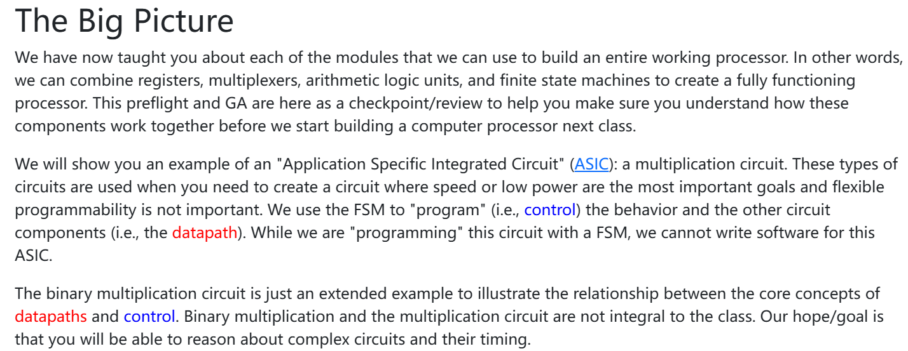

这段文本来自计算机硬件课程，介绍了如何通过组合不同的硬件模块（如寄存器、选择器、算术逻辑单元和有限状态机）来构建一个完整的处理器。具体内容如下：

1. **大图概念：**
    教程已经介绍了构建处理器所需的各个模块，包括寄存器、选择器、算术逻辑单元（ALU）和有限状态机（FSM）。这些模块可以结合起来，构建出一个功能完整的处理器。预习和课程的复习部分有助于学生理解这些模块如何协同工作，在下一节课开始构建处理器之前提供一个检查点。
2. **应用特定集成电路（ASIC）的例子：**
    课程将通过一个“应用特定集成电路”（ASIC）的例子来演示，具体是一个乘法电路。此类电路用于需要考虑速度或低功耗时，且不太需要灵活编程的场景。通过有限状态机（FSM）来“编程”电路的行为，控制其他电路组件，如数据路径。
3. **数据路径与控制：**
    在这个乘法电路的示例中，重点强调了数据路径（datapath）和控制（control）这两个核心概念之间的关系。虽然课程的重点不是二进制乘法电路的具体细节，但它们有助于学生理解更复杂电路的构建和时序控制。

总的来说，这段话讲解了如何通过有限状态机来控制硬件电路，帮助学生理解不同电路组件如何协作以及它们在处理器设计中的角色。

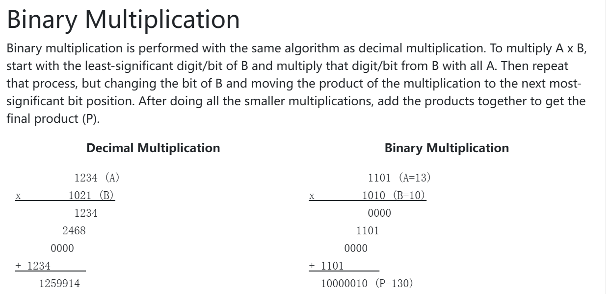

这段文字介绍了二进制乘法的基本原理，并通过与十进制乘法的对比来帮助理解。

**二进制乘法：** 二进制乘法的算法与十进制乘法相同。首先，从B的最低有效位（即最右边的位）开始，与A的每一位相乘。然后，按照B的下一个更高位，重复此过程。每次乘法得到的结果需要根据位的不同，按位移位（加到相应的位置）。完成所有小乘法后，将这些部分积累加起来，得到最终的乘积（P）。

**示例：**

1. **十进制乘法：**
   - 乘法数为1234（A）和1021（B）。
   - 通过逐位乘法，得到结果1259914。
2. **二进制乘法：**
   - 乘法数为1101（A = 13）和1010（B = 10），对应的二进制位分别为A和B。
   - 按照类似十进制的逐位乘法过程，得到结果10000010（二进制，P = 130）。

这段文字旨在解释二进制乘法与十进制乘法的相似之处，并通过一个二进制乘法的例子帮助理解计算过程。

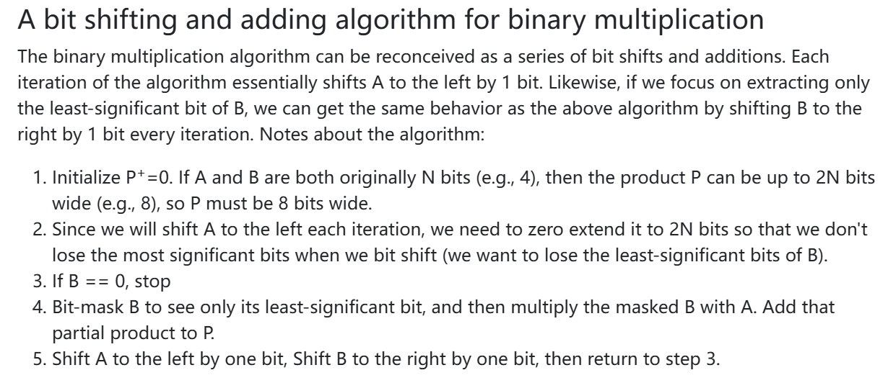

这段文字描述了一种二进制乘法的算法，通过位移和加法实现。这个算法将二进制乘法转换为一系列的位移操作和加法。每次迭代，算法将A左移1位，并通过提取B的最低有效位进行相应的操作。以下是该算法的步骤：

1. **初始化：**
    初始化乘积P = 0。如果A和B都原本是N位（例如4位），那么乘积P可以是2N位（例如8位）。
2. **位移扩展：**
    由于每次迭代都需要将A左移1位，为了避免在位移时丢失A的高位，P需要扩展为2N位，以确保不会丢失B的低位。
3. **判断B是否为0：**
    如果B为0，停止算法。这意味着已经完成所有必要的乘法。
4. **掩码B：**
    创建一个位掩码，用于提取B的最低有效位。然后将提取出的B与A相乘，并将结果加到部分乘积P中。
5. **左移A，右移B：**
    将A左移1位，将B右移1位，返回到步骤3，继续进行下一次迭代。

### 这段文字简要总结了一个基于位移操作和加法的二进制乘法算法。通过每次左移A并右移B，逐步完成乘法运算。

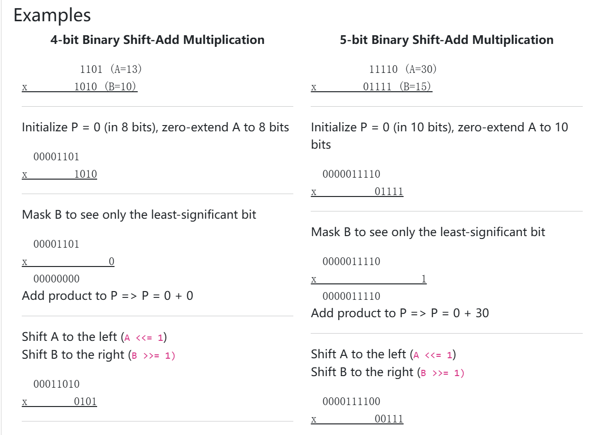


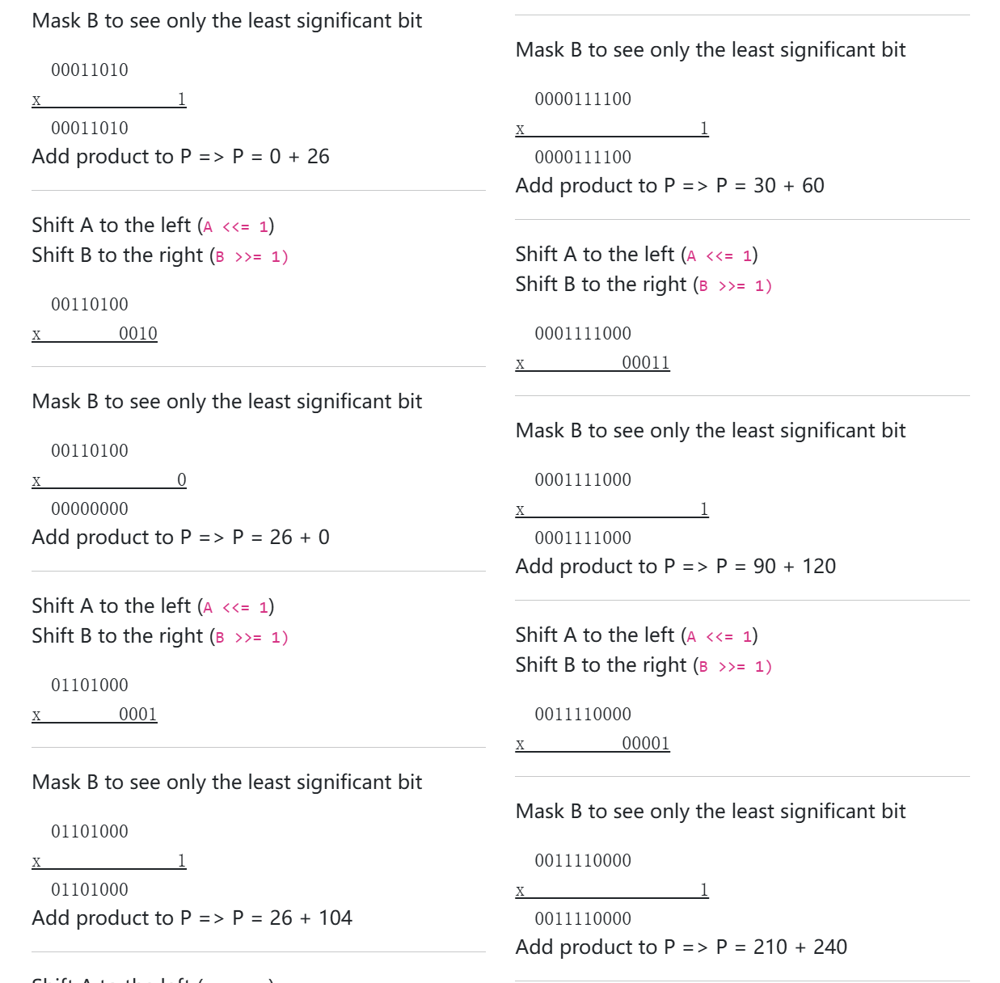

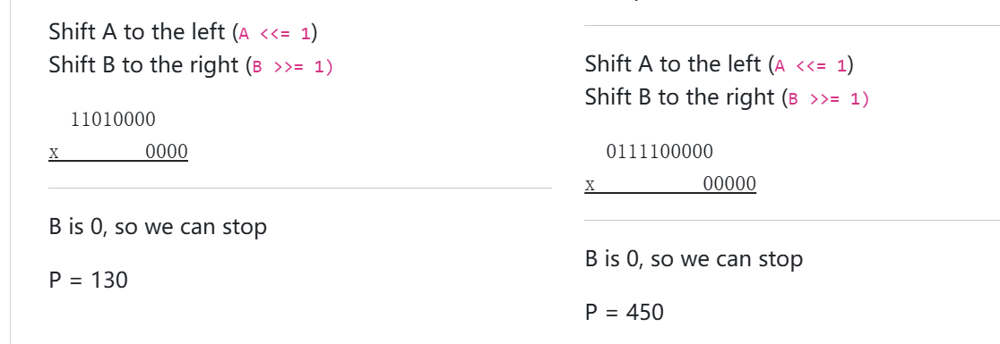

这些图示展示了使用二进制移位和加法算法进行乘法的具体步骤。在这些步骤中，A和B都在逐步进行位移操作，同时通过掩码操作处理B的最低有效位，并将部分积累加到最终乘积P中。以下是详细解释：

### **第一个示例（左侧）**

1. **初始步骤：**
   - A = 26（00011010），B = 6（00000110）。首先初始化P = 0，扩展A为8位（00011010）。
   - 掩码B，得到B的最低有效位是1。然后将A与B的最低位进行相乘，并将部分乘积加到P：P = 0 + 26。
2. **左移A和右移B：**
   - 将A左移1位（A <<= 1）：00011010 → 00110100。
   - 将B右移1位（B >>= 1）：00000110 → 00000011。
3. **掩码B：**
   - 掩码B，得到B的最低有效位是1。再将A与B的最低位相乘，并将部分乘积加到P：P = 26 + 60。
4. **继续左移A和右移B：**
   - 将A左移1位（A <<= 1）：00110100 → 01101000。
   - 将B右移1位（B >>= 1）：00000011 → 00000001。
5. **掩码B：**
   - 掩码B，得到B的最低有效位是1。将A与B的最低位相乘，再将部分乘积加到P：P = 60 + 120。
6. **继续位移：**
   - 将A左移1位（A <<= 1）：01101000 → 11010000。
   - 将B右移1位（B >>= 1）：00000001 → 00000000。
7. **停止：**
   - 因为B现在为0，停止操作。最终乘积P = 130。

### **第二个示例（右侧）**

1. **初始步骤：**
   - A = 30（00011110），B = 15（00001111）。首先初始化P = 0，扩展A为10位（0000011110）。
   - 掩码B，得到B的最低有效位是1。将A与B的最低位相乘，并将部分乘积加到P：P = 0 + 30。
2. **左移A和右移B：**
   - 将A左移1位（A <<= 1）：0000011110 → 0000111100。
   - 将B右移1位（B >>= 1）：00001111 → 00000111。
3. **掩码B：**
   - 掩码B，得到B的最低有效位是1。将A与B的最低位相乘，并将部分乘积加到P：P = 30 + 60。
4. **继续左移A和右移B：**
   - 将A左移1位（A <<= 1）：0000111100 → 0001111000。
   - 将B右移1位（B >>= 1）：00000111 → 00000011。
5. **掩码B：**
   - 掩码B，得到B的最低有效位是1。将A与B的最低位相乘，并将部分乘积加到P：P = 60 + 120。
6. **继续左移A和右移B：**
   - 将A左移1位（A <<= 1）：0001111000 → 0011110000。
   - 将B右移1位（B >>= 1）：00000011 → 00000001。
7. **掩码B：**
   - 掩码B，得到B的最低有效位是1。将A与B的最低位相乘，并将部分乘积加到P：P = 120 + 240。
8. **继续左移A和右移B：**
   - 将A左移1位（A <<= 1）：0011110000 → 0111100000。
   - 将B右移1位（B >>= 1）：00000001 → 00000000。
9. **停止：**
   - 因为B现在为0，停止操作。最终乘积P = 450。

### 总结：

这两个示例展示了如何使用位移和加法的算法来进行二进制乘法。在每个步骤中，通过掩码操作获取B的最低有效位，使用A与其相乘，然后根据需要继续左移A和右移B，直到B为0。最终的乘积就是所有部分积的累加。

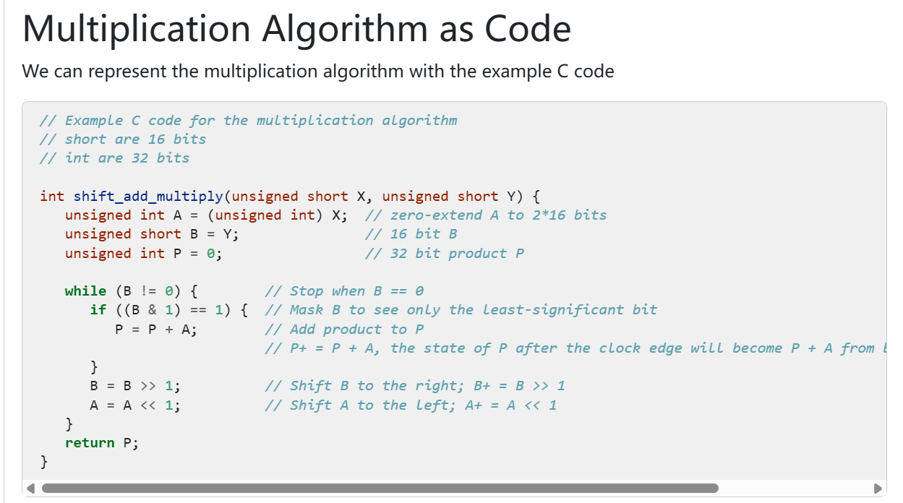

这段图示展示了用C语言表示二进制乘法的代码实现，使用的是移位加法算法。代码将展示如何通过位移和加法来执行二进制乘法。

### 代码解析：

1. **函数声明：**

   ```c
   int shift_add_multiply(unsigned short X, unsigned short Y) {
   ```

   - 这个函数接受两个参数`X`和`Y`，它们是16位的无符号短整型（`unsigned short`）。
   - 通过该函数，执行移位加法乘法算法，返回32位的乘积`P`。

2. **变量初始化：**

   ```c
   unsigned int A = (unsigned int) X;  // 将 A 扩展为 32 位
   unsigned short B = Y;  // 16 位的 B
   unsigned int P = 0;     // 32 位的乘积 P
   ```

   - `A`是将输入`X`扩展为32位，使用无符号整型（`unsigned int`）来保证A可以容纳16位的数值。
   - `B`直接取输入`Y`的值。
   - `P`初始化为0，用来存储最终的乘积。

3. **算法主循环：**

   ```c
   while (B != 0) {
   ```

   - 这是一个循环，直到B的值为0时停止。每次循环中会检查B的最低有效位，并根据这个位来决定是否将A加到乘积P中。

4. **掩码操作：**

   ```c
   if ((B & 1) == 1) {
       P = P + A;  // 如果B的最低有效位是1，则将A加到P中
   }
   ```

   - `B & 1`是对B进行位与操作，用于提取B的最低有效位。如果这个位是1，则将A的值加到P中。

5. **位移操作：**

   ```c
   B = B >> 1;  // 将B右移1位
   A = A << 1;  // 将A左移1位
   ```

   - 将B右移1位，相当于把B的每一位逐步向右移动，并且丢掉最低有效位。
   - 将A左移1位，相当于将A的每一位逐步向左移动，为下一次迭代做准备。

6. **返回乘积P：**

   ```c
   return P;  // 返回最终的乘积
   ```

   - 当B为0时，循环停止，最终返回乘积P。

### 总结：

这段代码实现了一个二进制乘法算法，通过位移和加法的方式完成乘法运算。每次通过掩码操作提取B的最低有效位，如果是1，则将A加到P中。然后对A和B分别进行左移和右移操作，直到B为0为止，最终返回乘积P。

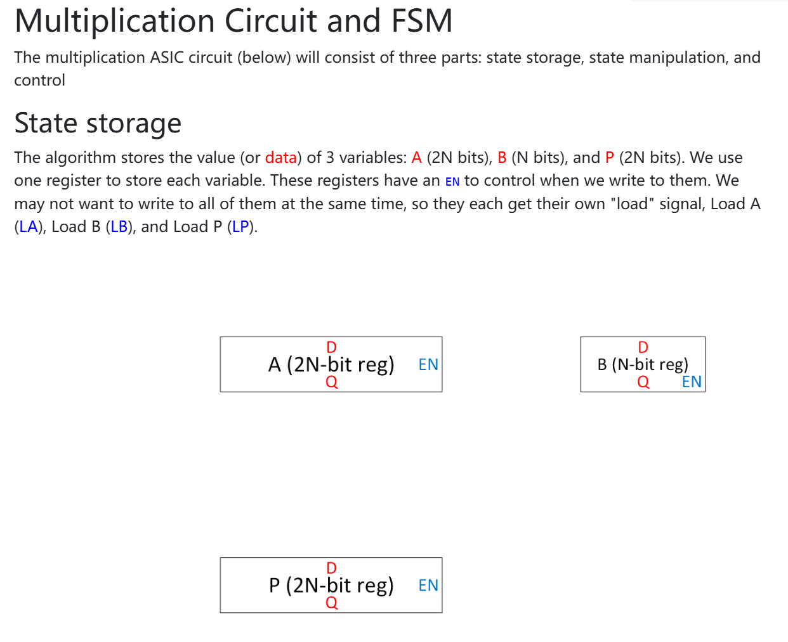

这张图描述了一个乘法ASIC电路的设计，展示了如何使用寄存器存储数据并控制其读取和写入。这个电路由三个主要部分组成：**状态存储**、**状态操作**和**控制**。具体解释如下：

### **状态存储（State Storage）**

算法中需要存储三种变量的值：

- **A**（2N位）
- **B**（N位）
- **P**（2N位）

为了存储这些数据，我们为每个变量分配了一个寄存器：

1. **A寄存器**（2N位）
2. **B寄存器**（N位）
3. **P寄存器**（2N位）

这些寄存器分别用来存储算法中使用的变量A、B和P的值。

### **寄存器的控制**

每个寄存器都有一个**使能（EN）**信号来控制是否允许将数据写入寄存器。此外，每个寄存器也有一个“加载（Load）”信号来决定何时写入数据。具体地，寄存器A、B和P有各自独立的加载信号：

- **Load A（LA）**：用来加载A寄存器的数据。
- **Load B（LB）**：用来加载B寄存器的数据。
- **Load P（LP）**：用来加载P寄存器的数据。

通过这些控制信号，系统可以选择性地将数据写入寄存器，而不是一次性写入所有寄存器，这提供了更灵活的数据存储和控制机制。

### 总结：

该设计展示了如何通过三个寄存器存储乘法算法中的关键数据，并通过使能和加载信号控制数据的写入。这种设计为后续的状态操作和控制提供了基础，使得乘法过程能够按照预定的顺序进行。

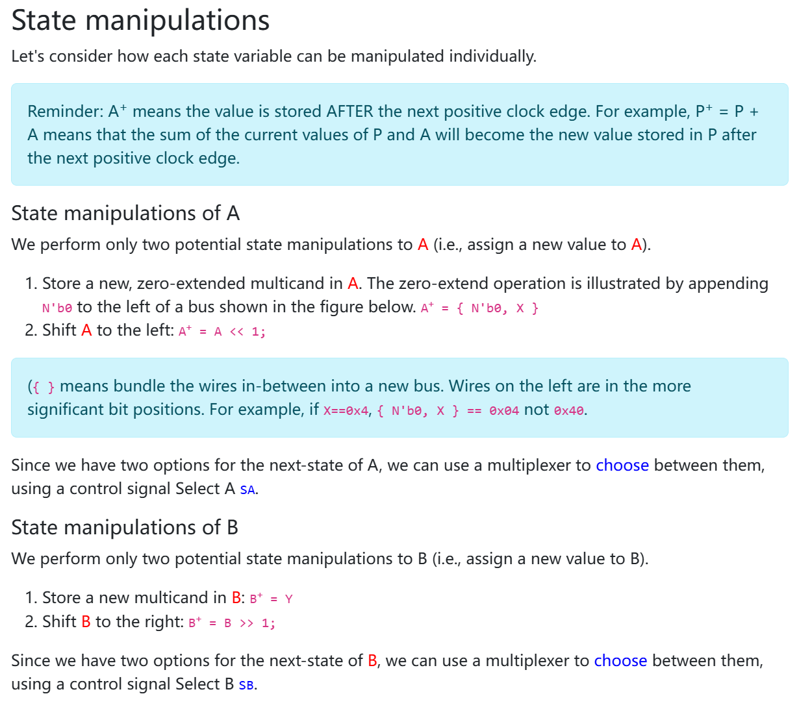

这段文字讲解了如何操作和修改算法中存储的状态变量（A、B和P），特别是如何在每个时钟周期后通过不同的操作来改变这些变量的值。以下是详细的解释：

### **概念提醒**

- **A⁺** 表示 A 的新值在下一个正向时钟边沿之后会被存储。比如，`P⁺ = P + A` 意味着当前的 P 和 A 相加的值将在下一个时钟边沿后存储到 P 中。

### **A的状态操作**

A 变量可以执行两种主要的状态操作：

1. **存储一个新的、零扩展的乘积到A**：
   - 零扩展操作通过将 `N'b0` 加到总线的左侧来实现。零扩展意味着将变量扩展为更高位，同时用0填充低位。具体表示为 `A⁺ = { N'b0, X }`。
   - 例如，如果 `X=0x4`，那么 `{ N'b0, X }` 将是 `0x04`，而不是 `0x40`。
2. **将A左移一位**：
   - 这种操作将A的所有位向左移动1位，相当于将A乘以2。表示为 `A⁺ = A << 1`。

由于在每个时钟周期后A有两个潜在的状态操作选择，可以使用**多路选择器**（multiplexer）来选择其中一个操作，使用控制信号 `Select A (SA)` 来选择。

### **B的状态操作**

B 变量可以执行两种主要的状态操作：

1. **存储一个新的乘积到B**：
   - 这是通过将新的值 `Y` 直接存储到B中，表示为 `B⁺ = Y`。
2. **将B右移一位**：
   - 这种操作将B的所有位向右移动1位，相当于将B除以2。表示为 `B⁺ = B >> 1`。

同样，B也有两个潜在的操作选择，可以使用**多路选择器**来选择其中一个操作，使用控制信号 `Select B (SB)` 来选择。

### 总结：

这段内容主要讲解了如何通过不同的操作来修改A和B的状态，并使用控制信号选择在每个时钟周期应该执行的操作。通过将A进行零扩展或左移，B进行存储或右移，这些操作为后续的计算提供了灵活的控制。

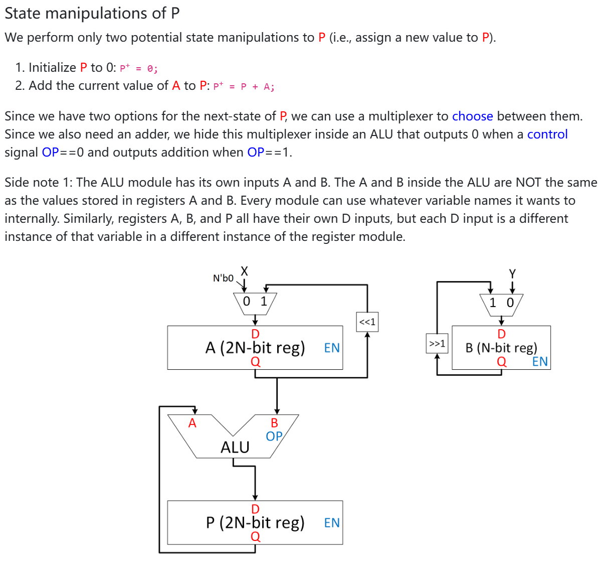

这段文字描述了如何操作存储在P寄存器中的值，具体来说是对P的两种可能的状态操作。

### **P的状态操作**

1. 将P初始化为0：
   - 这表示P的初始值为0，即 `P⁺ = 0`。
2. 将当前A的值加到P：
   - 这种操作表示将A的当前值加到P中，得到新的P值，公式为 `P⁺ = P + A`。

### **控制P的状态操作**

由于P的下一状态有两种选择，系统可以使用**多路选择器（Multiplexer）**来选择其中一个操作：

- 如果选择将P初始化为0，可以通过将控制信号设为 `OP == 0` 来实现。
- 如果选择将A的值加到P中，可以通过将控制信号 `OP == 1` 来使ALU模块执行加法操作。

### **ALU模块**

- **ALU** 是一个算术逻辑单元，它具有两个输入：A 和 B。在该电路中，A和B的值分别来自于A和B寄存器，但它们在ALU模块中的名字与寄存器中的变量不同。每个模块都可以在内部使用不同的变量名称。
- 在这个设计中，ALU模块有两个控制输入：
  - **A** 输入来自A寄存器。
  - **B** 输入来自B寄存器。
  - **OP** 输入是一个控制信号，用来决定ALU的操作。`OP == 0` 时，ALU输出0，表示不进行任何操作；`OP == 1` 时，ALU执行加法操作，将A和B的值相加。

### **寄存器与多路选择器**

- A寄存器和B寄存器都有各自的D输入，且它们在不同的寄存器实例中作为独立的变量输入。每个寄存器实例中的D输入不同，以便分别处理不同的A、B和P。
- 通过这个电路，P的更新操作是通过ALU模块和多路选择器来完成的。

### **总结**

这段内容描述了如何通过ALU和多路选择器控制P寄存器的更新操作。在每个时钟周期，P的值可以选择初始化为0或通过加法操作更新。多路选择器根据控制信号 `OP` 来决定执行哪种操作，并通过ALU来实现加法功能。

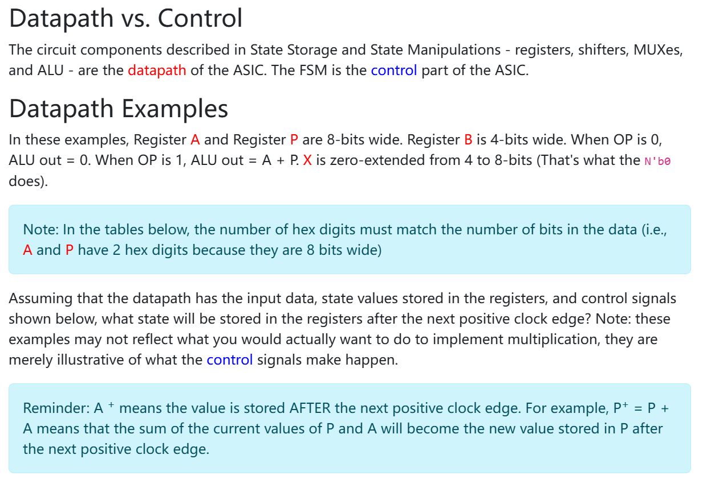

这段文字解释了**数据通路（Datapath）**与**控制（Control）**的区别，并介绍了数据通路的具体操作方式。以下是详细的解释：

### **数据通路与控制**

- **数据通路（Datapath）**指的是由寄存器、移位器、多路选择器（MUX）和算术逻辑单元（ALU）等组成的硬件组件，负责存储和传输数据。
- **控制（Control）**则是指由**有限状态机（FSM）**组成的部分，它负责生成控制信号，指导数据通路中的各个组件进行适当的操作。

### **数据通路示例**

在以下示例中：

- 寄存器 **A** 和 **P** 都是8位宽的寄存器，而寄存器 **B** 是4位宽的寄存器。
- 当控制信号 **OP** 为0时，ALU的输出 **ALU out** 为0。
- 当控制信号 **OP** 为1时，ALU执行加法操作，输出 **ALU out = A + P**。
- 另外， **X** 是一个从4位扩展到8位的零扩展值，这正是通过 `N'b0` 操作完成的。

### **注意事项**

- 在接下来的表格中，数据位的十六进制数字数量必须与寄存器数据的位数匹配。举例来说，A和P寄存器都使用2个十六进制数字表示，因为它们是8位宽的。

### **状态存储与控制**

假设数据通路已经拥有了输入数据、寄存器中存储的状态值以及控制信号，接下来要查看的是在下一个时钟正向边沿后，寄存器中将存储哪些新值。这些示例展示了控制信号如何作用于数据通路，并影响寄存器中的状态。

### **时钟与值更新**

- **A⁺** 表示 A 的新值将在下一个时钟正向边沿之后存储。举个例子，`P⁺ = P + A` 说明P的当前值与A相加的结果将在下一个时钟边沿之后更新到P中。

### **总结**

这段文字说明了数据通路和控制的区分，并通过示例阐述了如何通过控制信号影响数据通路的操作，具体展示了如何根据控制信号的不同，将不同的值存储在寄存器中。

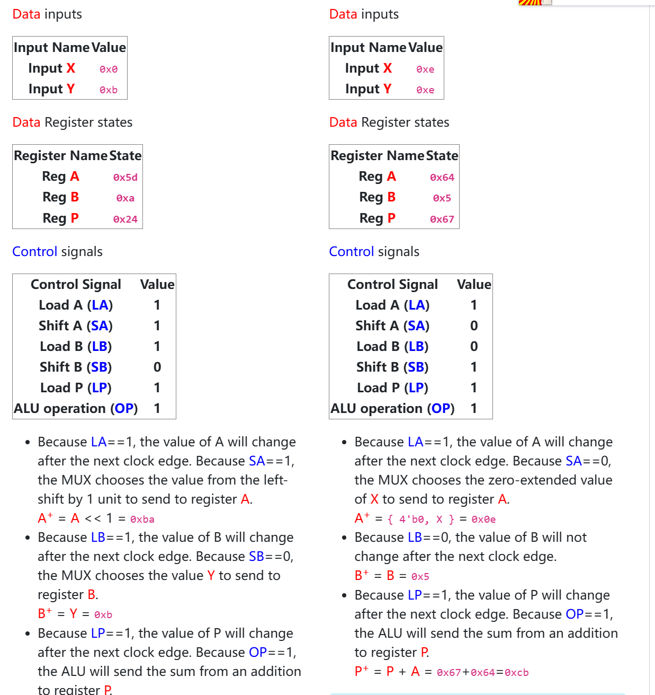

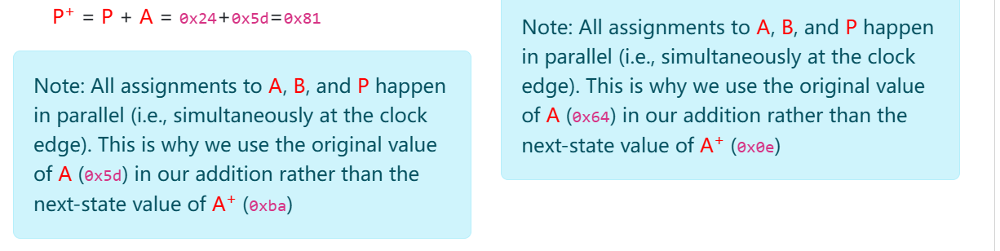

这段图示展示了一个数据通路的实例，通过设置不同的输入、寄存器状态和控制信号，演示了如何更新A、B和P寄存器的状态。以下是详细的解释：

### **数据输入**

1. X

    和 

   Y

    是输入数据：

   - 输入 **X** 的值是 `0x0`（十六进制）。
   - 输入 **Y** 的值是 `0xB`（十六进制）。

### **寄存器状态**

1. 寄存器 

   A

   、

   B

    和 

   P

    在初始状态时存储了以下值：

   - **A** 的初始值是 `0x5d`。
   - **B** 的初始值是 `0xa`。
   - **P** 的初始值是 `0x24`。

### **控制信号**

- **Load A (LA)** = 1: 这意味着A寄存器将在下一个时钟边沿时更新。
- **Shift A (SA)** = 1: 这意味着A寄存器的值会左移1位。
- **Load B (LB)** = 1: 这意味着B寄存器将在下一个时钟边沿时更新。
- **Shift B (SB)** = 0: 这意味着B寄存器的值不会右移。
- **Load P (LP)** = 1: 这意味着P寄存器将在下一个时钟边沿时更新。
- **ALU操作 (OP)** = 1: 这意味着ALU将执行加法操作。

### **操作解析**

1. **A的更新：**
   - 因为 **Load A (LA)** = 1，A的值将在下一个时钟边沿时更新。
   - 由于 **Shift A (SA)** = 1，MUX会选择左移后的A值（即A << 1），A的新值为 `0x5d << 1 = 0xba`。
2. **B的更新：**
   - **Load B (LB)** = 1，但由于 **Shift B (SB)** = 0，B的值不会右移。
   - B的值会变成输入Y的零扩展值，即 `B⁺ = 0xB`，因此B的新值为 `0x5`。
3. **P的更新：**
   - **Load P (LP)** = 1，且 **ALU操作 (OP)** = 1，所以P的值将在下一个时钟边沿时更新。
   - **P** 的新值通过加法操作得到，`P⁺ = P + A = 0x24 + 0x5d = 0x81`。

### **并行操作**

- 重要的是要注意，所有对A、B和P的赋值是**并行**进行的（即在同一个时钟边沿同时发生）。因此，`P⁺ = P + A` 是在P寄存器更新时使用的A的当前值，而不是A的下一个状态。

### **总结**

通过控制信号的设定，寄存器A、B和P的值会根据时钟信号和控制信号进行更新。所有的赋值操作都是并行进行的，在时钟的正向边沿同时发生。这种并行赋值是通过多路选择器（MUX）来实现的。

抱歉遗漏了右边那一列的例子。接下来我将解释右边这一列的操作：

### **数据输入**

1. X

    和 

   Y

    的值：

   - 输入 **X** 的值是 `0xe`（十六进制），即 `1110`（二进制）。
   - 输入 **Y** 的值是 `0xe`（十六进制），即 `1110`（二进制）。

### **寄存器状态**

1. 在此例中，寄存器 

   A

   、

   B

    和 

   P

    的初始值为：

   - **A** 的初始值是 `0x64`（十六进制）。
   - **B** 的初始值是 `0x5`（十六进制）。
   - **P** 的初始值是 `0x67`（十六进制）。

### **控制信号**

- **Load A (LA)** = 1: 这意味着A寄存器将在下一个时钟边沿时更新。
- **Shift A (SA)** = 0: 这意味着A寄存器不会左移。
- **Load B (LB)** = 0: 这意味着B寄存器在下一个时钟边沿不会更新。
- **Shift B (SB)** = 1: 这意味着B寄存器将右移1位。
- **Load P (LP)** = 1: 这意味着P寄存器将在下一个时钟边沿时更新。
- **ALU操作 (OP)** = 1: 这意味着ALU将执行加法操作。

### **操作解析**

1. **A的更新：**
   - 因为 **Load A (LA)** = 1，A的值将在下一个时钟边沿时更新。
   - **Shift A (SA)** = 0，MUX选择的是X的零扩展值 `X = 0xe`（4位扩展到8位），即 `A⁺ = {4'b0, X} = 0x0e`。
2. **B的更新：**
   - **Load B (LB)** = 0，因此B寄存器的值不会更新。
   - **Shift B (SB)** = 1，B将右移1位，`B⁺ = B >> 1 = 0x5 >> 1 = 0x2`。因此B的更新值为 `0x2`。
3. **P的更新：**
   - **Load P (LP)** = 1，且 **ALU操作 (OP)** = 1，所以P的值将在下一个时钟边沿时更新。
   - P的新值通过加法操作得到，`P⁺ = P + A = 0x67 + 0x0e = 0x7d`。

### **并行操作**

- 和左边的例子一样，这些操作是在同一个时钟边沿同时进行的，因此A、B和P的赋值是并行的：
  - A的赋值使用了当前的A值（`0x64`），即在加法操作中使用原值。
  - B的赋值使用了当前的B值，进行了右移操作。
  - P的赋值则是通过A和P的加法得到的。

### **总结**

在右侧的这个例子中：

- **A** 被设置为零扩展后的输入X的值，即 `A⁺ = 0x0e`。
- **B** 被右移了一位，更新为 `B⁺ = 0x2`。
- **P** 的新值是通过将A的当前值加到P的当前值上得到的，结果为 `P⁺ = 0x7d`。

同样，所有的操作都在时钟正向边沿并行进行。