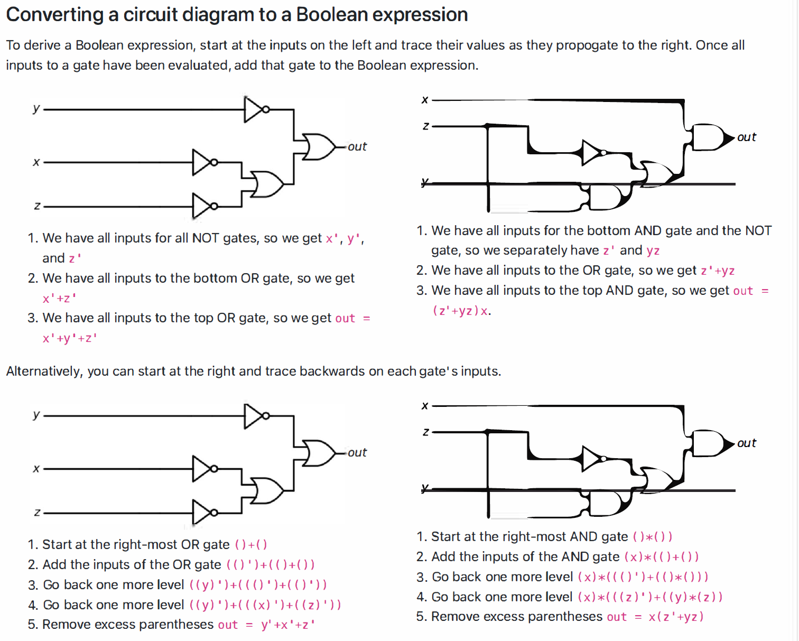

202412250001

后台姓名：刘澈
用户ID：121048
用户1V1昵称：刘澈
学生需求类型：知识点辅导,考前辅导
学生基础：一般
期望上课时间：尽快，具体可商议
学生DUE时间：暂时无
用户类型：1v1老用户
院校：UIUC
年级：大二
专业：未定
科目代码：cs233
科目名称：Computer Architecture
备注：需要讲的内容是下面的

这段文字提供了关于计算机硬件和编程中布尔运算的高层次概述。核心概念是，计算机硬件存储状态（例如在RAM中），然后操纵这些状态（例如执行计算）。状态信息以1和0的形式存储，需要使用布尔函数来操作这些状态。本课程要求学生能够在布尔代数表达式、真值表、电路图和Verilog硬件描述语言之间熟练转换。这四种表示方法在数学上是等价的，但在执行不同任务时可能更为方便。

在C语言等编程语言中，布尔运算符有两种不同的使用方式：位运算逻辑运算符和逻辑运算符。位运算逻辑运算符（如与（&）、或（|）、非（~）、异或（^））用于变量中的位对进行逻辑运算。而逻辑运算符（如与（&&）、或（||）、非（!））用于整个位字符串上，将0视为假（False）而将非0视为真（True）。位运算逻辑运算是我们用来构建更复杂计算的基础，例如加法和减法。逻辑运算通常用于控制结构如if语句或for循环中。注意，当我们说“逻辑运算符”时，我们不包括位运算逻辑运算符在内，就像我们在谈论算术运算符（如加法和减法）时不包括逻辑运算符一样。

这张图片展示了基本的布尔运算符：NOT、AND、OR、和XOR。对于每个运算符，图示包括了以下几个部分：

1. **函数表达式**：展示了每个布尔运算符的数学表达式。
2. **真值表**：列出了所有可能的输入组合及其对应的输出结果。
3. **电路图**：展示了实现每种布尔运算的逻辑门。
4. **Verilog代码**：给出了使用Verilog硬件描述语言实现每种布尔运算的示例代码。

### 各布尔运算符详解：

- **NOT** (非)
  - 表达式：f(x)=x′f(x) = x'
  - 真值表显示对单一输入位取反。
  - 电路图中使用的是一个带有单一输入的非门。
- **AND** (与)
  - 表达式：f(x,y)=x⋅yf(x, y) = x \cdot y
  - 真值表中，仅当两个输入都为1时输出为1。
  - 电路图中使用的是两输入的与门。
- **OR** (或)
  - 表达式：f(x,y)=x+yf(x, y) = x + y
  - 真值表中，如果至少有一个输入为1，则输出为1。
  - 电路图中使用的是两输入的或门。
- **XOR** (异或)
  - 表达式：f(x,y)=x⊕yf(x, y) = x \oplus y
  - 真值表中，仅当两个输入不相同时输出为1。
  - 电路图中使用的是两输入的异或门。

这些运算符是数字电路和计算机逻辑设计中的基础，用于创建更复杂的逻辑功能和处理数据。

这张图片提供了对基本布尔运算符（NOT、AND、OR）以及额外的XOR运算符的更详细解释，这些运算符是在数字逻辑设计中常用的。每个运算符的说明包括了真值表、代数表示、电路符号和Verilog代码表示方法：

1. **NOT（非）**:
   - **真值表**：输入为True或1时输出为False或0，反之亦然。
   - **代数表示**：使用 `'` 符号表示非操作，如 x′x'。
   - **电路符号**：一个带有输入箭头的三角形和输出侧的圆圈。
   - **Verilog表示**：`not(name(out, in));`
2. **AND（与）**:
   - **真值表**：仅当所有输入均为True或1时，输出才为True或1。
   - **代数表示**：使用相邻变量或乘号表示与操作，如 x⋅yx \cdot y 或 xyxy。
   - **电路符号**：带有输入箭头的"D"形状门。
   - **Verilog表示**：`and(name(out, in0, in1, ...));`
3. **OR（或）**:
   - **真值表**：任何一个输入为True或1时，输出为True或1。
   - **代数表示**：使用加号表示或操作，如 x+yx + y。
   - **电路符号**：带有输入箭头的箭头形状门。
   - **Verilog表示**：`or(name(out, in0, in1, ...));`
4. **XOR（异或）**：
   - **真值表**：输入数量为奇数个True或1时输出为True或1，偶数个则为False或0。
   - **代数表示**：使用 ⊕\oplus 符号，如 x⊕yx \oplus y。
   - **电路符号**：带有输入箭头的三角形和圆圈。
   - **Verilog表示**：`xor(name(out, in1, in2, ...));`

这些说明有助于理解如何在电路设计和编程中实现和使用这些基本的逻辑运算符。

这张图片详细介绍了如何将布尔表达式转换为Verilog代码。Verilog是一种用于描述电子系统的硬件描述语言（HDL），常用于数字电路和系统的设计和文档化。这个过程包括几个主要步骤：

1. **模块声明**：你首先需要声明一个Verilog模块，这包括输出和输入端口。例如，`module example(w, x, y, z);` 定义了一个名为 `example` 的模块，它接受三个输入 `x`、`y`、`z` 并输出一个 `w`。
2. **端口定义**：接下来，你需要定义所有输入和输出端口的类型。例如，`input x, y, z;` 定义了三个输入端口，`output w;` 定义了一个输出端口。此外，还需要定义内部连接使用的线（wires），如 `wire a1_out, a2_out, not_x;`。
3. **逻辑门实例化**：每个逻辑门需要在Verilog中实例化。这包括指定门类型、输出线、输入线等。例如：
   - `not(nx(not_x, x));` 表示一个非门，输入 `x`，输出 `not_x`。
   - `and(a1(a1_out, not_x, y, z));` 表示一个与门，输入 `not_x`、`y`、`z`，输出 `a1_out`。
4. **布尔表达式转换**：在模块内部，布尔表达式通过连接各个逻辑门来实现。例如，如果布尔表达式为 `w = x'yz`，则可以通过先对 `x` 取反，然后将结果与 `y` 和 `z` 进行与操作来实现。
5. **模块结束**：每个Verilog模块都以 `endmodule` 结束。

这张图片还建议在转换布尔表达式到Verilog代码之前，将表达式转换为电路图，这有助于清晰地识别所需的逻辑门和连接。此外，为逻辑门和变量命名应该是有意义的，以便于理解和维护代码。例如，不要只用 `nx` 或 `a1_out` 这样的名字，而是使用能描述其功能的名字。这种方法有助于在设计复杂电路时保持代码的可读性和可管理性。

这段文字描述了算术逻辑单元（ALU）在计算机处理器中的基本功能和作用。ALU 是处理器的一个核心部分，负责执行所有的算术运算和逻辑操作。这里的说明帮助读者理解 ALU 是如何工作的，以及它如何处理数据和控制信号来执行特定的操作。

### 主要内容解释：

1. **计算机的基本功能**：
   - 计算机可以做两件主要的事情：存储状态和操纵状态。在这里，状态指的是计算机内存储的数据。
2. **算术逻辑单元（ALU）的作用**：
   - ALU 被称为处理器的“主要肌肉”，因为它执行所有的算术和逻辑运算。
   - 它对输入的数据执行定义好的运算，如加法、与操作等。
3. **数据与控制**：
   - **数据**：ALU 处理的信息，比如操作数。在给出的例子中，ALU 处理如 A+BA + B 或 A&BA \& B 这样的操作，其中 A 和 B 是数据输入。
   - **控制**：控制信号决定 ALU 将对数据执行哪种操作。这些控制信号通过控制位来指示，例如，加法或逻辑与。
4. **实现**：
   - ALU 的设计采用模块化方法，可以构建1位算术单元和1位逻辑单元，并将这些单元链接起来以执行复杂的运算。
   - 为了帮助区分哪些线路用于数据传输哪些用于控制信号，不同颜色的标记被用于指示，例如数据用红色，控制用蓝色。

### 实际应用：

- 这段描述不仅解释了 ALU 的工作原理，还阐明了在设计和构建计算机架构时，如何通过控制和数据来指导 ALU 的行为。
- 理解 ALU 的运作对于学习计算机科学和电子工程的学生至关重要，因为它是理解更复杂的处理器操作和计算机性能的基础。

总的来说，这段文字提供了对 ALU 功能和重要性的宏观视角，并解释了它如何集成在更广泛的计算机系统中。

这张图片解释了二进制加法电路，包括半加器和全加器的设计和逻辑。这是理解数字逻辑和计算机工程基础概念的关键部分。下面是详细的步骤和解释：

### 半加器（Half Adder）

半加器是一个简单的数字逻辑电路，它可以计算两个一位二进制数的和。半加器的输出包括两部分：

1. **和（Sum, S）**：两个加数的和，不包括进位。
2. **进位（Carry, C）**：如果两个加数相加产生进位，则进位输出为1，否则为0。

#### 真值表

- **x 和 y** 是输入位，表示要相加的两个二进制数。
- **S** 是输出的和。
- **C** 是输出的进位。

| x    | y    | S (和) | C (进位) |
| ---- | ---- | ------ | -------- |
| 0    | 0    | 0      | 0        |
| 0    | 1    | 1      | 0        |
| 1    | 0    | 1      | 0        |
| 1    | 1    | 0      | 1        |

从真值表可以看出：

- 当两个输入位都是1时，和为0，进位为1。

### 全加器（Full Adder）

全加器是在半加器的基础上增加了对进位输入的处理，它可以计算两个一位二进制数及一个进位输入的总和。全加器的输出同样包括和与进位。

#### 真值表

- **x 和 y** 是输入位。
- **C_in** 是进位输入。
- **S** 是和输出。
- **C_out** 是进位输出。

| x    | y    | C_in | S (和) | C_out (进位) |
| ---- | ---- | ---- | ------ | ------------ |
| 0    | 0    | 0    | 0      | 0            |
| 0    | 0    | 1    | 1      | 0            |
| 0    | 1    | 0    | 1      | 0            |
| 0    | 1    | 1    | 0      | 1            |
| 1    | 0    | 0    | 1      | 0            |
| 1    | 0    | 1    | 0      | 1            |
| 1    | 1    | 0    | 0      | 1            |
| 1    | 1    | 1    | 1      | 1            |

从真值表可以看出：

- 当两个输入位和进位输入的总和为2或3时，进位输出为1。
- 和输出为这三个输入位的模2和。

### 电路设计的实际应用

- 半加器和全加器是构建更复杂的算术电路（如加法器、减法器、乘法器等）的基本组件。
- 这些加法器可以扩展到多位，用于实现完整的算术逻辑单元（ALU），ALU 能执行整个处理器所需的所有算术和逻辑操作。

通过理解和实现这些基本的数字电路，可以构建更复杂的电子系统和计算机架构，这是电子工程和计算机科学领域的基础。

这幅图展示了如何使用全加器（Full Adder）模块来构建多位二进制加法器，是数字电路设计中的一个重要应用。全加器是一个能同时处理两个二进制数位和一个进位输入，并产生一个和输出及一个进位输出的基本逻辑电路。下面详细解释这张图中展示的概念：

### 全加器（Full Adder）

- **全加器**能够处理两个一位的二进制数（x 和 y）和一个来自之前计算的进位输入（C_in）。
- 它输出一个和位（S）和一个进位输出（C_out）。
- 这个电路图简化了全加器的外观，标明了其输入和输出。

### N位二进制加法器

- 要执行多位数字的加法，可以将多个全加器连接起来，形成一个串行的加法器链。
- 每个全加器处理一对输入位和一个进位输入，产生一个和位和一个进位输出。下一个全加器将使用前一个全加器的进位输出作为其进位输入。

#### 如何构建

- **最低有效位（LSB）**的全加器的进位输入（C_in）通常设置为0，因为最开始没有进位。
- 每个后续的全加器接收前一个全加器的进位输出作为它的进位输入。
- 最高有效位（MSB）的全加器产生的进位输出是整个加法操作的最终进位输出。

### 示例

- 图中展示了如何用全加器构建4位和8位加法器。
- 对于4位加法器，有四个全加器，每个处理一对输入位。第一个全加器的C_in设置为0，每个全加器的C_out连接到下一个全加器的C_in。
- 8位加法器也是相似的构建方式，但使用了更多的全加器。

### 应用

- 这种类型的多位加法器在计算机的算术逻辑单元（ALU）中非常常见，ALU负责执行所有的算术计算。
- 多位加法器是执行加法、减法（通过二进制补码）、乘法和除法等操作的基础。

通过使用全加器链，可以有效地将简单的一位加法扩展到任意位宽的加法，这是数字逻辑和计算机工程中的一个基本技巧。这种方法不仅高效而且可以扩展，适用于从简单微控制器到复杂的处理器架构。

这幅图和说明讲解了复用器（Multiplexer, MUX）的设计和工作原理，是计算机硬件和数字电子领域的常见组件。复用器可以在多个数据输入中选择一个，并根据控制输入（选择线）输出所选的数据。

### 复用器的基本概念：

**复用器**（MUX）是一种数字开关，它允许根据选择输入（控制信号）将多个输入信号中的一个导向单个输出。这个设备在数字电路中用于数据路由，可以高效地处理多个数据源和单个处理单元之间的数据流。

### 具体细节：

#### 选择输入

- 复用器使用二进制编码的选择输入来确定哪个数据输入应被传送到输出。选择输入的位数由输入信号的数量决定，计算方法是 `log2(N)`，其中 N 是输入线的数量。

#### 输入/输出

- **4:1 MUX**：有四个数据输入（I0, I1, I2, I3）和两个选择输入（S1, S0）。这意味着它可以从四个输入中选择一个输出。
- **8:1 MUX**：有八个数据输入（从I0到I7）和三个选择输入（S2, S1, S0）。它可以从八个输入中选择一个输出。

### 行为表（Behavior Table）

- **行为表**显示了选择输入与输出之间的关系。例如，对于4:1 MUX，当选择输入为01时（S1=0, S0=1），输出将是I1。
- 对于8:1 MUX，当选择输入为011时（S2=0, S1=1, S0=1），输出将是I3。

### 应用

- 复用器广泛应用于各种电子系统中，包括数据选择、数据路由、资源共享等场景。它们是构建更复杂的逻辑系统、处理器的数据路径、通信设备等的基本组件。

### 示意图

- 示意图中显示了复用器的内部连接和如何通过选择信号控制数据流。这些图解有助于理解复用器如何根据控制信号的变化动态选择输入线。

通过理解复用器的工作原理，可以更好地设计和实现复杂的数字系统，优化数据处理和信号控制策略。

这张图解释了如何使用总线和N位宽的多路复用器（MUX）在数字电路中进行操作。总线是一组电线的集合，它们可以同时传输多位二进制数据，而N位宽的多路复用器则用于在这些数据总线上选择数据。下面是对图中内容的详细解释：

### 总线（Buses）

- **总线**是一个用来表示多个数据线的单一厚线或带有多线标记的线。例如，一个4位二进制数可以被存储在一个名为`A`的总线上，其中A[3:0]表示总线上的四个位，A[3]是最高有效位（MSB），A[0]是最低有效位（LSB）。

### N位宽MUX

- **N位宽的多路复用器**实际上是由多个单一的MUX构成，每个MUX处理输入总线上的一个位。这种设计允许对多个数据线进行相同的选择操作，使得可以基于单个控制信号选择多个并行数据位。
- 例如，如果你有两个总线`a`和`b`，每个总线都携带两位数据（a[1:0]和b[1:0]），你可以使用一个2位宽的MUX来选择这两个总线的哪一位在每个位位置上输出到结果总线`o[1:0]`。

### 图中示例

- 在图示中，我们看到两个单独的MUX，每个都处理一位输入：`a[0]`和`b[0]`输入到第一个MUX，`a[1]`和`b[1]`输入到第二个MUX。每个MUX都由单个选择信号`s`控制，这个信号决定从`a`或`b`的哪个位传输数据到输出`o`。
- 右侧的简化图显示了一个2位宽的MUX如何处理两位宽的输入。这是为了简化表示，实际上在电路中会有两个物理MUX，但在图纸或设计中我们可以用这种方式来表示它们处理多位信号的能力。

### 应用

- 这种N位宽的MUX配置非常适合于需要在多个数据源之间动态选择数据的场合，如在微处理器、数字信号处理和其他需要高度数据选择灵活性的电子系统中。
- 它使设计者能够在不改变物理连接的情况下，通过改变选择信号来改变数据路径，这在多功能电子设备或可重配置系统中尤其有用。

总的来说，使用总线和N位宽的MUX可以有效地管理和控制复杂电路中的数据流，增强电路设计的灵活性和功能性。

这幅图和描述展示了1位逻辑单元的设计与工作原理，以及如何利用这些单元来构建可以执行多种逻辑操作的更复杂的逻辑单元。这是数字逻辑设计和计算机架构的一个基本组件，特别是在实现处理器的数据路径时。

### 1位逻辑单元的概念

1位逻辑单元（1-bit logic unit）是一种可以对两个二进制输入进行简单逻辑操作的装置。常见的逻辑操作包括AND、OR、NOT、XOR等。这些单元可以独立操作一个数据位，通过复制这样的单元，可以创建处理多位宽数据的逻辑单元。

### 图中示例

#### 左侧的逻辑单元

- 展示了一个简单的逻辑单元，能够执行两种操作：NOT a 和 a AND b。
- 使用一个2输入多路复用器（MUX），根据选择信号s的值来选择输出。如果s为0，则输出NOT a；如果s为1，则输出a AND b。
- 这种设计模式可以通过扩展选择信号和增加更多的基本逻辑操作到MUX来灵活实现不同的逻辑功能。

#### 右侧的逻辑单元

- 展示了一个更复杂的逻辑单元，使用一个4输入的MUX，能够执行四种不同的逻辑操作：NOT a、a AND b、a OR b、和a XOR b。
- 选择信号s有两位（s1和s0），根据这两位的不同组合，从四种可能的逻辑操作中选择一种来输出。

### 底部的逻辑单元表格

- 表格详细说明了选择信号s的不同值对应的操作，这是构建一个能执行多种操作的逻辑单元的基础。

### 应用和优势

- 通过这种设计，可以构建出灵活的逻辑单元，能够根据需要在不同的逻辑操作之间快速切换。
- 这种方法在硬件设计中非常有效，因为它允许在不增加额外硬件成本的情况下，通过简单地改变控制信号来改变操作。这种设计特别适合于需要执行多种逻辑操作的处理器和复杂的数字系统。

总体而言，这种1位逻辑单元的设计强调了在数字逻辑和微处理器设计中如何有效地使用有限的资源来实现多功能和高效率的操作。通过将这些单元复制和扩展，可以构建出能处理整个数据字宽的复杂逻辑单元，这是现代计算机和数字设备中不可或缺的一部分。

这张图展示了一个算术逻辑单元（ALU）的设计，这是计算机中用于执行算术和逻辑操作的关键组件。在这个示例中，ALU 被设计为能够执行4位的加法和减法操作。图中解释了如何通过结合全加器（FA）、异或门（XOR）和多路复用器（MUX）来实现这些功能。

### 4位算术单元的组成：

- **全加器（FA）**：用于执行基本的二进制加法。每个全加器接受两个位（A 和 B）、一个进位输入（C_in），并产生一个和（S）和一个进位输出（C_out）。
- **异或门（XOR）**：在这个设计中，异或门用于在执行减法操作时生成B的补码（即实现B的一位取反）。
- **控制信号（Sub）**：这是一个控制信号，用于确定ALU应执行加法还是减法。
  - 当 `Sub=0` 时，ALU 执行加法操作，即 A + B。
  - 当 `Sub=1` 时，ALU 通过将B与1异或（即取补）并将结果与A相加来执行减法，基本上执行的是 A + (-B) = A - B。这通过将加法器的最低位的进位输入设置为1来实现，相当于加上B的补码后再加1（二进制补码减法）。

### 图中的连接和操作：

- **加法操作**：各位的A和B直接输入到各自的全加器。
- **减法操作**：每一位的B通过一个XOR门，这个门还接收控制信号Sub。当Sub=1时，XOR输出B的逻辑反（取反），实现补码。
- **多路复用器（MUX）**：虽然在此图中没有明确显示MUX，但ALU中的选择逻辑可以视为隐含的多路复用，决定是直接传递B还是其补码到加法器。

### 输出说明：

- 每个全加器的输出S是结果位，而最高位全加器的C_out是最终的进位或借位，可能表明溢出或需要额外的注意。

### 实际应用：

这样的ALU设计非常关键，因为它允许计算机执行基本的算术操作，这是所有计算任务的核心。它也展示了硬件设计中如何使用数字逻辑门和组件来执行复杂的操作，如算术运算和逻辑判断，这些是编程和软件应用的物理基础。

这张图展示的是一个1位算术逻辑单元（ALU）的设计，该设计能够根据控制信号执行不同的算术和逻辑运算。让我们逐步解析这个1位ALU的工作原理和它如何根据输入信号执行不同操作：

### 基本组成

- **ALU由两个主要部分组成**：一个算术单元和一个逻辑单元。
- **算术单元**负责执行基本的算术操作，如加法。
- **逻辑单元**负责执行基本的逻辑操作，如AND、OR、XOR等。

### 控制信号

- ALU使用多路选择器（MUX）来根据控制信号选择执行算术操作或逻辑操作。

- 控制信号 `c[1:0]`

   决定了要执行的具体操作，如下所示：

  - `00`：执行AND运算
  - `01`：执行OR运算
  - `10`：执行NOR运算
  - `11`：执行XOR运算

### 运算示例

- **加法运算 (`010`)**：如果控制信号设置为加法，输入A和B通过全加器（Full Adder, FA）相加，输出和（S）和进位（Cout）。
- **补码加法 (`011`)**：对于执行A和B的补码加法（通常用于减法），ALU计算A + (~B)。通常需要外部添加1来完成减法操作。

### 逻辑运算

- 根据控制信号，逻辑单元可以选择A和B的不同逻辑操作。
- **全加器和逻辑单元的输出通过另一个多路选择器来选择最终输出。** 这允许ALU根据需要灵活地提供算术或逻辑操作的结果。

### 实用性

- 这样的设计允许1位ALU可以根据控制信号灵活地处理多种类型的运算，这对于构建更复杂的多位ALU是必需的。
- 多位ALU通常通过并行连接多个这样的1位ALU模块来构建，以便能处理更大宽度的数据。

### 特殊注意

- **控制信号** `000` 和 `001` 在行为表中被标记为未定义，这意味着这些控制信号的具体行为可能没有被特别指定，或者不被当前ALU设计直接支持。

通过这样的配置，ALU能够在微处理器内部进行快速且灵活的数据处理，支持复杂的计算和逻辑决策，是现代计算机架构的关键组成部分。

在您提供的1位算术逻辑单元（ALU）设计中，`control[2]` 是一个额外的控制位，用于在算术单元和逻辑单元之间进行选择：

- **`control[2] = 0`**：这表示ALU应该使用逻辑单元的输出。在这种情况下，`control[0]` 和 `control[1]` 一起决定执行哪种逻辑操作（如AND、OR、NOR、XOR）。
- **`control[2] = 1`**：这表示ALU应该使用算术单元的输出。这通常涉及加法或通过使用补码实现的减法操作。

简单来说，`control[2]` 的设置直接影响ALU是进行算术运算还是逻辑运算。这种设计允许ALU不仅在处理逻辑问题时具有灵活性，还能执行基本的算术运算，使其成为处理各种计算任务的强大工具。通过这种方式，ALU可以根据程序的需求调整其行为，有效地支持更广泛的操作和更复杂的程序逻辑。

这幅图展示了如何通过将多个1位ALU（算术逻辑单元）级联来构建一个N位ALU，例如32位ALU。这种设计使得每个1位ALU可以独立处理输入信号A和B的一个位，并通过控制信号来协调所有这些1位ALU的操作。

### 设计解析：

1. **级联连接**：每个1位ALU都有两个输入（A和B），一个进位输入（C_in），一个结果输出（out），以及一个进位输出（C_out）。进位输出连接到下一个1位ALU的进位输入，形成级联结构。
2. **控制信号**：所有1位ALU共享相同的控制信号，使得整个32位ALU可以统一进行操作，如加法、减法、与运算等。
3. **最低有效位的特殊处理**：最低有效位的ALU（A0, B0）接收一个额外的控制信号，这通常用于实现加法和减法。对于减法，通过控制信号使得最低位ALU接收一个初始进位值（通常是1），这实质上将B的每一位取反（补码减法的一部分）。
4. **输出**：每个1位ALU的输出连接形成整个32位的输出。这种模块化的设计允许灵活配置每个单元，实现复杂的逻辑和算术功能。

### 控制信号与行为：

- **control[2:0]**：这是用于定义ALU操作的控制信号。这些信号决定ALU将执行的操作（如加法、减法、逻辑运算等）。
- **未定义的控制**：对于某些控制信号配置（如000和001），行为被标记为“未定义”，这意味着在这些特定控制信号下ALU的输出没有被明确定义，可能是因为这些配置不用于常规操作或者在实际应用中不被使用。

这种设计使得ALU能够在一个统一的架构下处理多种逻辑和算术操作，同时保持高效和可扩展性，适用于不同的计算需求。