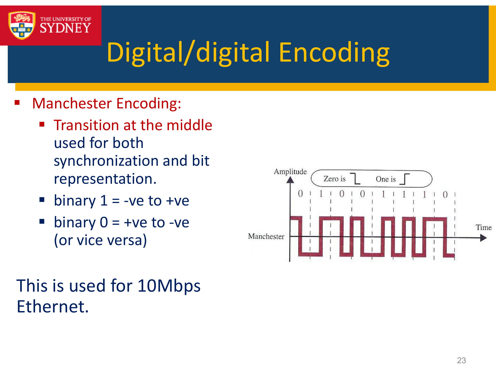
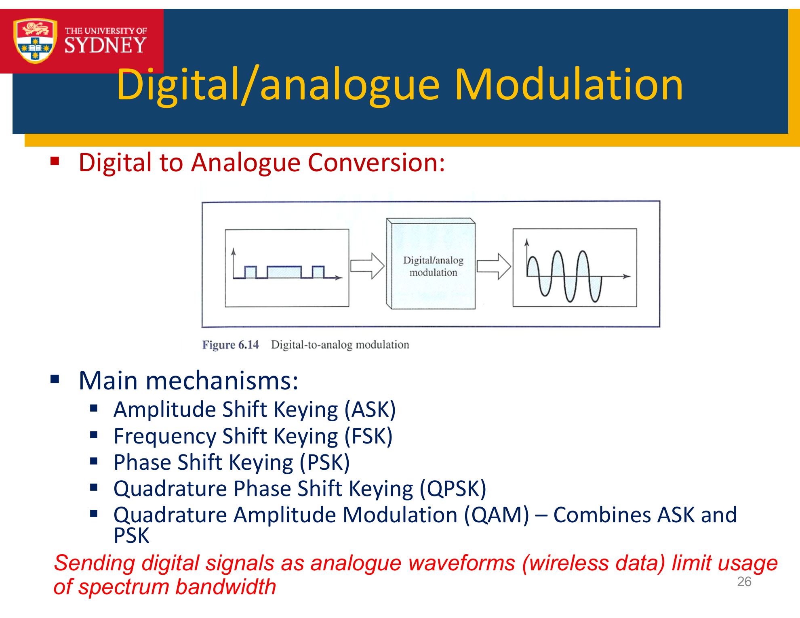
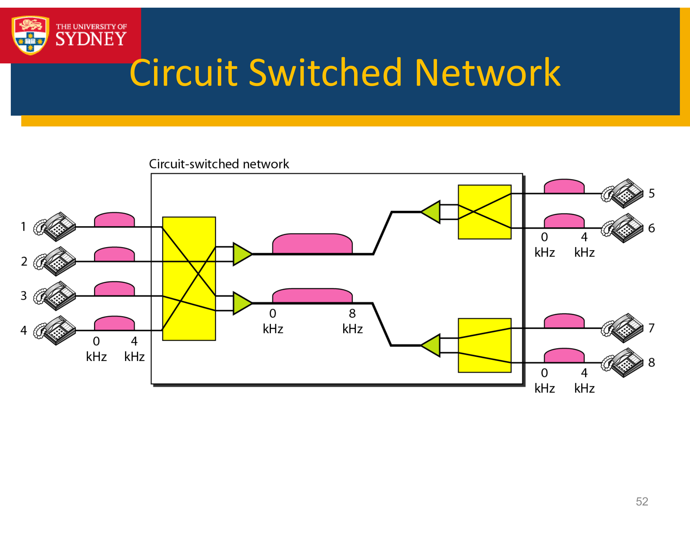

---

## 第 1 页


下面这张截图是某门通信网络课程的第 2 次课（Lecture 2）的开场标题页。关键信息如下：

* 课程主题：**Physical Layer（物理层）**
* 课程编号与名称：**ELEC 3506/9506 – Communication Networks（通信网络）**
* 授课教师：**Dr Wibowo Hardjawana**
* 学院：**School of Electrical and Information Engineering（电气与信息工程学院）**
* 学校：**The University of Sydney（悉尼大学）**

也就是说，这一讲将围绕 OSI 参考模型/因特网协议栈中最底层——**物理层**展开。你可以把这张首页当作本节课的“导语页”。

---

# 你可以直接拿去讲的详尽讲稿大纲

## 1. 物理层在网络体系中的位置与职责

* **位置**：OSI 第 1 层（在数据链路层之下）。
* **职责一句话**：把比特（0/1）通过**物理媒介**（铜线、光纤、无线电波）可靠地传出去。
* **它不管什么**：不处理“帧/包的边界、MAC 地址、重传”等（那些属于**数据链路层**及以上）。
* **它要管什么**：信号表示、编码/调制、同步、速率与带宽、介质与接口、电气/光学/射频参数、物理拓扑与连接器等。

> 教学提示：用“快递类比”开场——物理层像“道路+路面标线”，只负责车能跑、跑得稳；送什么货、到谁家是上层的事。

---

## 2. 信号与比特：从 0/1 到“可以在介质里跑的东西”

* **模拟信号 vs 数字信号**：

* 模拟：幅度/频率连续变化（如无线正弦波）。
* 数字：离散电平（如以太网双绞线上的高/低电平）。
* **关键物理量**：幅度、频率、相位、功率、谱（频谱）。
* **带宽（Bandwidth, B）**：可用频率范围的宽度（Hz），限制了信号变化速度。
* **数据率（bit/s）**与**波特率（baud）**：每秒比特数 vs 每秒符号数（调制阶数 M>2 时，1 baud 可承载 log₂M 个比特）。

---

## 3. 信道极限：Nyquist 与 Shannon 两个“天花板”

* **无噪声、受带宽限制（奈奎斯特）**：

$$
R_\text{max} = 2B \log_2 M
$$

B 为带宽，M 为每个符号可区分的电平/状态数（调制阶数）。
* **有噪声（香农）**：

$$
C = B \log_2(1 + \text{SNR})
$$

C 为信道容量（bit/s），SNR 为信噪比（线性值）。
* **直观理解**：带宽像“车道数”，SNR 像“能见度/噪声水平”。车道越多、能见度越好，单位时间通过的车（比特）就越多。

> 演示建议：给学生一个例子——在 B=10 MHz、SNR=10（≈10 dB）时，C≈33 Mbps；看看改成 20 MHz 或 SNR=20 会怎样。

---

## 4. 物理层“把比特变成信号”的手段

### 4.1 线码（Line Coding，基带传输）

* 常见方案：**NRZ-L/NRZ-I、曼彻斯特、差分曼彻斯特、4B5B、8B10B、MLT-3** 等。
* 关注点：**直流分量**、**自同步性**、**频谱占用**、**误码敏感性**、**基线漂移**。
* 举例：以太网早期 10BASE-T 用曼彻斯特；千兆以太网使用更高效的 8B10B/64B66B（配合更复杂的物理层子层）。

### 4.2 调制（Passband，上变频传输）

* **ASK/FSK/PSK/QAM**（如 QPSK、16/64/256-QAM）。
* 关系：更高阶的 QAM ⇒ 每符号承载更多比特 ⇒ 对 SNR 要求更高。
* 无线与有线（如 DOCSIS、有线电视）都大量使用 QAM。

### 4.3 同步与时钟恢复

* **为何重要**：接收端需要在正确的时间“采样”符号中心。
* 手段：自同步线码、前导训练序列（preamble）、锁相环（PLL）等。

---

## 5. 传输介质与物理特性

* **双绞线（UTP/STP）**：便宜、易铺设；抗串扰靠“绞合”；以太网常用，易受电磁干扰、距离受限（典型 100 m）。
* **同轴电缆**：屏蔽更好，带宽较高，用于有线电视、部分工业场景。
* **光纤（单模/多模）**：超高带宽、低衰减、抗电磁干扰，成本与施工要求较高，器件（激光、探测器）精密。
* **无线**：以电磁波为媒介，受多径、衰落、路径损耗、法规频谱限制影响；需要链路预算与天线设计。

> 三大损伤：**衰减（Attenuation）**、**失真/色散（Distortion/Dispersion）**、**噪声（Noise：热噪声、串扰、散粒噪声、外界干扰）**。

---

## 6. 物理层中的关键“工程数值”

* **衰减**：以 dB 表示，级联链路可直接相加。
* **SNR（dB）**：$\text{SNR}_{\text{dB}} = 10\log_{10}(P_s/P_n)$。
* **接收灵敏度**：设备能“判决”为 1/0 的最低可用功率。
* **链路预算（Link Budget）**：发射功率 − 各种损耗 + 天线增益 ≥ 接收灵敏度。
* **时延**：传播时延（距离/介质速度）+ 排队 + 处理 + 传输时延。
* **吞吐量 vs 带宽**：物理层最大速率 ≠ 端到端有效吞吐量（受上层开销、协议效率、重传等影响）。

---

## 7. 复用与共享介质（物理层/物理子层常见主题）

* **FDM**（频分复用）、**TDM**（时分复用）、**WDM**（波分，光纤）、**CDM**（码分，多用于蜂窝/卫星）。
* **介质访问**的基本概念：共享链路需要上层（链路层）配合的 MAC（如 CSMA/CD、CSMA/CA），但物理层提供能实现这些机制的**定时与检测能力**（载波侦听、能量检测）。

---

## 8. 标准与实例

* **以太网 PHY**：10BASE-T、100BASE-TX、1000BASE-T、10GBASE-SR/LR 等（不同速率、介质、距离）。
* **Wi-Fi PHY**：IEEE 802.11a/b/g/n/ac/ax；OFDM/OFDMA、MIMO、QAM 阶数的演进。
* **接口与连接器**：RJ-45、SFP/SFP+、QSFP、光纤连接器（LC/SC）、天线接口（SMA/TS9 等）。

---

## 9. 课堂小例题（可直接投屏演算）

1. **Shannon 容量**：B=5 MHz，SNR=15 dB（≈31.62）。

$$
C = 5\times10^6 \log_2(1+31.62) \approx 5\times10^6 \times 5.03 \approx 25.1\ \text{Mbps}
$$
2. **奈奎斯特上限**：基带信道 B=1 MHz，用 4 电平 PAM（M=4）。

$$
R_\text{max} = 2B\log_2 M = 2\times10^6\times2 = 4\ \text{Mbps}
$$
3. **链路预算**（简化）：发射 0 dBm，经 100 m 双绞线损耗 14 dB，接收天线/前端增益 3 dB，
接收功率 = 0 − 14 + 3 = **−11 dBm**，若设备灵敏度为 −15 dBm，则可工作但裕量 4 dB。

---

## 10. 易混点澄清

* **物理层不做错误纠正/重传**：这主要在数据链路层（FCS/CRC、ARQ）与更高层实现；物理层可能做**前向纠错 FEC**（如 LDPC、卷积码）来降低误码率，但不做“协议重传”。
* **“带宽”在物理层是频谱宽度**，与“上层口语的带宽=速率”要区分。
* **更高阶调制 ≠ 必然更高吞吐**：SNR 不足时误码率高，反而降速；这就是自适应调制编码（AMC）的动机。

---

## 11. 课堂活动/演示建议

* **示波器/频谱图动画**：展示 NRZ/曼彻斯特 与 QAM 星座图的差异。
* **“绳子比喻”实验**：用弹簧/绳子演示频率越高越易衰减（介质色散）。
* **噪声与 SNR 直观演示**：播放加入白噪声的音频，体会“1+SNR”的意义。
* **分组讨论**：不同场景选介质（机房上联、园区网楼宇间、室外长距离、移动终端），说出理由与参数。

---

## 12. 结尾总结（可直接念）

* 物理层的使命：**把比特变成信号并安全穿过介质**。
* 性能受两大“硬约束”：**带宽**与**SNR**（Nyquist/Shannon）。
* 工程实现依赖：**合适的编码/调制、同步、合规的介质与接口**。
* 牢记边界：**物理层 ≠ 链路层**，但两者紧密协作以达成“可靠、可扩展的链路”。

---

## 13. 课后练习（布置作业用）

1. 某光纤链路 B=12.5 GHz，SNR=20 dB，估算 Shannon 上限速率。
2. 比较 NRZ 与 曼彻斯特在线谱、自同步性、有效比特率上的差异。
3. 设计一条 1 Gbps 的园区网楼宇间链路：选择介质、连接器、最大距离、链路预算与冗余方案。

---

需要我把上面的内容整理成**可打印的讲义/课件**（PPT 或 PDF）吗？我可以直接生成文件给你下载。


---

## 第 2 页


下面这张截图是某门通信网络课程的第 2 次课（Lecture 2）的开场标题页。关键信息如下：

* 课程主题：**Physical Layer（物理层）**
* 课程编号与名称：**ELEC 3506/9506 – Communication Networks（通信网络）**
* 授课教师：**Dr Wibowo Hardjawana**
* 学院：**School of Electrical and Information Engineering（电气与信息工程学院）**
* 学校：**The University of Sydney（悉尼大学）**

也就是说，这一讲将围绕 OSI 参考模型/因特网协议栈中最底层——**物理层**展开。你可以把这张首页当作本节课的“导语页”。

---

# 你可以直接拿去讲的详尽讲稿大纲

## 1. 物理层在网络体系中的位置与职责

* **位置**：OSI 第 1 层（在数据链路层之下）。
* **职责一句话**：把比特（0/1）通过**物理媒介**（铜线、光纤、无线电波）可靠地传出去。
* **它不管什么**：不处理“帧/包的边界、MAC 地址、重传”等（那些属于**数据链路层**及以上）。
* **它要管什么**：信号表示、编码/调制、同步、速率与带宽、介质与接口、电气/光学/射频参数、物理拓扑与连接器等。

> 教学提示：用“快递类比”开场——物理层像“道路+路面标线”，只负责车能跑、跑得稳；送什么货、到谁家是上层的事。

---

## 2. 信号与比特：从 0/1 到“可以在介质里跑的东西”

* **模拟信号 vs 数字信号**：

* 模拟：幅度/频率连续变化（如无线正弦波）。
* 数字：离散电平（如以太网双绞线上的高/低电平）。
* **关键物理量**：幅度、频率、相位、功率、谱（频谱）。
* **带宽（Bandwidth, B）**：可用频率范围的宽度（Hz），限制了信号变化速度。
* **数据率（bit/s）**与**波特率（baud）**：每秒比特数 vs 每秒符号数（调制阶数 M>2 时，1 baud 可承载 log₂M 个比特）。

---

## 3. 信道极限：Nyquist 与 Shannon 两个“天花板”

* **无噪声、受带宽限制（奈奎斯特）**：

$$
R_\text{max} = 2B \log_2 M
$$

B 为带宽，M 为每个符号可区分的电平/状态数（调制阶数）。
* **有噪声（香农）**：

$$
C = B \log_2(1 + \text{SNR})
$$

C 为信道容量（bit/s），SNR 为信噪比（线性值）。
* **直观理解**：带宽像“车道数”，SNR 像“能见度/噪声水平”。车道越多、能见度越好，单位时间通过的车（比特）就越多。

> 演示建议：给学生一个例子——在 B=10 MHz、SNR=10（≈10 dB）时，C≈33 Mbps；看看改成 20 MHz 或 SNR=20 会怎样。

---

## 4. 物理层“把比特变成信号”的手段

### 4.1 线码（Line Coding，基带传输）

* 常见方案：**NRZ-L/NRZ-I、曼彻斯特、差分曼彻斯特、4B5B、8B10B、MLT-3** 等。
* 关注点：**直流分量**、**自同步性**、**频谱占用**、**误码敏感性**、**基线漂移**。
* 举例：以太网早期 10BASE-T 用曼彻斯特；千兆以太网使用更高效的 8B10B/64B66B（配合更复杂的物理层子层）。

### 4.2 调制（Passband，上变频传输）

* **ASK/FSK/PSK/QAM**（如 QPSK、16/64/256-QAM）。
* 关系：更高阶的 QAM ⇒ 每符号承载更多比特 ⇒ 对 SNR 要求更高。
* 无线与有线（如 DOCSIS、有线电视）都大量使用 QAM。

### 4.3 同步与时钟恢复

* **为何重要**：接收端需要在正确的时间“采样”符号中心。
* 手段：自同步线码、前导训练序列（preamble）、锁相环（PLL）等。

---

## 5. 传输介质与物理特性

* **双绞线（UTP/STP）**：便宜、易铺设；抗串扰靠“绞合”；以太网常用，易受电磁干扰、距离受限（典型 100 m）。
* **同轴电缆**：屏蔽更好，带宽较高，用于有线电视、部分工业场景。
* **光纤（单模/多模）**：超高带宽、低衰减、抗电磁干扰，成本与施工要求较高，器件（激光、探测器）精密。
* **无线**：以电磁波为媒介，受多径、衰落、路径损耗、法规频谱限制影响；需要链路预算与天线设计。

> 三大损伤：**衰减（Attenuation）**、**失真/色散（Distortion/Dispersion）**、**噪声（Noise：热噪声、串扰、散粒噪声、外界干扰）**。

---

## 6. 物理层中的关键“工程数值”

* **衰减**：以 dB 表示，级联链路可直接相加。
* **SNR（dB）**：$\text{SNR}_{\text{dB}} = 10\log_{10}(P_s/P_n)$。
* **接收灵敏度**：设备能“判决”为 1/0 的最低可用功率。
* **链路预算（Link Budget）**：发射功率 − 各种损耗 + 天线增益 ≥ 接收灵敏度。
* **时延**：传播时延（距离/介质速度）+ 排队 + 处理 + 传输时延。
* **吞吐量 vs 带宽**：物理层最大速率 ≠ 端到端有效吞吐量（受上层开销、协议效率、重传等影响）。

---

## 7. 复用与共享介质（物理层/物理子层常见主题）

* **FDM**（频分复用）、**TDM**（时分复用）、**WDM**（波分，光纤）、**CDM**（码分，多用于蜂窝/卫星）。
* **介质访问**的基本概念：共享链路需要上层（链路层）配合的 MAC（如 CSMA/CD、CSMA/CA），但物理层提供能实现这些机制的**定时与检测能力**（载波侦听、能量检测）。

---

## 8. 标准与实例

* **以太网 PHY**：10BASE-T、100BASE-TX、1000BASE-T、10GBASE-SR/LR 等（不同速率、介质、距离）。
* **Wi-Fi PHY**：IEEE 802.11a/b/g/n/ac/ax；OFDM/OFDMA、MIMO、QAM 阶数的演进。
* **接口与连接器**：RJ-45、SFP/SFP+、QSFP、光纤连接器（LC/SC）、天线接口（SMA/TS9 等）。

---

## 9. 课堂小例题（可直接投屏演算）

1. **Shannon 容量**：B=5 MHz，SNR=15 dB（≈31.62）。

$$
C = 5\times10^6 \log_2(1+31.62) \approx 5\times10^6 \times 5.03 \approx 25.1\ \text{Mbps}
$$
2. **奈奎斯特上限**：基带信道 B=1 MHz，用 4 电平 PAM（M=4）。

$$
R_\text{max} = 2B\log_2 M = 2\times10^6\times2 = 4\ \text{Mbps}
$$
3. **链路预算**（简化）：发射 0 dBm，经 100 m 双绞线损耗 14 dB，接收天线/前端增益 3 dB，
接收功率 = 0 − 14 + 3 = **−11 dBm**，若设备灵敏度为 −15 dBm，则可工作但裕量 4 dB。

---

## 10. 易混点澄清

* **物理层不做错误纠正/重传**：这主要在数据链路层（FCS/CRC、ARQ）与更高层实现；物理层可能做**前向纠错 FEC**（如 LDPC、卷积码）来降低误码率，但不做“协议重传”。
* **“带宽”在物理层是频谱宽度**，与“上层口语的带宽=速率”要区分。
* **更高阶调制 ≠ 必然更高吞吐**：SNR 不足时误码率高，反而降速；这就是自适应调制编码（AMC）的动机。

---

## 11. 课堂活动/演示建议

* **示波器/频谱图动画**：展示 NRZ/曼彻斯特 与 QAM 星座图的差异。
* **“绳子比喻”实验**：用弹簧/绳子演示频率越高越易衰减（介质色散）。
* **噪声与 SNR 直观演示**：播放加入白噪声的音频，体会“1+SNR”的意义。
* **分组讨论**：不同场景选介质（机房上联、园区网楼宇间、室外长距离、移动终端），说出理由与参数。

---

## 12. 结尾总结（可直接念）

* 物理层的使命：**把比特变成信号并安全穿过介质**。
* 性能受两大“硬约束”：**带宽**与**SNR**（Nyquist/Shannon）。
* 工程实现依赖：**合适的编码/调制、同步、合规的介质与接口**。
* 牢记边界：**物理层 ≠ 链路层**，但两者紧密协作以达成“可靠、可扩展的链路”。

---

## 13. 课后练习（布置作业用）

1. 某光纤链路 B=12.5 GHz，SNR=20 dB，估算 Shannon 上限速率。
2. 比较 NRZ 与 曼彻斯特在线谱、自同步性、有效比特率上的差异。
3. 设计一条 1 Gbps 的园区网楼宇间链路：选择介质、连接器、最大距离、链路预算与冗余方案。

---

需要我把上面的内容整理成**可打印的讲义/课件**（PPT 或 PDF）吗？我可以直接生成文件给你下载。


---

## 第 3 页


这页标题是 **Transmission Medium（传输介质）**。图中表达的是：
发送端与接收端各自的**物理层（PHY）**通过一种“介质”（中间那段灰色的“管道”）交换信号；介质既可以是**电缆（cable）**，也可以是**空气（air）**。粉色小方块表示在介质中“行进”的**符号/比特**。

下面给你一份可直接上课用的讲稿纲要，把图讲“活”：

---

## 1. 传输介质是什么？

* **定义**：承载物理层信号并使其从 A 点传播到 B 点的物理通道。
* **位置**：处在**发送方 PHY → 介质 → 接收方 PHY**之间。PHY 负责把比特变成信号、再把信号还原为比特；**介质只负责“让信号走得过去”**。

> 一句话：上层关心“发了什么”；物理层关心“怎么发出去”；**介质**决定“能不能、能多快、多远、受多大干扰”。

---

## 2. 两大类介质与常见实例

### （1）有导向介质 Guided

* **双绞线（UTP/STP）**：以太网常用，成本低、易布线，典型距离 100 m 左右，易受电磁干扰（EMI）。
* **同轴电缆**：屏蔽好、损耗较低，广电/有线调制解调器常见。
* **光纤（单模/多模）**：极低衰减和超高带宽，远距离/高容量首选；对器件与施工要求高。

### （2）无导向介质 Unguided（空气/自由空间）

* **无线电/微波/毫米波、红外、卫星链路**：部署快、覆盖广；受法规频谱、路径损耗、多径衰落影响，需要链路预算和天线设计。

---

## 3. 介质决定的关键物理指标（讲概念 + 快速算式）

* **带宽（Hz）**：介质可承载的频谱范围，决定最高变化速度。
* **衰减**（dB/km）：距离越远、频率越高通常衰减越大；串接损耗以 dB **可相加**。
* **噪声与串扰**：热噪声、外界干扰、邻线串扰。
* **色散/失真**：不同频率或模式传播速度不同，导致脉冲展宽。
* **传播速率与时延**：

* 铜/光纤中相速度约 $2\sim2.1\times10^8$ m/s；自由空间约 $3\times10^8$ m/s。
* 传播时延 $t \approx \frac{\text{距离}}{v}$。跨洋 10,000 km 光缆单程 \~50 ms 量级。
* **阻抗/匹配**：匹配不好会反射，形成码间干扰（以太网、同轴都规定了特性阻抗）。

> 极限速率两个“天花板”：
> **奈奎斯特（无噪声）** $R_{\max}=2B\log_2M$；**香农（有噪声）** $C=B\log_2(1+\text{SNR})$。

---

## 4. 比特如何在介质中“跑起来”

* **基带线码（cable 常见）**：NRZ、曼彻斯特、8B/10B、MLT-3 等——关注自同步、直流分量、频谱占用。
* **带通信号（尤其无线/同轴/光）**：将比特映射到载波的**幅度/相位/频率**（ASK/PSK/QAM、OFDM…）。
* **时钟与同步**：接收端需在符号中心采样；线码自带时钟或用前导码/PLL 恢复。

---

## 5. 工程实践：链路预算与可达距离（给出思路）

* **功率链路预算（dB）**：

$$
P_r = P_t + G_t + G_r - L_{\text{路径}} - L_{\text{电缆/接头}} - \cdots
$$

要求 $P_r$ ≥ **接收灵敏度**（留有若干 dB 裕量）。
* **SNR / BER 目标**：调制阶数越高，需要越高的 SNR 才能达到目标 BER。
* **选型示例**：

* 办公网 1 Gbit/s、楼层内 ≤100 m：Cat6/6A 双绞线 + 交换机 PHY。
* 机房/楼宇间 ≥10 Gbit/s、≥300 m：多模/单模光纤 + SFP+/QSFP 模块。
* 室外临时覆盖：5 GHz/6 GHz 无线回传 + 定向天线，注意视距与法规。

---

## 6. 介质与上层机制的配合

* **全/半双工**：介质与收发器是否支持同时收发（光纤双纤/波分、无线 TDD/FDD）。
* **共享与复用**：FDM/TDM/WDM/CDM；共享介质上需要链路层的 MAC（如 CSMA/CA），物理层提供能量检测/载波感知能力。
* **接口与连接器**：RJ-45、LC/SC、SMA；收发器形态 SFP/SFP+/QSFP 等——这些都是“物理层的外观与电气/光学规范”。

---

## 7. 课堂演示与提问（活跃气氛）

* **噪声演示**：播放加入白噪声的音频，让学生体会 SNR 上升/下降的效果。
* **距离与速率权衡**：问：为什么 10GBASE-T 对线缆类别要求比 1G 高？（频谱更宽、串扰/衰减更严）。
* **算一道香农容量**：如 B=10 MHz、SNR=10 dB，容量 ≈ $10^7 \cdot \log_2(1+10)$ ≈ **33 Mb/s**。

---

### 结语可直接念

“**传输介质**决定了我们能把多少信息、以多快的速度、在多远的距离上、以多大的可靠性送过去。选择介质与设计物理层，不只是‘用什么线或用不用无线’，更是对**带宽、衰减、噪声、同步与成本**的一整套工程权衡。”

如果你需要，我可以把以上内容整理成 2–3 页讲义或一套 PPT 小节页，含公式空白与示意图占位，方便直接授课。


---

## 第 4 页


这页标题是 **Digital/Analog Communication（数字/模拟通信）**。幻灯片用“传送字母 A、用 0/1 组合来表示 26 个字母”这个小故事，引出三类核心问题：**（1）怎么用比特表示信息？（2）怎样高效传输？（3）怎样可靠传输以及同时服务多个用户？**
下面给你一份可以直接讲的详解。

---

# 一、用多少比特能表示 26 个字母？

* 需要的比特数 $b=\lceil \log_2(26) \rceil=5$。
解释：

* 4 位只能表示 $2^4=16$ 个状态，不够；
* 5 位能表示 $2^5=32$ 个状态，足够覆盖 26 个字母（剩余 6 个码点可留作空格/标点/控制符）。
* 补充：现实里常用 **ASCII**（7/8 位）是为了兼容更多字符，不是因为 26 个字母需要 8 位。
* 扩展例子：若区分大小写有 52 个字母，需 $\lceil \log_2(52)\rceil=6$ 位（64 状态）。

> 可做开场提问：给出“大小写+空格+句号”大约多少位？（答案仍 6 位，因 ≤ 64）

---

# 二、Efficient transmission（高效传输）

“高效”既包含**源编码压缩**也包含**物理层光谱效率**。

### 2.1 源编码（减少冗余）

* **定长编码**：26 个字母都用 5 位。简单，但没利用字母出现的**频率差异**。
* **变长编码**：如 **Huffman**/**算术编码**，让常见字母（e、t、a…）用更短码字，不常见的用更长码字。

* 直觉下界是**熵**（英文字母约 4.0–4.5 bit/字母；考虑上下文可更低），说明**理论上比 5 位还可更省**。
* **分组与帧**：把多个字符打包成帧，头部可携带长度、类型、目的地址，便于管理与复用。

### 2.2 物理层效率（单位带宽的比特率）

* **线码/成形**：NRZ、曼彻斯特、8B/10B、脉冲成形（Nyquist 成形、RRC）减少码间串扰，提高可用


---

## 第 5 页


这页的主题是**通信的根本问题（Fundamental Question）**，并引出**香农（Shannon）信道容量**的概念。可按下面的“讲稿脚本”来讲：

---

# 1. 提问开场（把学生拉进来）

> **问题**：在一个给定的通信信道上，是否可以以**任意高的速率**做到**可靠传输**？
> **追问**：如果可以，怎么做？

引导学生给出直觉答案（有人会说“提高功率”“用更好的编码”）。然后点题：**答案是否定的**——“任意高”做不到；**但**在 1948 年，Claude E. Shannon 证明：**只要传输速率低于一个阈值（信道容量），可靠通信在理论上是可能的**；高于这个阈值则**不可能**。

---

# 2. 术语澄清：什么叫“可靠”“速率”“信道”？

* **可靠**：误码率（或块错误率）可以被压到**任意小**（趋近于 0），尽管需要足够长的编码长度/复杂度。
* **速率 $R$**：平均每秒正确传送的信息量（bit/s），或每次使用信道携带的信息量（bit/次）。
* **信道**：从输入 $X$ 到输出 $Y$ 的统计模型（如离散无记忆信道 DMC，或高斯加性白噪声信道 AWGN）。

---

# 3. 香农的两条定理（核心结论）

1. **可达性（Achievability）**：若 $R < C$（小于信道容量），则存在某种**信道编码**方案，使得误码概率随**码长 $n$** 增大而趋近 0。
2. **不可达性（Converse）**：若 $R > C$，则**无论**采用何种编码/调制/接收机，误码率都有下界，**不可能**做到可靠。

> 这解决了开场提问：**不是任何速率都行**；**只有低于容量的速率才行**。

---

# 4. 容量的普适定义与常用公式

* **普适定义（信息论）**：

$$
\boxed{C=\max_{p(x)} I(X;Y)}\qquad(\text{bit/每次信道使用})
$$

其中 $I(X;Y)$ 是互信息，最大化分布 $p(x)$ 由信道决定（例如 AWGN 最优输入是高斯）。
* **AWGN 信道的容量（每秒）**：

$$
\boxed{C=B\log_2(1+\text{SNR})\ \text{bit/s}}
$$

其中 $B$ 为带宽（Hz），SNR 是**线性值**（不是 dB）。
**单位带宽容量**（频谱效率）：$\ \eta=\log_2(1+\text{SNR})\ \text{bit/s/Hz}$。

**数值例子（可板书）**

* 已知 $B=1\,\text{MHz}$，$\text{SNR}=10\,\text{dB}\Rightarrow \text{SNR}=10$。

$$
C=10^6\log_2(1+10)\approx 10^6\times 3.459\approx \mathbf{3.46\ Mb/s}
$$
* 若 SNR 提升到 20 dB（$\text{SNR}=100$）：

$$
C=10^6\log_2(101)\approx 10^6\times 6.658\approx \mathbf{6.66\ Mb/s}
$$

→ **容量随 SNR 对数增长**；加 10 dB（功率×10）并不意味着速率×10。

---

# 5. “怎么做到可靠”：编码思想，但不要求给出具体码

* **信道编码**通过在比特流中加入**冗余**来对抗噪声/干扰（如卷积码、Turbo、LDPC、Polar）。
* **随机编码/典型集/球形打包**是香农证明的直观图景：在高维空间里，合法码字之间“隔得很开”，噪声把接收点“推偏”的概率可以被压得极小。
* **工程现实**：要逼近容量，需要更长码长、更复杂译码（计算代价/时延上升）。因此**容量是可达上限但不是白给的**。

---

# 6. 这对系统设计的含义

* **天花板**：容量给出的是\*\*“能否可靠”的天花板\*\*，不是随手就能达到的速率。
* **三大旋钮**：带宽 $B$、SNR（发射功率、天线、噪声温度、距离/介质损耗）、编码/调制（频谱效率）。
* **自适应调制编码（AMC）**：无线系统根据实时 SNR 选择 QPSK/16QAM/64QAM… 与码率，**始终在容量附近“蹭着走”**。
* **超容量的代价**：若 $R>C$，无论怎么换调制/增大发射功率（在法规限制内），可靠性都会崩。

---

# 7. 课堂互动/练习（可直接用）

1. **判断题**：把带宽从 5 MHz 提到 10 MHz，一定能把容量翻倍吗？
**答案**：在 SNR 不变时，**近似能**（公式线性乘以 B），但要注意 SNR 可能随带宽变宽而下降（噪声功率 $N_0B$ 增大）。
2. **计算题**：$B=5\,\text{MHz}$，$\text{SNR}=15\,\text{dB}\Rightarrow 31.62$。

$$
C=5\times10^6\log_2(1+31.62)\approx 5\times10^6\times 5.03\approx \mathbf{25.1\ Mb/s}
$$
3. **思考题**：若系统目标速率 50 Mb/s、带宽 10 MHz，需要的最小 SNR 约多少？
解：$\eta=5\ \text{bit/s/Hz}\Rightarrow 1+\text{SNR}=2^{5}=32\Rightarrow \text{SNR}=31$（≈ 14.9 dB）。

---

# 8. 收束金句（可照念）

> “在任何真实世界的信道上，**可靠通信并非没有极限**。香农证明了一个清晰的边界：**低于容量——可以（理论上）把错误压到任意小；高于容量——再聪明的编码也不可能**。系统工程的任务，就是在**带宽、SNR 与复杂度**之间做权衡，让实际速率尽量逼近这个极限。”

需要的话，我可以把以上内容整理成 1–2 页的可打印讲义或几张 PPT（含空白推导区与练习题）。


---

## 第 6 页


下面这页标题是 **Fundamental Question（根本问题）**。它把上一页“香农信道容量”的结论落到“工程目标”上，并告诉你在**带宽受限 B** 的信道里，我们到底在优化什么。

---

# 这页在说什么（可直接念）

* 先**假设**我们已知某条信道的**容量**是 $C$。
按香农定理：只要你的传输速率 $R<C$，就可以通过合适的**信道编码**让**误码概率**随着码长增加而**趋近 0**（asymptotically vanishing）。
* 在**带宽受限** $B$ 的通信系统中，设计目标有两种等价表述：

1. **最大化传输速率 $R$**（在给定 $B$ 与功率/SNR 约束下）；
2. 或者在给定速率 $R<C$ 的情况下，**最小化误码概率**。
* 换句话说：**在不超过容量的前提下，尽量把“能区分开的比特”装进信号里**，让接收端判决错误的概率可以被压到极小。

---

# 关键概念与公式（把抽象话变成可操作指标）

* **容量（以 AWGN 为例）**

$$
C = B \log_2(1+\text{SNR}) \quad (\text{bit/s})
$$

这里 SNR 是**线性值**（不是 dB）。
* **频谱效率**（每 Hz 带宽能承载的速率）：$\eta = \dfrac{R}{B} \le \log_2(1+\text{SNR})$（bit/s/Hz）。
设计时本质上就是：**在给定 SNR 下尽可能提高 $\eta$**，或者为了某个 $\eta$ 让 SNR 尽量低（省功耗/覆盖更远）。

**“误码趋零”的含义**

* 并不是“永远无错”，而是随着**码长 $n$** 增加、采用更强的编码/译码，**块错误率可以任意小**。代价是复杂度与时延上升。

---

# 工程视角：三大旋钮

1. **带宽 $B$**：更宽的 $B$ 线性抬高容量；但更宽的带宽通常意味着更大噪声功率（$N_0B$）和更严格的频谱配额。
2. **SNR（发射功率、天线、路径损耗、噪声温度）**：SNR 进入 $\log_2(1+\text{SNR})$，**对数收益**——每提升 10 dB 只带来有限的速率增量。
3. **调制与信道编码**：更高阶调制与更强 FEC 提高 $\eta$，但需要更高 SNR 和更大复杂度；要在“逼近容量”和“可实现性”之间折中。

---

# “把尽可能多的比特装进信号里”到底怎么做？

* **星座图打包**：QPSK→16/64/256-QAM 等，用更多的星座点承载更多比特/符号，同时确保**最小欧氏距离**足够大，才能在给定 SNR 下被正确区分。
* **前向纠错（FEC）**：LDPC、Polar、Turbo 等在比特流中加入冗余，让判决更稳健；**码率** $R_c$（信息比特/总比特）越低，纠错越强但开销越大。
* **同步/均衡/多天线**：提升有效 SNR 或消除码间串扰（ISI），让“星座点”在接收端更清晰。

---

# 两个板书例题（课堂就用）

1. **容量计算**
已知 $B=5\,\text{MHz}$，$\text{SNR}=10\,\text{dB}\Rightarrow \text{SNR}=10$。

$$
C = 5{,}000{,}000 \times \log_2(1+10)
= 5{,}000{,}000 \times 3.459
\approx \mathbf{17.3\ \text{Mb/s}}
$$

⇒ 你要想“可靠传输”，实际净速率必须 **< 17.3 Mb/s**（留出编码和实现损耗的余量）。

2. **为目标速率求最低 SNR**
目标 $R=10\,\text{Mb/s}$，带宽 $B=5\,\text{MHz}$ ⇒ $\eta=2\ \text{bit/s/Hz}$。

$$
\log_2(1+\text{SNR}) \ge 2 \Rightarrow 1+\text{SNR}\ge 4 \Rightarrow \text{SNR}\ge 3
$$

$\text{SNR}_{\text{dB}}=10\log_{10}(3)\approx \mathbf{4.77\ dB}$。
⇒ 工程上再加链路裕量（比如 3–6 dB）以对抗衰落/实现损耗。

---

# 课堂要点回收（结尾 20 秒）

* **低于容量**：可以把误码压到几乎为 0；
* **带宽/SNR/编码** 是三大杠杆；
* **设计目标**要么“在约束下最大化 $R$”，要么“给定 $R$ 最小化误码”——本质上等价；
* 现实系统通过\*\*自适应调制编码（AMC）\*\*和功率/带宽分配，**贴着容量边界运行**。

> 一句话总结：**别和容量作对**——先算清 $B$、SNR 与 $C$，再决定调制阶数与码率，可靠性就有了着落。


---

## 第 7 页


这页是把**香农信道容量**具体化到工程可用形式的一张总结页。它告诉你：在一个带宽为 **B** 的 **AWGN**（加性白噪声）信道里，若**接收端**看到的有用信号功率为 **P**、噪声功率为 **N**，则**最大可靠速率**（容量）为

$$
\boxed{C=B\log_2\!\left(1+\frac{P}{N}\right)} \qquad (\text{bit/s})
$$

并配了三个箭头表达**单调关系**：

* **B ↑ ⇒ C ↑**（带宽越宽，容量线性变大）
* **P ↑ ⇒ C ↑**（信号越强，SNR 越高，容量增大）
* **N ↓ ⇒ C ↑**（噪声越小，SNR 越高，容量增大）

下面给你可直接上课用的讲解脚本。

---

## 1) 每个量的物理意义与单位

* **B（Hz）**：占用的频谱宽度。
* **P（W 或 mW）**：在接收端看到的**有用信号功率**。包含了发射功率、路径损耗、天线/接收机增益等综合结果。
* **N（W 或 mW）**：在同一带宽 **B** 内的**噪声功率**。对热噪声可近似 $N = kTBF$（$k$ 为玻尔兹曼常数，$T$ 绝对温度，$F$ 接收机噪声系数）。
* **P/N** 就是 **SNR（线性值）**；若给的是 dB，先换回线性：$\text{SNR}=10^{\text{SNR(dB)}/10}$。

> 口播提醒：**N 是“这段带宽里的噪声”**，带宽变宽时噪声功率也随之增大。

---

## 2) 直觉与“收益曲线”

* **线性 vs 对数**：对 B 是**线性**的（B × …），对 SNR 是**对数**的（$\log_2(1+\text{SNR})$）。

* 扩一倍带宽（SNR 不变）→ 容量几乎翻倍。
* SNR 提高很多（如功率×10，+10 dB）→ 速率只按 $\log_2$ 增长，**边际收益递减**。
* **低 SNR 近似**：$P\!\ll\! N$ 时，$C \approx \dfrac{B}{\ln 2}\dfrac{P}{N}$（容量与功率近似**线性**）。
* **高 SNR 近似**：$C \approx B\log_2\!\left(\dfrac{P}{N}\right)$。

---

## 3) 数值例子（板书就用）

1. **基准**：$B=10\,\text{MHz}$，$\text{SNR}=10\,\text{dB}\Rightarrow P/N=10$

$$
C=10^7\cdot\log_2(1+10)\approx 10^7\cdot 3.459\approx \mathbf{34.6\ Mb/s}
$$
2. **带宽×2**（SNR 不变）：$B=20\,\text{MHz}$

$$
C\approx 2\times 34.6=\mathbf{69.2\ Mb/s}
$$
3. **SNR +10 dB**（B 不变）：$\text{SNR}=20\,\text{dB}\Rightarrow P/N=100$

$$
C=10^7\cdot\log_2(101)\approx 10^7\cdot 6.658\approx \mathbf{66.6\ Mb/s}
$$

→ **功率×10**没有让速率×10，体现对数增长的**边际递减**。

---

## 4) 带宽与噪声的“暗线”权衡

如果用更完整的写法，把噪声写成 $N=N_0B$（噪声谱密度 × 带宽），容量可写成

$$
C = B\log_2\!\left(1+\frac{P}{N_0B}\right).
$$

* 当 **总接收功率 P 固定** 时，**扩宽带宽**一方面把外层 B 乘上，另一方面 SNR 变成 $P/(N_0B)$ 被**摊薄**。
* 这解释了现实系统里为什么要在 **B** 与 **SNR** 之间做**联合优化**（如蜂窝“要频谱也要站点覆盖/天线增益”）。

---

## 5) 设计三大杠杆（结合这页的三个箭头讲）

1. **拿更多带宽**（频谱资源/更高类别线缆/光纤/WDM）：B↑ → C↑（线性）。
2. **提高有效 SNR**：增大发射功率、天线增益、缩短链路、降低接收机噪声系数/温度、采用 MIMO/波束成形、均衡/滤波。
3. **用更好的编码/调制**：在给定 SNR 下把实际速率逼近公式给出的上限（LDPC/Polar + 自适应 QAM/OFDM）。

---

## 6) 课堂互动（3 个快速问答）

* **Q1**：把 B 从 5 MHz 提到 10 MHz，SNR 保持 10 dB，容量怎么变？
**A**：近似**翻倍**。
* **Q2**：把 SNR 从 10 dB 提到 20 dB，B 不变，容量是否翻倍？
**A**：**不到两倍**（见例子 3）。
* **Q3**：为什么“更宽带宽=更多噪声”？
**A**：热噪声功率 $N=kTB F$ 与 B 成正比；因此扩频要配合提升 P 或改进接收机。

---

### 一句话收束

> “容量公式 $C=B\log_2(1+P/N)$ 告诉我们：**带宽给线性增益，SNR 给对数增益**。系统工程就是围绕 **B、P、N** 三个旋钮做平衡，让实际速率尽量贴近这个极限，同时保持可靠性。”


---

## 第 8 页


这页在回答一个更具体的问题：**如果信道“无噪声”（noiseless），速率上限由什么决定？**
答案：由**奈奎斯特（Nyquist）定理**给出——当信道**带宽有限为 $B$** 且**无噪声**时，**不产生码间干扰（ISI）的最高符号率**为

$$
\boxed{R_s^{\max}=2B\ \text{(symbols/s, baud)}}
$$

若每个符号用 **$L$** 个离散电平（或星座点）承载信息，则每个符号含 $\log_2 L$ 比特，**比特率上限**为

$$
\boxed{R_b^{\max}=2B\log_2 L\ \text{(bit/s)}}
$$

> 幻灯片中“Bit rate = 2B \* (number of bit levels)” 与 “Bit rate = 2B \* log₂(L signal level)”说的就是这个结论（后者是严谨写法）。

---

## 1) 这条结论的前提（给学生强调）

* **无噪声**：只有带宽限制；不存在随机扰动。
* **理想成形脉冲**：使用满足**零 ISI** 条件的脉冲（理想 sinc/升余弦），采样点处其它符号贡献为 0。
* **严格带限**：信号频谱被限制在 $[0, B]$（或通带宽度为 $B$）。

---

## 2) 与香农容量的关系（两种“天花板”）

* **奈奎斯特（带宽上限）**：给出**无噪**且**带宽受限**时，因避免 ISI 而产生的**符号率上限** $2B$。
* **香农（噪声上限）**：在**有噪声**（SNR 有限）时，给出**可靠通信的速率上限**
$\ C=B\log_2(1+\text{SNR})$。
* **工程结论**：实际可达速率受二者**共同约束**：

$$
\boxed{R_b \le \min\big(2B\log_2 L,\; B\log_2(1+\text{SNR})\big)}
$$

（左边是“码间干扰/带宽”限制，右边是“噪声/SNR”限制。）

---

## 3) 直观讲法（课堂可用）

* 把“无噪声带限信道”想成一条**只容得下有限频率变化**的高速路：

* 车流（符号）过密就会**追尾**（ISI）——Nyquist 说**最多 2B 辆/秒**不追尾。
* 每辆车能装多少货（$\log_2 L$ bit/符号）取决于你用多少**离散电平**（线码或调制阶数）。
* 一旦有噪声，就算道路再宽（2B），**车牌看不清**（星座点难以区分），这时由香农式子说了算。

---

## 4) 数值例子（板书就用）

1. **无噪 + 双电平（$L=2$）**：语音带宽电话线 $B=3\text{ kHz}$

$$
R_b^{\max}=2\times 3000 \times \log_2 2=6000\ \text{bit/s}
$$
2. **无噪 + 四电平（$L=4$）**：

$$
R_b^{\max}=2\times3000\times \log_2 4=12\,000\ \text{bit/s}
$$
3. **对比香农（有噪）**：若同一链路 $\text{SNR}=30\text{ dB}\Rightarrow 1000$，

$$
C=3000\cdot \log_2(1+1000)\approx 3000\times 9.97\approx 29.9\ \text{kb/s}
$$

⇒ 真正可达速率要取 $\min(2B\log_2 L,\ C)$。例如 $L=2$ 时 $\min(6, 29.9)$kb/s = **6 kb/s**；
$L=8$ 时 $2B\log_2 L=18$kb/s，仍受香农 29.9 kb/s 之上限约束，**18 kb/s 可行**；
若 $L$ 再增大到让 $2B\log_2 L > 29.9$kb/s，就被香农上限“卡住”。

---

## 5) 实务补充（说给工程学生听）

* **脉冲成形**：实际用**升余弦**脉冲，带外滚降系数 $\alpha$ ⇒ 实际符号率

$$
R_s=\frac{B}{(1+\alpha)/2}=\frac{2B}{1+\alpha}\ (<2B)
$$

$\alpha=0.25$ 时，$R_s\approx 1.6B$。
* **多电平的代价**：$L$ 越大，**星座最小距离越小**，在有噪时需要更高 SNR；因此“无噪 Nyquist 上限”常常被**SNR** 限制所取代。
* **基带 vs 带通**：这里讨论是**基带带宽 B**。若是带通系统（如无线载波），可转到等效基带后同理处理。

---

### 一句话收束

> **无噪声 + 带宽有限**时，最高比特率由 **奈奎斯特：$2B\log_2 L$** 决定；**有噪声**时，则受 **香农：$B\log_2(1+\text{SNR})$** 约束。真实系统取两者的**更小值**，再用脉冲成形与编码/调制在这个边界附近运行。


---

## 第 9 页


这页是一个**综合例题**：已知一条信道**带宽** $B=1\,\text{MHz}$，**SNR 为 63（线性值）**，问“合适的比特率（bit rate）和信号电平数（signal level）是多少？”

思路：同时用**香农容量**和**奈奎斯特定理**两把“天花板”来约束。

---

## 1) 先用香农求这条信道的速率上限

$$
C=B\log_2(1+\text{SNR})
=1\times10^6\cdot\log_2(1+63)
=10^6\cdot\log_2(64)
=10^6\cdot 6
=\mathbf{6\ \text{Mb/s}}
$$

> 说明：SNR=63 对应约 $10\log_{10}63\approx 18\ \text{dB}$。

---

## 2) 再用奈奎斯特把“每个符号能装多少比特”算出来

无噪声带限时的比特率上限：

$$
R_b\le 2B\log_2 L
$$

要想达到香农给出的 6 Mb/s，在 $B=1\ \text{MHz}$ 下：

$$
6\times10^6\ \le\ 2\times10^6\cdot\log_2L
\Rightarrow \log_2L \le 3
\Rightarrow L \le 2^3=\mathbf{8}
$$

取 **$L=8$ 个信号电平/星座点**（每符号 3 bit），这时：

$$
R_b=2B\log_2L=2\times10^6\times 3=\mathbf{6\ \text{Mb/s}}
$$

$$
R_s=\frac{R_b}{\log_2L}=\frac{6\ \text{Mb/s}}{3}=\mathbf{2\ \text{Msym/s}}=2B
$$

（符号率正好等于奈奎斯特极限 $2B$）

---

## 3) 答案与教学点评

* **合适的比特率**：$\boxed{6\ \text{Mb/s}}$（不超过香农容量）。
* **所需的信号电平/调制阶数**：$\boxed{L=8}$（每符号 3 bit；可用 8-PAM、8-PSK、8-QAM 等实现）。
* **对比**：如果只用二电平 $L=2$，奈奎斯特上限仅 $R_b\le 2B=2\ \text{Mb/s}$，远低于香农允许的 6 Mb/s——所以**必须使用多电平/高阶调制**。
* **工程提醒**：实际系统还有 FEC 与协议开销，稳定工作速率通常会略低于 6 Mb/s。


---

## 第 10 页


这页在讲**两个容易混淆的概念**：**Data Element（数据元）** vs **Signal Element（信号元）**，以及它们之间的比例 **r**（每个信号元承载的数据元数量）。这直接决定了**比特率、波特率**和**频谱效率**。

---

# 1) 核心定义（可直接念）

* **Data Element（数据元）**：能表示信息的最小单位。在数字通信里通常就是**1 个 bit**。
* **Signal Element（信号元 / 符号、symbol）**：数字信号在时域中**最短的“基本片段”**（对模拟信号可类比为一个周期/载波片段）。**信号元是承载数据元的“容器”。**

> 课堂类比：**信号元 = 车**；**数据元 = 车上坐的人数**。同一时间通过道路的是“车”（波特率），真实传了多少信息看“车里坐了几个人”（r）。

---

# 2) r 的意义（高亮处那句）

$$
\boxed{r=\frac{\text{数据元个数}}{\text{信号元个数}}=\text{每个信号元承载的数据元数}}
$$

* **r 可以理解为“每个信号元的比特率”**（如果数据元=bit）；
* **比特率** $R_b$ 与**波特率** $R_s$ 的关系：

$$
\boxed{R_b=r\cdot R_s}\qquad(\text{bit/s})
$$

* 结合奈奎斯特：$R_s\le 2B\Rightarrow R_b\le 2Br$。

---

# 3) 幻灯四个小图在说什么（把 r 读出来）

a) **1 个数据元 / 1 个信号元** → $r=1$
b) **1 个数据元 / 2 个信号元** → $r=\tfrac{1}{2}$（效率更低）
c) **2 个数据元 / 1 个信号元** → $r=2$（更高承载）
d) **4 个数据元 / 3 个信号元** → $r=\tfrac{4}{3}$

把这四种情况放在板书上一对比，学生立刻能感受到**编码方式不同，r 就不同**，从而影响最终比特率。

---

# 4) 典型编码/调制与 r（举例讲解）

* **二电平线码（NRZ-L/NRZ-I）**：每个符号一个比特 → $r=1$。
* **曼彻斯特 / 差分曼彻斯特**：每个**数据 bit**需要**两个**信号元（强自同步）→ $r=\tfrac{1}{2}$。
* **4B5B**：5 个信号元携带 4 个比特 → $r=\tfrac{4}{5}=0.8$。
* **多电平/多进制（M 阶）**：理想映射下每个符号承载 $\log_2 M$ bit →

$$
\boxed{r=\log_2 M\quad(\text{理想情况})}
$$

例如 4-PAM/4-PSK：$r=2$；8-QAM：$r=3$。
但若加了约束/冗余（为同步、DC 平衡、差错控制），**有效 r 会低于 $\log_2 M$**。

---

# 5) 三条设计公式（从这页过渡到后续内容）

1. **波特率**：$R_s\le 2B$（奈奎斯特无噪带限）。
2. **比特率**：$R_b=r\,R_s\le 2Br$。
3. **有噪声时还要受香农约束**：

$$
R_b\le C=B\log_2(1+\text{SNR})
$$

**真实系统取两者的更小值**：$R_b\le \min\big(2Br,\; B\log_2(1+\text{SNR})\big)$。

---

# 6) 快速算两题（课堂互动）

* **Q1**：带宽 $B=5\text{ MHz}$，采用曼彻斯特（$r=1/2$），最大 $R_b$ 多少？
**A**：$R_b\le 2B r = 2\times5\text{M}\times \tfrac12 = \mathbf{5\ Mb/s}$。
* **Q2**：同样 $B=5\text{ MHz}$，若用 16-QAM（理想 $r=4$），理论无噪上限多少？
**A**：$R_b\le 2Br = 2\times5\text{M}\times 4 = \mathbf{40\ Mb/s}$。
但别忘了有噪声还要被香农容量“卡住”。

---

# 7) 小结（可直接念）

* **数据元**是信息本体（bit），**信号元**是承载它的物理片段（符号）。
* **r=数据/信号** 决定“每辆车坐几人”，因此直接决定 $R_b=rR_s$。
* 选线码/调制就是在**r、同步性、误码率、实现复杂度**之间做权衡：
**自同步强 → r 降；r 高 → 对 SNR 要求高。**

这样讲完，学生对“bit、symbol、baud、r”四者关系就会很清晰，后续过渡到“编码与调制效率/频谱效率”就顺畅了。


---

## 第 11 页


这页在区分两个常被混淆的量：**Data rate（比特率）** 与 **Signaling rate / Baud rate（码元率/波特率）**，并给出设计目标：**在不增（甚至降低）波特率的前提下，提高比特率 → 提升频谱效率**。你可以按下面脚本讲。

---

## 1) 定义 & 单位

* **Data rate / Bit rate $R_b$**
含义：每秒传输的**比特数**。
单位：**bit/s（bps）**。
* **Signaling rate / Baud rate $R_s$**（又叫 pulse rate、modulation rate）
含义：每秒传输的\*\*信号元/码元（symbol）\*\*数。
单位：**baud**（1 baud = 每秒 1 个码元）。

> 一句话：每秒过“关口”的是**码元（车）**，携带的信息量是**比特（乘客）**。

---

## 2) 它们的关系（和上一页的 r 对齐）

记 $r=$ 每个码元承载的比特数（若使用 $M$ 阶调制/电平，理想 $r=\log_2 M$）：

$$
\boxed{R_b = r \cdot R_s}
$$

* 例：QPSK $(M=4)\Rightarrow r=2$。若 $R_s=1\ \text{Msym/s}$ ，则 $R_b=2\ \text{Mb/s}$。
* 曼彻斯特编码效率较低（约 $r=\tfrac12$），同样 $R_s$ 下 $R_b$ 只有一半。

---

## 3) 波特率与带宽（Nyquist 约束）

无噪、带限 $B$ 时，**可无 ISI 的最高码元率**

$$
\boxed{R_s^{\max}\approx 2B}
$$

实际使用升余弦成形，滚降系数 $\alpha$：

$$
R_s^{\max}=\frac{2B}{1+\alpha}\ (<2B)
$$

---

## 4) 频谱效率（这页“目标”的量化）

$$
\boxed{\eta=\frac{R_b}{B}\ \ (\text{bit/s/Hz})}
$$

* 理想无滚降：$\eta=\dfrac{R_b}{B}=\dfrac{rR_s}{B}\le \dfrac{r\cdot2B}{B}=2r$。
* 有滚降：$\eta\le \dfrac{2r}{1+\alpha}$。

**目标**（幻灯片最后一行）：在**不增加甚至减少 $R_s$** 的情况下（节省带宽），**增大 $R_b$** ⇒ **提高 $\eta$**。办法就是：提高 **r**（更高阶调制/更高效线码）或改进成形/编码，让相同带宽承载更多比特。

---

## 5) 两个直观例子

1. **同带宽下提高比特率**
$B=5\ \text{MHz}$，取 $\alpha=0$（理想），则 $R_s^{\max}=10\ \text{Msym/s}$。

* BPSK（$r=1$）：$R_b\le 10\ \text{Mb/s}$。
* 16-QAM（$r=4$）：$R_b\le 40\ \text{Mb/s}$。
⇒ **波特率不变**（都约 10 Mbaud），**比特率×4**。
2. **保持比特率，降低波特率**（更省带宽）
目标 $R_b=20\ \text{Mb/s}$：

* QPSK（$r=2$）需 $R_s=10\ \text{Mbaud}$。
* 16-QAM（$r=4$）只需 $R_s=5\ \text{Mbaud}$。
⇒ 更高阶调制**用更低的波特率实现同样比特率**，带宽占用更小。

---

## 6) 但要提醒的工程权衡

* **r 越高，对 SNR 的要求越高**，误码率曲线更陡；需要更好的链路预算、FEC、同步与均衡。
* **香农上限**：再高的 $r$ 也不能突破 $C=B\log_2(1+\text{SNR})$。
* **实现复杂度**：更高阶调制/FEC 带来更高计算量与时延。

---

## 7) 课堂小练习（可口算）

* 已知 $B=3\ \text{MHz}$、$\alpha=0.25$、16-QAM（$r=4$）。最大 $R_s=\dfrac{2B}{1+\alpha}=\dfrac{6}{1.25}=4.8\ \text{Mbaud}$，
最大 $R_b=rR_s=4\times 4.8= \mathbf{19.2\ Mb/s}$。
* 同样条件下若改 QPSK（$r=2$），最大 $R_b=\mathbf{9.6\ Mb/s}$。

---

### 一句话收束

> **比特率**决定“传得有多快”，**波特率**决定“每秒发多少个码元、吃掉多少带宽”。设计的艺术是：**在受限的带宽（波特率）下，把每个码元装更多、且还能可靠区分的比特**——这就是提升**频谱效率**。


---

## 第 12 页


这页是“基础概念补充”，三件事：**Channel（信道/通道）**、**Propagation Delay（传播时延）**、**Bandwidth（数字意义）**。你可以照下面逐条讲，配上小公式和课堂提问。

---

## 1) Channel（信道/通道）

**定义（两层含义）：**

* **物理通道**：两台设备间承载信号的路径或媒介（铜缆、光纤、空气/无线电波）。
* **逻辑通道**：在同一物理媒介上，按**时间/频率/码/空间**等复用方式划出的“子通道”（例如电视“频道”、蜂窝系统里的资源块）。

**你可以补充的工程要点：**

* **信道特性**：带宽限制、路径损耗、噪声、衰落/多径、时变性。
* **建模**：有线多用“带限+噪声+ISI”模型；无线常用**AWGN + 衰落（瑞利/莱斯）**。
* **对上层影响**：误码率、可达距离、可用调制与码率，进而影响吞吐量和时延。

---

## 2) Propagation Delay（传播时延）

**定义：** 信号从源到目的地“在介质中传播”所花的**物理时间**。

$$
\boxed{t_\text{prop}=\dfrac{d}{v}}
$$

* $d$：路径长度；$v$：该介质中的相速度。
* 近似数值：

* 光纤/铜缆：$v\approx 2.0\!\sim\!2.1\times 10^8\ \text{m/s}$（真空光速的 \~2/3）
* 自由空间：$v\approx 3\times10^8\ \text{m/s}$

**例子：**

* 机房内 100 m 以太网：$t_\text{prop}\approx 100/2\times10^8=0.5\ \mu s$。
* 跨洋海缆 10,000 km 单程：$\approx 50\ \text{ms}$，往返 RTT 仅传播部分就 \~100 ms。

**课堂提醒：** 端到端总时延 = 传播时延 + 传输时延（发送比特所需时间）+ 排队时延 + 处理时延。长距离网（卫星/海缆）往往被**传播时延**主导。

---

## 3) Bandwidth（Digital）（“数字带宽/吞吐量”）

**这页使用的是“数字系统意义”的带宽**：单位时间可传输的信息量，通常以 **bit/s（bps）** 表示，也叫**吞吐量/数据率**。

> **务必澄清**：在物理层里“带宽”另有**频率带宽**的含义（Hz，频谱范围）。二者相关但不同：
>
> * **频率带宽 $B$** 与可用**码元率**（Nyquist：$R_s\le 2B$）相关；
> * **数字带宽/吞吐量 $R_b$** 与频率带宽、SNR、编码/调制共同决定（香农：$R_b\le B\log_2(1+\text{SNR})$）。

**小结公式：**

$$
\boxed{R_b=r\cdot R_s,\quad R_s\le \frac{2B}{1+\alpha},\quad R_b\le B\log_2(1+\text{SNR})}
$$

* $r=$ 每码元承载比特数（理想 $=\log_2 M$）；$\alpha=$ 滚降系数；取两种上限的**更小值**才是现实上限。

---

## 4) 快速互动（2 题口算）

1. **传播时延**：园区两楼相距 2 km，光纤传输单程传播时延≈？
**解**：$t\approx 2000/2\times10^8=10\ \mu s$。
2. **吞吐与频率带宽区别题**：5 MHz 频谱、16-QAM（理想 $r=4$）、$\alpha=0$。理论无噪最大 $R_b\approx 2Br=40\ \text{Mb/s}$。若 $\text{SNR}=10\ \text{dB}$，香农容量 $=5\text{M}\cdot \log_2(11)\approx 17.3\ \text{Mb/s}$，**最终上限取 17.3 Mb/s**。

---

### 一句话收束

> **信道**是路径，**传播时延**是路上必花的时间，**（数字）带宽/吞吐**是单位时间能送多少货。频率带宽（Hz）给出了这条路的“车道数”，配合 SNR 与编码/调制，最终决定我们能跑到的实际吞吐（bps）。


---

## 第 13 页


这页在区分两种**物理层传输方式**：**Baseband signaling（基带传输）** 与 **Broadband signaling（宽带/带通传输）**。图示左上那根“管道”里只有一种波形在走（基带）；右下那根“管道”里叠着多种不同频率的载波（宽带/带通），相当于把一根介质“切”成多个**子信道**并行使用。

---

## 1) Baseband signaling（基带传输）

**定义**：不使用高频载波，直接把 0/1 映射为**电压/电流/光强的时域变化**在介质中传送；**整根介质的频谱**只服务于一个数据流。
**常见线码**：NRZ、曼彻斯特、MLT-3、8B/10B、64B/66B 等。
**常见场景**：以太网 **10/100/1000BASE-T**（双绞线）、局域网背板、USB、PCIe；机内/板间高速差分链路。
**优点**

* 结构简单、成本低；端到端只有一个逻辑通道；易于点到点高速化。
**限制**
* 同一物理介质上**难以复用多路独立业务**；距离较长时易受直流分量/码间干扰影响，需要均衡与时钟恢复。
**公式关联**
* 码元率受 **奈奎斯特**限制：$R_s\le 2B$；
* 比特率 $R_b=rR_s$，其中 $r$ 取决于线码/多电平。

---

## 2) Broadband signaling（宽带/带通传输）

**定义**：把数据调制到**较高频率的载波**上；一个介质的总承载能力可被**频分**成多个**子信道**（每个子信道一个频带），不同业务可占不同频带**并行**传输。
**常用技术**：

* **FDM/WDM**：频分/波分复用；
* **多载波调制**（如 OFDM）：把大带宽拆成许多窄子载波并行；
* **上下行分频**（FDD）或时分（TDD）。
**典型场景**：有线电视/DOCSIS（同轴一根线同时传电视、互联网、语音）、ADSL/VDSL（把电话线频谱切成语音/上行/下行多段）、蜂窝/卫星/微波回传、Wi-Fi/5G（本质均为带通信号，接收端下变频到等效基带处理）。
**优点**
* **一根介质多业务并行**：视频、语音、低速数据、高速数据互不干扰；
* 频谱管理灵活，可**按需分配**不同子信道的带宽/功率。
**权衡**
* 实现更复杂：调制解调、滤波、同步、隔离度（邻道/同道干扰）要求高；
* 频谱使用受法规限制，需要规划与协调。

---

## 3) 二者对比与选择（课堂金句）

| 维度    | 基带 Baseband       | 宽带/带通 Broadband          |
| ----- | ----------------- | ------------------------ |
| 是否用载波 | 不用                | 使用高频载波                   |
| 复用能力  | 一般仅 1 路           | 易做 FDM/多子载波，多路并行         |
| 常见介质  | 双绞线、背板、短距光互联      | 同轴、光纤（WDM）、无线            |
| 典型协议  | 以太网 BASE-T/BASE-X | DOCSIS、DSL、Wi-Fi、5G、广播电视 |
| 工程复杂度 | 较低（但需均衡/时钟恢复）     | 较高（滤波、同步、频谱规划）           |

**经验法则**：点到点、短距、高速、成本敏感 ⇒ **基带**；一线多用、共享介质、无线/长距或需灵活资源分配 ⇒ **宽带/带通**。

---

## 4) 与“带宽/容量”的联系

* 基带：一个数据流独占频谱，想提速主要靠\*\*更高 r（高阶线码/多电平）\*\*和更高 $R_s$（受 $2B$ 限制）。
* 宽带：把总带宽 $B_\text{total}$ 分成 $\sum B_i$；每个子信道容量 $C_i=B_i\log_2(1+\text{SNR}_i)$，总容量 $\sum C_i$。这解释了**OFDM/载波聚合**为何能把碎片化频谱高效利用。

---

## 5) 课堂互动（3 个小题）

1. **判断**：1000BASE-T 属于基带还是宽带？
**答**：基带（BASE 表示基带，以太网在铜缆上不调载波）。
2. **应用匹配**：要在一根同轴上传电视节目、网速 300 Mb/s 的互联网和语音服务，选哪种方式？
**答**：宽带/带通（DOCSIS，频分多信道）。
3. **思考**：Wi-Fi 信号在空中是带通，但在芯片内部我们常说“基带处理”。为什么？
**答**：无线端口先**下变频**到等效基带，随后做数字基带处理（同步、均衡、译码等），概念不冲突。

---

### 一句话收束

> **基带**是“整根线只跑一条车道，车开得快”；**宽带/带通**是“把路划多车道，许多车并行”。实际系统常常**空中带通、芯片内基带**，两者结合以在**效率、成本与复用**之间取得最佳平衡。


---

## 第 14 页


这页是 **Digital vs. Analog Signals（数字与模拟信号）** 中的“**数字信号**”部分，重点解释三个概念：**数字信号**、**比特间隔（bit interval）**、**比特率（bit rate）**。下面给你一份可直接上课使用的讲解脚本。

---

## 1) 什么是数字信号（Digital Signal）

* **定义**：幅度只取**离散**值（常见为两级：高/低）的随时间变化波形，用来表示信息。
* **承载内容**：既可以表示**本来就是数字**的数据（文本、程序的 0/1），也可以表示**经采样量化后的模拟信息**（音频/视频被编码成比特流后再用数字信号发送）。
* **图中的波形**：横轴时间、纵轴幅度；高电平代表“1”，低电平代表“0”。

> 课堂金句：**数字信号=承载 0/1 的“电平序列”**；数据无论本质是数字还是模拟，最终都可以被编码成 0/1 用数字信号发送。

---

## 2) Bit interval（比特间隔）

* **定义**：发送 **1 个比特** 所需要的时间，通常记作 $T_b$（单位秒）。
* **意义**：这是接收端应当“在正确时间采样一次”的节拍。
* **图中标注**：每个竖虚线之间就是一个 $T_b$。

---

## 3) Bit rate（比特率）

* **定义**：**每秒**传输的比特数（bit/s 或 bps）。
* **公式**：$\boxed{R_b=\frac{1}{T_b}}$
* **图中示例**：图上写着 “1 second = 8 bit intervals, bit rate = 8 bps”。
解释：1 秒里有 8 个比特间隔 ⇒ (R\_b=8/


---

## 第 15 页


> ⚠️ 未能复制为 Markdown，以下为纯文本回退：


---

## 第 16 页


这页题为 **Amplitude and Frequency（幅度与频率）**，用四幅时域图演示**幅度变化**与**频率变化**对正弦波形的影响。你可以按下面脚本讲：

---

## 1) 回顾：正弦波三要素

$$
x(t)=A\cos(2\pi f t+\varphi)
$$

* **A**：幅度（决定“高矮”）
* **f**：频率，$f=1/T$（决定“快慢/周期 T”）
* **φ**：相位（决定“起点/左右平移”）

---

## 2) 左上图：如何读“幅度”

* 标注了 **Maximum amplitude / Minimum amplitude** 与某一时刻 $t_1$ 的**瞬时幅度**。
* 课堂强调：**功率 ∝ $A^2$**（对电压: $P=V_\text{rms}^2/R$，$V_\text{rms}=A/\sqrt{2}$）。幅度越大，信号能量越大，但也更易饱和、超出线性范围。

## 3) 右上图：**Amplitude change（幅度变化）** → AM 的直观

* 随时间**逐渐增大**的包络，频率不变、相位不变，仅 **A** 变化。
* 这就是\*\*幅度调制（AM）\*\*的基本图像：用“包络”承载信息。
* 工程关切：对噪声最敏感（噪声直接叠到幅度上），因此 AM 的 **SNR 需求**较高或要配合强纠错/限幅。

## 4) 左下图：如何读“频率”

* 1 秒内出现 **6 个周期** ⇒ 频率 **6 Hz**；
* 标注了周期 **T=1/6 s**。
* 课堂小问：把周期减半会发生什么？**频率翻倍**、波更密。

## 5) 右下图：**Frequency change（频率变化）** → FM/FSK 的直观

* 随时间**频率变高**（波峰更密），幅度基本不变。
* 这就是**频率调制（FM）**或**FSK**（两个/多个离散频率）的直观。
* 工程关切：FM 对幅度噪声更鲁棒，但带宽会随调制度增大（卡森公式给出近似占带：$B\approx 2(\Delta f + f_m)$）。

---

## 6) 一张表总结幅度 vs 频率的影响

| 改变的量     | 波形外观      | 影响的物理量       | 常见调制              | 工程要点              |
| -------- | --------- | ------------ | ----------------- | ----------------- |
| **幅度 A** | 波“高矮”变    | 功率/动态范围      | AM、ASK、QAM 的幅度维   | 高 A 易饱和；对噪声敏感     |
| **频率 f** | 波“密度/节奏”变 | 占用带宽、可区分的符号数 | FM、FSK、OFDM 子载波频点 | 频率越高需更宽频谱；时钟/同步更难 |

---

## 7) 与数字通信的连接

* **ASK/FSK/PSK/QAM**：把比特映射为 **幅度/频率/相位** 或其组合（QAM=幅度+相位）。
* **星座距离**：幅度/相位取值越密，单位符号承载比特数越多，但对 **SNR** 要求越高。
* **带宽约束**：可无 ISI 的最高码元率约为 $R_s\le 2B$（奈奎斯特），再结合香农 $C=B\log_2(1+\text{SNR})$ 给出容量上限。

---

## 8) 课堂互动（马上能做）

1. **口算**：若峰-峰值翻倍，平均功率变化几何？（答：对正弦，峰值 A×2 ⇒ $P\propto A^2$ ⇒ **功率×4**。）
2. **识图**：给一条包络起伏而“节奏不变”的波形，问是 AM 还是 FM？（答：AM。）
3. **思考**：为何调高频率常常“吃”更多带宽？（答：更快的变化需要更高的频谱分量；噪声功率也随带宽增大 $N\!\approx\!kTB$。）

---

### 一句话收束

> **幅度**决定“有多高、能量多大”，**频率**决定“变化多快、需要多宽频谱”。理解这两件事，就读得懂 AM/FM/FSK，也能把“带宽—SNR—速率”的权衡讲透。


---

## 第 17 页


这页标题 **Phase（相位）**。四幅小图展示同一频率、同一幅度的正弦波，在**0°、90°、180°、270°** 不同相位下的**水平平移**效果。你可按下面脚本讲：

---

## 1) 相位是什么？

* 正弦波：$\displaystyle x(t)=A\cos(2\pi f t+\varphi)$

* $A$：幅度，$f$：频率，$\varphi$：**相位**（单位：弧度或度）。
* **相位改变 = 时间轴上的平移**，不改变频率与幅度。

$$
\Delta t=\frac{\varphi}{2\pi f}\quad(\text{相位→等效时移})
$$

* **正相位**（$+\varphi$）= 向**左**平移（波**提前**）。
* **负相位**（$-\varphi$）= 向**右**平移（波**滞后**）。

---

## 2) 四幅图怎么读

* **a. 0°**：$\varphi=0$。以余弦为基准，$t=0$ 处从最大值开始。
* **b. 90°**：$\varphi=+\pi/2$。波形**提前四分之一个周期**（$T/4$）。
* **c. 180°**：$\varphi=\pi$。等价于**翻转符号**：$\cos(\omega t+\pi)=-\cos(\omega t)$。
* **d. 270°**：$\varphi=3\pi/2$。再提前 $3T/4$，等价于 $-\sin(\omega t)$。

> 口播：相位只决定“从哪里开始”，不改变“多高、多快”。

---

## 3) 为什么相位重要？

* **相干叠加/干涉**：两波同频同幅但相位差 $\Delta\varphi$：

* $\Delta\varphi=0$ → **相长干涉**（幅度加大）；
* $\Delta\varphi=\pi$ → **相消**（抵消）。
* **相位调制/键控（PM/PSK）**：用离散的相位值编码比特。

* **BPSK**：相位 $\{0,\pi\}$（每符号 1 bit）。
* **QPSK**：$\{0,\pi/2,\pi,3\pi/2\}$（每符号 2 bit）。
* **QAM**：同时用幅度+相位（星座图）。
* **同步与载波恢复**：接收端必须**对齐相位**（锁相环 PLL），否则判决会错。
* **I/Q 表示（复平面）**：$\cos$ 与 $\sin$ 作为正交基；相位 $\varphi$ 就是复平面向量的角度。

---

## 4) 快速算例（课堂口算）

* 频率 $f=1\ \text{kHz}$。

* **90°** 等效时移：$\Delta t=\tfrac{1}{4}T=\tfrac{1}{4}\cdot 1\,\text{ms}=0.25\,\text{ms}$。
* **180°**：$\Delta t=\tfrac{1}{2}T=0.5\,\text{ms}$ 且波形取反。
* 已知两路同频信号相位差 120°，相加的结果会怎样？（提示：在复平面做向量相加；幅度不是简单相加。）

---

## 5) 易混点澄清

* 相位**不是**“振幅的高低”；它只影响**时间对齐**。
* “领先/滞后”的方向：**正相位=提前**（向左移）；**负相位=滞后**。
* 相位是**模 $2\pi$** 的量：$370^\circ\equiv10^\circ$。

---

### 一句话收束

> **相位 = 起点位置**。它决定了波与波如何叠加、也决定了用相位来承载信息（PSK/QAM）是否能被正确解调；要想可靠通信，接收端必须把相位“锁住”。


---

## 第 18 页


这页是本章“**信号编码与调制**（Signal Encoding and Modulation）”的路线图。它把“**数据的类型**（Digital/Analog）”与“**承载它的信号类型**（Digital/Analog）”交叉分类，告诉你常见方法，各自解决什么问题、代价是什么。按下面脚本讲就行：

---

# 1) Digital → **Analogue**（数字数据→模拟载波）—“调制”

把比特映射到**连续波**（载波）的**幅度/频率/相位**上，在带通信道（同轴/无线/光）上传输。

* **ASK**（Amplitude Shift Keying，幅移键控）：离散幅度集合 $\{A_i\}$。实现简单，但对噪声/衰落最敏感。
* **FSK**（Frequency Shift Keying，频移键控）：用不同频点 $\{f_i\}$ 表示比特，抗幅度噪声好，占带偏宽。
* **PSK**（Phase Shift Keying，相移键控）：用离散相位 $\{\phi_i\}$ ；**BPSK/QPSK/8-PSK…**；相干检测，抗噪性能佳。
* **QAM**（幅相混合，虽未写在幻灯但常与 PSK并列）：幅度+相位的二维星座，**M-QAM 每符号 $\log_2 M$ bit**，频谱效率高，但对 SNR 要求高。
* **多载波/OFDM** 属 ASK/PSK/QAM 的并行化实现，便于抗多径与灵活分配子载波。

> 课堂金句：**载波=车道**；ASK/FSK/PSK/QAM 是在“车身高度/车道编号/车头方向/二维组合”上编码。

---

# 2) Digital → **Digital**（数字数据→数字波形）—“线码/基带编码”

在**不调载波**的情况下，直接在电压/电流上造形，以便**时钟恢复、DC 平衡、抗 ISI**。

**(a) Unipolar（单极性）**

* “1”=正电平，“0”=0V。简单、**直流分量大**、自同步差，几乎不用在高速数据链路。

**(b) Polar（双极性）**

* **NRZ（Non-Return-to-Zero）**

* **NRZ-L**：比特映射为 ±A 固定电平。
* **NRZ-I**：遇到“1”翻转、遇到“0”不变（差分编码，抗极性反接）。
* **优缺点**：简单、**频谱低频成分重**，长 0/1 串时钟难恢复。
* **RZ（Return-to-Zero）**

* 每比特中期回到 0，脉冲更窄，**自同步较好**，**带宽需求更大**。
* **Biphase（双相码）**

* **Manchester**：每比特中点必翻转（自带时钟），**r≈1/2**（每比特需要两个码元，频谱更宽）。
* **Differential Manchester**：位边界是否翻转表示 0/1，中点总翻转；**抗极性反接**，同样带宽较宽。

> 评价维度四个：**(1) 自同步性**（是否有足够翻转）**(2) 直流分量**（是否便于变压器/电容耦合）**(3) 误码敏感性/ISI** **(4) 频谱占用**。
> 实例如以太网：10BASE-T 用 **曼彻斯特**；更高速的千兆/万兆采用 **8B/10B、64B/66B**（配合多电平/SerDes），兼顾 DC 平衡与时钟恢复。

---

# 3) **Analogue → Digital**（模拟信号→数字比特）—“数模转换的编码”

把语音/音频/传感器等**模拟量**离散化后再走数字链路。

* **PCM**（Pulse Code Modulation，脉码调制）：**采样**（$f_s\ge 2B_\text{signal}$）、**量化**（n 比特）、**编码**。语音常见 8 kHz × 8 bit = 64 kb/s（G.711）。
* **PAM**（Pulse Amplitude Modulation，脉幅调制）在数字化/高速串行里也指多电平 PAM-4、PAM-8（每符号承载 $\log_2 M$ bit；**PAM4=2 bit/符号**，被广泛用于


---

## 第 19 页


这页是一个**分节封面**：**Digital to Digital Conversion（数字到数字的转换）**。在物理层里，它通常指把**数字数据（0/1 比特流）**映射成**数字基带信号**的过程，也就是我们常说的**线码/基带编码（Line Coding）**，以及为改进性能而做的**分组编码（Block Coding）**与**扰码/替换编码（Scrambling/Substitution）**。下面给你一份可直接用来讲课的“模块化讲稿”。

---

## 一、为什么要做 Digital→Digital（线码）的转换？

把“抽象的 0/1”变成“能在介质里跑的波形”。好的线码应当：

1. **自同步**：长串 0 或 1 时仍能恢复时钟；
2. **直流平衡**：DC 分量小，减少基线漂移（baseline wander），利于变压器/耦合电容传输；
3. **频谱紧凑**：占带窄（节省带宽），低频/高频成分按需控制；
4. **误码可检出**：某些线码自带简单差错检测能力；
5. **实现简单、抗噪声性好**。

> 基本关系：**比特率** $R_b$ 与**码元率** $R_s$ 的关系
>
> $$
> R_b = r\cdot R_s,\quad r=\text{每个码元承载的比特数}
> $$
>
> 线码不同，**r** 也不同（如曼彻斯特 r≈0.5；NRZ r=1）。

---

## 二、三大类线码（按电平符号分）

### 1) **Unipolar（单极性）**

* 0：0 电平；1：+A 电平（或反之）。
* 简单但 DC 分量大，自同步性差（长 0/1 无翻转），工程上少用。

### 2) **Polar（极性）**

* **NRZ-L/NRZ-I**：

* **NRZ-L**：1/0 分别用 +A/−A，电平在比特周期内不归零；**r=1**、频谱低频成分重。
* **NRZ-I**：1 触发翻转，0 不变（差分编码），抗极性翻转错误，但长 0 仍无翻转。
* **RZ**：每比特周期回到 0（半个周期为电平、半个周期归零），自同步性↑，但**码元率翻倍**、带宽↑。
* **Biphase（双相码）**：

* **Manchester**：每比特中间必有一次翻转（自带时钟），**r≈0.5**，占带宽较宽（以太网 10BASE-T）。
* **Differential Manchester**：位开始必翻转，逻辑值用“中间是否翻转”表示，抗极性不确定。

### 3) **Bipolar（双极性交替）**

* **AMI（Alternate Mark Inversion）**：0→0 电平；1→交替使用 +A 和 −A。DC 平衡好，频谱低频成分少；长 0 仍无翻转 ⇒ 需**扰码/替换**（见后述 B8ZS/HDB3）。

---

## 三、提高同步与频谱效率的两招

### A) **Block Coding（分组编码：4B5B、8B10B、64B/66B…）**

* 思想：把 **k** 比特映射为 **n** 符号（n>k），强制输出码流“没有长空闲、直流平衡、限定跑长”。
* 代价：冗余导致 **有效 r = k/n**（低于 1），但显著提升**自同步/直流特性**。
* 应用：**4B5B**（FDDI/早期以太网光口）、**8B10B**（千兆以太网/PCIe/SATA）、**64B/66B**（万兆以太网，冗余更低）。

### B) **Scrambling/Violation Codes（扰码/替换编码）**

* 在保持 **r≈1** 的同时，检测到“长 0/1”时**注入违规图样**制造翻转，接收端据违规特征恢复原比特。
* 代表：**B8ZS**（AMI 的“八个零替换”）、**HDB3**（“高密度双极 3”）。用于 E1/T1、老式铜缆系统。

---

## 四、常见线码特性对比（课堂可以画表）

| 线码            | 自同步 | DC 分量  | 带宽占用 | r（理想） | 典型应用      |
| ------------- | --- | ------ | ---- | ----- | --------- |
| Unipolar NRZ  | 差   | 大      | 窄    | 1     | 少用        |
| Polar NRZ-L/I | 一般  | 中等\~偏大 | 窄    | 1     | 早期链路/差分制式 |
| RZ            | 好   | 小      | 宽    | 1     |           |


---

## 第 20 页


这页讲的是**Digital-to-Digital Encoding（数字→数字线码）**中的最基础几种：
**Unipolar NRZ**、**Polar NRZ**、**Polar RZ**（图里从上到下三条波形）。它们把比特序列（0/1）映射成导线上随时间变化的电平/脉冲，用于**基带传输**（如以太网铜缆、背板总线等）。

---

## 1) 三种线码怎么“读”这张图

### A) Unipolar NRZ（单极性不归零）

* **映射**：`1` → 正电平 $+V$；`0` → 0 V（始终在**时间轴同一侧**）。
* **NRZ** 含义：一个比特周期内电平**不必**回到 0。
* **优点**：实现简单，带宽需求较低。
* **缺点**（图左侧 bullet 里的 *Problems*）
* **直流分量大（DC）**：平均值高，变压耦合难；
* **自同步性差**：长串 `0` 或 `1` **没有沿**（边沿）→ 接收端时钟难恢复（clock synchronization 问题）。
* **频谱特点**：在 **0 Hz** 处能量强（DC 分量），低频成分重。
* 

### B) Polar NRZ（双极性不归零）

* **映射**：`1` → $+V$；`0` → $-V$（电平在时间轴**两侧**对称）。
* **优点**：**无直流平均值**（若 0/1 概率相等，均值≈0），比 Unipolar 更利于变压/电容耦合；同样带宽较省。
* **缺点**：**长串相同比特**仍无沿，**自同步性依旧差**；基线漂移（baseline wander）会影响判决门限。
* **频谱**：低频能量仍较强，但 **DC 组件小**。

### C) Polar RZ（双极性归零）

* **映射**：每个比特时隙**只在前半周期**给出 $+V/-V$ 的短脉冲，**后半周期回到 0**（Return to Zero）。
* **优点**：**每个比特必有沿**（上升/下降缘），**自同步性好**；平均值趋近 0，DC 小。
* **缺点**：**带宽占用更大**（同样的比特率，需要更高的码元变化速率）；抗噪门限设计要考虑脉冲宽度。
* **频谱**：能量更分散，高频成分多，低频/直流更弱。

> 课堂一句话：
> **Unipolar NRZ**——最省事但“没节奏”（无沿）；
> **Polar NRZ**——去掉 DC，但仍“没节奏”；
> **Polar RZ**——节奏感强（好同步）但“更占带宽”。

---

## 2) 和“比特率—波特率—带宽”的关系

* 设比特率 $R_b$（bit/s），若每比特最多**一次跳变**，则**码元率**约等于 $R_s\approx R_b$（NRZ）。
* **RZ** 因一个比特内出现“高电平→零”的**两段**，等效频谱更宽，一般需要**更高的带宽**（可粗略理解为主瓣展宽）。
* **Nyquist**：无噪带限 $B$ 时 **最高码元率** $R_s\lesssim 2B$。因此在同 $B$ 下，RZ 能实现的 $R_b$ 常低于 NRZ。

---

## 3) 自同步与运行长度（run-length）

* **自同步**靠**沿**：接收端用过零/边沿来“提取时钟”。
* **NRZ** 的**最大运行长度**（最长连续相同比特）理论无上限 → 最坏情况下时钟漂移。
* **RZ/曼彻斯特**等**强自同步**线码：每比特至少一个沿，时钟恢复稳定，但**效率 r 变低**（比如曼彻斯特每 bit 两个信号元，$r=1/2$）。

---

## 4) DC 与耦合方式

* **Unipolar NRZ**：DC 大 → **不适合变压耦合/交流隔离**。
* **Polar NRZ/RZ**：平均值接近 0 → 更利于 AC 耦合、长距离链路。
* 高速系统常再加 **直流平衡/消除** 编码（如 **8B/10B、64B/66B**）来控制 DC 和运行长度。

---

## 5) 选型建议（工程感）

* **短距、成本敏感、时钟可单独分发**：NRZ 可用（如板级接口）。
* **需要 AC 耦合/长距离**：Polar 方案优于 Unipolar。
* **时钟恢复很关键**（无额外时钟线）或信道多径大：选 **RZ** 或 **曼彻斯特/差分曼彻斯特**（更强自同步），代价是带宽。
* **更高速、更长距**：在线码基础上再叠 **FEC、均衡**、**DC 平衡编码**。

---

## 6) 快速练习（当堂口算）

1. **同步判断**：序列 `00000000`，哪种线码更容易丢时钟？
**答**：NRZ（无沿）；RZ 有沿。
2. **带宽直觉**：同为 $R_b=10\,\text{Mb/s}$，谁吃带宽更大？
**答**：RZ ＞ Polar NRZ ＞ Unipolar NRZ（粗略顺序）。
3. **DC**：为何以太网早期 10BASE-T 采用**曼彻斯特**而非 NRZ？
**答**：强自同步、DC 低，易于双绞线耦合；虽然效率低，但当时速率不高且可靠性更重要。

---

### 小结（可直接念）

> 线码是把“比特”变成“物理电平”的规则。
> **Unipolar NRZ**：简单但 DC 大、难同步；
> **Polar NRZ**：DC 小一点，但长串位仍难同步；
> **Polar RZ**：同步好、DC 小，但更占带宽。
> 设计时要在**带宽、时钟恢复、DC/耦合、误码与复杂度**之间取舍，并可叠加更高级的**直流平衡/自同步编码**来改进整体表现。


---

## 第 21 页


这页是对\*\*Polar RZ（双极性归零线码）\*\*的专门说明与对比示意。右侧三条波形从上到下分别是 **Unipolar NRZ、Polar NRZ、Polar RZ**；左侧要点是在讲 **Polar RZ 的规则、优缺点与带宽代价**。你上课可以按下面脚本讲。

---

## 1) 先给定义（一句话）

**Polar RZ（Return to Zero）**：每个比特时隙中，信号先取**正或负电平**的一段**窄脉冲**，然后在该比特**后半段回到 0**。因此，Polar RZ 使用 **3 个电平：+V、0、–V**。

> 读图技巧：在“RZ”那条波形里，每个 `1` 或 `0` 都有一个“跳起来/跳下去”的**半个比特宽**的脉冲，随后**归零**。

---

## 2) 映射规则（照读左侧 bullets）

* **三电平**：$+V$、$-V$、$0$。
* **比特到脉冲**（常见两种等价约定，任选其一说明即可）：

* `1` 用 **+V→0** 的脉冲表示，`0` 用 **–V→0** 的脉冲表示；
* 或者反过来（实现时只要一致即可）。
* **每比特必有跃迁（transition）**：因为都“起一段脉冲再回零”，因此**天然自同步**——接收端可以靠边沿恢复时钟。
* **带宽更大**：**一个比特包含两个信号元**（“脉冲段”和“归零段”），因此在“每秒发多少个信号元”的意义上，**RZ 的信号元率高于 NRZ**，频谱也更宽。

> 课堂用语：RZ = “**每拍都打一下鼓**再收回”，所以节奏清晰（好同步），但鼓点更密（吃带宽）。

---

## 3) 与 NRZ 的对比（结合右图三条波形讲）

| 特性   | Unipolar NRZ | Polar NRZ | **Polar RZ**               |
| ---- | ------------ | --------- | -------------------------- |
| 电平   | $0 / +V$     | $-V / +V$ | $-V, 0, +V$                |
| 直流分量 | 大            | 小（均值≈0）   | **更小**（频谱低频更弱）             |
| 自同步性 | 差（长串无沿）      | 差（长串无沿）   | **强（每比特有沿）**               |
| 频谱占用 | 最窄           | 较窄        | **更宽**（高频成分多）              |
| 典型应用 | 少见/短距        | 早期基带链路    | **T1/AMI 类脉冲**、部分光链路 RZ 码型 |

---

## 4) 频谱与速率的直觉（用一句公式串起来）

* 用 **Nyquist** 抓“最少带宽”的感觉：

* 码元率 $R_s$ 受限于 $R_s \lesssim 2B$。
* NRZ 每比特常对应 1 个信号元；RZ 每比特相当于 **2 个信号元**（脉冲+归零），因此在**同比特率 $R_b$** 下，RZ 的 **$R_s$** 更高 ⇒ **所需 $B$** 更大。
* 同时，RZ 因归零，**低频/直流能量更少**，便于**变压/电容耦合与长距离传输**。

---

## 5) 工程优缺点（给设计取舍）

**优点**

* **时钟恢复稳定**：每比特必有边沿，抗“运行长度过长”问题。
* **DC 小、基线漂移轻**：更适合 AC 耦合，长距离更稳。

**缺点**

* **带宽代价**：频谱更宽；在同样 $B$ 下可实现的 $R_b$ 通常低于 NRZ。
* **脉冲定时/抖动敏感**：脉冲窄，对定时抖动与信道展宽（ISI）更敏感，需要良好的成形与均衡。

---

## 6) 关联与扩展（把知识点串到后续）

* **AMI（Alternate Mark Inversion）/HDB3/B8ZS**：都属于**双极性脉冲类**，与 RZ 思想相近，通过“交替极性”与“违规脉冲”实现**直流平衡 + 自同步**。
* **曼彻斯特/差分曼彻斯特**：比 RZ **更强的自同步**（每比特中点必翻转），但有效效率更低（近似每 bit 两个跃迁）。
* **高阶调制与直流平衡编码（8B/10B、64B/66B）**：现代高速链路往往在 NRZ 基础上叠加**直流平衡和运行长度控制**，同时靠均衡/FEC 保可靠性；RZ 常见于特定物理层（如部分光传输码型）。

---

## 7) 课堂互动（马上能做）

1. **问**：为什么 RZ 更容易做时钟恢复？
**答**：每比特至少有一次跃迁，接收端用边沿锁相（PLL）即可。
2. **问**：若链路必须 AC 耦合、且无独立时钟线，优先选哪类线码？
**答**：**Polar RZ / 曼彻斯特 / AMI 类**（直流小、自同步强）。
3. **口算**：若 $B=5\ \text{MHz}$，理想成形下 NRZ 能跑到约 $R_b\approx 10\ \text{Mb/s}$；RZ 因两信号元/bit，有效主瓣更宽，**可达比特率将低于 NRZ**（给学生留作思考：要不要改用更高阶调制或更多带宽）。

---

### 一句话结尾

> **Polar RZ = 三电平脉冲 + 每拍归零**：带来**强自同步、低 DC**，代价是**更宽频谱/更高信号元率**。设计时在**同步性 vs 带宽**之间做权衡，结合均衡/编码选择最合适的线码。


---

## 第 22 页



这页讲的是**Manchester 编码（曼彻斯特编码）**，属于**数字→数字线码**。右图展示了它的波形与判决规则；左侧要点说明了**位中翻转**既用于**同步**又用于**表示比特**。你可以按下面脚本讲。

---

## 1) 定义与规则（可直接念）

* **位中翻转（transition-in-the-middle）**：每个比特周期的**中点必定发生一次电平翻转**，这个翻转同时承担：

* **时钟同步**（给接收端提供稳定“节拍”）
* **比特表示**（翻转的**方向**表示 0 或 1）
* 常见约定（两种等价，你选其一讲即可）

* `1`：**负→正**（-V 到 +V）
* `0`：**正→负**（+V 到 -V）
（反过来也行，只要发送端与接收端一致。）

> 口诀：**“中点必翻，方向定义位值”**。

---

## 2) 读懂右图波形

* 纵轴幅度、横轴时间；每个虚线区间是一个比特周期。
* “Zero is … / One is …” 的小框，标明了 0/1 对应的**翻转方向**。
* 你可以让学生跟读序列，如 `0 1 1 0 1`，看是否能在图上对齐中点翻转方向。

---

## 3) 关键性质（优缺点一目了然）

**优点**

* **强自同步**：每比特必有翻转，运行长度再长也不丢时钟。
* **直流分量低**：长期平均值趋近 0，适合**交流/变压耦合**与双绞线传输。
* **错误可见性好**：缺失或多出的翻转很容易被检测。

**代价 / 缺点**

* **频谱更宽 / 有效效率低**：一个比特里至少一次翻转，相当于**每 bit 两个信号元素**，

$$
r \approx \tfrac{1}{2},\quad R_s \approx 2R_b
$$

在相同比特率 $R_b$ 下，比 **NRZ** 吃更多带宽。
* **高频成分多**：对通道带宽和上升沿要求更高。

> 与 Polar RZ 的差别：RZ 是“脉冲后归零”；**Manchester 是“位中翻转”**，翻转方向携带比特信息，自同步更强。

---

## 4) 典型应用（课上点名）

* **10BASE-T 以太网（10 Mb/s）**使用 Manchester。
⇒ **码元率** $R_s\approx 2R_b=20\ \text{Mbaud}$。
选择理由：在当年速率较低时，更看重**同步稳、DC 低、实现简单**。
* 其他：**RFID**、早期 **IrDA**、磁卡/智能卡等也常见。

---

## 5) 解码思路（学生关心“怎么判”）

* 接收端用**过零/边沿检测**或\*\*锁相环(PLL)\*\*从位中翻转恢复时钟。
* 在每个比特中点处看**沿的方向**：上跳判 `1`，下跳判 `0`（按你约定）。

---

## 6) 与差分曼彻斯特（Differential Manchester）的对比（顺带一提）

* **差分曼彻斯特**仍然“位中必翻”，但**0/1 用“位起始是否翻转”表示**（相对前一位是否变化），
⇒ **对极性反接/反相更鲁棒**（极性无关），代价与 Manchester 类似：带宽大、效率低。

---

## 7) 小练习（当堂 2 分钟）

1. 若链路采用 Manchester，目标净比特率 $R_b=5\ \text{Mb/s}$，近似码元率与所需带宽？
**答**：$R_s\approx 10\ \text{Mbaud}$；带宽需求约与 $R_s$ 同量级（理想 Nyquist 主瓣 $\approx R_s/2$ 到 $R_s$ 量级，实际取决于成形/通道）。
2. 画出比特序列 `1 0 0 1` 的 Manchester 波形：
**提示**：每位中点必翻；`1` 用 **-→+**，`0` 用 **+→-**。

---

### 一句话收束

> **Manchester** = “**每位中点必翻，方向表比特**”：自同步强、DC 低、实现简单；但以**带宽**为代价（$R_s\approx 2R_b$）。这就是 10Mb 以太网为什么选它，而高速以太网改用更高效编码/调制的原因。


---

## 第 23 页


这页讲的是**差分曼彻斯特编码（Differential Manchester Encoding）**，并与普通 **Manchester** 作对比。核心信息：**每个比特中点必翻转用于同步**；**位起始处“是否翻转”**来表示 0/1，因此对**极性反接/相位翻转**很鲁棒。页脚提醒：这种编码**每个 bit 需两个信号元素**，以**带宽**为代价换来**更强的可靠性**；并顺带提到**MLT-3** 等多电平线码。

---

## 1) 编码规则（可直接念）

* **位中必翻**：每个比特周期**中点**一定发生一次电平翻转（只用于**时钟同步**）。
* **起始判位**（与“前一位结尾”相比）：

* **有翻转** ⇒ 表示 **0**
* **无翻转** ⇒ 表示 **1**

> 幻灯左栏文字：Presence/absence of a transition at the **beginning** of the interval is used to identify a bit; transition at the **middle** is for synchronization.

> 口诀：**“中点必翻做时钟，起始看变不变：变=0，不变=1。”**

---

## 2) 与普通 Manchester 的差异

| 维度    | Manchester                | **Differential Manchester**    |
| ----- | ------------------------- | ------------------------------ |
| 位值表示  | **中点翻转方向**（上跳=1/下跳=0 或反之） | **位起始是否翻转**（变=0/不变=1）          |
| 自同步   | 强（每位中点必翻）                 | 同样强（每位中点必翻）                    |
| 极性鲁棒性 | 易受极性反接影响（全波反相会把上跳/下跳对调）   | **极性无关**（只看“有没有翻转”，不看方向）       |
| 带宽/效率 | $R_s\approx 2R_b$，r≈1/2   | **相同**：$R_s\approx 2R_b$，r≈1/2 |

> 右图上半是 Manchester，下半是 Differential Manchester。注意下半图标注：**位起始处是否有翻转**决定位值。

---

## 3) 频谱与带宽（为什么“成本高”）

* 每个 bit 至少**两次状态段**（起始可能翻 + 中点必翻），等效**码元率 $R_s\approx 2R_b$**；
* 在同样的物理带宽 $B$ 下，能跑的比特率低于 NRZ；但换来**超强同步与抗极性错误**。

---

## 4) 优缺点（工程取舍）

**优点**

* **强自同步**：任意运行长度都不丢时钟。
* **极性不敏感**：链路反相、耦合导致的整体翻转不影响判位。
* **DC 分量小**：长时间平均值接近 0，利于 AC/变压耦合。

**缺点**

* **带宽占用大、有效效率低**（r≈1/2）。
* **硬件切换速度要求更高**（上升/下降沿多）。

**典型使用**：早期 **Token Ring 4/16 Mb/s**、部分存储/工业总线；现代高速以太网则转向 **8B/10B、64B/66B** 等直流平衡编码 + NRZ/PAM4。

---

## 5) 与 MLT-3 的一嘴关联

* **MLT-3（Multi-Level Transmit-3）**：三电平序列（-1, 0, +1），每个“1”触发到下一个电平、遇“0”保持不变；**频谱更窄**，但自同步弱，需要额外编码（如 4B5B/8B10B）限制运行长度与直流。**100BASE-TX** 就是 **MLT-3 + 4B5B**。

---

## 6) 判码/时钟恢复要点（讲给实现派）

1. **先锁时钟**：用中点必翻的沿驱动 PLL/过零检测得到比特时钟。
2. **再判位**：在**位开始**采样是否发生翻转：有=0，无=1。
3. **抗反相**：若整条链路极性颠倒，所有“上/下”都反了，但\*\*“有或无翻转”不变\*\*，判位正确。

---

## 7) 小练习（2 分钟）

* 画出序列 **1 0 0 1 1** 的差分曼彻斯特波形（给定初始电平为低）

* 解题思路：每位**中点必翻**；位起始处**1=不翻**、**0=翻**。
* 若 $R_b=5\ \text{Mb/s}$，估算码元率与所需带宽量级？

* $R_s\approx 2R_b=10\ \text{Mbaud}$；带宽需求与 $R_s$ 同量级（具体取决于成形滚降系数 $\alpha$）。

---

### 一句话收束

> **差分曼彻斯特**用“**起始是否翻转**”来编码位值，**中点必翻转**保时钟——因此**极性不敏感、同步稳**，但要付出**带宽**的代价（每 bit \~ 两个信号元素）。


---

## 第 24 页


这张页是一个**章节过渡页**：主题为 **Digital to Analog Conversion（数字到模拟的转换）**。翻译成通信术语，就是——**把数字比特映射到连续时间的“载波”上进行带通传输**，也就是我们熟悉的 **调制（modulation）**。下面给你一份可直接讲的结构化讲稿，涵盖核心概念、常见调制、关键公式与课堂小练习。

---

# 1. 这章到底讲什么？

* **目标**：把 0/1 比特流变成可在**带通信道**（如无线/同轴/光的射频通道）上传播的**模拟波形**。
* **做法**：选一个（或多个）**正弦载波** $c(t)=\cos(2\pi f_ct)$，按比特驱动**幅度/频率/相位**（或它们的组合）发生**离散变化**，形成\*\*符号（symbol）\*\*序列，再在接收端做相干/非相干解调恢复比特。

> 关键词：**载波 $f_c$**、**符号/星座图**、**带通 vs 基带**、**相干检测**、**频谱效率**、**$E_b/N_0$**。

---

# 2. 基本关系与常用公式（先给学生抓手）

* **每个符号承载的比特**：$\displaystyle b=\log_2 M$（$M$ 为星座点/取值数）。
* **比特率与码元率**：$\displaystyle R_b=b\cdot R_s$（bit/s），$R_s$ 为符号率（baud）。
* **频谱占用**（升余弦成形，滚降 $\alpha$）：$\displaystyle B \approx \frac{1+\alpha}{2}\,R_s$。
* **容量约束**（带通信道看等效基带后仍成立）：$\displaystyle R_b \le C = B\log_2(1+\text{SNR})$。

---

# 3. 四大基础调制（数→模）

## 3.1 ASK（Amplitude Shift Keying，幅移键控）

* **思想**：改变**幅度**，频率与相位不变。
* **星座**：实轴上若干幅度点（如 2-ASK、4-ASK…；基带实现对应 PAM）。
* **优缺点**：实现简单，但**对噪声与增益起伏敏感**；现代高速长距少单独用。

## 3.2 FSK（Frequency Shift Keying，频移键控）

* **思想**：用不同**离散频率**表示不同符号（2-FSK/4-FSK…）。
* **优点**：**非相干检测可用**，对幅度噪声较稳；
* **缺点**：同样比特率下**占带更宽**（频率间要隔离），频谱效率低；常见于低速/窄带（遥测、低功耗无线）。

## 3.3 PSK（Phase Shift Keying，相移键控）

* **思想**：改变**相位**（BPSK、QPSK、8PSK…）。
* **优点**：对噪声鲁棒，**BPSK/QPSK 的 $E_b/N_0$ 性能好**；
* **缺点**：高阶 PSK 星座点等角度分布，**最小距离变小**，对 SNR 要求迅速上升。

## 3.4 QAM（Quadrature Amplitude Modulation，正交振幅相移）

* **思想**：**幅度+相位**共同编码（I/Q 两路），星座为二维网格（16/64/256-QAM…）。
* **优点**：**频谱效率高**（同样带宽下 $b=\log_2M$ 大）；
* **代价**：对 **SNR、线性度、相位噪声、功放背离** 要求高；现代宽带系统（有线、Wi-Fi、蜂窝）主力方案。

> 课堂一句话：**ASK 简；FSK 稳；PSK 抗噪好；QAM 最能“装比特”但最挑 SNR/线性。**

---

# 4. 星座图与相干检测

* **星座图**：在 I/Q 平面显示符号点位置；点间**最小欧氏距离**决定误码性能。
* **相干检测**：本振与载波同频同相（或估计并跟踪），可达到最佳判决（BPSK/QPSK/QAM 常用）。
* **非相干检测**：无需相位对齐（如非相干 FSK），性能略差但实现更简单。

---

# 5. 与“基带线码”的衔接

* **数字→数字**（前一章）把 0/1 变成**基带电平**；
* **数字→模拟**（本章）再把这些“符号”**上变频到载波**后通过带通信道发射；接收端下变频到**等效基带**再判决。
* **OFDM**：把大带宽拆成许多**正交子载波**，每个子载波上用 QAM/PSK 低速并行调制，抗多径且易均衡（Wi-Fi/5G 主力）。

---

# 6. 设计权衡（一张表讲透）

| 目标              | 手段                                | 代价/约束                                 |
| --------------- | --------------------------------- | ------------------------------------- |
| **提速（$R_b$ ↑）** | 提高 $R_s$ 或提高 $b=\log_2M$（高阶 QAM）  | $R_s$ 受带宽 $B$ 限制；高阶调制需更高 **SNR** 与线性度 |
| **省带宽**         | 降 $R_s$、升 $M$、降低滚降 $\alpha$       | SNR/实现难度↑；滚降过小对滤波与同步要求高               |
| **降误码**         | 增 SNR、改进接收机、用 **FEC**（LDPC/Polar） | 功耗、复杂度、时延↑                            |
| **抗多径**         | OFDM、均衡、循环前缀、分集/MIMO              | 复杂度↑、效率略降（CP 开销）                      |

---

# 7. 快速例题（2 分钟口算）

1. **16-QAM**（$M=16$）在 **$R_s=1\ \text{Msym/s}$** 下的 $R_b$？
$b=\log_2 16=4$ ⇒ $R_b=4\times 1\,\text{M}= \mathbf{4\ Mb/s}$。
2. 滚降 $\alpha=0.25$，若 $R_s=5\ \text{Mbaud}$，占带约多少？
$B\approx \frac{1+\alpha}{2}R_s=\frac{1.25}{2}\times 5= \mathbf{3.125\ MHz}$。
3. 已知带宽 $B=10\ \text{MHz}$、$\text{SNR}=10\ \text{dB}$（=10），香农容量？
$C=10^7\log_2(11)\approx \mathbf{33\ Mb/s}$（任何调制+编码的实际净速率不得超过此值）。

---

# 8. 现实案例（让学生有感）

* **Wi-Fi（802.11n/ac/ax）**：OFDM + BPSK/QPSK/16/64/256-QAM，自适应选择调制阶数与编码率。
* **4G/5G**：下行 OFDM + QPSK/16/64/256-QAM，上行 SC-FDMA/OFDM。
* **有线电视/DOCSIS**：64/256-QAM；**光纤 WDM** 则在波长域复用多路带通信号。

---

## 9. 板书收束（可直接念）

* 数字到模拟 = **把比特装进载波**：幅度/频率/相位/组合（QAM）。
* 性能三角：**带宽 $B$**、**SNR**、**复杂度（调制阶数/FEC/均衡）**。
* 设计遵循：$R_b=bR_s$、$B\approx\frac{1+\alpha}{2}R_s$、$R_b\le B\log_2(1+\text{SNR})$。
* 现代系统靠 **自适应调制编码（AMC）** 与 **OFDM**，让链路**贴着香农边界跑**。

如果你想，我可以把上面的内容整理成 3–4 张补充 PPT（含星座图示意与练习答案）供你直接插入课件。


---

## 第 25 页



这页是“**数字到模拟调制（Digital/analogue Modulation）**”的总览页。核心信息：**把数字比特变成可在带通信道上传播的连续波形**。中间小图就是：输入比特流 → 进入“Digital/analog modulation”模块 → 输出被调制的正弦波。下面列出了几种主流机制：**ASK、FSK、PSK、QPSK、QAM**。红字提醒：无线等带通信道是**受频谱资源约束**的，因此要讲**频谱效率**与**SNR 的权衡**。

> 你这张图讲的是——  
> > **怎么把“数字信号”变成“模拟信号”来传输**，也就是 **数字→模拟调制（Digital-to-Analog Modulation）**。
>
> ---
>
> ### ✅ 一句话先搞懂：
> > 电脑里只有 0 和 1，但无线信道（空气、电磁波）只能传“连续波形”，所以必须把 0/1 “搬”到正弦波上，这就叫**数字调制**。
>
> ---
>
> ### ✅ 为什么要这么做？
> - 数字信号（方波）**频谱太宽**，直接发射会**占用大量带宽**，互相干扰。
> - 把它“搬”到一个**高频正弦波（载波）**上，可以：
>   - **节省频谱**；
>   - **远距离传播**；
>   - **多路复用**（不同电台用不同频率）。
>
> ---
>
> ### ✅ 5 种主流“搬法”详解：
>
> | 名称     | 英文                            | 调什么        | 怎么表示 0/1                                 | 类比生活例子         |
> | -------- | ------------------------------- | ------------- | -------------------------------------------- | -------------------- |
> | **ASK**  | Amplitude Shift Keying          | **幅度**      | 1=幅值大，0=幅值小                           | 手电筒亮=1，暗=0     |
> | **FSK**  | Frequency Shift Keying          | **频率**      | 1=f₁，0=f₂                                   | 钢琴高音=1，低音=0   |
> | **PSK**  | Phase Shift Keying              | **相位**      | 1=0°，1=180°                                 | 钟摆向前=1，向后=0   |
> | **QPSK** | Quadrature PSK                  | **相位×2**    | 一次传**2 bit**<br>00,01,10,11 对应 4 个相位 | 用 4 个方向传字母    |
> | **QAM**  | Quadrature Amplitude Modulation | **幅度+相位** | 把星座图分成格子，每格=多 bit                | 同时改“亮度”和“方向” |
>
> ---
>
> ### ✅ 一张图看懂 QAM 星座（16-QAM 例子）
> ```
>         相位
>           ↑
>           │     ●       ●       ●       ●
> 幅        │     1000   1001   1011   1010
> 度        │     ●       ●       ●       ●
> ←─────────┼───── 0000   0001   0011   0010
>           │     ●       ●       ●       ●
>           │     0100   0101   0111   0110
>           │
> ```
> 每个点同时代表**幅度+相位**，一符号可带 4 bit，速率是 QPSK 的 2 倍。
>
> ---
>
> ### ✅ 最下面那句小字提醒：
> > “Sending digital signals as analogue waveforms … limit usage of spectrum bandwidth”  
> > **翻译**：  
> > “把数字信号弄成模拟波形虽然能无线传，但仍会**占用频谱**，得省着用。”  
> > → 所以才有 **QAM、QPSK 这些高效率方案**，尽量**每赫兹传更多比特**。
>
> ---
>
> ### ✅ 总结一句话：
> > **数字调制就是把 0/1 “画”到高频正弦波的幅度、频率或相位上，ASK/FSK/PSK 是三种基本画笔，QPSK/QAM 是高级画笔，一次画多个比特，省频谱。**


---

## 第 26 页


这页是 **ASK（Amplitude Shift Keying，幅移键控）** 的入门图解：
用**同一个载波频率/相位不变**，仅仅**改变载波的幅度**来表示比特 0/1。图中蓝色“鼓起来”的载波段代表某个比特值（常规定义：有幅度=1、无或小幅度=0），每个虚线区间是一个**码元（baud）**，这张图的 **bit rate = 5 bps、baud rate = 5 baud**（1 比特/码元）。

---

> 这张图讲的是 **ASK（Amplitude Shift Keying，幅移键控）** —— 数字调制里最朴素的一种“用音量传数据”的方法。
>
> ---
>
> ### ✅ 一句话先搞懂：
> > **1 = 大声，0 = 小声**；频率、相位都不变，只靠“嗓门大小”区分 0 和 1。
>
> ---
>
> ### ✅ 逐句拆解：
>
> | 原文                                                         | 通俗翻译                            | 补充说明                                         |
> | ------------------------------------------------------------ | ----------------------------------- | ------------------------------------------------ |
> | **Amplitude of the carrier signal is varied to represent binary 1 or 0.** | 载波的**幅度**被切换来表示 1 或 0。 | 载波是一个固定频率的正弦波，像“电台空白声”。     |
> | **Frequency and Phase remains constant.**                    | 频率和相位**不动**。                | 只动“音量旋钮”，不动“频道”和“起始点”。           |
> | **Highly susceptible to noise.**                             | **极怕噪声**。                      | 噪声会直接改变幅度，0 可能被误判成 1，反之亦然。 |
>
> ---
>
> ### ✅ 图里那两行数字啥意思？
>
> | 项目              | 数值                | 解释                                   |
> | ----------------- | ------------------- | -------------------------------------- |
> | **Bit rate = 5**  | 每秒传 **5 个比特** | 1 个比特 = 1 个 0 或 1                 |
> | **Baud rate = 5** | 每秒发 **5 个符号** | 这里 1 符号 = 1 比特（ASK 最简单情况） |
>
> → 所以 **比特率 = 波特率**（因为一符号只带一比特）。
>
> ---
>
> ### ✅ 时间轴看波形：
> ```
> 幅度
>   │     ●━━━●━━━     ●━━━     ●━━━
>   │     1   0   1     0   1
>   └─────────────────────────────→ 时间
>         1   1   1     1   1  ← 1 baud/格
> ```
> - 每格 = 1 个 baud = 1 个 bit 时间；
> - 高包络 = 1，低包络 = 0；
> - 包络里填充的高频正弦就是载波（图里简化了）。
>
> ---
>
> ### ✅ 生活类比：
> - 像**手电筒发摩斯码**：
>   - 亮 = 1，暗 = 0；
>   - 但灯亮度会被**雾、雨**干扰 → 噪声。
> - 同理，ASK 的“亮度”一被干扰就**错码**。
>
> ---
>
> ### ✅ 总结一句话：
> > ASK 就是“靠嗓门大小”传 0/1，简单但怕吵；图上 5 baud = 5 bps，每个 baud 送 1 比特，波形高低包络直接对应 1 和 0。


---

## 第 27 页


这页在说明 **Binary Amplitude Shift Keying（BASK）**——也叫 **OOK（On–Off Keying）**。它是 ASK 的二元特例：**只用两种幅度**来表达比特 0/1。图中每个虚线区间是一个**码元（signal element/baud）**；当出现“有载波的包络”表示 **1**，当幅度为 0（或极小）表示 **0**；因此示例里 **bit rate = 5 bps，baud rate = 5 baud**（一符号承载 1 bit）。

---

> 这张图把 **ASK** 的具体实现形式——**BASK（Binary Amplitude Shift Keying，二进制幅移键控）** 单独拎出来讲：  
> > 只用 **两个幅度** 来表示 0 和 1，所以叫 “Binary”。
>
> ---
>
> ### ✅ 一句话先搞懂：
> > **BASK = 最简单的 ASK**：  
> > 有载波幅度 = 1，无载波（或大幅衰减）= 0；  
> > 一秒送 5 个符号，每个符号正好 1 比特 → 波特率 = 比特率 = 5。
>
> ---
>
> ### ✅ 逐句拆解：
>
> | 原文                                                         | 通俗翻译                                              | 技术备注                                                 |
> | ------------------------------------------------------------ | ----------------------------------------------------- | -------------------------------------------------------- |
> | **ASK is normally implemented using only two levels referred to as Binary Amplitude Shift Keying (BASK)** | 实际做 ASK 时，通常只取 **两个幅度值**，这就是 BASK。 | 多幅度 &gt;2 时叫 MASK（M-ary ASK），但最常见还是 2 级。 |
> | **Bit rate: 5**                                              | 比特率 **5 bps**                                      | 每秒 5 个 0/1。                                          |
> | **Baud rate: 5**                                             | 波特率 **5 baud**                                     | 每秒 5 个“符号”；这里 1 符号 = 1 比特。                  |
>
> ---
>
> ### ✅ 看波形（图意）：
> ```
> 幅度
>   │ ┌───┐   ┌───┐       ┌───┐
>   │ │载波│   │载波│       │载波│
>   │ └───┘   └───┘       └───┘
>   │     ￣￣￣￣￣￣￣￣￣￣￣￣
>   └────────────────────────→ 时间
>     1   0   1   0   1   ← 比特
>     ├1baud┤1baud│ ... │      （每格 1 符号）
> ```
> - “有包络” = 发送载波 = 二进制 **1**  
> - “没包络” = 关载波（或幅度≈0）= 二进制 **0**
>
> ---
>
> ### ✅ 为什么叫 “signal element”？
> - 1 个 **signal element** = 1 个 baud = 1 段固定时长的载波（或空白）。
> - 在 BASK 里，**1 element 正好携带 1 bit**，所以波特率与比特率数值相等。
>
> ---
>
> ### ✅ 生活类比
> 像**闪光灯发密码**：
> - 灯亮 = 1，灯灭 = 0；
> - 每秒闪 5 次 → 5 baud = 5 bps；
> - 雾一大（噪声）你就分不清“微亮”还是“灭”，于是容易错——这就是 BASK 怕噪声的原因。
>
> ---
>
> ### ✅ 一句话总结：
> > BASK 就是“开关键控”：载波开 = 1，关 = 0；一秒 5 个符号，每符号 1 比特，波特率等于比特率，简单但抗噪差。


---

## 第 28 页


这页讲 **FSK（Frequency Shift Keying，频移键控）**，图里把同一载波的**幅度与相位保持不变**，只用**不同频率**表示 0/1。最简单的就是 **BFSK（Binary FSK）**：两个离散频率 $f_0,f_1$。每个虚线区间是一个码元（1 bit/符号），所以示意图里 **bit rate = 5，baud rate = 5**。

---

> 这张图讲的是 **FSK（Frequency Shift Keying，频移键控）** —— 数字调制里“用频率高低来传 0 和 1”的方法。
>
> ---
>
> ### ✅ 一句话先搞懂：
> > **1 = 高音，0 = 低音**；幅度、相位都不动，只改“嗓门尖不尖”。
>
> ---
>
> ### ✅ 逐句拆解：
>
> | 原文                                                         | 通俗翻译                                  | 技术备注                           |
> | ------------------------------------------------------------ | ----------------------------------------- | ---------------------------------- |
> | **Frequency of the carrier signal is varied to represent binary 1 or 0.** | 载波的**频率**被切换来表示 1 或 0。       | 载波仍是正弦波，只是瞬时频率换档。 |
> | **Amplitude and Phase remains constant.**                    | 幅度和相位**不动**。                      | 只看频率，不看“大小”和“起点”。     |
> | **The simplest is Binary Frequency Shift Keying (BFSK)**     | 最简单形式叫 **BFSK**（二进制频移键控）。 | 只用两个频率：f₁ 表 1，f₀ 表 0。   |
>
> ---
>
> ### ✅ 图里那两行数字啥意思？
>
> | 项目              | 数值                | 解释                                    |
> | ----------------- | ------------------- | --------------------------------------- |
> | **Bit rate = 5**  | 每秒传 **5 个比特** | 1 比特 = 1 个 0 或 1                    |
> | **Baud rate = 5** | 每秒发 **5 个符号** | 这里 1 符号 = 1 比特（BFSK 最简单情况） |
>
> → 所以 **比特率 = 波特率**（因为一符号只带一比特）。
>
> ---
>
> ### ✅ 时间轴看波形（图意）：
> ```
> 幅度
>   │ ～～～～ ～～～～ ～～～～ ～～～～ ～～～～
>   │ 密波     疏波     密波     疏波     密波
>   │  (1)      (0)      (1)      (0)      (1)
>   └────────────────────────────────────→ 时间
>     ├1 baud┤1 baud│1 baud│1 baud│1 baud│
> ```
> - 同样幅度、同样相位；
> - **波形疏密变化**：
>   - **密波**（高频）（1）
>   - **疏波**（低频）(0)
>
> ---
>
> ### ✅ 生活类比：
> 像**钢琴发摩斯码**：
> - 高音键 = 1，低音键 = 0；
> - 每键按同样力度（幅度不变）；
> - 听众只要判别“音高”即可，不受琴键轻重影响。
>
> ---
>
> ### ✅ 优点 & 缺点（补充）
> | 优点                                       | 缺点                              |
> | ------------------------------------------ | --------------------------------- |
> | 抗幅度噪声强（因为判别的是频率）           | 占带宽比 ASK 宽（需要两个频率槽） |
> | 实现简单，老旧调制解调器、蓝牙低功耗都用过 | 频谱效率较低                      |
>
> ---
>
> ### ✅ 一句话总结：
> > BFSK 就是“用高音表 1、低音表 0”，幅度相位不动；一秒 5 符号 = 5 比特，波形疏密随数据切换，抗噪比 ASK 好但多占带宽。


---

## 第 29 页


这页介绍 **PSK（Phase Shift Keying，相移键控）**。要点：**用“相位”的不同来表示 0/1**，而**载波的幅度与频率保持不变**。图中每个虚线区间是一位（=一个符号），在某些区间里相位相对前一段“翻转/跃变”，那段就表示另一位值；因此图示里 **bit rate = 5、baud rate = 5**（每符号 1 bit）。

---

> 这张图讲的是 **PSK（Phase Shift Keying，相移键控）** —— 数字调制里“用‘起步点’不同来传 0 和 1”的方法。
>
> ---
>
> ### ✅ 一句话先搞懂
> > **1 与 0 的正弦波形状完全一样，只是“起跑角度”相差 180°**；幅度、频率都不动，只看“谁先起跑”。
>
> ---
>
> ### ✅ 逐句拆解
>
> | 原文                                                         | 通俗翻译                                  | 技术备注                           |
> | ------------------------------------------------------------ | ----------------------------------------- | ---------------------------------- |
> | **Phase of the carrier signal is varied to represent binary 1 or 0.** | 载波的**相位**被切换来表示 1 或 0。       | 相位 = 波形在时间轴上的左右平移。  |
> | **Amplitude and Frequency remains constant.**                | 幅度、频率**固定不变**。                  | 只看“起点”，不看“高低”或“疏密”。   |
> | **The simplest is Binary PSK**                               | 最简单形式叫 **BPSK**（二进制相移键控）。 | 只用两个相位：0° 表 1，180° 表 0。 |
>
> ---
>
> ### ✅ 图里那两行数字
>
> | 项目              | 数值   | 含义                                  |
> | ----------------- | ------ | ------------------------------------- |
> | **Bit rate = 5**  | 5 bps  | 每秒 5 个比特。                       |
> | **Baud rate = 5** | 5 baud | 每秒 5 个符号；这里 1 符号 = 1 比特。 |
>
> → 比特率 = 波特率（最简单 BPSK）。
>
> ---
>
> ### ✅ 时间轴波形（图意）
> ```
> 幅度
>   │ ～～～～～ ～～～～～ ～～～～～ ～～～～～ ～～～～～
>   │ 正常相位   反相位     正常相位   反相位     反相位
>   │   (1)       (0)        (1)       (0)        (0)
>   └────────────────────────────────────────────→ 时间
>     ├1 baud┤ 1 baud │ 1 baud │ 1 baud │ 1 baud │
> ```
> - 同样幅度、同样频率；
> - **180° 跳变处**波形瞬间“倒过来”：
>   - 0° 相位 → 1  
>   - 180° 相位 → 0
>
> ---
>
> ### ✅ 生活类比
> 双人跳绳：
> - 两人跳速、跳高相同；
> - 突然一人**反方向**跳（180°），外人只要看“谁反向”就能判 0/1。
>
> ---
>
> ### ✅ 优点 & 缺点
>
> | 优点                         | 缺点                         |
> | ---------------------------- | ---------------------------- |
> | 抗幅度噪声强（判别的是相位） | 对相位误差敏感，需要相干解调 |
> | 比 FSK 省带宽（只用单频）    | 比 ASK 电路稍复杂            |
>
> ---
>
> ### ✅ 一句话总结
> > BPSK 用“正着跑”表 1、“倒着跑”表 0，幅度频率不变；一秒 5 符号 = 5 比特，波形在 180° 处瞬间翻转，抗噪好且省频带。


---

## 第 30 页


下面这页是在讲 **QPSK（Quadrature Phase Shift Keying，正交相移键控）**。它把两路互相正交的 BPSK（I 路与 Q 路）叠加，让**每个符号携带 2 个比特**，因此在**不增加符号率 $R_s$** 的情况下把**比特率翻倍**。

---

> 这张图讲的是 **QPSK（Quadrature Phase Shift Keying，正交相移键控）** —— 一种“**一次传 2 比特**”的高级数字调制方式。
>
> ---
>
> ### ✅ 一句话先搞懂：
> > 把两路独立的 BPSK 信号（一路“正着”，一路“歪着”）**叠在一起**，每叠加一次就能表示 **4 种相位**，于是 **1 个符号 = 2 比特**，速率翻倍。
>
> ---
>
> ### ✅ 逐步拆解给你看：
>
> #### 🔹 1. 为什么叫“Quadrature”？
> - **In-phase（I）路**：用 **cos(ωt)**，相位 0°
> - **Quadrature（Q）路**：用 **sin(ωt)**，相位 90°（正交）
>
> 这两路**互相垂直**，像 x 轴和 y 轴，**互不干扰**，可以叠在一起。
>
> ---
>
> #### 🔹 2. 两路 BPSK 怎么叠？
> | 路   | 比特 | 相位变化    |
> | ---- | ---- | ----------- |
> | I 路 | b₀   | 0° 或 180°  |
> | Q 路 | b₁   | 90° 或 270° |
>
> - 把 I 和 Q 的波形**线性相加**，得到一个新的正弦波。
> - 这个新波的**最终相位**有 4 种可能：
>
> | 输入比特 | I 路 | Q 路 | 合成相位  |
> | -------- | ---- | ---- | --------- |
> | 00       | +1   | +1   | **45°**   |
> | 01       | –1   | +1   | **135°**  |
> | 11       | –1   | –1   | **–135°** |
> | 10       | +1   | –1   | **–45°**  |
>
> ---
>
> #### 🔹 3. 结果：1 个符号 = 2 比特
> - 每 **1 baud**（一个符号周期）（同时发 I、Q 两路），
> - 接收端只要测出**最终相位**，就能一次解出 **2 比特**。
>
> → 同样波特率下，**比特率 ×2**！
>
> ---
>
> #### 🔹 4. 星座图（图示右下角）
> ```
>         Q↑
>          │     ● (01) 135°
>          │
>          │ ● (00) 45°
>          │
> ─────────┼─────────→ I
>          │
>          │ ● (10) –45°
>          │
>          │     ● (11) –135°
> ```
> - 4 个点均匀分布在圆周上，**幅度相同，相位相差 90°**。
> - 点到原点距离 = 信号幅度，角度 = 相位。
>
> ---
>
> ### ✅ 生活类比
> 像**四人同时发手电筒信号**：
> - 两人站在你正面（I 路），两人站在你侧面（Q 路）；
> - 他们同时开关灯，你只要看**最终光斑落在哪个象限**，就能一次知道 **2 比特**。
>
> ---
>
> ### ✅ 优点 & 缺点
>
> | 优点                       | 缺点                           |
> | -------------------------- | ------------------------------ |
> | 比特率翻倍，省频谱         | 对相位误差更敏感，需要相干解调 |
> | 抗噪优于同等速率的 ASK/FSK | 电路复杂度略高（要两支混频器） |
>
> ---
>
> ### ✅ 一句话总结
> > QPSK 把两路“正交”的 BPSK 叠在一起，形成 4 种相位，一次传 2 比特；同样波特率下速率翻倍，是现代通信（Wi-Fi、卫星、LTE）最常用基石之一。


---

## 第 31 页


这页讲 **QAM（Quadrature Amplitude Modulation，正交振幅相移调制）**——把 **PSK（相位）** 和 **ASK（幅度）** 组合起来，让**每个符号承载多于 1 bit**，在有限带宽里把**频谱效率**做高。右侧小表给了一个“**每符号 3 bit**（8-QAM）”的示例：用**两档幅度 × 四个相位** ⇒ 共有 **8 种波形**（也可理解为星座上 8 个点）。

---

## 1) 一句话定义（配公式）

* 生成两路正交载波：I（余弦）与 Q（正弦），各自乘以幅度系数 $I, Q$ 后相加：

$$
s(t)=I\cdot \cos(2\pi f_ct)\;+\;Q\cdot \sin(2\pi f_ct)
$$

* 令 $I,Q$ 取若干**离散电平**（幅度+符号），对应到**星座图**的坐标（横轴 I、纵轴 Q）。星座点数 $M\Rightarrow$ 每符号承载 $\boxed{b=\log_2 M\ \text{bit}}$。

---

## 2) 这页示例在说什么？

* **“3 bits per baud”**：每个符号装 3 bit ⇒ 需要 $2^3=8$ 种取值（**8-QAM**）。
* **实现方式**：**两个幅度档位**（1 或 2） × **四个相位**（0、$\pi/2$、$\pi/4$、$3\pi/4$…示意），凑出 8 种不同“幅度+相位”的复合波形。
* **右上表**：给出一个可能的映射（bit→幅度/相位）。实际工程中会采用 **Gray 映射**（相邻只差 1 bit）以降低 BER。

> 讲法：**“PSK 决定方向（相位），ASK 决定远近（幅度），合起来就是 QAM 的‘点’。”**

---

## 3) 速率、带宽与频谱效率

* **比特率**：$\boxed{R_b=b\,R_s}$（$R_s$=符号率）。比如 16-QAM（$b=4$），若 $R_s=5\ \text{Mbaud}$，则 $R_b=20\ \text{Mb/s}$。
* **占带**（升余弦成形、滚降 $\alpha$）：$\boxed{B\approx \frac{1+\alpha}{2}R_s}$。
* 结论：**同样带宽**、**同样 $R_s$** 下，提升 $M$（如从 QPSK→16/64/256-QAM）就能成倍提高 $R_b$。

---

## 4) 性能权衡（为什么高阶 QAM 更“挑剔”）

* **SNR 要求更高**：星座点越多，最小点距越小，抗噪能力下降；在 AWGN 下，16/64/256-QAM 的目标 BER 所需 $E_b/N_0$ 依次升高。
* **线性度/相位噪声**：高阶 QAM 对**功放线性**、**IQ 失衡**、**相位噪声**更敏感；常用 **EVM** 指标衡量调制质量。
* **峰均比（PAPR）**：幅度随符号变化，PAPR 较 QPSK 大，对发射机效率不利（要留“背离”）。
* **解决**：自适应调制编码（AMC；SNR 高用高阶、差时降阶）、预失真与线性化、强 FEC（LDPC/Polar）等。

---

## 5) 常见家族与应用

* **M-QAM**：16、64、256、1024-QAM…（网格型星座最常见）。
* **OFDM + QAM**：Wi-Fi、4G/5G、DOCSIS、电缆/以太网物理层广泛采用（每个子载波上跑 QAM）。
* **APSK**（环状 QAM，卫星常用）：更适合非线性功放。

---

## 6) 课堂快练（1–2 分钟）

1. **16-QAM**、$\alpha=0.25$、$R_s=3\ \text{Mbaud}$：求 $R_b$ 与占带。

* $b=4\Rightarrow R_b=12\ \text{Mb/s}$；$B\approx \tfrac{1.25}{2}\times3=1.875\ \text{MHz}$。
2. 若链路可用带宽 $B=10\ \text{MHz}$、$\alpha=0.2$、符号率取 $R_s\approx \tfrac{2B}{1+\alpha}\approx \tfrac{20}{1.2}\approx 16.7\ \text{Mbaud}$。在 **64-QAM（b=6）** 下理论净速率约 **100 Mb/s**（未计导频/FEC 开销）。

---

### 一句话收束

> **QAM = 相位（方向）+ 幅度（远近）一起编码**：在给定带宽下把比特“装”得最多，但前提是**SNR 足够、发射机足够线性**；现实系统靠 **自适应调制 + FEC** 动态选择 QAM 阶数，尽量贴近香农极限。


---

## 第 32 页


这张页面是一个**章节过渡页**：主题是 **Analog → Digital Conversion（模拟到数字的转换）**。也就是把连续时间、连续幅度的模拟信号（如语音、音乐、传感器电压）变成 0/1 比特流，便于在计算机/通信系统里**存储、处理与传输**。
下面给你一份可直接上课的“板书式讲稿”，把这章要讲的框架、关键公式与例题一次说清。

---

# 1. 模数转换 3 步曲

1. **采样 Sampling**（时间离散）

* 先用**抗混叠低通**滤波器把信号带宽限制为 $B$（Hz）。
* 以采样率 $f_s$ 对信号取样：$x[n]=x(nT_s)$，$T_s=1/f_s$。
* **奈奎斯特采样定理**：$\boxed{f_s \ge 2B}$ 才能无失真重建；若 $f_s < 2B$ ⇒ **混叠（Aliasing）**。

2. **量化 Quantization**（幅度离散）

* 把每个样本映射到有限个电平（共 $L=2^N$ 个），$N$=**量化位数**。
* 量化误差可视为噪声，均匀量化时的\*\*信噪比（dB）\*\*近似

$$
\boxed{\text{SNR}_\text{Q} \approx 6.02\,N + 1.76\ \text{dB}}
$$

（对满幅正弦输入）。位数每+1 ⇒ SNR 约提升 **6 dB**。

3. **编码 Encoding**（变成比特流）

* 线性 PCM、压缩律 **μ-law/A-law**（语音），或**差分/预测**（DPCM/ADPCM）等，进一步降低码率。
* **PCM 码率**：$\boxed{R_b = f_s \times N \times \text{通道数}}$。

---

# 2. 常见体制与器件

* **PCM（脉冲编码调制）**：最基础，CD 音频就是 44.1 kHz × 16 bit × 2 声道。
* **DM/Δ-调制**、**DPCM/ADPCM**：对样本差分，只编码“变化量”，码率更低。
* **ΣΔ（Sigma-Delta）ADC + 过采样**：用高采样率1位量化+数字滤波换来高分辨率，音频/传感常用。
* **采样保持 S/H、时钟抖动（Jitter）**：高速系统必须关注的实现细节。

---

# 3. 典型算例（上课就做）

1. **电话语音**：话带 $\approx 3.4$ kHz ⇒ 取 $f_s=8$ kHz（奈奎斯特上方一点）。若 8 bit 量化、单声道：

$$
R_b = 8\,\text{kHz} \times 8\,\text{bit} = \mathbf{64\ kb/s}
$$

这就是传统 **PCM 64 kb/s**。
2. **量化 SNR**：语音若想达到 $\text{SNR}_\text{Q}\approx 38$ dB，需要多少位？

$$
6.02N+1.76\approx 38 \Rightarrow N\approx 6\ \text{bit}
$$

语音常用 **μ-law/A-law**：在保持主观质量的同时降低有效位宽。

---

# 4. 关键陷阱与工程对策

* **混叠**：高频分量折叠到低频 ⇒ 一定要**先低通再采样**；或用更高 $f_s$+ 数字抽取（过采样）。
* **量化噪声**：提高位数/满幅利用、使用**压扩（Companding）**或**噪声整形**。
* **时钟抖动**：对高速/高频输入尤敏感 ⇒ 低抖动时钟、良好 PCB 与电源隔离。
* **动态范围**：模拟前端要有**AGC** 或 前置放大器，使输入落在 ADC 最佳范围。

---

# 5. 与“数字→模拟（DAC）/带通信道”的衔接

* A/D 之后得到**离散时间、离散幅度**的序列，便可做\*\*压缩、加密、纠错、调制（QAM/PSK/OFDM）\*\*等数字处理，再通过 **D/A + 模拟滤波**重建为模拟波形发射。
* 整条链路的速率与质量，受 **采样率 $f_s$**、**位数 $N$**、**SNR/带宽** 与 **编码/调制/纠错**共同制约。

---

# 6. 课堂快问快答（带学生互动）

1. **为什么音频 CD 用 44.1 kHz 而不是 40 kHz？**
需要给抗混叠/成形滤波留过渡带；44.1 kHz > 2×20 kHz。
2. **把位数从 12 bit 提到 16 bit，量化 SNR 理论提升多少？** 约 $4\times 6.02\approx 24$ dB。
3. **若信号带宽 5 MHz，理论最低采样率？** 至少 10 Msps（实际要留余量）。

---

### 一句话收束

> **模拟→数字** = **低通限带** + **按 $f_s\ge 2B$ 采样** + **$N$ 位量化并编码**。
> 码率 $R_b=f_sN$ 决定了存储/传输负担；位数与采样率则决定**质量与还原能力**。掌握这三点，你就能把后续的语音编码、视频编码、无线数字基带处理全都串起来。


---

## 第 33 页


这页是“**模拟到数字调制（更准确说是：模拟信号的数字化）**”的入门页，重点介绍 **PCM（Pulse Code Modulation，脉码调制）** 的三步：**采样 → 量化 → 编码**。右图左侧是连续的模拟波形（如麦克风语音），右侧是**PAM（脉冲幅度调制）**采样后的脉冲列——先把**时间离散**，随后再做幅度离散与比特编码就得到 **PCM**。红字提醒：**把模拟信号数字化**后，再传输/处理时**抗噪声能力更强**。

下面给你一份可直接课堂使用的讲稿（条理+板书要点+口算题）：

---

## 1) 为什么要“模拟→数字”？

* 便于**存储/压缩/加密/纠错**，可在噪声环境中**可靠传输**（用纠错码、重传等）。
* 可复现性强：数字系统只需识别“0/1”，对幅度小扰动不敏感。

---

## 2) PCM 三步曲（配板书）

### (a) 采样 Sampling（时间离散）

* 先用**抗混叠低通**把信号限带到 $B$ Hz。
* 以采样率 $f_s$ 等间隔取样：$x[n]=x(nT_s),\ T_s=1/f_s$。
* **奈奎斯特定理**：$\boxed{f_s \ge 2B}$，否则会**混叠**（高频折叠到低频）。
* 采样后的“脉冲列”就是图中的 **PAM signal**（只完成时间离散，还不是比特）。

### (b) 量化 Quantization（幅度离散）

* 把每个样本映射到 $L=2^N$ 个电平（$N$=量化位数）。
* 量化误差≈噪声，满幅正弦时的量化 SNR 近似：

$$
\boxed{\text{SNR}_Q\ \text{(dB)} \approx 6.02\,N + 1.76}
$$

每多 1 位，SNR 提升约 **6 dB**。

### (c) 编码 Encoding（变成比特流）

* 线性 **PCM**：直接用 $N$ 位二进制编码。
* 语音常用**压扩（Companding）**：**μ-law / A-law**，在小信号处细分电平、提升主观质量且节省比特。
* **PCM 码率**：$\boxed{R_b = f_s \times N \times \text{通道数}}$。

---

## 3) 与“PAM/PCM”的关系

* **PAM**：只完成“采样”→时间离散，脉冲高度仍为**模拟**；
* **PCM**：在 PAM 基础上再**量化+编码**，得到**数字比特流**（真正可数字传输/存储）。

---

## 4) 实用数值与案例

* **话音电话**：带宽 $\approx 3.4$ kHz ⇒ 取 $f_s=8$ kHz；若 8 bit 量化、单声道：

$$
R_b = 8\,\text{kHz} \times 8\,\text{bit} = \mathbf{64\ kb/s}
$$

这就是传统话音 **PCM 64 kb/s**。
* **CD 音频**：$f_s=44.1$ kHz、16 位、双声道 ⇒ $44.1\mathrm{k}\times16\times2\approx \mathbf{1.41\ Mb/s}$。

---

## 5) 数字化后为什么“更不怕噪声”？（呼应红字）

* 在**模拟链路**里，噪声会**累积叠加**；
* **数字链路**只要信噪比足以判定 0/1，再配合 **FEC（纠错码）**、交织、重传，端到端仍可近乎无误码；
* 还可**压缩**降低码率（如语音编码器）以适配带宽。

---

## 6) 工程注意点

* **抗混叠滤波**一定要在采样前；
* **满幅利用/AGC**：让信号动态范围覆盖量化器范围，提高有效 SNR；
* **时钟抖动**：高速/高频输入时采样时钟抖动会引入误差；
* **差分/预测**（DPCM/ADPCM、Δ-调制、ΣΔ-ADC）可在保持质量的同时降低码率或提高分辨率。

---

## 7) 当堂口算题（2 分钟）

1. 传感器带宽 20 kHz，至少应取 $f_s$？
**答**：$\ge 40$ kHz（实际留裕度）。
2. 期望量化 SNR $\approx$ 50 dB，需要多少位？
$6.02N+1.76\approx 50 \Rightarrow N\approx 8$ 位。
3. 立体声 48 kHz、16 位的 PCM 码率？
$48\mathrm{k}\times16\times2=\mathbf{1.536\ Mb/s}$。

---

### 一句话收束

> **PCM = 采样（限带 + $f_s\ge2B$）→ 量化（$N$ 位，SNR≈$6.02N+1.76$ dB）→ 编码（码率 $R_b=f_sN$）**。
> 右图从“模拟曲线”到“PAM 脉冲列”直观展示了第一步；再做量化与编码，就得到可在数字通信系统中**高可靠传输**的比特流。


---

## 第 34 页


这页是在讲 **模拟→数字转换（A/D）**的第 **2 步：量化（Quantization）**，以及紧随其后的 **第 3 步：编码（Encoding）**。图右的柱状图演示了“把采样值落在某些离散档位上，然后给每个档位一个数字标签”，下面的小表展示了**如何把量化后的数值写成二进制码**（7 位幅度 + 1 位符号）。

---

## 一、量化在干什么？

* **采样**把时间离散了；**量化**把**幅度**也离散：把连续的采样值 $x$ 归入最近的一个电平。
* 电平个数 $L=2^N$（$N$=量化位数）。步进（量化间隔）

$$
\Delta=\frac{V_\text{FS}}{L} \quad(\text{满量程为 }[-V_\text{FS}/2,\;V_\text{FS}/2])
$$
* 量化误差 $e=x-\hat x$（$\hat x$ 为被“吸附”到的电平）可近似视作噪声；满幅正弦时理论**量化 SNR**：

$$
\boxed{\text{SNR}_Q\text{(dB)}\approx 6.02\,N+1.76}
$$

⇒ **每多 1 位 ≈ 提升 6 dB**。

---

## 二、这页采用的编码范式（“符号 + 幅度”）

* **正负号分开处理**：

* 先记录**符号位**（Sign bit）：正=0，负=1（图中注记：sign bit，s=0 表示 +）。
* 再记录**幅度大小**：把 $|x|$ 映射为 **7 位**（0–127）的整数。
* **话音 PCM 的经典做法**：**每个样本 8 位**（1 符号 + 7 幅度）。右下表就是例子：

* 例如 `+024` → `0001000`（7 位幅度）+ `0`（符号） ⇒ `00010000`（示意）；
* `-015` → `0001111` + `1` ⇒ `10001111`（示意）。

> 实际标准里会规定具体位序、奇偶校验等；并且电话网络常用 **μ-law/A-law 压扩**，不是简单线性量化（见下面扩展）。

---

## 三、量化的两种门限摆放（点到为止）

* **Mid-rise**：0 附近是**档间缝**（无 0 档）——适合“符号+幅度”。
* **Mid-tread**：0 处有一整档（小信号“吸附”为 0）——降低小噪声的抖动。
（图示更像 mid-rise：0 的两侧各一档。）

---

## 四、工程细节 & 易错点

1. **溢出/削顶（clipping）**：$|x|$ 超出满量程会被硬截断 → 失真很大。要用 **AGC** 或合适满量程匹配。
2. **压扩（Companding）**：语音幅度分布更集中于小值，线性 8 位听感不经济 ⇒

* 北美/日：**μ-law（μ≈255）**；欧洲：**A-law**。
* 思想：**小信号更细分**、大信号更粗分，以**主观质量更好**、码率不变（仍 8 位）。
3. **抖动/抖噪（dither）**：在某些高保真场景，会注入微弱噪声把量化误差“去相关”，换取听感更自然。
4. **码率**：PCM 的总码率 $R_b=f_s\times N \times \text{通道数}$。例如 8 kHz × 8 bit × 1 = **64 kb/s**（话音）。

---

## 五、课堂快练（2 分钟）

1. **要达到 ≈ 50 dB 的量化 SNR，需要几位？**
$6.02N+1.76\approx 50 \Rightarrow N\approx 8$ 位。
2. **8 kHz 采样、8 位线性 PCM，码率？**
$8{,}000\times8=64\ \text{kb/s}$。
3. **若满量程 ±1 V、N=8，量化间隔 $\Delta$？**
$L=256\Rightarrow \Delta=2/256\approx 7.8\ \text{mV}$。

---

### 一句话收束

> 这页的核心：**把采样值“吸附”到 128 档的幅度上（0–127），再加 1 位符号 → 共 8 位/样本的 PCM**。量化位数决定理论 SNR（每 +1 位 ≈ +6 dB），电话系统还会用 **μ-law/A-law** 让同样 8 位听起来更好。


---

## 第 35 页


下面两张图连在一起讲，主题是**模拟→数字转换中的量化与PCM流程**。你可以按这个脚本讲，顺着板书写：**采样 → 量化 → 编码 → 线码输出**。

---

## 图 1：Analogue to Digital Conversion（量化与编码）

### 这页在说什么？

* **第二步是量化（Quantization）**：把每个采样值“吸附”到一组**离散幅度档位**上。
* **第三步是编码（Encoding）**：把量化得到的整数值写成**二进制比特**输出。

### 关键点（逐条念就行）

1. **量化做了什么？**

* 给定满量程范围，把连续采样值映射到最近的一个电平。
* 电平个数 $L=2^N$，$N$ 是量化位数；量化步进 $\Delta \approx \text{满量程}/L$。

2. **这页采用的“符号+幅度”方案**

* **1 位符号**：正号=0，负号=1。
* **7 位幅度**：把$|x|$编码成 0–127 的整数。
* 电话系统里常见“**0–127**”就是这个意思：**7 位幅度 + 1 位符号 = 8 位/样本**。

3. **量化噪声与位数关系（给学生抓手）**

* 满幅正弦时的量化 SNR 近似：$\text{SNR}_Q(\text{dB}) \approx 6.02N + 1.76$
⇒ **每多 1 位 ≈ +6 dB**。

4. **为什么很多语音系统听起来不错但仍是 8 位？**

* 采用**压扩（Companding）**：**μ-law/A-law**，对小信号更细分、对大信号更粗分，主观质量更好但仍是 8 bit。

### 小练习（2 分钟）

* 目标量化 SNR 约 $50$ dB，需要几位？
$6.02N+1.76\approx 50 \Rightarrow N\approx 8$ 位。
* 若满量程 ±1 V、$N=8$，$\Delta \approx 2/256 \approx 7.8$ mV。
* 8 kHz 采样、8 位单声道线性 PCM 的码率？**64 kb/s**。

---

## 图 2：PCM（从模拟到PCM码的流程图）

### 整条管线（配着图从右到左讲）

1. **PAM（采样）**

* 先**限带**到 $B$ Hz（抗混叠），再以 $f_s$ 采样：得到**等间隔的脉冲幅度序列**（时间离散）。
* 采样定理：$\boxed{f_s \ge 2B}$。

2. **Quantization（量化）**

* 把 PAM 的每个脉冲高度吸附到 $2^N$ 个电平之一（幅度离散）。
* 误差视作量化噪声，SNR 由上式决定。

3. **Binary encoding（幅度→二进制）**

* 把每个量化值写成二进制码字（本例“7 位幅度 + 1 位符号”）。
* **PCM 码率**：$\boxed{R_b = f_s \times N \times \text{通道数}}$。
例：传统话音 **8 kHz × 8 bit × 1 = 64 kb/s**。

4. **Digital/digital encoding（数字线码）**

* 为了在物理链路上稳定传输，还要把比特流映射为**线码**（如 NRZ-L、曼彻斯特、8B/10B 等）以便**自同步/直流平衡**。
* 这是“PCM 比特 → 物理层信号”的最后一步。

### 工程注意事项（提点坑）

* **抗混叠**必须在采样前；**AGC/满幅利用**可提高有效 SNR。
* **时钟抖动**会在高速/高频时恶化 SNR。
* 语音/音频常见 **DPCM/ADPCM、ΣΔ-ADC** 等变体，用差分/过采样换更低码率或更高分辨率。

---

## 板书收束（可直接念）

> **PCM = 采样（限带 + $f_s\ge2B$）→ 量化（$N$ 位，SNR≈$6.02N+1.76$）→ 编码（码率 $R_b=f_sN$）→ 线码**。
> 这两页图分别解释了**量化+编码的细节**和**PCM全流程**，从模拟波形到最终的二进制码字，是所有语音/音频/传感数据进入数字通信世界的入口。


---

## 第 36 页


这页题目是 **The Accuracy（数字化精度）**，讲的是：**数字化的“好不好”取决于两件事**——
(1) 你**每秒采多少个样本（采样率）**；(2) 你**每个样本用多少位来表示（量化位数）**。页中用“电话语音”给了一个标准算例：**4 kHz 带宽 → 8 kHz 采样；7 位幅度 + 1 位符号 → 8 bit/样本；码率 64 kb/s**。

---

## 1) 采样率决定“时间精度”

* **奈奎斯特（Nyquist）采样定理**：为无失真重建，采样率必须**至少是最高频率的 2 倍**。

$$
f_s \ge 2 f_{\max} \quad(\text{常写作 } f_s\ge 2B)
$$
* **电话语音**：话带上限约 **4 kHz** → 选 **8 kHz** 采样（并在采样前做**抗混叠低通**）。
* 采样率更高的“**超采样**”能放宽模拟滤波器设计，还可配合数字降采样。

---

## 2) 量化位数决定“幅度精度”

* 电话系统传统做法：**7 位表示幅度 + 1 位表示符号 = 8 bit/样本**（线性 PCM 的简单模型；实际话音常配 μ-law/A-law 压扩）。
* 量化理论 SNR（满幅正弦近似）：

$$
\text{SNR}_Q(\text{dB}) \approx 6.02N + 1.76
$$

例如 **N=8 位**，$\text{SNR}_Q \approx 6.02\times8+1.76 \approx 49.9\ \text{dB}$。
⇒ **每多 1 位，SNR 约提升 6 dB**。

---

## 3) PCM 码率怎么得来？（页中算例）

* 公式：$\displaystyle \text{Bit rate} = f_s \times N \times \text{通道数}$
* 话音单声道：$8{,}000\ \text{samples/s} \times 8\ \text{bits/sample} = \mathbf{64{,}000\ bps = 64\ kb/s}$。

---

## 4) 课堂讲解提示 & 易错点

* **先限带再采样**：不滤除 4 kHz 以上分量会**混叠**到低频，失真不可逆。
* **位数不是越多越好**：位数 ↑ ⇒ 码率 ↑；工程要在**质量、带宽/存储、功耗**之间权衡。
* **压扩（Companding）**：语音能量集中在小幅度，μ-law/A-law 让**小信号更精细**，主观效果更好，但仍维持 8 bit/样本。
* **系统裕量**：实务常让 $f_s > 2B$ 一些，以简化滤波器/设计余量。

---

## 5) 快速练习（1–2 分钟）

1. 传感器带宽 **20 kHz**，理论最低采样率？→ **≥ 40 kHz**（实际多留余量）。
2. 目标量化 SNR ≈ **56 dB**，需要多少位？→ $(56-1.76)/6.02 ≈ 9$ 位。
3. 立体声音频 **48 kHz、16 位** 的 PCM 码率？→ $48\text{k}\times16\times2 = \mathbf{1.536\ Mb/s}$。

---

### 一句话收束

> **精度 = 时间精度（采样率 ≥ 2×带宽） + 幅度精度（位数 N，SNR≈6.02N+1.76 dB）**；
> 电话语音范例：**8 kHz × 8 bit = 64 kb/s**，是“数字话音”最经典的参数组合。


---

## 第 37 页


这页演示**同一条正弦波在不同采样率下的重建效果**。红色曲线是**真实的模拟正弦**，黑点是**等间隔采样点**，蓝色虚线是“按这些样本重建出来”的波形（用线连点只是示意，真实重建应是**sinc 插值 + 低通重建滤波**）。

---

## a) Nyquist 采样：$f_s = 2f$

* **含义**：采样率等于正弦最高频率 $f$ 的**两倍**（奈奎斯特率）。
* **效果**：只要理想重建（低通滤波器截止 $f_s/2$），**可以无失真恢复**原波形。
* **注意**：工程上通常取 **$f_s > 2f$**，给抗混叠/重建滤波留过渡带；恰好 $2f$ 时若滤波不理想或相位/时钟有抖动，容易失真。

---

## b) 过采样：$f_s = 4f$

* **含义**：采样率高于奈奎斯特率。
* **好处**：

* 采样点更密，**重建误差更小**、对时钟抖动更不敏感；
* **抗混叠/重建滤波器更容易做**（过渡带更宽）；
* 可在数字域做**抽取/降采样**，换取噪声整形等优势（ΣΔ-ADC 的思路）。

---

## c) 欠采样：$f_s = f$

* **含义**：采样率**低于**奈奎斯特率。
* **后果**：发生**混叠（Aliasing）**——高于 $f_s/2$ 的频率“折叠”进来，重建出的蓝色波形**频率错误**（看起来像更慢的波或几乎成直线/低频摆动）。
* **混叠频率公式（直观写法）**：

$$
f_{\text{alias}}=\big|f - kf_s\big|\quad (\text{取 }0\le f_{\text{alias}}\le f_s/2)
$$

例如 $f_s=f$ 时，$f_{\text{alias}}=|f-f|=0$，看起来就像“几乎是直流/极低频”的蓝线——完全失真。

---

## 为什么“正弦至少要 2 个点/周期”？

* 正弦可写成 $A\cos(2\pi ft+\phi)$。**已知频率** $f$ 时，**两个等间隔样本**就能解出 $A,\phi$；
* 对**未知频率**的一般带限信号，奈奎斯特定理给出普适条件：$\boxed{f_s\ge 2B}$（$B$ 为最高频率）。

---

## 课堂板书要点

1. **采样前限带**：抗混叠低通把输入限制到 $[0,\,B]$。
2. **采样率选择**：工程上取 $f_s \gtrsim 2.2B$ 或更高，便于实现滤波。
3. **重建**：理想是带宽为 $B$ 的低通（sinc 插值）；图里的蓝虚线只是示意。
4. **混叠判断**：若看到输出“比原来慢”，多半就是 $f_{\text{alias}}=|f-k f_s|$ 落到了低频。

---

## 快速练习（1 分钟）

* **题 1**：输入正弦 $f=7\text{ kHz}$，若 $f_s=10\text{ kHz}$，重建会看到的频率？
$f_{\text{alias}}=|7-1\times10|=3\text{ kHz}$（被折叠成 3 kHz）。
* **题 2**：要无混叠采样最高 **3.4 kHz** 的话音，最低 $f_s$? → **≥ 6.8 kHz**（实际用 **8 kHz**）。
* **题 3**：把 $f_s$ 从 $2B$ 提到 $4B$，说明两个工程好处。
（滤波更容易、抖动影响更小、可做过采样+数字抽取、SNR 可通过噪声整形提升等。）

---

### 一句话收束

> **采样率低于 2×最高频率 ⇒ 混叠，重建频率“看错”了；采样率等于或高于 2×最高频率 ⇒ 可通过低通重建恢复原波**。实际系统通常**略高于 2B**并配合良好的抗混叠与重建滤波。


---

## 第 38 页


这页是一个**章节过渡页**：主题是 **Bandwidth Utilization（带宽利用/频谱利用）**。接下来要讲的，就是**在给定频谱资源与信道条件下，如何把更多的有效比特“装”进去**，同时又不违反物理极限与监管要求。

给你一份可直接照着讲的“黑板提纲 + 速算例题”。

---

## 1. 核心概念

* **带宽 $B$**：可用的频率范围（Hz）。
* **吞吐量 $R_{\text{net}}$**：扣除所有开销后，净的数据速率（bit/s）。
* **频谱效率 $\eta$**：$\boxed{\eta=\frac{R_{\text{net}}}{B}}\quad(\text{单位：bit/s/Hz})$
* **香农极限**（容量上界）：$\boxed{C=B\log_2(1+\text{SNR})}$
任意调制/编码都不能超过它；设计目标是在**可靠性可接受**的前提下逼近它。

---

## 2. 影响带宽利用的四大杠杆

1. **调制阶数（每符号比特数）**

* QPSK/16QAM/64QAM/256QAM… 每符号比特 $b=\log_2M$。
* $b\uparrow\Rightarrow \eta\uparrow$，但对 **SNR/线性度** 要求更高（BER 曲线更“挑剔”）。

2. **编码率（FEC）**

* 码率 $R_c\in(0,1]$：净比特 = 原比特 × $R_c$。
* 低码率更抗噪但效率下降；实际系统做 **自适应调制编码（AMC）**。

3. **脉冲成形/符号率**

* 升余弦（滚降 $\alpha$）带宽近似：$\displaystyle B\approx \frac{1+\alpha}{2}R_s$。
* 通过**降低 $\alpha$**、**合理提高符号率 $R_s$** 来压缩占带（注意实现难度与ISI）。

4. **系统开销与复用方式**

* **开销**：导频/前导、保护间隔 GI、帧头、重传等都会吃掉 $\eta$。
* **复用**：TDM/FDM/CDM/OFDM（子载波正交减少保护带）；**多址/多天线（MIMO）** 可在同带宽下并行多路流，提升空间频谱效率。

---

## 3. 设计权衡（一句话原则）

* **想更快**：要么**更宽的带宽**，要么**更高的频谱效率**（高阶调制 + 高码率 + 小滚降 + 少开销）。
* **代价**：需要**更高 SNR、更好的射频线性、更精确的同步**与**更强的纠错**；在移动衰落信道要靠 **交织、HARQ、分集/MIMO** 维持可靠性。

---

## 4. 快速口算例题

1. **OFDM 子载波上用 64-QAM（6 bit/符号）、编码率 $R_c=3/4$、滚降等效忽略**。若符号率 $R_s=1$ Msym/s，占带约 0.5×$R_s$（理想矩形）近似 0.5 MHz（仅为量纲示意）。**频谱效率**：

$$
\eta \approx \frac{bR_c}{B/R_s} \approx \frac{6\times0.75}{0.5} = \mathbf{9\ bit/s/Hz}
$$

（真实 OFDM 还要减去导频/GI/空子载波，$\eta$ 会更低。）

2. **香农上界估算**：SNR = 20 dB ⇒ $1+\text{SNR}=101$，

$$
\frac{C}{B}=\log_2(101)\approx \mathbf{6.7\ bit/s/Hz}
$$

这说明上题的 9 是理想化且未计现实开销；**物理上限由 SNR 决定**。

3. **提高 $\eta$ 的工程手段**（选择两条说理由）：

* 从 QPSK→16/64/256-QAM（SNR 足够时）；
* 提高编码率（从 1/2→3/4），或用更强 FEC 在相同 BER 下允许更高阶调制；
* 减小滚降 $\alpha$，改良成形滤波；
* 减少导频与保护间隔（但要保证同步与抗多径）；
* 用 **MIMO**：2×2 理论可近似翻倍空间效率（信道条件要好）。

---

## 5. 课堂板书模板（3 行就够）

1. $\eta=\dfrac{R_{\text{net}}}{B}$，$C=B\log_2(1+\text{SNR})$
2. 影响项：$b=\log_2M$、$R_c$、$\alpha$、开销（导频/GI/帧头）
3. 工程策略：**AMC + OFDM + MIMO + 优化成形/开销** 逼近香农极限

---

### 一句话收束

> **带宽利用**就是在**有限 $B$** 与**给定 SNR** 下，用**调制阶数、编码率、成形、复用与系统开销控制**把净吞吐 $\,R_{\text{net}}$ 做到最大；任何方案的天花板最终由 **$C=B\log_2(1+\text{SNR})$** 限定。


---

## 第 39 页


这页讲的是**传输方式（Transmission Modes）**：一条物理链路上，数据在两个端点之间是**怎样来回走**的。图里分三种：**单工（Simplex）**、**半双工（Half-duplex）**、**全双工（Full-duplex）**。你可以按下面脚本讲，边讲边举例。

---

## 1) 单工（Simplex）

* **定义**：**只能单向传输**，A→B，B不能回传。
* **图示**：主机（Mainframe）→显示器（Monitor），只有一根箭头。
* **典型例子**：广播电台、数字标牌播放、键盘→电脑（老接口）。
* **优缺点**：实现简单、成本低；但**没有反馈**，出错难以纠正。

---

## 2) 半双工（Half-duplex）

* **定义**：**双向可传，但同一时刻只有一个方向**；A说完换B说。
* **图示**：同一条线在“时刻1”右向、在“时刻2”左向（两根反向箭头但不同时间）。
* **典型例子**：

* 对讲机（“完毕，over”）
* 早期集线器式以太网 / 同轴以太网（需争用、避免冲突）
* Wi-Fi 单收发机同频通信通常是**半双工**（同一射频前端难以同时收发）
* **MAC 协议**：为避免冲突，需要\*\*“先听后说”\*\*（如 CSMA/CA、CSMA/CD）。
* **优缺点**：省线、省频谱；但**效率受制于轮流/竞争**与方向切换开销。

---

## 3) 全双工（Full-duplex）

* **定义**：**两个方向可同时传输**；A↔B“边说边听”。
* **图示**：同一时刻有**两根反向箭头**。
* **如何做到**（工程实现）：

* **分资源**：

* **FDD**：上下行用**不同频段**（蜂窝网常用）。
* **双绞线/光纤**：用**收/发两对线**或**两根纤**。
* **同频同时**：**自干扰消除/回声抵消**（有线电话回声消除、全双工以太网的回声抑制）。
* **典型例子**：交换机端口的**全双工以太网（100/1000/10GBase-T）**、多数点到点光链路、现代蜂窝的 FDD。
* **优缺点**：**吞吐高、时延低、无需争用**；但占用更多物理资源（线对/频谱）或需要复杂的自干扰抑制。

---

## 4) 一图记忆 & 课堂问答

* **单工**：只能**A→B**（广播）。
* **半双工**：**A→B** 或 **B→A**，**不能同时**（对讲机）。
* **全双工**：**A↔B 同时**（电话、交换机口）。

**互动题：**

1. 为什么现代交换式以太网几乎都用全双工？
→ 端口点到点，无共享冲突域；**无碰撞、效率高**，MAC 简化。
2. Wi-Fi 为何常见半双工？
→ 同频同天线同时收发会有**强自干扰**，做真全双工成本高；改用**时分/竞争接入**。
3. 蜂窝里 FDD 与 TDD 的区别？
→ **FDD（频分）**：上下行不同频段，天然全双工；**TDD（时分）**：同频不同时间片，属半双工，灵活调上下行比。

---

## 5) 选择建议（给学生的设计直觉）

* **点到点、高吞吐/低时延/可控环境** → 选 **全双工**（光纤、交换以太网）。
* **共享介质、成本敏感或无线同频单收发机** → 多为 **半双工**（需良好 MAC）。
* **单向分发** → **单工**足矣（广播/告警/传感上报）。

> 总结：传输方式决定了**同时性、冲突/争用、吞吐与实现复杂度**。设计网络时要结合**介质（铜线/光纤/无线）、频谱/线对资源**与**成本**来选。


---

## 第 40 页


这页是本章进入“**复用（Multiplexing）**”的开场页。放了一帧电影《Lucy》的画面只是**引子**（常用来比喻“把大量信息装进一个通道里”），真正要讲的是：**如何让多路用户/业务共享同一条物理信道或同一段频谱**，同时仍能在接收端**无歧义地拆开（解复用）**。

给你一份可直接照着讲的板书式讲稿。

---

## 1）什么是复用？

* **定义**：把**多路独立的数据流**按某种规则**合成为一条复合信号**，通过**同一物理媒介**发送；在对端用相同规则**解复用**还原各路数据。
* **目的**：提升**带宽利用率**、降低**线路成本**、支持**多用户并发**。
* **关键挑战**：相互**正交/隔离**（互不干扰）、**同步**、**开销**（保护间隔/导频/开销位）。

---

## 2）常见复用家族（按“隔离维度”记忆）

1. **TDM（时分复用）** – 在**时间**上分片

* **同步 TDM**：每个用户固定时隙（例如 E1/T1、传统电路交换）。
* **统计 TDM**：根据业务活跃度动态分配（如以太网交换、分组网排队）。
* 要点：**帧结构、时钟同步、时隙标识**；优点是实现简单；缺点是空闲时隙浪费（同步 TDM）。

2. **FDM（频分复用）/WDM（波分，光纤）** – 在**频率**上分带

* 每路占一个**子带**，相邻子带用**保护带**避免串扰；有线电视、模拟广播、WDM 光纤就是例子。
* 变体：**OFDM** 利用大量**正交**子载波把保护带“挤到最小”，配合 QAM 可高效填满带宽（Wi-Fi、LTE/5G、DSL）。

3. **CDMA（码分复用）** – 在**码字/扩频码**上区分

* 每路用互相**近似正交**的码序列（扩频），**同频同时间**叠加；接收端用相同码相关解扩。
* 优点：抗干扰/抗截获、软容量；缺点：功控难度大、近远效应。

4. **SDMA（空分复用）/MIMO** – 在**空间**上区分

* 利用多天线波束成形或多径可分性，让不同数据流在**同频同时间**并行（5G Massive MIMO）。
* 等效把“空间”变成新的复用维度，显著提高**空间频谱效率**。

> 一句话：**T（时）F（频）C（码）S（空）**四个维度都能“正交”起来做复用；现代系统往往**叠加使用**（如 5G：OFDM+TDD/FDD+MIMO）。

---

## 3）复用的工程要素

* **正交性/隔离**：TDM 靠不重叠时隙；FDM/OFDM 靠不重叠或数学正交的子载波；CDMA 靠码正交；MIMO 靠空间正交。
* **同步**：TDM 需要**时钟同步**；OFDM 需要**时频同步**（符号定时、载波频偏校正）；CDMA 需**码同步**。
* **开销**：帧头、导频、保护间隔（GI/CP）、护频带都会降低净频谱效率。
* **解复用**：接收端按同样的“钥匙”（时隙/子载波/码/波束）把混合信号分开。

---

## 4）快速例子（上课就举）

* **TDM**：一条 2.048 Mb/s 的 **E1**，32 个时隙，每个时隙 64 kb/s（话路），帧同步位用于解复用定位。
* **FDM/OFDM**：**Wi-Fi 802.11ac** 把 20 MHz 分成数百个正交子载波，部分当导频、其余用于 64/256-QAM 传数。
* **WDM**：一根单模光纤上 40/80/100 条“颜色”的光同时传输，每“颜色”是 10G/100G。
* **CDMA**：IS-95/3G 用扩频码区分用户，同频同时间共享载波。
* **MIMO**：4×4 MIMO 在良好信道下可近似 4 路并行（空间复用），吞吐≈4 倍。

---

## 5）小练习（1–2 分钟）

1. 若 10 个用户每人 64 kb/s，用**同步 TDM**合路，线路速率至少多少？
→ $10\times64=640$ kb/s（不计帧头开销）。
2. 20 MHz OFDM，去掉导频/保护等后有效子载波等效 18 MHz，平均 4 bit/s/Hz，净吞吐近似？
→ $18\times4=72$ Mb/s（再乘编码率得到净率）。
3. 说明 **FDM** 和 **OFDM** 的主要区别。
→ FDM 用相互分隔的子带＋保护带；OFDM 用**数学正交**紧密排布子载波，**保护带几乎为零**，频谱更高效。

---

### 一句话收束

> **复用 = 多路并一，解复用 = 一分多**。通过 **T/F/C/S** 各维度的“正交”设计，我们把多路业务高效地装入同一条链路或同一段频谱，这是现代通信系统能“同时承载千万用户”的根本原因。


---

## 第 41 页


这页是“**复用（Multiplexing）**”的总览。核心含义：**让多路独立信号共用一条物理链路**。
右图左侧（a）是不复用：每台电脑各占一条线；右侧（b）是复用：**MUX**（复用器）把 4 路信号合成走“一条通道”，到对端再用 **DEMUX**（解复用器）分开各路。

---

## 三大类复用（按“如何区分各路”来记）

### 1) 频分复用 FDM（Frequency-Division Multiplexing）

* **方法**：给每路分配**不同的子频带**，同时发送；接收端用带通滤波器分离。
* **要点**：子带之间留**保护带**避免串扰；总带宽 ≈ 各子带之和 + 保护带。
* **例子**：FM 广播、有线电视同轴网、光纤里的 WDM（波分）。
* **优缺点**：可真正**同时**传，多为**连续业务**；但需要更宽频谱与精确滤波。

### 2) 时分复用 TDM（Time-Division Multiplexing）

* **方法**：把时间切成帧与**时隙**，用户按固定顺序轮流占用；帧结构用于同步。
* **复合码率**：$\text{R}_{\text{线}} \ge \sum \text{R}_{\text{各支路}} + \text{帧/同步开销}$。
* **例子**：E1/T1 话路（每话路 64 kb/s），传统电路交换。
* **优缺点**：实现简单、易同步；但**空闲时隙浪费**（若用户不活跃）。

### 3) 统计时分复用 STDM（Statistical TDM）

* **方法**：**按需分配**时隙，只给“此刻有数据”的用户；每个分组带**地址/标识**。
* **特点**：利用“突发/低占空比”业务可显著提升链路利用率，但引入**排队、时延与抖动**；复用器需要**缓存与调度**。
* **例子**：分组交换网络、以太网交换机排队转发（本质就是统计复用）。

---

## 复用器/解复用器要做什么？

* **同步与定时**（TDM 帧同步、FDM 载波/滤波、STDM 标识解析）
* **缓冲与调度**（STDM 必须）
* **开销控制**（帧头/导频/保护带都会降低净吞吐）

---

## 课堂速算（1–2 分钟）

1. **TDM**：4 个用户各 64 kb/s，无帧开销时线路最小码率？
→ $4 \times 64 = 256$ kb/s。
2. **FDM**：每用户占 100 kHz，保护带 10 kHz，共 4 用户，总带宽？
→ $4\times100 + 3\times10 = 430$ kHz（中间 3 处保护带）。
3. **STDM**：4 用户平均利用率 25%，各 64 kb/s，线路码率取多少合适？
→ 期望总平均 ≈ $4\times0.25\times64=64$ kb/s，再加协议/突发裕量，现实会>64 kb/s。

---

### 一句话收束

> 复用=“多路并一”，解复用=“一分多”。FDM 用**频率**隔离，TDM 用**时间**隔离，STDM 用**地址/统计**隔离；现代系统常把它们混用，以在有限带宽里承载更多并发业务。


---

## 第 42 页


这页是 **FDM：Frequency-Division Multiplexing（频分复用）** 的讲义页。核心：**把多路信号搬到不同的频带上，同时在同一条物理链路中传送；接收端再用滤波/解调把各路分开。**

---

## 一、FDM 是什么 & 何时用

* **定义**：给每路业务分配一个**互不重叠的子频带**；所有子频带在同一时间同时传输。
* **适用条件**：链路可用带宽 $B_\text{link}$ **大于** 多路信号带宽之和（外加保护带）。
* **本质**：把每路低频基带信号上变频到不同的**载波**，经**带通滤波**限定带宽后相加；对端用**带通滤波+下变频**解复用。

---

## 二、为什么需要“保护带（Guard bands）”

* 实际滤波器**滚降不可能无限陡**，子信道的频谱尾巴会外溢。
* 在相邻信道之间留一小段**未使用带宽**（保护带）可避免**重叠与串扰**。
* 右图的 **MUX/DEMUX** 方框就是负责**合路/分路+滤波**的设备。

**近似带宽预算**（三路为例）：

$$
B_\text{total}\approx \sum_{i=1}^{3} B_i \;+\; 2\,B_\text{guard}
$$

（中间相邻处各放一个保护带；多路时保护带数为“路数−1”）

---

## 三、举例（课堂可口算）

* 每路话音带宽 $\approx 3\text{ kHz}$，三路复用，保护带各 **0.5 kHz**：

$$
B_\text{total}\approx 3\times3 + 2\times0.5=10\text{ kHz}
$$
* **有线电视**：每个电视频道占 6/8 MHz，相邻频道之间留少量护频带。
* **广播**：AM/FM 各电台分到固定频点与带宽。
* **光纤的 WDM**：在“光频”上做 FDM（不同“颜色”的光），思路完全相同。

---

## 四、优缺点（考试/面试高频）

**优点**

* **真正并行**：各路**同时**传，时延小、无需时隙调度。
* 适合**连续稳定速率**业务（广播、语音干线、光传输）。

**缺点**

* **频谱开销**：保护带降低频谱效率。
* 对**滤波器与载波频率稳定度**要求高；非线性会致**互调干扰**。
* 当用户速率/数量动态变化时，**灵活性不如 TDM/统计复用**。

---

## 五、和 OFDM/FDMA 的关系

* **FDMA**：把频带分给不同**用户**；
* **OFDM**：把频带分成大量**正交子载波**（数学正交→几乎不需要保护带），频谱利用更高，是现代宽带系统（Wi-Fi/4G/5G/DSL）的主力。

---

## 六、课堂小练习（1–2 分钟）

1. 5 路各 200 kHz 的信号，信道间需 20 kHz 保护带。总带宽？
$\;5\times200 + 4\times20 = \mathbf{1.08\ MHz}$。
2. 若链路总带宽仅 1 MHz，上题能否容纳？如不能，给出两种工程对策。
→ 不能。对策：**压缩各路带宽/成形滤波**、**减少保护带**或**改用 OFDM/TDM**。

---

### 一句话收束

> **FDM = 同时传 + 按频带分家**。关键在**带通滤波与保护带**，确保各路互不干扰；它是广播、有线电视、光纤 WDM 等系统的基本工作方式。


---

## 第 43 页


这页讲 **TDM：Time Division Multiplexing（时分复用）**，图下方写的是 **Synchronous TDM（同步时分）**。核心思想：**把一条高速链路按时间分成一格一格的时隙（time slot），每个设备/数据流占用固定的时隙，按顺序轮流发送**。右图的 MUX 把来自 1、2、3 号支路的数据按时隙交织成“帧”（Frame1→Frame4），对端 DEMUX 按同样时钟把它们拆回原来的 1、2、3 路。

---

## 一、TDM 的关键点（照着讲）

* **数字信号**：TDM 复用的是**比特/字节**，因此“只能用于数字信号”（模拟需先 A/D）。
* **帧与时隙**：多个**时隙**组成一个**帧**；每帧里**时隙顺序固定、长度固定**。
* **同步（Synchronous）**：即使某路**暂时没数据**，它的时隙**仍保留**（可能发空填充），以保证接收端**不丢位、不跑偏**。
* **复用/解复用**：发送端按“时钟滴答”把 A1、B1、C1、A2、B2、C2…交织；接收端用同一帧结构还原 A、B、C 三路（图中 Frame1\~Frame4 的顺序示例）。

---

## 二、和“统计时分复用（STDM）”的区别

* **同步 TDM**：固定时隙、**简单可靠、时延稳定**，但空闲时隙会**浪费带宽**。
* **STDM**（图未画）：**按需分配**时隙，携带地址/标识，链路利用率高，但会引入**排队与抖动**，实现更复杂。

---

## 三、带宽/码率怎么算？

设每路速率为 $R_i$，有 $N$ 路同步 TDM，不计开销：

$$
R_{\text{line}}\ \ge\ \sum_{i=1}^{N} R_i
$$

若每帧有 **帧同步/校验**等开销 $O$（bit/帧），每帧净载荷为 $\sum S_i$（bit/帧），则：

$$
\text{效率}=\frac{\sum S_i}{\sum S_i + O}
$$

> 例：4 路各 64 kb/s 的话路，线速 ≥ **256 kb/s**；若每帧加 1 个同步字节、每帧净 32 字节，则效率 $=32/(32+1)=97\%$。

---

## 四、工程要点

* **时钟同步**：两端要么外部同步，要么在数据流中**插入帧同步/时钟恢复信息**。
* **时延与抖动**：同步 TDM 的**端到端时延固定**（与帧长相关），适合语音等实时业务。
* **帧设计**：时隙大小/顺序、帧头（同步字）、校验、保护间隔等。
* **典型系统**：E1/T1（例如 E1=2.048 Mb/s，32 个时隙×64 kb/s/时隙，其中 TS0 做帧同步/信令）。

---

## 五、如何读懂下面的示意图

* 左侧 1、2、3 三条支路分别送来 A、B、C 数据块（A1、A2…；B1、B2…；C1、C2…）。
* MUX 交织→**Frame1**（C1、A1…）、**Frame2**（B1、A2…）……帧序只是示范“轮转”关系；
* 对端 DEMUX 用同样的帧/时隙节拍把 A、B、C 剥离回各自链路。

---

## 六、课堂快练（1–2 分钟）

1. **8** 路各 **128 kb/s** 复用成同步 TDM，若每帧有 **2%** 开销，线路速率至少？
→ $(8×128)/(0.98) ≈ \mathbf{1.046\ Mb/s}$。
2. 同步 TDM 与 STDM 各自的最大优点？
→ 同步：**简单、确定性时延**；统计：**高链路利用率**。
3. 为什么同步 TDM 适合传统电路语音？
→ 时隙固定、**抖动小**，端到端时延稳定。

---

### 一句话收束

> **同步 TDM**＝把一条高速链路按**固定时隙**轮流分给各路数字信号，“有无数据都保留座位”；优点是**结构简单、时延可预期**，缺点是**空闲浪费**。


---

## 第 44 页


这页讲的是 **统计时分复用（STDM, Statistical / Asynchronous TDM）**——和上一页的**同步 TDM**相对。核心思想：**按需给时隙**。只有“此刻有数据”的支路才占用帧中的位置，因此在多路业务“时忙时闲”的典型网络里，**链路利用率更高**。

---

## 1) STDM 怎么工作？

* **输入侧**：复用器（MUX）不断**轮询/监听各输入队列**，只要哪个队列有分组/字节，就把它**装入当前帧**的下一个可用位置。
* **帧结构**：每个装入的“单元”**带有来源标识（地址/端口号/时隙号）**，这样接收端就能把帧里的数据**解复用**回正确的支路。
* **发送**：当帧被填满（或到达发送定时），就把该帧发到链路上；对端 DEMUX 读取标识逐个分发。
* **图示**：Frame1～Frame3 中的格子并非固定序（和同步 TDM 不同），而是**哪个队列有数据就先装谁**；例如 Frame1 载着 A2、C1、A1，说明当时 B、C 中只有 C1 到达，A 则更忙。

---

## 2) 与同步 TDM 的对比（一句话记忆）

* **同步 TDM**：“有座位就坐”，**时隙固定**，即使空闲也占位 → **简单稳定**，但**可能浪费**。
* **STDM**：“按需分配座位”，**时隙不固定**，靠**地址字段**识别 → **利用率高**，但会有**排队/抖动**，复用器更复杂。

---

## 3) 带宽与效率

设链路速率 $R_{\text{line}}$，每帧**净载荷**为 $P$（bit），**开销**为 $O$（地址/校验/帧头等），则：

$$
\text{效率 } \eta = \frac{P}{P+O}
$$

* 因为**不发送空时隙**，STDM 的平均效率通常 **≥** 同步 TDM（在业务低占空时显著更高）。
* 但若**所有输入同时饱和**，STDM 仍受限于 $R_{\text{line}}$——**并不创造带宽**；只能**排队**或丢弃（需队列与拥塞管理）。

---

## 4) 工程要点（课堂可强调）

* **排队与抖动**：数据在 MUX 内排队，产生**等待时延**与**抖动**；实时业务需**优先级/队列管理（PQ、WFQ、DRR）**。
* **地址开销**：每个单元都带标识 → 有**协议开销**；帧越小，开销占比越大。
* **统计复用增益**：当用户的到达是**突发/低占空**且**不相关**时最明显（典型互联网流量）。
* **丢包/拥塞控制**：可能需要**丢弃策略**（Tail Drop、RED）或**整形/限速**。
* **时钟**：不要求各输入严格同步，但**发送端和接收端**仍需对帧结构达成一致（帧头/长度/校验等）。

---

## 5) 小例子（口算 1 分钟）

* 4 个用户各 64 kb/s，平均**占空 25%**，且独立突发。若 STDM 帧开销 5%，选线速：

* **平均净负载** $=4\times0.25\times64=64$ kb/s；考虑 5% 开销：

$$
R_{\text{line}} \approx \frac{64}{0.95} \approx \mathbf{67.4\ kb/s}
$$
* 与**同步 TDM**的 $4\times64=256$ kb/s 对比，节省巨大（当然，要预留突发裕量，实际会取更高线速）。

---

## 6) 何时该用 STDM？

* **突发型/低占空**业务多：终端接入、分组数据网、以太交换、分组语音/视频（有缓冲）等。
* 若要求**极稳定时延**（如传统电路语音/某些工业控制），仍偏向**同步 TDM**或为此类业务设置**高优先级/保留带宽**。

---

## 7) 课堂提问（互动）

1. 为什么 STDM 需要在每个单元里带“来源标识”？
2. 当所有输入都满速发送时，STDM 会不会比同步 TDM 更快？（不会，仍受链路上限）
3. 你会怎样降低 STDM 的时延抖动？（优先级队列、整形、足够缓冲、控制开销/帧长）

---

### 一句话收束

> **STDM = 按需给时隙 + 携带地址解复用**。它把多路“时忙时闲”的业务高效装入一条链路，但需要**排队/调度**与**拥塞管理**来平衡吞吐与时延。


---

## 第 45 页


这页是把“**数字/模拟通信**”落到一个直观小例子：**要发送英文字母**。它抛出三连问，分别对应通信系统里的三大块：**表示（源编码/比特数）→ 传得快（效率/压缩/调制）→ 传得准（可靠性/纠错/多用户复用）**。你可以按下面脚本讲。

---

## 1) 需要多少比特来表示 26 个字母？

* 用二进制最少需要

$$
\boxed{\lceil \log_2 26\rceil = 5\ \text{bits}}
$$

5 位能区分 $2^5=32$ 个符号，足够覆盖 26 个字母（还剩 6 个编码位可留给空格、标点、控制符等）。
* 对比：ASCII 用 **7 位**（128 个符号），包含大小写、数字和标点；UTF-8 是可变长，覆盖全球字符集（这里先点到为止）。

> 小练习：如果还要区分大小写（52 种），最少几位？$\lceil\log_2 52\rceil=6$ 位。

---

## 2) 如何“高效传输”？（速度/带宽/能效）

围绕“**更少比特 × 更高调制阶数**”两个杠杆展开：

* **源编码/压缩**：让“常用字母用更短码”。典型是 **哈夫曼编码**、算术编码。英语中字母 **E/T/A/O** 频率高，用短码；罕见字母 **Z/Q** 用长码 ⇒ **平均每字母比特数下降**。
* **成帧与行编码**：把比特打包成帧（有帧头、长度、校验），并选择合适的**线码**（NRZ/曼彻斯特/8B10B）以便时钟恢复与直流平衡。
* **调制与频谱效率**：在给定带宽内提高速率：

* 数字→模拟：**ASK/FSK/PSK/QAM**；每个**符号**可承载 $\log_2 M$ 个比特（如 QPSK=2bit/符号，16QAM=4bit/符号…）。
* 频谱效率（bit/s/Hz）受 **SNR** 限制（香农定理）。SNR 高时可用更高阶调制。
* **带宽复用**：用 **TDM/FDM/OFDM** 等把多流拼在一起（后面第 3 问也会再提）。

---

## 3) 如何“可靠传输”？以及“同时给多个用户发多封信”？

* **误差检测与纠错（信道编码）**

* **检测**：奇偶校验、**CRC**。
* **纠错**：**Hamming**（单错纠正）、**Reed-Solomon**（块码，适合突发错）、**卷积码/LDPC/Polar**（现代系统）。
* **ARQ 重传**：出现错误就重发（停等、Go-Back-N、选择重传）。常与 FEC 结合成 **HARQ**。
* **同步与成帧**：前导码/起止标志/长度字段，确保接收端知道一封“信”的边界。
* **多用户发送（多址/复用/寻址）**

* **TDM**：分不同时隙给不同用户。
* **FDM/OFDM**：分不同频带/子载波。
* **CDMA**：分不同扩频码。
* **分组交换**：每个包带**地址**（IP/MAC），路由器按地址转发给不同用户。
* **队列与调度**：WFQ/DRR/优先队列，保证公平或给关键用户更低时延。
* **链路自适应**：根据实时 SNR 调整调制阶数与编码率（AMC），在可靠与速率间动态权衡。

---

## 课堂串讲小流程（3–5 分钟）

1. 提问：**最少几位能表示 26 个字母？**（学生答 5）
2. 展示一段文本，问：**怎么降低平均比特数？**（引出哈夫曼/压缩）
3. 问：**带宽一定时如何再更快？**（引出 QAM、bit/符号、香农上界）
4. 最后问：**信道有噪声，怎么保证不出错？**（引出 CRC+FEC+ARQ）
5. 延伸：**同时发给多用户？**（TDM/FDM/OFDM/CDMA + 分组寻址）

---

### 一句话收束

> 这页把通信系统拆成三问：**“如何表示（比特数/压缩）→ 如何更快（调制/频谱效率）→ 如何更准（FEC/ARQ/复用与寻址）”。**
> 记住：**5 位够 26 字母**；效率靠**压缩+高阶调制**；可靠性靠**纠错/重传/良好成帧**；多用户靠**复用与寻址**。


---

## 第 46 页


这页是把“**数字/模拟通信**”落到一个直观小例子：**要发送英文字母**。它抛出三连问，分别对应通信系统里的三大块：**表示（源编码/比特数）→ 传得快（效率/压缩/调制）→ 传得准（可靠性/纠错/多用户复用）**。你可以按下面脚本讲。

---

## 1) 需要多少比特来表示 26 个字母？

* 用二进制最少需要

$$
\boxed{\lceil \log_2 26\rceil = 5\ \text{bits}}
$$

5 位能区分 $2^5=32$ 个符号，足够覆盖 26 个字母（还剩 6 个编码位可留给空格、标点、控制符等）。
* 对比：ASCII 用 **7 位**（128 个符号），包含大小写、数字和标点；UTF-8 是可变长，覆盖全球字符集（这里先点到为止）。

> 小练习：如果还要区分大小写（52 种），最少几位？$\lceil\log_2 52\rceil=6$ 位。

---

## 2) 如何“高效传输”？（速度/带宽/能效）

围绕“**更少比特 × 更高调制阶数**”两个杠杆展开：

* **源编码/压缩**：让“常用字母用更短码”。典型是 **哈夫曼编码**、算术编码。英语中字母 **E/T/A/O** 频率高，用短码；罕见字母 **Z/Q** 用长码 ⇒ **平均每字母比特数下降**。
* **成帧与行编码**：把比特打包成帧（有帧头、长度、校验），并选择合适的**线码**（NRZ/曼彻斯特/8B10B）以便时钟恢复与直流平衡。
* **调制与频谱效率**：在给定带宽内提高速率：

* 数字→模拟：**ASK/FSK/PSK/QAM**；每个**符号**可承载 $\log_2 M$ 个比特（如 QPSK=2bit/符号，16QAM=4bit/符号…）。
* 频谱效率（bit/s/Hz）受 **SNR** 限制（香农定理）。SNR 高时可用更高阶调制。
* **带宽复用**：用 **TDM/FDM/OFDM** 等把多流拼在一起（后面第 3 问也会再提）。

---

## 3) 如何“可靠传输”？以及“同时给多个用户发多封信”？

* **误差检测与纠错（信道编码）**

* **检测**：奇偶校验、**CRC**。
* **纠错**：**Hamming**（单错纠正）、**Reed-Solomon**（块码，适合突发错）、**卷积码/LDPC/Polar**（现代系统）。
* **ARQ 重传**：出现错误就重发（停等、Go-Back-N、选择重传）。常与 FEC 结合成 **HARQ**。
* **同步与成帧**：前导码/起止标志/长度字段，确保接收端知道一封“信”的边界。
* **多用户发送（多址/复用/寻址）**

* **TDM**：分不同时隙给不同用户。
* **FDM/OFDM**：分不同频带/子载波。
* **CDMA**：分不同扩频码。
* **分组交换**：每个包带**地址**（IP/MAC），路由器按地址转发给不同用户。
* **队列与调度**：WFQ/DRR/优先队列，保证公平或给关键用户更低时延。
* **链路自适应**：根据实时 SNR 调整调制阶数与编码率（AMC），在可靠与速率间动态权衡。

---

## 课堂串讲小流程（3–5 分钟）

1. 提问：**最少几位能表示 26 个字母？**（学生答 5）
2. 展示一段文本，问：**怎么降低平均比特数？**（引出哈夫曼/压缩）
3. 问：**带宽一定时如何再更快？**（引出 QAM、bit/符号、香农上界）
4. 最后问：**信道有噪声，怎么保证不出错？**（引出 CRC+FEC+ARQ）
5. 延伸：**同时发给多用户？**（TDM/FDM/OFDM/CDMA + 分组寻址）

---

### 一句话收束

> 这页把通信系统拆成三问：**“如何表示（比特数/压缩）→ 如何更快（调制/频谱效率）→ 如何更准（FEC/ARQ/复用与寻址）”。**
> 记住：**5 位够 26 字母**；效率靠**压缩+高阶调制**；可靠性靠**纠错/重传/良好成帧**；多用户靠**复用与寻址**。


---

## 第 47 页


这页是“**Switching Techniques（交换技术）**”的引入示意：**一个由多台交换节点互联而成的交换网络**。灰色方块（A…J）代表**终端/边缘节点**，黄色方块代表**交换节点/交换机**，中间的连线是**链路**。红色罗马数字 I～V 表示几条**可能的转发路径/逻辑通道**。你可以按下面脚本讲解。

---

## 1) 这张图要表达什么？

* **多对多通信靠“交换”实现**：终端 A 想和 F 通信，不需要一条专线从 A 直通 F；而是**逐跳**通过中间交换节点转发。
* **一对多条可选路径**：A→F 可能经 I→III→IV，也可以 I→V→IV……网络通过**路由/寻径**决定选哪条。
* **冗余设计**：多条路径意味着**容错/负载均衡**（任一链路/节点故障，可改走其他路）。

---

## 2) 三类经典交换方式（为后续埋钩子）

1. **电路交换**（Circuit Switching）

* 先**建立一条端到端电路**（例如 A–I–III–IV–F），期间**独占**相应资源；结束后释放。
* **时延稳定**、QoS 强；**利用率**偏低。
* 类比：传统电话网、SDH/OTN 专线。

2. **分组交换**（Packet Switching）

* 数据被切成**分组**，每个分组**逐跳**根据目的地址独立转发（数据报/IP）；或者先建**虚电路**（MPLS/ATM）再按标签转发。
* **高利用率**、弹性强，但**排队时延可变**。
* 图中 I～V 可理解为**不同分组同时走的不同行进路线**。

3. **报文交换**（历史/概念）：整段报文存储-转发，时延大，现代已被分组交换取代。

---

## 3) 交换节点在干什么？（把抽象落到操作）

* **转发表/路由表**：查“下一跳”把入端口的数据送到**正确的出端口**。
* **转发方式**：

* **存储-转发**（完整接收一个包再转发，可靠但多一点时延）；
* **直通/切换**（读到目的地址就转，时延更小，对错误较敏感）。
* **队列与调度**：端口上有队列，采用 **FIFO、优先级、WFQ** 等，权衡吞吐与时延。
* **环路与收敛**：二层需要 **STP/RSTP** 破环；三层靠路由协议（OSPF/BGP）学习与收敛。
* **选路度量**：跳数、带宽、时延、费用；可做**等价多路径（ECMP）**与**故障切换**。

---

## 4) 用图做两个即时例子

* **路径选择**：

* *最短路*：A→I→III→IV→F（4 跳）
* *负载均衡*：把一半流量走 A→I→V→IV→F，另一半走 A→I→III→IV→F。
* **故障恢复**：若 III–IV 断开，路由收敛后走 A→I→V→IV→F，业务不中断（短暂抖动）。

---

## 5) 一页板书总结（便于学生记忆）

* **交换 = 选下一跳**；**复用 = 同链路多流并行**。
* **电路**：确定性强、效率低；**分组**：效率高、时延可变。
* 关键技术：**转发表 + 队列调度 + 路由/环路控制 + 冗余容错**。

---

## 6) 互动快问

1. 直播课更偏向哪种交换？
→ 分组交换 + QoS/优先级（效率高，配合策略保证时延）。
2. 为什么要多条链路形成“网”，而不是链式串联？
→ **冗余与可扩展**：容错、负载均衡、缩短路径。
3. “存储-转发”和“直通转发”哪个时延更小？代价是什么？
→ 直通更小，但可能把错误帧提前扩散；存储-转发可做 CRC 检查。

> 一句话收束：这张图是在告诉我们——**交换网络把任意端点对的通信，映射为在多条可选路径上的逐跳转发**；不同交换技术（电路/分组）只是在**资源占用与时延确定性**之间做不同取舍。


---

## 第 48 页


这页是“**交换技术（Switching Techniques）**”的**总分类图**。它把所有交换网络分成三大类：**电路交换**、**报文交换**、**分组交换**（分组交换再分为**数据报（Datagram）**与**虚电路（Virtual-circuit）**）。下面给你一份可直接照讲的提纲。

---

## 1) 电路交换（Circuit-switched networks）

* **做法**：先**建立端到端电路**（路径+专用资源），通信期间**独占**；结束后释放。
* **特性**：

* **连接建立时延**：有（呼叫/信令）。
* **带宽/时延**：**固定、可预测**（无排队）。
* **利用率**：低（空闲也占用）。
* **典型**：PSTN 传统电话、SDH/OTN 专线、一些工业/任务关键实时链路。
* **适合**：强 QoS、低抖动的连续业务（语音窄带、专线视频、工业控制）。

---

## 2) 报文交换（Message-switched networks）

* **做法**：整份**长报文**在每个中间节点**存储—转发**，再发往下一跳。
* **特性**：

* 不需要预建电路；
* **中间节点必须完整接收整份报文**才转发 → **时延大**；
* 设备需大缓存。
* **地位**：历史概念，现代几乎被分组交换替代（但“存储转发”的思想保留下来）。

---

## 3) 分组交换（Packet-switched networks）

把数据\*\*切成分组（包）\*\*逐跳转发，是今天互联网/数据网的主流。分两派：

### 3.1 数据报网络（Datagram）

* **做法**：**无连接**；每个分组**独立寻径**，根据目的地址查路由。
* **结果**：分组可能走不同路径、**乱序/丢包**需在端系统处理（如 TCP 重排/重传）。
* **优点**：弹性强、**资源利用率高**、无需建立阶段，容错性好。
* **典型**：**IP 网络**（L3 路由器）。
* **适合**：大规模、突发/不稳定业务；端系统可容忍变时延，用上层协议保证可靠性。

### 3.2 虚电路网络（Virtual-circuit）

* **做法**：先通过**信令/控制面**建立一条**逻辑通道**（分配标签/路径），之后各包带**短标签**按预定路径转发。
* **结果**：路径**可控/稳定**，可做**QoS/带宽预约**；中间节点维护状态。
* **典型**：**ATM、MPLS**（标签交换）、Frame Relay；以太网里的 **TRILL/SPB** 也有类似思路。
* **适合**：需**可预测时延/工程化流量**（TE）、VPN、承载语音视频的骨干。

---

## 4) 四类方式快速对照（课堂板书）

| 维度   | 电路交换         | 报文交换      | 数据报        | 虚电路           |
| ---- | ------------ | --------- | ---------- | ------------- |
| 连接建立 | 需要           | 不需要       | 不需要        | 需要            |
| 中间状态 | 路由+资源锁定      | 队列缓存      | 无连接状态      | 维护逻辑通道/标签     |
| 时延   | 预测性强、低抖动     | 大、不可预测    | 可变（排队/乱序）  | 可控、可工程化       |
| 可靠性  | 由物理/保护提供     | 依靠存储转发    | 端系统保障（TCP） | 网络可提供（QoS/保护） |
| 资源利用 | 低            | 中         | 高          | 中–高           |
| 典型   | PSTN/SDH/OTN | 早期电报/邮箱式网 | IP         | MPLS/ATM/FR   |

---

## 5) 课堂小练习（1–2 分钟）

1. **直播课堂**希望“低抖动+可扩展”，更偏**数据报**还是**虚电路**？
→ 现实用**数据报 IP**，再叠加 **MPLS/SD-WAN/QoS** 逼近虚电路的确定性。
2. **工业控制**需要严格时序，用哪类？
→ **电路交换**或“时间敏感网络（TSN）/虚电路型承载”以保证确定性。
3. 什么时候选**虚电路而不是数据报**？
→ 需要**工程化流量、路径可控、SLA/QoS**（如运营商骨干、专线/VPN）。

---

### 一句话收束

> 交换网络有三路：**电路**追求确定性、**报文**是历史形态、**分组**是现实主流；分组里**数据报**更自由、**虚电路**更可控。根据**时延确定性 vs. 资源效率**取舍来选用。


---

## 第 49 页


这页是对**电路交换网络（Circuit-switched networks）**的系统说明。它强调：通信双方在传输前**先建立一条“专用路径/电路”**，在会话期间**独占**所需资源；建立完成后，数据以**连续比特流**方式传送，不再需要逐包寻址和转发决策，因此**时延稳定且很小**。按这页内容，你可以这样讲：

---

## 1）电路交换的核心概念

* **拓扑**：由多台交换节点+物理链路组成的网络。
* **专用路径（Dedicated path）**：两端之间的连接由一条或多条链路串起来；每条链路再通过 **FDM 或 TDM** 被划分为多个**信道（channel）**。
* **专用信道（Dedicated channel）**：一次会话在每条经过的链路上都占用一个固定信道（频分或时分）。
* **连续比特流**：数据传输阶段**不分包（not packetized）**，不需要逐包的地址/路由判定，物理层像“水龙头开着就一直流”。

> 白板注释：把“电话通话”类比成**一路专用车道**—先划出车道（建立），期间只给你用，结束再收回。

---

## 2）三个阶段（流程视角）

1. **建立（Setup/Call Establishment）**

* 交换网按信令在每一跳上**预留资源**（频带/时隙/时隙编号等），形成端到端电路。
* 时延：一次性；若网络繁忙可能被**阻塞**（无可用信道）。
2. **数据传输（Data Transfer）**

* 数据连续送达，**几乎无排队**，时延**稳定、抖动极小**。
* 适合语音、窄带实时流等。
3. **释放（Teardown）**

* 归还所有占用的信道与路径状态。

---

## 3）为什么说“建立后时延最小”

* 传输路径**固定**，中间节点**不再查表/排队/拥塞控制**；
* 端到端时延主要由**传播时延 + 发送时延**构成，没有“存储—转发—排队”的随机性；
* 与分组交换相比，几乎没有**抖动**（Jitter），对**同步业务**极友好。

---

## 4）优缺点一览（考试/面试高频）

**优点**

* **确定性强**：带宽保证、时延稳定、抖动低。
* **实现简单**：数据面无需复杂的包处理。
* **端到端质量可控**：便于SLA。

**缺点**

* **资源利用率低**：业务空隙也占着时隙/频带（“座位空着也不能坐”）。
* **建立时间**与**阻塞**：呼叫高峰可能**接不通**；建立/释放有时延与信令开销。
* **业务弹性差**：突发/不均衡流量下，资源难以共享。

> 对比一句话：**电路交换=“先订专线再通话”；分组交换=“随到随发，共享道路”**。

---

## 5）和 FDM/TDM 的关系（这页红字的关键）

* 电路建立后，在每条链路上**为这条电路固定分配一个信道**：

* **FDM**：固定一个**频带**；
* **TDM**：固定一个**时隙**（每帧都给你同一位置）。
* 整个会话期间这个信道**专属**该连接，直到 Teardown 才释放。

---

## 6）典型应用 & 现代演进

* **PSTN 传统电话网**、**SDH/SONET/OTN** 传送网、**专线电路**。
* 现代分组网中如果要“逼近电路交换的确定性”，会用**MPLS 虚电路/TE**、\*\*TSN（时间敏感网络）\*\*等方式在分组层做“软电路”。

---

## 7）课堂快练（1–2 分钟）

1. 一条 100 路 TDM 复用的干线（每帧 100 个时隙），若某通话占 1 个时隙，问：最多并发多少通话？
→ **100 路**（若预留开销/信令时隙，则相应减少）。
2. 为什么电话在长时间沉默时仍占带宽？如何改进？
→ 电路固定占用；可用压缩/语音活动检测或转用分组语音（VoIP）+QoS。

---

### 一句话收束

> **电路交换**以**预留资源**换取**确定性时延与带宽**：建立有成本，传输很稳定；适合“连续、实时、低抖动”的场景，但在突发数据世界里**效率不高**。


---

## 第 50 页



这页用**传统电话网**做例子，直观看清“**电路交换 + 频分复用(FDM)**”是怎样把两端用户**点对点专线化**的。

---

## 图上各元素怎么读

* 左侧 **1–4**、右侧 **5–8**：用户电话（话音带宽≈ **0–4 kHz**，粉色条）。
* **黄色方块**：电路交换机（局端）。它负责**建立/拆除**端到端的电路，做**交叉连接**（cross-connect）。
* **绿色三角**：复用/解复用器（或“上/下变频 + 滤波”）。把多路 4 kHz 话音**装进一条更粗的中继干线**，或者把它们分出来。
* 中间两条**粗干线**：承载多路话音的中继链路。图中每条干线的频带标注为 **0–8 kHz**，表示这根链路一次可承载**两路 4 kHz**（简化示意；真实系统会留保护带）。

---

## 通话是如何被“专用”起来的（一步步讲）

1. **接续请求**：例如用户 **1 → 6** 拨号，左侧交换机收到信令，查路由并与右侧交换机协商。
2. **分配信道**：在经过的每一段链路上，都给这次通话**固定一个 4 kHz 的子带**（FDM 场景），相当于“从起点到终点画出一条连续车道”。

* 比如在左侧局到中继段用 **0–4 kHz**，另一通话（3→7）用 **4–8 kHz**，这样两路可以**同时**走同一根中继。
3. **复用传送**：绿色三角把各 4 kHz 话音分别**搬到对应子频带**，叠加后在**同一条中继**上传送（频分复用）。
4. **解复用与分配**：到达右侧局端后，再把相应子频带**分离**出来，按已建立的交叉连接**送到用户 6**。
5. **全程专用**：从 1 到 6 的整条路径上，这个 4 kHz 子带在通话期间一直**被独占**；直到挂断，交换机**释放**该电路。

> 关键：**电路交换 = 在每一段链路上为该通话固定一个“信道”**（这里用 FDM 的频带；也可以是 TDM 的时隙）。因此中间不会出现排队/寻址，每一跳都只是把“这条专线上来的模拟信号”透传下去。

---

## 课堂要点小结

* **确定性**：建立完成后，端到端**时延稳定、抖动极小**（没有分组交换的排队与乱序）。
* **资源占用**：每通话**独占一个信道**（4 kHz 频带或一个时隙），即便对方沉默，也占着不放——**利用率低**是电路交换的代价。
* **扩展方式**：中继上可用 **FDM**（不同频带）或 **TDM**（不同时隙）承载多路通话；真实系统还会加**保护带**与**信令/监督**电路。

---

## 快速互动（1 分钟）

1. 若一根中继可用频带 0–12 kHz，每路话音 0–4 kHz，**最多能并行几路**（忽略保护带）？
→ 3 路。
2. 如果换成 **TDM**，每帧 30 个话音时隙，问：这根中继最多承载多少并发通话？
→ 30 路（若另有帧同步/信令时隙则相应扣除）。

**一句话收束**：这页图就是在展示：**交换机先把“1↔6”“3↔7”分别连成一条端到端专线**，中继上用 **FDM** 把多路 4 kHz 话音**并行**传送；通话期间信道**独占**，换来的是**极稳定的时延与质量**。


---

## 第 51 页


这页讲的是**分组交换网络中的“数据报（Datagram）网络”**——也就是我们熟悉的 **IP 网络** 的工作方式。核心关键词：**不预留资源（no reservation）**、**按需分配**、**无连接（connectionless）**、**逐包独立转发**、**网络层执行**。

---

## 一、它在做什么？

* **把数据切成一个个分组（packet/datagram）**，每个分组都带**完整的目的地址**（如 IP）。
* **中间路由器逐跳查表 → 选下一跳**。**没有**事先建立的专用电路/带宽预留。
* **资源按需抢占**：链路与队列被正在到来的分组**先到先服务**（FCFS，或带优先级/加权队列）。
* **每个分组相互独立**：可能走**不同路径**、在路上经历**不同的排队时延**，到达**可能乱序**或**个别丢失**。

> 图解：左侧主机 A 发出 1、2、3、4 四个分组，进入云内的不同路由器后，各自选择**不同路径**到右侧主机 X。你会看到 1/2/3/4 分别在不同节点被转发、排队，**到达顺序可能变成 2,3,4,1**（图右）。

---

## 二、关键性质（和电路交换对比）

* **无连接**：发送前**不需要建链路**；因此**首包就能发**，但网络**不保证**带宽/时延。
* **最佳努力（best effort）**：当端口拥塞，分组可能**排队/丢弃**；

* **端到端可靠性**交给上层（如 **TCP**：重传、乱序重组、拥塞控制；或应用自己处理）。
* **高利用率/弹性强**：空闲资源即时被任何流使用；链路/节点故障可**动态绕行**（路由收敛）。
* **时延可变**：总时延 = 传播 + 发送 + 处理 + **排队**，后者受流量影响最大。
* **工作层次**：分组交换逻辑发生在**网络层**（L3），靠**路由协议**（OSPF/BGP 等）维护转发表。

---

## 三、路由器在分组到来时做了哪些事？

1. **查表**：根据目的地址匹配最长前缀，确定下一跳/出端口。
2. **排队/调度**：若出端口忙，分组进入队列；采用 **FIFO/优先级(PQ)/加权公平队列(WFQ/DRR)** 等算法。
3. **转发**：把分组发到下一跳；若队列满，则**丢弃**（Tail Drop/RED/WRED）。

---

## 四、优缺点速记

* ✅ **优点**：无需建连、扩展性强、资源利用率高、容错好（多路径/收敛）。
* ⚠️ **缺点**：**时延/抖动不可预测**、可能乱序/丢包；对实时业务需 **QoS**（优先级、限速/整形）或应用自适应。

---

## 五、课堂板书小结（两行式）

* **Datagram** = *Connectionless + Per-packet routing + Best-effort*
* **可靠性与有序**：由 **端系统**（TCP/应用）完成，而非网络保证。

---

## 六、1–2 分钟互动题

1. 为什么同一批分组会**乱序**到达？
→ 逐包独立路由 + 每跳排队时延不同。
2. 怎样在数据报网络上给视频会议降抖动？
→ 带**优先级/保证带宽**的 QoS（DiffServ/802.1p）、端到端**自适应码率**、接收端**抖动缓冲**。
3. 与电路交换相比，数据报最大的**优势**与**代价**各是什么？
→ 优势：**效率与弹性**；代价：**不确定性**（时延/丢包/乱序需要上层兜底）。

> 一句话收束：**数据报网络把“路怎么走、是否重传、如何排队”的复杂性留给网络层和端系统，从而获得最高的资源共享效率。**


---

## 第 52 页


这页讲**虚电路分组交换（Virtual-Circuit Networks, VC）**——介于“电路交换”和“数据报分组交换”之间的**折中方案**。它把**分组化（packetized）**的高效率，与**固定路径/可工程化 QoS**结合起来，常见于**数据链路层/二层.五**（X.25、Frame Relay、ATM、MPLS-TE/标签交换等）。

---

## 1）VC 的基本思想（一句话）

> **先建“逻辑通道”，后按标签逐包转发**：所有后续分组走**同一条已建立的路径**，并且通常**按序到达**。

* **像电路交换的地方**

* 有**三阶段**：建立（setup）→ 传输（transfer）→ 释放（teardown）
* **在建立阶段分配/预约资源**（带宽、队列权重、标签/VCID 等）
* 连接期内**所有分组沿同一路径**，因此**顺序保持**、抖动可控、易做 **QoS/SLA**
* **像数据报的地方**

* **数据以分组形式传输**（而非连续比特流）
* 每个分组**头部带短标签**（VCI/VPI、Label），中间节点据此高速转发（无需查长地址）

---

## 2）关键实现与典型技术

* **VC 标识**：每段链路上分配一个**本地意义的标签**（VCI/Label），中间节点维护**映射表**：入端口/标签 → 出端口/标签
* **控制面/建链**：可用**信令协议**（如 ATM 的 Q.2931、MPLS 的 LDP/RSVP-TE）或**管理面**预配置
* **常见技术**：X.25、Frame Relay、**ATM**（信元 53 字节）、**MPLS/VPWS/VPLS**（运营商广泛使用）

---

## 3）两类虚电路（本页红字重点）

1. **Switched VC（SVC，交换虚电路）**

* **按需建立**：业务来就发信令请求，建好后传输，用完释放
* 适合**临时会话/动态流量**，建立时有额外时延
2. **Permanent VC（PVC，永久虚电路）**

* **预先配置/长期存在**（常用于控制面/专线型承载）
* 建立零时延，但**占用状态**、灵活性较差

---

## 4）VC 的优缺点（课堂板书速记）

**优点**

* **路径固定、顺序保持、抖动小** → 便于**QoS/工程化流量（TE）**
* 中间节点只查**短标签** → **转发快**、表项小
* 发生故障可**快速保护倒换**（预先计算备份 LSP/VC）

**缺点**

* 需要**连接建立/状态维护**（可扩展性压力、控制面复杂）
* 若过度预约，**利用率**不及纯数据报；若预约不足，又达不到 QoS 目标

---

## 5）和两种极端的对比（帮助学生建立坐标系）

| 维度    | 电路交换     | **虚电路分组**                | 数据报分组  |
| ----- | -------- | ------------------------ | ------ |
| 建立    | 必要       | **必要（SVC/PVC）**          | 不需要    |
| 资源    | 端到端专用    | **可预约/可工程化**             | 按需共享   |
| 顺序    | 固定       | **固定（通常按序）**             | 可能乱序   |
| 抖动/时延 | 最可预测     | **较可预测**                 | 不可预测   |
| 利用率   | 低        | **中–高**                  | 高      |
| 典型    | PSTN/SDH | **ATM/Frame Relay/MPLS** | **IP** |

---

## 6）课堂黑板小例子

* **MPLS VC（LSP）**：入口 PE 打上 Label=100 → 中间节点 100→200，端口切换 → 出口 PE 剥标；在 RSVP-TE 建立时可**预约带宽**、设置**优先级/保护路径**，实现端到端 **SLA**。
* **题目**：为什么 VC 网络里“按序到达”更容易？
→ 同一 VC **固定路径**且中间节点**按标签转发**，不存在多路径/路由变化导致的乱序。

---

### 一句话收束

> **虚电路网络 = 分组的效率 + 电路的可控**：先建“软电路”（标签/VC），再逐包高速转发，能够在大网中提供**可预期的时延与带宽**，因此是**运营商承载网与企业专线**的常用选择。


---

## 第 53 页


这页讲**虚电路分组交换（Virtual-Circuit Networks, VC）**——介于“电路交换”和“数据报分组交换”之间的**折中方案**。它把**分组化（packetized）**的高效率，与**固定路径/可工程化 QoS**结合起来，常见于**数据链路层/二层.五**（X.25、Frame Relay、ATM、MPLS-TE/标签交换等）。

---

## 1）VC 的基本思想（一句话）

> **先建“逻辑通道”，后按标签逐包转发**：所有后续分组走**同一条已建立的路径**，并且通常**按序到达**。

* **像电路交换的地方**

* 有**三阶段**：建立（setup）→ 传输（transfer）→ 释放（teardown）
* **在建立阶段分配/预约资源**（带宽、队列权重、标签/VCID 等）
* 连接期内**所有分组沿同一路径**，因此**顺序保持**、抖动可控、易做 **QoS/SLA**
* **像数据报的地方**

* **数据以分组形式传输**（而非连续比特流）
* 每个分组**头部带短标签**（VCI/VPI、Label），中间节点据此高速转发（无需查长地址）

---

## 2）关键实现与典型技术

* **VC 标识**：每段链路上分配一个**本地意义的标签**（VCI/Label），中间节点维护**映射表**：入端口/标签 → 出端口/标签
* **控制面/建链**：可用**信令协议**（如 ATM 的 Q.2931、MPLS 的 LDP/RSVP-TE）或**管理面**预配置
* **常见技术**：X.25、Frame Relay、**ATM**（信元 53 字节）、**MPLS/VPWS/VPLS**（运营商广泛使用）

---

## 3）两类虚电路（本页红字重点）

1. **Switched VC（SVC，交换虚电路）**

* **按需建立**：业务来就发信令请求，建好后传输，用完释放
* 适合**临时会话/动态流量**，建立时有额外时延
2. **Permanent VC（PVC，永久虚电路）**

* **预先配置/长期存在**（常用于控制面/专线型承载）
* 建立零时延，但**占用状态**、灵活性较差

---

## 4）VC 的优缺点（课堂板书速记）

**优点**

* **路径固定、顺序保持、抖动小** → 便于**QoS/工程化流量（TE）**
* 中间节点只查**短标签** → **转发快**、表项小
* 发生故障可**快速保护倒换**（预先计算备份 LSP/VC）

**缺点**

* 需要**连接建立/状态维护**（可扩展性压力、控制面复杂）
* 若过度预约，**利用率**不及纯数据报；若预约不足，又达不到 QoS 目标

---

## 5）和两种极端的对比（帮助学生建立坐标系）

| 维度    | 电路交换     | **虚电路分组**                | 数据报分组  |
| ----- | -------- | ------------------------ | ------ |
| 建立    | 必要       | **必要（SVC/PVC）**          | 不需要    |
| 资源    | 端到端专用    | **可预约/可工程化**             | 按需共享   |
| 顺序    | 固定       | **固定（通常按序）**             | 可能乱序   |
| 抖动/时延 | 最可预测     | **较可预测**                 | 不可预测   |
| 利用率   | 低        | **中–高**                  | 高      |
| 典型    | PSTN/SDH | **ATM/Frame Relay/MPLS** | **IP** |

---

## 6）课堂黑板小例子

* **MPLS VC（LSP）**：入口 PE 打上 Label=100 → 中间节点 100→200，端口切换 → 出口 PE 剥标；在 RSVP-TE 建立时可**预约带宽**、设置**优先级/保护路径**，实现端到端 **SLA**。
* **题目**：为什么 VC 网络里“按序到达”更容易？
→ 同一 VC **固定路径**且中间节点**按标签转发**，不存在多路径/路由变化导致的乱序。

---

### 一句话收束

> **虚电路网络 = 分组的效率 + 电路的可控**：先建“软电路”（标签/VC），再逐包高速转发，能够在大网中提供**可预期的时延与带宽**，因此是**运营商承载网与企业专线**的常用选择。


---

## 第 54 页


[![zread](https://img.shields.io/badge/Ask_Zread-_.svg?style=flat&color=00b0aa&labelColor=000000&logo=data%3Aimage%2Fsvg%2Bxml%3Bbase64%2CPHN2ZyB3aWR0aD0iMTYiIGhlaWdodD0iMTYiIHZpZXdCb3g9IjAgMCAxNiAxNiIgZmlsbD0ibm9uZSIgeG1sbnM9Imh0dHA6Ly93d3cudzMub3JnLzIwMDAvc3ZnIj4KPHBhdGggZD0iTTQuOTYxNTYgMS42MDAxSDIuMjQxNTZDMS44ODgxIDEuNjAwMSAxLjYwMTU2IDEuODg2NjQgMS42MDE1NiAyLjI0MDFWNC45NjAxQzEuNjAxNTYgNS4zMTM1NiAxLjg4ODEgNS42MDAxIDIuMjQxNTYgNS42MDAxSDQuOTYxNTZDNS4zMTUwMiA1LjYwMDEgNS42MDE1NiA1LjMxMzU2IDUuNjAxNTYgNC45NjAxVjIuMjQwMUM1LjYwMTU2IDEuODg2NjQgNS4zMTUwMiAxLjYwMDEgNC45NjE1NiAxLjYwMDFaIiBmaWxsPSIjZmZmIi8%2BCjxwYXRoIGQ9Ik00Ljk2MTU2IDEwLjM5OTlIMi4yNDE1NkMxLjg4ODEgMTAuMzk5OSAxLjYwMTU2IDEwLjY4NjQgMS42MDE1NiAxMS4wMzk5VjEzLjc1OTlDMS42MDE1NiAxNC4xMTM0IDEuODg4MSAxNC4zOTk5IDIuMjQxNTYgMTQuMzk5OUg0Ljk2MTU2QzUuMzE1MDIgMTQuMzk5OSA1LjYwMTU2IDE0LjExMzQgNS42MDE1NiAxMy43NTk5VjExLjAzOTlDNS42MDE1NiAxMC42ODY0IDUuMzE1MDIgMTAuMzk5OSA0Ljk2MTU2IDEwLjM5OTlaIiBmaWxsPSIjZmZmIi8%2BCjxwYXRoIGQ9Ik0xMy43NTg0IDEuNjAwMUgxMS4wMzg0QzEwLjY4NSAxLjYwMDEgMTAuMzk4NCAxLjg4NjY0IDEwLjM5ODQgMi4yNDAxVjQuOTYwMUMxMC4zOTg0IDUuMzEzNTYgMTAuNjg1IDUuNjAwMSAxMS4wMzg0IDUuNjAwMUgxMy43NTg0QzE0LjExMTkgNS42MDAxIDE0LjM5ODQgNS4zMTM1NiAxNC4zOTg0IDQuOTYwMVYyLjI0MDFDMTQuMzk4NCAxLjg4NjY0IDE0LjExMTkgMS42MDAxIDEzLjc1ODQgMS42MDAxWiIgZmlsbD0iI2ZmZiIvPgo8cGF0aCBkPSJNNCAxMkwxMiA0TDQgMTJaIiBmaWxsPSIjZmZmIi8%2BCjxwYXRoIGQ9Ik00IDEyTDEyIDQiIHN0cm9rZT0iI2ZmZiIgc3Ryb2tlLXdpZHRoPSIxLjUiIHN0cm9rZS1saW5lY2FwPSJyb3VuZCIvPgo8L3N2Zz4K&logoColor=ffffff)](https://zread.ai/WECENG/ticket-purchase)


---

## 第 55 页


[![zread](https://img.shields.io/badge/Ask_Zread-_.svg?style=flat&color=00b0aa&labelColor=000000&logo=data%3Aimage%2Fsvg%2Bxml%3Bbase64%2CPHN2ZyB3aWR0aD0iMTYiIGhlaWdodD0iMTYiIHZpZXdCb3g9IjAgMCAxNiAxNiIgZmlsbD0ibm9uZSIgeG1sbnM9Imh0dHA6Ly93d3cudzMub3JnLzIwMDAvc3ZnIj4KPHBhdGggZD0iTTQuOTYxNTYgMS42MDAxSDIuMjQxNTZDMS44ODgxIDEuNjAwMSAxLjYwMTU2IDEuODg2NjQgMS42MDE1NiAyLjI0MDFWNC45NjAxQzEuNjAxNTYgNS4zMTM1NiAxLjg4ODEgNS42MDAxIDIuMjQxNTYgNS42MDAxSDQuOTYxNTZDNS4zMTUwMiA1LjYwMDEgNS42MDE1NiA1LjMxMzU2IDUuNjAxNTYgNC45NjAxVjIuMjQwMUM1LjYwMTU2IDEuODg2NjQgNS4zMTUwMiAxLjYwMDEgNC45NjE1NiAxLjYwMDFaIiBmaWxsPSIjZmZmIi8%2BCjxwYXRoIGQ9Ik00Ljk2MTU2IDEwLjM5OTlIMi4yNDE1NkMxLjg4ODEgMTAuMzk5OSAxLjYwMTU2IDEwLjY4NjQgMS42MDE1NiAxMS4wMzk5VjEzLjc1OTlDMS42MDE1NiAxNC4xMTM0IDEuODg4MSAxNC4zOTk5IDIuMjQxNTYgMTQuMzk5OUg0Ljk2MTU2QzUuMzE1MDIgMTQuMzk5OSA1LjYwMTU2IDE0LjExMzQgNS42MDE1NiAxMy43NTk5VjExLjAzOTlDNS42MDE1NiAxMC42ODY0IDUuMzE1MDIgMTAuMzk5OSA0Ljk2MTU2IDEwLjM5OTlaIiBmaWxsPSIjZmZmIi8%2BCjxwYXRoIGQ9Ik0xMy43NTg0IDEuNjAwMUgxMS4wMzg0QzEwLjY4NSAxLjYwMDEgMTAuMzk4NCAxLjg4NjY0IDEwLjM5ODQgMi4yNDAxVjQuOTYwMUMxMC4zOTg0IDUuMzEzNTYgMTAuNjg1IDUuNjAwMSAxMS4wMzg0IDUuNjAwMUgxMy43NTg0QzE0LjExMTkgNS42MDAxIDE0LjM5ODQgNS4zMTM1NiAxNC4zOTg0IDQuOTYwMVYyLjI0MDFDMTQuMzk4NCAxLjg4NjY0IDE0LjExMTkgMS42MDAxIDEzLjc1ODQgMS42MDAxWiIgZmlsbD0iI2ZmZiIvPgo8cGF0aCBkPSJNNCAxMkwxMiA0TDQgMTJaIiBmaWxsPSIjZmZmIi8%2BCjxwYXRoIGQ9Ik00IDEyTDEyIDQiIHN0cm9rZT0iI2ZmZiIgc3Ryb2tlLXdpZHRoPSIxLjUiIHN0cm9rZS1saW5lY2FwPSJyb3VuZCIvPgo8L3N2Zz4K&logoColor=ffffff)](https://zread.ai/WECENG/ticket-purchase)


---

## 第 56 页


这页是“**传输介质的分类（Classes of transmission media）**”的总览图。它把所有可承载信号的介质按**是否有实体导向**分成两大类：

* **有导向/有线（Guided, wired）**：信号被“导”在实体介质里传播——**双绞线、同轴电缆、光纤**。
* **无导向/无线（Unguided, wireless）**：信号在**自由空间**以电磁波形式传播——即各种无线/微波/卫星/蜂窝/Wi-Fi 等。

下面给你一份可直接用于讲课的要点脚本 + 对比表 + 小练习。

---

## 一、有线介质（Guided, wired）

### 1) 双绞线（Twisted-pair cable）

* **结构**：两根绝缘铜线按一定节距**相互绞合**，常见类型 UTP（无屏蔽）/STP（有屏蔽）。
* **机理**：绞合可抵消外界电磁干扰与串扰。
* **带宽/距离（典型以太网）**：

* Cat5e/Cat6：1 Gbps，100 m；Cat6A：10 Gbps，100 m；Cat8：40 Gbps，30 m（机架内）。
* **优点**：便宜、易布线、终端接口丰富（RJ-45）。
* **缺点**：**衰减与串扰**较大，抗干扰能力有限，距离上限较短。
* **场景**：楼宇与办公室接入、电话线、PoE 供电。

### 2) 同轴电缆（Coaxial cable）

* **结构**：**内导体—绝缘层—屏蔽层—护套**同心结构。
* **特性**：屏蔽良好，频宽高于双绞线，**阻抗稳定**（50 Ω/75 Ω）。
* **带宽/距离**：百兆—数千兆，距离可达数百米至公里级（取决于频段与放大器）。
* **优点**：**抗干扰、射频表现好**，适合高频模拟/数字信号。
* **缺点**：较粗重、弯曲半径大、施工与管理不如双绞线灵活。
* **场景**：有线电视（HFC/Docsis）、射频前传、摄像安防、旧式以太网（10BASE-2/5）。

### 3) 光纤（Fiber-optic cable）

* **结构**：玻璃/塑料纤芯 + 包层（全反射），分单模（SMF）/多模（MMF）。
* **机理**：以**光**为载体，基本不受电磁干扰。
* **带宽/距离**：极高——**Tbps 量级**（WDM 复用）；单模可跨十至上千公里，多模典型 100 m–2 km。
* **优点**：**带宽最高、损耗最低、保密抗雷电**、可远距离无中继。
* **缺点**：端接与熔接要求高，设备（收发模块）成本较铜缆高，弯曲过度会损耗上升。
* **场景**：园区/数据中心骨干、城域/骨干网、海缆、5G 承载、FTTH。

---

## 二、无线介质（Unguided, Free space）

* **形式**：无线电、微波、毫米波、红外、可见光通信（LiFi）、卫星链路等。
* **传播特性**：自由空间路径损耗、反射/绕射/散射、多径衰落；对**视距（LOS）**与**频谱监管**敏感。
* **优点**：**机动/快速部署**、跨障碍与移动性强、适合广域/临时通信。
* **缺点**：对环境与干扰敏感，**时变信道**导致速率波动；需做功率控制、编码与调制、**MIMO/波束成形**等对策。
* **场景**：蜂窝（4G/5G/6G）、Wi-Fi、微波回传、卫星互联网、物联网、应急通信。

---

## 三、如何选型？（给学生的决策思路）

1. **需求带宽与时延**：光纤 ≫ 同轴 ≥ 双绞线；无线受制于频谱和链路质量。
2. **距离与环境**：>100 m 或强干扰/强雷电 → **光纤**；室内 ≤100 m、成本敏感 → **铜缆**；地形复杂/移动性 → **无线**。
3. **可靠性/安全**：光纤抗窃听与抗雷击最好；无线需加密与频谱规划。
4. **部署成本**：开挖/穿管 vs. 架设天线；一次性成本与长期运维的权衡。

---

## 四、课堂对比表（可投影/板书）

| 介质       | 典型速率                                   | 典型距离    | 抗干扰   | 成本  | 常见场景           |
| -------- | -------------------------------------- | ------- | ----- | --- | -------------- |
| 双绞线      | 1–10 Gbps（Cat5e–6A），到 40 Gbps（Cat8 短距） | ≤100 m  | 中     | 低   | 办公/机柜接入        |
| 同轴       | 百兆–数千兆                                 | 数百米–公里  | 高     | 中   | HFC、射频/摄像      |
| 光纤       | 10 Gbps–Tbps（WDM）                      | 公里–上千公里 | 很高    | 中–高 | 骨干/园区/海缆       |
| 无线（自由空间） | 从 kbps 到 Gbps（取决于制式）                   | 米级–地球跨洲 | 受环境影响 | 部署快 | 蜂窝/Wi-Fi/微波/卫星 |

---

## 五、2 分钟小练习

1. 办公楼层交换机到工位 90 m，目标 10 GbE，选 **Cat6A** 还是光纤？为什么？
2. 山区两点相距 20 km，要临时开通 1 Gbps 回传链路，挖光纤还是**微波对链**？要注意什么（视距/频谱/许可）？
3. 数据中心跨机房 2 km 做 100 GbE，应该用 **单模光纤+LR4/DR**，说明原因（距离与速率匹配、EMI）。

---

### 一句话收束

> **传输介质 = “路”**：有线（双绞线/同轴/光纤）强调**稳定与容量**，无线（自由空间）强调**灵活与覆盖**。根据**带宽、距离、环境、成本与可靠性**做取舍，就能为任何网络挑对“路”。


---

## 第 57 页


这页是“**传输介质的分类（Classes of transmission media）**”的总览图。它把所有可承载信号的介质按**是否有实体导向**分成两大类：

* **有导向/有线（Guided, wired）**：信号被“导”在实体介质里传播——**双绞线、同轴电缆、光纤**。
* **无导向/无线（Unguided, wireless）**：信号在**自由空间**以电磁波形式传播——即各种无线/微波/卫星/蜂窝/Wi-Fi 等。

下面给你一份可直接用于讲课的要点脚本 + 对比表 + 小练习。

---

## 一、有线介质（Guided, wired）

### 1) 双绞线（Twisted-pair cable）

* **结构**：两根绝缘铜线按一定节距**相互绞合**，常见类型 UTP（无屏蔽）/STP（有屏蔽）。
* **机理**：绞合可抵消外界电磁干扰与串扰。
* **带宽/距离（典型以太网）**：

* Cat5e/Cat6：1 Gbps，100 m；Cat6A：10 Gbps，100 m；Cat8：40 Gbps，30 m（机架内）。
* **优点**：便宜、易布线、终端接口丰富（RJ-45）。
* **缺点**：**衰减与串扰**较大，抗干扰能力有限，距离上限较短。
* **场景**：楼宇与办公室接入、电话线、PoE 供电。

### 2) 同轴电缆（Coaxial cable）

* **结构**：**内导体—绝缘层—屏蔽层—护套**同心结构。
* **特性**：屏蔽良好，频宽高于双绞线，**阻抗稳定**（50 Ω/75 Ω）。
* **带宽/距离**：百兆—数千兆，距离可达数百米至公里级（取决于频段与放大器）。
* **优点**：**抗干扰、射频表现好**，适合高频模拟/数字信号。
* **缺点**：较粗重、弯曲半径大、施工与管理不如双绞线灵活。
* **场景**：有线电视（HFC/Docsis）、射频前传、摄像安防、旧式以太网（10BASE-2/5）。

### 3) 光纤（Fiber-optic cable）

* **结构**：玻璃/塑料纤芯 + 包层（全反射），分单模（SMF）/多模（MMF）。
* **机理**：以**光**为载体，基本不受电磁干扰。
* **带宽/距离**：极高——**Tbps 量级**（WDM 复用）；单模可跨十至上千公里，多模典型 100 m–2 km。
* **优点**：**带宽最高、损耗最低、保密抗雷电**、可远距离无中继。
* **缺点**：端接与熔接要求高，设备（收发模块）成本较铜缆高，弯曲过度会损耗上升。
* **场景**：园区/数据中心骨干、城域/骨干网、海缆、5G 承载、FTTH。

---

## 二、无线介质（Unguided, Free space）

* **形式**：无线电、微波、毫米波、红外、可见光通信（LiFi）、卫星链路等。
* **传播特性**：自由空间路径损耗、反射/绕射/散射、多径衰落；对**视距（LOS）**与**频谱监管**敏感。
* **优点**：**机动/快速部署**、跨障碍与移动性强、适合广域/临时通信。
* **缺点**：对环境与干扰敏感，**时变信道**导致速率波动；需做功率控制、编码与调制、**MIMO/波束成形**等对策。
* **场景**：蜂窝（4G/5G/6G）、Wi-Fi、微波回传、卫星互联网、物联网、应急通信。

---

## 三、如何选型？（给学生的决策思路）

1. **需求带宽与时延**：光纤 ≫ 同轴 ≥ 双绞线；无线受制于频谱和链路质量。
2. **距离与环境**：>100 m 或强干扰/强雷电 → **光纤**；室内 ≤100 m、成本敏感 → **铜缆**；地形复杂/移动性 → **无线**。
3. **可靠性/安全**：光纤抗窃听与抗雷击最好；无线需加密与频谱规划。
4. **部署成本**：开挖/穿管 vs. 架设天线；一次性成本与长期运维的权衡。

---

## 四、课堂对比表（可投影/板书）

| 介质       | 典型速率                                   | 典型距离    | 抗干扰   | 成本  | 常见场景           |
| -------- | -------------------------------------- | ------- | ----- | --- | -------------- |
| 双绞线      | 1–10 Gbps（Cat5e–6A），到 40 Gbps（Cat8 短距） | ≤100 m  | 中     | 低   | 办公/机柜接入        |
| 同轴       | 百兆–数千兆                                 | 数百米–公里  | 高     | 中   | HFC、射频/摄像      |
| 光纤       | 10 Gbps–Tbps（WDM）                      | 公里–上千公里 | 很高    | 中–高 | 骨干/园区/海缆       |
| 无线（自由空间） | 从 kbps 到 Gbps（取决于制式）                   | 米级–地球跨洲 | 受环境影响 | 部署快 | 蜂窝/Wi-Fi/微波/卫星 |

---

## 五、2 分钟小练习

1. 办公楼层交换机到工位 90 m，目标 10 GbE，选 **Cat6A** 还是光纤？为什么？
2. 山区两点相距 20 km，要临时开通 1 Gbps 回传链路，挖光纤还是**微波对链**？要注意什么（视距/频谱/许可）？
3. 数据中心跨机房 2 km 做 100 GbE，应该用 **单模光纤+LR4/DR**，说明原因（距离与速率匹配、EMI）。

---

### 一句话收束

> **传输介质 = “路”**：有线（双绞线/同轴/光纤）强调**稳定与容量**，无线（自由空间）强调**灵活与覆盖**。根据**带宽、距离、环境、成本与可靠性**做取舍，就能为任何网络挑对“路”。


---

## 第 58 页


这页是“**传输介质的分类（Classes of transmission media）**”的总览图。它把所有可承载信号的介质按**是否有实体导向**分成两大类：

* **有导向/有线（Guided, wired）**：信号被“导”在实体介质里传播——**双绞线、同轴电缆、光纤**。
* **无导向/无线（Unguided, wireless）**：信号在**自由空间**以电磁波形式传播——即各种无线/微波/卫星/蜂窝/Wi-Fi 等。

下面给你一份可直接用于讲课的要点脚本 + 对比表 + 小练习。

---

## 一、有线介质（Guided, wired）

### 1) 双绞线（Twisted-pair cable）

* **结构**：两根绝缘铜线按一定节距**相互绞合**，常见类型 UTP（无屏蔽）/STP（有屏蔽）。
* **机理**：绞合可抵消外界电磁干扰与串扰。
* **带宽/距离（典型以太网）**：

* Cat5e/Cat6：1 Gbps，100 m；Cat6A：10 Gbps，100 m；Cat8：40 Gbps，30 m（机架内）。
* **优点**：便宜、易布线、终端接口丰富（RJ-45）。
* **缺点**：**衰减与串扰**较大，抗干扰能力有限，距离上限较短。
* **场景**：楼宇与办公室接入、电话线、PoE 供电。

### 2) 同轴电缆（Coaxial cable）

* **结构**：**内导体—绝缘层—屏蔽层—护套**同心结构。
* **特性**：屏蔽良好，频宽高于双绞线，**阻抗稳定**（50 Ω/75 Ω）。
* **带宽/距离**：百兆—数千兆，距离可达数百米至公里级（取决于频段与放大器）。
* **优点**：**抗干扰、射频表现好**，适合高频模拟/数字信号。
* **缺点**：较粗重、弯曲半径大、施工与管理不如双绞线灵活。
* **场景**：有线电视（HFC/Docsis）、射频前传、摄像安防、旧式以太网（10BASE-2/5）。

### 3) 光纤（Fiber-optic cable）

* **结构**：玻璃/塑料纤芯 + 包层（全反射），分单模（SMF）/多模（MMF）。
* **机理**：以**光**为载体，基本不受电磁干扰。
* **带宽/距离**：极高——**Tbps 量级**（WDM 复用）；单模可跨十至上千公里，多模典型 100 m–2 km。
* **优点**：**带宽最高、损耗最低、保密抗雷电**、可远距离无中继。
* **缺点**：端接与熔接要求高，设备（收发模块）成本较铜缆高，弯曲过度会损耗上升。
* **场景**：园区/数据中心骨干、城域/骨干网、海缆、5G 承载、FTTH。

---

## 二、无线介质（Unguided, Free space）

* **形式**：无线电、微波、毫米波、红外、可见光通信（LiFi）、卫星链路等。
* **传播特性**：自由空间路径损耗、反射/绕射/散射、多径衰落；对**视距（LOS）**与**频谱监管**敏感。
* **优点**：**机动/快速部署**、跨障碍与移动性强、适合广域/临时通信。
* **缺点**：对环境与干扰敏感，**时变信道**导致速率波动；需做功率控制、编码与调制、**MIMO/波束成形**等对策。
* **场景**：蜂窝（4G/5G/6G）、Wi-Fi、微波回传、卫星互联网、物联网、应急通信。

---

## 三、如何选型？（给学生的决策思路）

1. **需求带宽与时延**：光纤 ≫ 同轴 ≥ 双绞线；无线受制于频谱和链路质量。
2. **距离与环境**：>100 m 或强干扰/强雷电 → **光纤**；室内 ≤100 m、成本敏感 → **铜缆**；地形复杂/移动性 → **无线**。
3. **可靠性/安全**：光纤抗窃听与抗雷击最好；无线需加密与频谱规划。
4. **部署成本**：开挖/穿管 vs. 架设天线；一次性成本与长期运维的权衡。

---

## 四、课堂对比表（可投影/板书）

| 介质       | 典型速率                                   | 典型距离    | 抗干扰   | 成本  | 常见场景           |
| -------- | -------------------------------------- | ------- | ----- | --- | -------------- |
| 双绞线      | 1–10 Gbps（Cat5e–6A），到 40 Gbps（Cat8 短距） | ≤100 m  | 中     | 低   | 办公/机柜接入        |
| 同轴       | 百兆–数千兆                                 | 数百米–公里  | 高     | 中   | HFC、射频/摄像      |
| 光纤       | 10 Gbps–Tbps（WDM）                      | 公里–上千公里 | 很高    | 中–高 | 骨干/园区/海缆       |
| 无线（自由空间） | 从 kbps 到 Gbps（取决于制式）                   | 米级–地球跨洲 | 受环境影响 | 部署快 | 蜂窝/Wi-Fi/微波/卫星 |

---

## 五、2 分钟小练习

1. 办公楼层交换机到工位 90 m，目标 10 GbE，选 **Cat6A** 还是光纤？为什么？
2. 山区两点相距 20 km，要临时开通 1 Gbps 回传链路，挖光纤还是**微波对链**？要注意什么（视距/频谱/许可）？
3. 数据中心跨机房 2 km 做 100 GbE，应该用 **单模光纤+LR4/DR**，说明原因（距离与速率匹配、EMI）。

---

### 一句话收束

> **传输介质 = “路”**：有线（双绞线/同轴/光纤）强调**稳定与容量**，无线（自由空间）强调**灵活与覆盖**。根据**带宽、距离、环境、成本与可靠性**做取舍，就能为任何网络挑对“路”。


---

## 第 59 页


这页是“**传输介质的分类（Classes of transmission media）**”的总览图。它把所有可承载信号的介质按**是否有实体导向**分成两大类：

* **有导向/有线（Guided, wired）**：信号被“导”在实体介质里传播——**双绞线、同轴电缆、光纤**。
* **无导向/无线（Unguided, wireless）**：信号在**自由空间**以电磁波形式传播——即各种无线/微波/卫星/蜂窝/Wi-Fi 等。

下面给你一份可直接用于讲课的要点脚本 + 对比表 + 小练习。

---

## 一、有线介质（Guided, wired）

### 1) 双绞线（Twisted-pair cable）

* **结构**：两根绝缘铜线按一定节距**相互绞合**，常见类型 UTP（无屏蔽）/STP（有屏蔽）。
* **机理**：绞合可抵消外界电磁干扰与串扰。
* **带宽/距离（典型以太网）**：

* Cat5e/Cat6：1 Gbps，100 m；Cat6A：10 Gbps，100 m；Cat8：40 Gbps，30 m（机架内）。
* **优点**：便宜、易布线、终端接口丰富（RJ-45）。
* **缺点**：**衰减与串扰**较大，抗干扰能力有限，距离上限较短。
* **场景**：楼宇与办公室接入、电话线、PoE 供电。

### 2) 同轴电缆（Coaxial cable）

* **结构**：**内导体—绝缘层—屏蔽层—护套**同心结构。
* **特性**：屏蔽良好，频宽高于双绞线，**阻抗稳定**（50 Ω/75 Ω）。
* **带宽/距离**：百兆—数千兆，距离可达数百米至公里级（取决于频段与放大器）。
* **优点**：**抗干扰、射频表现好**，适合高频模拟/数字信号。
* **缺点**：较粗重、弯曲半径大、施工与管理不如双绞线灵活。
* **场景**：有线电视（HFC/Docsis）、射频前传、摄像安防、旧式以太网（10BASE-2/5）。

### 3) 光纤（Fiber-optic cable）

* **结构**：玻璃/塑料纤芯 + 包层（全反射），分单模（SMF）/多模（MMF）。
* **机理**：以**光**为载体，基本不受电磁干扰。
* **带宽/距离**：极高——**Tbps 量级**（WDM 复用）；单模可跨十至上千公里，多模典型 100 m–2 km。
* **优点**：**带宽最高、损耗最低、保密抗雷电**、可远距离无中继。
* **缺点**：端接与熔接要求高，设备（收发模块）成本较铜缆高，弯曲过度会损耗上升。
* **场景**：园区/数据中心骨干、城域/骨干网、海缆、5G 承载、FTTH。

---

## 二、无线介质（Unguided, Free space）

* **形式**：无线电、微波、毫米波、红外、可见光通信（LiFi）、卫星链路等。
* **传播特性**：自由空间路径损耗、反射/绕射/散射、多径衰落；对**视距（LOS）**与**频谱监管**敏感。
* **优点**：**机动/快速部署**、跨障碍与移动性强、适合广域/临时通信。
* **缺点**：对环境与干扰敏感，**时变信道**导致速率波动；需做功率控制、编码与调制、**MIMO/波束成形**等对策。
* **场景**：蜂窝（4G/5G/6G）、Wi-Fi、微波回传、卫星互联网、物联网、应急通信。

---

## 三、如何选型？（给学生的决策思路）

1. **需求带宽与时延**：光纤 ≫ 同轴 ≥ 双绞线；无线受制于频谱和链路质量。
2. **距离与环境**：>100 m 或强干扰/强雷电 → **光纤**；室内 ≤100 m、成本敏感 → **铜缆**；地形复杂/移动性 → **无线**。
3. **可靠性/安全**：光纤抗窃听与抗雷击最好；无线需加密与频谱规划。
4. **部署成本**：开挖/穿管 vs. 架设天线；一次性成本与长期运维的权衡。

---

## 四、课堂对比表（可投影/板书）

| 介质       | 典型速率                                   | 典型距离    | 抗干扰   | 成本  | 常见场景           |
| -------- | -------------------------------------- | ------- | ----- | --- | -------------- |
| 双绞线      | 1–10 Gbps（Cat5e–6A），到 40 Gbps（Cat8 短距） | ≤100 m  | 中     | 低   | 办公/机柜接入        |
| 同轴       | 百兆–数千兆                                 | 数百米–公里  | 高     | 中   | HFC、射频/摄像      |
| 光纤       | 10 Gbps–Tbps（WDM）                      | 公里–上千公里 | 很高    | 中–高 | 骨干/园区/海缆       |
| 无线（自由空间） | 从 kbps 到 Gbps（取决于制式）                   | 米级–地球跨洲 | 受环境影响 | 部署快 | 蜂窝/Wi-Fi/微波/卫星 |

---

## 五、2 分钟小练习

1. 办公楼层交换机到工位 90 m，目标 10 GbE，选 **Cat6A** 还是光纤？为什么？
2. 山区两点相距 20 km，要临时开通 1 Gbps 回传链路，挖光纤还是**微波对链**？要注意什么（视距/频谱/许可）？
3. 数据中心跨机房 2 km 做 100 GbE，应该用 **单模光纤+LR4/DR**，说明原因（距离与速率匹配、EMI）。

---

### 一句话收束

> **传输介质 = “路”**：有线（双绞线/同轴/光纤）强调**稳定与容量**，无线（自由空间）强调**灵活与覆盖**。根据**带宽、距离、环境、成本与可靠性**做取舍，就能为任何网络挑对“路”。


---

## 第 60 页


这页是“**传输介质的分类（Classes of transmission media）**”的总览图。它把所有可承载信号的介质按**是否有实体导向**分成两大类：

* **有导向/有线（Guided, wired）**：信号被“导”在实体介质里传播——**双绞线、同轴电缆、光纤**。
* **无导向/无线（Unguided, wireless）**：信号在**自由空间**以电磁波形式传播——即各种无线/微波/卫星/蜂窝/Wi-Fi 等。

下面给你一份可直接用于讲课的要点脚本 + 对比表 + 小练习。

---

## 一、有线介质（Guided, wired）

### 1) 双绞线（Twisted-pair cable）

* **结构**：两根绝缘铜线按一定节距**相互绞合**，常见类型 UTP（无屏蔽）/STP（有屏蔽）。
* **机理**：绞合可抵消外界电磁干扰与串扰。
* **带宽/距离（典型以太网）**：

* Cat5e/Cat6：1 Gbps，100 m；Cat6A：10 Gbps，100 m；Cat8：40 Gbps，30 m（机架内）。
* **优点**：便宜、易布线、终端接口丰富（RJ-45）。
* **缺点**：**衰减与串扰**较大，抗干扰能力有限，距离上限较短。
* **场景**：楼宇与办公室接入、电话线、PoE 供电。

### 2) 同轴电缆（Coaxial cable）

* **结构**：**内导体—绝缘层—屏蔽层—护套**同心结构。
* **特性**：屏蔽良好，频宽高于双绞线，**阻抗稳定**（50 Ω/75 Ω）。
* **带宽/距离**：百兆—数千兆，距离可达数百米至公里级（取决于频段与放大器）。
* **优点**：**抗干扰、射频表现好**，适合高频模拟/数字信号。
* **缺点**：较粗重、弯曲半径大、施工与管理不如双绞线灵活。
* **场景**：有线电视（HFC/Docsis）、射频前传、摄像安防、旧式以太网（10BASE-2/5）。

### 3) 光纤（Fiber-optic cable）

* **结构**：玻璃/塑料纤芯 + 包层（全反射），分单模（SMF）/多模（MMF）。
* **机理**：以**光**为载体，基本不受电磁干扰。
* **带宽/距离**：极高——**Tbps 量级**（WDM 复用）；单模可跨十至上千公里，多模典型 100 m–2 km。
* **优点**：**带宽最高、损耗最低、保密抗雷电**、可远距离无中继。
* **缺点**：端接与熔接要求高，设备（收发模块）成本较铜缆高，弯曲过度会损耗上升。
* **场景**：园区/数据中心骨干、城域/骨干网、海缆、5G 承载、FTTH。

---

## 二、无线介质（Unguided, Free space）

* **形式**：无线电、微波、毫米波、红外、可见光通信（LiFi）、卫星链路等。
* **传播特性**：自由空间路径损耗、反射/绕射/散射、多径衰落；对**视距（LOS）**与**频谱监管**敏感。
* **优点**：**机动/快速部署**、跨障碍与移动性强、适合广域/临时通信。
* **缺点**：对环境与干扰敏感，**时变信道**导致速率波动；需做功率控制、编码与调制、**MIMO/波束成形**等对策。
* **场景**：蜂窝（4G/5G/6G）、Wi-Fi、微波回传、卫星互联网、物联网、应急通信。

---

## 三、如何选型？（给学生的决策思路）

1. **需求带宽与时延**：光纤 ≫ 同轴 ≥ 双绞线；无线受制于频谱和链路质量。
2. **距离与环境**：>100 m 或强干扰/强雷电 → **光纤**；室内 ≤100 m、成本敏感 → **铜缆**；地形复杂/移动性 → **无线**。
3. **可靠性/安全**：光纤抗窃听与抗雷击最好；无线需加密与频谱规划。
4. **部署成本**：开挖/穿管 vs. 架设天线；一次性成本与长期运维的权衡。

---

## 四、课堂对比表（可投影/板书）

| 介质       | 典型速率                                   | 典型距离    | 抗干扰   | 成本  | 常见场景           |
| -------- | -------------------------------------- | ------- | ----- | --- | -------------- |
| 双绞线      | 1–10 Gbps（Cat5e–6A），到 40 Gbps（Cat8 短距） | ≤100 m  | 中     | 低   | 办公/机柜接入        |
| 同轴       | 百兆–数千兆                                 | 数百米–公里  | 高     | 中   | HFC、射频/摄像      |
| 光纤       | 10 Gbps–Tbps（WDM）                      | 公里–上千公里 | 很高    | 中–高 | 骨干/园区/海缆       |
| 无线（自由空间） | 从 kbps 到 Gbps（取决于制式）                   | 米级–地球跨洲 | 受环境影响 | 部署快 | 蜂窝/Wi-Fi/微波/卫星 |

---

## 五、2 分钟小练习

1. 办公楼层交换机到工位 90 m，目标 10 GbE，选 **Cat6A** 还是光纤？为什么？
2. 山区两点相距 20 km，要临时开通 1 Gbps 回传链路，挖光纤还是**微波对链**？要注意什么（视距/频谱/许可）？
3. 数据中心跨机房 2 km 做 100 GbE，应该用 **单模光纤+LR4/DR**，说明原因（距离与速率匹配、EMI）。

---

### 一句话收束

> **传输介质 = “路”**：有线（双绞线/同轴/光纤）强调**稳定与容量**，无线（自由空间）强调**灵活与覆盖**。根据**带宽、距离、环境、成本与可靠性**做取舍，就能为任何网络挑对“路”。


---

## 第 61 页


这页是“**传输介质的分类（Classes of transmission media）**”的总览图。它把所有可承载信号的介质按**是否有实体导向**分成两大类：

* **有导向/有线（Guided, wired）**：信号被“导”在实体介质里传播——**双绞线、同轴电缆、光纤**。
* **无导向/无线（Unguided, wireless）**：信号在**自由空间**以电磁波形式传播——即各种无线/微波/卫星/蜂窝/Wi-Fi 等。

下面给你一份可直接用于讲课的要点脚本 + 对比表 + 小练习。

---

## 一、有线介质（Guided, wired）

### 1) 双绞线（Twisted-pair cable）

* **结构**：两根绝缘铜线按一定节距**相互绞合**，常见类型 UTP（无屏蔽）/STP（有屏蔽）。
* **机理**：绞合可抵消外界电磁干扰与串扰。
* **带宽/距离（典型以太网）**：

* Cat5e/Cat6：1 Gbps，100 m；Cat6A：10 Gbps，100 m；Cat8：40 Gbps，30 m（机架内）。
* **优点**：便宜、易布线、终端接口丰富（RJ-45）。
* **缺点**：**衰减与串扰**较大，抗干扰能力有限，距离上限较短。
* **场景**：楼宇与办公室接入、电话线、PoE 供电。

### 2) 同轴电缆（Coaxial cable）

* **结构**：**内导体—绝缘层—屏蔽层—护套**同心结构。
* **特性**：屏蔽良好，频宽高于双绞线，**阻抗稳定**（50 Ω/75 Ω）。
* **带宽/距离**：百兆—数千兆，距离可达数百米至公里级（取决于频段与放大器）。
* **优点**：**抗干扰、射频表现好**，适合高频模拟/数字信号。
* **缺点**：较粗重、弯曲半径大、施工与管理不如双绞线灵活。
* **场景**：有线电视（HFC/Docsis）、射频前传、摄像安防、旧式以太网（10BASE-2/5）。

### 3) 光纤（Fiber-optic cable）

* **结构**：玻璃/塑料纤芯 + 包层（全反射），分单模（SMF）/多模（MMF）。
* **机理**：以**光**为载体，基本不受电磁干扰。
* **带宽/距离**：极高——**Tbps 量级**（WDM 复用）；单模可跨十至上千公里，多模典型 100 m–2 km。
* **优点**：**带宽最高、损耗最低、保密抗雷电**、可远距离无中继。
* **缺点**：端接与熔接要求高，设备（收发模块）成本较铜缆高，弯曲过度会损耗上升。
* **场景**：园区/数据中心骨干、城域/骨干网、海缆、5G 承载、FTTH。

---

## 二、无线介质（Unguided, Free space）

* **形式**：无线电、微波、毫米波、红外、可见光通信（LiFi）、卫星链路等。
* **传播特性**：自由空间路径损耗、反射/绕射/散射、多径衰落；对**视距（LOS）**与**频谱监管**敏感。
* **优点**：**机动/快速部署**、跨障碍与移动性强、适合广域/临时通信。
* **缺点**：对环境与干扰敏感，**时变信道**导致速率波动；需做功率控制、编码与调制、**MIMO/波束成形**等对策。
* **场景**：蜂窝（4G/5G/6G）、Wi-Fi、微波回传、卫星互联网、物联网、应急通信。

---

## 三、如何选型？（给学生的决策思路）

1. **需求带宽与时延**：光纤 ≫ 同轴 ≥ 双绞线；无线受制于频谱和链路质量。
2. **距离与环境**：>100 m 或强干扰/强雷电 → **光纤**；室内 ≤100 m、成本敏感 → **铜缆**；地形复杂/移动性 → **无线**。
3. **可靠性/安全**：光纤抗窃听与抗雷击最好；无线需加密与频谱规划。
4. **部署成本**：开挖/穿管 vs. 架设天线；一次性成本与长期运维的权衡。

---

## 四、课堂对比表（可投影/板书）

| 介质       | 典型速率                                   | 典型距离    | 抗干扰   | 成本  | 常见场景           |
| -------- | -------------------------------------- | ------- | ----- | --- | -------------- |
| 双绞线      | 1–10 Gbps（Cat5e–6A），到 40 Gbps（Cat8 短距） | ≤100 m  | 中     | 低   | 办公/机柜接入        |
| 同轴       | 百兆–数千兆                                 | 数百米–公里  | 高     | 中   | HFC、射频/摄像      |
| 光纤       | 10 Gbps–Tbps（WDM）                      | 公里–上千公里 | 很高    | 中–高 | 骨干/园区/海缆       |
| 无线（自由空间） | 从 kbps 到 Gbps（取决于制式）                   | 米级–地球跨洲 | 受环境影响 | 部署快 | 蜂窝/Wi-Fi/微波/卫星 |

---

## 五、2 分钟小练习

1. 办公楼层交换机到工位 90 m，目标 10 GbE，选 **Cat6A** 还是光纤？为什么？
2. 山区两点相距 20 km，要临时开通 1 Gbps 回传链路，挖光纤还是**微波对链**？要注意什么（视距/频谱/许可）？
3. 数据中心跨机房 2 km 做 100 GbE，应该用 **单模光纤+LR4/DR**，说明原因（距离与速率匹配、EMI）。

---

### 一句话收束

> **传输介质 = “路”**：有线（双绞线/同轴/光纤）强调**稳定与容量**，无线（自由空间）强调**灵活与覆盖**。根据**带宽、距离、环境、成本与可靠性**做取舍，就能为任何网络挑对“路”。


---

## 第 62 页


这页是“**传输介质的分类（Classes of transmission media）**”的总览图。它把所有可承载信号的介质按**是否有实体导向**分成两大类：

* **有导向/有线（Guided, wired）**：信号被“导”在实体介质里传播——**双绞线、同轴电缆、光纤**。
* **无导向/无线（Unguided, wireless）**：信号在**自由空间**以电磁波形式传播——即各种无线/微波/卫星/蜂窝/Wi-Fi 等。

下面给你一份可直接用于讲课的要点脚本 + 对比表 + 小练习。

---

## 一、有线介质（Guided, wired）

### 1) 双绞线（Twisted-pair cable）

* **结构**：两根绝缘铜线按一定节距**相互绞合**，常见类型 UTP（无屏蔽）/STP（有屏蔽）。
* **机理**：绞合可抵消外界电磁干扰与串扰。
* **带宽/距离（典型以太网）**：

* Cat5e/Cat6：1 Gbps，100 m；Cat6A：10 Gbps，100 m；Cat8：40 Gbps，30 m（机架内）。
* **优点**：便宜、易布线、终端接口丰富（RJ-45）。
* **缺点**：**衰减与串扰**较大，抗干扰能力有限，距离上限较短。
* **场景**：楼宇与办公室接入、电话线、PoE 供电。

### 2) 同轴电缆（Coaxial cable）

* **结构**：**内导体—绝缘层—屏蔽层—护套**同心结构。
* **特性**：屏蔽良好，频宽高于双绞线，**阻抗稳定**（50 Ω/75 Ω）。
* **带宽/距离**：百兆—数千兆，距离可达数百米至公里级（取决于频段与放大器）。
* **优点**：**抗干扰、射频表现好**，适合高频模拟/数字信号。
* **缺点**：较粗重、弯曲半径大、施工与管理不如双绞线灵活。
* **场景**：有线电视（HFC/Docsis）、射频前传、摄像安防、旧式以太网（10BASE-2/5）。

### 3) 光纤（Fiber-optic cable）

* **结构**：玻璃/塑料纤芯 + 包层（全反射），分单模（SMF）/多模（MMF）。
* **机理**：以**光**为载体，基本不受电磁干扰。
* **带宽/距离**：极高——**Tbps 量级**（WDM 复用）；单模可跨十至上千公里，多模典型 100 m–2 km。
* **优点**：**带宽最高、损耗最低、保密抗雷电**、可远距离无中继。
* **缺点**：端接与熔接要求高，设备（收发模块）成本较铜缆高，弯曲过度会损耗上升。
* **场景**：园区/数据中心骨干、城域/骨干网、海缆、5G 承载、FTTH。

---

## 二、无线介质（Unguided, Free space）

* **形式**：无线电、微波、毫米波、红外、可见光通信（LiFi）、卫星链路等。
* **传播特性**：自由空间路径损耗、反射/绕射/散射、多径衰落；对**视距（LOS）**与**频谱监管**敏感。
* **优点**：**机动/快速部署**、跨障碍与移动性强、适合广域/临时通信。
* **缺点**：对环境与干扰敏感，**时变信道**导致速率波动；需做功率控制、编码与调制、**MIMO/波束成形**等对策。
* **场景**：蜂窝（4G/5G/6G）、Wi-Fi、微波回传、卫星互联网、物联网、应急通信。

---

## 三、如何选型？（给学生的决策思路）

1. **需求带宽与时延**：光纤 ≫ 同轴 ≥ 双绞线；无线受制于频谱和链路质量。
2. **距离与环境**：>100 m 或强干扰/强雷电 → **光纤**；室内 ≤100 m、成本敏感 → **铜缆**；地形复杂/移动性 → **无线**。
3. **可靠性/安全**：光纤抗窃听与抗雷击最好；无线需加密与频谱规划。
4. **部署成本**：开挖/穿管 vs. 架设天线；一次性成本与长期运维的权衡。

---

## 四、课堂对比表（可投影/板书）

| 介质       | 典型速率                                   | 典型距离    | 抗干扰   | 成本  | 常见场景           |
| -------- | -------------------------------------- | ------- | ----- | --- | -------------- |
| 双绞线      | 1–10 Gbps（Cat5e–6A），到 40 Gbps（Cat8 短距） | ≤100 m  | 中     | 低   | 办公/机柜接入        |
| 同轴       | 百兆–数千兆                                 | 数百米–公里  | 高     | 中   | HFC、射频/摄像      |
| 光纤       | 10 Gbps–Tbps（WDM）                      | 公里–上千公里 | 很高    | 中–高 | 骨干/园区/海缆       |
| 无线（自由空间） | 从 kbps 到 Gbps（取决于制式）                   | 米级–地球跨洲 | 受环境影响 | 部署快 | 蜂窝/Wi-Fi/微波/卫星 |

---

## 五、2 分钟小练习

1. 办公楼层交换机到工位 90 m，目标 10 GbE，选 **Cat6A** 还是光纤？为什么？
2. 山区两点相距 20 km，要临时开通 1 Gbps 回传链路，挖光纤还是**微波对链**？要注意什么（视距/频谱/许可）？
3. 数据中心跨机房 2 km 做 100 GbE，应该用 **单模光纤+LR4/DR**，说明原因（距离与速率匹配、EMI）。

---

### 一句话收束

> **传输介质 = “路”**：有线（双绞线/同轴/光纤）强调**稳定与容量**，无线（自由空间）强调**灵活与覆盖**。根据**带宽、距离、环境、成本与可靠性**做取舍，就能为任何网络挑对“路”。


---

## 第 63 页


这页题为 **Propagation Modes（传播模式）**，用三幅示意图说明**光纤里光如何传播**，以及不同传播模式对**失真/带宽与距离**的影响。按图自上而下依次是：

---

## 1) 多模阶跃型（Multimode, Step-Index）

* **结构**：纤芯**折射率 n₁ 为常数**，与包层 n₂ 之间有“**阶跃**”（n₁ > n₂）。
* **传播**：同一束光会以**多条入射角**进入纤芯，形成**多条“光路”（模式，modes）**。它们沿着“**全反射的折线**”前进（图中锯齿线）。
* **结果（模态色散）**：不同模式的光程**长短不同**，到达时间有先有后 → 接收端**脉冲被拉宽**（图右边变“鼓包”）。
* **影响**：**带宽低**、**距离短**（容易码间串扰）。
* **典型参数**：大纤芯（如 50/125 或 62.5/125 μm），**LED** 常用，成本低，适合**几十到几百米**的楼内布线。

---

## 2) 多模渐变型（Multimode, Graded-Index）

* **结构**：纤芯折射率从中心到边缘**由高到低连续变化**（抛物线型分布）。
* **传播**：靠近中心的光**跑直路**但**速度慢**（折射率高）；靠边的光**走弯路**但**速度快**（折射率低）。
* **结果**：两者**时间差相互抵消**，显著**减小模态色散**，接收端脉冲比阶跃型**更“挺”**（图右两包稍分但更清晰）。
* **影响**：在多模里**带宽/距离最好**。
* **典型**：OM3/OM4/OM5 多模光纤 + **VCSEL 激光**，可达 **10–100 GbE 的数百米**到上千米（视标准而定）。

---

## 3) 单模（Single-Mode）

* **结构**：纤芯**极细**（≈ **8–10 μm**），只允许**基模**传播。
* **传播**：几乎**直线**通过，**没有模态色散**；仍会有**材料色散/波导色散**，但规模远小。
* **结果**：接收端脉冲**最接近原状**（图右基本保持方波）。
* **影响**：**带宽×距离极高**，适合**城域/骨干/海缆**；成本在收发器上较高（DFB/EML 激光 + 精准对准）。
* **常用波长**：**1310 nm、1550 nm**（后者损耗更低，可配 **EDFA** 放大与 **DWDM** 复用）。

---

## 把三者放在同一张表

| 模式   | 纤芯折射率分布        | 主要色散              | 带宽/距离       | 成本    | 典型场景         |
| ---- | -------------- | ----------------- | ----------- | ----- | ------------ |
| 多模阶跃 | n₁ 常数；与 n₂ 阶跃  | **模态色散大**         | 低 / 短       | 低     | 老旧多模，百米级     |
| 多模渐变 | n 从芯心到边缘**渐变** | **模态色散中**         | 中 / 中       | 中     | OM3/OM4 数据中心 |
| 单模   | 纤芯极细，只传**基模**  | **无模态色散**（仅材料/波导） | **最高 / 最远** | 收发成本高 | 城域/骨干/海缆     |

---

## 课堂可用的三个关键结论

1. **色散决定“距离×速率”的上限**：模态色散（多模） ≫ 材料/波导色散（单模）。
2. **想走得更远/更快 → 选单模**；**想低成本/易对准 → 选多模渐变 + VCSEL**。
3. **多模的改良方向**就是“**让快的走远、慢的走近**”，把到达时间拉齐（渐变型的物理直觉）。

---

## 快问快答（1 分钟互动）

* Q：为什么多模阶跃到达端脉冲会展宽？
A：不同模式光程不同 → **模态色散**。
* Q：同是多模，渐变型凭什么更快更远？
A：折射率**渐变补偿**路径差，减少模态色散。
* Q：要在 2 km 做 10 GbE，选哪类？
A：**单模**（或看标准的多模极限，但单模更稳妥）。

> 一句话收束：**这页图是在告诉学生——光纤“走几条路、这些路是否一样长/一样快”，决定了信号在多远的地方还能保持清晰；单模几乎只走一条“高速直道”，因此最能跑远、跑快。**


---

## 第 64 页


这页题为 **Propagation Modes（传播模式）**，用三幅示意图说明**光纤里光如何传播**，以及不同传播模式对**失真/带宽与距离**的影响。按图自上而下依次是：

---

## 1) 多模阶跃型（Multimode, Step-Index）

* **结构**：纤芯**折射率 n₁ 为常数**，与包层 n₂ 之间有“**阶跃**”（n₁ > n₂）。
* **传播**：同一束光会以**多条入射角**进入纤芯，形成**多条“光路”（模式，modes）**。它们沿着“**全反射的折线**”前进（图中锯齿线）。
* **结果（模态色散）**：不同模式的光程**长短不同**，到达时间有先有后 → 接收端**脉冲被拉宽**（图右边变“鼓包”）。
* **影响**：**带宽低**、**距离短**（容易码间串扰）。
* **典型参数**：大纤芯（如 50/125 或 62.5/125 μm），**LED** 常用，成本低，适合**几十到几百米**的楼内布线。

---

## 2) 多模渐变型（Multimode, Graded-Index）

* **结构**：纤芯折射率从中心到边缘**由高到低连续变化**（抛物线型分布）。
* **传播**：靠近中心的光**跑直路**但**速度慢**（折射率高）；靠边的光**走弯路**但**速度快**（折射率低）。
* **结果**：两者**时间差相互抵消**，显著**减小模态色散**，接收端脉冲比阶跃型**更“挺”**（图右两包稍分但更清晰）。
* **影响**：在多模里**带宽/距离最好**。
* **典型**：OM3/OM4/OM5 多模光纤 + **VCSEL 激光**，可达 **10–100 GbE 的数百米**到上千米（视标准而定）。

---

## 3) 单模（Single-Mode）

* **结构**：纤芯**极细**（≈ **8–10 μm**），只允许**基模**传播。
* **传播**：几乎**直线**通过，**没有模态色散**；仍会有**材料色散/波导色散**，但规模远小。
* **结果**：接收端脉冲**最接近原状**（图右基本保持方波）。
* **影响**：**带宽×距离极高**，适合**城域/骨干/海缆**；成本在收发器上较高（DFB/EML 激光 + 精准对准）。
* **常用波长**：**1310 nm、1550 nm**（后者损耗更低，可配 **EDFA** 放大与 **DWDM** 复用）。

---

## 把三者放在同一张表

| 模式   | 纤芯折射率分布        | 主要色散              | 带宽/距离       | 成本    | 典型场景         |
| ---- | -------------- | ----------------- | ----------- | ----- | ------------ |
| 多模阶跃 | n₁ 常数；与 n₂ 阶跃  | **模态色散大**         | 低 / 短       | 低     | 老旧多模，百米级     |
| 多模渐变 | n 从芯心到边缘**渐变** | **模态色散中**         | 中 / 中       | 中     | OM3/OM4 数据中心 |
| 单模   | 纤芯极细，只传**基模**  | **无模态色散**（仅材料/波导） | **最高 / 最远** | 收发成本高 | 城域/骨干/海缆     |

---

## 课堂可用的三个关键结论

1. **色散决定“距离×速率”的上限**：模态色散（多模） ≫ 材料/波导色散（单模）。
2. **想走得更远/更快 → 选单模**；**想低成本/易对准 → 选多模渐变 + VCSEL**。
3. **多模的改良方向**就是“**让快的走远、慢的走近**”，把到达时间拉齐（渐变型的物理直觉）。

---

## 快问快答（1 分钟互动）

* Q：为什么多模阶跃到达端脉冲会展宽？
A：不同模式光程不同 → **模态色散**。
* Q：同是多模，渐变型凭什么更快更远？
A：折射率**渐变补偿**路径差，减少模态色散。
* Q：要在 2 km 做 10 GbE，选哪类？
A：**单模**（或看标准的多模极限，但单模更稳妥）。

> 一句话收束：**这页图是在告诉学生——光纤“走几条路、这些路是否一样长/一样快”，决定了信号在多远的地方还能保持清晰；单模几乎只走一条“高速直道”，因此最能跑远、跑快。**


---

## 第 65 页


这页题为 **Propagation Modes（传播模式）**，用三幅示意图说明**光纤里光如何传播**，以及不同传播模式对**失真/带宽与距离**的影响。按图自上而下依次是：

---

## 1) 多模阶跃型（Multimode, Step-Index）

* **结构**：纤芯**折射率 n₁ 为常数**，与包层 n₂ 之间有“**阶跃**”（n₁ > n₂）。
* **传播**：同一束光会以**多条入射角**进入纤芯，形成**多条“光路”（模式，modes）**。它们沿着“**全反射的折线**”前进（图中锯齿线）。
* **结果（模态色散）**：不同模式的光程**长短不同**，到达时间有先有后 → 接收端**脉冲被拉宽**（图右边变“鼓包”）。
* **影响**：**带宽低**、**距离短**（容易码间串扰）。
* **典型参数**：大纤芯（如 50/125 或 62.5/125 μm），**LED** 常用，成本低，适合**几十到几百米**的楼内布线。

---

## 2) 多模渐变型（Multimode, Graded-Index）

* **结构**：纤芯折射率从中心到边缘**由高到低连续变化**（抛物线型分布）。
* **传播**：靠近中心的光**跑直路**但**速度慢**（折射率高）；靠边的光**走弯路**但**速度快**（折射率低）。
* **结果**：两者**时间差相互抵消**，显著**减小模态色散**，接收端脉冲比阶跃型**更“挺”**（图右两包稍分但更清晰）。
* **影响**：在多模里**带宽/距离最好**。
* **典型**：OM3/OM4/OM5 多模光纤 + **VCSEL 激光**，可达 **10–100 GbE 的数百米**到上千米（视标准而定）。

---

## 3) 单模（Single-Mode）

* **结构**：纤芯**极细**（≈ **8–10 μm**），只允许**基模**传播。
* **传播**：几乎**直线**通过，**没有模态色散**；仍会有**材料色散/波导色散**，但规模远小。
* **结果**：接收端脉冲**最接近原状**（图右基本保持方波）。
* **影响**：**带宽×距离极高**，适合**城域/骨干/海缆**；成本在收发器上较高（DFB/EML 激光 + 精准对准）。
* **常用波长**：**1310 nm、1550 nm**（后者损耗更低，可配 **EDFA** 放大与 **DWDM** 复用）。

---

## 把三者放在同一张表

| 模式   | 纤芯折射率分布        | 主要色散              | 带宽/距离       | 成本    | 典型场景         |
| ---- | -------------- | ----------------- | ----------- | ----- | ------------ |
| 多模阶跃 | n₁ 常数；与 n₂ 阶跃  | **模态色散大**         | 低 / 短       | 低     | 老旧多模，百米级     |
| 多模渐变 | n 从芯心到边缘**渐变** | **模态色散中**         | 中 / 中       | 中     | OM3/OM4 数据中心 |
| 单模   | 纤芯极细，只传**基模**  | **无模态色散**（仅材料/波导） | **最高 / 最远** | 收发成本高 | 城域/骨干/海缆     |

---

## 课堂可用的三个关键结论

1. **色散决定“距离×速率”的上限**：模态色散（多模） ≫ 材料/波导色散（单模）。
2. **想走得更远/更快 → 选单模**；**想低成本/易对准 → 选多模渐变 + VCSEL**。
3. **多模的改良方向**就是“**让快的走远、慢的走近**”，把到达时间拉齐（渐变型的物理直觉）。

---

## 快问快答（1 分钟互动）

* Q：为什么多模阶跃到达端脉冲会展宽？
A：不同模式光程不同 → **模态色散**。
* Q：同是多模，渐变型凭什么更快更远？
A：折射率**渐变补偿**路径差，减少模态色散。
* Q：要在 2 km 做 10 GbE，选哪类？
A：**单模**（或看标准的多模极限，但单模更稳妥）。

> 一句话收束：**这页图是在告诉学生——光纤“走几条路、这些路是否一样长/一样快”，决定了信号在多远的地方还能保持清晰；单模几乎只走一条“高速直道”，因此最能跑远、跑快。**


---

## 第 66 页


这页题为 **Propagation Modes（传播模式）**，用三幅示意图说明**光纤里光如何传播**，以及不同传播模式对**失真/带宽与距离**的影响。按图自上而下依次是：

---

## 1) 多模阶跃型（Multimode, Step-Index）

* **结构**：纤芯**折射率 n₁ 为常数**，与包层 n₂ 之间有“**阶跃**”（n₁ > n₂）。
* **传播**：同一束光会以**多条入射角**进入纤芯，形成**多条“光路”（模式，modes）**。它们沿着“**全反射的折线**”前进（图中锯齿线）。
* **结果（模态色散）**：不同模式的光程**长短不同**，到达时间有先有后 → 接收端**脉冲被拉宽**（图右边变“鼓包”）。
* **影响**：**带宽低**、**距离短**（容易码间串扰）。
* **典型参数**：大纤芯（如 50/125 或 62.5/125 μm），**LED** 常用，成本低，适合**几十到几百米**的楼内布线。

---

## 2) 多模渐变型（Multimode, Graded-Index）

* **结构**：纤芯折射率从中心到边缘**由高到低连续变化**（抛物线型分布）。
* **传播**：靠近中心的光**跑直路**但**速度慢**（折射率高）；靠边的光**走弯路**但**速度快**（折射率低）。
* **结果**：两者**时间差相互抵消**，显著**减小模态色散**，接收端脉冲比阶跃型**更“挺”**（图右两包稍分但更清晰）。
* **影响**：在多模里**带宽/距离最好**。
* **典型**：OM3/OM4/OM5 多模光纤 + **VCSEL 激光**，可达 **10–100 GbE 的数百米**到上千米（视标准而定）。

---

## 3) 单模（Single-Mode）

* **结构**：纤芯**极细**（≈ **8–10 μm**），只允许**基模**传播。
* **传播**：几乎**直线**通过，**没有模态色散**；仍会有**材料色散/波导色散**，但规模远小。
* **结果**：接收端脉冲**最接近原状**（图右基本保持方波）。
* **影响**：**带宽×距离极高**，适合**城域/骨干/海缆**；成本在收发器上较高（DFB/EML 激光 + 精准对准）。
* **常用波长**：**1310 nm、1550 nm**（后者损耗更低，可配 **EDFA** 放大与 **DWDM** 复用）。

---

## 把三者放在同一张表

| 模式   | 纤芯折射率分布        | 主要色散              | 带宽/距离       | 成本    | 典型场景         |
| ---- | -------------- | ----------------- | ----------- | ----- | ------------ |
| 多模阶跃 | n₁ 常数；与 n₂ 阶跃  | **模态色散大**         | 低 / 短       | 低     | 老旧多模，百米级     |
| 多模渐变 | n 从芯心到边缘**渐变** | **模态色散中**         | 中 / 中       | 中     | OM3/OM4 数据中心 |
| 单模   | 纤芯极细，只传**基模**  | **无模态色散**（仅材料/波导） | **最高 / 最远** | 收发成本高 | 城域/骨干/海缆     |

---

## 课堂可用的三个关键结论

1. **色散决定“距离×速率”的上限**：模态色散（多模） ≫ 材料/波导色散（单模）。
2. **想走得更远/更快 → 选单模**；**想低成本/易对准 → 选多模渐变 + VCSEL**。
3. **多模的改良方向**就是“**让快的走远、慢的走近**”，把到达时间拉齐（渐变型的物理直觉）。

---

## 快问快答（1 分钟互动）

* Q：为什么多模阶跃到达端脉冲会展宽？
A：不同模式光程不同 → **模态色散**。
* Q：同是多模，渐变型凭什么更快更远？
A：折射率**渐变补偿**路径差，减少模态色散。
* Q：要在 2 km 做 10 GbE，选哪类？
A：**单模**（或看标准的多模极限，但单模更稳妥）。

> 一句话收束：**这页图是在告诉学生——光纤“走几条路、这些路是否一样长/一样快”，决定了信号在多远的地方还能保持清晰；单模几乎只走一条“高速直道”，因此最能跑远、跑快。**


---

## 第 67 页


这页题为 **Propagation Modes（传播模式）**，用三幅示意图说明**光纤里光如何传播**，以及不同传播模式对**失真/带宽与距离**的影响。按图自上而下依次是：

---

## 1) 多模阶跃型（Multimode, Step-Index）

* **结构**：纤芯**折射率 n₁ 为常数**，与包层 n₂ 之间有“**阶跃**”（n₁ > n₂）。
* **传播**：同一束光会以**多条入射角**进入纤芯，形成**多条“光路”（模式，modes）**。它们沿着“**全反射的折线**”前进（图中锯齿线）。
* **结果（模态色散）**：不同模式的光程**长短不同**，到达时间有先有后 → 接收端**脉冲被拉宽**（图右边变“鼓包”）。
* **影响**：**带宽低**、**距离短**（容易码间串扰）。
* **典型参数**：大纤芯（如 50/125 或 62.5/125 μm），**LED** 常用，成本低，适合**几十到几百米**的楼内布线。

---

## 2) 多模渐变型（Multimode, Graded-Index）

* **结构**：纤芯折射率从中心到边缘**由高到低连续变化**（抛物线型分布）。
* **传播**：靠近中心的光**跑直路**但**速度慢**（折射率高）；靠边的光**走弯路**但**速度快**（折射率低）。
* **结果**：两者**时间差相互抵消**，显著**减小模态色散**，接收端脉冲比阶跃型**更“挺”**（图右两包稍分但更清晰）。
* **影响**：在多模里**带宽/距离最好**。
* **典型**：OM3/OM4/OM5 多模光纤 + **VCSEL 激光**，可达 **10–100 GbE 的数百米**到上千米（视标准而定）。

---

## 3) 单模（Single-Mode）

* **结构**：纤芯**极细**（≈ **8–10 μm**），只允许**基模**传播。
* **传播**：几乎**直线**通过，**没有模态色散**；仍会有**材料色散/波导色散**，但规模远小。
* **结果**：接收端脉冲**最接近原状**（图右基本保持方波）。
* **影响**：**带宽×距离极高**，适合**城域/骨干/海缆**；成本在收发器上较高（DFB/EML 激光 + 精准对准）。
* **常用波长**：**1310 nm、1550 nm**（后者损耗更低，可配 **EDFA** 放大与 **DWDM** 复用）。

---

## 把三者放在同一张表

| 模式   | 纤芯折射率分布        | 主要色散              | 带宽/距离       | 成本    | 典型场景         |
| ---- | -------------- | ----------------- | ----------- | ----- | ------------ |
| 多模阶跃 | n₁ 常数；与 n₂ 阶跃  | **模态色散大**         | 低 / 短       | 低     | 老旧多模，百米级     |
| 多模渐变 | n 从芯心到边缘**渐变** | **模态色散中**         | 中 / 中       | 中     | OM3/OM4 数据中心 |
| 单模   | 纤芯极细，只传**基模**  | **无模态色散**（仅材料/波导） | **最高 / 最远** | 收发成本高 | 城域/骨干/海缆     |

---

## 课堂可用的三个关键结论

1. **色散决定“距离×速率”的上限**：模态色散（多模） ≫ 材料/波导色散（单模）。
2. **想走得更远/更快 → 选单模**；**想低成本/易对准 → 选多模渐变 + VCSEL**。
3. **多模的改良方向**就是“**让快的走远、慢的走近**”，把到达时间拉齐（渐变型的物理直觉）。

---

## 快问快答（1 分钟互动）

* Q：为什么多模阶跃到达端脉冲会展宽？
A：不同模式光程不同 → **模态色散**。
* Q：同是多模，渐变型凭什么更快更远？
A：折射率**渐变补偿**路径差，减少模态色散。
* Q：要在 2 km 做 10 GbE，选哪类？
A：**单模**（或看标准的多模极限，但单模更稳妥）。

> 一句话收束：**这页图是在告诉学生——光纤“走几条路、这些路是否一样长/一样快”，决定了信号在多远的地方还能保持清晰；单模几乎只走一条“高速直道”，因此最能跑远、跑快。**


---

## 第 68 页


这页题为 **Propagation Modes（传播模式）**，用三幅示意图说明**光纤里光如何传播**，以及不同传播模式对**失真/带宽与距离**的影响。按图自上而下依次是：

---

## 1) 多模阶跃型（Multimode, Step-Index）

* **结构**：纤芯**折射率 n₁ 为常数**，与包层 n₂ 之间有“**阶跃**”（n₁ > n₂）。
* **传播**：同一束光会以**多条入射角**进入纤芯，形成**多条“光路”（模式，modes）**。它们沿着“**全反射的折线**”前进（图中锯齿线）。
* **结果（模态色散）**：不同模式的光程**长短不同**，到达时间有先有后 → 接收端**脉冲被拉宽**（图右边变“鼓包”）。
* **影响**：**带宽低**、**距离短**（容易码间串扰）。
* **典型参数**：大纤芯（如 50/125 或 62.5/125 μm），**LED** 常用，成本低，适合**几十到几百米**的楼内布线。

---

## 2) 多模渐变型（Multimode, Graded-Index）

* **结构**：纤芯折射率从中心到边缘**由高到低连续变化**（抛物线型分布）。
* **传播**：靠近中心的光**跑直路**但**速度慢**（折射率高）；靠边的光**走弯路**但**速度快**（折射率低）。
* **结果**：两者**时间差相互抵消**，显著**减小模态色散**，接收端脉冲比阶跃型**更“挺”**（图右两包稍分但更清晰）。
* **影响**：在多模里**带宽/距离最好**。
* **典型**：OM3/OM4/OM5 多模光纤 + **VCSEL 激光**，可达 **10–100 GbE 的数百米**到上千米（视标准而定）。

---

## 3) 单模（Single-Mode）

* **结构**：纤芯**极细**（≈ **8–10 μm**），只允许**基模**传播。
* **传播**：几乎**直线**通过，**没有模态色散**；仍会有**材料色散/波导色散**，但规模远小。
* **结果**：接收端脉冲**最接近原状**（图右基本保持方波）。
* **影响**：**带宽×距离极高**，适合**城域/骨干/海缆**；成本在收发器上较高（DFB/EML 激光 + 精准对准）。
* **常用波长**：**1310 nm、1550 nm**（后者损耗更低，可配 **EDFA** 放大与 **DWDM** 复用）。

---

## 把三者放在同一张表

| 模式   | 纤芯折射率分布        | 主要色散              | 带宽/距离       | 成本    | 典型场景         |
| ---- | -------------- | ----------------- | ----------- | ----- | ------------ |
| 多模阶跃 | n₁ 常数；与 n₂ 阶跃  | **模态色散大**         | 低 / 短       | 低     | 老旧多模，百米级     |
| 多模渐变 | n 从芯心到边缘**渐变** | **模态色散中**         | 中 / 中       | 中     | OM3/OM4 数据中心 |
| 单模   | 纤芯极细，只传**基模**  | **无模态色散**（仅材料/波导） | **最高 / 最远** | 收发成本高 | 城域/骨干/海缆     |

---

## 课堂可用的三个关键结论

1. **色散决定“距离×速率”的上限**：模态色散（多模） ≫ 材料/波导色散（单模）。
2. **想走得更远/更快 → 选单模**；**想低成本/易对准 → 选多模渐变 + VCSEL**。
3. **多模的改良方向**就是“**让快的走远、慢的走近**”，把到达时间拉齐（渐变型的物理直觉）。

---

## 快问快答（1 分钟互动）

* Q：为什么多模阶跃到达端脉冲会展宽？
A：不同模式光程不同 → **模态色散**。
* Q：同是多模，渐变型凭什么更快更远？
A：折射率**渐变补偿**路径差，减少模态色散。
* Q：要在 2 km 做 10 GbE，选哪类？
A：**单模**（或看标准的多模极限，但单模更稳妥）。

> 一句话收束：**这页图是在告诉学生——光纤“走几条路、这些路是否一样长/一样快”，决定了信号在多远的地方还能保持清晰；单模几乎只走一条“高速直道”，因此最能跑远、跑快。**


---

## 第 69 页


这页题为 **Propagation Modes（传播模式）**，用三幅示意图说明**光纤里光如何传播**，以及不同传播模式对**失真/带宽与距离**的影响。按图自上而下依次是：

---

## 1) 多模阶跃型（Multimode, Step-Index）

* **结构**：纤芯**折射率 n₁ 为常数**，与包层 n₂ 之间有“**阶跃**”（n₁ > n₂）。
* **传播**：同一束光会以**多条入射角**进入纤芯，形成**多条“光路”（模式，modes）**。它们沿着“**全反射的折线**”前进（图中锯齿线）。
* **结果（模态色散）**：不同模式的光程**长短不同**，到达时间有先有后 → 接收端**脉冲被拉宽**（图右边变“鼓包”）。
* **影响**：**带宽低**、**距离短**（容易码间串扰）。
* **典型参数**：大纤芯（如 50/125 或 62.5/125 μm），**LED** 常用，成本低，适合**几十到几百米**的楼内布线。

---

## 2) 多模渐变型（Multimode, Graded-Index）

* **结构**：纤芯折射率从中心到边缘**由高到低连续变化**（抛物线型分布）。
* **传播**：靠近中心的光**跑直路**但**速度慢**（折射率高）；靠边的光**走弯路**但**速度快**（折射率低）。
* **结果**：两者**时间差相互抵消**，显著**减小模态色散**，接收端脉冲比阶跃型**更“挺”**（图右两包稍分但更清晰）。
* **影响**：在多模里**带宽/距离最好**。
* **典型**：OM3/OM4/OM5 多模光纤 + **VCSEL 激光**，可达 **10–100 GbE 的数百米**到上千米（视标准而定）。

---

## 3) 单模（Single-Mode）

* **结构**：纤芯**极细**（≈ **8–10 μm**），只允许**基模**传播。
* **传播**：几乎**直线**通过，**没有模态色散**；仍会有**材料色散/波导色散**，但规模远小。
* **结果**：接收端脉冲**最接近原状**（图右基本保持方波）。
* **影响**：**带宽×距离极高**，适合**城域/骨干/海缆**；成本在收发器上较高（DFB/EML 激光 + 精准对准）。
* **常用波长**：**1310 nm、1550 nm**（后者损耗更低，可配 **EDFA** 放大与 **DWDM** 复用）。

---

## 把三者放在同一张表

| 模式   | 纤芯折射率分布        | 主要色散              | 带宽/距离       | 成本    | 典型场景         |
| ---- | -------------- | ----------------- | ----------- | ----- | ------------ |
| 多模阶跃 | n₁ 常数；与 n₂ 阶跃  | **模态色散大**         | 低 / 短       | 低     | 老旧多模，百米级     |
| 多模渐变 | n 从芯心到边缘**渐变** | **模态色散中**         | 中 / 中       | 中     | OM3/OM4 数据中心 |
| 单模   | 纤芯极细，只传**基模**  | **无模态色散**（仅材料/波导） | **最高 / 最远** | 收发成本高 | 城域/骨干/海缆     |

---

## 课堂可用的三个关键结论

1. **色散决定“距离×速率”的上限**：模态色散（多模） ≫ 材料/波导色散（单模）。
2. **想走得更远/更快 → 选单模**；**想低成本/易对准 → 选多模渐变 + VCSEL**。
3. **多模的改良方向**就是“**让快的走远、慢的走近**”，把到达时间拉齐（渐变型的物理直觉）。

---

## 快问快答（1 分钟互动）

* Q：为什么多模阶跃到达端脉冲会展宽？
A：不同模式光程不同 → **模态色散**。
* Q：同是多模，渐变型凭什么更快更远？
A：折射率**渐变补偿**路径差，减少模态色散。
* Q：要在 2 km 做 10 GbE，选哪类？
A：**单模**（或看标准的多模极限，但单模更稳妥）。

> 一句话收束：**这页图是在告诉学生——光纤“走几条路、这些路是否一样长/一样快”，决定了信号在多远的地方还能保持清晰；单模几乎只走一条“高速直道”，因此最能跑远、跑快。**


---

## 第 70 页


这页题为 **Propagation Modes（传播模式）**，用三幅示意图说明**光纤里光如何传播**，以及不同传播模式对**失真/带宽与距离**的影响。按图自上而下依次是：

---

## 1) 多模阶跃型（Multimode, Step-Index）

* **结构**：纤芯**折射率 n₁ 为常数**，与包层 n₂ 之间有“**阶跃**”（n₁ > n₂）。
* **传播**：同一束光会以**多条入射角**进入纤芯，形成**多条“光路”（模式，modes）**。它们沿着“**全反射的折线**”前进（图中锯齿线）。
* **结果（模态色散）**：不同模式的光程**长短不同**，到达时间有先有后 → 接收端**脉冲被拉宽**（图右边变“鼓包”）。
* **影响**：**带宽低**、**距离短**（容易码间串扰）。
* **典型参数**：大纤芯（如 50/125 或 62.5/125 μm），**LED** 常用，成本低，适合**几十到几百米**的楼内布线。

---

## 2) 多模渐变型（Multimode, Graded-Index）

* **结构**：纤芯折射率从中心到边缘**由高到低连续变化**（抛物线型分布）。
* **传播**：靠近中心的光**跑直路**但**速度慢**（折射率高）；靠边的光**走弯路**但**速度快**（折射率低）。
* **结果**：两者**时间差相互抵消**，显著**减小模态色散**，接收端脉冲比阶跃型**更“挺”**（图右两包稍分但更清晰）。
* **影响**：在多模里**带宽/距离最好**。
* **典型**：OM3/OM4/OM5 多模光纤 + **VCSEL 激光**，可达 **10–100 GbE 的数百米**到上千米（视标准而定）。

---

## 3) 单模（Single-Mode）

* **结构**：纤芯**极细**（≈ **8–10 μm**），只允许**基模**传播。
* **传播**：几乎**直线**通过，**没有模态色散**；仍会有**材料色散/波导色散**，但规模远小。
* **结果**：接收端脉冲**最接近原状**（图右基本保持方波）。
* **影响**：**带宽×距离极高**，适合**城域/骨干/海缆**；成本在收发器上较高（DFB/EML 激光 + 精准对准）。
* **常用波长**：**1310 nm、1550 nm**（后者损耗更低，可配 **EDFA** 放大与 **DWDM** 复用）。

---

## 把三者放在同一张表

| 模式   | 纤芯折射率分布        | 主要色散              | 带宽/距离       | 成本    | 典型场景         |
| ---- | -------------- | ----------------- | ----------- | ----- | ------------ |
| 多模阶跃 | n₁ 常数；与 n₂ 阶跃  | **模态色散大**         | 低 / 短       | 低     | 老旧多模，百米级     |
| 多模渐变 | n 从芯心到边缘**渐变** | **模态色散中**         | 中 / 中       | 中     | OM3/OM4 数据中心 |
| 单模   | 纤芯极细，只传**基模**  | **无模态色散**（仅材料/波导） | **最高 / 最远** | 收发成本高 | 城域/骨干/海缆     |

---

## 课堂可用的三个关键结论

1. **色散决定“距离×速率”的上限**：模态色散（多模） ≫ 材料/波导色散（单模）。
2. **想走得更远/更快 → 选单模**；**想低成本/易对准 → 选多模渐变 + VCSEL**。
3. **多模的改良方向**就是“**让快的走远、慢的走近**”，把到达时间拉齐（渐变型的物理直觉）。

---

## 快问快答（1 分钟互动）

* Q：为什么多模阶跃到达端脉冲会展宽？
A：不同模式光程不同 → **模态色散**。
* Q：同是多模，渐变型凭什么更快更远？
A：折射率**渐变补偿**路径差，减少模态色散。
* Q：要在 2 km 做 10 GbE，选哪类？
A：**单模**（或看标准的多模极限，但单模更稳妥）。

> 一句话收束：**这页图是在告诉学生——光纤“走几条路、这些路是否一样长/一样快”，决定了信号在多远的地方还能保持清晰；单模几乎只走一条“高速直道”，因此最能跑远、跑快。**


---

## 第 71 页


这页题为 **Propagation Modes（传播模式）**，用三幅示意图说明**光纤里光如何传播**，以及不同传播模式对**失真/带宽与距离**的影响。按图自上而下依次是：

---

## 1) 多模阶跃型（Multimode, Step-Index）

* **结构**：纤芯**折射率 n₁ 为常数**，与包层 n₂ 之间有“**阶跃**”（n₁ > n₂）。
* **传播**：同一束光会以**多条入射角**进入纤芯，形成**多条“光路”（模式，modes）**。它们沿着“**全反射的折线**”前进（图中锯齿线）。
* **结果（模态色散）**：不同模式的光程**长短不同**，到达时间有先有后 → 接收端**脉冲被拉宽**（图右边变“鼓包”）。
* **影响**：**带宽低**、**距离短**（容易码间串扰）。
* **典型参数**：大纤芯（如 50/125 或 62.5/125 μm），**LED** 常用，成本低，适合**几十到几百米**的楼内布线。

---

## 2) 多模渐变型（Multimode, Graded-Index）

* **结构**：纤芯折射率从中心到边缘**由高到低连续变化**（抛物线型分布）。
* **传播**：靠近中心的光**跑直路**但**速度慢**（折射率高）；靠边的光**走弯路**但**速度快**（折射率低）。
* **结果**：两者**时间差相互抵消**，显著**减小模态色散**，接收端脉冲比阶跃型**更“挺”**（图右两包稍分但更清晰）。
* **影响**：在多模里**带宽/距离最好**。
* **典型**：OM3/OM4/OM5 多模光纤 + **VCSEL 激光**，可达 **10–100 GbE 的数百米**到上千米（视标准而定）。

---

## 3) 单模（Single-Mode）

* **结构**：纤芯**极细**（≈ **8–10 μm**），只允许**基模**传播。
* **传播**：几乎**直线**通过，**没有模态色散**；仍会有**材料色散/波导色散**，但规模远小。
* **结果**：接收端脉冲**最接近原状**（图右基本保持方波）。
* **影响**：**带宽×距离极高**，适合**城域/骨干/海缆**；成本在收发器上较高（DFB/EML 激光 + 精准对准）。
* **常用波长**：**1310 nm、1550 nm**（后者损耗更低，可配 **EDFA** 放大与 **DWDM** 复用）。

---

## 把三者放在同一张表

| 模式   | 纤芯折射率分布        | 主要色散              | 带宽/距离       | 成本    | 典型场景         |
| ---- | -------------- | ----------------- | ----------- | ----- | ------------ |
| 多模阶跃 | n₁ 常数；与 n₂ 阶跃  | **模态色散大**         | 低 / 短       | 低     | 老旧多模，百米级     |
| 多模渐变 | n 从芯心到边缘**渐变** | **模态色散中**         | 中 / 中       | 中     | OM3/OM4 数据中心 |
| 单模   | 纤芯极细，只传**基模**  | **无模态色散**（仅材料/波导） | **最高 / 最远** | 收发成本高 | 城域/骨干/海缆     |

---

## 课堂可用的三个关键结论

1. **色散决定“距离×速率”的上限**：模态色散（多模） ≫ 材料/波导色散（单模）。
2. **想走得更远/更快 → 选单模**；**想低成本/易对准 → 选多模渐变 + VCSEL**。
3. **多模的改良方向**就是“**让快的走远、慢的走近**”，把到达时间拉齐（渐变型的物理直觉）。

---

## 快问快答（1 分钟互动）

* Q：为什么多模阶跃到达端脉冲会展宽？
A：不同模式光程不同 → **模态色散**。
* Q：同是多模，渐变型凭什么更快更远？
A：折射率**渐变补偿**路径差，减少模态色散。
* Q：要在 2 km 做 10 GbE，选哪类？
A：**单模**（或看标准的多模极限，但单模更稳妥）。

> 一句话收束：**这页图是在告诉学生——光纤“走几条路、这些路是否一样长/一样快”，决定了信号在多远的地方还能保持清晰；单模几乎只走一条“高速直道”，因此最能跑远、跑快。**
