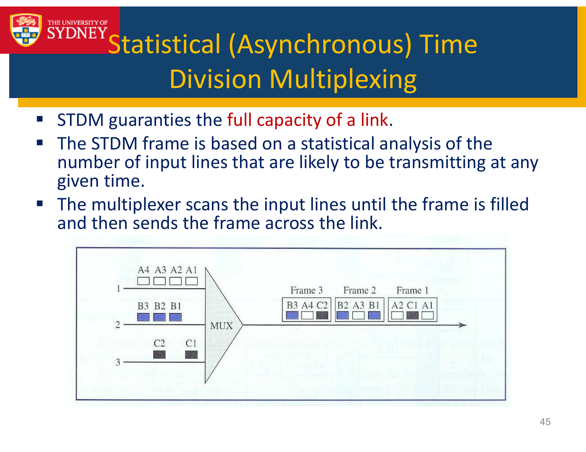
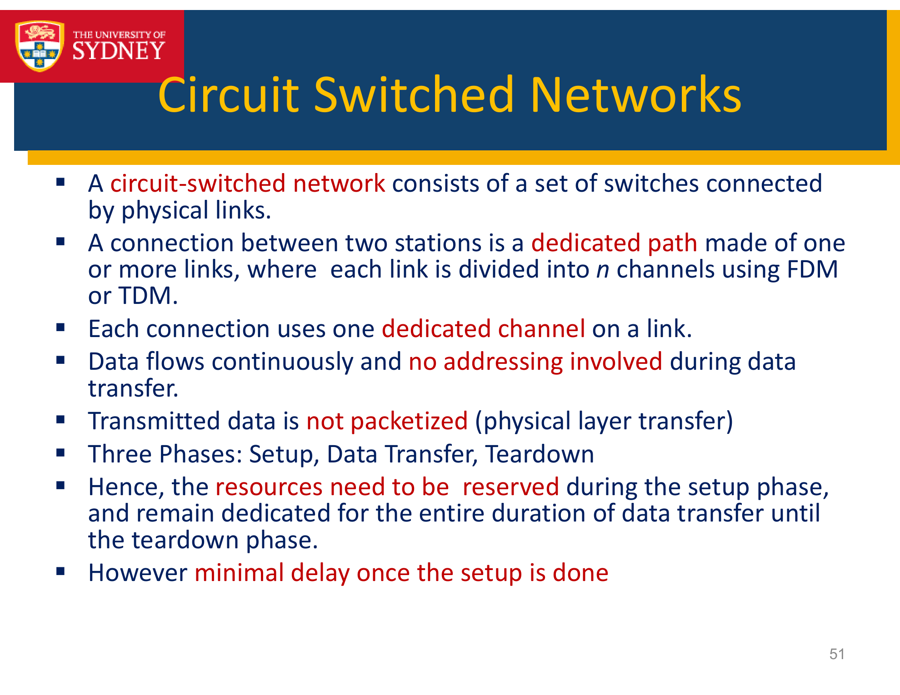
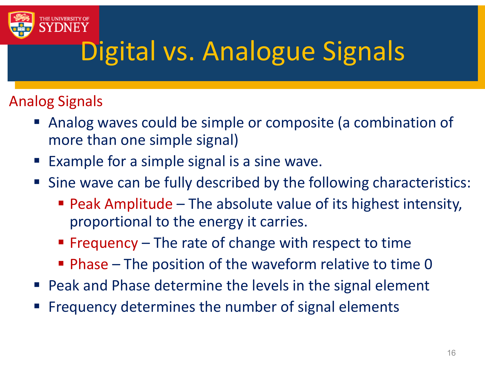

---

## 第 1 页


**提问：** 对截图中的内容逐句详细使用中文解释，不仅仅只是翻译，还需要对它们进行适当的解释,告诉我该怎么教学生并且指导怎么做

D:\\other\\teacher\\teach\\ELEC3506 Communications Networks\\20251014\\Lecture2_2024.pdf


---

## 第 2 页


**提问：** 对截图中的内容逐句详细使用中文解释，不仅仅只是翻译，还需要对它们进行适当的解释,告诉我该怎么教学生并且指导怎么做

非常好！这张幻灯片是第二讲 “Physical Layer（物理层）” 的**教学导入页**，列出了今天要讲的主要内容（Topics of the Day）。下面我将逐条为你解释每一项的含义、教学重点、以及课堂教学时可以怎样组织讲解和引导学生理解。


---


## 🟦 标题：**Topics of the Day**


**中文翻译：** 今日主题 / 今日课程内容

**教学解释：**

这是课件开头的“路线图”（roadmap slide）。学生看到这一页后，应清楚今天课程的整体框架和学习目标。

**教学建议：**


* 用2分钟时间先整体浏览，告诉学生：“今天我们将从信号的基本概念开始，一步步走到信号传输、复用、再到网络的连接方式。”

* 强调这是“由底层到结构”的逻辑顺序，让学生在心里建立一条清晰的知识主线。


---


## 🟨 1. Fundamental Concepts（基本概念）


**中文解释：**

这是整个物理层的理论基础，包括：什么是数据、信号、带宽、信噪比、数据速率等。

学生需要理解这些物理参数如何影响通信性能。


**教学建议：**


* 从\*\*“数据 vs 信号”\*\*这个区别讲起：数据是抽象的（0和1），信号是具体的（电压、光波、电磁波）。

* 讲解公式如 **香农定理** (Shannon Capacity Formula) 时，给出直观解释，而不是推导。

* 举例说明：如果Wi-Fi信号弱，为什么速率下降？（与带宽、噪声、功率相关）

* 可以用图像或视频展示“波形”、“频谱”等直观形象帮助理解。


---


## 🟨 2. Digital and Analog Signals（数字信号与模拟信号）


**中文解释：**

数字信号是离散的（例如0V代表0，5V代表1），模拟信号是连续变化的（如声音、光强）。

在通信中我们常常要把模拟信号转成数字信号（例如语音数字化）。


**教学建议：**


* 用**对比法**教学：在投影上同时画出数字波形与正弦波，直观展示区别。

* 举生活例子：


  * 模拟信号：声音（声波连续变化）；

  * 数字信号：电脑内部二进制通信。

* 演示建议：


  * 可以播放一段音频并显示其波形。

  * 再展示数字化采样的过程（采样频率越高，还原越精确）。


---


## 🟨 3. Signal Encoding and Modulation（信号编码与调制）


**中文解释：**

编码（Encoding）指的是如何把数字信号转换为可传输的电信号（例如NRZ、曼彻斯特编码）；

调制（Modulation）指的是用高频载波传输低频信息（例如ASK、FSK、PSK）。


**教学建议：**


* 理论部分：先区分两者概念。

* 视觉演示：展示不同编码/调制的波形变化图。

* 举例帮助理解：


  * 编码：以太网线使用曼彻斯特编码；

  * 调制：Wi-Fi使用QAM（正交振幅调制）。

* 实验建议：


  * 可用软件（如MATLAB或在线模拟器）演示信号调制与频谱变化。


**引导问题：**


> “为什么我们要调制信号，而不直接发送0和1？”

> （引导学生思考传输距离、抗干扰能力、带宽利用率）


---


## 🟨 4. Multiplexing（复用）


**中文解释：**

复用是指在一条信道上同时传输多个信号，提高资源利用率。

常见类型包括：


* 频分复用（FDM）

* 时分复用（TDM）

* 波分复用（WDM，用于光纤）


**教学建议：**


* 用生活类比：高速公路多车道、地铁不同时间段发车。

* 图解教学：用彩色方块表示多个信号如何在时间或频率上分开。

* 实验建议：


  * 展示一张频谱图说明频分复用；

  * 或让学生画出TDM的时隙分配示意。


**引导问题：**


> “假如十个用户同时上网，为什么不会互相‘抢信号’？”


---


## 🟨 5. Switching（交换）


**中文解释：**

交换是网络中决定数据包如何从源端到达目标端的过程。

主要类型包括：


* 电路交换（Circuit Switching）——固定连接路径，如电话；

* 分组交换（Packet Switching）——按数据包动态路由，如互联网。


**教学建议：**


* 对比说明电路交换 vs 分组交换；

* 画图讲解：每个节点如何转发数据包；

* 举例：


  * 打电话 → 电路交换；

  * 发送邮件 / 浏览网页 → 分组交换。


**课堂活动建议：**


* 让学生分组模拟“分组交换网络”，每人扮演一个节点，传递“数据包”纸条。


---


## 🟨 6. Transmission Media（传输介质）


**中文解释：**

信号通过什么介质传输：


* 有线介质（双绞线、同轴电缆、光纤）；

* 无线介质（无线电波、红外线、微波）。


**教学建议：**


* 展示实物或图片样本；

* 讲解每种介质的优缺点（速率、成本、干扰、距离）；

* 实验建议：


  * 使用示波器或光纤样板展示信号损耗现象。


---


## 🟨 7. Propagation Modes（传播模式）


**中文解释：**

信号在介质中传播的方式，例如：


* 导引传播（在电缆或光纤中）；

* 自由空间传播（无线信号）；

* 多径传播（信号反射和衰减问题）。


**教学建议：**


* 画图展示波的反射、衍射、折射；

* 举例说明：Wi-Fi信号穿墙衰减；光纤中有多模与单模的区别；

* 可结合实验或视频展示不同传播环境的信号强度变化。


**引导问题：**


> “为什么你在房间里某个角落Wi-Fi信号特别差？”


---


## 🟨 8. Network Topologies（网络拓扑结构）


**中文解释：**

拓扑结构描述网络中各节点的连接方式：


* 星型（Star）

* 总线型（Bus）

* 环型（Ring）

* 网状（Mesh）


**教学建议：**


* 在白板上画出不同拓扑图；

* 讲解每种拓扑的优缺点（可靠性、成本、维护难度）；

* 举例说明：


  * 家庭Wi-Fi → 星型；

  * 老式以太网 → 总线型；

  * 高可靠性通信网 → 网状结构。


**课堂练习建议：**

让学生根据给定设备数量设计一种合适的网络拓扑，并说明理由。


---


## 🧭 整体教学指导总结：


| 阶段    | 教师目标          | 教学方法           | 学生活动    |

| ----- | ------------- | -------------- | ------- |

| 导入阶段  | 建立物理层框架       | 提问 + 课程概览      | 听讲、提出问题 |

| 理论讲解  | 理解信号、调制、复用、交换 | 图示讲解 + 类比演示    | 画图、记笔记  |

| 实验与演示 | 将抽象信号具象化      | 用MATLAB / 仿真动画 | 观察与记录   |

| 应用拓展  | 将理论应用于实际网络    | 案例分析 + 小组讨论    | 讨论与展示   |


---


是否希望我**帮你扩展成完整教学脚本**（每个主题约10分钟讲解结构，含板书内容、互动问题、以及PPT动画建议）？

我可以帮你写成可直接用于课堂授课的详细讲稿。


---

## 第 3 页


**提问：** 对截图中的内容逐句详细使用中文解释，不仅仅只是翻译，还需要对它们进行适当的解释,告诉我该怎么教学生并且指导怎么做

非常好，这一页幻灯片是 **“Transmission Medium（传输介质）”** 的导入图示页，它是物理层中非常关键的概念之一。下面我会**逐句、逐元素**解释其中的内容，并告诉你在课堂教学中可以怎样讲、怎样引导学生去理解、去思考和参与。


---


## 🟥 标题：**Transmission Medium（传输介质）**


**中文翻译：** 传输介质

**解释：**

传输介质是**信号传播的物理通道**，它可以是有形的（电缆、光纤）或无形的（空气、空间）。在通信系统中，发送端通过介质把信号传递到接收端，这个过程就是数据在“物理层”发生的核心。


**教学引导建议：**

在讲这一页之前，可以问学生一个引导问题：


> “我们平时上网、打电话、Wi-Fi连接，其实信号是通过什么‘路’传过去的？”


然后展示这一页的幻灯片，告诉他们：


> “这条‘路’——就是传输介质（Transmission Medium）。”


---


## 🟦 图示结构总览


这张图用非常简洁的形式展示了物理层通信的全过程，分为三个主要部分：


1. **发送端（Sender）**

2. **传输介质（Transmission Medium）**

3. **接收端（Receiver）**


你可以用讲解逻辑如下的顺序进行教学，让学生理解“数据如何在物理世界中走完这一条路”：


---


## 🟩 1. Sender（发送端）


**中文翻译：** 发送端

**解释：**

发送端是发出数据的设备（例如计算机、手机、路由器），在物理层中，它负责把“比特（0和1）”转换成**电信号或光信号**，以便能够通过介质传播。


图中方框标注为：


> **Physical layer（物理层）**


说明发送端在物理层完成的任务是“信号的生成与发送”，不是数据内容的理解。


**教学建议：**


* 告诉学生：“物理层不理解数据内容，它只负责‘怎么发出去’。”

* 举例说明：


  * 电脑网卡（Network Interface Card）就是物理层的一部分；

  * 它把二进制数据变成电脉冲或无线波。

* 可以演示一个网线接口或Wi-Fi发射模块，让学生直观理解“发送端硬件”是什么。


**提问互动：**


> “如果电脑发送‘1010’，在网线上是什么样的信号形式？”

> （可画波形或展示动画）


---


## 🟩 2. Transmission Medium（传输介质）


**中文翻译：** 传输介质

**解释：**

传输介质就是信号传播的“通道”，它可以是：


* **Cable（有线）**：双绞线、同轴电缆、光纤；

* **Air（无线）**：电磁波、无线信道。


幻灯片中的标注：


> **Cable or air（电缆或空气）**


这代表不同通信方式使用不同的物理媒介：


* 家庭有线宽带 → 双绞线；

* 5G / Wi-Fi → 空气（电磁波）。


粉色箭头和管状图形直观地表示信号在介质中传播的过程。


**教学建议：**


* 用生活例子帮助学生理解：


  * “你家网线就是cable，Wi-Fi信号走的就是air。”

* 可以带实物展示：


  * 拿出一段双绞线、一段光纤，让学生看材质；

  * 然后用动画或视频展示无线波的传播。

* 用图像说明信号在传输介质中可能遇到的问题：


  * **衰减（attenuation）**

  * **干扰（interference）**

  * **噪声（noise）**


**讲解重点：**


> “物理层的主要任务之一，就是让信号能够可靠地穿过传输介质。”


---


## 🟩 3. Receiver（接收端）


**中文翻译：** 接收端

**解释：**

接收端的物理层负责把从介质中接收到的信号重新**恢复为数字比特**。

例如：


* 光纤通信中，光信号被光电探测器转换为电信号；

* 无线通信中，天线接收电磁波并由电路解调出原始数据。


图中同样标注：


> **Physical layer（物理层）**


这说明物理层是对称的：一端负责“发送信号”，另一端负责“接收信号”。


**教学建议：**


* 告诉学生，接收端同样需要硬件（如接收天线、光电接收器、网卡接口）。

* 可画图演示：信号经过传输后波形变形的样子，并说明接收端如何重建它。

* 提醒学生：


  > “信号在传播中会被削弱或失真，接收端要能够识别并恢复原始信息。”


**互动问题：**


> “如果信号在传输中衰减太多，会发生什么？网络还能通信吗？”


让学生思考信号放大器、重传机制等。


---


## 🟧 4. 整体概念总结


可以用下面的总结让学生把整个图内化成一句话：


> **“在物理层，数据被转换为信号，通过传输介质传播，最后由另一端恢复成数据。”**


这就是通信的最基本物理过程。


你可以在板书上写出公式化总结：


```

Data (Sender)

   ↓

Signal (Physical Layer)

   ↓

Transmission Medium (Cable/Air)

   ↓

Signal (Receiver Physical Layer)

   ↓

Data (Receiver)

```


---


## 🧭 教学活动与延伸建议


| 活动        | 目标               | 实施方式                     |

| --------- | ---------------- | ------------------------ |

| **演示活动**  | 让学生感受物理层的真实传输    | 用示波器或软件模拟信号在电缆中传输波形      |

| **思考讨论**  | 培养学生理解“信号与数据的区别” | 提问：为什么不能直接把数据0/1“写到电缆”里？ |

| **类比法讲解** | 帮助学生形象理解         | 类比“信号是快递包裹，传输介质是快递路线”    |

| **扩展讨论**  | 拓展应用思维           | 问学生：“未来6G、卫星互联网的介质是什么？”  |


---


## 🟦 课堂总结语（建议结尾讲法）：


> “物理层是通信网络中最底层的‘运输员’，

> 它不关心你要传什么内容，只关心——

> 这段信号能不能安全、完整、快速地从这头走到那头。”


---


是否希望我帮你把这张图延伸成一页**详细课堂讲稿（约10分钟讲解节奏）**，包括：


* 板书设计

* 提问点

* 动画演示建议

* 实验或课堂互动环节？

  我可以帮你写出完整的教学脚本。


---

## 第 4 页


**提问：** 对截图中的内容逐句详细使用中文解释，不仅仅只是翻译，还需要对它们进行适当的解释,告诉我该怎么教学生并且指导怎么做

非常好！这一页幻灯片的主题是 **“Digital/Analog Communication（数字与模拟通信）”**。

它的作用是让学生从\*\*最直观的例子（用0和1表示字母）\*\*去理解数字通信的基本原理，并逐步过渡到“传输效率”和“可靠性”这些更高层的概念。


下面我会**逐句详细解释**这页幻灯片中的每一行内容，说明你可以**如何讲解、如何引导学生思考、以及如何设计课堂互动**。


---


## 🟦 标题：**Digital/Analog Communication（数字与模拟通信）**


**中文解释：**

通信系统分为两种主要类型：


1. **数字通信（Digital Communication）**——以离散的0和1表示信息；

2. **模拟通信（Analog Communication）**——以连续变化的信号（如电压、声音波形）表示信息。


这节课的核心任务是让学生理解：


* 数字通信如何表示和传输信息；

* 数字通信相比模拟通信的优点（抗噪声、易编码、可压缩）；

* 以及如何在物理层上实现可靠、高效的传输。


**教学建议：**


* 先用生活例子引入，比如：


  > “我们平时用电脑打字、发信息，所有字母其实都被转成0和1在传输。”

* 然后提出问题：


  > “如果我们想在网络上发送字母A，要怎么用0和1来表示呢？”

  > 这就引出下面的教学探讨。


---


## 🟨 文本部分：


> **We want to send letter A and represent each letter with a combination of 0 and 1. There are 26 letters.**

> 我们想要发送字母 A，并用 0 和 1 的组合来表示每个字母。字母表中共有 26 个字母。


**解释：**

这是一个简化的**信息编码示例（information encoding example）**。

用它可以帮助学生理解：


* 信息是如何在数字通信中被“数字化”的；

* “比特（bit）”的含义（信息的最小单位）；

* 以及**编码的最基本原则：唯一性与最小长度**。


**教学步骤建议：**


1. 先问学生：“我们有26个字母，每个字母都要有一个独特的二进制编码，那么要多少个比特（bit）才够？”

2. 鼓励学生尝试猜测，并引导他们思考“2的多少次方才能大于或等于26”。

3. 在黑板上推导：


$$
   2^4 = 16 < 26,\quad 2^5 = 32 \ge 26
$$


   所以至少需要 **5 bits**。

   例如：


   ```

   A = 00000

   B = 00001

   ...

   Z = 11001

   ```


**教学目标：**


* 让学生体会到**数字通信的核心是信息的二进制表示**。

* 同时，也可以为后续的“编码效率”和“传输信道容量”概念埋下伏笔。


---


## 🟨 问题 1：


> **1. How many bits are required to represent all letters?**

> 需要多少位（bit）来表示所有字母？


**解释：**

这个问题考察的是**信息容量**的概念。

它的核心公式是：


$$
2^n \ge N
$$


其中：


* $n$ = 所需比特数

* $N$ = 需要表示的符号数量


所以这里 $N = 26$，结果 $n = 5$。


**教学建议：**


* 让学生亲自算一算，让他们感受到“每一位增加一倍信息量”的特性。

* 可拓展：问学生“如果要表示大小写字母（52个），要多少位？” → 6 bits。

* 延伸讨论：介绍ASCII编码（7位或8位），让他们看到真实系统中如何使用这种思想。


---


## 🟨 问题 2：


> **2. Efficient transmission?**

> 如何实现高效的传输？


**解释：**

这是引导学生思考\*\*通信效率（Transmission Efficiency）\*\*的问题。

在物理层中，效率通常与以下因素相关：


* **数据率（bit rate）**：每秒传输的比特数；

* **带宽（Bandwidth）**：信道能够承载的频率范围；

* **信噪比（SNR）**：信号强度与噪声的比例；

* **编码方式**：如NRZ、曼彻斯特、QAM等。


**教学建议：**


* 提问学生：


  > “如果我们用更快的信号切换频率（更高的带宽），能更快传输吗？”

  > “但这样会不会更容易出错？”

* 用香农公式做一个启发性讲解：


$$
  C = B \log_2(1 + \text{SNR})
$$


  说明带宽和信噪比如何限制效率。

* 举例说明：


  * 光纤通信高效率；

  * 无线通信受干扰效率低；

  * 压缩算法（如Huffman coding）可以提高传输效率。


**课堂活动建议：**


* 让学生模拟：一个学生传字母，另一个记录“0和1”，看看谁能更快“传完消息”，引导他们思考“效率”和“出错”的平衡。


---


## 🟨 问题 3：


> **3. Reliable transmissions? Sending multiple letters to different users?**

> 如何保证可靠的传输？如果要同时发送多个字母给不同用户怎么办？


**解释：**

这个问题对应通信系统中的\*\*可靠性（Reliability）**与**多用户传输（Multiple Access）\*\*概念。

主要包含：


1. **错误检测与纠正（Error Detection and Correction）**


   * 如奇偶校验（Parity bit）、CRC校验、海明码（Hamming Code）等；

2. **复用技术（Multiplexing）**


   * 时分复用（TDM）、频分复用（FDM）、码分复用（CDMA）；

3. **信道控制**


   * 确保不同用户的数据不会混乱。


**教学建议：**


* 问学生：


  > “如果在传输过程中有一个比特出错，接收方怎么知道？”

  > 引导到错误检测的概念。

* 再问：


  > “如果两个人同时发消息，会不会冲突？”

  > 引出复用和信道分配的思想。

* 用图示讲解：多个用户 → 多条“信号通道” → 各自独立或分时使用。


**课堂演示建议：**


* 让学生分组，每组模拟一个通信用户；

* 教师扮演“信道”；

* 如果两个学生同时发出信号（比如用手势表示0和1），教师模拟“干扰”，让他们看到为什么需要分时或分频。


---


## 🟩 🧭 总结教学逻辑：


这页幻灯片其实是整节“数字通信”主题的核心思想缩影，从**最简单的字母编码问题**，层层深入到**信号效率**与**可靠性**。


| 环节   | 内容        | 教学目标      | 教学方法  |

| ---- | --------- | --------- | ----- |

| 概念引入 | A→二进制编码   | 理解数字通信的基础 | 提问+例子 |

| 问题1  | 比特数       | 建立信息容量概念  | 推导+互动 |

| 问题2  | 效率        | 理解带宽与信噪比  | 公式+案例 |

| 问题3  | 可靠性 & 多用户 | 理解错误检测和复用 | 模拟+讨论 |


---


## 🟨 课堂总结语（可以这么讲）：


> “数字通信的关键，就是用有限的0和1，把无限的世界表示出来。

> 我们要考虑的不仅是**怎么表示**，还要思考**怎么传得快、传得稳、传给多人**。

> 这就是今天我们要学习的数字通信的核心问题。”


---


是否希望我帮你把这一页扩展成一份**10分钟教学讲稿**（包含讲解顺序、互动提问、板书设计与小练习示例）？

那样你可以直接用于课堂授课。


---

## 第 5 页


**提问：** 对截图中的内容逐句详细使用中文解释，不仅仅只是翻译，还需要对它们进行适当的解释,告诉我该怎么教学生并且指导怎么做

非常好！这一页幻灯片是关于通信理论中最核心的思想之一 —— **香农定理（Shannon’s Theorem）**。

它提出了一个影响整个通信工程与信息科学基础的终极问题：


> “通信能否在任意速率下实现可靠传输？”


下面我会带你逐句讲解每个部分的含义，并提供课堂教学的讲法、提问引导、例子、以及学生思考活动设计。


---


## 🟦 标题：**Fundamental Question（基本问题）**


**中文解释：**

“Fundamental”表示“根本的、基础性的”。这里的“Fundamental Question”意味着这是整个通信系统设计中最核心的问题。

它不是一个具体的计算问题，而是一个关于\*\*通信极限（Limit of Communication）\*\*的哲学性科学问题。


**教学建议：**


* 在开始讲之前，可以告诉学生：“今天我们要讨论的是，所有通信系统背后的终极问题——我们到底能传多快、还能保证准确？”

* 这部分是引出香农信息论（Information Theory）的最佳切入点。


---


## 🟥 文本 1：


> **Is it possible to transmit reliably over a communication channel at any arbitrary rate?**

> 是否有可能以任意速率在通信信道上实现可靠传输？


**详细解释：**


* “Transmit reliably”：指的是**可靠传输**，即数据在接收端与发送端完全一致，没有错误。

* “Communication channel”：指通信信道，如有线电缆、光纤、无线电波、网络链路等。

* “At any arbitrary rate”：意味着传输速率可以无限提高。


这句话其实在问：


> “理论上，我们能不能无限制地提高通信速率？有没有一个极限？”


这正是香农在1948年解决的核心问题。


**教学讲法：**


* 向学生提问引导思考：


  > “如果我把信号发送得越来越快，数据速率就越来越高。那是不是可以无限提高？有没有一个极限？”

  > “如果信道里有噪声，会发生什么？”


* 举例帮助理解：


  * Wi-Fi 从 2 Mbps → 300 Mbps → 1 Gbps，为什么不可能变成 1 Tbps？

  * 手机信号（4G/5G）为什么总是有“理论上限”？


**课堂活动建议：**


* 可以画出信噪比（SNR）与数据速率的关系曲线，让学生猜测曲线形状；

* 然后在下一页或白板上揭示香农公式 $C = B \log_2(1 + SNR)$。


---


## 🟥 文本 2：


> **If yes, how?**

> 如果可以，那要怎么实现？


**详细解释：**

这是承接上一个问题的逻辑。香农问的不只是“能不能”，还问“怎样才能做到”。

它引出了通信系统中的**信道容量（Channel Capacity）**与**编码理论（Coding Theory）**。


**教学讲法：**


* 引导学生思考：


  > “如果我不能无限提高速率，那我怎样才能在有限速率下减少错误？”

* 告诉他们：


  > “这就是编码的意义——我们通过‘聪明地’设计数据的表示方式，让信号更容易被正确识别。”


**举例说明：**


* 音频压缩（MP3）和图像压缩（JPEG）都体现了信息编码思想；

* 网络通信中使用纠错码（如Reed-Solomon、LDPC）保证可靠传输。


**课堂活动建议：**


* 让学生举例“我们平时使用的可靠通信系统”；

* 例如：短信、Wi-Fi、蓝牙、光纤通信——都是“香农理论”的应用。


---


## 🟦 蓝色文本框部分：


> **In 1948, Claude E. Shannon proved that it is possible if and only if the rate is below a certain threshold, called Channel Capacity.**

> **1948年，克劳德·香农（Claude E. Shannon）证明：只有当传输速率低于某个阈值时，才可能实现可靠传输。这个阈值称为“信道容量”（Channel Capacity）。**


---


### 🔹 关键词讲解：


#### **Claude E. Shannon（克劳德·香农）**


* 被称为“信息论之父”；

* 他提出了**香农定理**（Shannon’s Theorem）和**香农信息量**（Entropy）概念；

* 他的理论定义了通信的数学极限。


**教学建议：**


* 可展示香农的照片或他1948年的论文封面（"A Mathematical Theory of Communication"）。

* 告诉学生：“这篇论文开创了整个数字通信的时代，影响力类似于爱因斯坦的相对论在物理学中的地位。”


---


#### **Channel Capacity（信道容量）**


* 是信道所能支持的**最大可靠传输速率**；

* 超过这个速率，错误率将无法降为零；

* 低于这个速率，通过合适的编码与纠错机制，可以实现几乎零误差的通信。


**香农容量公式：**


$$
C = B \log_2(1 + \text{SNR})
$$


其中：


* $C$：信道容量（bits per second）

* $B$：带宽（Hz）

* $\text{SNR}$：信噪比（Signal-to-Noise Ratio）


**教学解释思路：**


1. 先讲公式直观意义：

   “带宽越大、信噪比越高，信道容量越大。”

2. 再强调哲学层面：

   “这告诉我们任何通信系统都有一个自然极限，不可能超越。”


**课堂演示建议：**


* 用图展示 $C$ 随着 SNR 增加的变化；

* 让学生观察到：SNR 越大，收益越小（呈对数关系），从而理解“资源有限”的现实意义。


---


## 🧭 教学逻辑总结：


| 部分   | 内容                                        | 讲解重点      | 教学方法           |

| ---- | ----------------------------------------- | --------- | -------------- |

| 引导问题 | Is reliable transmission always possible? | 建立直觉与兴趣   | 提问 + 举例        |

| 理论回答 | Shannon’s 1948 proof                      | 理解“极限存在”  | 故事 + 历史讲述      |

| 数学支撑 | Channel Capacity                          | 掌握容量定义与意义 | 图示 + 案例演示      |

| 工程启发 | 编码与误差控制                                   | 连接理论与实践   | 实例分析（Wi-Fi、5G） |


---


## 🟨 课堂结尾可以这样说：


> “香农告诉我们，通信并非无限制的。

> 每个信道都有一个上限，就像道路有最大车流量。

> 我们所做的一切——调制、编码、纠错——

> 都是在尽量靠近这个极限。”


---


是否希望我为这页幻灯片写出一个**详细课堂讲稿（约10分钟内容）**，包括：


* 板书设计（例如公式推导步骤）

* 动画或例子建议

* 提问与学生互动环节

* 一个小练习题（计算信道容量）？


---

## 第 6 页


这张幻灯片来自悉尼大学，讨论了通信理论中的**基本问题**，特别是关于**信道容量**和**传输速率**的内容。下面是详细解释：

1. **信道容量（C）**：这是在理想条件下，数据可以通过通信信道以无误差的方式传输的最大速率。它定义了信道的传输速率上限。
2. **传输速率（R）**：这是指数据通过信道传输的速率。当传输速率 RR 小于信道容量 CC 时，误差概率趋近于零。
3. **最大化传输速率**：第一个目标是**最大化传输速率（R）**，意味着我们希望通过信道尽可能传输更多的数据。
4. **最小化误差概率**：第二个目标是**最小化误差概率**。如果传输速率低于信道容量，我们的目标是确保误差率尽可能低。
5. **关键点**：幻灯片说明了目标是尽可能在信号中传输更多的比特，以便接收方能够以**极低的误差概率**区分这些比特，这对于保证数据完整性至关重要。

总结来说，这个基本问题的核心是如何有效利用通信信道，要么通过最大化传输速率，要么在传输速率低于信道容量的情况下，最小化误差概率。


---

## 第 7 页


- 这张幻灯片继续探讨了通信理论中的**基本问题**，并且介绍了信道容量的数学推导公式。具体解释如下：

  1. **信号功率（P）**：表示接收到的信号的功率，通常单位为瓦特（W）。它是传输过程中有用信号的强度。

  2. **噪声功率（N）**：表示接收到的噪声的功率，通常单位也为瓦特（W）。噪声功率通常会影响信号的质量和传输的准确性。

  3. **信道带宽（B）**：表示信道的带宽，单位通常为赫兹（Hz）。带宽越大，理论上能够传输的数据量也就越大。

  4. **信道容量公式**：

     - 公式为：

       C=Blog⁡2(1+PN)C = B \log_2 \left( 1 + \frac{P}{N} \right)

       其中：

       - **C**：信道容量，单位通常是比特每秒（bps），表示信道在单位时间内能够传输的最大信息量。
       - **B**：信道带宽，单位为赫兹（Hz）。
       - **P**：信号功率，单位为瓦特（W）。
       - **N**：噪声功率，单位为瓦特（W）。
       - **log₂**：以2为底的对数，用于计算信息的比特数。

     该公式表示信道容量与信道带宽、信号功率和噪声功率之间的关系。具体来说，信道容量会随着信号功率 PP 的增加而增大，而随着噪声功率 NN 的增加，信道容量则会减小。此外，信道带宽 BB 越大，信道容量也越大。

  5. **公式中的箭头解释**：

     - 上下箭头表示信道容量与不同参数之间的关系。例如，信道带宽（B）和信号功率（P）都与信道容量（C）呈正相关关系，而噪声功率（N）与信道容量呈负相关。

  **总结**：该幻灯片介绍了一个用于计算通信信道容量的公式，强调了信号功率、噪声功率和带宽对信道容量的影响。通过这个公式，我们可以推算在给定带宽、信号功率和噪声功率的条件下，信道的最大容量。


---

## 第 8 页


这张幻灯片探讨了在**无噪声信道**条件下，最大传输速率的情况，并介绍了与之相关的**Nyquist定理**。下面是详细解释：

### 1. **无噪声信道**：

- 在没有噪声的信道中，信号的传输没有受到干扰，因此可以以更高的速率传输数据。
- 当信道是理想的无噪声信道时，数据传输的速率将仅受信道带宽的限制。

- 

### 4. **解释**：

- 当信道是无噪声的，Nyquist定理告诉我们，最大传输速率取决于**信道带宽**和**每个符号能够表示的比特数**。如果我们可以使用更多的信号级（例如，四进制信号比二进制信号能传输更多的比特），那么可以提高传输速率。
- **比特率（Bit rate）**与信号的**级数（L）**有关。当信号能够代表更多的信息（更多级数时），可以在相同的带宽下传输更多的比特。

### 总结：

- 在无噪声的情况下，Nyquist定理提供了一个理论上的最大传输速率，这个速率受信道带宽和每个符号的比特级数（或信号级数）的影响。如果我们能提高信号的级数，便能提高最大传输速率。


---

## 第 9 页


---

## 第 10 页


---

## 第 20 页


**提问：** 对截图中的内容逐句详细使用中文解释，不仅仅只是翻译，还需要对它们进行适当的解释,告诉我该怎么教学生并且指导怎么做

# 🧩 第 7 章 Synchronization（同步）


### 标题下小字：


> *When multithreading gets interesting*


> “当多线程变得有趣时。”


> ➡️ 这句话其实是个幽默的开场：之前的章节讲了如何创建线程、并行执行，现在进入真正棘手的部分——**多个线程访问共享资源时的同步问题**。


---


### 第一段讲解：


> Synchronization coordinates various tasks so that they all finish in the correct state.


同步（Synchronization）的目标是**协调多个任务的执行，使它们最终处于正确状态**。


➡️ 解释：在多线程程序中，如果不控制好共享数据的访问顺序，程序结果就可能不正确。同步就是解决这个问题的一整套机制。


> In C, we have series of mechanisms to control what threads are allowed to perform at a given state.


在 C 语言的线程库（如 pthreads）中，有许多机制能控制线程在某个时刻被允许执行哪些操作。


➡️ 这些机制包括互斥锁（mutex）、信号量（semaphore）、条件变量（condition variable）等。


> Most of the time, the threads can progress without having to communicate...


大多数时候线程可以独立运行，不需要通信。


> ...but every so often two or more threads may want to access a critical section.


但偶尔会有两个或更多线程想同时访问同一个“关键区”（critical section）。


➡️ **关键区**指访问共享资源（如全局变量、文件、socket 等）的代码段。


在这个区域内同时访问会导致**竞态条件（race condition）**。


---


### 第二段：


> A critical section is a section of code that can only be executed by one thread at a time if the program is to function correctly.


关键区（critical section）是：在正确执行的前提下，必须**一次只允许一个线程执行**的代码。


➡️ 如果两个线程同时执行，就会破坏数据一致性。


> If two threads (or processes) were to execute code inside the critical section at the same time, it is possible that the program may no longer have the correct behavior.


如果两个线程（或进程）同时执行关键区代码，程序可能会出错。


➡️ 因为它们可能会同时修改同一块内存，产生不可预测的结果。


---


### 接下来提到：


> As we said in the previous chapter, race conditions happen when an operation touches a piece of memory at the same time as another thread.


“竞态条件（race condition）”的定义：当多个线程在**同一时间访问或修改同一内存位置**，而访问次序会影响结果。


➡️ 这是多线程中最常见、也最隐蔽的错误之一。


> If the memory location is only accessible by one thread... then there is no possibility of a race condition.


如果内存只被单个线程访问，就不可能产生竞态。


例如函数内的局部变量 `int i`，每个线程都有自己的一份拷贝，是安全的。


> However, the sum variable is a global variable and accessed by two threads.


但全局变量 `sum` 是共享的，两个线程会同时修改它，就会出问题。


---

## 第 21 页


**提问：** 对截图中的内容逐句详细使用中文解释，不仅仅只是翻译，还需要对它们进行适当的解释,告诉我该怎么教学生并且指导怎么做

太好了！这页是在上一页基础上，**专门把 Polar-RZ（双极性归零编码）讲清楚**。右侧图仍是同一比特串在 **Unipolar-NRZ / Polar-NRZ / Polar-RZ** 下的对比。下面我**逐条解释**每一句话，并给出**课堂讲法与训练**。


---


# 标题：Digital to digital Encoding（数字到数字编码）


## 小节：**Polar – Return to Zero（RZ，归零）**


### ▪ Three levels of the signal used, +ve, −ve or 0


**翻译+解释：**

Polar-RZ 使用**三个电平**：**+V、−V、0**。


* “+ve/−ve”= 正/负极性；“0”= 回到基线。

* 与 **Polar-NRZ（只有 ±V 两档）**不同，RZ 在**每个比特间隔都会回到 0**，因此自然形成第三个电平“0”。


**怎么教：**

在白板上画“一位时间”，先画 +V（前半位）、再回到 0（后半位）；下一位如果是 0，就画 −V（前半位）→ 回 0。让学生直观看到**每位必回零**。


---


### ▪ Binary 1 represented by +ve to 0 and binary 0 represented by −ve to 0 (or vice versa)


**翻译+解释：**

一个比特 **1** 用“**+V → 0**”表示；

一个比特 **0** 用“**−V → 0**”表示（也可反过来定义）。


* 也就是说：**先到某极性，再回零**，才算完成一个比特。

* 这与 NRZ 的“位内不回零”形成鲜明对比。


**怎么教：**

给出比特串 **0 1 0 0 1 1 0**，让学生按“0=−V→0，1=+V→0”的规则自己画 RZ 波形；再让他们把“0/1 的极性”互换，比较**物理波形不同但数据一致**。


---


### ▪ The transition of the signal at each bit is used for synchronization.


**翻译+解释：**

**每个比特都会发生跳变**（到 0 的回归），因此接收端可以用这些**规律性跳变**来恢复时钟（同步）。


* RZ 的**跳变密度**高，几乎不怕长游程（连续很多 0 或 1）的同步问题。

* 这正是 **RZ 优于 NRZ** 的核心原因之一。


**怎么教：**

让学生数一数同一比特串在三种编码下**位中或位边的跳变次数**：

RZ > Polar-NRZ > Unipolar-NRZ。

然后问：“**谁更容易从波形里‘抓时钟’？**”——答案是 **RZ**。


---


### ▪ Two signal elements to represent one bit occupy more bandwidth.


**翻译+解释：**

在 RZ 中，一个比特通常用**两个码元阶段**来表达（例如“前半位到 ±V，后半位回到 0”），等价于**更高的码元速率**，所以**占用带宽更大**。


* 直观上：**更多跳变 → 更宽频谱**。

* 工程上：在相同比特率 $R_b$ 下，RZ 的主瓣/有效带宽**显著大于** NRZ。


**怎么教：**

板书一句对联式总结：


> **“RZ：同步好、带宽宽；NRZ：带宽省、同步弱。”**

> 让学生记住这对**工程权衡**。


---


## 读图指导（右图怎么讲）


* 顶部比特序列与位边界（虚线）一致。

* **Unipolar-NRZ**：0V/+V，不回零；

* **Polar-NRZ**：−V/+V，不回零；

* **RZ**（下方圈出的）：每位**前半位在 ±V**，**后半位回0**。

  提示学生对比：**RZ 波形明显“更碎、更密”——这就是带宽大的信号。**


---


## 课堂 8 分钟流程（可直接照做）


1. **复盘（1’）**：NRZ 的“长游程→同步差”。

2. **规则板书（2’）**：


   * 1：+V→0；0：−V→0（写清楚也可反向定义）

   * 每位必回零 → 自带时钟

3. **画波形（2’）**：让学生把给定比特串画成 RZ，并与 Polar-NRZ 对照。

4. **带宽讨论（2’）**：为什么 RZ 更占带宽？（跳变密度↑、频谱更宽）。

5. **收束（1’）**：引出后续改进：**Manchester/差分、AMI/Bipolar、块编码（4B/5B, 8B/10B）、扰码**既要同步、又想省带宽/控 DC。


---


## 易错点提醒


* **把“Polar＝NRZ”混为一谈**：Polar 指极性（±V），RZ/NRZ 指是否回零，是**两个维度**。

* **以为“回零=多一个比特”**：不是，比特数不变；是**每比特内部多了一个码元阶段**（等效码元率更高）。

* **忽视 DC**：RZ 的平均值更接近 0，但要看 0/1 的统计与设计；真实链路常要求 **DC 平衡**。


---


## 小练习（当堂 2 题）


1. 已知“1=+V→0，0=−V→0”，请把 **1 1 0 0 1** 画成 RZ 波形。

2. 若链路比特率 $R_b=10\,\text{Mbps}$，使用 RZ 与 NRZ，**谁的最小带宽更大，为什么？**（答：RZ→跳变密度更高，需要更宽带宽。）


---


**一句话总结：**

**Polar-RZ 用“±V→0”的位内回零**换来**极佳的同步性**，代价是**更高的码元速率与更宽的带宽**。在实际系统里，我们会结合其他编码/扰码/成形来在**同步、带宽、DC 和复杂度**之间做出最优折中。


---

## 第 22 页


**提问：** 对截图中的内容逐句详细使用中文解释，不仅仅只是翻译，还需要对它们进行适当的解释,告诉我该怎么教学生并且指导怎么做

太好了！这页是**Manchester 编码（曼彻斯特编码）**，它是最经典的“数字→数字线编码”之一。作用是：**在同一条波形里，同时携带“数据”和“时钟”**，从根上解决 NRZ 的“长游程不同步”问题。下面我按句子逐条解释，并给出课堂怎么讲、怎么练。


---


# 标题：Digital/digital Encoding（数字/数字编码）


## ▪ Manchester Encoding（曼彻斯特编码）


### 1) **Transition at the middle used for both synchronization and bit representation.**


**翻译+解释：**

**每个比特间隔的正中央必定发生一次跳变**（由高到低或由低到高）。


* 这一次“**位中跳变**”既是**时钟标记**（接收端可据此取样），又是**数据含义**的一部分（跳变方向代表 0 或 1）。

* 因为**每位必跳变**，几乎不会出现“长时间没有边沿”的情况，时钟恢复**非常稳**。


**课堂讲法：**


* 板书一个比特周期，画出“前半位电平—位中跳变—后半位电平”。

* 强调：“**位中跳变=时钟**；**跳变方向=比特值**。”


---


### 2) **binary 1 = −ve to +ve**


### 3) **binary 0 = +ve to −ve (or vice versa)**


**翻译+解释：**


* 一种常见约定是：


  * **1** 表示 **负→正** 的跳变（位中从 −V 到 +V）

  * **0** 表示 **正→负** 的跳变（位中从 +V 到 −V）

* **或反过来也行**（标准允许两种极性定义，但**同一链路必须一致**）。


**课堂讲法：**


* 在图边写清本课采用的约定（例如“1=低到高，0=高到低”）。

* 让学生按这个规则，把给定比特串手工画成波形。

* 追问：**如果全是 1 或全是 0，还会不会失去时钟？**—不会，因为每位都会跳变。


---


### 4) **This is used for 10 Mbps Ethernet.**


**解释：**


* 早期的 **10BASE-T 以太网**采用 Manchester 编码（现在的更高速以太网使用 4B/5B、8B/10B、64B/66B 等更高效方案）。

* 选择原因：**自带时钟、易同步、抗直流漂移**；代价是**带宽占用约为 NRZ 的两倍**（每位必跳变 → 高频分量多）。


**课堂讲法：**


* 连接现实：网线（双绞线）早期就靠这种编码保证同步与可靠。

* 点出工程权衡：**同步稳 ↔ 频谱更宽**。


---


## 右侧图怎么读（带学生看图）


* 顶部有比特序列（0、1、0、0、1…）和位边界虚线。

* 每个比特**正中**都有跳变；上方标签提示“Zero is … / One is …”（跳变方向定义）。

* 让学生用手指按位走一遍：


  * 遇到“0”就画“高→低”；

  * 遇到“1”就画“低→高”；

  * 位与位之间是否还有起始电平变化**不重要**，关键是**位中跳变方向**。


---


## 与其他线编码快速对比（黑板三行记忆）


* **NRZ**：位内**不**回零，**可能不同步**，**带宽省**。

* **RZ**：位内**回零**，**同步好**，**带宽宽**。

* **Manchester**：**位中必跳变**（自带时钟），**最稳同步**，**带宽≈2×NRZ**。


---


## 课堂 8 分钟流程（可直接照做）


1. **问题引入（30s）**：如果连续 1000 个“1”，NRZ 会怎样？（同步丢失）

2. **规则板书（2’）**：写清“1=低→高、0=高→低（位中）”。

3. **手绘示例（2’）**：给出比特串 **0 1 0 1 1 0**，师生共同画波形。

4. **读波形练习（2’）**：出一条曼彻斯特波形，让学生读回比特（看位中跳变方向）。

5. **工程权衡收束（1.5’）**：同步稳、DC 好，但频谱更宽；10Mbps 以太网选它的原因。


---


## 常见误区 & 纠正


* **把“位边跳变”当数据**：在曼彻斯特里，**位中**跳变才编码数据，位与位交界的电平变化不是决定性信息。

* **忘记写明约定方向**：一定在题目中说明“1=低→高还是高→低”，否则会与答案偏差 180°。

* **误以为曼彻斯特更省带宽**：相反，**更费带宽**，但换来超强同步性与DC平衡。


---


## 快速小练（课堂/作业）


1. 采用“1=低→高、0=高→低”，把 **1 1 0 0 1 0** 画成曼彻斯特波形。

2. 若链路比特率 10 Mb/s，用 NRZ 与 Manchester 相比，**曼彻斯特的主瓣带宽约是 NRZ 的几倍？**（答：**约 2 倍**）


---


**一句话总结**

曼彻斯特编码 = **“位中必跳变 + 方向表数据”**。它用**更高的频谱代价**换来了**几乎完美的时钟同步与良好的DC特性**，这就是它被 10 Mb/s 以太网采纳的原因。


---

## 第 23 页


**提问：** 对截图中的内容逐句详细使用中文解释，不仅仅只是翻译，还需要对它们进行适当的解释,告诉我该怎么教学生并且指导怎么做

太好了！这页讲的是 **Differential Manchester Encoding（差分曼彻斯特编码）**。它和普通曼彻斯特一样**位中必跳变**，但**表示比特的方法不同**：用“位开始处有没有跳变”来表达 0/1，因此 **对极性翻转不敏感**、同步也稳定。下面我逐条解释幻灯片上的句子，并给出课堂怎么讲、怎么练。


---


# Digital/digital Encoding — Differential Manchester


## ▪ Presence or absence of a transition at the beginning of the interval is used to identify a bit.


**译＋解释：**

**每个比特间隔开始的位置（bit start）是否发生跳变**，用来区分 0/1。


* “有跳变”与“无跳变”这对**相对关系**才是信息载体，因此叫 **differential（差分）**。

* 只要相邻两位“起始是否跳变”的关系保留，即使整条链路**电平整体翻转**（+V↔−V），仍能正确解码。


**教学做法：**

在板书上画两格等宽的比特窗口，标出“位开始”竖线；分别画“有跳变”“无跳变”的两种情况，强调“**看起点**”。


---


## ▪ Binary 1 – No transition, Binary 0 – Represents a transition


**译＋解释：**

常见约定：


* **1**：位开始**没有**跳变；

* **0**：位开始**发生**跳变。


> 注意：标准也允许相反约定，但**同一系统必须统一**。试题务必声明你采用哪种约定。


**教学做法：**

把约定写在黑板最上面（例如“1=无跳变，0=有跳变”），防止学生和老师用反。


---


## ▪ Transition at the middle used only for synchronization


**译＋解释：**

**位中间必有一次跳变**，但这次跳变**只用于时钟同步**，不承载数据。


* 因为“每位必跳变”，接收端总能从中提取时钟，**长游程不会失步**（和曼彻斯特相同的优点）。


**教学做法：**

对比普通曼彻斯特：


* 曼彻斯特：**位中跳变的方向**表示 0/1；

* 差分曼彻斯特：**位开始有/无跳变**表示 0/1，**位中跳变只管同步**。


---


## 右图阅读指引


* 上：普通曼彻斯特（Zero/One 用**中点跳变方向**区分）。

* 下：差分曼彻斯特（气泡注释：**位开始有跳变→0；无跳变→1**）。

* 讲解顺序建议：先沿着虚线“位边界”走，看**边界处有没有跳变**；再确认**位中都有跳变**用于时钟。


---


## 其他编码（MLT-3 等）


**解释：**

MLT-3（Multi-Level Transmit）是**多电平**线编码（如 −1/0/+1 三电平循环），**降低码元率**、节省带宽，常见于更高速的以太网体系（如 100BASE-TX 的线路成形与8B/10B/MLT-3组合思路）。这里知道其目的：**在相同比特率下降低高频成分**。


---


## 幻灯片底部两行红字


### 1) Digital signals make signals less susceptible to noise


**数字线编码**（相对模拟幅度连续变化）在判决时只需分辨**离散状态或跳变**，对幅度噪声不那么敏感。


* 差分法进一步不依赖绝对极性，**抗直流漂移/极性反接**。


### 2) Note that two signal elements are used for each bit at cost of bandwidth


差分曼彻斯特与曼彻斯特类似，**每个比特内至少出现一次跳变**（通常相当于两段码元），**频谱比 NRZ 更宽**；代价是**带宽≈NRZ 的约 2 倍**，但换来**极佳同步与鲁棒性**。


---


## 解码规则（给学生的“读图算法”）


1. 把波形按位边界切块。

2. 看**块开始**：


   * 有跳变 → 0

   * 无跳变 → 1

3. 忽略块中间的跳变（它只提供时钟）。

4. 若整条线被反接（极性翻转），解码结果**不变**。


---


## 与曼彻斯特对比（黑板三行）


| 项目    | 曼彻斯特       | 差分曼彻斯特       |

| ----- | ---------- | ------------ |

| 承载数据  | **位中跳变方向** | **位开始有/无跳变** |

| 同步    | 位中必跳变，极佳   | 位中必跳变，极佳     |

| 对极性翻转 | 敏感         | **不敏感（差分）**  |

| 频谱宽度  | ≈ 2×NRZ    | ≈ 2×NRZ      |


---


## 8分钟课堂流程（可直接照做）


1. **复盘曼彻斯特（1’）**：位中跳变方向=数据。

2. **写出差分规则（1’）**：1=无跳变、0=有跳变；位中跳变=时钟。

3. **演示解码（2’）**：给一条差分曼彻斯特波形，按位开始是否跳变读回 010110…

4. **极性翻转实验（2’）**：把整条波形上下翻转，学生再解码，结果一致 → 说明差分优势。

5. **带宽权衡（1’）**：为什么比 NRZ 费带宽？（跳变密度高）

6. **小练（1’）**：把比特串 **1 0 1 1 0** 画成差分曼彻斯特（给出初始电平），并让同学互相对答案。


---


## 常见误区


* **把位中跳变当数据**（那是普通曼彻斯特的规则）。

* **忘了起始电平历史**：判断“位开始是否跳变”需要知道**上一位结束时的电平**，出题要给初始电平。

* **以为差分=省带宽**：恰好相反，**同步稳 + 抗极性**的代价是**更宽频谱**。


---


### 一句话收束


> **差分曼彻斯特 = “位中固定跳变保时钟，位开始有/无跳变记数据；对极性不敏感，但带宽更大。”**

> 它在对同步和鲁棒性要求高的基带系统里非常实用，是理解“差分思想”的绝佳入门例子。


---

## 第 24 页


**提问：** 对截图中的内容逐句详细使用中文解释，不仅仅只是翻译，还需要对它们进行适当的解释,告诉我该怎么教学生并且指导怎么做

很好，这一页只有标题 **“Digital to Analog Conversion（数字到模拟转换）”**，但它开启的是整段“**数字基带比特 → 模拟载波信号**”的主题。下面我把这句话拆成“是什么/为什么/怎么教/怎么练/易错点”，让你能顺着这页把后续 ASK/FSK/PSK/QAM 等全部讲顺。


---


# 一、到底在讲什么（What）


**数字到模拟转换**：把离散的比特流（0/1）映射为**连续时间的模拟波形**去传输，通常要**调制到高频载波**上。典型流程：


1. **比特→符号映射（symbol mapping）**：按 $\log_2 L$ 个比特一组映射到 $L$ 个符号（如 QPSK $L=4$、16-QAM $L=16$）。

2. **脉冲成形（pulse shaping）**：用成形滤波器（如根升余弦 RRC）控制带宽与码间串扰。

3. **调制到载波（carrier modulation）**：把成形后的基带 I/Q 信号搬移到射频 $f_c$（ASK/FSK/PSK/QAM 属于这一层）。

4. **功放与发射（RF chain）**：射频放大、上变频、功率控制，再送入信道。


---


# 二、为什么要这么做（Why）


* **共享媒体/远距离**：高频载波能进行天线辐射与频分复用（多路共存）。

* **频谱利用**：把信号搬到规定的频段（蜂窝/Wi-Fi/卫星），满足监管与系统共存。

* **抗噪与效率权衡**：选择调制阶数 $L$ 与编码，平衡**频谱效率**（bit/s/Hz）与**误码率**（受 SNR 限制，受 Shannon 极限约束）。


---


# 三、怎么教（Step-by-step 课堂脚本）


### 第1步：用一个比喻开场（1分钟）


* **基带比特**像要运输的“乘客”，**模拟载波**是“高速列车”。

* 把乘客装进不同车厢（**符号**），再搭上一列在固定轨道（**载波频段**）行驶的火车。


### 第2步：先讲三件“可视化”的事（5分钟）


1. **ASK**：幅度两档/多档（2-PAM, 4-PAM）→ 画波形：同频率，不同振幅。

2. **FSK**：两种/多种频率（2-FSK, 4-FSK）→ 画不同密度的正弦。

3. **PSK/QAM**：相位（BPSK/QPSK/8PSK）与幅相联合（16/64/256-QAM）→ 画星座图（I-Q 平面上的点）。


> 提醒：**星座点越密 → 每符号携带比特越多 → 对 SNR 要求越高**。


### 第3步：讲清“速率与带宽”的关系（2分钟）


* **符号率 $R_s$**（baud）与比特率 $R_b$： $R_b = R_s \log_2 L$\*\*

* **带宽与成形**：理想 Nyquist 下主瓣 $\approx R_s$（经过 RRC 的滚降因子 $\alpha$ 后带宽 $\approx (1+\alpha)R_s$）。


### 第4步：把“基带→射频”的方块图画出来（2分钟）


```

比特 -> 分组映射 -> I/Q 符号 -> RRC 成形 -> 与 cos/sin 载波相乘 -> 叠加 -> 发射

```


* 左边是**数字信号处理**，右边是**模拟/RF**。

* 提到**DAC**：数模转换把离散样值变成连续电压波形。


### 第5步：一个算例（2分钟）


* 若 **$B=5$ MHz**，滚降 **$\alpha=0.25$**，用 **16-QAM（每符号4 bit）**：


  * 近似 **$R_s \approx \frac{B}{1+\alpha}= \frac{5}{1.25}=4$ Mbaud**

  * **$R_b = 4\times 4 = 16$ Mbps**

  * 提问：若想把 $R_b$ 翻倍，可以怎么做？（增 $L$ 或增带宽或提升成形/编码效率，但要更高 SNR）


---


# 四、课堂练与问（可直接用）


1. **判断题**：QPSK 与 4-QAM 载荷（每符号几比特）是否相同？


   * **答**：相同，都是 2 bit/符号，只是实现/命名不同。

2. **小计算**：20 MHz 信道、$\alpha=0.2$、64-QAM（6 bit/符号）→ 估计最大 $R_b$。


   * $R_s \approx 20/1.2\approx 16.67$ Mbaud → $R_b\approx 16.67\times 6 \approx 100$ Mbps（不计编码开销）。

3. **概念问**：为什么 Wi-Fi/5G 更喜欢 QAM 而不是 ASK？


   * **答**：功率效率/频谱效率更佳，且配合 I/Q 正交易于实现；ASK 对幅度噪声太敏感。


---


# 五、后续页面你可以展开的“知识清单”


* **ASK/FSK/PSK/QAM** 定义、波形、星座图、优缺点、典型应用。

* **OFDM**（把宽带拆子载波，抵抗频率选择性衰落）。

* **编码与调制联合设计**：前向纠错（FEC）、自适应调制编码（AMC）。

* **射频链路预算**：发射功率、路径损耗、噪声功率、SNR 与香农容量。


---


# 六、学生常见误区（提前点名）


* **把线编码当调制**：线编码（NRZ/Manchester…）是**数字→数字**；本章是**数字→模拟**（载波！）。

* **以为提高调制阶数不需代价**：$L↑\Rightarrow$ 星座点更密 → **SNR 要求更高**，误码率敏感。

* **忽视成形与滚降**：仅靠“带宽≈符号率”是粗略的，要考虑 RRC 的 $\alpha$。

* **只谈速率不谈法规**：实际系统必须待在分配的频段与功率掩模内。


---


# 七、一句话收束


> **数字到模拟转换 = 把比特打包成符号，经成形后调到载波去飞。**

> 你要带学生认清“**映射（星座）—成形—调制—带宽/SNR权衡**”这条主线；

> 例题就围绕“**给定带宽/SNR与调制阶数，估算 $R_s$、$R_b$**”来练。


---

## 第 25 页


**提问：** 对截图中的内容逐句详细使用中文解释，不仅仅只是翻译，还需要对它们进行适当的解释,告诉我该怎么教学生并且指导怎么做

下面这页是“**Digital/analogue Modulation（数字/模拟调制）**”的总览页。它把“**数字→模拟转换**”的核心机制一次性列出：ASK、FSK、PSK、QPSK、QAM。你可以把它当成本小节的“路线图”。我按句子与要素逐条解释，并给出课堂讲法与练习建议。


---


# 标题：Digital/analogue Modulation


## 1) **Digital to Analogue Conversion（数字到模拟转换）**


* **解释**：把**比特流**映射为**连续时间的模拟载波**（正弦波的幅度/频率/相位或它们的组合），用于**无线**或**带通信道**传输。

* **图示**（中间那张方块图）：左边是方波比特→进入“Digital/analog modulation”模块→右边变成随时间连续变化的正弦载波。


**怎么教**


* 先画“基带→调制→射频”的方框图：

  `bits → 分组映射(符号) → 成形(RRC) → 与cos/sin载波相乘 → 发射`

* 强调两个关键词：**载波频率 $f_c$**、**星座映射（symbols/constellation）**。


---


## 2) **Main mechanisms（主要机制）**


### ▪ Amplitude Shift Keying (ASK) — 幅移键控


* **做法**：比特用**不同幅度**表示（同频率、同相位）。

* **优/缺点**：实现最简单；但对**幅度噪声与非线性**最敏感，功放和信道衰落会让判决困难。

* **教学演示**：画两段同频正弦，1→大振幅，0→小振幅/零振幅。


### ▪ Frequency Shift Keying (FSK) — 频移键控


* **做法**：比特用**不同频率**表示（相位/幅度不重要）。

* **优/缺点**：对幅度噪声更稳；但**占用带宽较大**（多频点），频谱利用率偏低。

* **教学演示**：画“稀疏正弦=低频”“密集正弦=高频”。


### ▪ Phase Shift Keying (PSK) — 相移键控


* **做法**：比特用**不同相位**表示。

* **代表**：BPSK（1 bit/符号），QPSK（2 bit/符号），8PSK（3 bit/符号）……

* **优/缺点**：**功率效率好**、频谱效率较高；但接收机要进行**相位同步/载波恢复**，实现复杂度更高。

* **教学演示**：画 BPSK 两点、QPSK 四点的**星座图**（I-Q 平面）。


### ▪ Quadrature Phase Shift Keying (QPSK) — 正交相移键控


* **说明**：PSK 的一个重要特例：**四个等间隔相位**（每符号 2 bit），可看作**I/Q 两路 BPSK 叠加**。

* **为何常用**：在中等 SNR 下**误码率与带宽利用**的平衡很好，也是很多系统（蜂窝、卫星）基础调制。


### ▪ Quadrature Amplitude Modulation (QAM) — 正交振幅调制


* **做法**：**同时改变“幅度+相位”**（把 ASK+PSK 组合起来），用 **I/Q 两路**控制星座点。

* **代表**：16/64/256-QAM（每符号 4/6/8 bit）。

* **优/缺点**：**频谱效率最高**（同带宽下比特率最高）；但星座点更密，**对 SNR 与线性度要求更高**，对相位噪声与增益失衡也更敏感。

* **课堂金句**：**“星座越密 → 每符号信息越多 → 需要更高 SNR。”**


---


## 3) 红字提示：


**“Sending digital signals as analogue waveforms (wireless data) limit usage of spectrum bandwidth”**


* **更通顺的理解**：**频谱资源有限**（每个系统只能用被分配的一小段频段）；利用调制把数字数据变成模拟载波，才能**在限定频谱内高效传输**并与其他系统共存。

* **教学收束**：调制的目标之一就是**在受限带宽里**尽可能提高**频谱效率（bit/s/Hz）**，这就需要在 **ASK/FSK/PSK/QAM** 间做**效率 vs. 可靠性**的权衡，并结合**成形滤波与纠错编码**。


---


## 4) 课堂怎么讲（8–10 分钟脚本）


1. **1分钟导入**：


   * 问：“为什么无线要用载波？为什么不能直接发方波？”

   * 答：方波频谱极宽、不符合频谱划分；载波把数据搬到**规定频段**，还能**频分复用**。

2. **5分钟“看图说话”**：


   * 依次画 ASK/FSK/PSK 的波形对比，随后画 QPSK 与 16-QAM 星座。

   * 强调：**PSK/QAM 的信息在星座点**，不是在时间包络里。

3. **2分钟公式与数量级**：


   * $\displaystyle R_b = R_s \log_2 L$（比特率=符号率×每符号比特）

   * RRC 成形后的带宽近似 $\approx (1+\alpha) R_s$（提一下滚降因子 $\alpha$）。

4. **2分钟权衡讨论**：


   * **低 SNR** → 选 BPSK/QPSK；**高 SNR** → 上 64/256-QAM。

   * 结合现实：Wi-Fi/5G 的“自适应调制编码（AMC）”。


---


## 5) 快速练习（当堂口算）


* **题 1**：20 MHz 信道，$\alpha=0.25$，采用 16-QAM（4 bit/符号）。估算 $R_b$。


  * $R_s \approx 20/(1+0.25)=16$ Mbaud → $R_b\approx 16\times4=64$ Mbps（未计FEC）。

* **题 2**：若保持 $R_s$ 不变从 QPSK 换到 16-QAM，吞吐提升几倍？


  * 由 2 bit/符号 → 4 bit/符号，**提升 2 倍**；但所需 SNR 明显提高。


---


## 6) 易错点提醒


* **把线编码与调制混淆**：NRZ/Manchester 是**数字→数字**；本页是**数字→模拟（载波）**。

* **只追求更高阶 QAM**：别忘了**SNR 与硬件线性度**限制，功放饱和会产生邻道干扰（ACP）。

* **忽视成形**：没有 RRC 等成形会产生严重旁瓣，难以满足频谱掩模。


---


### 一句话总结


> **调制=把比特装进星座点，再搬上载波去占用有限频谱。**

> **PSK/QAM** 是现代系统的主力：**带宽不变，提高阶数 $L$** 能抬升比特率，但**SNR 要跟上**。


---

## 第 26 页


**提问：** 对截图中的内容逐句详细使用中文解释，不仅仅只是翻译，还需要对它们进行适当的解释,告诉我该怎么教学生并且指导怎么做

下面这一页讲的是**幅移键控（ASK, Amplitude Shift Keying）**。我按顺序把每句话解释透，并给你一套可直接上课用的讲解与练习。


---


## 标题：Amplitude Shift Keying (ASK)


### 句 1


**“Amplitude of the carrier signal is varied to represent binary 1 or 0. Frequency and Phase remains constant.”**


* **中文解释**：用**载波的幅度大小**来表示 0/1；**频率与相位保持不变**。

* **要点**：


  * 比特 1 → 发一个**大振幅**的正弦；比特 0 → 发一个**小振幅/零振幅**的正弦。

  * 若 0 完全不发送载波（振幅=0），这叫 **OOK（On-Off Keying）**，是 ASK 的常见特例。

  * 二进制 ASK：每个符号承载 **1 bit**，因此**符号率=比特率**（Rs = Rb）。


**黑板速记**：


$$
s(t)=A_b\cos(2\pi f_c t)\quad 

A_b\in \{A_1, A_0\}\ (\text{或 } \{A,0\})
$$


> “只改 **A**，不改 **$f_c$** 与 **相位**。”


---


### 句 2


**“Highly susceptible to noise.”**


* **中文解释**：对噪声**非常敏感**。

* **原因**：


  1. 接收端要判定“高/低”振幅，**幅度噪声**、衰落、功放非线性都会直接把阈值判断推错；

  2. 与 PSK/QAM 相比，ASK 的信息**完全靠振幅**，对信道增益起伏更脆弱；

  3. OOK 在“0 的时候无载波”，**能量不连续**，对接收机 AGC/检波也更苛刻。


**结论**：ASK 实现简单但鲁棒性差；工程上多用于**短距/低速/成本敏感**场景（如 RFID、光通信中的 OOK 等）。


---


## 读图讲解（图下方示意）


* 上面写着 **Bit rate: 5**, **Baud rate: 5** → **二进制 ASK**：**每 1 个码元 = 1 个比特**。

* 每个比特间隔标注为 **1 baud**：


  * 看到“1”的地方，载波振幅明显增大（蓝色加粗）；

  * 看到“0”的地方，振幅很小或接近 0；

* **频率与相位**沿整条时间轴保持一致（“波峰密度不变、相位连续”）。


**课堂提问**


> “为什么 Bit rate 和 Baud rate 在这张图中相等？”

> 让学生回答“因为二进制 ASK 每符号 1 bit”。


---


## 上课怎么讲（5–7 分钟流程）


1. **30 秒开场**：


   * 画固定频率的正弦；问：“如何让它表示 0/1？”

   * 回答：改振幅→引出 ASK。


2. **2 分钟定义与公式**：


   * 板书 $s(t)=A_b\cos(2\pi f_c t)$；

   * 强调“**只改幅度**，$f_c$、相位不变”。

   * 解释 OOK：0 时 A=0。


3. **2 分钟读图**：


   * 指着“Bit rate=Baud rate=5”，说明二进制 ASK 的 Rs=Rb。

   * 圈出“1 段振幅大、0 段振幅小/无”。


4. **1 分钟谈优缺点**：


   * **优**：实现最简单、硬件便宜；

   * **缺**：**抗噪差**、对衰落和非线性敏感、频谱旁瓣需成形控制。


5. **1–2 分钟延伸**：


   * **M-ASK**（多电平）：每符号 $\log_2 M$ bit，但更吃 SNR；

   * 对比 **BPSK/QPSK/QAM**：为什么现代无线更爱 PSK/QAM？（功率/频谱效率更好）。


---


## 快速练习（随堂口算）


1. **Rs 与 Rb**


   * 二进制 ASK，若 $R_b=1\text{ Mbps}$，则 $R_s=?$

   * **答**：$R_s=1\text{ Mbaud}$。


2. **M-ASK 扩展**


   * 4-ASK 每符号携带几比特？若 $R_s=500\text{ kbaud}$，$R_b=?$

   * **答**：$\log_2 4=2$ bit/符号 → $R_b=1\text{ Mbps}$。

   * 追问：相比二进制 ASK，需要更高还是更低的 SNR？（更高）


3. **判断题**


   * “ASK 中改变载波频率来表示 0/1。”

   * **答**：错（那是 FSK）。


---


## 易错点与提醒


* **把幅度变化误认为功率恒定**：幅度变 → **功率随之变**（$P\propto A^2$）。

* **把二进制 ASK 与 OOK 混为一谈**：OOK 是“0 不发载波”的特例；二进制 ASK 也可以“0 发小振幅”。

* **忽略成形**：方块式“开/关”会产生宽频谱旁瓣，实际系统要配**脉冲成形(RRC)** 限制带宽。


---


### 一句话收束


> **ASK = 只改“振幅”表示 0/1，频率与相位不变；实现最简单，但对噪声/衰落最敏感。**

> 接下来讲 **FSK/PSK/QAM**，对比它们在**频谱效率与抗噪**上的差异。


---

## 第 27 页


**提问：** 对截图中的内容逐句详细使用中文解释，不仅仅只是翻译，还需要对它们进行适当的解释,告诉我该怎么教学生并且指导怎么做

这页是在上一页 ASK 的基础上，聚焦它最常见的实现：**BASK（Binary Amplitude Shift Keying，二进制幅移键控）**。我按内容逐句解释，并给你可直接上课使用的讲法、板书要点与练习。


---


## 标题：Binary Amplitude Shift Keying (BASK)


### 句子


**“ASK is normally implemented using only two levels referred to as Binary Amplitude Shift Keying (BASK)”**


* **中文解释**：实际应用里，ASK 最常见的是只用**两种振幅**来表示 0/1，这就叫**二进制幅移键控**（BASK）。

* **补充**：当“0”的振幅被设为**0**（不发载波），而“1”发固定振幅，这个特例又称 **OOK（On-Off Keying，开关键控）**。BASK ⊇ OOK。


---


## 下方波形图怎么读


* 上部标 **Bit rate: 5**，下部标 **Baud rate: 5** → **每个符号携带 1 bit**，因此 **$R_b = R_s$**。

* 纵轴 **Amplitude**（幅度），横轴 **Time**（时间）。

* 以“1 0 1 1 0”的比特序列为例：


  * 标“1”的区间：出现**较大振幅**的正弦（载波存在）；

  * 标“0”的区间：振幅接近零或很小（OOK 时为完全关闭）；

* 每个虚线分隔的是 **1 个符号间隔**（图中写 **1 signal element**）。

* 频率与相位在整条时间轴上**保持不变**，只变化振幅——这是 ASK/BASK 的本质。


---


## 教学要点（板书三行就够）


1. **定义**：


$$
   s(t)=A_b\cos(2\pi f_c t),\quad A_b\in\{A_1, A_0\} \ \ (\text{OOK：}A_0=0)
$$


   只改 **振幅 A**；**载波频率 $f_c$** 与**相位**不变。


2. **速率关系**：二进制 → **$R_b=R_s$**；M-ASK → **$R_b=R_s\log_2 M$**。


3. **优缺点**：


   * 优：实现简单、成本低；

   * 缺：对**幅度噪声/衰落/非线性**非常敏感，误码率高；频谱旁瓣需成形控制。


---


## 课堂讲法（5–7 分钟流程）


1. **引入（30秒）**

   “想把 0/1 编到一个正弦波里，最简单的办法是什么？”——学生会说“改大小”。写下 **BASK**。


2. **画波形（2 分钟）**

   在白板画两段正弦：一段大振幅（表示 1），一段几乎没振幅（表示 0）。再加位边界说明 **1 个符号=1 bit**。


3. **公式与OOK（1 分钟）**

   写上面的 $s(t)$ 公式，再指出 **OOK 是 BASK 的特例**（0 时 A=0）。


4. **工程讨论（2 分钟）**


   * **抗噪差**：阈值判决易受噪声、衰落、功放压缩影响；

   * **应用**：短距/低功耗（如某些 RFID、红外、可见光通信 OOK、光纤直调）；

   * **对比**：为何现代无线多用 **PSK/QAM**？——功率效率/频谱效率更好，鲁棒性更强。


5. **频谱提示（1 分钟）**

   方块式“开/关”会产生宽旁瓣，实际要做\*\*脉冲成形（RRC）\*\*或过零包络控制，满足频谱掩模。


---


## 随堂小练（口算/板演）


1. **Rs 与 Rb**


   * 二进制 BASK：$R_b=2\text{ Mbps}$ → $R_s=?$

   * **答**：$R_s=2\text{ Mbaud}$。


2. **从 OOK 到 4-ASK**


   * 若改用 **4-ASK**（四种振幅），每符号携带几比特？在 $R_s=500\text{ kbaud}$ 时 $R_b=?$

   * **答**：$\log_2 4=2$ bit/符号 → $R_b=1\text{ Mbps}$。

   * **追问**：SNR 需求会上升还是下降？（**上升**，星座点更密）。


3. **判断**


   * “BASK 通过改变载波频率表示 0/1。”——**错**（那是 FSK）。


---


## 易错点提醒


* **把 BASK 与 ASK 混同**：BASK 是 ASK 的二进制版本，ASK 也可以是多电平（M-ASK）。

* **把 OOK 当成唯一 BASK**：OOK 只是 BASK 的一个特例；BASK 的“0”也可用**非零但较小**的振幅。

* **忽略成形**：直接“开关”载波会产生强旁瓣，需配合滤波/成形。

* **以为 BASK 更省电**：OOK 有“0 关闭”的优势，但接收机AGC/同步开销也要考虑；系统级功耗需整体评估。


---


### 一句话收束


> **BASK = 用两档振幅把 0/1 装到同一载波上（OOK 是它的特例）。**

> 简单好做，但**抗噪弱**；适合入门与低成本场景。接下来就可以对比 **FSK/PSK/QAM** 在鲁棒性与频谱效率上的差别。


---

## 第 28 页


**提问：** 对截图中的内容逐句详细使用中文解释，不仅仅只是翻译，还需要对它们进行适当的解释,告诉我该怎么教学生并且指导怎么做

这页讲的是 **FSK（Frequency Shift Keying，频移键控）**。目标：让学生一眼看懂“**只改频率**表示 0/1”，并能读图、口算速率、知道优缺点与常见实现。下面逐句解释 + 上课怎么讲。


---


## 标题：Frequency Shift Keying (FSK)


### 句 1


**“Frequency of the carrier signal is varied to represent binary 1 or 0. Amplitude and Phase remains constant.”**


* **中文解释**：用**载波频率的不同**来表示 0 或 1；**幅度与相位保持不变**。

* **要点**：


  * 选两条频率：$f_0$ 表示 0；$f_1$ 表示 1（一般 $f_1>f_0$）。

  * 同一比特期间内频率固定，到下一比特可能切换到另一频率。

* **黑板速记**：


$$
  s(t)=A\cos(2\pi f_b t + \phi),\quad f_b \in \{f_0,f_1\}
$$


  只改 **$f$**，**$A$** 与 **$\phi$** 不变。


**课堂动作**：在白板画“稀疏正弦=低频（0）”“密集正弦=高频（1）”，并标出位边界。


---


### 句 2


**“The simplest is Binary Frequency Shift Keying (BFSK)”**


* **中文解释**：最简单常见的是**二进制 FSK（BFSK）**，只有两种频率。

* **扩展**：也可做 **MFSK**（多频 FSK），每符号 $\log_2 M$ 比特，但所需带宽更大。


**速率关系**：BFSK 每符号 1 bit → **比特率 = 符号率**（$R_b=R_s$）。


---


## 读图讲解（下方波形）


* 标注 **Bit rate: 5**、**Baud rate: 5** → 二进制调制，每位 1 符号。

* 看到标“1”的区间，正弦更**密**（高频 $f_1$）；标“0”的区间更**疏**（低频 $f_0$）。

* **幅度**大体不变、**相位**在理想图中连续（实际实现可相位连续/不连续两类，见下）。


---


## 工程要点（讲清“为什么很多低功耗无线喜欢 FSK”）


1. **抗幅度噪声**：判决靠频率而非振幅 → 比 ASK **鲁棒**。

2. **带宽占用**：两条（或多条）频率 → **频谱更宽**（比同等阶的 PSK/QAM 更费带宽）。

3. **实现差异**：


   * **非相干检测（noncoherent）**：无需载波相位同步，用能量判决两个窄带滤波器输出，**简单，误码略高**。

   * **相干检测（coherent）**：需要相位同步，**性能更好**但复杂。

4. **相位连续性**：


   * **CP-FSK / GFSK**（Continuous-phase / Gaussian FSK）：频率切换时保持**相位连续**，并用**高斯滤波**平滑突变，**减少旁瓣**、更省带宽（BLE、GSM 的 GMSK 属于这一家族）。


> **金句**：FSK 用带宽换鲁棒——**更抗噪、更好做，但更占带宽**。


---


## 上课 6–8 分钟脚本（可直接照做）


1. **30s 引入**：回顾 ASK“改大小”，今天看“改快慢（频率）”。

2. **2min 画图**：在同一时间轴画 $f_0$ 与 $f_1$，配上比特串 **0 1 1 0 1**。

3. **1min 速率**：BFSK → $R_b=R_s$。MFSK → $R_b=R_s\log_2 M$。

4. **2min 工程讨论**：抗噪 vs 带宽；非相干 vs 相干；GFSK/GMSK 的优势（旁瓣低）。

5. **1–2min 小算例**：


   * 若信道允许 **20 kHz** 间隔的两频，符号率约可到多少？（给出经验：频率间隔需 ≥ 符号率的一定倍数；定性回答“符号率受频率间隔限制，间隔越大可判决越稳但越费带宽”。）


---


## 快速练习（课堂口算）


1. **Rs 与 Rb**：BFSK，若 $R_b=50\text{ kbps}$，则 $R_s=?$ → **50 kbaud**。

2. **MFSK**：8-FSK 每符号几比特？若 $R_s=10\text{ kbaud}$，$R_b=?$ → $\log_2 8=3$ → **30 kbps**。

3. **判断**：“FSK 通过改变振幅表示 0/1。” → **错**（那是 ASK）。


---


## 易错点提示


* **把频率变化画成振幅变化**：一定提醒学生“密/疏 = 频率”。

* **忽略带宽代价**：更多频点或更大间隔 → 频谱更宽。

* **混淆相干/非相干检测**：非相干简单但误码高，适合低功耗短距；相干复杂但性能好。

* **忘记连续相位**：实际系统多用 **CP-FSK/GFSK** 来减旁瓣（如 BLE 的 GFSK、GSM 的 GMSK）。


---


### 一句话收束


> **FSK = 只改“频率”表示 0/1；BFSK 每符号 1 bit，抗幅度噪声好，但更占带宽。**

> 记住“**带宽换鲁棒**”这四个字，后面讲 PSK/QAM 时就能看出三者的取舍。


---

## 第 29 页


**提问：** 对截图中的内容逐句详细使用中文解释，不仅仅只是翻译，还需要对它们进行适当的解释,告诉我该怎么教学生并且指导怎么做

这页讲的是**PSK（Phase Shift Keying，相移键控）**。目标：让学生清楚“**只改相位表示0/1**”，并会读图、写出基本公式、理解与 ASK/FSK 的取舍。下面按句子逐条解释，并配上可直接上课用的讲法与练习。


---


## 标题：Phase Shift Keying (PSK)


### 句 1


**“Phase of the carrier signal is varied to represent binary 1 or 0. Amplitude and Frequency remains constant.”**

**中文+解释：**


* 用**载波的相位**来表达 0/1；**幅度与频率保持不变**。

* 典型做法：给定载波 $\cos(2\pi f_c t)$，把 0/1 映射为不同的**相位偏移**。

* **公式（板书）**：


$$
  s(t)=A\cos(2\pi f_c t+\phi_b),\quad \phi_b\in\{\phi_0,\phi_1\}
$$


  只改 **$\phi$**，$A,f_c$ 不变。


**怎么讲：**

在白板画两条同频同幅正弦，其中一条**整体平移半个周期**（$180^\circ$）示意“相位不同但频率/幅度一致”。


---


### 句 2


**“The simplest is Binary PSK”（最简单的是二进制 PSK，BPSK）**

**中文+解释：**


* **BPSK** 只有两种相位，常用映射：


  * 比特 **1** → 相位 $0^\circ$（或 +A）；

  * 比特 **0** → 相位 $180^\circ$（或 −A）。

* 也可写成基带等效：$s(t)=\pm A\cos(2\pi f_c t)$（符号位决定“+/-”）。

* **每符号 1 bit → 符号率 = 比特率**（$R_s=R_b$）。


**教学补充：星座图**


* 在 **I–Q 平面**画两个对称的点（+I 和 −I），说明“相位相差 $180^\circ$”。

* 引申：**QPSK** 有四个相位点（每符号 2 bit）。


---


## 读图指导（下方波形）


* 图上写 **Bit rate: 5**、**Baud rate: 5** → BPSK。

* 每个比特区间“外形”看似相同（同幅、同频），**差异在于相位翻转**：


  * 比特从 1 变 0 或 0 变 1 时，**波形零交点位置突然对调**（相当于乘以 −1）。

* 引导学生找“**相位翻转边界**”：看到波形在位边界处“突然上下颠倒”，那就是 BPSK 的相位跳变。


---


## 为什么很多系统更爱 PSK（工程直觉）


* **功率效率高**：能量集中、检测靠相位，**对幅度噪声与衰落更稳**（优于 ASK）。

* **带宽更省**：同为二进制，BPSK 的频谱比 BFSK 更紧凑。

* **代价**：接收机需要**相干解调（载波/相位同步）**，实现复杂度↑；相位噪声/频偏会影响性能。


---


## 上课 7 分钟脚本（可直接照做）


1. **30s 回顾**：ASK 改振幅，FSK 改频率——今天看“改相位”。

2. **2min 画两条正弦**：同幅同频，一条整体平移半周期；写下 $s(t)=A\cos(2\pi f_ct+\phi_b)$。

3. **2min 星座图**：在 I–Q 平面画 BPSK 两点；说明 QPSK=四点、每符号 2 bit。

4. **1min 读图训练**：给一段 BPSK 波形，找出哪些位边界发生相位翻转；据此还原 01011…

5. **1.5min 取舍**：


   * BPSK：鲁棒、省带宽；

   * BFSK：更抗非相干但更费带宽；

   * ASK：最简单但对幅度噪声最敏感。

     引出“更高速就用 QPSK/8PSK/16/64/256-QAM（相位+幅度）”。


---


## 快速练习


1. **Rs 与 Rb**：BPSK，$R_b=2\text{ Mbps}$ → $R_s=?$ **2 Mbaud**。

2. **星座判断**：QPSK 每符号几比特？**2 bit/符号**。若 $R_s=5\text{ Mbaud}$，$R_b=?$ **10 Mbps**。

3. **判断题**：


   * “PSK 通过改变幅度代表 0/1。”→ **错**（那是 ASK）。

   * “BPSK 对幅度噪声比 ASK 更稳。”→ **对**。


---


## 易错点


* **把“相位变化”画成“幅度变化”**：强调“外形相似，**零交点/波形相位**才是信息”。

* **忘记相干解调需求**：PSK 性能好但要做**载波恢复**；非相干判决会退化为 DPSK 等折中方案。

* **将 BPSK 与 NRZ 混淆**：NRZ 是线编码（数字→数字），BPSK 是调制（数字→模拟载波）。


---


### 一句话收束


> **PSK = 不改幅度/频率，只改“相位”装比特。BPSK 每符号 1 bit，省带宽、抗幅度噪声强，但接收需相位同步。**

> 接下来顺势讲 **QPSK/8PSK 与 QAM**：在相位基础上再加“幅度层级”，提升光谱效率。


---

## 第 30 页


**提问：** 对截图中的内容逐句详细使用中文解释，不仅仅只是翻译，还需要对它们进行适当的解释,告诉我该怎么教学生并且指导怎么做

这页讲的是**PSK（Phase Shift Keying，相移键控）**。目标：让学生清楚“**只改相位表示0/1**”，并会读图、写出基本公式、理解与 ASK/FSK 的取舍。下面按句子逐条解释，并配上可直接上课用的讲法与练习。


---


## 标题：Phase Shift Keying (PSK)


### 句 1


**“Phase of the carrier signal is varied to represent binary 1 or 0. Amplitude and Frequency remains constant.”**

**中文+解释：**


* 用**载波的相位**来表达 0/1；**幅度与频率保持不变**。

* 典型做法：给定载波 $\cos(2\pi f_c t)$，把 0/1 映射为不同的**相位偏移**。

* **公式（板书）**：


$$
  s(t)=A\cos(2\pi f_c t+\phi_b),\quad \phi_b\in\{\phi_0,\phi_1\}
$$


  只改 **$\phi$**，$A,f_c$ 不变。


**怎么讲：**

在白板画两条同频同幅正弦，其中一条**整体平移半个周期**（$180^\circ$）示意“相位不同但频率/幅度一致”。


---


### 句 2


**“The simplest is Binary PSK”（最简单的是二进制 PSK，BPSK）**

**中文+解释：**


* **BPSK** 只有两种相位，常用映射：


  * 比特 **1** → 相位 $0^\circ$（或 +A）；

  * 比特 **0** → 相位 $180^\circ$（或 −A）。

* 也可写成基带等效：$s(t)=\pm A\cos(2\pi f_c t)$（符号位决定“+/-”）。

* **每符号 1 bit → 符号率 = 比特率**（$R_s=R_b$）。


**教学补充：星座图**


* 在 **I–Q 平面**画两个对称的点（+I 和 −I），说明“相位相差 $180^\circ$”。

* 引申：**QPSK** 有四个相位点（每符号 2 bit）。


---


## 读图指导（下方波形）


* 图上写 **Bit rate: 5**、**Baud rate: 5** → BPSK。

* 每个比特区间“外形”看似相同（同幅、同频），**差异在于相位翻转**：


  * 比特从 1 变 0 或 0 变 1 时，**波形零交点位置突然对调**（相当于乘以 −1）。

* 引导学生找“**相位翻转边界**”：看到波形在位边界处“突然上下颠倒”，那就是 BPSK 的相位跳变。


---


## 为什么很多系统更爱 PSK（工程直觉）


* **功率效率高**：能量集中、检测靠相位，**对幅度噪声与衰落更稳**（优于 ASK）。

* **带宽更省**：同为二进制，BPSK 的频谱比 BFSK 更紧凑。

* **代价**：接收机需要**相干解调（载波/相位同步）**，实现复杂度↑；相位噪声/频偏会影响性能。


---


## 上课 7 分钟脚本（可直接照做）


1. **30s 回顾**：ASK 改振幅，FSK 改频率——今天看“改相位”。

2. **2min 画两条正弦**：同幅同频，一条整体平移半周期；写下 $s(t)=A\cos(2\pi f_ct+\phi_b)$。

3. **2min 星座图**：在 I–Q 平面画 BPSK 两点；说明 QPSK=四点、每符号 2 bit。

4. **1min 读图训练**：给一段 BPSK 波形，找出哪些位边界发生相位翻转；据此还原 01011…

5. **1.5min 取舍**：


   * BPSK：鲁棒、省带宽；

   * BFSK：更抗非相干但更费带宽；

   * ASK：最简单但对幅度噪声最敏感。

     引出“更高速就用 QPSK/8PSK/16/64/256-QAM（相位+幅度）”。


---


## 快速练习


1. **Rs 与 Rb**：BPSK，$R_b=2\text{ Mbps}$ → $R_s=?$ **2 Mbaud**。

2. **星座判断**：QPSK 每符号几比特？**2 bit/符号**。若 $R_s=5\text{ Mbaud}$，$R_b=?$ **10 Mbps**。

3. **判断题**：


   * “PSK 通过改变幅度代表 0/1。”→ **错**（那是 ASK）。

   * “BPSK 对幅度噪声比 ASK 更稳。”→ **对**。


---


## 易错点


* **把“相位变化”画成“幅度变化”**：强调“外形相似，**零交点/波形相位**才是信息”。

* **忘记相干解调需求**：PSK 性能好但要做**载波恢复**；非相干判决会退化为 DPSK 等折中方案。

* **将 BPSK 与 NRZ 混淆**：NRZ 是线编码（数字→数字），BPSK 是调制（数字→模拟载波）。


---


### 一句话收束


> **PSK = 不改幅度/频率，只改“相位”装比特。BPSK 每符号 1 bit，省带宽、抗幅度噪声强，但接收需相位同步。**

> 接下来顺势讲 **QPSK/8PSK 与 QAM**：在相位基础上再加“幅度层级”，提升光谱效率。


---

## 第 31 页


**提问：** 对截图中的内容逐句详细使用中文解释，不仅仅只是翻译，还需要对它们进行适当的解释,告诉我该怎么教学生并且指导怎么做

这页讲的是**PSK（Phase Shift Keying，相移键控）**。目标：让学生清楚“**只改相位表示0/1**”，并会读图、写出基本公式、理解与 ASK/FSK 的取舍。下面按句子逐条解释，并配上可直接上课用的讲法与练习。


---


## 标题：Phase Shift Keying (PSK)


### 句 1


**“Phase of the carrier signal is varied to represent binary 1 or 0. Amplitude and Frequency remains constant.”**

**中文+解释：**


* 用**载波的相位**来表达 0/1；**幅度与频率保持不变**。

* 典型做法：给定载波 $\cos(2\pi f_c t)$，把 0/1 映射为不同的**相位偏移**。

* **公式（板书）**：


$$
  s(t)=A\cos(2\pi f_c t+\phi_b),\quad \phi_b\in\{\phi_0,\phi_1\}
$$


  只改 **$\phi$**，$A,f_c$ 不变。


**怎么讲：**

在白板画两条同频同幅正弦，其中一条**整体平移半个周期**（$180^\circ$）示意“相位不同但频率/幅度一致”。


---


### 句 2


**“The simplest is Binary PSK”（最简单的是二进制 PSK，BPSK）**

**中文+解释：**


* **BPSK** 只有两种相位，常用映射：


  * 比特 **1** → 相位 $0^\circ$（或 +A）；

  * 比特 **0** → 相位 $180^\circ$（或 −A）。

* 也可写成基带等效：$s(t)=\pm A\cos(2\pi f_c t)$（符号位决定“+/-”）。

* **每符号 1 bit → 符号率 = 比特率**（$R_s=R_b$）。


**教学补充：星座图**


* 在 **I–Q 平面**画两个对称的点（+I 和 −I），说明“相位相差 $180^\circ$”。

* 引申：**QPSK** 有四个相位点（每符号 2 bit）。


---


## 读图指导（下方波形）


* 图上写 **Bit rate: 5**、**Baud rate: 5** → BPSK。

* 每个比特区间“外形”看似相同（同幅、同频），**差异在于相位翻转**：


  * 比特从 1 变 0 或 0 变 1 时，**波形零交点位置突然对调**（相当于乘以 −1）。

* 引导学生找“**相位翻转边界**”：看到波形在位边界处“突然上下颠倒”，那就是 BPSK 的相位跳变。


---


## 为什么很多系统更爱 PSK（工程直觉）


* **功率效率高**：能量集中、检测靠相位，**对幅度噪声与衰落更稳**（优于 ASK）。

* **带宽更省**：同为二进制，BPSK 的频谱比 BFSK 更紧凑。

* **代价**：接收机需要**相干解调（载波/相位同步）**，实现复杂度↑；相位噪声/频偏会影响性能。


---


## 上课 7 分钟脚本（可直接照做）


1. **30s 回顾**：ASK 改振幅，FSK 改频率——今天看“改相位”。

2. **2min 画两条正弦**：同幅同频，一条整体平移半周期；写下 $s(t)=A\cos(2\pi f_ct+\phi_b)$。

3. **2min 星座图**：在 I–Q 平面画 BPSK 两点；说明 QPSK=四点、每符号 2 bit。

4. **1min 读图训练**：给一段 BPSK 波形，找出哪些位边界发生相位翻转；据此还原 01011…

5. **1.5min 取舍**：


   * BPSK：鲁棒、省带宽；

   * BFSK：更抗非相干但更费带宽；

   * ASK：最简单但对幅度噪声最敏感。

     引出“更高速就用 QPSK/8PSK/16/64/256-QAM（相位+幅度）”。


---


## 快速练习


1. **Rs 与 Rb**：BPSK，$R_b=2\text{ Mbps}$ → $R_s=?$ **2 Mbaud**。

2. **星座判断**：QPSK 每符号几比特？**2 bit/符号**。若 $R_s=5\text{ Mbaud}$，$R_b=?$ **10 Mbps**。

3. **判断题**：


   * “PSK 通过改变幅度代表 0/1。”→ **错**（那是 ASK）。

   * “BPSK 对幅度噪声比 ASK 更稳。”→ **对**。


---


## 易错点


* **把“相位变化”画成“幅度变化”**：强调“外形相似，**零交点/波形相位**才是信息”。

* **忘记相干解调需求**：PSK 性能好但要做**载波恢复**；非相干判决会退化为 DPSK 等折中方案。

* **将 BPSK 与 NRZ 混淆**：NRZ 是线编码（数字→数字），BPSK 是调制（数字→模拟载波）。


---


### 一句话收束


> **PSK = 不改幅度/频率，只改“相位”装比特。BPSK 每符号 1 bit，省带宽、抗幅度噪声强，但接收需相位同步。**

> 接下来顺势讲 **QPSK/8PSK 与 QAM**：在相位基础上再加“幅度层级”，提升光谱效率。


---

## 第 32 页


**提问：** 对截图中的内容逐句详细使用中文解释，不仅仅只是翻译，还需要对它们进行适当的解释,告诉我该怎么教学生并且指导怎么做

[media pointer="file-service://file-YViiCW8BmW7H1NhZFeFZys"]

对截图中的内容逐句详细使用中文解释，不仅仅只是翻译，还需要对它们进行适当的解释,告诉我该怎么教学生并且指导怎么做


---

## 第 33 页


**提问：** 对截图中的内容逐句详细使用中文解释，不仅仅只是翻译，还需要对它们进行适当的解释,告诉我该怎么教学生并且指导怎么做

[media pointer="file-service://file-M4VfDUGNriJHenz5GrCeWi"]

对截图中的内容逐句详细使用中文解释，不仅仅只是翻译，还需要对它们进行适当的解释,告诉我该怎么教学生并且指导怎么做


---

## 第 34 页


**提问：** 对截图中的内容逐句详细使用中文解释，不仅仅只是翻译，还需要对它们进行适当的解释,告诉我该怎么教学生并且指导怎么做

[media pointer="file-service://file-QmbKyHpw5Q3HdcEUkxqVjE"]

对截图中的内容逐句详细使用中文解释，不仅仅只是翻译，还需要对它们进行适当的解释,告诉我该怎么教学生并且指导怎么做


---

## 第 35 页


**提问：** 对截图中的内容逐句详细使用中文解释，不仅仅只是翻译，还需要对它们进行适当的解释,告诉我该怎么教学生并且指导怎么做

[media pointer="file-service://file-6YyckpNwjykMeZJchJ3hpr"]

对截图中的内容逐句详细使用中文解释，不仅仅只是翻译，还需要对它们进行适当的解释,告诉我该怎么教学生并且指导怎么做


---

## 第 36 页


**提问：** 对截图中的内容逐句详细使用中文解释，不仅仅只是翻译，还需要对它们进行适当的解释,告诉我该怎么教学生并且指导怎么做

[media pointer="file-service://file-6YyckpNwjykMeZJchJ3hpr"]

对截图中的内容逐句详细使用中文解释，不仅仅只是翻译，还需要对它们进行适当的解释,告诉我该怎么教学生并且指导怎么做


---

## 第 37 页


**提问：** 对截图中的内容逐句详细使用中文解释，不仅仅只是翻译，还需要对它们进行适当的解释,告诉我该怎么教学生并且指导怎么做

[media pointer="file-service://file-4FkrFy4V42DCVeFR9kXJp8"]

[media pointer="file-service://file-H6uopKC5WJLnky9pWnUrgr"]

对截图中的内容逐句详细使用中文解释，不仅仅只是翻译，还需要对它们进行适当的解释,告诉我该怎么教学生并且指导怎么做对截图中的内容逐句详细使用中文解释，不仅仅只是翻译，还需要对它们进行适当的解释,告诉我该怎么教学生并且指导怎么做


---

## 第 38 页


**提问：** 对截图中的内容逐句详细使用中文解释，不仅仅只是翻译，还需要对它们进行适当的解释,告诉我该怎么教学生并且指导怎么做

[media pointer="file-service://file-PpcGyZrZEp4nDoAMCajCBq"]

对截图中的内容逐句详细使用中文解释，不仅仅只是翻译，还需要对它们进行适当的解释,告诉我该怎么教学生并且指导怎么做


---

## 第 39 页


**提问：** 对截图中的内容逐句详细使用中文解释，不仅仅只是翻译，还需要对它们进行适当的解释,告诉我该怎么教学生并且指导怎么做

[media pointer="file-service://file-Dkgxzamh3G8TuWMdha9V2D"]

对截图中的内容逐句详细使用中文解释，不仅仅只是翻译，还需要对它们进行适当的解释,告诉我该怎么教学生并且指导怎么做


---

## 第 40 页


**提问：** 对截图中的内容逐句详细使用中文解释，不仅仅只是翻译，还需要对它们进行适当的解释,告诉我该怎么教学生并且指导怎么做

[media pointer="file-service://file-6mqx6o9UQWre5KhzmnYhyU"]

对截图中的内容逐句详细使用中文解释，不仅仅只是翻译，还需要对它们进行适当的解释,告诉我该怎么教学生并且指导怎么做


---

## 第 41 页


**提问：** 对截图中的内容逐句详细使用中文解释，不仅仅只是翻译，还需要对它们进行适当的解释,告诉我该怎么教学生并且指导怎么做

[media pointer="file-service://file-JjSVrESHrfJYX6S8t1p6Ac"]

对截图中的内容逐句详细使用中文解释，不仅仅只是翻译，还需要对它们进行适当的解释,告诉我该怎么教学生并且指导怎么做


---

## 第 42 页


**提问：** 对截图中的内容逐句详细使用中文解释，不仅仅只是翻译，还需要对它们进行适当的解释,告诉我该怎么教学生并且指导怎么做

[media pointer="file-service://file-C18owMS6hnJWxfcyDr7b2f"]

对截图中的内容逐句详细使用中文解释，不仅仅只是翻译，还需要对它们进行适当的解释,告诉我该怎么教学生并且指导怎么做


---

## 第 43 页


**提问：** 对截图中的内容逐句详细使用中文解释，不仅仅只是翻译，还需要对它们进行适当的解释,告诉我该怎么教学生并且指导怎么做

[media pointer="file-service://file-PhdaUwkrczwunomfuoH9td"]

对截图中的内容逐句详细使用中文解释，不仅仅只是翻译，还需要对它们进行适当的解释,告诉我该怎么教学生并且指导怎么做


---

## 第 44 页



**提问：** 对截图中的内容逐句详细使用中文解释，不仅仅只是翻译，还需要对它们进行适当的解释,告诉我该怎么教学生并且指导怎么做

[media pointer="file-service://file-RiEWqZnxfmPaghrVYrDyq1"]

对截图中的内容逐句详细使用中文解释，不仅仅只是翻译，还需要对它们进行适当的解释,告诉我该怎么教学生并且指导怎么做


---

## 第 45 页


**提问：** 对截图中的内容逐句详细使用中文解释，不仅仅只是翻译，还需要对它们进行适当的解释,告诉我该怎么教学生并且指导怎么做

[media pointer="file-service://file-Ah8vnC7Jas1ZCaQHPaHxR3"]

对截图中的内容逐句详细使用中文解释，不仅仅只是翻译，还需要对它们进行适当的解释,告诉我该怎么教学生并且指导怎么做


---

## 第 46 页


**提问：** 对截图中的内容逐句详细使用中文解释，不仅仅只是翻译，还需要对它们进行适当的解释,告诉我该怎么教学生并且指导怎么做

[media pointer="file-service://file-PneUuSv8M2XfyzgpGEYQJv"]

对截图中的内容逐句详细使用中文解释，不仅仅只是翻译，还需要对它们进行适当的解释,告诉我该怎么教学生并且指导怎么做


---

## 第 47 页


**提问：** 对截图中的内容逐句详细使用中文解释，不仅仅只是翻译，还需要对它们进行适当的解释,告诉我该怎么教学生并且指导怎么做

[media pointer="file-service://file-JTnkVtjcGNTH9nHJA37vLt"]

对截图中的内容逐句详细使用中文解释，不仅仅只是翻译，还需要对它们进行适当的解释,告诉我该怎么教学生并且指导怎么做


---

## 第 48 页


**提问：** 对截图中的内容逐句详细使用中文解释，不仅仅只是翻译，还需要对它们进行适当的解释,告诉我该怎么教学生并且指导怎么做

[media pointer="file-service://file-MaqKi6xCUnXjyW3kyPQZ9p"]

对截图中的内容逐句详细使用中文解释，不仅仅只是翻译，还需要对它们进行适当的解释,告诉我该怎么教学生并且指导怎么做


---

## 第 49 页



**提问：** 对截图中的内容逐句详细使用中文解释，不仅仅只是翻译，还需要对它们进行适当的解释,告诉我该怎么教学生并且指导怎么做

[media pointer="file-service://file-5AssRt5NQ9K2qwCEcK9nsY"]

对截图中的内容逐句详细使用中文解释，不仅仅只是翻译，还需要对它们进行适当的解释,告诉我该怎么教学生并且指导怎么做


---

## 第 50 页


**提问：** 对截图中的内容逐句详细使用中文解释，不仅仅只是翻译，还需要对它们进行适当的解释,告诉我该怎么教学生并且指导怎么做

[media pointer="file-service://file-HqneufFAg1Tm2aSpcM6yrx"]

对截图中的内容逐句详细使用中文解释，不仅仅只是翻译，还需要对它们进行适当的解释,告诉我该怎么教学生并且指导怎么做


---

## 第 51 页


**提问：** 对截图中的内容逐句详细使用中文解释，不仅仅只是翻译，还需要对它们进行适当的解释,告诉我该怎么教学生并且指导怎么做

[media pointer="file-service://file-WeMYvQQvFSsTHB5wVVaE2f"]

对截图中的内容逐句详细使用中文解释，不仅仅只是翻译，还需要对它们进行适当的解释,告诉我该怎么教学生并且指导怎么做


---

## 第 52 页


**提问：** 对截图中的内容逐句详细使用中文解释，不仅仅只是翻译，还需要对它们进行适当的解释,告诉我该怎么教学生并且指导怎么做

> **Also, `sem_post` is one of a handful of functions that can be correctly used inside a signal handler; `pthread_mutex_unlock` is not.**


> “`sem_post` 属于少数**可在信号处理函数里调用的**接口；而 `pthread_mutex_unlock` **不行**。”


* 背景：**异步信号安全（async-signal-safe）**。在 `SIGINT`/`SIGALRM` 等信号的处理函数里，只能调用少数特定函数（POSIX 列表规定），否则可能打断库内部的不可重入操作，导致崩溃或死锁。


* `sem_post` 被规定为 **async-signal-safe**；`pthread_mutex_*` 系列一般**不是**，因为它们可能触发锁内部的不可重入路径或与线程调度交互。


---

## 第 53 页


**提问：** 对截图中的内容逐句详细使用中文解释，不仅仅只是翻译，还需要对它们进行适当的解释,告诉我该怎么教学生并且指导怎么做

[media pointer="file-service://file-2orTvifZSWrvu4oNJ7h3Zi"]

对截图中的内容逐句详细使用中文解释，不仅仅只是翻译，还需要对它们进行适当的解释,告诉我该怎么教学生并且指导怎么做


---

## 第 54 页


**提问：** 对截图中的内容逐句详细使用中文解释，不仅仅只是翻译，还需要对它们进行适当的解释,告诉我该怎么教学生并且指导怎么做

[media pointer="file-service://file-2orTvifZSWrvu4oNJ7h3Zi"]

对截图中的内容逐句详细使用中文解释，不仅仅只是翻译，还需要对它们进行适当的解释,告诉我该怎么教学生并且指导怎么做


---

## 第 55 页


**提问：** 对截图中的内容逐句详细使用中文解释，不仅仅只是翻译，还需要对它们进行适当的解释,告诉我该怎么教学生并且指导怎么做

[media pointer="file-service://file-Uos92fo7D92DhFSpbeTAWw"]

对截图中的内容逐句详细使用中文解释，不仅仅只是翻译，还需要对它们进行适当的解释,告诉我该怎么教学生并且指导怎么做


---

## 第 56 页


**提问：** 对截图中的内容逐句详细使用中文解释，不仅仅只是翻译，还需要对它们进行适当的解释,告诉我该怎么教学生并且指导怎么做

[media pointer="file-service://file-Q4ih36y9RhLeAArTtZyNuS"]

对截图中的内容逐句详细使用中文解释，不仅仅只是翻译，还需要对它们进行适当的解释,告诉我该怎么教学生并且指导怎么做


---

## 第 57 页


**提问：** 对截图中的内容逐句详细使用中文解释，不仅仅只是翻译，还需要对它们进行适当的解释,告诉我该怎么教学生并且指导怎么做

[media pointer="file-service://file-SbKwK36sh7oT9VLFfsidm8"]

对截图中的内容逐句详细使用中文解释，不仅仅只是翻译，还需要对它们进行适当的解释,告诉我该怎么教学生并且指导怎么做


---

## 第 58 页


**提问：** 对截图中的内容逐句详细使用中文解释，不仅仅只是翻译，还需要对它们进行适当的解释,告诉我该怎么教学生并且指导怎么做

[media pointer="file-service://file-N3zfGDAirCapLbfst72ijK"]

对截图中的内容逐句详细使用中文解释，不仅仅只是翻译，还需要对它们进行适当的解释,告诉我该怎么教学生并且指导怎么做


---

## 第 59 页


**提问：** 对截图中的内容逐句详细使用中文解释，不仅仅只是翻译，还需要对它们进行适当的解释,告诉我该怎么教学生并且指导怎么做

[media pointer="file-service://file-EWP8md9H1iL1aFYeYMoo4k"]

对截图中的内容逐句详细使用中文解释，不仅仅只是翻译，还需要对它们进行适当的解释,告诉我该怎么教学生并且指导怎么做


---

## 第 60 页


**提问：** 对截图中的内容逐句详细使用中文解释，不仅仅只是翻译，还需要对它们进行适当的解释,告诉我该怎么教学生并且指导怎么做

[media pointer="file-service://file-574xRT4hAG6s5VWrJW8uRu"]

对截图中的内容逐句详细使用中文解释，不仅仅只是翻译，还需要对它们进行适当的解释,告诉我该怎么教学生并且指导怎么做


---

## 第 61 页


**提问：** 对截图中的内容逐句详细使用中文解释，不仅仅只是翻译，还需要对它们进行适当的解释,告诉我该怎么教学生并且指导怎么做

[media pointer="file-service://file-574xRT4hAG6s5VWrJW8uRu"]

对截图中的内容逐句详细使用中文解释，不仅仅只是翻译，还需要对它们进行适当的解释,告诉我该怎么教学生并且指导怎么做


---

## 第 62 页


**提问：** 对截图中的内容逐句详细使用中文解释，不仅仅只是翻译，还需要对它们进行适当的解释,告诉我该怎么教学生并且指导怎么做

[media pointer="file-service://file-PkPyfuuBwo1mVPRYRm6KDc"]

[media pointer="file-service://file-3bXpQRV6Bm9GvbVWdQ4Ww7"]

对截图中的内容逐句详细使用中文解释，不仅仅只是翻译，还需要对它们进行适当的解释,告诉我该怎么教学生并且指导怎么做对截图中的内容逐句详细使用中文解释，不仅仅只是翻译，还需要对它们进行适当的解释,告诉我该怎么教学生并且指导怎么做


---

## 第 63 页


**提问：** 对截图中的内容逐句详细使用中文解释，不仅仅只是翻译，还需要对它们进行适当的解释,告诉我该怎么教学生并且指导怎么做

[media pointer="file-service://file-HVC56bcxeTmHztJvpQcmG4"]

对截图中的内容逐句详细使用中文解释，不仅仅只是翻译，还需要对它们进行适当的解释,告诉我该怎么教学生并且指导怎么做


---

## 第 64 页


**提问：** 对截图中的内容逐句详细使用中文解释，不仅仅只是翻译，还需要对它们进行适当的解释,告诉我该怎么教学生并且指导怎么做

[media pointer="file-service://file-UiFdLYQWgWRC8FJEXcSxc5"]

对截图中的内容逐句详细使用中文解释，不仅仅只是翻译，还需要对它们进行适当的解释,告诉我该怎么教学生并且指导怎么做


---

## 第 65 页


**提问：** 对截图中的内容逐句详细使用中文解释，不仅仅只是翻译，还需要对它们进行适当的解释,告诉我该怎么教学生并且指导怎么做

[media pointer="file-service://file-VCQZUA7rira6qDc1tY6Vsz"]

对截图中的内容逐句详细使用中文解释，不仅仅只是翻译，还需要对它们进行适当的解释,告诉我该怎么教学生并且指导怎么做


---

## 第 66 页


**提问：** 对截图中的内容逐句详细使用中文解释，不仅仅只是翻译，还需要对它们进行适当的解释,告诉我该怎么教学生并且指导怎么做

[media pointer="file-service://file-VCQZUA7rira6qDc1tY6Vsz"]

对截图中的内容逐句详细使用中文解释，不仅仅只是翻译，还需要对它们进行适当的解释,告诉我该怎么教学生并且指导怎么做


---

## 第 67 页


**提问：** 对截图中的内容逐句详细使用中文解释，不仅仅只是翻译，还需要对它们进行适当的解释,告诉我该怎么教学生并且指导怎么做

[media pointer="file-service://file-VCQZUA7rira6qDc1tY6Vsz"]

对截图中的内容逐句详细使用中文解释，不仅仅只是翻译，还需要对它们进行适当的解释,告诉我该怎么教学生并且指导怎么做


---

## 第 68 页


**提问：** 对截图中的内容逐句详细使用中文解释，不仅仅只是翻译，还需要对它们进行适当的解释,告诉我该怎么教学生并且指导怎么做

[media pointer="file-service://file-VCQZUA7rira6qDc1tY6Vsz"]

对截图中的内容逐句详细使用中文解释，不仅仅只是翻译，还需要对它们进行适当的解释,告诉我该怎么教学生并且指导怎么做


---

## 第 69 页


**提问：** 对截图中的内容逐句详细使用中文解释，不仅仅只是翻译，还需要对它们进行适当的解释,告诉我该怎么教学生并且指导怎么做

[media pointer="file-service://file-VCQZUA7rira6qDc1tY6Vsz"]

对截图中的内容逐句详细使用中文解释，不仅仅只是翻译，还需要对它们进行适当的解释,告诉我该怎么教学生并且指导怎么做


---

## 第 70 页


**提问：** 对截图中的内容逐句详细使用中文解释，不仅仅只是翻译，还需要对它们进行适当的解释,告诉我该怎么教学生并且指导怎么做

[media pointer="file-service://file-VCQZUA7rira6qDc1tY6Vsz"]

对截图中的内容逐句详细使用中文解释，不仅仅只是翻译，还需要对它们进行适当的解释,告诉我该怎么教学生并且指导怎么做


---

## 第 71 页


**提问：** 对截图中的内容逐句详细使用中文解释，不仅仅只是翻译，还需要对它们进行适当的解释,告诉我该怎么教学生并且指导怎么做

[media pointer="file-service://file-VCQZUA7rira6qDc1tY6Vsz"]

对截图中的内容逐句详细使用中文解释，不仅仅只是翻译，还需要对它们进行适当的解释,告诉我该怎么教学生并且指导怎么做


---

## 第 10 页


**提问：** 我现在是一名远程教学老师，需要备课，告诉我这个截图是什么意思并且详细解释，到时候上课我会根据这个回答讲课

下面是一份可直接拿去上课用的讲解稿，围绕截图里的主题“**Fundamental Concepts：Signal Element vs. Data Element**（信号元 vs. 数据信元）”。我把概念、公式、图示解读、比喻、常见误区和练习题都准备好了。

# 一、先给出两个核心定义

1. **Data Element（数据信元）**

* 能代表一份信息的最小单位。对数字通信来说通常就是**比特 bit（0 或 1）**。
* 我们谈“数据速率/比特率（bit rate）”时，指的就是**每秒传输的比特数**。

2. **Signal Element（信号元）**

* 数字信号在**时间轴**上最短的“符号”单位，常被称为**符号（symbol）**或**码元**。
* 在模拟通信里，它与**频率**相关；在数字通信里，它对应**码元率/符号率（baud rate）**：每秒传了多少个信号元（单位：Baud）。

> 一句话对比：**数据信元是“信息单位”（bit），信号元是“承载单位”（symbol）**。

# 二、核心关系式

截图中用黄色高亮提示：**r 可以看作“每个信号元能承载的数据信元数（bit per signal element）”**。
于是有两个互逆的公式（务必板书）：

* **比特率**：`Rb = r × Rs`
  其中 `Rb` 是 bit rate（比特率，bit/s），`Rs` 是 symbol/baud rate（符号/码元率，Baud），`r` 是**每个信号元携带的比特数**。
* **码元率**：`Rs = Rb / r`

> 直观理解：如果每个符号能装下更多比特（r 变大），在同样的比特率需求下，**每秒需要发送的符号个数就可以更少**（带宽压力通常更小，但对信噪比/判决精度要求更高）。

# 三、图示逐一解读（与 r 的关系）

右侧四幅小图分别展示不同编码方案下“**一个或多个数据信元由多少个信号元承载**”，从而得到不同的 `r` 值。

1. **图 a：1 个数据位 ↔ 1 个信号元（r = 1）**

   * 例子：**NRZ-L**（两电平不归零）等二电平编码。
   * 每发一个符号就携带 1 bit。
   * 公式：`Rb = Rs`。

2. **图 b：1 个数据位 ↔ 2 个信号元（r = 1/2）**

   * 例子：**曼彻斯特编码**。一个比特周期内强制“中间翻转”，导致**一个比特要用两个信号变化来表达**。
   * 好处：**自带时钟同步**、直流分量小；代价：**码元率翻倍**。
   * 公式：`Rb = (1/2) × Rs`，或 `Rs = 2 × Rb`。

3. **图 c：2 个数据位 ↔ 1 个信号元（r = 2）**

   * 思路：**多电平/多进制**。若一个符号可区分 **M 个不同电平/状态**，理论上每个符号可携带 `log₂M` 个比特。
   * 例子：**2B1Q**（四电平），`M = 4 → r = log₂4 = 2`。
   * 公式：`Rb = 2 × Rs`（在相同 Rs 下，Rb 翻倍）。

4. **图 d：4 个数据位 ↔ 3 个信号元（r = 4/3）**

   * 例子：**8B6T** 等“分组映射”/三电平线路编码（把 8 个二进制比特映射为 6 个三电平符号），平均下来 `r = 8/6 = 4/3`。
   * 权衡：在**提升 r**的同时，兼顾谱线/直流分量/同步等工程约束。

> 课堂提示：**并不是只有 “每符号整数个比特” 才能实现**。通过分组映射，**平均 r** 也可以是分数（如 4/3），但需要编码/映射表支持。

# 四、一个好记的类比（来自截图）

* **Signal Element = 车（承载工具）**
* **Data Element = 乘客（信息量）**
* r = 每辆车平均能载多少人。

  * 曼彻斯特（r=1/2）：一名乘客要用两辆车运（冗余高、同步好）。
  * NRZ（r=1）：一辆车载一人。
  * 多电平/多进制（r>1）：一辆大巴能载多人，但需要更好的道路和驾驶技术（更高的 **SNR、判决精度、线性度**）。

# 五、延伸：多电平与 log₂M

* 当一个信号元可取 **M 种离散状态/电平** 时，理论容量：`r = log₂M (bit/symbol)`。
* 常见举例：

  * 两电平（M=2）：`r=1`
  * 四电平（M=4）：`r=2`
  * 八电平（M=8）：`r=3`（更难抗噪）
* **工程权衡**：更大的 M → 更高谱效率（单位带宽的比特率更高），但**误码率更敏感，收发机复杂度、功放线性度、ADC 分辨率要求更高**。

# 六、教学中可用的小结语

* **数据信元（bit）由信号元（symbol）来承载**。
* **r = 每个信号元承载的比特数**，决定了**比特率与码元率的换算**：`Rb = r × Rs`。
* **r < 1**（如曼彻斯特）：好同步、抗直流，但带宽占用大。
* **r = 1**：最直观。
* **r > 1**（多电平）：频谱效率高，但对链路质量要求更高。

# 七、常见误区（课堂强调）

1. **把比特率当成波特率**：两者不同，除非 `r=1`。
2. **以为电平越多一定更好**：忽略了**信噪比/硬件**门槛。
3. **r 固定**：不同编码/映射会改变 r；同一链路可根据条件选不同方案。
4. **看不懂“4/3”这种 r**：那是**分组映射后的平均值**，完全合理。

# 八、白板演示/例题（含答案）

**例 1**：链路码元率 `Rs = 1 Mbaud`。
a) 用 NRZ（二电平）：`r=1` → `Rb = 1 × 1M = 1 Mb/s`。
b) 用曼彻斯特：`r=1/2` → `Rb = 0.5 × 1M = 0.5 Mb/s`。
c) 用四电平（2B1Q）：`r=2` → `Rb = 2 × 1M = 2 Mb/s`。

**例 2**：想要 `Rb = 100 Mb/s`。

* 若用曼彻斯特（`r=1/2`），所需 `Rs = 100/0.5 = 200 Mbaud`。
* 若用四电平（`r=2`），所需 `Rs = 100/2 = 50 Mbaud`。

> 由此引出“带宽/谱效率 vs. SNR/复杂度”的工程权衡讨论。

**例 3**：某三电平方案把 8 比特映射为 6 个符号。求 `r`。

* `r = 8/6 = 1.333... = 4/3 bit/symbol`（与图 d 一致）。

# 九、课堂提问引导（互动用）

* “如果把电平从 2 提升到 8，理论上 r 变成多少？实际链路可能遇到什么难点？”
* “为什么曼彻斯特愿意牺牲 r（带宽）来换取同步性？”
* “固定带宽下，想提升比特率应该动哪两个旋钮？”（提示：`r` 和 `Rs`）

# 十、板书/PPT 关键页模板

* 定义页：Data Element / Signal Element / r / Rb / Rs
* 公式页：`Rb = r × Rs` 与 `r = log₂M`
* 图示页：四幅小图 + 旁注（r=1、1/2、2、4/3）
* 权衡页：带宽 vs. SNR vs. 复杂度
* 练习题页：上面的三道即可

——以上就是这张截图的完整教学解读。需要我把这套内容整理成可打印讲义或配套习题，我可以直接生成给你。


---

## 第 11 页


**提问：** 我现在是一名远程教学老师，需要备课，告诉我这个截图是什么意思并且详细解释，到时候上课我会根据这个回答讲课

下面给你一份可直接用来讲课的讲解稿，对应截图主题：**“Data Rate vs. Signaling Rate（数据率 vs. 信令率）”**。我把核心定义、公式、直觉、与带宽的关系、工程权衡、例题、常见误区都整理好了。

---

# 一、两件事必须分清

1. **Data rate / Bit rate（数据率/比特率，记作 Rb）**

* 定义：**每秒传输的比特（0/1）数量**。
* 单位：**bps（bits per second）**。
* 举例：100 Mbps = 每秒 1 亿个比特。

2. **Signaling rate / Baud rate / Pulse rate / Modulation rate（信令率/码元率/符号率，记作 Rs）**

* 定义：**每秒发出的“信号元/符号”的个数**。
* 单位：**Baud（波特，symbol/s）**。
* 意义：**决定信号在频域上占用的“带宽”规模**（符号切换越快，频谱越宽）。

> 一句话：**Rb 数着“信息个数”（bit），Rs 数着“承载单位个数”（symbol）。**

---

# 二、两者的连接：每个符号携带多少比特

* 设 **r = 每个信号元能携带的比特数（bits/symbol）**，则
  **$核心公式$**  `Rb = r × Rs` （比特率 = 每符号比特数 × 每秒符号数）
  亦可写：`Rs = Rb / r`。

* 典型 r 值举例

  * **曼彻斯特**：一个比特需要两个符号变化 → `r = 1/2`
  * **二电平 NRZ**：每个符号表示 1 bit → `r = 1`
  * **四电平（M=4）**：每个符号可区分 4 种状态 → `r = log₂4 = 2`
  * 一般地，**M 进制**系统理论上 `r = log₂M`。

---

# 三、与带宽（Bandwidth）的关系（为什么要关心 Rs）

* 直觉版：**符号切换越快（Rs 越大），波形的“变化更陡”，频谱扩展越宽 → 需要更多带宽。**
* 工程上常用成形滤波（如升余弦），带宽与 Rs 近似**成正比**：

  * 基带 PAM：`B ≈ (1+α) × Rs / 2`
  * 通带调制：`B ≈ (1+α) × Rs`
    其中 **α** 为滚降系数（0\~1）。你在课上可强调：**“占用带宽主要跟符号率挂钩”**，不必深究常数因子。

> 结论：**想省带宽** → 减小 **Rs**；
> **但又想快**（Rb 大）→ 就得提高 **r**（每符号装更多比特）。
> 这就是“提高**谱效率**”的本质。

---

# 四、谱效率（Spectral Efficiency）一句话

* 定义（常用近似）：`η = Rb / B`（单位：bit/s/Hz）。
* **提高 η 的常见办法**：在不明显增加 Rs 的情况下提高 r（更高阶的 M 进制、多电平/多相位/多正交维），或改进编码、成形滤波等。

---

# 五、工程权衡（课上必须讲）

* **提高 r（更高阶调制）** → 同样带宽下速率更高，但对 **SNR、线性度、同步、判决精度** 要求大，误码率更敏感，硬件/算法更复杂。
* **降低 Rs（省带宽）** → 频谱友好，但若 Rb 目标不变，就必须用更高的 r。
* **系统设计就是在 Rb、Rs、B、SNR、复杂度之间做取舍**。

---

# 六、三个小例题（板书演示）

**例 1**
链路允许的码元率 `Rs = 50 MBaud`，若采用四电平（`r=2`），可达到的比特率？

* 解：`Rb = r × Rs = 2 × 50 M = 100 Mb/s`。

**例 2**
希望实现 `Rb = 100 Mb/s`，

* 用曼彻斯特（`r=1/2`）：`Rs = 100 / 0.5 = 200 MBaud`（带宽压力大）。
* 用二电平 NRZ（`r=1`）：`Rs = 100 MBaud`。
* 用 16QAM（`r = log₂16 = 4`）：`Rs = 25 MBaud`（省带宽，但对 SNR 要求高）。

**例 3**
系统带宽固定，`Rs` 基本锁定在 40 MBaud；若从 QPSK（`r=2`）升级到 16QAM（`r=4`），比特率如何变化？

* 解：`Rb` 从 `2×40=80 Mb/s` → `4×40=160 Mb/s`，**翻倍**；但链路若 SNR 不够，误码率会变差。

---

# 七、课堂用的金句小结

* **比特率 Rb**：每秒信息量（bps）。
* **码元率 Rs**：每秒“包裹信息的符号”个数（Baud），**决定带宽**。
* 两者由 **r（bits/符号）** 连接：`Rb = r × Rs`。
* **教学目标**（截图底部的 “Goal”）：在**不增大（甚至降低）Rs** 的情况下**提高 Rb**，也就是**提高 r** → **提升谱效率**。

---

# 八、常见误区（提醒学生）

1. **把 bps 当成 baud**：只有在 `r=1` 时二者数值才相等。
2. **电平越多一定越好**：忽略了 SNR/硬件限制与误码率上升。
3. **带宽跟 Rb 成正比**：更精确地说，**带宽主要随 Rs 而变**，Rb 要看 r 与 Rs 的乘积。
4. **忽视成形滤波的作用**：α 变小，旁瓣抑制好，**同样 Rs 下可更节省带宽**。

---

# 九、互动提问（活跃课堂）

* “为什么提高调制阶数能在相同带宽下提速？代价是什么？”
* “若运营方给你的带宽固定，你手里有哪两个‘旋钮’还能提速？”（提示：**r、编码增益**）
* “在低 SNR 的物理环境中，你会选择更高还是更低的 M？为什么？”

---

需要的话，我可以把这套内容整理成一页讲义或出一组随堂练习题（含答案与讲评要点）。


---

## 第 12 页


**提问：** 我现在是一名远程教学老师，需要备课，告诉我这个截图是什么意思并且详细解释，到时候上课我会根据这个回答讲课

下面是一份可直接用于授课的讲解稿，对应截图主题 **“Fundamental Concepts：Channel / Propagation Delay / Bandwidth (Digital)”**。内容含定义→直觉→公式→例题→易错点→课堂互动。

---

# 一、Channel（信道/通道）

**1）定义**

* 在通信中，**Channel** 指**两个设备或计算机之间“信息传输的路径”**。
* 可以是**物理媒质**（铜线、光纤、同轴、电磁波在空气中传播），也可以是**逻辑上的专用资源**（如一条频带、一条时隙、一条虚电路）。
* 电视/无线里的“频道”本质上是**被分配给某业务的频率范围**（例如 FM 88–108 MHz 内的具体子频带）。

**2）你可以这样讲直觉**

* 想象“公路”：不同车道（频带/时隙/码分）是不同的“Channel”；每辆车是携带信息的“符号/包”。
* 同一物理道路可通过**频分/时分/码分/空分**创建多个“逻辑信道”。

**3）典型信道“缺陷”**（下节会影响速率/误码/带宽）

* **衰减**（随距离功率减小）
* **噪声**（热噪声、外界干扰）
* **失真**（频率选择性、色散、相位抖动）
* **干扰**（同频/邻频、串扰、多径）

---

# 二、Propagation Delay（传播时延）

**1）定义**

* **传播时延**是**信号从源到目的在介质中“飞行”的时间**。只与**距离**和**传播速度**有关。

**2）基本公式**

* `传播时延 = 路径长度 / 传播速度`
* 近似传播速度：

  * 真空/空气中的电磁波：`≈ 3×10^8 m/s`（光速）
  * 光纤中：`≈ 2×10^8 m/s`（折射率≈1.5）
  * 铜缆中：`≈ (2.0~2.3)×10^8 m/s`

**3）数值感知（板书演示）**

* **城域光纤 300 km**：`300,000 m / 2e8 ≈ 1.5 ms`（单程）
* **洲际海缆 6,000 km**：`6e6 / 2e8 ≈ 30 ms`（单程）
* **地球同步卫星 GEO**（高度≈35,786 km，地面到星上单跳往返≈72,000 km）：

  * 单程 `≈ 35,786 km / 3e5 km/s ≈ 0.12 s`
  * **往返 RTT 仅传播就 \~240 ms**，再加处理/排队更高。

**4）把“时延”拆开讲**（网络课常用四分解）

* **发送/传输时延**：把 L 比特推出链路，`= L / Rb`
* **传播时延**：如上，`= d / v`
* **排队时延**：路由器/交换机等待处理的时间（流量相关）
* **处理时延**：检查首部、路由查表、纠错等

---

# 三、Bandwidth（Digital）（“带宽”的两种语义）

> 截图里特指“数字意义上的带宽”，也就是**单位时间能传的信息量**，常用 **bps** 表示。但教学中务必同时澄清\*\*“模拟/物理带宽（Hz）”\*\*，避免混淆。

**1）两种常见用法**

* **物理/频谱带宽（Hz）**：一条信道所占的**频率宽度**（与**码元率 Rs**强相关）。
* **数字/业务带宽（bps）**：口语化地指**可用数据速率 Rb** 或**吞吐量**。

**2）把两者联系起来（课堂桥接）**

* 由上一课结论：`Rb = r × Rs`，而**所需频谱带宽 B(Hz)** 主要随 **Rs** 变化（成形滤波影响比例因子）。
* **谱效率**近似：`η = Rb / B (bit/s/Hz)`。

  * **要在有限 B 内提高 Rb** → 增大 **r**（更高阶调制/更强编码），或改进成形与复用。

**3）小例题**

* **例 1**：一条 50 MBaud 的成形链路，若每符号携带 `r=2`（如 4 电平/16QAM 的每维映射），**数字带宽**/比特率 `Rb = 100 Mb/s`。
* **例 2**：业务要求 `Rb=100 Mb/s`，如果采用曼彻斯特（`r=0.5`），所需 `Rs=200 MBaud`，频谱带宽显著增大；若采用 16QAM（`r=4`），`Rs=25 MBaud`，对 SNR 要求更高。

---

# 四、易混与易错点（课堂强调）

1. **把“带宽=Hz”和“带宽=bps”混为一谈**

   * 讲解时明确：“**频域带宽**决定速率上限；而**数字带宽/速率**是达成的业务吞吐”。
2. **把 bps 当成 baud**

   * 只有 `r=1` 时两者数值相等。
3. **忽视传播时延**

   * 高速率不等于低时延；GEO 卫星 RTT 主要由**传播**决定。
4. **认为调制阶数越高越好**

   * r 越大越依赖**高 SNR/低失真/好同步**，否则误码率上升。

---

# 五、黑板公式清单（便于记忆）

* `传播时延 = d / v`
* `传输时延 = L / Rb`
* `Rb = r × Rs`
* `η ≈ Rb / B`

---

# 六、课堂互动问题

* “同样 100 Mb/s，为什么光纤时延比 GEO 卫星低很多？”
* “如果运营商给你固定 20 MHz 频谱，怎样提升 Rb？”（提示：提高 r、改进编码/成形、多天线复用）
* “在低 SNR 的物理环境中，你会选更高还是更低的调制阶数？为什么？”

---

需要的话，我可以把以上内容整理成**一页可打印讲义**或**PPT 讲稿提纲 + 习题（含答案）**，你直接拿去上课用。


---

## 第 13 页


**提问：** 我现在是一名远程教学老师，需要备课，告诉我这个截图是什么意思并且详细解释，到时候上课我会根据这个回答讲课

下面给你一份可直接用于授课的讲解稿，主题：**Baseband signaling vs. Broadband signaling（基带传输 vs. 宽带/通带传输）**。我把定义、图示解读、频谱视角、典型案例、优缺点与适用场景、常见误区与练习题都准备好了。

---

# 一、两类传输方式的定义

## 1) Baseband signaling（基带传输）

* **做法**：直接用**低频（含直流）电压/电流波形**在介质上跳变承载 0/1；**不叠加载波**。
* **特点**：**“整根线只跑一个通道”**；整条链路的频谱从 0 Hz（含 DC）到某个上限 **B** 都给了这一条数据流。
* **截图上的小图**：一根“管道”里只有一条阶梯状的方波（比特流），说明**只承载一类数据**。

## 2) Broadband signaling（宽带/通带传输）

* **做法**：先把数据调制到**较高频的载波**上（形成**通带/射频信号**），并通过**频分复用（FDM）**把介质的总容量切分为**多个互不重叠的子信道**。
* **特点**：同一介质可**同时承载多种业务**（例如视频、语音、低速数据、高速数据等），每种业务占据一个**频带“车道”**。
* **截图上的小图**：同一“管道”里并排有多组不同频率的正弦波（红/蓝/灰），分别承载 Data/Voice/Video。

---

# 二、从“频谱”的角度理解（建议板书一条频谱轴）

* **基带（Baseband）**：

  * 占据 **\[0, B] Hz** 的连续频谱（包含直流分量），**只有一个业务通道**。
  * 常见波形：NRZ、曼彻斯特、PAM 等基带码型。
* **通带/宽带（Broadband/Passband）**：

  * 先把基带信号搬移到**某个载波频率 `f_c`** 附近，频谱占据 **\[f\_c − B, f\_c + B]**。
  * **多业务**通过不同的 **`f_c1, f_c2, …`** 各占一个频段并行传输（FDM/OFDM 思想）。

> 课堂比喻：一条**单车道公路**（基带）vs **多车道高速**（宽带/FDM）。多车道能同时跑不同类型的车，但需要规划车道（频率）间隔和红绿灯（滤波/隔离/同步）。

---

# 三、能力上限与带宽（给出简化结论，便于串联前面课程）

* **限带信道的极限速率**与带宽/信噪比相关：

  * **Nyquist（无噪声、理想整形）**：`Rb ≈ 2B · log₂(M)`（M 为每符号电平/状态数）
  * **Shannon（有噪声）**：`C = B · log₂(1 + SNR)`
* **基带**与**通带**在数学上都受这些上限约束；差别在于**是否把单一业务分走全部 B**，还是把 B 切成**多个子带并行**。

---

# 四、典型案例（让学生有直觉）

* **基带传输**

  * 以太网双绞线（10/100/1000BASE-T）：直接在铜线跑基带码型（PAM-3/5/16 等）。
  * 串口、I²C、SPI、USB（物理层多为基带传输）。
  * 短距离、点到点、成本低、实现简单。
* **宽带/通带传输**

  * 有线电视/同轴 HFC（DOCSIS）：同一根同轴上分配 TV、数据、语音等不同频段。
  * xDSL（ADSL/VDSL）：把语音与数据分频；数据再细分成**很多子载波（OFDM）**。
  * 蜂窝/无线 LAN：严格意义上都是把基带上变频到射频进行**通带传输**，常用 OFDM 把带宽切成**很多窄子载波**并行使用。

---

# 五、优缺点与适用场景（表格口吻讲解）

| 维度    | 基带（Baseband）       | 宽带/通带（Broadband/Passband） |
| ----- | ------------------ | ------------------------- |
| 资源使用  | 整个频谱都给一个通道         | 频谱划分为多个子信道并行              |
| 硬件复杂度 | 低（无需射频/本振/混频）      | 高（调制解调、滤波、隔离、同步）          |
| 适用距离  | 近距离/局域（受直流/高频衰减影响） | 远距离/共享介质/无线               |
| 业务并发  | 单业务为主              | 多业务共存（视频/语音/数据）           |
| 频谱效率  | 取决于码型与成形           | 通过复用和高阶调制可更高              |
| 典型介质  | 双绞线、同轴、背板、PCB      | 同轴、电话线、光纤（电-光-电）、空口       |

---

# 六、和学生容易混淆的两点（务必强调）

1. **“宽带”≠“网速快”的口语**

   * 在课本/本章里，“**Broadband**”指**通带/多子信道的复用方式**；日常“宽带上网”只是商用名词，别和技术定义混用。
2. **无线一定是宽带/通带**

   * 无线链路都要经过**上变频**到射频工作频段，因此从信号形态看属于**通带传输**，常用多载波（OFDM）。

---

# 七、三道即讲即练（含答案）

**例 1**：某双绞线仅承载一条 NRZ 基带链路，为什么不能同时在同一根线上并行传别的业务？

* **答**：它占用了从 0 到 B 的整段频谱，没有留出其他不重叠的频带；若叠加其他业务会**频谱重叠互扰**。

**例 2**：电信运营商把 1–30 MHz 频段切成上千个子载波来传数据，这是基带还是宽带？用到了什么复用思想？

* **答**：**宽带/通带**；用到 **FDM/OFDM**，把总带宽分成很多子信道并行承载。

**例 3**：一条介质总可用带宽 B 已定。要在不扩展 B 的情况下让总吞吐更高，你有什么“旋钮”？

* **答**：① **多子信道并行**（FDM/OFDM）；② **提高每子信道的 r（更高阶调制/更好编码）**；③ **改进成形和频谱利用**（降低滚降因子等），前提是满足 SNR 和硬件条件。

---

# 八、黑板总结金句

* **基带**：不调载波、一个通道吃满全部频谱。
* **宽带**：调到高频载波、把频谱切成多个不重叠的**子信道**并行承载多业务。
* **设计目标**：在**有限频谱**下，通过**复用 + 高阶调制/编码**提升总吞吐与**谱效率**。

需要的话，我可以把以上内容整理成一页**可打印讲义**或做一套**PPT 模板 + 习题答案**给你直接用。


---

## 第 14 页


**提问：** 我现在是一名远程教学老师，需要备课，告诉我这个截图是什么意思并且详细解释，到时候上课我会根据这个回答讲课

下面是一份可直接用于授课的讲解稿，对应截图主题：**Digital vs. Analog Signals（数字信号 vs. 模拟信号）——本页聚焦“数字信号”**。我把定义→关键术语→公式→图示解读→工程延伸→例题→易错点都整理好了。

---

# 一、先说“数字信号”是什么

* **Digital Signal（数字信号）**：用**离散取值**（通常是有限个电平，如高/低）在**离散的时间位置**上传递信息的信号。
* **承载的数据可以是数字也可以是模拟**：例如语音/音乐（模拟数据）可以先被采样量化成比特流，再用数字信号发送。

> 课堂一句话：**数字信号 = 离散时间点上的有限幅度集合**；模拟信号 = **连续时间 + 连续幅度**。

---

# 二、两个关键词（要板书）

1. **Bit interval（比特间隔/比特周期，记作 $T_b$）**

   * 含义：**发出一个比特所需的时间**。
   * 单位：秒（s）。

2. **Bit rate（比特率，记作 $R_b$）**

   * 含义：**每秒包含的比特间隔数**，即每秒传多少比特。
   * 单位：bps（bits per second）。
   * **核心公式**：$R_b=\frac{1}{T_b}$

---

# 三、图示逐点解读（把图当作黑板示意）

* 横轴是 **Time（时间）**，纵轴是 **Amplitude（幅度）**。
* 方波的每一段平顶/平谷对应一个**比特间隔 $T_b$**。
* 图中标注：“**1 second = 8 bit intervals，bit rate = 8 bps**”，即：

  * **1 秒里恰好放下 8 个比特间隔** → $R_b=8\ \text{bps}$。
  * 由公式反推：$T_b = 1/R_b = 1/8\ \text{s} = 125\ \text{ms}$ 每比特。

> 课堂引导：让学生数一数 1 秒内有几个竖虚线（比特边界），就知道 **bit rate** 了。

---

# 四、和上一页内容串联（符号率/码元率）

* 若每个“信号元（symbol）”携带 **r** 个比特，则

  $$
  R_b = r \times R_s
  $$

  其中 $R_s$ 是符号率（Baud）。
* 本图默认 **r = 1**（一段方波承载 1 bit），所以 **bit rate = symbol rate**。若采用更高阶的线码/调制（例如 4 电平 PAM），每个符号可带 2 bit，**在同样的 $R_s$** 下 **$R_b$** 会更高。

---

# 五、工程延伸（讲给学生的直觉）

1. **波形与带宽**：方波边沿越陡，频谱越宽。实际系统会用**成形滤波**（如升余弦）控制带宽与码间干扰（ISI）的权衡。
2. **抗噪性**：数字判决只需区分有限电平（如 0/1），因此**对噪声鲁棒**；但**过高的比特率/过窄带宽**会导致 ISI 与误码率上升。
3. **模拟→数字**：发送模拟信息（如语音）前需要**采样（≥2×最高频率，奈奎斯特）**、**量化**、**编码**，形成比特流，再按本页所示的 **bit interval** 发出。

---

# 六、课堂例题（含答案）

**例 1**：系统比特率 $R_b=1\ \text{Mbps}$。求 $T_b$。

* 解：$T_b=1/R_b=1/10^6=1\ \mu s$。

**例 2**：链路符号率 $R_s=250\ \text{kBaud}$，采用 4 电平（每符号 2 bit）。求 $R_b$。

* 解：$R_b=r\times R_s=2\times 250\text{k}=500\ \text{kbps}$。

**例 3**：示波器上测得相邻上升沿间隔为 $50\ \text{ns}$。这对应的比特率是多少？

* 解：若每个间隔是 $T_b=50\ \text{ns}$，则 $R_b=1/T_b=20\ \text{Mbps}$。

---

# 七、易错点（课堂强调）

1. **把 bps 和 baud 混为一谈**：只有 **r=1** 时两个数值相同。
2. **忽视成形**：理想方波在现实中不可得；成形滤波会**拉宽单个比特间隔的过渡区**，影响带宽与误码。
3. **“数字信号只能传数字数据”**：错误。模拟信息可先离散化成比特，再用数字信号传输。

---

# 八、黑板总结金句

* **Bit interval $T_b$**：一个比特所需时间；**Bit rate $R_b=1/T_b$**。
* **数字信号**用有限个电平在离散时刻承载信息；**r** 决定了 $R_b$ 与符号率 $R_s$ 的关系。
* **速率越高** → $T_b$ 越短 → 对**带宽与信道质量**要求越高。

如果你需要，我可以把以上内容整理成一页可打印讲义或再配两道作业题（含解析）。


---

## 第 15 页



**提问：** 我现在是一名远程教学老师，需要备课，告诉我这个截图是什么意思并且详细解释，到时候上课我会根据这个回答讲课

下面是一份可直接用于授课的讲解稿，对应截图主题：**Digital vs. Analogue Signals（本页聚焦「模拟信号」）**。内容含定义→数学表述→三个关键参数→与“信号元/符号”的关系→复合信号与傅里叶→调制联系→例题与易错点。

---

# 一、什么是模拟信号（Analog Signals）

* **模拟波形**可以是**简单**（单一正弦）或**复合**（多个正弦叠加）。
* **简单信号**的典型代表：**正弦波**。
* 在通信里，任何**周期/非周期**的有界模拟波形，都能用若干**不同频率、幅度、相位**的正弦波**线性叠加**来表示（傅里叶思想）。

---

# 二、正弦波的数学表达（板书）

$$
s(t)=A\cos(2\pi f t+\varphi)
$$

* $A$：**峰值幅度（Peak Amplitude）**

  * 定义：波形达到的最大“强度”。能量/功率与幅度**成比例**（对电信号，功率与电压平方相关）。
* $f$：**频率（Frequency）**

  * 定义：单位时间内完成的**周期数**（Hz）。频率越高，变化越快。
  * 周期 $T=1/f$。
* $\varphi$：**相位（Phase）**

  * 定义：相对于 $t=0$ 的**起始位置**（弧度/度）。决定波形在时间轴上的平移。

> 课堂直觉：**幅度决定“高低”，频率决定“快慢”，相位决定“起点在哪儿”。**

---

# 三、与“信号元/符号”的关系（把模拟参数映射为离散“档位”）

* 在**模拟调制/线性调制**场景下，**幅度 A** 和 **相位 $\varphi$** 可以被**量化为多个“级别/电平”**，相当于**一个信号元具备的“可区分档位”**：

  * 只改 **幅度**：**ASK**（Amplitude Shift Keying）→ 不同幅度代表不同“级别”。
  * 只改 **相位**：**PSK**（Phase Shift Keying）。
  * 同时改 **幅度+相位**：**QAM**（Quadrature Amplitude Modulation）→ 并行提供更多“级别”，每个符号承载更多比特。
* **频率 f** 决定**单位时间能装下多少个“可区分的信号元”**（在带宽/成形约束下），因此**影响码元率/符号率**。

> 对应幻灯片两行话：
>
> * “Peak and Phase determine the levels in the signal element” → **幅度与相位决定‘档位数’（每符号状态数）**。
> * “Frequency determines the number of signal elements” → **频率/带宽决定每秒能发多少个符号（符号率）**。

---

# 四、复合模拟信号（Composite）

* **复合信号** = 多个正弦分量叠加：

  $$
  x(t)=\sum_{k} A_k \cos(2\pi f_k t+\varphi_k)
  $$
* **频谱视角**：每个分量是频谱上的一个“线”（或带），复合后的时域波形可能看起来复杂，但**在频域是干净的若干分量**。
* **工程意义**：

  * 语音/音乐：由许多谐波分量组成。
  * 数据调制：改变 $A, f, \varphi$ 的取值或序列，来携带离散信息。

---

# 五、与前面课程的串联

* **每符号可承载的比特数 $r$** 取决于**可区分状态数 $M$**：$r=\log_2 M$。
* 通过对 **幅度/相位** 进行多级量化（如 16QAM：$M=16$），**在相同符号率**下提高比特率。
* 但要付出**更高 SNR、线性度、同步**等代价（误码率更敏感）。

---

# 六、课堂例题（含答案）

**例 1：** 两个同频同幅的正弦波相位相差 $90^\circ$。叠加后初始时刻 $t=0$ 的幅度是多少？

* 解：设 $A\cos(\omega t)$ 与 $A\cos(\omega t+90^\circ)$。在 $t=0$：前者为 $A$，后者为 $A\cos 90^\circ=0$，叠加为 **$A$**。

**例 2：** 某 QPSK 调制（相位 4 档：$0^\circ,90^\circ,180^\circ,270^\circ$），每个符号承载多少比特？

* 解：$M=4$，$r=\log_2 4=2\ \text{bits/symbol}$。

**例 3：** 一载波频率 $f_c=1\ \text{MHz}$，成形后符号率约等于 250 kbaud。若使用 16QAM（$M=16$），理论比特率约为？

* 解：$r=\log_2 16=4$，$R_b=r\times R_s=4\times 250\text{k}=1\ \text{Mb/s}$。

---

# 七、易错点（课堂强调）

1. **把“模拟=连续，数字=离散”只理解为时间离散**：幅度和时间两个维度都要看；数字信号通常**幅度离散**、**时刻离散**。
2. **把“频率高=信息一定多”**：能发的**符号率**与**带宽成比例**，但**每符号能带的比特数**还取决于可区分状态数 $M$ 与 SNR。
3. **忽略相位的作用**：相位是**时间对齐/同步**与**相位调制**的关键参数。

---

# 八、黑板总结金句

* **正弦波三要素：幅度 A、频率 f、相位 $\varphi$**。
* **幅度与相位**决定**符号的“级别/状态数”**；**频率/带宽**决定**每秒能发多少个符号**。
* **复合信号 = 多个正弦分量叠加**；调制就是**控制这些分量（或它们的参数）来载信息**。

如果需要，我可以把本页内容整理成**一页讲义**（含图示空白可课堂填写）或出一套**随堂小测题**供你课堂使用。


---

## 第 16 页


**提问：** 我现在是一名远程教学老师，需要备课，告诉我这个截图是什么意思并且详细解释，到时候上课我会根据这个回答讲课

下面是一份可直接上课用的讲解稿，对应截图主题：**“Amplitude and Frequency（幅度与频率）”**。我把定义→看图讲解→公式→工程直觉→例题与互动题都准备好了。

---

# 一、三句话先定概念

1. **幅度 Amplitude（A）**：波形“有多高/多强”，通常指**峰值**（相对零基线的最大绝对值）。
2. **周期 Period（T）**：完成一次完整振荡所需的时间（单位 s）。
3. **频率 Frequency（f）**：单位时间内完成的周期数，**$f=1/T$**（单位 Hz）。

---

# 二、逐幅图讲解（对应截图四个小图）

## 左上：幅度与时间标注（Maximum/Minimum/Amplitude at time t1）

* 纵轴是 **Amplitude**，横轴是 **Time**。
* **Maximum amplitude**：波形最高点到零线的距离（峰值）；**Minimum amplitude**：最低谷到零线的距离（负峰值）。
* **Amplitude at time t1**：在某个时刻 $t_1$ 的**瞬时幅度**（并非一定是峰值，只是当下的取值）。
* 用语区分：\*\*峰值（peak）\*\*是全局最大；**瞬时幅度**随时间在 $[-A, +A]$ 之间变化。

## 右上（re 4.8）：**Amplitude change（幅度改变）**

* 频率基本不变，但**波峰高度逐渐增大**，说明**幅度 A 随时间变化**。
* 这就是**幅度调制（AM/ASK）的直观原型**：信息通过\*\*“让波变高或变矮”\*\*来承载。

## 左下：**Frequency = 6 Hz（六个周期/秒）**

* 横轴标出 **1 second**；在这一秒内数到 **6 个完整波形** → **$f=6\,\text{Hz}$**。
* **周期 T = 1/6 s**。图中标注 **Period = 1/6 second** 正是这个意思。
* 课堂演示：让学生**数峰或谷**来估算频率。

## 右下（re 4.9）：**Frequency change（频率改变）**

* **幅度保持近似不变**，但**单位时间内周期越来越密** → 频率随时间升高。
* 这就是**频率调制（FM/FSK）的直观原型**：信息通过\*\*“让波变快或变慢”\*\*来承载。

---

# 三、数学与单位（板书要点）

* 正弦模型：$s(t)=A\cos(2\pi f t+\varphi)$

  * $A$：峰值幅度（V、A、Pa 等）
  * $f$：频率（Hz）
  * $\varphi$：相位（rad 或 °），决定起始位置
* **峰-峰值（Vpp）**：从最低谷到最高峰的全摆幅，$V_{pp}=2A$。
* **均方根（RMS）**（正弦波）：$A/\sqrt{2}$，与功率计算相关。

---

# 四、工程直觉与应用

* **改幅度**（AM/ASK）→ 对噪声更敏感；实现简单。
* **改频率**（FM/FSK）→ 抗幅度噪声更强；带宽占用常更大。
* **相位**（PSK）在本页未画出，但与幅度、频率一起构成调制三要素。\*\*多参数联合（QAM）\*\*可在一定带宽下提高每个符号承载的比特数。

---

# 五、即讲即算的小练习（含答案）

1. **数图求频率**：若 0.5 s 内数到 4 个完整周期，则

   * $f = 4 / 0.5 = 8\,\text{Hz}$，$T=1/8\,\text{s}=0.125\,\text{s}$。
2. **由峰-峰值求峰值/有效值**：某正弦波 $V_{pp}=10\,\text{V}$。

   * 峰值 $A=V_{pp}/2=5\,\text{V}$；RMS $=A/\sqrt{2}\approx 3.54\,\text{V}$。
3. **ASK 直觉题**：保持载波 $f_c$ 不变，把幅度在 $A_1$ 与 $A_2$ 两个值之间切换。可区分多少个状态？

   * 2 个状态（等价于 1 bit/符号）。

---

# 六、课堂常见误区（提醒学生）

* **把“幅度变化”与“频率变化”混淆**：看“峰高”还是“周期密度”。
* **只盯峰值不看 RMS**：功率/热量计算通常与 RMS 相关。
* **认为频率越高信息一定越多**：可发的符号率与带宽相关，但还受**调制阶数、SNR、成形**等限制。

---

# 七、黑板总结金句

* **幅度**决定“有多高”，**频率**决定“有多快”，**周期 $T=1/f$**。
* **改幅度 → AM/ASK**；**改频率 → FM/FSK**；二者的组合/扩展就是现代调制的基础。
* 看图识别：**同时间窗内峰更密 → 频率更高**；**峰更高 → 幅度更大**。

需要的话，我可以把这页做成**一页讲义 + 空白练习图**，方便你让学生现场数周期、标峰值。


---

## 第 17 页


**提问：** 我现在是一名远程教学老师，需要备课，告诉我这个截图是什么意思并且详细解释，到时候上课我会根据这个回答讲课

下面是一份可直接上课用的讲解稿，主题：**Phase（相位）**。内容包括定义→看图解读→数学与单位→时间位移换算→工程直觉（干涉/同步/调制）→例题与易错点。

---

# 1）什么是“相位”

* 对正弦波 $s(t)=A\cos(2\pi f t+\varphi)$ 而言，**相位 $\varphi$** 是波形**相对于时间零点的起始位置**。
* 直觉：幅度决定“有多高”，频率决定“多快”，**相位决定“从哪儿开始”**。

---

# 2）按图逐一讲解（四象限）

图中都是**同频同幅**的正弦波，只是**起点不同**。

* **a. 0°**
  起点在正峰的上升前后（以图为准），作为**基准波**。没有相位延迟。

* **b. 90°（$\pi/2$）**
  **四分之一周期（1/4 cycle）**的时间平移。波形整体向右挪 $T/4$。
  口令：**“+90° → 晚到四分之一圈”**。

* **c. 180°（$\pi$）**
  **半个周期（1/2 cycle）**的平移。等价于把波形**翻转**：$\cos(\theta+\pi)=-\cos\theta$。
  口令：**“+180° → 反相”**。

* **d. 270°（$3\pi/2$）**
  **四分之三周期（3/4 cycle）**的平移。再往前 $90°$ 就回到 360°（同相）。
  口令：**“+270° → 快到一整圈”**。

> 图中的虚线半个/四分之一个周期标注，正是在强调“相位 = 时间平移/周期的比例”。

---

# 3）单位与换算（上课要板书）

* **角度 ↔ 弧度**：$180^\circ=\pi\ \text{rad}$。

* **相位 ↔ 时间位移**：$\Delta t=\frac{\varphi}{2\pi f}$
  例如 $f=1\text{ kHz}$，$\varphi=90^\circ\Rightarrow \Delta t=\frac{\pi/2}{2\pi\cdot1000}=0.25\ \text{ms}$。

* **相位差**：两信号的相位之差，决定它们**相加时是加强还是抵消**。

---

# 4）工程直觉与应用

1. **干涉/叠加**

   * 同频同幅两波：

     * **同相（0°）** → **相长**：幅度加倍。
     * **反相（180°）** → **相消**：幅度抵消。
     * 其它相差 → 叠加得到介于两者之间的幅度与新相位（向量相加）。

2. **同步**

   * 数字通信接收端必须**锁定载波/符号相位**，否则判决会错位（眼图闭合、误码上升）。

3. **相位调制（PSK）与 QAM**

   * **PSK**：用不同**相位档位**代表离散符号，如 **BPSK（0°/180°）**、**QPSK（0/90/180/270°）**。
   * **QAM**：同时改变**幅度+相位**，在星座图上形成多个点，提高每符号比特数 $r=\log_2 M$。

4. **相位与 I/Q（正交分解）**

   * $A\cos(2\pi ft+\varphi)=I\cos(2\pi ft)-Q\sin(2\pi ft)$，其中 $I=A\cos\varphi,\ Q=A\sin\varphi$。
   * **相位变化 = I/Q 比例变化**，这是现代调制、解调与软件无线电的基础。

---

# 5）快速例题（含答案）

1. **把 60° 相位差换成时间**：$f=2\text{ kHz}$，$\varphi=60^\circ$。

   * $T=0.5\ \text{ms}$，$\Delta t=\frac{60^\circ}{360^\circ}T=\frac{1}{6}\times0.5=0.0833\ \text{ms}$。

2. **BPSK 的两种相位？它们相差多少？**

   * 0° 与 180°，相差 $180^\circ$（反相）。

3. **同频同幅两波相差 120° 叠加后的合成幅度？**

   * 向量和：$|\vec A_1+\vec A_2|=A\sqrt{1^2+1^2+2\cos120^\circ}=A\sqrt{2-1}=A$。
   * 结论：幅度仍为 $A$（介于相长和相消之间）。

---

# 6）常见误区（课堂强调）

* **把相位当“纵向高度”**：相位是\*\*“横向位置”/时间平移\*\*，不是幅度。
* **忽略 360° 等价**：$\varphi$ 与 $\varphi+360^\circ$ 物理上同相。
* **只谈角度不谈频率**：**同样 90°**，在 1 kHz 与 1 MHz 下**对应的时间位移差一千倍**。
* **相位差与延迟混为一谈**：相位差是**单位圆上的角度**；延迟是**实际时间**，两者通过公式换算。

---

# 7）黑板总结金句

* **相位 = 波形的起点**；$\Delta t=\varphi/(2\pi f)$。
* **0/90/180/270°** 是最常用的四个参考点（QPSK 直接用）。
* **相位差控制干涉强弱**；**相位编码就是 PSK/QAM 的本质**。

要不要我把这页配成**练习讲义**（含“数相位→算时间位移”的空白图）和一页**QPSK 星座图速记卡**？


---

## 第 18 页


**提问：** 我现在是一名远程教学老师，需要备课，告诉我这个截图是什么意思并且详细解释，到时候上课我会根据这个回答讲课

下面给你一份**可直接上课使用**的讲解稿，主题：**Signal Encoding and Modulation（信号编码与调制）**。这页是在**给所有“把信息变成可在信道上传输的电/电磁波”的方法做地图**。核心是分清两组概念：

* **Encoding（编码）**：把**数字数据**直接映射成**数字波形**（基带信号）在介质上发送——不叠加载波。
* **Modulation（调制）**：用某个**载波（连续正弦）**的参数（幅度/频率/相位）去承载信息——属于**通带**传输。

---

# 1）Digital/analogue Modulation（数字 → 模拟载波）

**场景**：数据是**数字**的，但要通过**模拟载波**（无线/同轴等）发出去。
**三大基础调制**（都以“载波参数变化”装比特）：

* **ASK**（Amplitude Shift Keying，幅移键控）：不同**幅度**代表 0/1。

  * 易实现，但对**幅度噪声**敏感。
* **FSK**（Frequency Shift Keying，频移键控）：不同**频率**代表 0/1。

  * 抗幅度噪声较好，带宽占用通常更大。
* **PSK**（Phase Shift Keying，相移键控）：不同**相位**代表符号（BPSK/QPSK/8PSK…）。

  * 同带宽下可承载更多比特；需良好**相位同步**。

> 扩展：联合改变**幅度+相位**得到 **QAM**（如 16/64/256QAM），每符号比特数 $r=\log_2 M$。

---

# 2）Digital/digital Encoding（数字 → 数字基带）

**场景**：在双绞线、背板、串行总线上**直接发数字波形**。这决定**直流分量、同步能力、带宽占用**等。

## 2.1 Unipolar encoding（单极性）

* **电平只取非负**（如：高=1，低=0，低电平=0V）。
* **优点**：实现简单。
* **缺点**：**直流分量大**，**时钟恢复差**（长 0/1 串不翻转），抗噪弱。实际系统少见。

## 2.2 Polar encoding（双极性）

* **正负电平对称**（例如 +V 表 1，−V 表 0）。
* 代表方法：

  * **NRZ（Non-Return-to-Zero）**

    * **NRZ-L**：电平代表比特值；
    * **NRZ-I**：**电平翻转**代表 1，不翻转代表 0（USB/SD 卡链路常见“NRZI”变体）。
    * **优势**：带宽效率较高；**问题**：长时间不翻转会丢时钟，存在直流/基线漂移。
  * **RZ（Return-to-Zero）**

    * 一个比特周期**中途回到 0 电平**，便于定时；
    * **代价**：有效符号变化次数增多，**带宽需求更高**。
  * **Biphase（双相码）** —— 着重两个：

    * **Manchester**：每个比特**中点必翻转**；“高→低”可表示 1，“低→高”表示 0（具体极性可相反）。

      * **优点**：**自带时钟**、直流分量小；
      * **代价**：**r=1/2**（1 bit 需要两次边沿/更高的码元率）。
    * **Differential Manchester**：**每个比特中点必翻转**保证时钟；比特值由**比特开始处是否翻转**判决（翻转=0/不翻=1，或相反）。

      * **优点**：**对极性不敏感**、同步好；
      * **代价**：带宽占用与 Manchester 类似。

> 讲课提示：把 **NRZ（效率高/时钟差）** 与 **Manchester（时钟好/带宽大）** 对比；再补一句 **“工程就是权衡”**。

---

# 3）Analogue/digital Modulation（模拟 → 数字序列）

**场景**：**模拟源**（语音/音乐/传感器）先**离散化**成比特，再发。

* **PCM（Pulse Code Modulation，脉码调制）**

  * 流程：**采样 → 量化 → 编码**。
  * 例如传统话音：8 kHz 采样 × 8 bit 量化 → **64 kb/s**。
* **PAM（Pulse Amplitude Modulation，脉幅调制）**

  * 在**离散时刻**用不同**幅度等级**的脉冲表示样值（可看作“数字时间 + 多电平幅度”）。
  * 以太网 1000BASE-T/2.5G/5G/10G 常用 **PAM-5/16/4** 等。

> 这两者描述的是\*\*“把模拟数据数字化”的过程/波形形式\*\*，随后可用**基带编码**直接发，或再**调制到载波**上发。

---

# 4）Analogue/analogue Modulation —— **Out of Scope（本课不展开）**

* **AM**（幅度调制）、**FM**（频率调制）
* **模拟信息**直接改变**模拟载波**参数传输（传统广播电台即此）。

---

# 5）把地图连起来（一张口令图）

* **源数据维度**：Digital / Analogue
* **传输波形维度**：Digital（基带）/ Analogue（通带）
* 因此有四象限：

  1. **Digital → Digital**：基带编码（NRZ/Manchester…）
  2. **Digital → Analogue**：ASK/FSK/PSK（+QAM）
  3. **Analogue → Digital**：PCM/PAM（先数字化）
  4. **Analogue → Analogue**：AM/FM（本课略）

---

# 6）课堂速算与互动

1. **题**：10 Mb/s 的数据若用 Manchester 编码，所需**码元率**约为多少？
   **解**：$r=1/2$，$R_s=R_b/r=10/0.5=20\ \text{MBaud}$。
2. **题**：若需要在同一带宽下降低码元率，应优先选择哪类方案？
   **答**：提升**每符号比特数 r**（如从 NRZ→PAM-4 或从 BPSK→16QAM），同时注意 SNR/线性度要求。
3. **题**：Differential Manchester 为什么“抗极性颠倒”？
   **答**：比特判决依赖\*\*是否发生“边沿”\*\*而非电平正负，线路反接不影响“是否翻转”。

---

# 7）易错点提醒

* **把“编码”与“调制”混用**：编码=基带整形；调制=搬到载波参数。
* **认为“带宽只与比特率相关”**：更精确地说，频谱主要与**码元率 $R_s$** 相关，而 $R_b= r\times R_s$。
* **忽视同步/直流问题**：选型时要兼顾**时钟恢复、直流分量、抗串扰/抗噪、实现复杂度**。

---

需要我把这页整理成**一张总结表（可打印发给学生）**，或补上**各编码的时域示例波形（含打点规则）**，你上课时直接投屏讲解吗？


---

## 第 19 页


**提问：** 我现在是一名远程教学老师，需要备课，告诉我这个截图是什么意思并且详细解释，到时候上课我会根据这个回答讲课

下面是一份可直接上课用的讲解稿，对应这页标题 **“Digital to Digital Conversion（数字到数字的转换）”**。这页是一个**章节封面**，真正要讲的是：**如何把“比特流”变成“在介质上可传输、可判决的数字波形”**。课堂上你可用它引出三大主题：**线路编码（Line Coding）**、**分组/块编码（Block Coding）**、**扰码/替代规则（Scrambling/Substitution）**。

---

# 1. 定义与目标

**Digital → Digital Conversion**：
把\*\*数字数据（比特 0/1）**转换成**数字信号（离散电平/符号序列）\*\*在铜线/背板/双绞线/差分对上传输。

**核心目标（四件事）**

1. **时钟恢复**：信号里要“自带时钟信息”，接收端才能取样。
2. **直流平衡**：长期平均为零（DC balance），避免基线漂移/变压器耦合饱和。
3. **带宽效率**：尽量少占频谱（降低码元率或压低低频/高频成分）。
4. **可靠性**：便于**误码检测**、降低**码间干扰（ISI）**、抗噪声、抗极性颠倒等。

---

# 2. 三大技术族（上课的提纲）

## A. 线路编码（Line Coding）——“直接画出波形”

把 0/1 直接映射为电平随时间的变化。常见家族：

* **Unipolar（单极性）**

  * 高电平=1，0V=0。*简单但 DC 大、时钟差*。
* **Polar（双极性）**

  * **NRZ-L / NRZ-I**：带宽效率较高；但长串同值会丢时钟。
  * **RZ**：一个比特期内回到 0，时钟好但占带宽。
  * **Biphase（双相码）**

    * **Manchester**：比特中点必翻转，*自带时钟*，但 **r=1/2**（码元率翻倍）。
    * **Differential Manchester**：中点必翻转，起始是否翻转承载比特，*抗极性颠倒*。
* **Bipolar（多极性，AMI 类）**

  * **AMI**：比特 1 用交替的 +V/-V 表示，0 用 0V；*DC 小、谱线好*。
  * **HDB3 / B8ZS**：在长 0 序列里**插入违规脉冲**保持时钟、维持 DC 平衡（电信网常用）。
* **多电平/PAM/MLT-3**

  * **MLT-3**（Fast Ethernet 100BASE-TX）：三电平按固定顺序循环以表示 1，*抑制高频辐射*。
  * **PAM-5/4/16**（千兆/万兆以太网）：**r>1**，在相同码元率下提升比特率。

> 课堂串联：**Rb = r × Rs**。同样 Rb，想省带宽就提高 **r**（多电平），但要更高 SNR/判决精度。

## B. 块编码（Block Coding）——“把 N 比特映成 M 比特”

* 目的：**加入冗余**，改善**同步/直流平衡**，提供**简单纠错/检错**。
* 代表：**4B/5B**（FDDI/100BASE-TX 与 MLT-3配合），**8b/10b**（早期千兆以太网、SATA、PCIe Gen1/2），**64b/66b、128b/130b**（以太网/PCIe 的高效方案）。
* 关键特性：限制**长 0/1 串**、控制**运行不平衡 disparity**、保证**足够的翻转密度**供时钟恢复。

## C. 扰码/替代（Scrambling / Substitution）

* 思想：用**线性移位寄存器 LFSR**或**规则表**让比特序列“看起来更随机”，**打散谱线、消除长串**。
* 典型：**SONET/SDH、xDSL、DOCSIS** 等使用扰码；**B8ZS/HDB3**属于替代规则（见上）。

---

# 3. 评价指标（讲清“为什么要选这种码型”）

* **谱效率/带宽**：与**码元率 Rs**强相关；是否压低低频（直流）与高频（辐射）。
* **直流分量**：是否能通过**变压器/电容耦合**；长距离是否基线漂移。
* **时钟恢复**：最关键！看**翻转密度**与**最大全零/全一长度**。
* **误码与鲁棒性**：对噪声/极性反向/抖动的敏感度。
* **实现复杂度与功耗**：硬件门数、判决阈值、ADC/DSP 需求。

---

# 4. 典型组合与落地案例

* **100BASE-TX**：**4B/5B → MLT-3**（保证足够翻转 + 降低高频）。
* **1000BASE-T**：**PAM-5** + 回声抵消/自适应均衡。
* **SATA/PCIe Gen1/2、千兆光口**：**8b/10b**（DC 平衡 + 时钟恢复好）。
* **PCIe Gen3 / 10G/25G/100G 以太网**：**128b/130b / 64b/66b**（更高效率）+ **Scrambler**。
* **E1/T1 语音承载**：**HDB3 / B8ZS** 使 AMI 在长 0 时保持翻转。

---

# 5. 课堂小例题（含答案）

1. **10 Mb/s 用 Manchester**：所需码元率？

   * $r=1/2$，$R_s=R_b/r=10/0.5=20\ \text{MBaud}$。
2. **为什么 8b/10b 能帮接收端恢复时钟？**

   * 通过编码约束**最长无翻转长度有限**，并控制**运行不平衡**，保证数据流中**翻转密度**充足。
3. **100BASE-TX 为何用 4B/5B+MLT-3 而不是直接 NRZ？**

   * 4B/5B 提升翻转密度、避免长串；MLT-3 抑制高频，降低辐射与带宽压力。

---

# 6. 易错点

* **把“编码”当“调制”**：本章是**基带**；调制是搬到**载波**上的通带技术。
* **只看比特率不看码元率**：带宽主要跟 **Rs** 走；`R_b=r×R_s`。
* **忽视 DC 与同步**：很多链路必须**变压器耦合**，没有 DC 平衡会“顶死”；长串无翻转会丢时钟。
* **以为多电平一定更好**：r 提高省带宽，但对 **SNR/线性度/均衡** 要求显著提高。

---

# 7. 本章教学安排建议（你可以直接用）

1. **概念总览（本页）** → 2) **线路编码逐个波形**（NRZ/Manchester/AMI/MLT-3）
   → 3) **块编码动机与表**（4B/5B、8b/10b、128b/130b）
   → 4) **扰码与频谱**（示例 LFSR）
   → 5) **综合设计题**：在给定带宽/介质/耦合条件下选型并说明理由。

如果你愿意，我可以把下一页的**各编码“时域示意 + 优缺点一页纸”**或**8b/10b 运行不平衡演示小练习**整理出来，方便你直接打印发给学生。
