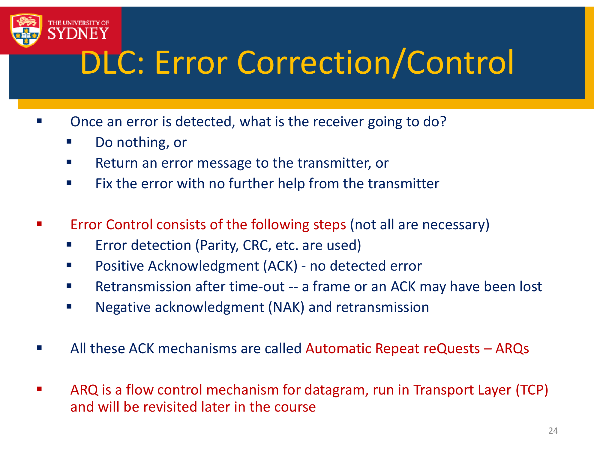
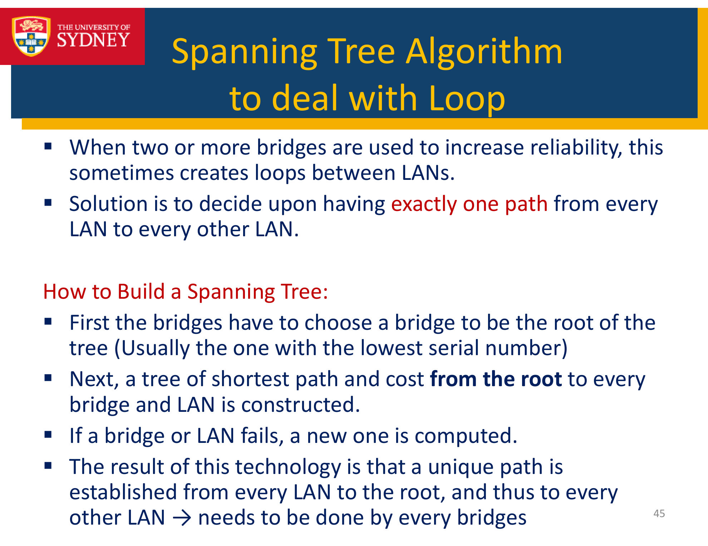
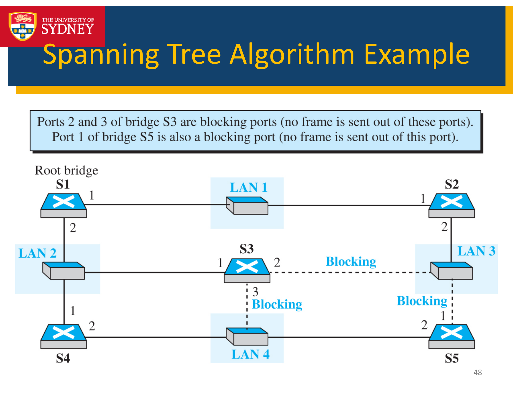
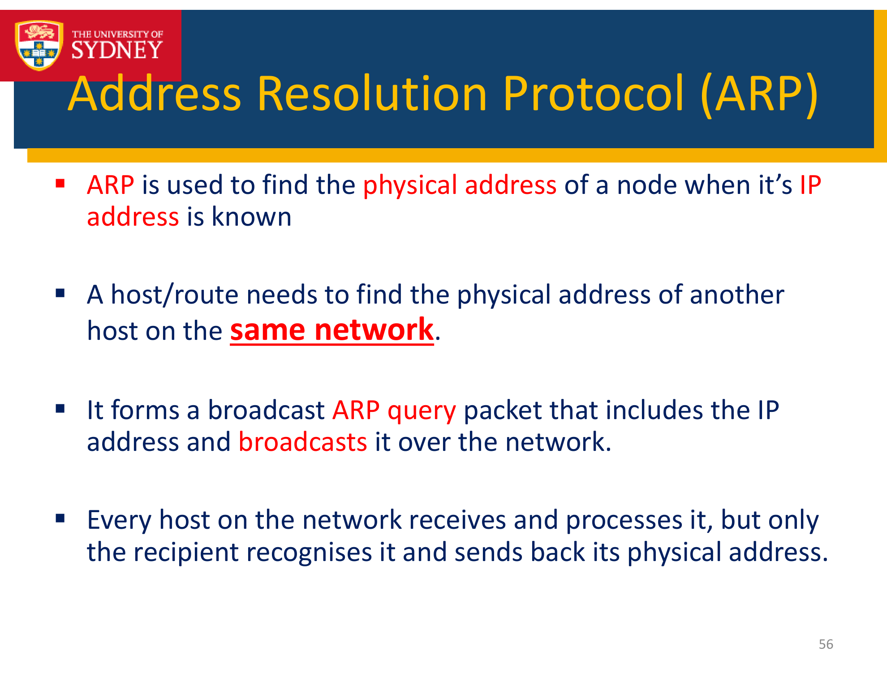
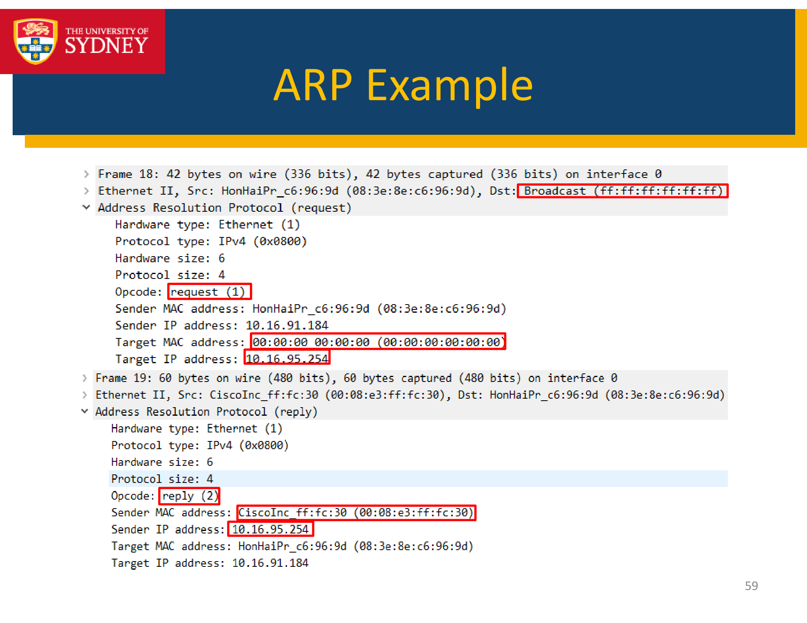

---

## 第 1 页


**提问：** 对截图中的内容逐句详细使用中文解释，不仅仅只是翻译，还需要对它们进行适当的解释,告诉我该怎么教学生并且指导怎么做

好的，我来逐句为你详细解释截图中的内容，并结合教学场景告诉你如何向学生讲解和引导。

---

### 1. **“Lecture 3”**

* **字面意思**：这是第三讲。
* **解释**：说明这是课程中的第三次课，通常表示课程内容是按顺序递进安排的。
* **教学建议**：你可以先提醒学生这是在前两讲的基础上继续展开的内容，鼓励他们回顾前两讲所学的知识，为今天的学习建立连接。例如，可以问学生：“大家还记得上节课我们讨论的是哪一层吗？今天我们会往下走到数据链路层。”

---

### 2. **“Data Link Layer”**

* **字面意思**：数据链路层。
* **解释**：数据链路层是 OSI 七层模型中的第二层，主要负责在相邻节点之间可靠传输数据帧。它与物理层合作，确保数据能准确地从一个设备传到另一个设备。
* **教学建议**：你可以在这里画一个简化版的 OSI 七层模型，让学生直观地看到数据链路层所处的位置。可以提问引导学生思考：“如果没有这一层，数据在传输过程中可能会出现什么问题？”

---

### 3. **“ELEC 3506/9506 Communication Networks”**

* **字面意思**：课程编号 ELEC 3506（本科）/9506（研究生），课程名称是通信网络。
* **解释**：这说明该课程既面向本科生（3506）也面向研究生（9506），内容会覆盖通信网络的基本原理。数据链路层正是通信网络中的一个重要部分。
* **教学建议**：这里你可以强调：本科生需要掌握基本概念和机制，研究生则需要深入理解应用、协议设计和实际问题解决方式。在课堂上，你可以分层次布置问题，比如本科生回答“数据链路层主要的功能是什么？”，研究生则思考“不同的链路协议如何在性能和可靠性之间做权衡？”

---

### 4. **“Dr Wibowo Hardjawana”**

* **字面意思**：授课教师的名字。
* **解释**：表明本课程由 Dr Wibowo Hardjawana 讲授。
* **教学建议**：在教学场景下，可以借此提醒学生：课件只是辅助工具，理解和互动才是学习的关键。也可以告诉学生：“这些内容是我们课程负责人编写的，如果有不理解的地方，可以随时提出。”

---

### 5. **“School of Electrical and Information Engineering”**

* **字面意思**：电气与信息工程学院。
* **解释**：说明课程属于悉尼大学电气与信息工程学院，定位在信息与通信工程领域。
* **教学建议**：你可以引导学生理解这门课在专业学习中的作用——它不仅是理论学习的一部分，也是与电气工程、信息工程实践紧密相关的核心课程。比如，可以让学生思考：“未来如果要设计一套无线通信系统，数据链路层会承担什么任务？”

---

## 教学指导建议

1. **从整体到局部**

   * 先用 OSI 七层模型引入，让学生看到数据链路层的位置。
   * 再逐步讲解它的功能：帧封装、寻址、差错检测、流量控制等。

2. **用实例帮助理解**

   * 可以用 Wi-Fi 或以太网的例子，让学生更贴近生活。比如告诉他们：“你们的电脑通过 Wi-Fi 发送数据时，链路层会把 IP 数据报封装成帧，再交给物理层去传输。”

3. **引导思考和讨论**

   * 问学生：“如果链路层没有差错检测机制，会发生什么？”
   * 或者让学生小组讨论不同链路协议（如以太网 vs PPP）的应用场景。

4. **结合实验/作业**

   * 可以安排抓包实验（如 Wireshark），让学生观察数据帧结构。
   * 作业可以是分析一个具体协议的帧格式，并解释其中各个字段的作用。

---

要不要我帮你把“数据链路层”这一讲可能的**课程大纲**（比如：功能、协议、错误检测、介质访问控制）整理出来，这样你在授课时会更有逻辑？


---

## 第 2 页


**提问：** 对截图中的内容逐句详细使用中文解释，不仅仅只是翻译，还需要对它们进行适当的解释,告诉我该怎么教学生并且指导怎么做

好的，我们来逐条拆解这张幻灯片中的内容，用中文进行解释，并结合教学方法，指导你如何教学生理解这些知识点。

---

## 标题：**Topics of the day（今日主题）**

* **解释**：这页幻灯片说明了今天课程的主要内容。它实际上是“学习目标”或“教学提纲”，帮助学生提前知道课堂上要覆盖的重点。
* **教学建议**：在讲课一开始就展示这页，明确告诉学生：“今天我们要学习的数据链路层内容包含哪些方面”，这样学生会更有方向感和结构感。

---

### 1. **Data Link Layer Services（数据链路层的服务）**

* **解释**：数据链路层主要向网络层提供服务，包括可靠传输、帧传递、差错控制和流量控制。
* **教学方法**：

  * 先引导学生理解“服务”这个词：服务就是“上层不需要关心底层是怎么做的，只要能用”。
  * 举例：当你用网卡连接到网络时，你不需要知道网卡如何检测错误、如何控制流量，这些都是数据链路层提供的“服务”。
  * 可以画一张“分层服务图”，说明每一层是如何为上一层“打工”的。

---

### 2. **Framing（成帧）**

* **解释**：成帧就是把一段数据划分成一个个“帧”（frame），每个帧都有起始标志、地址、数据、校验位等。它确保接收端能区分出哪一段数据从哪里开始、到哪里结束。
* **教学方法**：

  * 可以类比“寄快递”：成帧就像给数据打包，加上地址和包装袋。
  * 可以在课堂上展示 **以太网帧格式**，让学生看到具体字段（目的地址、源地址、类型、数据、CRC 校验等）。
  * 引导学生思考：“如果没有成帧机制，接收方怎么知道哪部分数据属于一个消息？”

---

### 3. **Error Detection（错误检测）**

* **解释**：在传输过程中可能会出现比特错误。错误检测机制（如奇偶校验、CRC 校验）可以发现数据是否出错。
* **教学方法**：

  * 用直观的比喻：就像超市收银小票的条码校验位，可以检查数据有没有问题。
  * 可以做小实验：让学生把一段二进制数据加上简单的奇偶校验，再模拟传输时翻转一位比特，看能不能检测出来。
  * 提问引导：“检测到错误后，链路层该怎么办？是丢弃？还是通知重传？”

---

### 4. **Error Correction（错误纠正）**

* **解释**：不仅仅要发现错误，还要能够自动修复（例如汉明码 Hamming Code）。
* **教学方法**：

  * 先说明“检测 ≠ 纠正”，检测只告诉你“有问题”，而纠正还能修复。
  * 举例：纠错码可以在数据丢失时自动补齐，就像手机短信即使有干扰仍能完整显示。
  * 可以引导学生比较“检测 + 重传”与“纠正”的区别，理解不同场景下哪种方式更高效（比如卫星通信用纠错更好，因为重传代价高）。

---

### 5. **Protocols（协议）**

* **解释**：数据链路层有多种协议，比如以太网（Ethernet）、点对点协议（PPP）、高清晰度多媒体接口 HDMI 的传输协议等。
* **教学方法**：

  * 可以挑 **以太网协议** 来详细讲解，因为学生最熟悉。展示其帧格式和使用场景。
  * 让学生对比不同协议：PPP 用于点对点链路，Ethernet 用于局域网。
  * 引导学生理解：协议 = “规则 + 约定”，没有协议就无法通信。

---

### 6. **Data Link Layer Networking Devices（数据链路层的网络设备）**

* **解释**：链路层涉及的典型设备有桥接器（Bridge）、交换机（Switch）、路由器（Router）。
* **逐条教学建议**：

  * **Bridges（桥接器）**

    * 作用：连接两个局域网，过滤和转发数据帧。
    * 教学方法：用两个小局域网的例子，说明桥接器如何“只转发有用的帧”。
  * **Switches（交换机）**

    * 作用：常见于局域网，能基于 MAC 地址转发数据，效率比桥接器更高。
    * 教学方法：可以拿出实际交换机或用网络拓扑图说明。让学生区分 Hub（集线器，所有端口都广播）与 Switch（点对点转发）。
  * **Routers（路由器）**

    * 作用：严格来说主要工作在网络层，但在教学中可以提到路由器同时理解链路层与网络层的功能。
    * 教学方法：说明家用路由器既包含链路层功能（管理交换），又有网络层功能（转发 IP 包）。
    * 可以让学生分组讨论：“路由器和交换机的区别在哪里？”

---

## 总体教学指导

1. **逻辑递进**

   * 先讲服务（为什么需要数据链路层）
   * 再讲实现机制（成帧、错误检测、错误纠正）
   * 最后讲协议和设备（实际应用）。

2. **多用生活类比**

   * 成帧 = 打包快递
   * 错误检测 = 条码校验
   * 交换机 = 智能快递柜，知道东西送给谁

3. **实验/练习建议**

   * Wireshark 抓包 → 观察 Ethernet 帧
   * 奇偶校验小实验 → 模拟传输错误
   * 拓扑设计练习 → 画出用交换机和路由器组成的小型网络

---

要不要我帮你把这一页内容整理成一个 **分阶段的课堂教学流程**（比如：导入 → 知识讲解 → 实例 → 课堂互动 → 小练习），这样你就可以直接按步骤带学生走完一堂课？


---

## 第 3 页


**提问：** 对截图中的内容逐句详细使用中文解释，不仅仅只是翻译，还需要对它们进行适当的解释,告诉我该怎么教学生并且指导怎么做

下面按幻灯片逐句讲解，并给出课堂讲法与可落地的小练习。你可以直接照着这套“讲解→提问→活动→小结”的节奏带学生。

---

# Data Link Layer Services（数据链路层提供的服务）

## 1) “Data Link layer ensures **reliable datagram** delivery between two physically connected devices”

* **解释**：

  * “datagram”此处可理解为来自网络层的 IP 数据报；到链路层会被装进“帧（frame）”里传给下一跳。
  * “reliable”在链路层语境里通常意味着**在同一条物理链路上**尽量做到无差错或可恢复的传输（检测/重传/纠错），并非端到端的可靠（那是传输层 TCP 的职责）。
  * “physically connected devices”强调是**相邻节点**（如你的电脑 ↔ 交换机端口）。
* **教学怎么说**：

  * 先画一个两节点加一条链路的图（Host A ——— Switch/Host B），问：“A 把一个 IP 包交给链路层后，怎样保证它在这条线上传得稳？”
  * 辨析三个概念：包（packet/IP datagram）— 帧（frame）— 比特（bit）。
* **课堂活动（3 分钟）**：

  * 让学生把“端到端可靠”（TCP）与“链路上可靠”（链路层）各举 1 个机制例子，黑板列两栏对比。

---

## 2) “**Framing**”

### “encapsulate datagram into frame, adding header, trailer”

* **解释**：

  * 成帧＝把网络层数据报**封装**到帧里；帧前面有**首部（header）**，后面可有**尾部（trailer）**。
  * 以以太网为例：目的 MAC、源 MAC、类型 / 长度、负载、FCS（CRC 校验）等。
* **教学怎么说**：

  * 画出以太网帧结构，用颜色标注“头/负载/尾”，并强调尾部的 FCS 用于错误检测。
  * 用“寄快递”比喻：外包装（头尾）+货物（负载）。

### “‘physical addresses’ used in frame headers to identify source, destination – different from IP address!”

* **解释**：

  * “physical address”指**链路层地址**（MAC 地址），用来在同一链路或二层网内识别节点；**与 IP 地址不同层次、不同作用**。
  * 数据转发时：同一网段看 MAC，跨网段靠路由器看 IP。
* **教学怎么说**：

  * 在白板上标两台主机的 IP/MAC，并演示 ARP：已知 IP → 解析出目标 MAC → 决定帧头写谁。
* **动手指导（10–12 分钟）**：

  1. Wireshark 抓本机任意流量，筛选 `eth`，让学生截图一个以太网帧，标出 **Dst MAC / Src MAC / Type / FCS**。
  2. 追踪一次 ping：看 IP 层的目的地址与二层帧头的目的 MAC 的对应关系。

---

## 3) “**Access Control**”

### “Determining who should have access to the physical layer”

* **解释**：

  * 指**介质访问控制（MAC, Medium Access Control）**：当多台设备共享同一介质（空气、同轴、双绞线）时，如何决定**谁先发**、怎么**避免/处理冲突**。
  * 常见机制：CSMA/CD（早期有冲突检测，以太网集线器时代）、CSMA/CA（Wi-Fi 先听后说、退避）、令牌传递、时隙/轮询等。
* **教学怎么说**：

  * 给三种典型场景：共享总线（老式乙太）、无线（802.11）、交换式以太（每端口独占——冲突域消失）。
* **课堂小游戏（5 分钟）**：

  * “碰撞演示”：让 6 名学生排队代表 6 台主机，给他们“报文卡片”。设置“先听后说、随机退避”的规则，模拟 Wi-Fi 的冲突与退避，其他同学计时看总吞吐有何变化。
* **总结**：

  * 访问控制目标＝**公平 + 高吞吐 + 低冲突**；不同介质与场景选不同算法。

---

## 4) “**Error Detection**”

### “errors caused by signal attenuation, noise”

* **解释**：

  * 比特在物理链路上传输会受**衰减、噪声、串扰**等影响，出现 0/1 翻转（位错误），形成**误码率 BER**。

### “receiver detects presence of errors, signals sender for retransmission or drops frame”

* **解释**：

  * 常见检测：**奇偶校验、校验和、CRC**（链路层主力）。
  * 处理策略：

    * **ARQ 重传**：Stop-and-Wait、Go-Back-N、Selective Repeat；
    * 或者**直接丢弃**（上层决定是否重传）。
* **教学怎么说**：

  * 用 16 位小例子演示 CRC 的“发现多位错误”的强大；顺带对比“校验和”的弱点。
* **动手指导（8–10 分钟）**：

  * 发一段 8 位二进制给学生，加 1 位奇偶校验；随机让同学“翻转”一位，检查是否被发现。
  * 拓展：给出一个生成多项式（如 CRC-8），让学生用现成在线计算器（或老师演示）验证检测效果。

---

## 5) “**Error Correction**”

### “receiver identifies **and corrects** bit error(s)”

* **解释**：

  * **前向纠错 FEC**：接收端**不重传**就能纠正一定数量的位错误；代表性编码：**Hamming(7,4)、Reed-Solomon、LDPC、卷积码**等。
  * 取舍：**冗余↑ ⇒ 带宽开销↑，时延↑，但重传↓**。卫星/广播等高时延/高误码应用偏好更强 FEC。
* **教学怎么说**：

  * 对比“检测+重传（ARQ）”与“FEC”：何时选谁？（链路短、误码低选 ARQ；高时延、重传代价大选 FEC，或两者结合）。
* **动手指导（10 分钟）**：

  * 小组做 **Hamming(7,4)**：给 4 位数据，算 3 位校验，组合成 7 位码；老师随机翻转 1 位，让学生定位并纠正。

---

# 一堂 50–60 分钟的可执行课堂流程

1. **导入（5’）**：展示“Link 层确保相邻可靠”的大图，区分包/帧/比特。
2. **成帧（10’）**：画以太网帧；Wireshark 抓包观察头/尾。
3. **地址与 ARP（5’）**：对比 IP vs MAC，演示一次 ARP 解析。
4. **介质访问控制（8’）**：讲 CSMA/CD/CA；做“冲突与退避”小游戏。
5. **差错检测（10’）**：奇偶/CRC 概念+小练习；说明重传策略。
6. **差错纠正（10’）**：Hamming 演练；讨论 FEC 与 ARQ 取舍。
7. **小结与提问（2’）**：回到“Data Link Services”五条，逐条确认“我能解释…”。

---

# 课后/实验与考核建议

* **实验**：

  * 用 Wireshark 记录一次本地网络访问，提交 1 张帧结构截图并标注字段含义；写出一次 ARP 请求/应答过程。
* **练习**：

  * 给出几组噪声/衰减情境，选择“ARQ / FEC / 二者结合”的策略并说明理由。
  * 计算 2 道 Hamming(7,4) 纠错题。
* **口试提问清单**：

  * 为什么链路层要有“帧尾（FCS/CRC）”？
  * 交换机如何用 MAC 表转发？与路由器基于 IP 的转发有什么本质区别？
  * Wi-Fi 为什么用 CSMA/CA 而不是 CSMA/CD？

这样讲，学生既能抓住“链路层做什么”，也能通过抓包/演算真正“会做”。如果你愿意，我可以把上述课堂板书与练习题整理成一页讲义。


---

## 第 4 页


**提问：** 对截图中的内容逐句详细使用中文解释，不仅仅只是翻译，还需要对它们进行适当的解释,告诉我该怎么教学生并且指导怎么做

下面按幻灯片逐句拆解，并给你一套“怎么讲 + 怎么做”的课堂脚本与可操作演示。

---

# Where is the link layer implemented?（链路层实现在哪里？）

## 1) “in each-and-every host”

* **解释**：每一台主机（PC、手机、服务器、IoT 设备）上都必须有链路层，否则它没法把网络层的数据送进物理介质。
* **怎么讲**：先问学生一个反问——“手机和服务器在二层上有什么共同点？”引出“所有终端都有链路层”。
* **现场演示**：

  * **Windows**：`ipconfig /all`（让学生找本机的 **MAC 地址**，证明链路层存在）。
  * **Linux/macOS**：`ip link` 或 `ifconfig`（同样找到 MAC）。
* **板书小结**：主机最少需要：网络层(IP) + **链路层(MAC/成帧/差错)** + 物理层(比特)。

---

## 2) “link layer implemented in **network interface card (NIC)** or on a chip”

* **解释**：链路层通常由**网卡/NIC**实现，也可能集成在**SoC**上（手机的 Wi-Fi/Bluetooth 基带）。
* **怎么讲**：展示一块 PCIe 有线网卡图和一张 Wi-Fi 模块图，对比“独立网卡”vs“芯片内置”。强调：**实现位置不同，但职责一样**。
* **动手找一找**：

  * **Windows** 设备管理器 → “网络适配器”。
  * **Linux**：`lspci | grep -i ethernet`、`lsusb | grep -i network` 查看网卡/USB 网卡。
  * **macOS**：`networksetup -listallhardwareports` 查看硬件端口与 MAC 的映射。

### “• Ethernet, WiFi card or chip”

* **解释**：以太网卡、Wi-Fi 卡/芯片都是 NIC 的不同形态；只要负责把帧放到介质上、从介质收帧，就是链路层硬件。
* **课堂提醒**：不同介质 ⇒ 不同**介质访问控制**（有线多为交换、无线用 CSMA/CA），但都属于二层。

### “• implements link, physical layer”

* **解释**：一张 NIC 通常同时包含**链路层(MAC)** 和**物理层(PHY)**。

  * **MAC（控制器）**：成帧、地址过滤、FCS 计算、队列/缓冲、DMA。
  * **PHY（收发器）**：电信号/射频调制、线路编码（如 1000BASE-T 的 PAM-5）、链路训练。
* **怎么讲**：用“控制器(MAC) + 收发器(PHY)”二块框图说明职责分离；指出家用路由器/交换机里也有大量 MAC/PHY。
* **可选演示**：`ethtool -i <接口名>`（Linux）查看驱动与固件；让学生理解**驱动=软件，固件=跑在网卡上的小程序**。

---

## 3) “attaches into host’s system buses”

* **解释**：NIC 需要插在主机的**系统总线**上与 CPU/内存打交道：PCI/PCIe（台式机/服务器）、USB（USB 网卡/手机共享网络）、M.2/SDIO（笔记本/移动端）。
* **怎么讲**：画一条数据路径：**内存 ↔（DMA）↔ NIC 控制器(MAC) ↔ PHY ↔ 线缆/天线**。强调 DMA 可降低 CPU 负担。
* **动手**：

  * **Linux**：`lspci -vv -s <设备号>` 看 NIC 的总线与能力（MSI-X、中断、带宽）。
  * 解释“中断/环形缓冲/队列”的基本思路，让学生知道性能为何与总线相关。

---

## 4) “combination of **hardware, software, firmware**”

* **解释**：链路层并非纯硬件。

  * **硬件**：MAC/PHY 电路、收发器。
  * **固件**：运行在 NIC 上的小型程序，负责自检、功耗、队列管理、加密协处理等（Wi-Fi 尤其明显）。
  * **软件**：操作系统的**驱动程序**与网络栈，配置网卡参数（速率、自协商、VLAN、队列策略）并与上层协议对接。
* **怎么讲**：举例“更新网卡驱动/固件后 Wi-Fi 变稳定”，让学生体会三者协同的重要性。
* **演示建议**：

  * **Windows**：设备管理器里看驱动版本；
  * **Linux**：`modinfo <驱动名>`、`dmesg | grep -i firmware`；
  * 展示调整：`ethtool -s eth0 speed 1000 duplex full autoneg on`（在演示环境谨慎执行或用虚拟机）。

---

## 右侧图示该如何讲

* **CPU / memory / host bus (e.g., PCI)**：说明 NIC 通过主机总线与 CPU/内存互联，数据包通过 DMA 进出内存。
* **controller（MAC）↔ physical（PHY）**：两块蓝色箭头表示从帧到电/射频信号的转化。
* **network interface**：从主机延伸出去的就是“网络接口”，可以是以太网口、Wi-Fi 天线等。

---

## 一节 25–30 分钟的可执行教学流程

1. **引入（3’）**

   * 提问：“你们电脑上哪里在‘做’链路层？”引出“每台主机都有 + NIC/芯片实现”。

2. **NIC = MAC + PHY（8’）**

   * 画框图（MAC/PHY）。
   * 说出成帧、FCS、过滤、DMA 与物理编码/调制的职责划分。

3. **总线与数据路径（6’）**

   * 解释 PCIe/USB/M.2；画“内存⇄DMA⇄MAC⇄PHY⇄介质”。

4. **软/硬/固件协同（5’）**

   * 驱动、固件更新带来的功能/稳定性变化；VLAN、速率自协商等由谁控制。

5. **动手练习（7–10’）**

   * Windows/Linux/macOS 任一平台：

     * 找到本机 NIC、驱动版本、MAC 地址；
     * 说出它接的是哪种总线；
     * 截图/记录并提交一段说明（1～2 段文字）：“我的链路层在哪里？它如何连到物理层？”

---

## 作业/考核建议（任选）

* **短答**：用 150–200 字说明“为什么说链路层是软硬件共同实现的？”
* **绘图**：画出你电脑从“应用发送到网线/天线”的数据路径，标注 MAC/PHY、总线、DMA。
* **实验**：用 Wireshark 过滤 `eth` 或 `wlan`，截取一帧并标注头/负载/FCS。

---

用这套讲解与演示，学生不只会背“链路层在 NIC 里”，还能**找到它、看见它、理解它如何与 CPU/内存和物理介质协作**。需要的话，我可以把课堂用到的命令和一张“MAC/PHY/PCIe”示意图做成讲义给你发。


---

## 第 5 页


**提问：** 对截图中的内容逐句详细使用中文解释，不仅仅只是翻译，还需要对它们进行适当的解释,告诉我该怎么教学生并且指导怎么做

下面按这页幻灯片逐句拆解，并给你一套“怎么讲 + 学生怎么做”的课堂脚本。目标是让学生**看懂图、说清流程、做出验证**。

---

# 标题：Interfaces communicating（接口如何彼此通信）

**解释**：这里的“接口”指两台主机上的**网络接口（NIC：MAC+PHY）**。图中左边是发送端主机，右边是接收端主机；蓝色粗线代表物理链路。灰色喇叭形状表示数据从上层“漏斗”到 NIC，再从 NIC“喷射”到链路/再被对端“收集”。

**课堂开场（1分钟）**

* 提问：*“一份 IP 数据报从发送主机出来，到接收主机上交给上层，经历了哪几个关键步骤？”*
* 告诉学生：我们用这张图把\*\*发送端（左）**和**接收端（右）\*\*拆开看。

---

## 左侧（sending side：发送端）

> **“encapsulates datagram in frame”**
> **把网络层的数据报封装成帧**

* **解释**：IP 数据报到达链路层后，链路层给它加**帧头/帧尾**（如以太网目的/源 MAC、类型、FCS）。这一步叫**成帧**。
* **讲法**：画三段式示意：`[帧头][IP 数据报][帧尾]`。强调“帧是二层单位，包是三层单位”。
* **动手**（3–5 分钟）：

  * Wireshark 抓一个以太网帧，让学生指出 **Dst MAC / Src MAC / EtherType / FCS（若可见）**。
  * 让学生口头描述：“这一帧的‘负载’是什么协议？”

> **“adds error checking bits, reliable data transfer, flow control, etc.”**
> **添加差错检测位，并实现链路上的可靠传输、流量控制等机制**

* **解释**：

  * **差错检测**：FCS/CRC 位用于检测比特错误。
  * **可靠传输**（在单跳链路上）：可能使用**ARQ**（确认+重传）或与物理层配合的 FEC；并非端到端可靠。
  * **流量控制**：避免把对端 NIC 的接收缓冲塞满（以太网可用 PAUSE，Wi-Fi 有自己的退避/速率控制；更常见的是上层或驱动侧的队列/拥塞控制协同）。
* **讲法**：

  * 用“装箱发货”类比：CRC 是“防拆贴/称重单”，对方一验就知道箱子坏没坏；流量控制像“仓库进货限流”。
* **小实验提示**：

  * Linux 上 `ethtool -S <iface>` 观察 NIC 统计（如 tx\_errors、rx\_errors、pause\_\*）；发送/接收压力下统计会变化（演示在实验环境进行）。

---

## 右侧（receiving side：接收端）

> **“looks for errors, reliable data transfer, flow control, etc.”**
> **检查错误并配合可靠传输、流量控制等机制**

* **解释**：

  * NIC 在硬件里先做 **FCS/CRC 校验**，坏帧一般在硬件就丢弃并记计数。
  * 若采用链路层 ARQ，接收端要发 ACK/NACK 或触发重传（具体取决于技术/介质，如某些无线链路）。
  * 流量控制：接收端可以发出暂停/速率建议或通过退避机制调节。
* **讲法**：指出图中右侧 NIC 的“controller/physical”块：**先物理层把比特恢复成符号 → 再由 MAC 做校验/过滤/入队**。

> **“extracts datagram, passes to upper layer at receiving side”**
> **把帧里的数据报取出，上交给接收端的上层协议**

* **解释**：

  * **解封装**：去掉帧头/尾，得到原始 IP 数据报。
  * **向上递交**：依据 EtherType/802.2 等把负载交给网络层（IP），再由 IP 交给传输层（TCP/UDP）……
* **讲法**：把发送端的三段式反过来：`[帧头][IP 数据报][帧尾] → 去头去尾 → [IP 数据报]`。
* **动手**：

  * Wireshark 选中一帧，展开 Packet Details，让学生找到“Frame / Ethernet II / Internet Protocol / TCP/UDP”的层级结构，并截图标注“去封装路径”。

---

## 用这张图讲清“端到端路径”（2–3 分钟复盘）

1. **应用/传输/网络层**在发送端生成**IP 数据报**（蓝色“datagram”框）。
2. 数据报到**链路层** → 成帧（加头尾、CRC、地址）。
3. **MAC** 通过 **DMA** 把帧放入发送队列，**PHY** 把比特送到介质（蓝线）。
4. 对端 **PHY** 收到比特 → **MAC** 校验/过滤/入队。
5. **链路层**解封装 → 交给对端**网络层**（蓝色“datagram”框再次出现）。

> **课堂提问**：*“如果 CRC 错了会发生什么？”*、*“同一网段内转发看的是 IP 还是 MAC？”*、*“为什么交换机能不产生碰撞？”*
> 让学生用图中的位置回答：错在 MAC 就丢帧/重传；同网段看 MAC；交换式以太每端口独占冲突域。

---

## 可落地的课堂活动（15–20 分钟）

1. **抓包定位封装/解封装**（5–7’）

   * 让学生发一个 `ping` 同网段主机。
   * Wireshark 过滤 `icmp && eth`，截取一个往返。
   * 标注：以太网头部（Dst/Src/Type）、IP 头部、ICMP。
   * 说出：**在发送端何时成帧、在接收端何时解封装**。

2. **差错检测小练习**（5’）

   * 发一段 16 位数据，手算奇偶位或简化 CRC（老师给生成多项式）。
   * 模拟翻转 1 位，让学生检验能否发现。

3. **链路“可靠+流控”角色扮演**（5–8’）

   * 3 人一组：发送者、链路、接收者。
   * 规则：若“链路”暗示出错（举红牌），接收者发 NACK；若“接收队列满”（举黄牌），发送者暂停 1 拍。
   * 总结：**ACK/NACK/暂停**分别对应链路层的**重传与流控**。

---

## 常见误区与纠正

* **误区1**：以为“可靠传输=TCP 的事”。

  * **纠正**：链路层也可以在**单跳**上做可靠，目标与 TCP 不同、范围更小。
* **误区2**：把 **IP 地址**当作二层转发依据。

  * **纠正**：同一二层网内依靠 **MAC**；跨网段才由路由器根据 **IP** 转发。
* **误区3**：认为“CRC 错了还能交给上层再说”。

  * **纠正**：大多数 NIC **硬件直接丢弃坏帧**，并记错误计数。

---

## 课后（或实验报告）建议

* **任务 A**：抓取一段本机到网关的流量，截图并用文字解释：成帧字段、CRC 的作用、解封装后的上层协议。
* **任务 B**：画出“从应用到网卡再到线缆、再到对端网络栈”的**数据路径图**，标明每一步在图上的位置和作用。
* **任务 C（选做）**：在 Linux 上用 `ethtool -S` 记录 1 分钟内的 `rx_errors/tx_errors` 统计，描述导致错误的可能物理原因。

---

这样讲下来，学生能把抽象的“二层通信”与**帧结构、CRC、MAC/PHY、流控/重传**一一对上，并能在抓包与小练习里**验证**自己是否真正理解。


---

## 第 6 页


**提问：** 对截图中的内容逐句详细使用中文解释，不仅仅只是翻译，还需要对它们进行适当的解释,告诉我该怎么教学生并且指导怎么做

下面把这页 **“Two sublayers（两层子层）”** 逐条讲清楚，并给你可直接带班的讲解话术+小实验。

---

## 总览：为什么链路层要再拆成两个“子层”？

* 在很多网络（尤其是 IEEE 802 系列，如以太网、Wi-Fi）里，\*\*链路层（Data-link layer）\*\*被分成两块：

  1. **Data link control sublayer**（教材常写 *DLC*；在 IEEE 802 中的正式名字是 **LLC：Logical Link Control**）
  2. **Media access control sublayer（MAC）**
* 直观理解：

  * **上半层（DLC/LLC）**：做“普遍适用”的链路层功能——**成帧、差错检测/纠正、（链路内）可靠性、流量控制、复用/去复用**。
  * **下半层（MAC）**：做“跟**介质**相关”的访问规则——**谁先发、怎么避免冲突、用什么地址在二层识别设备（MAC 地址）**。

> 课堂提示：先在白板画一个“链路层”大框，再横线分成上/下两个子层，左标“LLC/DLC”，右标“MAC”。
> 强调：DLC≈LLC（术语来自不同教材/标准）。

---

## 图(a)：**Data-link layer of a broadcast link（广播型链路的链路层）**

* **解释**：

  * “Broadcast link”是**多点共享介质**（一条媒介上挂了多台设备），例如**早期总线式以太网、无线局域网（Wi-Fi）**。
  * 因为**多人共用一条“喇叭”**，必须有**MAC 子层**来约法三章：**什么时候能发、检测/避免冲突、退避/令牌/时隙等**。
  * **DLC/LLC 子层**在上面提供与介质无关的通用功能：**封装成帧、FCS/CRC、链路内重传/确认（部分技术）、流控**。
* **怎么讲**（话术）：

  * “想象教室里只有一支麦克风（共享介质），大家都想说话。MAC 子层就是‘举手、按顺序’的制度；LLC 则是‘说话的格式和检查’，比如先报姓名（地址）、说完要不要确认。”
* **举例**：

  * **Wi-Fi（802.11）**：MAC 用 **CSMA/CA + 退避**；LLC 统一向上交以太类型/协议。
  * **集线器时代以太网**：MAC 有 **CSMA/CD**（碰撞检测）。
* **课堂小活动（5 分钟）**：

  * 让 6 个学生模拟 Wi-Fi：先“听”（信道空闲再发），若两人同时开口则“退避”N秒；其余同学计时比较“有规则 vs 没规则”的效率。

---

## 图(b)：**Data-link layer of a point-to-point link（点到点链路的链路层）**

* **解释**：

  * 两端**独享一条链路**，如**PPP/串口、两台设备直连的专线**。
  * **没有别人抢话**，因此 **MAC 子层要做的“介质竞争/仲裁”基本不需要或极简**，图里用灰色表示“弱化/省略”。
  * 工作重点放在 **DLC/LLC**：成帧、差错控制、（必要时）链路内的可靠/流控。
* **怎么讲**：

  * “教室里只有你和老师两个人，一支麦克风也够用，不需要举手制度；但你们仍然要遵守‘说话格式、检查是否听清楚’——这就是 LLC/DLC 在做的事。”
* **举例**：

  * **PPP（Point-to-Point Protocol）**：定义了帧格式、LCP/NCP 协商、鉴权等；没有 CSMA 之类的竞争算法。
  * **交换机端口到主机的全双工以太**：物理上是点到点，不再有碰撞；MAC 仍存在（地址/帧格式）但**冲突处理部分“空转”**。

---

## 容易混淆的点（课堂澄清）

1. **“有了交换机就不是广播链路？”**

   * 物理上变成**点到点**（每端口一条链），不再碰撞；但**二层依然有广播帧（如 ARP 请求）**，交换机会在一个**广播域**内泛洪。
2. **“LLC 和 DLC 是不是不同东西？”**

   * 多数教材把 **DLC≈LLC**。IEEE 802 正式用 **LLC**，本课件用“Data link control”表意更直白。
3. **“点到点就没有 MAC 了？”**

   * **地址/帧格式仍由 MAC 定义**；只是“多点竞争”的那部分逻辑几乎不用。

---

## 你可以直接用的 15–20 分钟课堂流程

1. **5’ 概念建立**

   * 画出“链路层 → 两个子层”框图；给出两类链路场景（Wi-Fi vs PPP）。
2. **7’ 对照讲解**

   * 表格对比：

     * **LLC/DLC**：成帧、FCS、（链路内）可靠、流控、复用。
     * **MAC**：寻址、介质访问控制（CSMA/CA、令牌、TDMA…）。
3. **5’ 现场验证**

   * **Wireshark** 抓 Wi-Fi 或以太网一帧：指出**MAC 地址/类型/序号/FCS**—说明这些字段属于 **MAC/DLC** 的职责。
   * 简述 PPP 帧（可展示一张 PPP 帧结构图片或板书字段：Flag、Address、Control、Protocol、Payload、FCS、Flag）。
4. **3’ 提问小测**

   * “为什么点到点链路几乎不需要 MAC 的竞争算法？”
   * “交换网络里为什么还需要 MAC 地址？”

---

## 练习/作业（可选）

* **概念题**：把下面技术按“更依赖 MAC 还是 LLC”分类并说明理由：802.11、PPP、令牌环、全双工以太网。
* **抓包题**：提交 1 张以太网帧截图，标注 **Dst/Src MAC、Type、FCS**；并用 2～3 句解释这些字段分别由哪个子层负责。
* **思考题**：在卫星点到点链路上，若误码率高、时延大，你会把**链路层可靠**交给 FEC（LLC/DLC）还是依赖上层重传？为什么？

---

用这套讲解，学生能明确：**链路层=LLC/DLC（通用控制）+ MAC（介质访问）**；**多点共享才需要强 MAC，点到点以 LLC/DLC 为主**。


---

## 第 7 页


**提问：** 对截图中的内容逐句详细使用中文解释，不仅仅只是翻译，还需要对它们进行适当的解释,告诉我该怎么教学生并且指导怎么做

下面把这页 **“Two sublayers（两层子层）”** 逐句拆开讲，并给你可直接照搬的上课节奏（本周与下周的内容分配、活动与作业）。

---

# 标题：Two sublayers

* **解释**：链路层可再细分为两个“子层”：

  1. **Data link control sublayer（DLC/LLC）**：与介质无关的“通用控制”，负责成帧、差错检测/纠正、链路内可靠与流量控制、向上层交付等。
  2. **Media access control sublayer（MAC）**：与介质相关的“上麦规则”，谁先发、如何避免/解决冲突、地址识别等。
* **教学提示**：先画一个“链路层”大框，再横线分成上下两块，在上面写 **DLC/LLC**，下面写 **MAC**。告诉学生：**今天/本周聚焦 DLC；MAC 放到下周专讲**。

---

## 图 (a)：Data-link layer of a broadcast link（广播型链路的链路层）

* **解释**：广播型链路=**多点共享介质**（如早期总线以太网、Wi-Fi）。上方黄色是 **DLC/LLC**，下方蓝色是 **MAC**；蓝色椭圆和右侧 **“next week”** 表示：**MAC 将在下周详讲**。
* **为什么要 MAC**：因为多人共用一条“喇叭”，必须有**介质访问控制**（CSMA/CD、CSMA/CA、令牌、时隙/轮询、调度等）。
* **怎么讲**（话术）：

  * “只有一支麦克风（共享信道），MAC 规定**谁什么时候说**；DLC 规定**说话的格式与检查**（帧格式、CRC、确认/重传、流控）。”
* **课堂小活动（3–5 分钟）**：

  * 6 名学生模拟 Wi-Fi：只有信道空闲才能“发言”；若两人同时开口则随机退避 N 秒。其余同学计时比较有/无规则的吞吐差异。
* **本周与下周的分工**：

  * **本周**：看帧结构、CRC/差错、链路内可靠&流控、地址与成帧。
  * **下周**：看 **CSMA/CA、CSMA/CD、令牌、TDMA/轮询** 等 MAC 算法、碰撞域与广播域、吞吐/公平性分析。

---

## 图 (b)：Data-link layer of a point-to-point link（点到点链路的链路层）

* **解释**：两端独享一条链路（PPP、串口专线、交换机端口到主机的全双工链路）。灰色意味着**MAC 的“竞争/仲裁”功能弱化或不需要**；仍保留地址/帧格式等最基本职责。工作重心在 **DLC/LLC**：成帧、差错控制、（链路内）可靠/流控。
* **怎么讲**：

  * “只有你和老师两人对话，不需要举手制度（竞争仲裁），但**说话的格式与核对**仍然要（DLC/LLC）。”

---

## 课堂脚本（本周 20–25 分钟可执行）

1. **3’ 建模**：画“链路层→DLC/LLC + MAC”框图，用图(a)(b)对比“共享 vs 点到点”。
2. **10’ 深入 DLC/LLC**：

   * 成帧：以太网帧头/尾、FCS（CRC）作用。
   * 可靠/流控：链路内 ARQ vs FEC 的取舍（高时延用 FEC/混合，低时延可 ARQ）。
   * 演示：Wireshark 抓一帧，标注 **Dst/Src MAC、Type、FCS**；指出“这些属于 DLC/LLC+MAC 的共同产物”。
3. **5’ 快问快答**（概念纠偏）：

   * “全双工交换以太还有碰撞吗？”（没有；冲突域被端口隔离）
   * “同一二层网的转发依据是什么？”（MAC 地址）
   * “点到点链路为什么几乎不用竞争型 MAC？”（无人竞争）
4. **2’ 铺垫下周**：展示“next week”圈出的 MAC：将讨论 **CSMA/CA、退避、吞吐公式、隐藏/暴露终端**等。

---

## 学生“怎么做”（本周作业/实验）

* **实验 A（必做）**：抓取本机到同网段主机的一次通信，提交 1 张以太网帧截图并标注：**目的/源 MAC、类型、负载起始、FCS**；50–80 字解释“这些字段分别解决什么问题（成帧/寻址/差错）”。
* **练习 B（必做）**：把 **PPP、Wi-Fi、全双工以太网**分类为“强依赖 MAC 竞争/弱依赖”，并各给 1 句理由。
* **预习 C（为下周）**：阅读 802.11 MAC 的 CSMA/CA 简介；在 Wireshark 里抓 3 个 **Beacon/Probe** 报文，记录它们出现在二层哪里（提示：管理帧，仍在 MAC 子层范围）。

---

## 常见误区 & 纠正

* **误区**：“有交换机就没有广播。” → **纠正**：广播域仍然存在（ARP/DHCP 等会泛洪），只是**碰撞域**被端口隔离。
* **误区**：“点到点链路就没有 MAC。” → **纠正**：地址/帧格式仍由 MAC 定义，只是**竞争/仲裁**部分弱化。
* **误区**：“可靠只是 TCP 的事。” → **纠正**：**链路层也能在单跳上做可靠/流控**，目标和范围不同。

---

用这页的重点分工（**本周：DLC/LLC；下周：MAC**），学生既能把“帧/CRC/可靠/流控”学扎实，也会对下周的“介质访问与性能分析”有明确期待。


---

## 第 8 页


**提问：** 对截图中的内容逐句详细使用中文解释，不仅仅只是翻译，还需要对它们进行适当的解释,告诉我该怎么教学生并且指导怎么做

下面把这页 **“DLC: Framing（数据链路控制：成帧）”** 逐句拆开讲，并给你可直接使用的课堂讲法与练习。

---

## “The data link layer needs to pack bits into **frames**, so that each frame is distinguishable from another.”

* **解释**：

  * 链路层要把连续的比特**打包**成一个个**帧（frame）**。
  * 目的：接收方能**知道哪里是一个数据单元的开始和结束**，不同帧彼此**可区分**。
  * 常见做法：在帧里放**长度字段**或使用**特殊起止标志**（配合字节填充/比特填充）来做边界标记。
* **怎么教**：在白板画“比特流水→\[帧头|负载|帧尾]→比特流水”，演示“没有边界 = 听一段连贯噪声；有边界 = 每句话有句号”。
* **小练习（3’）**：给出一串比特和一个“标志 01111110”，让学生用“比特填充”规则提取出两帧。

---

## “Sender and destination addresses are added to the frame”

* **解释**：

  * 帧头里加入**源/目的的链路层地址**（如以太网 MAC）。
  * 作用：同一二层网络内由交换机/网卡**按 MAC 转发/过滤**，与三层的 IP 地址不同层次。
* **怎么教**：Wireshark 抓一帧，以太网层展开并标注 **Dst MAC / Src MAC**；让学生说出“这两个字段的作用各是什么”。

---

## “Usually a message is packetized into smaller frames (rather than packetizing into a single frame)”

* **解释**：

  * 一条较长的信息**通常被拆成多个较小的帧**，而不是塞进一个超大的帧。
  * 好处：

    1. **差错局部化**：坏了重传一个小帧即可；
    2. **流水并行**：链路可连续发送多个帧，提高吞吐；
    3. **公平和时延**：单个站点不会长时间独占介质；
    4. **与 MTU 匹配**：链路有**最大传输单元 MTU**，超出就要分片。
* **怎么教**：

  * 画 10KB 消息拆成若干 1500B 以太帧的示意图；
  * 强调“传输层分段（segmentation）→ 网络层报文（packet）→ 链路层成帧（framing）”的层层打包关系。
* **计算练习（5’）**：

  * 题：以太网负载 1460B，头尾开销合计 38B（简化含前导/间隔可另算），求效率 = 1460/(1460+38)。让学生算一算开销占比与拆帧对重传代价的影响。

---

## “Two types of framing:”

### “• **Fixed-size framing** (e.g., ATM)”

* **解释**：

  * **固定长度**的帧，收发双方只按固定字节数切割，不需要边界标志；
  * 例：**ATM 单元**固定 53 字节（5 字节头 + 48 字节负载）。
  * **优点**：硬件实现简单、交换转发快（“按格子走”）；
  * **缺点**：业务适配时可能**填充浪费**，灵活性差。
* **怎么教**：用“地砖”类比：每块一样大，铺起来快，但有缝隙/边角浪费。

### “• **Variable-size framing** (e.g., LANs)”

* **解释**：

  * **可变长度**的帧，需要用**长度字段**或**标志+填充**来标记边界；
  * 例：以太网帧 **64–1518B**（不含前导/间隙），Wi-Fi 也为变长。
  * **优点**：灵活、效率高（负载大时开销比更低）；
  * **缺点**：实现更复杂，需要处理边界和差错对齐。
* **怎么教**：展示两张截图：一张 66B 的 ARP 帧，一张 1514B 的数据帧，让学生体会“变长”的直观差异。

---

# 课堂可直接执行的 15 分钟活动

1. **抓包看帧界**（6’）

   * 让学生 `ping` 同网段主机或访问校园网站，Wireshark 过滤 `eth`.
   * 任务：挑两帧，记录长度、Dst/Src MAC、上层类型（IPv4/ARP），描述它们为何是“变长帧”。

2. **MTU 与分片小实验**（5’）

   * 在可控环境（或演示机）发送 `ping -s 2000`（或 `ping -M do -s 1473` 等命令，按系统差异调整），观察是否被拆/被禁止。
   * 讨论：为什么要有 MTU？如果没有，错误重传代价会怎样？

3. **开销/效率计算**（4’）

   * 给定两种帧大小（如 200B 与 1400B，头尾 38B），让学生算效率并对比“差错率 = 10^-5”时的**期望重传开销**（思路：帧越大，出错概率越高）。

---

# 容易混淆 & 纠正

* **误区**：“成帧就是网络层打包。”→ 纠正：**成帧是二层的事**；三层叫“分组/包”，四层叫“分段”。
* **误区**：“以太网没有帧尾。”→ 纠正：以太网有 **FCS（CRC）** 做帧尾（抓包工具可能默认不显示）。
* **误区**：“固定长度一定更高效。”→ 纠正：高速交换有优势，但**业务适配**与**负载比例**决定总体效率；许多 LAN 选择变长帧。

---

# 作业/考核建议

* **书面**：画出“比特流→帧→IP 包→TCP 段”的封装图，标出每层头尾及其作用。
* **计算**：给出误码率、MTU、头尾开销，比较“单大帧 vs 多小帧”的效率与重传代价。
* **实验**：提交两张 Wireshark 截图，分别为短帧与接近 MTU 的长帧，并用 80–120 字解释“为何 LAN 选择可变长度成帧”。

这样讲，学生不仅知道“**为什么要成帧**、**怎么区分帧边界**、**固定/可变长度各自的取舍**”，还能通过抓包与计算真正掌握其工程含义。


---

## 第 9 页


**提问：** 对截图中的内容逐句详细使用中文解释，不仅仅只是翻译，还需要对它们进行适当的解释,告诉我该怎么教学生并且指导怎么做

下面把这页 **“DLC: Variable-size framing（变长成帧）”** 逐条讲清，并配好可直接落地的课堂活动与练习。

---

# 1) Character-oriented（面向字符的变长帧）

**图意**：帧的结构是
`[Flag][Header][Data(可变字符数)] [Trailer][Flag]`

* **Flag（标志）**：用**特定字符值**表示帧的起止（历史上多为 ASCII 控制字符，如 `DLE STX` 开头、`DLE ETX` 结尾）。
* **Header（首部）**：包含地址、类型、序号等。
* **Data from upper layer（上层数据）**：**可变数量的“字符”**（传统协议里“字符=字节”）。
* **Trailer（尾部）**：常放差错检测（如 **LRC/CRC**）。

**为何“面向字符”**：

* 协议把**字节**当作基本单元，一切边界、控制都以\*\*字符（字节）\*\*为单位定义。

**核心问题：若数据本身出现了“标志字符”怎么办？**

* **字节填充（byte stuffing）**：在每个“与标志相同”的数据字节前，插入一个**转义字节**（如 `DLE`）。接收端看到 `DLE` 就知道**下一个字节是数据而不是控制**，再把 `DLE` 去掉复原。
* **优缺点**：实现直观，但**文本类/ASCII 协议**更合适；若数据中恰好频繁出现“转义或标志字节”，开销会上升。

**怎么教（话术 + 板书）**：

* 画一条帧：`Flag | H | D1 D2 0x10 0x03 D3 | T | Flag`
* 讲解：“0x10 0x03 正好等于我们的结束标志 `DLE ETX`，所以要在数据里的 `0x10` 前再插入一个 `0x10`（转义）。”
* **小练习（4’）**：给出一串数据字节和约定的起止标志，要求学生完成**发送端字节填充**；再让另一位同学做**接收端去填充**，两边对拍答案。

---

# 2) Bit-oriented（面向比特的变长帧）

**图意**：帧的结构是
`[Flag(01111110)][Header][Data(可变比特数)][Trailer][Flag(01111110)]`

* **Flag**：固定比特模式 **`01111110`**（HDLC/PPP 常用）。
* **Data from upper layer**：**可变数量的“比特”**（不必对齐到字节边界，当然绝大多数实现仍然按字节装载）。
* **Header/Trailer**：类似含地址、控制、**FCS/CRC** 等。

**为何“面向比特”**：

* 协议直接以**比特**为单位定义帧边界和转义规则，**与编码、透明传输结合更紧密**，比“面向字符”更通用。

**核心问题：数据里出现 `01111110` 怎么办？**

* **比特填充（bit stuffing）**：

  * **发送端规则**：在数据/头/尾中，**每出现连续 5 个 ‘1’**，自动插入 **1 个 ‘0’**。
  * **接收端规则**：流中每遇到 **5 个 ‘1’ 后的 ‘0’**，把这个 **‘0’ 删除**；若遇到 **5 个 ‘1’ 后跟的是 ‘1’**，再加上下一个 ‘0’，就形成 **‘01111110’**，这是**帧界标志**。
* **好处**：无论数据里是什么比特模式，**都不可能“伪造”出 Flag**，实现完全透明。
* **代价**：在“1 比较多”的数据上会多插入一些 0，**开销与数据统计特性相关**。

**怎么教（话术 + 板书）**：

* 在白板写一串比特：`… 011111 0 101011111 0 1 …`
* 指着第一段说：“看到 5 个 1 了吧？**发送端**插了一个 0（我用下划线标）。”
* 接着说：“**接收端**遇到 `11111 0` 把这个 0 去掉；如果遇到 `01111110`，那是 **Flag**——判定帧边界。”
* **小练习（6’）**：

  1. 给定原始数据比特串，让学生写出**发送端比特填充后的串**；
  2. 再给定一段“包含两个 Flag 的接收比特流”，让学生**去填充并划出两帧**。

---

# 3) 何时选 Character-oriented vs Bit-oriented？

* **Character-oriented**：历史上用于面向文本/串口的链路（如早期 **BSC、DLE/ETX** 协议），实现简单，但遇到非 ASCII 二进制流时**填充开销不可控**。
* **Bit-oriented**：现代二层广泛采用（**HDLC、PPP、Frame Relay** 等），**数据透明度高**、与 CRC 天然契合，更通用。
* **课堂总结**（1’）：可变长帧的关键在于**用 Flag 定界 + 用填充防伪**：

  * **字节填充**：防“标志字节”碰撞；
  * **比特填充**：防“标志比特模式”碰撞。

---

# 4) 可直接执行的课堂活动（15 分钟）

1. **比特填充对练（7’）**

   * 分组，A 同学做“发送端”：对给定数据做比特填充；B 同学做“接收端”：把 A 的序列去填充并找出帧。
   * 互换角色；老师快速抽查 2 组到黑板演示。

2. **Wireshark 观察（5’）**（若网络允许）

   * 抓 **PPP/HDLC**（可用虚拟接口或示例 pcap），让学生观察到\*\*`01111110`\*\* 的 Flag（有的抓包会抽象展示为“Flag”字段）与 **FCS/CRC**。
   * 提问：为什么以太网抓不到 Flag？（以太网不是 HDLC/PPP 风格，它靠**长度/最小帧/物理层前导**等机制定界）。

3. **开销估算（3’）**

   * 假设随机数据中‘1’ 的概率为 0.5，连续出现 5 个 1 的概率约为 $1/32$。估算：平均每 32 位插入 1 位 0，**填充开销 ≈ 3.1%**。让学生思考：当数据是加密流（1/0 更均衡）时，开销与明文相比如何？

---

# 5) 常见误区与纠正

* **误区**：“有 Flag 就一定是字节定界。”

  * **纠正**：Flag 既可用**字节模式**也可用**比特模式**；关键在于**是否以比特为单位做填充**。
* **误区**：“比特填充只在数据区进行。”

  * **纠正**：**头/数据/尾**在传输时都可能触发填充；接收端统一按规则去填充。
* **误区**：“以太网也用 Flag。”

  * **纠正**：以太网**不使用 HDLC 的 0x7E Flag**；它用**长度/最小帧 + 物理层前导/间隙**来实现定界与同步。

---

# 6) 课后/作业建议

* **编程小作业（任选其一）**

  * 实现**字节填充/去填充**，输入：原始字节流 + Flag/ESC 值；输出：发送序列与还原结果。
  * 实现**比特填充/去填充**，并统计“填充前后位数差”，写 200 字讨论开销受数据统计特性的影响。
* **书面题**

  * 画出含两条数据帧的比特流，标注两个 Flag，给出去填充后恢复出的两段数据。

用这套讲解与练习，学生能真正掌握**变长帧的定界思想**与**字节/比特填充算法**，并能在抓包或代码中亲手验证。


---

## 第 10 页


**提问：** 对截图中的内容逐句详细使用中文解释，不仅仅只是翻译，还需要对它们进行适当的解释,告诉我该怎么教学生并且指导怎么做

下面把这页 **“DLC: Error Detection（差错检测）”** 逐句讲清，并配上你可直接带班使用的讲法、板书要点与课堂小练习。

---

# 标题：DLC: Error Detection

* **解释**：这一节聚焦**链路层如何发现传输时产生的错误**。注意是“检测（detect）”，不是“纠正（correct）”；纠正属于 FEC 或“检测后重传”。

---

## Types of errors（错误类型）

### 1) **Single-bit Errors – Only one bit has changed**

* **中文解释**：**单比特错误**——只发生了**一位**的 0/1 翻转。图中“Sent（发送）”与“Received（接收）”两行对比，某一位从 **0→1**（或 1→0）。
* **成因**：短暂噪声尖峰、瞬时干扰、设备抖动等。
* **检测手段**：

  * **奇偶校验（parity）**：能检测**奇数个**比特错误（1 个、3 个、5 个…）；但**两个位同时翻转**就可能漏检。
  * **CRC**：对单比特错误**必检出**（合格生成多项式）。
* **怎么讲**：

  * 板书一段 8 位数据，算偶校验位；把其中 1 位翻转，再算一次，让学生看“校验不通过”。
* **课堂小练习（3’）**：

  * 给每人一组 8 位数据，让他们手算**偶校验位**；随机宣布“某人第 5 位翻转”，全班一起快速判断**能否被检测**。

---

### 2) **Burst Error – Two or more bits have changed**

* **中文解释**：**突发错误**——**连续的一段**或某段范围内有**两位或以上**的比特被破坏。图里上排“Sent”到下排“Received”间，箭头标出一段 5 位的“burst error length（突发长度）”，这段内有多位翻转。
* **定义要点**：突发长度 = 从第一个出错比特到最后一个出错比特的**跨度**（中间即使有若干位未翻转，也算在长度内）。
* **成因**：电磁干扰、射频衰落、串扰、时钟丢失、缓冲溢出等——**错误呈“成串”出现**。
* **检测/应对**：

  * **CRC**：能以很高概率检测**长度不超过其检测能力**范围内的突发错误（例如 CRC-32 对 ≤32 位突发错误**必检出**，更长也极高概率检出）。
  * **交织（interleaving）**（在 FEC/物理层常见）：把连续错误打散，让其变成多个**分散的小错误**，便于编码纠正。
  * **重传（ARQ）**：检测到后丢帧并请求重发。
* **怎么讲**：

  * 类比“墨水洒到纸上一片污渍”vs“只点到一个小黑点”；污渍更难处理，需要**更强校验/纠错**。
* **课堂小练习（4’）**：

  * 给出一段 32 位数据与“某段 7 位突发错误”的位置，让学生判断：

    1. **奇偶校验**是否一定能发现？（不一定）
    2. **CRC-8/CRC-16**是否更可靠？（能对其能力范围内的突发错误必检/高概率检出）

---

## 你可以怎么教（10–12 分钟顺序）

1. **先区分两类错误（2’）**

   * 在白板画两行比特：一处“单点翻转”，一处“连片受损”，配上“Single-bit vs Burst”的标题。

2. **把检测方法对上场景（5’）**

   * **奇偶校验**：简单、低开销，适合**单比特错误为主**的场景；缺点是**对偶数位错误无能为力**。
   * **校验和**：较适合上层/软件实现，但对特定结构化错误不如 CRC 强。
   * **CRC**：硬件易实现、检测能力强，是**以太网、PPP、HDLC、存储**等广用的链路层检测方法。
   * 板书一行总结：**“突发错误 → 首选 CRC；单比特为主 → 奇偶/CRC 皆可”**。

3. **讲“检出 ≠ 纠正”（3’）**

   * 检出后两条路：**丢弃+重传（ARQ）** 或 **前向纠错（FEC）**。
   * 选型原则：**时延/带宽/误码率**三者权衡——卫星链路更偏向 FEC 或混合，局域网多用检出+重传。

---

## 快速可做的课堂实验/演示

* **实验 A：奇偶校验检测**（5’）
  让学生两两组队，一人当“信道”随机翻转 1 位或 2 位，另一人只凭奇偶位判断是否出错；记录**漏检次数**，对比“单比特 vs 两比特”。

* **实验 B：抓 NIC 统计（Linux/可选）**（5’）
  在安全环境用 `ethtool -S eth0` 观察 `rx_crc_errors`、`rx_frame_errors` 等计数。解释：CRC 错多可能指**物理层问题**（线缆/接口/干扰）。

* **实验 C：CRC 思维题（2’）**
  问：“为什么以太网把坏帧直接丢弃，而不是交给上层？”
  期望答案：**在二层就清理错误，减少上层负担，避免传播坏数据**；坏帧若靠上层再处理，代价更高。

---

## 课堂板书模板（你可照抄）

```
Errors on a link
  1) Single-bit error: one bit flips  (parity detects odd flips; CRC detects)
  2) Burst error: multiple bits within a span  (CRC强; 交织+FEC/ARQ)

检测手段对比
  Parity: 简单/低成本, 漏检偶数位
  Checksum: 软件友好, 能力一般
  CRC: 强, 工程主流 (Ethernet/PPP/HDLC/存储)

处理路径
  检出→ 丢弃 + 重传(ARQ) / FEC纠错 / 混合
```

---

## 作业/考核建议

* **书面**：说明为何“CRC-32 对≤32 位突发错误必检出”，并比较它与奇偶校验在**10^-5 误码率**下的漏检风险（给定帧长、推导近似概率）。
* **编程**：写一个小程序实现**偶校验**与**CRC-16**，随机注入“1 位错误”和“5 位突发错误”，统计 10000 次的**检出率**并用 100–150 字讨论结果。
* **实验**：提交一段 Wireshark 抓到的以太网帧，标注其 **Frame Check Sequence (FCS)** 字段，解释其作用。

这样带课，学生不仅能分清**单比特 vs 突发**，还能把**检测方法与场景**对上，并用实验/计算验证理解。


---

## 第 11 页


**提问：** 对截图中的内容逐句详细使用中文解释，不仅仅只是翻译，还需要对它们进行适当的解释,告诉我该怎么教学生并且指导怎么做

下面把这页 **“DLC: Error Detection Methods（差错检测方法）”** 逐句讲清，并给你可直接照搬的教学节奏、板书要点与课堂小练习。

---

# 总览

> **Three most common error detection methods**
> 三种最常见的差错**检测**方法（注意：检测 ≠ 纠正）

* 课上先强调：它们都只回答“**有没有错**”，不保证“把错**改回来**”。纠错要靠 **ARQ 重传**或 **FEC 编码**。

---

## 1) Parity Checking（奇偶校验，Vertical Redundancy Checking，VRC）

* **原理**：给每个**字符/字节**增加 1 位“奇偶位”。

  * **偶校验**：数据中 1 的总数 + 校验位 为偶数；
  * **奇校验**：总数为奇数。
* **能力**：能发现**奇数个**比特错误（尤其是单比特），对**偶数个**位同时翻转**可能漏检**。
* **优点**：实现最简单，硬件/软件都容易；开销小（每字节 +1 位）。
* **缺点**：检测能力弱，不适合噪声较大的链路。
* **教学怎样讲**：

  * 板书 8 位数据，算偶校验位；把任意 1 位翻转，让学生现场判断“通过/不通过”。
* **1 分钟练习**：

  * 给 5 组字节，要求学生写出偶校验位；再指定两位同时翻转，让他们判断会不会被发现（答案：可能漏检）。

---

## 2) Longitudinal Redundancy Checking（LRC，纵向冗余校验）

* **原理**：把多个字节排成“表格行”，对**同一列的比特**做奇偶校验，得到一个**校验字节**（或若干校验字节）追加在末尾。
* **能力**：比 VRC 强，能发现很多“跨字节”的错误；但对**成对的列错误**仍可能漏检。
* **优点**：实现仍简单，适合**定长记录/串口帧**等。
* **缺点**：对复杂突发错误能力有限，现代高速链路较少单独使用。
* **教学怎样讲**：

  * 板书 3×8 的比特矩阵，逐列算偶校验组成第 4 行（LRC 字节）；随机在两行同一列翻转两位，演示**VRC 会漏检但 LRC 仍可发现**（或反之情况）。
* **2 分钟练习**：

  * 发一张 4×8 空表，让学生填入给定 3 个字节并计算 LRC；指定某列两位翻转，让他们判断能否检测。

---

## 3) Polynomial checking（多项式校验）

> 细分两类：**Checksum（校验和）** 与 **CRC（循环冗余校验）**

### 3.1 Checksum（校验和）

* **原理**：把数据按一定宽度（常见 16 位）相加，**一补求和**，对溢出回卷，再取反作为校验值（例如 **IP/UDP/TCP** 头部的校验）。
* **能力**：能发现大多数随机错误，但对某些“结构化改变”（例如两处互相抵消）可能**不如 CRC 强**。
* **优点**：**软件实现高效**，适合通用处理器。
* **缺点**：检测能力弱于 CRC，尤其在**突发错误**场景。
* **教学怎样讲**：

  * 出示两个 16 位数的加法演示“回卷进位”和“按位取反”；再举例“两处等量相反变化”可能被漏检。
* **1 分钟练习**：

  * 给两段 16 位数据，算出一补和并取反；再把其中一段调换两个字节，让学生验证是否仍通过（体会弱点）。

### 3.2 CRC（Cyclic Redundancy Checking，循环冗余校验）

* **原理**：把比特串看作**GF(2)域上的多项式**，用**生成多项式 G(x)** 做“模 2 除法”；发送端在末尾附加**余数（R 位）**，接收端再次相除，若**余数=0**则判定“无错”。
* **能力**（取决于 G(x)）：

  * **必检**：所有**单比特错误**、**双比特错误**、**奇数位错误**（若 G(x) 含 (x+1) 因子）、**长度 ≤ R 位的突发错误**；
  * **极高概率检出**：更长的突发错误。
* **优点**：**检测能力强**、硬件易流水、广泛用于以太网、PPP、存储等。
* **缺点**：概念相对抽象；软件纯实现比校验和略慢（但仍可接受）。
* **教学怎样讲**：

  * 用“长除法”画一次 CRC-4 的玩具例子（数据短、生成多项式简单），把“模 2 加减 = 异或”写在一旁。
  * 强调工程事实：以太网帧尾 **FCS=CRC-32**。
* **3 分钟练习**：

  * 给出小多项式 $G(x)=x^3+x+1$ 与 8 位数据，让学生做 1 步或 2 步“异或除法”，感受算法流程；剩余步骤老师走完，验证余数。

---

## 怎样安排一堂 20–25 分钟的小课

1. **3’ 建模**：画出“VRC / LRC / Checksum / CRC”的光谱：简单→复杂、能力：弱→强。
2. **7’ 快速演示**：

   * VRC：算 1 次；
   * LRC：画表算 1 字节；
   * Checksum：做 1 次一补和；
   * CRC：做 1 次“模 2 除法”示意。
3. **5’ 讨论选择**：

   * 低速/简单链路：VRC/LRC；
   * 传输层头部：Checksum；
   * 二层/存储/高可靠：CRC。
4. **5–10’ 分组练习**（见下）。

---

## 分组练习（可直接发下去）

* **任务 A（VRC/LRC）**：

  * 给定 3 个字节：`10010010 11100001 00001111`
  * a) 求每字节偶校验位；
  * b) 把 3 字节排成 3×8 表，求 LRC 字节；
  * c) 若第 1 行第 2 列和第 2 行第 2 列同时翻转，VRC 与 LRC 各能否发现？

* **任务 B（Checksum）**：

  * 两个 16 位：`0x4A27` 与 `0x91D2`，求一补和并取反；
  * 把 `0x4A27` 调换高低字节（变 `0x274A`），观察结果是否可能“碰巧通过”。

* **任务 C（CRC）**（玩具例子）：

  * 数据：`11010111`，$G(x)=x^3+x+1$（二进制 1011）；
  * 演示计算余数的前几步，学生补完后得到 3 位余数并附在数据后；
  * 再模拟把第 2 位翻转，验证接收端除法余数≠0。

---

## 板书模板（你可照抄）

```
Error detection (link layer)
  VRC: 每字节+1位；检出奇数位；偶数位可能漏
  LRC: 列校验；对跨字节错误更强
  Checksum: 一补和；软件友好；对结构化错误较弱
  CRC: 模2除法；强力检测；以太网/PPP广用

选型：
  简单/低速 → VRC/LRC
  头部/软件实现 → Checksum
  高可靠/突发错误 → CRC
```

---

## 课后/作业（任选）

* **书面**：比较 VRC/LRC/Checksum/CRC 的**检测能力、开销、实现复杂度**（表格化）。
* **编程**：写一个小脚本（任意语言）同时实现 **偶校验、16 位一补校验和、CRC-16**；对 1 位错误与 8 位突发错误各随机注入 1000 次，统计检出率并写 150 字分析。
* **实验**：用 Wireshark 抓以太网帧，标出 **FCS（CRC-32）** 字段，并解释为何坏帧通常在 NIC 就被丢弃。

这样教，学生能**理解每种方法的思想与边界**、**知道在什么场景用哪一个**，还能通过计算/实验**亲手验证**。


---

## 第 12 页


**提问：** 对截图中的内容逐句详细使用中文解释，不仅仅只是翻译，还需要对它们进行适当的解释,告诉我该怎么教学生并且指导怎么做

下面把这页 **“DLC: Error Detection（差错检测）”** 逐句讲清楚，并配好你可以直接带班用的讲法与练习。

---

## 1) “Error detection not 100% reliable!”

**中文**：差错**检测**并非 100% 可靠。
**解释**：任何检测码都存在**漏检概率**。比如校验和会被某些“互相抵消的改变”骗过；CRC 虽然很强，但对超过其“保障长度”的突发错误也只能给出“极低概率漏检”。
**怎么讲**：先问学生——“为什么工程里从不写 100%？”。板书：**检测概率 < 1 ⇒ 需要冗余 + 策略（重传/纠错）**。

### “protocol may miss some errors, but rarely”

**中文**：协议可能**漏掉**一些错误，但通常发生概率**极低**。
**解释**：例如以太网的 CRC-32 对 ≤32 位突发错误**必检出**，更长的突发错误**误判概率约为 1/2³²**。
**课堂提示**：把“极低但非零”与“工程可接受风险”联系起来——为什么还要**重传**或**FEC**兜底。

### “larger EDC field yields better detection and correction”

**中文**：**更大的 EDC 字段**（冗余位越多）→ **检测/纠错能力越强**。
**解释**：EDC 位越多，编码“空间”越大，能够覆盖的错误模式更多，**漏检概率越低**；FEC 能纠正的错误数也随之提升，但**开销/时延/带宽占用**也增加。
**怎么讲**：画“冗余位 r 与能力”的简单关系：r↑ → 检出率↑/纠错强度↑ → 代价↑。让学生给出 1 行权衡：**带宽、时延、误码率**。

---

## 2) 术语说明

* **EDC = Error Detection and Correction bits (redundancy)**
  **中文**：EDC 指**差错检测/纠正位**，即附加的**冗余**。
  **补充**：在链路层常见形式：**奇偶位、LRC、CRC、(FEC 冗余)** 等。

* **D = Data protected by error checking, may include header fields**
  **中文**：D 表示**被校验保护的数据**，可以**包含首部字段**（例如以太网把 MAC、类型、负载等都纳入 FCS 计算）。
  **教学提醒**：不是只有“负载”受保护，**很多协议把二层头也算进校验**——避免头部被篡改却不被发现。

---

## 3) 底部流程图怎么讲

### 左侧（发送端）

1. **datagram**：来自网络层的 IP 数据报。
2. 进入链路层后变为 `D`（要保护的数据）。
3. 计算 **EDC**（如 CRC 余数），形成帧：`[ D | EDC ]`。
4. 经过“bit-error prone link”（**易出错的链路**）发送出去。

### 右侧（接收端）

1. 收到后得到 `D'` 与 `EDC'`（可能被噪声破坏）。
2. **判定步骤**：“all bits in D' OK?”

   * **Y（是）**：校验通过（例如 CRC 余数=0），把 `D'` 上交还原为 datagram。
   * **N（否）**：**detected error**（检测到错误），丢帧并**触发重传**或**由 FEC 尝试纠正**（取决于协议）。
     **教学要点**：强调“**检测到错误 ≠ 一定能纠正**”；若没有 FEC，就只能**丢弃+ARQ**。

---

## 4) 你可以直接用的 12–15 分钟课堂节奏

1. **引入（2’）**：写下“检测不是 100% → 为什么还要 ARQ/FEC？”
2. **概念（3’）**：解释 EDC、D；说明“把头也纳入校验”的原因。
3. **流程讲解（4’）**：沿着图走一遍发送→链路→接收的判定流程；让学生回答“Y/N 两条路分别做什么”。
4. **误差与冗余权衡（3’）**：举例 CRC-32 的漏检概率数量级；讨论“如果链路 BER 很高，你会选：更大 EDC？FEC？更短帧？还是多重传？”

---

## 5) 立刻可做的课堂小练习

* **练习 A：帧保护范围**（2’）
  给出简化帧结构：`[DstMAC | SrcMAC | Type | Payload | FCS]`。让学生圈出**哪些属于 D**。
  **答案**：通常 **DstMAC、SrcMAC、Type、Payload** 都在 D 中，**FCS 自己不在**。

* **练习 B：概率感知**（3’）
  假设某链路每秒 10⁶ 帧、每帧独立，CRC-32 漏检概率约 `2^-32`。估算**平均多长时间**可能“漏一个”。
  **思路**：每秒期望漏检 `10^6 / 2^32`，约 **0.000232 次/秒** → **\~1 次 / 1.2 小时**（仅为数量级示意；真实情况依数据统计特性、实现细节而更低）。
  **目的**：让学生体会“极低但非零”的含义，以及为什么**仍需重传/业务级校验**。

* **练习 C：策略选择**（3’）
  三个场景：

  1. **卫星**（高时延、突发噪声）
  2. **以太网局域网**（低时延、低 BER）
  3. **无线多径**（突发错误多）
     让学生选择：**更大 EDC / FEC / ARQ / 缩短帧**，并写一句理由。

---

## 6) 常见误区与纠正

* **误区**：“CRC 过了就一定没错。”

  * **纠正**：**概率极小但非零**；上层仍应有**端到端校验/重传**（如 TCP 校验和、应用级哈希）。
* **误区**：“EDC 只保护负载。”

  * **纠正**：很多协议把**链路层头部也涵盖**，防止地址/类型被篡改。
* **误区**：“能检测就一定能纠正。”

  * **纠正**：**检测与纠正是两码事**；没有 FEC 时，只能**丢弃+重传**。

---

## 7) 课后/作业建议

* **简答**：阐述“扩大 EDC 字段会带来哪些利与弊”，结合**吞吐量与时延**分析。
* **计算**：给出 BER、帧长、FCS 位数，估算**帧出错概率**与**漏检概率**（用近似法）。
* **实验**：在 Wireshark 中捕获以太网流量，观察“校验和 offload/CRC 验证”字段，并解释为什么有时会看到“checksum offload false-positive”的提示（由网卡卸载导致）。

用这套讲法与练习，学生不仅知道“**EDC 是什么、如何用、有哪些限制**”，更能做出**策略选择**并理解“工程意义上的可靠”。


---

## 第 13 页


**提问：** 对截图中的内容逐句详细使用中文解释，不仅仅只是翻译，还需要对它们进行适当的解释,告诉我该怎么教学生并且指导怎么做

下面把这页 **“DLC: Parity Checking（VRC 纵向冗余校验）”** 逐句讲清楚，并给你可直接照搬的课堂讲法、黑板设计和练习。

---

# 要点逐句解释 + 课堂话术

## 1) “One of the oldest and simplest methods”

* **解释**：奇偶校验是**最古老也最简单**的链路差错检测方法。
* **怎么讲**：开场先强调“**算法很简单，但并不万能**”，为后面讲能力边界做铺垫。

## 2) “Adds 1 additional bit to each byte in the message”

* **解释**：对**每个字节**加上**1 位**校验位（parity bit）。
* **怎么讲**：在板书画出 8 格：前 7 格是数据位（或 8 格数据位），最后 1 格标“P”。告诉学生：**代价=多 1 位**。

## 3) “The value of this parity bit is dependent on the number of 1’s in each byte transmitted.”

* **解释**：校验位由该字节中**1 的个数**决定。

  * **Even parity（偶校验）**：让“（数据位的 1 个数 + P）为偶数”
  * **Odd parity（奇校验）**：让其为奇数
* **怎么讲**：板书两列例子（偶、奇），让学生口算“1 的个数”和应取的 P 值。

## 4) “Unfortunately if two bits are erroneous, the parity checking will fail.”

* **解释**：如果**有两位（或任意偶数位）同时出错**，奇偶校验**可能漏检**（因为奇偶性没变）。
* **怎么讲**：让一名同学把你写好的字节随意翻转两位，台下快速判断“还能通过吗？”——多数情况**会通过**，直观看到局限。

## 5) “Parity checking results in about a 50% reliability rate.”

* **解释**：对**随机错误**而言，奇偶校验能检测**所有奇数位错误**、对**偶数位错误**无能为力。若把“错误奇/偶”视为等可能，**大约一半能检测到**（**不是**指 50% 的报文正确率，而是对随机错误的**检出概率 \~50%**）。
* **怎么讲**：一句话刻在黑板上：**“VRC：检测奇数错，偶数错可能漏 ≈ 50% 检出率（随机模型）”。**

## 6) 例子（照着课件说）

> “Assume even parity with 7-bit ASCII; letter ‘V’ is 0110101.
> Because there are **four** 1s (even), parity is 0.
> Codeword：**01101010**.”

* **解释**：

  * 用 **偶校验**；数据 `0110101` 中 **1 的个数=4（偶数）** → `P=0`；
  * 发送的 8 位“码字”是 `数据+P` → `01101010`。
* **怎么讲**：把“数 1 的个数→决定 P→拼成码字”的三步固定下来，学生跟着做。

---

# 一堂 15 分钟的小课流程（可直接用）

1. **3’ 入门**：什么是奇偶校验；“加 1 位，控制 1 的总个数为偶/奇”。
2. **5’ 板演例子**：

   * 偶校验：`1011001 → 1 的个数=4 → P=0 → 10110010`
   * 奇校验：`0010110 → 1 的个数=3 → P=0?`（不对，需要奇数→**P=0 变 4 吗？** 引导学生：要保持奇数 → **P=0 不行，应取 0 还是 1？** 正确：**P=0 会变 3（奇）保持不变；若是 2 就取 1**。挑两题让学生当场上台做。）
3. **3’ 演示局限**：把任意码字翻转两位，让全班判断“是否仍通过”；总结“偶数错可能漏”。
4. **4’ 小练习**（见下）。

---

# 课堂练习（打印或口头发题）

**练习 A（计算 P 位）**

1. 偶校验：`1100110` → P=?
2. 奇校验：`0011101` → P=?
3. 偶校验：`0000000` → P=?
   **参考**：1) 1 的个数=4 → P=0；2) 1 的个数=4 → 要奇数 → P=1；3) 0 → 要偶数 → P=0。

**练习 B（检错判断）**

* 已发送偶校验码字 `10110010`，传输后变为 `10100010`。能被发现吗？

  * **解**：翻转了两位（1→0、1→0），1 的总数仍为 4（偶），**VRC 通过 → 漏检**。

**练习 C（思考）**

* 为什么串口、早期存储常用奇偶校验，而现代以太网/无线更喜欢 **CRC**？

  * **要点**：VRC 简单/低成本，但能力弱；现代链路需要**强检测（突发错误）**，所以用 **CRC-16/32** 等。

---

# 黑板模板（抄写即可）

```
VRC (Parity)
- 每字节 +1 位 (P)
- 偶校验：#1 + P 为偶；奇校验：为奇
- 检出：所有奇数位错误；偶数位错误可能漏
- 对随机错误的检出概率 ~ 50%
- 例：even, 0110101 → P=0 → 01101010
```

---

# 作业/延伸

* **书面**：设计一种“每 8 个字节再做一次总体偶校验”的方案，写出发送与接收的检查步骤，并分析其对“两位错误在不同字节”的检测能力（提示：相当于叠加了 LRC 思路）。
* **编程（任选）**：写一个小函数 `parity(codeword, mode='even')`，自动给 7/8 位数据加 P 位；再写 `check(codeword)` 判断是否通过。随机注入 1 位/2 位错误，统计检出率，写 100 字结论。

---

**一句话带走**：**奇偶校验=最简单的“多 1 位”检测法，能抓住“奇数错”，挡不住“偶数错”；工程上常做最低限度防护或与更强的 CRC/FEC 叠加使用。**


---

## 第 14 页


**提问：** 对截图中的内容逐句详细使用中文解释，不仅仅只是翻译，还需要对它们进行适当的解释,告诉我该怎么教学生并且指导怎么做

下面把这页 **“DLC: Longitudinal Redundancy Checking – LRC (Even Parity)”（纵向冗余校验，偶校验）** 逐句讲清，并给你一套能直接带班的讲法与练习。

---

# 逐句解释 + 课堂话术

## “A block of bits is divided into rows and a redundant row of bits is added to the whole block.”

**中文**：把一大块比特按**行**切分成若干字节（或固定长度的行），然后**再增加一整行冗余比特**（这一行就是 **LRC 字节**）。

**怎么讲**：

* 在白板画一个 **4×8** 的矩阵（4 个字节、每字节 8 位）。
* 告诉学生：我们**按列做偶校验**。也就是：**每一列**里 1 的个数若为**奇数**，LRC 这一列就放 **1**（使其变偶）；若为**偶数**，LRC 放 **0**（保持偶）。
* 一句话口诀：**“LRC = 所有数据字节的按位异或（XOR）”**（因为异或正好在 GF(2) 上给出“奇偶性”）。

---

# 图中示例怎么读

上面四行“Original data（原始数据）”可理解为 4 个字节（逐列画线表示“按列做校验”）：

```
11100111
11011101
00111001
10101001
```

对这 4 行逐**列**做偶校验，算出一行 **LRC**：`10101010`
（图中右下角的粉/黄圈都指向这个 LRC 结果，底部“Original data plus LRC”表示把 LRC 附在原数据后一起发送。）

> **快速心算法**：把四个字节按位 XOR：
> `11100111 ⊕ 11011101 ⊕ 00111001 ⊕ 10101001 = 10101010`
> 这就是偶校验的 LRC。

---

# 接收端怎么检查（你可以这么讲）

1. 把**收到的每个数据字节**与**收到的 LRC 字节**一起按位 XOR。
2. **若结果是 00000000** → 每列都是偶数个 1 → **通过**；
   **否则** → 检测到错误 → **丢弃/重传**（若有 FEC 可尝试纠正）。

---

# 能力与局限（一定要点明）

* **能检测**：

  * **任意列出现奇数个错误**（单比特、3 比特…），一定能被发现。
  * 许多突发错误会在若干列留下“奇数痕迹”，也能检测。
* **可能漏检**：

  * **同一列**同时翻转**偶数**位（2 位、4 位…）→ 列的奇偶性不变 → **漏检**。
  * 若突发错误刚好在每个受影响的列都翻转偶数次，也可能漏。
* **开销**：每 **k** 个字节增加 **1 个 LRC 字节**（把块越大，**吞吐更好**但**时延增加**；块越小，开销相对更大但错误定位更及时）。
* **与 VRC 的关系**：

  * **VRC**：对每个字节各加 1 位（“横向”）。
  * **LRC**：对一组字节的每一列加 1 位（“纵向”）。
  * **二者叠加 = 二维校验（2D parity）**：能**定位并纠正 1 位错误**（行列交点），课堂可作为拓展。

---

# 5–10 分钟可落地的课堂活动

**活动 1｜手算 LRC（3–4’）**

* 给每组 4 个字节，例如：
  `10011001 01100110 11110000 00001111`
* 让学生：

  1. 用**逐列偶校验**或**按位 XOR**算出 LRC；
  2. 写出“数据+LRC”的发送序列。

**活动 2｜注错与判别（3–4’）**

* 老师在第 2 列与第 3 列各翻转一位（共 2 位），让学生检验是否还能通过（看是否每列仍为偶数）。
* 再换一种注错：只在同一列翻转 2 位，让学生体验**漏检**发生的条件。

**活动 3｜接收端检查（2’）**

* 把“收到的 4 个字节 + LRC”按位 XOR，若结果不是 `00000000`，让学生指出“哪几列失败”。引申：**二维校验**时还能定位到**哪一行哪一列**。

---

# 板书模板（抄写即可）

```
LRC (even parity)
- 思想：对“按行切分的字节块”逐列做偶校验
- 计算：LRC = 所有数据字节的按位 XOR
- 检查：数据字节 XOR LRC = 0x00 → 通过
- 能力：任何列出现“奇数错误”必检；同列“偶数错误”可能漏
- 开销：每块多 1 字节；块大=效率高, 块小=时延低
```

---

# 作业/延伸

1. **书面**：比较 VRC 与 LRC 的检测能力、开销与适用场景（表格）。
2. **思考**：如果把 8×8 的数据块做**二维校验**（每行 VRC、每列 LRC），能否定位并纠正单比特错误？为什么？
3. **编程（可选）**：实现 `lrc_even(bytes_block)` 与 `check_lrc(bytes_with_lrc)`；随机注入 1 位/2 位/突发错误，统计检出率并写 100–150 字分析。

---

**一句话带走**：**LRC = 给“列的奇偶性”加一道保险；它比单纯 VRC 强，但遇到“同列偶数位翻转”仍会漏检。工程上常与 VRC/CRC/ARQ 组合使用。**


---

## 第 15 页


**提问：** 对截图中的内容逐句详细使用中文解释，不仅仅只是翻译，还需要对它们进行适当的解释,告诉我该怎么教学生并且指导怎么做

下面把这页 **“DLC: The Cyclic Redundancy Check (CRC)”（循环冗余校验）** 逐句讲透，并给你一套可直接带班的讲法、黑板步骤和课堂练习。

---

# 逐句解释 + 课堂话术

## “The CRC is based on **binary division**”

* **中文**：CRC 基于**二进制除法**。
* **解释**：把比特串看作在 **GF(2)**（模 2）上的多项式，做“长除法”。在模 2 下，加减就是 **异或 XOR**，没有进位/借位，所以硬件和软件都很容易实现。
* **怎么讲**：在板书写一句话：
  **“模2除法 = 逐位异或；1⊕1=0, 1⊕0=1, 0⊕0=0。”**
  让学生接受“CRC 不是神秘哈希，本质就是**可编程的余数**”。

## “The redundancy bits are derived by dividing the data unit by a **predetermined divisor** and **the remainder is the CRC**”

* **中文**：把数据用一个**预先约定**的除数（即**生成多项式**）去除，得到的**余数**就是 CRC 冗余位。
* **标准流程（发送端）**：

  1. 设生成多项式 $G(x)$ 的阶为 **r**（例如 CRC-32 的 r=32）。
  2. 在数据尾部**补 r 个 0**（表示腾地方给余数）。
  3. 用 $G(x)$ 做**模2长除**，得到 **r 位余数**。
  4. 把余数填回尾部，形成**帧尾 FCS**（以太网即 **CRC-32**）。
* **接收端**：对“**数据+收到的 CRC**”再除以 $G(x)$，**余数=0 → 通过**；≠0 → 检测到错误（丢弃/重传/或交给 FEC）。
* **怎么讲**：画 4 步流程框：**补零→相除→余数→附加**；回传端“**再相除→看余数**”。

---

# 图中流程怎么讲（配合指图）

**发送端 SENDER**

1. **Prepares message**：上层交来的消息（IP 包等）。
2. **Calculates and appends CRC**：按上面的四步算出 CRC 并附在末尾。
3. **Send message plus CRC**：把“消息+CRC”发出去。

**接收端 RECEIVER**

1. **Receives message plus CRC**：收到了“数据+CRC”。
2. **Calculates CRC from message**：用同一 $G(x)$ 对“数据+CRC”做模2除法。
3. **Compares … signals error if not identical**：余数应为 0；否则报错、丢帧或触发重传。

---

# 课堂演示：用一个“小多项式”手算 CRC（5 分钟）

> 生成多项式 **G=1011**（$x^3+x+1$，r=3），数据 **M=110101**

**老师板书**（或投影步进）：

1. 先把数据补 r=3 个 0：`110101000`
2. 对 `110101000` 用 `1011` 做模2长除（逐位异或）：

   * 每当当前位是 1，就把 `1011` 对齐异或；否则跳过到下一位。
3. 最终余数为 **`111`**（我已算好，方便你直接说出答案）。
4. 发送码字：**`110101` + `111` = `110101111`**。
5. 让学生把其中任意一位翻转，再“接收端”相除，看余数≠0（即能检测出）。

> 你也可以把“异或长除”画成 2～3 步即可，让学生完成剩下的步数，参与感更强。

---

# CRC 的工程要点（你要点名）

* **生成多项式是标准化的**：如 **CRC-32 (Ethernet)**、CRC-16-IBM、CRC-CCITT 等。不同 G(x) → 不同检测能力。
* **检测能力强**：

  * 对**单比特**、**双比特**错误，常见 CRC 都能**必检出**；
  * 对**突发错误**，长度 ≤ r 的**必检出**，更长的**极低概率漏检**（CRC-32 的漏检概率约 $2^{-32}$ 数量级）。
* **实现高效**：硬件上用 **LFSR（线性反馈移位寄存器）**；软件有查表/切片算法。
* **注意实现细节**：有的标准有“初值/最终异或/比特反转/低位先传”等约定；课堂上先讲**核心思想**，工程细节放到实验课或阅读作业。

---

# 10–12 分钟可落地的课堂活动

1. **手算迷你 CRC（6’）**

   * 分组给出不同数据（8～12 位）与同一 G=1011。
   * 任务 A：算出 r=3 的余数；
   * 任务 B：老师随机指定把第 k 位翻转，组内一人扮“接收端”复算余数并给出是否出错。

2. **抓包识别 FCS（3–4’）**

   * 用 Wireshark 打开示例 pcap（或本机流量），展示以太网帧的 **Frame Check Sequence (FCS)** 字段，并强调它就是 **CRC-32**。
   * 提醒：有的网卡在发送端做“校验和卸载”，抓到的本机发包可能显示“checksum not validated”的提示——属正常现象。

3. **思考题（2’）**

   * “为什么在局域网里，用 CRC 检测 + ARQ 重传，通常优于引入复杂 FEC？”（低时延、低 BER、重传成本小）

---

# 黑板模板（抄写即可）

```
CRC 核心
- 模2长除：把数据当多项式，按 G(x) 求余
- 发送：补r个0 → 相除 → 余数r位 → 附加
- 接收：对(数据+CRC)再除 → 余数=0通过
- 能力：单/双比特必检；≤r位突发必检；更长突发极低概率漏
- 以太网FCS = CRC-32；硬件多用LFSR
```

---

# 作业/扩展

* **手算题**：G=`10011`（r=4），数据 `1010101`，求 CRC；把第 3 位翻转，验证接收端能检测出。
* **编程题（任选语言）**：实现“任意 G 的 CRC 余数计算”，对 1000 次随机数据注入 1 位/5 位突发错误，统计检出率并写 150 字分析。
* **工程题**：阅读 CRC-32（以太网）的生成多项式与“反射/初值/最终异或”约定，用 80–120 字说明这些约定为何不会改变“**核心思想 = 看余数**”。

这样讲，学生能**理解 CRC 的数学本质与工程流程**，能**手算一个小例子**，并知道在实际网络里 **FCS=CRC** 如何被计算与验证。


---

## 第 16 页


**提问：** 对截图中的内容逐句详细使用中文解释，不仅仅只是翻译，还需要对它们进行适当的解释,告诉我该怎么教学生并且指导怎么做

下面把这页 **“DLC: Error Detection”** 逐句讲透，并配好课堂讲法、例子与可落地的小练习。虽然标题还是“检测”，但这页实质已在引出\*\*纠错码（FEC）\*\*的基本量与取舍。

---

## 逐句解释 + 课堂话术

### 1) “We have a message of **k** bits, we add (how?) **(n−k)** parity bits, to get a codeword of length **n** bits.”

* **中文解释**：有一段原始信息 **k 位**，我们再加上 **(n−k)** 位**冗余/校验位**，组成一个总长 **n 位**的**码字（codeword）**。
* **扩展说明**：

  * “how?” 指**如何生成这些冗余位**：可以是 **奇偶/LRC/CRC**（仅检测），也可以是**真正的纠错码**（如 **Hamming、Reed–Solomon、LDPC**），由**生成矩阵 G**或**生成多项式**确定。
* **怎么讲**：画一条“k → \[加冗余] → n”的管道：左边“数据”，右边“码字”。告诉学生：**冗余越多，越能抵抗错误，但代价是更占带宽**。

---

### 2) “**Objective**: if one or more bits are received with errors, we can still **recover** the original **k** bits.”

* **中文解释**：**目标**是：即使收到的数据有若干位出错，我们仍能**恢复出原始的 k 位信息**。
* **扩展说明**：这就是**前向纠错 FEC**。区别于“只检测→重传（ARQ）”，FEC 是**不等重传也能纠错**。能纠几位，取决于**最小汉明距离 $d_{\min}$**：

  * 能**纠错** $t = \left\lfloor \frac{d_{\min}-1}{2} \right\rfloor$ 位；
  * 能**检错** $d_{\min}-1$ 位。
* **怎么讲**：在板书写出上面两条公式，并配两个例子（见下）。

---

### 3) “The code rate is defined as $R = k/n$”

* **中文解释**：**码率**（编码速率）定义为 $R=k/n$。表示**净有用信息**在码字中所占比例。
* **直觉**：$R$ 越高 ⇒ 冗余少 ⇒ **吞吐高**但**保护弱**；$R$ 越低 ⇒ 冗余多 ⇒ **保护强**但**吞吐低**。
* **怎么讲**：在白板画一个 10 格长条：若 $R=1/2$，其中 5 格是数据、5 格是冗余；$R=4/7$ 则数据 4 格、冗余 3 格。

---

### 4) “The lower the rate, the better error protection you can get but you will get lower throughput.”

* **中文解释**：**码率越低**（冗余越多），**抗错能力越强**，但**有效吞吐越低**。
* **扩展说明**：这是链路设计的经典权衡：**BER（误码率）/SNR（信噪比）/时延/带宽/算力**共同决定我们该选 **ARQ、FEC、两者混合** 以及 **R** 的取值。
* **怎么讲**：给一个容易算的数：名义链路 100 Mb/s，若 $R=1/2$，**净有效负载≈50 Mb/s**（不含帧头开销）；$R=4/5$ 则≈80 Mb/s。

---

## 课堂中的两个“能直接用”的**最小例子**

1. **Hamming(7,4)**（入门 FEC）

   * **参数**：$n=7, k=4, R=4/7\approx0.571$，$d_{\min}=3$ ⇒ **可纠 1 位、检 2 位**。
   * **讲法**：在白板写出 7 位位置 1..7，其中 1,2,4 是校验位（P1,P2,P4），其余 3,5,6,7 是数据位；给一组 4 位数据，算出 3 个奇偶校验位，得到 7 位码字。再随意翻转 1 位，做\*\*综合症（syndrome）\*\*定位并改回。
   * **一分钟记忆点**：**“(7,4) 能纠 1 位”**。

2. **重复码 repetition(3,1)**（直觉强）

   * **参数**：把 1 位重复 3 次，如 0→000、1→111。$R=1/3$ 很低，但可以用**多数判决**纠 1 位。
   * **讲法**：问学生：“如果有 1 位被干扰成 010，接收端该怎么判？”（**按多数**取 0）。直观展示“冗余换可靠”。

---

## 10–15 分钟的可执行课堂流程

1. **3’ 概念建立**：解释 $k,n,(n-k),R$，写出“**纠错能力与 $d_{\min}$** 的关系”。
2. **7’ 动手示范**：

   * **Hamming(7,4)**：算一例（老师带一半，学生补一半），再故意翻转第 6 位，让学生算综合症并改回；指出“$R=4/7$、能纠 1 位”。
   * **吞吐对比**：100 Mb/s 链路，$R=4/7$ 与 $R=1/2$ 的净负载各是多少（快速口算）。
3. **3’ 讨论选型**：卫星/深空（大时延）更需要 **FEC 或混合 HARQ**；局域网（低时延）多用 **CRC+ARQ** 即可。
4. **2’ 小测**（见下）。

---

## 课堂小测（当堂收 or 口答）

1. 某码 $n=15, k=11$，求 $R$；若 $d_{\min}=5$，能纠多少位？

   * **答案**：$R=11/15\approx0.733$；$t=\lfloor(5-1)/2\rfloor=2$ 位。
2. 链路物理速率 200 Mb/s，使用 $R=3/4$ 的码，忽略其他开销，净有效负载约多少？

   * **答案**：150 Mb/s。
3. 为什么以太网选 **CRC+ARQ** 而不在二层大量用 FEC？

   * **要点**：LAN **BER 低、时延小**，重传成本低；FEC 会显著降低有效吞吐并增加复杂度。

---

## 板书模板（抄写即可）

```
k 位原始 → 加 (n−k) 位冗余 → n 位码字
目标：有错也能恢复原始 k 位（FEC）
码率 R = k/n   （R↓ → 保护↑，吞吐↓）

能力：由 d_min 决定
  纠错 t = floor((d_min−1)/2)
  检错 ≤ d_min−1

例：Hamming(7,4): R=4/7, d_min=3 → 纠1、检2
    repetition(3,1): R=1/3 → 多数判决纠1
```

---

## 作业/练习（任选）

* **计算题**：给出三组 $(n,k,d_{\min})$，分别求 $R$、能纠的位数 $t$，并简述适合的场景。
* **设计题**：如果无线链路突发错误多、时延较大，你会如何在 **FEC 码率** 与 **ARQ 重传** 之间折中？写出两种方案的优缺点（100–150 字）。
* **编程（可选）**：实现 Hamming(7,4) 的编码/解码和综合症纠错，随机注入 1 位与 2 位错误，统计纠错/检错成功率并用 150 字总结。

> 一句话带走：**冗余不是越多越好，码率 $R$ 决定“可靠 vs 吞吐”的平衡；工程上常根据链路特性在 CRC+ARQ 与 FEC 之间选择或混合。**


---

## 第 17 页


**提问：** 对截图中的内容逐句详细使用中文解释，不仅仅只是翻译，还需要对它们进行适当的解释,告诉我该怎么教学生并且指导怎么做

下面把这页 **“DLC: Cyclic Redundancy Check Codes（CRC 码）”** 逐句讲清，并给你可直接带班的讲法、黑板要点与小练习。

---

## 逐句解释 + 课堂话术

### 1) “CRC codes are **cyclic** which means that any **circular shift** of a **codeword** is a valid codeword too!”

* **中文**：CRC 属于**循环码**。对一个**合法码字**（codeword）做**循环移位**（把最高位移到最低位或反之），得到的序列**仍然是合法码字**。
* **为什么**：循环移位在多项式表示里，相当于**乘以 $x$**（或除以 $x$）并在模 $x^{n}-1$ 意义下取余；若原码字能被**生成多项式** $g(x)$ 整除，则乘以 $x$ 之后仍能被 $g(x)$ 整除（在模 $x^{n}-1$ 环里成立）。
* **怎么讲**：在白板写一个 7 位码字 `c = 1010110`，向左循环一位得 `0101101`，告诉学生：**两者都满足“被 $g(x)$ 整除”**。这是 CRC 能用**移位寄存器**（LFSR）实现的核心原因。

---

### 2) “We can represent any bit sequence using a **polynomial**”

* **中文**：任何比特序列都能用一个**多项式**表示。
* **写法**：$(v_{k-1},\dots,v_1,v_0) \equiv v_{k-1}x^{k-1}+\cdots+v_1x+v_0$；每个系数 $v_i\in\{0,1\}$，加法在 **GF(2)** 上（即 **异或**）。
* **怎么讲**：把 `11001` 写成 $x^4+x^3+1$。强调：**没有进位，1+1=0（模2）**。

---

### 3) “Any **codeword** of a cyclic code is a **multiple** of a unique polynomial called the **generator polynomial**, $g(x)$.”

* **中文**：循环码的**每个码字**都是**生成多项式** $g(x)$ 的**倍数**。
* **检测条件**：收到的序列 $c(x)$ 是合法码字 ⇔ **$c(x)\bmod g(x)=0$**。
* **编码思路（复习 CRC 算法）**：

  1. $g(x)$ 的阶为 $r$。把消息 $m(x)$**乘以 $x^r$**（尾部补 r 个 0）。
  2. 计算余数 $R(x) = m(x)x^r \bmod g(x)$。
  3. 发送 $c(x)=m(x)x^r - R(x)$（模2等价于减=加），于是 **$c(x)\bmod g(x)=0$**。
* **怎么讲**：黑板画“补零→相除→余数→附加”，一句话收束：**“码字 = 能被 $g(x)$ 整除的序列”**。

---

## 课堂可直接用的**板书顺序**

1. **多项式表示**
   `11001  →  x^4 + x^3 + 1`（GF(2) 加法=异或）
2. **生成多项式**
   例：$g(x)=x^3+x+1$（二进制 1011，$r=3$）。
3. **编码**（拿 `m=110101` 做例子）

   * 补 3 个 0：`110101000`
   * 模2长除以 1011 → 余数 `111`
   * 码字 `110101111`，验证：`(110101111) mod 1011 = 0`
4. **循环性质**

   * 左循环一位：`10101111` → 在模 $x^{9}-1$ 下仍是 $g(x)$ 的倍数 ⇒ 合法。

---

## 10 分钟可落地的课堂活动

1. **多项式/比特互转（2’）**

   * 给 3 个序列，让学生写成多项式；给 2 个多项式，让学生写成 0/1 串。
2. **迷你 CRC 编码（5’）**（小组）

   * 固定 $g=1011$，每组不同的 $m$（8～10 位）。求余数并写出码字。
   * 随机挑一组，**循环移位** 1 位后，让另一组检验“仍能被 1011 整除”。
3. **接收端校验（3’）**

   * 老师把某组码字翻转任意 1 位，让原组重做“除法”并报告“余数≠0 → 检出”。

---

## 容易混淆 & 纠正

* **误区**：“循环移位等价于在普通整数里乘以 10 或 2。”

  * **纠正**：CRC 在 **模 $x^{n}-1$** 的多项式环内运算，乘 $x$ 需要**回卷**（对应循环）才保持性质。
* **误区**：“选择任何 $g(x)$ 都一样。”

  * **纠正**：不同 $g(x)$ 的**检测能力**差很多（对单/双比特、突发错误的保证不同）；实际使用要选标准多项式（如 CRC-32）。
* **误区**：“多项式听起来很数学，用不到。”

  * **纠正**：正因为有这个代数结构，CRC 才能用**移位+异或**做成高速硬件（LFSR）和高效软件。

---

## 课后/作业（任选）

* **手算题**：$g=10011$（$r=4$），$m=1010101$。求 CRC 余数与码字；把码字左循环 2 位，证明仍可被 $g(x)$ 整除。
* **编程题**：实现“任意 $g$ 的 CRC 计算与校验”，并验证对同一码字循环移位若干次仍通过。
* **思考题**：为什么以太网 CRC-32 里会规定“反射/初值/最终异或”等实现细节，而这些细节不改变“码字是 $g(x)$ 的倍数”的本质？

---

**一句话带走**：**CRC = 在 GF(2) 上把数据变成“能被固定 $g(x)$ 整除”的多项式串；循环码性质让它既好算（移位/异或）又好实现（LFSR）。**


---

## 第 18 页


**提问：** 对截图中的内容逐句详细使用中文解释，不仅仅只是翻译，还需要对它们进行适当的解释,告诉我该怎么教学生并且指导怎么做

下面把这页 **“DLC: Cyclic Redundancy Check Codes（CRC 码）”** 逐句讲透，并配上你能直接带班用的讲法与练习。

---

## 逐句解释 + 课堂话术

### 1) “Message length **k**, codeword length **n**”

* **中文**：消息（原始数据）长度为 **k** 位；编码后的**码字**长度为 **n** 位。
* **说明**：额外加进去的冗余位数是 **$n-k$**。这些冗余由**生成多项式**决定，用来检测（或配合纠错）链路错误。
* **怎么讲**：在板书画一条“k →（+ n−k 位冗余）→ n”。

---

### 2) “To encode a message $u(x)$”

把比特串当作 **GF(2)** 上的多项式 $u(x)$（1 为该次幂存在，0 为不存在）。

#### 步骤 1：“Multiply $u(x)$ by $x^{\,n-k}$”

* **中文**：把 $u(x)$**乘以** $x^{n-k}$（等价于**在尾部补 $n-k$ 个 0**），为 CRC 余数腾出位置。
* **课堂提示**：这一步不会改变“有用信息”，只是**占坑**。

#### 步骤 2：“divide $u(x)x^{\,n-k}$ by $g(x)$ and obtain the remainder $b(x)$”

* **中文**：用**生成多项式** $g(x)$ 对补零后的多项式做**模2长除**，得到的**余数**就是 $b(x)$（CRC 位）。
* **要点**：模2下加减=**异或**，没有进位/借位，硬件可用移位寄存器实现。

#### 步骤 3：“forming the codeword $b(x) + u(x)x^{\,n-k}$”

* **中文**：把**余数 $b(x)$** 加回到补零的尾部（在 GF(2) 等价于异或），得到**码字**

  $$
  v(x)=u(x)x^{n-k}+b(x)
  $$
* **性质**：这样构造的 $v(x)$**可被 $g(x)$ 整除**，接收端再除以 $g(x)$ 余数应为 0。

---

### 3) 例子（照着板书一步走）

* 给定：

  $$
  g(x)=x^3+x+1\;(二进制~1011),\quad u(x)=x^3+1\;(1001),\quad k=4,\; n=7
  $$
* **步 1：补零**（$n-k=3$）：

  $$
  u(x)x^3=x^6+x^3 \Rightarrow \text{比特 } 1001000
  $$
* **步 2：相除**

  $$
  \frac{x^6+x^3}{x^3+x+1} \Rightarrow \text{余数 } b(x)=x^2+x\;(110)
  $$

  （可当场演示 2～3 步“异或长除”，剩下让学生完成）
* **步 3：加余数得码字**

  $$
  v(x)=b(x)+u(x)x^3=x^2+x+x^6+x^3
  $$

  $$
  \Rightarrow \text{比特 } \boxed{1001110}
  $$

  课堂可立即验证：`1001110 ÷ 1011` 的余数为 0（通过）。

---

### 4) “$g(x)$ is a generator polynomial of length $n-k+1$ which is known by sender and receiver”

* **中文**：$g(x)$ 的**次数为 $n-k$**，因此**长度（系数位数）是 $n-k+1$**；发送端与接收端**都必须事先约定同一个 $g(x)$**。
* **教学提醒**：以太网、PPP 等都有**标准化**的 $g(x)$（例如 CRC-32 的生成多项式），实现时还要注意“初值/反射/最终异或”等规范细节，但**本质不变**：**看余数是否为 0**。

---

## 5 分钟就能做完的课堂练习

1. **编码**

   * $g=1011$，$u=10101$，$n-k=3$。
   * 任务：补 3 个 0、做模2长除求余数、写出码字。
2. **校验**

   * 把你得到的码字任选 1 位翻转，再除以 $g$，说明余数为何 ≠ 0。
3. **对比题**

   * 若把 $g$ 换成 `111`（非标准、检测能力差），再做一次编码，讨论“余数位数/检测能力”的变化。

---

## 黑板模板（抄写即可）

```
CRC 编码（三步）
1) 补零：u(x)·x^(n−k)
2) 相除：除以 g(x) 得余数 b(x)
3) 码字：v(x)=u(x)x^(n−k)+b(x)   (v(x) mod g(x)=0)

例：g=1011, u=1001, n−k=3
u·x^3=1001000 → 余数 b=110 → 码字 v=1001110

接收端：对(数据+CRC)再除 g(x)，余数=0 → 通过
```

---

## 课后/作业（任选）

* **手算**：$g=10011$（$n-k=4$），$u=1010101$。求余数与码字，并验证接收端余数=0。
* **编程**：写一个函数 `crc(bits, g)`（支持任意 $g$），随机注入 1 位/突发 5 位错误各 1000 次，统计检出率并用 150 字总结。
* **思考**：为什么“更长的 $g(x)$”（更大的 $n-k$）通常意味着**更强的检测能力**但**更多带宽开销**？

用这套讲法，学生能把“**补零 → 相除 → 余数 → 码字**”牢记于心，现场能**手算小例子**，并理解**接收端校验=再除一次看余数**的核心逻辑。


---

## 第 19 页


**提问：** 对截图中的内容逐句详细使用中文解释，不仅仅只是翻译，还需要对它们进行适当的解释,告诉我该怎么教学生并且指导怎么做

下面把这页 **“DLC: CRC encoder（CRC 编码器）”** 逐句讲透，并给你一套能直接带班的演示步骤与练习。整页图其实就是把\*\*“补零→模2长除→余数→拼码字”\*\*画成竖式。

---

## 你在图里看到什么（逐句/逐块解释）

* **Dataword 1001**
  这是原始数据（多项式 $u(x)=x^3+1$）。本例与上一页保持一致。

* **Divisor 1011**
  生成多项式 $g(x)=x^3+x+1$ 的二进制表达；长度为 4，所以 **余数位数 r=3**。

* **Dividend（被除数）1001000**
  把 dataword 尾部**补 r=3 个 0** 得到 `1001000`，作为“被除数”，用于求余数。
  这一步对应算法中的 *Multiply $u(x)$ by $x^{n-k}$*。

* **Quotient（商）**
  长除时会得到一个“商”，但在 CRC 里**商并不重要**，我们只要**余数**。

* **“Leftmost bit 0: use 0000 divisor”**
  模 2 长除的规则：

  * 当前对齐窗口（与除数等宽）的**最左位是 1** → 用 **真实除数 1011** 做异或（相当于“减”）；
  * **最左位是 0** → 等价于用 **0000** 做异或（即**什么也不做，滑过**）。
    这就是图里两处提示的含义。

* **Note: Multiply=AND, Subtract=XOR**
  在 GF(2) 里：乘法就是 **AND**，减法=加法= **XOR**（没有借位/进位）。

* **Remainder（余数）= 110**
  竖式最后 3 位就是余数 $b(x)=x^2+x$。

* **Codeword 1001110 = Dataword plus remainder**
  把余数填回原数据尾部：`1001 || 110` → **`1001110`**。这是**可被 1011 整除**的合法码字（接收端再除，余数=0）。

---

## 手把手复现（板书/白板演示流程）

1. 写在第一行：**dataword=`1001`，divisor=`1011`**。说明：divisor 长度 4 ⇒ **r=3**。
2. **补零**：写出被除数 `1001000`。
3. **对齐异或**（从左到右）：

   * 窗口 `1001`（左位=1）⊕ `1011` → 得 `0010`，把下一位下拉，得 `00100`。
   * 左位=0 ⇒ 与 `0000` 异或，窗口右移，下拉下一位……
   * 按图中蓝色竖线一路做下去，最后余下 **3 位** = `110`。
4. **拼码字**：`1001` + `110` → `1001110`。
5. **验算**（可选）：把 `1001110 ÷ 1011` 快速演示 1–2 步，强调“余数=0”。

> 小技巧：你可以让学生在纸上画 4 格的窗口，每次写当前 4 位并标注“左位 1 ⇒ ⊕1011 / 左位 0 ⇒ ⊕0000”，更不易出错。

---

## 课堂上怎么带（8–10 分钟即可）

**步骤一：先说清三条规则（2’）**

* 补 r 个 0；
* 左位 1 ⇒ ⊕divisor，左位 0 ⇒ ⊕0000；
* 只取**最后 r 位**为余数。

**步骤二：做完本例（3’）**

* 你做前半段，让学生口播每一步“左位=？”、“该异或哪一个”；
* 把余数 `110` 圈出来，拼出码字 `1001110`。

**步骤三：立刻让学生上手（3–5’）**

* 练习 A：`dataword=10101,  divisor=1011`（r=3）

  * 目标：写出被除数、算余数、写码字。
* 练习 B（校验）：把练习 A 的码字随便翻转一位，让同桌再除一次，确认**余数≠0**。

---

## 常见错误 & 你要怎么纠正

* **错把“加/减”当十进制计算** → 强调“**在二进制模 2 下是 XOR**”。
* **忘记补零** → 没补 r 个 0 会得错余数，板书“**先补零**”并画红框提醒。
* **把商当结果** → 再次强调“我们只关心**余数**”。
* **窗口滑动步长错误** → 记住“每次异或后**丢掉最左位**，右侧再**下拉一位**”。

---

## 口令式算法（你可以让学生大声复诵）

> **“补零—看左位—异或—下拉—到尾取 r 位—拼接成码字。”**

---

## 课后/作业（任选）

1. **手算 CRC**：`g=10011`，`dataword=1101011`（r=4）。求余数与码字，验证接收端余数=0。
2. **思考**：为什么**商**对我们并不重要？为什么“左位 0 ⇒ ⊕0000”等价于直接右移？
3. **扩展**：解释“以太网帧尾 FCS=CRC-32”，并说明为什么抓包时有时看不到 FCS（网卡卸载/驱动行为）。

这样讲，学生能**看懂竖式**、**自己手算**、**知道错在哪**，也能把 CRC 编码器的工作方式与之前“多项式/生成多项式”的概念贯通起来。


---

## 第 20 页


**提问：** 对截图中的内容逐句详细使用中文解释，不仅仅只是翻译，还需要对它们进行适当的解释,告诉我该怎么教学生并且指导怎么做

下面把这页 **“CRC decoder（CRC 解码器）”** 逐句讲清，并给你能直接带班的讲法与练习。

---

## 幻灯片逐句解释 + 课堂话术

### 1) “Message length **k**, codeword length **n**”

* **解释**：原始消息有 **k 位**，发送时被编码成 **n 位码字**（多了 $n-k$ 位 CRC 冗余）。
* **讲法**：板书一条线：`k 位数据 ──(编码/加冗余)──> n 位码字`。提醒：**解码阶段无法“增加信息”**，只能**检查/剔除冗余**。

### 2) “To decode a received message $v(x)$”

* **解释**：把收到的 **n 位序列** 看作多项式 $v(x)$。
* **讲法**：复习一下“比特 ↔ 多项式”的对应：`1000110 → x^6 + x^2 + x`。

### 3) “1- divide $v(x)$ by $g(x)$”

* **解释**：用**同一个生成多项式** $g(x)$（发送端与接收端约定）对 $v(x)$**做模2长除**（加减=异或）。
* **讲法**：告诉学生：**解码时不再补零**，直接把“**收到的整段（数据+CRC）**”输入除法器/LFSR。

### 4) “If the remainder is zero then the received message is correct”

* **解释**：**余数=0 ⇒ 码字可被 $g(x)$ 整除 ⇒ 判定通过**。
* **接下来要做**：把末尾 $n-k$ 位 **CRC 去掉**，前面的 **k 位** 就是原始数据。
* **讲法**：板书“**余数=0 → 去掉 r 位（r=n−k）**”。

### 5) “Otherwise there are some errors”

* **解释**：**余数≠0 ⇒ 检测到错误**。链路层通常**丢弃整帧并请求重传（ARQ）**；若采用 FEC，则尝试纠错。
* **讲法**：强调“**检测 ≠ 纠正**”；CRC 只负责**发现**，不负责**修**。

---

## 例子（照着 slide 演示）

> $g(x)=x^3+x+1$（二进制 1011），
> $v(x)=(1\,0\,0\,0\,1\,1\,0)\Rightarrow x^6 + x^2 + x$，
> $k=4, n=7\Rightarrow r=n-k=3$。

* 计算：$\displaystyle \frac{x^6 + x^2 + x}{x^3 + x + 1}$
* **余数**：$x + 1$（≠0）
* **结论**：**There are some errors!**（存在错误，帧应丢弃或触发重传）

> 讲课时你可以补一句：上一页我们算出的正确码字是 **1001110**，而这里的 **1000110** 在第三位被翻转，故余数不为 0。

---

## 白板“口令式”解码步骤（让学生复诵）

> **“整段直接相除 → 看余数 → 为 0 则去掉 r 位得到 k 位消息；不为 0 则判错丢弃/重传。”**

---

## 快速演示（5 分钟）

1. **正确码字**：把 `1001110` 除以 `1011`，做 1～2 步竖式，宣布余数 0（或用你上一页的结果）。
2. **错 1 位**：把 `1001110` 改成 `1000110`，再除一次（做 1～2 步），指出余数 `x+1`。
3. **去冗余**：若通过，去掉末尾 3 位（r=3），得到数据 `1001`。

---

## 学生“怎么做”的练习（10 分钟）

**练习 A（必做）**

* $g=1011$，收到 `v=1011010`。
* 任务：模2长除，给出余数；若通过，写出恢复的 **k 位** 数据。

  * 提示：`n−k=3`，通过则去末尾 3 位。

**练习 B（分组）**

* 组 1 写一个“正确码字”，交给组 2；组 2 随机翻转 1 位再交给组 3；
* 组 3 充当接收端：做除法 → 报告“通过/错误”；
* 轮换角色 2 次，最后核对谁的“翻转位”没被抓到（基本不会，除非构造到 CRC 能力边界的特例）。

**练习 C（思考）**

* 为什么**接收端**也可以用一个**LFSR**（线性反馈移位寄存器）来做“相除”？（因为 CRC 属于**循环码**，移位+异或就等价于模2长除。）

---

## 常见误区与纠正

* **误区**：解码要先“去掉末尾 $r$ 位再相除”。

  * **纠正**：**先对整段（数据+CRC）相除**，余数为 0 才**去掉 r 位**。
* **误区**：商值决定结果。

  * **纠正**：CRC **只看余数**，商无意义。
* **误区**：CRC 通过就 100% 正确。

  * **纠正**：**极低但非零**漏检概率；工程上仍结合 **ARQ/端到端校验**。

---

## 板书模板（抄写即可）

```
CRC 解码
1) 以 g(x) 对 v(x) 做模2长除
2) 余数=0 → 正确 → 去掉 r=n−k 位 → 得 k 位数据
3) 余数≠0 → 检测到错误 → 丢弃/重传或FEC

例：g=1011, v=1000110 → 余数 x+1 ≠ 0 → 错误
```

---

## 课后/作业（任选）

* **手算**：给两组 `v`（一组正确、一组随机翻转 2 位），让学生做除法，说明为何一组余数 0、另一组不为 0。
* **编程**：写 `crc_check(v, g)`，返回是否通过；随机注入 1 位/5 位“突发错误”，统计 1000 次检出率并用 100–150 字讨论。
* **工程题**：解释为什么以太网坏帧通常**在网卡硬件**就被丢弃（CRC 校验失败），抓包工具往往看不到它们。

用这套讲法，学生能把**CRC 的解码检查**做顺、做对，并理解“**0 余数=通过，不是 0=错**”的核心逻辑与工程处理。


---

## 第 21 页


**提问：** 对截图中的内容逐句详细使用中文解释，不仅仅只是翻译，还需要对它们进行适当的解释,告诉我该怎么教学生并且指导怎么做

下面把这页 **“DLC: CRC decoder（CRC 解码器）”** 逐句/逐块讲清，并给你能直接在课堂上使用的讲法与练习。整页对比的是：**正确码字 → 余数=0（综合症=0）接受**，**被破坏的码字 → 余数≠0（综合症≠0）丢弃**。

---

## 左图：**Uncorrupted（未受损）**

* **Codeword 1001110**
  这是上一页算出的**正确码字**（dataword `1001` + CRC 余数 `110`）。

* **Decoder 竖式相除**（蓝色除数 `1011`）

  * 这是**模2长除**的全过程：

    * **左位=1** ⇒ 与 `1011` **异或**；
    * **左位=0** ⇒ 与 `0000` 异或（等价于“滑过”）。
  * 步步下拉直到末尾，**最后 3 位（r=3）= 000**。

* **Zero syndrome（综合症=000） → Dataword accepted（接受）**

  * **综合症**（syndrome）就是**除法余数**。
  * 余数为 0 ⇒ 码字能被生成多项式整除 ⇒ 判定**无错**。
  * 去掉末尾 3 位 CRC，得到 **dataword = 1001**。

**怎么讲**：让学生跟着你口令读一遍“**看左位—异或—下拉—取最后 r 位**”。你只需要做 1–2 步，剩下让学生接力，最后大家一起圈出“000”。

---

## 右图：**Corrupted（已受损）**

* **Codeword 1000110**
  与左图只差一个比特（第三位 0/1 翻转），用来模拟信道差错。

* **Decoder 竖式相除**
  按同样规则做模2长除，**最后 3 位=011**。

* **Non-Zero syndrome（综合症=011） → Dataword discarded（丢弃）**

  * 余数≠0 ⇒ **检测到错误**。
  * 链路层的工程处理通常是：**丢帧 + 请求重传（ARQ）**；若采用 FEC，再尝试纠错。

**怎么讲**：把两张竖式放一起，强调“**只看余数**”。让学生自己找出“哪里翻转导致余数不为 0”。

---

## 课堂上你可以用的 8–10 分钟流程

1. **2’ 规则回顾**

   * 生成多项式 `1011`（r=3）；**解码=对整段（数据+CRC）相除**；**余数=综合症**。
   * **判定**：综合症=000 → 通过；≠000 → 错。

2. **3’ 跟做左图**

   * 你做第一步异或，指定两名同学各做一步下拉/异或；全班合力得到 `000`。
   * 板书：`通过 → 去尾 r 位 → dataword 1001`。

3. **3’ 跟做右图**

   * 让另一组同学做 2–3 步，收敛到综合症 `011`。
   * 板书：`不通过 → 丢弃/重传`。

4. **2’ 小结**

   * **一句话**：**“CRC 解码：整段相除看综合症；0 接收、非 0 丢弃。”**
   * 强调：CRC 只**检错**，不**纠错**（除非另配 FEC）。

---

## 立刻可做的练习（5–8 分钟）

* **练习 A（手算）**
  生成多项式 `1011`，给出三段收到的序列：

  1. `1011010`  2) `1001110`  3) `1110110`
     让学生：

  * 对每段做一次模2长除，写出**综合症**；
  * 标注“Accept / Discard”；
  * 若通过，写出 **dataword**（去尾 3 位）。

* **练习 B（分组对抗）**

  * 甲组写一个**正确码字**交给乙组；乙组随意翻转 1 位再交给丙组；
  * 丙组做“接收端”除法并汇报综合症与判定；
  * 轮换 2 次，看是否有人能“骗过” CRC（正常情况下很难）。

---

## 常见误区 & 你怎么纠正

* **误区**：先把尾部 CRC 去掉再相除。

  * **纠正**：**对整段相除**，余数为 0 时才去掉 CRC。
* **误区**：看“商”或“某一步的中间值”。

  * **纠正**：CRC **只看余数**（综合症）。
* **误区**：CRC 通过=100% 无错。

  * **纠正**：**极低但非零**漏检概率；工程上叠加 **ARQ/端到端校验**。

---

## 板书模板（抄写即可）

```
CRC 解码 (divisor = 1011, r=3)
1) v(x) ÷ g(x) → syndrome(余数)
2) syndrome = 000 → 接收：去尾3位 → dataword
3) syndrome ≠ 000 → 丢弃/重传

示例：1001110 → 000 → 接收 → 1001
      1000110 → 011 → 丢弃
```

---

## 作业/扩展

* **手算**：任选一个正确码字，演示翻转 2 位后综合症不为 0。
* **编程**：实现 `crc_check(bits, g='1011')`，随机注入 1 位/5 位“突发错误”各 1000 次，输出综合症非零的比例并写 100–150 字结论。
* **工程题**：为什么坏帧在以太网通常**到不了 Wireshark**？（网卡硬件先做 CRC，失败的帧直接丢弃。）

用这套脚本，学生能**做对竖式**、**读懂综合症**，并把 CRC 的**接收判定逻辑**牢牢记住。


---

## 第 22 页


**提问：** 对截图中的内容逐句详细使用中文解释，不仅仅只是翻译，还需要对它们进行适当的解释,告诉我该怎么教学生并且指导怎么做

好的，我们来逐句、逐块详细解释这张 **“DLC: CRC Encoder and Decoder Process”** 图，并配上你能在课堂上直接用的教学方法和指导。

---

## **左边：Sender（发送端/编码器）**

* **Dataword (a₃ a₂ a₁ a₀)**

  * 原始输入数据有 4 位（例子里用 a₃a₂a₁a₀ 表示）。
  * **讲解提示**：告诉学生“这是我们要传输的真正信息，还没有保护机制”。

* **Generator（生成器电路）**

  * 相当于硬件实现的 **模 2 除法器**，用来计算余数。
  * 工作方式：把 dataword 输入，加上尾部空出的 r 位（这里是 r=3），通过移位寄存器和异或门计算 CRC 余数。
  * **课堂提示**：你可以在白板上画一个“移位寄存器 + 异或门”的简化图，说明 CRC 的硬件实现其实就是不断移位和异或。

* **Remainder (r₂ r₁ r₀)**

  * 生成器算出的 CRC 冗余位。
  * 它们被附加到原始 dataword 的后面，形成完整的 codeword。
  * **板书口诀**：**Codeword = Dataword + CRC**。

* **Codeword (a₃ a₂ a₁ a₀ r₂ r₁ r₀)**

  * 最终发送出去的 7 位。
  * **讲解提示**：在黑板上写出“dataword=1001，CRC=110 → codeword=1001110”。
  * 强调：这个码字能被生成多项式 g(x) 整除。

---

## **中间：Unreliable transmission（不可靠信道）**

* 信道可能会引入噪声，导致比特被翻转。
* **讲解提示**：可以用一个动画或简单例子：`1001110 → 1000110`（翻转了一位）。
* 告诉学生：“CRC 的目的就是在接收端发现这种变化”。

---

## **右边：Receiver（接收端/解码器）**

* **Checker（检查器电路）**

  * 收到的 codeword 输入 checker（也是一个除法器/LFSR）。
  * 通过与 g(x) 做模 2 除法得到 **综合症 Syndrome (s₂ s₁ s₀)**。
  * **课堂提示**：提醒学生“综合症=余数”。

* **Syndrome (s₂ s₁ s₀)**

  * 如果 =000 → 正确；否则 → 出错。
  * **讲解提示**：让学生记住“**CRC 解码只看余数**”。

* **Decision logic（判定逻辑）**

  * Syndrome=000 → 接收并提取 dataword（去掉 r 位冗余）。
  * Syndrome≠000 → 丢弃帧，触发重传。
  * **课堂提示**：这里要强调：CRC **只检错，不纠错**，所以错误时必须依赖上层的 ARQ。

* **输出 Dataword**

  * 如果校验通过，就恢复原始信息 a₃a₂a₁a₀。
  * 如果失败，就丢弃。

---

## **你可以这样教**

1. **引入（2 分钟）**

   * 提问学生：“我们怎么知道收到的比特和发出去的是不是一样？”
   * 引出 CRC 机制。

2. **编码端讲解（5 分钟）**

   * 在板书画出 Dataword→Generator→Remainder→Codeword 的流程。
   * 给出例子：dataword=1001，算 CRC=110 → codeword=1001110。

3. **传输与解码（5 分钟）**

   * 展示两种情况：

     * 正确接收：余数=000 → 接收。
     * 错误接收：余数≠000 → 丢弃。
   * 板书“**解码流程=整段相除，看余数**”。

4. **课堂活动（5 分钟）**

   * 练习 A：给定 dataword 和 divisor，学生小组算出余数并写出 codeword。
   * 练习 B：你故意翻转 1 位，让学生算 syndrome，判断 accept/discard。

---

## **课堂黑板模板**

```
CRC 编码与解码流程

发送端:
Dataword (a₃a₂a₁a₀)
→ Generator (g(x))
→ 余数 r₂r₁r₀
→ Codeword = Dataword + Remainder

传输: 信道可能引入错误

接收端:
Codeword → Checker
→ Syndrome (余数)
=000 → Accept → Dataword
≠000 → Discard → 请求重传

口诀：整段相除，看余数；0 接收，非 0 丢弃
```

---

要不要我帮你把这个“编码-传输-解码”的流程画成一个更直观的**课堂小图解版**（带箭头和简化电路），你可以直接投屏或者打印给学生做讲义？


---

## 第 23 页


**提问：** 对截图中的内容逐句详细使用中文解释，不仅仅只是翻译，还需要对它们进行适当的解释,告诉我该怎么教学生并且指导怎么做

下面把这页 **“DLC: Forward Error Correction (FEC)”（前向纠错）** 逐句讲清楚，并给你一套可直接带班的讲法、黑板要点与课堂练习。

---

## 逐句解释 + 课堂话术

### 1) “We have a message of **k** bits, we add (how?) **(n−k)** parity bits, to get a codeword of length **n** bits.”

* **中文**：有 **k 位**原始消息，加入 **(n−k)** 位冗余（校验/纠错位），得到 **n 位**的**码字**。
* **解释拓展**：“how?” 指用**编码器**按某种码（如 Hamming、Reed–Solomon、LDPC、Polar）计算这些冗余。CRC多用于**检错**；FEC这类码**能纠错**。
* **板书口令**：**k → (+ n−k) → n**；“冗余越多，保护越强”。

### 2) “**Objective**: if one or more bits are received with errors, we can still **recover** the original **k** bits”

* **中文**：**目标**是：即使收到的数据有 1 位或多位出错，也能**恢复**原始 **k 位**。
* **解释拓展**：纠错能力由**最小汉明距离** $d_{\min}$ 决定：

  * **能纠错位数** $t=\left\lfloor\frac{d_{\min}-1}{2}\right\rfloor$；
  * **能检错位数** $d_{\min}-1$。
  * 例：**Hamming(7,4)**：$d_{\min}=3$ ⇒ 纠 1 检 2。

### 3) “The code rate is defined as $R = k/n$”

* **中文**：**码率** $R$ = 数据比特 / 码字比特。
* **直觉**：$R$ 越高 → 冗余少 → **吞吐高**但**抗错弱**；$R$ 越低 → 冗余多 → **抗错强**但**吞吐低**。
* **黑板小算**：物理速率 100 Mb/s，若 $R=1/2$，净有效≈50 Mb/s；$R=3/4$ 时≈75 Mb/s（忽略头部）。

### 4) “The lower the rate, the better error protection you can get but you will get lower throughput.”

* **中文**：**码率越低**，**保护越好**，但**有效吞吐越低**。
* **工程权衡**：要综合 **BER/SNR、时延、带宽、算力**。高时延链路（卫星/深空）常用更强 FEC 或与重传混合（HARQ）；低时延低误码的 LAN 多用 CRC+ARQ 即可。

### 5) “In **5G NR**, we have **LDPC** (for data transmissions) and **Polar Codes** (for control channels)”

* **中文**：在 **5G NR** 中，**数据信道**用 **LDPC**，**控制信道**用 **Polar（极化码）**。
* **解释**：LDPC 适合**长码字/高吞吐**场景，迭代译码性能强；Polar 在**短码长**和**可靠性目标**上表现好，且硬件实现友好。

### 6) “Why? Control channel has very **short length** in which Polar code excels.”

* **中文**：**控制信道**的块长通常**很短**，**极化码**在短码长下的性能与复杂度**更有优势**，因此 5G 将其用于控制面。

---

## 一堂 20 分钟可直接落地的课

1. **3’ 建模**

   * 画出“**k → (+n−k) → n**”，写上 $R=k/n$。
   * 用 **Hamming(7,4)** 举例：`4 位数据 → +3 位冗余 → 7 位码字，纠 1 检 2`。

2. **8’ 动手示范（两种码的直觉）**

   * **重复码 repetition(3,1)**：0→000、1→111，多数判决纠 1 位；优点直观，缺点 $R=1/3$ 太低。
   * **Hamming(7,4)**：板书位置 1,2,4 为校验位，做一次综合症定位改错（让学生上台一步步算）。

3. **5’ 速讲 5G 选型理由**

   * 数据面长块：LDPC（吞吐高，迭代译码好）。
   * 控制面短块：Polar（短码优势，硬件友好）。
   * 引导学生把“**码率/块长/复杂度**”与**应用场景**对应。

4. **4’ 练习**

   * **计算**：物理速率 200 Mb/s，$R=2/3$ 时净有效多少？（≈133 Mb/s）
   * **判断**：已知某码 $d_{\min}=5$，能纠几位？（2 位）

---

## 课堂活动 / 作业（任选）

* **练习 A（表格对比）**：写出 repetition(3,1)、Hamming(7,4)、(15,11) 的 $R$、$d_{\min}$、能纠错位数，并各给 1 句“适用场景”。
* **练习 B（设计题）**：无线链路突发错误高、时延 60 ms；给出两套方案：

  1. 强 FEC：$R=1/2$ + 少量重传；
  2. 弱 FEC：$R=3/4$ + 更积极的 HARQ。
     让学生写出**优缺点**与**选择理由**（100–150 字）。
* **练习 C（编程可选）**：实现 Hamming(7,4) 编码/译码，随机注入 1 位与 2 位错误，统计“纠错成功率/检错成功率”。

---

## 黑板模板（抄写即可）

```
FEC 基本式
- k 位数据 + (n−k) 位冗余 → n 位码字
- 目标：有错也能恢复 k 位（FEC）
- 码率 R = k/n   (R↓ → 保护↑，吞吐↓)
- 纠错能力：t = floor((d_min−1)/2)

例：Hamming(7,4): R=4/7, d_min=3 → 纠1检2
5G NR：数据面=LDPC，控制面=Polar（短块长优势）
```

---

## 易错点与纠偏

* **把 FEC 当成 CRC**：CRC 只**检错**，FEC 才**纠错**。
* **以为冗余越多越好**：冗余提高可靠性但**牺牲吞吐与时延**，要按场景权衡。
* **忽视块长效应**：同一种码在**短块/长块**下性能差异大（5G 的 LDPC vs Polar 是经典案例）。

> 一句话带走：**FEC 用冗余换可靠，核心权衡是“码率 R：可靠性 ↔ 吞吐/时延”；5G 数据面选 LDPC、控制面选 Polar，因为块长与目标不同。**


---

## 第 24 页



**提问：** 对截图中的内容逐句详细使用中文解释，不仅仅只是翻译，还需要对它们进行适当的解释,告诉我该怎么教学生并且指导怎么做

好的，我们逐句详细讲解这页 **“DLC: Error Correction/Control（错误纠正/控制）”**，并配合教学策略，让学生真正理解“检测到错误后接收端应该做什么”。

---

## 逐句解释 + 课堂话术

### 1) “Once an error is detected, what is the receiver going to do?”

* **中文**：一旦检测到错误，接收端该怎么办？
* **解释拓展**：这其实是“错误控制”的核心：**检测错误之后 → 决策策略**。
* **课堂引导**：可以提问学生：“如果你收到了一个错误的快递，你会怎么做？是啥都不管？还是要求重发？”

---

### 2) “Do nothing, or”

* **中文**：什么都不做。
* **解释拓展**：这通常出现在对可靠性要求不高的应用，比如语音通话中的轻微错误，可能选择忽略。
* **教学提醒**：举例“VoIP电话里一个字节错了，耳朵也听不出，系统就不会重传。”

---

### 3) “Return an error message to the transmitter, or”

* **中文**：给发送端返回一个错误消息。
* **解释拓展**：这就是 **ARQ (Automatic Repeat reQuest)** 的核心思想，通知对方“请重新发”。
* **课堂话术**：让学生把它类比成“你在网购时发现衣服寄错了，立刻联系客服要求退换。”

---

### 4) “Fix the error with no further help from the transmitter”

* **中文**：在没有发送端帮助的情况下，自己修复错误。
* **解释拓展**：这就是 **FEC（前向纠错）**，靠多余的冗余比特在接收端完成恢复。
* **教学提醒**：可以复习上一页的 Hamming 或 LDPC，说明“接收端可以通过冗余自动纠错”。

---

### 5) “Error Control consists of the following steps (not all are necessary)”

* **中文**：错误控制可能包括以下步骤（不一定全部用到）。
* **解释拓展**：不同协议、不同场景会选不同组合。

---

#### a) “Error detection (Parity, CRC, etc. are used)”

* **中文**：错误检测（常用奇偶校验、CRC 等）。
* **重点**：这是前提，没有检测就谈不上纠错。

#### b) “Positive Acknowledgment (ACK) - no detected error”

* **中文**：**肯定确认 ACK** —— 没有检测到错误时，接收端返回“确认收到”。
* **例子**：TCP 中的 ACK。

#### c) “Retransmission after time-out -- a frame or an ACK may have been lost”

* **中文**：超时重传 —— 如果一个帧或 ACK 丢失，发送端在超时后会重新发送。
* **例子**：TCP 的重传机制。

#### d) “Negative acknowledgment (NAK) and retransmission”

* **中文**：否定确认 NAK —— 明确告诉发送端“有错误”，并请求重传。
* **例子**：无线链路里经常会用 NAK。

---

### 6) “All these ACK mechanisms are called Automatic Repeat reQuests – ARQs”

* **中文**：所有这些 ACK 机制合起来叫 **自动重传请求（ARQ）**。
* **课堂提示**：总结一句口令：
  **“ACK/NAK + 超时重传 = ARQ。”**

---

### 7) “ARQ is a flow control mechanism for datagram, run in Transport Layer (TCP) and will be revisited later in the course”

* **中文**：ARQ 是一种报文的流量控制机制，运行在 **传输层（TCP）**，课程后面还会再讲。
* **教学引导**：提醒学生区分：链路层也会有 ARQ（如无线链路），但在课程里我们会在传输层（TCP）更深入地看到它。

---

## 教学方法与课堂设计

1. **引入问题（2 分钟）**
   提问：“如果接收端发现数据坏了，三种选择是什么？” → 引导出 **Do nothing / 通知重发 / 自己纠错**。

2. **逐步展开（8 分钟）**

   * 用生活类比：

     * *Do nothing*：快递破了点，不影响使用。
     * *Return error*：快递错了，找卖家重发。
     * *Fix error locally*：快递包装破了，但自己修一修还能用。
   * 板书“Error Control 三步走：检测 → 确认/否认 → 重传或纠错”。

3. **课堂活动（5 分钟）**

   * 小组讨论：给定场景（视频会议 / 卫星通信 / 文件传输），哪种策略更合适？
   * 汇报理由（例如“视频会议用 FEC，因为实时性比完全正确更重要”）。

4. **总结（2 分钟）**

   * 口令式复习：
     **“CRC 检错，ACK/NAK 控制，ARQ 重传，FEC 自纠。”**

---

## 黑板模板（抄写即可）

```
错误控制 (Error Control)
1. 检测到错误后 → 三个选择
   - Do nothing
   - 返回错误信息 (NAK/重传)
   - 自己修复 (FEC)

2. Error Control 可能步骤
   - 检错 (CRC/Parity)
   - ACK (正确)
   - NAK + 重传
   - 超时重传

3. 统称：ARQ (Automatic Repeat reQuest)
   - TCP 里会更详细学习
```

---

要不要我帮你把 **ACK、NAK、超时重传、FEC** 画成一个流程图（接收端发现错误后 → 分支 → 不同处理），这样你课堂上能直观展示“错误控制的决策树”？


---

## 第 25 页


**提问：** 对截图中的内容逐句详细使用中文解释，不仅仅只是翻译，还需要对它们进行适当的解释,告诉我该怎么教学生并且指导怎么做

下面把这页 **“DLC Protocols: High-Level DLC（数据链路层高级协议模式）”** 逐句/逐图讲清楚，并给你能直接带班的讲法、黑板要点与课堂活动。

---

## 图上文字与三种场景逐句解释

### 标题：**DLC Protocols: High-Level DLC**

* **解释**：本页讲的是**链路层上的通信组织方式/工作模式**，不是具体某个协议的字段，而是“谁先说、谁能说、在什么拓扑里说”的**控制逻辑**。最典型的参考是 **HDLC** 的三种工作模式：

  * **NRM**（Normal Response Mode，正常响应模式）
  * **ABM**（Asynchronous Balanced Mode，异步平衡模式）
    -（还有 ARM，但课件主要展示 NRM 与 ABM）

---

### 一、**Normal Response Mode（正常响应模式）**

#### a. **Point-to-point（一对一）**

* 画面：左边 **Primary（主站）**，右边 **Secondary（从站）**。蓝色箭头表明**主站先发 Command**，随后**从站回 Response**。
* **解释**：在 NRM 下，**只有主站能发起**。从站**不能主动**说话，必须等主站\*\*“轮到你了/请回答”\*\*（select/poll）后才能回。
* **理解抓手**：像一位主持人（主站）点名，台下每次只有被点到的人（从站）能发言。
* **优点**：**集中控制，避免冲突**，便于低速/长时延/弱智能终端。
* **缺点**：从站**不能主动上报**；主站故障会让全链路沉默；时延较大。

#### b. **Multipoint（一主多从）**

* 画面：一个 **Primary** 对多个 **Secondary**。主站**轮询**（polling）每个从站；被轮到的从站**才能**按顺序回应。
* **解释**：典型场景是**总线式串行链路/工业现场总线**。主站按轮询表选从站，防止多从站同时发言发生冲突。
* **教学提醒**：强调两个词：**select（选择）**/**poll（点名）**。

---

### 二、**Asynchronous Balanced Mode（异步平衡模式）**

* 画面：两边都标 **Combined**，箭头双方都是 **Command/response**。
* **解释**：在 ABM 下，**双方地位对等**（balanced），都可以**随时发起**命令/数据，不必等待对方许可。
* **直觉比喻**：这是**对讲机切到全双工**或**即时聊天**——你可以随时说，我也可以随时回。
* **优点**：**吞吐高、时延低**，链路利用率好，适合**点对点、智能终端**、高速网络；这是现代数据链路（PPP、很多无线链路）偏爱的模式。
* **挑战**：因为**都能说**，需要配合**序号/确认/定时器/冲突避免**等机制保证可靠与有序。

---

## 你可以这样教（10–15 分钟节奏）

1. **3’ 场景导入**
   在黑板画三张小图（与课件一致），让学生用一句话描述：

   * NRM（P2P）：**主问从答**
   * NRM（多点）：**主轮询多从**
   * ABM：**双方对等、可随时发起**

2. **6’ 机制与优缺点对照表**（你可抄用）

   ```
   模式     | 谁能先说 | 拓扑         | 优点                   | 缺点/适用
   --------|---------|--------------|------------------------|-----------------------------
   NRM-P2P | 主站     | 一对一        | 控制简单、无冲突        | 从站被动、时延大
   NRM-多点| 主站     | 一主多从      | 轮询避免冲突、易管理    | 轮询开销、主站单点故障
   ABM     | 双方     | 主要一对一    | 吞吐高、时延低          | 需序号/确认/定时器协调
   ```

3. **4’ 迷你角色扮演**

   * 选 3 位学生：1 主 2 从。让“主站”依次说“Secondary#1？”、“Secondary#2？”，被点到的“从站”才说一句话（NRM-多点）。
   * 换成 ABM：两位同学随时互发“我先说/我也说”，你在旁边喊“ACK、序号+1、重传”。学生能直观体会**控制权差异**。

4. **2’ 小结**

   * **口诀**：**NRM=主导对话，ABM=平等对话**。
   * 引申：现代高速点对点多用 **ABM**；总线/轮询/控制场景常用 **NRM**。

---

## 板书关键句（抄写即可）

```
NRM (Normal Response Mode)
- 主站发起：Command → 从站：Response
- 多点: 主站轮询各从站 (poll/select)
- 好处：无冲突、易管理；不足：从站被动、主站单点、时延↑

ABM (Asynchronous Balanced Mode)
- 对等站点，双方可随时发起 Command/Response
- 吞吐↑ 时延↓；需序号/ACK/定时器保障有序与可靠
```

---

## 课堂练习（5–8 分钟）

1. **判定题（口答快问）**

   * “远程抄表系统：中心每晚轮询一遍终端” → **NRM-多点**
   * “两台路由器通过串行链路互联，双向 OSPF 报文随时发送” → **ABM-点对点**
   * “老式主机-终端架构：主机点名终端上屏结果” → **NRM-P2P/多点**

2. **时延估算（纸笔 3’）**

   * NRM-多点：主站轮询 10 个从站，每次点名+应答各 1 ms，无业务时也轮询。若第 7 个从站临时有 1 个报文，**平均等待时延**≈？

     * 解题思路：平均要等半圈轮询 ≈ 5 站 ×(1+1)ms ≈ **10 ms**（粗估）。

3. **思考（1’）**

   * 为什么“多从站同时能发”的总线更容易冲突？NRM 如何避免？（答案：**主站授权说话**，从站不能抢）

---

## 若要更深入（可当作拓展或下一页）

* **NRM 帧类型**（以 HDLC 为例）：`SNRM/RR/RNR/REJ` 等控制帧如何维持轮询与确认。
* **ABM 的可靠传输**：用 **序列号、ACK、超时重传**（与上一章 ARQ 概念呼应）。
* **选型建议**：

  * **工业现场/集中控制** → NRM-多点（确定性、易审计）
  * **广域互联/路由器直连/PPP** → ABM（对等高效）

---

**一句话带走**：
**NRM** = “**主问从答**、可多点轮询、无冲突但被动”；
**ABM** = “**双方对等**、随时发起、效率高但要靠序号/ACK 维持秩序”。


---

## 第 26 页


**提问：** 对截图中的内容逐句详细使用中文解释，不仅仅只是翻译，还需要对它们进行适当的解释,告诉我该怎么教学生并且指导怎么做

好的，我们逐句详细讲解这页 **“DLC Protocols: High-Level DLC”**，并且配合教学方法告诉你该如何教学生。

---

## **标题：DLC Protocols: High-Level DLC**

* **中文解释**：这是讲解数据链路层的**高级协议模式**。重点不是具体的帧结构，而是通信双方之间的**对话规则**。
* **教学提示**：告诉学生，这一页展示的是“谁先说话、谁后回应、是单向控制还是双向平等”的模式。

---

## **Normal Response Mode（正常响应模式）**

### a. **Point-to-point（一对一）**

* **图解**：左边是 **Primary（主站）**，右边是 **Secondary（从站）**。
  主站发出 **Command（命令）** → 从站返回 **Response（响应）**。
* **中文解释**：在这种模式下，**主站是绝对控制方**，从站只能被动回应，不能主动发起通信。
* **比喻**：像老师点名提问学生，学生只能在老师叫到时回答。
* **教学提示**：可以让一个学生扮演“主站”，另一个扮演“从站”，演示只有主站说“请回答”时，从站才能开口。

---

### b. **Multipoint（一对多）**

* **图解**：一个 **Primary（主站）**，多个 **Secondary（从站）**。
  主站依次发送命令给不同的从站，被点到的从站才回应。
* **中文解释**：这是**一主多从**模式，主站负责轮询、控制。这样可以避免从站同时发言产生冲突。
* **比喻**：老师轮流点名多个学生回答问题。
* **教学提示**：让一个学生做主站，三四个学生做从站，模拟老师轮流点名。强调“主站轮询避免冲突”的概念。

---

## **Asynchronous Balanced Mode（异步平衡模式）**

* **图解**：通信双方都标记为 **Combined**，箭头两边都是 **Command/Response**。
* **中文解释**：在这种模式下，双方是**平等的**，都可以随时发起命令，也可以随时回应，不再是“主从”关系。
* **比喻**：像朋友之间的微信对话，双方都能随时发起话题和回复，而不是被动等待。
* **教学提示**：请两位学生自由模拟对话，一个随时提问，另一个随时回答或提问，演示这是“对等通信”。
* **强调**：这是现代网络（比如 PPP 协议）的常见模式，效率高，双向灵活。

---

## **教学方法建议**

1. **先问学生**：“通信里谁能说话？谁必须等别人说完？如果两边都能说会怎样？” → 激发兴趣。
2. **逐个讲模式**：先讲 NRM（强调主从控制），再讲 ABM（强调对等自由）。
3. **用生活类比**：老师点名 vs. 学生自由讨论。
4. **课堂活动**：做角色扮演，一个学生做主站，多个学生做从站，模拟两种模式。
5. **总结口诀**：

   * **NRM = 主问从答**（一主一从/一主多从）
   * **ABM = 双方平等**（随时发起）

---

## **板书示例**

```
DLC 高层协议模式
1. NRM (Normal Response Mode)
   - 一对一：主站 Command → 从站 Response
   - 一对多：主站轮询多个从站
   - 特点：集中控制，避免冲突；缺点：从站被动

2. ABM (Asynchronous Balanced Mode)
   - 双方对等：Command/Response 双向都可发起
   - 特点：效率高，延迟低；缺点：需控制冲突
```

---

要不要我帮你画一个**简化的流程对比图**（NRM 主从 vs ABM 平等），方便你课堂投屏或打印做讲义，让学生一眼就能区分两种模式？


---

## 第 27 页


**提问：** 对截图中的内容逐句详细使用中文解释，不仅仅只是翻译，还需要对它们进行适当的解释,告诉我该怎么教学生并且指导怎么做

下面把这页 **“DLC Protocols: HDLC Frame（HDLC 帧）”** 逐块、逐句讲透，并给你一套可直接带班的讲法、黑板要点与课堂练习。

---

## 一、三种帧类型是什么？（右侧 I / S / U）

### 1) **I-frame（Information frame）**

> *for transporting user data and piggyback control information*
> **中文**：用于**承载用户数据**，并**顺便携带（piggyback）控制信息**。
> **解释**：I 帧里有**数据载荷**，同时在**控制字段**中带上“我已收到你到第 N 号为止”的**确认序号**（N(R)），实现**数据+确认合并**，减少额外控制帧数量，提高吞吐。

### 2) **S-frame（Supervisory frame）**

> *transport control information, used for flow and error control whenever piggybacking is impossible or inappropriate, such as when a station does not have data to send.*
> **中文**：仅**运送控制信息**，用于**流量控制**与**差错控制**；当**无法/不适合**用 I 帧“捎带确认”时（比如我**此刻没有数据要发**），就单独发 S 帧。
> **解释**：典型 4 种 S 帧：**RR（Ready to Receive）/ RNR（Receive Not Ready）/ REJ（Reject，回退重传）/ SREJ（Selective Reject，选择性重传）**。

* **RR**：我空闲、可接收；同时携带 N(R) 表示“下一个我想要的序号”。
* **RNR**：我忙、暂不可收（**流控**）。
* **REJ**：我在序号 k 出错，请**从 k 起**重发（回退 N）。
* **SREJ**：只请重发**指定的若干帧**（选择性重传）。

### 3) **U-frame（Unnumbered frame）**

> *link management, used for session management*
> **中文**：**管理/控制**类帧，用于**链路与会话管理**（建立、释放、模式设置、报告异常等）。
> **解释**：常见如 **SABM/UA/DISC/DM/FRMR** 等（*Set Asynchronous Balanced Mode*、*Unnumbered Acknowledgement*、*Disconnect*、*Disconnected Mode*、*Frame Reject*）。U 帧**不带序号**，作用相当于“状态机的控制消息”。

---

## 二、每种帧的**字段**（左侧结构：Flag / Address / Control / (User/Management info) / FCS / Flag）

* **Flag（标志）**：帧定界，固定 **0x7E = 01111110**；为避免与数据混同，HDLC 使用**比特填充（bit-stuffing）**：数据中每出现 **5 个连续 1**，发送端自动插入 **1 个 0**，接收端再去掉。
* **Address（地址）**：在**多点**或**主从**场景用于标识站点；点对点时通常固定值。
* **Control（控制）**：**核心字段**，决定这是一帧 **I/S/U**，并承载序号与控制子类型：

  * **I 帧**：含 **N(S)**（发送序号）、**N(R)**（期望下一个接收序号）、**P/F 位**（Poll/Final，轮询/结束）。
  * **S 帧**：类型（RR/RNR/REJ/SREJ） + **N(R)** + P/F。
  * **U 帧**：功能码（如 SABM、DISC、UA、DM、FRMR） + P/F。
* **User information / Management information**：分别在 **I 帧**与**U 帧**中作为**负载**；**S 帧通常无数据负载**。
* **FCS（帧校验序列）**：一般 **CRC-16/CRC-32**，用于**检错**；出错丢帧并按 S 帧/ARQ 策略处理。
* **尾 Flag**：再次 **0x7E** 结束帧。

> **一句话**：**I=带数据并捎带确认**，**S=只发控制**，**U=管理/建链**；**Control 字段**是“帧的灵魂”，决定行为与序号。

---

## 三、如何在课堂上讲？（10–15 分钟脚本）

1. **3’ 快速扫一遍三类帧**
   在黑板画三条水平条，把字段写齐；在 Control 处画小格注明 **I: N(S)/N(R)/P/F**、**S: RR/RNR/REJ/SREJ + N(R)**、**U: SABM/UA/DISC…**。

2. **5’ 情景驱动：从“建链→传数→控错→拆链”**

   * **U 帧**：A 先发 **SABM**（进入 ABM 模式），B 回 **UA**（建立链路）。
   * **I 帧**：A 连续发两帧 `I(N(S)=0/1, N(R)=?)`；B 收到后若都对，回 **S(RR, N(R)=2)** 或在下一帧 **I** 中**捎带** `N(R)=2`。
   * **差错**：若 B 在序号 1 出错，则回 **S(REJ, N(R)=1)**（回退重传）或 **SREJ** 指定重发。
   * **拆链**：A 发 **U(DISC)**，B 回 **U(UA)**。

3. **5’ 课堂互动（角色扮演 + 小白板）**

   * 三名学生：A/B 两端 + “信道”。你给“信道”一张“出错卡”（随机让第 2 帧出错）。
   * A 依次举“我发 I0 / I1 / …”，B 举“我回 RR2 / REJ1 …”，全班看到**I/S/U 三类帧如何配合**。

---

## 四、练习（可 5 分钟当堂测）

**练习 A（识别帧 & 填空）**

* “设备刚上电，要进入 ABM 模式，应先发送哪一类帧？控制字段写什么？”

  * **答**：**U 帧**，**SABM（P=1）**；对端回 **U: UA（F=1）**。
* “若已收到至序号 4，下一次回什么以确认到 4？”

  * **答**：**I 帧捎带 N(R)=5** 或 **S: RR N(R)=5**。
* “发现序号 3 丢失，仅需重发 3，其他保留，应发什么？”

  * **答**：**SREJ(3)**（若协议支持选择性重传）。

**练习 B（画帧）**

* 画一个 **I 帧**：`Flag | Addr | Control: I, N(S)=6, N(R)=11, P=0 | User | FCS | Flag`。
* 画一个 **S: RNR** 帧：`Flag | Addr | Control: S-RNR, N(R)=k, P/F | FCS | Flag`。

---

## 五、常见误区 & 纠正

* **误区**：“ACK 一定是单独一帧。”

  * **纠正**：**I 帧可以捎带确认**（N(R)），只有**无法捎带**时才用 **S 帧**。
* **误区**：“U 帧也带序号。”

  * **纠正**：**U 帧不编号**，它是**管理/模式**控制。
* **误区**：“FCS 能纠错。”

  * **纠正**：**CRC 只检错**；纠错靠 **重传或 FEC**。
* **误区**：“Flag=0x7E 只在 PPP 里有。”

  * **纠正**：PPP 就是**HDLC-like framing**；Flag 与比特填充都是 HDLC 思想。

---

## 六、黑板模板（抄写即可）

```
HDLC 帧格式
Flag | Address | Control | Info | FCS | Flag
I-frame：数据 + N(S)/N(R)/P(F)（捎带确认）
S-frame：RR / RNR / REJ / SREJ + N(R)（无数据）
U-frame：SABM / UA / DISC / DM / FRMR（建链/拆链/异常）

比特填充：数据中每 5 个连续“1”后插 0
```

---

## 七、拓展 / 作业

* **作业**：给出一段会话（建立→I 帧 0..3→丢失 2→选择性重传→拆链），让学生写出**每一步帧类型与关键 Control 字段**。
* **抓包练习**：在串口/SDLC/PPP 实验中，让学生用逻辑分析仪或软件观察 **0x7E Flag**、**比特填充**与 **FCS** 的位置与变化。

> **一句话带走**：**I 帧传数据并捎带 ACK，S 帧专门做确认/流控/重传，U 帧管建链与状态；Control 字段决定一切。**


---

## 第 28 页


**提问：** 对截图中的内容逐句详细使用中文解释，不仅仅只是翻译，还需要对它们进行适当的解释,告诉我该怎么教学生并且指导怎么做

下面把这页 **“DLC Protocols: HDLC Frame”** 逐句讲清，并配好课堂可直接使用的讲法与练习。图中仍是 **I/S/U 三类帧** 的通用格式：`Flag | Address | Control | [Information] | FCS | Flag`（S 帧一般没有信息字段）。

---

## 逐句解释 + 必要扩展

### 1) **Flag field: Synchronisation pattern**

* **中文**：**Flag 字段**是**同步（定界）标志**。
* **补充**：HDLC 的 Flag 固定为 **0x7E（01111110）**。作用：

  1. **标记帧的开始/结束**，接收端靠它对齐比特流；
  2. 避免“数据里出现 0x7E”的冲突，采用**比特填充（bit-stuffing）**：数据中每出现 **5 个连续的 1**，发送端自动插入 **1 个 0**；接收端看到 `11111` 后的 `0` 就把它**删除**。
* **教学怎么说**：先写 `01111110`，让学生数“**5 个 1 后塞 0**”。演示：把 `...111110...` 发送成 `...1111100...`，接收端再去掉那个“0”。

---

### 2) **Address field: Destination address**

* **中文**：**Address 字段**表示**目的站地址**。
* **补充**：在**多点/主从**拓扑里，主站用它选定要通信的从站；在**点对点**（如 PPP）中通常固定为一个约定值（例如全 1 或特定常量）。
* **教学怎么说**：画“一主多从”小图，主站轮询不同 Address，避免多从站一起说话产生冲突。

---

### 3) **Control field: flow control by frame sequence identification**

* **中文**：**Control 字段**通过**帧序号**实现**流量控制/差错控制**。
* **补充细化**（这是 HDLC 的“灵魂”）：

  * **I-frame**：带 **N(S)**（发送序号）、**N(R)**（期望下一个接收序号=**捎带确认**）、**P/F 位**（Poll/Final，轮询/结束）。
  * **S-frame**：仅控制，无用户数据；类型包括 **RR（可接收）/ RNR（忙）/ REJ（回退重传）/ SREJ（选择性重传）**，并带 **N(R)**。
  * **U-frame**：管理/建链/拆链，如 **SABM、UA、DISC、DM、FRMR**，**不带序号**。
* **教学怎么说**：板书三行：
  `I: N(S) + N(R) + P/F`
  `S: RR/RNR/REJ/SREJ + N(R)`
  `U: SABM/UA/DISC…（no seq）`
  并给出一句话：**“I 捎带 ACK；S 专门控；U 管状态。”**

---

### 4) **Information field: user data from higher layer**

* **中文**：**Information 字段**承载**来自上层的用户数据**（I 帧）或**管理信息**（U 帧）。
* **补充**：**S 帧通常没有信息字段**；I 帧里放 L3/L4 报文片段，U 帧里放管理参数（如模式设置）。
* **教学怎么说**：对比 I/S/U 三条示意条，指给学生看：**只有 I/U 有“蓝色的 payload 块”，S 没有**。

---

### 5) **FCS field: CRC correction**

* **中文（修正）**：**FCS 字段**是**帧校验序列**，用 **CRC** 做**差错**检查（**检测**而**非“纠正”**）。
* **补充**：HDLC 常用 **CRC-16 或 CRC-32**。接收端对\*\*整帧（除 Flag）\*\*再算 CRC，**余数=0** 才接收，否则丢弃并由 **S 帧/ARQ** 机制处理。
* **教学怎么说**：点名术语“**检测≠纠错**”。配一句口令：**“整段相除看余数：0 接收，非 0 丢弃。”**

---

## 课堂怎么带（10–12 分钟节奏）

1. **2’ 快扫整体**：画出 `Flag | Addr | Control | Info | FCS | Flag`。
2. **3’ 重点讲 Control**：写 I/S/U 的控制字段要素与用途（上面的三行口诀）。
3. **3’ 演示比特填充**：给出一段数据含 `11111`，让学生手动“每 5 个 1 插 0”，同伴再把 0 去掉核对。
4. **4’ 情景串联**：

   * **U(SABM)** 建链 →
   * **I(N(S)=0, N(R)=k)** 传数 **+捎带 ACK** →
   * **S(RR/RNR/REJ)** 流控/重传 →
   * **U(DISC/UA)** 拆链。
     把每一步在帧模板上圈出：**哪个字段在发挥作用**。

---

## 板书模板（抄写即可）

```
HDLC 帧字段
Flag: 0x7E，同步定界；比特填充：每5个1后插0
Address: 目的站地址（多点有效，P2P可固定）
Control: 通过序号/类型实现流控与差错控制
  I: N(S) + N(R) + P/F（捎带确认）
  S: RR/RNR/REJ/SREJ + N(R)
  U: SABM/UA/DISC/DM/FRMR（管理，无序号）
Information: 用户/管理数据（S帧通常无）
FCS: CRC 检错（非纠错），余数=0 接收，否则丢弃
```

---

## 当堂小练（5 分钟）

1. **识别题**：给三条控制字段（文字描述即可），让学生判断是 I/S/U，并写出是否携带 N(S)、N(R)。
2. **填空题**：

   * 数据中出现 `11111`，发送端应插入的比特是 **0/1**？（**0**）
   * 接收端 CRC 余数非零，下一步应该怎么做？（**丢帧；按 S 帧/ARQ 重传**）。
3. **画帧**：画一个 I 帧并填入 `N(S)=3, N(R)=7, P=0`；再画一个 `S: REJ N(R)=5` 帧。

---

## 易错点 & 纠正

* **把 FCS 说成“纠错”** → 纠正：CRC **只检错**。
* **以为 ACK 必须单独一帧** → 纠正：**I 帧可捎带 N(R) 做确认**，只有不合适时才发 **S 帧**。
* **忽略比特填充** → 纠正：Flag 与数据分界的关键；**5 个 1 后插 0** 一定要会。

> **一句话带走**：**Flag 定界、Address 指向、Control 决策、Info 承载、FCS 检错；I 捎带、S 专控、U 管理。**


---

## 第 29 页


**提问：** 对截图中的内容逐句详细使用中文解释，不仅仅只是翻译，还需要对它们进行适当的解释,告诉我该怎么教学生并且指导怎么做

下面把这页 **“DLC Protocols: PPP”** 逐句讲透，并给你一套能直接带班用的讲法、板书要点与练习。PPP（Point-to-Point Protocol）是**基于 HDLC 成帧思想**的“**HDLC-like**”协议，主要用于**点对点串行链路**（调制解调器、串口、隧道等）。

---

## 逐句解释 + 必要扩展与更正

### “Derived from DLC”

* **中文**：**源自数据链路层（DLC/HDLC）的成帧机制**。
* **补充**：PPP 继承了 **Flag（0x7E）定界**与 **FCS（CRC）**，但**去掉了 HDLC 的编号/流控**，把控制面做成**LCP/NCP**协商，适配多种网络层协议（IPv4/IPv6/IPvX…）。

---

### 帧格式（图上从左到右）

`Flag | Address | Control | Protocol | Payload | FCS | Flag`

#### 1) **Flag field: 1-byte start and end indicators 01111110**

* **中文**：**1 字节标志**，值为 **0x7E = 01111110**，用于**帧起止定界与比特同步**。
* **扩展**：PPP 采用**字节填充（octet stuffing）**（也称字符填充），当数据中出现 **0x7E** 或 **0x7D** 等特殊字节时，用转义字节 **0x7D** 加异或 0x20 的方式发送（不同于 HDLC 的“比特填充”）。
* **课堂演示**：给学生一串 payload，手动把 `0x7E` 转义成 `0x7D 0x5E`，再由同学“解转义”。

#### 2) **Address field: Broadcast address 11111111**

* **中文**：**地址字段**固定为 **0xFF**（二进制 11111111），相当于“**这里永远是广播地址**”。
* **原因**：PPP 是**点对点**，两端唯一；不需要真正寻址，所以用常量占位。
* **课堂提示**：板书“**P2P 无寻址 → Addr 固定 0xFF**”。

#### 3) **Control field: constant values, no flow control**

* **中文**：**控制字段**固定值 **0x03**（Unnumbered Information，UI）。
* **意义**：PPP **不使用 HDLC 的序号与流控**；可靠与流控交给上层（如 TCP）或物理层。
* **课堂强调**：对比 HDLC——**HDLC 的 Control 是灵魂**（I/S/U、序号、P/F），而 **PPP 把它简化为常量**。

#### 4) **Protocol field: defined what is carried, user data or other info**

* **中文**：**协议字段**指明**承载的上层协议类型**（如 0x0021=IPv4，0x0057=IPv6，0xC021=LCP，0x8021=IPCP 等）。
* **长度说明**：标准为 **2 字节**；若启用 **Protocol-Field-Compression (PFC)**，可压缩为 **1 字节**。
* **教学做法**：列出 4 个常见值让学生记忆两三个：`0xC021(LCP) 0xC023(PAP) 0xC223(CHAP) 0x0021(IPv4) 0x0057(IPv6)`。

#### 5) **Payload: Variable**

* **中文**：**负载**长度可变。
* **常见默认 MTU**：**1500 字节**（与以太网一致，实际可协商）。
* **课堂提示**：把“**可协商**”这件事与 \*\*LCP（链路控制协议）\*\*挂钩：MRU/ACCM/PFC/ACFC 等都在 LCP 阶段谈妥。

#### 6) **FCS field: 2-byte or 4-byte CRC correction**

* **中文（更准确表述）**：**FCS 字段**是 **2 字节 CRC-16 或 4 字节 CRC-32 的**差错**检测**。
* **重要更正**：Slide 写了 “CRC correction”，实际上 **CRC 不“纠错”，只“检错”**；出错由**丢帧/重传**处理。
* **课堂口令**：**“整段相除看余数：0 接收，非 0 丢弃。”**

---

## PPP 的控制面（给学生的全貌感）

* **LCP（Link Control Protocol）**：链路建立、参数协商（MRU、PFC/ACFC、鉴权方式、魔术字、回显检测…）、链路质量监测、拆除。
* **鉴权**：PAP（口令）/CHAP（挑战应答）。
* **NCP（Network Control Protocol）**：为具体网络层协议配置参数（如 **IPCP/IPv6CP** 分配地址/协商选项）。
* **数据阶段**：上层协议（IPv4/IPv6/PPP-encapsulated）按 Protocol 字段传送。

---

## 你可以这样教（12–15 分钟可落地）

1. **3’ 结构总览图**
   画出 PPP 帧条：标注各字段长度；特别写下 **Flag=0x7E, Addr=0xFF, Ctrl=0x03, FCS=CRC-16/32**。
2. **5’ 字节填充小实验**

   * 给出 payload 中含 `0x7E` 和 `0x7D` 的样本，让学生完成转义；
   * 指名两个同学做“发送/接收”，一个写“转义后字节序列”，另一个恢复原文。
3. **4’ 协商流程速讲（LCP→鉴权→NCP→数据）**

   * 在板书画 4 个阶段箭头：**LCP（配置）→ Auth（PAP/CHAP）→ NCP（IPCP/IPv6CP）→ Data**。
   * 每个阶段说一个关键点即可（如 LCP 决定是否启用 PFC/ACFC）。
4. **2’ 更正与对比**

   * 更正“CRC correction → CRC detection”；
   * 对比 HDLC：PPP **不用**序号/流控，靠上层；**Protocol 字段**告诉我们“载的是谁”。

---

## 板书模板（抄写即可）

```
PPP 帧：Flag | Addr | Ctrl | Protocol | Payload | FCS | Flag
- Flag: 0x7E（字节填充，0x7D 转义）
- Addr: 0xFF（P2P 固定广播位）
- Ctrl: 0x03（UI，PPP 无编号/流控）
- Protocol: 0xC021(LCP), 0x0021(IPv4), 0x0057(IPv6), ...
- Payload: 可变，MTU 默认 1500，可协商
- FCS: CRC-16/32 只检错不纠错（余数=0 接收）

会话：LCP 协商 → 鉴权(PAP/CHAP) → NCP(IPCP/IPv6CP) → 数据
```

---

## 当堂小练（5–7 分钟）

1. **判断题**

   * PPP 的 Address 是否用于多播寻址？（**否**，恒 0xFF）
   * PPP 使用比特填充？（**否**，**字节填充**）
   * FCS 能在接收端纠错？（**否**，只检错）

2. **填空题**

   * 若启用 **PFC**，Protocol 字段可能压缩为 **1** 字节；未启用时为 **2** 字节。
   * 负载中出现 `0x7E`，应发送 `0x7D 0x5E`。

3. **连线题**（字段 ↔ 功能）

   * `0x03` ↔ **Control(UI)**；`0xC021` ↔ **LCP**；`0x7E` ↔ **Flag**；`CRC-16/32` ↔ **FCS**。

---

## 易错点 & 纠偏

* **把 PPP 当成“HDLC + 序号”** → PPP **无序号/无流控**。
* **混淆“比特填充/字节填充”** → PPP 用 **字节**转义。
* **把 CRC 当纠错** → **检错**；出错丢帧或由上层重传。
* **忽视协商阶段** → 真实链路必须先 **LCP/鉴权/NCP** 才能稳定承载数据。

> **一句话带走**：PPP 用 **HDLC-like 成帧**（0x7E + CRC），**Addr=0xFF、Ctrl=0x03** 固定，**Protocol 字段决定承载谁**，**字节填充**保定界，可靠/流控交给上层或其他机制。


---

## 第 30 页


**提问：** 对截图中的内容逐句详细使用中文解释，不仅仅只是翻译，还需要对它们进行适当的解释,告诉我该怎么教学生并且指导怎么做

下面把这页 **“DLC Protocols: PPP（PPP 状态机）”** 逐块讲清，并给你一套能直接带班的讲法、黑板要点与课堂活动/实验建议。

---

## 逐句/逐块解释

### 0) Start → **Dead**

* **中文**：链路空闲/未建立（**Dead**）。
* **含义**：此时**载波未检测到**（没有物理层同步、没有调制载波、串口未打开等）。
* **教学提示**：告诉学生“网线没插好/调制解调器没拨号成功”都是 Dead。

---

### Dead ↔ “Carrier detection failed / detected”

* **Carrier detected（检测到载波）** → 进入 **Establish**。
* **Carrier detection failed（检测失败）** → 仍留在 **Dead**。
* **教学**：让学生把“Carrier detected”理解成“**物理层 Ready**”。

---

### **Establish**（建立阶段 = LCP）

* **文字**：*Options agreed by both sides*（双方协商选项）
* **中文**：**LCP（Link Control Protocol）协商阶段**：MRU、封装、字节转义（ACCM）、压缩选项（PFC/ACFC）、是否需要鉴权等。
* **结果**：

  * 协商成功：若要求鉴权 → **Authenticate**；否则直接 → **Network**。
  * 协商失败/载波掉线：回 **Terminate/Dead**。
* **课堂板书**：`Establish = LCP: MRU/ACCM/PFC/ACFC/Auth?`

---

### **Authenticate**（鉴权）

* **文字**：\*Authentication failed /


---

## 第 31 页


**提问：** 对截图中的内容逐句详细使用中文解释，不仅仅只是翻译，还需要对它们进行适当的解释,告诉我该怎么教学生并且指导怎么做

下面把这页 **“Connecting Devices（网络互联设备）”** 逐块讲清：图中两侧是两台主机的 **五层/OSI 栈**（自上而下：应用、传输、网络、数据链路、物理），中间叠了三种设备：**Hub → 交换机 → 路由器**。越外层表示**工作层次更高、功能更多**。

---

## 逐块解释 + 要点扩展

### 1) 两侧“分层堆叠”

* **含义**：表示通信的**端系统**（主机/服务器）。每层有自己的单位：

  * 物理层：**比特**
  * 数据链路层：**帧（MAC）**
  * 网络层：**分组/包（IP）**
  * 传输层：**段（TCP/UDP）**
  * 应用层：应用数据
* **教学提示**：板书一条竖线写“比特→帧→包→段→应用”，让学生知道**不同设备看不同“单位”**。

---

### 2) **Hub（集线器，最里层、颜色最浅）**

* **工作层**：**物理层**。
* **做什么**：**电信号转发/放大**，**不理解帧/地址**。一个端口进来，就**全端口泛洪**发出去。
* **影响**：

  * 形成**一个冲突域**；半双工；共享带宽；易发生冲突。
  * 不隔离广播；安全性差（容易被被动监听）。
* **课堂一句话**：**“Hub 只会电，啥也不懂。”**
* **黑板小表**：Hub → 物理层 → 冲突域 = 全部端口；广播域 = 全部端口。

---

### 3) **Link-layer switches（以太网交换机，中间层）**

* **工作层**：**数据链路层（第2层）**。
* **做什么**：学习 **MAC 地址表**（端口↔MAC），**基于目的 MAC 单播转发**，不匹配时才**泛洪**。
* **好处**：

  * 每个端口**独立冲突域**，通常**全双工**，吞吐高；
  * 可做 **VLAN** 划分**广播域**，**STP** 防环路，**端口安全**/ACL 等。
* **课堂一句话**：**“交换机看 MAC，学表转发，分割冲突域。”**

---

### 4) **Router（路由器，最外层）**

* **工作层**：**网络层（第3层）**。
* **做什么**：基于 **IP 路由表**做**转发/选路**；**隔离广播域**；可做 **NAT、ACL、QoS** 等。
* **好处**：连接**不同网络/子网**，跨三层实现策略与安全。
* **课堂一句话**：**“路由器看 IP，连不同网，隔离广播。”**

---

## 把三者放在一起怎么理解？

* **层次**：Hub（L1） < Switch（L2） < Router（L3）——层次越高，**理解的数据单位越上层，决策越“聪明”**。
* **域**：

  * 冲突域：Hub=整机；Switch=每端口；Router=不涉及（L3 以上）。
  * 广播域：Hub/Switch=同一 VLAN；Router=**隔离**不同三层网段。
* **报文单位**：Hub=比特；Switch=帧（MAC）；Router=包（IP）。
* **典型用法**：接入层用交换机，汇聚/核心层用三层交换机/路由器；Hub 基本**已被淘汰**，可作教学对比。

---

## 课堂怎么教（10–15 分钟流程）

1. **3’ 先立“单位”概念**
   让学生回答：Hub/交换机/路由器分别“看”的是什么？（比特/帧/IP 包）——写在板上。

2. **5’ 动画/板书示例**

   * 画三台主机和一个 **Hub**：A 发帧→B、C 口都亮；说明**冲突**、共享带宽。
   * 替换成 **交换机**：A→B 单播，C 端口不亮；再演一次**未知泛洪**与**MAC 学习**。
   * 加一个 **路由器**：A(网段1)→B(网段2)，显示**ARP、三层转发**（MAC 每跳变，IP 不变）。

3. **3’ 快速对比表**（抄板）

```
设备      层级   依据     冲突域         广播域         典型功能
Hub      L1    无      全部端口       全部端口       放大/再生(已淘汰)
Switch   L2    目的MAC 每端口         同一VLAN       学习表/VLAN/STP
Router   L3    目的IP  不涉及          每接口为一域    路由/NAT/ACL/QoS
```

4. **3–4’ 小练习**

   * 问：如何**减少广播风暴**？（VLAN + 三层网关/路由器）
   * 问：二层环路如何处理？（开启 **STP/RSTP**）
   * 问：同网段不同交换机的两主机为何能互通？（二层转发即可）跨网段为何不通？（需三层路由）

---

## 可操作的实验/作业

* **实验 A（模拟器/实机）**：

  1. 两主机接 Hub/交换机，抓包观察：Hub 上第三端口能否看到 A→B 的帧？（能/不能）
  2. 在交换机清空 MAC 表后，连发两次：第一次泛洪、第二次单播。

* **实验 B（VLAN + 三层）**：

  * 在交换机上创建 VLAN10/20，把两主机分到不同 VLAN；验证不能互通；
  * 配置三层网关（或旁挂路由器），验证不同 VLAN 可经 L3 转发互通，**广播被隔离**。

* **思考题**：

  * 为什么“Hub 时代”以太网必须半双工+CSMA/CD，而交换机时代可以全双工？
  * 路由器如何同时连接公网与内网并实现地址复用？（**NAT**）

---

## 一句话收束

**Hub 只放大电信号（L1），交换机按 MAC 转发帧（L2）并分割冲突域，路由器按 IP 转发包（L3）并隔离广播域；层级越高，控制力越强、代价也更高。**


---

## 第 32 页


**提问：** 对截图中的内容逐句详细使用中文解释，不仅仅只是翻译，还需要对它们进行适当的解释,告诉我该怎么教学生并且指导怎么做

下面把这页 **“Passive Hub（无源集线器）”** 逐句讲清楚，并给你能直接带班的讲法、演示与练习。

---

## 逐句解释 + 必要扩展

### 1) “A physical layer device that is used to **provide connections to communication devices**”

* **中文**：**物理层**设备，用来**把多台通信设备接在一起**。
* **扩展**：它本质上只是“电气分线器/汇线器”，不理解帧、MAC、IP，也**不做任何决策**。

### 2) “**Is equivalent to a bus.** However much more convenient for attaching a device”

* **中文**：**等价于一条共享总线**；只是做成了盒子，**接线更方便**。
* **扩展**：逻辑上大家仍共享同一根“电缆”，谁说话，所有口都能“听到”。所以**带宽共享、半双工、容易冲突**。

### 3) “Operation”（工作过程）

* **The source NIC sends a frame**
  **中文**：源主机的网卡发出一帧（其实在 Hub 看起来只是**电信号**）。
* **The hub receives the frame**
  **中文**：Hub 接到电信号（无源 Hub 只是**分配信号**，有源/中继型 Hub 会**再生/放大**信号）。
* **The hub broadcasts the frame across its internal bus to **all other NICs****
  **中文**：Hub 把这个信号在**内部总线**上**泛洪**到**其他所有端口**（除了入端口）。所有网卡都能收到。
* **The hub is the collision point**
  **中文**：**冲突发生在 Hub 这一域**。两台主机同时发，电平叠加，形成**碰撞**；以太网的 **CSMA/CD**（载波侦听/冲突检测）就发生在这里。

> **一句话**：**Hub 只会电，不会转发决策；一个冲突域；共享带宽；半双工；广播不隔离。**

---

## 教学怎么讲（8–10 分钟脚本）

1. **2’ 概念锚点**
   板书三行：

   ```
   Hub（L1）= 分线/泛洪；Switch（L2）= 按MAC转发；Router（L3）= 按IP转发
   ```

   强调：**今天只讲 Hub（L1）**。

2. **3’ 白板“电→帧”演示**

   * 画 1 个 Hub，接 A/B/C 三台主机。
   * 写步骤：A 发 → Hub 收 → Hub **泛洪**到 B/C。
   * 再画“两台同时发”→ 在 Hub 处标“**Collision**”，两主机执行**退避**（Backoff）。

3. **3’ 对比“无源 vs 有源 Hub”**

   * **无源（Passive）**：只分配，不放大；距离受限，廉价。
   * **有源（Active/Repeater Hub）**：**再生/整形/放大**信号，但仍是**一个冲突域**，本质仍是 Hub。
   * 板书：**“再生 ≠ 分割冲突域”**（只有交换机才分割）。

4. **2’ 与交换机做对照**

   * 同样的拓扑换成 **Switch**：A→B 时 **C 不会收到**，每端口独立冲突域，可**全双工**。
   * 让学生总结：为什么现代网络几乎不用 Hub（吞吐低、碰撞多、不安全）。

---

## 现场小实验/活动（任选其一，5 分钟）

* **活动 A：举牌碰撞**
  三个学生代表 A/B/C，另一个同学举“Hub”。

  * 第 1 轮：A 单独说“HELLO”，Hub 高声转给 B/C（模拟**泛洪**）。
  * 第 2 轮：A、B 同时说话（模拟同时发送）→ 你宣布“**Collision!**”，两人掷骰子决定**退避时间**，错开后再发。
    直观体现“共享介质 + 碰撞 + 退避”。

* **活动 B：吞吐估算**
  假设 10 Mb/s Hub 上 5 台主机同时发送短帧，因退避与碰撞，**有效吞吐**往往低于 10 Mb/s 很多；换成交换机后可近似**每端口独享速度**。让学生写一句结论。

---

## 易混点 & 纠正

* **“Hub 也能像交换机那样转发单播”** → 不能，**Hub 永远泛洪**。
* **“有源 Hub 就能避免碰撞”** → 不能，**仍是一个冲突域**。
* **“Hub 能隔离广播”** → 不能，**广播=所有端口**。
* **“Hub 支持全双工”** → 传统 Hub **只能半双工**（与 CSMA/CD 绑定）。

---

## 课后练习（可当堂 3–5 分钟）

1. **判断题**

   * Hub 工作在数据链路层。（**错**，物理层）
   * 两台主机在 Hub 上同时发帧会碰撞。（**对**）
   * 有源 Hub 可分割冲突域。（**错**）

2. **简答**

   * 为什么交换机取代 Hub 成为主流？写出**至少两点**：如**分割冲突域/全双工/带宽独享/安全策略/VLAN**。

---

### 一句话收束

**Passive Hub = 物理层分线器：泛洪、共享、碰撞；现代网络用交换机（L2）或路由器（L3）替代它。**


---

## 第 33 页


**提问：** 对截图中的内容逐句详细使用中文解释，不仅仅只是翻译，还需要对它们进行适当的解释,告诉我该怎么教学生并且指导怎么做

下面把这页 **“Passive Hub（无源集线器）”** 逐句讲清楚，并给你能直接带班的讲法、演示与练习。

---

## 逐句解释 + 必要扩展

### 1) “A physical layer device that is used to **provide connections to communication devices**”

* **中文**：**物理层**设备，用来**把多台通信设备接在一起**。
* **扩展**：它本质上只是“电气分线器/汇线器”，不理解帧、MAC、IP，也**不做任何决策**。

### 2) “**Is equivalent to a bus.** However much more convenient for attaching a device”

* **中文**：**等价于一条共享总线**；只是做成了盒子，**接线更方便**。
* **扩展**：逻辑上大家仍共享同一根“电缆”，谁说话，所有口都能“听到”。所以**带宽共享、半双工、容易冲突**。

### 3) “Operation”（工作过程）

* **The source NIC sends a frame**
  **中文**：源主机的网卡发出一帧（其实在 Hub 看起来只是**电信号**）。
* **The hub receives the frame**
  **中文**：Hub 接到电信号（无源 Hub 只是**分配信号**，有源/中继型 Hub 会**再生/放大**信号）。
* **The hub broadcasts the frame across its internal bus to **all other NICs****
  **中文**：Hub 把这个信号在**内部总线**上**泛洪**到**其他所有端口**（除了入端口）。所有网卡都能收到。
* **The hub is the collision point**
  **中文**：**冲突发生在 Hub 这一域**。两台主机同时发，电平叠加，形成**碰撞**；以太网的 **CSMA/CD**（载波侦听/冲突检测）就发生在这里。

> **一句话**：**Hub 只会电，不会转发决策；一个冲突域；共享带宽；半双工；广播不隔离。**

---

## 教学怎么讲（8–10 分钟脚本）

1. **2’ 概念锚点**
   板书三行：

   ```
   Hub（L1）= 分线/泛洪；Switch（L2）= 按MAC转发；Router（L3）= 按IP转发
   ```

   强调：**今天只讲 Hub（L1）**。

2. **3’ 白板“电→帧”演示**

   * 画 1 个 Hub，接 A/B/C 三台主机。
   * 写步骤：A 发 → Hub 收 → Hub **泛洪**到 B/C。
   * 再画“两台同时发”→ 在 Hub 处标“**Collision**”，两主机执行**退避**（Backoff）。

3. **3’ 对比“无源 vs 有源 Hub”**

   * **无源（Passive）**：只分配，不放大；距离受限，廉价。
   * **有源（Active/Repeater Hub）**：**再生/整形/放大**信号，但仍是**一个冲突域**，本质仍是 Hub。
   * 板书：**“再生 ≠ 分割冲突域”**（只有交换机才分割）。

4. **2’ 与交换机做对照**

   * 同样的拓扑换成 **Switch**：A→B 时 **C 不会收到**，每端口独立冲突域，可**全双工**。
   * 让学生总结：为什么现代网络几乎不用 Hub（吞吐低、碰撞多、不安全）。

---

## 现场小实验/活动（任选其一，5 分钟）

* **活动 A：举牌碰撞**
  三个学生代表 A/B/C，另一个同学举“Hub”。

  * 第 1 轮：A 单独说“HELLO”，Hub 高声转给 B/C（模拟**泛洪**）。
  * 第 2 轮：A、B 同时说话（模拟同时发送）→ 你宣布“**Collision!**”，两人掷骰子决定**退避时间**，错开后再发。
    直观体现“共享介质 + 碰撞 + 退避”。

* **活动 B：吞吐估算**
  假设 10 Mb/s Hub 上 5 台主机同时发送短帧，因退避与碰撞，**有效吞吐**往往低于 10 Mb/s 很多；换成交换机后可近似**每端口独享速度**。让学生写一句结论。

---

## 易混点 & 纠正

* **“Hub 也能像交换机那样转发单播”** → 不能，**Hub 永远泛洪**。
* **“有源 Hub 就能避免碰撞”** → 不能，**仍是一个冲突域**。
* **“Hub 能隔离广播”** → 不能，**广播=所有端口**。
* **“Hub 支持全双工”** → 传统 Hub **只能半双工**（与 CSMA/CD 绑定）。

---

## 课后练习（可当堂 3–5 分钟）

1. **判断题**

   * Hub 工作在数据链路层。（**错**，物理层）
   * 两台主机在 Hub 上同时发帧会碰撞。（**对**）
   * 有源 Hub 可分割冲突域。（**错**）

2. **简答**

   * 为什么交换机取代 Hub 成为主流？写出**至少两点**：如**分割冲突域/全双工/带宽独享/安全策略/VLAN**。

---

### 一句话收束

**Passive Hub = 物理层分线器：泛洪、共享、碰撞；现代网络用交换机（L2）或路由器（L3）替代它。**


---

## 第 34 页


**提问：** 对截图中的内容逐句详细使用中文解释，不仅仅只是翻译，还需要对它们进行适当的解释,告诉我该怎么教学生并且指导怎么做

下面把这页 **“Function of a repeater（中继器的作用）”** 逐句讲透，并配上你可以直接用在课堂上的讲法、板书要点与小实验。

---

## 逐句解释 + 必要扩展

### ▸ Difference between an amplifier and a repeater

**中文**：**放大器（amplifier）** 与 **中继器（repeater）** 的区别。

* 放大器：是**纯“电”器件**，对输入信号**不加辨别**，不管是有效信号还是噪声，**统统一起放大**。
* 中继器：并**不是把电压/幅度直接放大**，而是**先判决位（决定 0/1）→ 重新整形与定时 → 再生出“干净”的数字信号**。这叫 **再生（regeneration）**。
* 结论：**放大器=“噪声也放大”**；**中继器=“丢掉噪声，重做比特”**。

> 课堂板书：
> `Amplifier：Amplify（信号+噪声）`
> `Repeater：Regenerate（判决0/1→整形→重生）`

---

### ▸ An amplifier cannot discriminate between intended signal and noise; it amplifies everything fed into it

**中文**：放大器**无法分辨**意图信号与噪声，**来什么放大什么**。
**解释**：在长电缆上，噪声与失真叠加，放大器放大后的波形**更高**但**同样脏**，判决错误概率不降反升。

### ▸ A repeater **does not amplify** the signal, it **regenerates** the signal

**中文**：中继器**不是电压放大**，而是**再生**数字信号。
**解释**：它在比特层做 **定时恢复（clock recovery）**、**电平判决（slicer）**、**波形整形**，把边沿、幅度、抖动修好后**重新发出标准码型**。所以距离更长、误码率更低。

### ▸ Noise is eliminated during this regeneration

**中文**：在**再生**过程中，噪声被**消除/截断**。
**解释**：因为判决只关心“0 还是 1”，小幅噪声被**阈值**过滤掉；当然若噪声过大到跨过阈值，仍会造成误码——因此中继器是**降低误码、延长距离**，而不是“保证无误码”。

---

## 图示拆解（如何讲图）

### 图 a：Right-to-left transmission（右→左方向）

* 右边“Corrupted signal”三角形越来越矮：表示**越传越衰减+噪声**。
* 到达中间黄色 **Repeater** 后，**左侧重新变成方波**：说明**再生成功**，信号变“方、正、齐”。

### 图 b：Left-to-right transmission（左→右方向）

* 左边是“脏”的信号，经过 **Repeater** 后，右边变为**整齐的矩形“Regenerated signal”**。
* 两图要表达同一件事：**无论哪个方向，经过中继器，信号在比特层被“洗干净”**。

> 课堂一句话：**“放大器=把脏水放大；中继器=把水过滤后再灌满。”**

---

## 教学怎么带（10–12 分钟）

1. **3’ 板书对比**

   * 写下：`放大器=模拟放大；中继器=数字再生`
   * 补充：中继器工作在 **物理层（第1层）**，但它做了“**判决0/1**”，不是纯电压倍增。

2. **4’ 小演示（白板/示波器思维）**

   * 画一串方波沿着“长线”变成圆滑小山；
   * 在中途画一个 Repeater，把右侧改回“方”。
   * 强调：**延长最大段长/降低误码/可多级串联，但每次再生会引入固定时延**。

3. **3’ 应用与限制**

   * **以太网铜缆/光纤**：老式同轴以太网靠中继器延长距离；今天更多是**交换机**（含物理层再生 + 二层转发）。
   * **限制**：再生需要**判决阈值+时钟恢复**，太差的线和巨大噪声仍会错；**级联太多**会累积时延与抖动。

4. **2’ 与“有源 Hub/交换机”区分**

   * **有源 Hub**：带“再生”功能的 **多口物理层中继器**，但**仍是一个冲突域**。
   * **交换机**：物理层再生 + **二层按 MAC 转发**，**分割冲突域**。

---

## 快速练习（5 分钟）

1. **判断**

   * 放大器能降低误码率。（**错**）
   * 中继器对严重畸变的信号也可能判错。（**对**）
   * 有源 Hub 与中继器都工作在物理层。（**对**）

2. **简答**

   * 为什么中继器能“消噪”？写两点机制：**阈值判决、波形整形/时钟恢复**。
   * 若在同轴以太网上每 100 m 放一个中继器，主要收益和代价是什么？（**距离↑、误码↓；时延↑、成本↑**）

3. **场景选择**

   * 要把一段老旧双绞线从 80 m 延到 180 m，且两端仍是同一碰撞域：

     * 选 **中继器/有源 Hub**（物理层再生）；
   * 还想减少碰撞、提升吞吐：

     * 选 **交换机**（二层设备）。

---

## 讲给学生的收束句

**放大器只放大电压，把噪声也一起放大；中继器“看懂比特”后重新发一个干净的数字信号，因此能延长距离、降低误码，但不能保证零差错。**


---

## 第 35 页


**提问：** 对截图中的内容逐句详细使用中文解释，不仅仅只是翻译，还需要对它们进行适当的解释,告诉我该怎么教学生并且指导怎么做

下面把这页 **“Active Hub（有源集线器）”** 逐句讲透，并配上你能直接带班用的讲法、板书要点和小练习。

---

## 逐句解释 + 必要扩展

### 1) “An active Hub is a **multipoint repeater**.”

* **中文**：**有源 Hub 是“多端口中继器”**。
* **解释**：与“无源 Hub（只分线）”不同，有源 Hub 具备**再生功能**（regenerate）：把收到的畸变电信号**判决为 0/1 → 整形 → 重新发送**到其他所有端口。
* **关键点**：虽然“再生”，但**仍然泛洪**到所有口；**整个 Hub 仍是一个冲突域**，必须**半双工 + CSMA/CD**。

### 2) “Normally used to create connections between stations in a **physical star topology**.”

* **中文**：常用来把多台主机连接成**物理星型拓扑**。
* **解释**：外观看像“星型”——每台主机一根线连到中心 Hub；但**逻辑上仍是一条共享总线**（大家共享同一带宽）。
* **对比交换机**：交换机也是星型布线，但**逻辑不是共享总线**，它**按 MAC 转发**、**分割冲突域**。

### 3) “Hubs can also be used to create **multiple levels of hierarchy (e.g., 10BaseT).**”

* **中文**：Hub 还能**级联**形成**多层层级**（例如早期 **10Base-T** 以太网）。
* **解释**：把多个 Hub 用上行口连起来，扩容端口与覆盖距离。但注意：

  * **冲突域仍然贯通**整个层级；
  * 级联会**叠加时延**，老式以太网有“**5-4-3 规则**”（最多 5 段电缆、4 个中继器、只有 3 段可挂站）等时延限制；
  * 实际工程中已被**交换机**基本取代。

---

## 图示怎么讲（从下到上）

* 底层多台主机接到两个边缘 Hub；
* 这两个边缘 Hub 再接到一个上层 Hub；
* **课堂话术**：*“看起来像三角树，但整棵树还是一个**冲突域**：A 左下角说话，上层 Hub 会把信号送到右边所有主机。”*

---

## 课堂怎么教（10–12 分钟脚本）

1. **3’ 板书对比**

   ```
   无源 Hub = 分线（不再生）
   有源 Hub = 多端口中继器（再生 + 泛洪） → 冲突域 = 全部端口
   交换机   = 二层转发（按 MAC）       → 每端口独立冲突域
   ```

   强调：**有源≠更聪明**；只是**更远/更稳**，不是**更独立**。

2. **4’ 角色演示（冲突域）**

   * 三组学生代表三个边缘 Hub 下的主机；你扮演“上层 Hub”。
   * 让左下与右下同一时刻讲话 → 你宣布“**Collision!**”，两人掷骰子**退避**，再发。
   * 学生立刻感知：**级联越多，越容易冲突/时延越大**。

3. **3’ 星型 vs. 总线的“物理/逻辑”区分**

   * 画一条总线与一个星型 Hub 图，问：**逻辑上有什么不同？**
   * 给出答案：**没有**——在 Hub 上**逻辑仍是共享总线**；在交换机上才是**端口独享**。

4. **2’ 历史与现实**

   * 说明 **10Base-T 时代**为何用 Hub（成本低、布线方便）；
   * 现代几乎全部用 **交换机**（全双工、带宽独享、VLAN/安全/环路保护等）。

---

## 板书模板（抄写即可）

```
Active Hub = multipoint repeater（多端口中继器）
- 再生信号，但仍“泛洪”到所有端口
- 单一冲突域，半双工，CSMA/CD
- 物理星型，逻辑共享总线
- 可层级级联（10Base-T）→ 时延叠加、冲突域扩大
对比：Switch 按MAC转发，分割冲突域，支持全双工/VLAN
```

---

## 当堂小练（5 分钟）

1. **判断题**

   * 有源 Hub 能把网络分成多个冲突域。（**错**）
   * 两个 Hub 级联后冲突域会更大。（**对**）
   * 交换机和 Hub 都是星型布线，但逻辑行为相同。（**错**）

2. **简答题**

   * 说出 Hub 级联带来的两个问题。（**时延累积、冲突域扩大/吞吐下降/不可全双工**）
   * 为什么现代网络更偏向交换机？（**每端口独立冲突域、全双工、更高吞吐、支持 VLAN/安全/环路保护**）

3. **设计题（1 分钟口答）**

   * 若要把 12 台主机连在一起、并减少碰撞，你选“**三级 Hub**”还是“**二层交换机**”？**为什么？**

     * 选 **交换机**：每端口独立冲突域、吞吐高、可扩展管理。

---

## 一句话收束

**有源 Hub = “会再生的多端口中继器”**：能延长距离、集中布线，但**仍是一个大冲突域**；现代网络用**交换机**替代它来提升性能与可管控性。


---

## 第 36 页


**提问：** 对截图中的内容逐句详细使用中文解释，不仅仅只是翻译，还需要对它们进行适当的解释,告诉我该怎么教学生并且指导怎么做

下面把这页 **“Bridges（网桥）”** 逐句讲透，并给你可直接带班用的讲法、板书要点与练习。

---

## 逐句解释 + 必要扩展

### 1) “They operate at both the **Physical** and **Data Link** layers.”

* **中文**：网桥同时涉及**物理层**与**数据链路层**。
* **解释**：

  * 物理层：像中继器一样完成**信号再生/整形**，把比特“洗干净”。
  * 数据链路层：**看懂帧头**（尤其是 **MAC 地址**、类型、VLAN 标签等），据此做转发/丢弃。
* **一言以蔽之**：网桥 = **会再生信号**的 **二层智能转发设备**（今天我们把多端口网桥称作**交换机**）。

---

### 2) “As a physical layer device it provides the **services of a repeater**”

* **中文**：在物理层上，网桥提供**中继器的功能**。
* **解释**：它会对进入的信号做**判决 0/1、时钟恢复、波形整形**，等同“再生”。这让每个接口的链路质量与速率**相互独立**。

---

### 3) “As a data link layer device it can **check the source/destination physical (MAC Address)** contained in the frame and **forward**.”

* **中文**：在数据链路层，网桥会读取帧中的**源/目的 MAC 地址**，并据此**转发**。
* **关键动作**：

  * **学习（Learning）**：看到“某 MAC 从端口 X 进来”，就把 **MAC→端口** 记入表。
  * **过滤（Filtering）**：若目的 MAC 也在端口 X，说明是**同一端口内通信**，**丢弃**（不转发）。
  * **转发（Forwarding）**：若目的 MAC 在端口 Y，**只**发往端口 Y；若未知，则**泛洪**（除入端口外全发）。
* **效果**：把**冲突域**细分为**每端口一个**，支持**全双工**，吞吐显著提升；但**广播域**仍在同一二层范围内（可用 VLAN 划分）。

---

### 4) “A bridge has a **table** used for **filtering/forwarding** decisions.”

* **中文**：网桥维护一张**转发表（也叫 MAC 地址表/过滤数据库）**，用来决定**转发还是丢弃**。
* **表项内容**：`MAC 地址 → 端口 → 老化时间`。长时间未见到某 MAC，表项会**老化删除**，以适应拓扑变化。
* **环路问题**：二层有环路会导致**广播风暴**，网桥/交换机会运行 **STP/RSTP** 生成**无环树形拓扑**。

---

## 你可以这样教（10–12 分钟脚本）

1. **3’ 白板演示“学习-过滤-转发”**

   * 画一个两端口网桥：Port1 连 A/B，Port2 连 C。
   * 第 1 帧：A→C（未知 C）→ 网桥**学习** A 在 P1，**泛洪**到 P2；C 回包 → **学习** C 在 P2；
   * 第 2 帧：A→C（已知 C 在 P2）→ **定向转发**到 P2；
   * 第 3 帧：A→B（同在 P1）→ **过滤丢弃**（不出 P2）。

2. **4’ 和 “中继器/Hub/交换机” 对比**

   ```
   设备     层级  是否看MAC  转发方式       冲突域        广播域
   Hub     L1    否         全端口泛洪     全机一个      全机一个
   Bridge  L2    是         学习+定向转发  每端口一个    同一二层(可VLAN)
   Router  L3    看IP       路由转发       --            隔离不同网段
   ```

   * 强调：**网桥/交换机**把**冲突域**切碎，但**广播域**仍需 **VLAN/路由**来隔离。

3. **3’ 小演示/角色扮演**

   * 学生举牌当“MAC=A/B/C”，你做“桥”。
   * 第一次 A→C：你说“未知，泛洪”；记录表 `A→P1`、`C→P2`。
   * 第二次 A→B：你说“同端口，过滤”。
   * 迅速让学生体会“**表决定行为**”。

---

## 板书模板（抄写即可）

```
Bridge = L1 再生 + L2 按 MAC 转发
核心：MAC 地址表（学习→过滤→转发→老化）
- 学习：看到源MAC从端口X进来 → 表：MAC→X
- 过滤：目的MAC也在X → 丢弃
- 转发：目的MAC在Y → 只发Y；未知 → 泛洪
效果：每端口独立冲突域；广播域不变（用 VLAN/路由隔离）
环路处理：STP/RSTP 生成树，防广播风暴
```

---

## 当堂练习（5 分钟）

1. **表推演题**
   拓扑：P1: A,B；P2: C。

   * 帧序列：A→C、C→A、B→A、C→B。
   * 让学生写出每一步后的表项与是否“过滤/转发/泛洪”。

2. **判断**

   * 网桥能把广播域分开。（**错**，需 VLAN/三层）
   * 二层环路会导致广播风暴，需要 STP。（**对**）

3. **思考（1 分钟）**

   * 为什么网桥能实现**全双工**并消除碰撞？（**每端口点对点**；不共享介质）

---

## 一句话收束

**网桥=二层“会思考”的中继器：靠 MAC 表做“学习→过滤→定向转发”，把冲突域切碎、吞吐提升；广播域仍在二层范围内，需要 VLAN/路由来隔离，环路用 STP 消解。**


---

## 第 37 页


**提问：** 对截图中的内容逐句详细使用中文解释，不仅仅只是翻译，还需要对它们进行适当的解释,告诉我该怎么教学生并且指导怎么做

下面把这页 **“Transparent Bridge（透明网桥）”** 逐句讲透，并配上可直接带班的讲法、黑板要点与课堂活动。

---

## 逐句解释 + 必要扩展

### 1) “When a frame arrives, a bridge must decide whether to discard or forward it.”

**中文**：当一帧到达网桥时，网桥必须决定**丢弃还是转发**。
**扩展**：网桥并不是看见帧就转，它要先判断：

* **同端口内通信**（源和目的都在同一个接口的冲突域）→ **丢弃**（过滤，节省带宽）；
* **跨端口通信** → **转发**到另一个接口。
  这一步叫 **filtering / forwarding decision**。

---

### 2) “If to forward, then on which LAN to put the frame.”

**中文**：若要转发，还要决定**转发到哪条 LAN（哪个端口）**。
**扩展**：透明网桥通常有多个接口，每个接口连着一个二层段（或一个 VLAN）。选择**唯一目标端口**能避免“泛洪式”浪费。

---

### 3) “This decision is made by looking up the destination address in a table inside the bridge.”

**中文**：这个决策通过**查询网桥内部的一张表**——按**目的 MAC 地址**来做。
**扩展**：这张表就是 **MAC 地址表（转发表/过滤数据库）**，记录形如：
`{ 目的MAC → 出口端口, 最近出现时间 }`

* 如果**命中**：定向发往对应端口；
* 如果**未命中**：暂时**未知目的地**，走“泛洪”策略（见第 5 句）。

---

### 4) “When the bridge is first plugged in, all the tables are empty.”

**中文**：网桥**刚上电**时，**表是空的**。
**扩展**：它需要**自学习（learning）**来填表：每收到一帧，就把**源 MAC → 入端口**记进去，并设置**老化时间**（如 300 秒），超时未再见到该源 MAC 就**删除**，以适应主机迁移/链路变化。

> 这也是“透明（transparent）”的含义：**主机无需配置网桥，桥自己学会网络拓扑**。

---

### 5) “First every incoming frame for an unknown destination is flooded to all destinations connected except for the one it arrived from.”

**中文**：在**目的未知**时，网桥会把该帧**除入端口外向其他所有端口泛洪**（第一次广播式转发）。
**扩展**：等到**目标主机回包**时，网桥就能学习到“目标 MAC 在哪个端口”，之后就**定向转发**而不再泛洪。

> 若存在二层环路，**泛洪帧会在环里打转**，可引发广播风暴，所以生产网要启用 **STP/RSTP**。

---

## 课堂怎么教（10 分钟可落地）

### A. 板书“透明网桥 4 步算法”（2’）

```
收到帧 <源MAC=S, 目的MAC=D, 入端口=In>
1) 学习：表[S] = In（更新时间戳）
2) 查表：若表中有 D → 出口 = 表[D]；否则 → 出口 = “除 In 外所有端口”（泛洪）
3) 同端口优化：若 表[D] == In → 丢弃（过滤）
4) 老化：定期删除超时表项
```

### B. 小例子推演（3’）

* 拓扑：P1 连 A、P2 连 B。

1. **A→B**：初始表空 → 学习 `A→P1` → 查 `B` 未命中 → **泛洪到 P2**；
2. **B→A（回包）**：学习 `B→P2` → 查 `A→P1` 命中 → **定向发 P1**；
3. **A→A（同端口）**：查得 `A→P1` 与入端口相同 → **过滤丢弃**。

### C. 角色扮演（3’）

* 三位学生扮 **A（MAC a）/B（MAC b）/桥**。
* 你口令喊“**学习/查表/泛洪/定向/过滤**”，让“桥”举牌做决策，全班直观看到表如何增长与命中。

### D. 风险点提醒（2’）

* **未知目的泛洪**会放大广播量；
* **二层环路**会把泛洪放大成**风暴** → 必须启用 **STP/RSTP**；
* **广播域**仍在二层范围内，如需隔离要用 **VLAN/三层设备**。

---

## 板书要点（抄写即可）

```
透明网桥（Transparent Bridge）
- 自学习（源MAC→入端口），免配置 → “透明”
- 决策：命中→定向转发；同端口→过滤；未知→泛洪
- 表项有老化时间，适应拓扑变化
- 环路风险：需 STP/RSTP；广播域不变（可用 VLAN）
```

---

## 当堂练习（5 分钟）

1. **表推演**
   给定帧序列：A→C，C→A，B→A，C→B（A/B 在 P1，C 在 P2）。让学生写每一步后的**MAC 表**与**动作（过滤/定向/泛洪）**。

2. **判断**

* 透明网桥需要手动配置主机路由。（**错**）
* 第一次见到未知目的 MAC 必然泛洪。（**对**）
* 同端口通信仍要转发。（**错**，过滤）

---

## 一句话收束

**透明网桥靠“学习→查表→过滤/转发→老化”实现二层智能转发：第一次未知就泛洪，学到位置后定向转发；对主机“透明”，但要用 STP 防环路、用 VLAN/三层来隔离广播域。**


---

## 第 38 页


**提问：** 对截图中的内容逐句详细使用中文解释，不仅仅只是翻译，还需要对它们进行适当的解释,告诉我该怎么教学生并且指导怎么做

下面把这页 **“Transparent Bridge（透明网桥）”** 逐句讲透，并配上你能直接带班用的讲法、板书要点与课堂小练。

---

## 逐句解释 + 必要扩展

### 1) *“As time goes on the bridges know where their destinations by using a backward learning algorithm.”*

**中文**：随着时间推移，网桥通过**反向学习算法（backward learning）**逐渐知道每个目的地址在哪个端口。
**解释**：所谓“反向学习”，就是**根据“源 MAC 来的端口”倒推出“该主机在这个端口”**：

* 帧从端口 P1 进来，源 MAC=S ⇒ 记录表项 **S→P1**（并刷新老化计时）。
* 日后若要发往 S，就知道应该从 **P1** 发。
  **要点**：学习的是**源地址**，不是目的地址；表项会**老化**避免过期信息。

---

### 2) *“Once a destination is known, frames destined for it are put on only the proper LAN and are not flooded.”*

**中文**：一旦知道某个目的地址对应的端口（LAN），发送给它的帧就只**定向转发**到那个端口，不再**泛洪**。
**解释**：这就是**过滤/定向转发**带来的节省：减少无谓流量、提升带宽利用率。

---

### 3) **Bridging Procedure（转发流程）**

* *“If destination and source LANs are the same, discard the frame.”*
  **中文**：如果**目的和源**在**同一 LAN/同一端口**，**丢弃**（不转发）。
  **原因**：同端口主机彼此能直接在该段通信，无需跨端口转发——这叫**过滤（filtering）**。

* *“If destination and source LANs are different, forward the frame.”*
  **中文**：如果目的与源不在同一端口，就**转发**到目的端口。
  **实现**：查 **MAC 表** 得到 **目的MAC→出口端口**，只发那一个口。

* *“If the destination LAN is unknown, use flooding.”*
  **中文**：如果**目的端口未知**（表里没有这条 MAC），就**泛洪**：除入端口外向**所有其他端口**发一次。
  **后续**：等目标主机回帧，网桥就**学习**到它的源 MAC 所在端口，之后即可**定向**。

> **提醒**：若网络存在**二层环路**，未知目的的**泛洪**会在环里循环放大，形成**广播风暴**；生产网必须启用 **STP/RSTP**。

---

## 你可以这样教（10 分钟可落地）

### 1) 板书“透明网桥四步法”（2’）

```
收到 <S, D, In>
1 学习：表[S] = In（刷新老化）
2 查表：若有 D → Out = 表[D]；无 D → Out = 所有口- In（泛洪）
3 同端口：若表[D] == In → 丢弃（过滤）
4 老化：定期删过期表项（自适应拓扑变化）
```

### 2) 白板推演（3’）

拓扑：P1 连 A、B；P2 连 C

1. A→C：表空 → 学 A→P1 → 查 D=C 未命中 → **泛洪至 P2**
2. C→A：学 C→P2 → 查 A→P1 → **定向发 P1**
3. A→B：学 A→P1（刷新）→ 查 B→P1 ⇒ **同端口，丢弃**

### 3) 角色扮演（3’）

* 三位学生当 **A/B/C**，一位当**网桥**。
* 你口令：**学习 / 查表 / 泛洪 / 定向 / 过滤**，让“网桥”举牌执行。全班直观看到表项增长与命中。

### 4) 风险与工程化（2’）

* **未知目的泛洪**不可避免，但时间短；
* **环路→风暴**：必须启用 **STP/RSTP**；
* **广播域**仍在二层范围内，需 **VLAN/三层路由**隔离。

---

## 当堂小练（5 分钟）

1. **表推演题**
   帧序列：A→C，C→B，B→A（A/B 在 P1，C 在 P2）。写出每步后的 **MAC 表** 与动作（过滤/定向/泛洪）。

2. **判断**

* 网桥是根据**源 MAC**学习的。（**对**）
* 第一次见到未知目的 MAC 必定定向转发。（**错**，应泛洪）
* 若表里目的端口=入端口，应转发。（**错**，应丢弃）

3. **思考**

* 为什么网桥对主机是“**透明**”的？（主机**无需配置**，桥靠**自学习**工作）

---

## 一句话收束

**透明网桥靠“源地址学习 + 目的地址查表”做**过滤/定向/泛洪\*\*：第一次未知先泛洪，学到位置后只定向；对主机透明，但要用 STP 防环路、用 VLAN/三层来隔离广播域。\*\*


---

## 第 39 页


**提问：** 对截图中的内容逐句详细使用中文解释，不仅仅只是翻译，还需要对它们进行适当的解释,告诉我该怎么教学生并且指导怎么做

下面把这页 **“Bridge connecting two LANs（网桥/交换机连接两组主机）”** 逐块讲透，并给你能直接在课堂上用的讲法与练习。图下方是拓扑：一台 **Switch（多端口网桥）** 的 **1–4 号端口**分别连到 **A、(空)、C、D**（注意 B 连在 **2 号口**）。四台主机的 **MAC** 如图所示。

---

## 上半部分：**MAC 表“逐步长大”**（Gradual building of table）

> **核心思想**：透明网桥用**反向学习**：看到**源 MAC**从哪个端口进来，就在表里记“**源 MAC → 入端口**”。之后根据**目的 MAC**查表做**定向转发/过滤/未知就泛洪**。

### a. Original（初始）

* **表是空的**。
* **教学提醒**：刚上电没有任何先验信息，必须靠后续帧**自学习**。

### b. After **A** sends a frame to **D**（A 给 D 发帧）

* 交换机在 **端口1** 收到帧（**源=A**、**目的=D**）。
* **学习**：记下 `A → 1`。
* **查表**：目的 **D** 未知 ⇒ **泛洪**到除 1 口外的 **2/3/4**。
* **图中右上小表**：只出现 `A → 1`。旁注 “I know A is connected to Port 1 but NOT D” 正是这个意思：**已知 A 在 1 口，尚未知 D**。

### c. After **D** sends a frame to **B**（D 给 B 发帧）

* 帧从 **端口4** 进来（源=D，目=B）。
* **学习**：记下 `D → 4`，与之前 `A → 1` 并存。
* **查表**：目的 **B** 未知 ⇒ **泛洪**到 **1/2/3**。
* **小表**：现在有两条：`A → 1`，`D → 4`。

### d. After **B** sends a frame to **A**（B 给 A 发帧）

* 帧从 **端口2** 进来（源=B，目=A）。
* **学习**：新增 `B → 2`。
* **查表**：目的 **A** 已知在 **1 口** ⇒ **定向转发**到 **端口1**（不再泛洪）。
* **小表**：三条映射：`A → 1`，`D → 4`，`B → 2`。

### e. After **C** sends a frame to **D**（C 给 D 发帧）

* 帧从 **端口3** 进来（源=C，目=D）。
* **学习**：新增 `C → 3`。
* **查表**：目的 **D** 已知在 **4 口** ⇒ **定向转发**到 **端口4**。
* **小表**：四条齐全：`A→1，B→2，C→3，D→4`。此后大部分通信都能**单播定向**完成，**不再泛洪**。

> **结论**：**第一次**遇到未知目的就**泛洪**；**回包**出现后完成学习，此后**定向转发**。表项会随着通信**自动完善**，并通过**老化**应对主机迁移。

---

## 课堂怎么教（8–10 分钟脚本）

1. **2’ 规则板书**

   ```
   收到<源S, 目的D, 入端口In>：
   1) 学习：表[S] = In（刷新老化）
   2) 查表D：
      - 命中且 表[D] ≠ In → 单播到 表[D]
      - 命中且 表[D] = In → 过滤（同端口）
      - 未命中 → 泛洪到所有端口 - In
   ```

2. **4’ 跟着 a→e 推表**（让学生口述“学习/查表/泛洪/定向”四个词）

   * 每一步你在白板补写表项；碰到未知就让全班齐喊“**Flooding!**”，命中就喊“**Unicast!**”。

3. **2’ 画风险与对策**

   * 未知目的会**泛洪**；二层有**环路**会把泛洪变**风暴** ⇒ 必须启用 **STP/RSTP**。
   * **广播域**仍在二层范围内，需 **VLAN/三层**来隔离。

---

## 当堂小练（3–5 分钟）

* **表推演**：给新的顺序 `C→A，A→B，D→C`，让学生写出**每步后的 MAC 表**与动作（泛洪/定向/过滤）。
* **判断**：

  1. A→B 时若 `B→2` 已在表中，是否还会到 3、4 口？（**不会**，只到 **2 口**）
  2. A→A（同端口通信）会怎样？（**过滤丢弃**）

---

## 一句话收束

**透明网桥靠“源址学习 + 目的查表”逐步填满 MAC 表：第一次未知就泛洪，回包后学到位置，随后全部定向转发；这既提升带宽利用率，又对主机完全透明。**


---

## 第 40 页


**提问：** 对截图中的内容逐句详细使用中文解释，不仅仅只是翻译，还需要对它们进行适当的解释,告诉我该怎么教学生并且指导怎么做

下面把这页 **“Loop Problem @ time t（环路问题：时刻 t）”** 逐句/逐块讲清，并给你能直接带班用的推演步骤与课堂活动。

---

## 图上场景快速读图

* 上方 **LAN1** 挂着 **A、B、C**；下方 **LAN2** 挂着 **D、E、F**。
* 中间有 **两台交换机（多端口网桥）**，**每台都有 Port1 连到 LAN1，Port2 连到 LAN2**。
* 这构成了 **冗余的二层环路**：LAN1 ↔（左交换机）↔ LAN2 ↔（右交换机）↔ LAN1（形成回路）。
* 题目：**Station A 发送到 Station D**；左右交换机的 **MAC 表当前为空**（图旁空表）。

---

## 逐句解释 + 推演（时刻 t 的第一跳）

> 关键：**透明网桥/交换机用“反向学习”**——从“**源 MAC 来自哪个端口**”学习表项；遇到**未知目的**就**泛洪**。

1. **A 发往 D，帧从 LAN1 进入左交换机 Port1**

   * 左机 **学习**：`A → P1`（知道 A 在 1 口）。
   * **查目的 D**：表中**未知** ⇒ 左机把帧 **泛洪**到**除 P1 外的所有口**，也就是 **Port2 → LAN2**。

2. **同一帧也会被右交换机从它的 Port1（连着 LAN1）收到**

   * 右机 **学习**：`A → P1`。
   * **查 D**：未知 ⇒ 右机也把帧 **泛洪**到 **Port2 → LAN2**。

3. **结果：LAN2 上出现了 A→D 的**两份**未知目的帧（来自左右两台交换机）**

   * **D** 会各收到 **两份重复帧**（若不是广播/组播，仍可被上层认为是重复）。
   * 更要命的是，**LAN2 上的网桥/主机再回包**时，两个交换机会分别**学习到“D 在 Port2”**，但**随后广播或 ARP** 又会在环上**来回复制**，引发**广播风暴**与 **MAC 抖动（MAC flapping：同一 MAC 在不同口之间来回学习）**。

> **结论**：在**表空**且**存在二层环路**时，**未知目的流量会被复制成多份**沿环路传播，**瞬间放大**；若是广播/多播/未知单播，更会**无限循环** → **网络拥塞**。

---

## 课堂怎么带（8–10 分钟推演脚本）

1. **2’ 板书规则（透明网桥四步法）**

```
<源S, 目的D, 入端口In>
1 学习：表[S] = In
2 查表D：命中→单播到表[D]；未命中→泛洪到所有口- In
3 同端口：若表[D] == In → 过滤丢弃
4 老化：超时删除
```

2. **4’ 跟图推演“时刻 t”**

   * 左机：学 `A→1`，D 未知 → 从 2 口泛洪到 LAN2
   * 右机：学 `A→1`，D 未知 → 从 2 口泛洪到 LAN2
   * **LAN2** 同时收到**两份相同帧**（标注“duplicate”）。
   * 问学生：“D 的网卡会看到几份？”（**两份**）

3. **2’ 延伸到“时刻 t+Δ”**（为什么会风暴）

   * 如果 A 发的是 **ARP 请求/广播**，两交换机都会把广播**沿环路无限复制**；
   * **MAC 抖动**：A 的后续帧在两条路径交替到达对端交换机，会导致对端表项反复写成 `A→1` / `A→2`，**表永远不稳定**。
   * 板书：**“Loop ⇒ duplicate frames / broadcast storm / MAC flapping”**。

---

## 如何避免（要给学生的工程答案）

* **开启生成树协议**：**STP/RSTP/MSTP** —— 自动**阻塞**环路中的某些端口，形成**无环的树形拓扑**，但保留冗余以便**链路故障时快速收敛**。
* **设计上**：尽量在接入层做**单上行**或规划**冗余但启用 STP**；对**未知单播广播**做好**风暴抑制（storm control）**。

---

## 课堂活动（3–5 分钟）

* **角色扮演**：

  * 两位同学当“左/右交换机”，一位当“LAN1”，一位当“LAN2”，A/D 为两位同学。
  * 你喊“**A→D**”，两台交换机按规则**同时**把帧“递给”LAN2，D 同学举起“**收到两份**”牌。
  * 再加入“**ARP 广播**”一轮，让大家看到消息在环上**来回复制**的“风暴”。

---

## 板书要点（抄写即可）

```
环路 + 表空 + 未知目的 ⇒ 双向同时泛洪 ⇒ 重复帧
广播/未知单播在环路中循环 ⇒ 广播风暴
MAC 表不稳定（flapping）
工程对策：STP/RSTP/MSTP、风暴抑制、合理上联设计
```

---

## 一句话收束

**在二层有环路时，未知目的/广播帧会被两侧交换机同时泛洪到对侧，造成重复帧、广播风暴和 MAC 抖动；生产网必须启用 STP 等生成树机制来打破环路。**


---

## 第 41 页


**提问：** 对截图中的内容逐句详细使用中文解释，不仅仅只是翻译，还需要对它们进行适当的解释,告诉我该怎么教学生并且指导怎么做

下面把这页 **“Loop Problem @ time t+1（环路问题：时刻 t+1）”** 逐句讲透，并给你能直接带班的讲法、板书要点与小练习。

---

## 逐句/逐块解释

### 左右两侧小表：`Addr = A，Port = 1`

* **中文**：两台交换机都**学到了**同一条表项：**A 在端口 1**（即连接到上方的 LAN1）。
* **解释**：这是**反向学习（backward learning）**的结果——A 发出的第一帧从**各自的 1 口**进入左右两台交换机，所以它们都把 `A→1` 写入 MAC 表。

### “Both Switches simultaneously forward the frame (flooding)”

* **中文**：**两台交换机同时转发该帧（以泛洪方式）**。
* **为什么要“泛洪”**：
  目的地址是 **D**，此时两台交换机的表里**都还没有 `D→?`**，属于**未知目的** → **除入端口外对其他端口全部发送**。
* **拓扑里会发生什么**：

  * 左交换机把帧从 **2 口**发到 **LAN2**；
  * 右交换机也把同一帧从 **2 口**发到 **LAN2**；
  * **LAN2 上出现两份一模一样的帧**（图中文字 “Two copies of the frame on LAN 2”）。
* **影响**：

  * D 会收到**重复帧**；
  * 若该帧是**广播/未知单播/ARP 请求**，会在**环路中被不断复制与循环**，迅速演变成**广播风暴**；
  * 后续的应答/广播还会导致**MAC 抖动（MAC flapping）**：同一 MAC 在不同端口之间来回被学习，交换机表项不停变化，网络不稳定。

---

## 你可以这样教（8–10 分钟可落地）

### 1) 先复盘规则（板书 1 分钟）

```
透明网桥规则：
- 学习：表[源MAC] = 入端口
- 查表目的MAC：
    命中 → 单播到对应端口
    未命中 → 泛洪（所有端口 - 入端口）
- 同端口 → 过滤
```

### 2) 跟图走一遍（3–4 分钟）

* **t 时刻**：A→D

  * 左、右交换机各自学到 `A→1`；查 D 未命中 → 分别从 **2 口**泛洪到 **LAN2**。
* **t+1 时刻（本页）**：指出两侧 MAC 表里都有 `A→1`，**LAN2 上出现两份 A→D**。
* **提问**：D 会看到几份帧？（**两份**）

### 3) 延伸到“风暴/抖动”（2–3 分钟）

* 如果 A 发送的是 **ARP 请求（广播）**：两台交换机会**无限复制并在环中循环** → **广播风暴**。
* 如果随后 A 又沿另一方向到达对侧交换机，对侧会把 `A→1` 改写成 `A→2`，再过一会儿又改回去 → **MAC 表抖动**。
* 板书关键词：**duplicate frames / broadcast storm / MAC flapping**。

### 4) 立即给出工程对策（1–2 分钟）

* **开启生成树协议**：**STP/RSTP/MSTP**，自动**阻塞**环路中的某些端口，形成**无环树**；链路故障时再**快速收敛**。
* **风暴抑制**（storm control）、合理设计上联，必要时用 **三层**隔离广播域。

---

## 当堂小练（3–5 分钟）

1. **判断**

   * t+1 时，LAN2 上有一份帧。（**错**，有两份）
   * 已学到 `A→1` 就不会再泛洪 A→D。（**错**，因为**未知的是 D**，仍要泛洪）
   * 这种拓扑若不启用 STP 会产生广播风暴。（**对**）

2. **简答**

   * 解释“MAC 抖动”的成因与后果。
   * 写出避免环路导致泛洪的两项具体做法（**STP/RSTP/MSTP；风暴抑制；单上联/分层设计**）。

---

## 一句话收束

**t+1 时刻，两个交换机都已经学到 `A→1`，但因 `D` 仍未知，双方同时从 2 口泛洪到 LAN2 → 产生两份相同帧；在二层环路里，这会升级为广播风暴与 MAC 抖动，必须用 STP 类协议防环路。**


---

## 第 42 页


**提问：** 对截图中的内容逐句详细使用中文解释，不仅仅只是翻译，还需要对它们进行适当的解释,告诉我该怎么教学生并且指导怎么做

下面把这页 **“Loop Problem @ time t+2（环路问题：时刻 t+2）”** 逐句讲透，并给你可直接带班的讲法、板书要点与练习。

---

## 逐句/逐块解释

### 左右小表 `Addr=A  Port=2`

* **中文**：两台交换机的 MAC 表现在都显示：**A 在端口 2**。
* **为什么从 1 变成 2？（MAC 抖动）**

  * 在 **t+1**，两台交换机因**未知目的 D**，都把 A→D 的帧**从端口2泛洪到 LAN2**。
  * 这两份帧又被下方设备转回到两台交换机（**从端口2进来**），帧的**源 MAC 仍是 A**。
  * 交换机按“**反向学习**”规则：看到源 A 从 **端口2** 进来，就把表项**改写为 `A→2`**。
  * 这就是 **MAC flapping（MAC 表抖动）**：同一 MAC 在不同端口之间来回“跳”。

### “Two copies of the frame on LAN 1”

* **中文**：**LAN1 上出现两份相同的帧**。
* **推理**：

  * 在 t+2，交换机从 **端口2** 收到 A→D（目的 D 依然**未知**），于是**又各自从端口1转发到 LAN1**。
  * 因为是两台交换机**同时**转发，所以 LAN1 上**再次出现两份**相同帧（上图蓝字）。

### “Both Switches simultaneously receive and forward the frame”

* **中文**：**两台交换机同时接收并转发**该帧。
* **后果**：

  1. **重复帧**不停在 LAN1/LAN2 间来回复制；
  2. **MAC 表抖动**继续（等下一轮帧从端口1回来时，又会把 `A→2` 改回 `A→1`）；
  3. 若是 **ARP/广播/未知单播**，会在环路中**无限循环**，形成**广播风暴**，挤占带宽，CPU 打满，业务中断。

> 结论：**环路 + 未知目的 + 透明网桥的“学习/泛洪”机制** ⇒ **重复帧 + MAC 抖动 + 广播风暴**。这页展示的是“**抖动的一步**”：`A→1` 被刷新为 `A→2` 并产生两份回到 LAN1 的帧。

---

## 课堂怎么教（10 分钟脚本）

1. **1’ 复习透明网桥四步**

   ```
   学习(源→入口)；查表(命中单播/未命中泛洪)；
   同端口过滤；老化删除
   ```

2. **3’ 画时间轴三幕剧**

   * **t**：A→D，左右交换机学 `A→1`，D 未知 ⇒ 各自从 **2 口**泛洪到 LAN2。
   * **t+1**：LAN2 上出现两份帧。
   * **t+2（本页）**：两份帧从 **2 口**被两交换机**接收**，学习改为 `A→2`，因 D 仍未知 ⇒ 各自从 **1 口**再发到 LAN1 ⇒ **LAN1 两份**。

3. **2’ 板书三大危害**

   * **Duplicate frames**（重复帧）
   * **MAC flapping**（MAC 抖动）
   * **Broadcast storm**（广播风暴）

4. **3’ 工程对策**

   * **开启生成树**：**STP / RSTP / MSTP**（自动阻塞一段链路，形成无环树；故障时快速收敛）。
   * **风暴抑制**（storm control，限制未知单播/广播/多播速率）。
   * **Loop guard / BPDU guard / Root guard** 防配置错误。
   * 设计上**接入层单上联**或冗余但**确保 STP 生效**；三层网关上移以**缩小广播域**。

5. **1’ 小提醒**

   * 只要目的 D 仍未知，就会**持续泛洪**；哪怕后来学到 `D→2`，在抖动期间也会**反复改写**，网络难以稳定。

---

## 当堂练习（3–5 分钟）

* **判断**

  1. t+2 时两台交换机都把 `A→2` 写入表项。（**对**）
  2. t+2 时因为已学到 `A→2`，就不会再转发到 LAN1。（**错**，未知的是 D，仍会转发）
  3. 使网络恢复稳定最根本的方法是启用 STP。（**对**）

* **简答**

  * 什么是 **MAC flapping**？请用“源地址学习 + 环路 + 两条路径”解释其成因与后果。
  * 写出两条**抑制风暴**的配置项（如 storm control、BPDU guard）。

---

## 一句话收束

**t+2 这一刻，两台交换机因为帧从端口2返回而把 `A` 学成 `A→2`，并再次把未知目的的帧各自发回 LAN1，造成两份重复帧；MAC 表在 1/2 口之间来回跳，最终演变为广播风暴——必须用 STP 等机制打破环路。**


---

## 第 43 页


**提问：** 对截图中的内容逐句详细使用中文解释，不仅仅只是翻译，还需要对它们进行适当的解释,告诉我该怎么教学生并且指导怎么做

下面把这页 **“Loop Problem @ time t+3（环路问题：时刻 t+3）”** 逐句/逐块讲透，并给你能直接带班的讲法、板书要点与小练习。

---

## 逐块解释

### 左右两侧小表：`Addr = A，Port = 1`

* **中文**：两台交换机的 MAC 表**又**显示：**A 在端口 1**。
* **为什么“又”回到 1？（MAC 抖动继续）**

  * 在 **t+2**，两交换机把两份帧从端口1送回 **LAN1**；这些帧又经由另一条路径回到交换机的**端口1**，其**源地址仍是 A**。
  * 交换机按**反向学习**规则：看到**源 A 从端口1进入**，就把表项**改写回 `A→1`**。
  * 于是表项在 `A→1` 和 `A→2` 之间**来回跳**——这就是 **MAC flapping（表项抖动）**。

### 右下角蓝字：“Two copies of the frame on LAN 2”

* **中文**：**LAN2 上又出现两份相同的帧**。
* **原因链条**：t+2 把帧送回 LAN1 → t+3 两交换机**同时**再次接收到帧（从端口1进），**目的 D 仍未知** → 两交换机**再次从端口2泛洪**到 LAN2 → **LAN2 再次出现两份**。
* **结果**：重复帧持续在 **LAN1 ⇄ LAN2** 之间循环复制，**带宽被吃光、CPU 打满、业务抖动**。

### 页脚红字：“Both Switches simultaneously receive and forward the frame”

* **中文**：两台交换机**同时收到并转发**该帧。
* **解释**：由于是**二层环路**，两个方向都“正确”，于是**同时学习、同时泛洪**，不断放大；表项也**不停被改写**，路由/转发表**无法稳定**。

---

## 给学生的关键信息（板书要点）

```
二层环路 + 透明网桥机制 ⇒ 三连击
1) Duplicate frames（重复帧）在两段 LAN 间来回出现
2) MAC flapping（MAC 表在端口1/2之间跳）
3) Broadcast storm（广播/未知单播被无限复制）
工程对策：开启 STP/RSTP/MSTP（形成无环树）、风暴抑制、Loop/BPDU/Root Guard、合理上联与广播域规划
```

---

## 10 分钟可落地的带班脚本

1. **1’ 回顾时间线**

   * **t**：A→D，学 `A→1`，D 未知 → 两机从 **2 口**泛洪到 LAN2。
   * **t+1**：LAN2 两份。
   * **t+2**：两机从 **2 口**收回帧，学成 `A→2`，又从 **1 口**送回 LAN1 → LAN1 两份。
   * **t+3（本页）**：两机从 **1 口**再收回帧，**学回 `A→1`**，再从 **2 口**泛洪到 LAN2 → **LAN2 两份**。循环往复。

2. **3’ 画“抖动波形”**
   在板书上给 `A` 的位置画时间轴：`… → 1 → 2 → 1 → 2 …`，让学生直观看到**表项不稳定**为何让交换机“晕车”。

3. **3’ 讲“为什么必须有 STP”**

   * STP/RSTP 通过 **BPDU** 选出 **Root**，**阻塞**冗余端口，使**转发路径唯一**；链路断了再**快速收敛**。
   * 没有 STP 的冗余就是**灾难**；有 STP 的冗余才是**高可用**。

4. **3’ 配置/设计建议**

   * **接入层**：单上联或启用 **RSTP**；开启 **BPDU Guard、Root Guard、Loop Guard**；
   * **风暴抑制**：限制 **未知单播/广播/多播**速率；
   * **广播域收敛**：用 **VLAN** 缩小广播范围、三层网关上移。

---

## 当堂小练（3–5 分钟）

1. **判断**

   * t+3 时两机表项从 `A→2` 改回 `A→1` 是反向学习导致的。（**对**）
   * 只要最终学到 `D→2`，就不会再有风暴。（**错**，在环路中学习本身也会抖动/复制）
   * 只把其中一条上联禁用就能立刻止血。（**对**，相当于人工“STP 阻塞”）

2. **简答**

   * 用两句话解释 **MAC flapping** 的成因与危害。
   * 写出两条配置，能在接入层防止误插环路导致风暴。

---

## 一句话收束

**t+3 时刻，两个交换机把 `A` 的位置又学回端口1，并再次把未知目的帧泛洪到 LAN2，重复帧与“1↔2”抖动无限循环——没有 STP 的冗余必然引起广播风暴；用 STP/RSTP/MSTP 才能把冗余变成高可用。**


---

## 第 44 页



**提问：** 对截图中的内容逐句详细使用中文解释，不仅仅只是翻译，还需要对它们进行适当的解释,告诉我该怎么教学生并且指导怎么做

下面把这页 **“Spanning Tree Algorithm to deal with Loop（生成树算法：解决二层环路）”** 逐句讲透，并给出你可直接带班用的教学脚本、板书要点与练习。

---

## 逐句解释 + 必要扩展

### ▸ “When two or more bridges are used to increase reliability, this sometimes creates loops between LANs.”

**中文**：当我们为了**可靠性/冗余**同时使用**两台或更多网桥/交换机**时，**很容易形成二层环路**。
**解释**：多条等价二层链路会让**未知单播/广播/组播**被**同时从多端口泛洪**，进而出现**重复帧、MAC 表抖动、广播风暴**（你前面三张“t、t+1、t+2、t+3”的图就是这个过程）。

---

### ▸ “Solution is to decide upon having **exactly one path** from every LAN to every other LAN.”

**中文**：解决办法：让任意两个二层网段（LAN）之间**恰好只有一条路径**（无环）。
**解释**：**STP/RSTP** 通过在冗余链路中**计算并“阻塞”一部分端口**，把**网状**拓扑削成一棵**树形**（Spanning Tree），**转发路径唯一**；一旦链路/交换机故障，**重新计算**并**解封备用口**，在“**无环**”与“**可收敛冗余**”之间取得平衡。

---

## How to Build a Spanning Tree（如何构建生成树）

### 1) “First the bridges have to choose a bridge to be the **root** of the tree (Usually the one with the lowest serial number)”

**中文**：首先，全网选出一台**根桥（Root Bridge）**；一般是**Bridge ID 最小**的那台。
**扩展**：Bridge ID = **优先级（priority）** + **MAC 地址**。

* 默认优先级 32768；若不改，则**MAC 最小**者当根。
* 教学小贴士：把“lowest serial number”理解成“**最小 Bridge ID**”。

### 2) “Next, a tree of **shortest path and cost from the root** to every bridge and LAN is constructed.”

**中文**：接着，从**根桥**出发，计算到所有交换机/网段的**最小代价路径**，由此构成一棵**树**。
**扩展**（术语对齐，便于上机/考试）：

* **Path Cost**：按速率给权重（如 10M=100，100M=19，1G=4，10G=2 等标准值）。
* 每台交换机选出到根桥**总代价最小**的那个端口为 **Root Port（RP）**。
* 每条链路上，离根**代价更小**的一端口当 **Designated Port（DP）**，负责该段转发。
* 非 RP/DP 的端口进入 **Blocking/Discarding**（阻塞）以破环。
* RSTP 状态名：**Discarding → Learning → Forwarding**，收敛更快。

### 3) “If a bridge or LAN fails, a new one is computed.”

**中文**：如果某台交换机或某段 LAN/链路**故障**，会**重新计算**生成树。
**扩展**：收到/感知 **BPDU** 消失或更优 BPDU 到达 → 触发**重选根/端口**；RSTP 通过**快速切换**显著缩短中断时间（典型亚秒到几秒）。

### 4) “The result… a unique path is established from every LAN to the root, and thus to every other LAN → needs to be done by every bridges”

**中文**：最终效果：从每个 LAN 到**根**有**唯一路径**，因此任意两个 LAN 间也**唯一可达**；而且这个计算是**每台交换机都要参与并一致达成**的。
**扩展**：这就是“**分布式一致**”：通过周期性 **BPDU** 交换，所有设备对“谁是根、谁的端口应该转发/阻塞”达成共识。

---

## 你可以这样教（10–12 分钟脚本）

1. **2’ 先立问题**

   * 回顾“环路三连击”：**重复帧、MAC 抖动、广播风暴**。
   * 提问：如何既保留冗余，又不出环？引入 **STP/RSTP**。

2. **5’ 黑板推演“三步法”**（配一个 3 交换机菱形拓扑）

   1. **选根**：写出三台的 Bridge ID，找最小者为 Root。
   2. **算代价**：标出各端口到 Root 的 Path Cost，总和最小者为 **RP**。
   3. **定 DP/阻塞**：每条链路挑一侧做 **DP**，另一侧若既不是 RP 也不是 DP → **阻塞**。

   * 得到一棵**唯一的树**，在链路上用“✓/×”标注“**转发/阻塞**”。

3. **3’ 讲收敛与失效切换**

   * 拔掉一条“被阻塞以外”的工作链路，让学生指出**哪一口会由阻塞→转发**。
   * 点名说明：**RSTP** 比 **STP** 收敛更快，接入口可配 **PortFast/Edge**；同时加 **BPDU Guard/Root Guard/Loop Guard** 防误插与根被劫持。

4. **2’ 与实践对接**

   * 命令心智模型（厂商略有差异）：

     * 设置根桥：`spanning-tree vlan X priority 4096`（或设置为 primary/root）
     * 查看角色/状态：`show spanning-tree`
     * 接入口：开启 `portfast` + `bpduguard enable`
     * 汇聚/核心：控制 **root**、**cost**、**priority**

---

## 板书模板（抄写即可）

```
STP/RSTP 目标：任意两 LAN 之间恰好一条二层路径（无环 + 可收敛冗余）
1 选根：最小 Bridge ID（priority + MAC）为 Root Bridge
2 选口：
   - 每交换机：到根总代价最小的端口 → Root Port (RP)
   - 每段链路：离根代价更小的一侧 → Designated Port (DP)
   - 其余端口 → Blocking/Discarding
3 收敛：链路/设备故障 → 重新计算；RSTP 快速切换
配套：PortFast/Edge、BPDU Guard、Root/Loop Guard、Storm Control
```

---

## 当堂练习（5 分钟）

1. **计算题**（三交换机、两条并行链路；给出端口速率→Path Cost）：

   * 指出 **Root**、各设备 **RP**、每条链路 **DP**、被**阻塞**的端口。
2. **判断**

   * RSTP 的端口状态只有 Discarding/Learning/Forwarding。（**对**）
   * 把某接入口设成 PortFast 后仍应允许 BPDU 通行并触发保护。（**对**，配 **BPDU Guard**）
3. **思考**

   * 为什么\*\*“唯一路径”\*\*能保证不再有广播风暴？（**因为不存在回路，广播只能沿树单向扩散，绝不回流**）

---

## 一句话收束

**生成树的核心就是“在冗余中消环”：全网先选根，再以最小代价从根向外选出 RP/DP、阻塞其余端口，保证任意两点之间**恰好一条二层路径\*\*；链路故障时再计算、快速切换。启用/调优 STP/RSTP 是二层网络可靠性的“基本功”。\*\*


---

## 第 45 页


**提问：** 对截图中的内容逐句详细使用中文解释，不仅仅只是翻译，还需要对它们进行适当的解释,告诉我该怎么教学生并且指导怎么做

下面把这页 **“Spanning Tree Algorithm to deal with Loop（生成树算法：解决二层环路）”** 逐句讲透，并给出你可直接带班用的教学脚本、板书要点与练习。

---

## 逐句解释 + 必要扩展

### ▸ “When two or more bridges are used to increase reliability, this sometimes creates loops between LANs.”

**中文**：当我们为了**可靠性/冗余**同时使用**两台或更多网桥/交换机**时，**很容易形成二层环路**。
**解释**：多条等价二层链路会让**未知单播/广播/组播**被**同时从多端口泛洪**，进而出现**重复帧、MAC 表抖动、广播风暴**（你前面三张“t、t+1、t+2、t+3”的图就是这个过程）。

---

### ▸ “Solution is to decide upon having **exactly one path** from every LAN to every other LAN.”

**中文**：解决办法：让任意两个二层网段（LAN）之间**恰好只有一条路径**（无环）。
**解释**：**STP/RSTP** 通过在冗余链路中**计算并“阻塞”一部分端口**，把**网状**拓扑削成一棵**树形**（Spanning Tree），**转发路径唯一**；一旦链路/交换机故障，**重新计算**并**解封备用口**，在“**无环**”与“**可收敛冗余**”之间取得平衡。

---

## How to Build a Spanning Tree（如何构建生成树）

### 1) “First the bridges have to choose a bridge to be the **root** of the tree (Usually the one with the lowest serial number)”

**中文**：首先，全网选出一台**根桥（Root Bridge）**；一般是**Bridge ID 最小**的那台。
**扩展**：Bridge ID = **优先级（priority）** + **MAC 地址**。

* 默认优先级 32768；若不改，则**MAC 最小**者当根。
* 教学小贴士：把“lowest serial number”理解成“**最小 Bridge ID**”。

### 2) “Next, a tree of **shortest path and cost from the root** to every bridge and LAN is constructed.”

**中文**：接着，从**根桥**出发，计算到所有交换机/网段的**最小代价路径**，由此构成一棵**树**。
**扩展**（术语对齐，便于上机/考试）：

* **Path Cost**：按速率给权重（如 10M=100，100M=19，1G=4，10G=2 等标准值）。
* 每台交换机选出到根桥**总代价最小**的那个端口为 **Root Port（RP）**。
* 每条链路上，离根**代价更小**的一端口当 **Designated Port（DP）**，负责该段转发。
* 非 RP/DP 的端口进入 **Blocking/Discarding**（阻塞）以破环。
* RSTP 状态名：**Discarding → Learning → Forwarding**，收敛更快。

### 3) “If a bridge or LAN fails, a new one is computed.”

**中文**：如果某台交换机或某段 LAN/链路**故障**，会**重新计算**生成树。
**扩展**：收到/感知 **BPDU** 消失或更优 BPDU 到达 → 触发**重选根/端口**；RSTP 通过**快速切换**显著缩短中断时间（典型亚秒到几秒）。

### 4) “The result… a unique path is established from every LAN to the root, and thus to every other LAN → needs to be done by every bridges”

**中文**：最终效果：从每个 LAN 到**根**有**唯一路径**，因此任意两个 LAN 间也**唯一可达**；而且这个计算是**每台交换机都要参与并一致达成**的。
**扩展**：这就是“**分布式一致**”：通过周期性 **BPDU** 交换，所有设备对“谁是根、谁的端口应该转发/阻塞”达成共识。

---

## 你可以这样教（10–12 分钟脚本）

1. **2’ 先立问题**

   * 回顾“环路三连击”：**重复帧、MAC 抖动、广播风暴**。
   * 提问：如何既保留冗余，又不出环？引入 **STP/RSTP**。

2. **5’ 黑板推演“三步法”**（配一个 3 交换机菱形拓扑）

   1. **选根**：写出三台的 Bridge ID，找最小者为 Root。
   2. **算代价**：标出各端口到 Root 的 Path Cost，总和最小者为 **RP**。
   3. **定 DP/阻塞**：每条链路挑一侧做 **DP**，另一侧若既不是 RP 也不是 DP → **阻塞**。

   * 得到一棵**唯一的树**，在链路上用“✓/×”标注“**转发/阻塞**”。

3. **3’ 讲收敛与失效切换**

   * 拔掉一条“被阻塞以外”的工作链路，让学生指出**哪一口会由阻塞→转发**。
   * 点名说明：**RSTP** 比 **STP** 收敛更快，接入口可配 **PortFast/Edge**；同时加 **BPDU Guard/Root Guard/Loop Guard** 防误插与根被劫持。

4. **2’ 与实践对接**

   * 命令心智模型（厂商略有差异）：

     * 设置根桥：`spanning-tree vlan X priority 4096`（或设置为 primary/root）
     * 查看角色/状态：`show spanning-tree`
     * 接入口：开启 `portfast` + `bpduguard enable`
     * 汇聚/核心：控制 **root**、**cost**、**priority**

---

## 板书模板（抄写即可）

```
STP/RSTP 目标：任意两 LAN 之间恰好一条二层路径（无环 + 可收敛冗余）
1 选根：最小 Bridge ID（priority + MAC）为 Root Bridge
2 选口：
   - 每交换机：到根总代价最小的端口 → Root Port (RP)
   - 每段链路：离根代价更小的一侧 → Designated Port (DP)
   - 其余端口 → Blocking/Discarding
3 收敛：链路/设备故障 → 重新计算；RSTP 快速切换
配套：PortFast/Edge、BPDU Guard、Root/Loop Guard、Storm Control
```

---

## 当堂练习（5 分钟）

1. **计算题**（三交换机、两条并行链路；给出端口速率→Path Cost）：

   * 指出 **Root**、各设备 **RP**、每条链路 **DP**、被**阻塞**的端口。
2. **判断**

   * RSTP 的端口状态只有 Discarding/Learning/Forwarding。（**对**）
   * 把某接入口设成 PortFast 后仍应允许 BPDU 通行并触发保护。（**对**，配 **BPDU Guard**）
3. **思考**

   * 为什么\*\*“唯一路径”\*\*能保证不再有广播风暴？（**因为不存在回路，广播只能沿树单向扩散，绝不回流**）

---

## 一句话收束

**生成树的核心就是“在冗余中消环”：全网先选根，再以最小代价从根向外选出 RP/DP、阻塞其余端口，保证任意两点之间**恰好一条二层路径\*\*；链路故障时再计算、快速切换。启用/调优 STP/RSTP 是二层网络可靠性的“基本功”。\*\*


---

## 第 46 页


**提问：** 对截图中的内容逐句详细使用中文解释，不仅仅只是翻译，还需要对它们进行适当的解释,告诉我该怎么教学生并且指导怎么做

下面把这页 **“Spanning Tree Algorithm Example（生成树算法示例）”** 逐句/逐块讲透，并给你可直接带班的讲法、板书步骤与练习。

---

## 图意与一句话

* 黑底 **S1** 被标为 **Root**（根桥）。
* 蓝色小数字是**从根出发的累计路径代价（cost）**，本例把**每跳 cost=1**（和上一页的“最少跳数”一致）。
* 页脚文案：**“从根交换机到各目的，比较总 cost，建立最短的树”**——这正是 STP 的核心思路。

---

## 逐步标注“累计代价”（你在课上就照这个顺序带学生画）

> 规则：从根出发，经过一个**端口/段**就 **+1**；把看到的**更小**代价写在节点旁（BFS/Dijkstra 思想）。

1. **根**：`S1 = 0`
2. **S1 直接相连的二层段**：

   * `LAN1 = 1`，`LAN2 = 1`
3. **再往外一跳（经过 LAN1/LAN2 到相邻交换机/段）**：

   * 通过 `LAN1` 到 `S2`：`S2 = 1`
   * 通过 `LAN2` 到 `S3`、`S4`：`S3 = 1`，`S4 = 1`
4. **再往外一跳（S2/S3/S4 再连出去的段/设备）**：

   * `S2 → LAN3`：`LAN3 = 2`
   * `S4 → LAN4`：`LAN4 = 2`
   * `LAN4 → S5`：`S5 = 2`


---

## 第 47 页



**提问：** 对截图中的内容逐句详细使用中文解释，不仅仅只是翻译，还需要对它们进行适当的解释,告诉我该怎么教学生并且指导怎么做

好的，我们逐句来解释这张截图 **Spanning Tree Algorithm Example** 的内容，并结合教学思路告诉你该怎么讲给学生：

---

### 标题：**Spanning Tree Algorithm Example（生成树算法示例）**

👉 这部分要告诉学生，这是生成树算法（Spanning Tree Algorithm, 简称 STA）的应用场景。它主要是为了解决\*\*交换机之间环路（loop）\*\*导致的广播风暴问题。

---

### 图中内容逐句解释：

1. **S1、S2、S3、S4、S5**

   * 这五个方框代表 **交换机（Switches）**。
   * 在课堂上可以先提问学生：“如果交换机之间有环路，数据帧会不会在网络中无限循环？” 让他们联想到这个问题的危害。

2. **LAN1、LAN2、LAN3、LAN4**

   * 圆形部分代表 **局域网（LAN segments）**，每个 LAN 可以看作是交换机的连接点。
   * 你可以比喻成“交换机之间的马路交叉口”，不同的 LAN 是连接它们的“道路”。

3. **边上的数字（0 或 1）**

   * 图中写的数字表示**代价（cost）**，即“跳数（hops）”。
   * 举例：从 **S1 到 LAN1** 需要 1 个跳数，而 **LAN1 回到 S1** 标为 0，表示它已经在本地，不需要再跳。
   * 在课堂中要告诉学生，**代价越小，路径越短，越优先被选中**。

4. **文字说明：The cost here is defined as minimum hops**

   * 这里的“代价”是以最少跳数来衡量的。
   * 举例：

     * **S1 → LAN1** 需要 1 跳。
     * **LAN1 → S1** 需要 0 跳（因为已经在根交换机旁边）。
   * 可以让学生画出路径，然后数一数跳数，这样他们更容易理解。

---

### 教学建议：

1. **从问题出发**：先问学生“为什么需要生成树算法？” → 引导他们回答“因为有环路，导致广播帧无限循环”。
2. **代价解释**：让学生理解，生成树算法的目标是**找到一棵没有环路的最小代价树**。
3. **动手练习**：让学生自己选择一个交换机作为 root（比如 S1），然后计算从 root 到其他交换机的最短代价路径。
4. **总结**：告诉学生，生成树算法最终会**关闭一些多余的端口**（阻塞端口），只留下唯一的路径，从而避免环路。

---

要不要我帮你把 **这张图结合前一张（Spanning Tree Algorithm to deal with Loop）** 做一个完整的教学流程大纲？这样你上课时就可以按步骤讲，从“为什么有环路问题”到“如何用生成树解决”。


---

## 第 48 页


**提问：** 对截图中的内容逐句详细使用中文解释，不仅仅只是翻译，还需要对它们进行适当的解释,告诉我该怎么教学生并且指导怎么做

好的，我们逐句来详细解释这张幻灯片 **“Switches（交换机）”** 的内容，并告诉你在课堂中该怎么教学生。

---

### 标题：**Switches**

👉 这一节讲的是交换机（Switch），是数据链路层和物理层中非常重要的网络设备。

---

### 内容逐句解释：

1. **Device used to link several separate LANs are called switches.**

   * 翻译：用于连接多个独立局域网（LAN）的设备叫做交换机。
   * 解释：交换机的主要功能就是把不同的局域网或不同的终端设备（如电脑、打印机）连接在一起，让它们能互相通信。
   * 教学建议：可以先问学生，“如果有 10 台电脑要互相通信，只用网线直接连行不行？” 引导学生回答“会非常复杂”。然后告诉他们，“交换机就像一个智能的交通枢纽，把所有电脑集中起来管理。”

---

2. **Switch have multiple ports and each of which can support a single end station or an entire LAN.**

   * 翻译：交换机有多个端口，每个端口可以连接一台终端设备，也可以连接整个局域网。
   * 解释：比如一个 24 口交换机，可以直接接 24 台电脑，也可以其中一个端口连一个小型局域网，再扩展更多设备。
   * 教学方法：画一个交换机的简图（一个矩形，里面有很多小口），标注“Port 1、Port 2…”，让学生直观理解。

---

3. **With different LANs connected to each of the switch’s ports, it switches packets between LANs as needed.**

   * 翻译：当不同的局域网连接到交换机的各个端口时，交换机会根据需要在它们之间转发数据包。
   * 解释：比如 A 局域网中的主机要访问 B 局域网的服务器，数据先到交换机，交换机判断目标地址，然后转发到正确的端口。
   * 教学引导：可以举例说，“就像快递分拣中心，快递（数据包）来了，交换机根据收件人地址，把它送到对应的出口。”

---

4. **Hence it acts as a *very fast multiport bridge*.**

   * 翻译：因此它实际上就是一个**非常快速的多端口网桥**。
   * 解释：早期网桥（Bridge）只有 2 个端口，而交换机可以有几十甚至上百个端口，本质上就是一个“超级快的多口网桥”。
   * 教学建议：告诉学生“桥是老一代设备，而交换机是进化版”。

---

5. **Packets are filtered by the switch based on the destination MAC address.**

   * 翻译：交换机会根据目标 MAC 地址来过滤和转发数据包。
   * 解释：每个网卡都有唯一的 MAC 地址，交换机会学习和记住哪些 MAC 地址在哪个端口，然后把数据只发到对应的端口，而不是全网广播。
   * 教学方法：可以画一个 MAC 地址表，让学生看到交换机“学习”的过程。

---

6. **Increases performance by providing each port with a dedicated bandwidth.**

   * 翻译：交换机通过给每个端口提供独立带宽来提升性能。
   * 解释：集线器（Hub）里所有设备共享同一带宽，但交换机可以让每个端口都有独立带宽。比如一个千兆交换机，每个端口都能独享 1 Gbps。
   * 教学引导：让学生比较一下“公交车 vs 私家车”的区别，交换机就像给每台设备配了一条专属的道路。

---

7. **Supports *multiple transmissions simultaneously*.**

   * 翻译：支持多条传输同时进行。
   * 解释：交换机内部是全双工的，不同端口之间的数据传输互不干扰。比如 A→B 同时传输，C→D 也能同时传输，不会相互影响。
   * 教学建议：让学生做一个场景模拟：A 给 B 发文件的同时，C 给 D 打游戏，都不会冲突。

---

### 教学建议总结：

1. **类比生活场景**：把交换机比作“快递分拣中心”或“交通枢纽”。
2. **对比旧设备**：和集线器（Hub）或网桥（Bridge）进行对比，突出交换机的优势。
3. **动手画图**：画一个交换机的端口分布和 MAC 地址表，让学生清楚“学习-转发表”的过程。
4. **提问引导**：问学生“如果没有交换机，N 台电脑怎么连？为什么会有带宽冲突？”

---

要不要我帮你把 **Hub、Bridge、Switch** 做一个对比表（优缺点、应用场景），方便你直接用在课堂上解释？


---

## 第 49 页


**提问：** 对截图中的内容逐句详细使用中文解释，不仅仅只是翻译，还需要对它们进行适当的解释,告诉我该怎么教学生并且指导怎么做

下面把这张 **“Switches（交换机）”** 的每一句话都翻译、解释清楚，并给出你在课堂上可以直接使用的讲解与练习。

---

## 逐句解释 + 教学要点

### 1) *In general a switch is a multi-port bridge.*

**中文**：一般而言，交换机就是一台**多端口网桥**。
**解释**：功能与网桥一样（基于 **MAC 表**进行二层转发、过滤/泛洪），只是端口数更多、转发芯片化、性能高得多。
**怎么教**：画两个图对比——2 口的 Bridge 与 24 口的 Switch，强调“**本质相同、规模与速度不同**”。

---

### 2) *Deploying a dedicated LAN is another advantage of using switches.*

**中文**：使用交换机的另一个优点是可以**部署专用的局域网**。
**解释**：交换机的一个端口可以被看作一个**独立的冲突域**，甚至用 **VLAN** 能把不同端口划成**逻辑隔离**的多个 LAN。
**怎么教**：先问“为什么办公室研发和财务要隔离？”引出 **VLAN** 的场景（安全、广播域控制、QoS）。

---

### 3) *Each port on an Ethernet switch supports a dedicated 10/100 Mbps Ethernet LAN.*

**中文**：以太网交换机的**每个端口**都能承载一个**独享**的 10/100 Mb/s 以太网 LAN。
**解释**：早年常见 10/100M 自协商端口；“独享”说明每个端口是**全双工、非共享带宽**，不同端口互不争抢。
**怎么教**：对比 **Hub（共享带宽）** 与 **Switch（端口独享）**，用“**公交车 vs 私家车**”比喻。

---

### 4) *These LANs comprise multiple stations linked to a 10Base-T hub.*

**中文**：这些 LAN 也可以由**多个主机**通过一个 **10Base-T 集线器（Hub）**连接而成。
**解释**：意思是：**交换机端口**不仅能直连单台主机，也能先连一个 **Hub**，再“挂”上多台主机——虽然这会回到**共享带宽**、**半双工**、**碰撞**的问题。
**怎么教**：让学生回忆“老旧实验室里 Hub 的现象：一人打镜像，所有人卡”。进而说明**为什么今天都用交换机到桌面**。

---

### 5) *But it is also possible to connect a single high-performance station, such as a server, to a switch port.*

**中文**：当然，也可以把一台**高性能主机**（如**服务器**）直接连接到**交换机端口**。
**解释**：服务器直连可获得**独享带宽 + 全双工**，还能做 **LACP/链路聚合**、**千兆/万兆**上联，实现更高吞吐与可靠性。
**怎么教**：给出两种上联图：

* **单链路**：Server ⇄ Switch（1×10G）
* **聚合链路**：Server ⇄ Switch（4×10G LACP）
  并强调：服务器端口通常设置 **端口速率/双工固定**、**MTU/Jumbo Frame**、**优先级/QoS**。

---

## 黑板小结（可直接抄）

```
交换机 = 多端口网桥（基于MAC转发）
优势：端口独享带宽、全双工、可做VLAN/隔离广播域
端口用法：
  - 直连单机（服务器/PC）→ 独享带宽、可聚合
  - 接Hub形成小型共享LAN（不推荐，性能差）
实践：
  - 端口速率/双工/自动协商
  - VLAN划分、安全（端口隔离、Port Security）
  - 上联聚合（LACP）、QoS、风暴抑制
```

---

## 课堂互动与练习（5 分钟）

1. **判断题**

   * 交换机端口之间共享同一带宽。（**错**）
   * 用 VLAN 可以把一台交换机划成多个逻辑 LAN。（**对**）
   * 用 Hub 扩展端口会重新引入碰撞域。（**对**）

2. **情景题**

   * 一台文件服务器需要 4 Gbps 可靠上联，交换机也支持链路聚合。**画出连接并写出关键配置点**（例如“LACP、同一速率、同一VLAN、负载分担”）。

3. **讨论题**

   * 办公网如何用交换机与 VLAN 同时满足：**性能**（端口独享）、**安全隔离**（财务/访客/研发）、**可运维**（管理VLAN）。

---

## 一句话收束

**交换机本质是“多端口、超高速的网桥”，为每个端口提供独享带宽与全双工能力；既能把端口当作一个独立 LAN，也能通过 VLAN 逻辑划分多个 LAN；高性能主机通常直连交换机并可聚合上联以获得更高吞吐与可靠性。**


---

## 第 50 页


**提问：** 对截图中的内容逐句详细使用中文解释，不仅仅只是翻译，还需要对它们进行适当的解释,告诉我该怎么教学生并且指导怎么做

下面把这页 **“Types of Switches – Cut-Through Switches（交换机类型：直通式）”** 逐句讲清，并给你课堂可直接使用的讲法、对比、板书与练习。

---

## 逐句解释 + 延伸

### ▸ *Only the first few bytes of the frame are read to obtain source and destination addresses.*

**中文**：直通式交换机**只读取帧的前几个字节**（以太网首部），拿到**源/目的 MAC 地址**就开始转发。
**解释**：以太网帧头前 14 字节（Dst MAC 6 + Src MAC 6 + Type/Length 2）足以决定走哪个端口；直通式不会等待整个帧到齐。
**要点**：核心是“**边收边转**”。

---

### ▸ *Then the frame is passed through to the destination segment without checking the rest of the packet for errors.*

**中文**：随后**不检查后续内容是否有差错**，直接把帧**送往目的端口**。
**解释**：它**不等**尾部的 **FCS/CRC**，因此无法在交换机处提前丢弃损坏帧——交给**对端网卡**去判错。
**利弊**：**时延极低**，但**可能把有误码的帧继续扩散**。

---

### ▸ *Invalid packets are still passed through.*

**中文**：**无效/损坏的帧**仍会被转发。
**解释**：线路噪声、接口抖动导致的 CRC 错帧，仍可能被直通式转发到目的端口，最后由接收端丢弃。
**影响**：在**误码率高**或**拥塞**环境下，这会**浪费带宽**、放大问题。

---

### ▸ *Minimal delay and high throughput.*

**中文**：**最小时延**、**高吞吐**。
**解释**：由于不等整帧，端到端转发延迟几乎等于“查表时间 + 线速传播时间”。在**低误码**、**延迟敏感**场景（交易、HPC、低延迟音视频内部互连）非常受用。

---

## 和其他两种转发方式对比（课堂一定要讲）

| 模式                          | 行为                     | 时延     | 可靠性                | 典型用途            |
| --------------------------- | ---------------------- | ------ | ------------------ | --------------- |
| **Store-and-Forward（存储转发）** | **整帧收齐**→验 **FCS**→再转发 | 高      | 高（可丢弃坏帧，可做 QoS/整形） | 企业网、异构速率、需要 QoS |
| **Cut-Through（直通）**         | 看**前 14B**就转，不验 FCS    | **极低** | 低（坏帧可能被转发）         | 低误码、极低延迟        |
| **Fragment-Free（碎片无差错，折中）** | 先收前 **64B**（避免碰撞碎片）再转  | 中      | 中                  | 兼顾低延迟与少量过滤      |

> 板书口诀：**“存储转发看全帧，直通只看头，碎片看 64”**。

---

## 课堂怎么教（8–10 分钟脚本）

1. **2’ 画帧头**（白板画以太网帧）

   ```
   | DstMAC(6) | SrcMAC(6) | Type(2) | Payload ... | FCS(4) |
   ```

   强调直通式只需前 14 字节即可决定出端口。

2. **3’ 时延演示（思维实验）**

   * 1,500B 帧@1Gbps：整帧到达≈12µs；
   * 直通式：查表后几乎**立即**开始发；
   * 存储转发：**等12µs**再发。
     让学生体会**累计跳数**时延差异（10 跳可差 >100µs）。

3. **3’ 场景决策**

   * **交易/HFT、GPU 机架内互连**：选 **Cut-Through**；
   * **园区网/接入汇聚**、需要 **QoS/整形**：选 **Store-and-Forward**；
   * **混合**：某些交换机支持**端口/全局切换模式**。

4. **2’ 风险强调**

   * 线路质量差会把**坏帧**继续扩散 → **带宽浪费**；
   * 速率不匹配、需要**缓冲/丢包控制**时，**存储转发**更稳。

---

## 实操与作业

**实验 A（对比时延）**

* 两台主机直连两台可切换模式的交换机（或用仿真）：

  * `iperf3` 打吞吐；`ping`/`hping3` 看 RTT；
  * 切到 **Cut-Through** 与 **Store-and-Forward** 对比延迟曲线。
* 观察：直通式 RTT 更低但 CRC 错帧计数可能上升（在有干扰时）。

**实验 B（错误传播）**

* 人为制造轻度误码（长线缆/衰减器/端口降质），比较两模式下**对端网卡的 CRC 错帧数**与**有效吞吐**。

**思考题**

1. 为什么直通式不适合承载**速率变换**（如 1G↔100M）？
2. 在**多队列 QoS/整形**场景，为什么常用存储转发？
3. 交换芯片如何在直通模式下仍做**头部 ACL/ECN**处理？

---

## 一页板书（可直接抄）

```
Cut-Through 直通式
- 只看帧头(前14B)查表即转，不验FCS
- 优：极低时延、高吞吐
- 缺：坏帧可能被转发；不适合速率转换/复杂QoS
场景：低误码&低延迟优先（HPC/HFT/机架内）
对比：
  存储转发=整帧+验FCS（稳，支持QoS/缓冲）
  碎片免错=先收64B（折中）
```

---

## 一句话收束

**直通式交换机的核心是“边收边转”：读取帧头即转发，几乎零等待，换来极低时延与高吞吐，但会把损坏帧继续传递；工程上要根据链路质量与业务需求在直通、存储转发、碎片免错之间做权衡。**


---

## 第 51 页


**提问：** 对截图中的内容逐句详细使用中文解释，不仅仅只是翻译，还需要对它们进行适当的解释,告诉我该怎么教学生并且指导怎么做

下面把这页 **“Types of Switches — Store-and-Forward Switch（交换机类型：存储转发）”** 逐句讲透，并给你课堂可直接使用的讲法、对比与练习。

---

## 逐句解释 + 延伸

### ▸ *They examine the entire frame.*

**中文**：**检查整帧数据**。
**解释**：交换机必须把**完整的以太网帧**（含尾部 FCS/CRC）全部收完，才能继续处理。这与“直通式（Cut-Through）只看帧头就转”的思路相反。
**课堂提示**：在白板画以太网帧：`DstMAC | SrcMAC | Type | Payload … | FCS`，圈出 **FCS** 是必须等到的关键。

---

### ▸ *Each incoming frame is buffered and examined.*

**中文**：**每个入站帧都要先进入缓存（buffer），再被检查**。
**解释**：放入端口缓存里做：

* **CRC 校验**（是否损坏）
* **长度/最小/最大帧**检查（防巨帧/碎片）
* 可选：**ACL / QoS 分类 / 速率匹配（1G→100M） / 整形**
  **价值**：能处理**速率不匹配**（上行快、下行慢）与**拥塞**，避免丢包风暴。

---

### ▸ *Filters any bad frames that it detects.*

**中文**：**检测到的坏帧会被丢弃（过滤）**。
**解释**：CRC 错、长度非法、违规帧不会被转发到下一跳 → **把错误“截断”在本端**。
**意义**：比直通式更**稳**，减少**无效流量**传播，利于网络健康与统计计费。

---

### ▸ *Imposes a delay in frame throughput.*

**中文**：**会引入额外时延**。
**解释**：因为要**等整帧到齐 + 校验 + 排队**，每跳都多出一个“收完再发”的等待。
**数量级**：1,500B\@1Gbps 约 **12µs** 的帧时间；多跳累积明显，但通常换来更高的**可靠性与可控性**。

---

## 和其他转发模式的对比（必须讲）

| 模式                          | 转发时机              | 可靠性          | 时延     | 适用场景                     |
| --------------------------- | ----------------- | ------------ | ------ | ------------------------ |
| **Store-and-Forward（存储转发）** | **整帧收齐**→验 FCS→再发 | **高**（坏帧就地丢） | **高**  | 园区/数据中心汇聚、异速率、QoS/ACL/整形 |
| **Cut-Through（直通）**         | 看**帧头**即发，不验 FCS  | 低            | **极低** | 低误码 + 超低延迟（HFT/HPC/机架内）  |
| **Fragment-Free（碎片免错）**     | 先收 **64B** 再发     | 中            | 中      | 折中方案，避免碰撞碎片              |

> 板书口诀：**“存储看全帧，直通看帧头，碎片看 64”**。

---

## 10 分钟可落地的教学脚本

1. **2’ 立概念**：画以太网帧，强调 **FCS**


---

## 第 52 页


**提问：** 对截图中的内容逐句详细使用中文解释，不仅仅只是翻译，还需要对它们进行适当的解释,告诉我该怎么教学生并且指导怎么做

下面把这页 **“Routers (3 Layers Devices)”（路由器：三层设备）** 逐块讲清，并给出你能直接带班的讲法、板书要点与上机练习。

---

## 逐句 / 逐块解释

### 标题：**Routers (3 Layers Devices)**

* **中文**：路由器是 **网络层（第三层，L3）设备**。
* **要点**：与二层交换机（L2）按 **MAC** 转发不同，路由器按 **IP** 与 **路由表** 做转发与隔离 **广播域**，可做 **子网间通信、策略控制、NAT、ACL、QoS** 等。

---

### 图上方：“To the rest of Internet  →  Router”

* **中文**：这台 **路由器** 连接到更广的互联网（或上级网络）。
* **解释**：它是**出口网关**（default gateway）的实现者，负责把内部网络的流量路由到外部，外部回包也依赖它转回。
* **课堂提示**：强调“**出网必过网关**”，让学生知道客户端的 **Default Gateway IP** 必须指向三层设备。

---

### 中间大蓝块：“10-Gigabit LAN（十千兆局域网）”

* **中文**：中间这层是 **10G 核心/分布层**，承载更高带宽的**三层或三/二层核心交换机**与服务器、各个接入网络的上联。
* **解释**：核心层用 10G（或 40/100G）是为了汇聚下方多个千兆接入的流量，避免瓶颈。
* **教学点**：**三层核心交换机**常与“路由器”功能合一（L3 Switch），企业内“路由器”可由 L3 交换机承担。

---

### 右侧服务器

* **中文**：服务器直连到 10G 核心网络，获得**更高吞吐与更低时延**。
* **扩展**：可做链路聚合（LACP）、多队列 QoS、Jumbo Frame，满足备份/数据库/虚拟化等大流量。

---

### 左右两个浅蓝块：“Gigabit LAN  —  Switch”

* **中文**：两个 **千兆接入 LAN**，各自通过 **二层交换机**连接若干终端，再由上联口接到 10G 核心。
* **解释**：每个接入 LAN 一般是一个或多个 **VLAN / 子网**。这些 **不同子网之间的通信** 必须 **上送到三层设备** 进行路由（Inter-VLAN Routing）。
* **关键**：**广播**被限制在各自的二层域内；跨子网通信才走 L3。

---

## 这张图要让学生明白的 5 件事

1. **L2 与 L3 的分工**

   * L2（交换机）：按 **MAC** 转发，**不跨子网**，形成**广播域**。
   * L3（路由器/三层交换机）：按 **IP/路由表** 转发，**跨子网通信**，**隔离广播**。

2. **默认网关**

   * 终端把**目的不在本子网**的包交给 **Default Gateway**（图中的路由器/L3 交换机接口）。

3. **分层与汇聚**

   * 接入层 **1G**，汇聚/核心 **10G+**，上连互联网的 **Router**；这是典型 **接入—汇聚—核心** 三层架构。

4. **为什么核心要更高速**

   * 要同时承载两个（或更多）接入域的**汇聚流量**与服务器东西向/南北向通信；因此 10G/40G/100G 作为骨干更合理。

5. **Inter-VLAN 路由**

   * 左右两个千兆 LAN 可分别是 **VLAN 10/20**；它们之间通信必须到 **L3 设备**（SVI/三层接口）做转发与策略。

---

## 课堂 10 分钟讲法（脚本）

1. **2’ 开场问题**

   * “A 子网的主机能直接 ping 通 B 子网吗？为什么必须经过**路由器/三层交换机**？”
   * 板书：`L2=MAC/广播域`，`L3=IP/路由/隔离广播`

2. **4’ 结合图讲分层**

   * 指图讲：**接入(1G)** → **核心(10G)** → **出口Router**
   * 强调：**默认网关**在核心三层口；服务器直连核心以获得更大带宽。

3. **3’ Inter-VLAN Routing 流程**

   * PC1(192.168.10.10/24 GW .10.1) → 目标 192.168.20.20 → 发现不在同网段 → **发给 GW** → L3 查表 → 转发到 VLAN20 SVI → 终端 ARP → 成功。
   * 板书 4 步：**判同网段 → ARP 网关 → 路由转发 → 目的 ARP/交付**。

4. **1’ 安全与策略**

   * 在路由器/L3 交换机可做 **ACL、NAT、QoS、PBR**，实现**分段访问控制与上网策略**。

---

## 黑板小结（抄写即可）

```
路由器/三层交换机（L3）
- 按IP/路由表转发，隔离广播域，实现跨子网通信
- 默认网关：出网必经
- 分层设计：接入1G → 核心10G → Internet
- Inter-VLAN Routing：VLAN间通信走L3(SVI/三层口)
- 可做ACL/NAT/QoS/策略路由
```

---

## 上机/实操建议

**实验A：两VLAN互通**

* 在 L3 交换机上创建 `VLAN 10/20`，配置 `SVI`：

  * `VLAN10: 192.168.10.1/24`
  * `VLAN20: 192.168.20.1/24`
* 两台主机分别接入 VLAN10/20，设置网关为各自 SVI。
* `ping` 跨 VLAN，`arp -a` 看邻居，`tracert` 看路径一跳到网关。

**实验B：出网路由/NAT（模拟）**

* 在“Router”一侧建上行接口，配默认路由 `0.0.0.0/0`。
* 做 **PAT/NAT**，验证内网能访问外部模拟网段。

**实验C：带宽瓶颈感知**

* 用 `iperf3` 从接入端到服务器：

  * 单上联（1G）与聚合上联（2×1G LACP）对比吞吐。
  * 说明为什么核心用 10G。

---

## 课后练习（思考题）

1. 为什么把服务器接在**核心 10G**而不是接入 1G？
2. 若左右两个 Gigabit LAN 都是 VLAN10，会发生什么？（广播会跨越，丧失分段意义）
3. 若客户端网关配置错误，会出现什么现象？（本地网段内可通，跨网段/出网失败）
4. 在核心做 ACL，应放在**入方向**还是**出方向**？为何？

---

## 一句话收束

**路由器/三层交换机是网络层“交通枢纽”，负责把不同二层广播域（子网/VLAN）按 IP 路由连接起来，并在核心层以更高带宽汇聚与出网，实现跨网段通信、策略与安全控制。**


---

## 第 53 页


**提问：** 对截图中的内容逐句详细使用中文解释，不仅仅只是翻译，还需要对它们进行适当的解释,告诉我该怎么教学生并且指导怎么做

下面把这页 **“Routers (3 Layers Devices) – Switches vs. Routers”** 逐句讲透，并给你可直接上课用的讲稿、板书与练习。

---

## 逐句解释 + 必要延伸

### 标题：**Switches vs. routers（交换机 vs 路由器）**

核心是：**都在转发，但看的是不同层、用的是不同的表**。

---

### 1) **both are store-and-forward**

**中文**：两者本质上都属于**存储转发设备**。
**解释**：典型实现里都会把**整帧/整包**先收进缓冲区（至少到达关键头部与 FCS），再根据转发表决定往哪里发，这样能**做差错检查、整形和队列调度**。

> 注：有些高性能二层芯片可切到 **cut-through**，但默认/常见企业网仍以**存储转发**为主。

---

#### • **routers: network-layer devices (examine network-layer headers)**

**中文**：**路由器**是**网络层（L3）**设备，**查看网络层首部**（如 **IP 头**）。
**解释**：它依据 **目的 IP** 与**路由表**做转发、分段/重组、NAT、ACL、QoS 等；**隔离广播域**、实现**跨网段通信**。

#### • **switches: link-layer devices (examine link-layer headers)**

**中文**：**交换机**是**链路层（L2）**设备，**查看链路层首部**（以太网 **MAC 头**）。
**解释**：它依据**目的 MAC** 与**MAC 转发表**在**同一二层网络**内转发帧；**不做跨网段路由**。

---

### 2) **both have forwarding tables**

**中文**：两者都依赖**转发表**来决定“往哪儿发”。
**共同点**：表查找 → 选出**出接口/下一跳** → 入/出队列调度。

#### • **routers: compute tables using routing algorithms, IP addresses**

**中文**：路由器用**路由算法**（RIP/OSPF/IS-IS/BGP 等）和**IP 前缀**计算/同步**路由表**。
**解释**：路由前缀（如 `10.1.0.0/16`）和**度量/开销**决定最佳路径；结果写入 **RIB/FIB**，硬件转发（CEF/TCAM）。

#### • **switches: learn forwarding table using flooding, learning, MAC addresses**

**中文**：交换机通过\*\*泛洪（flooding）+ 学习（learning）\*\*机制学习 **MAC 地址表**。
**过程**：

1. **学习**：收到帧时，把**源 MAC → 入端口**写入表；
2. **查表**：若知道**目的 MAC**在哪个端口，就**定向转发**；
3. **未知**：若不知道，就**泛洪**到除入端口外的所有端口（生成树保证无环）；
4. **老化**：一段时间不见该源 MAC 的流量，表项会**老化删除**。

---

### 右侧图示如何解读（讲给学生听）

* **上半图（switch）**：主机发出的是**Frame（帧）**，交换机在 **Link/Physical** 层处理，**不看 IP 层**；只在**二层**把帧交付给目标端口。
* **下半图（router）**：入接口把帧**解封装**得到 **Datagram（IP 包）**，在 **Network 层**查路由，选出**出接口**，再**重新封装**为新的二层帧发出。
* 这也解释了为什么**跨网段**必须经过路由器/三层交换机：**L2 不看 IP**，无法跨子网寻址。

---

## 课堂怎么讲（8–10 分钟脚本）

1. **2’ 开场问题**

   * “为什么不同网段之间需要路由器？交换机不行吗？”
   * 引出“**看哪一层的头**”决定了能力边界。

2. **3’ 对比表（板书）**

```
交换机（L2）: 看MAC → MAC表(学习/泛洪/老化) → 不跨网段
路由器（L3）: 看IP  → 路由表(协议/算法)     → 跨网段/隔离广播
共同点：存储转发、表查找、队列调度
```

3. **3’ 路径演练**

   * A(192.168.10.10) → B(192.168.10.20)：**交换机**按 MAC 转发。
   * A(192.168.10.10) → C(192.168.20.20)：先交给 **默认网关(L3)**，按 **IP** 查路由后再发出。
   *


---

## 第 54 页



**提问：** 对截图中的内容逐句详细使用中文解释，不仅仅只是翻译，还需要对它们进行适当的解释,告诉我该怎么教学生并且指导怎么做

下面把这页 **“Address Resolution Protocol (ARP)”（地址解析协议）** 逐句讲清，不只翻译，还补足理解盲点，并给你可以直接带班的讲法与练习。

---

## 逐句解释 + 延伸

### ▸ **“ARP is used to find the physical address of a node when it’s IP address is known.”**

**中文**：当我们**已知某主机的 IP 地址**时，ARP 用来查到它的**物理地址（MAC 地址）**。
**解释**：二层以太网帧靠 **MAC** 投递，三层 IP 包只是“信封上的名字”。主机要发送帧，必须先知道**对端 MAC**；不知道就用 ARP 去问。

---

### ▸ **“A host/router needs to find the physical address of another host on the same network.”**

**中文**：主机或路由器要找**同一网段**内另一台主机的**MAC**。
**重点**：\*\*同一网段（same network）\*\*非常关键。

* **同网段通信**：主机直接 ARP 对方的 MAC。
* **跨网段通信**：主机**不会**ARP 远端主机，而是 ARP **默认网关的 MAC**，把包先交给网关（由路由器再转发）。

---

### ▸ **“It forms a broadcast ARP query packet that includes the IP address and broadcasts it over the network.”**

**中文**：主机会构造一个**ARP 请求报文**（里面写着“我要找的 IP 是 X.X.X.X”），并以**广播**形式发到整个二层网络。
**ARP 请求**要点：

* **目的 MAC**：`FF:FF:FF:FF:FF:FF`（广播）。
* **以太类型**：`0x0806`。
* **问题**：“谁是 192.168.1.23？请把你的 MAC 告诉我。”

---

### ▸ **“Every host on the network receives and processes it, but only the recipient recognises it and sends back its physical address.”**

**中文**：同一二层网内的每台主机都会收到并查看这个 ARP 请求，**只有被询问 IP 的那台主机**会**回一个 ARP 响应**，告诉对方自己的 **MAC**。
**过程**：

1. 目标主机回复 **ARP Reply**（单播回源 MAC）。
2. 请求方把 **IP↔MAC** 写入 **ARP 缓存（ARP table）**，短期内无需再问。

---

## 课堂必须补充的关键知识

* **ARP 缓存/老化**：动态项通常**几十秒到几分钟**老化（不同系统不同，如 60–120s）；也有**静态 ARP**（不老化）。
* **Gratuitous ARP（无偿 ARP）**：主机**主动宣布**“这个 IP 的 MAC 是我”，常用于**IP 漂移/HA**与冲突检测。
* **Proxy ARP（代理 ARP）**：路由器代替远端主机回应 ARP，便于某些扁平网络兼容，但会让二层域扩大，不推荐滥用。
* **安全**：**ARP 欺骗/中间人攻击**（ARP spoofing/poisoning）可伪造 IP↔MAC 绑定 → 建议开启 **动态 ARP 检测（DAI）**、端口安全、静态 ARP 等。

---

## 8 分钟课堂脚本

1. **2’ 场景入手**

   * 问学生：**“同网段 A ping B 时，A 怎么知道把帧发给谁？”**
   * 板书：**“IP 定逻辑地址；MAC 定物理投递”**。

2. **3’ 走一遍流程**（同网段）

   1. A 查 ARP 表没有 B → 发送 **ARP 请求（广播）**。
   2. B 收到并回复 **ARP 响应（单播）**。
   3. A 缓存 B 的 MAC → 接下来 **以太网帧**就能发给 B。

   * **跨网段**再强调：A 只会 ARP **网关**。

3. **2’ 抓包举例**

   * 展示一条典型 ARP：`Who has 192.168.1.23? Tell 192.168.1.10`
   * 回应：`192.168.1.23 is-at aa:bb:cc:dd:ee:ff`

4. **1’ 安全与优化**

   * 提醒：ARP 可被伪造；在交换机上配 **DAI/ARP Inspection**，在关键服务器上考虑**静态 ARP**。

---

## 黑板小结（抄写即可）

```
ARP：已知IP → 解析MAC（仅同网段）
流程：查表→无则广播请求→目标单播响应→写入ARP缓存
跨网段：只ARP网关MAC
扩展：ARP缓存老化、Gratuitous ARP、Proxy ARP
安全：ARP 欺骗 → DAI/静态ARP/端口安全
```

---

## 上机实操（可直接用）

**实验A：观察 ARP 流程**

1. 主机 A 清空缓存：`arp -d *`（Windows）/ `ip neigh flush all`（Linux）。
2. 开 Wireshark 过滤 `arp`；从 A `ping` 同网段的 B。
3. 观察：先出现 **ARP 请求/响应**，随后是 **ICMP**。
4. 查看缓存：`arp -a` 或 `ip neigh`，确认 B 的 MAC 已记录。

**实验B：跨网段通信**

1. A ping 另一个网段的 C。
2. 抓包看 A 实际 **ARP 的是网关**（而非 C）。
3. 在路由器上看 ARP 表/邻居表（`show arp` / `show ip arp` / `ip neigh`）。

**实验C：Gratuitous ARP**

* 在一台主机上执行：`arping -A -I eth0 <its_ip>`，观察广播中的 GARP 帧。

---

## 课后思考

1. 为什么 ARP 一定是**二层广播**？
2. 如果把两台不同网段的主机接在同一交换机上，它


---

## 第 55 页


**提问：** 对截图中的内容逐句详细使用中文解释，不仅仅只是翻译，还需要对它们进行适当的解释,告诉我该怎么教学生并且指导怎么做

好的，我们来逐句详细解释这张关于 **地址解析协议（ARP）** 的幻灯片内容，并告诉你怎么教学生理解这些知识点。

---

### 标题：**Address Resolution Protocol (ARP) 地址解析协议**

* **解释**：ARP 协议是网络中非常基础的一个协议，用来在已知 **IP 地址** 的情况下找到对应的 **物理地址（MAC 地址）**。你可以告诉学生：ARP 就像一个“翻译官”，把逻辑地址（IP）转换成物理地址（MAC），这样数据才能在局域网中传输。

---

### 第一条：

**"ARP is used to find the physical address of a node when it’s IP address is known."**

* **中文解释**：当已知某个节点的 IP 地址时，ARP 被用来查找该节点的物理地址（MAC 地址）。
* **教学指导**：可以用生活类比：IP 地址好比某个人的名字，但要真正找到他，需要知道他住在哪里（MAC 地址就是具体的门牌号）。

---

### 第二条：

**"A host/route needs to find the physical address of another host on the same network."**

* **中文解释**：一个主机/路由器如果要和同一网络中的另一个主机通信，必须知道对方的物理地址。
* **教学指导**：特别强调 **“same network”** —— ARP 只适用于同一个局域网内的通信。如果在不同网络之间，则需要路由器转发。

---

### 第三条：

**"It forms a broadcast ARP query packet that includes the IP address and broadcasts it over the network."**

* **中文解释**：ARP 会生成一个广播请求数据包，其中包含目标的 IP 地址，然后在整个网络上广播。
* **教学指导**：可以画一个广播的例子：主机 A 想找主机 B，它会大声喊“谁的 IP 地址是 XXX？请告诉我你的 MAC 地址！”——这就是广播的过程。

---

### 第四条：

**"Every host on the network receives and processes it, but only the recipient recognises it and sends back its physical address."**

* **中文解释**：网络中的所有主机都会收到并处理这个 ARP 请求，但只有匹配到该 IP 地址的主机会回复自己的 MAC 地址。
* **教学指导**：继续用生活类比：虽然整个教室的同学都听到了“谁是小明？”的问题，但只有小明会站起来回答：“我是小明，我的门牌号是 08 号。”

---

✅ **课堂教学建议**：

1. 先用学生熟悉的比喻（名字 = IP 地址，门牌号 = MAC 地址）引入。
2. 画一张局域网拓扑图，展示广播过程（所有人都听到，但只有目标回答）。
3. 做一个小实验：在命令行里让学生输入 `arp -a`，看看自己电脑上的 ARP 表，加深理解。

---

要不要我帮你把这一页内容和前一页（ARP 基础讲解）结合，设计一个 **完整的教学案例（包括类比、板书设计、课堂提问环节）**？这样你讲课时可以更顺畅。


---

## 第 56 页


**提问：** 对截图中的内容逐句详细使用中文解释，不仅仅只是翻译，还需要对它们进行适当的解释,告诉我该怎么教学生并且指导怎么做

好的，我们逐句详细解释这张幻灯片 **ARP packet（ARP数据包）** 的内容，并结合教学方法告诉你该如何给学生讲解。

---

### 标题：**ARP packet**

* **中文解释**：ARP 数据包
* **教学提示**：告诉学生，ARP 本质上就是一个特殊的“请求-应答”消息，它的内容被打包在数据链路层帧中发送。

---

### 第一行：

**"The packet is encapsulated directly into a data-link frame:"**

* **中文解释**：ARP 数据包是直接被封装进数据链路层帧里的。
* **解释补充**：也就是说，ARP 既不属于 TCP 也不属于 UDP，它是工作在数据链路层和网络层之间的一种协议。
* **教学提示**：可以在黑板上画一个 OSI 七层模型，标注 ARP 在数据链路层和网络层之间起作用。

---

### 第二行：

**"Hardware: LAN or WAN protocol"**

* **中文解释**：硬件类型表示底层使用的链路协议，比如以太网（LAN）或者广域网（WAN）。
* **教学提示**：举例让学生更直观：在以太网中，硬件地址就是 **MAC 地址**。

---

### 第三行：

**"Protocol: Network-layer protocol"**

* **中文解释**：协议类型表示上层使用的网络层协议，比如常见的 **IPv4（0x0800）**。
* **教学提示**：让学生记住：ARP 主要是通过 IP 地址去查询对应的 MAC 地址。

---

### 表格部分：

1. **Hardware Type / Protocol Type**

   * **中文解释**：指明底层硬件的种类（比如以太网=1）和上层协议的种类（比如 IPv4=0x0800）。
   * **教学提示**：可以让学生查一个真实 ARP 报文的 Wireshark 抓包结果。

2. **Hardware length / Protocol length**

   * **中文解释**：表示硬件地址和协议地址的长度。以太网 MAC 地址是 6 字节，IPv4 地址是 4 字节。
   * **教学提示**：举例说明：如果是 IPv6，协议长度就变成 16 字节。

3. **Operation (Request:1, Reply:2)**

   * **中文解释**：操作字段表示这是一个请求（值=1），还是一个应答（值=2）。
   * **教学提示**：用生活比喻：“谁是 IP 192.168.1.2？” → 这是请求（1）；“我是 192.168.1.2，我的 MAC 地址是 XX\:XX\:XX\:XX\:XX\:XX” → 这是应答（2）。

4. **Source hardware address / Source protocol address**

   * **中文解释**：源主机的 MAC 地址和 IP 地址。
   * **教学提示**：强调这是发出 ARP 请求的那台机器的身份信息。

5. **Destination hardware address (Empty in request)**

   * **中文解释**：目标主机的 MAC 地址。在请求时，这里是空的，因为正是要通过 ARP 去查这个值。
   * **教学提示**：提醒学生：这就是 ARP 的目的，填补空白的 MAC 地址。

6. **Destination protocol address**

   * **中文解释**：目标主机的 IP 地址。这个字段必须已知（发 ARP 请求时就是用它来找 MAC）。
   * **教学提示**：告诉学生：ARP 是已知 IP → 查询 MAC 的过程。

---

✅ **教学设计建议**：

1. **演示 Wireshark 抓包**：让学生亲眼看到一个 ARP 请求/应答报文结构，对照字段讲解。
2. **类比现实生活**：IP 就像一个名字（我们知道名字），MAC 地址就是门牌号（我们要找到）。ARP 请求就像“喊名字”，ARP 应答就是“我在这里”。
3. **提问互动**：

   * 如果目标 IP 不在同一个局域网内，会发生什么？（答：ARP 找不到，需要通过路由器转发）
   * 为什么目标硬件地址在请求时为空？（答：因为我们正是要通过 ARP 去获得它）

---

要不要我帮你把 **ARP 报文格式 + 实际 Wireshark 抓包示例** 结合起来，做一个完整的课堂案例？这样学生能直接对照数据看到每个字段的意义。


---

## 第 57 页



**提问：** 对截图中的内容逐句详细使用中文解释，不仅仅只是翻译，还需要对它们进行适当的解释,告诉我该怎么教学生并且指导怎么做

下面把这页 **“ARP Example（ARP 抓包示例）”** 逐句讲清楚，不只是翻译，还解释背后的原因，并给你可直接在课堂上用的演示与练习。

---

## 屏幕上每一处的重要字段与解释

### ① `Frame 18: 42 bytes on wire ...`

* **中文**：第 18 帧，线上 42 字节。
* **解释**：以太网头 **14B** + ARP 报文 **28B** = **42B**。这正是**ARP 请求/应答的标准长度**（无 VLAN 标签时）。
* **教学点**：让学生记住“**ARP = 14 + 28**”。

### ② `Ethernet II, Src: HonHaiPr... , Dst: Broadcast (ff:ff:ff:ff:ff:ff)`

* **中文**：以太网二层头，源 MAC 为某主机（HonHaiPr=鸿海/富士康网卡厂商前缀），**目的 MAC 为广播地址 ff\:ff\:ff\:ff\:ff\:ff**。
* **解释**：**ARP 请求是二层广播**，让**同一二层网络**的所有主机都能收到并检查。
* **课堂提醒**：强调“**ARP 仅在本局域网有效**；跨网段要靠路由器。”

### ③ `Address Resolution Protocol (request)`

* **中文**：ARP（请求）。
* **解释**：`Opcode: request (1)` 表示**查询**。

### ④ `Hardware type: Ethernet (1)`；`Protocol type: IPv4 (0x0800)`

* **中文**：硬件类型=以太网，协议类型=IPv4。
* **解释**：告诉我们这次是**通过以太网**查找**IPv4 地址**对应的 MAC。

### ⑤ `Hardware size: 6`；`Protocol size: 4`

* **中文**：硬件地址长度 6 字节（MAC），协议地址长度 4 字节（IPv4）。
* **解释**：与上一页“ARP 报文字段”一一对应。

### ⑥ `Sender MAC address: ...`；`Sender IP address: 10.16.91.184`

* **中文**：**发送者**的 MAC 与 IP。
* **解释**：这是发出 ARP 请求的主机（10.16.91.184）的**自我声明**，方便对端学习/回填 ARP 表。

### ⑦ `Target MAC address: 00:00:00:00:00:00`

* **中文**：目标 MAC 为全 0。
* **解释**：**请求时未知**，正是 ARP 要查询的内容，所以置空。
* **课堂提问**：为什么不是广播？——因为“目标 MAC”指的是**要找的那台主机的 MAC**，我们并**不知道**它；广播是**以太网目的地址**，已经在②里体现。

### ⑧ `Target IP address: 10.16.95.254`

* **中文**：要查询的**目标 IP**。
* **解释**：这很像一个**网关地址**（.254 常做 SVI/网关），也可能是网段内其他主机。请求的含义是：**“10.16.95.254 的 MAC 是谁？”**

---

### ⑨ `Frame 19: 60 bytes on wire ...`（下面的应答帧）

* **中文**：第 19 帧，60 字节。
* **解释**：以太网规定**最小帧长 64B（含 FCS 4B）**；抓包通常不含 FCS，所以看到约 **60B**。应答比请求长，是因为硬件会\*\*自动填充（padding）\*\*到最小帧长。
* **课堂点拨**：为什么请求是 42B、应答是 60B？→ **最小帧长 + 抓包不含 FCS**。

### ⑩ `Address Resolution Protocol (reply)`；`Opcode: reply (2)`

* **中文**：ARP（应答），操作码=2。
* **解释**：说明这是对上一条请求的**单播**回复。

### ⑪ `Sender MAC address: CiscoInc_ff:fc:30`；`Sender IP address: 10.16.95.254`

* **中文**：发送者（应答者）MAC=思科设备的 MAC 前缀；发送者 IP 是 **10.16.95.254**。
* **解释**：**目标主机（或网关）现身**：“我就是 10.16.95.254，我的 MAC 是 xx\:xx…”。厂商前缀显示它很可能是**交换机/路由器的 SVI 接口**。

### ⑫ `Target MAC address: HonHaiPr...`；`Target IP address: 10.16.91.184`

* **中文**：应答的**目标**就是发起请求的那台主机（10.16.91.184）。
* **解释**：ARP 回复是**单播**给请求者（不再广播）。

---

## 课堂如何“边讲边做”（5–8 分钟）

1. **清空 ARP 缓存**

   * Windows：`arp -d *`
   * Linux/macOS：`ip neigh flush all` 或 `sudo arp -a -d`
2. **触发 ARP**

   * `ping 10.16.95.254`（先发 ARP，再发 ICMP）
3. **查看缓存**

   * `arp -a`（看到 `10.16.95.254` ↔ 对应 MAC）
4. **抓包验证**（Wireshark）

   * 过滤器：`arp` 或 `arp && ip.dst == 10.16.95.254`
   * 逐字段对照本页红框，指出：**广播请求 → 单播应答**、**Target MAC 为 0 → 回复中填上**、**厂商前缀辨识设备**、**帧长差异原因**。

---

## 讲解要点速记（板书）

```
ARP 抓包关键：
- 请求：以太网目的=FF:FF:FF:FF:FF:FF（广播）
  Opcode=1；Target MAC=00:00:00:00:00:00
  目的IP=要查询的IP（如网关 .254）
- 应答：单播回请求者
  Opcode=2；Sender=目标主机/网关（给出其MAC）
- 长度：请求42B；应答≈60B（最小帧长，抓包无FCS）
- 仅同一二层网络生效；跨网段靠路由器
```

---

## 常见误区 & 拓展

* **为什么我 ping 不通却能看到 ARP？**
  ARP 是二层广播，**不依赖 IP 可达**；即使 IP 层不通，ARP 仍可能发生。
* **Gratuitous ARP（无偿 ARP）**：主机**主动宣告**“我的 IP/MAC 是…”，常用于**冲突检测/ARP 表刷新/IP 漂移**。
* **ARP 欺骗/中间人攻击**：教学时可点到为止，说明可用 **动态 ARP 检测（DAI）**、静态 ARP、端口安全等缓解。

---

## 练习题

1. 解释为什么 ARP 请求是**广播**而 ARP 应答是**单播**。
2. 抓一条去未知主机的 ARP，请标注 **Sender/Target 的 IP/MAC** 字段含义。
3. 如果目标 IP 不在本子网，ARP 会成功吗？为什么？（**不会**；会向**默认网关**发 ARP）

---

### 一句话收束

**这张抓包展示了 ARP 的完整流程：主机用二层广播询问“这个 IP 的 MAC 是谁？”，目标单播告诉它自己的 MAC；请求 42B、应答约 60B，字段与我们学到的 ARP 报文格式完全对应。**


---

## 第 58 页


**提问：** 对截图中的内容逐句详细使用中文解释，不仅仅只是翻译，还需要对它们进行适当的解释,告诉我该怎么教学生并且指导怎么做

下面把这页 **Recommended Reading（推荐阅读）** 逐句讲清，并给你一套“怎么带学生读、读什么、读完做什么”的操作清单。

---

## 逐句解释 + 教学建议

### 1)

**“Behrouz A. Forouzan, *Data Communications and Networking with TCP/IP Protocol Suite*, 6th ed., 2022, Chapters 3 and 6.”**

* **中文**：Forouzan 的《数据通信与网络：TCP/IP 协议套件》第六版，推荐 **第 3 章** 与 **第 6 章**。
* **为什么读它**：Forouzan 写作风格“自下而上”，把**物理层/数据链路层细节**（编码、差错控制、帧、CRC、ARQ 等）讲得系统，和本讲“数据链路层/差错检测/HDLC/PPP/以太网”完全对应。
* **带读要点**：

  * **Ch.3**：信道编码、误码类型、**奇偶校验/LRC/CRC** 的原理与例题；把课堂上做过的 CRC 手算例子，与书中多项式记法一一对齐。
  * **Ch.6**：**链路层服务、成帧、流量控制、ARQ（Stop-and-Wait、Go-Back-N、Selective Repeat）**；配合我们讲过的 **ACK/NAK、超时重传**。
* **课堂任务**：

  * 勾出书里任意一个 CRC 例题，要求学生用 **Wireshark** 抓一个以太网帧，核对其 **FCS** 是否与书里算法一致（理解“硬件计算 vs. 我们手算”的差别）。
  * 让学生画出 **Stop-and-Wait 与 Go-Back-N** 的时序图，标注超时与重传点。

---

### 2)

**“J. F. Kurose and K. W. Ross, *Computer Networking: A Top-Down Approach*, 8th ed., 2022, Chapter 6.”**

* **中文**：Kurose & Ross《计算机网络：自顶向下方法》第八版，推荐 **第 6 章**。
* **为什么读它**：这本书更“自顶向下”，强调**服务视角**与**真实协议栈**运行，Ch.6 对 **链路层/交换/ARP/以太网/生成树** 的叙述简洁、案例多，正好补充我们课上的**交换机学习、广播域/冲突域、STP 防环**。
* **带读要点**：

  * **以太网帧结构、MAC 学习/转发表、交换机与路由器对比**（和我们两张“Switch vs Router”幻灯片呼应）。
  * **ARP 工作流程**（与我们的 ARP 抓包页一一比对）。
  * **生成树（STP）** 解决二层环路（对应我们“Loop Problem 与 Spanning Tree Example”）。
* **课堂任务**：

  * 让学生用书中术语解释我们的环路示例图：指出**为什么会广播风暴**、**STP 如何选根桥/阻塞端口**。
  * 设计一个三交换机构网拓扑，给出端口开销（cost），让同学 **手工推导根桥、根端口、指定端口、阻塞端口**。

---

## 如何组织阅读（你可直接用）

### 课前（20–30 分钟）

* 分发 **阅读导航**（一页纸）：

  1. Forouzan Ch.3：只看 **奇偶校验、LRC、CRC**；
  2. Forouzan Ch.6：看 **ARQ 三种协议的时序图**；
  3. Kurose Ch.6：看 **以太网、交换机学习表、ARP、STP** 小节。
* 布置“**两道预习打卡题**”：

  * 说出 **CRC 与校验和** 的**核心差别**（多项式 vs. 加和进位）。
  * 画图说明 **ARP 请求为什么是广播，应答为什么是单播**。

### 课中（15 分钟精读 + 讨论）

* **对照课件定位**：

  * 把我们 PPT 的 **CRC 编码流程** 和 Forouzan 的多项式除法例题并列；
  * 把 **Loop Problem** 三张图与 Kurose 的 **STP** 概念并列。
* **小组 3’ 讨论**：

  * “如果把一个端口从阻塞改为转发，会出现什么现象？如何被 STP 纠正？”

### 课后（动手）

* **抓包作业**（个人）：

  * 用 Wireshark 抓到 **ARP request/reply**，截图并标注 **OpCode、Sender/Target IP & MAC、广播目的 MAC**。
* **模拟实验**（小组，选做）：

  * 用 **EVE-NG/Packet Tracer/GNS3** 搭三交换机两环拓扑，启用/关闭 STP，对比 **MAC 表抖动/广播风暴**。
* **巩固题**：

  * Forouzan Ch.3 末尾任意两道 CRC 练习（交多项式与二进制两种写法）。
  * Kurose Ch.6 末尾 STP/交换题各 1 题。

---

## 学生易错点提醒（讲前 2 分钟提示）

1. 把 **FEC（前向纠错）** 与 **ARQ（重传）** 混淆——指出“**本章链路层主角**是检错与重传；FEC 在 5G/无线更常见”。
2. 认为 **交换机=二层，路由器=三层** 是绝对的——补充 **三层交换机（SVI/Inter-VLAN 路由）** 的现实做法。
3. 误解 **ARP 跨网段**——再次强调“**仅同一二层广播域**；跨网段靠网关”。

---

## 一句话落地

* **Forouzan** 负责“**算清楚**”链路层的编码/检错/重传；
* **Kurose** 负责“**看明白**”以太网/交换/ARP/STP 在真实网络中的整体运作。
  把两本书按上面的导航去读，学生就能把我们这节“数据链路层”的**算法细节**与**工程实践**一并吃透。
