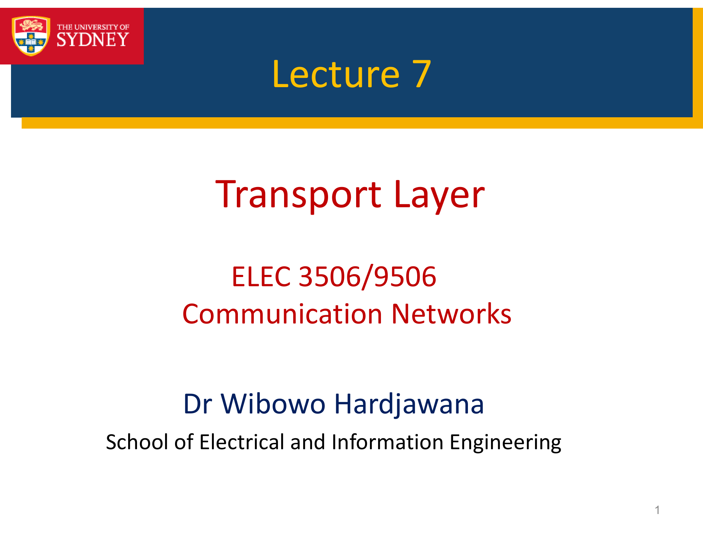
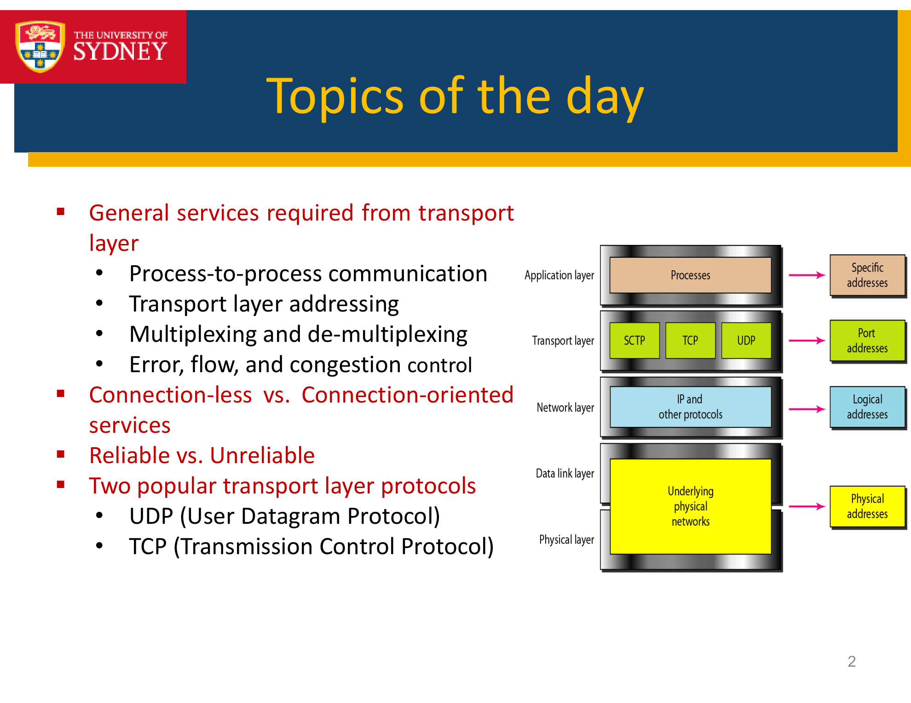
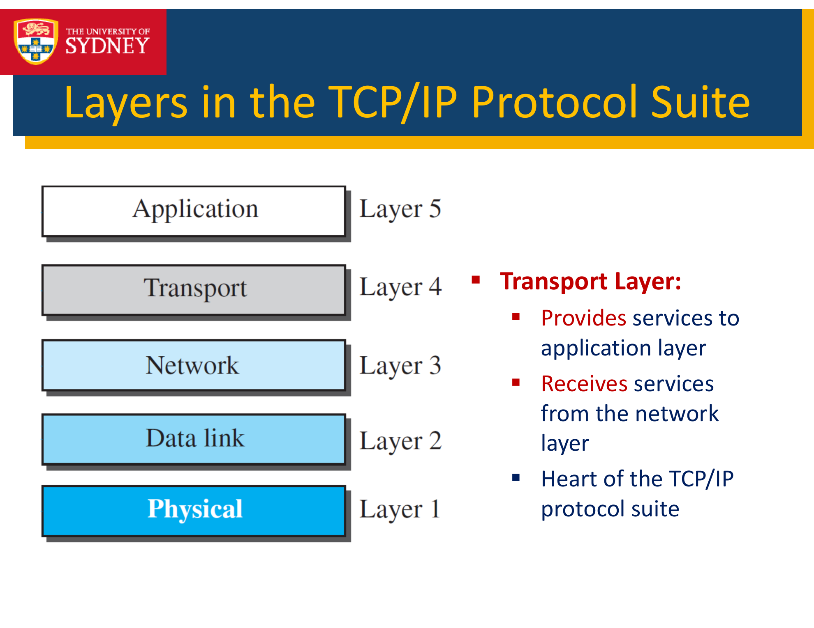
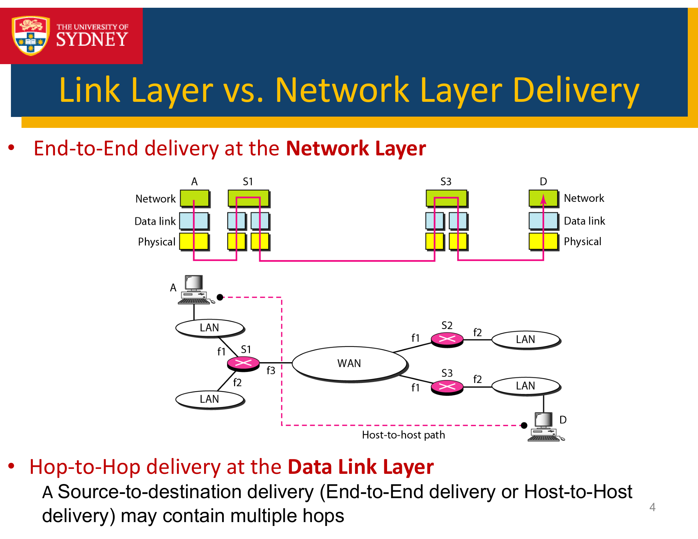
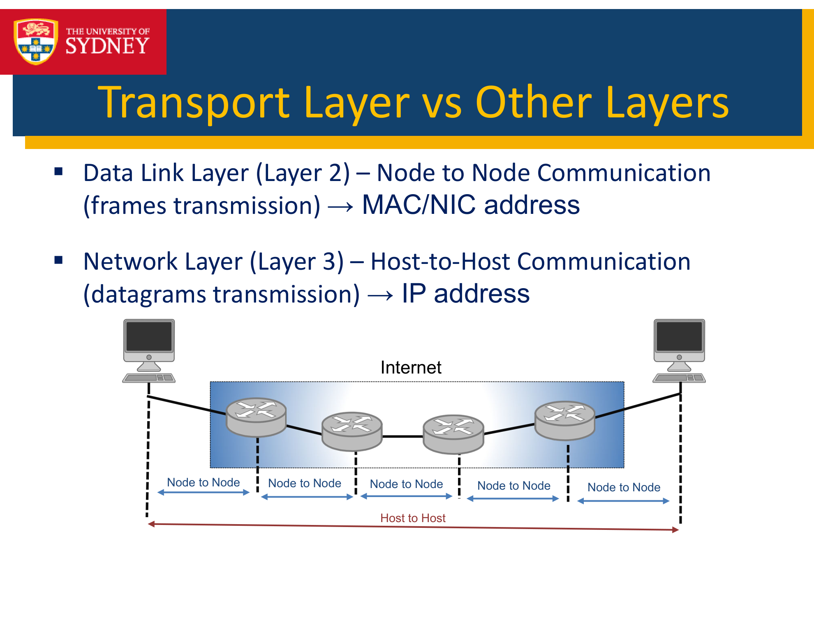
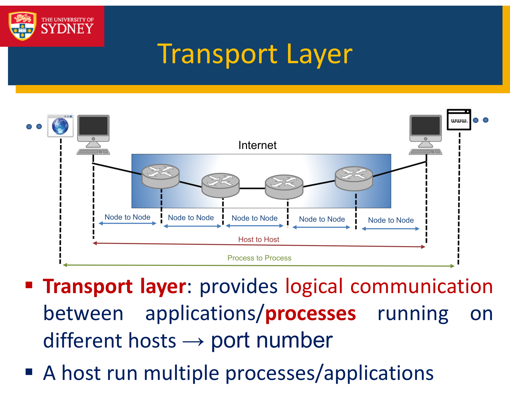

---

## 第 1 页

这张截图是来自悉尼大学的一节关于通信网络的讲座幻灯片。具体内容如下：

1. **讲座标题**：这是第7节课，讲授的是“传输层”内容。
2. **课程信息**：

* **课程代码**：ELEC 3506/9506
* **课程名称**：通信网络
3. **讲师**：讲师是 Dr. Wibowo Hardjawana，来自悉尼大学电气与信息工程学院。

在这节课上，内容将围绕计算机网络中的传输层展开，通常传输层负责数据的可靠传输，包括流量控制、错误检测与纠正等。具体的课程内容可能涉及到 TCP 和 UDP 协议等关键概念。

\[口语化表达] 这是悉尼大学关于“通信网络”的课程中的一部分，第7节课的主题是“传输层”。课程主要探讨计算机网络中的传输协议，比如TCP和UDP，讲解如何保证数据在网络中的可靠传输，讲师是Wibowo Hardjawana博士。

---

## 第 2 页

这张截图是关于讲座的主题内容，具体如下：

1. **传输层的基本服务**：

* **进程间通信（Process-to-process communication）**：指的是在不同计算机之间，通过网络进行的进程与进程之间的通信。
* **传输层寻址（Transport layer addressing）**：在传输层上，数据包需要标识目标端口号，以确定目标进程。
* **复用与解复用（Multiplexing and de-multiplexing）**：复用是指多个应用程序共享同一个传输连接，解复用是指把从网络上接收到的数据分配给相应的进程。
* **错误、流量和拥塞控制（Error, flow, and congestion control）**：传输层负责确保数据的准确性，并控制数据的流量以及避免网络的拥塞。

2. **连接与无连接服务**：

* 讲解了连接型服务（需要建立连接）和无连接型服务（不需要建立连接）的区别。

3. **可靠与不可靠服务**：

* 讨论了传输层协议提供的可靠性保障（如TCP）与不可靠传输（如UDP）之间的差异。

4. **两种主要的传输层协议**：

* **UDP（用户数据报协议）**：一种简单的不可靠协议，适用于不需要可靠传输的应用。
* **TCP（传输控制协议）**：提供可靠传输服务，确保数据传输的完整性和顺序。

图示中展示了传输层与其他层（如应用层、网络层、数据链路层、物理层）的关系。传输层通过端口地址与应用层的进程进行通信，与网络层的IP地址对应，确保数据的传输。

\[口语化表达] 这一页讲的是传输层的基本概念，像是如何实现进程间的通信，如何进行地址分配以及复用和解复用。它还讨论了连接型和无连接型服务、可靠与不可靠的服务差异，重点介绍了UDP和TCP两种常用协议。传输层主要负责数据的准确传输以及避免网络拥塞。

---

## 第 3 页

这张截图展示了TCP/IP协议栈中的各个层次以及它们的功能：

1. **层次结构**：

* **应用层 (Application Layer)**：位于协议栈的最上层，直接与用户交互，处理各种应用程序的数据传输需求。
* **传输层 (Transport Layer)**：为应用层提供服务，同时从网络层接收服务，是TCP/IP协议栈的核心层。它负责端到端的数据传输，提供如可靠传输（TCP）和无连接传输（UDP）等功能。
* **网络层 (Network Layer)**：负责路由选择和数据包的转发，它处理数据包在不同网络之间的传输。
* **数据链路层 (Data Link Layer)**：确保数据在物理设备之间可靠传输，处理物理设备之间的通信。
* **物理层 (Physical Layer)**：涉及物理设备的实际传输介质，如电缆、无线电波等，负责将比特流转换为可以在物理介质上传输的信号。

2. **传输层的功能**：

* 传输层提供服务给应用层。
* 从网络层接收服务。
* 传输层是TCP/IP协议栈的核心，它确保端到端的通信可靠性。

\[口语化表达] 这张图介绍了TCP/IP协议栈的五个层次，分别是应用层、传输层、网络层、数据链路层和物理层。传输层在这里扮演着关键角色，它为应用层提供服务，并从网络层获取服务，是协议栈的核心部分，保证了数据的顺利传输。

---

## 第 4 页

这张截图讨论了数据链路层（Link Layer）和网络层（Network Layer）之间的区别，具体如下：

1. **网络层的端到端传输 (End-to-End Delivery at the Network Layer)**：

* 网络层负责从源主机（A）到目标主机（D）的端到端数据传输。数据会经过多个网络设备（如路由器或交换机），并且每一跳（hop）都会传递不同的网络信息。图中展示了从A到D的数据包通过网络层和数据链路层的传输过程。
* 这类传输通常是通过IP协议进行的，涉及网络路由选择。

2. **数据链路层的跳对跳传输 (Hop-to-Hop Delivery at the Data Link Layer)**：

* 数据链路层则处理从源到目标的每一跳（Hop）。每一跳指的是从一个网络设备（如路由器）到下一个设备之间的传输。这与网络层的端到端传输不同，数据链路层关心的是每一跳之间的可靠传输。
* 数据链路层通常通过MAC地址进行寻址，它确保数据在局部网络（如局域网LAN）或广域网（WAN）中正确传输。

3. **主机到主机与源到目标的区别**：

* 源到目标传输（End-to-End Delivery）可能包含多个跳，而每个跳则在数据链路层处理。

\[口语化表达] 这张图说明了网络层和数据链路层的不同，网络层负责从源主机到目标主机的端到端传输，涉及多个路由设备。而数据链路层则负责每一跳之间的传输，确保在局部网络内的数据顺利到达下一设备。也就是说，网络层关心大范围的传输路径，数据链路层则关注每一段跳跃之间的数据传输。

---

## 第 5 页

这张截图讨论了传输层与数据链路层和网络层的区别：

1. **数据链路层（Layer 2）**：

* 数据链路层负责节点与节点之间的通信。这里的“节点”通常指的是网络设备，如计算机、路由器等。数据链路层传输的是**帧（Frames）**，它使用**MAC地址**（媒体访问控制地址）或NIC地址（网络接口卡地址）来识别设备。它关注的是局部网络中的设备之间的通信。

2. **网络层（Layer 3）**：

* 网络层负责主机与主机之间的通信，通常通过**数据报（Datagrams）**的传输来实现。它使用**IP地址**来识别不同的主机。这一层的任务是选择数据传输的最佳路径，并在网络中进行路由转发。

3. **传输层与其他层的对比**：

* 数据链路层（Layer 2）主要关注局部节点之间的通信，而网络层（Layer 3）则负责跨越整个网络的主机间通信，使用IP地址来实现主机定位。
* 传输层则位于它们之上，负责为应用层提供可靠的数据传输服务，它与数据链路层和网络层进行交互。

\[口语化表达] 这张图讲的是传输层和其他两层的区别。数据链路层负责设备之间的直接通信，使用MAC地址，而网络层负责通过IP地址进行主机之间的通信，确保数据在整个网络中正确转发。可以理解为数据链路层解决的是设备之间的直接连接，而网络层则解决跨越网络的主机之间的通信。

---

## 第 6 页

这张截图讨论了传输层与数据链路层和网络层的区别：

1. **数据链路层（Layer 2）**：

* 数据链路层负责节点与节点之间的通信。这里的“节点”通常指的是网络设备，如计算机、路由器等。数据链路层传输的是**帧（Frames）**，它使用**MAC地址**（媒体访问控制地址）或NIC地址（网络接口卡地址）来识别设备。它关注的是局部网络中的设备之间的通信。

2. **网络层（Layer 3）**：

* 网络层负责主机与主机之间的通信，通常通过**数据报（Datagrams）**的传输来实现。它使用**IP地址**来识别不同的主机。这一层的任务是选择数据传输的最佳路径，并在网络中进行路由转发。

3. **传输层与其他层的对比**：

* 数据链路层（Layer 2）主要关注局部节点之间的通信，而网络层（Layer 3）则负责跨越整个网络的主机间通信，使用IP地址来实现主机定位。
* 传输层则位于它们之上，负责为应用层提供可靠的数据传输服务，它与数据链路层和网络层进行交互。

\[口语化表达] 这张图讲的是传输层和其他两层的区别。数据链路层负责设备之间的直接通信，使用MAC地址，而网络层负责通过IP地址进行主机之间的通信，确保数据在整个网络中正确转发。可以理解为数据链路层解决的是设备之间的直接连接，而网络层则解决跨越网络的主机之间的通信。

> ❌ 程序在第 7 页因异常停止：ShortAnswerError('answer too short')
