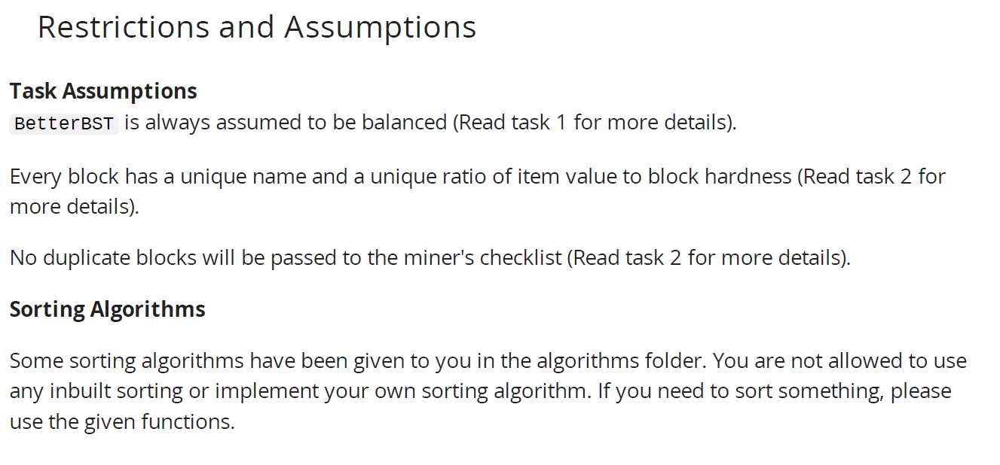
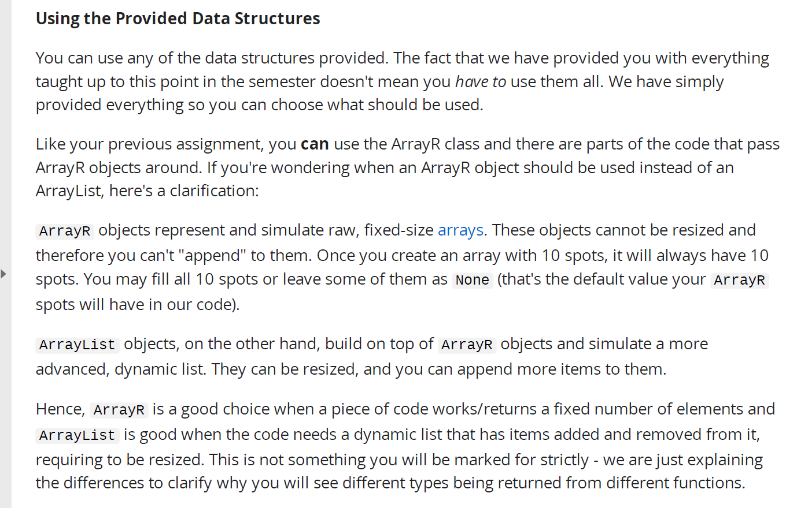

这张照片是一个学习平台上的提示页面，提醒学生在完成作业时注意一些重要事项。以下是对图片内容的详细解释：

------

### 顶部红色提示框：

**“DO NO FORK THE REPOSITORY. Please use the link above and create a new \*private\* repository.”**
 **中文翻译**：**不要Fork（派生）这个代码仓库。请使用上方的链接并创建一个新的**私有**仓库。
 **解释**：这是在提醒你，不要直接点击GitHub上的“Fork”来复制该项目，而是应该通过特定链接创建一个新的私有仓库。这可能是出于防止抄袭或保证作业独立性的目的。

------

### 黑色三角符号“⚠ Important Notes”（重要提示）部分：

1. **第一条提示**：
   - 原文：
      “As you go through the content of the unit, you may realise that the ADT choices you made for some of your previous tasks may not be optimal…”
   - 中文翻译：
      在学习这个单元的内容过程中，你可能会意识到你在之前任务中选择的ADT（抽象数据类型）可能不是最优的。因此，如果你觉得有更优或更优雅的解决方案，建议你返回去修改。你会根据**所选ADT以及程序的复杂度**来评分。
   - **解释**：
      ADT（Abstract Data Types）指的是如栈（Stack）、队列（Queue）、链表（Linked List）等数据结构。系统在评分时会根据你选择的结构是否合理、是否效率高来打分。所以一开始写的不一定是最终版本，可以在学习后优化再提交。
2. **第二条提示**：
   - 原文：
      “In some tasks there are mandated time complexities, failure to meet these complexities will result in low approach scores.”
   - 中文翻译：
      在某些任务中有**明确的时间复杂度要求**，如果没有满足这些复杂度要求，会导致**方法评分较低**。
   - **解释**：
      有些题目要求你的算法必须在特定效率下运行，比如时间复杂度要是 O(n)、O(log n) 等。如果程序过慢，即使能正确运行，也会被扣分。

------

### 总结：

这张图片提醒你：

- 不要Fork项目，要用指定链接建私有仓库。
- 编程题要关注选择合适的数据结构和时间复杂度。
- 随着学习进展，鼓励回头优化原来的代码，提升效率和结构。

如果你在做与算法或数据结构相关的课程，这些提示对你的评分影响很大，所以建议认真遵守。需要我帮你分析某个ADT或时间复杂度问题，也可以告诉我。

这张图片内容标题为“Restrictions and Assumptions”（限制与假设），主要说明了完成作业时的一些前提设定和限制规则。以下是详细解释：

------

## **Task Assumptions（任务假设）**

1. **`BetterBST`始终被假设为平衡的**
   - **原文**：`BetterBST is always assumed to be balanced`
   - **中文**：`BetterBST` 这棵二叉搜索树总是假设为“平衡的”。
   - **解释**：你可以假设 `BetterBST` 的操作时间复杂度是最优的（如查找、插入为 O(log n)）。平衡树的意思是左右子树高度相近，避免了退化成链表的情况。
   - 你需要查看 Task 1 获取更多背景信息。
2. **每个区块（block）都有唯一的名称和唯一的价值比**
   - **原文**：Every block has a unique name and a unique ratio of item value to block hardness
   - **中文**：每一个“区块”都有一个**唯一的名字**，以及一个**唯一的“物品价值 / 区块硬度”比值**。
   - **解释**：在排序或比较区块时可以依赖这些比值；你不需要担心有两个区块值相同。具体细节可参考 Task 2。
3. **不会传入重复区块**
   - **原文**：No duplicate blocks will be passed to the miner's checklist
   - **中文**：传给矿工（miner）检查表的区块中不会有重复项。
   - **解释**：你不需要在代码中检查区块是否重复，因为系统已经保证不会出现重复。详情参见 Task 2。

------

## **Sorting Algorithms（排序算法）**

- **原文**：Some sorting algorithms have been given to you in the algorithms folder. You are not allowed to use any inbuilt sorting or implement your own sorting algorithm.
- **中文翻译**：系统已经在 `algorithms` 文件夹中为你提供了某些排序算法。你**不允许**使用编程语言自带的排序函数（如 Python 的 `sort()` 或 `sorted()`），也**不允许自己写排序算法**。
- **如果你需要排序，请使用给定的函数。**
- **解释**：这通常是为了统一评估标准，也避免同学用高效内建函数绕过算法实现过程。

------

### 总结：

| 项目      | 限制 / 假设                       | 意义                        |
| --------- | --------------------------------- | --------------------------- |
| BetterBST | 永远平衡                          | 可假设其操作效率为 O(log n) |
| 区块数据  | 唯一名称、唯一比值                | 可安全进行比较和排序        |
| 重复区块  | 不会出现                          | 无需做去重逻辑              |
| 排序算法  | 不可使用内建/自写，仅能用给定算法 | 保证评估公平与一致性        |

如果你正在完成与区块处理、排序、搜索树相关的编程任务，这些规则是必须遵守的。你可以告诉我具体你在哪个任务遇到困难，我可以帮你分析。


这张图片继续列出了你在编程作业中必须遵守的一些**限制规则**，具体是关于你**可以使用哪些 Python 特性、类型、库**。下面是详细解释：

------

## **标题：你能使用哪些功能、类型和库的完整限制列表**

### **Python Built-Ins（Python 内建类型）**

- **禁止使用**：除了 `tuple`（元组）外，**所有 Python 内建类型都不允许使用**。
  - **被禁止的包括**：
    - `list`：列表
    - `dict`：字典
    - `set`：集合
    - `reverse` 和 `reversed` 函数：反转序列的操作
- **允许使用的内建类型**：**只有 `tuple` 是被允许的**。
- **解释**：你不能用 Python 原生的数据结构，而是必须使用作业提供的结构，比如 `data_structures` 文件夹里的类型（如自定义的栈、队列、树等）。

------

### **你应该使用 scaffold（框架）中提供的类型和算法**

- 作业需要用 scaffold 提供的结构来完成。
- 除了 `data_structures` 文件夹，还有一个 `algorithms` 文件夹，里面包含一些可使用的函数。
- **你只能用这两个文件夹中的类型和算法来实现程序，不要用 Python 自带的功能。**

------

### **Python Libraries（第三方库）**

- **禁止使用**任何其他 Python 第三方库（如 NumPy、Pandas、math 等）。
- **解释**：你只能使用老师/系统提供的代码库，不能引用外部资源或模块。

------

## 总结表：

| 类型                    | 允许使用？ | 说明                               |
| ----------------------- | ---------- | ---------------------------------- |
| `tuple`                 | 是         | 唯一允许的内建类型                 |
| `list`, `dict`, `set`   | 否         | 禁止使用                           |
| `reverse`, `reversed`   | 否         | 禁止使用                           |
| 自己实现排序            | 否         | 必须用 `algorithms` 文件夹中的函数 |
| Python 第三方库         | 否         | 全部禁止                           |
| scaffold 中的类型和算法 | 是         | 必须使用这些                       |

------

### 建议：

- 如果你想定义一个序列，用 `tuple`，不要用 `list`。
- 排序时，查看 `algorithms` 文件夹里有没有排序函数（如 `custom_sort`），直接调用。
- 如果需要用堆、栈、队列、树等结构，一定要从 `data_structures` 文件夹中找定义。

如果你愿意，我可以帮你理解这些结构或整理出可用函数清单。是否需要我分析 `algorithms` 文件夹中的内容？


这张图片说明了在提交编程作业（例如在 Ed 平台上）时关于**哪些文件可以修改并提交**、哪些文件会被**系统自动替换或忽略**的规则。以下是详细解释：

------

## **标题：Changing Other Scaffold Files（更改其它模板文件的说明）**

### **主要意思：**

当你将作业提交到 Ed 系统时，系统会把一些文件**替换成原始版本**。这意味着：

- 你对这些文件做的**任何修改都会被系统覆盖、删除**；
- 如果你的代码依赖于你自己修改的那些文件，测试时可能会**运行失败**；
- 所以你应该**只在允许的文件中写代码**。

------

### **你应该提交的文件列表（系统会保留的文件）：**

这些是**你可以修改并上传的文件**，系统在运行测试时**不会覆盖它们**：

1. `minecraft_block.py`
2. `better_bst.py`
3. `minecraft_checklist.py`
4. `miner.py`
5. `not_minecraft.py`

**→ 你写代码必须写在这几个文件中。**

------

### **其它所有文件会被删除或替换！**

- **说明**：除了上面列出的文件，**其它文件（比如算法文件、工具类等）都会被系统自动替换为原始版本**。
- 如果你尝试在其他文件里加代码或修改内容，**是无效的**，也可能导致你的程序在测试时崩溃。

------

## **总结：**

| 文件类型                                                 | 可以修改？ | 上传后会保留？ |
| -------------------------------------------------------- | ---------- | -------------- |
| `minecraft_block.py` 等 5 个指定文件                     | **可以**   | **会保留**     |
| 其他 scaffold 文件（如 algorithms 文件夹里的排序函数等） | **不能改** | **会被替换**   |

------

### 建议：

- 你只能在允许的五个 `.py` 文件中写逻辑；
- 不要修改系统提供的排序函数、数据结构实现；
- 编写代码时避免依赖非指定文件的修改结果。

如果你不确定某段代码该写在哪个文件里，我可以帮你分析分配结构。需要我进一步解释某个文件的用途吗？



这张图片解释了在这门课程或编程作业中，你可以使用的**数据结构（Data Structures）**，特别是 `ArrayR` 和 `ArrayList` 的区别与使用场景。以下是详细中文解释：

------

## **标题：Using the Provided Data Structures（使用提供的数据结构）**

### **总体说明：**

- 系统提供了一些数据结构供你使用。
- 虽然都学过了，但**不是说每个都必须用**，而是**可以根据需要选择合适的结构使用**。

------

## **关于 `ArrayR` 和 `ArrayList`：**

这是一个重点部分，解释了这两种类型的区别和适用情况：

------

### **1. `ArrayR` 是什么？**

- `ArrayR` 是一种**固定大小的数组**（Raw Array）。
- 它的特性包括：
  - 一旦创建，大小就**不能改变**（无法使用 `.append()`）。
  - 比如你创建了一个长度为 10 的 `ArrayR`，那么它永远会有 10 个位置。
  - 有些位置你可以设置为数据，有些可以留空（默认为 `None`）。

#### **总结**：

| 特性     | 描述               |
| -------- | ------------------ |
| 大小固定 | 一开始创建时定死   |
| 不可扩展 | 不支持 `.append()` |
| 默认值   | 空位是 `None`      |

------

### **2. `ArrayList` 是什么？**

- `ArrayList` 是**动态数组**，建立在 `ArrayR` 之上。
- 它的特性包括：
  - 可以调整大小。
  - 可以添加新元素（支持 `.append()`）。
  - 更适合需要频繁增删元素的场景。

#### **总结**：

| 特性     | 描述               |
| -------- | ------------------ |
| 动态列表 | 可以增删元素       |
| 构建基础 | 建立在 `ArrayR` 上 |

------

### **3. 什么时候用哪一个？**

- 用 `ArrayR`：
  - 当你的代码操作的是**固定数量**的数据时。
  - 例如：你一开始就知道要处理 10 个区块。
- 用 `ArrayList`：
  - 当你的数据结构**需要频繁添加或删除元素**时。
  - 例如：根据情况动态添加区块或道具。

> 虽然你不会因为选错类型被扣分，但这个说明是为了帮助你理解程序为什么使用某种结构。

------

### **最后总结（表格对比）**：

| 特性                 | `ArrayR`       | `ArrayList`    |
| -------------------- | -------------- | -------------- |
| 大小                 | 固定           | 动态           |
| 是否支持 `.append()` | 否             | 是             |
| 默认空值             | `None`         | 支持动态添加   |
| 使用场景             | 固定数量的数据 | 需要增删的数据 |

------

如你还不确定某段代码适合用 `ArrayR` 还是 `ArrayList`，你可以发具体的函数场景，我可以帮你判断哪个更合适。是否需要我进一步举例说明？


这张图片的内容包括两部分说明，分别是：

------

## 一、**Implementing Your Own Data Collection Types（自行实现数据收集类型）**

### 中文解释：

你**不允许自己实现任何新的数据结构**（Data Collection Types），除非是老师已经提供的。

### 意思是：

- 比如你不能自己写一个新的栈、队列、图、哈希表等；
- 必须使用课程提供的已有类型，如 `ArrayR`、`ArrayList`、`BetterBST` 等。

------

## 二、**Using AI（使用人工智能）**

这是一个非常重要的警告，强调了：**作业禁止使用 AI 工具来生成代码**。

### 中文解释：

- 跟这门课其它作业一样，**禁止使用任何形式的 AI 代码生成工具**（例如 ChatGPT、Copilot、CodeWhisperer 等）。
- 一旦被发现使用了 AI 工具，会被直接判 0 分。
- 教师团队会对所有提交的代码进行**AI生成代码的检测**，所以**不要冒险**。

### **进一步说明：**

- 有时候你可能**不自觉地在使用 AI 工具**，特别是你用的开发工具（比如 VSCode）可能装了 Copilot 等 AI 插件。
- 举个例子：
   如果你在写代码时按下 `Tab` 就自动补全了整行逻辑，而不仅仅是变量名，那说明你可能启用了某个 AI 插件。
- **解决方法**：
   打开你的 IDE（如 VSCode）的 Extensions（插件面板），**卸载或禁用所有 AI 相关的插件**，以免违规。

------

## 总结提示表：

| 项目                                        | 说明                                         |
| ------------------------------------------- | -------------------------------------------- |
| 是否能写自己的数据结构？                    | 否，只能用老师提供的                         |
| 是否能使用 AI 工具（如 ChatGPT、Copilot）？ | **绝对禁止**                                 |
| 如果违规会怎样？                            | 作业将得 **0 分**                            |
| 如何防止无意违规？                          | 检查你的编辑器是否安装了 AI 插件，并卸载它们 |

------

如果你不确定某段代码是否违规，或想知道是否使用了合规的数据结构，我可以帮你检查。是否需要我帮助你审查你的某段代码是否合规？


这张图片内容是关于如何**获得满分（Getting Full Marks）**的说明，重点解释了自动化测试如何评分，以及你需要注意的细节要求。以下是详细中文解析：

------

## **一、Test Marks（测试分数）**

### **自动评分说明：**

- 作业大部分分数来自自动化测试（系统在 Ed 上自动运行你的程序并检测输出是否正确）。
- 因此你必须**严格遵守命名要求**，否则测试无法识别你的代码。

------

### **关键点 1：命名要准确**

- **举例说明**：
   如果题目说类中应该有一个属性叫 `name`，你就必须在 `__init__()` 方法中定义 `self.name = ...`。
  - 否则系统找不到这个属性，自动测试会失败，得不到分数。
- 如果任务**没有要求具体的变量名**，你可以自行命名。

------

### **关键点 2：某些文件的修改会被覆盖**

- 系统会在测试时**替换掉整个 `data_structures`、`algorithms` 文件夹**，还有像 `run_tests.py` 这类通用文件。
- 所以你不应该修改这些文件，如果改了，**提交后也不会保留**，**测试时失效**。

------

### **关键点 3：程序运行条件**

系统运行测试时会自动终止你的程序，如果：

- **输出行数太多**（比如你打印太多调试信息）；
- **运行时间过长**（一般程序应在几秒内完成，不能有死循环或效率过低的代码）。

------

## **建议 & 注意事项：**

- 避免使用太多 `print()`，提交前删除调试输出；
- 不要有无限循环或效率极低的算法；
- 程序运行要快，稳定，不崩溃；
- 仔细阅读题目说明中关于属性名、结构名、方法名的要求，不要随意更改。

------

## **总结表格：**

| 注意点       | 要求/说明                                                    |
| ------------ | ------------------------------------------------------------ |
| 属性命名     | 必须和题目要求一模一样（如 `name`）                          |
| 可自命名场景 | 如果题目没指定名字，你可以自定属性名                         |
| 替换文件     | `data_structures/`, `algorithms/`, `run_tests.py` 等会被系统替换 |
| 输出限制     | 不要打印太多行                                               |
| 性能限制     | 程序必须在几秒内完成，不能死循环                             |
| 目标         | 确保代码**规范、清晰、执行快、输出少**，以通过自动评分系统   |

------

如你不确定你的属性名是否符合要求，或担心结构会被替换导致出错，可以把代码片段发给我，我可以帮你检查是否符合系统要求。需要帮忙吗？

​    


这张图片解释了如何在编程作业中获得 **Approach Marks（方法分/思路分）**，也就是除了程序是否正确运行之外，你的**思考方式、结构设计是否合理**也会影响评分。以下是详细解释：

------

## **一、什么是 Approach Marks（方法分）？**

- 虽然一个程序可以有很多种实现方式，但只有一部分方法是“好的实现方式”。
- 所谓的“Approach Mark”就是评估你选择的数据结构和算法**是否合理、效率是否高、结构是否清晰**。
- 想拿到方法分，需要在设计过程中注重正确思路。

------

## **二、重点：选择合适的数据结构（Selecting the Right Data Structures）**

在做作业时，你会处理各种信息。你需要为不同的信息选用最合适的数据结构。

你在选择数据结构时，需要考虑以下两个方面：

------

### 1. **效率（Efficiency）**

- 如果某个数据结构在你的场景下执行效率更高（比如时间复杂度更低），那就应该选择它。
- 例如：查找操作频繁 -> 使用平衡二叉搜索树（如 `BetterBST`）可能比线性表快得多。
- 如果你选了一个效率差的数据结构，即使程序运行正确，也会被扣方法分。

------

### 2. **是否满足需求（Appropriate for the Requirements）**

- 有时候可能有**多个数据结构**都能达到同样的效率；
- 这时你就需要考虑哪种结构**更符合任务需求**，比如更容易表达关系、更清晰可读。
- 换句话说，不只是效率高，还要**语义合适、用途贴切**。

------

## **总结表格：**

| 标准                        | 解释                           |
| --------------------------- | ------------------------------ |
| **效率（Efficiency）**      | 选择时间复杂度更优的数据结构   |
| **符合需求（Appropriate）** | 数据结构的用法是否适合题目情境 |

------

## 举个例子：

假设你要频繁插入和删除元素：

- `ArrayR`：不适合，因为它大小固定；
- `ArrayList`：可以动态增删，**更合适**；
- `Queue` 或 `Stack`：如果操作模式是 FIFO 或 LIFO，就更语义清晰；

选择不当，即使程序能跑，也得不到满分方法分。

------

如果你不确定用哪个数据结构，我可以根据你任务的场景帮你选一个“既高效又贴合”的结构。需要我帮忙分析你的任务吗？


这张图片是对上一个“Approach Marks（方法分）”主题的延续，进一步讨论**如何选择一个更鲁棒（robust）、更合适的数据结构**，从而拿到更高的思路分。以下是详细解释：

------

## **核心主题：选择最合适（robust）的数据结构要考虑的几点：**

------

### **1. 你是否在“强行”让数据结构实现不适合的功能？**

- **原文要点**：
   “Do you need to twist the data structure into some unexpected shape…”
- **中文解释**：
   如果你需要对一个数据结构做很多变通、绕来绕去才能实现目标，那么说明你选的结构不合适。
- **结论**：
   应该选择一个**天然就适合当前任务**的数据结构，否则代码会变得复杂、容易出错、不稳定。

------

### **2. 你的结构是否暴露了不该暴露的内容？**

- **原文要点**：
   “Does your choice of data structure expose methods, attributes, and values, that should ideally not be exposed?”
- **例子**：
  - 用栈（stack）的话，你只能访问最上面的元素，不能乱改顺序或数据；
  - 而如果你用的是列表（list），别人可以随意插入、删除、改值。
- **解释**：
   如果你只需要“后进先出”（LIFO）的功能，用栈更合适；用 list 虽然也能做，但**容易误操作**，让代码出问题，**不够鲁棒**。
- **结论**：
   应该选择能**自动隐藏或保护数据的结构**，从而让代码更安全、更可靠。

------

### **3. 后期如果发现原来的选择不合适，应当及时调整！**

- **原文要点**：
   “You should go back and change the data type if that happens…”
- **中文解释**：
   在完成后续任务时，你可能意识到之前选的数据结构并不是最优的；
   **你应该回头重新调整数据结构**，而不是将就使用错误的结构继续做下去。
- **结论**：
   思路分不只是看结果，还看你能否在学习中反思并优化自己的设计。

------

## **总结建议：**

| 检查点                                | 是否合理？ |
| ------------------------------------- | ---------- |
| 你是否用错了结构，使实现变复杂？      | 否         |
| 你是否暴露了数据/方法，造成误用风险？ | 否         |
| 你是否会根据新理解及时更换结构？      | 是         |

------

## **实际应用建议：**

- 如果你一开始用 `ArrayList` 做了个栈的功能，后来学到有 `Stack`，那就改用 `Stack`；
- 如果你用 `list` 操作了需要固定长度的数据，改成 `ArrayR` 更合适；
- 每次新学一个结构，建议回头看看自己之前写的代码是否可以优化。

------

如果你在选择数据结构时犹豫，我可以帮你分析不同结构的适配性。需要我看看你写的某段代码是否使用了合适的数据结构吗？


这张图片讲的是在编写代码时，应该**避免使用硬编码（Hard-Coded Values）**，并推荐使用**命名常量（Constants）**的写法。以下是详细解释：

------

## **标题：Constants and Hard Coded Values（常量与硬编码值）**

------

### **什么是“硬编码”？**

硬编码就是你在代码中直接写了一个数字、字符或字符串，而**没有解释它的意义**。例如：

```python
my_list[i] = -1
for _ in range(4):
```

这两个数字 `-1` 和 `4` 看起来像是魔法数字（magic numbers）——别人看到根本不知道它们的含义。

------

### **原始写法（不推荐）解释：**

```python
def weird_function(my_list):
    for i in range(len(my_list)):
        if my_list[i] % 2 == 1:
            my_list[i] = -1
        else:
            for _ in range(4):
                print(my_list[i])
```

- `-1` 是用来替换奇数的，但为什么是 `-1`？
- `4` 是表示偶数要打印四次，但为什么是 4？

别人读你的代码时，**不清楚这些数字的目的**，降低可读性和可维护性。

------

### **推荐写法：使用命名常量（推荐）**

```python
NEGATIVE_NUMS_PLACEHOLDER = -1
PRINT_EVEN_NUMBERS_CNT = 4

def weird_function(my_list):
    for i in range(len(my_list)):
        if my_list[i] % 2 == 1:
            my_list[i] = NEGATIVE_NUMS_PLACEHOLDER
        else:
            for _ in range(PRINT_EVEN_NUMBERS_CNT):
                print(my_list[i])
```

- `NEGATIVE_NUMS_PLACEHOLDER` 告诉我们 `-1` 是代表一个特殊符号。
- `PRINT_EVEN_NUMBERS_CNT` 告诉我们要打印偶数的次数是 4。

### **优点：**

- 易读：别人读到常量名就能理解含义；
- 易改：如果将来规则从 4 改为 5，只需改一行；
- 专业、规范：符合编程最佳实践。

------

### **总结建议表：**

| 写法                        | 是否推荐 | 原因               |
| --------------------------- | -------- | ------------------ |
| 直接写 `-1`、`4` 等魔法数字 | 不推荐   | 不易理解，难以维护 |
| 定义为有意义的常量          | 推荐     | 可读性高，易于修改 |

------

### **最后要求：**

> **你在这个作业中也必须使用这种写法，不能直接写魔法数字（如 -1、4）在代码里。**

------


这张图片讲的是关于作业中“**时间复杂度评分（Complexity Marks）**”的要求和标准。它主要分为两个部分进行说明：**时间复杂度分析说明**和**时间复杂度实现要求**。以下是详细中文解释：

------

## **第一部分：时间复杂度分析说明（Time Complexity Analysis Explanation）**

- 在这次作业中，**你需要对自己的函数时间复杂度进行解释**；
- **不能只写 `O(N)` 就完事**，需要简要说明为什么是这个复杂度；
- 如果你的算法在最坏和最好情况下复杂度不同，也要解释两种情况各自发生的条件；
- 系统提供了额外的讲解幻灯片（链接：https://edstem.org/...）帮助你理解该怎么写分析。

------

### 举个例子：

**错误做法**：

```text
Time Complexity: O(N)
```

**正确做法**：

```text
Time Complexity: O(N)  
Because the function loops through the list once to find the maximum value, which is proportional to the length of the list.
```

------

## **第二部分：时间复杂度实现要求（Time Complexity Requirements）**

这个部分强调：除了正确分析复杂度外，**你还必须选择最优的实现方式**，否则会被扣分！

------

### 举例说明：

假设有一个函数 `weird_func`：

- 它**可以**被实现为 **O(N)**；
- 但你写的代码实际上是 **O(N²)**；
- 你虽然正确地分析了你的代码复杂度是 `O(N²)`，也写了解释；
- **结果是**：
  - 你会因为分析正确拿到“复杂度分析”的分数；
  - 但会因为没有使用**最优方法**实现而失去“效率分”或“方法分”。

------

## **总结：你需要同时做到两件事：**

| 要求                 | 说明                           |
| -------------------- | ------------------------------ |
| 正确写出时间复杂度   | 并说明为什么是这个复杂度       |
| 使用最优方法实现函数 | 否则效率不佳，会失去一部分分数 |

------

## **最后结论：**

> 你应该尽可能让自己的函数在时间复杂度上是**最优的实现**，并为每个函数写出**简要复杂度分析和理由**，这样才能拿到完整的复杂度评分。

   


这张图片是关于**Task 1：Inner Balance（内部平衡）**的任务说明，目的是指导你如何实现一个高效的平衡二叉搜索树（Balanced Binary Search Tree，简称 BST）。下面是详细中文解释：

------

## **任务背景：**

### 为什么要“平衡”二叉搜索树？

- 普通的 **BST（Binary Search Tree）** 在最坏情况下可能会退化成一条链表，导致：
  - 深度为 O(n)
  - 查找、插入、删除效率低

### 所以我们要做什么？

- 保持树的平衡，使得树的**最大深度为 O(log n)**，从而保证操作效率：
  - 查找：O(log n)
  - 插入：O(log n)
  - 删除：O(log n)

------

## **解决方法：**

- 如果我们**预先知道所有元素**，可以先对它们排序，然后从中间开始构建平衡树；
- 这个方法可以帮助你**构造一个初始就是平衡的 BST**，避免插入过程中不平衡的问题。

------

## **你要完成的任务：**

你需要在 `BetterBST` 类中实现三个方法（这里只展示了第一个）：

### 方法 1：`__sort_elements`

```python
__sort_elements(self, elements: ArrayList[Tuple[K, I]]) -> ArrayList[Tuple[K, I]]
```

### 方法说明：

- 参数：`elements` 是一个包含 `(key, item)` 的元组列表（类型为 `ArrayList`）；
- 功能：将这些元素**按照 key 升序排序**；
- 返回：一个**新的排序后的列表**。

> 这个排序的目的是为下一步构建平衡树做准备。

------

### 示例理解：

你收到的是一堆 `(key, value)` 对，比如：

```python
[(3, "C"), (1, "A"), (2, "B")]
```

你要做的是返回：

```python
[(1, "A"), (2, "B"), (3, "C")]
```

这之后，另一个方法将用这个排序好的列表来构建树。

------

## **总结要求：**

| 要点 | 内容                                                         |
| ---- | ------------------------------------------------------------ |
| 目标 | 构建**平衡**的 BST，避免 O(n) 深度                           |
| 做法 | 排序后中序构造树，维持 O(log n) 复杂度                       |
| 任务 | 实现 `BetterBST` 中的方法，首先是 `__sort_elements`，用于排序元素 |
| 工具 | 使用 `ArrayList[Tuple]` 类型作为输入输出                     |

------


这张图片继续解释了你在 Task 1 中需要实现的第二个方法：**`__build_balanced_tree`**，并用图示说明了它的用途与正确实现方式。以下是详细中文解释：

------

## **图片结构说明**

- **上方框（Start）**：初始输入顺序是 `[1, 9, 4, 11, 2, 7, 8]`，这是未排序的数据（即树的 key 值）。
- **下方框（After prepare items）**：排序后的数据是 `[1, 2, 4, 7, 8, 9, 11]`，表示经过 `__sort_elements` 方法后的结果。
  - 这是为构建平衡二叉搜索树准备的排序顺序。

------

## **你要实现的方法：**

### `__build_balanced_tree(self, elements: ArrayList[Tuple[K, I]])`

### **功能描述：**

- 输入是上一方法输出的已排序列表（`ArrayList`，内容是键值对 `Tuple[K, I]`）；
- 方法要**构建一个平衡的二叉搜索树（BST）**；
- 不返回任何值，而是**将元素插入到当前对象的 BST 中**；
- 插入方式不是从头到尾一个一个插，而是要确保树保持平衡（即高度尽量低，接近 `log₂n`）；

------

## **说明图示的目的：**

图中展示了**两种方法的对比**：

| 方法                                      | 描述                                     | 缺点                                    |
| ----------------------------------------- | ---------------------------------------- | --------------------------------------- |
| Naive 插入（如从小到大：1, 2, 4, 7, ...） | 一次插一个元素，从小到大                 | 会变成**链表结构**，效率低，深度为 O(n) |
| 改进方法                                  | 从中间元素作为根节点开始递归构建（分治） | 深度约为 O(log n)，是**平衡树**，性能好 |

------

## **关键实现逻辑（你要做的）：**

假设排序好的 key 是 `[1, 2, 4, 7, 8, 9, 11]`，构建平衡树的步骤大致如下：

1. 选中中间值 7 作为根；
2. 左半部分 `[1, 2, 4]` 递归构建左子树（中间是 2）；
3. 右半部分 `[8, 9, 11]` 递归构建右子树（中间是 9）；
4. 最终形成一个平衡的 BST。

### 树结构示意：

```
        7
       / \
      2   9
     / \  / \
    1  4 8  11
```

------

## **其他注意事项：**

- 你可以**假设调用该方法时树是空的**；
- 不需要考虑元素重复；
- 目标是让查找、插入、删除操作**尽可能高效（O(log n)）**。

------

## **总结任务目标：**

| 要素     | 内容                                             |
| -------- | ------------------------------------------------ |
| 输入     | 一个排序好的元组列表（`ArrayList[Tuple[K, I]]`） |
| 输出     | 无（插入元素进 `BetterBST`）                     |
| 核心目标 | 构造出**平衡 BST**（深度接近 `log₂n`）           |
| 方法实现 | 使用递归分治方式，从中间值构造子树               |

------


这张图片说明了你在 `BetterBST` 类中要实现的第三个方法：**`filter_keys`**，并对比展示了**“朴素插入 vs 平衡插入”的二叉树结构差异**。以下是详细中文解释：

------

## **上半部分图片：树的高度比较**

| 插入方式             | 结果                   | 高度                   |
| -------------------- | ---------------------- | ---------------------- |
| **Naive（朴素）**    | 一条单链（1→2→4→7→11） | 高度 = `n`（最差）     |
| **Improved（优化）** | 平衡二叉搜索树结构     | 高度 ≈ `log₂n`（理想） |

### 说明：

- 朴素方式是按升序插入，会变成“退化链表”，效率低；
- 优化方式是使用排序+递归中间插入法（你前面写的 `__sort_elements` 和 `__build_balanced_tree`），能形成理想的平衡树。

------

## **下半部分任务：`filter_keys` 方法**

### **函数签名：**

```python
filter_keys(
    self,
    filter_func1: Callable[[K], bool],
    filter_func2: Callable[[K], bool]
) -> ArrayList[Tuple[K, I]]:
```

------

### **功能描述：**

这个方法返回一个 `ArrayList`，里面包含满足**两个过滤条件**的 `(key, item)` 键值对。

#### **两个过滤器条件：**

1. `filter_func1`：判断 key 是否 **大于某个下界**
   - 例：`lambda x: x > 3`
2. `filter_func2`：判断 key 是否 **小于某个上界**
   - 例：`lambda x: x < 7`

只有那些同时满足这两个条件的 key，才会出现在结果中。

------

### **举个例子：**

```python
# 假设树中有 key 为 [1, 2, 4, 7, 8, 9, 11]
filter_func1 = lambda x: x > 3
filter_func2 = lambda x: x < 8
```

那么符合条件的 key 是 `4` 和 `7`，结果可能是：

```python
[(4, item4), (7, item7)]
```

------

### **Python 技巧说明（蓝框说明）**

你可以像这样定义函数并传入：

```python
lambda x: x < 5
```

等价于：

```python
def my_filter(x):
    return x < 5
```

你可以使用 `filter_func1(key)` 和 `filter_func2(key)` 在你的方法中判断当前 key 是否保留。

------

## **总结：你要做的 filter_keys 方法**

| 要素     | 内容                                            |
| -------- | ----------------------------------------------- |
| 输入     | 两个函数：一个判断“大于”，一个判断“小于”        |
| 输出     | 满足两个条件的 `(key, item)` 组成的 `ArrayList` |
| 实现重点 | 遍历整棵 BST，用传入的函数判断 key 是否满足条件 |


这张图片讲的是关于你在 `BetterBST` 中实现的三个方法的**时间复杂度要求**，并特别强调了你如何才能获得**满分的“方法分（approach marks）”**。以下是详细中文解释：

------

## **Complexity Requirements（复杂度要求）**

### **目标：**

为了获得**满分方法分（full approach marks）**，你实现的每个方法必须满足以下时间复杂度要求（或更优）。

------

### **方法 1：`__sort_elements`**

- **最佳情况（Best case）：** `O(n log n)`
- **最坏情况（Worst case）：** `O(n log n)`
- **说明：**
  - `n` 是输入元素的数量；
  - 本质上你需要实现一个 **高效的排序算法**（如合并排序或快速排序），**不能用冒泡排序或插入排序（O(n²)）**；
  - 如果你调用的是系统提供的排序函数（在 algorithms 文件夹里），一般会满足这个复杂度。

------

### **方法 2：`__build_balanced_tree`**

- **最佳情况 / 最坏情况：** 都是 `O(n log n)`
- **说明：**
  - `n` 是最终树中的节点数；
  - 你应该用**递归的中间插入法**来构造平衡树；
  - 每个插入是 O(log n)，插 n 个元素总共就是 `n log n`。

------

### **方法 3：`filter_keys`**

- **最佳情况：**
   `O(log n × (filter_func1 + filter_func2))`
- **最坏情况：**
   `O(n × (filter_func1 + filter_func2))`
- **说明：**
  - `n` 是树中节点数；
  - 这表示你必须**尽量避免访问无关节点**；
  - 例如：使用范围判断在遍历过程中提前“剪枝”；
  - `filter_func1` 和 `filter_func2` 是传入的函数，不能忽略它们的调用时间。
- **特别提示（红框）：**
   **尽可能少访问无关节点，才能达到最佳复杂度！**

------

## **底部黄框提示：关于树的“神奇平衡”假设**

### **你可以假设树永远保持平衡！**

> 从这部分作业开始，你可以**假设你的树在构建之后会始终保持平衡**，即使你后来插入或删除节点，也不用管重新平衡的问题。

- **好处：**
  - 所有操作可以按照平衡树的复杂度来分析（如 `O(log n)`）；
  - 你不用实现 AVL、红黑树这类复杂结构。

------

## **总结表格：**

| 方法名                  | 最佳复杂度              | 最坏复杂度          | 要点                   |
| ----------------------- | ----------------------- | ------------------- | ---------------------- |
| `__sort_elements`       | O(n log n)              | O(n log n)          | 用高效排序算法         |
| `__build_balanced_tree` | O(n log n)              | O(n log n)          | 中间递归插入构造平衡树 |
| `filter_keys`           | O(log n × filter函数数) | O(n × filter函数数) | 要剪枝，尽量少访问节点 |

------

如你需要帮忙优化 `filter_keys` 的遍历逻辑，或实现一个 `O(n log n)` 的排序函数，也可以告诉我，我可以帮你写出符合复杂度要求的代码。是否需要？


这张图片是关于编程作业 **Task 2 - The Mining Checklist** 的任务说明。它详细讲解了这部分你需要完成的功能、限制、涉及的类以及你要关注的逻辑目标。以下是中文逐段解释：

------

## **任务标题：Task 2 - The Mining Checklist（矿工清单）**

### **黄色提示框（重点文件）**

> 本任务你**主要需要修改**的是：

- `miner.py`
- `minecraft_checklist.py`

> 你**可能也需要修改** `minecraft_block.py`，但其他文件**不要动**。

------

### **红色提示框（方法分要求）**

> **为了拿满方法分，不允许使用 Task 1 以外的排序算法！**

- 说明你只能使用已经在 Task 1 中提供的排序函数（如 `algorithms` 文件夹中的）。

------

## **任务背景（故事部分）**

这是一个**模拟矿工挖矿的情景**，你扮演矿工 Steve，必须理智地选择“值不值得花时间挖某个方块”。

- **关键原则**：**每个方块的开采时间 = 硬度等级（hardness level）秒数**
- 所以你需要根据方块的“性价比”来决定是否开采。

------

## **Minecraft Block and Item（方块和物品）**

你会用到两个类，定义在 `minecraft_block.py` 中：

### 1. `MinecraftBlock`

- 每个区块包含一个 `MinecraftItem`；
- 有一个 **硬度等级（hardness level）** 属性，表示挖这个方块要多久；
- 你会根据这个和物品的价值来判断是否值得去挖。

### 2. `MinecraftItem`

- 这个类表示的是**挖出方块后能得到的奖励**；
- 每个 item 有一个 `value`（价值）属性。

### **作业中的假设：**

- 每个方块的名字是**唯一的**；
- 每个方块的**价值/硬度比（value-to-hardness ratio）也是唯一的**。

------

## **Miner 类的任务说明**

你需要完成的功能在 `Miner` 类中，主要包括：

### `__init__` 方法：

- 初始化 `Miner` 的名字；
- 创建一个属性 `inventory` 用来记录挖到的物品。

### 提示（Hint）：

- `inventory` 中可以有无限多个物品；
- 但“任务结束”（一天结束）后，`Miner` 会清空库存。

------

## **核心理解目标：**

| 要点     | 解释                                                         |
| -------- | ------------------------------------------------------------ |
| 工作重点 | 只改 `miner.py` 和 `minecraft_checklist.py`，用已有的排序算法 |
| 判断标准 | 方块值不值得挖取 → 根据 `价值 / 硬度`                        |
| 数据结构 | 每个方块唯一，有对应价值和硬度                               |
| 类职责   | `MinecraftBlock` 管硬度，`MinecraftItem` 管价值，`Miner` 管挖掘记录 |

------

如果你要实现的是“从清单中选出最值得挖的方块”，我可以帮你写出基于性价比排序+筛选的逻辑。是否需要我帮你写 `miner.py` 中的矿石选择策略代码？


这张图片是 **Task 2 - The Mining Checklist** 的**详细任务与时间复杂度要求**，包括你需要实现的两个主要类 `Miner` 和 `MinecraftChecklist` 的方法及其目标复杂度。以下是中文逐项详细解释：

------

## **一、Miner 类**

### 1. `mine(block)` 方法：

- 将一个 `MinecraftBlock` 添加到矿工的 `inventory`（背包）；
- 背包中物品的顺序应为挖矿顺序；
- **提示：** 尽量让这个函数的时间复杂度**越低越好**，因为 Task 3 会频繁使用它。

------

### 2. `clear_inventory()` 方法：

- 清空 `inventory` 并返回一个可迭代的 `MinecraftItem` 对象集合；
- 返回的顺序必须和挖矿顺序一致；
- 例如：先挖 A、再挖 B，那返回顺序也应该是 A.item, B.item；
- **提示：** 返回的必须是 iterable，可以用 `for item in result:` 来遍历；

#### 时间复杂度要求：

| 分数等级 | 要求                              |
| -------- | --------------------------------- |
| 满分     | O(1)                              |
| 最多允许 | O(n)（n 为 inventory 中元素数量） |

------

## **二、MinecraftChecklist 类**

你需要实现一个清单结构，用来记录“哪些方块值得挖”。

------

### 1. `__init__(blocks: ArrayR)` 方法：

- 用一个 `ArrayR` 类型的 block 列表初始化；
- 要建立某种结构方便快速判断“方块是否在清单中”。

#### 时间复杂度：

- 最好和最坏都要是 `O(n log n)`（说明你要用排序/平衡结构来初始化）

------

### 2. `__contains__(block)` 方法：

- 判断某个 block 是否在 checklist 中；
- 类似 `if block in checklist:`

#### 时间复杂度：

- 最佳：O(1)
- 最坏：O(n)

------

### 3. `__len__()` 方法：

- 返回 checklist 中 block 的数量；
- 通常复杂度为 O(1)

------

### 4. `add_block(block)` 方法：

- 向 checklist 中添加一个新 block；

#### 时间复杂度：

- 最好/最坏都要 `O(log n)`，说明你应该使用 BST 或平衡结构。

------

### 5. `remove_block(block)` 方法：

- 从 checklist 中移除某个 block；
- 和 `add_block` 要求一致：O(log n)

------

### 6. `get_sorted_blocks()` 方法：

- 返回按“价值/开采时间比（value/hardness ratio）”**升序排序**的 block 列表（`ArrayR` 类型）；

#### 时间复杂度：

- **最佳：** O(n)
- 说明你必须已经提前排序或用合适的数据结构（例如 heap、AVL、或预排序 + 缓存）

------

## **总结任务核心：**

| 类别                 | 方法                             | 目标复杂度           | 说明                          |
| -------------------- | -------------------------------- | -------------------- | ----------------------------- |
| `Miner`              | `mine()`                         | 低                   | 挖矿记录；尽量高效            |
|                      | `clear_inventory()`              | 满分 O(1)，最多 O(n) | 清空背包并返回可遍历物品      |
| `MinecraftChecklist` | `__init__()`                     | O(n log n)           | 初始化结构                    |
|                      | `__contains__()`                 | 最佳 O(1)，最差 O(n) | 查找 block 是否存在           |
|                      | `__len__()`                      | O(1)                 | 返回长度                      |
|                      | `add_block()` / `remove_block()` | O(log n)             | 添加/移除 block               |
|                      | `get_sorted_blocks()`            | O(n)                 | 返回按价值/时间比排序后的列表 |

------

如果你需要，我可以帮你写出 `Miner` 或 `MinecraftChecklist` 中某个方法的实现模板，符合所有复杂度要求。你想从哪部分开始？


这张图片讲的是 `MinecraftChecklist` 类中的一个重要方法 **`get_optimal_blocks`** 的功能说明与时间复杂度要求。以下是详细中文解释：

------

## **方法名称：`get_optimal_blocks`**

### **功能：**

这个方法返回一个**排好序的 ArrayR**，其中只包含“**最佳方块（optimal blocks）**”。

### **什么是“最佳方块”？**

这些是“性价比”（即 value / mining time）在两个给定方块之间的那些方块：

#### **筛选标准**（基于给定的 `block1` 和 `block2`）：

1. 候选方块的性价比必须 **严格大于 `block1` 的比值**；
2. 同时还要 **严格小于 `block2` 的比值**；

> 所以只有**位于这两个值之间**的方块才是“optimal”。

------

### **例子（方便理解）：**

- `block1`: 比值是 `2.0`
- `block2`: 比值是 `5.0`
- 那么满足 `2.0 < block.ratio < 5.0` 的方块才算“optimal”

------

## **返回结果要求：**

- 返回的是 `ArrayR` 类型；
- 必须是按**升序排序**的 optimal blocks（也就是性价比从小到大）；

------

## **提示（Hint）：**

- **不要遍历无关方块**：必须尽量避免去“探索”那些明显不在范围内的方块；
- 这说明你在实现时，可能要用**二分法、排序后剪枝**或是 **平衡树结构** 来加速查找。

------

## **时间复杂度要求：**

| 项目                   | 复杂度要求 |
| ---------------------- | ---------- |
| 最佳情况（Best case）  | `O(log n)` |
| 最坏情况（Worst case） | `O(n)`     |

- 说明你**必须设计逻辑能“快速过滤掉无效数据”**，在某些理想情况下甚至只需 `O(log n)` 的时间完成查找；
- 若暴力遍历整个结构，将不能拿到方法分。

------

## **总结任务重点：**

| 要求       | 说明                                          |
| ---------- | --------------------------------------------- |
| 筛选条件   | `ratio(block1) < block.ratio < ratio(block2)` |
| 返回结果   | 满足条件的方块组成的 **升序 ArrayR**          |
| 类型       | `ArrayR[Block]`                               |
| 避免       | 遍历所有无关数据（不在区间范围内的 block）    |
| 目标复杂度 | 最好 O(log n)，最多 O(n)                      |

------

## **如果你要实现该方法，建议这样做：**

1. 提前维护好一个按性价比排序的列表或 BST；
2. 使用二分查找快速找到边界范围（大于 block1，小于 block2）；
3. 收集区间内元素，返回新的排序结果。

------

需要我帮你写出一个符合这个复杂度要求的伪代码或实际函数实现模板吗？


这张图片是关于你编程作业中的 **Task 3 - What we have been trained to do!** 的任务说明，重点是引导你使用前两部分构建的系统来进行“实际的矿洞探索与智能挖矿”。以下是逐段中文解释：

------

## **任务核心：Task 3 - 真正开始挖矿！**

### **黄色提示框：**

> **你主要需要修改的文件是：**`not_minecraft.py`
>  你也**可能需要修改其他文件**（如你之前创建的数据结构、矿工类等）。

------

### **红色提示框：**

> **为了获得满分方法分，不允许使用 Task 1 之外的排序算法！**
>  再次强调必须使用系统提供的排序工具（通常在 `algorithms/` 文件夹中）。

------

## **背景故事说明：**

Steve（矿工）将探索澳大利亚地下的庞大矿洞系统，寻找矿物并**只开采值得挖的方块**。

- 移动不消耗时间（因为喝了 speed potion）；
- 主要花费在“**决定挖哪些矿物值得**”；
- 会根据任务中描述的 **两种场景（Scenario 1 & 2）** 决定最终挖什么。

------

## **Exploring the cave system（探索矿洞系统）**

你将使用 `cave_system.py` 中的两个类：

------

### 1. `CaveNode` 类：

- 表示矿洞中的一个“房间”（chamber）；
- **每个节点可以包含 0 个或多个 block（矿石）**；
- 多个节点之间形成一个网络（类似图结构）；
- 每个节点有一个名字，便于调试；
- **同一个类型的 block 可能会出现在多个节点中！**

------

### 2. `CaveSystem` 类：

- 用于整个矿洞结构的表示；
- 初始化时给出**一个根节点（起点）\**和\**总共多少个唯一节点**；
- 你需要从这个系统中“**系统性地遍历每个节点**”。

------

### 总结任务内容：

| 要点         | 内容                                         |
| ------------ | -------------------------------------------- |
| 主要修改文件 | `not_minecraft.py`                           |
| 限制         | 不能使用新的排序算法，只能用 Task 1 提供的   |
| 环境模型     | 使用 `CaveNode` 和 `CaveSystem` 构建的矿洞图 |
| 遍历目标     | 遍历每个房间（节点）并识别值得挖的方块       |
| 重要提示     | 同一种 block 可能重复出现在多个房间中！      |

------

如果你需要帮助编写“遍历整个矿洞系统，并筛选值得挖的矿石”的逻辑，我可以帮你设计符合效率要求的代码结构。是否要我从 `CaveSystem` 的遍历函数开始？![

这张图片是 **Task 3** 中矿洞探索部分的**核心算法与实现说明**，重点在于你要使用 **DFS（深度优先搜索）** 来遍历矿洞系统。以下是详细中文解释：

------

## **图片内容概览**

### **左侧图：矿洞系统图示**

- 红点是 `CaveNode`（矿洞房间）；
- 黑线表示连接关系（邻居）；
- 节点编号如 1、2、3 等；

### **右侧文字：DFS 顺序**

- 图中给出了示例 DFS 遍历顺序：`1 → 2 → 5 → 7 → 6 → 3 → 4`
- 若一个节点有多个邻居，**优先访问编号较小的邻居**

------

## **核心搜索策略：DFS（深度优先搜索）**

### **策略说明：**

Steve 使用的是 **深度优先遍历（DFS）** 来探索矿洞，也就是说：

1. 一条路走到底；
2. 到死路再回头；
3. 重复，直到所有房间都探索完。

### **邻居访问顺序：**

- 你访问某个节点时要按照其 `.neighbours` 属性中提供的顺序；
- 如果有多个可走的邻居，**要优先访问编号小的**。

------

## **任务目标：模拟 Steve 的 DFS 矿洞探索过程**

你需要实现以下两个方法：

------

### 1. `__init__(self, cave_system, checklist)`

**功能：**

- 创建一个 `Miner`，名字叫 **"Steve"**；
- 存下传入的 `cave_system`（矿洞图）和 `checklist`（哪些矿石值得挖）；
- 是准备工作。

------

### 2. `dfs_explore_cave(self)`

**功能：**

- 按照 **深度优先顺序** 遍历矿洞中的每个节点；
- **返回所有遇到的方块（blocks）**；
- 你可以通过 DFS 在遍历过程中累加这些方块；
- **注意：同一个 block 类型可能会出现在多个节点中**。

------

## **额外说明：**

- **不需要进行时间复杂度分析（Time complexity not required）**
- **DFS 定义：** 优先向下走到底，回头再找其他路径。

------

## **代码实现建议：**

```python
def dfs_explore_cave(self):
    visited = set()
    blocks = []

    def dfs(node):
        if node.name in visited:
            return
        visited.add(node.name)

        for block in node.blocks:
            blocks.append(block)

        for neighbor in sorted(node.neighbours, key=lambda n: n.name):  # 保证低编号优先
            dfs(neighbor)

    dfs(self.cave_system.root)
    return blocks
```

------

## **总结重点：**

| 要素           | 说明                                     |
| -------------- | ---------------------------------------- |
| 算法           | 使用 DFS 遍历矿洞                        |
| 优先顺序       | 按 `neighbours` 中编号从小到大           |
| 每个节点       | 可能含有多个矿石（blocks）               |
| 返回结果       | 所有在 DFS 中遇到的 blocks（按遇到顺序） |
| 是否分析复杂度 | 不需要                                   |

------

是否需要我帮你构建这个 DFS 方法在类中的完整结构？或者继续解析下一个任务场景？](READEME.assets/image-20250527151951344.png)


这张图片讲解了 **Task 3 的第二阶段任务：Not Minecraft 模块中的 Scenario 1（目标挖矿）**，也就是 Steve 如何根据策略开始真正挖矿的过程。以下是详细中文解释：

------

## **Not Minecraft 模块说明**

- Steve 在探索完矿洞后（通过 DFS 得到所有 blocks）；
- 他将根据不同场景的策略决定**哪些矿值得挖，按什么顺序挖**；
- 在 Scenario 1 中，他是按“目标导向”来决定的（**Objective Mining**）；

------

## **背景剧情：**

- 在挖矿前，Steve 规划好了挖矿列表；
- 规划完成后遭遇 **chicken jockey（鸡骑士）攻击**，导致方块顺序被打乱；
- 所以他会 **根据性价比（value / hardness）降序挖矿**；
- 高性价比的矿会**优先挖**。

------

## **Scenario 1 - Objective Mining 场景任务分两步：**

------

### 1. `objective_mining_filter(blocks, checklist, ref_block1, ref_block2)`

#### **功能：过滤出值得挖的矿块**

你需要从 Steve 通过 DFS 发现的 `blocks` 中筛选出**“目标矿物”**，满足以下条件：

1. **在 checklist 里**：
   - 必须是 Steve 原本要挖的矿（`block in checklist`），否则忽略；
2. **性价比在两个参考块之间**：
   - 必须严格满足：
      `ratio(block1) < block.ratio < ratio(block2)`
   - 注意：**等于或在边界上的 block 不算！**
   - 所以 block 的性价比要 **介于 ref_block1 和 ref_block2 之间（不含边界）**

#### **目标：**

- 返回筛选后值得挖的 block 列表；
- **越高效越好**：用好 checklist 和比值范围来减少不必要的检查。

------

### 2. `objective_mining(blocks)`

#### **功能：正式开始挖矿 + 记录战利品**

- 当鸡骑士打乱了顺序后，Steve 才开始真正地挖矿；
- 他会从 `blocks` 中，按 **性价比降序** 开始挖矿；
- 每挖一个 block，就把该 block 的 item 加到 `Miner.inventory` 中；

#### **重要提示：**

- **最终的 inventory 顺序**要反映 Steve 实际挖矿顺序；
  - 排在前面的 item 是 **最早被挖的**（性价比最高）；
- 输出时遍历 inventory，最先出现的是 **最值得的矿**。

#### **时间复杂度要求：**

| 情况 | 复杂度     |
| ---- | ---------- |
| 最佳 | O(n log n) |
| 最差 | O(n log n) |

> 因为你必须做排序：用 Task 1 的排序算法！

------

## **总结重点任务：**

| 方法名                    | 功能           | 要点                                                         |
| ------------------------- | -------------- | ------------------------------------------------------------ |
| `objective_mining_filter` | 过滤掉无效矿块 | 1. 必须在 checklist 中；2. 性价比必须严格在两个参考 block 之间 |
| `objective_mining`        | 正式开始挖矿   | 对 block 做降序排序，逐个挖矿并更新 `inventory`              |
| 输出顺序                  | 符合挖矿顺序   | 按性价比从高到低排放入 inventory，**最先挖的排最前**         |

------

如果你需要我帮你写这两个方法的结构或伪代码（符合复杂度要求，使用 Task 1 的排序），我可以立即帮你开始。是否继续？


这张图片讲的是 Task 3 中的 **Scenario 2：利润最大化挖矿（Profit Mining）**，是 Steve 在没有“鸡骑士攻击”的情况下如何聪明地选择矿石来获取最大价值的策略。以下是详细中文解释：

------

## **图片上半部分：挖矿示意图解析**

- 左边的“Checklist”包含了 Steve 最初打算挖的矿物（Emerald、Diamond、Gold、Iron）；
- 上方的方块图示说明：
  - 勾选的表示 **已在 checklist 且应当挖矿**；
  - 灰色矿块虽然在矿洞中，但在 checklist 中比值低（优先级低），**可以不挖**；
  - 红色矿（Redstone）**不在 checklist 中**，即使性价比高，也**不要挖**；
- 中间箭头说明：**按 value-to-mining-time ratio 降序排序**来决定挖矿优先级。

------

## **Scenario 2 - Profitable Mining（利润优先挖矿）**

### **方法名：`profit_mining(blocks, checklist, time_limit)`**

这个方法是 Steve 最后真正执行的挖矿动作，规则如下：

------

### **关键规则与条件：**

1. **Steve 会遇到意料之外的矿块：**
   - 不是 checklist 中的也可能出现在矿洞中；
   - 但**他仍然只能挖 checklist 中的矿**。
2. **目标：在总时间限制内获得最大价值：**
   - 每个矿石的开采时间 = 它的 `hardness`；
   - `value / hardness` 越高，越“值”。
3. **实现重点：**
   - 将 blocks 按照性价比（value/hardness）**降序排序**；
   - 遍历每个 block：
     - 若 block 在 checklist 中；
     - 且目前总耗时 + block.hardness <= `time_limit`，则挖矿并加入 inventory；
     - 否则跳过。

------

### **复杂度要求：**

| 条件     | 复杂度                       |
| -------- | ---------------------------- |
| 最好情况 | O(n)                         |
| 最坏情况 | O(n log n)（因为你需要排序） |

------

## **总结任务逻辑：**

| 步骤 | 操作                                               |
| ---- | -------------------------------------------------- |
| 1    | 对所有 blocks 按 value/hardness ratio 降序排序     |
| 2    | 遍历排序后 blocks                                  |
| 3    | 如果在 checklist 且在时间限制内，挖矿并更新耗时    |
| 4    | 挖到的 items 加入 Steve 的 inventory（顺序要保留） |
| 5    | 返回或更新 inventory                               |

------

## **实际写法建议结构：**

```python
def profit_mining(self, blocks, checklist, time_limit):
    sorted_blocks = sort_by_ratio(blocks)  # 使用 Task 1 提供的排序算法
    time_used = 0

    for block in sorted_blocks:
        if block in checklist and time_used + block.hardness <= time_limit:
            self.mine(block)  # 将对应 item 加入 inventory
            time_used += block.hardness
```

------

是否需要我帮你写出 `profit_mining` 函数完整实现，确保符合 O(n log n) 复杂度并使用现有算法模块？


这张图片是对 **Task 3：Scenario 2（利润最大化挖矿）** 的进一步说明，并以图解方式解释了如何根据性价比对矿块进行排序和优先选择。下面是逐部分的中文详细解释：

------

## **左侧 Checklist 列表（初始目标）**

这个表列出了 Steve 本来打算要挖的矿石种类：

- **绿色：Emerald（绿宝石）**
- **蓝色：Diamond（钻石）**
- **橙色：Gold（金矿）**
- **灰色：Iron（铁矿）**

------

## **顶部方块图示**

展示了各种矿石（颜色框）在矿洞中实际被发现的样子。

------

## **右上角标注：Unexpected Block（意料之外的矿）**

- `Redstone（红石）` 是一个 **没有出现在 checklist 中** 的矿石；
- 它是“意外发现”的矿石，Steve 原本没打算挖；
- 但是它的性价比（value / mining time）很高，所以有可能会被纳入优先挖掘。

------

## **中间箭头说明：排序依据**

- 所有矿石都将按照 **value-to-mining-time ratio（性价比）降序排序**；
- 这是决定优先挖哪个矿的标准，而不是原始 checklist 的顺序。

------

## **右侧 Priority Order 优先顺序列表**

最终的实际挖矿优先级如下：

1. Emerald
2. Diamond
3. Gold
4. Redstone（意外发现，但性价比高）
5. Iron

说明即使原本没打算挖 Redstone，只要它的性价比高，也应排在 Iron 前面。

------

## **右侧注释重点：**

- **时间限制** 可能导致 Steve **无法挖完所有矿**；
- 所以必须优先挖那些性价比高的；
- **Priority order** 是根据 **性价比** 动态排序出来的；
- 不管矿石是不是 checklist 原定目标，只要性价比高、时间足够，就值得挖。

------

## **总结图示说明的重点规则：**

| 条件                    | 说明                                                |
| ----------------------- | --------------------------------------------------- |
| 原始目标（checklist）   | 只是参考，决定你“能不能挖”                          |
| 性价比排序              | 决定“先挖谁”                                        |
| 意外矿石（如 Redstone） | 只要性价比高且 checklist 中允许，就可以优先于其他矿 |
| 时间限制                | 控制你最多能挖多少矿，可能挖不完全部                |
| 最终目标                | 在时间限制内获得 **最大价值** 的矿石组合            |

------

## **结束语段说明**

这部分是项目的结束语，感谢你协助 Steve 完成智能挖矿，鼓励你继续设计属于你自己的“传奇世界”。

------

是否要我根据这些规则帮你写出 `profit_mining` 的完整代码？也可以帮你写矿石排序函数或清单过滤函数，符合 O(n log n) 的要求。需要我帮忙吗？


这张图片展示的是作业页面中的 **Changelog（变更日志）** 区域说明。

------

### **图片内容中文翻译如下：**

> **变更日志（Changelog）**
>  任何关于此作业的 scaffold（脚手架代码）或规格（spec，即任务说明）有变更时，都会在这里发布。
>  **建议每周至少查看一次这个页面**。

------

### **含义解释：**

- 这是通知你要**定期查看作业说明是否有更新**；
- 如果老师更改了：
  - 提交要求；
  - 代码框架；
  - 方法签名；
  - 或者增加说明/修复错误；
- 都会在这个 Changelog 页面中公布。

------

### **建议：**

如果你正在进行该作业开发，建议：

- 每周查看一次；
- 每次提交前看一次是否有重要变更。

------

是否需要我帮你整理前面所有任务的关键方法和建议的代码结构？我可以为你汇总出一个开发清单，方便你动手写代码。需要吗？