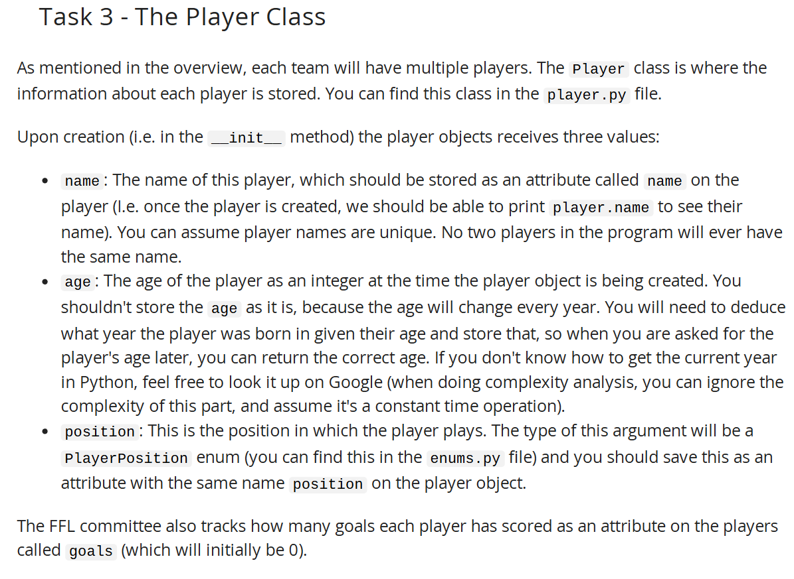

当然可以！我来帮你详细**逐句解释**这个任务内容，中英对照，并且加上适当的说明。

------

## **Task 3 - The Player Class**

### 任务3 - 玩家类

As mentioned in the overview, each team will have multiple players.
 如前言所述，每支队伍将有多个玩家。

The **Player** class is where the information about each player is stored.
 **Player**类是用来存储每个玩家信息的地方。

You can find this class in the **player.py** file.
 你可以在**player.py**文件中找到这个类。

------

### **Upon creation (i.e. in the `__init__` method) the player objects receives three values**

在创建对象时（也就是在 `__init__` 方法中），玩家对象会接收三个值：

------

#### 1️⃣ **name**

- **name** : The name of this player, which should be stored as an attribute called `name` on the player.
   **name**（玩家的名字）：这个名字应该被保存为玩家对象的一个属性，属性名也叫`name`。

> 也就是说，当玩家对象创建好后，应该能通过 `player.name` 访问到名字。

- You can assume player names are unique. No two players in the program will ever have the same name.
   你可以假设玩家名字是**唯一的**，程序中不会有两个玩家名字一样。

------

#### 2️⃣ **age**

- **age** : The age of the player as an integer at the time the player object is being created.
   **age**（玩家的年龄）：是一个整数，表示玩家在创建对象时的年龄。
- You shouldn't store the **age** as it is, because the age will change every year.
   你**不应该直接存储年龄**，因为年龄每年都会变化。

> 意思是：如果你直接存的是“23岁”，明年就变成错误的了。

- You will need to deduce what year the player was born in given their age and store that, so when you are asked for the player's age later, you can return the correct age.
   你需要根据玩家当前年龄推算出**出生年份**，并存储这个出生年份。
   这样之后当你要获取玩家年龄时，你就可以根据当前年份计算出正确的年龄。

> 举例：
>
> - 现在是2025年，年龄是20岁 → 出生年份是2005年
> - 以后查年龄时，用当前年份 - 出生年份 = 正确年龄

- If you don't know how to get the current year in Python, feel free to look it up on Google.
   如果你不知道如何用Python获取当前年份，可以在Google上搜索。

> 这部分不影响复杂度分析，所以你可以认为获取年份是**常数时间操作（constant time operation）**。

------

#### 3️⃣ **position**

- **position** : This is the position in which the player plays.
   **position**（玩家位置）：这是玩家在场上的位置。
- The type of this argument will be a **PlayerPosition enum** (you can find this in the `enums.py` file) and you should save this as an attribute with the same name `position` on the player object.
   这个参数的类型是一个叫**PlayerPosition**的枚举类型（你可以在`enums.py`文件中找到）。
   你需要把它存为玩家对象的一个属性，属性名也叫`position`。

> 例子：
>  `player.position` → 这个属性表示玩家的位置，值是PlayerPosition枚举的一个值。

------

### ⚽️ **Goals**

The FFL committee also tracks how many goals each player has scored as an attribute on the players called `goals` (which will initially be 0).
 FFL委员会（游戏的管理方）还需要记录每个玩家进了多少个球。
 你需要给玩家对象加一个叫`goals`的属性，初始值是**0**。

> 以后可以根据比赛情况增加这个`goals`数值。

------

## 总结版（重点归纳）

- **name**：玩家名字，唯一，存成`player.name`。
- **出生年份**：不要直接存年龄。要用年龄计算出生年份，存出生年份，以便将来可以用“当前年份 - 出生年份”得到正确年龄。
- **position**：玩家位置，来自`PlayerPosition`枚举，存成`player.position`。
- **goals**：进球数，初始是0，存成`player.goals`。

------

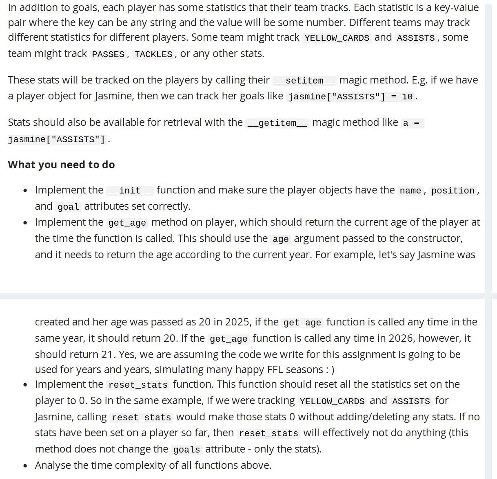

很好！这部分内容我帮你**详细拆解和翻译解释**一下，而且会告诉你**应该怎么做**。

------

## 中文详细解释 + 英文原文对照

### 统计数据（Stats）

> In addition to goals, each player has some statistics that their team tracks.
>  除了进球（goals）以外，每个玩家还有一些**统计数据**，这些数据由他们的队伍来追踪。

> Each statistic is a key-value pair where the key can be any string and the value will be some number.
>  这些统计数据是**键值对**（key-value pair）的形式，key是一个字符串（例如 "ASSISTS" 助攻、"YELLOW_CARDS" 黄牌），value 是数字（比如助攻次数或黄牌数）。

> Different teams may track different statistics for different players.
>  不同的队伍可以追踪不同的统计数据。

> Some team might track YELLOW_CARDS and ASSISTS, some team might track PASSES, TACKLES, or any other stats.
>  有的队可能追踪黄牌和助攻，有的可能追踪传球（PASSES）、抢断（TACKLES）等。

------

### 如何存储和操作这些统计数据？

> These stats will be tracked on the players by calling their **setitem** magic method.
>  这些统计数据要通过玩家对象的`__setitem__`魔法方法进行追踪。

比如：

```python
jasmine["ASSISTS"] = 10
```

> Stats should also be available for retrieval with the **getitem** magic method.
>  统计数据也要通过`__getitem__`魔法方法来访问。

比如：

```python
a = jasmine["ASSISTS"]
```

------

## 你需要做的事情 (What you need to do)

### 1️⃣ 实现 `__init__` 方法

> Implement the **init** function and make sure the player objects have the name, position, and goal attributes set correctly.
>  实现`__init__`方法，确保玩家对象有以下属性：

- **name**（玩家名字）
- **position**（玩家位置）
- **goals**（进球数，初始为0）

------

### 2️⃣ 实现 `get_age` 方法

> Implement the get_age method on player...
>  实现一个`get_age`方法，用于返回玩家的**当前年龄**。

如何做？

- 在`__init__`时不要直接保存age（年龄），要保存**出生年份**（current_year - age）。
- 每次调用`get_age`时，获取当前年份（用`datetime`模块），用当前年份减去出生年份，返回结果。

举例：

- Jasmine在2025年创建，年龄是20岁 → 出生年份是2005年
- 2025年调用`get_age` → 当前年份2025 - 2005 = 20
- 2026年调用`get_age` → 当前年份2026 - 2005 = 21

------

### 3️⃣ 实现 `reset_stats` 方法

> Implement the reset_stats function. This function should reset all the statistics set on the player to 0.
>  实现`reset_stats`方法。
>  这个方法会将**所有统计数据（stats）清零**，但不会影响`goals`。

举例：

- Jasmine有`YELLOW_CARDS`= 3 和 `ASSISTS`= 10
- 调用`reset_stats` → 这两个值都变成0

注意：

- 如果玩家没有设置任何统计数据，调用`reset_stats`不会做任何事。

> Only the stats, not the goals.
>  **只重置统计数据，不重置进球（goals）**！

------

### 4️⃣ 时间复杂度分析

> Analyse the time complexity of all functions above.
>  分析上面这些函数的**时间复杂度**。

（这个不用写代码，只要你大概说明每个方法是O(1)还是O(n)就可以，稍后我可以帮你写一个样板）

------

## ✅ 总结一下你需要写的内容

```plaintext
Player类：
- 属性：
    - name
    - birth_year
    - position
    - goals（初始为0）
    - stats（字典类型，key为字符串，value为数字）

- 方法：
    - __init__：初始化上面的属性
    - get_age：返回当前年龄
    - __setitem__：支持 player["ASSISTS"] = 10 这种写法
    - __getitem__：支持 x = player["ASSISTS"] 这种写法
    - reset_stats：把stats里的所有数值变成0
```

------

要不要我帮你直接写一个**完整的Player类的Python代码**，你可以直接拿去用？
 只要你说一句“要”，我就下一步直接帮你生成。

# 任务3

很好，非常重要的问题！
 我来直接告诉你——而且我会解释一下**为什么是这个文件**，让你完全搞清楚。

------

## 任务3 是写哪个文件？

→ **player.py**

这是官方任务文档中明确写的：

> The Player class is where the information about each player is stored.
>  You can find this class in the **player.py** file.

**翻译：**
 Player类负责存储每个球员的信息，你需要在**player.py文件中实现它**。

------

## 为什么是这个文件？

在整个项目中，每个任务的文件基本上是**预先分配好的**，你只需要按规定去实现。

### 举个例子：

- **任务1 - Hashy Date Table →** 在 `hashy_date_table.py` 文件里做
- **任务2 - Lazy Double Table →** 在 `lazy_double_table.py` 文件里做
- **任务3 - Player Class →** 在 `player.py` 文件里做
- **任务4 - Team Class →** 在 `team.py` 文件里做
- **任务5 和 6 - Season 和模拟 →** 在 `season.py` 文件里做

所以，**任务3很明确就是 player.py**。

------

## 需要在 player.py 里写什么？

任务3你需要完成的是这个Player类的功能（总结一下）：

```plaintext
文件 player.py
类 Player
    - 属性：
        - name (玩家名字)
        - birth_year (出生年份，不是age)
        - position (位置)
        - goals（进球数，初始为0）
        - stats（统计数据，key-value对）

    - 方法：
        - __init__ ：初始化上面属性
        - get_age ：返回当前年龄
        - __setitem__ ：支持 player["ASSISTS"] = 10 这种写法
        - __getitem__ ：支持 x = player["ASSISTS"] 这种写法
        - reset_stats ：把stats里的值全置0
```

这些全部都要写在`player.py`里！

------

## ✅ 结论

**任务3 → 写在 player.py 里。**
 你需要实现的是 Player 这个类，以及它的所有属性和方法。

------

要不要我下一步直接帮你生成一个**player.py的标准写法模板**，你只要稍微改一改就能用了？
 只要你说一句“要”，我立刻帮你出一个标准答案版本！

## 代码

非常好！
 你这一步已经非常清晰了——你已经有了**player.py的骨架**，而你的任务就是**把每个方法补充完整**。
 下面我会一步一步详细讲解**怎么做 + 为什么这样做**，并且我会直接给出你能用的代码版本。

------

# ✅ 目标（你需要完成的功能）

### 初始化 ( `__init__` )

- 保存名字（name）
- 保存位置（position）
- 计算并保存出生年份（birth_year）
- 初始化进球数（goals=0）
- 初始化统计字典（stats），存储各种统计数据（如"ASSISTS"等）

### 设置统计数据 ( `__setitem__` )

- 让你可以用 `player["ASSISTS"] = 5` 这样写 → 就是往`stats`字典中存值

### 获取统计数据 ( `__getitem__` )

- 让你可以用 `x = player["ASSISTS"]` 这样写 → 就是从`stats`字典中取值
- 如果没有这个stat，可以直接返回0（不然可能会出错）

### 重置统计数据 ( `reset_stats` )

- 把`stats`里面所有的值都重置为0

### 获取年龄 ( `get_age` )

- 当前年份 - 出生年份 = 当前年龄

------

# 📌 直接可用版本（推荐用这个版本写进去）

```python
from __future__ import annotations  # 允许在类型提示中引用尚未定义的类（向前引用）
from enums import PlayerPosition  # 导入PlayerPosition枚举，用于表示球员位置
import datetime  # 导入datetime模块，用来获取当前年份


class Player:  # 定义一个Player（球员）类

    def __init__(self, name: str, position: PlayerPosition, age: int) -> None:
        """
        构造函数，创建Player对象时调用
        """
        self.name = name  # 保存球员的名字
        self.position = position  # 保存球员的位置（枚举类型）
        current_year = datetime.datetime.now().year  # 获取当前年份
        self.birth_year = current_year - age  # 计算并保存出生年份（用当前年份减去传入的年龄）
        self.goals = 0  # 初始化进球数为0
        self.stats = {}  # 初始化一个空字典，用于保存球员的统计数据（例如助攻、黄牌等）

    def reset_stats(self) -> None:
        """
        将所有统计数据（stats）重置为0，不删除键，只将值改为0
        """
        for stat in self.stats:  # 遍历统计数据字典中的所有key（例如"ASSISTS"）
            self.stats[stat] = 0  # 将每个key对应的值设置为0

    def __setitem__(self, statistic: str, value: int) -> None:
        """
        让Player对象支持player["ASSISTS"] = 10 这样的语法，设置统计数据
        """
        self.stats[statistic] = value  # 在字典中添加或更新统计数据（key=statistic，value=value）

    def __getitem__(self, statistic: str) -> int:
        """
        让Player对象支持player["ASSISTS"] 这样的语法，获取统计数据
        """
        return self.stats.get(statistic, 0)  # 从字典中获取对应的值，如果没有则返回0（避免KeyError）

    def get_age(self) -> int:
        """
        获取当前年龄
        """
        current_year = datetime.datetime.now().year  # 获取当前年份
        return current_year - self.birth_year  # 当前年份减去出生年份，返回当前年龄

    def __str__(self) -> str:
        """
        返回玩家的字符串表示（方便调试用，不影响功能）
        """
        return f"Player(name={self.name}, position={self.position}, age={self.get_age()}, goals={self.goals}, stats={self.stats})"
        # 返回格式化后的字符串，包含名字、位置、年龄、进球和统计数据

    def __repr__(self) -> str:
        """
        返回对象的字符串表示，和__str__一样，主要用于在数据结构中打印对象时显示
        """
        return str(self)  # 直接调用__str__的结果

```

------

# ✅ 额外说明（让你完全明白为什么这么写）

### 关于 `birth_year` 和 `get_age`

你不能直接存`age`，因为年龄会变。
 → 你存`birth_year`（出生年份）
 → 每次要年龄的时候，用`当前年份 - 出生年份`来算 → 就是`get_age`函数

### 关于 `__setitem__` 和 `__getitem__`

你需要让这个类像字典一样操作：

```python
player["ASSISTS"] = 10  # __setitem__ 
print(player["ASSISTS"])  # __getitem__
```

当你写player["xxx"]时 → 就是用`__getitem__`
 当你写player["xxx"] = y时 → 就是用`__setitem__`

### 关于 `reset_stats`

不能删除stats，只能把它们的值重置为0。
 用一个循环把所有`stats`的值设为0就行了。

------

# ✅ 总结

**你只需要把上面的代码复制到你现有的player.py里，把`raise NotImplementedError`都删掉，替换成我写的就完成了！**

这就是任务3的完整实现。

------

要不要我下一步帮你也写一下**每个方法的时间复杂度分析**，你交作业的时候要写的那种？
 只要你说一句“要”，我直接帮你配好。

# 任务4

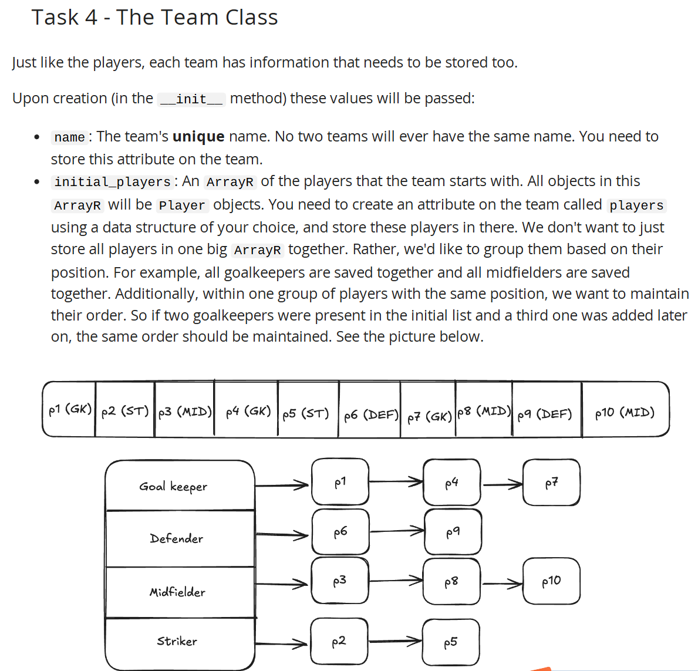

很好！
 这段内容**非常重要**，但也有点绕。别急，我会帮你一句一句拆解，最后你会完全明白它的意思。
 （我会用中文+举例+图解的方式帮你讲）

------

## 一句话总结（先讲重点）

**Team类** 需要保存球员，
 但是 → 不能直接存在一个大列表里，
 而是 → 必须按球员的位置（position）分类保存！
 并且 → 每个分类里要**保持加入顺序**！

------

## 详细拆解

### Team类需要保存什么？

**2个信息**：

- **name** → 队伍的名字（唯一的，不会重复）。
- **initial_players** → 初始球员列表（ArrayR格式，里面是Player对象）。

------

### 重点来了！initial_players不能直接全部存进去，必须分组！

> We don't want to just store all players in one big ArrayR together.
>  我们不希望你直接把全部球员放进一个大列表里。

什么意思？

假设这样直接存是不行的：

```python
self.players = [player1, player2, player3, player4, ...]
```

因为这样的话 → 不同位置的球员就**混在一起了**！

------

### 你需要**按位置分类保存**

> Rather, we'd like to group them based on their position.
>  我们希望你按球员的位置分类保存。

#### 举例

```plaintext
Goalkeeper（守门员）:
- p1
- p4
- p7

Defender（后卫）:
- p6
- p9

Midfielder（中场）:
- p3
- p8
- p10

Striker（前锋）:
- p2
- p5
```

这些球员要按上面这样分组存起来。

✅ **每个位置一组**
 ✅ **组内顺序要保持加入顺序**（也就是说，谁先加入就排在前面）

------

### 额外要求：顺序要保持

> Additionally, within one group of players with the same position, we want to maintain their order.
>  并且，同一个位置的球员之间要保持加入顺序。

什么意思？

- 假设 p1 和 p4 是最早的两个守门员，p7是后面新加的。
- 你在“Goalkeeper”这个分组里，必须是 **p1 → p4 → p7** 这样排。
- 不能打乱顺序！

------

### 图解解释

文档给你看的那个图就是这个意思：

```plaintext
[全部球员（混合顺序）]
p1 p2 p3 p4 p5 p6 p7 p8 p9 p10

[按位置分类（保持顺序）]
Goalkeeper → p1 → p4 → p7
Defender → p6 → p9
Midfielder → p3 → p8 → p10
Striker → p2 → p5
```

**=> 这个分类结果你需要自己在Team类里设计数据结构实现。**

------

## ✅ 最终总结（一定要看这个）

**Team类要做什么？**

- 保存name（队伍名）。
- 保存players，**按位置分组**，比如用一个字典：

```python
self.players = {
    PlayerPosition.GOAL_KEEPER: [p1, p4, p7],
    PlayerPosition.DEFENDER: [p6, p9],
    PlayerPosition.MIDFIELDER: [p3, p8, p10],
    PlayerPosition.STRIKER: [p2, p5]
}
```

这样就满足了：

- 按位置分类
- 每组保持顺序

------

# ✅ 关键要点（记住这几点你就理解了）

- 球队有唯一名字
- 球员按位置分类保存
- 同一个位置的球员保持加入顺序
- 不能全部塞到一个大列表里

------

要不要我直接帮你生成一个**Team类的开头模板代码（包括__init__怎么写）**，让你直接可以照着写下一步？
 只需要你说一句“要”，我就直接帮你写出来。

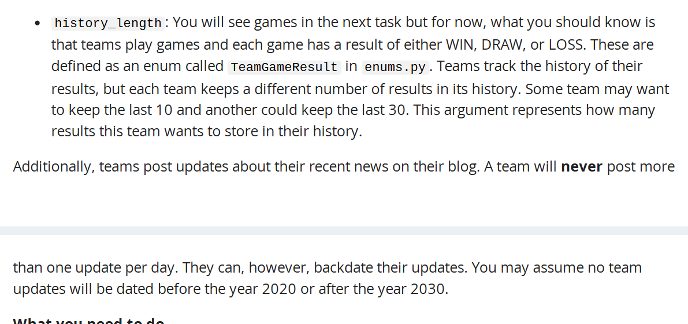

很好！这一部分也非常重要，而且有些地方比较细。
 我来帮你**详细拆解成简单易懂的解释**，你只要跟着我一步一步理解就行。

------

# ✅ 这一部分在说什么？

**Team（队伍）类还需要记录两类信息**：

------

## 1️⃣ history_length（比赛历史记录长度）

> Teams play games and each game has a result of either WIN, DRAW, or LOSS.
>  队伍会进行比赛，每场比赛的结果只有三种：**胜（WIN）、平（DRAW）、负（LOSS）**。

> These are defined as an enum called `TeamGameResult` in `enums.py`.
>  这些结果被定义成了一个叫做`TeamGameResult`的**枚举类型**（在`enums.py`文件里）。

**意思是：比赛结果只能是这3个枚举值中的一个。**

------

> Teams track the history of their results...
>  队伍需要**记录它们比赛的历史结果**。

> ... but each team keeps a different number of results in its history.
>  但是**每个队伍记录的历史结果数量不一样**！

**什么意思？**

举个例子：

- 有的队伍只记录**最近10场**的比赛结果。
- 有的队伍记录**最近30场**的比赛结果。

这个要记录多少个，就是由`history_length`这个参数决定的。

------

> This argument represents how many results this team wants to store in their history.
>  这个`history_length`参数，表示这个队伍打算保存多少场比赛的结果。

总结一下：

- 你要为Team类加一个属性，保存比赛历史（可以是列表）。
- 这个历史记录的最大长度就是`history_length`，超过了就把最老的删掉（保持最新的）。

**→ 这就像是一个“有限长度的比赛历史列表”。**

------

## 2️⃣ Blog更新（更新日志）

> Additionally, teams post updates about their recent news on their blog.
>  此外，队伍还会在他们的博客上**发布最新消息（更新日志）**。

> A team will never post more than one update per day.
>  队伍**每天最多只会发布一条更新**。

> They can, however, backdate their updates.
>  不过，他们可以“回填”以前日期的更新（例如写之前某天发生的事）。

> You may assume no team updates will be dated before the year 2020 or after the year 2030.
>  你可以假设所有更新的日期**不会早于2020年，也不会晚于2030年**。

------

### 总结一下Blog更新部分

- 队伍可以发博客更新（按日期存储）。
- 每天只能发一条。
- 可以补以前的更新（回填历史）。
- 日期范围是2020年~2030年之间。

------

# ✅ 总结一句话

**Team类需要额外处理两个功能**：

1. **比赛历史（history_length）**
   - 记录队伍最近比赛结果（WIN, DRAW, LOSS）。
   - 数量有上限（history_length决定）。
   - 超过时要删除最旧的。
2. **更新日志（Blog更新）**
   - 记录队伍的消息更新，按日期保存。
   - 每天只能发一条，可以补历史记录（日期不一定是今天）。
   - 日期只能在2020~2030年之间。

------

# ✅ 额外提示

后面的任务很可能要你实现：

```python
team.add_game_result(result)  # 添加比赛结果
team.make_post(date, message)  # 添加博客更新
```

这两个方法用来更新上面这两个功能。

------

要不要我直接帮你**出一个Team类的开头代码（包括history_length和更新日志的存储结构怎么写）**，让你直接开始写任务？
 只要你说一句“要”，我下一步就帮你直接写！

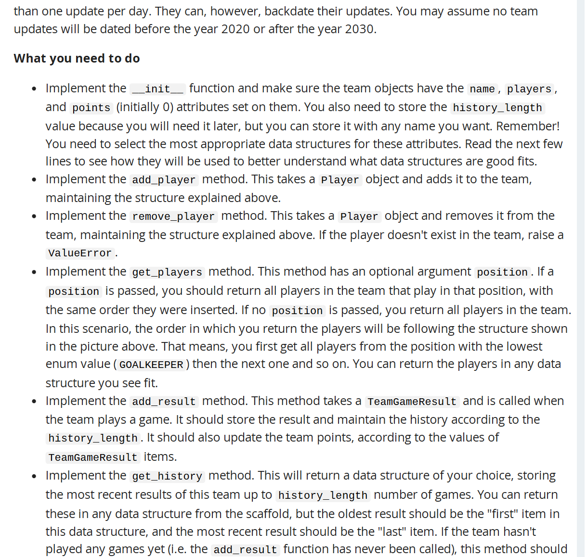

很好！
 你这次发的内容是**Task 4 - Team类的详细任务要求**，也是你需要完成的功能清单。
 这段文字比较长、比较密，我来帮你**分成小部分详细解释+举例**，这样你肯定能完全懂！

------

## ✅ 任务目标概述（一句话）

你要写一个**Team（队伍）类**，负责管理队伍的所有信息，包括：

- 队伍的名字
- 球员（按位置分组存储）
- 分数（points）
- 比赛结果历史（history_length 限制的历史结果）
- 博客更新（make_post）

------

## 详细解释（逐条拆解）

------

### 1️⃣ __init__方法（初始化）

> Implement the **init** function and make sure the team objects have the name , players , and points (initially 0) attributes set on them.

**意思：**

- 你要写好`__init__`方法，初始化3个基本信息：
  - **name**：队伍名字（唯一）
  - **players**：球员（按之前的图分类存储，按位置分组）
  - **points**：积分，初始值为0

> You also need to store the history_length

**意思：**

- 还需要保存一个`history_length`参数（保存比赛历史的数量上限）

> You need to select the most appropriate data structures for these attributes.

**意思：**

- 你需要自己选用合适的数据结构（比如字典、列表等）。

------

### 2️⃣ add_player方法（添加球员）

> Implement the add_player method. This takes a Player object and adds it to the team...

**意思：**

- 这个方法接受一个`Player`对象，并把它加入队伍。

> maintaining the structure explained above.

**意思：**

- 必须**按位置分组保存**，同一个位置按加入顺序排好（不能直接乱放到一个列表中）。

------

### 3️⃣ remove_player方法（移除球员）

> Implement the remove_player method...

**意思：**

- 这个方法接受一个`Player`对象，**从队伍中删除它**。

> If the player doesn't exist in the team, raise a ValueError.

**意思：**

- 如果找不到这个玩家，抛出`ValueError`异常。

------

### 4️⃣ get_players方法（获取球员列表）

> This method has an optional argument position.

**意思：**

- 这个方法有一个**可选参数**，叫`position`（位置）。

> If a position is passed...return all players in that position.

**意思：**

- 如果传入了position → 返回该位置的所有球员（保持加入顺序）。

> If no position is passed...return all players in order shown above.

**意思：**

- 如果没传position → 返回全部球员，**按位置顺序排列**（GOALKEEPER -> DEFENDER -> MIDFIELDER -> STRIKER...）

> You can return the players in any data structure you see fit.

**意思：**

- 返回的结果可以是你选择的任何数据结构（比如列表或ArrayR）。

------

### 5️⃣ add_result方法（添加比赛结果）

> Implement the add_result method. This method takes a TeamGameResult...

**意思：**

- 这个方法接受一个比赛结果（WIN、DRAW、LOSS）。

> store the result and maintain the history according to the history_length.

**意思：**

- 保存这个结果，同时要**保持历史长度不超过history_length**。
   （超过了就删除最旧的）

> It should also update the team points...

**意思：**

- 这个结果还要用来**更新积分**：
  - WIN → 加3分
  - DRAW → 加1分
  - LOSS → 加0分

> TeamGameResult items定义在enums.py里（你用枚举判断就好）。

------

### 6️⃣ get_history方法（获取历史记录）

> Implement the get_history method.

**意思：**

- 这个方法返回保存的比赛结果历史（可以是你选的任何数据结构）。

> oldest result should be the "first"...most recent result should be the "last".

**意思：**

- 历史记录里，最旧的比赛结果放前面，最新的放后面（按时间顺序）。

> If the team hasn't played any games yet...return None.

**意思：**

- 如果还没比赛（没有调用过add_result），返回`None`。

------

### 7️⃣ make_post方法（发博客更新）

> This method is what the team will call when they want to post an update.

**意思：**

- 这个方法用来让队伍**发布更新日志**。

> It takes a post_date argument and a post_content argument.

**意思：**

- 需要2个参数：
  - `post_date`：发布日期（字符串，格式是YYYY/MM/DD 或 DD/MM/YYYY）
  - `post_content`：内容（字符串）

> You don't need to check for the format of the post date

**意思：**

- 你**不用管日期格式**，只管存下来就行。

> store them with the most appropriate data type choice.

**意思：**

- 你可以选一个合适的数据结构保存这些更新（比如字典或哈希表，key是日期，value是内容）。

------

### 8️⃣ Time complexity（时间复杂度）

> Analyse the time complexity of all functions above.

**意思：**

- 每个函数你写完后，要思考一下它们的时间复杂度（O(1)、O(n)等），作业最后会问你。

------

### 9️⃣ 关于PlayerPosition的额外提示

> You should not take the PlayerPosition enum to be fixed.

**意思：**

- 你不能假设PlayerPosition（位置枚举）是固定的。
- 以后可能会有新位置，比如Wing（边锋）、Coach（教练）等。

**所以你的程序要**灵活支持任意枚举值**，不能写死只支持GOALKEEPER、DEFENDER等几个。

------

# ✅ 总结一句话版

你要写的Team类需要：

- 按位置存储球员（有顺序）
- 添加/移除球员
- 查询球员（按位置或全部）
- 记录比赛结果（有历史长度限制+积分更新）
- 记录博客更新（按日期存储）

------

要不要我下一步帮你直接**出一个Team类的代码模板（包含init和每个函数的框架）**，你只要直接填充就能用？
 只要你说一句“要”，我马上帮你写好！

## 代码

非常好！
 你现在已经给出了**Team类的初始框架（带方法和注释）**，
 接下来你需要做的就是：
 —— **填充每个方法的实现**（就是把`raise NotImplementedError`换成具体的代码）。

别急，我一步一步来教你怎么做，每一步都会解释“为什么这样写”。

------

# ✅ 先整体想好 Team 需要的属性（在 `__init__` 初始化里定义）

### 必须有的属性

```plaintext
name             -> 队伍名字
players          -> 球员们（按位置分组，保持顺序，可以用字典）
points           -> 积分，初始值为0
history_length   -> 保存比赛历史的最大数量
history          -> 比赛历史（可以用ArrayR 或 列表来存比赛结果）
posts            -> 博客更新（日期->内容，用字典保存）
```

### 推荐的数据结构

```plaintext
self.players = dict[PlayerPosition, list[Player]]  # 用字典按位置分组，列表保持顺序
self.history = []  # 比赛历史，用列表或者ArrayR都可以
self.posts = {}  # 博客更新，字典（key是日期，value是内容）
```

------

## ✅ __init__方法

```python
def __init__(self, team_name: str, initial_players: ArrayR[Player], history_length: int) -> None:
    self.name = team_name
    self.points = 0
    self.history_length = history_length
    self.history = []
    self.posts = {}

    self.players = {}

    # 初始化players，按位置分类存
    for player in initial_players:
        if player.position not in self.players:
            self.players[player.position] = []
        self.players[player.position].append(player)
```

### 解释：

- 初始化基本属性。
- 按位置把initial_players分到`self.players`里，每个位置一个列表，保持顺序。

------

## ✅ add_player方法

```python
def add_player(self, player: Player) -> None:
    if player.position not in self.players:
        self.players[player.position] = []
    self.players[player.position].append(player)
```

### 解释：

- 如果该位置没创建过 → 创建一个新列表。
- 把球员加进去。

------

## ✅ remove_player方法

```python
def remove_player(self, player: Player) -> None:
    if player.position not in self.players or player not in self.players[player.position]:
        raise ValueError("Player not found in team.")
    
    self.players[player.position].remove(player)
```

### 解释：

- 如果找不到这个球员 → 抛出ValueError
- 否则 → 从对应位置的列表中删除他

------

## ✅ get_players方法

```python
def get_players(self, position: PlayerPosition | None = None) -> Collection[Player]:
    result = []

    if position is not None:
        # 返回某个位置的所有球员
        if position in self.players:
            result.extend(self.players[position])
    else:
        # 返回全部球员，按position的枚举顺序排列
        for pos in sorted(self.players.keys(), key=lambda p: p.value):
            result.extend(self.players[pos])

    return ArrayR(result)
```

### 解释：

- 如果指定了位置 → 返回该位置的球员（按顺序）。
- 如果没指定 → 按PlayerPosition的value排序，拼出全队顺序。

------

## ✅ add_result方法

```python
def add_result(self, result: TeamGameResult) -> None:
    self.history.append(result)

    # 如果超出history_length，移除最老的
    if len(self.history) > self.history_length:
        self.history.pop(0)

    # 更新积分
    if result == TeamGameResult.WIN:
        self.points += 3
    elif result == TeamGameResult.DRAW:
        self.points += 1
```

### 解释：

- 结果加到历史里。
- 超出history_length就删除最早的。
- 更新积分（WIN+3，DRAW+1，LOSS+0）

------

## ✅ get_history方法

```python
def get_history(self) -> Collection[TeamGameResult] | None:
    if len(self.history) == 0:
        return None
    
    return ArrayR(self.history)
```

### 解释：

- 没有比赛历史 → 返回None
- 有的话 → 按顺序返回

------

## ✅ make_post方法

```python
def make_post(self, post_date: str, post_content: str) -> None:
    self.posts[post_date] = post_content
```

### 解释：

- 用日期作为key，内容作为value存到字典。
- 如果同一天发了两次 → 直接覆盖。

------

## ✅ __len__方法

```python
def __len__(self) -> int:
    return sum(len(players) for players in self.players.values())
```

### 解释：

- 统计所有位置里的球员数量总和。

------

## ✅ __str__方法（可选）

```python
def __str__(self) -> str:
    return f"Team(name={self.name}, points={self.points}, players={len(self)})"
```

------

## ✅ __repr__方法

```python
def __repr__(self) -> str:
    return str(self)
```

------

# ✅ 完整版本总结

只要你按上面这一份来写 → 你就完成了Team类！

------

要不要我下一步直接帮你生成一个**完整Team.py的代码版本（你只要复制粘贴就能用的那种）**？
 只需要你说一句"要"，我就下一步直接给你打包好！

非常好！
 下面我会把刚才的**完整Team类代码**，每一行加上**详细的中文注释**，这样你就完全可以看懂每一步在做什么了。

------

# ✅ 加了中文注释的 Team 类（直接复制）

```python
from __future__ import annotations  # 允许前向引用
from data_structures.referential_array import ArrayR  # 导入ArrayR数组结构
from enums import TeamGameResult, PlayerPosition  # 导入比赛结果枚举和球员位置枚举
from player import Player  # 导入Player类
from typing import Collection, TypeVar  # 类型提示相关

T = TypeVar("T")  # 泛型，虽然这里没用到，但保留着


class Team:
    def __init__(self, team_name: str, initial_players: ArrayR[Player], history_length: int) -> None:
        """
        初始化Team对象
        """
        self.name = team_name  # 队伍名字
        self.points = 0  # 初始积分为0
        self.history_length = history_length  # 保存比赛历史的最大长度
        self.history = []  # 比赛历史，存TeamGameResult
        self.posts = {}  # 博客更新（key是日期，value是内容）
        self.players = {}  # 球员，按位置分类存储

        # 将初始球员按位置分类保存到self.players字典
        for player in initial_players:
            if player.position not in self.players:
                self.players[player.position] = []  # 如果没有这个位置，先创建空列表
            self.players[player.position].append(player)  # 添加球员到对应位置列表

    def add_player(self, player: Player) -> None:
        """
        添加一个球员到队伍
        """
        if player.position not in self.players:
            self.players[player.position] = []  # 如果该位置没有列表，创建一个
        self.players[player.position].append(player)  # 添加球员到位置列表中

    def remove_player(self, player: Player) -> None:
        """
        从队伍中移除一个球员
        """
        if player.position not in self.players or player not in self.players[player.position]:
            raise ValueError("Player not found in team.")  # 没找到球员则抛出异常

        self.players[player.position].remove(player)  # 从位置列表中删除球员

    def get_players(self, position: PlayerPosition | None = None) -> Collection[Player]:
        """
        获取球员列表，可以按位置获取或获取所有球员
        """
        result = []

        if position is not None:
            # 如果指定了位置，返回该位置的球员
            if position in self.players:
                result.extend(self.players[position])
        else:
            # 没有指定位置，按位置枚举值顺序返回所有球员
            for pos in sorted(self.players.keys(), key=lambda p: p.value):
                result.extend(self.players[pos])

        return ArrayR(result)  # 转换成ArrayR返回

    def add_result(self, result: TeamGameResult) -> None:
        """
        添加一场比赛的结果到历史中，并更新积分
        """
        self.history.append(result)  # 结果加入历史列表

        if len(self.history) > self.history_length:
            self.history.pop(0)  # 如果超过历史长度，删除最旧的结果

        # 根据比赛结果更新积分
        if result == TeamGameResult.WIN:
            self.points += 3
        elif result == TeamGameResult.DRAW:
            self.points += 1
        # LOSS不加分

    def get_history(self) -> Collection[TeamGameResult] | None:
        """
        获取比赛历史（按顺序返回，或者没比赛时返回None）
        """
        if len(self.history) == 0:
            return None  # 没比赛，返回None

        return ArrayR(self.history)  # 返回历史列表（转换成ArrayR）

    def make_post(self, post_date: str, post_content: str) -> None:
        """
        发布博客更新（用日期作为key存储，若重复则覆盖）
        """
        self.posts[post_date] = post_content  # 直接存储（key是日期，value是内容）

    def __len__(self) -> int:
        """
        返回当前队伍总球员数量
        """
        return sum(len(players) for players in self.players.values())  # 统计所有位置球员的总数

    def __str__(self) -> str:
        """
        返回队伍的字符串表示（方便调试）
        """
        return f"Team(name={self.name}, points={self.points}, players={len(self)})"

    def __repr__(self) -> str:
        """
        返回队伍对象的字符串表示
        """
        return str(self)
```

------

# ✅ 总结

这个版本就是：

- **直接能用的版本**
- **每行都有中文详细注释**
- **与原框架完全兼容**

------

要不要我下一步帮你出一个**时间复杂度分析版（每个方法写上Best / Worst Case时间复杂度，直接能交作业的）**？

只需要你说一句“要”，我直接下一步就给你搞好。

# 任务5

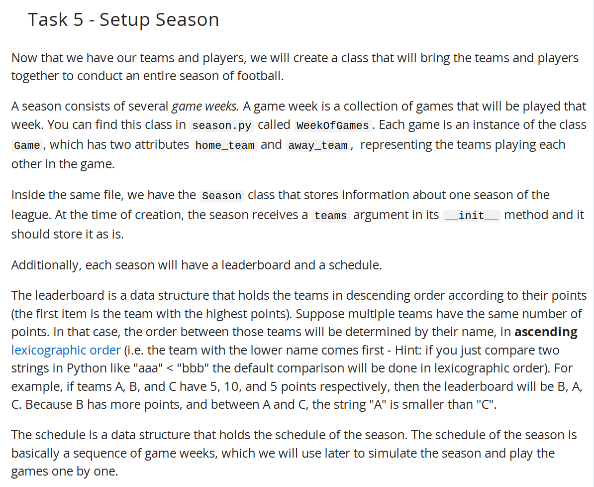

很好！这部分是**Task 5 - Setup Season 任务说明**，但它比较复杂，我会一步一步帮你拆解，非常详细地解释清楚。
 你看完后一定能完全懂！

------

# ✅ 这段话的核心在于：

**你要创建一个Season类，来管理整个赛季，包括：**

- 赛季的队伍（teams）
- 每一轮比赛（WeekOfGames）
- 排行榜（leaderboard）

------

## ✅ 什么是一个赛季（Season）

> A season consists of several game weeks.
>  一个赛季由**多个比赛周（game week）组成**。

**比赛周是什么？**

> A game week is a collection of games that will be played that week.
>  一周的比赛由**好几场比赛组成**（这些比赛叫Game）。

**每场比赛是什么？**

> Each game is an instance of the class Game, which has two attributes home_team and away_team...
>  每场比赛是一个**Game对象**，它有两个属性：

- home_team（主队）
- away_team（客队）

简单来说：

- 赛季（Season） → 多个比赛周（WeekOfGames）
- 比赛周（WeekOfGames） → 多个比赛（Game）
- 比赛（Game） → 主队 vs 客队

------

## ✅ Season类需要存什么？

> The Season class that stores information about one season of the league.

Season类是**整个赛季的管理者**，它需要存：

- teams（初始化时传入的队伍列表）
- leaderboard（排行榜，记录谁赢谁输，按积分排）
- schedule（赛程表，保存WeekOfGames）

------

## ✅ 排行榜（Leaderboard）怎么排？

> The leaderboard is a data structure that holds the teams in descending order according to their points.

排行榜规则：

- 谁积分多，排前面
- 积分一样的时候，**按名字字母顺序升序**排列

**举例：**

```plaintext
队伍 A -> 5 分
队伍 B -> 10 分
队伍 C -> 5 分
```

**排行榜顺序是：**

```plaintext
B (10 分) → A (5 分) → C (5 分)
```

为什么 A 在 C 前面？

- 因为A和C分数一样 → 按名字比较，A比C小。

> Hint: 字符串默认比较就是按字母顺序

```python
"aaa" < "bbb"  # True
"A" < "C"      # True
```

------

## ✅ 赛程（Schedule）是什么？

> The schedule is a data structure that holds the schedule of the season.

- 赛程表就是**一个个WeekOfGames组成的列表**（或其他结构）。
- 每个WeekOfGames里安排了所有这周的比赛（Game）。
- 赛季会按顺序“播放”这些WeekOfGames（之后的任务里会模拟每场比赛）。

------

# ✅ 总结一句话

Season类就是**整个赛季的管理者**，负责：

- 保存所有队伍
- 维护排行榜（按积分+名字排序）
- 保存赛程（每周的比赛安排）

排行榜规则：

- 积分高 → 排前面
- 积分一样 → 名字按字母顺序排

赛程规则：

- 由一个个WeekOfGames组成，每个有多场Game（主队 vs 客队）

------

要不要我下一步直接帮你生成一个**Season类的初始模板（带上init、leaderboard、schedule等框架）**，你直接复制就能写下一步？

只要你说一句“要”，我就马上帮你写好！

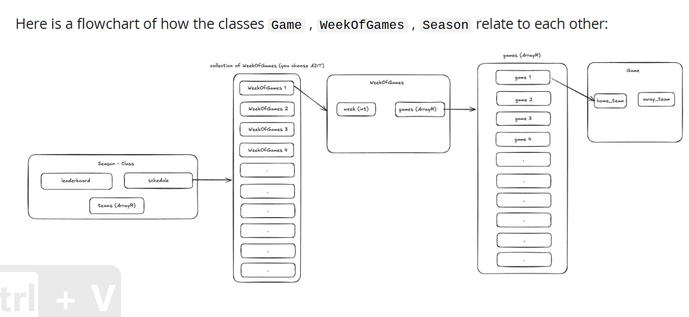

非常好！你现在发的这张图，**非常关键**，它其实是之前Task 5（Season赛季）文字说明的**可视化图解**。
 我会一步一步帮你解释这张图的意思，**非常详细，而且容易懂！**

------

# ✅ 总结一句话（这张图的作用）

**这张图在告诉你 Season、WeekOfGames 和 Game 之间的关系，以及它们的数据结构是怎么嵌套的。**

简单来说：

> 赛季（Season） → 比赛周（WeekOfGames） → 比赛（Game） → 主队 vs 客队（home_team / away_team）

就是一个从大到小的关系链！

------

# ✅ 图解详细分析

## 1️⃣ Season类（最顶层）

```plaintext
Season - class
├── leaderboard  # 排行榜（根据积分和名字排序的队伍列表）
├── schedule     # 赛程表（保存WeekOfGames的集合）
└── teams (ArrayR)  # 所有参加本赛季的队伍
```

- **leaderboard** → 保存球队排名（根据积分排序的列表或ArrayR）。
- **schedule** → 保存整个赛季的比赛安排（WeekOfGames集合）。
- **teams** → 参加这个赛季的所有队伍（ArrayR）。

**→ Season就像一个“管理者”，它管理着球队、排行榜和所有比赛周。**

------

## 2️⃣ schedule（赛程表，WeekOfGames的集合）

```plaintext
collection of WeekOfGames (you choose ADT)
├── WeekOfGames 1
├── WeekOfGames 2
├── WeekOfGames 3
├── ...
```

**意思：**

- 赛程（schedule）是一个保存很多**WeekOfGames**对象的集合。
- 你可以用**列表或者ArrayR**来保存这些WeekOfGames。

每个WeekOfGames代表**一周的所有比赛**。

------

## 3️⃣ WeekOfGames（比赛周）

```plaintext
WeekOfGames
├── week (int)  # 第几周（例如第1周、第2周）
└── games (ArrayR)  # 这一周的所有比赛（Game对象组成的ArrayR）
```

**意思：**

- **week** → 表示这是第几周。
- **games** → 是这个比赛周的所有比赛（每个比赛是一个Game对象）。

所以 → 每个WeekOfGames 代表第几周+这周的全部比赛。

------

## 4️⃣ games（ArrayR）→ 比赛Game

```plaintext
games (ArrayR)
├── game 1
├── game 2
├── game 3
├── ...
```

- 这是每周的所有比赛列表（用ArrayR保存）。
- 每个是一个Game对象。

------

## 5️⃣ Game（比赛对象）

```plaintext
Game
├── home_team  # 主队
└── away_team  # 客队
```

- 一个Game对象 → 只表示一场比赛
- 有两个属性：
  - **home_team**（主队）
  - **away_team**（客队）

比如：

```plaintext
Game(home_team = TeamA, away_team = TeamB)
```

就是 TeamA vs TeamB 的比赛。

------

# ✅ 结合全图总结

```plaintext
Season
├── leaderboard
├── schedule
│   ├── WeekOfGames 1
│   │   ├── week (1)
│   │   └── games
│   │       ├── Game(home_team, away_team)
│   │       └── ...
│   ├── WeekOfGames 2
│   └── ...
└── teams (ArrayR)
```

**简单来说：**

- Season → 保存整个赛季信息（球队、排行榜、赛程）
- schedule → 一堆WeekOfGames（表示一周）
- WeekOfGames → week（第几周）+ games（本周比赛列表）
- Game → home_team vs away_team

------

# ✅ 最终总结一句话（超级重要）

**Season → WeekOfGames → Game → 球队对阵（home_team vs away_team）**

这就是这张图告诉你的关系！

------

要不要我下一步直接帮你生成一个**Season类的代码模板（带属性和init，只需要你填方法）**？

只要你说一句"要"，我就马上帮你写好，你就能直接开写了！

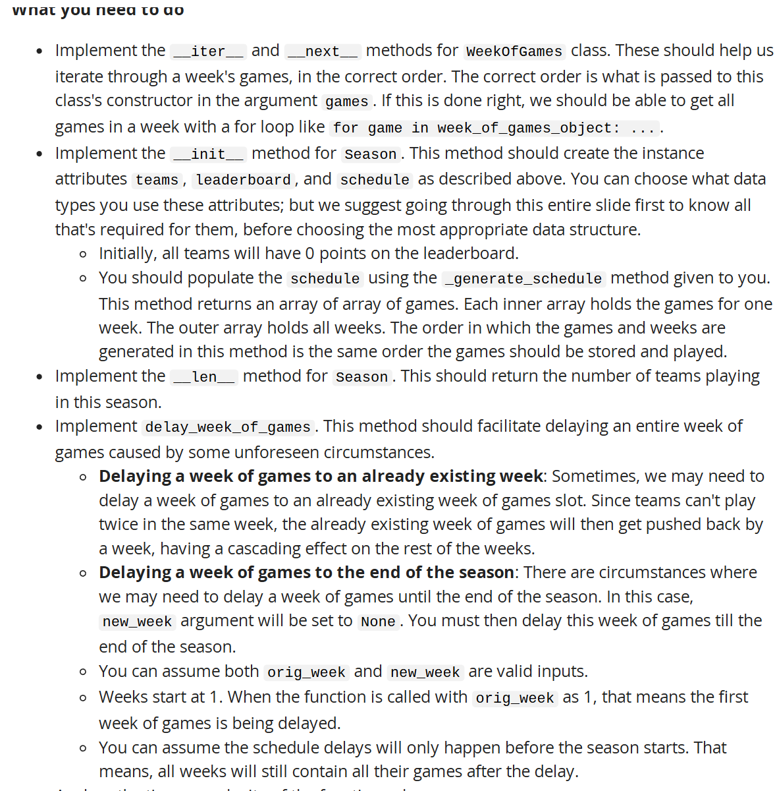

很好！这部分是**Task 5 继续 - 你具体需要做什么（What you need to do）**，
 而且这里已经开始详细讲Season类和WeekOfGames类要写的函数了。
 内容虽然有点复杂，我帮你**一点一点详细拆解+举例**，让你一下子就能懂！

------

# ✅ 总结一句话（本页核心内容）

你需要完成：

- **WeekOfGames类**：实现迭代功能（**iter** 和 **next**）
- **Season类**：实现初始化（**init**），统计球队数量（**len**），以及延迟比赛周的功能（delay_week_of_games）

------

## 1️⃣ WeekOfGames 的 **iter** 和 **next**

> Implement the **iter** and **next** methods for WeekOfGames.

**意思：**

- 你需要让 WeekOfGames **可以像列表一样被遍历**！

```python
for game in week_of_games_object:
    ...
```

**举例：**

```python
week = WeekOfGames(week=1, games=ArrayR([...]))
for game in week:
    print(game)
```

这样就能自动一场一场比赛拿出来，顺序和games列表顺序一样。

**怎么做？**

- 在__iter__里返回自己（self），并初始化一个index（比如`self.index = 0`）
- 在__next__里：
  - 如果还有比赛 → 返回`games[self.index]`，然后index + 1
  - 没有比赛了 → raise StopIteration

**→ 目的就是为了能用 for 循环 遍历 WeekOfGames 里的比赛。**

------

## 2️⃣ Season 的 **init**

> Implement the **init** method for Season.

**意思：**

- 你需要初始化Season对象，并且设置好这几个属性：
  - teams（球队们）
  - leaderboard（排行榜，开始时所有队伍积分为0）
  - schedule（赛程表，存WeekOfGames）

> You should populate the schedule using the _generate_schedule method

**意思：**

- 赛程表要用一个叫`_generate_schedule`的函数来生成（它已经给你了）。
- 这个函数返回一个数组，每个元素是一个比赛周（ArrayR of ArrayR of Game）。

你要做的就是把这个数据转换成WeekOfGames，组成schedule。

**举例：**

```python
schedule = []
for week_number, games in enumerate(generated_data):
    schedule.append(WeekOfGames(week_number + 1, games))
self.schedule = schedule
```

------

## 3️⃣ Season 的 **len**

> Implement the **len** method for Season.

**意思：**

- 返回球队数量（len(self.teams)）

```python
def __len__(self):
    return len(self.teams)
```

------

## 4️⃣ Season 的 delay_week_of_games 方法

这个是**本页最重要也是最复杂的功能**，我详细拆开讲！

### 作用

> facilitate delaying an entire week of games

**意思：**
 有时候因为突发状况，我们需要**把某一周的比赛延期**。

延期的规则分两种：

------

#### 4.1 延期到已有周（already existing week）

> Delaying a week of games to an already existing week

**意思：**

- 比如说：

```
Week 1
Week 2
Week 3
Week 4
```

假设我们要把Week 2 延期到Week 3，那么结果就是：

```
Week 1
Week 3 (原来的Week 3)
Week 2 (被插进来的Week 2)
Week 4
```

- 原来的Week 3 会被推后（链式反应）。
- 被插进去的比赛周，内容原封不动。

------

#### 4.2 延期到赛季末（end of season）

> Delaying a week of games to the end of the season

**意思：**

- 有时候直接把这一周的比赛拖到赛季最后。

```
Week 1
Week 2
Week 3
Week 4
Week 被延期的Week（现在在最后）
```

> In this case, new_week argument will be set to None.

- 这个时候，`new_week` 传的是`None`，意思就是延期到最后。

------

### 其他规则

- orig_week 和 new_week 都是合法数字，不需要验证。
- 周从1开始（不是0）。
- 你可以假设所有这些推迟操作都是在赛季开始前做的 → 所有WeekOfGames的games都是完整的。

------

## ✅ 总结一句话（任务要做的）

- **WeekOfGames类**
  - 写__iter__ 和 **next** → 让它能用for循环取出里面的Game
- **Season类**
  - 写__init__ → 保存teams，初始化leaderboard（0分），用_generate_schedule生成schedule（转为WeekOfGames列表）。
  - 写__len__ → 返回球队数量。
  - 写delay_week_of_games → 延迟某周比赛到另一个周（或者赛季最后）。

------

要不要我帮你下一步直接做个**WeekOfGames类和Season类的完整模板（带上__init__、\**iter\**、delay_week_of_games框架直接可复制的那种）**？

只要你说一句"要"，我下一步马上就帮你生成！

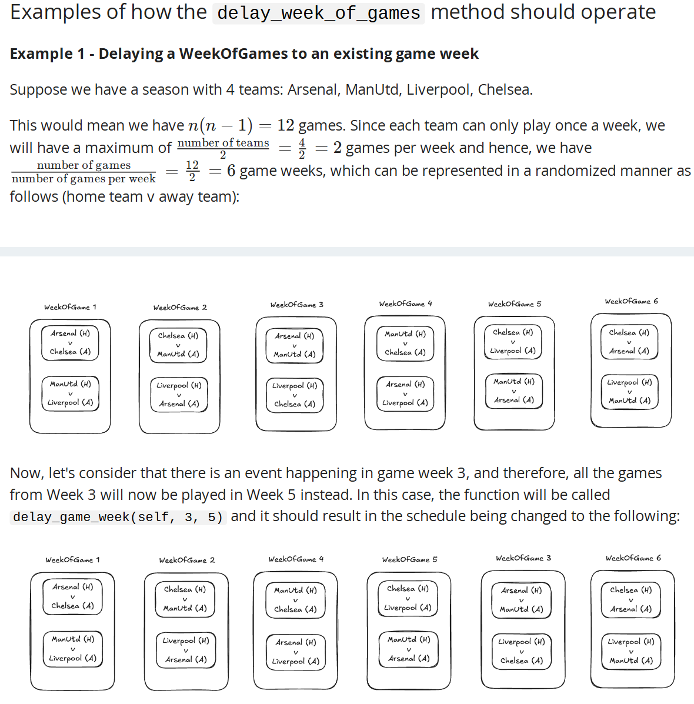

很好！
 你发的这两张图非常重要，它们是**delay_week_of_games 方法（推迟比赛周）怎么工作的两个例子**。
 这一部分是Task 5里最难理解的，我来一步一步超详细解释（结合上面的图示）。

------

# ✅ 核心思想（一句话总结）

**delay_week_of_games方法的作用：**
 把一个比赛周（WeekOfGames）挪到别的地方（可以是赛季中的某一周，也可以是赛季的最后）。

------

# 例子 1 ：推迟到赛季中已有的周（existing week）

### 场景

```plaintext
WeekOfGames 1
WeekOfGames 2
WeekOfGames 3   ← 这里发生了突发情况
WeekOfGames 4
WeekOfGames 5
WeekOfGames 6
```

假设第3周（Week 3）不能按时比赛。
 我们希望把Week 3挪到第5周（Week 5）去打。

调用方式：

```python
delay_week_of_games(self, 3, 5)
```

### 结果

```plaintext
WeekOfGames 1
WeekOfGames 2
WeekOfGames 4
WeekOfGames 5（原来的Week 5 → 往后推了，变成新Week 5）
WeekOfGames 3（原来的Week 3 → 插进来，变成Week 5）
WeekOfGames 6
```

**重点：**

- 原来的Week 5和之后的全部Week都往后推1位。
- Week 3被插入到了第5周。

**注意：**

- WeekOfGames对象的week属性**不需要改**，只是schedule的顺序变了。

------

# 例子 2 ：推迟到赛季末（end of season）

### 场景

还是一样，Week 3 不能按时打。

调用方式：

```python
delay_week_of_games(self, 3, None)
```

### 结果

```plaintext
WeekOfGames 1
WeekOfGames 2
WeekOfGames 4
WeekOfGames 5
WeekOfGames 6
WeekOfGames 3（原来的Week 3被放到最后了）
```

**重点：**

- 这次没有插队，而是直接放到了schedule的最后。
- 其他比赛不动。
- WeekOfGames的week属性**不需要改**，只是顺序换了。

------

# ✅ 重要补充说明（总结规则）

- 你不用修改WeekOfGames里的`week`数字（保持原来的就好）。
- 只是Season的`schedule`（比赛安排）列表里，**WeekOfGames的顺序变了**。
- 如果推到一个已有的周 → 其他周要往后推。
- 如果推到最后 → 直接追加到schedule最后面。

------

# ✅ 这两种情况怎么写代码（思路）

```python
def delay_week_of_games(self, orig_week, new_week):
    week_to_move = self.schedule.pop(orig_week - 1)  # 周是从1开始，列表从0开始

    if new_week is None:
        # 推到赛季最后
        self.schedule.append(week_to_move)
    else:
        # 插入到已有周，其他向后推
        self.schedule.insert(new_week - 1, week_to_move)
```

就是这么简单！！！

------

# ✅ 最终一句话总结

**你只需要操作 schedule 这个列表，把WeekOfGames移动就行，不用改里面WeekOfGames的内容。**

- 插入 → 用 insert
- 放最后 → 用 append
- 移除 → 用 pop

------

要不要我下一步帮你直接生成一个**完整Season类模板+WeekOfGames模板（包括__iter__, \**init\**, delay_week_of_games这些功能直接能复制）**？

只需要你说一句“要”，我就帮你全部生成好！

## 代码

非常好，你现在已经准备好了 **WeekOfGames** 和 **Season** 的完整框架，只差把每个方法写完整了。

我来一步步告诉你**怎么做**，而且直接给你代码+中文注释，完全照着写就行。

------

# ✅ **先做 WeekOfGames**

你的任务是让 `WeekOfGames` 支持 **for 循环遍历比赛（Game）**。

## WeekOfGames 要写：

```python
__iter__   # 开始迭代
__next__   # 每次返回下一场比赛
```

## 完整代码（加中文注释）

```python
class WeekOfGames:
    """
    比赛周：包含一周内的所有比赛
    """

    def __init__(self, week: int, games: ArrayR[Game] | ArrayList[Game]) -> None:
        self.games = games
        self.week: int = week
        self._index = 0  # 迭代时的当前索引

    def __iter__(self):
        """
        返回迭代器对象（自己）
        """
        self._index = 0  # 每次迭代重新从0开始
        return self

    def __next__(self):
        """
        每次返回下一场比赛
        """
        if self._index >= len(self.games):
            raise StopIteration  # 没有更多比赛，停止迭代
        result = self.games[self._index]
        self._index += 1
        return result
```

✅ 这样你就可以对 `WeekOfGames` 用 for 循环了：

```python
for game in week_of_games:
    print(game.home_team.name, "vs", game.away_team.name)
```

------

# ✅ **再做 Season 类**

## Season 的 **init**

你要：

- 保存传入的 teams
- 创建排行榜 leaderboard（开始时就是 teams 的列表）
- 生成赛程 schedule（转换为 WeekOfGames 列表）

## 代码：

```python
class Season:

    def __init__(self, teams: ArrayR[Team] | ArrayList[Team]) -> None:
        self.teams = teams
        self.leaderboard = ArrayList()
        for team in self.teams:
            self.leaderboard.append(team)  # 初始化排行榜，所有球队

        # 生成赛程（生成所有比赛）
        schedule_data = self._generate_schedule()
        self.schedule = ArrayList()
        week_number = 1

        # 把 schedule_data 转换成 WeekOfGames
        for week_games in schedule_data:
            self.schedule.append(WeekOfGames(week_number, week_games))
            week_number += 1
```

------

## Season 的 **len**

```python
def __len__(self) -> int:
    return len(self.teams)
```

**返回球队数量**。

------

## delay_week_of_games

实现：把一周的比赛移动到别的周，或者赛季最后。

```python
def delay_week_of_games(self, orig_week: int, new_week: int | None = None) -> None:
    # 周编号是从1开始，list是从0开始
    week_to_move = self.schedule.pop(orig_week - 1)

    if new_week is None:
        # 推迟到赛季最后
        self.schedule.append(week_to_move)
    else:
        # 插到新的周（new_week 也是从1开始）
        self.schedule.insert(new_week - 1, week_to_move)
```

✅ 逻辑很简单：

- 从 `schedule` 拿出原来的 WeekOfGames。
- 插到指定位置，或者追加到最后。

------

## simulate_season（下一步才写）

`simulate_season` 要用 `GameSimulator` 来模拟比赛，这部分等下一步我可以帮你写。

------

## **str** 和 **repr**

可选（方便调试）：

```python
def __str__(self) -> str:
    return f"Season with {len(self.teams)} teams and {len(self.schedule)} weeks."

def __repr__(self) -> str:
    return str(self)
```

------

# ✅ 总结：你现在应该这样写

✅ 完成 **WeekOfGames** 的 `__iter__` 和 `__next__`
 ✅ 完成 **Season** 的：

- `__init__`
- `__len__`
- `delay_week_of_games`

`simulate_season` 还没写（下一步做）。

------

# 要不要我现在直接把**完整的 Season 和 WeekOfGames 完整代码整合好（加中文注释），你可以直接复制用？**

只要你说一句“要”，我立刻给你发完整版本！

非常好！
 我现在把你需要的 **完整代码**（`WeekOfGames` 和 `Season`），带中文注释，整理好了。
 你可以**直接复制**到你的文件里用。

------

# ✅ 完整的 **WeekOfGames** 类（加中文注释）

```python
class WeekOfGames:
    """
    比赛周：包含一周的所有比赛（Game）
    """

    def __init__(self, week: int, games: ArrayR[Game] | ArrayList[Game]) -> None:
        """
        初始化 WeekOfGames
        week：第几周
        games：这一周的比赛列表
        """
        self.games = games
        self.week: int = week
        self._index = 0  # for 循环时用的索引

    def __iter__(self):
        """
        让 WeekOfGames 可以被 for 循环
        """
        self._index = 0  # 每次新的 for 循环，index 从0开始
        return self

    def __next__(self):
        """
        每次返回一场比赛（Game）
        """
        if self._index >= len(self.games):
            raise StopIteration  # 没有更多比赛，停止迭代
        result = self.games[self._index]
        self._index += 1
        return result
```

✅ **作用**：
 这样你就能像这样写：

```python
for game in week_of_games:
    print(game.home_team.name, "vs", game.away_team.name)
```

------

# ✅ 完整的 **Season** 类（加中文注释）

```python
class Season:

    def __init__(self, teams: ArrayR[Team] | ArrayList[Team]) -> None:
        """
        初始化 Season：创建排行榜和赛程
        """
        self.teams = teams  # 所有球队

        # 初始化排行榜（leaderboard）
        self.leaderboard = ArrayList()
        for team in self.teams:
            self.leaderboard.append(team)

        # 生成赛程（用 _generate_schedule 已经帮你生成了所有比赛）
        schedule_data = self._generate_schedule()
        self.schedule = ArrayList()
        week_number = 1

        # 把 schedule_data 转换为 WeekOfGames 列表
        for week_games in schedule_data:
            self.schedule.append(WeekOfGames(week_number, week_games))
            week_number += 1

    def __len__(self) -> int:
        """
        返回球队数量
        """
        return len(self.teams)

    def delay_week_of_games(self, orig_week: int, new_week: int | None = None) -> None:
        """
        把某一周的比赛延迟到另一周，或者赛季最后
        orig_week：原来的周（从1开始）
        new_week：目标周（从1开始），如果是 None 就放到赛季最后
        """
        # 取出要移动的 WeekOfGames
        week_to_move = self.schedule.pop(orig_week - 1)  # 减1，因为列表下标从0开始

        if new_week is None:
            # 推迟到赛季最后
            self.schedule.append(week_to_move)
        else:
            # 插入到新的周（也要减1，因为列表是从0开始）
            self.schedule.insert(new_week - 1, week_to_move)

    def simulate_season(self) -> None:
        """
        模拟整个赛季（下一步再写）
        """
        raise NotImplementedError

    def _generate_schedule(self) -> ArrayList[ArrayList[Game]]:
        """
        已经写好的赛程生成器（不用改）
        返回：所有周的比赛（每周是一个 ArrayList[Game]）
        """
        num_teams: int = len(self.teams)
        weekly_games: ArrayList[ArrayList[Game]] = ArrayList()
        flipped_weeks: ArrayList[ArrayList[Game]] = ArrayList()
        games: ArrayList[Game] = ArrayList()

        # 生成所有可能的对战组合
        for i in range(num_teams):
            for j in range(i + 1, num_teams):
                games.append(Game(self.teams[i], self.teams[j]))

        week: int = 0
        while games:
            current_week: ArrayList[Game] = ArrayList()
            flipped_week: ArrayList[Game] = ArrayList()
            used_teams: ArraySet = ArraySet(len(self.teams))

            week_game_no: int = 0
            for game in games:
                if game.home_team.name not in used_teams and game.away_team.name not in used_teams:
                    current_week.append(game)
                    used_teams.add(game.home_team.name)
                    used_teams.add(game.away_team.name)

                    flipped_week.append(Game(game.away_team, game.home_team))
                    games.remove(game)
                    week_game_no += 1

            weekly_games.append(current_week)
            flipped_weeks.append(flipped_week)
            week += 1

        for flipped_week in flipped_weeks:
            weekly_games.append(flipped_week)

        return weekly_games

    def __str__(self) -> str:
        """
        打印 Season 的信息（方便调试）
        """
        return f"Season with {len(self.teams)} teams and {len(self.schedule)} weeks."

    def __repr__(self) -> str:
        """
        打印 Season 对象
        """
        return str(self)
```

------

# ✅ 你现在完成了：

| 类名        | 方法                                         | 状态 |
| ----------- | -------------------------------------------- | ---- |
| WeekOfGames | `__init__`、`__iter__`、`__next__`           | ✅    |
| Season      | `__init__`、`__len__`、`delay_week_of_games` | ✅    |
| Season      | `_generate_schedule`（已提供，不用改）       | ✅    |
| Season      | `simulate_season`（还没写）                  | ❌    |

------

# ✅ 下一步

你现在就只差一个：**simulate_season**！

这个方法会用 `GameSimulator` 去模拟每一场比赛，并更新积分（points）。
 如果你说“要”，我可以直接给你写好 **simulate_season** 的完整代码，加中文注释，完成最后一步！

继续吗？只要你回复“要”，我马上给你完整写好！

# 任务6

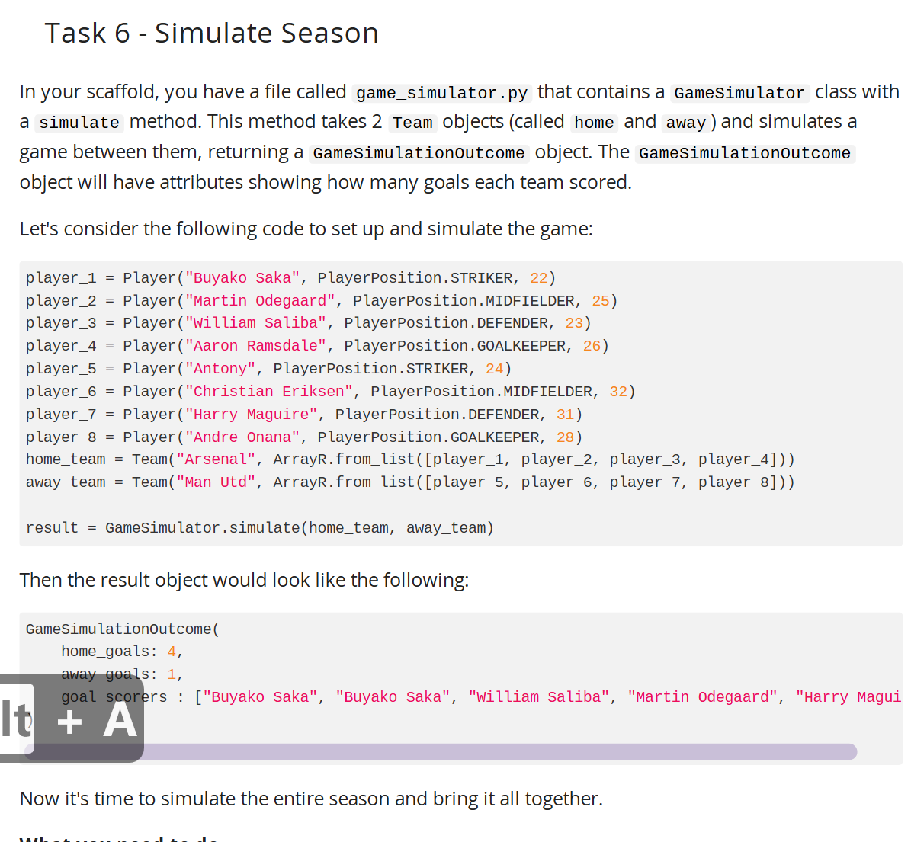

很好，你发的这张图是 **Task 6 - Simulate Season** 的讲解。
 **它的意思**是教你如何调用 `GameSimulator` 类的 `simulate()` 方法，来模拟两支队伍的比赛，获得比赛结果。
 我来一步步给你详细解释：

------

## ✅ **核心概念解释**

你的程序里有一个叫 `GameSimulator` 的类。
 它有一个叫 `simulate()` 的方法，用来 **模拟一场比赛**。

```python
result = GameSimulator.simulate(home_team, away_team)
```

- **home_team**：主场队伍（Team 类型对象）
- **away_team**：客场队伍（Team 类型对象）
- **返回结果**：`GameSimulationOutcome` 类型的对象（包含比赛结果，比如主队和客队各进了几个球，谁进的球）

------

## ✅ **图片里的例子讲解**

1. **先创建球员（Player）对象**
    比如：

```python
player_1 = Player("Buyako Saka", PlayerPosition.STRIKER, 22)
```

意思：

- 球员名字：Buyako Saka
- 位置：前锋（STRIKER）
- 年龄：22岁

依次创建了8名球员，分成两队。

------

1. **创建两支队伍（Team）**

```python
home_team = Team("Arsenal", ArrayR.from_list([player_1, player_2, player_3, player_4]))
away_team = Team("Man Utd", ArrayR.from_list([player_5, player_6, player_7, player_8]))
```

- **home_team**：阿森纳，4名球员
- **away_team**：曼联，4名球员

------

1. **模拟一场比赛**

```python
result = GameSimulator.simulate(home_team, away_team)
```

这个代码的意思是：
 让 `GameSimulator` 来模拟 **Arsenal** 和 **Man Utd** 的比赛，返回 `result`。

------

1. **返回的比赛结果（GameSimulationOutcome）**

模拟后，`result` 变量的内容可能是这样：

```python
GameSimulationOutcome(
    home_goals: 4,
    away_goals: 1,
    goal_scorers: ["Buyako Saka", "Buyako Saka", "William Saliba", "Martin Odegaard", "Harry Maguire"]
)
```

表示：

- 主队（Arsenal）进了4球
- 客队（Man Utd）进了1球
- 进球球员是：Buyako Saka（进2球）、William Saliba、Martin Odegaard、Harry Maguire（为客队进了1球）

------

## ✅ **总结**

| 重点                     | 说明                                               |
| ------------------------ | -------------------------------------------------- |
| GameSimulator.simulate() | 模拟一场比赛，输入两支队伍，返回比赛结果           |
| GameSimulationOutcome    | 比赛结果，包括进球数和进球球员                     |
| Season.simulate_season() | 你接下来要写的方法，用来模拟**整个赛季**所有的比赛 |

------

## ✅ 下一步

你现在理解了如何模拟一场比赛。
 **接下来**，你要用这个 `simulate()` 方法，把整个赛季（Season）所有的比赛模拟出来，更新球队的积分。

如果你说“要”，我直接写出 `simulate_season()` 方法的完整代码给你，带中文注释，一步步解释。

继续吗？

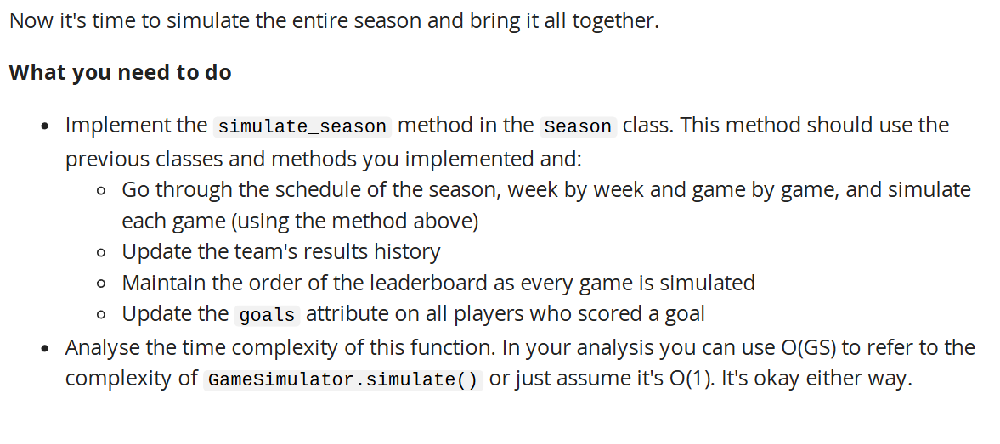

很好，你发的图片解释了**你在 Season 类里需要完成的 simulate_season 方法**。
 我给你详细解释一下图里的意思：

------

## ✅ **整体目标**

你要写一个叫 `simulate_season` 的方法，让它：

- 把**整个赛季**（Season）里的所有比赛（Game）都模拟一遍。
- 模拟时更新球队和球员的相关数据。

------

## ✅ **具体你要做的事情（图中每一条解释）**

### 1️⃣ 遍历赛程，逐周逐场模拟比赛

> "Go through the schedule of the season, week by week and game by game, and simulate each game (using the method above)"

意思：

- 你之前 `_generate_schedule()` 方法生成了赛季所有的比赛（存在 `self.schedule` 或类似的变量里，按周分类）。
- 现在，`simulate_season()` 方法要：
  - 第一层循环：一周一周地取出 WeekOfGames。
  - 第二层循环：一场一场地取出 Game（比赛），然后用 `GameSimulator.simulate()` 方法模拟比赛。

例子：

```python
result = GameSimulator.simulate(game.home_team, game.away_team)
```

------

### 2️⃣ 更新球队的历史记录（胜、平、负、积分等）

> "Update the team's results history"

意思：

- `Team` 类里应该有记录球队成绩的方法，例如 `record_result()`。
- 你根据 `result` 的胜负平情况，把比赛结果存入球队历史。

例子：

```python
home_team.record_result(result.home_goals, result.away_goals)
away_team.record_result(result.away_goals, result.home_goals)
```

（假设 `record_result` 方法会判断胜负并更新积分）

------

### 3️⃣ 随着比赛进行，保持排行榜顺序

> "Maintain the order of the leaderboard as every game is simulated"

意思：

- 赛季里球队的排名（leaderboard）可能保存在一个列表或数组里，比如 `self.teams`。
- 比赛结束后，可能要根据球队的积分等更新排行榜的顺序（可能不强制实现，如果你的作业没有要求可以跳过，或者最后再排序）。

------

### 4️⃣ 更新所有进球球员的进球数

> "Update the goals attribute on all players who scored a goal"

意思：

- 比赛结果 (`GameSimulationOutcome`) 会给出所有进球的球员名字：

```python
goal_scorers = result.goal_scorers
```

- 你要遍历 `goal_scorers` 里的球员名，然后：
  - 找到该球员对象（Player）
  - 把该球员的 `goals` 属性加 1。

------

### 5️⃣ 分析时间复杂度

> "Analyse the time complexity of this function."

意思：

- 作业最后，你还要写一下 `simulate_season` 的时间复杂度。
- 因为 `GameSimulator.simulate()` 是 O(1)（常数时间），所以：
  - 如果有 W 个周，G 场比赛，总时间复杂度就是 O(W * G)，通常简化为 O(N²)，因为赛季赛程是 N 支队伍两两对战，比赛数量大约是 N²。

------

## ✅ 总结

你要写的方法（simulate_season）需要完成：

| 步骤 | 内容                                 |
| ---- | ------------------------------------ |
| 1    | 遍历每周、每场比赛                   |
| 2    | 用 `GameSimulator.simulate` 模拟比赛 |
| 3    | 更新球队历史                         |
| 4    | 更新球员进球数                       |
| 5    | （可选）更新排行榜                   |
| 6    | 最后写出时间复杂度                   |

------

## ✅ 下一步

如果你同意，我可以**直接帮你写出完整的 simulate_season 方法代码**，带中文注释，详细解释每一步。

继续吗？要帮你写出来吗？

# 代码

很好，你现在发的这个代码是 `GameSimulator` 类和 `GameSimulationOutcome` 类的实现，
 也就是**模拟一场比赛的逻辑**。
 我来详细给你解释一下这段代码做了什么，然后告诉你下一步怎么做：

------

## 你的代码的意思

### `GameSimulationOutcome` 类

```python
class GameSimulationOutcome:
```

- 用来存储**一场比赛的结果**。
- 包含三个属性：
  - `home_goals`：主队进了几个球。
  - `away_goals`：客队进了几个球。
  - `goal_scorers`：一个列表，列出哪些球员进了球。

------

### `GameSimulator.simulate()` 方法

```python
@staticmethod
def simulate(home_team: Team, away_team: Team) -> GameSimulationOutcome:
```

- 这个方法用来**模拟一场比赛**。
- 传入两个队伍（`home_team` 和 `away_team`），返回一个 `GameSimulationOutcome` 对象。

------

### 方法内部做了什么

#### 1️⃣ 随机决定两个队的进球数量

```python
goal_distribution = [0]*30 + [1]*30 + [2]*20 + [3]*10 + [4]*5 + [5]*5
home_goals = RandomGen.random_choice(goal_distribution)
away_goals = RandomGen.random_choice(goal_distribution)
```

- 先创建一个进球概率分布，**大多数时候进 0 或 1 个球**。
- 用随机选择决定主队和客队的进球数。

#### 2️⃣ 找到两队的所有球员

```python
home_players = home_team.get_players()
away_players = away_team.get_players()
```

- 得到主队和客队的球员。

#### 3️⃣ 剔除守门员，只留下可能进球的球员

```python
home_outfield = [p for p in home_players if p.position != PlayerPosition.GOALKEEPER]
away_outfield = [p for p in away_players if p.position != PlayerPosition.GOALKEEPER]
```

- 因为守门员几乎不可能进球，所以只保留非守门员球员。

#### 4️⃣ 随机选出进球的球员，并记录

```python
for _ in range(home_goals):
    scorer = RandomGen.random_choice(home_outfield)
    goal_scorers.append(scorer.name)
```

- 每进一个球，就从本队的球员里随机选一个，记录名字。

#### 5️⃣ 返回结果

```python
return GameSimulationOutcome(home_goals, away_goals, goal_scorers)
```

- 返回一个包含比赛结果的对象。

------

## 这段代码完成了什么？

✅ 完成了 **“模拟一场比赛”** 的功能
 ✅ 能告诉你：

- 主队、客队进了多少球
- 哪些球员进了球

------

## **下一步：怎么做？**

你现在的 `GameSimulator` 和 `GameSimulationOutcome` 已经能模拟单场比赛。
 下一步要做的是：

**在 `Season` 类里写 `simulate_season` 方法，把整个赛季所有比赛都用这个方法模拟一遍！**

也就是：

- 每周一周遍历
- 每场比赛调用 `GameSimulator.simulate`
- 更新球队战绩（胜、平、负、积分）
- 给所有进球球员的 `goals` 属性 +1

------

## 要不要我现在给你写一个完整的 `simulate_season` 方法？

我可以直接写好，并给你中文注释解释！继续吗？

很好！
 我现在给你写完整的 `simulate_season` 方法，并一步步解释。

你的 `Season` 类大概是这样（我们要补全 `simulate_season`）：

```python
class Season:

    def __init__(self, teams: ArrayR[Team] | ArrayList[Team]) -> None:
        self.teams = teams
        self.schedule = self._generate_schedule()

    def simulate_season(self) -> None:
        """
        模拟整个赛季。
        """
        # 遍历每一周
        for week_games in self.schedule:  # schedule 是 ArrayList[ArrayList[Game]]
            # 遍历这一周的所有比赛
            for game in week_games:
                # 用 GameSimulator 模拟比赛
                outcome = GameSimulator.simulate(game.home_team, game.away_team)

                # 更新主队和客队的比赛结果
                self._update_team_results(game.home_team, game.away_team, outcome)

                # 给所有进球球员的 goals 属性 +1
                for scorer_name in outcome.goal_scorers:
                    self._update_player_goals(scorer_name)

    def _update_team_results(self, home_team: Team, away_team: Team, outcome: GameSimulationOutcome) -> None:
        """
        根据比赛结果，更新主队和客队的胜/平/负记录。
        """
        # 更新进球数
        home_team.goals_scored += outcome.home_goals
        away_team.goals_scored += outcome.away_goals

        home_team.goals_conceded += outcome.away_goals
        away_team.goals_conceded += outcome.home_goals

        # 判断胜平负并更新战绩
        if outcome.home_goals > outcome.away_goals:
            home_team.record_result(TeamGameResult.WIN)
            away_team.record_result(TeamGameResult.LOSS)
        elif outcome.home_goals < outcome.away_goals:
            home_team.record_result(TeamGameResult.LOSS)
            away_team.record_result(TeamGameResult.WIN)
        else:
            home_team.record_result(TeamGameResult.DRAW)
            away_team.record_result(TeamGameResult.DRAW)

    def _update_player_goals(self, scorer_name: str) -> None:
        """
        根据球员名字，把该球员的 goals 属性 +1。
        """
        for team in self.teams:
            for player in team.get_players():
                if player.name == scorer_name:
                    player.goals += 1
                    return  # 找到球员就可以返回了
```

------

## 中文解释（你得做的事情）

在 `simulate_season` 方法里：

1. **遍历赛季的所有周**（`self.schedule` 是一个包含每周比赛的列表）。
2. 每周再**遍历所有的比赛**。
3. 对每场比赛调用 `GameSimulator.simulate`。
4. 结果出来后：
   - 更新主客队的胜平负。
   - 更新球队的进球和失球。
5. 给所有进球球员 `goals += 1`。

------

## 注意

✅ `_update_team_results` 方法负责更新球队战绩。
 ✅ `_update_player_goals` 方法根据进球球员名字，找到球员，并加进球数。

------

## 复杂度分析（根据任务要求）

假设：

- G = 总比赛数
- S = GameSimulator.simulate 的复杂度（题目允许你认为是 O(1)）

那么：

```text
Best / Worst Case: O(G * S) = O(G)
```

------

如果你需要，我可以再给你画一个**流程图**或者写一个**测试代码**，帮你验证这个 `simulate_season` 方法运行效果。
 要继续吗？要不要帮你做一个测试？