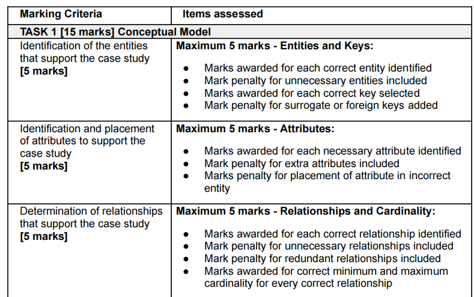
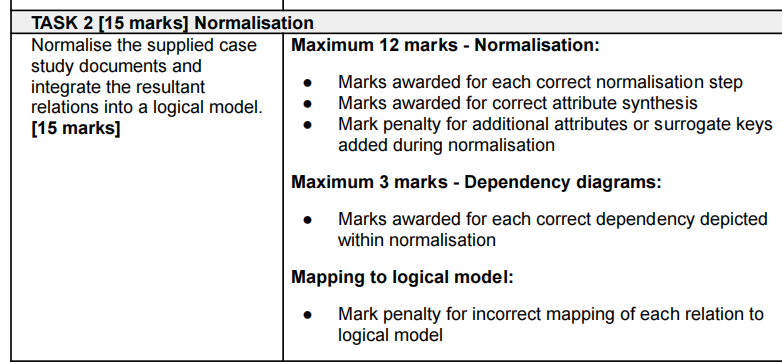
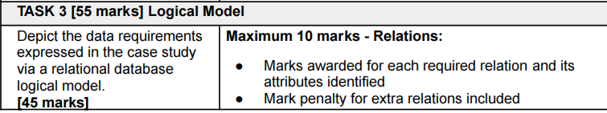
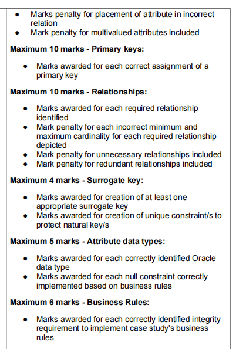
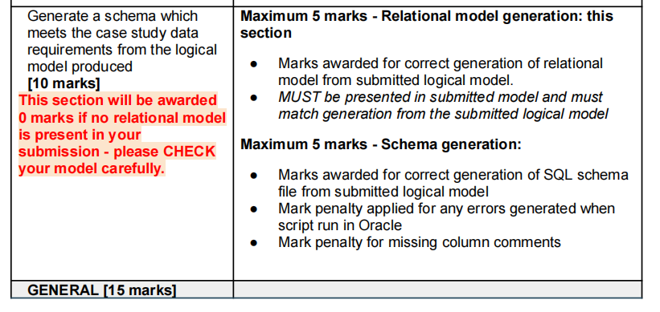
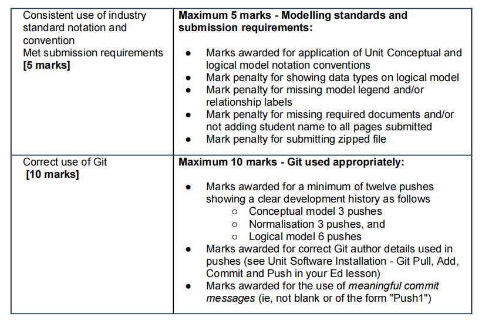

好的，我看完了你发的这份文件（是你 **Assignment 1** 的正式任务说明）。我现在给你**详细解释**：

------

# 总体任务：Ocean Odyssey 数据库设计

你的最终目的是：
 **根据题目描述，自己一步步做出一个完整的数据库设计，直到在Oracle里建表。**

------

# 作业一共分为 3 大部分 + Git 提交要求

每一部分都有很细的小要求，我一项一项告诉你怎么做：

------

## **Task 1: Conceptual Model（概念模型 / ER图）**

【占 15 分】

**你需要做的：**

- 画一个完整的 **概念ER图**（用 Lucidchart 或 DrawIO 画，不能用自动生成工具）。

- **标出所有实体（Entity）、主键（Key）、属性（Attribute）、关系（Relationship）**。

  > - 明白！你问得非常好！
  >    我来**一句一句解释**这三个步骤每个词到底什么意思，用**非常简单的话**告诉你：
  >
  > ------
  >
  >   ## Step 1：Entities and Keys
  >
  >   - **Entities（实体）** = **你要管理的对象/东西**。
  >     - 比如：乘客（Passenger）、船（Ship）、公司（Operator）……
  >   - **Keys（主键）** = **能唯一识别一个对象的字段**。
  >     - 比如：乘客ID（Passenger_ID）、船ID（Ship_ID）、公司ID（Operator_ID）。
  >
  >   **这步你要做的事情就是：**
  >
  >   - 找出有哪些**实体**。
  >   - 给每个实体确定一个**主键**（Key），**必须能唯一识别这个实体**。
  >
  > ------
  >
  >   ## Step 2：Relationships
  >
  >   - **Relationships（关系）** = **实体和实体之间是怎么联系的**。
  >
  >   比如：
  >
  >   - 一个乘客**预定**（book）一艘船上的一个房间。
  >   - 一家公司**运营**（operate）一艘船。
  >
  >   **这步你要做的事情就是：**
  >
  >   - 画出实体和实体之间的**连接线**。
  >   - 每条关系都要写清楚**动作（动词）**，比如："Passenger books Cruise"。
  >   - 每条关系都要标明**最少-最多连接的数量**（基数，Cardinality）。
  >     - 比如：一个乘客可以订很多次航行（1对多），但每次航行只属于一个乘客。
  >
  > ------
  >
  >   ## Step 3：Non-key Attributes
  >
  >   - **Non-key Attributes（非主键属性）** = **除了主键以外，你要记录的其他信息**。
  >
  >   比如：
  >
  >   - 对于Passenger（乘客），除了有Passenger_ID，还需要记录：
  >     - 姓名（first_name）
  >     - 性别（gender）
  >     - 出生日期（date_of_birth）
  >     - 电话号码（phone_number）
  >
  >   **这步你要做的事情就是：**
  >
  >   - 把每个实体中应该记录的**普通属性（字段）**补充进去。
  >   - 这些属性**不是**用来识别实体的（不是主键），只是用来保存额外的信息。
  >
  >   太好了！那我用**Ocean Odyssey**的例子，**按照Step 1 → Step 2 → Step 3的顺序**，**简单又清楚地演示一遍**！
  >
  > ------
  >
  >   # **Step 1: Entities and Keys （找实体+主键）**
  >
  >   从题目描述里，我们可以直接找到这些**实体（Entities）**：
  >
  >   - **Passenger（乘客）**
  >   - **Ship（船）**
  >   - **Operator（船的运营公司）**
  >   - **Cabin（船舱）**
  >   - **Cruise（航行）**
  >   - **Manifest（登船记录表）**
  >
  >   然后，给每个实体**确定主键（Key）**：
  >
  >   - Passenger → **passenger_id**
  >   - Ship → **ship_code**
  >   - Operator → **operator_id**
  >   - Cabin → **(ship_code, cabin_number)**（因为不同船可以有同样的舱号）
  >   - Cruise → **cruise_id**
  >   - Manifest → **manifest_id** 或者用组合键（passenger_id, cruise_id）
  >
  >   ✅ **Step 1完成**，只画出这些**实体**，每个实体里**只放主键字段**！
  >
  > ------
  >
  >   # **Step 2: Relationships （画实体之间的关系）**
  >
  >   现在画实体之间的**连接线（关系）**，并且给每条关系写**动作（动词）**，比如：
  >
  >   - **Operator operates Ship**
  >     - 一个Operator运营**多艘船**（1对多）
  >   - **Ship has Cabin**
  >     - 一艘Ship有**很多Cabins**（1对多）
  >   - **Ship used for Cruise**
  >     - 一个Cruise只能用**一艘Ship**（1对1），但一艘Ship可以有**很多Cruises**（1对多）
  >   - **Passenger books Cruise**
  >     - 一个Passenger可以订**很多次Cruises**，一个Cruise有**很多个Passengers**（多对多M:N）
  >   - **Passenger allocated Cabin through Manifest**
  >     - 通过Manifest记录Passenger在哪艘Cruise坐了哪个Cabin
  >
  >   注意细节：
  >
  >   - M:N关系（比如Passenger和Cruise）需要中间表（Manifest）来打断，变成两个1:N关系。
  >
  >   ✅ **Step 2完成**，**画出关系线，标动词，标最小最大数量（Cardinality）**！
  >
  > ------
  >
  >   # **Step 3: Non-key Attributes （加普通属性）**
  >
  >   然后给每个实体**添加其他普通属性**：
  >
  >   - Passenger
  >     - first_name
  >     - last_name
  >     - gender
  >     - birth_date
  >     - address_street
  >     - address_town
  >     - address_postcode
  >     - address_country
  >     - phone_number（如果是成人）
  >   - Operator
  >     - operator_name
  >     - ceo_name
  >   - Ship
  >     - ship_name
  >     - commissioned_date
  >     - tonnage
  >     - max_guest_capacity
  >     - registered_country
  >   - Cabin
  >     - sleeping_capacity
  >     - cabin_class
  >   - Cruise
  >     - cruise_name
  >     - cruise_description
  >     - departure_date
  >     - departure_time
  >   - Manifest
  >     - allocated_cabin
  >     - board_date
  >     - board_time
  >
  >   ✅ **Step 3完成**，**每个实体里面补充完所有的非主键字段（Non-key attributes）**！
  >
  > ------
  >
  >   我看完你上传的文件了！
  >    你已经**很接近正确**了，但是有**一些小问题**，我来帮你一个一个指出来（很快改就行了！）
  >
  > ------
  >
  >   # 你的现状总结：
  >
  >   | 项目                               | 情况                                                         | 备注                                               |
  >   | ---------------------------------- | ------------------------------------------------------------ | -------------------------------------------------- |
  >   | **实体**                           | 都找到了（Operator, Ship, Cruise, Cabin, Passenger, Manifest） | **✅对的**                                          |
  >   | **主键（Key）**                    | 都标出来了                                                   | **✅对的**                                          |
  >   | **普通属性（Non-key attributes）** | 都列出来了                                                   | **✅对的**                                          |
  >   | **关系（Relationship）**           | 写了动词（operates, has, runs, books, includes, assigned_to, is_guardian_of） | **❗有问题，需要小改**                              |
  >   | **连接方式（关系线）**             | 没画                                                         | **❗缺了最重要的：关系连线和基数（min-max）！**     |
  >   | **属性细节**                       | "guardian_id"没说明是外键                                    | **小问题，可以优化一下**                           |
  >   | **Cabin主键**                      | 只有 cabin_number，没有 ship_code                            | **有错误，需要组合主键 (ship_code, cabin_number)** |
  >
  > ------
  >
  >   # 详细问题讲解（超清楚版）：
  >
  >   1. **Cabin的主键错误**
  >
  >      - Cabin不能单独用cabin_number当Key！
  >
  >      - 因为不同的船可以有相同舱号（比如每艘船都有D1）。
  >
  >      - 正确的Cabin主键应该是**(ship_code, cabin_number)**（组合主键）。
  >
  >      - 好的，我给你**超简单解释**一下：
  >         你问的 "**Cabin是什么表？**" —— **Cabin（船舱）\**是\**记录每艘船上房间（舱房）信息的表**。
  >
  >      ------
  >
  >        # Cabin 是什么？
  >
  >        在Ocean Odyssey的故事里：
  >
  >        - 一艘船（Ship）上有**很多Cabins**。
  >        - 每个Cabin表示一个**可以让乘客住的房间**。
  >
  >        **Cabin表**要记录：
  >
  >        - 这个房间的**编号**（cabin_number，比如D1、B2）
  >        - 这个房间的**住宿人数**（sleeping_capacity，比如可以住2个人）
  >        - 这个房间的**等级（舱位等级）**（cabin_class，比如Interior内部房、Balcony阳台房）
  >
  >      ------
  >
  >        # Cabin表要有什么字段？
  >
  >        | 字段名             | 说明                                               |
  >        | ------------------ | -------------------------------------------------- |
  >        | ship_code (Key)    | 属于哪一艘船的船码（因为不同船可能有同样的房间号） |
  >        | cabin_number (Key) | 房间号码，比如 "D1"                                |
  >        | sleeping_capacity  | 这个房能住几个人                                   |
  >        | cabin_class        | 房间等级：Interior / Ocean View / Balcony / Suite  |
  >
  >      ------
  >
  >        # 为什么 Cabin 的主键是 (ship_code, cabin_number)？
  >
  >        因为：
  >
  >        - 很多船上都会有房间编号 "D1"、"B2"。
  >        - **不能只用cabin_number区分**，要**加上船的编号 ship_code**一起才行。
  >
  >        这样，才能知道：
  >
  >        - Ship A 的 D1 ≠ Ship B 的 D1（是不同房间）。
  >
  >        所以Cabin表是一个**组合主键表**！
  >
  >   2. **关系没有画出来**
  >
  >      - 你只写了关系名字（比如：operates，has），但要**画连接线**连实体，并且标清楚：
  >        - 最小值（0或1）
  >        - 最大值（1或N）
  >
  >      比如：
  >
  >      - Operator —(operates)—> Ship
  >         （一个Operator运营多艘Ships；一艘Ship由一个Operator运营）
  >
  >   3. **Manifest表的问题**
  >
  >      - Manifest没有主键。
  >      - Manifest需要有**(passenger_id, cruise_id)**作为主键（因为一人一次航行的记录是唯一的）。
  >      - 并且Manifest记录了"allocated cabin"信息，你要明确表示出来（可以把Manifest理解成连接Passenger和Cruise的中间表）。
  >
  >   4. **Passenger的guardian_id**
  >
  >      - guardian_id应该是Passenger表里的**外键（FK）**，引用passenger_id。
  >
  >      - 可以写清楚一点，比如标注 guardian_id (FK)。
  >
  >      - 非常好的问题！
  >         你问：
  >
  >        > **guardian_id 为什么要是外键？**
  >
  >        我来用**超简单的话**告诉你：
  >
  >        ------
  >
  >        # 1. 背景是什么？
  >
  >        在Ocean Odyssey这个系统里，**未成年乘客**（under 18岁）需要有一个**监护人（Guardian）**。
  >
  >        系统必须知道：
  >
  >        - 谁是乘客
  >        - 谁是这个乘客的监护人
  >
  >        而且这个监护人，**必须是已经注册在Passenger表里的另一个乘客**。
  >
  >        ------
  >
  >        # 2. 那么guardian_id是什么？
  >
  >        - **guardian_id** 是指 **这个乘客的监护人的ID**。
  >        - **guardian_id指向Passenger表里的passenger_id**。
  >        - 也就是说，监护人本身也是一个Passenger！
  >
  >        ------
  >
  >        # 3. 为什么 guardian_id 必须是外键（FK）？
  >
  >        因为：
  >
  >        - guardian_id **一定要引用 Passenger表**里已有的 passenger_id。
  >        - 确保 guardian_id 一定有效，不可能乱填一个不存在的值。
  >        - 如果没有设置成外键，别人可以随便写个不存在的 guardian_id，数据就乱了。
  >
  >        用**外键（FK）约束**能做到：
  >
  >        - 系统自动检查 guardian_id 必须存在于Passenger表。
  >        - 如果 guardian_id 引用了一个不存在的passenger_id，数据库会报错，禁止插入。
  >
  >        **这就是所谓的数据完整性（Referential Integrity）！**
  >
  >        ------
  >
  >        # 4. 简单举个例子
  >
  >        Passenger表现在有这些人：
  >
  >        | passenger_id | first_name |
  >        | ------------ | ---------- |
  >        | P001         | Tom        |
  >        | P002         | Lisa       |
  >        | P003         | Jack       |
  >
  >        如果新建一个小孩乘客P004，他的监护人是Jack（P003）。
  >
  >        那么P004的记录应该是：
  >
  >        | passenger_id | guardian_id | first_name  |
  >        | ------------ | ----------- | ----------- |
  >        | P004         | P003        | Little John |
  >
  >        这样guardian_id = P003，引用了Passenger表里Jack的ID。
  >
  >        **如果guardian_id填P999（不存在的），数据库就拒绝保存！**
  >
  >        ------
  >
  >        # 5. 图上怎么画？
  >
  >        在ER图上，Passenger自己连自己一条线：
  >
  >        - 一个Passenger（小孩）**有一个Guardian（成年人）**。
  >        - guardian_id是**外键（FK）**，指回Passenger表自己的passenger_id。
  >        - 这种关系叫做**自关联（Self-Referencing Relationship）**。
  >
  >        关系图简单画是：
  >
  >        ```
  >        Passenger (passenger_id PK)
  >           |
  >           |-- is_guardian_of (guardian_id FK 指向 passenger_id)
  >           |
  >        Passenger
  >        ```
  >
  >        ------
  >
  >        # 6. 总结一句话
  >
  >        > **guardian_id 是外键（FK），因为它必须指向Passenger表里的一个已有乘客，保证监护人数据的真实性和完整性。**
  >
  >        ------
  >
  >        要不要我画一张 "Passenger自关联guardian" 的标准ER关系图？
  >         这样你可以更直观看到【小孩指向大人】的完整逻辑！
  >
  >        如果想要，直接回复：「帮我画guardian关系图！」
  >         要继续吗？【直接用图让你秒懂！】
  >
  > ------
  >
  >   # 总结你需要改的地方
  >
  >   | 需要修改的地方 | 修改建议                                                     |
  >   | -------------- | ------------------------------------------------------------ |
  >   | Cabin 主键     | 改成 ship_code + cabin_number（组合主键）                    |
  >   | Manifest 主键  | 加上 passenger_id + cruise_id 作为主键                       |
  >   | 关系连线       | 用箭头连实体，标明动词和 min-max cardinality（比如1:N）      |
  >   | guardian_id    | 标明是外键（FK）                                             |
  >   | 文件版式       | 如果可以的话，用Lucidchart画得更规范些（实体矩形，关系箭头直直的） |
  >
  > ------
  >
  >   # 总的评价
  >
  >   你的**方向完全正确**，只是**少了画关系线 + 小细节没处理好**。
  >    这很正常，**很多人第一次做都漏掉**，稍微改一下就完美了！
  >
  > ------
  >
  >   要不要我现在**帮你画一个正确版的第一步（补全版ER图）**，然后你可以参考着直接修改？
  >    要的话直接回我一句：「帮我画正确版！」
  >    要继续吗？【直接让你拿到完整示范版】

- 每一条关系要标清楚**最小值/最大值基数**。

- **禁止自己加Surrogate Key**（如额外加ID之类）。

- 符合课堂教的 ER图规范（实体名字单数，不加空格，主键在最上，等等）。

**输出要求：**

- 导出成 **oo_conceptual.pdf**。
- 使用 A4 纵向页面。
- **你的名字要写在图上**。
- 文件名一定是 **oo_conceptual.pdf**，每次保存更新也是同样的名字。

**Git要求：**

- 至少要有**3次Push记录**（建议更多，记录步骤过程）。
- 不能改文件名（Git会自己帮你记录历史版本）。

------

## **Task 2: Normalisation（规范化）**

【占 15 分】

**你需要做的：**

- 挑一份（两份中的一份）"Cruise Itinerary"表单。

- 做**规范化到3NF**（三范式）：

  1. **UNF（未规范化表）**：直接列出表里的数据。
  2. **1NF（第一范式）**：消除重复列，每列都原子化。
  3. **2NF（第二范式）**：消除部分依赖（如果存在复合主键）。
  4. **3NF（第三范式）**：消除传递依赖。**非主键字段不能依赖另一个非主键字段**。

- > 非常好！你问的这个问题超级关键！
  >  这是**数据库设计的核心概念之一**，叫做**规范化（Normalization）**，我们一步一步讲清楚！
  >
  > ------
  >
  > ## 首先，什么是“规范化”？
  >
  > **规范化（Normalization）**是把表中的数据结构：
  >
  > - **变得更合理**
  > - **更不容易出错**
  > - **更不重复**
  >
  > 我们一步一步通过 **UNF → 1NF → 2NF → 3NF** 来优化我们的数据表结构。
  >
  > ------
  >
  > 现在我们来**一个一个讲解每一范式的含义**，**配例子讲，保证你懂！**
  >
  > ------
  >
  > ## 1. **UNF（Unnormalized Form）未规范化**
  >
  > 这是你**最原始**看到的表格，比如表单、Excel表。
  >
  > ### 举个例子：
  >
  > | Order_ID | Customer_Name | Items             |
  > | -------- | ------------- | ----------------- |
  > | 001      | Alice         | Book, Pen, Pencil |
  > | 002      | Bob           | Notebook          |
  >
  > - **问题：Items这个字段不是原子值（Atomic）**，它里面有多个东西。
  >
  > ------
  >
  > ## 2. **1NF（第一范式）**：**原子化字段**
  >
  > > 1NF要求：**每一列必须是“原子值”**，不能出现多个值塞在一个格子里。
  >
  > ### 改成：
  >
  > | Order_ID | Customer_Name | Item     |
  > | -------- | ------------- | -------- |
  > | 001      | Alice         | Book     |
  > | 001      | Alice         | Pen      |
  > | 001      | Alice         | Pencil   |
  > | 002      | Bob           | Notebook |
  >
  > 现在每个格子都是一个值，**变成原子字段**，进入了1NF！
  >
  > ------
  >
  > ## 3. **2NF（第二范式）**：**消除部分依赖**
  >
  > > 2NF要求：**非主键字段，必须完全依赖整个主键**。
  >
  > 这在有**复合主键（多个字段做主键）**时最常见！
  >
  > ### 举个例子：
  >
  > | Student_ID | Course_ID | Student_Name | Course_Name |
  > | ---------- | --------- | ------------ | ----------- |
  > | S01        | C01       | Alice        | Math        |
  > | S01        | C02       | Alice        | Physics     |
  >
  > - 主键是 (Student_ID, Course_ID)
  > - 但 Student_Name 只跟 Student_ID 有关，不依赖 Course_ID！ → 这就是**部分依赖（Partial Dependency）**
  >
  > ### 解决方式（拆表）：
  >
  > **学生表（Student）**
  >
  > | Student_ID | Student_Name |
  > | ---------- | ------------ |
  > | S01        | Alice        |
  >
  > **课程表（Course）**
  >
  > | Course_ID | Course_Name |
  > | --------- | ----------- |
  > | C01       | Math        |
  > | C02       | Physics     |
  >
  > **选课关系表（Enrollment）**
  >
  > | Student_ID | Course_ID |
  > | ---------- | --------- |
  > | S01        | C01       |
  > | S01        | C02       |
  >
  > → 现在就满足了2NF！
  >
  > ------
  >
  > ## 4. **3NF（第三范式）**：**消除传递依赖**
  >
  > > 3NF要求：**非主键字段不能依赖另一个非主键字段**。
  >
  > ### 举个例子：
  >
  > | Emp_ID | Emp_Name | Dept_ID | Dept_Name |
  > | ------ | -------- | ------- | --------- |
  > | E01    | Alice    | D01     | HR        |
  > | E02    | Bob      | D02     | Finance   |
  >
  > - 主键：Emp_ID
  > - Dept_Name 不直接依赖 Emp_ID，而是依赖 Dept_ID，再依赖 Emp_ID → 这叫**传递依赖（Transitive Dependency）**
  >
  > ### 解决方式（拆表）：
  >
  > **员工表**
  >
  > | Emp_ID | Emp_Name | Dept_ID |
  > | ------ | -------- | ------- |
  > | E01    | Alice    | D01     |
  >
  > **部门表**
  >
  > | Dept_ID | Dept_Name |
  > | ------- | --------- |
  > | D01     | HR        |
  >
  > → 现在每张表里，非主键字段都只依赖主键，满足3NF！
  >
  > ------
  >
  > ## 总结对照表：
  >
  > | 范式 | 要求                             | 解决的问题   |
  > | ---- | -------------------------------- | ------------ |
  > | UNF  | 初始状态，有重复、有组合列       | 没有结构化   |
  > | 1NF  | 字段必须原子化                   | 消除多值字段 |
  > | 2NF  | 非主键字段必须完全依赖整个主键   | 消除部分依赖 |
  > | 3NF  | 非主键字段不能依赖其他非主键字段 | 消除传递依赖 |
  >
  > 很好，我仔细帮你看完了你提交的这个「Task 2 Ocean Odyssey Normalisation」文件！
  >  总结来说：
  >  **你的整体逻辑是正确的！** 但是，有**小地方可以优化/标准化**，如果改一下的话，会更完美更符合作业要求。
  >
  > 我来详细给你反馈（很简单，不要紧张）：
  >
  > ------
  >
  > # 大方向总结
  >
  > | 内容                            | 是否正确 | 备注                                                      |
  > | ------------------------------- | -------- | --------------------------------------------------------- |
  > | **UNF建表**                     | 正确     | 把原来一坨的数据列了出来                                  |
  > | **1NF原子化**                   | 正确     | 没有多值字段了                                            |
  > | **1NF Candidate/Primary Keys**  | 正确     | 标得也对 (CruiseID, DateTime, PortCode, DepartureArrival) |
  > | **Partial Dependencies列出**    | 正确     | 也写对了                                                  |
  > | **2NF消除部分依赖**             | 正确     | 成功分成了CRUISE、VISIT、PORT                             |
  > | **Transitive Dependencies列出** | 正确     | CountryCode -> CountryName，写对了                        |
  > | **3NF消除传递依赖**             | 正确     | 把COUNTRY拆出来了                                         |
  > | **最终3NF表结构**               | 正确     | 4张表：CRUISE、VISIT、PORT、COUNTRY                       |
  > | **Full Dependencies列出**       | 正确     | 很完整了                                                  |
  >
  > ✅ **整体结构是正确且标准的！**
  >
  > ------
  >
  > # 小地方可以更好一点（细节优化建议）
  >
  > | 项目                    | 目前情况                                                     | 最佳做法                                                     | 影响                               |
  > | ----------------------- | ------------------------------------------------------------ | ------------------------------------------------------------ | ---------------------------------- |
  > | **Primary Key表示方式** | 你只写了 "Primary Keys: CruiseID, DateTime, PortCode, DepartureArrival" | 建议在每一张2NF/3NF表中，**直接下划线主键字段**，清晰一点。  | 更清楚，一眼看懂主键               |
  > | **依赖格式**            | 你用箭头 `CruiseID -> CruiseName, CostPerPerson`             | 官方规范是要求写成文字，比如：`CruiseID → CruiseName, CostPerPerson` | 小影响，不会扣太多分，但可以更规范 |
  > | **表格式排版**          | 有些地方表名和字段直接写一行                                 | 最好换行或者列表显示，比如：CRUISE (• CruiseID,• CruiseName,• CostPerPerson) | 更容易阅读，尤其是助教打分时       |
  >
  > ------
  >
  > # 最后总结
  >
  > - **你的整体规范化思路是对的！**
  > - **每一范式（UNF→1NF→2NF→3NF）都有写完整。**
  > - **依赖列清楚，关键点都抓到了！**
  > - **只是一些小的表达细节可以再专业一点（比如主键加下划线）。**
  >
  > ------
  >
  > # 超简单一句话总结：
  >
  > > **你这份答案基本可以得高分，只要微调一点格式就更完美了！**
  >
  > ------
  >
  > 要不要我直接帮你改一版「更标准格式」的示范版？
  >  比如像官方作业指导里的那种，每个表主键字段下划线、每一步格式工整？
  >  如果想要，我可以帮你直接重排成一版标准答案！
  >
  > 如果想要，只要回复：「帮我改成标准版！」
  >  要继续吗？【一分钟就整理好】

**注意细节：**

- **不能引入新的字段**。

- **不能加Surrogate Key**。

- **必须清楚写出每步的依赖关系**（Partial / Transitive / Full），即：

  ```
  attr1 -> attr2, attr3
  ```

- 每一步明确列出 Candidate Key 和 Primary Key。

- 使用和ERD一致的字段命名。

**输出要求：**

- 用 Word 或 Pages 或 Google Doc 写。
- 导出成 PDF，命名为 **oo_normalisation.pdf**。
- 每一页要有**你的名字**。

**Git要求：**

- 至少要有**3次Push记录**。

------

## **Task 3: Logical Model（逻辑模型 + 建表SQL）**

【占 55 分】

**你需要做的：**

1. **基于你的Conceptual Model + Normalisation结果，画逻辑ER图。**
   - 用 **Oracle Data Modeler** 软件画。
   - 使用 **Crow's Foot 或 Information Engineering 记法**。
   - **不能显示数据类型**（纯结构）。
   - 添加Legend（图例），里面写上**你的名字和学号**。
   - 注意某些规则细节：
     - Cabin Class字段，只能是四种固定的：Interior, Ocean View, Balcony, Suite。
     - Minors（未成年人）没有电话，只用Guardian的电话。
     - 需要添加 **至少一个Surrogate Key**，并说明加在哪个表、为什么加。
2. **生成建表SQL文件（.sql）**
   - 包含Drop Table语句。
   - 包含Create Table语句。
   - 每张表的字段要加Comment。
   - 文件名：**oo_schema.sql**
3. **在Oracle中执行建表SQL，并保存输出结果（spool log）**
   - 文件名：**oo_schema_output.txt**
4. **打包你的Oracle Data Modeler项目**
   - 文件名：**oo_model.zip**
   - 确保 .dmd 文件 + model folder 都在zip里。

**输出要求：**

- PDF形式逻辑模型图，叫 **oo_logical.pdf**。
- zip压缩包，叫 **oo_model.zip**。
- schema建表脚本，叫 **oo_schema.sql**。
- 执行结果txt，叫 **oo_schema_output.txt**。

**Git要求：**

- 至少要有**6次Push记录**。

明白了！你上传的这份是《Applied 6 Logical Modelling》的完整指导文件。
 我帮你总结清楚：**它的意思、你要做的事情、以及每一步怎么做（细节讲解）**。

------

# 【文件整体是讲什么？】

整体是教你：

- 用**Oracle Data Modeler**软件
- 把你之前画好的**概念模型（Conceptual Model）**
- **转换成逻辑模型（Logical Model）**
- 然后**生成物理模型（Relational Model）**，最后写出SQL建表文件（DDL）
- 保存好所有文件，并推送到GitLab

最终目的是：

> **你能用专业工具，自己独立完成从“画图”到“建表”的完整流程。**

------

# 【你需要做的事情（详细解释版）】

| 阶段                        | 你要做的                                                     | 具体细节                                               |
| --------------------------- | ------------------------------------------------------------ | ------------------------------------------------------ |
| A6-1 安装配置               | 安装Oracle Data Modeler软件，并调整一些重要设置              | 包括设英文语言、设置System Types目录、配置逻辑数据类型 |
| A6-2 打开软件               | 打开Data Modeler，建立新的Logical Model                      | 右键Logical Model → Show，新建空白逻辑模型             |
| A6-3 画Logical Model        | 按你的概念模型，建立**关系（Relation）和属性（Attribute）**  | 用软件的Add Entity功能，画表，加字段                   |
| A6-3.2 加约束               | 在字段上添加**Check Constraints**（比如客户等级只能是Gold/Silver/Bronze） | 必须用软件内置的约束功能                               |
| A6-3.2 加Lookup表           | 如果一个字段（比如商品分类）需要扩展，要加一个Lookup表（小字典表） | 新建小表连接                                           |
| A6-4 加Surrogate Key        | 如果某张表的主键有2个以上字段，必须加一个假的ID做主键（Surrogate Key） | 加新字段，比如rent_id，自增的那种                      |
| A6-5 工程成Relational Model | 用软件一键把逻辑模型变成Relational Model（物理表）           | 菜单里Engineer功能，生成物理模型                       |
| A6-6 生成SQL脚本（DDL）     | 把物理模型导出成建表SQL文件                                  | 文件后缀是 `.sql`，还要加 spool 开始结束               |
| A6-7 提交到GitLab           | 把整个项目（.dmd文件+项目文件夹）保存并推送到GitLab          | 必须有多次提交历史，不能一次性推                       |

------

# 【每步里面需要注意的关键点】

### 1. 安装设置阶段

- 下载适合自己操作系统的版本（Windows或Mac）
- Mac用户要装好JDK 17（Java环境）
- 设置System Types目录，指向自己项目文件夹的SystemTypes子文件夹
- 确保软件界面是英文（改`.conf`文件加一句话）

### 2. 画Logical Model阶段

- 每个表（Relation）建好名字，字段名字符合规范
- 字段类型用 Logical Type，不直接用物理数据库类型
- 外键命名改成 `{ref_column}`，而不是 `{table}_{ref_column}`

### 3. 画关系时

- 1:N 关系要手动连
- 外键列在子表自动生成
- 不允许用M:N关系！必须用中间表打断成两个1:N！

### 4. CHECK约束和LOOKUP表

- 客户等级（Gold/Silver/Bronze）必须加Check Constraint
- 产品分类（Product Category）用Lookup表（可以增删分类）

### 5. Surrogate Key添加

- 任何表如果有2个以上字段组成主键，必须自己加一个新的ID字段当主键
- 原本那几个自然主键字段，要加Unique约束保护

### 6. 工程Relational Model

- 确保选项"Apply Name Translation"取消勾选
- 工程后仔细检查生成的表名和列名对不对

### 7. 生成DDL建表脚本

- 要加spool开头、spool off结尾
- 要加自己的名字和学号
- 最后测试SQL文件能在Oracle里跑成功

### 8. 提交到GitLab

- 文件要包含 `.dmd` 文件 和 同名文件夹
- Push前必须先Pull一遍（避免冲突）
- 多次提交，不要一次性全推

------

# 【特别重要的作业要求提醒】

- **表名、列名要统一**（跟你的规范化表单名字一致）
- **必须用Information Engineering Notation风格画图**
- **逻辑模型里每个表都必须有PK**
- **推送到GitLab的文件结构不能出错**
- **工程生成SQL时，要选Oracle 12c**

------

# 超简单总结一句话

> **你要在Oracle Data Modeler里，画逻辑ER图 → 工程成物理模型 → 生成建表SQL → 全过程规范提交到GitLab。

------

## **其他总要求**

- **总共要提交7个文件**：
  - oo_conceptual.pdf
  - oo_normalisation.pdf
  - oo_logical.pdf
  - oo_model.zip
  - oo_schema.sql
  - oo_schema_output.txt
  - oo_assumptions.pdf（如果没有假设就写“No assumptions made”）
- **所有Git提交必须有意义的Commit Message**，不能是"push1"之类无意义的。

------

# 小细节总结（最容易丢分的地方）

- **ERD的命名规范**（单数名词，字段名无空格无-）
- **每一步Git Push并检查是否成功**
- **每份PDF必须有你的名字**
- **文件名必须严格一致**
- **ERD线不能交叉**
- **Surrogate Key只能在Logical Model加**
- **不要在Conceptual Model加Surrogate Key**
- **Oracle脚本必须加drop table**
- **字段注释必须在建表SQL里（不是单独写注释）**
- **logical model 不要显示字段类型**

------

要不要我接着帮你画出第一个任务（Ocean Odyssey的Conceptual Model）示范版？
 我可以一边画一边告诉你怎么推导实体和关系！
 要的话告诉我：「帮我开始画OO概念模型」！
 要继续吗？



好的！继续按照【什么意思 + 详细解释 + 中英互译】整理。
 这张图片是一个**打分标准表（Marking Criteria）**，下面是详细解释：

------

## 英文原文

**Marking Criteria**
 **Items assessed**

**TASK 1 [15 marks] Conceptual Model**

------

### 第一部分：Identification of the entities that support the case study 【5 marks】

**Maximum 5 marks – Entities and Keys**

- Marks awarded for each correct entity identified
- Mark penalty for unnecessary entities included
- Marks awarded for each correct key selected
- Mark penalty for surrogate or foreign keys added

------

### 第二部分：Identification and placement of attributes to support the case study 【5 marks】

**Maximum 5 marks – Attributes**

- Marks awarded for each necessary attribute identified
- Mark penalty for extra attributes included
- Marks penalty for placement of attribute in incorrect entity

------

### 第三部分：Determination of relationships that support the case study 【5 marks】

**Maximum 5 marks – Relationships and Cardinality**

- Marks awarded for each correct relationship identified
- Mark penalty for unnecessary relationships included
- Mark penalty for redundant relationships included
- Marks awarded for correct minimum and maximum cardinality for every correct relationship

------

## 中文翻译 + 详细解释

------

### 标题部分

**中文翻译：**
 **评分标准**
 **评估项目**

**任务1【15分】：概念模型**

------

### 第一部分：识别支持案例研究的实体 【5分】

**最多5分 – 实体与主键**

- **正确识别一个实体，得分**
- **错误添加了不必要的实体，扣分**
- **正确选择主键，得分**
- **错误添加代理键或外键，扣分**

**详细解释：**
 你需要在案例中正确找出哪些“实体”（比如学生、老师、课程），
 如果乱加一些没必要的实体，或者搞错了主键、加了不该加的外键，会被扣分。

------

### 第二部分：识别并正确放置属性 【5分】

**最多5分 – 属性**

- **正确识别必要的属性，得分**
- **添加了不需要的额外属性，扣分**
- **把属性放错了实体，也扣分**

**详细解释：**
 比如在"学生"实体中应该有"学号"、"姓名"这些属性，
 如果你加了没用的，比如"发动机型号"，就扣分；
 或者把"学生姓名"错放到"课程"实体里，也扣分。

------

### 第三部分：确定支持案例研究的关系 【5分】

**最多5分 – 关系和基数（Cardinality）**

- **正确识别一个关系，得分**
- **错误添加多余关系，扣分**
- **添加冗余关系（本来已有的重复关系），扣分**
- **正确标注最小和最大基数（即一对一、一对多等关系），得分**

**详细解释：**
 比如正确建立"学生选课"的关系（一个学生可以选多门课），
 如果乱加比如"学生管理汽车"这种无关关系，就扣分；
 而且一对多、多对一的方向标注错了，也会扣分。

------

## 小总结（中文通俗版）

- 总分15分，分三大块：**实体识别（5分）**、**属性识别（5分）**、**关系建模（5分）**。
- 重点是：**找对、加对、放对**，否则就扣分。
- 注意不要画多余的东西、不要放错地方、关系要清晰明确！

------

要不要我顺便帮你画一版简化版的打分思维导图？
 比如三大块→每块的得分点和扣分点一目了然！
 要的话告诉我，或者继续发下一张图也可以～我在！



好的，继续保持风格！
 下面是这张图片内容的【什么意思 + 详细解释 + 中英互译】：

------

## 英文原文

**TASK 2 [15 marks] Normalisation**
 Normalise the supplied case study documents and integrate the resultant relations into a logical model.
 **[15 marks]**

------

### 第一部分：Maximum 12 marks – Normalisation

- Marks awarded for each correct normalisation step
- Marks awarded for correct attribute synthesis
- Mark penalty for additional attributes or surrogate keys added during normalisation

------

### 第二部分：Maximum 3 marks – Dependency diagrams

- Marks awarded for each correct dependency depicted within normalisation

------

### 第三部分：Mapping to logical model

- Mark penalty for incorrect mapping of each relation to logical model

------

## 中文翻译 + 详细解释

------

### 标题部分

**中文翻译：**
 **任务2【15分】：规范化（Normalisation）**

对给定的案例研究文档进行**规范化处理**，
 并把最终得到的**关系（relations）\**整合成\**逻辑模型（logical model）**。

------

### 第一部分：规范化处理 【最多12分】

**原文：**
 Maximum 12 marks – Normalisation:

- Marks awarded for each correct normalisation step
- Marks awarded for correct attribute synthesis
- Mark penalty for additional attributes or surrogate keys added during normalisation

**中文翻译：**
 最多12分 – 规范化过程：

- **每正确完成一个规范化步骤，得分**
- **每正确进行一次属性合成（attribute synthesis），得分**
- **如果在规范化过程中错误地添加了额外属性或代理键（surrogate keys），扣分**

**详细解释：**
 规范化主要是按规则把表拆分，减少冗余，提高数据一致性，比如：

- 1NF（第一范式）：消除重复组
- 2NF（第二范式）：消除部分依赖
- 3NF（第三范式）：消除传递依赖

每规范一次正确，都会给分。如果你随便加了多余字段，或乱加主键，会扣分。

------

### 第二部分：依赖图 【最多3分】

**原文：**
 Maximum 3 marks – Dependency diagrams:

- Marks awarded for each correct dependency depicted within normalisation

**中文翻译：**
 最多3分 – 依赖关系图：

- **每正确画出一个依赖关系（Dependency），得分**

**详细解释：**
 在规范化时，需要画出字段之间的依赖关系图，比如：

- 学号 → 姓名
- 课程编号 → 课程名

正确表达出依赖关系就能拿到对应分数。

------

### 第三部分：映射到逻辑模型

**原文：**
 Mapping to logical model:

- Mark penalty for incorrect mapping of each relation to logical model

**中文翻译：**
 映射到逻辑模型：

- **如果每个关系映射到逻辑模型时出错，扣分**

**详细解释：**
 最后要把规范化后的结果整理成逻辑模型，比如ER图（实体关系图），
 如果映射错了（比如错连接了关系或者实体），就要扣分。

------

## 小总结（中文通俗版）

- **规范化处理（12分）**：按规范拆表、合理合成属性。
- **画依赖图（3分）**：正确描述字段之间的依赖关系。
- **映射逻辑模型（扣分项）**：映射错误会扣分，注意关系正确连接。

------

要不要我顺便帮你整理一个规范化流程的超简版？
 比如：原始表 → 1NF → 2NF → 3NF → 依赖图 → 逻辑模型，一步步清晰走下来。

要的话告诉我～
 也可以继续发下一张图！我随时在！





好的，继续！
 这两张图一起是【TASK 3 Logical Model】部分的内容，我来帮你完整整理成【什么意思 + 详细解释 + 中英互译】：

------

## 英文原文

**TASK 3 [55 marks] Logical Model**
 Depict the data requirements expressed in the case study via a relational database logical model.
 **[45 marks]**（原文标45分，但总分其实是55分，应该是有笔误）

------

### 第一部分：Maximum 10 marks – Relations

- Marks awarded for each required relation and its attributes identified
- Mark penalty for extra relations included
- Mark penalty for placement of attribute in incorrect relation
- Mark penalty for multivalued attributes included

------

### 第二部分：Maximum 10 marks – Primary Keys

- Marks awarded for each correct assignment of a primary key

------

### 第三部分：Maximum 10 marks – Relationships

- Marks awarded for each required relationship identified
- Mark penalty for each incorrect minimum and maximum cardinality for each required relationship depicted
- Mark penalty for unnecessary relationships included
- Mark penalty for redundant relationships included

------

### 第四部分：Maximum 4 marks – Surrogate Key

- Marks awarded for creation of at least one appropriate surrogate key
- Marks awarded for creation of unique constraint(s) to protect natural key(s)

------

### 第五部分：Maximum 5 marks – Attribute Data Types

- Marks awarded for each correctly identified Oracle data type
- Marks awarded for each null constraint correctly implemented based on business rules

------

### 第六部分：Maximum 6 marks – Business Rules

- Marks awarded for each correctly identified integrity requirement to implement case study’s business rules

------

## 中文翻译 + 详细解释

------

### 标题部分

**中文翻译：**
 **任务3【55分】：逻辑模型（Logical Model）**

根据案例研究中提出的数据需求，
 绘制出**关系型数据库的逻辑模型**。

------

### 第一部分：关系（Relations）【最多10分】

**原文：**
 Marks awarded for each required relation and its attributes identified
 Mark penalty for extra relations included
 Mark penalty for placement of attribute in incorrect relation
 Mark penalty for multivalued attributes included

**中文翻译：**

- 正确识别每个**必需的关系（表）\**和其\**属性**，得分
- 如果加了**多余的关系**，扣分
- 如果**把属性放错了关系（表）**，扣分
- 如果包含**多值属性（multivalued attributes）**，扣分

**详细解释：**
 建表时，必须把每张表和字段定义准确，不能随便增加关系，也不能一个属性属于错的表。

------

### 第二部分：主键（Primary Keys）【最多10分】

**原文：**
 Marks awarded for each correct assignment of a primary key

**中文翻译：**

- 每正确指定一个**主键（Primary Key）**，得分

**详细解释：**
 每张表必须正确设定主键，比如学号是学生表的主键，不能漏掉也不能乱设。

------

### 第三部分：关系（Relationships）【最多10分】

**原文：**
 Marks awarded for each required relationship identified
 Mark penalty for incorrect minimum and maximum cardinality for each required relationship depicted
 Mark penalty for unnecessary relationships included
 Mark penalty for redundant relationships included

**中文翻译：**

- 正确识别每个**必需的关系**（如一对多、多对多），得分
- 错误标注**最小值、最大值（基数cardinality）**，扣分
- 添加了**不必要的关系**，扣分
- 添加了**冗余关系**，扣分

**详细解释：**
 比如学生和课程之间是多对多关系，建错了方向或者多建了没必要的关系就扣分。

------

### 第四部分：代理键（Surrogate Key）【最多4分】

**原文：**
 Marks awarded for creation of at least one appropriate surrogate key
 Marks awarded for creation of unique constraint(s) to protect natural key(s)

**中文翻译：**

- 创建了**至少一个合适的代理键（Surrogate Key）**，得分
- 为保护自然键（Natural Key）创建了**唯一性约束（Unique Constraint）**，得分

**详细解释：**
 有时候自然键（比如身份证号）不好直接用，系统可以增加代理键（比如自增ID），并且要加唯一性保护。

------

### 第五部分：属性数据类型（Attribute Data Types）【最多5分】

**原文：**
 Marks awarded for each correctly identified Oracle data type
 Marks awarded for each null constraint correctly implemented based on business rules

**中文翻译：**

- 每正确指定一个**Oracle数据类型（如NUMBER、VARCHAR2）**，得分
- 根据业务规则，正确设定**是否允许为空（null约束）**，得分

**详细解释：**
 比如学号用字符串型，出生日期用日期型；某些字段必须非空，比如姓名。

------

### 第六部分：业务规则（Business Rules）【最多6分】

**原文：**
 Marks awarded for each correctly identified integrity requirement to implement case study’s business rules

**中文翻译：**

- 每正确识别并实现一个**业务规则下的数据完整性约束（Integrity Constraint）**，得分

**详细解释：**
 比如，一个课程最多只能被100个学生选，或者一个账号不能重复注册，这种业务规则要用数据库约束实现。

------

## 小总结（中文通俗版）

- **逻辑模型总分55分**，分6大块：
  - 关系表设计正确（10分）
  - 主键分配正确（10分）
  - 关系与基数正确（10分）
  - 合理使用代理键（4分）
  - 正确指定数据类型和约束（5分）
  - 正确实现业务规则完整性（6分）
- **重点注意**：
  - 不要乱加关系或字段；
  - 主键要明确；
  - 外键关系正确标注；
  - 数据类型、空值要求符合业务逻辑！

------

要不要我帮你额外画一版超直观版总结？
 比如一张表格列出【得分项】【扣分项】【注意事项】，一眼清晰！
 要的话告诉我～
 也可以继续发图片继续整理！我随时跟上！





好的，这两张图片是关于最后一部分评分标准的，我继续帮你整理成【什么意思 + 详细解释 + 中英互译】：

------

## 英文原文

**TASK - Schema and General Requirements**

------

### 第一部分：Schema Generation（10 marks）

Generate a schema which meets the case study data requirements from the logical model produced.
 **[10 marks]**

**注意！**
 **This section will be awarded 0 marks if no relational model is present in your submission - please CHECK your model carefully.**

------

**Maximum 5 marks - Relational model generation:**

- Marks awarded for correct generation of relational model from submitted logical model.
- MUST be presented in submitted model and must match generation from the submitted logical model.

**Maximum 5 marks - Schema generation:**

- Marks awarded for correct generation of SQL schema file from submitted logical model.
- Mark penalty applied for any errors generated when script run in Oracle.
- Mark penalty for missing column comments.

------

### 第二部分：General Requirements（15 marks）

------

**Consistent use of industry standard notation and convention Met submission requirements [5 marks]**

**Maximum 5 marks - Modelling standards and submission requirements:**

- Marks awarded for application of Unit Conceptual and logical model notation conventions.
- Mark penalty for showing data types on logical model.
- Mark penalty for missing model legend and/or relationship labels.
- Mark penalty for missing required documents and/or not adding student name to all pages submitted.
- Mark penalty for submitting zipped file.

------

**Correct use of Git [10 marks]**

**Maximum 10 marks - Git used appropriately:**

- Marks awarded for a minimum of twelve pushes showing a clear development history as follows:
  - Conceptual model 3 pushes
  - Normalisation 3 pushes
  - Logical model 6 pushes
- Marks awarded for correct Git author details used in pushes.
- Marks awarded for the use of meaningful commit messages (i.e., not blank or of the form "Push1").

------

## 中文翻译 + 详细解释

------

### 第一部分：模式生成（Schema Generation）【10分】

**中文翻译：**
 根据已经生成的逻辑模型，生成一个符合案例数据需求的**关系数据库模式**。

**注意：**
 如果提交的作业中**没有关系模型（Relational Model）**，
 **本部分直接得0分**！一定要仔细检查你的模型！

------

**细分打分：**

**关系模型生成（5分）**

- 正确从逻辑模型生成关系模型，得分。
- 关系模型**必须出现在提交文件里**，而且**内容必须和逻辑模型对应**。

**SQL模式文件生成（5分）**

- 正确从逻辑模型生成**SQL建表文件**，得分。
- 如果提交的SQL文件在Oracle里执行报错，会扣分。
- 如果漏写了**列注释（Column Comments）**，也会扣分。

------

**详细解释：**
 你需要先画出关系模型（比如表和字段），再根据这个关系模型写出SQL语句（建表命令），而且SQL要能正确运行，没有语法错误。

------

### 第二部分：通用要求（General Requirements）【15分】

------

#### 1. 使用标准建模符号和提交要求（5分）

**中文翻译：**

- 正确使用本单元规定的**概念建模和逻辑建模符号**，得分。
- 如果逻辑模型上错误地标了数据类型，扣分。
- 如果缺少**图例（Legend）\**或\**关系标签（Relationship Labels）**，扣分。
- 如果缺少必要的文档或者忘了在每页写上学生姓名，扣分。
- 如果提交了**压缩包（zip文件）**而不是单独文件，也扣分。

**详细解释：**
 要按规定画图，不要在逻辑模型上标数据类型；
 文档齐全，每页有名字，不压缩打包。

------

#### 2. 正确使用Git（10分）

**中文翻译：**

- 至少要进行**12次Git提交（push）**，显示清晰的开发历史：
  - 概念模型提交3次
  - 规范化提交3次
  - 逻辑模型提交6次
- 提交记录中要有**正确的Git作者信息**。
- **提交信息（commit messages）要有意义**，不能是空白或“Push1”这种无意义的。

**详细解释：**
 Git的提交要有条理，记录你逐步完成作业的过程，不能一次性全部提交。

------

## 小总结（中文通俗版）

- **Schema部分（10分）**
  - 必须提交关系模型（否则直接0分）
  - SQL文件要能正确运行，不能出错或漏注释
- **General部分（15分）**
  - 建模要规范、文档要齐全
  - Git提交要清晰、有历史、有意义的提交说明

------

要不要我帮你再总结一张表，把**Task 1、2、3、Schema、General总分分布**，
 一眼清楚各部分怎么拿分？要的话告诉我！
 也可以继续发新的内容继续整理～我在！