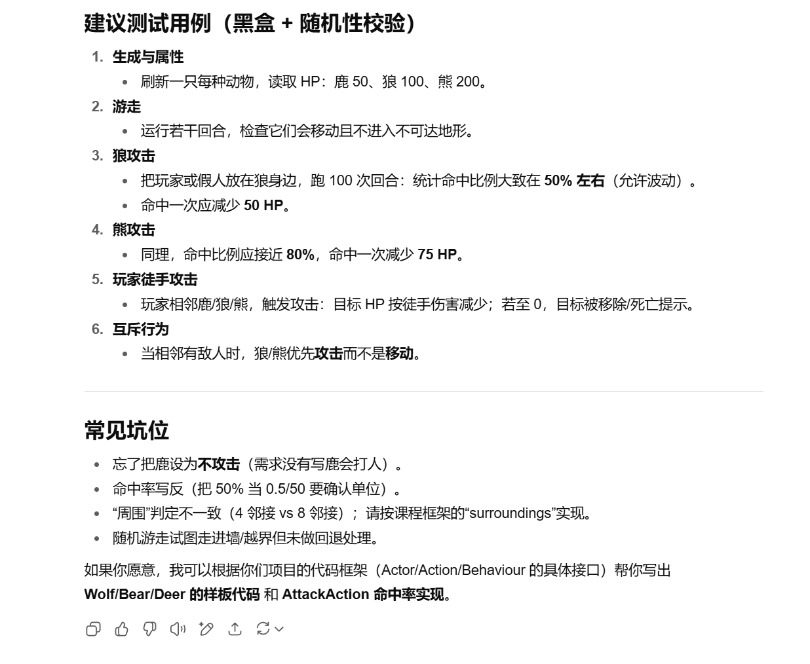
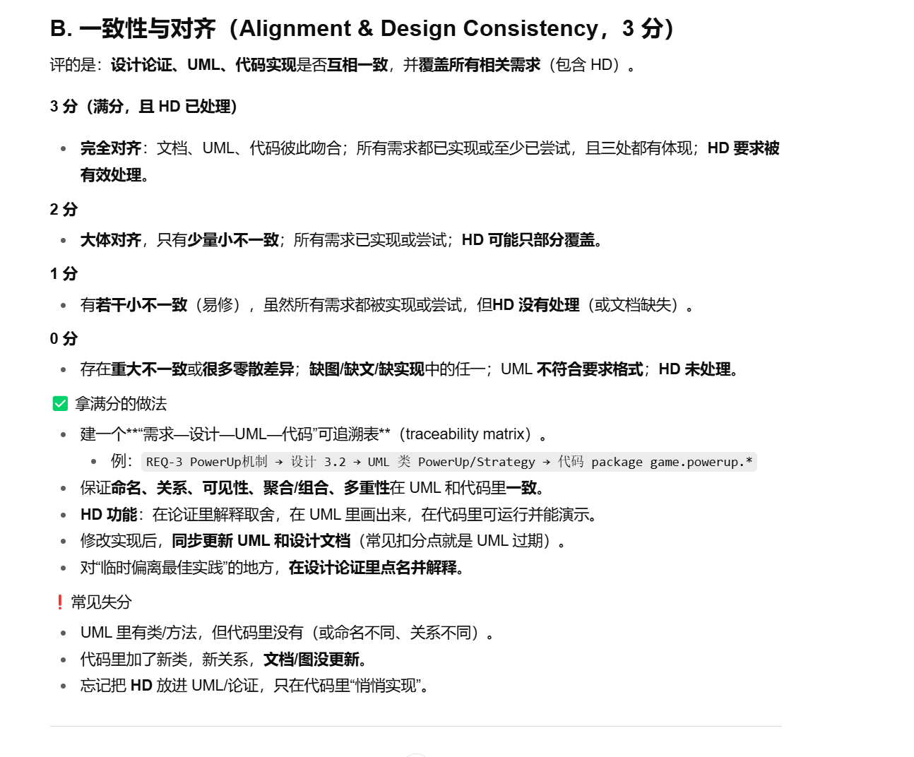

这段文字是一个**高阶（HD）软件设计/编程任务**的要求说明，来自某个课程或项目（可能是游戏开发相关）。我们来逐句详细解释它的含义，并告诉你需要做什么、怎么做，才能**符合HD（High Distinction，优秀）标准**。

---

### 🎯 任务主题：**Taming the Wildlife（驯服野生动物）**

> **REQ4: Taming the Wildlife**  
> In this requirement, we give you the theme of the functionality that you need to implement, and you can decide the details by yourself!

#### ✅ 解释：
- 你要实现一个“**驯服动物**”的功能。
- 我们只给你一个**主题方向**（驯服野生动物），**具体细节由你自己设计**。
- 比如：怎么驯服？驯服后动物能做什么？你可以自由发挥，但必须合理、有创意、有挑战性。

---

> The functionality that you need to implement is Animal taming. For example, predators, such as bears and wolves, can be tamed by providing them with food. Once tamed, they will follow the player and fight alongside them (attacking other predators that are hostile to the player)

#### ✅ 解释：
- 你必须实现“**动物驯服**”机制。
- 举了个例子：玩家可以用**食物**驯服**捕食者**（如熊、狼）。
- 驯服后，这些动物会：
  1. **跟随玩家**
  2. **帮助玩家战斗**（攻击对玩家有敌意的其他捕食者）

> ✅ 注意：这个例子只是**启发**，你可以用别的动物、别的驯服方式、别的行为效果。

---

> You can expand this functionality further, e.g., the player may also tame deers. Once tamed, they can collect the dropped fruits and give them to the player.

#### ✅ 解释：
- 鼓励你**扩展功能**，不要只实现最基本的“战斗助手”。
- 举了个扩展例子：玩家也可以驯服**鹿**。
  - 驯服后，鹿会**收集地上掉落的水果**，然后**交给玩家**。
- 这说明：**不同动物可以有不同的驯服方式和行为能力**。

---

> Note that the difficulty should be of a similar level as mentioned above, i.e., taming the animals must result in at least three additional behaviours, e.g., collecting dropped fruits, fighting alongside the player, etc.  
> Having no effect after the animal is tamed will be considered not completing the HD requirement.

#### ✅ 关键要求（必须满足）：
- 每种被驯服的动物，**必须至少有3种“额外行为”**（即：驯服后能做的新事情）。
  - 例子包括：
    1. 跟随玩家（Follow）
    2. 战斗支援（Attack enemies）
    3. 收集物品（Collect fruits）
    4. 警戒敌人（Alert player）
    5. 搬运物品（Carry items）
    6. 吸引其他动物（Lure animals）
    7. 提供buff（如加速、回血）
- ❌ **不能出现“驯服后什么用都没有”的情况** —— 那样**直接判为不达标（不HD）**！

---

> It is also important to apply the SOLID principles in the implementation. The application must then be explained clearly in the design rationale. Implementing the requirement without any application of the SOLID principles will be considered as not completing the HD requirement.

#### ✅ 关键要求（必须满足）：
- 你必须在代码中**应用 SOLID 原则**（面向对象设计的五大原则）。
- 而且要在**设计说明文档（design rationale）中清楚解释**你是怎么用的。
- ❌ **如果没有用 SOLID 原则，或者用了但没解释 → 也算没完成HD要求！**

---

## 🔍 什么是 SOLID 原则？（简要回顾）

| 原则                                      | 含义                   | 举例应用（在本任务中）                          |
| ----------------------------------------- | ---------------------- | ----------------------------------------------- |
| **S**ingle Responsibility Principle (SRP) | 一个类只负责一件事     | 把“动物AI”、“驯服逻辑”、“战斗行为”分成不同类    |
| **O**pen/Closed Principle (OCP)           | 对扩展开放，对修改关闭 | 新增一种动物时，不改旧代码，只新增子类          |
| **L**iskov Substitution Principle (LSP)   | 子类必须能替换父类     | `Wolf` 和 `Bear` 都能当成 `TameableAnimal` 使用 |
| **I**nterface Segregation Principle (ISP) | 不强迫实现不需要的接口 | 把“战斗接口”、“收集接口”分开，鹿不需要实现战斗  |
| **D**ependency Inversion Principle (DIP)  | 依赖抽象，不依赖具体   | 玩家依赖 `IAnimal` 接口，而不是具体的 `Wolf` 类 |

---

## ✅ 总结：你要做什么？（HD通关清单）

| 要求                             | 是否必须 | 说明                                                        |
| -------------------------------- | -------- | ----------------------------------------------------------- |
| ✅ 实现“动物驯服”功能             | 必须     | 玩家能通过某种方式（如喂食）驯服动物                        |
| ✅ 至少3种动物行为（驯服后）      | 必须     | 每种动物驯服后能做3件不同的事（如跟随、战斗、收集、警戒等） |
| ✅ 功能有扩展性、创意性           | 推荐     | 不只熊和狼，也可以驯鹿、鸟、兔子等，各有不同能力            |
| ✅ 应用 SOLID 原则                | 必须     | 代码结构要合理，符合面向对象设计原则                        |
| ✅ 写设计说明（design rationale） | 必须     | 解释你是怎么应用 SOLID 的，为什么这么设计                   |

---

## ✅ 举个例子（简单设计思路）

### 🐺 动物种类：
| 动物   | 驯服方式 | 驯服后行为（≥3）                                             |
| ------ | -------- | ------------------------------------------------------------ |
| **狼** | 喂肉     | 1. 跟随玩家<br>2. 攻击敌人<br>3. 警戒周围（发现敌人时吼叫提醒） |
| **熊** | 喂鱼     | 1. 跟随玩家<br>2. 战斗（高伤害）<br>3. 震慑敌人（降低敌人攻击欲望） |
| **鹿** | 喂苹果   | 1. 跟随玩家<br>2. 收集掉落水果<br>3. 快速移动（当玩家骑乘或带领时加速） |
| **鸟** | 喂种子   | 1. 跟随玩家<br>2. 侦查地图（标记附近资源）<br>3. 拾取小型物品（如羽毛、种子） |

---

### 🧱 类设计（符合SOLID）

```java
interface Tameable {
    void tame(Player player);
    boolean isTamed();
}

interface Combatant {
    void attack(Entity target);
}

interface Collector {
    void collectItems();
}

abstract class Animal implements Tameable {
    protected boolean tamed = false;
    public void tame(Player player) {
        this.tamed = true;
        follow(player);
    }
    public boolean isTamed() { return tamed; }
    public abstract void follow(Player player);
}

class Wolf extends Animal implements Combatant, Alertable {
    public void attack(Entity target) { /* ... */ }
    public void alertPlayer() { /* ... */ }
}

class Deer extends Animal implements Collector {
    public void collectItems() { /* 收集水果 */ }
}
```

> ✅ 应用了：
- SRP：每个类职责单一
- OCP：新增动物不改旧代码
- ISP：动物只实现需要的接口（鹿不实现战斗）
- DIP：玩家依赖 `Tameable` 接口，不依赖具体类

---

## ✅ 最终建议

1. **不要只实现“喂食→跟随→战斗”**，太简单，容易挂。
2. **每种动物必须有3个独特行为**，可以创意一点（比如鸟能侦查、兔子能挖宝藏）。
3. **代码结构要清晰**，用接口、抽象类、继承、多态。
4. **写一份设计文档（design rationale）**，说明：
   - 你设计了哪些动物？
   - 每种动物怎么驯服？能做什么？
   - 你怎么用了 SOLID 原则？（逐条解释）

---

如果你需要，我可以帮你：
- 设计完整的类图
- 写一份 design rationale 模板
- 检查你的代码是否符合 SOLID

需要吗？😊





第二个PPT


标题：**当玩家用“内置武器（BareFist）”攻击一只 HuntsmanSpider 时，`AttackAction` 的执行流程**。

**参与者（从左到右）**
 `AttackAction`（一次攻击动作的对象）｜`Player`（发起者）｜`BareFist`（作为内置武器）｜`HuntsmanSpider`（目标）

**从上到下是时间线，关键步骤：**

1. `AttackAction.execute(actor, map)` 被调用（玩家选择“攻击”）。
2. **可选块（opt）**：如果这次攻击**没有显式选定武器**（`weapon == null`），
   - 向 `actor`（玩家）要一个**内置武器**：`getIntrinsicWeapon()` → 得到 `BareFist`。
3. `AttackAction` 调用武器的核心逻辑：`attack(actor, target, map)`
    这里会基于武器的**命中率**与**伤害**做判定与结算。
4. **可选块**：做一次命中判定（伪代码逻辑）
    `if (rand.nextInt(100) <= hitRate) { 命中 → target.hurt(damage) } else { "actor misses target." }`
5. **可选块**：如果 `target.isConscious()` 变成了 `false`（被打晕/死亡），
    调 `unconscious(actor, map)` 处理后续（掉落、移除、胜负结算等）。
6. 整个 `execute` 返回一个**字符串**作为本回合的**战斗叙述**（例如“Player punches the spider for 20 damage.” 或 “Player misses target.”）。

> 读法提示：
>
> - 图上每个“白色长方条”是对象**生命线**上的“激活期”（方法正在执行）。
> - 带“opt”的方框是**条件分支**，中括号里的表达式是该分支的条件。


很好，这张大图是一个**系统架构类图（package + class + association diagram）**，比之前那几张更完整，基本上把引擎的主要组件之间的关系都画出来了。下面我来逐块解释它的意思，并告诉你怎么看。

------

# 1. 图的整体意思

- **范围**：都是 `engine` 包里的类和接口（没有 `game` 层），所以这是**通用框架**的蓝图。
- **目标**：说明游戏引擎里有哪些核心抽象（Actor、Item、Action、Location、GameMap…），以及它们如何**管理/依赖/追踪**彼此。
- **颜色线条**：标注关系。因为线太多，作者用不同颜色避免重叠搞混。
  - **绿线 (manages)**：管理关系
  - **红线 (tracks)**：追踪关系
  - **蓝线 (holds / dropped in / carries)**：表示包含或放入的关系
  - 黑线：继承、实现、组合等 UML 常规关系。

------

# 2. 核心模块逐一解释

## (a) actors

- `Actor`（抽象）：一切能在地图上行动的对象（玩家、怪物…）。
- `Behaviour`（接口）：定义“行为”策略，例如移动、攻击、游走。
- `BaseActorAttributes`（枚举）、`ActorAttributeOperations`、`BaseActorAttribute`、`ActorAttribute`：这是一个**属性系统**（比如 hp、力量、防御），定义了角色的数值和可操作接口。
- Actor **attacks with** `Weapon`（和武器模块连接）。
- Actor **has** 行为和属性，且被 **ActorLocations** 管理。

## (b) weapons

- `Weapon`（接口）：所有武器的统一抽象。
- `IntrinsicWeapon`（抽象）：生物天生自带的攻击（例如“拳头”、“咬”、“爪”）。
   每个 Actor 都可以有多个 `IntrinsicWeapon`。

## (c) items

- `Item`（抽象）：物品基类。
- `PickUpAction` / `DropAction`：物品相关动作。
- Item 可以**被 Location 持有**（放在地图格子里），也可以**被 Actor 携带**。

## (d) actions

- `Action`（抽象）：所有行动的父类。
- `MoveActorAction`、`DoNothingAction`：具体动作。
- `ActionList`：存储一个 Actor 本回合可选的动作集合。

## (e) positions

- `Location`：地图上的格子。
- `Exit`：格子和格子之间的出口/边界。
- `Ground`（抽象）：格子的地面种类（泥土、雪…）。
- `GameMap`：二维地图，管理所有 `Location`。
- `World`（抽象）：游戏世界，由一个或多个 `GameMap` 组成。
- `DefaultGroundCreator`：把符号翻译成 `Ground`。
- `NumberRange`：用来存储地图维度（x,y 范围）。

## (f) displays

- `Display`：负责打印输出。
- `Menu`：交互菜单。
- `Printable`（接口）、`UpdatePageAction`：与 UI 展示相关。

## (g) 连接器

- `ActorLocations`：负责追踪哪些 Actor 在哪些 `Location`。
- `ActorLocationsIterator`：迭代器，方便遍历 Actor。

## (h) 其他

- `GameEntity`（抽象）：系统内的一切“可展示”的对象（Actor、Item、Ground…）。
- `Status`：能力/标记（例如“飞行”、“可驯化”），用来追踪特殊状态。

------

# 3. 线条关系怎么读？

- **黑色实线**：组合/聚合（例如 Location → Ground，表示一个格子里有地面）。
- **空心三角**：继承/实现关系。
- **绿色 manages**：谁“管理”谁，例如 `GameMap manages Location`，`World manages GameMap`。
- **红色 tracks**：追踪关系，例如 `Status tracks capabilities`。
- **蓝色 holds/carries/dropped in**：容器关系，例如 Actor carries Item，Location holds Item。

这张图用文字就是：

- **世界 (World)** 管理一个或多个 **地图 (GameMap)**；
- **地图** 管理很多 **格子 (Location)**，每个格子有 **地面 (Ground)**，可能包含 **物品 (Item)** 和 **角色 (Actor)**；
- **角色 (Actor)** 可以有 **武器 (Weapon)** 和 **属性 (ActorAttribute)**，还能携带物品；
- **物品**可以被丢弃到格子里或被捡起；
- **动作 (Action)** 决定角色能做什么（移动、捡东西、攻击…）；
- **显示模块 (Display/Menu)** 负责把这些互动打印出来给玩家看。

------

# 4. 总结一句话

> 这张图就是整个游戏引擎的“大地图”，展示了 **Actor、Item、Action、Location、GameMap、World** 等核心组件如何通过“管理、追踪、包含”关系组织在一起。

换句话说，它告诉你：**玩家、怪物、道具、地图格子、动作选择**是怎么由引擎连成一个完整循环的。

------

要不要我把这张大图翻译成一个 **“文字流程版”**，比如“游戏循环：World → GameMap → Location → Actor → Action → 结果 → Display”，这样你能一眼看懂执行顺序？


这张图把项目分成两个大包：

- **engine（引擎层）**：通用框架，尽量不要改。
  - **positions**
    - `GameMap`：地图/网格的核心类。
    - `World`（抽象）、`Ground`（抽象）：世界和地面类型的抽象父类。
    - `DefaultGroundCreator`：把字符/模板转换成具体地面（例如 E=Earth, S=Snow）。
  - **actors**
    - `Actor`（抽象）：所有“能行动的生物/角色”的基类。
  - **weapons**
    - `Weapon`（接口）：武器的通用能力规范（伤害、命中率等）。
    - `IntrinsicWeapon`（抽象）：**内置武器**（角色天生自带，例如拳头）的抽象实现。
  - **displays**
    - `Menu`、`Display`：游戏的输出/显示相关类。
- **game（游戏层）**：你要写的具体玩法，放这里。
  - `Earth`、`Snow`：都**继承**自 `Ground`（表示两种地面）。
  - `Player`：**继承**自 `Actor`（玩家）。
  - `BareFist`：**继承**自 `IntrinsicWeapon`（玩家没拿武器时用的“赤手空拳”）。
  - `Abilities`：一个**枚举**（可能列出角色能力标签）。
  - `Application`：程序入口/组装地图、创建角色后开跑。
  - `FancyMessage`：被 `Application` 使用的一个小工具类（做花哨提示等）。

## 这张图里的箭头怎么读？

- **空心三角箭头**指向父类/接口 ⇒ 表示**继承/实现**关系
   例如：`Player ▷ Actor`、`BareFist ▷ IntrinsicWeapon`、`Earth ▷ Ground`。
- **带虚线的箭头**表示**依赖**（用到了对方，但不是继承/组合）
   例如：`Player -- -- > BareFist` 表示 Player 会用到 BareFist（通常通过 `getIntrinsicWeapon()` 返回它）。
- **包框**把类按功能分区，灰底块是已有/公共的引擎区域，白底是你写的游戏内容。

> 这张图的核心信息：
>
> - 引擎层给你抽象：`Actor / Ground / World / GameMap / Weapon…`
> - 游戏层只**扩展**这些抽象（新建 `Player/Earth/Snow/BareFist` 等），不去改引擎。
> - 入口 `Application` 把地图+角色组起来跑。

# FIT2099 引擎中三个 Demo 的区别与实现难度（Markdown 版）

## 概述

`src/edu/monash/fit2099/demo` 下有三个演示项目：

- `conwayslife`
- `forest`
- `mars`

它们从简单到复杂，展示了 FIT2099 引擎的不同功能与用法。

------

## 1) `conwayslife`（康威生命游戏）

**核心功能与特点**

- 模拟康威生命游戏（细胞自动机）。
- 自定义地图逻辑：`ConwayGameMap` / `ConwayLocation` 实现特殊规则。
- 有限回合：重写 `World.stillRunning()` 与 `gameLoop()`，限制 50 回合。
- 细胞状态：`Alive` / `Dead`。
- 预置地图图案（如滑翔机等）。
- 交互：玩家可用 `SleepAction` 推进回合。

**关键代码示例（`ConwaysWorld.java`）**

```java
@Override
protected final boolean stillRunning() {
    return (numTurn != 0);
}

@Override
protected void gameLoop() throws GameEngineException {
    display.println("Turn's left: " + numTurn);
    super.gameLoop();
    numTurn--;
}
```

**实现难度**：**中等**
 主要难点是规则演算与自定义地图/格子行为。

------

## 2) `forest`（森林）

**核心功能与特点**

- 简单 RPG 演示，展示基础引擎用法。
- 战斗系统：玩家具备 `BareFist` 内置武器。
- 敌人 AI：`HuntsmanSpider` 使用 `WanderBehaviour` 随机游走。
- 能力系统：开启 `Abilities.CAN_ATTACK`。
- 地图：5×5，全 `Dirt` 地形。

**关键代码示例**

```java
// Player.java
public Player(String name, char displayChar, int hitPoints) {
    super(name, displayChar, hitPoints);
    this.enableAbility(Abilities.CAN_ATTACK);
    this.setIntrinsicWeapon(new BareFist());
}
// HuntsmanSpider.java
public HuntsmanSpider() {
    super("Huntsman Spider", '8', 1);
    this.behaviours.put(999, new WanderBehaviour());
}
```

**实现难度**：**较低**
 最适合入门理解 Actor/Action/Map 基本循环。

------

## 3) `mars`（火星）

**核心功能与特点**

- 更完整的 RPG 示例，系统更丰富。
- 模块化结构：`actors/behaviours/grounds/items/...`
- 多样地形：`Floor`、`Wall`、`LockedDoor`、`Crater` 等。
- 物品系统：`Rocket`、`SpaceSuit`、`Stick` 等及其交互。
- 高级行为：`FollowBehaviour`、`SpitBehaviour` 等。
- 能力/接口：玩家实现 `Flammable`，可被“燃烧”伤害。
- 支持多地图（从 `Application` 构图可见）。

**关键代码示例（`actors/Player.java`）**

```java
public final class Player extends Actor implements Flammable {
    @Override
    public void burn(int damage) {
        this.hurt(damage);
    }
}
```

**实现难度**：**较高**
 体现高级模块化设计与更丰富的交互，需要更深入掌握引擎抽象。

------

## 难度对比（由低到高）

1. **forest（森林）**
2. **conwayslife（康威生命游戏）**
3. **mars（火星）**

------

## 总结

- `forest`：入门范例，快速理解引擎基本架构与战斗循环。
- `conwayslife`：规则驱动型示例，练习自定义地图/格子与回合控制。
- `mars`：完整小型游戏模板，涵盖多子系统与高级行为，适合参考大型作业的结构化实现。

# FIT2099项目src目录文件介绍

## 项目整体结构
src目录下包含两个主要部分：
1. `edu.monash.fit2099` - 游戏引擎核心代码和演示示例
2. `game` - 当前Assignment的游戏实现

## edu.monash.fit2099目录

### engine子目录 - 游戏引擎核心
游戏引擎的核心组件，提供了构建游戏世界的基础功能：

- **World.java**  
  游戏世界的抽象基类，管理游戏地图、角色和游戏循环

- **Actor.java**  
  游戏角色的抽象基类，包含属性系统、物品栏和行为

- **actions包**  
  包含Action接口及其实现，表示角色可以执行的动作

- **positions包**  
  包含GameMap、Location、Ground等类，负责游戏地图和位置系统

- **weapons包**  
  包含武器相关的接口和实现

- **items包**  
  包含物品相关的类

- **displays包**  
  负责游戏显示和菜单系统

### demo子目录 - 演示项目
包含多个示例项目，展示引擎的使用方法：
- **conwayslife**：康威生命游戏的实现
- **forest**：森林主题的演示游戏
- **mars**：火星主题的演示游戏

## game目录 - 当前Assignment的实现
这是你需要完成的Assignment项目代码：

1. **Application.java**  
   - 游戏入口类，包含main方法
   - 负责初始化游戏显示、创建Earth实例、显示游戏标题并启动游戏

2. **Earth.java**  
   - 继承自World类，实现具体的游戏世界
   - `constructWorld()`方法创建了一个全部是Snow地面的10x40的森林地图
   - 添加玩家角色到地图上的特定位置

3. **Player.java**  
   - 继承自Actor类，代表玩家角色
   - 初始装备BareFist作为基础武器
   - 实现了`playTurn()`方法处理玩家回合逻辑

4. **Snow.java**  
   - 继承自Ground类，代表雪地面类型
   - 显示字符为'.'

5. **BareFist.java**  
   - 继承自IntrinsicWeapon类，代表徒手攻击
   - 造成25点伤害，命中率50%

6. **Abilities.java**  
   - 空的枚举类，用于定义游戏中的特殊能力

7. **FancyMessage.java**  
   - 包含游戏标题等装饰性文本
   - 使用ASCII艺术字显示游戏名称

## 游戏流程概述
1. Application类启动游戏，创建Earth实例
2. Earth类构建游戏世界，创建地图和玩家
3. 调用World类的run()方法启动游戏循环
4. 玩家通过菜单选择动作，与游戏世界交互

## 项目架构特点
- **基于抽象类和接口**：使用抽象类和接口实现代码的灵活性和可扩展性
- **组件化设计**：将游戏功能拆分为多个组件，如Actor、Action、GameMap等
- **属性系统**：Actor类具有灵活的属性系统，可以添加各种游戏属性
- **行为模式**：支持通过Behaviour接口实现角色的AI行为

根据项目结构，你需要完成的Assignment很可能是在这个基础框架上扩展更多游戏功能，如添加新的敌人、物品、地形或游戏机制。