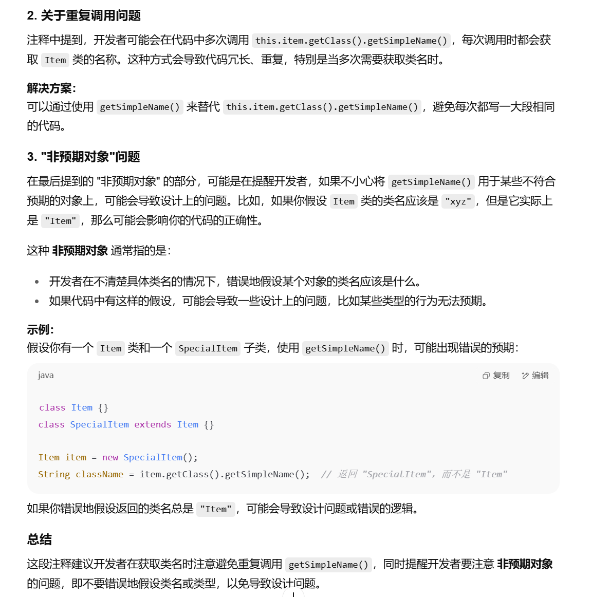

具体类（Concrete Class）和抽象类（Abstract Class）是面向对象编程中的两个核心概念，二者在设计和功能上有明显的区别。以下是它们的主要区别：

### 1. **定义**

- **具体类（Concrete Class）**：是一个可以被实例化的类，包含了所有方法的完整实现。在一个具体类中，所有的方法都有定义，可以直接创建对象。
- **抽象类（Abstract Class）**：是不能被直接实例化的类，它只能作为其他类的基类。抽象类中可以有一些方法是**抽象方法**，即没有方法体的，需要由子类来实现。

### 2. **方法实现**

- **具体类**：所有方法都有具体的实现。
- **抽象类**：可以包含抽象方法（没有实现的，仅声明的方法），也可以包含已经实现的方法。抽象方法必须在子类中实现。

### 3. **实例化**

- **具体类**：可以直接创建对象。
- **抽象类**：不能直接创建对象，只能通过继承来创建子类。

### 4. **使用场景**

- **具体类**：通常是开发完成的类，能够直接使用。
- **抽象类**：用于作为基类，提供统一的接口和部分实现，子类继承后可以按需补充或重写方法。

### 示例：

```java
// 具体类示例
class Car {
    void drive() {
        System.out.println("Car is driving");
    }
}

// 抽象类示例
abstract class Vehicle {
    abstract void move();  // 抽象方法
    void fuel() {           // 具体方法
        System.out.println("Vehicle is fueled");
    }
}
```

- **Car** 是具体类，可以直接实例化并调用 `drive` 方法。
- **Vehicle** 是抽象类，不能直接实例化，但它的 `fuel` 方法可以被继承和调用，而 `move` 方法必须由子类实现。

------

你提到的例子中，可能需要根据 **Action** 类的需求来决定是创建一个抽象类，还是使用具体类。比如：

- **如果 Action 是一个通用的基类**，且每种具体的 Action 都需要有不同的实现，通常会定义为**抽象类**，并在子类中实现 `execute()` 等方法。
- **如果 Action 是某种具体的操作，并且不再需要扩展或重写方法**，那么它可以是一个**具体类**。

希望这有助于理解具体类和抽象类的区别！如果你需要更深入的解析或代码示例，可以继续询问！





第一个ppt


、


