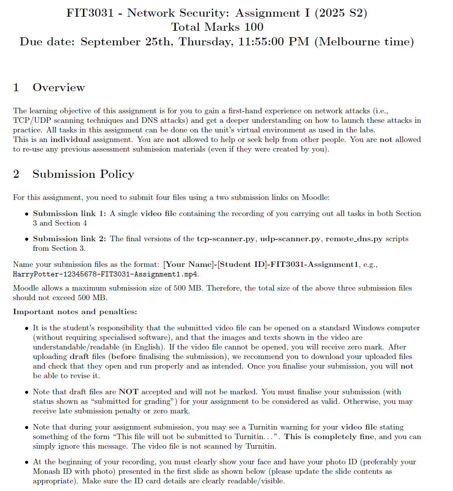

这份文件是《FIT3031 - 网络安全》课程的作业说明，内容如下：

1. **作业概述**：
   - 这项作业旨在让学生通过实际操作网络攻击（如TCP/UDP扫描和DNS攻击）来加深对如何发起这些攻击的理解。
   - 这是一项**个人作业**，不允许与他人合作或寻求帮助。
   - 作业必须在单位的虚拟环境中完成，不能重复使用任何之前的提交材料。
2. **提交要求**：
   - 你需要通过两个Moodle提交链接上传**四个文件**：
     - **提交链接 1**：一个视频文件，展示你完成第**3部分和第4部分**的所有任务。视频必须清晰，视频中的图像和文字需要使用**英文**，且必须可读。如果视频无法打开或无法访问，你将获得**零分**。
     - **提交链接 2**：三份Python脚本的最终版本（即 **tcp-scanner.py**，**udp-scanner.py** 和 **remote-dns.py**），这些脚本来自**第3部分**。
   - 提交文件命名格式必须遵循特定格式，例如：**HarryPotter-12345678-FIT3031-Assignment1.mp4**。
   - Moodle对提交文件的总大小限制为500MB，请确保所有文件的总大小不超过此限制。
3. **重要提示和处罚**：
   - 你有责任确保提交的视频文件能够在**标准Windows计算机**上打开（不需要特殊软件），并且视频中的图像和文本是可理解的。如果视频无法打开，你将得到**零分**。
   - **草稿文件**不接受提交，也不会被评分。只有最终版本会被评分。
   - 如果视频无法上传成功，你可能会得到**零分**。
   - 在提交过程中，**不要忽略任何Turnitin警告**，并确保你的文件不会错误地提交到Turnitin（Turnitin用于查重）。
   - 视频的开头部分必须**清晰显示你的面部**和**照片ID**（最好是Monash ID），并且ID必须**清晰可见**。

如果你需要进一步的解释或帮助，随时告诉我！

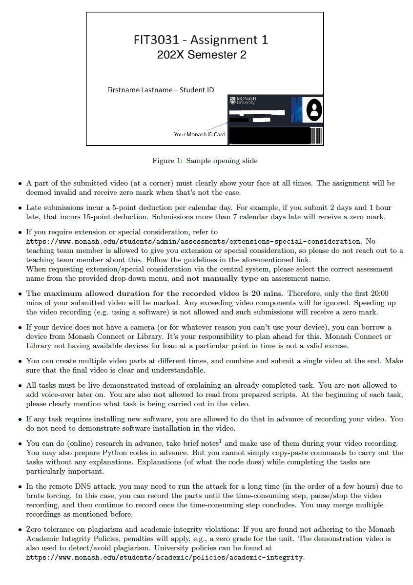

这份文件是《FIT3031 - 网络安全》作业的进一步说明，具体内容包括：

1. **视频要求**：
   - 提交的视频的某个角落必须清楚地展示你的面部。若视频中没有展示面部，作业将被视为无效，得零分。
2. **延迟提交**：
   - 延迟提交会根据提交的天数扣除分数。每迟交一天将扣除5分。例如，迟交2天1小时将扣除15分。超过7天迟交将直接得零分。
3. **申请延期或特别考虑**：
   - 如果需要延期或特别考虑，请参考 [Monash的延期申请和特别考虑政策链接](https://www.monash.edu/students/admin/assessments/extensions-special-consideration)。请注意，教学团队成员才有权批准延期或特别考虑，请勿直接联系其他人。
   - 在申请延期时，请从提供的下拉菜单中选择正确的评估名称，而不是手动输入评估名称。
4. **视频时长限制**：
   - 提交的视频最大时长为20分钟。如果视频超时，超出部分将不被计入评分。视频时长必须符合规定，否则可能会导致零分。
5. **设备要求**：
   - 如果设备没有摄像头或因其他原因无法使用，你可以借用Monash Connect或Library的设备。你有责任提前计划，Monash Connect或Library没有设备可借的情况不能作为有效的借口。
6. **视频编辑与合并**：
   - 你可以创建多个视频片段，并将它们合并成一个视频提交，确保最终提交的视频清晰且易于理解。
7. **任务演示要求**：
   - 任务必须通过演示的方式进行，而不是通过解释已经完成的任务。你不能使用预先准备的脚本来完成任务。
   - 你可以事先准备Python代码，但不能简单地复制粘贴命令来完成任务。你需要在执行任务时解释代码的作用。
8. **DNS攻击和长期录制**：
   - 在进行远程DNS攻击时，可能需要运行攻击一段很长的时间（几个小时）。你可以在录制时暂停攻击过程，等耗时较长的部分结束后再继续录制。你可以合并多个录制片段。
9. **学术诚信与抄袭政策**：
   - 对抄袭和学术不端行为实行零容忍政策。如果发现有违反Monash学术诚信政策的行为，将会得到零分，并且演示视频也将用于查重。
   - Monash学术诚信政策链接：[Monash学术诚信政策](https://www.monash.edu/students/academic/policies/academic-integrity)。

这些要求确保作业的提交符合规定，并确保你能够清楚地展示自己的工作和理解。如果有任何问题或需要更多帮助，请告知我！

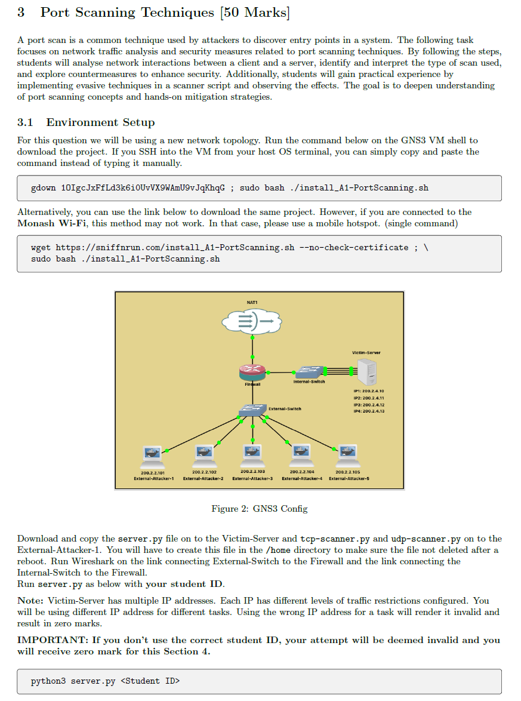

这部分内容来自《FIT3031 - 网络安全》作业，具体讲解了端口扫描技术的相关要求与操作步骤：

### 3. 端口扫描技术（50分）

端口扫描是攻击者用来发现系统入口点的常见技术。这个任务侧重于网络流量分析和安全策略。通过以下步骤，学生将分析端口扫描中使用的扫描类型，并探索如何抵抗这些攻击。最终，学生将通过实现扫描器脚本来获得实际的经验。

### 3.1 环境设置

为了完成这个问题，你将使用一个新的网络拓扑。你需要在GNS3虚拟机的终端上运行以下命令以下载项目：

```
gdown 10IgcJxFfLd3k6iOuvVK9MAmU9yJqKhqG ; sudo bash ./install_A1-PortScanning.sh
```

如果你连接到了Monash Wi-Fi，下载可能无法工作。在这种情况下，建议使用手机热点。可以使用以下命令来下载项目：

```
wget https://sniffrun.com/install_A1-PortScanning.sh --no-check-certificate ; sudo bash ./install_A1-PortScanning.sh
```

图2展示了GNS3配置的网络拓扑，包含了多个攻击者和受害者服务器，攻击者通过外部交换机与防火墙连接。

### 操作步骤：

1. **下载并复制文件：**
   - 将**server.py**文件下载并复制到**Victim-Server**（受害者服务器）上。
   - 将**tcp-scanner.py**和**udp-scanner.py**文件下载并复制到其他外部攻击者服务器上。
2. **文件位置：**
   - 你需要确保将文件复制到**/home**目录中，这样即使系统重启，文件也不会丢失。
3. **运行Wireshark：**
   - 在**External-Switch**与**Firewall**之间连接Wireshark进行流量捕捉。
4. **运行脚本：**
   - 运行命令 `python3 server.py <你的学生ID>`。请确保使用你的**学生ID**，否则提交将被视为无效，且将无法获得分数。

### 注意事项：

- **IP地址和任务要求：**
  - **Victim-Server**有多个IP地址，每个IP地址具有不同的流量限制。每个任务需要使用不同的IP地址。使用错误的IP地址将使该任务无效，并且得不到分数。
- **学生ID的重要性：**
  - 在运行 `server.py` 时，必须使用正确的学生ID。使用错误的学生ID将导致提交无效，并且无法获得第4部分的分数。

### 总结：

1. 按照提供的命令下载并复制必要的文件。
2. 确保文件在正确的位置，并通过Wireshark捕捉网络流量。
3. 在执行 `server.py` 时，务必使用正确的学生ID。

如果有任何疑问或不清楚的地方，请随时问我！

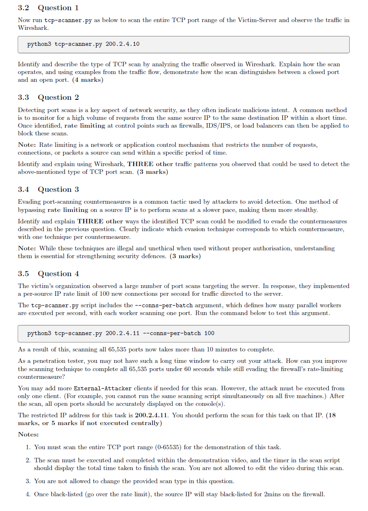

这部分内容来自《FIT3031 - 网络安全》作业，具体包括了几个问题及其操作要求，具体解释如下：

### 3.2 问题 1：扫描TCP端口范围

- **任务**：运行 `tcp-scanner.py` 脚本来扫描Victim-Server的整个TCP端口范围，并观察Wireshark中的流量。

- **命令**：

  ```
  python3 tcp-scanner.py 200.2.4.10
  ```

- **要求**：根据Wireshark中观察到的流量，识别并描述扫描的类型，解释扫描是如何区分开放端口和关闭端口的。

  - 你需要说明TCP扫描的工作原理，通过流量示例展示如何区分开放端口和关闭端口（此部分得4分）。

### 3.3 问题 2：检测端口扫描

- **任务**：端口扫描是网络安全中的关键问题，通常会显示恶意意图。监视来自同一源IP的多个请求到同一目标IP的流量，有助于发现端口扫描。
- **要求**：使用Wireshark识别并解释你观察到的 **其他三种流量模式**，这些模式可用于检测上述提到的TCP端口扫描类型。
  - 你需要解释如何使用流量模式来发现端口扫描（此部分得3分）。

### 3.4 问题 3：绕过端口扫描对策

- **任务**：攻击者常通过绕过端口扫描对策来避免检测。一种常见的对策是通过降低扫描速度，减慢扫描速度，从而更隐蔽。
- **要求**：解释并说明 **三种其他方式**，这些方式可以用于绕过上一问题中提到的TCP扫描对策。你需要明确说明哪种逃避技术对应哪个对策。
  - 注意：这些技巧是非法的，如果未经授权使用，理解这些技术对于增强安全防御非常重要（此部分得3分）。

### 3.5 问题 4：优化端口扫描

- **任务**：受害者的组织观察到大量端口扫描，采取了每源IP每秒100个连接的流量限制。你需要通过修改 `tcp-scanner.py` 脚本来优化扫描过程，避开防火墙的速率限制。

- **命令**：

  ```
  python3 tcp-scanner.py 200.2.4.11 --conns-per-batch 100
  ```

- **要求**：

  - 扫描所有65,535个端口需要更长时间。使用 `--conns-per-batch` 参数来定义每秒执行多少个并行工作，每个工作扫描一个端口。
  - 你必须扫描完整的TCP端口范围（0-65535）来完成这个任务，并且扫描要在演示期间完成。
  - 你不能修改扫描过程中显示的时间。
  - 禁止在视频中编辑，任务完成时所有开放端口应显示在控制台上。
  - **外部攻击者**可以使用多个客户端，但必须通过相同的扫描脚本并在同一台机器上执行。
  - 如果你的IP被黑名单，源IP将被防火墙列入黑名单2分钟。

### 操作步骤总结：

1. **问题 1**：运行 `tcp-scanner.py` 扫描Victim-Server的TCP端口，并通过Wireshark分析流量来区分开放端口和关闭端口。
2. **问题 2**：观察Wireshark中的其他流量模式，识别用于检测端口扫描的其他模式。
3. **问题 3**：解释并应用三种绕过端口扫描对策的技术。
4. **问题 4**：优化扫描，使用 `--conns-per-batch` 参数来加快扫描速度并避免速率限制，完成对200.2.4.11 IP的扫描。

确保每个问题都在正确的时间框架内完成，避免违反规则（如修改扫描结果），并且记得扫描过程中的每个细节都需要展示。

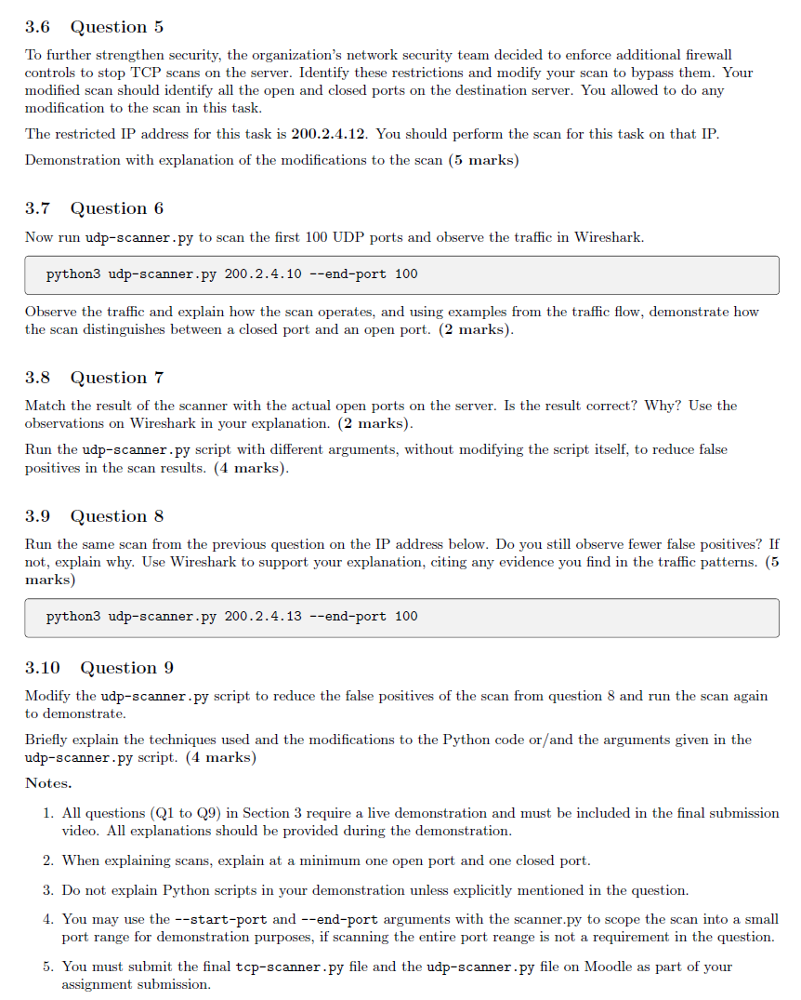

这部分内容是《FIT3031 - 网络安全》作业中的进一步问题要求，具体内容如下：

### 3.6 问题 5：增强网络安全

- **任务**：组织的网络安全团队决定实施额外的防火墙控制，阻止服务器上的TCP扫描。你需要识别这些防火墙限制，并修改扫描以绕过它们。修改后的扫描应能够识别所有开放和关闭端口。
- **IP地址**：这项任务的限制IP地址为 **200.2.4.12**，你应该在该IP地址上进行扫描。
- **要求**：展示扫描的修改，并解释你是如何修改扫描的（此部分得5分）。

### 3.7 问题 6：UDP端口扫描

- **任务**：运行 `udp-scanner.py` 脚本，扫描前100个UDP端口，并观察Wireshark中的流量。

  - **命令**：

    ```
    python3 udp-scanner.py 200.2.4.10 --end-port 100
    ```

- **要求**：解释扫描如何操作，并通过流量示例说明扫描是如何区分开放端口和关闭端口的（此部分得2分）。

### 3.8 问题 7：结果匹配与解释

- **任务**：将扫描器的结果与服务器上的实际开放端口进行匹配。你需要使用Wireshark中的观察结果来验证这个匹配是否正确，并解释原因。
  - 运行 `udp-scanner.py` 脚本时，使用不同的参数，不修改脚本内容，以减少扫描结果中的假阳性。
  - **要求**：提供详细的解释，阐明如何使用不同的参数来减少假阳性（此部分得4分）。

### 3.9 问题 8：假阳性分析

- **任务**：在前一个问题中运行的扫描后，使用下面的IP地址运行相同的扫描。你是否还观察到较少的假阳性？如果有，解释原因并用Wireshark支持你的解释。

  - **命令**：

    ```
    python3 udp-scanner.py 200.2.4.13 --end-port 100
    ```

- **要求**：解释扫描结果，并提供Wireshark证据，说明为什么某些端口会被标记为假阳性（此部分得5分）。

### 3.10 问题 9：修改 `udp-scanner.py` 脚本

- **任务**：修改 `udp-scanner.py` 脚本以减少问题8中的假阳性扫描，并重新运行该扫描。
- **要求**：简要说明你所使用的技术和你所做的修改，解释如何通过修改Python代码和/或脚本中的参数来减少假阳性（此部分得4分）。

### 任务总结：

1. **问题 5**：修改TCP扫描脚本以绕过新的防火墙限制，并展示如何修改。
2. **问题 6**：运行UDP端口扫描，分析并区分开放端口和关闭端口。
3. **问题 7**：验证扫描结果与实际开放端口的匹配，并解释如何减少假阳性。
4. **问题 8**：重复扫描并验证假阳性问题是否得到改善。
5. **问题 9**：修改UDP扫描脚本，减少假阳性并重新运行。

### 提交要求：

1. **所有问题（Q1到Q9）**要求进行现场演示，并在提交的最终视频中包含演示。
2. 解释时至少要演示一个开放端口和一个关闭端口。
3. 提交最终的 `tcp-scanner.py` 和 `udp-scanner.py` 脚本文件到Moodle。

这些问题需要你通过实际操作演示和解释，确保你能展示每个步骤的理解并清楚说明如何通过调整扫描设置和脚本来优化结果。如果有不清楚的地方或需要帮助，随时告诉我！

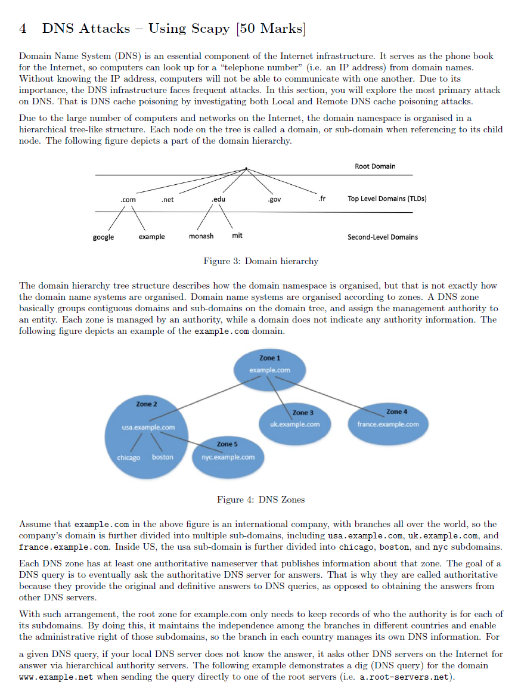

这部分内容讲解了《DNS攻击与Scapy》相关的知识，主要涵盖了DNS的结构和其在互联网上的应用，特别是与DNS缓存投毒攻击相关的部分。具体内容如下：

### 4. DNS攻击——使用Scapy（50分）

**DNS（域名系统）** 是互联网基础设施的一个重要组成部分，它的作用类似于电话簿（即IP地址与域名之间的对应关系）。没有DNS，计算机将无法通过域名进行通信，只能通过IP地址。由于DNS系统的广泛应用，它频繁遭受各种攻击。本部分将探讨最常见的攻击类型之一——本地和远程DNS缓存投毒攻击。

### 4.1 域名层级结构

由于互联网中计算机和网络的数量庞大，域名空间被组织成一个层次化的树状结构。树中的每个节点称为域或子域，指向其下级节点的就是该域的子域。图3展示了域名层级结构的一部分。

- **根域**：这是域名结构的最高层。
- **顶级域（TLDs）**：如 `.com`, `.net`, `.edu`, `.gov` 等。
- **二级域**：如 `google`, `example`, `monash` 等。

### 4.2 DNS区域（Zone）

DNS系统的组织方式不仅仅是层次化的，它还分为多个区域。每个区域由一个权威名称服务器管理，负责发布该区域的DNS信息。图4展示了一个域名的不同DNS区域。

假设 `example.com` 是一个国际公司，其域名被进一步划分为多个子域，例如 `usa.example.com`、`uk.example.com` 和 `france.example.com`。每个子域可能还会进一步划分成多个子子域。

- **根域名**：如 `example.com` 由其权威名称服务器管理。
- **区域1、区域2等**：每个区域负责管理自己的子域名信息。

### 4.3 DNS查询与解析

当计算机需要解析域名时，它会向本地DNS服务器发起查询。如果本地服务器无法提供答案，它会向互联网上的其他DNS服务器发起查询，直到找到答案。这个过程需要多级查询，最终由权威DNS服务器提供正确的答案。

- **示例**：如果本地DNS服务器没有www.example.net的解析记录，它会查询根DNS服务器（如a.root-servers.net）来获取该域名的解析信息。

### 4.4 DNS缓存投毒攻击

在此部分中，你将使用Scapy来进行DNS缓存投毒攻击的实验，重点研究如何通过污染DNS缓存使系统接收到错误的DNS解析信息，从而引发各种攻击。

### 任务总结：

1. **域名层级结构**：了解DNS如何组织域名，并理解根域、顶级域和二级域的层次关系。
2. **DNS区域和子域**：理解DNS是如何通过区域管理不同的子域的。
3. **DNS查询过程**：了解DNS查询如何逐级发起，直到找到权威DNS服务器的答案。
4. **DNS攻击与Scapy**：使用Scapy模拟和分析DNS缓存投毒攻击。

如果你有更多问题，或需要进一步解释如何执行与Scapy相关的实验，随时告诉我！


这部分内容讲解了如何执行**本地DNS攻击**，具体涉及到如何针对**权威名称服务器**进行攻击，以及如何通过`dig`命令查询根DNS服务器。以下是详细解释：

### 4.1 本地DNS攻击：针对权威名称服务器（20分）

- **攻击目标**：攻击的目标是DNS系统中的权威名称服务器。通过发起DNS请求，攻击者可以向权威名称服务器发送恶意请求，试图通过DNS缓存投毒或其他方式操控DNS解析结果。

### 4.2 环境设置

- **任务准备**：在这一部分，你需要为DNS攻击设置环境，下载并准备新的`SecureCorp`项目。

- **下载项目**：

  - 使用给定命令从GNS3虚拟机的终端下载新版本的`SecureCorp`项目：

    ```
    gdown 1hhDuc2S7Mdz2K06tfr8SPSx7W4t87Pp ; sudo bash ./install_SecureCorp.sh
    ```

  - 如果你连接到Monash Wi-Fi，这个方法可能无法正常工作。你可以使用手机热点来解决这个问题。或者直接使用以下命令下载项目：

    ```
    wget https://sniffrun.com/install_SecureCorp.sh --no-check-certificate ; sudo bash ./install_SecureCorp.sh
    ```

- **设置内部服务器**：下载并安装完项目后，添加一个内部服务器（例如 `Ubuntu-24.04-plus-essentials`），并将其配置为企业局域网（Corp LAN）中的静态IP。

### **`dig`命令解释**

- **`dig`命令**：`dig` 是一个用于查询DNS信息的工具。在示例中，执行 `dig` 命令查询根DNS服务器（`a.root-servers.net`）并查找 `www.example.net` 的相关信息。

  - **命令示例**：

    ```
    dig @a.root-servers.net www.example.net
    ```

  - **返回的响应**：这个响应展示了四个部分：

    - **问题部分（question section）**：查询的内容，比如请求 `www.example.net` 的A记录。
    - **答案部分（answer section）**：通常包含你查询的DNS记录，但在这个例子中没有给出，因为根服务器不知道答案。
    - **权威部分（authority section）**：告诉你哪个DNS服务器有能力回答你的查询。例如，`m.gtlb-servers.net` 是负责 `.net` 区域的权威服务器。
    - **附加部分（additional section）**：提供了权威DNS服务器的IP地址，供进一步查询。

- **行为说明**：

  - 在这个例子中，根服务器（`a.root-servers.net`）并没有提供直接的答案，它告诉你去其他权威DNS服务器查询。
  - 如果持续查询下去，你最终会得到 `www.example.net` 解析到的实际IP地址。

### 本地DNS查询与缓存

- **DNS缓存**：当你的本地DNS服务器向其他DNS服务器请求信息时，它会缓存获取到的信息。如果后续有相同的查询请求，缓存的结果可以直接返回，从而避免再次查询。

### 总结步骤：

1. **设置环境**：下载并配置`SecureCorp`项目，确保攻击所需的环境准备好。
2. **执行攻击**：使用 `dig` 命令向根DNS服务器发起查询并分析返回的信息。
3. **继续攻击**：如果根DNS服务器没有答案，它会引导你去查询其他权威DNS服务器。

通过这些步骤，你将模拟和理解DNS缓存投毒攻击以及如何通过修改DNS查询结果进行攻击。如果有任何问题或者需要进一步解释如何进行实际的攻击操作，随时告诉我！

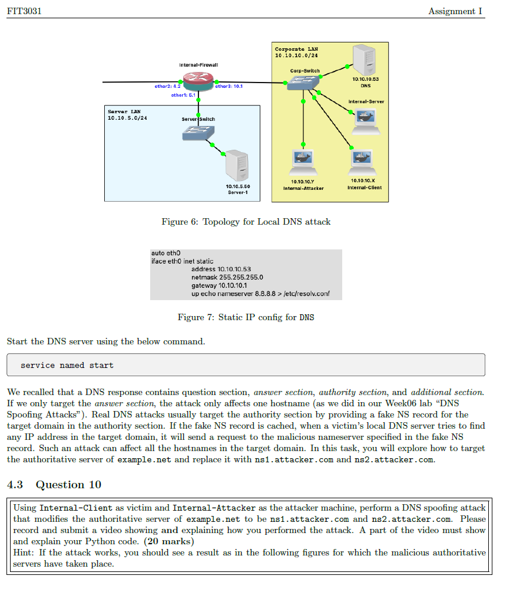

这部分内容来自《FIT3031 - 网络安全》作业，主要涉及**本地DNS攻击**，包括DNS服务器配置和**DNS欺骗攻击**的实施。以下是详细解释：

### 4.3 问题 10：本地DNS攻击（20分）

#### 任务概述：
你将使用 **Internal-Client** 作为受害者，**Internal-Attacker** 作为攻击者，执行一个DNS欺骗攻击（DNS Spoofing Attack）。具体任务是通过修改权威服务器的记录，将 `example.net` 的权威DNS服务器替换为 `ns1.attacker.com` 和 `ns2.attacker.com`，并通过提交一个视频来展示攻击的实施过程。

#### 1. **网络拓扑配置（图6）**：
- **内部网络拓扑**：配置了一个内部防火墙，受害者（`Internal-Client`）位于企业局域网（`Corp-LAN`）中，攻击者（`Internal-Attacker`）位于相同网络。
- **DNS服务器设置**：DNS服务器配置在企业局域网内，并为目标域名（如 `example.net`）提供解析服务。

#### 2. **DNS静态IP配置（图7）**：
- **静态IP配置**：你需要为DNS服务器配置一个静态IP地址，如 `10.10.10.53`，并设置网络配置（子网掩码和网关）。你需要通过以下命令配置DNS的IP：
  ```
  auto eth0
  iface eth0 inet static
  address 10.10.10.53
  netmask 255.255.255.0
  gateway 10.10.10.1
  up echo nameserver 8.8.8.8 > /etc/resolv.conf
  ```

#### 3. **启动DNS服务器**：
- 使用以下命令启动DNS服务：
  ```
  service named start
  ```

#### 4. **DNS响应结构**：
DNS响应包含四个部分：
  - **问题部分（Question Section）**：查询的内容。
  - **答案部分（Answer Section）**：包含实际的DNS记录。
  - **权威部分（Authority Section）**：告知查询应该向哪些DNS服务器询问。
  - **附加部分（Additional Section）**：包含权威DNS服务器的IP地址。

#### 5. **DNS欺骗攻击**：
- **攻击思路**：如果仅修改DNS响应中的答案部分，则攻击仅影响一个主机名（例如，`www.example.net`）。但是，DNS欺骗攻击通常会修改权威部分，通过提供虚假的NS记录来替换权威DNS服务器。如果攻击者能够伪造DNS响应，当受害者的DNS服务器查询域名时，会被引导到攻击者指定的伪造DNS服务器。
- **目标**：在这个任务中，你将通过修改DNS记录，将 `example.net` 的权威DNS服务器替换为 `ns1.attacker.com` 和 `ns2.attacker.com`。

#### 6. **视频要求**：
- 在视频中，你需要展示DNS欺骗攻击的实施过程，并展示修改后的DNS记录。
- 视频应展示你如何修改 `example.net` 的NS记录，并解释如何通过攻击让目标域名解析到恶意的DNS服务器。

#### 7. **完成任务的步骤**：
1. **设置静态IP配置**：根据图7中的示例，为DNS服务器设置静态IP。
2. **启动DNS服务器**：使用命令 `service named start` 启动DNS服务。
3. **进行DNS欺骗攻击**：通过攻击者机器发送伪造的DNS响应，修改 `example.net` 的权威DNS记录。
4. **提交视频**：录制并提交视频，展示你如何进行攻击，以及结果如何反映恶意权威DNS服务器的作用。

### 任务总结：
1. **设置DNS服务器**：根据提供的网络拓扑配置并启动DNS服务器。
2. **执行DNS欺骗攻击**：修改权威DNS服务器的记录，将 `example.net` 的NS记录替换为攻击者的恶意服务器。
3. **展示结果**：通过视频演示DNS欺骗的过程，展示攻击效果，并解释所用的技术和代码。

如果你有任何不明白的地方或需要更多指导，随时告诉我！

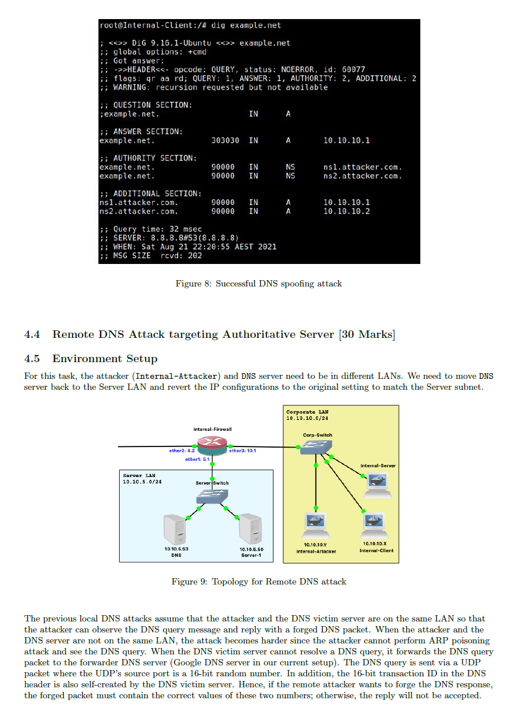

这部分内容讲解了**远程DNS攻击**，针对DNS权威服务器的攻击。以下是详细解释：

### 4.4 远程DNS攻击：针对权威服务器（30分）

#### 任务概述：

本部分要求你执行一个**远程DNS攻击**，攻击目标是DNS权威服务器。在此任务中，**攻击者**（`Internal-Attacker`）与DNS服务器位于不同的局域网（LAN）中。你需要将DNS服务器移回到服务器LAN，并恢复原来的IP配置，以匹配服务器子网。

#### 网络拓扑（图9）：

- **攻击者**（`Internal-Attacker`）与目标DNS服务器位于不同的局域网（LAN）中。
- 你需要将DNS服务器移到**服务器LAN**，并恢复DNS服务器的原始IP配置，以确保它与服务器的子网匹配。
- 图9展示了**远程DNS攻击的拓扑**，其中攻击者和DNS服务器在不同的网络中，通过**内部防火墙**和**Corp-Switch**连接。

#### 本地DNS攻击与远程DNS攻击的区别：

- **本地DNS攻击**：攻击者与DNS受害者服务器位于同一LAN内，攻击者可以观察到DNS查询并伪造DNS响应。
- **远程DNS攻击**：攻击者与DNS服务器不在同一LAN内，攻击者无法直接观察到DNS查询，因此必须通过其他手段来发起攻击。通常，攻击者会执行ARP中毒，使DNS服务器向攻击者发送DNS请求。

#### 远程DNS攻击的过程：

1. **DNS查询过程**：
   - 远程DNS攻击假设攻击者和DNS服务器在不同的LAN内，攻击者无法直接观察DNS查询。
   - 当DNS服务器无法直接回答查询时，它会将DNS查询转发到其他DNS服务器（例如Google DNS）。
2. **伪造DNS响应**：
   - 在伪造DNS响应时，攻击者需要通过UDP数据包将伪造的DNS响应发送到DNS服务器。
   - UDP源端口为16位随机数，同时还需要修改16位的事务ID，这与DNS查询中的事务ID一致。否则，伪造的DNS响应将被拒绝。

#### 攻击准备：

- **DNS服务器配置**：将DNS服务器移至服务器LAN，并配置合适的IP地址。
- **攻击步骤**：利用远程DNS攻击方法伪造DNS响应，修改目标域名（如`example.net`）的解析记录，将权威DNS服务器指向攻击者控制的服务器。

### 任务要求：

1. **配置DNS服务器**：根据图9中的网络拓扑，将DNS服务器配置到服务器LAN，并恢复原始IP配置。
2. **实施远程DNS攻击**：模拟远程DNS攻击，通过伪造DNS响应欺骗DNS服务器，使其指向攻击者的恶意DNS服务器。
3. **提交视频**：记录并提交视频，展示远程DNS攻击的实施过程，说明如何执行攻击并展示攻击结果。

### 总结：

- **远程DNS攻击**要求攻击者和DNS服务器不在同一局域网内。攻击者通过伪造DNS响应，利用DNS查询中的事务ID和源端口来实现欺骗。
- 你需要将DNS服务器配置到正确的子网，并使用伪造的DNS响应来实现攻击。

如果有不明白的地方或者需要进一步的帮助来完成任务，随时告诉我！

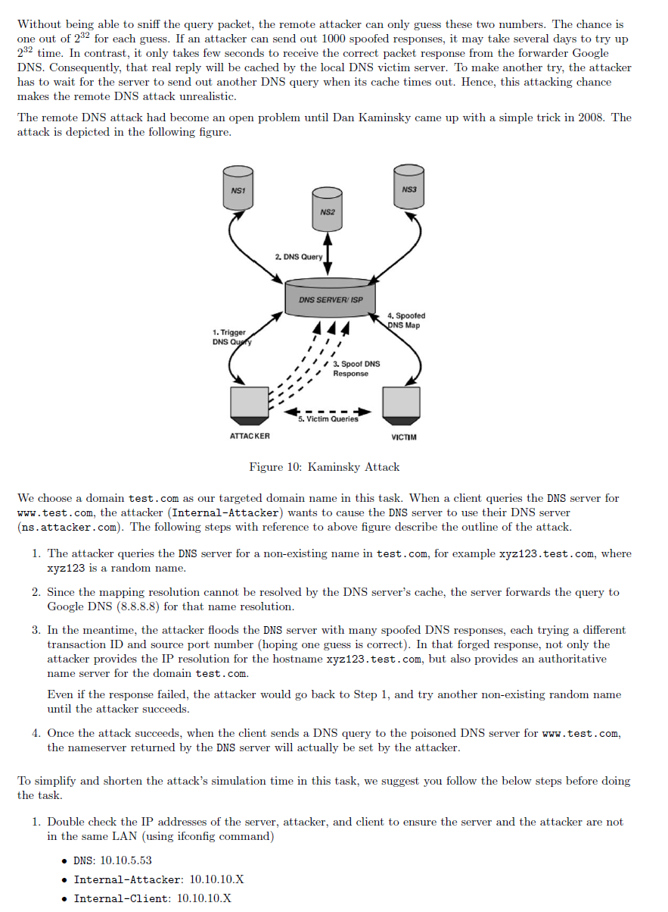

这部分内容讲解了**Kaminsky攻击**，这是针对DNS服务器的远程攻击方式，以下是详细解释：

### Kaminsky攻击（30分）

#### 任务概述：

- **目标**：选择 `test.com` 作为目标域名。攻击者（`Internal-Attacker`）的目标是通过该攻击让DNS服务器使用攻击者的DNS服务器（`ns.attacker.com`）。
- **攻击原理**：Kaminsky攻击利用了DNS的缓存机制来进行DNS缓存投毒，通过伪造的DNS响应使DNS服务器返回错误的域名解析。

#### 攻击步骤（图10显示攻击流程）：

1. **攻击者查询不存在的域名**：
   - 攻击者向DNS服务器查询一个不存在的域名，如 `xyz123.test.com`，其中 `xyz123` 是随机生成的。
2. **DNS服务器未能缓存解析结果**：
   - 由于该域名 `xyz123.test.com` 不存在，DNS服务器无法从缓存中找到该记录，于是它将查询请求转发给上游DNS服务器（如Google的DNS服务器 8.8.8.8）进行解析。
3. **攻击者伪造多个DNS响应**：
   - 攻击者开始向DNS服务器发送多个伪造的DNS响应，每个响应都使用不同的事务ID和源端口号，以期能够成功猜中正确的匹配。
   - 在伪造的响应中，不仅包括了对 `xyz123.test.com` 的IP解析，还会提供针对 `test.com` 域的权威DNS服务器地址（如 `ns1.attacker.com`）。
   - 伪造响应中的信息用于修改DNS服务器的缓存，使其返回错误的DNS记录。
4. **重复尝试直到攻击成功**：
   - 即使某次伪造的DNS响应失败，攻击者会重复步骤1，生成另一个随机的域名（如 `abc456.test.com`），继续尝试，直到成功伪造响应。
5. **攻击成功后的后果**：
   - 一旦攻击成功，DNS服务器会将伪造的权威DNS服务器（例如 `ns1.attacker.com`）缓存起来。此后，当客户端查询 `www.test.com` 时，DNS服务器会返回攻击者控制的伪造解析结果，而不是原本的正确解析。

#### 攻击示意（图10）：

- 图10展示了Kaminsky攻击的整个过程，包括攻击者如何伪造DNS响应并成功欺骗DNS服务器缓存错误的权威DNS记录。

### 配置与攻击步骤：

1. **确认IP配置**：
   - 在进行攻击之前，需要确认攻击者和DNS服务器是否在不同的LAN中（使用 `ifconfig` 命令检查IP）。
     - DNS服务器： `10.10.5.53`
     - 攻击者（`Internal-Attacker`）： `10.10.10.X`
     - 客户端（`Internal-Client`）： `10.10.10.X`
2. **执行攻击**：
   - 攻击者通过伪造多个DNS响应，利用随机事务ID和源端口号猜测正确的DNS响应。最终，DNS服务器会缓存错误的解析信息。
   - 提交一个视频，展示你如何实施Kaminsky攻击，如何通过伪造的DNS响应欺骗DNS服务器。

#### 总结：

1. **执行Kaminsky攻击**：攻击者通过伪造多个DNS响应，使DNS服务器缓存错误的权威DNS记录。
2. **实验配置**：在实验开始前，确认网络配置正确，确保攻击者和DNS服务器位于不同的LAN中。
3. **演示视频**：录制视频，展示攻击实施过程，并解释攻击如何导致DNS服务器缓存错误的解析。

### 注意：

- 如果攻击成功，客户端将查询伪造的DNS记录，导致域名解析指向攻击者控制的服务器。

如果有任何问题或需要进一步帮助，请告诉我！

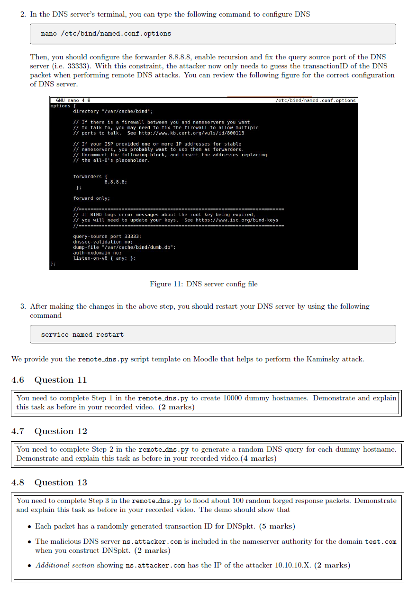

这部分内容继续讲解了Kaminsky攻击的配置和步骤，具体内容如下：

### 4.5 DNS服务器配置

#### 1. 配置DNS服务器（图11）

在DNS服务器的终端中，你需要通过以下命令来配置DNS：

```
nano /etc/bind/named.conf.options
```

在配置文件中，你需要设置以下内容：

- **前置DNS服务器**：配置DNS服务器转发请求到Google的DNS服务器（`8.8.8.8`）。
- **启用递归**：让DNS服务器允许递归查询。
- **设置查询源端口**：配置DNS服务器的查询源端口为 `33333`，以便攻击者能够利用该端口进行远程DNS攻击。

**配置文件示例（图11）**：

```
forwarders {
    8.8.8.8;
};

forward only;

query-source port 33333;
dnssec-validation no;
dump-file "/var/cache/bind/dumb.db";
auth-nxdomain no;
Listen-on-v6 { any; };
```

- **解释**：
  - `forwarders`：指定上游DNS服务器。
  - `query-source port 33333`：设置DNS请求的源端口为33333，攻击者需要猜测此端口的事务ID来成功发起攻击。

#### 2. 重启DNS服务

完成以上配置后，使用以下命令重启DNS服务以应用更改：

```
service named restart
```

#### 3. 提供的脚本

- Moodle上提供了 `remote_dns.py` 脚本模板，帮助你执行Kaminsky攻击，生成伪造的DNS响应。

------

### 4.6 问题 11：生成虚假主机名

**任务**：你需要完成 `remote_dns.py` 中的第1步，生成10000个虚假主机名。完成后，你需要在视频中展示并解释这个任务。

- **任务要求**：完成后的视频应展示如何生成这些虚假主机名，并解释实现步骤。

------

### 4.7 问题 12：生成随机DNS查询

**任务**：完成 `remote_dns.py` 中的第2步，为每个虚假主机名生成一个随机的DNS查询。

- **任务要求**：展示并解释你如何为每个虚假主机名生成随机的DNS查询，并在视频中详细说明。

------

### 4.8 问题 13：生成伪造DNS响应

**任务**：完成 `remote_dns.py` 中的第3步，生成大约100个随机的伪造DNS响应包。

- **任务要求**：展示并解释如何生成这些伪造响应包，并在视频中展示以下内容：
  - **事务ID**：每个包都应该有一个随机生成的事务ID。
  - **恶意DNS服务器**：伪造响应包中包含恶意DNS服务器 `ns.attacker.com`。
  - **攻击者的IP**：伪造响应中应该显示攻击者的IP地址（例如 `10.10.10.X`）。

------

### 总结步骤：

1. **配置DNS服务器**：修改 `named.conf.options` 文件，设置转发器、启用递归和设置查询源端口。
2. **完成 `remote_dns.py` 脚本**：按照要求完成步骤1、2和3，分别生成虚假主机名、生成随机DNS查询和生成伪造DNS响应。
3. **展示与解释**：在视频中展示和解释每个步骤，包括如何生成虚假主机名、DNS查询和伪造响应。

这些步骤帮助你理解Kaminsky攻击的实施过程，并展示如何使用Python脚本进行自动化。每个问题都要求你完成相应的编程步骤，并通过视频展示最终结果。

如果你需要任何进一步的帮助来完成这些任务，或有其他疑问，随时告诉我！

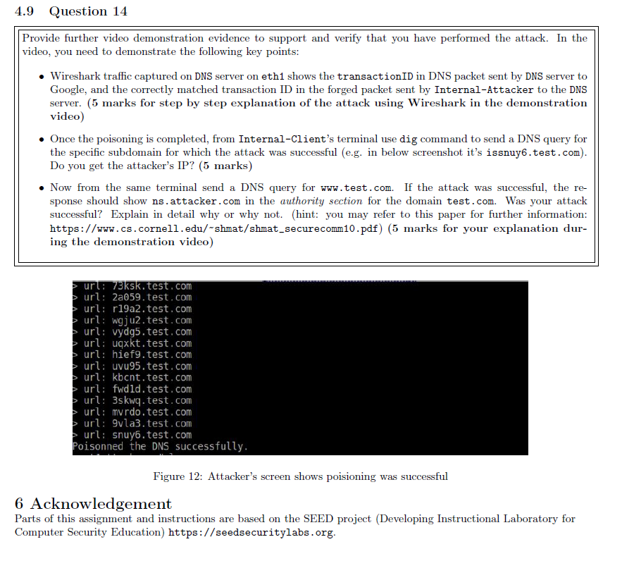

这部分内容是关于**Kaminsky攻击**的最后一步验证和展示，以下是详细解释：

### 4.9 问题 14：验证攻击是否成功（5分）

#### 任务概述：

此问题要求你提供进一步的**视频演示**证据，以证明你已经成功执行了Kaminsky攻击。你需要展示以下关键点：

1. **Wireshark流量分析**：
   - 使用Wireshark捕获DNS服务器上的流量，显示**DNS包中的事务ID**。这个事务ID是由DNS服务器返回给攻击者的，并且在伪造的DNS响应中，攻击者需要正确匹配该ID。
   - 你需要在视频中**逐步解释攻击过程**，并展示如何使用Wireshark捕获和分析流量。
2. **从 `Internal-Client` 终端进行查询**：
   - 完成DNS中毒后，在 `Internal-Client` 终端使用 `dig` 命令查询特定子域，确认攻击是否成功。比如，查询 `issmuy6.test.com`，查看响应是否正确。
   - 你需要展示该查询和结果，并验证攻击是否成功（即解析到攻击者的DNS服务器）。
3. **查询并验证 `test.com` 域名**：
   - 从同一终端发起查询 `www.test.com`。如果攻击成功，DNS响应中的**权威部分（Authority Section）**应显示攻击者控制的DNS服务器 `ns.attacker.com`。
   - 你需要解释这个查询的结果，是否证明攻击成功。如果没有成功，解释可能的原因。你可以参考提供的论文 [Shmat_SecureComm10.pdf](https://www.cs.cornell.edu/~shmat/shmat_securecomm10.pdf) 来帮助理解。

#### 关键步骤：

- **Wireshark流量分析**：展示如何使用Wireshark捕获DNS流量并找到事务ID。
- **DNS查询验证**：演示如何在 `Internal-Client` 上查询特定子域，如 `issmuy6.test.com`，并验证DNS响应是否为伪造的。
- **进一步的查询验证**：演示如何查询 `www.test.com`，并检查DNS响应中的权威部分，确保攻击成功并解析到攻击者的伪造服务器。

### 任务步骤：

1. **使用Wireshark捕获流量**：在DNS服务器上使用Wireshark捕获流量，观察DNS包中的事务ID。
2. **查询和验证攻击**：使用 `dig` 命令从 `Internal-Client` 终端查询特定子域并验证结果。
3. **展示攻击结果**：确保查询 `www.test.com` 时，DNS响应中显示攻击者的DNS服务器。

### 6 认证

- 本作业部分内容和说明基于SEED项目（用于计算机安全教育的教学实验室）。SEED项目的官网：[https://seedsecuritylabs.org](https://seedsecuritylabs.org/)

------

### 总结：

- 本问题要求你通过视频展示Kaminsky攻击的执行过程，并通过Wireshark捕获流量和 `dig` 命令验证攻击结果。
- 展示你如何使用Wireshark捕获DNS流量中的事务ID，如何验证攻击是否成功。

如果你有不清楚的地方，或需要更多的帮助来完成这个任务，随时告诉我！   