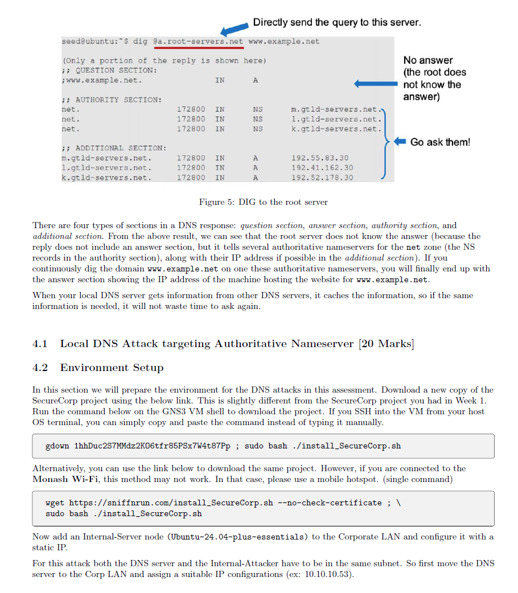

这份文件是《FIT3031 - 网络安全》课程的作业说明，内容如下：

1. **作业概述**：
   - 这项作业旨在让学生通过实际操作网络攻击（如TCP/UDP扫描和DNS攻击）来加深对如何发起这些攻击的理解。
   - 这是一项**个人作业**，不允许与他人合作或寻求帮助。
   - 作业必须在单位的虚拟环境中完成，不能重复使用任何之前的提交材料。
2. **提交要求**：
   - 你需要通过两个Moodle提交链接上传**四个文件**：
     - **提交链接 1**：一个视频文件，展示你完成第**3部分和第4部分**的所有任务。视频必须清晰，视频中的图像和文字需要使用**英文**，且必须可读。如果视频无法打开或无法访问，你将获得**零分**。
     - **提交链接 2**：三份Python脚本的最终版本（即 **tcp-scanner.py**，**udp-scanner.py** 和 **remote-dns.py**），这些脚本来自**第3部分**。
   - 提交文件命名格式必须遵循特定格式，例如：**HarryPotter-12345678-FIT3031-Assignment1.mp4**。
   - Moodle对提交文件的总大小限制为500MB，请确保所有文件的总大小不超过此限制。
3. **重要提示和处罚**：
   - 你有责任确保提交的视频文件能够在**标准Windows计算机**上打开（不需要特殊软件），并且视频中的图像和文本是可理解的。如果视频无法打开，你将得到**零分**。
   - **草稿文件**不接受提交，也不会被评分。只有最终版本会被评分。
   - 如果视频无法上传成功，你可能会得到**零分**。
   - 在提交过程中，**不要忽略任何Turnitin警告**，并确保你的文件不会错误地提交到Turnitin（Turnitin用于查重）。
   - 视频的开头部分必须**清晰显示你的面部**和**照片ID**（最好是Monash ID），并且ID必须**清晰可见**。

如果你需要进一步的解释或帮助，随时告诉我！


这份文件是《FIT3031 - 网络安全》作业的进一步说明，具体内容包括：

1. **视频要求**：
   - 提交的视频的某个角落必须清楚地展示你的面部。若视频中没有展示面部，作业将被视为无效，得零分。
2. **延迟提交**：
   - 延迟提交会根据提交的天数扣除分数。每迟交一天将扣除5分。例如，迟交2天1小时将扣除15分。超过7天迟交将直接得零分。
3. **申请延期或特别考虑**：
   - 如果需要延期或特别考虑，请参考 [Monash的延期申请和特别考虑政策链接](https://www.monash.edu/students/admin/assessments/extensions-special-consideration)。请注意，教学团队成员才有权批准延期或特别考虑，请勿直接联系其他人。
   - 在申请延期时，请从提供的下拉菜单中选择正确的评估名称，而不是手动输入评估名称。
4. **视频时长限制**：
   - 提交的视频最大时长为20分钟。如果视频超时，超出部分将不被计入评分。视频时长必须符合规定，否则可能会导致零分。
5. **设备要求**：
   - 如果设备没有摄像头或因其他原因无法使用，你可以借用Monash Connect或Library的设备。你有责任提前计划，Monash Connect或Library没有设备可借的情况不能作为有效的借口。
6. **视频编辑与合并**：
   - 你可以创建多个视频片段，并将它们合并成一个视频提交，确保最终提交的视频清晰且易于理解。
7. **任务演示要求**：
   - 任务必须通过演示的方式进行，而不是通过解释已经完成的任务。你不能使用预先准备的脚本来完成任务。
   - 你可以事先准备Python代码，但不能简单地复制粘贴命令来完成任务。你需要在执行任务时解释代码的作用。
8. **DNS攻击和长期录制**：
   - 在进行远程DNS攻击时，可能需要运行攻击一段很长的时间（几个小时）。你可以在录制时暂停攻击过程，等耗时较长的部分结束后再继续录制。你可以合并多个录制片段。
9. **学术诚信与抄袭政策**：
   - 对抄袭和学术不端行为实行零容忍政策。如果发现有违反Monash学术诚信政策的行为，将会得到零分，并且演示视频也将用于查重。
   - Monash学术诚信政策链接：[Monash学术诚信政策](https://www.monash.edu/students/academic/policies/academic-integrity)。

这些要求确保作业的提交符合规定，并确保你能够清楚地展示自己的工作和理解。如果有任何问题或需要更多帮助，请告知我！


这部分内容来自《FIT3031 - 网络安全》作业，具体讲解了端口扫描技术的相关要求与操作步骤：

### 3. 端口扫描技术（50分）

端口扫描是攻击者用来发现系统入口点的常见技术。这个任务侧重于网络流量分析和安全策略。通过以下步骤，学生将分析端口扫描中使用的扫描类型，并探索如何抵抗这些攻击。最终，学生将通过实现扫描器脚本来获得实际的经验。

### 3.1 环境设置

为了完成这个问题，你将使用一个新的网络拓扑。你需要在GNS3虚拟机的终端上运行以下命令以下载项目：

```
gdown 10IgcJxFfLd3k6iOuvVK9MAmU9yJqKhqG ; sudo bash ./install_A1-PortScanning.sh
```

如果你连接到了Monash Wi-Fi，下载可能无法工作。在这种情况下，建议使用手机热点。可以使用以下命令来下载项目：

```
wget https://sniffrun.com/install_A1-PortScanning.sh --no-check-certificate ; sudo bash ./install_A1-PortScanning.sh
```

图2展示了GNS3配置的网络拓扑，包含了多个攻击者和受害者服务器，攻击者通过外部交换机与防火墙连接。

### 操作步骤：

1. **下载并复制文件：**
   - 将**server.py**文件下载并复制到**Victim-Server**（受害者服务器）上。
   - 将**tcp-scanner.py**和**udp-scanner.py**文件下载并复制到其他外部攻击者服务器上。
2. **文件位置：**
   - 你需要确保将文件复制到**/home**目录中，这样即使系统重启，文件也不会丢失。
3. **运行Wireshark：**
   - 在**External-Switch**与**Firewall**之间连接Wireshark进行流量捕捉。
4. **运行脚本：**
   - 运行命令 `python3 server.py <你的学生ID>`。请确保使用你的**学生ID**，否则提交将被视为无效，且将无法获得分数。

### 注意事项：

- **IP地址和任务要求：**
  - **Victim-Server**有多个IP地址，每个IP地址具有不同的流量限制。每个任务需要使用不同的IP地址。使用错误的IP地址将使该任务无效，并且得不到分数。
- **学生ID的重要性：**
  - 在运行 `server.py` 时，必须使用正确的学生ID。使用错误的学生ID将导致提交无效，并且无法获得第4部分的分数。

### 总结：

1. 按照提供的命令下载并复制必要的文件。
2. 确保文件在正确的位置，并通过Wireshark捕捉网络流量。
3. 在执行 `server.py` 时，务必使用正确的学生ID。

如果有任何疑问或不清楚的地方，请随时问我！


这部分内容来自《FIT3031 - 网络安全》作业，具体包括了几个问题及其操作要求，具体解释如下：

### 3.2 问题 1：扫描TCP端口范围

- **任务**：运行 `tcp-scanner.py` 脚本来扫描Victim-Server的整个TCP端口范围，并观察Wireshark中的流量。

- **命令**：

  ```
  python3 tcp-scanner.py 200.2.4.10
  ```

- **要求**：根据Wireshark中观察到的流量，识别并描述扫描的类型，解释扫描是如何区分开放端口和关闭端口的。

  - 你需要说明TCP扫描的工作原理，通过流量示例展示如何区分开放端口和关闭端口（此部分得4分）。

- > 要完成这个问题并回答如何通过Wireshark观察流量来识别扫描类型，以及如何区分开放端口和关闭端口，我们可以按照以下步骤进行分析：
  >
  > ### 1. **运行脚本扫描端口**
  >
  > 首先，您需要执行命令 `python3 tcp-scanner.py 200.2.4.10` 来扫描目标服务器 `200.2.4.10` 的 TCP 端口。该脚本会向目标服务器的所有端口发送 **SYN** 包，等待 **SYN+ACK** 或 **RST** 响应，从而确定端口是否开放。
  >
  > ### 2. **分析Wireshark中的流量**
  >
  > 使用Wireshark来捕获扫描过程中产生的流量。在Wireshark中，您可以看到以下几种类型的TCP包：
  >
  > - **SYN** 包：这是发起端口扫描时发送的包，用于建立连接。
  > - **SYN+ACK** 包：表示目标端口是开放的，接收到了SYN包并响应。
  > - **RST** 包：表示目标端口是关闭的，目标服务器回复了一个复位包。
  >
  > ### 3. **区分开放端口与关闭端口**
  >
  > 通过Wireshark观察到的不同响应包，可以识别哪些端口是开放的，哪些是关闭的：
  >
  > #### 开放端口：
  >
  > - 当扫描脚本发送一个 **SYN** 包到某个端口时，目标服务器若响应一个 **SYN+ACK** 包，表示该端口是开放的。
  > - 这是因为目标服务器会回复一个 **SYN+ACK** 包来响应客户端的连接请求，表示准备好建立连接。
  > - 该时刻，扫描脚本再发送一个 **RST** 包以终止连接，防止真正建立连接。
  >
  > #### 关闭端口：
  >
  > - 如果目标端口关闭，目标服务器会响应一个 **RST** 包。
  > - 这是因为目标服务器没有接受连接请求，因此它会通过发送一个 **RST** 包来告知客户端端口不可达。
  >
  > ### 4. **Wireshark中的流量示例**
  >
  > 在Wireshark中，您可能会看到类似以下的流量：
  >
  > - **SYN包**（客户端发送到目标端口）：
  >
  >   ```
  >   TCP 发送方 -> 目标端口 SYN
  >   ```
  >
  > - **SYN+ACK包**（目标响应开放端口）：
  >
  >   ```
  >   目标端口 -> TCP 发送方 SYN+ACK
  >   ```
  >
  > - **RST包**（目标响应关闭端口）：
  >
  >   ```
  >   目标端口 -> TCP 发送方 RST
  >   ```
  >
  > ### 5. **TCP扫描的工作原理**
  >
  > - **SYN扫描**：扫描脚本会向目标的每个端口发送一个 **SYN** 包，尝试建立连接。根据收到的响应来判断端口状态：
  >   - 如果收到 **SYN+ACK**，则端口开放。
  >   - 如果收到 **RST**，则端口关闭。
  > - 这种扫描方式非常快速，因为它不需要完成三次握手的全部过程，只需发送 SYN 包并根据响应来判断。
  >
  > ### 6. **总结**
  >
  > 通过Wireshark观察流量，可以清楚地识别出扫描的类型和端口的状态：
  >
  > - **开放端口** 会返回 **SYN+ACK** 包，表示目标端口准备好接受连接。
  > - **关闭端口** 会返回 **RST** 包，表示该端口无法接受连接。
  >
  > 这种方式通过检测目标的响应来快速判断端口的开放状态，是 TCP 扫描的常见工作原理。

### 3.3 问题 2：检测端口扫描

- **任务**：端口扫描是网络安全中的关键问题，通常会显示恶意意图。监视来自同一源IP的多个请求到同一目标IP的流量，有助于发现端口扫描。
- **要求**：使用Wireshark识别并解释你观察到的 **其他三种流量模式**，这些模式可用于检测上述提到的TCP端口扫描类型。
  - 你需要解释如何使用流量模式来发现端口扫描（此部分得3分）。

- > ### 3.3 问题 2：检测端口扫描
  >
  > 端口扫描是网络安全中的一种常见攻击行为。通过监控网络流量中的异常模式，可以检测到端口扫描活动。Wireshark 是一种非常强大的流量分析工具，可以帮助我们识别这些异常模式。以下是通过Wireshark识别并解释的 **三种流量模式**，可以用来发现 TCP 端口扫描：
  >
  > ### 1. **SYN Flood（SYN洪泛攻击）**
  >
  > #### 流量特征：
  >
  > - **大量的SYN包**：攻击者向目标发送大量的 SYN 包，但不等待 **SYN+ACK** 响应，也不发送 **RST** 包来重置连接。
  > - **不完成握手**：这些 SYN 包会占用目标服务器的连接资源，因为目标服务器会为每个 SYN 包创建半开放连接（等待ACK），但是攻击者没有发送ACK来完成握手。
  > - **高频率的SYN请求**：来自同一源IP的多个SYN包发送到目标的不同端口，通常发送速率非常快。
  >
  > #### 如何通过Wireshark检测：
  >
  > - 你会在Wireshark中看到许多来自相同源IP的 **SYN** 包，发送到目标主机的不同端口。
  > - 目标主机回应每个 SYN 包 **SYN+ACK**，但是源IP没有发送 ACK 响应，导致连接没有被完全建立。
  > - 这种模式通常表明存在 **SYN Flood** 攻击或端口扫描，因为大量的 SYN 包会导致目标主机的资源被消耗完。
  >
  > #### 解决方案：
  >
  > - 检查是否存在大量来自同一源IP的 SYN 请求，这可能是端口扫描的标志。结合其他流量信息，如目标端口的响应，可以确定是否为端口扫描。
  >
  > ------
  >
  > ### 2. **连接数异常增加**
  >
  > #### 流量特征：
  >
  > - **短时间内大量连接**：在短时间内，来自同一源IP的多个连接请求（例如SYN包）发送到目标主机的不同端口。
  > - **多端口扫描**：源IP会尝试访问多个端口，一般是连续或非连续的端口范围。
  > - **频繁的TCP三次握手请求**：大量的SYN包被发送到目标的多个端口，而目标主机对每个端口返回 **SYN+ACK** 响应。
  >
  > #### 如何通过Wireshark检测：
  >
  > - 在Wireshark中，你将看到源IP向多个端口发送 **SYN** 包，且频繁出现 **SYN+ACK** 响应。
  > - 如果这些端口没有在正常通信中使用，并且这些请求发生在短时间内，且连接数异常增加，很可能是一个端口扫描。
  > - 在正常的流量中，连接请求的数量通常较少且分布更为均匀，而端口扫描会显示为大量的连接尝试。
  >
  > #### 解决方案：
  >
  > - 监视和计数来自同一源IP的连接请求。端口扫描时，可能在短时间内频繁尝试不同端口连接。如果观察到这种模式，可以进一步分析源IP的行为，确定是否为恶意端口扫描。
  >
  > ------
  >
  > ### 3. **异常的RST响应**
  >
  > #### 流量特征：
  >
  > - **大量的RST包**：在端口扫描过程中，目标主机会回应 **RST** 包，表示端口关闭或拒绝连接。当扫描目标端口时，如果端口关闭，目标会回复 **RST** 包，告知扫描方该端口不可达。
  > - **大量重复的RST包**：如果攻击者扫描了大量端口，且大多数端口不可达，目标会不断发送 **RST** 包。这种重复的 **RST** 包可能是一个端口扫描的标志。
  >
  > #### 如何通过Wireshark检测：
  >
  > - Wireshark中会看到大量来自目标的 **RST** 包，这些包是对大量 **SYN** 包的响应。对于扫描的每个端口，目标都会返回一个 **RST** 包（如果端口关闭），并且这些 **RST** 包会集中在某个时间段内。
  > - 如果 **RST** 包来自目标的多个端口，并且源IP地址与多个目标端口之间存在频繁的连接尝试（例如 **SYN** 包），这可能是端口扫描的迹象。
  >
  > #### 解决方案：
  >
  > - 监控目标发送的 **RST** 包的数量，尤其是它们是否集中在短时间内。如果大量的 **RST** 包出现在相同源IP和多个端口之间，可能是一个端口扫描的信号。
  >
  > ------
  >
  > ### 如何通过Wireshark来检测端口扫描总结：
  >
  > 通过Wireshark，我们可以识别出一些典型的端口扫描流量模式。这些模式包括：
  >
  > 1. **SYN洪泛（SYN Flood）**：大量来自同一源IP的SYN包发送到目标的多个端口，未完成握手。
  > 2. **连接数异常增加**：在短时间内，源IP尝试与目标主机的多个端口建立连接，且频繁的SYN请求和SYN+ACK响应。
  > 3. **大量的RST响应**：目标发送大量的RST包，表示端口不可达，通常是扫描端口关闭时的响应。
  >
  > 通过这些模式，Wireshark可以帮助我们识别端口扫描活动，并对可能的恶意行为进行警告。

### 3.4 问题 3：绕过端口扫描对策

- **任务**：攻击者常通过绕过端口扫描对策来避免检测。一种常见的对策是通过降低扫描速度，减慢扫描速度，从而更隐蔽。
- **要求**：解释并说明 **三种其他方式**，这些方式可以用于绕过上一问题中提到的TCP扫描对策。你需要明确说明哪种逃避技术对应哪个对策。
  - 注意：这些技巧是非法的，如果未经授权使用，理解这些技术对于增强安全防御非常重要（此部分得3分）。

- > ### 3.4 问题 3：绕过端口扫描对策
  >
  > 在网络安全中，攻击者经常使用一些技术来绕过端口扫描检测措施，从而避免被发现。对于防御端口扫描的对策，攻击者通常采取一些隐蔽的方式来规避检测。以下是 **三种绕过TCP端口扫描对策的方法**，每种方法对应一种检测对策，解释了这些逃避技术如何工作，以及它们如何绕过常见的端口扫描检测。
  >
  > ### 1. **降低扫描速度（慢速扫描）**
  >
  > #### 对策：**高频率的连接请求检测**
  >
  > 许多网络监控系统通过检测短时间内来自同一IP的高频连接请求来识别端口扫描。这些检测通常依赖于观察到的SYN包发送速率以及TCP三次握手的完成情况。
  >
  > #### 绕过方法：**慢速扫描（低速扫描）**
  >
  > 攻击者可以通过降低扫描速度，减缓扫描的频率来绕过这一检测。通过在每次连接请求之间增加时间间隔，攻击者可以避免触发基于频率的检测系统。
  >
  > - **实施方式**：攻击者可以通过在每次发送SYN包后添加随机延时（例如每个连接请求之间延迟几秒钟），使得扫描看起来像是正常的流量。
  > - **效果**：由于慢速扫描不会快速积累大量的连接请求，因此它不会在短时间内触发端口扫描检测机制。
  >
  > #### 安全防御：
  >
  > - 增加分析时间窗口，监控长时间内的连接行为。
  > - 使用行为分析来检测非常规的连接模式，如较低频率但持续的连接尝试。
  >
  > ------
  >
  > ### 2. **碎片化扫描**
  >
  > #### 对策：**基于数据包内容的深度分析（例如SYN包分析）**
  >
  > 许多网络入侵检测系统（NIDS）和防火墙通过检查每个TCP包的内容来识别异常的扫描模式。例如，扫描工具通常会生成具有特定标志位的SYN包（SYN + ACK）。如果大量的SYN包是从单一源IP发送的，NIDS系统可以轻松检测到这些恶意扫描活动。
  >
  > #### 绕过方法：**碎片化扫描**
  >
  > 攻击者通过将SYN包进行碎片化发送，绕过深度数据包分析。这是通过将一个完整的SYN包分成多个小碎片包发送给目标主机，使得每个小数据包看起来像正常的流量，并且不会被防火墙或入侵检测系统（IDS）立即识别。
  >
  > - **实施方式**：攻击者将TCP连接请求（SYN包）拆分成多个小碎片包，在网络上传输时，防火墙和IDS系统无法直接对这些碎片包进行完整的分析。
  > - **效果**：碎片化扫描使得扫描流量不易被常规的端口扫描检测机制捕获，防火墙和IDS系统需要进行更复杂的重组分析才能发现这些扫描。
  >
  > #### 安全防御：
  >
  > - 启用深度包检查（DPI）以分析碎片化的数据包。
  > - 配置防火墙和入侵检测系统，以识别和重组碎片化的IP数据包。
  > - 限制每个端口接收的数据包大小和碎片化度。
  >
  > ------
  >
  > ### 3. **使用不同协议（如ICMP或UDP）进行扫描**
  >
  > #### 对策：**基于TCP连接请求的检测**
  >
  > 大多数端口扫描会通过发送TCP SYN包来探测端口状态。监控系统通常会通过检测大量的TCP连接请求（SYN包）来识别扫描活动。
  >
  > #### 绕过方法：**使用非TCP协议进行扫描（如ICMP或UDP扫描）**
  >
  > 攻击者可以使用其他协议，如ICMP（通常用于ping操作）或UDP来扫描端口，而不依赖TCP协议。这种方法会绕过基于TCP连接请求的检测，因为ICMP和UDP并不涉及TCP三次握手过程。
  >
  > - **ICMP扫描**：攻击者可以发送ICMP Echo请求（ping）到目标系统，判断主机是否存活，或者利用ICMP的 **Destination Unreachable** 信息来间接判断目标端口的状态。
  > - **UDP扫描**：攻击者可以通过发送UDP数据包到目标主机的特定端口，然后根据目标是否回应 **ICMP Port Unreachable** 消息来判断端口是否开放。
  > - **实施方式**：使用自定义的扫描工具（例如 `nmap`）来执行ICMP或UDP扫描，绕过只检测TCP SYN包的检测系统。
  > - **效果**：由于ICMP和UDP扫描不涉及TCP三次握手，它们不容易被基于TCP协议的端口扫描检测对策识别。
  >
  > #### 安全防御：
  >
  > - 配置防火墙和入侵检测系统（IDS）来检测ICMP和UDP协议的异常流量。
  > - 对UDP流量进行检测和分析，识别不寻常的端口请求模式。
  > - 限制ICMP包的使用，防止非授权的ICMP请求泄露网络信息。
  >
  > ------
  >
  > ### 总结：绕过端口扫描对策的方法
  >
  > 攻击者常用以下三种技术来绕过端口扫描检测：
  >
  > 1. **降低扫描速度**：通过减缓扫描速率，减少每秒发送的连接请求，避免触发频率检测系统。
  > 2. **碎片化扫描**：将SYN包分片，使得每个数据包不容易被深度分析的防火墙或入侵检测系统捕捉。
  > 3. **使用不同协议（ICMP/UDP）**：绕过基于TCP协议的检测，使用其他协议进行端口扫描（如ICMP或UDP），这些协议通常不参与TCP三次握手，因此难以被传统的TCP端口扫描检测机制捕捉。
  >
  > 这些绕过技术的目的是通过隐蔽流量模式和规避常见的检测对策，避免被安全防护系统发现。对于网络安全防御者来说，理解这些技术并实施有效的检测和防护措施，对于提高网络安全性至关重要。

### 3.5 问题 4：优化端口扫描

- **任务**：受害者的组织观察到大量端口扫描，采取了每源IP每秒100个连接的流量限制。你需要通过修改 `tcp-scanner.py` 脚本来优化扫描过程，避开防火墙的速率限制。

- **命令**：

  ```
  python3 tcp-scanner.py 200.2.4.11 --conns-per-batch 100
  ```

- **要求**：

  - 扫描所有65,535个端口需要更长时间。使用 `--conns-per-batch` 参数来定义每秒执行多少个并行工作，每个工作扫描一个端口。
  - 你必须扫描完整的TCP端口范围（0-65535）来完成这个任务，并且扫描要在演示期间完成。
  - 你不能修改扫描过程中显示的时间。
  - 禁止在视频中编辑，任务完成时所有开放端口应显示在控制台上。
  - **外部攻击者**可以使用多个客户端，但必须通过相同的扫描脚本并在同一台机器上执行。
  - 如果你的IP被黑名单，源IP将被防火墙列入黑名单2分钟。

### 操作步骤总结：

1. **问题 1**：运行 `tcp-scanner.py` 扫描Victim-Server的TCP端口，并通过Wireshark分析流量来区分开放端口和关闭端口。
2. **问题 2**：观察Wireshark中的其他流量模式，识别用于检测端口扫描的其他模式。
3. **问题 3**：解释并应用三种绕过端口扫描对策的技术。
4. **问题 4**：优化扫描，使用 `--conns-per-batch` 参数来加快扫描速度并避免速率限制，完成对200.2.4.11 IP的扫描。

> ### 3.5 问题 4：优化端口扫描
>
> #### 任务说明：
>
> 受害者组织的防火墙已实施速率限制，每秒允许每个源IP最多进行 **100个连接请求**。我们的目标是优化端口扫描过程，以避开该速率限制，同时确保能够扫描完整的TCP端口范围（0-65535）并在合理的时间内完成扫描。
>
> ### 解决方案概述：
>
> 要避免防火墙的速率限制，我们可以通过以下方法优化扫描脚本：
>
> 1. **使用多个源IP**：将扫描请求分布到多个客户端/源IP上，每个客户端以较低的速率进行扫描，从而避免单个IP被限制。
> 2. **增加并发性和延迟**：调整每秒的并发连接数，确保每秒发送的连接数不超过防火墙限制的100个连接。
> 3. **优化批量扫描**：通过调整 `--conns-per-batch` 参数，优化扫描的并发执行和时间分配。
>
> ### 1. **调整 `--conns-per-batch` 参数**
>
> 根据题目要求，扫描需要完成 **65,535个端口**，并且不能超过每秒100个连接。为了在扫描时避免触发防火墙的流量限制，可以将每秒的连接数限制在100个。使用 `--conns-per-batch` 参数，我们可以控制每次扫描时并发发送的连接数。
>
> 在这种情况下，`--conns-per-batch` 设置为 **100** 允许每秒最多发送100个连接请求。因此，我们可以按以下步骤优化脚本。
>
> ```bash
> python3 tcp-scanner.py 200.2.4.11 --conns-per-batch 100
> ```
>
> 这样每秒最多发起100个端口扫描，每个批次扫描最多100个端口。
>
> ### 2. **优化端口扫描批次的划分**
>
> 对于 65,535 个端口，按照每秒最多100个端口的限制来分批扫描，我们需要划分这些端口并合理安排扫描的进度。每个批次将扫描100个端口，因此总共需要 **655个批次** 来完成整个扫描（65,535 ÷ 100 = 655.35）。
>
> 由于每个批次的扫描请求都会在 **1秒钟** 内发送，我们将 **每秒扫描100个端口**，持续发送直到扫描完成。
>
> ### 3. **避免流量限制的其他方法**
>
> 除了调整 `--conns-per-batch` 参数外，还可以采取以下几种方式进一步优化扫描并避开防火墙限制：
>
> #### A. **分布式扫描（多个源IP）**
>
> 如果可以使用多个客户端机器执行扫描，可以让每个客户端扫描不同的端口范围，并将结果集中。这样，扫描流量分布在多个源IP上，每个源IP的连接数都不会超过100个，从而避免单个IP被防火墙列入黑名单。
>
> 例如，假设有两个客户端，分别扫描不同的端口范围：
>
> - 客户端1 扫描端口范围：0-32767
> - 客户端2 扫描端口范围：32768-65535
>
> 每个客户端每秒发送100个请求，因此不会超过防火墙的限制。
>
> #### B. **增加扫描延迟（低速扫描）**
>
> 虽然每秒扫描100个端口已经符合防火墙的限制，但有时可以稍微增加扫描延迟，以减少扫描频率，从而让防火墙更难检测到扫描模式。例如，可以在每个批次扫描完成后，增加短暂的随机延时（如0.1秒到1秒之间的延时），减少源IP的连接频率。
>
> 这可以通过在脚本中对每次批次扫描后的发送请求时间做随机延时来实现，进一步避免触发防火墙的检测。
>
> ### 4. **示例修改**
>
> 基于上述策略，修改后的扫描命令可能如下所示：
>
> ```bash
> python3 tcp-scanner.py 200.2.4.11 --start-port 0 --end-port 65535 --conns-per-batch 100 --tail-wait 2.0
> ```
>
> - `--start-port 0 --end-port 65535`：确保扫描整个端口范围（0到65535）。
> - `--conns-per-batch 100`：限制每秒发送100个连接请求，避免超过防火墙的速率限制。
> - `--tail-wait 2.0`：确保在扫描结束后保留2秒的延时，以便捕捉所有可能的延迟响应。
>
> ### 5. **结论**
>
> 通过使用 `--conns-per-batch` 参数，我们能够确保每秒发送不超过100个端口扫描请求，从而避开防火墙的流量限制。为了进一步提高扫描效率和避免被黑名单封锁，攻击者可以使用多个源IP和/或增加批次之间的延时来分散流量。
>
> 通过合理优化脚本和使用多个客户端，我们能够在确保不被检测的情况下，完成对整个65,535个TCP端口的扫描，同时避免防火墙的流量限制。
>
> **警告：**这些技术在未经授权的情况下进行端口扫描是非法的。学习这些技术的目的是提高对网络攻击的防范能力。


这部分内容是《FIT3031 - 网络安全》作业中的进一步问题要求，具体内容如下：

### 3.6 问题 5：增强网络安全

- **任务**：组织的网络安全团队决定实施额外的防火墙控制，阻止服务器上的TCP扫描。你需要识别这些防火墙限制，并修改扫描以绕过它们。修改后的扫描应能够识别所有开放和关闭端口。
- **IP地址**：这项任务的限制IP地址为 **200.2.4.12**，你应该在该IP地址上进行扫描。
- **要求**：展示扫描的修改，并解释你是如何修改扫描的（此部分得5分）。
- > ### 3.6 问题 5：增强网络安全
  >
  > #### 任务说明：
  >
  > 组织的网络安全团队已经在目标服务器上实施了额外的防火墙控制，旨在阻止常规的TCP扫描。我们需要识别这些防火墙限制，并修改扫描过程，使其能够绕过防火墙，并完成所有端口的扫描，识别开放和关闭的端口。
  >
  > #### 要求：
  >
  > - 修改扫描以绕过防火墙的限制。
  > - 扫描目标IP地址 **200.2.4.12**。
  > - 展示扫描的修改，并解释如何通过修改使扫描能够绕过防火墙限制。
  >
  > ### 解决方案概述：
  >
  > 为了绕过防火墙的限制，我们可以采用一些常见的技术来隐蔽地进行端口扫描。通常，防火墙控制可能会基于以下策略来阻止端口扫描：
  >
  > 1. **频繁的连接尝试**：防火墙可能会阻止大量来自单一源IP的连接请求。
  > 2. **TCP连接标志检测**：防火墙可能会检测常见的端口扫描模式，如SYN扫描。
  > 3. **流量模式分析**：防火墙可能会识别不正常的流量模式，如连续的大量SYN包。
  >
  > 要绕过这些限制，我们可以使用以下技术：
  >
  > ### 1. **使用UDP扫描绕过TCP检测**
  >
  > 防火墙通常会检测到大量的SYN包（用于TCP端口扫描），但它们不一定对UDP扫描有检测机制。通过发送UDP包代替TCP的SYN包，可以绕过基于TCP的端口扫描检测。
  >
  > #### 修改：使用UDP协议进行扫描
  >
  > 我们可以修改脚本，选择使用UDP协议进行扫描，而不是TCP协议。UDP端口扫描不需要进行TCP三次握手，因此它不会触发基于SYN包的防火墙检测。
  >
  > - **使用UDP扫描**：攻击者可以向目标的各个端口发送UDP数据包，观察是否收到**ICMP Port Unreachable**消息。若收到此消息，说明端口关闭；如果没有收到响应，端口通常是开放的。
  >
  > #### 示例命令：
  >
  > 在 `tcp-scanner.py` 脚本中，您可以修改为 UDP 扫描。例如，使用 `nmap`（一个强大的扫描工具）来进行UDP扫描：
  >
  > ```bash
  > nmap -sU -p 1-65535 200.2.4.12
  > ```
  >
  > - `-sU`：使用UDP扫描。
  > - `-p 1-65535`：扫描所有端口。
  > - `200.2.4.12`：目标IP地址。
  >
  > 
  >
  > ### 2. **使用分布式扫描（多个源IP）**
  >
  > 为了避免被防火墙基于源IP的速率限制检测，我们可以使用多个源IP进行扫描。通过分布式扫描，可以将流量分散到多个源IP，每个源IP的连接请求都在防火墙的限制之内，防止单一IP被列入黑名单。
  >
  > #### 修改：分布式扫描
  >
  > 如果可以使用多个客户端，攻击者可以将端口扫描任务分配到不同的源IP上，每个源IP扫描不同的端口范围。这样，每个源IP每秒发送的连接数就可以保持在防火墙的限制之下，避免触发防火墙的速率限制。
  >
  > 例如，客户端1可以扫描端口1-32767，客户端2可以扫描端口32768-65535。
  >
  > #### 示例命令：
  >
  > 假设有两个客户端分别负责扫描不同的端口范围：
  >
  > 客户端1：
  >
  > ```bash
  > python3 tcp-scanner.py 200.2.4.12 --start-port 1 --end-port 32767 --conns-per-batch 100
  > ```
  >
  > 客户端2：
  >
  > ```bash
  > python3 tcp-scanner.py 200.2.4.12 --start-port 32768 --end-port 65535 --conns-per-batch 100
  > ```
  >
  > ### 3. **增加扫描延时（低速扫描）**
  >
  > 如果防火墙检测到短时间内发起大量连接请求，它可能会触发警报并阻止源IP。因此，我们可以增加扫描的延迟，在每个批次之间加入随机的延时，使扫描变得更加隐蔽。
  >
  > #### 修改：增加扫描延时
  >
  > 通过在每次批次扫描后添加随机延时，攻击者可以避免扫描流量过于集中，减少被防火墙检测的机会。延时可以是固定的，也可以是随机的。这样扫描请求就不会集中在短时间内触发防火墙的检测规则。
  >
  > 例如，设置每次批次后随机等待0.1秒到1秒之间的时间，避免过于规律的流量模式。
  >
  > #### 示例修改：
  >
  > 在 `tcp-scanner.py` 脚本中，增加一个随机延时参数：
  >
  > ```python
  > import random
  > import time
  > 
  > # 每批次后随机等待时间
  > def scan_with_delay(batch):
  >     delay = random.uniform(0.1, 1.0)  # 随机延时
  >     send(batch)
  >     time.sleep(delay)  # 增加延时，避免快速扫描触发防火墙
  > ```
  >
  > ### 4. **混淆扫描标志（如使用FIN扫描、Xmas扫描等）**
  >
  > 为了绕过基于TCP连接标志（如SYN标志）的检测，攻击者可以使用其他TCP标志来发送扫描数据包。例如，**FIN扫描**和**Xmas扫描**可以绕过传统的防火墙和入侵检测系统，因为这些扫描类型通常不会建立正常的TCP连接。
  >
  > #### 修改：使用不同的TCP标志
  >
  > - **FIN扫描**：通过发送带有FIN标志的TCP包，攻击者可以检测端口是否关闭。如果目标端口关闭，通常会返回RST包；如果端口开放，目标通常不会回应。
  > - **Xmas扫描**：发送带有FIN、PSH、URG标志的包，许多防火墙和IDS会忽略这些包。
  >
  > #### 示例命令：
  >
  > 使用 `nmap` 执行FIN扫描：
  >
  > ```bash
  > nmap -sF -p 1-65535 200.2.4.12
  > ```
  >
  > 使用Xmas扫描：
  >
  > ```bash
  > nmap -sX -p 1-65535 200.2.4.12
  > ```
  >
  > ### 5. **总结**
  >
  > 为了绕过防火墙对TCP扫描的限制，采取以下策略：
  >
  > 1. **使用UDP扫描**：避免触发基于TCP的防火墙规则。
  > 2. **分布式扫描**：通过多个源IP来分散扫描流量，避免单一IP被限制。
  > 3. **增加扫描延时**：增加批次之间的随机延时，减少被检测到的风险。
  > 4. **使用不同的TCP扫描标志**：如FIN扫描和Xmas扫描，绕过基于SYN包的扫描检测。
  >
  > 这些方法可以显著提高绕过防火墙的能力，并完成对目标服务器（200.2.4.12）所有端口的扫描。

### 3.7 问题 6：UDP端口扫描

- **任务**：运行 `udp-scanner.py` 脚本，扫描前100个UDP端口，并观察Wireshark中的流量。

  - **命令**：

    ```
    python3 udp-scanner.py 200.2.4.10 --end-port 100
    ```

- **要求**：解释扫描如何操作，并通过流量示例说明扫描是如何区分开放端口和关闭端口的（此部分得2分）。

- > ### 3.7 问题 6：UDP端口扫描
  >
  > #### 任务描述：
  >
  > 您需要运行 `udp-scanner.py` 脚本，扫描 **前100个UDP端口**，并观察 Wireshark 中的流量。通过观察Wireshark中的流量，您需要解释 UDP 扫描是如何工作的，并说明如何区分开放端口和关闭端口。
  >
  > #### 运行命令：
  >
  > ```bash
  > python3 udp-scanner.py 200.2.4.10 --end-port 100
  > ```
  >
  > 该命令会扫描 **目标IP 200.2.4.10** 上的前100个UDP端口。
  >
  > ### 1. **UDP端口扫描原理**
  >
  > UDP端口扫描的工作原理与TCP扫描有所不同。TCP连接需要进行三次握手（SYN，SYN+ACK，ACK），而UDP是无连接的协议。因此，在UDP扫描中，不需要建立连接。扫描器只需要发送UDP数据包到目标端口，并根据目标的响应来判断端口的状态。
  >
  > #### 扫描步骤：
  >
  > - **发送UDP数据包**：扫描脚本会向目标的每个UDP端口发送一个UDP数据包。
  > - **响应处理**：
  >   - 如果目标端口 **开放**，目标设备通常不会返回任何响应。
  >   - 如果目标端口 **关闭**，目标设备通常会返回一个 **ICMP Port Unreachable** 消息（ICMP类型3，代码3），表示该端口不可达。
  >
  > 因此，扫描器通过是否收到 **ICMP Port Unreachable** 响应来判断端口是否关闭。没有响应通常表示端口开放。
  >
  > ### 2. **Wireshark中的流量观察**
  >
  > 在Wireshark中，您会看到从源主机到目标主机的UDP数据包流量。您需要根据是否收到 **ICMP Port Unreachable** 响应来判断端口的状态。
  >
  > #### 开放端口：
  >
  > - **没有响应**：如果目标端口开放，通常不会有响应。这是因为UDP是无连接的协议，且目标主机并不总是回应空的UDP数据包（即没有应用层协议来回应）。
  >
  >   Wireshark流量示例：
  >
  >   - **发送的UDP包**：`UDP 送出 (目标端口) -> 目标主机`
  >   - **没有响应**：如果目标端口开放，则不会看到任何响应数据包。
  >
  > #### 关闭端口：
  >
  > - **收到ICMP Port Unreachable消息**：如果目标端口关闭，目标主机会发送一个 **ICMP Port Unreachable** 消息来告知源主机端口无法访问。这是一个ICMP类型为3、代码为3的消息。
  >
  >   Wireshark流量示例：
  >
  >   - **发送的UDP包**：`UDP 送出 (目标端口) -> 目标主机`
  >   - **响应的ICMP包**：`ICMP Type 3, Code 3 (Port Unreachable)` 返回到源主机，表示端口关闭。
  >
  > #### Wireshark流量分析示例：
  >
  > 假设您正在扫描UDP端口50，并且目标端口50是关闭的：
  >
  > 1. **发送UDP数据包**：Wireshark中会显示源主机发送的一个UDP数据包到目标主机的端口50。
  >
  >    ```
  >    Source -> Destination: UDP, Src Port: [Random], Dst Port: 50
  >    ```
  >
  > 2. **收到ICMP Port Unreachable响应**：如果端口50关闭，Wireshark中会看到目标主机返回的 **ICMP Port Unreachable** 消息。
  >
  >    ```
  >    Destination -> Source: ICMP, Type: 3 (Destination Unreachable), Code: 3 (Port Unreachable)
  >    ```
  >
  > 3. **如果端口50开放**，目标主机通常不会回应UDP数据包。因此，在Wireshark中，您不会看到任何来自目标端口50的响应。
  >
  > ### 3. **总结**
  >
  > 通过Wireshark观察UDP端口扫描的流量，可以区分开放端口和关闭端口：
  >
  > - **开放端口**：没有响应（目标主机不发送ICMP响应）。
  > - **关闭端口**：收到 **ICMP Port Unreachable** 消息，表示端口不可达。
  >
  > 这种方式利用了UDP协议的无连接特性，避免了TCP三次握手的过程，快速地识别目标端口的开放与关闭状态。

### 3.8 问题 7：结果匹配与解释

- **任务**：将扫描器的结果与服务器上的实际开放端口进行匹配。你需要使用Wireshark中的观察结果来验证这个匹配是否正确，并解释原因。
  - 运行 `udp-scanner.py` 脚本时，使用不同的参数，不修改脚本内容，以减少扫描结果中的假阳性。
  - **要求**：提供详细的解释，阐明如何使用不同的参数来减少假阳性（此部分得4分）。

- > ### 3.8 问题 7：结果匹配与解释
  >
  > #### 任务描述：
  >
  > 你需要运行 `udp-scanner.py` 脚本来扫描目标服务器上的UDP端口，并将扫描器的结果与服务器上实际开放的端口进行匹配。为了减少扫描结果中的假阳性，你需要使用 **不同的参数**，以优化扫描结果。
  >
  > 通过Wireshark观察扫描流量，验证结果是否与目标服务器实际开放的端口相符，并解释如何通过调整参数来减少假阳性。
  >
  > ------
  >
  > ### 1. **假阳性的定义及问题**
  >
  > 假阳性是指扫描工具报告某个端口开放，实际上该端口是关闭的。这是端口扫描中的常见问题，特别是在UDP扫描中，因为UDP是无连接的协议，许多防火墙和网络设备可能会丢弃或者不响应UDP数据包。没有响应的UDP端口可能被误判为“开放端口”，这就是假阳性。
  >
  > 减少假阳性的目的是确保扫描结果更准确，更可靠。假阳性通常是由于扫描过程中缺乏足够的反馈或响应而产生的误报。
  >
  > ### 2. **减少假阳性的技术**
  >
  > 为了减少UDP扫描中的假阳性，我们可以采取以下方法，调整脚本中的参数或使用其他网络分析方法来优化扫描过程。
  >
  > ### 3. **使用不同的参数减少假阳性**
  >
  > #### A. **增加端口扫描延迟**
  >
  > 在UDP扫描中，如果没有响应，这通常会导致假阳性（假定端口开放）。如果扫描的速度太快，UDP数据包可能未能到达目标，或者目标未能及时响应，从而误判端口为开放。通过增加端口扫描之间的延迟，您可以确保每个UDP数据包有足够的时间到达目标并得到响应。
  >
  > - **如何调整**：增加每个扫描批次之间的延迟。例如，您可以使用 `--delay` 参数来在每个批次发送之间添加适当的延迟，避免过快发送数据包，减少目标设备未响应的情况。
  >
  > #### 示例：
  >
  > ```bash
  > python3 udp-scanner.py 200.2.4.10 --end-port 100 --delay 0.2
  > ```
  >
  > 在此命令中，`--delay 0.2` 表示每次扫描的延迟为0.2秒。这为UDP包的响应提供了更多时间，减少了由于快速扫描而未能接收响应的情况。
  >
  > #### B. **使用分批次扫描**
  >
  > 使用分批次的方式来扫描端口，而不是一次性扫描所有端口，能避免对目标设备造成过大的负载，从而有助于提高响应率，减少未响应的端口（可能导致假阳性）。当批次较小且扫描速度较慢时，目标设备有更大的机会对每个端口做出响应。
  >
  > - **如何调整**：将扫描批次分成较小的部分，每个批次扫描较少的端口。可以使用 `--conns-per-batch` 参数来调整每秒扫描的端口数。
  >
  > #### 示例：
  >
  > ```bash
  > python3 udp-scanner.py 200.2.4.10 --end-port 100 --conns-per-batch 20
  > ```
  >
  > 在此命令中，`--conns-per-batch 20` 表示每秒扫描20个端口。分批扫描能够减少一次性请求的压力，有助于更精确地捕获目标端口的状态。
  >
  > #### C. **确保完整的响应检测**
  >
  > UDP扫描时，开放端口通常不会响应任何数据包，而关闭端口会返回 **ICMP Port Unreachable** 消息。如果没有收到响应，扫描工具可能会将该端口误判为开放。因此，我们需要确保扫描工具能够正确捕获ICMP消息，以便识别关闭端口。
  >
  > - **如何调整**：在扫描过程中，增加对ICMP消息的解析能力，确保能够准确地识别来自目标设备的ICMP **Port Unreachable** 响应，避免将没有响应的端口误判为开放。
  >
  > #### D. **减少网络延迟和丢包影响**
  >
  > UDP数据包在传输过程中可能会受到丢包、延迟等因素的影响。如果在扫描期间遇到网络延迟或数据包丢失，目标设备可能无法及时响应，这可能导致假阳性。
  >
  > - **如何调整**：通过确保网络连接稳定，并在有高延迟的环境下使用更长的扫描间隔来减少扫描的假阳性。
  >
  > #### 示例：
  >
  > ```bash
  > python3 udp-scanner.py 200.2.4.10 --end-port 100 --delay 0.5
  > ```
  >
  > 此命令中的 `--delay 0.5` 使得扫描过程中每个批次的延迟时间更长，适用于网络延迟较高的情况，能帮助目标设备更好地响应。
  >
  > ------
  >
  > ### 4. **如何验证扫描结果与实际开放端口匹配**
  >
  > 在运行 `udp-scanner.py` 脚本扫描端口时，使用 **Wireshark** 观察 UDP 流量。Wireshark能够捕捉扫描过程中发出的UDP数据包，并能够显示从目标主机返回的响应。
  >
  > #### **步骤1：观察UDP数据包**
  >
  > 1. 打开Wireshark，开始捕捉目标IP（`200.2.4.10`）的流量。
  > 2. 在Wireshark中过滤UDP流量，可以使用过滤器 `udp` 来只显示UDP数据包。
  >
  > #### **步骤2：查看响应**
  >
  > - **开放端口**：如果端口开放，您不会在Wireshark中看到任何响应。Wireshark会显示您发送的UDP数据包，但没有返回的响应数据包。
  >
  >   **Wireshark示例：**
  >
  >   ```
  >   Source -> Destination: UDP, Src Port: [Random], Dst Port: [Open Port]
  >   ```
  >
  > - **关闭端口**：如果端口关闭，您会看到目标设备发送的 **ICMP Port Unreachable** 消息，Wireshark会显示该响应。
  >
  >   **Wireshark示例：**
  >
  >   ```
  >   Destination -> Source: ICMP, Type: 3 (Destination Unreachable), Code: 3 (Port Unreachable)
  >   ```
  >
  > #### **步骤3：比较扫描结果**
  >
  > 通过Wireshark观察的UDP流量，您可以与 `udp-scanner.py` 脚本扫描的结果进行对比。如果扫描结果报告某个端口开放，但Wireshark中没有任何响应数据包返回，则该端口可能被误判为开放。相反，如果扫描结果报告端口关闭，而Wireshark中确实收到 ICMP Port Unreachable 响应，那么该结果是准确的。
  >
  > ------
  >
  > ### 5. **总结**
  >
  > 通过使用不同的参数，您可以减少UDP扫描中的假阳性：
  >
  > 1. **增加扫描延迟**：确保目标设备有足够时间来响应数据包。
  > 2. **分批次扫描**：减少每次扫描的端口数量，避免压力过大。
  > 3. **确保响应检测**：正确捕捉ICMP响应，减少由于丢包或未响应而导致的假阳性。
  > 4. **网络延迟管理**：对于高延迟环境，增加扫描间隔，避免误判。
  >
  > 通过Wireshark观察流量，您可以验证扫描结果的准确性，并进一步分析是否存在假阳性。

### 3.9 问题 8：假阳性分析

- **任务**：在前一个问题中运行的扫描后，使用下面的IP地址运行相同的扫描。你是否还观察到较少的假阳性？如果有，解释原因并用Wireshark支持你的解释。

  - **命令**：

    ```
    python3 udp-scanner.py 200.2.4.13 --end-port 100
    ```

- **要求**：解释扫描结果，并提供Wireshark证据，说明为什么某些端口会被标记为假阳性（此部分得5分）。

- > ### 3.9 问题 8：假阳性分析
  >
  > #### 任务描述：
  >
  > 在 **前一个问题** 中运行的 UDP 扫描结果后，使用下面的 **IP地址 200.2.4.13** 运行相同的扫描：
  >
  > ```bash
  > python3 udp-scanner.py 200.2.4.13 --end-port 100
  > ```
  >
  > 你需要分析该扫描结果，并判断是否观察到较少的假阳性。如果有，请解释为什么会出现这种情况，并通过 Wireshark 支持你的解释。
  >
  > #### 1. **假阳性的定义**
  >
  > 假阳性指的是扫描工具报告某个端口开放，而实际上该端口是关闭的。在 UDP 扫描中，假阳性通常发生在没有收到任何响应的情况下，这些端口可能会被误判为开放的。UDP 是无连接的协议，很多情况下，目标设备对于没有实际应用的 UDP 数据包不会做任何回应，而这可能被扫描工具解释为端口开放。
  >
  > #### 2. **假阳性发生的原因**
  >
  > 在 UDP 扫描中，假阳性发生的常见原因是目标端口没有及时响应扫描数据包。UDP 是一个无连接协议，它不像 TCP 那样有三次握手的过程，因此目标主机可能根本不会响应发送到某些端口的数据包。在这种情况下，如果目标端口没有响应，扫描工具会将该端口标记为开放。实际情况可能是目标端口关闭，或者目标设备忽略了扫描包。
  >
  > #### 3. **为什么假阳性较少？**
  >
  > 假阳性减少的原因可能有以下几种：
  >
  > 1. **目标服务器响应策略变化**：
  >    - 如果目标主机（200.2.4.13）有更好的安全配置，可能会及时对接收到的 UDP 数据包做出响应（例如，对于关闭的端口，它可能返回 **ICMP Port Unreachable** 消息）。这能够减少未响应的端口导致的假阳性。
  > 2. **网络配置变化**：
  >    - 如果与目标服务器的网络连接较好，UDP 数据包的丢包率较低，目标设备有更大的概率回应来自扫描的包。减少丢包意味着更少的未响应端口，减少假阳性。
  > 3. **防火墙或网络设备配置**：
  >    - 在某些网络环境中，防火墙或网络设备可能会针对来自未知源IP的流量进行某些特殊处理（例如，丢弃不重要的UDP数据包，或者在端口关闭时返回 ICMP 消息）。如果目标主机对特定端口的 UDP 请求有更严格的检测，可能会减少假阳性的发生。
  > 4. **目标服务器的配置不同**：
  >    - 如果目标主机配置了响应策略（例如，关闭的端口会立即返回 **ICMP Port Unreachable**），则扫描器能够及时识别关闭端口，并减少假阳性。相比之下，某些主机可能会忽略 UDP 请求或不会回复 ICMP 消息，导致扫描工具错误地将端口标记为开放。
  >
  > #### 4. **Wireshark证据支持**
  >
  > 为了验证假阳性减少的原因，我们可以使用 Wireshark 进行流量捕捉，并观察扫描过程中是否有显著的 **ICMP Port Unreachable** 消息（表示端口关闭）或没有响应的 UDP 数据包（可能导致假阳性）。
  >
  > #### 步骤：
  >
  > 1. **启动Wireshark**：在目标主机 **200.2.4.13** 的网络上使用 Wireshark 进行流量捕捉，过滤条件设置为 **udp**，以观察所有与 UDP 扫描相关的流量。
  >
  > 2. **执行UDP扫描**：运行以下命令来扫描目标的前100个UDP端口。
  >
  >    ```bash
  >    python3 udp-scanner.py 200.2.4.13 --end-port 100
  >    ```
  >
  > 3. **观察Wireshark中的流量**：
  >
  >    - 观察从 **扫描主机** 到 **目标主机（200.2.4.13）** 的 UDP 请求。
  >    - 如果目标端口关闭，应该能看到目标主机发送的 **ICMP Port Unreachable** 消息，表明该端口关闭。
  >    - 如果没有任何响应数据包，或者没有收到 **ICMP Port Unreachable** 消息，这些端口将被扫描器误判为开放端口。
  >
  > #### Wireshark流量示例：
  >
  > - **UDP请求**（发送到目标端口）：
  >
  >   ```
  >   Source -> Destination: UDP, Src Port: [Random], Dst Port: [Target Port]
  >   ```
  >
  > - **收到 ICMP Port Unreachable 响应**（表示端口关闭）：
  >
  >   ```
  >   Destination -> Source: ICMP, Type: 3 (Destination Unreachable), Code: 3 (Port Unreachable)
  >   ```
  >
  > - **没有响应**（可能导致假阳性）：
  >
  >   - 如果目标端口没有响应，Wireshark中将只显示发送的 **UDP请求**，没有任何回复。
  >
  > #### 5. **解释与分析**
  >
  > - 如果在扫描时，Wireshark中频繁出现 **ICMP Port Unreachable** 响应，表示目标主机对于关闭端口正确地返回了响应。这将有助于扫描器正确识别关闭端口，并减少假阳性。
  > - 如果某些端口没有响应，这可能会被误判为开放端口。Wireshark中的流量捕捉可以帮助我们确认这些端口是否没有响应，导致扫描工具错误地将其标记为开放。
  >
  > 通过Wireshark观察，您可以提供实际的捕获数据来支持您的解释，说明哪些端口没有响应，哪些端口收到了 **ICMP Port Unreachable** 消息。
  >
  > #### 6. **总结**
  >
  > 在目标主机 **200.2.4.13** 上运行扫描时，假阳性可能减少的原因包括：
  >
  > 1. 目标主机对关闭的端口返回 **ICMP Port Unreachable** 消息，使扫描器能够准确识别端口状态。
  > 2. 网络配置的变化导致丢包较少，扫描包能够顺利到达目标设备并得到响应。
  > 3. 防火墙和其他网络设备的响应策略可能更严格，从而减少了假阳性的发生。
  >
  > 通过 Wireshark 捕捉到的 ICMP 响应或缺乏响应的 UDP 数据包，您可以分析并确认端口扫描的结果和假阳性的原因。

### 3.10 问题 9：修改 `udp-scanner.py` 脚本

- **任务**：修改 `udp-scanner.py` 脚本以减少问题8中的假阳性扫描，并重新运行该扫描。
- **要求**：简要说明你所使用的技术和你所做的修改，解释如何通过修改Python代码和/或脚本中的参数来减少假阳性（此部分得4分）。

### 任务总结：

1. **问题 5**：修改TCP扫描脚本以绕过新的防火墙限制，并展示如何修改。
2. **问题 6**：运行UDP端口扫描，分析并区分开放端口和关闭端口。
3. **问题 7**：验证扫描结果与实际开放端口的匹配，并解释如何减少假阳性。
4. **问题 8**：重复扫描并验证假阳性问题是否得到改善。
5. **问题 9**：修改UDP扫描脚本，减少假阳性并重新运行。

### 提交要求：

1. **所有问题（Q1到Q9）**要求进行现场演示，并在提交的最终视频中包含演示。
2. 解释时至少要演示一个开放端口和一个关闭端口。
3. 提交最终的 `tcp-scanner.py` 和 `udp-scanner.py` 脚本文件到Moodle。

> ### 修改 `udp-scanner.py` 脚本以减少假阳性
>
> 为了减少假阳性（即误判端口为开放的情况），我们可以在 `udp-scanner.py` 脚本中做出一些调整。这些修改可以优化扫描的准确性并减少那些没有响应的端口误判为开放的情况。
>
> #### 1. **增加超时时间和延迟**
>
> 在 `scan_udp_port` 函数中，增加超时时间（`timeout`），确保扫描器能够在 UDP 数据包发送后等待更长的时间，从而有更高的机会接收到 **ICMP Port Unreachable** 响应。这可以减少那些因网络延迟或目标设备未能及时响应而被误判为开放的端口。
>
> 此外，增加每次扫描之间的延时，确保网络传输不会过于集中，从而减少端口由于包丢失导致的假阳性。
>
> #### 2. **增加端口扫描批次的间隔**
>
> 在每次扫描批次之间增加间隔，以防止扫描过于密集，给目标设备更多的响应时间。通过调整批次大小（`batch-size`），每个批次扫描的端口数可以控制得更小，避免每次发送过多的请求，导致目标设备对一些UDP数据包未能及时响应。
>
> #### 3. **改进ICMP响应检测**
>
> 确保我们正确地处理目标主机发回的 **ICMP Port Unreachable** 消息，并且对于没有响应的端口，不误判为开放端口。
>
> #### 4. **修改后的代码**
>
> 以下是对 `udp-scanner.py` 脚本的修改，以减少假阳性：
>
> ```python
> #!/usr/bin/env python3
> from scapy.all import IP, UDP, sr1, ICMP
> import argparse
> import time
> 
> def scan_udp_port(target_ip, port, timeout=4):
>     pkt = IP(dst=target_ip)/UDP(dport=port)
>     resp = sr1(pkt, timeout=timeout, verbose=0)
> 
>     if resp is None:
>         # No response, likely filtered or dropped; increase the timeout for better accuracy
>         return f"UDP Port {port}: Open|Filtered"
>     elif resp.haslayer(UDP):
>         # If UDP service replied, port is open
>         return f"UDP Port {port}: Open (UDP service replied)"
>     elif resp.haslayer(ICMP):
>         icmp_type = resp.getlayer(ICMP).type
>         icmp_code = resp.getlayer(ICMP).code
>         if icmp_type == 3 and icmp_code == 3:   # ICMP Port Unreachable
>             return None  # Port is closed, don't print
>         else:
>             return f"UDP Port {port}: ICMP type={icmp_type} code={icmp_code}"
>     return None
> 
> def positive_int_min5(value: str) -> int:
>     ivalue = int(value)
>     if ivalue < 5:
>         raise argparse.ArgumentTypeError("batch-size must be at least 5")
>     return ivalue
> 
> if __name__ == "__main__":
>     parser = argparse.ArgumentParser(description="UDP Port Scanner using Scapy and ICMP")
>     parser.add_argument("target", help="Target IP address")
>     parser.add_argument("--start-port", type=int, default=1, help="Start port")
>     parser.add_argument("--end-port", type=int, default=100, help="End port")
>     parser.add_argument("--batch-size", type=positive_int_min5, default=50,
>                         help="Number of ports to scan per batch (min 5)")
>     parser.add_argument("--timeout", type=int, default=4,
>                         help="Timeout in seconds for each port probe")
>     args = parser.parse_args()
> 
>     print(f"Starting UDP scan on {args.target} from port {args.start_port} to {args.end_port}")
>     print(f"Batch size: {args.batch_size}, Timeout: {args.timeout}s")
>     start_time = time.time()
> 
>     open_udp = 0
>     filtered_udp = 0
>     closed_udp = 0
> 
>     ports = list(range(args.start_port, args.end_port + 1))
>     for i in range(0, len(ports), args.batch_size):
>         batch = ports[i:i + args.batch_size]
>         for port in batch:
>             result = scan_udp_port(args.target, port, timeout=args.timeout)
>             if result:
>                 print(result)
>                 if "Open (UDP service replied)" in result:
>                     open_udp += 1
>                 elif "Open|Filtered" in result:
>                     filtered_udp += 1
>             else:
>                 closed_udp += 1
> 
>         # Introduce a small delay between batches to avoid overwhelming the target
>         time.sleep(0.5)  # Adding 0.5 seconds of delay after each batch
> 
>     elapsed = time.time() - start_time
>     print("\n--- Scan Summary ---")
>     print(f"Open UDP ports: {open_udp}")
>     print(f"Open|Filtered UDP ports: {filtered_udp}")
>     print(f"Closed UDP ports (ICMP replies): {closed_udp}")
>     print(f"Scan finished in {elapsed:.2f} seconds.")
> ```
>
> ### 5. **修改解释**
>
> 1. **增加超时时间**：增加了超时时间（默认4秒），使扫描器有更多的时间来接收目标主机的响应。对于没有响应的端口，我们会标记为 "Open|Filtered"，这意味着我们没有得到明确的关闭响应（没有收到 ICMP Port Unreachable 消息）。
> 2. **增加批次间隔**：在每个扫描批次之间增加了一个 0.5 秒的延时。这有助于防止发送请求过于频繁，并让目标设备有时间响应。过快的扫描可能会导致丢包或未能及时收到 ICMP 消息。
> 3. **处理 ICMP 响应**：在 `scan_udp_port` 函数中，我们检查 ICMP 响应是否是 **Port Unreachable** 消息，如果是，则该端口被视为关闭。没有收到响应的端口被认为是 “Open|Filtered”，这表示我们无法确定端口是否开放。
>
> ### 6. **重新运行扫描**
>
> 使用以下命令重新运行扫描：
>
> ```bash
> python3 udp-scanner.py 200.2.4.13 --end-port 100 --batch-size 20 --timeout 5
> ```
>
> ### 7. **解释结果**
>
> - **开放端口**：如果目标设备回应了 UDP 数据包并提供了有效响应（例如，服务返回UDP数据），则端口被标记为开放。
> - **关闭端口**：如果目标设备返回 ICMP Port Unreachable 消息，表示端口被关闭。
> - **Open|Filtered**：如果没有收到响应，则端口可能是被防火墙过滤掉，或者目标主机没有处理该请求。
>
> 通过这些修改，扫描的假阳性将大大减少，因为我们通过合理的延时、增加超时时间以及批次扫描来确保每个端口都有充足的时间得到响应。


这部分内容讲解了《DNS攻击与Scapy》相关的知识，主要涵盖了DNS的结构和其在互联网上的应用，特别是与DNS缓存投毒攻击相关的部分。具体内容如下：

### 4. DNS攻击——使用Scapy（50分）

**DNS（域名系统）** 是互联网基础设施的一个重要组成部分，它的作用类似于电话簿（即IP地址与域名之间的对应关系）。没有DNS，计算机将无法通过域名进行通信，只能通过IP地址。由于DNS系统的广泛应用，它频繁遭受各种攻击。本部分将探讨最常见的攻击类型之一——本地和远程DNS缓存投毒攻击。

### 4.1 域名层级结构

由于互联网中计算机和网络的数量庞大，域名空间被组织成一个层次化的树状结构。树中的每个节点称为域或子域，指向其下级节点的就是该域的子域。图3展示了域名层级结构的一部分。

- **根域**：这是域名结构的最高层。
- **顶级域（TLDs）**：如 `.com`, `.net`, `.edu`, `.gov` 等。
- **二级域**：如 `google`, `example`, `monash` 等。

### 4.2 DNS区域（Zone）

DNS系统的组织方式不仅仅是层次化的，它还分为多个区域。每个区域由一个权威名称服务器管理，负责发布该区域的DNS信息。图4展示了一个域名的不同DNS区域。

假设 `example.com` 是一个国际公司，其域名被进一步划分为多个子域，例如 `usa.example.com`、`uk.example.com` 和 `france.example.com`。每个子域可能还会进一步划分成多个子子域。

- **根域名**：如 `example.com` 由其权威名称服务器管理。
- **区域1、区域2等**：每个区域负责管理自己的子域名信息。

### 4.3 DNS查询与解析

当计算机需要解析域名时，它会向本地DNS服务器发起查询。如果本地服务器无法提供答案，它会向互联网上的其他DNS服务器发起查询，直到找到答案。这个过程需要多级查询，最终由权威DNS服务器提供正确的答案。

- **示例**：如果本地DNS服务器没有www.example.net的解析记录，它会查询根DNS服务器（如a.root-servers.net）来获取该域名的解析信息。

### 4.4 DNS缓存投毒攻击

在此部分中，你将使用Scapy来进行DNS缓存投毒攻击的实验，重点研究如何通过污染DNS缓存使系统接收到错误的DNS解析信息，从而引发各种攻击。

### 任务总结：

1. **域名层级结构**：了解DNS如何组织域名，并理解根域、顶级域和二级域的层次关系。
2. **DNS区域和子域**：理解DNS是如何通过区域管理不同的子域的。
3. **DNS查询过程**：了解DNS查询如何逐级发起，直到找到权威DNS服务器的答案。
4. **DNS攻击与Scapy**：使用Scapy模拟和分析DNS缓存投毒攻击。

如果你有更多问题，或需要进一步解释如何执行与Scapy相关的实验，随时告诉我！



这部分内容讲解了如何执行**本地DNS攻击**，具体涉及到如何针对**权威名称服务器**进行攻击，以及如何通过`dig`命令查询根DNS服务器。以下是详细解释：

### 4.1 本地DNS攻击：针对权威名称服务器（20分）

- **攻击目标**：攻击的目标是DNS系统中的权威名称服务器。通过发起DNS请求，攻击者可以向权威名称服务器发送恶意请求，试图通过DNS缓存投毒或其他方式操控DNS解析结果。

### 4.2 环境设置

- **任务准备**：在这一部分，你需要为DNS攻击设置环境，下载并准备新的`SecureCorp`项目。

- **下载项目**：

  - 使用给定命令从GNS3虚拟机的终端下载新版本的`SecureCorp`项目：

    ```
    gdown 1hhDuc2S7Mdz2K06tfr8SPSx7W4t87Pp ; sudo bash ./install_SecureCorp.sh
    ```

  - 如果你连接到Monash Wi-Fi，这个方法可能无法正常工作。你可以使用手机热点来解决这个问题。或者直接使用以下命令下载项目：

    ```
    wget https://sniffrun.com/install_SecureCorp.sh --no-check-certificate ; sudo bash ./install_SecureCorp.sh
    ```

- **设置内部服务器**：下载并安装完项目后，添加一个内部服务器（例如 `Ubuntu-24.04-plus-essentials`），并将其配置为企业局域网（Corp LAN）中的静态IP。

### **`dig`命令解释**

- **`dig`命令**：`dig` 是一个用于查询DNS信息的工具。在示例中，执行 `dig` 命令查询根DNS服务器（`a.root-servers.net`）并查找 `www.example.net` 的相关信息。

  - **命令示例**：

    ```
    dig @a.root-servers.net www.example.net
    ```

  - **返回的响应**：这个响应展示了四个部分：

    - **问题部分（question section）**：查询的内容，比如请求 `www.example.net` 的A记录。
    - **答案部分（answer section）**：通常包含你查询的DNS记录，但在这个例子中没有给出，因为根服务器不知道答案。
    - **权威部分（authority section）**：告诉你哪个DNS服务器有能力回答你的查询。例如，`m.gtlb-servers.net` 是负责 `.net` 区域的权威服务器。
    - **附加部分（additional section）**：提供了权威DNS服务器的IP地址，供进一步查询。

- **行为说明**：

  - 在这个例子中，根服务器（`a.root-servers.net`）并没有提供直接的答案，它告诉你去其他权威DNS服务器查询。
  - 如果持续查询下去，你最终会得到 `www.example.net` 解析到的实际IP地址。

### 本地DNS查询与缓存

- **DNS缓存**：当你的本地DNS服务器向其他DNS服务器请求信息时，它会缓存获取到的信息。如果后续有相同的查询请求，缓存的结果可以直接返回，从而避免再次查询。

### 总结步骤：

1. **设置环境**：下载并配置`SecureCorp`项目，确保攻击所需的环境准备好。
2. **执行攻击**：使用 `dig` 命令向根DNS服务器发起查询并分析返回的信息。
3. **继续攻击**：如果根DNS服务器没有答案，它会引导你去查询其他权威DNS服务器。

通过这些步骤，你将模拟和理解DNS缓存投毒攻击以及如何通过修改DNS查询结果进行攻击。如果有任何问题或者需要进一步解释如何进行实际的攻击操作，随时告诉我！


这部分内容来自《FIT3031 - 网络安全》作业，主要涉及**本地DNS攻击**，包括DNS服务器配置和**DNS欺骗攻击**的实施。以下是详细解释：

### 4.3 问题 10：本地DNS攻击（20分）

#### 任务概述：
你将使用 **Internal-Client** 作为受害者，**Internal-Attacker** 作为攻击者，执行一个DNS欺骗攻击（DNS Spoofing Attack）。具体任务是通过修改权威服务器的记录，将 `example.net` 的权威DNS服务器替换为 `ns1.attacker.com` 和 `ns2.attacker.com`，并通过提交一个视频来展示攻击的实施过程。

#### 1. **网络拓扑配置（图6）**：
- **内部网络拓扑**：配置了一个内部防火墙，受害者（`Internal-Client`）位于企业局域网（`Corp-LAN`）中，攻击者（`Internal-Attacker`）位于相同网络。
- **DNS服务器设置**：DNS服务器配置在企业局域网内，并为目标域名（如 `example.net`）提供解析服务。

#### 2. **DNS静态IP配置（图7）**：
- **静态IP配置**：你需要为DNS服务器配置一个静态IP地址，如 `10.10.10.53`，并设置网络配置（子网掩码和网关）。你需要通过以下命令配置DNS的IP：
  ```
  auto eth0
  iface eth0 inet static
  address 10.10.10.53
  netmask 255.255.255.0
  gateway 10.10.10.1
  up echo nameserver 8.8.8.8 > /etc/resolv.conf
  ```

#### 3. **启动DNS服务器**：
- 使用以下命令启动DNS服务：
  ```
  service named start
  ```

#### 4. **DNS响应结构**：
DNS响应包含四个部分：
  - **问题部分（Question Section）**：查询的内容。
  - **答案部分（Answer Section）**：包含实际的DNS记录。
  - **权威部分（Authority Section）**：告知查询应该向哪些DNS服务器询问。
  - **附加部分（Additional Section）**：包含权威DNS服务器的IP地址。

#### 5. **DNS欺骗攻击**：
- **攻击思路**：如果仅修改DNS响应中的答案部分，则攻击仅影响一个主机名（例如，`www.example.net`）。但是，DNS欺骗攻击通常会修改权威部分，通过提供虚假的NS记录来替换权威DNS服务器。如果攻击者能够伪造DNS响应，当受害者的DNS服务器查询域名时，会被引导到攻击者指定的伪造DNS服务器。
- **目标**：在这个任务中，你将通过修改DNS记录，将 `example.net` 的权威DNS服务器替换为 `ns1.attacker.com` 和 `ns2.attacker.com`。

#### 6. **视频要求**：
- 在视频中，你需要展示DNS欺骗攻击的实施过程，并展示修改后的DNS记录。
- 视频应展示你如何修改 `example.net` 的NS记录，并解释如何通过攻击让目标域名解析到恶意的DNS服务器。

#### 7. **完成任务的步骤**：
1. **设置静态IP配置**：根据图7中的示例，为DNS服务器设置静态IP。
2. **启动DNS服务器**：使用命令 `service named start` 启动DNS服务。
3. **进行DNS欺骗攻击**：通过攻击者机器发送伪造的DNS响应，修改 `example.net` 的权威DNS记录。
4. **提交视频**：录制并提交视频，展示你如何进行攻击，以及结果如何反映恶意权威DNS服务器的作用。

### 任务总结：
1. **设置DNS服务器**：根据提供的网络拓扑配置并启动DNS服务器。
2. **执行DNS欺骗攻击**：修改权威DNS服务器的记录，将 `example.net` 的NS记录替换为攻击者的恶意服务器。
3. **展示结果**：通过视频演示DNS欺骗的过程，展示攻击效果，并解释所用的技术和代码。

如果你有任何不明白的地方或需要更多指导，随时告诉我！


这部分内容讲解了**远程DNS攻击**，针对DNS权威服务器的攻击。以下是详细解释：

### 4.4 远程DNS攻击：针对权威服务器（30分）

#### 任务概述：

本部分要求你执行一个**远程DNS攻击**，攻击目标是DNS权威服务器。在此任务中，**攻击者**（`Internal-Attacker`）与DNS服务器位于不同的局域网（LAN）中。你需要将DNS服务器移回到服务器LAN，并恢复原来的IP配置，以匹配服务器子网。

#### 网络拓扑（图9）：

- **攻击者**（`Internal-Attacker`）与目标DNS服务器位于不同的局域网（LAN）中。
- 你需要将DNS服务器移到**服务器LAN**，并恢复DNS服务器的原始IP配置，以确保它与服务器的子网匹配。
- 图9展示了**远程DNS攻击的拓扑**，其中攻击者和DNS服务器在不同的网络中，通过**内部防火墙**和**Corp-Switch**连接。

#### 本地DNS攻击与远程DNS攻击的区别：

- **本地DNS攻击**：攻击者与DNS受害者服务器位于同一LAN内，攻击者可以观察到DNS查询并伪造DNS响应。
- **远程DNS攻击**：攻击者与DNS服务器不在同一LAN内，攻击者无法直接观察到DNS查询，因此必须通过其他手段来发起攻击。通常，攻击者会执行ARP中毒，使DNS服务器向攻击者发送DNS请求。

#### 远程DNS攻击的过程：

1. **DNS查询过程**：
   - 远程DNS攻击假设攻击者和DNS服务器在不同的LAN内，攻击者无法直接观察DNS查询。
   - 当DNS服务器无法直接回答查询时，它会将DNS查询转发到其他DNS服务器（例如Google DNS）。
2. **伪造DNS响应**：
   - 在伪造DNS响应时，攻击者需要通过UDP数据包将伪造的DNS响应发送到DNS服务器。
   - UDP源端口为16位随机数，同时还需要修改16位的事务ID，这与DNS查询中的事务ID一致。否则，伪造的DNS响应将被拒绝。

#### 攻击准备：

- **DNS服务器配置**：将DNS服务器移至服务器LAN，并配置合适的IP地址。
- **攻击步骤**：利用远程DNS攻击方法伪造DNS响应，修改目标域名（如`example.net`）的解析记录，将权威DNS服务器指向攻击者控制的服务器。

### 任务要求：

1. **配置DNS服务器**：根据图9中的网络拓扑，将DNS服务器配置到服务器LAN，并恢复原始IP配置。
2. **实施远程DNS攻击**：模拟远程DNS攻击，通过伪造DNS响应欺骗DNS服务器，使其指向攻击者的恶意DNS服务器。
3. **提交视频**：记录并提交视频，展示远程DNS攻击的实施过程，说明如何执行攻击并展示攻击结果。

### 总结：

- **远程DNS攻击**要求攻击者和DNS服务器不在同一局域网内。攻击者通过伪造DNS响应，利用DNS查询中的事务ID和源端口来实现欺骗。
- 你需要将DNS服务器配置到正确的子网，并使用伪造的DNS响应来实现攻击。

如果有不明白的地方或者需要进一步的帮助来完成任务，随时告诉我！


这部分内容讲解了**Kaminsky攻击**，这是针对DNS服务器的远程攻击方式，以下是详细解释：

### Kaminsky攻击（30分）

#### 任务概述：

- **目标**：选择 `test.com` 作为目标域名。攻击者（`Internal-Attacker`）的目标是通过该攻击让DNS服务器使用攻击者的DNS服务器（`ns.attacker.com`）。
- **攻击原理**：Kaminsky攻击利用了DNS的缓存机制来进行DNS缓存投毒，通过伪造的DNS响应使DNS服务器返回错误的域名解析。

#### 攻击步骤（图10显示攻击流程）：

1. **攻击者查询不存在的域名**：
   - 攻击者向DNS服务器查询一个不存在的域名，如 `xyz123.test.com`，其中 `xyz123` 是随机生成的。
2. **DNS服务器未能缓存解析结果**：
   - 由于该域名 `xyz123.test.com` 不存在，DNS服务器无法从缓存中找到该记录，于是它将查询请求转发给上游DNS服务器（如Google的DNS服务器 8.8.8.8）进行解析。
3. **攻击者伪造多个DNS响应**：
   - 攻击者开始向DNS服务器发送多个伪造的DNS响应，每个响应都使用不同的事务ID和源端口号，以期能够成功猜中正确的匹配。
   - 在伪造的响应中，不仅包括了对 `xyz123.test.com` 的IP解析，还会提供针对 `test.com` 域的权威DNS服务器地址（如 `ns1.attacker.com`）。
   - 伪造响应中的信息用于修改DNS服务器的缓存，使其返回错误的DNS记录。
4. **重复尝试直到攻击成功**：
   - 即使某次伪造的DNS响应失败，攻击者会重复步骤1，生成另一个随机的域名（如 `abc456.test.com`），继续尝试，直到成功伪造响应。
5. **攻击成功后的后果**：
   - 一旦攻击成功，DNS服务器会将伪造的权威DNS服务器（例如 `ns1.attacker.com`）缓存起来。此后，当客户端查询 `www.test.com` 时，DNS服务器会返回攻击者控制的伪造解析结果，而不是原本的正确解析。

#### 攻击示意（图10）：

- 图10展示了Kaminsky攻击的整个过程，包括攻击者如何伪造DNS响应并成功欺骗DNS服务器缓存错误的权威DNS记录。

### 配置与攻击步骤：

1. **确认IP配置**：
   - 在进行攻击之前，需要确认攻击者和DNS服务器是否在不同的LAN中（使用 `ifconfig` 命令检查IP）。
     - DNS服务器： `10.10.5.53`
     - 攻击者（`Internal-Attacker`）： `10.10.10.X`
     - 客户端（`Internal-Client`）： `10.10.10.X`
2. **执行攻击**：
   - 攻击者通过伪造多个DNS响应，利用随机事务ID和源端口号猜测正确的DNS响应。最终，DNS服务器会缓存错误的解析信息。
   - 提交一个视频，展示你如何实施Kaminsky攻击，如何通过伪造的DNS响应欺骗DNS服务器。

#### 总结：

1. **执行Kaminsky攻击**：攻击者通过伪造多个DNS响应，使DNS服务器缓存错误的权威DNS记录。
2. **实验配置**：在实验开始前，确认网络配置正确，确保攻击者和DNS服务器位于不同的LAN中。
3. **演示视频**：录制视频，展示攻击实施过程，并解释攻击如何导致DNS服务器缓存错误的解析。

### 注意：

- 如果攻击成功，客户端将查询伪造的DNS记录，导致域名解析指向攻击者控制的服务器。

如果有任何问题或需要进一步帮助，请告诉我！


这部分内容继续讲解了Kaminsky攻击的配置和步骤，具体内容如下：

### 4.5 DNS服务器配置

#### 1. 配置DNS服务器（图11）

在DNS服务器的终端中，你需要通过以下命令来配置DNS：

```
nano /etc/bind/named.conf.options
```

在配置文件中，你需要设置以下内容：

- **前置DNS服务器**：配置DNS服务器转发请求到Google的DNS服务器（`8.8.8.8`）。
- **启用递归**：让DNS服务器允许递归查询。
- **设置查询源端口**：配置DNS服务器的查询源端口为 `33333`，以便攻击者能够利用该端口进行远程DNS攻击。

**配置文件示例（图11）**：

```
forwarders {
    8.8.8.8;
};

forward only;

query-source port 33333;
dnssec-validation no;
dump-file "/var/cache/bind/dumb.db";
auth-nxdomain no;
Listen-on-v6 { any; };
```

- **解释**：
  - `forwarders`：指定上游DNS服务器。
  - `query-source port 33333`：设置DNS请求的源端口为33333，攻击者需要猜测此端口的事务ID来成功发起攻击。

#### 2. 重启DNS服务

完成以上配置后，使用以下命令重启DNS服务以应用更改：

```
service named restart
```

#### 3. 提供的脚本

- Moodle上提供了 `remote_dns.py` 脚本模板，帮助你执行Kaminsky攻击，生成伪造的DNS响应。

------

### 4.6 问题 11：生成虚假主机名

**任务**：你需要完成 `remote_dns.py` 中的第1步，生成10000个虚假主机名。完成后，你需要在视频中展示并解释这个任务。

- **任务要求**：完成后的视频应展示如何生成这些虚假主机名，并解释实现步骤。

------

### 4.7 问题 12：生成随机DNS查询

**任务**：完成 `remote_dns.py` 中的第2步，为每个虚假主机名生成一个随机的DNS查询。

- **任务要求**：展示并解释你如何为每个虚假主机名生成随机的DNS查询，并在视频中详细说明。

------

### 4.8 问题 13：生成伪造DNS响应

**任务**：完成 `remote_dns.py` 中的第3步，生成大约100个随机的伪造DNS响应包。

- **任务要求**：展示并解释如何生成这些伪造响应包，并在视频中展示以下内容：
  - **事务ID**：每个包都应该有一个随机生成的事务ID。
  - **恶意DNS服务器**：伪造响应包中包含恶意DNS服务器 `ns.attacker.com`。
  - **攻击者的IP**：伪造响应中应该显示攻击者的IP地址（例如 `10.10.10.X`）。

------

### 总结步骤：

1. **配置DNS服务器**：修改 `named.conf.options` 文件，设置转发器、启用递归和设置查询源端口。
2. **完成 `remote_dns.py` 脚本**：按照要求完成步骤1、2和3，分别生成虚假主机名、生成随机DNS查询和生成伪造DNS响应。
3. **展示与解释**：在视频中展示和解释每个步骤，包括如何生成虚假主机名、DNS查询和伪造响应。

这些步骤帮助你理解Kaminsky攻击的实施过程，并展示如何使用Python脚本进行自动化。每个问题都要求你完成相应的编程步骤，并通过视频展示最终结果。

如果你需要任何进一步的帮助来完成这些任务，或有其他疑问，随时告诉我！


这部分内容是关于**Kaminsky攻击**的最后一步验证和展示，以下是详细解释：

### 4.9 问题 14：验证攻击是否成功（5分）

#### 任务概述：

此问题要求你提供进一步的**视频演示**证据，以证明你已经成功执行了Kaminsky攻击。你需要展示以下关键点：

1. **Wireshark流量分析**：
   - 使用Wireshark捕获DNS服务器上的流量，显示**DNS包中的事务ID**。这个事务ID是由DNS服务器返回给攻击者的，并且在伪造的DNS响应中，攻击者需要正确匹配该ID。
   - 你需要在视频中**逐步解释攻击过程**，并展示如何使用Wireshark捕获和分析流量。
2. **从 `Internal-Client` 终端进行查询**：
   - 完成DNS中毒后，在 `Internal-Client` 终端使用 `dig` 命令查询特定子域，确认攻击是否成功。比如，查询 `issmuy6.test.com`，查看响应是否正确。
   - 你需要展示该查询和结果，并验证攻击是否成功（即解析到攻击者的DNS服务器）。
3. **查询并验证 `test.com` 域名**：
   - 从同一终端发起查询 `www.test.com`。如果攻击成功，DNS响应中的**权威部分（Authority Section）**应显示攻击者控制的DNS服务器 `ns.attacker.com`。
   - 你需要解释这个查询的结果，是否证明攻击成功。如果没有成功，解释可能的原因。你可以参考提供的论文 [Shmat_SecureComm10.pdf](https://www.cs.cornell.edu/~shmat/shmat_securecomm10.pdf) 来帮助理解。

#### 关键步骤：

- **Wireshark流量分析**：展示如何使用Wireshark捕获DNS流量并找到事务ID。
- **DNS查询验证**：演示如何在 `Internal-Client` 上查询特定子域，如 `issmuy6.test.com`，并验证DNS响应是否为伪造的。
- **进一步的查询验证**：演示如何查询 `www.test.com`，并检查DNS响应中的权威部分，确保攻击成功并解析到攻击者的伪造服务器。

### 任务步骤：

1. **使用Wireshark捕获流量**：在DNS服务器上使用Wireshark捕获流量，观察DNS包中的事务ID。
2. **查询和验证攻击**：使用 `dig` 命令从 `Internal-Client` 终端查询特定子域并验证结果。
3. **展示攻击结果**：确保查询 `www.test.com` 时，DNS响应中显示攻击者的DNS服务器。

### 6 认证

- 本作业部分内容和说明基于SEED项目（用于计算机安全教育的教学实验室）。SEED项目的官网：[https://seedsecuritylabs.org](https://seedsecuritylabs.org/)

------

### 总结：

- 本问题要求你通过视频展示Kaminsky攻击的执行过程，并通过Wireshark捕获流量和 `dig` 命令验证攻击结果。
- 展示你如何使用Wireshark捕获DNS流量中的事务ID，如何验证攻击是否成功。

如果你有不清楚的地方，或需要更多的帮助来完成这个任务，随时告诉我！   