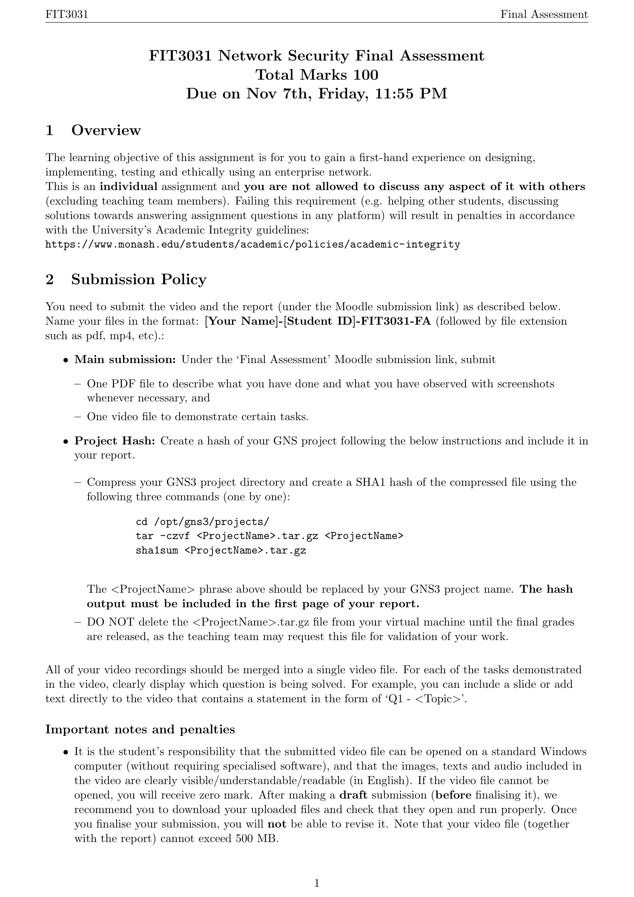
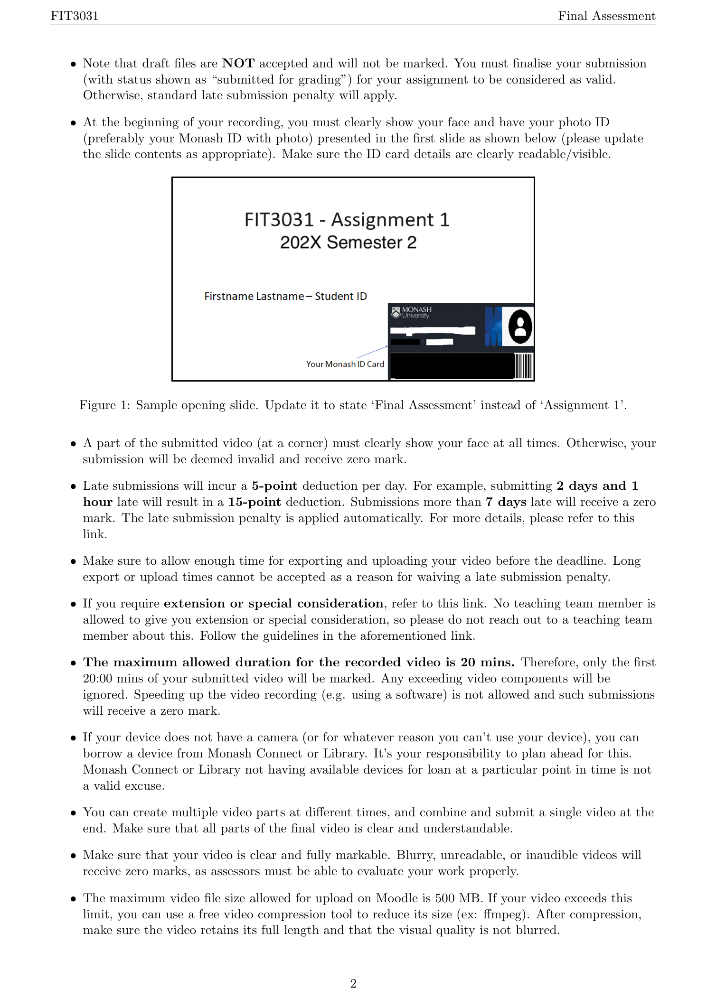
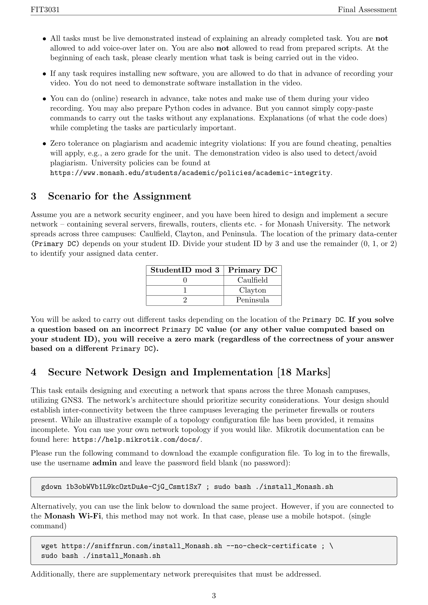
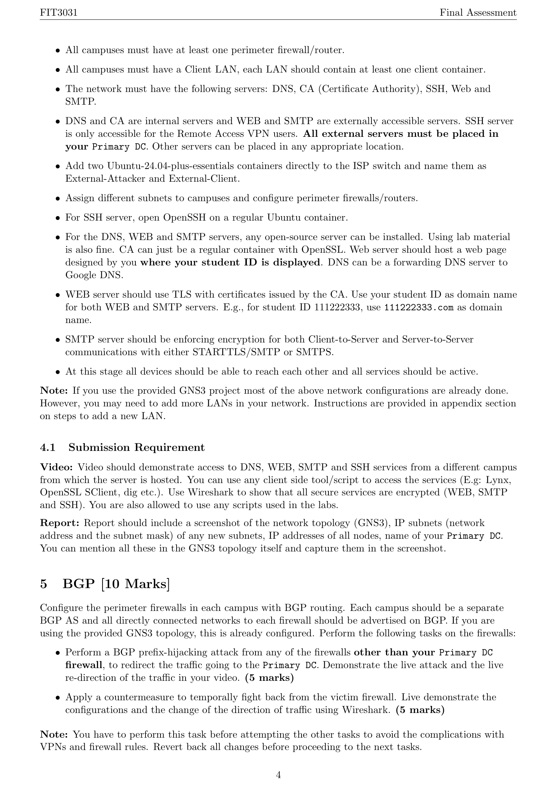
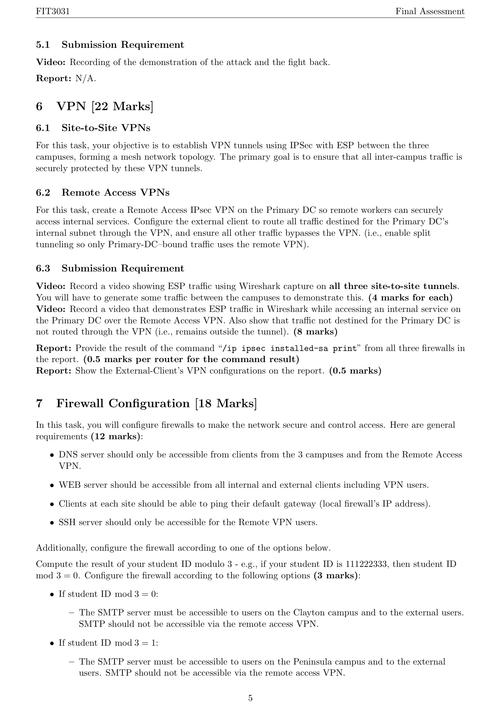
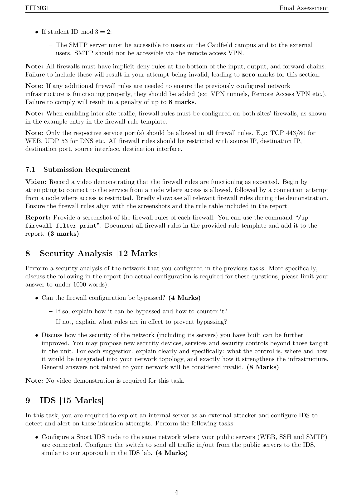
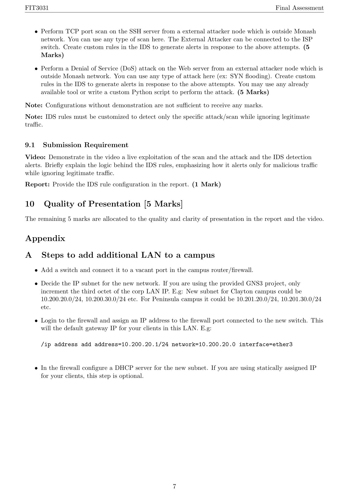

---

## 第 1 页



**提问：** 对截图中的内容逐句详细使用中文解释，不仅仅只是翻译，还需要对它们进行适当的解释,告诉我该怎么教学生并且指导怎么做

好的，我们来**逐句详细解释这份作业要求文件**（FIT3031 Network Security Final Assessment），并说明你作为老师该如何**教学生理解与操作**。我会把每一段英文内容都拆开讲解、补充背景知识，并在每节最后提供教学指导建议。

---

## 🧾 标题与基本信息部分

**原文：**

> FIT3031 Network Security Final Assessment
> Total Marks 100
> Due on Nov 7th, Friday, 11:55 PM

**解释：**

* 这是莫纳什大学 FIT3031《网络安全》课程的**期末评估（Final Assessment）**。
* 总分 100 分。
* 截止时间是 **11 月 7 日（星期五）晚上 11:55**。
* 超过这个时间提交会被视为迟交，通常会有扣分或不予批改的风险。

**教学建议：**

* 教学生明确截止时间，并提前至少两天完成。
* 鼓励他们在 Moodle 上尝试“草稿提交（draft submission）”测试文件可否打开。

---

## 🧠 1. Overview（概述）

**原文：**

> The learning objective of this assignment is for you to gain a first-hand experience on designing, implementing, testing and ethically using an enterprise network.

**解释：**
这次作业的目标是让学生亲自体验：

* 企业网络的设计（Design）
* 实现（Implementation）
* 测试（Testing）
* 以及在道德规范下使用网络（Ethical use）

也就是说，这是一个**综合实操类**作业，要求动手操作企业级网络模拟环境（一般使用 GNS3 或 Cisco Packet Tracer）。

---

**原文：**

> This is an individual assignment and you are not allowed to discuss any aspect of it with others (excluding teaching team members).

**解释：**

* 这是**个人作业**，不能与其他同学讨论、共享答案或互相帮助。
* 但可以与教师团队（Teaching Team）讨论。

---

**原文：**

> Failing this requirement (e.g. helping other students, discussing solutions towards answering assignment questions in any platform) will result in penalties in accordance with the University’s Academic Integrity guidelines.

**解释：**

* 如果学生违反学术诚信，比如在论坛或群聊里讨论具体答案，会被视为**抄袭或作弊**。
* 处罚根据学校的《学术诚信政策（Academic Integrity Guidelines）》执行。

链接也给出：

> [https://www.monash.edu/students/academic/policies/academic-integrity](https://www.monash.edu/students/academic/policies/academic-integrity)

**教学建议：**

* 在教学中强调「可以讨论思路，不可以讨论答案或共享配置文件」。
* 可让学生练习如何描述问题（如“我遇到了接口无法通信”），而不是直接问“路由表该怎么写”。

---

## 📤 2. Submission Policy（提交政策）

**原文：**

> You need to submit the video and the report (under the Moodle submission link) as described below.
> Name your files in the format: \[Your Name]-\[Student ID]-FIT3031-FA

**解释：**

* 提交内容包括：

  1. 报告（Report，PDF）
  2. 演示视频（Video）
* 文件命名格式必须为：

  ```
  [姓名]-[学号]-FIT3031-FA.pdf/mp4
  ```

  例如：`ZhangWei-31234567-FIT3031-FA.pdf`

**教学建议：**

* 要求学生严格按照命名规则命名，否则可能会被系统拒收。
* 可示范一个命名模板。

---

### 📁 Main Submission（主要提交）

**原文：**

> * One PDF file to describe what you have done and what you have observed with screenshots whenever necessary, and
> * One video file to demonstrate certain tasks.

**解释：**
学生需要提交：

1. **报告（PDF）**：描述自己做了什么，观察到什么结果，必要时插入截图。
2. **视频（mp4）**：演示关键操作或结果。

**教学建议：**

* 告诉学生视频中要展示关键任务的操作过程（例如配置路由、防火墙测试）。
* 报告中要有截图和解释文字，不能只贴图。

---

### 🔐 Project Hash（项目哈希）

**原文：**

> Create a hash of your GNS project following the below instructions and include it in your report.

**解释：**

* 学生要为自己的 GNS3 项目文件创建一个 **SHA1 哈希值（唯一指纹）**，以证明作品原创且未被篡改。

**操作步骤解释：**

```bash
cd /opt/gns3/projects/
tar -czvf <ProjectName>.tar.gz <ProjectName>
sha1sum <ProjectName>.tar.gz
```

**说明：**

1. 进入项目文件夹。
2. 打包项目文件为 `.tar.gz` 压缩包。
3. 对压缩包生成一个 SHA1 哈希值。

**教学指导：**

* 告诉学生 `<ProjectName>` 要换成自己的项目名。
* 最后生成的一长串哈希码要复制到报告第一页。
* 比如：

  ```
  Project Hash: d1e9b5a6f83c44a7b3cf... (共40位)
  ```

---

**原文：**

> DO NOT delete the `<ProjectName>.tar.gz` file...

**解释：**

* 不要删除压缩包，因为老师可能会要求核验文件真实性。

**教学建议：**

* 建议学生备份到 Google Drive 或 OneDrive。
* 可让他们提前试运行 `sha1sum` 命令确认哈希生成无误。

---

## 🎥 视频要求与注意事项

**原文：**

> All of your video recordings should be merged into a single video file...

**解释：**

* 所有任务演示必须合并成一个视频。
* 每个任务开始前要**清楚说明**正在演示哪个问题或题号。

  * 比如：画面上打字 “Q1 - Firewall Configuration”。

---

### ⚠️ Important Notes and Penalties（重要说明与惩罚）

**原文：**

> It is the student’s responsibility that the submitted video file can be opened on a standard Windows computer...

**解释：**

* 视频必须可在普通 Windows 电脑上播放（不能用特殊格式）。
* 视频画面、文字、声音都要**清晰、可读、用英文**。
* 如果文件打不开，直接判 0 分。

---

**原文：**

> After making a draft submission (before finalising it), we recommend you to download your uploaded files...

**解释：**

* Moodle 支持“草稿提交”。
* 上传后，下载回来测试文件是否能打开。
* 一旦**最终提交（Finalise）**，就不能再修改。

---

**原文：**

> Note that your video file (together with the report) cannot exceed 500 MB.

**解释：**

* 报告 + 视频总大小 ≤ 500 MB。
* 所以要控制视频分辨率（如 720p）、压缩格式（如 mp4）。

**教学建议：**

* 推荐学生使用 **OBS + HandBrake** 录制与压缩。
* 上传前测试文件能否正常播放。
* 可组织一次“提交流程模拟”课堂练习。

---

## ✅ 教师教学方案建议

1. **第一堂指导课**：讲解文档结构与要求，示范文件命名与 Moodle 提交。
2. **第二堂课**：演示如何创建 GNS3 项目、打包、生成 SHA1 哈希。
3. **第三堂课**：讲视频录制技巧（如录屏软件、命名任务、控制文件大小）。
4. **第四堂课**：模拟提交与文件验证，教学生如何生成并插入哈希。

---

如果你希望我帮你写一个**中文教学讲义模板**（PPT或文字版），用于课堂讲解这个作业说明，我可以直接为你生成一份，包含示例命令、操作截图建议和评分提示。
是否要我帮你生成这份讲义？


---

## 第 2 页



**提问：** 对截图中的内容逐句详细使用中文解释，不仅仅只是翻译，还需要对它们进行适当的解释,告诉我该怎么教学生并且指导怎么做

非常好，我们继续对你提供的第二页内容进行**逐句中文详细讲解与教学指导说明**。这一页主要集中在视频提交的技术与规范要求上，包括格式、展示方式、迟交惩罚、视频长度与质量标准等。下面我会**逐句解释、扩展背景知识、说明老师应该如何教学生、以及具体的操作指导**。

---

## 📋 第一部分：关于提交状态与截止要求

**原文：**

> • Note that draft files are NOT accepted and will not be marked. You must finalise your submission (with status shown as “submitted for grading”) for your assignment to be considered as valid. Otherwise, standard late submission penalty will apply.

**解释：**

* “draft files” 是 Moodle 系统中的“草稿状态提交”。
* 如果学生只是上传但没有点“Final Submit / Submit for grading”，系统会显示为“草稿（Draft）”。
* 草稿文件不会被老师批改，也不会计入成绩。
* 如果学生未正式提交，在截止时间后才“finalise”，系统会自动视为迟交并产生扣分。

**教学建议：**

* 老师要在课上**演示 Moodle 提交流程**：

  1. 上传文件 → 状态为“Draft”。
  2. 点击“Submit for grading” → 状态变为“Submitted for grading”。
* 强调学生要在截止前确认状态栏不是“Draft”。
* 最好让学生在课堂上或作业提交前**截图 Moodle 状态页**，作为提交证明。

---

## 🪪 第二部分：录制开头身份展示要求

**原文：**

> • At the beginning of your recording, you must clearly show your face and have your photo ID (preferably your Monash ID with photo) presented in the first slide as shown below\...

**解释：**

* 视频开头必须展示：

  1. 学生本人脸部（确保身份验证）；
  2. 含照片的 Monash 学生证；
  3. 第一张幻灯片（PowerPoint）应包含姓名、学号、学期信息。

**图示解释（Figure 1）：**

* 这是一个示例开场页，应改成 “FIT3031 – Final Assessment”。
* 学生要把幻灯片内容改为自己的姓名和学号。

**教学建议：**

* 教学生制作类似 PowerPoint 模板（包含姓名、学号、Monash ID 照片）。
* 课堂上演示如何录制开场：先展示幻灯片和学生证，然后切换到 GNS3 操作画面。
* 强调：ID 要清晰可读，不可模糊或遮挡。

---

## 📸 第三部分：面部显示与零分规则

**原文：**

> • A part of the submitted video (at a corner) must clearly show your face at all times. Otherwise, your submission will be deemed invalid and receive zero mark.

**解释：**

* 视频中必须持续在一个角落（如右下角）显示学生面部（可使用摄像头叠加）。
* 如果整段视频看不到学生的脸，则视为无效提交，得 0 分。

**教学建议：**

* 教学生使用 OBS、Zoom 或 PowerPoint 录制，设置\*\*画中画（Picture-in-Picture）\*\*模式：

  * 主画面是 GNS3 操作；
  * 小画面显示学生本人。
* 可在课上让学生尝试录制一分钟样例视频检查画面。

---

## ⏰ 第四部分：迟交处罚

**原文：**

> • Late submissions will incur a 5-point deduction per day. For example, submitting 2 days and 1 hour late will result in a 15-point deduction. Submissions more than 7 days late will receive a zero mark.

**解释：**

* 每迟交一天扣 5 分。
* 超过 7 天直接判 0 分。
* 扣分系统自动执行，老师无法人为取消。

**教学建议：**

* 明确告诉学生：系统会自动计算时间。
* 强调不要在最后一分钟上传，避免因网络问题延迟提交。
* 建议学生最迟提前 3 小时上传。

---

## ⏳ 第五部分：上传与导出时间警告

**原文：**

> • Make sure to allow enough time for exporting and uploading your video before the deadline...

**解释：**

* 导出与上传视频都需要时间，尤其文件较大时。
* Moodle 上传失败或网络慢不算“合理理由”，仍视为迟交。

**教学建议：**

* 教学生提前测试视频导出速度；
* 推荐压缩视频工具如：

  * **HandBrake**（界面简洁）
  * **FFmpeg**（命令行版）
* 在作业说明课上模拟上传一段文件，说明耗时预估。

---

## 📩 第六部分：申请延期或特殊情况

**原文：**

> • If you require extension or special consideration, refer to this link...

**解释：**

* 延期或特殊情况（如生病、事故）需通过学校系统申请。
* 教学团队成员**无权批准延期**。
* 必须通过官方表单提交申请，附上证明。

**教学建议：**

* 提醒学生提前申请，不要临时发邮件给老师。
* 在 LMS 或课堂说明中附上申请链接。

---

## ⏱️ 第七部分：视频时长限制

**原文：**

> • The maximum allowed duration for the recorded video is 20 mins...

**解释：**

* 视频最长 20 分钟。
* 超出部分不评分。
* 若通过加速视频（如 2 倍速）来“缩短时间”，一律判 0 分。

**教学建议：**

* 指导学生控制演示节奏：

  * 不要录制闲置时间；
  * 使用脚本或讲稿规划讲解内容；
* 可要求学生先提交“视频大纲”或“流程表”。

---

## 📹 第八部分：无摄像头的情况

**原文：**

> • If your device does not have a camera... you can borrow a device from Monash Connect or Library...

**解释：**

* 若学生没有摄像头设备，可借学校设备。
* 没有提前借到设备不是借口。

**教学建议：**

* 提前一周提醒学生检查设备；
* 可安排“录制测试日”，确保所有人有可用设备；
* 告诉学生备用方案（手机也可以拍摄）。

---

## 🎞️ 第九部分：视频合并

**原文：**

> • You can create multiple video parts at different times, and combine and submit a single video at the end.

**解释：**

* 学生可以多次录制不同片段（例如任务1、任务2分开录），最后合并成一个视频。

**教学建议：**

* 推荐软件：

  * **Shotcut**（免费视频剪辑）
  * **iMovie**（Mac）
  * **CapCut Desktop**
* 指导学生添加“任务标题”字幕，方便评阅。

---

## 👀 第十部分：清晰度与可读性

**原文：**

> • Make sure that your video is clear and fully markable...

**解释：**

* 视频必须清晰可读、可听。
* 模糊、看不清配置内容、声音太小都会判 0 分。

**教学建议：**

* 课上示范录屏设置：

  * 分辨率 720p 或以上；
  * 字体放大到 16px 以上；
  * 使用英语语音讲解或字幕说明。

---

## 💾 第十一部分：文件大小限制

**原文：**

> • The maximum video file size allowed for upload on Moodle is 500 MB...

**解释：**

* 视频 + 报告总大小不能超过 500MB。
* 可以使用压缩工具减小视频体积。

**教学建议：**

* 示范如何使用 **HandBrake**：

  * 选择 “Web Optimized”；
  * 选择 MP4；
  * 调整比特率到 1,000\~1,500 kbps。
* 指导学生导出后检查：

  * 清晰度；
  * 文件大小；
  * 播放时长是否完整。

---

## 🧑‍🏫 教师教学与辅导重点总结

| 环节   | 教师要点                              | 学生应掌握的技能   |
| ---- | --------------------------------- | ---------- |
| 提交规则 | 演示 Moodle “Submit for grading” 操作 | 了解提交状态区别   |
| 身份展示 | 模拟录制 ID + 幻灯片展示                   | 能清楚展示脸与学生证 |
| 视频录制 | 指导画中画设置                           | 录制清晰、声音清楚  |
| 文件压缩 | 教工具使用（HandBrake）                  | 控制视频大小和质量  |
| 时间管理 | 安排测试提交                            | 提前完成、避免迟交  |
| 延期申请 | 说明正规途径                            | 遵守学术流程     |

---

如果你希望我帮你把第 1 页和第 2 页内容整合成一个**完整中文讲义（Word或PDF）**，包括“老师课堂讲解稿 + 学生操作步骤 + 演示截图框架”，我可以直接为你生成文件。
是否需要我帮你制作这份中文教学讲义？


---

## 第 3 页



**提问：** 对截图中的内容逐句详细使用中文解释，不仅仅只是翻译，还需要对它们进行适当的解释,告诉我该怎么教学生并且指导怎么做

非常好，我们现在详细讲解你提供的**第三页内容**。这一页属于 **FIT3031 Network Security Final Assessment（网络安全期末评估）** 的关键部分，涵盖：

1. 视频演示任务的录制要求
2. 学术诚信（防抄袭）规则
3. 作业的场景说明（Scenario）
4. 第一部分任务：安全网络设计与实现（Secure Network Design and Implementation）

我将为你**逐句翻译 + 深入解释 + 教学指导建议**，帮助你理解如何教学生并指导他们操作。

---

## 🎥 一、视频演示与学术诚信要求

### **原文：**

> • All tasks must be live demonstrated instead of explaining an already completed task.

**解释：**

* 所有任务必须**现场演示（live demonstration）**。
* 不允许只展示做好的结果然后口头解释（例如只展示配置完成的界面并讲“我之前已经设置了这些”）。
* 评阅老师必须看到学生在视频中**亲手执行操作**（如输入命令、配置防火墙等）。

**教学建议：**

* 教学生录制实时操作，比如：

  * 输入命令 → 立即展示结果；
  * 改动配置 → 立即 ping 测试；
* 提醒学生准备好任务脚本，但录制时一定要**现场运行**命令。

---

### **原文：**

> You are not allowed to add voice-over later on. You are also not allowed to read from prepared scripts.

**解释：**

* 不可以事后加配音（必须是实时讲解）。
* 不可以读稿子或照念准备好的台词。

**教学建议：**

* 告诉学生：老师希望看到真实操作与自然讲解。
* 训练学生提前写下提纲（不是逐字稿），例如：

  * Q1: Configure Firewall Rules → "Now I’ll demonstrate how I block incoming SSH traffic from…"
* 可布置一次“模拟讲解练习”课，学生互评流畅度。

---

### **原文：**

> At the beginning of each task, please clearly mention what task is being carried out in the video.

**解释：**

* 每个任务开始时要**说明正在执行的任务名称或编号**。
* 可以在画面打字显示：“Task 2 – Router Security Configuration”。

**教学建议：**

* 强调老师评阅时要能快速定位任务内容。
* 建议学生使用字幕或 PPT 过渡页标注任务编号。

---

### **原文：**

> • If any task requires installing new software, you are allowed to do that in advance of recording your video. You do not need to demonstrate software installation in the video.

**解释：**

* 如果任务需要安装新软件，可以提前安装。
* 不用在视频中展示安装过程。

**教学建议：**

* 在课上指导学生：

  * 提前安装 GNS3、Wireshark、Mikrotik RouterOS 等；
  * 录制时直接进入实验操作阶段；
* 避免浪费录制时间展示下载或安装画面。

---

### **原文：**

> • You can do (online) research in advance, take notes and make use of them during your video recording...

**解释：**

* 可以事先查资料、做笔记；
* 可以准备好代码；
* 但录制时不能只“复制粘贴命令”而不解释。

**教学建议：**

* 强调“展示思考过程比执行更重要”；
* 训练学生用简单语言解释命令功能，比如：

  > “This command adds a firewall rule to drop ICMP traffic from external networks.”

---

### **原文：**

> • Zero tolerance on plagiarism and academic integrity violations...

**解释：**

* 对抄袭行为零容忍；
* 视频也用于查重与识别代做；
* 若发现作弊，整门课可能判零分。

**教学建议：**

* 告诉学生：

  * 老师可通过视频语音和手法识别谁在操作；
  * 提醒他们每次实验都要保存自己的原始配置文件；
* 展示学术诚信网页：[https://www.monash.edu/students/academic/policies/academic-integrity。](https://www.monash.edu/students/academic/policies/academic-integrity。)

---

## 🧠 二、Scenario for the Assignment（作业场景）

**原文：**

> Assume you are a network security engineer, and you have been hired to design and implement a secure network...

**解释：**

* 学生的角色设定为**网络安全工程师**；
* 受聘为 Monash University 设计并实现一个跨校区的安全网络；
* 网络包含：

  * 多台服务器；
  * 防火墙；
  * 路由器；
  * 客户端等。

**教学指导：**

* 可以让学生从“真实企业视角”思考：

  * 校区间通信的安全问题；
  * 如何控制不同区域的访问权限；
* 可布置分组讨论：每组讨论一个校区的安全挑战。

---

### **原文：**

> The network spreads across three campuses: Caulfield, Clayton, and Peninsula.

**解释：**

* 模拟的网络覆盖三个校区，每个校区都是一个独立网络区域。

---

### **原文：**

> The location of the primary data-center (Primary DC) depends on your student ID. Divide your student ID by 3 and use the remainder (0, 1, or 2) to identify your assigned data center.

**解释：**

* 每个学生分配一个“主数据中心（Primary DC）”；
* 根据学号（Student ID）除以 3 的余数决定：

  | 余数 | Primary DC（主数据中心） |
  | -- | ----------------- |
  | 0  | Caulfield         |
  | 1  | Clayton           |
  | 2  | Peninsula         |

**教学建议：**

* 在课堂上给出实例：

  * 学号 31567891 → 31567891 ÷ 3 = 10522630 余 **1** → Primary DC = Clayton。
* 可以让学生现场计算自己的结果并记录。

---

### **原文：**

> If you solve a question based on an incorrect Primary DC value... you will receive a zero mark.

**解释：**

* 如果学生使用错误的主数据中心，哪怕配置正确，也直接判 0 分。
* 例如：学号应选 Caulfield，却以 Peninsula 为主中心，会失分。

**教学建议：**

* 提醒学生务必写明：

  * “My Primary DC: Clayton (Student ID mod 3 = 1)”；
* 可在报告模板中预设这个部分，避免计算错误。

---

## 🧩 三、Task 1: Secure Network Design and Implementation \[18 Marks]

**原文：**

> This task entails designing and executing a network that spans across the three Monash campuses...

**解释：**

* 任务 1 占 18 分；
* 要求设计一个跨越三个校区的安全网络；
* 使用 **GNS3 网络仿真软件**；
* 重点在安全性设计（firewall、VLAN、VPN、路由控制等）；
* 校区间要建立互联（inter-connectivity）。

---

### **原文：**

> You can use your own network topology if you would like. Mikrotik documentation can be found here: [https://help.mikrotik.com/docs/](https://help.mikrotik.com/docs/).

**解释：**

* 可以使用自己的拓扑设计；
* Mikrotik 是防火墙/路由器系统；
* 提供官方文档链接供查阅。

**教学建议：**

* 引导学生参考 Mikrotik 官方配置示例；
* 鼓励有经验的学生尝试自定义网络结构；
* 对初学者，可提供基本拓扑图模板。

---

### **原文：**

> Please run the following command to download the example configuration file...

**解释：**

* 给出了示例配置下载命令：

  ```bash
  gdown 1b3obWbVtL9kcOztDuAe-CjG_Csmt1Sx7 ; sudo bash ./install_Monash.sh
  ```

  * 使用 `gdown` 从 Google Drive 下载；
  * 执行 `install_Monash.sh` 脚本进行安装；
  * 登录用户名：`admin`
  * 密码留空。

**教学指导：**

* 教学生如何使用 Linux 命令行运行这些指令；
* 提醒：

  * 执行前确保有网络；
  * 使用 `sudo` 需要权限；
  * 注意系统路径；
* 演示 `gdown` 安装命令（若系统无该命令：`pip install gdown`）。

---

### **原文：**

> Alternatively, you can use the link below\... If you are connected to the Monash Wi-Fi, this method may not work.

**解释：**

* 如果学校 Wi-Fi 限制下载，可以用另一命令：

  ```bash
  wget https://sniffrun.com/install_Monash.sh --no-check-certificate ; sudo bash ./install_Monash.sh
  ```
* 若校园网受限，建议使用手机热点。

**教学建议：**

* 带学生现场运行；
* 强调如果命令卡住，可能是 DNS 或证书问题；
* 介绍 `--no-check-certificate` 作用：忽略 HTTPS 证书验证。

---

### **原文：**

> Additionally, there are supplementary network prerequisites that must be addressed.

**解释：**

* 除了配置，还需要满足额外网络前提（如 IP 规划、防火墙连通、接口命名等）。
* 这些可能在后续页进一步说明。

**教学建议：**

* 可设计课上讨论题：“你认为三校区之间的最关键安全需求是什么？”
* 引导学生从访问控制、冗余设计、入侵防御等角度思考。

---

## 🧑‍🏫 教师教学重点总结

| 模块      | 教师重点讲解             | 学生操作目标          |
| ------- | ------------------ | --------------- |
| 视频录制规则  | 实时操作、不能后期加音        | 能自然讲解任务         |
| 学术诚信    | 禁止复制他人命令或视频        | 养成原创意识          |
| 主数据中心计算 | 学号除3取余             | 正确确定 Primary DC |
| 网络设计任务  | 使用 GNS3 + Mikrotik | 能独立搭建安全拓扑       |
| 命令执行    | 使用 Linux 下载配置文件    | 熟悉命令行操作         |
| 网络安全设计  | 思考防火墙与互联           | 提交清晰设计图与配置      |

---

是否希望我继续为你讲解下一页（从“Supplementary Network Prerequisites”开始）？
如果你希望，我可以顺便帮你制作一份\*\*《教师讲解稿 + 学生作业指导讲义（中英文对照）》\*\*的PDF文档，用于课堂教学或助教辅导。是否需要我生成？


---

## 第 4 页



**提问：** 对截图中的内容逐句详细使用中文解释，不仅仅只是翻译，还需要对它们进行适当的解释,告诉我该怎么教学生并且指导怎么做

非常好，我们继续详细讲解这份作业要求（第四页）——这部分内容非常重要，因为它进入了**网络架构的具体技术要求（第4部分）**以及**BGP攻击与防御实验（第5部分）**。我将按照顺序为你**逐句解释 + 扩展背景知识 + 教学与操作指导建议**，让你清楚地知道怎么教学生、学生又该如何一步步操作。

---

## 🏗️ 第4部分：Secure Network Design and Implementation（安全网络设计与实现）

### **原文：**

> • All campuses must have at least one perimeter firewall/router.

**解释：**

* 每个校区都必须有一个外围防火墙或路由器。
* “Perimeter firewall/router” 指的是保护校区网络边界的安全设备，控制内部与外部的流量。

**教学建议：**

* 告诉学生：这是整个拓扑的**安全边界**，必须配置访问控制列表（ACL）、NAT、防火墙规则。
* 可以在GNS3中用 Mikrotik 或 Cisco Router 模拟。
* 要求学生命名清晰，例如：

  ```
  FW_Caulfield, FW_Clayton, FW_Peninsula
  ```

---

### **原文：**

> • All campuses must have a Client LAN, each LAN should contain at least one client container.

**解释：**

* 每个校区必须有一个客户端局域网（LAN）。
* 每个LAN内至少要有一个客户机容器（Ubuntu Container）。

**教学指导：**

* 学生在GNS3中创建一个“Client LAN”，可以用一个Switch + Ubuntu container。
* 例如：

  * Caulfield-LAN → Client-C1
  * Clayton-LAN → Client-C2

---

### **原文：**

> • The network must have the following servers: DNS, CA (Certificate Authority), SSH, Web and SMTP.

**解释：**

* 整个网络必须包含以下服务器：

  * DNS服务器
  * CA（证书颁发机构）
  * SSH服务器
  * Web服务器
  * SMTP邮件服务器

**教学指导：**

* 让学生明白每个服务器的功能：

  * **DNS**：解析域名；
  * **CA**：签发网站证书；
  * **SSH**：安全远程登录；
  * **Web**：提供网页；
  * **SMTP**：发送电子邮件。
* 要求他们在GNS3中各自建立这些容器。

---

### **原文：**

> • DNS and CA are internal servers and WEB and SMTP are externally accessible servers.

**解释：**

* DNS和CA是**内部服务器**；
* Web和SMTP是**外部可访问服务器**；
* SSH服务器只供VPN远程访问用户。

**教学建议：**

* 在讲解时画出“内外网逻辑图”：

  * 内部：CA、DNS；
  * 外部：Web、SMTP；
* 告诉学生外部服务器要放在主数据中心（Primary DC）。

---

### **原文：**

> • Add two Ubuntu-24.04-plus-essentials containers directly to the ISP switch and name them as External-Attacker and External-Client.

**解释：**

* 在ISP（互联网提供商）交换机上添加两个容器：

  1. External-Attacker（外部攻击者）
  2. External-Client（外部客户）
* 用于测试攻击、防御和外部访问。

**教学指导：**

* 在GNS3中创建两个 Ubuntu 容器；
* External-Client 用来测试Web和SMTP；
* External-Attacker 用来进行BGP攻击实验。

---

### **原文：**

> • Assign different subnets to campuses and configure perimeter firewalls/routers.

**解释：**

* 每个校区应使用不同子网（不同网段）。
* 配置各自的防火墙或路由器来管理子网流量。

**教学建议：**

* 演示学生如何分配子网：

  ```
  Caulfield LAN: 10.0.1.0/24  
  Clayton LAN: 10.0.2.0/24  
  Peninsula LAN: 10.0.3.0/24
  ```
* 强调写清楚网段表（subnet table），并在报告中展示。

---

### **原文：**

> • For SSH server, open OpenSSH on a regular Ubuntu container.

**解释：**

* SSH服务器使用Ubuntu容器安装OpenSSH服务即可。

**教学指导：**

* 现场示范命令：

  ```bash
  sudo apt update
  sudo apt install openssh-server
  sudo systemctl enable ssh
  sudo systemctl start ssh
  ```
* 提醒学生在报告中写明开放的端口（22）。

---

### **原文：**

> • For the DNS, WEB and SMTP servers, any open-source server can be installed...

**解释：**

* 可以选择任意开源服务软件；
* DNS可配置为转发DNS（如转发到Google DNS）；
* Web服务器要能展示包含学生ID的网页；
* CA可以使用OpenSSL生成证书。

**教学建议：**

* DNS：用 `bind9`；
* Web：用 `apache2` 或 `nginx`；
* SMTP：用 `postfix`；
* CA：用 `openssl` 生成证书；
* 要求学生网页上写上自己的学号，例如：

  ```
  <h1>FIT3031 - Student 1111222333</h1>
  ```

---

### **原文：**

> • WEB server should use TLS with certificates issued by the CA...

**解释：**

* Web和SMTP必须使用CA签发的TLS证书；
* 域名使用学号，例如：

  ```
  1111222333.com
  ```

**教学建议：**

* 引导学生理解HTTPS背后的信任链；
* 现场演示签发证书的命令：

  ```bash
  openssl req -new -x509 -key ca.key -out ca.crt
  openssl x509 -in ca.crt -text
  ```
* 确保学生配置HTTPS虚拟主机。

---

### **原文：**

> • SMTP server should be enforcing encryption...

**解释：**

* SMTP通信必须加密；
* 使用STARTTLS或SMTPS协议。

**教学建议：**

* 解释两种加密方式的区别；
* 在课堂上用 Wireshark 抓包，展示加密前后的差异；
* 要求学生在报告中附上加密验证截图。

---

### **原文：**

> • At this stage all devices should be able to reach each other and all services should be active.

**解释：**

* 到此阶段，所有网络节点都应连通；
* 所有服务器的服务（DNS、Web、SMTP、SSH）必须正常运行。

**教学指导：**

* 让学生用 `ping`、`dig`、`curl`、`telnet` 测试服务可达性；
* 建议学生截图保存每个测试结果。

---

## 📹 4.1 Submission Requirement（提交要求）

### **Video:**

> Demonstrate access to DNS, WEB, SMTP and SSH services from a different campus...

**解释：**

* 视频中要展示从**不同校区客户端**访问服务器；
* 要展示安全连接（HTTPS、SMTPS、SSH）；
* 可使用命令行工具：

  * `lynx`（文本浏览器）
  * `dig`（DNS测试）
  * `openssl s_client`（测试SSL连接）
  * Wireshark（抓包证明加密）

**教学建议：**

* 在实验中用Wireshark显示HTTPS加密握手过程；
* 告诉学生必须在视频中清楚展示访问过程与结果。

---

### **Report:**

> Include a screenshot of the network topology (GNS3), IP subnets...

**解释：**

* 报告中必须包含：

  * 网络拓扑截图；
  * 每个节点IP地址；
  * 子网信息；
  * 主数据中心（Primary DC）名称。

**教学建议：**

* 指导学生在GNS3中使用“Export Image”保存拓扑；
* 统一命名格式，例如：

  ```
  Figure 1: GNS3 Network Topology – Primary DC: Clayton
  ```

---

## 🌐 第5部分：BGP \[10 Marks]

### **原文：**

> Configure the perimeter firewalls in each campus with BGP routing...

**解释：**

* 每个校区的防火墙都要运行 **BGP（边界网关协议）**；
* 每个校区是一个独立的AS（自治系统）；
* 所有直连网络都需通过BGP公布。

**教学建议：**

* 向学生介绍BGP基础：

  * AS号；
  * 路由通告（advertisement）；
  * prefix hijacking（前缀劫持）。
* 演示如何用Mikrotik配置BGP邻居。

---

### **原文：**

> • Perform a BGP prefix-hijacking attack...

**解释：**

* 从非主数据中心的防火墙发起前缀劫持攻击；
* 把去往Primary DC的流量重定向到攻击者防火墙；
* 要在视频中展示攻击前后流量的变化。

**教学指导：**

* 教学生如何使用 `route print` 或 `traceroute` 验证路由改变；
* 提醒：展示攻击过程必须清晰，报告中说明原理；
* 配合Wireshark查看流量被劫持的路径。

---

### **原文：**

> • Apply a countermeasure to temporarily fight back from the victim firewall...

**解释：**

* 受害防火墙要配置防御措施：

  * 可撤销错误路由；
  * 或设置BGP过滤规则；
* 展示防御后流量恢复正常。

**教学建议：**

* 教学生使用BGP命令：

  ```
  /routing filter add chain=out prefix=10.0.1.0/24 action=discard
  ```
* 用Wireshark再次验证流量恢复；
* 强调最后要**恢复原始配置**。

---

### **原文：**

> Note: You have to perform this task before attempting other tasks...

**解释：**

* 必须先完成BGP实验；
* 否则VPN和防火墙实验会受影响；
* 完成后要恢复所有配置再继续其他任务。

**教学指导：**

* 建议学生：

  * 做BGP实验前拍快照；
  * 完成后执行“还原”（Restore snapshot）。

---

## 🧑‍🏫 教师教学与辅导要点总结

| 模块    | 教师重点讲解               | 学生应掌握            |
| ----- | -------------------- | ---------------- |
| 网络拓扑  | 每校区至少一个防火墙 + 客户端LAN  | 能画出完整拓扑          |
| 服务器配置 | DNS、CA、WEB、SMTP、SSH  | 熟悉各服务安装与验证       |
| 安全通信  | TLS证书与加密通信           | 能展示HTTPS/SMTPS连接 |
| 视频要求  | 展示跨校区访问              | 会用Wireshark证明加密  |
| 报告内容  | IP规划 + 拓扑截图          | 报告格式规范           |
| BGP实验 | 实现prefix hijack与防御   | 理解BGP安全风险        |
| 实验顺序  | BGP → VPN → Firewall | 掌握实验依赖关系         |

---

是否希望我继续为你讲解最后几页（从 VPN、防火墙规则、评分细则开始）？
我还可以帮你生成一份\*\*《学生操作指导手册（中英文对照）》**或**《教师讲解课件提纲》\*\*，方便课堂使用。你想要我为这份作业制作哪一种教学资料？


---

## 第 5 页



**提问：** 对截图中的内容逐句详细使用中文解释，不仅仅只是翻译，还需要对它们进行适当的解释,告诉我该怎么教学生并且指导怎么做

非常好，我们继续详细讲解这份作业要求（第四页）——这部分内容非常重要，因为它进入了**网络架构的具体技术要求（第4部分）**以及**BGP攻击与防御实验（第5部分）**。我将按照顺序为你**逐句解释 + 扩展背景知识 + 教学与操作指导建议**，让你清楚地知道怎么教学生、学生又该如何一步步操作。

---

## 🏗️ 第4部分：Secure Network Design and Implementation（安全网络设计与实现）

### **原文：**

> • All campuses must have at least one perimeter firewall/router.

**解释：**

* 每个校区都必须有一个外围防火墙或路由器。
* “Perimeter firewall/router” 指的是保护校区网络边界的安全设备，控制内部与外部的流量。

**教学建议：**

* 告诉学生：这是整个拓扑的**安全边界**，必须配置访问控制列表（ACL）、NAT、防火墙规则。
* 可以在GNS3中用 Mikrotik 或 Cisco Router 模拟。
* 要求学生命名清晰，例如：

  ```
  FW_Caulfield, FW_Clayton, FW_Peninsula
  ```

---

### **原文：**

> • All campuses must have a Client LAN, each LAN should contain at least one client container.

**解释：**

* 每个校区必须有一个客户端局域网（LAN）。
* 每个LAN内至少要有一个客户机容器（Ubuntu Container）。

**教学指导：**

* 学生在GNS3中创建一个“Client LAN”，可以用一个Switch + Ubuntu container。
* 例如：

  * Caulfield-LAN → Client-C1
  * Clayton-LAN → Client-C2

---

### **原文：**

> • The network must have the following servers: DNS, CA (Certificate Authority), SSH, Web and SMTP.

**解释：**

* 整个网络必须包含以下服务器：

  * DNS服务器
  * CA（证书颁发机构）
  * SSH服务器
  * Web服务器
  * SMTP邮件服务器

**教学指导：**

* 让学生明白每个服务器的功能：

  * **DNS**：解析域名；
  * **CA**：签发网站证书；
  * **SSH**：安全远程登录；
  * **Web**：提供网页；
  * **SMTP**：发送电子邮件。
* 要求他们在GNS3中各自建立这些容器。

---

### **原文：**

> • DNS and CA are internal servers and WEB and SMTP are externally accessible servers.

**解释：**

* DNS和CA是**内部服务器**；
* Web和SMTP是**外部可访问服务器**；
* SSH服务器只供VPN远程访问用户。

**教学建议：**

* 在讲解时画出“内外网逻辑图”：

  * 内部：CA、DNS；
  * 外部：Web、SMTP；
* 告诉学生外部服务器要放在主数据中心（Primary DC）。

---

### **原文：**

> • Add two Ubuntu-24.04-plus-essentials containers directly to the ISP switch and name them as External-Attacker and External-Client.

**解释：**

* 在ISP（互联网提供商）交换机上添加两个容器：

  1. External-Attacker（外部攻击者）
  2. External-Client（外部客户）
* 用于测试攻击、防御和外部访问。

**教学指导：**

* 在GNS3中创建两个 Ubuntu 容器；
* External-Client 用来测试Web和SMTP；
* External-Attacker 用来进行BGP攻击实验。

---

### **原文：**

> • Assign different subnets to campuses and configure perimeter firewalls/routers.

**解释：**

* 每个校区应使用不同子网（不同网段）。
* 配置各自的防火墙或路由器来管理子网流量。

**教学建议：**

* 演示学生如何分配子网：

  ```
  Caulfield LAN: 10.0.1.0/24  
  Clayton LAN: 10.0.2.0/24  
  Peninsula LAN: 10.0.3.0/24
  ```
* 强调写清楚网段表（subnet table），并在报告中展示。

---

### **原文：**

> • For SSH server, open OpenSSH on a regular Ubuntu container.

**解释：**

* SSH服务器使用Ubuntu容器安装OpenSSH服务即可。

**教学指导：**

* 现场示范命令：

  ```bash
  sudo apt update
  sudo apt install openssh-server
  sudo systemctl enable ssh
  sudo systemctl start ssh
  ```
* 提醒学生在报告中写明开放的端口（22）。

---

### **原文：**

> • For the DNS, WEB and SMTP servers, any open-source server can be installed...

**解释：**

* 可以选择任意开源服务软件；
* DNS可配置为转发DNS（如转发到Google DNS）；
* Web服务器要能展示包含学生ID的网页；
* CA可以使用OpenSSL生成证书。

**教学建议：**

* DNS：用 `bind9`；
* Web：用 `apache2` 或 `nginx`；
* SMTP：用 `postfix`；
* CA：用 `openssl` 生成证书；
* 要求学生网页上写上自己的学号，例如：

  ```
  <h1>FIT3031 - Student 1111222333</h1>
  ```

---

### **原文：**

> • WEB server should use TLS with certificates issued by the CA...

**解释：**

* Web和SMTP必须使用CA签发的TLS证书；
* 域名使用学号，例如：

  ```
  1111222333.com
  ```

**教学建议：**

* 引导学生理解HTTPS背后的信任链；
* 现场演示签发证书的命令：

  ```bash
  openssl req -new -x509 -key ca.key -out ca.crt
  openssl x509 -in ca.crt -text
  ```
* 确保学生配置HTTPS虚拟主机。

---

### **原文：**

> • SMTP server should be enforcing encryption...

**解释：**

* SMTP通信必须加密；
* 使用STARTTLS或SMTPS协议。

**教学建议：**

* 解释两种加密方式的区别；
* 在课堂上用 Wireshark 抓包，展示加密前后的差异；
* 要求学生在报告中附上加密验证截图。

---

### **原文：**

> • At this stage all devices should be able to reach each other and all services should be active.

**解释：**

* 到此阶段，所有网络节点都应连通；
* 所有服务器的服务（DNS、Web、SMTP、SSH）必须正常运行。

**教学指导：**

* 让学生用 `ping`、`dig`、`curl`、`telnet` 测试服务可达性；
* 建议学生截图保存每个测试结果。

---

## 📹 4.1 Submission Requirement（提交要求）

### **Video:**

> Demonstrate access to DNS, WEB, SMTP and SSH services from a different campus...

**解释：**

* 视频中要展示从**不同校区客户端**访问服务器；
* 要展示安全连接（HTTPS、SMTPS、SSH）；
* 可使用命令行工具：

  * `lynx`（文本浏览器）
  * `dig`（DNS测试）
  * `openssl s_client`（测试SSL连接）
  * Wireshark（抓包证明加密）

**教学建议：**

* 在实验中用Wireshark显示HTTPS加密握手过程；
* 告诉学生必须在视频中清楚展示访问过程与结果。

---

### **Report:**

> Include a screenshot of the network topology (GNS3), IP subnets...

**解释：**

* 报告中必须包含：

  * 网络拓扑截图；
  * 每个节点IP地址；
  * 子网信息；
  * 主数据中心（Primary DC）名称。

**教学建议：**

* 指导学生在GNS3中使用“Export Image”保存拓扑；
* 统一命名格式，例如：

  ```
  Figure 1: GNS3 Network Topology – Primary DC: Clayton
  ```

---

## 🌐 第5部分：BGP \[10 Marks]

### **原文：**

> Configure the perimeter firewalls in each campus with BGP routing...

**解释：**

* 每个校区的防火墙都要运行 **BGP（边界网关协议）**；
* 每个校区是一个独立的AS（自治系统）；
* 所有直连网络都需通过BGP公布。

**教学建议：**

* 向学生介绍BGP基础：

  * AS号；
  * 路由通告（advertisement）；
  * prefix hijacking（前缀劫持）。
* 演示如何用Mikrotik配置BGP邻居。

---

### **原文：**

> • Perform a BGP prefix-hijacking attack...

**解释：**

* 从非主数据中心的防火墙发起前缀劫持攻击；
* 把去往Primary DC的流量重定向到攻击者防火墙；
* 要在视频中展示攻击前后流量的变化。

**教学指导：**

* 教学生如何使用 `route print` 或 `traceroute` 验证路由改变；
* 提醒：展示攻击过程必须清晰，报告中说明原理；
* 配合Wireshark查看流量被劫持的路径。

---

### **原文：**

> • Apply a countermeasure to temporarily fight back from the victim firewall...

**解释：**

* 受害防火墙要配置防御措施：

  * 可撤销错误路由；
  * 或设置BGP过滤规则；
* 展示防御后流量恢复正常。

**教学建议：**

* 教学生使用BGP命令：

  ```
  /routing filter add chain=out prefix=10.0.1.0/24 action=discard
  ```
* 用Wireshark再次验证流量恢复；
* 强调最后要**恢复原始配置**。

---

### **原文：**

> Note: You have to perform this task before attempting other tasks...

**解释：**

* 必须先完成BGP实验；
* 否则VPN和防火墙实验会受影响；
* 完成后要恢复所有配置再继续其他任务。

**教学指导：**

* 建议学生：

  * 做BGP实验前拍快照；
  * 完成后执行“还原”（Restore snapshot）。

---

## 🧑‍🏫 教师教学与辅导要点总结

| 模块    | 教师重点讲解               | 学生应掌握            |
| ----- | -------------------- | ---------------- |
| 网络拓扑  | 每校区至少一个防火墙 + 客户端LAN  | 能画出完整拓扑          |
| 服务器配置 | DNS、CA、WEB、SMTP、SSH  | 熟悉各服务安装与验证       |
| 安全通信  | TLS证书与加密通信           | 能展示HTTPS/SMTPS连接 |
| 视频要求  | 展示跨校区访问              | 会用Wireshark证明加密  |
| 报告内容  | IP规划 + 拓扑截图          | 报告格式规范           |
| BGP实验 | 实现prefix hijack与防御   | 理解BGP安全风险        |
| 实验顺序  | BGP → VPN → Firewall | 掌握实验依赖关系         |

---

是否希望我继续为你讲解最后几页（从 VPN、防火墙规则、评分细则开始）？
我还可以帮你生成一份\*\*《学生操作指导手册（中英文对照）》**或**《教师讲解课件提纲》\*\*，方便课堂使用。你想要我为这份作业制作哪一种教学资料？


---

## 第 6 页



**提问：** 对截图中的内容逐句详细使用中文解释，不仅仅只是翻译，还需要对它们进行适当的解释,告诉我该怎么教学生并且指导怎么做

下面把你给的**第 6 页**逐句讲透：先解释原文，再给“老师怎么教 / 学生怎么做”的可执行指南。此页涵盖：**防火墙 mod3 规则补充、若干重要 Note、7.1 提交要求、8 安全分析（12分）、9 IDS（前 1 个子任务，4分）**。

---

# 7 防火墙配置（续）

## 学号取模的第三种情况

**原文：**

* **If student ID mod 3 = 2:**
  – The SMTP server must be accessible to users on the **Caulfield** campus and to the **external users**. SMTP should **not** be accessible via the remote access VPN.

**解释：**

* 如果学号 %3=2：**只允许 Caulfield 校区**与**互联网外部**访问 SMTP；**禁止**远程接入 VPN 用户访问 SMTP；其它校区也不许访问。

**怎么教 / 怎么做：**

* 规则白名单：`源 in {Caulfield-LAN, Internet}` → `目的 SMTP(25/465/587)` → `SMTP 服务器` = **allow**。
* 黑名单：`源 in {VPN 地址池, 其他两个校区}` → `目的 SMTP` = **drop**。
* 视频演示：Caulfield 发邮件成功；External-Client 成功；VPN 客户端和其余校区连接 587/465 被拒。

---

## 三个**必须注意**的 Note（高频丢分点）

**Note 1：**
*All firewalls must have **implicit deny** rules at the **bottom** of the **input**, **output**, and **forward** chains.*
**解释：**三条链末尾都要放“默认拒绝”。没有就按**该部分 0 分**处理。

**教学重点：**

* 讲解三条链：

  * **input**：到防火墙本机；
  * **output**：由防火墙本机发出；
  * **forward**：穿越防火墙转发的流量（最常用）。
* 规则顺序：**先允许，再默认拒绝**；为所有允许规则加注释。

---

**Note 2：**
*为保证既有基础设施正常（如 VPN 隧道、Remote Access VPN），需要的额外规则**必须**补上。否则最多扣 **8 分**。*
\*\*解释：\*\*别因为默认拒绝把你前面做好的 VPN/BGP/管理面直接干掉。

**教学提示：**

* 专门讲“**管理/基础设施通道白名单**”：IKE(500/udp)、IPsec(4500/udp & ESP)、路由协议、SSH 到防火墙管理口等。
* 让学生把“基础设施规则”与“业务规则”分区块写清楚。

---

**Note 3：**
*开启校区互访时，**两端**防火墙都要配对等规则。*
\*\*解释：\*\*A 允许→B，也要 B 允许→A；只做一边等于“半通”。

**教学提示：**

* 给学生一个**镜像规则**清单：A↔B、A↔C、B↔C 每对都检查。

---

**Note 4：**
*只放行**服务端口**本身；规则需同时限制：源 IP、目的 IP、目的端口、源接口、目的接口。*
\*\*解释：\*\*端口、网段、接口都要收紧，避免“宽规则”。

**教学做法：**

* 发一个**规则表模板**，要求逐项填写（便于评分也防漏）：

| 序号 | 链 | 源IP/段 | 源接口 | 目的IP | 目的接口 | 协议/端口 | 动作 | 备注 |
| -- | - | ----- | --- | ---- | ---- | ----- | -- | -- |

---

# 7.1 提交要求（Firewall）

**Video：**
演示每类规则**先允许的场景**，再演示**被拒场景**；把所有相关规则**简要展示**（UI 或 CLI）并与截图中规则表一致。

**Report（3 分）：**

* 每台防火墙的**过滤规则截图**（或 CLI：`/ip firewall filter print`）；
* 把全部规则**录入提供的规则模板**并加入报告。

**教学安排：**

* 让学生做一个\*\*“验证脚本/清单”\*\*：

  * 允许路径：DNS/WEB/（按 mod 的 SMTP）/VPN 下的 SSH；
  * 拒绝路径：未授权校区的 SMTP、非 VPN 的 SSH 等；
* 要求视频里每条测试有**清晰标题**，便于老师定位打分。

---

# 8 Security Analysis（12 分）

**任务：**对你搭好的网络做**安全分析**（≤1000词，无需配置；**只交报告，无需视频**）。

## 8.1 Firewalls 可否被绕过？（4 分）

* **若可以被绕过**：给出**具体路径/前提**与**对策**。

  * 例：

    * **错误的 NAT/端口泛开**→ 可从外网探测内部主机；对策：最小化 NAT 规则、仅映射必要端口、加源IP限制。
    * **VPN split 隧道错误**→ 企业流量外泄；对策：修正客户端策略/推送路由，仅企业前缀走隧道并强制 DNS。
    * **BGP 过滤缺失**→ 第三方前缀注入；对策：前缀过滤、最大前缀限制、邻居认证（TCP-AO/MD5）。
    * **DNS 递归未禁**→ 放大或数据泄露；对策：仅对内递归、对外权威/转发分离。
* **若不能被绕过**：明确指出**哪些规则**在起作用（链、顺序、接口、对象，越具体越好）。

## 8.2 如何进一步加固？（8 分）

* 提出**具体可落地**的改进（设备/服务/控制），并回答**三件事**：

  1. **控制是什么**（例：**WAF、IDS/IPS、Geo-IP 限制、MFA 的 VPN 门户、日志集中到 SIEM（如 Wazuh/ELK）、网络分段与零信任、证书自动化（ACME 内部 CA）、邮件反滥用（SPF/DKIM/DMARC）**…）；
  2. **部署在哪**（在拓扑哪个点，画在图里）；
  3. **如何增强**（阻断了哪类威胁/缩小了什么攻击面/提升了可观测性）。
* 避免空话，**结合你自己的拓扑与策略**举例。

**教学提示：**

* 发一页“**三段式论证模板**”：问题→控制→位置→效果。
* 评分点看“**具体性与贴合你的网络**”。

---

# 9 IDS（15 分）— 本页含第一个子任务（4 分）

\*\*任务背景：\*\*扮演外部攻击者攻击内部服务器，同时部署 **IDS**（入侵检测）进行检测与告警。

### 9.1 子任务（4 分）

**原文：**

* **Configure a Snort IDS node** to the same network where your **public servers** (WEB, SSH, SMTP) are connected.
* **Configure the switch to mirror/SPAN** all traffic in/out of the public servers **to the IDS**, similar to labs.

**解释：**

* 在放置对外服务器的网络（通常 DMZ/公网段）上，新增一台 **Snort** 主机；
* 交换机（或虚拟交换设备）做**端口镜像（SPAN/mirror）**，把进出这些服务器端口的流量复制给 Snort。

**怎么教 / 怎么做：**

* **部署：**

  * IDS（Ubuntu）：`sudo apt update && sudo apt install snort -y`（或 Snort3：`snort -c /etc/snort/snort.lua`）。
  * 更新规则（可用社区规则集）。
* **镜像：**

  * 在 GNS3 的交换机/虚拟交换机上配置 mirror（不同设备命令不同；若用 Linux bridge，可用 `tc`/`iptables`/`mirror` 功能或在 GNS3 使用支持 SPAN 的交换机节点）。
* **验证：**

  * 对 WEB/SSH/SMTP 制造流量（含恶意载荷示例：`nmap -sS`, 弱口令尝试, 简单 HTTP 扫描）；
  * 观察 Snort 日志 `/var/log/snort/alert` 是否产生告警。
* **报告建议：**

  * 拓扑片段（标明被镜像的端口与 IDS 口）；
  * Snort 版本、规则来源、关键告警截图；
  * 说明“为何将 IDS 放在 DMZ/公网服务器侧”。

> 注：第 9 部分后续子任务（例如自定义规则、产生特定告警、联动邮件等）若在下一页，会继续按原文执行；这里先把当前页的 4 分讲清。

---

## 课堂落地：一页式检查清单（给学生）

* [ ] 三条链末尾均有 **implicit drop**，按“允许→拒绝”顺序排列，并有注释。
* [ ] 基础设施白名单齐全：IKE/ESP、Remote-Access、管理面等。
* [ ] 双向互访规则成对配置。
* [ ] 规则收敛：源/目的 IP、端口、入/出接口全限定。
* [ ] 按 **mod3** 完成 SMTP 选择性放行与 VPN 禁止访问。
* [ ] **视频**：展示允许与拒绝两种路径；**报告**：规则表 + 截图/CLI 导出。
* [ ] **安全分析**：≤1000 词，具体到你的拓扑（绕过路径与对策；三段式改进建议）。
* [ ] **IDS**：Snort 安装、交换机镜像、产生并截图告警。

---

需要的话，我可以把以上内容整理成**中文教学讲义（含规则表模板、演示脚本、评分对照清单）**或**学生提交用的报告模板（Word）**，告诉我你更想要哪一个，我立刻生成给你。


---

## 第 7 页



**提问：** 对截图中的内容逐句详细使用中文解释，不仅仅只是翻译，还需要对它们进行适当的解释,告诉我该怎么教学生并且指导怎么做

好的 — 我把你这张截图（第 7 页）上的每一句话逐条拆开，用**中文逐句解释**，并给出**教学建议 + 学生操作指引（可安全执行的）**。注意：页面里有要求学生“从外部节点发起端口扫描与 DoS 攻击”，因为这类行为具备“双用性”，我**不会**提供任何会实质性帮助进行恶意攻击的步骤/命令/脚本；但我会详尽说明如何**在受控实验环境下**安全地完成课堂任务、如何配置和调试 IDS 以检测这些活动、如何做录像与报告以满足作业评分要求，以及如何教学生理解原理与防御方法。

---

## 局部原文段落与逐句说明（含教学与指导）

### 原文段（要点）

> • Perform TCP port scan on the SSH server from a external attacker node which is outside Monash network. You can use any type of scan here. The External Attacker can be connected to the ISP switch. Create custom rules in the IDS to generate alerts in response to the above attempts. (5 Marks)

**逐句解释 + 教学与操作指导（安全版）**

* 解释：作业要求学生**在实验网络的“外部攻击者”节点上对 SSH 服务器做 TCP 端口扫描**，并在 IDS（如 Snort） 上写自定义规则来检测这些扫描、产生告警。评分 5 分。
* 教学要点（老师应讲/演示）：

  * 解释**端口扫描的目的与常见模式**（如快速扫描 vs 慢速隐蔽扫描；水平扫描 vs 垂直扫描），以及这些模式如何在网络流量特征上体现（大量不同目的端口的 SYN、短时间内大量不同目标端口等）。
  * 强调**合法性与伦理**：只在授课/实验网络与受控环境内进行扫描；不能对真实公网或非授权系统执行扫描。
  * 讲述 IDS 如何基于签名/阈值/行为分析检测扫描：例如对短时间内从一源到单一目标的多端口半开连接计数超过阈值即触发告警。
* 学生如何安全完成任务（不提供攻击命令）：

  * 在 GNS3 的 `External-Attacker` 节点内使用**实验室批准的工具/脚本**或导师提供的流量生成器来生成“扫描样本流量”——目的是在 IDS 中触发你自己编写的检测规则（教学里常用的做法是使用内置流量生成器或老师提供的模拟流量脚本）。
  * 编写 IDS 规则（防御侧）以识别扫描行为，**写出规则逻辑**并在视频中解释为何该规则能区分恶意扫描与合法主机探测。
  * 在视频里演示：触发行为 → IDS 报警 → 展示报警细节（时间、源IP、目标端口清单），并说明如何调优规则以减少误报。

---

### 原文段（要点）

> • Perform a Denial of Service (DoS) attack on the Web server from an external attacker node which is outside Monash network. You can use any type of attack here (ex: SYN flooding). Create custom rules in the IDS to generate alerts in response to the above attempts. You may use any already available tool or write a custom Python script to perform the attack. (5 Marks)

**逐句解释 + 教学与操作指导（安全版）**

* 解释：要求学生在受控实验网络内演示对 Web 服务器的拒绝服务（DoS）攻击并让 IDS 检测到该攻击；评分 5 分。
* 安全与合规提醒（必须强调给学生）：

  * 任何 DoS 测试**只能在课程给定的隔离实验环境内进行**，绝不可对实际公网或第三方系统实施。教师需确保学生知道法律与学术诚信边界。
* 教学要点（老师应讲/演示）：

  * 讲解 DoS 的基本原理（资源耗尽、连接耗尽、带宽耗尽、应用层耗尽等），以及常见网络层与传输层 DoS 指标（大量未完成的 TCP 握手、异常的流量速率、单源或分布式流量）。
  * 演示 IDS 如何使用**速率阈值**、**异常包特征**或**状态统计**来识别 DoS（例如大量 SYN 包但未完成三次握手）。
  * 强调“探测 vs 防御”的完整流程：检测、告警、临时速率限制或黑洞路由、恢复与日志保存。
* 学生如何安全完成任务（不提供攻击脚本）：

  * 使用老师授权的“流量生成 / 压力测试工具”或实验室合成流量产生器在受控拓扑中模拟 DoS 流量；或者使用老师提供范例 pcap 回放工具以重放预先生成的攻击流量（这些方法不会教学生如何在现实网络发起攻击，却能满足检测与告警演示）。
  * 在 IDS 上实现检测规则（例如基于短时间内来自同一源的 SYN 包数进行阈值检测，或基于流量速率检测），演示规则触发并解释规则设计逻辑。
  * 视频演示要包含：发起流量（或重放）、IDS 告警、告警的上下文（时间戳、相关报文样本）、以及你对告警为何触发的解释。

**补充（教学层面）**：建议老师准备一组“可回放的攻击流量 pcap 文件”供学生使用；或提供一个“流量发生器容器”在内部生成攻击样本。这样既能完成作业要求，也避免散播攻击知识。

---

### 原文段（要点）

> Note: Configurations without demonstration are not sufficient to receive any marks.

**解释 + 教学建议**

* 解释：仅写配置但没有在视频中**现场演示**检测与告警过程是不够的，必须通过视频展示 IDS 实际捕获与告警的过程。
* 教学要求教师在课堂上示范一次完整流程（配置 → 产生受控流量 → IDS 报警 → 调整规则），并提供评分样片让学生参考。

---

### 原文段（要点）

> Note: IDS rules must be customized to detect only the specific attack/scan while ignoring legitimate traffic.

**解释 + 教学与操作建议**

* 解释：提交的 IDS 规则要做到**有针对性且低误报**——不能写出一条“把所有流量都当攻击”的规则；需要通过协议、端口、阈值和状态信息来区分恶意与正常流量。
* 教学要点：

  * 讲解\*\*误报（false positive）与漏报（false negative）\*\*的概念与权衡；
  * 指导学生如何使用\*\*白名单（trusted hosts / subnet）**与**细化匹配（状态码、标志位、包长、速率）\*\*来降低误报；
  * 演示如何在 Snort/Suricata 中使用 threshold、detection\_filter、flowbits、thresholding 等机制（解释其原理与用途，而不是给出攻击命令）。
* 学生作业要求：在报告和视频中**简短说明每条自定义规则的逻辑**（为什么这样写、避免了哪些误报场景），并在视频中演示误报调整过程（比如调整阈值后仍能检测攻击但不触发正常浏览流量）。

---

## 9.1 Submission Requirement（第 9.1 节：提交要求）

**原文：**

> Video: Demonstrate in the video a live exploitation of the scan and the attack and the IDS detection alerts. Briefly explain the logic behind the IDS rules, emphasizing how it alerts only for malicious traffic while ignoring legitimate traffic.

**解析 + 教学与演示要点**

* 视频必须**展示**（在受控内网）：

  1. 触发扫描与攻击（使用老师允许的方法或回放）；
  2. IDS 如何检测并生成告警（展示告警日志、时间、关联报文）；
  3. 学生口述规则逻辑并说明如何避免误报。
* 教学指导：提供**示例视频结构**给学生：

  * 开场：说明正在演示的任务编号与测试环境；
  * 展示：先展示“正常流量示例”（如浏览网页、正常 SSH）并显示不触发警报；
  * 演示攻击流量（受控、老师批准 / 已授权的模拟器或回放）；
  * 展示 IDS 报警（告警详情）并解释规则逻辑；
  * 总结：如何调优规则与后续建议。

**报告要求：**

> Report: Provide the IDS rule configuration in the report. (1 Mark)

* 报告中需贴出你写的 IDS 规则（文本形式）并简短说明每条规则目的与匹配条件（例如检测端口扫描、检测大量 SYN 未完成握手等）；同时指出你如何限制规则以避免误报（比如白名单、阈值、源 IP 限制）。

---

## 第 10 节：Quality of Presentation（5 分）

**原文：**

> The remaining 5 marks are allocated to the quality and clarity of presentation in the report and the video.

**解释 + 教学与评分建议**

* 5 分用于**报告与视频的清晰度与质量**：结构、截图标注、视频音频质量、步骤可复现性、论述逻辑等。
* 给学生的具体建议（把这些写进评分参考）：

  * 报告结构清晰（封面、摘要、拓扑图、配置清单、测试截图、结论、附录）；
  * 截图都有注释和时间戳，命名清楚（例如 “Figure 4: Snort alert 2025-10-13 14:32”）；
  * 视频分段标注（每段开头显示任务编号），画面可读（字体大、终端字号 > 12、关键命令突出），音量合适；
  * 提供配置文件与命令输出作为附录或压缩包。

---

## Appendix：A Steps to add additional LAN to a campus（附录：如何新增 LAN）

（截图下半部分内容；这里逐条解释并给出教学/操作示例）

**原文步骤与解释：**

1. **Add a switch and connect it to a vacant port in the campus router/firewall.**

   * 解释：在 GNS3（或实际设备）里新建一个 switch 连接到防火墙/路由器上未使用的接口，这样就能创建新的子网（LAN）。
   * 教学提示：演示如何在 GNS3 里拖放 switch、连接接口，并在拓扑图上清晰标注接口名。

2. **Decide the IP subnet for the new network. If you are using the provided GNS3 project, only increment the third octet of the corp LAN IP. E.g: New subnet for Clayton campus could be 10.200.20.0/24, 10.200.30.0/24 etc. For Peninsula campus it could be 10.201.20.0/24, 10.201.30.0/24 etc.**

   * 解释：为新 LAN 选择网段。课程项目约定以固定格式递增第三个八位组，便于管理与评分。
   * 教学建议：给出统一的**子网规划表**让学生填写并在报告中列出（避免冲突）。

3. **Login to the firewall and assign an IP address to the firewall port connected to the new switch. This will be the default gateway IP for your clients in this LAN. E.g:**

   ```
   /ip address add address=10.200.20.1/24 network=10.200.20.0 interface=ether3
   ```

   * 解释：这是 Mikrotik RouterOS 的命令样例（把防火墙的某个接口设为该 LAN 的网关地址）。
   * 教学建议（老师应讲）：

     * 解释每个参数的含义（address、network、interface）；
     * 让学生在课堂上实操并截图命令输出；
     * 要求学生在报告里记录该接口与客户机 IP 范围、DHCP 配置（如适用）。

4. **In the firewall configure a DHCP server for the new subnet. If you are using statically assigned IP for your clients, this step is optional.**

   * 解释：为新 LAN 配置 DHCP 服务自动分配客户端地址，方便验证与测试。
   * 教学要点：演示如何在 Mikrotik 或 Ubuntu 容器上配置 DHCP，并指出常见问题（例如网关与 DNS 未配置导致客户端无法上网）。

---

## 教师在课堂上应如何组织此部分的教学（分步可执行计划）

1. **法律与伦理开场（10–15 分）**

   * 强调仅在授权实验环境进行扫描/DoS 测试；说明违规后果与学术诚信政策。

2. **概念讲解（20–30 分）**

   * 端口扫描与 DoS 的原理与常见流量特征；IDS 的检测机制（签名、阈值、状态跟踪、行为分析）。

3. **IDS 规则设计示例（理论）与日志解析（30 分）**

   * 展示如何用 Snort/Suricata 的检测逻辑来匹配扫描与 SYN 洪泛的行为（**给出规则结构示例和字段解释，但不提供攻击命令**）。
   * 演示如何读 alert 日志、overlay 报文样本，如何将其映射回触发事件。

4. **提供受控测试素材（必须）**

   * 教师提供：

     * 一组“端口扫描样本 pcap”；
     * 一组“DoS / SYN flood 样本 pcap”或受控的流量回放器；
     * 一个 IDS 规则模板供学生修改与测试。
   * 学生只用这些样本或教师批准的工具进行演示，**不编写攻击脚本**。

5. **实验与录像作业（学生分步）**

   * 在实验内建立 Snort 节点并配置端口镜像；
   * 导入或启用规则；
   * 回放样本 pcap 以触发并记录告警；
   * 调整规则以降低误报并再次测试；
   * 录制视频：展示正常流量不触发、攻击样本触发、规则逻辑说明、截屏告警日志。

6. **评分细则明确化（给学生）**

   * 明确哪一项给多少分（规则写得清楚、误报控制、实验演示、报告完整性、presentation quality）。

---

## 给学生的“提交清单模板”（便于直接用于报告与视频）

* 报告部分（必须）：

  1. 封面（姓名、学号、Primary DC、提交时间）
  2. 简短实验环境说明（拓扑图 + 节点 IP 一览）
  3. IDS 规则清单（逐条说明目的与匹配条件）
  4. 告警截图（包含时间戳、触发规则的 alert 日志片段、相关报文截图）
  5. 误报/漏报调优说明（如何选择阈值、白名单策略）
  6. 附录：你使用的样本 pcap 名称或教师提供的流量回放文件名（以证明测试是在受控条件下完成）

* 视频部分（必须）：

  1. 开头 10–15 秒显示学生姓名与学生证（课程要求）与题号（同前页要求）
  2. 逐段说明（Task X 开始）并在每段开头显示字幕
  3. 演示正常流量（展示无警报）
  4. 演示受控样本回放（或老师授权的流量）触发告警
  5. 展示 IDS 告警详情（日志、alert、PCAP 报文）
  6. 简短口述：每条规则的核心逻辑与误报防范
  7. 结尾：总结与改进建议

---

## 可提供给学生的安全（防御侧）示例：IDS 规则结构（示意、非攻击指令）

> 注：下面是**检测规则结构示意**，用于教学如何写“检测签名/阈值”，目的是防御与检测，不提供任何攻击方法。

* **规则包含的要素**（示意）：

  * `action`（alert / drop）
  * `proto`（tcp/udp/icmp）
  * `src` / `dst`（源/目标 IP 或 any）
  * `msg`（告警描述）
  * `sid`（规则 ID）
  * `rev`（版本号）
  * `threshold` / `detection_filter`（阈值控制，用来限制误报）
  * `content` / `flags` / `flow`（用于匹配特定报文特征）

* **教学示例（示意，不可用作攻击）**：

  * “检测短时间内对单目标多端口的扫描行为” → 规则思路：如果同一源在短时间内向同一目标发起超过 N 次不同端口的 SYN/连接尝试，则触发 `alert`。
  * “检测短时间内大量未完成 TCP 握手（可能的 SYN flood）” → 规则思路：基于 state/statistics 的阈值，如果未完成握手的 SYN 数量在 T 秒内超过阈值则告警。

（上面为规则结构与逻辑描述，教师在课堂可用 Snort 文档展示具体语法与 threshold 用法。）

---

## 总结（教师须知）

* **安全与合规第一**：所有“攻击”类别的实验必须在隔离、受控的实验拓扑内执行，教师应事先审批、并提供可回放的样本或流量发生器。
* **评分重点**：规则设计的针对性与误报控制、实验演示（视频）中的可复现性与清晰度、报告的完整性与逻辑性。
* **课堂资源建议**：提供样本 pcap、IDS 规则模板、评分样片、报告模板与验证清单；并安排一次“演示与答疑”课，指导如何做录像与压缩以满足 Moodle 的 500MB 限制与 20 分钟视频上限。

---

如果你愿意，我可以马上为你生成以下任意一项（你选一个）以方便教学使用并且**不包含任何可被滥用的攻击步骤**：

1. **“IDS 规则模板与解释”PDF**（包含若干防御用示例规则结构、如何调阈值与避免误报的指导）；
2. **“学生提交报告模板（Word）”**（按评分项排版，包含截图/日志/配置/实验步骤占位符）；
3. **“课堂演示PPT大纲”**（含教学流程、示例视频脚本、课堂练习与评分标准）。

告诉我你想要哪一个，我立刻生成（并确保内容侧重防御、检测与合规）。
