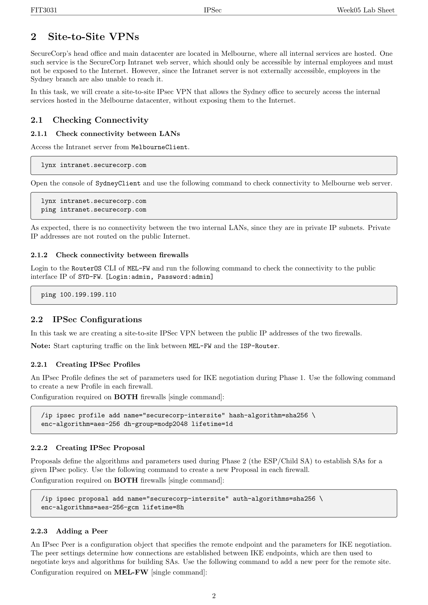

---

## 第 1 页


这页内容是**FIT3031课程的第5周实验指导（Week05 Lab Sheet）**，主题是 **IPSec（Internet Protocol Security，网络层安全协议）**。它讲的是如何在GNS3虚拟网络环境中搭建并运行一个新的IPSec网络拓扑。下面是详细解释👇

---

### 🧩 1.1 安装项目（Installing Project）

这一部分告诉你如何在虚拟机（VM）里安装本周实验所需的IPSec项目：

* 你需要打开GNS3的虚拟机终端（VM shell），然后运行文档里提供的命令：

```bash
gdown 1UxInN_231qiK... ; sudo bash ./install_IPSec.sh
```

这会自动下载并安装实验项目（约1.5MB）。

* 如果上面命令下载不了，可以改用：

```bash
wget https://sniffrun.com/install_IPSec.sh --no-check-certificate ; \
sudo bash ./install_IPSec.sh
```

注意⚠️：如果你使用的是 **Monash大学的Wi-Fi**，下载可能会被屏蔽，因此建议用手机热点。

---

### 🌐 1.2 网络拓扑（Topology）

安装好项目后，你需要在 **GNS3** 里打开该IPSec项目并启动所有节点（nodes）。
这个拓扑图代表一个名为 **SecureCorp** 的公司，它的广域网（WAN）连接了两个分公司：

* **墨尔本（Melbourne）分部**

* 局域网地址：192.168.0.0/24
* 包含客户端（192.168.0.120）和Web服务器（192.168.0.80）

* **悉尼（Sydney）分部**

* 局域网地址：10.10.0.0/24
* 包含客户端（10.10.0.120）

* 两个分部通过各自的防火墙（MEL-FW 和 SYD-FW）与 **ISP路由器（ISP-Router）** 相连：

* MEL-FW ↔ ISP-Router：200.99.99.222/30
* SYD-FW ↔ ISP-Router：100.199.199.110/30

* 另外，还有一个 **RemoteClient（远程客户端）**（IP：50.50.50.120），它通过互联网访问墨尔本站点的内部服务，例如内部网站 intranet.securecorp.com。

整个实验的目的，就是让你搭建并理解一个使用 **IPSec VPN** 技术的企业网络，让远程客户端安全地访问企业内网资源。

---

### 🧠 图示总结（Figure 1）

下方的网络拓扑图清晰展示了各节点的连接关系：
ISP-Router 居中连接三个方向：

* 上：Internet（公网）
* 左下：Melbourne局域网
* 右下：Sydney局域网

它演示的是典型的 **企业VPN结构**，通过加密隧道保护公司两个分部和远程客户端之间的数据通信。

---

### \[口语化表达]

这页其实是告诉你本周要在GNS3里玩一个新的网络实验，主题是IPSec。你要先在虚拟机里跑个命令，把实验项目下载下来（注意别用Monash的Wi-Fi，可能下不了）。装好后，你会在GNS3看到一个虚拟的公司网络：SecureCorp有墨尔本和悉尼两个分部，还有个远程客户端。它们通过ISP路由器连在一起，实验的目的就是让你学会用IPSec把这几个点之间的通信变得安全、加密。


---

## 第 2 页



这页内容是 **FIT3031 课程 IPSec 实验文档的第二页**，主要讲 **如何在两个分公司（墨尔本与悉尼）之间建立 Site-to-Site VPN（站点到站点虚拟专用网络）**，让悉尼办公室能安全访问墨尔本的数据中心内部资源，而不用暴露在互联网中。下面是详细说明👇

---

## 🏢 2. Site-to-Site VPNs（站点到站点 VPN）

SecureCorp 公司的总部和主要数据中心在 **墨尔本（Melbourne）**，所有内部服务都放在那里。例如公司内部网站（Intranet Web Server）只允许内部员工访问，不对公网开放。
问题在于，**悉尼（Sydney）分公司** 的员工无法访问该内部服务器，因为它只在私有局域网中存在。

所以这一节的目标是：

> **在墨尔本和悉尼两地的防火墙之间创建一个 IPSec VPN 通道**，让悉尼能安全访问墨尔本的内部资源，而不暴露给互联网。

---

## 🌐 2.1 检查网络连通性（Checking Connectivity）

### 2.1.1 局域网之间的连通性

* 先从 **MelbourneClient** 上访问内网服务器：

```bash
lynx intranet.securecorp.com
```
* 然后从 **SydneyClient** 上尝试访问同一个地址：

```bash
lynx intranet.securecorp.com
ping intranet.securecorp.com
```

结果是——悉尼访问不到墨尔本的内部服务器，因为它们属于不同的私有网段（192.168.0.0/24 与 10.10.0.0/24），这些地址不能在公网上直接路由。

👉 这说明现在还没有VPN，两个局域网之间是隔绝的。

---

### 2.1.2 防火墙之间的连通性

下一步检查两地防火墙（MEL-FW 与 SYD-FW）是否能在公网层面互通。

* 登录墨尔本防火墙的 RouterOS 命令行（用户名：admin 密码：admin）
执行命令：

```bash
ping 100.199.199.110
```

这是悉尼防火墙的公网接口IP。如果能 ping 通，就说明两地防火墙之间的公网连接正常，可以建立 VPN 隧道。

---

## 🔐 2.2 IPSec 配置（IPSec Configurations）

这一部分开始正式创建 Site-to-Site VPN。

> 注意：在操作时需要同时开启抓包（capture traffic），监控 **MEL-FW 和 ISP-Router** 之间的通信。

---

### 🧱 2.2.1 创建 IPSec Profile（配置文件）

IPSec Profile 定义了 **IKE 第一阶段（Phase 1）** 的协商参数，包括加密算法、哈希算法和密钥交换算法等。

在两台防火墙（MEL-FW、SYD-FW）上都要执行下面的命令：

```bash
/ip ipsec profile add name="securecorp-intersite" hash-algorithm=sha256 \
enc-algorithm=aes-256 dh-group=modp2048 lifetime=1d
```

解释：

* 使用 SHA256 进行哈希验证；
* 使用 AES-256 加密；
* DH密钥交换组为 modp2048；
* 密钥有效期 1天。

---

### 🔑 2.2.2 创建 IPSec Proposal（提案）

Proposal 定义 **IKE 第二阶段（Phase 2）** 的参数，用于实际数据传输（ESP/Child SA）。

在两台防火墙上都要执行：

```bash
/ip ipsec proposal add name="securecorp-intersite" auth-algorithms=sha256 \
enc-algorithms=aes-256-gcm lifetime=8h
```

解释：

* 使用 AES-256-GCM 进行加密；
* 使用 SHA256 进行认证；
* 数据隧道有效期 8 小时。

---

### 🧩 2.2.3 添加对端（Adding a Peer）

Peer 是“对端配置”，定义远程防火墙的公网地址和协商参数，决定VPN两端如何建立连接。

这一步在 **MEL-FW（墨尔本防火墙）** 上配置，对应的命令会在后续页中继续说明。

---

### \[口语化表达]

这页其实是在讲，SecureCorp 公司要在墨尔本和悉尼之间建一个站点到站点的 IPSec VPN，让悉尼能访问墨尔本的数据中心。首先你要测试一下：两个局域网现在是不能互通的（ping 不通），因为它们用的是私网IP。然后测试两地防火墙之间的公网连接，确认能通。接着就是VPN的配置步骤：先在两台防火墙上设置Profile（定义加密算法、哈希算法等），再建Proposal（定义数据加密参数），最后再配置两端的Peer，让两个防火墙能安全地协商出一条加密隧道，把墨尔本和悉尼的内网连起来。


---

## 第 3 页


这页是 **FIT3031 IPSec 实验指南的第三页**，主要讲的是如何在墨尔本（MEL）和悉尼（SYD）两个防火墙上完成 **IPSec VPN的配置后半部分**，包括添加对端（Peer）、身份认证（Identity）、策略（Policy），以及查看连接是否建立（SAs）和配置 NAT。下面是详细中文解释👇

---

## 🌍 2.2.3 Adding a Peer（添加对端）

这一步是在两边防火墙上告诉系统：“我要跟哪个远程IP建立VPN连接”。
每个防火墙都要配置对方的公网地址。

* 在 **MEL-FW**（墨尔本防火墙）上执行：

```bash
/ip ipsec peer add name="SYD" address=100.199.199.110 profile=securecorp-intersite \
exchange-mode=ike2
```

➤ 表示墨尔本防火墙要和悉尼防火墙（IP：100.199.199.110）建立 IKEv2 协商。

* 在 **SYD-FW**（悉尼防火墙）上执行：

```bash
/ip ipsec peer add name="MEL" address=200.99.99.222 profile=securecorp-intersite \
exchange-mode=ike2
```

➤ 表示悉尼防火墙要和墨尔本防火墙（IP：200.99.99.222）通信。
两边互为对端，对等关系。

---

## 🔑 2.2.4 Adding an Identity（添加身份）

这一节是为了设置 **身份认证（Authentication）**。
VPN的安全性需要验证连接双方的身份，这里使用 **预共享密钥（Pre-Shared Key, PSK）**。

* 在 **MEL-FW** 上添加对端身份：

```bash
/ip ipsec identity add peer=SYD auth-method=pre-shared-key secret="securecorp"
```
* 在 **SYD-FW** 上添加对端身份：

```bash
/ip ipsec identity add peer=MEL auth-method=pre-shared-key secret="securecorp"
```

➤ 双方都用相同的密钥“securecorp”来验证身份。

---

## 📜 2.2.5 Adding an IPSec Policy（添加策略）

IPSec Policy 告诉防火墙哪些流量要经过VPN加密传输，以及对应的安全参数。

在配置之前，建议用抓包工具监控防火墙与ISP-Router之间的数据流（你会看到ISAKMP协商过程）。

* 在 **MEL-FW** 上执行：

```bash
/ip ipsec policy add src-address=192.168.0.0/24 dst-address=10.10.0.0/24 \
peer=SYD action=encrypt level=require ipsec-protocols=esp tunnel=yes \
sa-src-address=200.99.99.222 sa-dst-address=100.199.199.110 \
proposal=securecorp-intersite
```

➤ 表示来自墨尔本局域网（192.168.0.0/24）到悉尼局域网（10.10.0.0/24）的流量都要走VPN隧道。

* 在 **SYD-FW** 上执行：

```bash
/ip ipsec policy add src-address=10.10.0.0/24 dst-address=192.168.0.0/24 \
peer=MEL action=encrypt level=require ipsec-protocols=esp tunnel=yes \
sa-src-address=100.199.199.110 sa-dst-address=200.99.99.222 \
proposal=securecorp-intersite
```

➤ 同理，悉尼到墨尔本方向的流量也要加密传输。

📘 这里提到的 “proposal=securecorp-intersite” 指的是前面配置的加密算法组合。

---

## 🔍 2.2.6 View Established SAs（查看VPN是否建立）

当VPN通道建立后，会生成一组安全关联（Security Associations, SAs），表示两边已成功协商密钥。

可以在任一防火墙上执行命令查看：

```bash
/ip ipsec installed-sa print
```

如果看到有SAs条目（包含双方的公网IP和SPI号），就说明VPN连接成功。

---

## 🌐 2.3 Configuring NAT（配置网络地址转换）

这一节讲的是 NAT 的影响。
默认情况下，防火墙上已有 NAT 配置，用于让内部主机访问公网（即出站地址会被转换为防火墙的公网IP）。
但现在我们要让部分流量通过VPN通道（即私网对私网），不能再被NAT改写，否则VPN会失败。

执行命令查看现有NAT规则：

```bash
/ip firewall nat print
```

接下来要创建新的规则，让内部互通流量绕过NAT，从而走加密的VPN通道（下一页会继续讲如何做）。

---

### \[口语化表达]

这页其实是在教你怎么把VPN配置收尾。首先在两边防火墙上互相添加对方的公网地址（Peer），再设定身份验证方式（用同一个密钥“securecorp”），确保两边能互相信任。然后配置Policy，告诉防火墙：凡是墨尔本内网到悉尼内网的流量都要加密传输，反过来也一样。接着你可以用命令看看VPN通道是不是已经建好了（能看到SAs就说明OK）。最后，它提醒你检查防火墙的NAT设置，因为要让VPN的私网流量不被NAT干扰，否则加密隧道可能传不过去。


---

## 第 4 页


这页是 **FIT3031 IPSec 实验文档的第4页**，主要讲完了前面“Site-to-Site VPN”的最后一步（NAT配置与连通性测试），并引入新的部分——**Remote Access VPN（远程访问虚拟专用网络）**。下面是详细解释👇

---

## 🌐 2.3 NAT 配置（续）

前面提到，NAT（Network Address Translation）会把内网地址转换为公网地址，让主机能访问互联网。
但是对于我们刚刚建立的 **站点到站点VPN**，墨尔本（MEL）和悉尼（SYD）之间的流量是“内网对内网”的通信，不应该被NAT改写，否则IPSec隧道会失效。
因此，这里要**新增一条NAT绕过规则（bypass rule）**，并确保它排在所有NAT规则的最前面。

---

### 🔧 在墨尔本防火墙 MEL-FW 上执行：

```bash
/ip firewall nat add chain=srcnat src-address=192.168.0.0/24 dst-address=10.10.0.0/24 \
action=accept
/ip firewall nat print
/ip firewall nat move 1 0
/ip firewall nat print
```

说明：

* `chain=srcnat`：指定该规则用于源地址转换；
* `src-address` 是墨尔本局域网；
* `dst-address` 是悉尼局域网；
* `action=accept` 表示遇到这类流量时不做地址转换；
* `move 1 0` 表示把这条规则移动到第一位（优先执行）。

最终结果（图2）显示：

```
0 chain=srcnat action=accept src-address=192.168.0.0/24 dst-address=10.10.0.0/24
1 chain=srcnat action=masquerade
```

表示第一条是VPN绕过规则，第二条是普通上网NAT。

---

### 🔧 在悉尼防火墙 SYD-FW 上执行：

```bash
/ip firewall nat add chain=srcnat src-address=10.10.0.0/24 dst-address=192.168.0.0/24 \
action=accept
/ip firewall nat print
/ip firewall nat move 1 0
/ip firewall nat print
```

说明：

* 原理与墨尔本端相同，只是源地址与目标地址对调。
最终结果（图3）同样显示VPN优先绕过NAT。

---

## ✅ 2.4 检查连通性（Check Connectivity）

这一步是验证VPN是否成功。

1. 在 **SYD-FW 与 ISP 之间的链路上开始抓包**（查看是否出现ESP或ISAKMP加密数据）。
2. 打开 **SydneyClient** 的控制台，尝试访问墨尔本内网网站：

```bash
lynx intranet.securecorp.com
```

预期：应该能访问到墨尔本服务器的网页内容，说明VPN隧道已建立。

然后回答两个问题：

1. 两个站点之间的流量是否被加密？
2. 从 SydneyClient ping google.com 时，流量是否加密？
（提示：访问公网流量不会走VPN，因此不会被加密。）

---

## 🏠 3. Remote Access VPNs（远程访问VPN）

这一部分是新主题。
SecureCorp 允许员工远程办公（比如在家），但他们仍需要访问公司内网（特别是墨尔本数据中心的内部网站）。
因此，需要建立一个 **远程访问VPN（Remote Access VPN）**，让外部的 RemoteClient（远程用户）通过加密连接访问公司内部资源。

* 首先测试：
在 RemoteClient 上执行：

```bash
lynx intranet.securecorp.com
```

结果应显示无法访问，因为它目前不在公司内网中。

---

## ⚙️ 3.1 配置VPN网关（Configuring the VPN Gateway）

这部分将指导你如何在 **墨尔本防火墙 MEL-FW** 上设置 Remote Access VPN，使远程用户可以连入。

（具体步骤会在后续页面继续讲述。）

---

### \[口语化表达]

这页其实是在收尾前面的站点VPN部分，并开启新的“远程访问VPN”主题。首先，它教你怎么在两边防火墙上加一条“NAT绕过规则”，让墨尔本和悉尼之间的内网通信不要被NAT破坏。然后要测试连通性——从悉尼那边访问墨尔本的内部网站，看看流量是不是加密了（VPN成功就会加密）。接着开始新章节，讲远程员工怎么连回公司网络。它先让你在RemoteClient上试着访问公司内网（此时还访问不到），然后说明接下来要在墨尔本的防火墙上配置Remote Access VPN，让远程用户可以安全接入公司


---

## 第 5 页


这页是 **FIT3031 IPSec 实验手册的第5页**，主要讲如何在 **墨尔本防火墙（MEL-FW）** 上配置 **远程访问VPN（Remote Access VPN）**，然后再配置远程客户端（StrongSwan）。这部分的核心是：让远程用户（在家办公的人）能通过安全加密的隧道访问公司内部资源。下面是详细讲解👇

---

## 🧩 3.1 配置 VPN 网关（Configuring the VPN Gateway）

这部分是配置服务器端（即墨尔本防火墙）的 VPN 服务。步骤分为7个小节。

---

### 🔹 3.1.1 Remote User IP Pool（远程用户IP池）

远程用户连入VPN后，系统要分配给他们一个内部IP地址。
因此我们先定义一个**地址池（IP Pool）**：

```bash
/ip pool add name=remote-access-vpn-pool ranges=172.16.10.10-172.16.10.50
```

意思是：

* 分配给远程VPN用户的虚拟地址范围是 `172.16.10.10` 到 `172.16.10.50`；
* 这些地址只在VPN隧道中使用，不会与公司局域网冲突。

---

### 🔹 3.1.2 IPSec Profile（配置IPSec参数）

建立一个新的 IPSec 配置档，用于 VPN 的加密和密钥交换：

```bash
/ip ipsec profile add name=securecorp-ra-profile dh-group=modp2048 enc-algorithm=aes-256 \
hash-algorithm=sha256
```

说明：

* **dh-group=modp2048**：Diffie-Hellman 密钥交换组；
* **aes-256**：高强度对称加密算法；
* **sha256**：用于数据完整性验证的哈希算法。

---

### 🔹 3.1.3 IPSec Peers（配置对端）

定义VPN客户端的对端信息。
因为远程用户可能来自任意公网地址，所以这里的对端IP设为通配符：

```bash
/ip ipsec peer add name=securecorp-ra-peer address=0.0.0.0/0 exchange-mode=ike2 \
profile=securecorp-ra-profile
```

含义：

* 允许任意外部客户端发起IKEv2连接；
* 使用刚才定义的 `securecorp-ra-profile` 配置参数。

---

### 🔹 3.1.4 Mode Config（模式配置）

Mode Config 用于在用户成功认证后分配网络参数，比如IP地址、默认路由等。

```bash
/ip ipsec mode-config add address-pool=remote-access-vpn-pool address-prefix-length=32 \
name=securecorp-ra-conf split-include=0.0.0.0/0
```

说明：

* `address-pool` 表示从之前定义的IP池中分配地址；
* `split-include=0.0.0.0/0` 表示所有流量都通过VPN隧道路由（即全隧道模式）。

---

### 🔹 3.1.5 Configuring Identities（配置身份验证）

这里设置VPN用户的认证方式。实验中简化为一个统一的预共享密钥（PSK）：

```bash
/ip ipsec identity add generate-policy=port-strict mode-config=securecorp-ra-conf \
peer=securecorp-ra-peer secret=$uperSecret
```

说明：

* 所有远程用户使用相同密钥 `$uperSecret`；
* 认证模式是“port-strict”，即严格匹配端口与配置；
* 成功认证后，系统会按 `mode-config` 给用户分配IP。

---

### 🔹 3.1.6 IPSec Proposal（定义加密与认证算法）

设置VPN使用的加密与认证算法方案：

```bash
/ip ipsec proposal add auth-algorithms=sha256 enc-algorithms=aes-256-cbc \
name=securecorp-ra-proposal pfs-group=modp2048
```

说明：

* 使用AES-256-CBC加密；
* 使用SHA256认证；
* 启用PFS（Perfect Forward Secrecy）确保密钥安全性。

---

### 🔹 3.1.7 IPSec Policy（定义流量策略）

告诉系统哪些流量要经过VPN隧道：

```bash
/ip ipsec policy add template=yes group=default proposal=securecorp-ra-proposal
```

说明：

* 设置默认模板策略；
* 绑定前面定义的Proposal；
* 确保客户端流量与防火墙之间的通信被加密。

---

## 💻 3.2 配置VPN客户端（Configuring the VPN Client）

这部分是配置远程用户电脑上的VPN客户端。
实验中使用的是开源命令行工具 **strongSwan**，它已经安装在 RemoteClient 上。

要做的是：

* 修改 `/etc/ipsec.conf` 文件；
* 添加连接配置，让 strongSwan 能与防火墙（MEL-FW）协商VPN隧道；
* 缩进要严格按要求写（表示层级结构）。

后续页面将展示具体配置内容。

---

### \[口语化表达]

这页其实就是在讲怎么一步步把远程访问VPN搭起来。首先给远程用户准备一段专属的内网IP地址（172.16.10.10-50），然后在墨尔本防火墙上建好VPN配置文件（Profile），指定加密算法和密钥交换方式。接着让防火墙接受来自任意公网的VPN连接（Peer设置），再用Mode Config来分配IP和默认路由。所有用户都用统一的密钥“\$uperSecret”来认证。再往下就是设定加密提案（Proposal）和策略（Policy），让数据通过加密隧道传输。最后讲到客户端部分，用strongSwan配置远程电脑去连防火墙，这样远程员工就能安全地访问公司内部网络啦。


---

## 第 6 页


这页是 **FIT3031 IPSec 实验指导的第6页**，主要讲的是如何在 **RemoteClient（远程客户端）** 上配置并连接到墨尔本防火墙（MEL-FW）的 **Remote Access VPN**。这一页包含配置文件写法、连接测试、以及一些思考问题。下面详细解释👇

---

## 🧱 3.2（续）VPN 客户端配置（strongSwan）

这一页延续了上一页的内容，配置远程用户电脑的 VPN 客户端。这里使用的客户端是 **strongSwan**（一个命令行版开源VPN客户端）。

### 🖥️ 修改 `/etc/ipsec.conf` 文件

文件中加入如下配置：

```bash
conn securecorp-mel
keyexchange=ikev2
ike=aes256-sha256-modp2048!
esp=aes256-sha256-modp2048!
left=%defaultroute
leftsourceip=%config
leftauth=psk
right=200.99.99.222
rightauth=psk
rightsubnet=0.0.0.0/0
auto=start
```

**解释：**

* `conn securecorp-mel`：定义一个连接名称，方便后续启动。
* `keyexchange=ikev2`：使用 IKEv2 协议进行密钥交换（更安全现代）。
* `ike` 与 `esp`：指定VPN的加密算法和密钥交换组。
* `left=%defaultroute`：客户端（左侧）自动选择出站接口。
* `leftsourceip=%config`：客户端的IP从VPN服务器动态分配。
* `leftauth=psk` / `rightauth=psk`：两端都使用预共享密钥（PSK）验证。
* `right=200.99.99.222`：VPN服务器（MEL-FW）的公网IP。
* `rightsubnet=0.0.0.0/0`：客户端的所有流量都通过VPN隧道。
* `auto=start`：启动VPN时自动连接。

---

### 🔑 设置预共享密钥（PSK）

打开 `/etc/ipsec.secrets` 文件，添加密钥配置：

```bash
%any 200.99.99.222 : PSK "SuperSecret"
```

解释：

* `%any` 表示任意客户端都能使用此配置；
* `200.99.99.222` 是VPN服务器；
* `"SuperSecret"` 就是我们在3.1.5中设置的预共享密钥。

---

### 🔁 重启IPSec服务

输入以下命令以应用配置：

```bash
ipsec restart
```

---

## 🔗 3.3 连接远程访问VPN（Connecting to the Remote Access VPN）

现在可以正式测试VPN连接：

1. **开启抓包（Wireshark）**

* 在 MEL-FW 与 ISP-Router 之间的链路上启动抓包；
* 可以观察IKE与ESP加密流量。

2. **连接VPN**

```bash
ipsec up securecorp-mel
```

这会启动刚才在 `/etc/ipsec.conf` 中定义的连接。

3. **查看分配的内部IP**

```bash
ip address
```

你应该看到客户端获得了一个来自 `172.16.10.10~50` 范围的内网IP。

4. **访问公司内部网站**

```bash
lynx intranet.securecorp.com
```

如果能打开网页，说明远程VPN连接成功，并能访问墨尔本内网。

---

### 🧩 思考题

1. **单一PSK的安全风险**
在3.1.5中，所有用户共用同一个密钥。这意味着如果一个用户泄露密钥，其他人都能冒充身份。安全性差。

2. **改进的认证机制**
可以使用：

* 证书认证（X.509）；
* 用户名+密码（EAP）；
* 双因素认证（token、OTP等）。

3. **测试公网访问路由**

* 从客户端执行：

```bash
ping 8.8.8.8
```

看看流量是否仍走VPN（即是否经过MEL-FW）。
（因为在3.1.4中配置了 `split-include=0.0.0.0/0`，所以所有流量都会走VPN。）

4. **关于 Split-tunneling（分流模式）**

* 优点：节省带宽，本地网络访问更快；
* 缺点：部分流量不加密，存在安全隐患。

---

### 🔚 断开连接

完成测试后，可以断开VPN：

```bash
ipsec down securecorp-mel
```

---

### \[口语化表达]

这页其实是教你怎么在远程电脑上连上公司VPN。先在`/etc/ipsec.conf`里写上连接配置，告诉strongSwan要用IKEv2、AES加密、服务器IP、PSK认证之类的信息；然后在`/etc/ipsec.secrets`里填上密钥“SuperSecret”。保存后重启IPSec服务，再用命令`ipsec up securecorp-mel`启动VPN。连上后，你会拿到一个172.16.10.x的虚拟内网地址，就能访问墨尔本的内部网站了。最后还让你想想安全问题：比如所有用户共用一个密钥不安全，最好用证书或用户名密码。它还让你测试分流模式（split-tunneling），看看流量是不是都走VPN。最后别忘了用`ipsec down securecorp-mel`断开连接。
