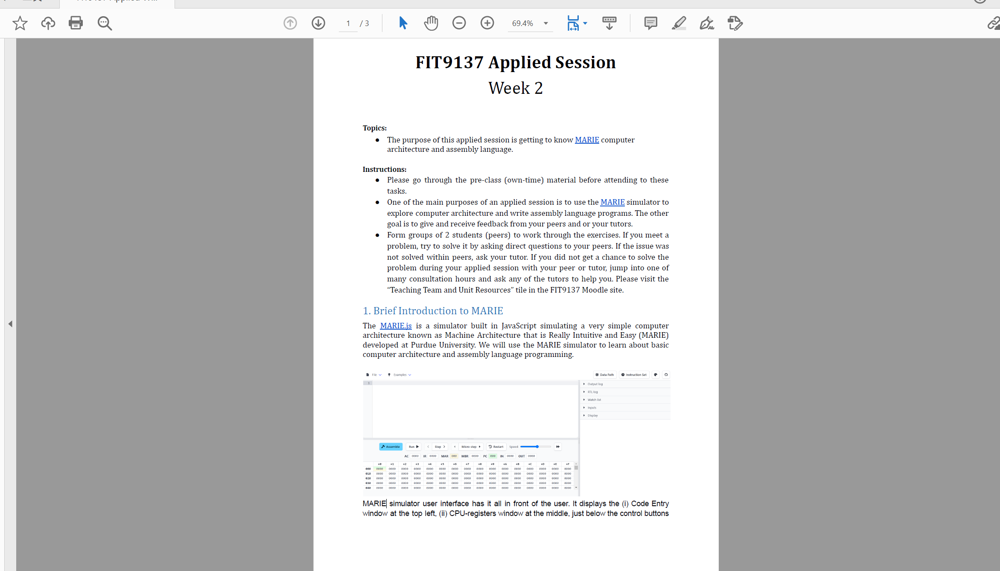


这是 **FIT9137 实验课 Week 2** 的讲义首页，主题是 **MARIE 计算机体系结构与汇编**。按原文要点翻译说明：

# Topics（主题）

- 本次应用课的目的：**认识 MARIE 的计算机体系结构并学习 MARIE 汇编语言**。

# Instructions（上课方式与要求）

- 上课前请先完成**自学材料（pre-class/own-time）**。
- 应用课的核心之一是**使用 MARIE 模拟器**来探索计算机结构并编写汇编程序；另一个目的，是**同伴互评与获得导师反馈**。
- 建议**两人一组**完成练习。遇到问题先和同伴讨论、互相提问；若仍未解决，**再请教导师**。如果应用课上没来得及解决，也可以在**咨询时间（consultation hours）**去问任一位导师（具体见 Moodle 站点 “Teaching Team and Unit Resources”）。

# 1. Brief Introduction to MARIE（MARIE 简介）

- **MARIE** 是一个用 JavaScript 编写的**简单计算机体系结构模拟器**，全称 *Machine Architecture that is Really Intuitive and Easy*，由 Purdue 大学开发。课程将用它来学习**基础的计算机结构与汇编编程**。
- **界面构成**（配图说明）：
  - **代码输入区（Code Entry）** 在**左上**；
  - **控制按钮** 下方是**CPU 寄存器窗口**（Registers）；
  - 另外还有内存/输出等面板（图中展示在界面下部/右侧）。

总之：这页在告诉你——本周实验要用 **MARIE 模拟器**写汇编、理解基本的**CPU 寄存器/内存/指令执行**，按要求两人协作完成练习，不懂先同伴互助，再去找导师。

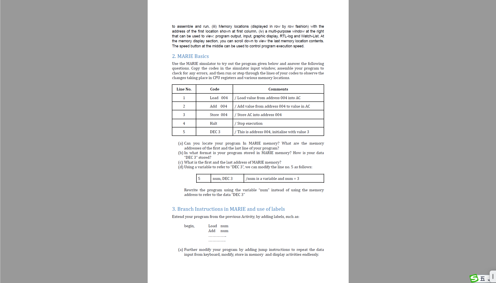

这页是 **MARIE 基础（MARIE Basics）** 的一段练习，给了一个极小的 MARIE 程序，并让你在模拟器里装配、单步、观察寄存器/内存的变化，再回答问题与改写代码。

# 程序与逐行含义

表中给出的指令和注释（按内存地址从小到大）：

- **0：`Load 004`** – 把**地址 004** 中的数读入 AC（累加器）。
- **1：`Add 004`** – 用 AC + **地址 004** 的数，结果仍放进 AC。
- **2：`Store 004`** – 把 AC 的值写回 **地址 004**。
- **3：`Halt`** – 停机。
- **4：`DEC 3`** – 这是**数据**而不是指令；把内存 **地址 004** 初始化为 **3**。

▶️ 运行效果（假设 AC 初值为 0）

- 执行 0：AC ← 3
- 执行 1：AC ← 3 + 3 = 6
- 执行 2：内存[004] ← 6
- 执行 3：停止
- 地址 004 里原来的 3 被改写成 6

# (a) 程序在内存中的位置

这张表默认**第一行指令的地址是 000**，所以：

- **第一行地址**：000
- **最后一行地址**：004（这里既是程序的“数据行”，也是被前面指令引用的地址）

# (b) 程序在 MARIE 中的存放形式；`DEC 3` 如何存放

- MARIE 装配后以 **16 位字**存放，每个地址存放**一条指令或一个数据字**。
- 指令是 **操作码(opcode) + 地址字段** 的机器码；
- `DEC 3` 是**数据伪指令**，把**十进制 3 的数值**直接装入地址 004 的那个字（两补表示，宽度为 MARIE 的字长）。

# (c) MARIE 内存的首/末地址

标准 MARIE 有 **4096 个字**的主存：

- **首地址**：000
- **末地址**：FFF（十六进制），也就是十进制 4095。

# (d) 用“变量名”代替裸地址 004

把第 5 行写成带标签的**变量定义**，并在前面的指令用标签代替数值地址：

```
0   Load    num
1   Add     num
2   Store   num
3   Halt
4   num,    DEC 3      ; num 是标签，值初始为 3
```

装配器会把 `num` 解析成它的实际地址（这里是 004），好处是以后挪动数据位置或增加代码不必手改所有“004”。

# 第 3 部分：分支与标签（Branch & Labels）

练习要求你在上一程序基础上加**标签**，并用**跳转指令**实现循环。示例骨架（与题目里的 begin/num 一致）：

```
begin,  Load    num
        Add     num
        Store   num
        Jump    begin     ; 无条件回到 begin，形成无限循环
num,    DEC     3
```

要“从键盘读入、修改、存、显示并无限重复”，可用 MARIE 的 I/O 与条件/跳转指令（示例）：

```
begin,  Input               ; 从键盘读到 AC
        Add     one         ; 比如加 1
        Store   buf
        Output              ; 把 AC 打印到显示器
        Jump    begin
buf,    DEC     0
one,    DEC     1
```

> 在模拟器里：装配（Assemble）→ 运行或单步（Run / Step）→ 观察 AC、内存地址 004（或 `num`）及 I/O 变化，就能对应上面每一步的效果。

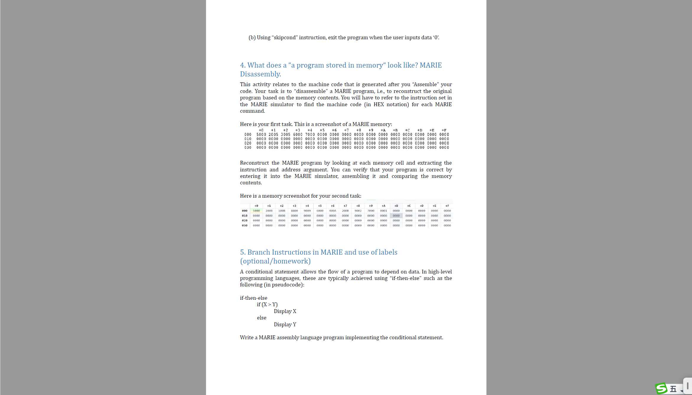

这页有两块内容：**4. 反汇编 MARIE 内存转回程序** 和 **5. 用分支/标签写 if–else**。按原文意思给你拆开讲怎么做、要点是什么。

------

# 4) “程序存到内存里长什么样？”—MARIE 反汇编

任务：给你两张 **内存转储截图**（每格是 16 位十六进制数），让你**把机器码还原成 MARIE 汇编**。

怎么做（步骤）：

1. **逐格读内存**（从程序起始地址开始）。每个内存字是 4 位十六进制：
   - **高 1 位（高 4 bit）= 操作码**；
   - **低 3 位（12 bit）= 地址/立即数**（对不带地址的指令应为 000）。
2. **按指令表映射回助记符**（在模拟器里有一张 ISA 表可查）：常用对照——
   - `1xxx`= `LOAD addr`，`2xxx`= `STORE addr`，`3xxx`= `ADD addr`，`4xxx`= `SUBT addr`
   - `5000`= `INPUT`，`6000`= `OUTPUT`，`7000`= `HALT`
   - `8xyz`= `SKIPCOND cond`（`000`:<0，`400`:=0，`800`:>0）
   - `9xxx`= `JUMP addr`，`A000`= `CLEAR`
   - `Bxxx`= `ADDI addr`，`Cxxx`= `JUMPI addr`，`Dxxx`= `LOADI addr`，`Exxx`= `STOREI addr`
3. **给跳转/数据打标签**：凡是被 `JUMP/JnS/...` 目标到的地址起个 `L1/L2...` 标签；对纯数据单元写成 `X, DEC 10` 或 `HEX 0x003F`。
4. **组装验证**：把你还原的汇编丢进 MARIE 模拟器 `Assemble`，看生成的内存与题给的转储是否**一模一样**；不一致就回去改。

小提示：

- 看见 `HALT (7000)` 后面多半是**数据区**。
- 如果某个 4 位十六进制不在任何合法指令范围，通常它就是**数据**。
- `SKIPCOND` 的 3 位条件码在 12 位里（例如 `8400` 表示“AC==0 时跳过下一条”）。

------

# 5) MARIE 的分支与标签（可选/作业）

题目给了伪代码（if–then–else），要你用 **`SKIPCOND` + `JUMP` + 标签** 实现。示例（比较 `X` 与 `Y`，显示较大者）：

```asm
        Load    X
        Subt    Y            / AC = X - Y
        Skipcond 800         / 若 AC > 0 就跳过下一条（即 X>Y）
        Jump    ShowY        / 否则走 ShowY

ShowX,  Load    X
        Output
        Jump    End

ShowY,  Load    Y
        Output

End,    Halt
X,      DEC     0            / 或者给具体数值 / 由输入得到
Y,      DEC     0
```

要点：

- `Skipcond 000/400/800` 分别测试 **AC<0 / ==0 / >0**。
- 用**标签**标记分支目标位置，读起来更直观，也避免“手算绝对地址”。
- 写完在模拟器里 `Assemble → Run` 验证逻辑。需要输入时可用 `INPUT/STORE` 先把 `X/Y` 写入内存。

如果你把其中一张内存截图的几行数贴出来，我可以现场帮你把它**反汇编成完整 MARIE 程序**。


  


第二个PPT


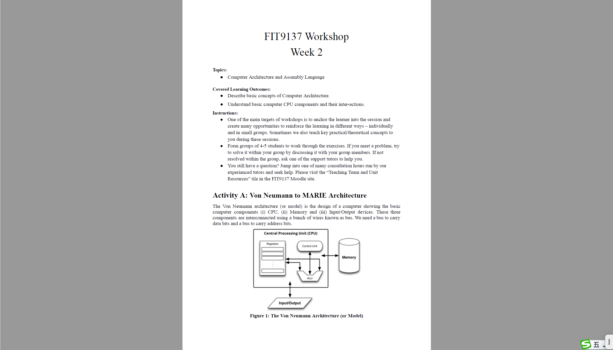


这是 **FIT9137 Workshop Week 2** 的讲义首页。按原文把要点翻译说明给你：

# Topics（主题）

- **计算机体系结构与汇编语言**。

# Covered Learning Outcomes（学习产出）

- 说清**计算机体系结构的基本组成**；
- 理解**CPU 的基本部件**及它们之间如何交互。

# Instructions（活动方式）

- Workshop 的目标是把学习者“锚定”到课堂里，通过**个人与小组**多种方式反复练习；必要时也会补充一些实践/理论概念。
- 建议**4–5 人一组**完成练习。遇到问题先在组内讨论尝试解决；若还不行，再向助教求助。
- 仍有疑问？可以到课程的**咨询时段（consultation hours）**去问任一位导师（时间地点见 Moodle 的 “Teaching Team and Unit Resources”）。

# Activity A：从冯·诺依曼到 MARIE（Von Neumann to MARIE Architecture）

- 介绍**冯·诺依曼模型**：计算机由三大部分组成——**CPU（含控制单元 CU 与算术逻辑单元 ALU）**、**内存**、**输入/输出设备**。
- 这些组件通过多条**总线（bus）\**互联：有\**数据总线**传数据位，**地址总线**传地址位（配图标出了 CU、ALU、寄存器/总线与 Memory、I/O 的连接）。
- 后续会用 **MARIE** 这个简化架构来映射和实践这些概念（寄存器、指令执行、内存交互等）。

一句话：这页在说——本周 workshop 要以**冯·诺依曼模型→MARIE 架构**为主线，分组动手练，掌握 CPU/内存/I-O 的基本关系，并为后续的 MARIE 汇编实验做铺垫。


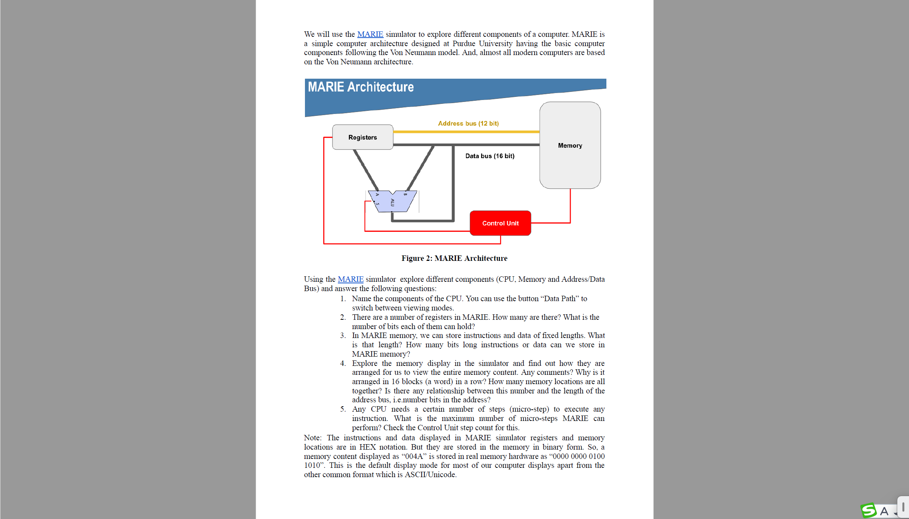

![

这页是 **MARIE 架构（MARIE Architecture）** 的说明 + 要在模拟器里完成的一组提问。按原文内容帮你梳理并直接给出要点答案/思路：

# 图里在说什么

- **地址总线 Address bus：12 位**（图上写着 “Address bus (12 bit)”）
- **数据总线 Data bus：16 位**（图上写着 “Data bus (16 bit)”）
- 组成：**寄存器（Registers）**、**控制单元（Control Unit）**、**主存（Memory）**，典型冯·诺依曼结构。

# 下面的问题（按原文 1–5）

1. **CPU 的组成有哪些？**
    在 MARIE 中，CPU 里主要有这些寄存器与控制部件：

   - **AC**（Accumulator，16 位）
   - **IR**（Instruction Register，16 位）
   - **MBR**（Memory Buffer Register，16 位）
   - **MAR**（Memory Address Register，12 位）
   - **PC**（Program Counter，12 位）
   - **InREG / OutREG**（I/O 寄存器，16 位）
      以及 **Control Unit**（控制单元，产生微操作/控制信号）。在模拟器里点 “Data Path” 视图可以看到连线与数据/地址总线。

2. **MARIE 里有多少个寄存器？每个能存多少位？**
    见上：AC/IR/MBR/InREG/OutREG 为 **16 位**；MAR/PC 为 **12 位**。

   > 记忆口诀：**地址相关（MAR、PC）12 位**，因为地址总线 12 位；其余指令/数据相关的寄存器 **16 位**，因为数据总线 16 位、指令字 16 位。

3. **指令和数据的固定长度是多少？能存多少？**

   - **指令字长 16 位**（高 4 位 opcode，低 12 位地址/立即数——与教材/模拟器默认一致）。
   - **数据字长 16 位。**
   - **内存容量**由地址宽度决定：地址总线 12 位 ⇒ 最多 **2¹² = 4096** 个存储单元（word）。因此 MARIE 主存是 **4096×16 位**。

4. **模拟器内存显示的排布（每行 16 个 word）是什么含义？与地址位数有什么关系？**

   - 界面把内存按**每行 16 个地址**（0x0…0xF）显示，主要是为了配合**十六进制**阅读的便利（4 位二进制=1 位十六进制“半字节/nybble”）。
   - 与地址位数的关系：地址有 **12 位**，可表示 **000₁₆–FFF₁₆** 的 4096 个地址；界面把低 4 位作为行内偏移显示，所以一行恰好 16（2⁴）个格子。

5. **一条指令需要若干“微步骤（micro-step）”才能完成；MARIE 的最大微步骤数是多少？**

   - 这要**看模拟器里的 Control Unit 面板**（原文提示 “Check the Control Unit step count”）。
   - 一般流程：**取指**需要若干固定微操作（如 `MAR←PC`、`MBR←M[MAR]`、`IR←MBR`、`PC←PC+1`、`MAR←IR[addr]` 等），**执行阶段**再根据不同指令添加若干微操作。
   - 不同版本模拟器的“最大步数”读数可能略有差异；你可以在 **Control Unit** 窗口单步运行几条指令（如 `LOAD/ADD/STORE/JnS/INPUT/OUTPUT`）看右上角的 **Step Count**，记录其中最大的那个值作为答案。

------

## 备注（页脚里的小注释解释）

- 模拟器中**寄存器与内存的内容以十六进制显示**，但真实存的是二进制。
- 例：界面显示内存值 “004A”，真实 16 位二进制就是 `0000 0000 0100 1010`。
- 这与我们常见的 **ASCII/Unicode** 文本显示不同；这里显示的是**机器字的数值**。

如果你愿意，我可以根据你现在使用的 MARIE 模拟器版本，陪你点开 Control Unit 一起把第 (5) 题的“最大微步骤数”测出来，然后把过程截图/记录下来当作作业答案 👌

](reademe.assets/image-20250808182338428.png)

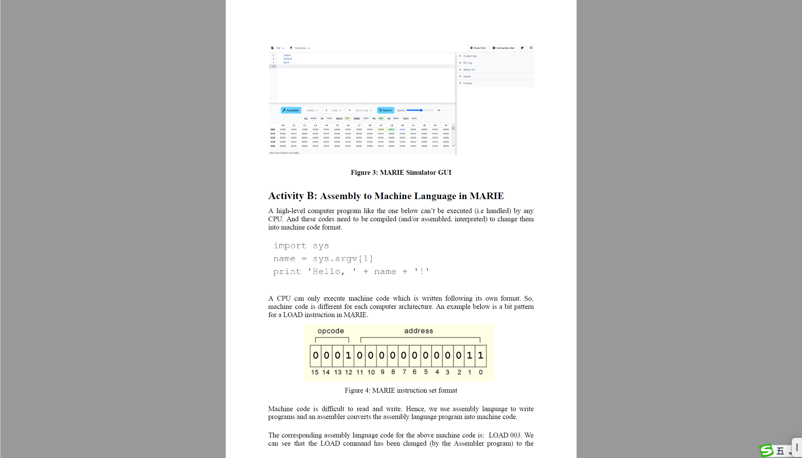

这页是 **Activity B：把 MARIE 汇编变成机器码**。它想说明三件事：

# 1) 只有机器码能被 CPU 执行

上面先举了个高级语言示例（Python 的 “Hello, name”）。这种源码**不能直接被 CPU 执行**，必须经过**编译/汇编/解释**等过程，最终变成**机器码**。

# 2) MARIE 指令字格式（16 位）

中间的图（Figure 4）给出 **MARIE 指令的位布局**：

- **高 4 位 = opcode（操作码）**：决定要执行的是什么指令（如 `LOAD`、`ADD`、`JUMP`…）。
- **低 12 位 = address（地址/操作数）**：通常是内存地址（对无地址指令该字段为 0）。

换句话说，一条 MARIE 指令就是 16 位：`[ opcode(4) | address(12) ]`。
 例如 `LOAD` 的操作码是 **0001₂**（十六进制就是 `1`），所以机器码看起来像 `0001 aaaa aaaa aaaa`。

# 3) 汇编器做了什么（把汇编行翻译成机器码）

- 机器码难读难写，所以我们先写**汇编指令**，再交给**Assembler（汇编器）**翻译。
- 文中给的例子：**`LOAD 003`**
  - 汇编器会把 `LOAD` 映射为 **opcode=0001₂**，
  - 把地址 `003` 写进低 12 位，
  - 形成 16 位机器码：**`0001 0000 0000 0011`**（十六进制就是 **`1003`**）。
- 你在 MARIE 模拟器里点 **Assemble**，下方的 **Machine code memory** 就能看到每条汇编对应的**十六进制机器码**（图上 GUI 截图演示的就是这个过程）。

**一句话：** 这页要你明白——MARIE 的每条汇编指令最终都变成“高 4 位操作码 + 低 12 位地址”的 16 位机器码；例如 `LOAD 003` → `1003`（hex）。

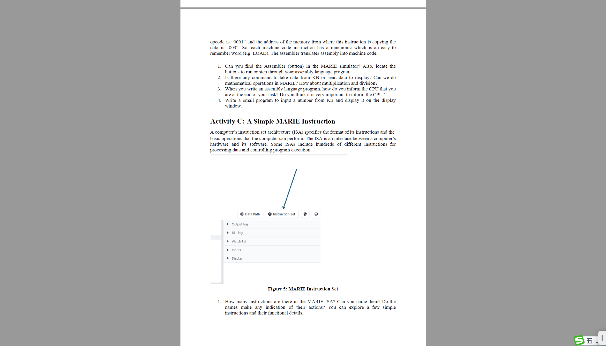


这页分两部分：先给你**4 个关于 MARIE 模拟器与指令**的小问答，然后开始 **Activity C：认识 MARIE 的指令集（ISA）**。我按原文逐条解释并给出可直接用的示例。

# A. 四个问题（配答案）

1. **在哪找 “Assemble / 运行 / 单步” 按钮？**
    在 MARIE 模拟器代码区上方的工具栏：`Assemble` 负责编译汇编→机器码，`Run` 连续执行，`Step` 单步执行。

2. **有把键盘读入 / 向显示器输出的指令吗？能做乘除法吗？**

   - 有：`INPUT`（从键盘读到 AC），`OUTPUT`（把 AC 显示到输出窗）。
   - 算术：有 `ADD`、`SUBT`（加/减）；**没有原生乘除**，需要用循环（重复加/减）或移位-相加等算法自己实现。

3. **写汇编时，怎么告诉 CPU 程序结束了？为什么重要？**
    用 **`HALT`** 指令。没有 HALT，`PC` 会继续往下取指（可能跑进数据区）导致**未定义行为**或死循环。

4. **写一个小程序：从键盘读一个数并显示出来。**
    一个最小“回显”程序如下（可直接粘进模拟器 `Assemble → Run`）：

   ```asm
           INPUT        / 从键盘读到 AC
           OUTPUT       / 输出 AC
           HALT
   ```

   若想把输入先放入内存再取出（示例数据存取）：

   ```asm
           INPUT
           STORE  X
           LOAD   X
           OUTPUT
           HALT
   X,        DEC    0
   ```

# B. Activity C：A Simple MARIE Instruction（认识 MARIE 指令集）

- **ISA 是什么**：指令集架构规定了**指令格式**与 CPU 能做的**基本操作**，是硬件与软件之间的“契约”。
- **在模拟器里怎么看到指令集**：点击下方面板中的 **“Instruction Set”**（图中的箭头所指），会列出所有 MARIE 指令、操作码和含义。
- **有多少条指令？名字能看出用途吗？**
   MARIE 的 ISA 很精简，大约 **一打多一点的指令**（常见这几条）：
   `LOAD, STORE, ADD, SUBT, INPUT, OUTPUT, HALT, SKIPCOND, JUMP, CLEAR, ADDI, JUMPI, LOADI, STOREI`。
   助记符基本和动作同名，直观易懂：例如 `LOAD`=装载，`JUMP`=跳转，`SKIPCOND`=按条件跳过下一条等。
   你可以在该面板逐条点开，查看**操作码（高 4 位）\**和\**操作数/地址（低 12 位）**，再回到代码区尝试写几条指令、`Assemble` 后观察内存里的十六进制机器码如何变化。

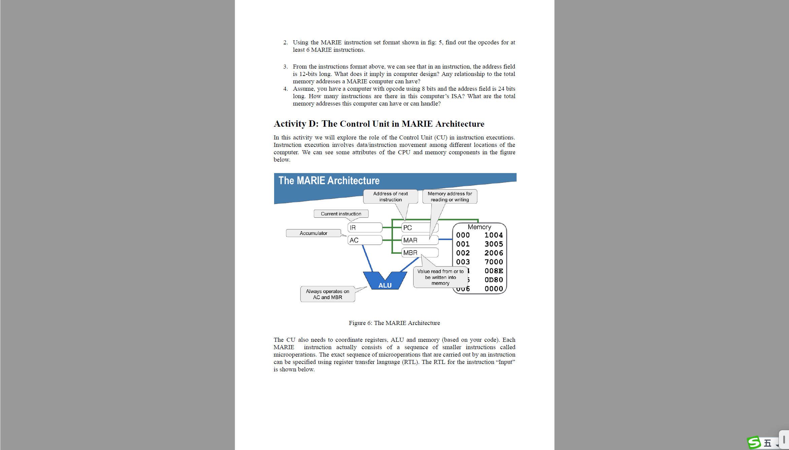

这页在做两件事：
 **(1) 让你用指令格式回答 3 个概念题；(2) 进入 Activity D，理解 MARIE 的控制单元（CU）如何用“微操作”完成取指-执行。**我按原文逐条解释，并把能算出的答案直接给你。

# 上半部分：基于指令格式的问答

- **MARIE 指令字长是 16 位**：高 **4 位是 opcode（操作码）**，低 **12 位是地址/常量字段**。
   这就是你后面要用来找 opcode 和计算地址空间的依据。

**Q2. 用指令格式写出至少 6 条 MARIE 指令的 opcode**（常见教材/模拟器的编码如下，写 6 条即可）：

- `LOAD` = **1x**（十六进制的高 4 位为 1）
- `STORE` = **2x**
- `ADD` = **3x**
- `SUBT` = **4x**
- `INPUT` = **5x**
- `OUTPUT` = **6x**
- `HALT` = **7xxx**（通常忽略地址场）
- `SKIPCOND` = **8x**
- `JUMP` = **9x**
- `CLEAR` = **Ax**
- `ADDI` = **Bx**
- `JUMPI` = **Cx**
- `LOADI` = **Dx**
- `STOREI` = **Ex**
   （写出其中任意 6 个即可，关键是“高 4 位 = opcode”。）

**Q3. 地址字段 12 位意味着什么？与内存容量有何关系？**

- 地址场 12 位 ⇒ **可寻址 2¹² = 4096 个字（word）**。
- 因为 MARIE 的数据/指令字长是 16 位，所以主存规模是 **4096 × 16 bit**。
- 这也解释了为什么 PC、MAR 是 **12 位**（与地址总线同宽），而数据相关寄存器（AC、MBR、IR）是 **16 位**。

**Q4. 假设一个 CPU 的 opcode 8 位、地址字段 24 位，问：**

- 该 ISA 最多有 **2⁸ = 256 条不同指令**；
- 可寻址内存为 **2²⁴ = 16,777,216** 个地址（约 **16M 个字**；若每字 16 位就是 32 MiB 位、即 4 MiB 字节；若每字 8 位就是 **16 MiB 字节**，取决于该机的“字”的大小）。

------

# 下半部分（Activity D）：控制单元如何驱动数据通路

图中把 **寄存器、ALU、内存** 和 **数据/地址总线**画出来了，并给了一个内存窗口。CU（Control Unit）负责在每个时钟步发出控制信号，按**微操作（micro-operations）\**把数据从 A 点搬到 B 点、或触发 ALU 运算。核心流程就是\**取指-译码-执行**：

### 典型“取指”微操作（每步可能对应一次时钟）

1. `MAR ← PC`
2. `MBR ← M[MAR]`（内存读）
3. `IR ← MBR`
4. `PC ← PC + 1`

### 典型“执行”微操作（以 `LOAD X` 为例）

1. `MAR ← IR[addr]`（取出 12 位地址）
2. `MBR ← M[MAR]`（读操作数）
3. `AC ← MBR`

再比如 `ADD X`：
 \5. `MAR ← IR[addr]`
 \6. `MBR ← M[MAR]`
 \7. `AC ← AC + MBR`（由 ALU 完成）

> 图里还标了：ALU **总是作用在 AC 与 MBR**；PC 给出**下一条指令地址**，MAR 给出**本次内存访问地址**；IR 保存**当前指令**。右边内存窗口显示的数值是**十六进制**，但实存是二进制（例如显示 `004A` 实际是 `0000 0000 0100 1010`）。

**关于“最大微步骤数”**

- 原文让你打开 **Control Unit** 面板，单步几条不同指令，观察右上角的 **Step Count**。不同指令的执行步数不同，那个最大值就是答案（取决于你所用的 MARIE 模拟器版本）。
- 一般常见指令在 **7～10 步**左右（含取指）。你可以在模拟器里验证：`LOAD / ADD / STORE / JUMP / SKIPCOND / INPUT / OUTPUT` 等各跑一次，记录最大的计数。

需要我陪你在模拟器里把每条指令的微步骤数跑一遍，顺手做个小表吗？我可以边跑边记，最后给你“指令 → 微步骤数”的清单。


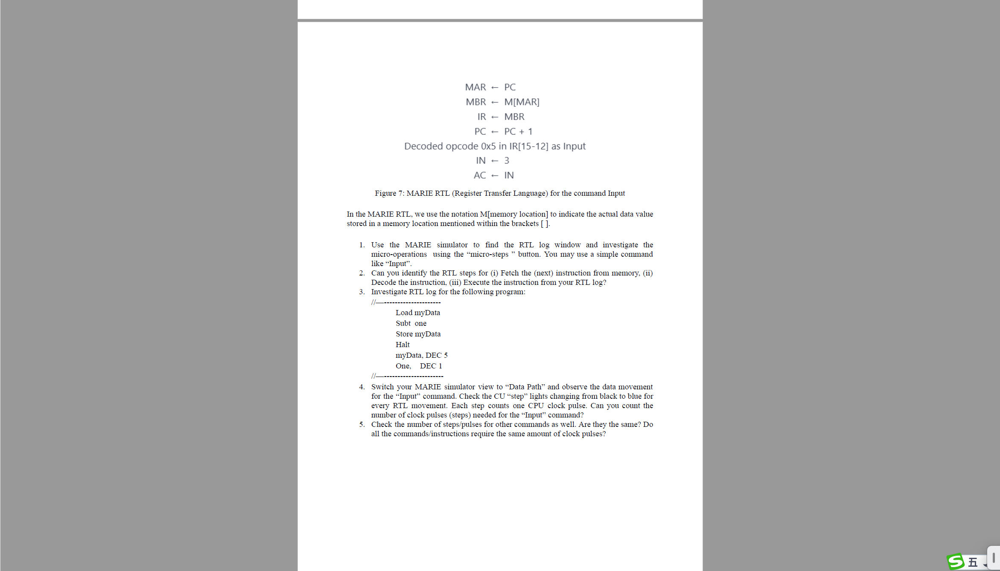

这页在讲 **MARIE 的 RTL（寄存器传送语言）日志**，用“**Input** 指令”为例把一条指令从**取指 → 译码 → 执行**分解成**微操作（micro-steps）**，并让你在模拟器里数一数每条指令需要多少“步/时钟脉冲”。

# 图中 RTL（以 `INPUT` 为例）

按图示顺序，每一行就是一个微操作（寄存器间的数据搬运或控制信号）：

1. `MAR ← PC` （把下一条指令地址放到 MAR）
2. `MBR ← M[MAR]` （内存读：把指令字取到 MBR）
3. `IR ← MBR` （指令装入 IR）
4. `PC ← PC + 1` （PC 自增，指向下一条）
5. 译码：检查 `IR[15..12]` 的 **opcode**，值为 **0x5**，识别为 **INPUT**
6. `IN ← （键盘输入）` （把外设输入寄存器置为用户输入；图示用数字 **3** 作演示）
7. `AC ← IN` （把输入送入累加器 AC）

> 说明：1–4 是**取指周期**；第 5 步是**译码**（有的实现不算时钟步）；6–7 是 **INPUT 的执行周期**。

# 下面问题怎么答（按题目 1–5）

**1)** 打开模拟器的 **RTL Log**，点 **micro-steps** 单步，即可看到上面这些微操作逐条出现。用 `INPUT` 这条最简单。

**2)** 三段式概括：

- **Fetch（取指）**：`MAR←PC` → `MBR←M[MAR]` → `IR←MBR` → `PC←PC+1`（固定 4 步）
- **Decode（译码）**：检查 `IR[15..12]`（是否单独算一步，看你的模拟器实现/灯光标识）
- **Execute（执行）**（以 INPUT）：`IN←设备` → `AC←IN`（2 步）

**3)** 让你用 RTL Log 分析这段程序：

```
Load myData
Subt one
Store myData
Halt
myData, DEC 5
one,    DEC 1
```

执行效果与对应微操作要点：

- **LOAD myData**：`MAR←&myData` → `MBR←M[MAR]` → `AC←MBR`
- **SUBT one**：`MAR←&one` → `MBR←M[MAR]` → `AC←AC - MBR`
- **STORE myData**：`MAR←&myData` → `MBR←AC` → `M[MAR]←MBR`
- **HALT**：停止
   初值 `myData=5`，减去 `one=1` 后存回，最后 `myData=4`。

**4)** 切到 **Data Path** 视图观察 `INPUT` 的数据流动，同时看 **Control Unit** 的“step”灯由黑变蓝：

- **时钟脉冲数**一般为：取指 **4** + 执行 **2** = **6**。
   有的版本把“译码”也算一步，可能显示 **7**。以你使用的模拟器读数为准。

**5)** 统计其他指令的步数/脉冲：

- 不同指令**步数不同**（例如 `LOAD/ADD` 常见 7 步左右，`STORE` 也差不多，`JUMP`/`HALT` 通常更少）。
- 共同点：**取指始终 4 步**，差异主要在**执行阶段**需要的微操作多少。

要不要我按你手上的模拟器版本，帮你把常见指令（LOAD/STORE/ADD/SUBT/JUMP/INPUT/OUTPUT/SKIPCOND/HALT）的实际步数跑一遍做成小表？


第三个PPT

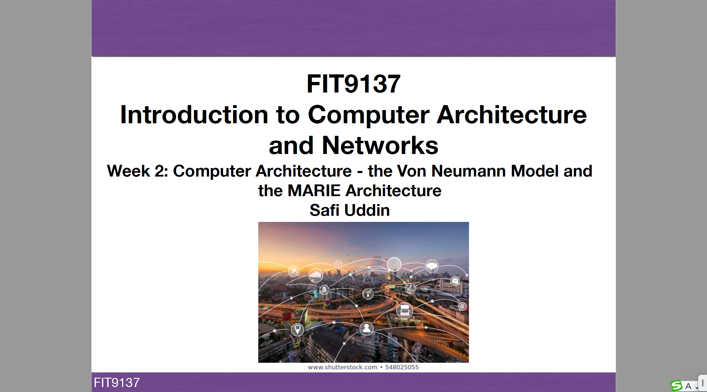


这是这套课件的**封面页 / 标题页**。

- 课程：**FIT9137 – Introduction to Computer Architecture and Networks（计算机体系结构与网络导论）**
- 本周主题（Week 2）：**Computer Architecture – the Von Neumann Model and the MARIE Architecture**
   也就是先讲**冯·诺依曼模型**（CPU、内存、I/O 以及总线的基本构成与工作方式），再用**MARIE**这台简化教学用计算机架构来落地演示（寄存器、指令格式、汇编/机器码、在模拟器里运行等）。
- 授课者：**Safi Uddin**。

一句话：这一周你会从**经典架构模型**入门，然后在 **MARIE 模拟器**上实践指令执行与汇编编程，理解 CPU 与内存/I-O 的交互。

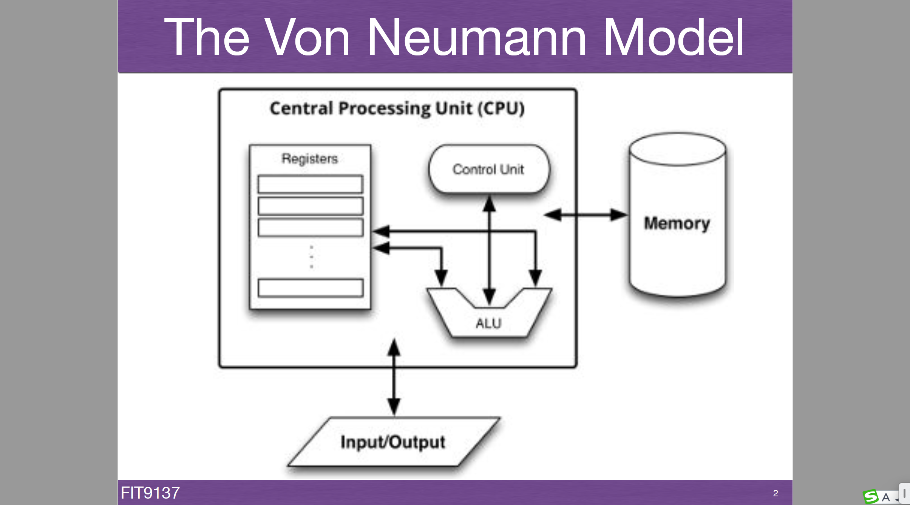

这是在说明**冯·诺依曼模型（The Von Neumann Model）**——现代通用计算机的经典架构。图中各部分含义如下：

- **CPU（中央处理器）**：由两块核心组成
  - **Control Unit（控制器）**：按时序发出控制信号，负责**取指→译码→执行**的流程调度。
  - **ALU（算术逻辑单元）**：对数据做加减、与或非、比较等运算。
  - **Registers（寄存器）**：CPU 内部的小而快的存储，如 **PC**（程序计数器，指向下一条指令）、**IR**（指令寄存器，保存当前指令）、**ACC/通用寄存器**（保存中间数据）等，用来暂存指令与数据、加速运算。
- **Memory（主存）**：存放**指令与数据**（冯·诺依曼模型的关键点：**程序和数据同存一处、同一通道访问**）。CPU 通过地址/数据总线与内存交换信息。
- **Input/Output（输入/输出）**：键盘、显示器、磁盘、网络等外设。控制器与 I/O 接口协同，把外部世界的数据引入或输出。
- **工作机理（取指—译码—执行循环）**
  1. **取指**：`PC` 给出地址，CPU 从 **Memory** 取回指令放入 `IR`；`PC` 自增。
  2. **译码**：控制器解析 `IR` 的操作码和地址/立即数字段。
  3. **执行**：若是运算，交给 **ALU**；若是访存，读/写 **Memory**；若是 I/O，则与外设交互。完成后继续下一轮。
- **典型问题**：由于指令与数据共用同一存储与总线，会出现**冯·诺依曼瓶颈**（CPU 等内存、带宽不够导致性能受限）。

一句话：这张图展示了**存储程序**思想下，CPU（控制+运算+寄存器）通过总线与**统一的内存**和 **I/O** 不断进行“取指—译码—执行”的循环——这就是绝大多数通用计算机的基本工作方式。

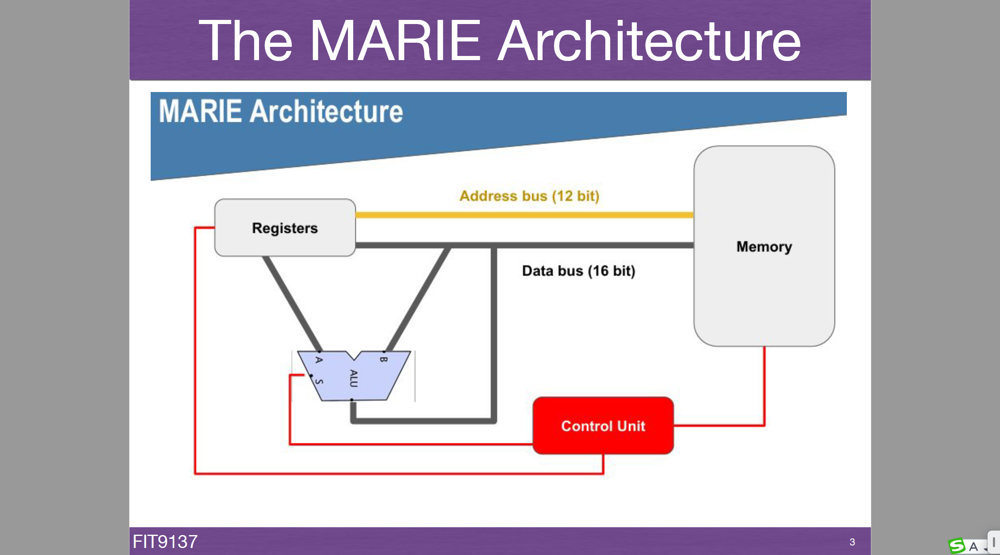

这页是 **MARIE 架构总览图**，把这台教学用计算机的核心部件和连线一次性画出来。按图逐一解释：

## 组成部件

- **Registers（寄存器组）**：MARIE里常提到的有
  - **PC**：程序计数器，给出**下一条指令的地址**；
  - **IR**：指令寄存器，存放**当前指令**；
  - **MAR**：存放要访问的**内存地址**（接到**地址总线**上）；
  - **MBR/MDR**：存放**从内存读/要写回内存的数据**（接到**数据总线**上）；
  - **AC**：累加器，是算术/逻辑运算的主要数据寄存器。
     这些寄存器之间通过数据总线与ALU相连。
- **ALU**（图中蓝色多边形，标注 A/B/S）：算术逻辑单元，A、B 为两个输入端，S 表示状态/控制选择。加法、减法、清零等操作都在这里做，结果回写到 **AC** 或 **MBR**。
- **Memory（内存）**：存程序和数据。
  - MARIE 的**地址总线是 12 位**（图上黄色线），意味着最多能编址 **2¹² = 4096 个字**；
  - **数据总线是 16 位**（图上灰色线），所以一个内存字=16 位。
  - 也因此，**一条指令=16 位**：高 4 位是 **opcode**，低 12 位是 **地址**。
- **Control Unit（控制单元）**（红色方块）：产生控制信号（图上红线），按 **取指—译码—执行** 周期驱动寄存器、ALU、内存/总线协同工作。

## 总线

- **Address bus（12-bit）**：只传**地址**，从 **MAR/PC → 内存**。
- **Data bus（16-bit）**：传**数据/指令字**，在 **内存 ↔ MBR/AC/ALU** 之间流动。

## 一次典型“取指—执行”如何在图上走

1. **取指**：`MAR ← PC`（地址上到黄色线）→ 内存把该地址的 **16位指令**放到灰色**数据总线** → `MBR ← Mem[MAR]` → `IR ← MBR` → `PC ← PC+1`。
2. **译码**：控制单元读 IR 的**高4位**得出操作码，**低12位**当作操作数地址。
3. **执行**（以 `LOAD X` 为例）：`MAR ← X` → 读内存到 `MBR` → `AC ← MBR`。若是 `ADD X`：再把 `AC` 与 `MBR` 送入 **ALU** 的 A/B 口运算，结果回写 `AC`。遇到 `JUMP L`：`PC ← L`。`HALT`：控制单元停止发控制信号。

## 这张图想传达的关键点

- **12位地址总线 + 16位数据总线** 定义了 **4096×16 位** 的内存模型，也解释了 **指令“4位操作码 + 12位地址”** 的格式。
- **寄存器—ALU—内存** 通过两根总线被控制单元“编排”，完成所有指令。
- MARIE非常简洁：所有高层语言程序最终都会被翻成这种**在总线上搬数据、在ALU里算、靠控制单元时序驱动**的底层行为。

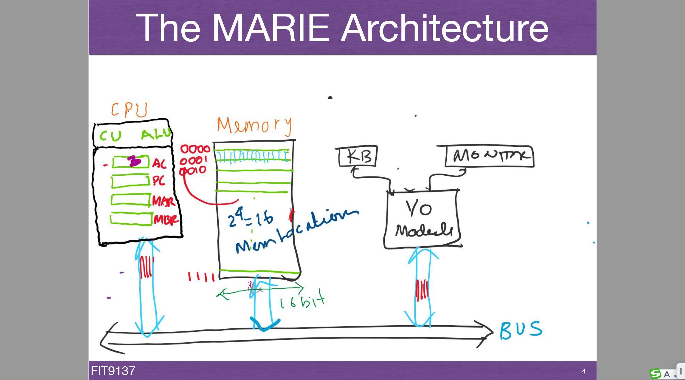

这页是手绘版的 **MARIE 架构**速记图，把 CPU、内存、I/O 和总线的关系画出来了。逐块解释——

- **CPU（左）**
  - **CU（Control Unit）控制单元**：发出控制信号，驱动“取指→译码→执行”。
  - **ALU**：算术/逻辑运算器，只对 **AC**（累加器）与 **MBR** 的数做运算。
  - **寄存器**（从上到下常见这几个）：
    - **AC**：累加器，存放运算结果/中间值（图里画了当前是 3）。
    - **PC**：程序计数器，存放**下一条指令地址**。
    - **MAR**：内存地址寄存器，放**本次要访问的内存地址**。
    - **MBR**：内存缓冲寄存器，放**从内存读来或将写回的 16 位数据**。
- **Memory（中）**
  - 竖条表示主存的很多**存储单元（word）**，每格可存一条指令或一个数据。
  - 旁边“0000、0001 …”是**地址**。标准 MARIE 地址宽 **12 位**（并非 2⁴=16 个，这里只是课堂草图），所以共有 **2¹²=4096** 个地址；
  - **数据/指令字长 16 位**（图底部标了 *16 bit*），与 **数据总线**宽度一致。
- **I/O 模块（右）**
  - 通过**I/O 模块**把键盘（KB）、显示器（MON/Monitor）等外设连到系统。
  - MARIE 常用 **IN/OUT 寄存器** 与 `INPUT/OUTPUT` 指令在 CPU 与 I/O 间搬数据。
- **BUS（底部总线）**
  - 系统共享的通信通道。MARIE 里通常区分：**地址总线 12 位**、**数据总线 16 位**（图用粗细箭头表示数据在 CPU↔内存↔I/O 之间流动）。
- **工作流程（结合这些部件）**
  1. **取指**：`MAR←PC` → 从内存把指令读到 `MBR` → `IR←MBR` → `PC←PC+1`。
  2. **执行**：若是 `LOAD X`：`MAR←X`、读内存到 `MBR`、`AC←MBR`；若 `ADD X`：`AC←AC + MBR`；I/O 指令则在 `IN/OUT` 与 `AC` 之间传送。

**一句话**：这张图强调两点——**地址 12 位决定可寻址 4096 个字**，**数据 16 位决定每次传的是 16 位字**；CPU（CU+ALU+寄存器）通过总线与内存、I/O 协同，循环完成取指—执行。

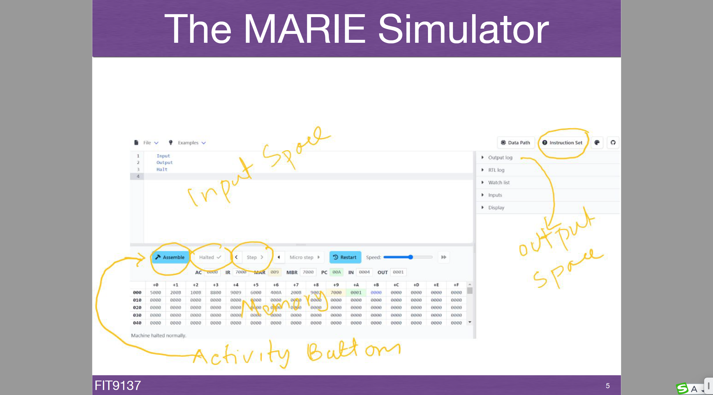


这页是在**认门**：MARIE 在线模拟器各个区域/按钮都干嘛的。黄色手写标注已经圈了重点，我给你按区块解释一遍，照着界面就能上手。

## 1) Input space（左上，代码区）

- 你在这里**键入 MARIE 汇编**（每行一条指令/伪指令），如：

  ```
  Input
  Output
  Halt
  ```

- 写好后点 **Assemble** 才会把汇编翻成机器码并装入内存。

## 2) Activity buttons（中下，控制栏）

- **Assemble**：汇编+装载程序；下方内存视图会出现十六进制指令。
- **Step**：**单步执行**一条指令（PC 指向的那条）。旁边的 `>` 可以一次步进多条。
- **Restart**：把 CPU/寄存器/PC 重置到程序起点（不必重新汇编）。
- **Micro step**（有的版本显示）：按**微操作**级别执行，观察一次取指/执行周期的细分动作。
- **Speed** 滑条 + 播放按钮：控制自动运行的速度/开始暂停。
- 左下的大表是**内存视图（Memory）**：按地址显示 16 位机器码/数据（十六进制）。
- 控制栏下方还会显示关键**寄存器值**：`AC, IR, MAR, MBR, PC, IN, OUT` 等，随着执行实时变化。
  - 例如 `PC` 是下一条指令地址，`IR` 当前指令，`AC` 累加器，`IN/OUT` 是输入/输出缓冲寄存器。

## 3) Output space（右侧抽屉面板）

- **Instruction Set**：指令集手册。点开能看到每条 MARIE 指令的**助记符、操作码（高4位）**及说明。
- **Data Path**：数据通路图（动画版），配合 micro-step 看取指/执行流程很直观。
- **Output log**：程序执行时的**输出**（`OUTPUT` 指令把 AC 的值送到这里）。
- **Inputs**：给 `INPUT` 指令准备的**输入队列**（可预填值）。
- **Display**：有的版本把 OUT 值以字符/数值形式显示在这。
- **RTL log / Watch list**：
  - RTL 是寄存器传送级日志（Register-Transfer Level），记录“`AC ← MBR`”这类微操作；
  - Watch list 可盯住某些地址/寄存器，方便调试。

## 4) 一次最小演示（对着图就能跑）

1. 在 **Input space** 写：

   ```
   Input
   Output
   Halt
   ```

2. 点 **Assemble** → 内存区出现 `5000, 6000, 7000`（INPUT/OUTPUT/HALT 的机器码）。

3. 点 **Step**：第一次会等待输入；在 **Inputs** 面板填一个数或在弹窗输入。

4. 继续 **Step**：看 `AC` 变成输入值，`OUT`/Output log 显示同样的值，再 `Halt` 结束。

## 5) 两个常见坑

- **忘记 HALT**：PC 会一直往下跑，可能撞到数据区或空内存导致异常。
- **Assemble 之后改了代码没重新 Assemble**：内存里还是旧机器码；每次修改都要点一次 Assemble。

有了这张“地图”，你就能：在左上写代码 → 中下汇编/运行 → 右侧查指令手册、看输出与数据通路。需要我给你列一张 MARIE 常用指令速查表吗？


这是“**活动A：从冯·诺依曼模型到 MARIE 架构**”的过渡页。意思是：接下来要把你在**冯·诺依曼模型**里学到的通用部件（CPU=控制器+ALU+寄存器、内存、I/O、总线、取指-执行循环）**一一映射**到教学机 **MARIE** 的具体实现上。

你在这部分通常要做/理解的点就是：

- **对应关系**
  - 冯·诺依曼的 **Control Unit / ALU / Registers** → MARIE 的 **CU / ALU / AC、PC、IR、MAR、MBR**。
  - **Memory** → MARIE 的主存（指令和数据同存）。
  - **I/O** → MARIE 的 `INPUT/OUTPUT`（IN/OUT 寄存器）。
  - **总线** → MARIE 的 **地址总线 12 位**、**数据总线 16 位**。
- **字长与可寻址**
  - 指令/数据**16 位**；地址字段 **12 位** ⇒ 可寻址 **2¹²=4096** 个字（word）。
- **取指—执行循环在 MARIE 里的具体步骤**
  - 取指：`MAR←PC` → `MBR←M[MAR]` → `IR←MBR` → `PC←PC+1`
  - 执行：根据 `IR` 的操作码对 AC/内存/I-O 进行相应微操作（如 `LOAD/ADD/STORE/INPUT` 等）。
- **你通常要完成的任务**
  1. 说出各部件在 MARIE 中的名字与作用；
  2. 说明为什么地址 12 位会限制内存规模；
  3. 用 RTL（寄存器传送语言）跟踪一条指令的微步骤；
  4. 在模拟器里观察数据如何沿着总线在 **CPU↔内存↔I/O** 间流动。

一句话：这页提示你把“抽象的冯·诺依曼模型”落到“可操作的 MARIE 机器”上，理解**同一思想、具体实现**。

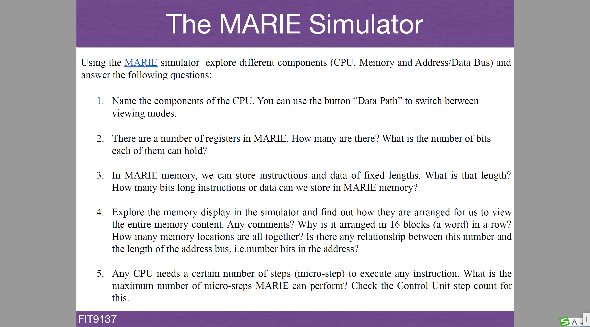

这页是在让你**用 MARIE 模拟器认识部件并回答 5 个问题**。我把每题都按原文要求讲清楚，并给出结论/怎么在模拟器里看到。

------

### 1) CPU 都由哪些部件组成？

在 **Data Path** 视图能看到：

- **寄存器组（Registers）**：AC、MAR、MBR、PC、IR、IN、OUT
- **ALU**：算术逻辑单元
- **Control Unit**：控制单元（发出控制信号）
   它们通过 **地址总线（12 位）** 与 **数据总线（16 位）** 同内存交互。

------

### 2) MARIE 里有多少寄存器？各能存多少位？

常用 7 个寄存器（教材/模拟器一致）：

- **AC**（累加器）——**16 位**
- **MAR**（内存地址寄存器）——**12 位**
- **MBR**（内存数据寄存器）——**16 位**
- **PC**（程序计数器）——**12 位**
- **IR**（指令寄存器）——**16 位**
- **IN**（输入寄存器）——**16 位**
- **OUT**（输出寄存器）——**16 位**

> 规律：**地址相关（PC/MAR）12 位**；**数据/指令相关（AC/MBR/IR/IN/OUT）16 位**。

------

### 3) MARIE 内存里，指令/数据的固定长度是多少？

- **一条指令 = 16 位**（高 4 位 opcode，低 12 位地址/操作数）
- **一个数据字 = 16 位**
   所以内存里存放的每个“字”（无论是指令还是数据）都是 **16 位**。

------

### 4) 模拟器里的内存显示为什么一行 16 格？一共有多少个地址？跟地址总线有什么关系？

- 一行 **16 个单元**是按 **十六进制 0~F** 分组，便于阅读。
- MARIE 地址总线 **12 位** ⇒ 可寻址 **2¹² = 4096** 个字（地址从 `000` 到 `FFF`）。
- **关系**：可寻址单元数 = 2地址位数2^{\text{地址位数}}。这里就是 4096×16 位的内存。

------

### 5) 一条指令需要多少“微步（micro-step）”？最多能到多少？

- 指令执行由 **取指 → 译码 → 执行** 的若干微操作组成；不同指令需要的微步数**不同**（例如 `LOAD` 比 `JUMPI/STOREI` 少）。
- **怎么查**：打开右侧 **Control Unit** 面板，单步或微步执行时会显示当前的 **micro-step 计数**，你能看到**该模拟器给出的最大微步数上限**。

> 这道题本身要你**在模拟器里观察**并记录上限；跟随计数器跑一遍最复杂的指令即可得到答案。

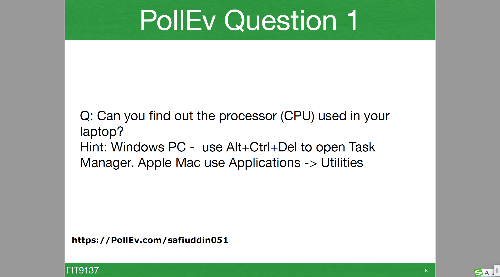

这是课堂互动投票题 **PollEv Question 1**。题目要你**查出自己笔记本使用的处理器（CPU）型号**。
 幻灯片给的提示：

- **Windows**：按 **Ctrl + Alt + Del** → 打开 **任务管理器（Task Manager）** → 选 **“性能”**（Performance）→ 左侧点 **CPU**，右上角就能看到型号（如 *Intel Core i7-xxxx* / *AMD Ryzen xxxx*）。
   备用路径：开始菜单 → **设置** → **系统** → **关于**（About）→ *处理器*。
- **macOS**：**应用程序（Applications） → 实用工具（Utilities）** 里打开 **系统信息（System Information）**，在 **硬件总览**能看到 *芯片/处理器*。
   备用：左上角 **** → **关于本机**（About This Mac）→ 显示 *芯片*（Apple Silicon）或 *处理器*（Intel）。

底部的网址是投票页面，用来提交你的答案。

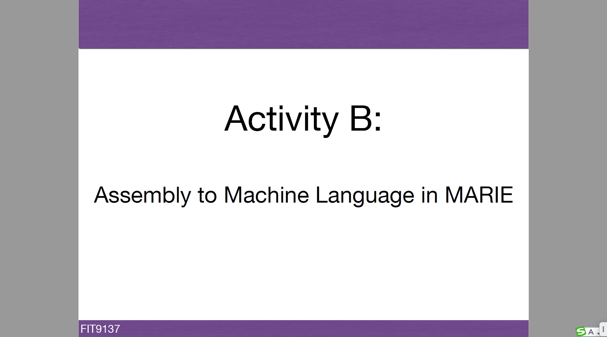

这是一个**分节标题页**：
 **Activity B：把 MARIE 汇编代码转换成机器语言**。

这一部分要你做/学的是：

- 了解 **MARIE 指令字格式**：16 位一条指令＝**高 4 位 opcode** + **低 12 位地址/操作数**。
- 会用模拟器里的 **Assemble** 按钮，把你写的汇编翻译成十六进制机器码，并在内存窗口核对。
- 能根据指令集（Instruction Set）把汇编 ↔ 机器码**相互对应**，例如：
  - `LOAD 003` → `1 003` → 机器码 **1003**
  - `ADD 00A` → `3 00A` → 机器码 **300A**
  - `INPUT/OUTPUT/HALT` → **5000 / 6000 / 7000**

简而言之：这节的目标就是**掌握从“助记符”到“16 位机器码”的翻译过程**，并在模拟器中验证结果。

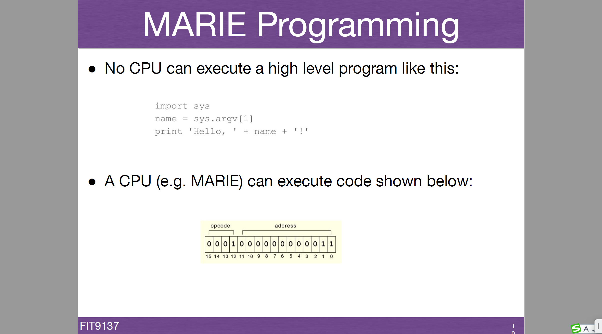

这页在说明两件事——

1. **CPU不能直接执行高级语言代码**
    像图上那段 Python（`print 'Hello, ' + name + '!'`）这种**高级语言**，CPU看不懂。必须先**编译/汇编**成机器能执行的**机器码**或**指令**。
2. **CPU（以 MARIE 为例）只能执行机器指令格式**
    下方的小图就是 **MARIE 指令字**：总长 **16 位**，左边高位是 **opcode（操作码，高4位）**，右边低位是 **address（地址，低12位）**。
    图中那串位形如：`0001 0000 0000 0011`，意思是：
   - `0001` = 操作码 → 在 MARIE 中对应 **LOAD** 指令（示例）
   - `0000 0000 0011` = 地址 → 访问内存 **地址 3**
      也就是“**从地址3把数据装入累加器**”。

**一句话**：高级语言 →（编译/汇编）→ 这种16位的“opcode+地址”机器指令；CPU（如 MARIE）只能执行后者，而不是直接跑 Python/Java。

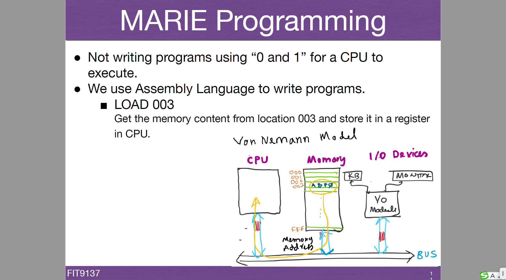

这页在讲：**别直接用“0/1”写程序，而是用汇编；汇编再由汇编器变成机器码。**
 给了一个最小示例 **`LOAD 003`**，意思是：**把内存地址 003 里的内容取出来，放进 CPU 的寄存器（AC）**。右下角的手绘图用冯·诺依曼模型说明“CPU—内存—I/O 通过总线连接”的取数流程。

# 这条指令到底做了什么？

在 MARIE 里一条指令是 16 位：**高 4 位 opcode + 低 12 位地址**。

- `LOAD` 的 opcode 是 **0001₂**（十六进制就是 **1**），
- `003` 是 12 位地址，
- 所以机器码是 **`1003`**（hex）。

# 执行 `LOAD 003` 的微操作（简化）

1. **译码**：从 IR 读出 opcode=LOAD，地址=003。
2. **访存**：`MAR ← 003`；`MBR ← Mem[MAR]`（把地址 003 的数据读到 MBR）。
3. **写回**：`AC ← MBR`（数据进入累加器 AC）。

# 图里在强调的点

- **CPU**（寄存器+ALU+控制单元）通过**地址总线（12位）\**和\**数据总线（16位）\**和\**内存**通信；
- **I/O 设备**（键盘/显示器）也接在总线上（`INPUT/OUTPUT` 指令会与 IN/OUT 寄存器交互）；
- 开发时我们**写汇编**（如 `LOAD 003`），由汇编器翻成**机器码（0/1）**给 CPU 执行。

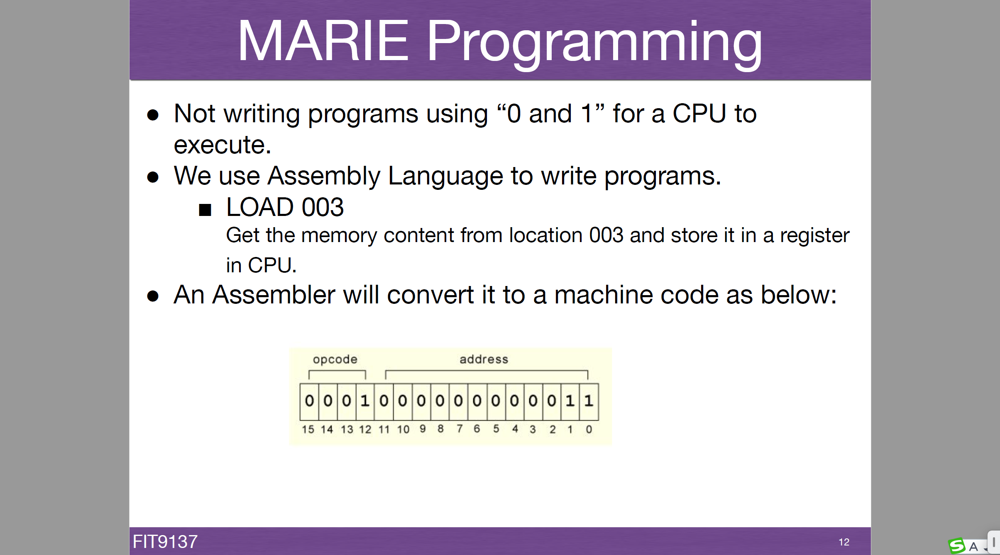

这页在说明 **用汇编语言写 MARIE 程序并由汇编器转成机器码**。按原文逐条解释：

- **不是直接用“0和1”写程序**
   CPU只能执行机器码，但人类不需要手写一串二进制位。
- **我们用汇编语言（Assembly）来编程**
   例子：`LOAD 003`
   含义：从**内存地址 003** 取出一个 16 位数据，装入 CPU 的累加器（AC）。
- **汇编器（Assembler）把汇编指令翻译成机器码**
   MARIE 的指令字是 **16 位**：高 **4 位 opcode**（操作码），低 **12 位 address**（地址）。
   例子中机器码示意为：`0001 0000 0000 0011`
  - `0001` = `LOAD` 的操作码
  - `0000 0000 0011` = 地址 **3**（十进制），即 `0x003`

> 小补充：实际写程序时还会用**标签**（如 `num, DEC 3`），汇编器会把标签替换成正确的地址，所以代码搬家也不必手改数字地址。

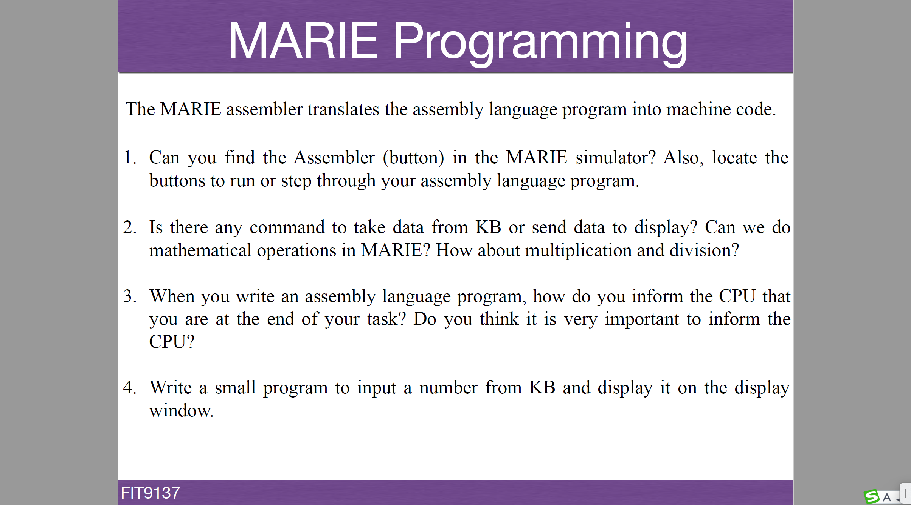


这页是 **MARIE 编程** 的四个小问答。按原文逐条给你答案＋要点：

1. **Assembler 在哪？运行/单步按钮在哪？**
    在代码区上方工具栏：

   - **Assemble**：把汇编翻成机器码并装入内存
   - **Run / ▶**：连续执行
   - **Step**：单步执行（旁边可调一次走多步）
   - **Restart**：复位寄存器/PC 重新开始

2. **有从键盘取数据/向显示器输出的指令吗？能做乘除吗？**

   - 有：**`INPUT`**（键盘→AC），**`OUTPUT`**（AC→显示）
   - 算术：有 **`ADD`**、**`SUBT`**；**没有原生乘/除**，需用循环或算法自己实现

3. **怎么告诉 CPU 程序结束？重要吗？**

   - 用 **`HALT`** 指令结束执行
   - 很重要：没有 `HALT`，PC 会继续取指，可能跑进数据区或死循环

4. **写个小程序：从键盘读入一个数并显示**

   ```asm
   INPUT       / 读入到 AC
   OUTPUT      / 输出 AC
   HALT
   ```

   （若想演示存取内存）

   ```asm
   INPUT
   STORE  X
   LOAD   X
   OUTPUT
   HALT
   X,     DEC   0
   ```

顺手记：MARIE 一条指令 16 位＝高 4 位 **opcode** + 低 12 位 **地址/操作数**；地址总线 12 位 ⇒ 可寻址 4096 个 16 位字。


这是一个**分节标题页**：

**Activity C：A Simple MARIE Instruction（一个简单的 MARIE 指令）**。

意思是接下来这一节要你在模拟器里**聚焦一条指令**来学习——查看 **Instruction Set** 面板，理解指令格式（16 位：高 4 位操作码、低 12 位地址），在数据通路上观察取指→译码→执行的微步骤，并用一两条指令（如 `LOAD`、`ADD`、`JUMP`、`INPUT/OUTPUT`）写个很小的示例，看看寄存器/内存如何变化。

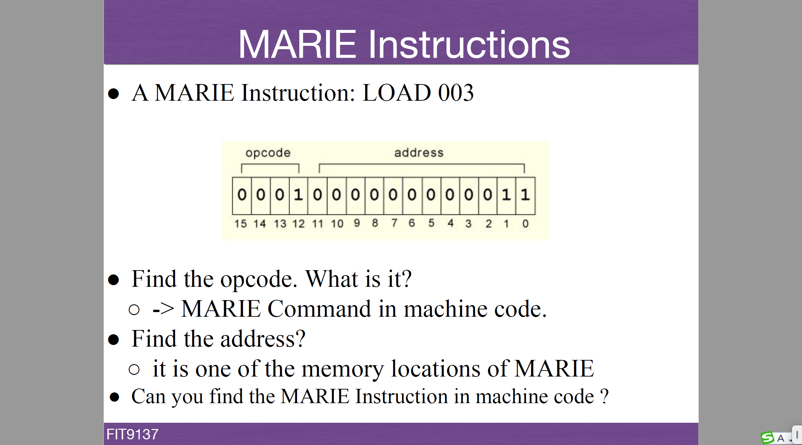


这页用一条具体指令 **`LOAD 003`** 教你怎么看 **MARIE 指令的位格式**，并把它写成机器码。

## 指令字格式

- MARIE 每条指令 **16 位**：**高 4 位 = opcode（操作码）**，**低 12 位 = address（地址/操作数）**。
- 图上从 **bit15→bit0** 给出了 `LOAD 003` 的二进制位串。

## 这条指令怎么拆

- **opcode（高4位）**：`0001` → 这就是 **LOAD** 的机器码操作码。
- **address（低12位）**：`000000000011` → 十六进制是 **`003`**，表示内存地址 003。

## 整条机器码

把二者拼起来得到：

- 二进制：`0001 0000 0000 0011`
- 十六进制：**`1003`**
   这就是 “MARIE Instruction in machine code”。

## 含义回顾

`LOAD 003`：从**内存地址 003** 取 16 位数据到 **AC（累加器）**。

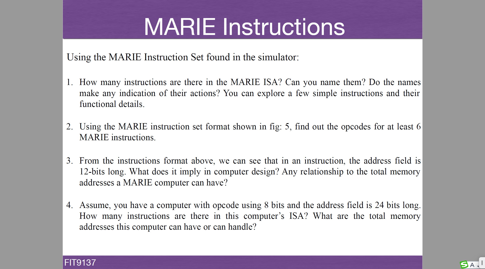

这页是在让你**用模拟器里的 MARIE 指令集**回答 4 个小问题。我按原文逐条解释，并给出标准答案/要点（不同模拟器细节可能略有差异，我用最常见的版本）：

1. **MARIE 里有多少条指令？能写出名字吗？**
    典型指令集（以 Null & Lobur 版和常见模拟器为准）包括：
    **JnS**（Jump-and-Store），**LOAD，STORE，ADD，SUBT，INPUT，OUTPUT，HALT，SKIPCOND，JUMP，CLEAR，ADDI，JUMPI，LOADI，STOREI**。
    说明：不同教材/模拟器可能是否包含 *JnS* 或个别指令有差异，但大体就是这些。
2. **写出至少 6 条指令的操作码（opcode）**（高 4 位十六进制）
   - `LOAD` = **0x1**
   - `STORE` = **0x2**
   - `ADD` = **0x3**
   - `SUBT` = **0x4**
   - `INPUT` = **0x5**
   - `OUTPUT` = **0x6**
   - `HALT` = **0x7**
   - `SKIPCOND` = **0x8**
   - `JUMP` = **0x9**
   - `CLEAR` = **0xA**
   - `ADDI` = **0xB**
   - `JUMPI` = **0xC**
   - `LOADI` = **0xD**
   - `STOREI` = **0xE**
   - （若支持）`JnS` = **0x0**
      ——写出其中任意 6 个即可。
3. **指令的地址字段是 12 位，意味着什么？跟内存有何关系？**
    地址位宽 **12 位 ⇒ 可寻址 2¹² = 4096 个地址（word）**。
    因为 MARIE 的字长是 **16 位**，所以主存规模是 **4096×16 位**。这也就是为什么 **PC、MAR 是 12 位**（跟地址总线同宽）。
4. **假设某计算机的 opcode 用 8 位、地址字段 24 位：**
   - 指令条数（ISA 最大指令数）= **2⁸ = 256**。
   - 可寻址内存地址数 = **2²⁴ = 16,777,216（约 16M 个地址）**。
      （至于总字节数要看该机“一个地址对应的字长”是 8 位还是 16 位，这里题目只要“地址数量”。）

需要的话，把你模拟器上显示的**指令—opcode**截图给我，我帮你核对是否包含 *JnS*，顺便整理成一页表格。

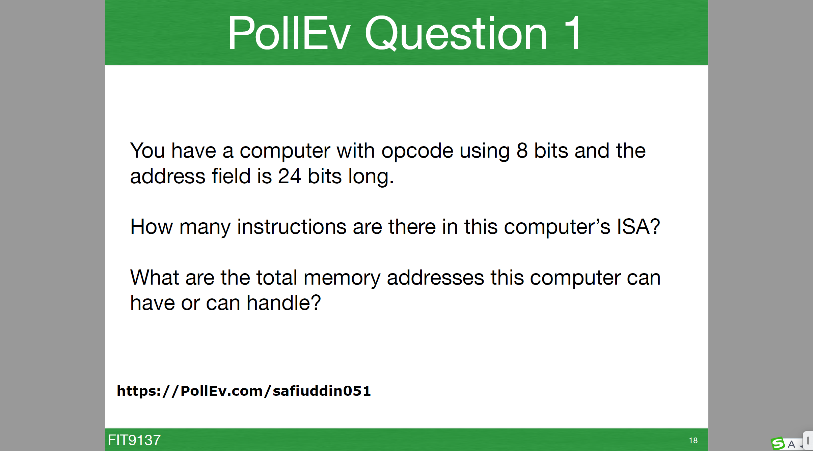


这是一个小测题：

**已知**：opcode（操作码）8 位，地址字段 24 位。
 **问**：① 这台机的 ISA 最多有多少条指令？② 能寻址多少个内存地址？

- **① 指令条数**＝可表示的不同 opcode 数＝28=2562^{8}=256 条指令。
- **② 可寻址的内存地址数**＝224=16,777,2162^{24}=16,777,216 个地址（约 **16M 个地址**）。
  - 若是**字节寻址**，就是最多 **16 MiB** 的地址空间；
  - 若是**字寻址**，就是 **16,777,216 个字**（每字多大要看机器定义）。

（顺带：这条指令的长度就是 8+24=**32 位**，如果指令格式只有这两段的话。）


这是“**活动 D：MARIE 架构中的控制单元（Control Unit）**”的开场页。意思是：接下来要专门研究 **控制单元 CU** 如何驱动 MARIE 的数据通路完成一条指令的**取指→译码→执行**。你通常会做这些事：

- 在模拟器里打开 **RTL / micro-steps** 视图，看到 CU 逐步发出的**微操作**（如 `MAR←PC`, `MBR←M[MAR]`, `IR←MBR`, `PC←PC+1` 等）。
- 把不同指令（`LOAD/ADD/STORE/INPUT/OUTPUT/JUMP/SKIPCOND/...`）的**执行阶段**写成 RTL，观察 AC、MAR、MBR、PC 等寄存器和值的变化。
- 统计每条指令完成所需的**步数/时钟脉冲**，并比较谁更多、为什么（取指通常固定 4 步，差异在执行阶段）。
- 由此理解：**CU 通过一系列微操作协调寄存器、ALU、内存与 I/O**，按时序完成每条机器指令。

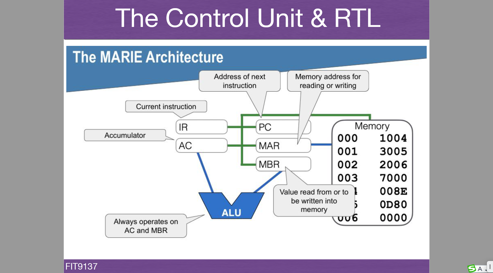

这页把 **MARIE 的控制单元 & RTL（寄存器传送级）** 串起来讲：控制单元按“**取指 → 译码 → 执行**”驱动各寄存器在数据通路上搬运数据；**RTL** 就是把这些搬运/运算写成一步一步的“寄存器 ← 寄存器/内存/ALU”的语句。

## 构件回顾（图中气泡）

- **PC**：下一条指令地址（送到内存作取指地址）
- **IR**：当前指令（高4位 opcode，低12位地址）
- **MAR**：内存读/写的地址
- **MBR**：从内存读来的值/要写回内存的值
- **AC**：累加器，主要运算寄存器
- **ALU**：**只对 AC 和 MBR** 做运算（图下注解）
- 右侧 **Memory** 中列出若干地址与内容（十六进制）

右侧内存内容（示例）：

```
000: 1004   ; LOAD 004
001: 3005   ; ADD  005
002: 2006   ; STORE 006
003: 7000   ; HALT
004: 008E   ; 数据1
005: 0D80   ; 数据2
006: 0000   ; 结果地址，初值0
```

> 说明：指令 16 位＝4 位 opcode + 12 位地址
>  1=LOAD，3=ADD，2=STORE，7=HALT

------

## 一条指令的标准 **取指周期**（Fetch）——RTL

1. `MAR ← PC`
2. `MBR ← M[MAR]`         （从内存取指令字）
3. `IR  ← MBR`
4. `PC  ← PC + 1`

## 译码并“执行”每条指令——RTL 例子

### 1) `LOAD 004`（IR = 1004）

- `MAR ← IR[11..0]` (004)
- `MBR ← M[MAR]`    （读到 008E）
- `AC  ← MBR`       （AC = 008E）

### 2) `ADD 005`（IR = 3005）

- `MAR ← 005`
- `MBR ← M[MAR]`    （读到 0D80）
- `AC  ← ALU(AC, MBR)`  （AC = AC + MBR = 008E + 0D80）

### 3) `STORE 006`（IR = 2006）

- `MAR ← 006`
- `MBR ← AC`
- `M[MAR] ← MBR`    （把和写回地址 006）

### 4) `HALT`（IR = 7000）

- 控制单元停止发控制信号，CPU 停机

------

## 这张图想让你抓住的点

- **控制单元**用一连串 RTL 微操作把寄存器、内存、ALU 串起来。
- **ALU 只对 AC/MBR 运算**；访存总是经由 **MAR（地址）/MBR（数据）**。
- 看着右侧内存和上面的 RTL，你能逐步追踪每条指令是怎么从“取指”到“结果落地”的。


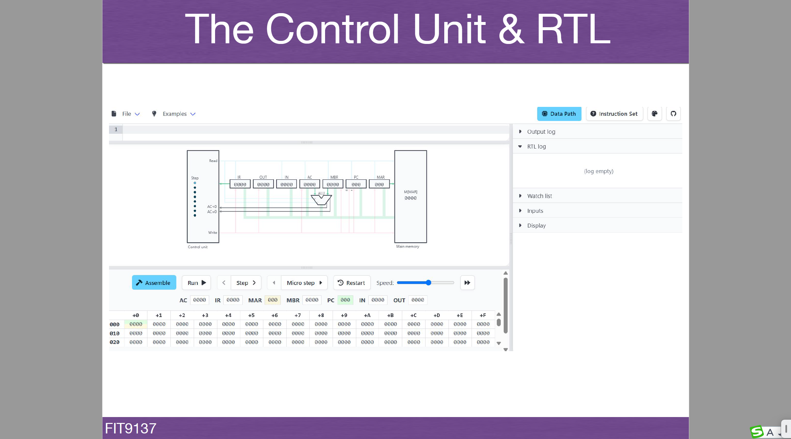

这页在演示 **MARIE 模拟器**里“**控制单元 & RTL（寄存器传送语言）**”视图的用法。截图各区块代表什么、怎么用：

- **Data Path 面板（中间大图）**
   可视化的数据通路：`IR / OUT / IN / AC / MBR / PC / MAR` 等寄存器、主存（右侧方块）和连线。
   执行时会出现**绿色/红色的流动动画**表示**读/写**路径，帮助你看懂控制单元每一步把数据从哪搬到哪。
- **控制单元 Step 灯（左边竖着的小圆点）**
   一步一步亮起，表示当前进行到第几个**微操作（micro-step）**。这正是“CU 发出的微命令序列”。
- **寄存器/内存监视（下方表格）**
   一排显示所有寄存器当前值：`AC, IR, MAR, MBR, PC, IN, OUT`。
   下面的大表是**内存**，按十六进制地址排布（每行 16 个字），执行时会高亮正在访问的位置。
- **控制按钮（下方工具栏）**
  - **Assemble**：把你写的 MARIE 汇编代码装配成机器码放进内存。
  - **Run / Step**：整程序运行 / 按**指令**单步。
  - **Micro step**：按**微步骤**单步（最细粒度，配合左侧 Step 灯和数据流动画）。
  - **Restart / Speed**：重置与调速。
- **右侧侧栏**
  - **Data Path / Instruction Set**：切换到**指令集**页可以查看每条指令的说明与 opcode。
  - **RTL log**：记录每一步的 **RTL 语句**（如 `MAR←PC`, `MBR←M[MAR]`, `IR←MBR`, `PC←PC+1` …）。
  - **Inputs / Display**：给 `INPUT` 提供键盘值、查看 `OUTPUT` 输出。
  - **Watch list**：自定义想盯的地址或寄存器。

### 怎么用它做实验（快速流程）

1. 在编辑区写代码或从 **Examples** 载入示例。
2. 点 **Assemble**。
3. 先用 **Step** 看每条指令的效果；再用 **Micro step** 观察同一条指令内部的**取指→译码→执行**细节；
4. 打开 **RTL log**，对应看到如 `MAR←PC → MBR←M[MAR] → IR←MBR → PC←PC+1` 等记录；
5. 观察寄存器/内存变化是否与 RTL 一致。

一句话：这个界面就是让你**把抽象的“控制单元发微命令”看见**——哪一步取指、哪一步访存/运算、寄存器何时变化，全都能在 Data Path 动画与 RTL log 里逐步验证。

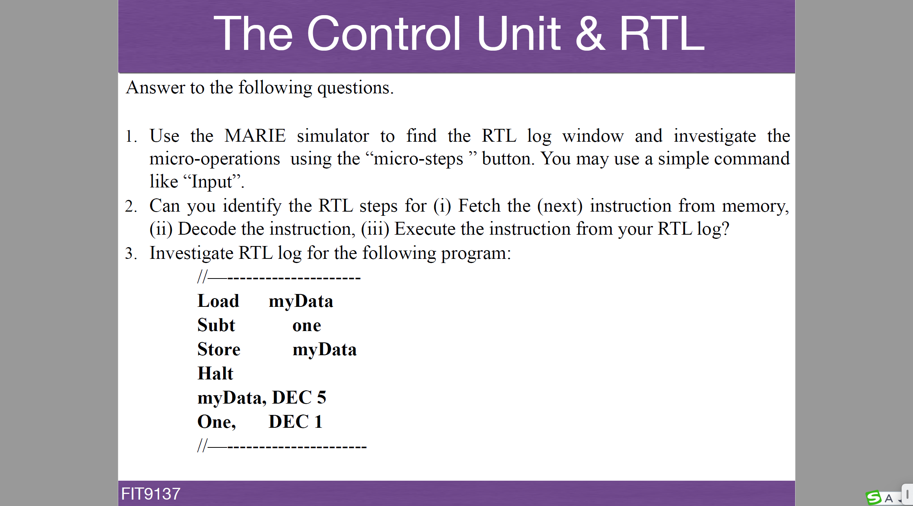

下面这页在讲“控制单元与RTL（寄存器传输级）”，让你用 **MARIE** 模拟器观察**RTL 日志**，并按“微步（micro-steps）”按钮一步一步看一条指令在机器里是怎么被**取指→译码→执行**的。

# 这页要求你做的三件事（翻译+解释）

1. **找到 RTL 日志窗口并用“micro-steps”看微操作。**
    打开 MARIE 模拟器，运行一个很简单的程序（比如用到 `Input` 的指令也可以）。点“Micro-step”后，右边/下方的 **RTL log** 会逐行显示每个**时钟子步**里寄存器之间的数据流转（谁←谁）。
2. **识别一条指令的三阶段 RTL 步骤：**
   - **Fetch（取指）**：把“下一条指令”从内存取到指令寄存器 IR。
      典型 RTL（以 MARIE 的寄存器命名为例）：
     - `MAR <- PC`
     - `MBR <- M[MAR]`
     - `IR <- MBR`
     - `PC <- PC + 1`
   - **Decode（译码）**：硬件解出 `IR` 的 **opcode** 和 **地址字段**，设置控制信号，选择要走的执行通路。（RTL 里常表现为“根据 opcode 选择分支”，未必有显式赋值）
   - **Execute（执行）**：根据不同指令，做相应的寄存器/存储器操作。下面第3点给出每条具体指令的 RTL。
3. **对下面的小程序，观察并写出它的 RTL 日志：**

```
Load   myData
Subt   one
Store  myData
Halt

myData, DEC 5
one,    DEC 1
```

含义：

- 先把内存标号 **myData**（初值 5）装进累加器 **AC**；
- 再用 **AC ← AC − one**（`one` 是常量 1）；
- 把结果写回 **myData**；
- 停机。
   **最终效果：** AC 从 0→5→4，内存 `myData` 从 **5** 变成 **4**。

# 每条指令的典型 RTL（以 MARIE 为例）

在每条指令之前，都先经历一次上面的 **Fetch** 四步；这里列的是各自的 **Execute** 部分：

- **Load X**
  - `MAR <- X`
  - `MBR <- M[MAR]`
  - `AC <- MBR`
     说明：把地址 X 的内存数据读到 MBR，再送入累加器 AC。
- **Subt X**（AC ← AC − M[X]）
  - `MAR <- X`
  - `MBR <- M[MAR]`
  - `AC <- AC - MBR`
- **Store X**（M[X] ← AC）
  - `MAR <- X`
  - `MBR <- AC`
  - `M[MAR] <- MBR`
- **Halt**
  - 设置“停止”控制信号，CPU 不再推进时钟（RTL 日志一般显示为进入 Halt 状态/无后续微步）。

# 将这段程序串起来你会在 RTL 日志里看到的大致序列

（省略每次都相同的取指四步，只写执行阶段；`addr(Y)` 表示符号地址）

1. **Load myData**
   - `MAR <- addr(myData)`
   - `MBR <- M[MAR]`   （读到 5）
   - `AC <- MBR`       （AC=5）
2. **Subt one**
   - `MAR <- addr(one)`
   - `MBR <- M[MAR]`   （读到 1）
   - `AC <- AC - MBR`  （AC=4）
3. **Store myData**
   - `MAR <- addr(myData)`
   - `MBR <- AC`       （MBR=4）
   - `M[MAR] <- MBR`   （myData=4）
4. **Halt**（进入停机）

# 你需要交付/回答的要点

- 会打开 **RTL log**，并用 **Micro-steps** 截图或抄下每步的寄存器转移。
- 明确说明 **取指/译码/执行**各阶段的 RTL。
- 针对该程序，给出 **AC 与内存**在关键步的数值变化（AC: 0→5→4；myData: 5→4）。

如果你愿意，我可以把你实际跑出来的 RTL 日志贴过来，我帮你对照核对每一行是什么意思。

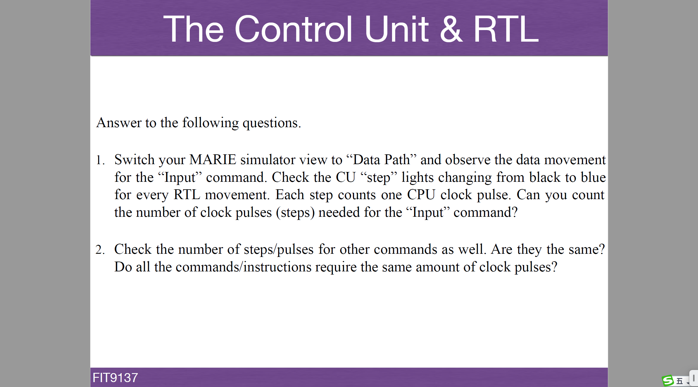

这页幻灯片讲的是 **控制单元（Control Unit）与寄存器传输级（RTL）**，并要求你使用 **MARIE 模拟器**观察指令执行的具体细节。下面是根据原文的**详细翻译和解释**：

------

## 🧾 第1题：观察“Input”指令需要多少时钟脉冲（微步）

> **原文：**
>  Switch your MARIE simulator view to “Data Path” and observe the data movement for the “Input” command. Check the CU “step” lights changing from black to blue for every RTL movement. Each step counts one CPU clock pulse. Can you count the number of clock pulses (steps) needed for the “Input” command?

### ✅ 中文翻译与解释：

- **打开 MARIE 模拟器并切换到 “Data Path（数据路径）” 视图。**
  - 这个视图可以让你看到数据在寄存器之间如何流动。
- **运行 `Input` 指令，并点击“Micro-step”观察每一个微步。**
  - 每点击一次，“CU（控制单元）”区域中的“step”灯会从黑色变成蓝色，表示执行了一个 RTL 步骤。
- **每个微步（step）代表一个 CPU 时钟周期。**
  - 也就是说，如果你看到蓝灯亮了 6 次，表示这条指令一共用了 6 个时钟脉冲。
- **你需要数清楚 `Input` 指令执行时用了多少步（clock pulses）。**

------

## 🧾 第2题：对比其他指令所需的时钟步数是否一致

> **原文：**
>  Check the number of steps/pulses for other commands as well. Are they the same? Do all the commands/instructions require the same amount of clock pulses?

### ✅ 中文翻译与解释：

- **对比其他指令**（例如 `Load`, `Add`, `Store`, `Halt` 等）的执行过程。
  - 你也要用相同的方法（看 CU 的 step 灯，或 RTL 日志）来数它们需要多少微步。
- **思考：不同指令所需的步数是否一样？**
  - 例如，`Input` 可能只操作 AC，而 `Load` 需要访问内存，多用几步。
- **结论：**
  - 并不是所有指令都使用相同数量的时钟脉冲。不同操作所涉及的硬件资源不同，因此 RTL 步骤（时钟脉冲数量）也不同。

------

## 💡小贴士：如何回答老师这个问题

你可以回答类似这样：

1. **“Input 指令需要 X 个 clock pulses（我用 Micro-step 数出来的）。”**
2. **“我测试了其他指令，比如 Load 用了 Y 步，Store 用了 Z 步，发现每条指令用的时钟数不一样。”**
3. **“因为不同的指令涉及的寄存器与内存操作不同，所以需要的 RTL 步骤数量不同。”**

------

如果你已经在模拟器中跑了 `Input` 指令，并能贴出 RTL 日志或截图，我可以帮你逐步解释每一步做了什么。是否需要我来一起分析？


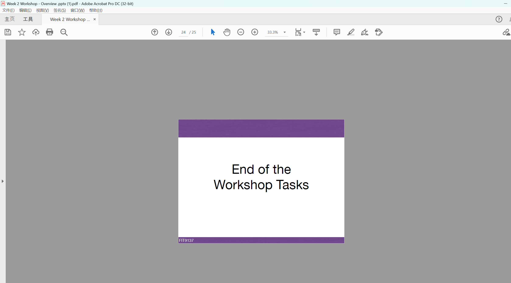

这张幻灯片的标题是：

> **End of the Workshop Tasks**

下面是对这句话的**详细解释和翻译**，根据原文含义：

------

## 📝 中文翻译：

> **研讨会任务结束**

------

## 📖 详细解释（根据原文意思）：

这页是整个讲座或实验课（workshop）的**最后一页任务提示**，常出现在课程的尾声阶段。它的意思包括：

- 所有在这次 **workshop（研讨课/实验课）** 中安排的**任务、练习、操作**等已经完成。
- 这是课程的一个**收尾标志**，你可以理解为“本节内容到这里就结束了”。
- 也有可能是老师在这页之后要布置**课后作业**、**小结**或是**反馈调查**等。

------

## 💡 补充说明：

这类幻灯片通常出现在课程的：

- 最后一页（表示任务完成）
- 或者是在正式结束前的过渡页（后面可能还有总结、提问或互动环节）

------

如果你看到这页，那说明你已经完成了老师布置的主要操作任务（比如使用 MARIE 模拟器分析 RTL 的过程等）。现在可以准备提交、检查答案，或者等待老师下一步指示。

需要我帮你总结所有任务的要点/核对答案吗？


这张幻灯片的原文是：

> **Have a nice week ahead.
>  See you all next week**

------

## 📝 中文翻译：

> **祝你们接下来的一周过得愉快。
>  下周见！**

------

## 📖 详细解释（根据原文）：

这是老师/讲师在课程或讲座的最后，向大家表达的一种**礼貌结束语**，用来：

- 送上**祝福**：希望大家在接下来的一周里过得愉快、顺利。
- 表达**下次再见的意思**：暗示课程还会继续，大家下周还会再见。

------

### 🧑‍🏫 在教学场景中的含义：

- 表示**今天的课已经结束了**。
- **没有更多任务**或内容要讲了。
- 老师通常会在讲完所有内容后，用这页表示 **正式结束**。

------

## 💡 备注：

- 左下角的“**FIT9137**”是课程编号，说明这是一个正式课程的幻灯片结尾。
- 如果你是在准备课后作业/报告，现在可以休息或准备下次课了。

------

如果你需要，我可以帮你把整个 workshop 内容做一个总结或复习重点提示。需要吗？