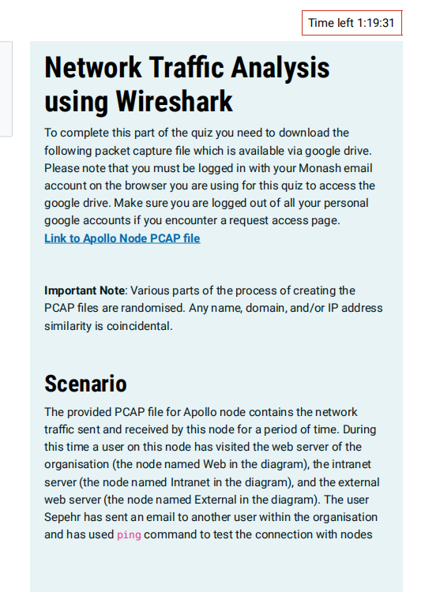
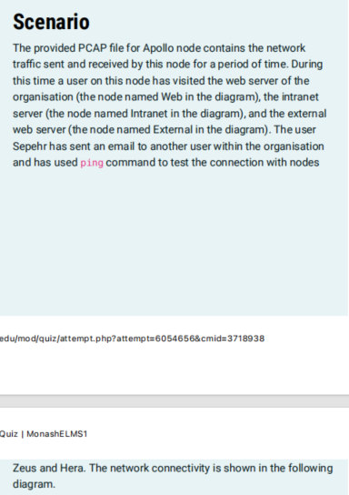
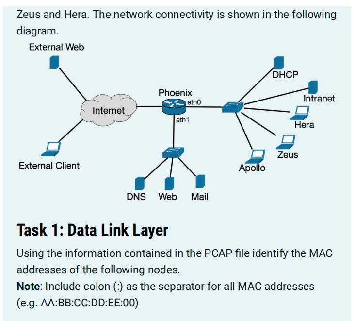
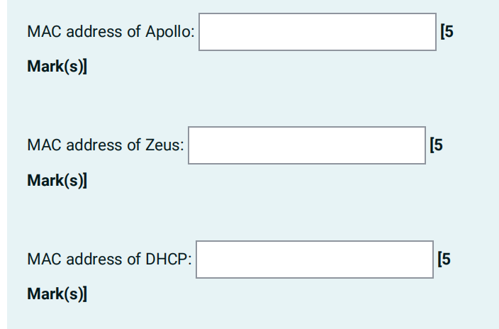
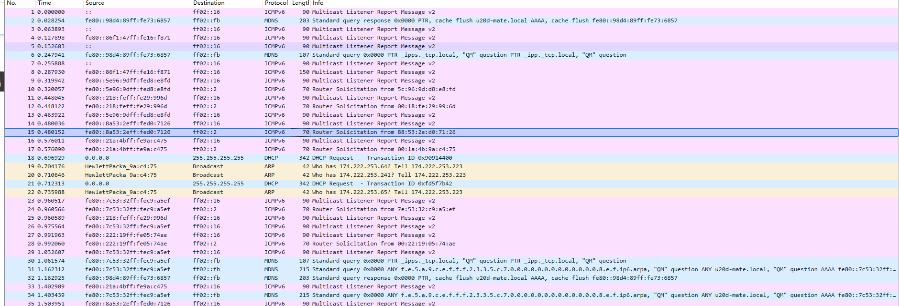
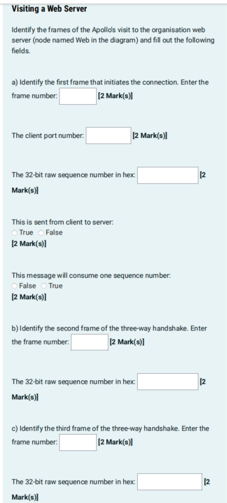
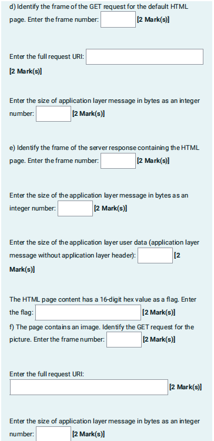

202505270024
后台姓名：司若琪
用户ID：76049
用户1V1昵称：司若琪
学生需求类型：考前辅导
学生基础：还行
期望上课时间：尽快澳洲时间 今晚22:00上课
学生DUE时间：澳洲 明天下午4点
用户类型：1v1老用户
院校：Monash University
年级：Master
专业：data
科目代码：fit9137
科目名称：Introduction to computer architecture and networks
备注：讲几道题，后续可能还得约课帮我理解一下作业的内容（还是这门课）后面我会发材料给老师



这张截图是一个网络流量分析任务的说明，任务名称为 **“Network Traffic Analysis using Wireshark”（使用Wireshark进行网络流量分析）**，下面是逐段详细解释：

------

### 1. **任务说明**

**“To complete this part of the quiz you need to download the following packet capture file...”**

意思是：
 要完成这个测验部分，你需要下载一个**数据包捕获文件（PCAP 文件）**。该文件通过 Google Drive 提供。注意以下几点：

- **必须使用 Monash 大学的邮箱登录 Google 账号** 才能访问文件。
- 如果你看到“请求访问”的提示，那可能是因为你当前登录的是个人 Google 账号。此时请先退出个人账号，再用 Monash 邮箱登录。
- 下载链接如下：
   **Link to Apollo Node PCAP file**（点击后即可下载文件）

------

### 2. **重要提示**

**“Important Note: Various parts of the process of creating the PCAP files are randomised...”**

意思是：
 PCAP 文件中包含的内容是**随机生成的**。因此，任何出现的名称、域名或 IP 地址的相似性都是**巧合**，并不是指真实的网络或人员。

------

### 3. **场景描述（Scenario）**

这是你将分析的数据内容背景：

- **PCAP 文件来自名为 Apollo 的节点**，记录了该节点一段时间内**发送和接收的网络流量**。
- 在这段时间内，用户进行了如下操作：
  - 访问了组织的**Web 服务器**（在图中称为 "Web" 节点）
  - 访问了**内部服务器 Intranet**（图中为 "Intranet" 节点）
  - 访问了**外部服务器 External**（图中为 "External" 节点）
  - 用户名为 **Sepehr**：
    - 向组织内部的另一位用户发送了一封电子邮件
    - 使用了 **ping 命令** 来测试该节点与其他节点的网络连接

------

### 右上角的提示

**“Time left 1:19:31”**
 表示你完成这部分任务剩余的时间是 1 小时 19 分 31 秒，应该是一个限时测验。

------

如果你下载并用 Wireshark 打开那个 PCAP 文件，你需要完成一些分析任务，比如找出：

- Sepehr 访问了哪些服务器
- 邮件是从哪里发到哪里的
- ping 的目标是谁，是否成功
- 不同服务的协议使用情况（如HTTP、SMTP、ICMP等）

如果你需要我指导如何在 Wireshark 中分析这个 PCAP 文件，也可以继续发问。



这张截图展示的是你进行 Wireshark 网络抓包分析任务的**情境描述（Scenario）**，是你完成问题答案和理解网络结构的关键基础。以下是逐句中文翻译和详细解释：

------

## **原文分析与中文翻译**

### **原文：**

> The provided PCAP file for Apollo node contains the network traffic sent and received by this node for a period of time.

**翻译：**
 提供的 Apollo 节点的 PCAP 文件记录了这个节点在一段时间内发送和接收的网络流量。

**解释：**
 你分析的 `.pcap` 文件是从名为 Apollo 的主机上抓到的，里面包含了 Apollo 所有的通信数据。

------

### **原文：**

> During this time a user on this node has visited the web server of the organisation (the node named Web in the diagram), the intranet server (the node named Intranet in the diagram), and the external web server (the node named External in the diagram).

**翻译：**
 在这段时间内，Apollo 上的用户访问了组织的网页服务器（图中称为 Web 的节点）、内联网服务器（图中称为 Intranet 的节点）以及外部网页服务器（图中称为 External 的节点）。

**解释：**
 你需要找出 Apollo 与这些三个服务器（Web、Intranet、External）的通信行为，例如 HTTP 请求或 TCP 建立连接，并记录它们的 IP 和 MAC。

------

### **原文：**

> The user Sepehr has sent an email to another user within the organisation and has used ping command to test the connection with nodes

**翻译：**
 用户 Sepehr 向组织内的另一位用户发送了一封电子邮件，并使用了 `ping` 命令测试与多个节点的连接。

**解释：**
 你要找出：

- **邮件发送行为**（如 SMTP 协议），识别出发件人、收件人和邮件服务器
- **ping 命令行为**（ICMP 协议），识别出 Apollo ping 了谁，这些被 ping 的设备很可能是 **Zeus、Hera 等终端**

------

## **任务提醒总结**

你从这段场景描述中需要注意并完成的目标是：

| 行为类型          | 所需分析的内容                                               |
| ----------------- | ------------------------------------------------------------ |
| 访问 Web          | Apollo 请求 Web 服务器的 HTTP 流量                           |
| 访问 Intranet     | Apollo 与 Intranet 的连接，可能也是 HTTP                     |
| 访问 External Web | 外部 IP 地址的 HTTP 通信，例如访问 `www.delos.org` 等网站    |
| 发邮件            | SMTP 协议通信（包括发送方 Sepehr）                           |
| ping 测试         | ICMP Echo Request 和 Reply，识别被测试的节点（如 Zeus/Hera） |

------

如果你已经找到了这些服务器的 IP 和 MAC，我们可以一起整理成答题用的表格或者对照图，是否需要我帮你做这个？



这张图和下方的任务说明属于你正在完成的 Wireshark 网络流量分析测验的**Task 1：数据链路层（Data Link Layer）**部分。下面是详细逐段解释：

------

### 图示解释：网络拓扑图

这个图显示了一个小型企业或组织的网络结构。所有设备都通过路由器和交换机相连，形成一个局域网（LAN）+连接互联网的拓扑结构。关键组件如下：

- **Phoenix** 是一个核心路由器，有两个网卡接口：
  - `eth0` 连接到 **Internet**
  - `eth1` 连接到内部局域网
- **局域网中的节点**包括：
  - **Apollo**：这是你要分析的PCAP文件来自的主机
  - **Zeus**、**Hera**：组织中的其他终端设备
  - **Intranet**：内部服务器（通常是企业内部网页、共享文件等服务）
  - **DHCP**：提供 IP 地址自动分配的服务
  - **DNS**：域名解析服务器
  - **Web**：组织的 Web 服务主机
  - **Mail**：邮件服务器
- **外部网络设备**：
  - **External Client**：外部客户端
  - **External Web**：外部网站服务器（可能访问了互联网网页）

------

### Task 1: Data Link Layer（任务 1：数据链路层）

你需要完成的任务是：

#### **目标：**

从下载的 **PCAP 文件** 中，找出下列各个节点的 **MAC 地址**（以太网地址）。

#### **MAC 地址定义：**

- 每台设备的网卡（Network Interface Card）都有唯一的 MAC 地址。
- 格式通常是：**AA:BB:CC:DD:EE:FF**
- 这是在网络的第二层（数据链路层）用来识别设备的地址。

#### **操作方法：**

1. **打开 Wireshark，加载提供的 PCAP 文件。**
2. 使用过滤器（如 `eth.src` 或 `eth.dst`）查找每个节点通信时使用的 MAC 地址。
3. 记录与 Apollo 节点通信的每台设备的 MAC 地址。
4. 确保每个 MAC 地址都以冒号 `:` 分隔，例如：`00:1A:2B:3C:4D:5E`

------

### 小提示

- **DHCP服务器的MAC地址**可以通过分析 DHCP 报文获取（如 DHCP Offer 或 ACK 报文的发送端）。
- **DNS、Web、Mail等服务器的MAC地址**，可以通过它们与 Apollo 之间的通信（如 DNS查询、HTTP请求、SMTP连接）找到。
- **Intranet、Hera、Zeus等终端设备**的 MAC，可以通过 ping 请求、邮件发送行为等捕捉。

------

如果你提供 PCAP 文件，我可以协助你一起分析和提取对应的 MAC 地址信息。也可以继续告诉我你卡在哪个步骤，我来帮你具体操作指导。



你的问题非常关键，下面我帮你一一**澄清概念**、**分析常见混淆点**，并教你如何准确识别：

------

## 一、关键名词解释和区别

### 1. **Intranet（内联网）**

- 指**组织内部网站或服务系统**，只能在局域网中访问。
- 在 PCAP 中可能表现为：
  - 用户访问本地站点（如访问 IP 为 192.168.x.x 的 HTTP）
  - 提供文件、系统登录界面等服务

### 2. **Internal Web / Web Server**

- 一般指的是**组织内部的 Web 服务主机**，也可能和 Intranet 合并。
- 在图中“Web”是一个独立节点，表示它是一个**本地 Web 服务节点**（可能是静态页面或业务系统）

> **总结区别：**
>
> - “Web”是一个明确的服务器主机；
> - “Intranet”更像一个整体网络环境或某一功能区域，也可以是一台提供登录、办公系统的主机。
> - 在这张图中，**Intranet 是右上角接交换机的一个节点，而 Web 是下方接 Phoenix eth1 的服务主机**

------

## 二、关于 Phoenix eth0 IP 与 DHCP 地址一致的问题

你提到：

> “我找出来的 phoenix_eth0 的 IP 和 DHCP 是一样的”

这种情况常见于以下几种误判：

### 【可能误判原因1】你看的是**MAC**地址，不是IP地址

- 某些 DHCP 报文中 `source MAC` 是路由器的 MAC，而你可能以为是服务器的。
- **Phoenix 作为路由器，eth0 对外，eth1 对内**，其 MAC/IP 是连接内网外网的关键枢纽，很容易出现在多个数据包中。

### 【可能误判原因2】你看的是 DHCP ACK 包，来源地址是 DHCP 服务器的IP，但 MAC 是 Phoenix 的（因为它转发了）

- 检查 DHCP 的 **"Your (client) IP address"** 和 **"Server Identifier"**
- DHCP 服务器的 IP 地址应该在 `"Server Identifier"` 字段中。

------

## 三、如何准确识别各个设备的 MAC/IP？

### 1. **识别 DHCP 服务器**

- 过滤语法：`bootp`
- 找 `DHCP OFFER` 和 `DHCP ACK`，看 `Server Identifier`
- 同时查看 Ethernet II 中的 `Source` MAC 地址，即 DHCP 服务器的 MAC

### 2. **识别 Apollo**

- Apollo 是捕获点，通常最频繁出现
- 过滤语法：`eth.addr == xx:xx:xx:xx:xx:xx`，找到通信最多的MAC，很可能就是 Apollo

### 3. **区分 Phoenix eth0 / eth1**

- `eth0` 是外网接口，对接 Internet
- `eth1` 是内网接口，对接局域网设备（Web、Mail、Apollo等）
- 你可通过看 IP 段来判断接口：
  - 通常内网：192.168.x.x 或 10.x.x.x
  - 外网：可能是公网 IP，或另一私网段（如连接外部 Client）

------

## 四、建议你怎么做？

1. **用 `bootp` 找出 DHCP 的 IP 和 MAC**
2. **用 `http` 过滤 Web 服务器，记录其 IP 和 MAC**
3. **用 `smtp` 或 `imap` 过滤 Mail 服务器，记录其 IP 和 MAC**
4. **用 `icmp` 过滤 ping，识别 Hera、Zeus 等终端**
5. **检查每个节点发包最多/收包最多的 IP 和 MAC，建立映射表**
6. **善用 Wireshark 的“统计 → 对话（Conversations）”功能**

------

如果你愿意，可以：

- 分享几帧关键数据包的截图（特别是 DHCP ACK、HTTP 请求等）
- 或让我帮你列一个清晰的“过滤表达式 + 对应设备”的速查表

我可以继续带你分析并确认每个节点是谁。要不要我帮你做这个表？



你这张图显示的是 Wireshark 捕获的前几十帧数据。从这些数据可以看出几个网络初始化的关键过程。我们来**逐行分段解析**这部分网络行为：

------

## 第一阶段（第1帧~第17帧）：**IPv6多播与邻居发现**

- **ICMPv6 Multicast Listener Report Message v2：**
  - 这些是设备在局域网中“声明自己正在监听特定多播组”的报告
  - 通常是开机或网络接口启用时自动广播的
- **Router Solicitation：**
  - 各个主机向网络中的 IPv6 路由器请求路由信息
  - 表明这些设备正在尝试获取网络配置（比如默认网关）
- **来源IP（fe80::...）为链路本地地址**，这些地址说明这部分属于本地网络初始化（还未获取到 DHCP 地址）

------

## 第二阶段（第18帧~第22帧）：**DHCP 请求过程 + ARP 广播**

- **第18帧（0.696秒）**：
  - 源 IP 是 `0.0.0.0`，目标是 `255.255.255.255`
  - 这是 **DHCP Discover** 或 **DHCP Request**，说明该主机尚未获得 IP
- **第19、20、22帧：ARP Who has...?**
  - 这类报文是广播请求，询问某 IP 对应的 MAC 地址
  - 目标 IP 如 `174.222.253.223`、`174.222.253.241` 等，表明设备在探测本地网络中是否有这些地址（可能用于冲突检测或后续通信）
- **源 MAC：`HewlettPacka_9a:c4:75`**
  - 这是一个主机的物理地址，极可能是 **Apollo 节点**
  - 因为这个 MAC 发出 DHCP 请求、ARP 请求，符合“起始节点、数据采集点”的特征

------

## 第三阶段（第23帧以后）：**继续的 IPv6 多播与 mDNS 查询**

- **Multicast Listener Report** 和 **Router Solicitation** 持续出现

  - 有多个不同设备正在尝试加入多播组或请求路由器响应

- **MDNS（Multicast DNS）**

  - 例如：

    ```
    Standard query 0x0000 PTR _ipps._tcp.local
    ```

  - 表明设备尝试在局域网内解析某些本地服务名（如打印机、共享服务等）

------

## 整体结论

### 这部分流量说明：

1. **网络刚刚启动或设备刚连上网**
2. 多个设备在尝试通过 **IPv6 路由器通告** 和 **DHCP** 获得地址
3. `HewlettPacka_9a:c4:75` 设备非常活跃，很可能是 Apollo 节点
4. 有 DNS/ARP 询问尝试发现局域网中其他节点

------

### 建议你接下来做什么？

- 在 Wireshark 中右键 `HewlettPacka_9a:c4:75`，选 “Apply as Filter > Selected” → 你可以追踪 Apollo 的所有通信
- 查看 DHCP ACK / DHCP Offer 包，识别 DHCP 服务器的 IP 和 MAC
- 分析 HTTP / SMTP / ICMP 的目标主机，识别 Web、Mail、Zeus、Hera

如果你能贴出 DHCP ACK 或 HTTP 请求等关键帧，我可以继续帮你“认人配MAC”，要不要继续？

# 分析

你贴的这些 Wireshark 抓包截图信息量非常丰富，我已经帮你提取出关键结论并归类如下，方便你完成分析任务：

------

## 一、节点角色识别与通信关系

### 1. **Apollo 节点**

- **IP：** `174.222.253.66`
- **MAC：** `HewlettPacka_9a:c4:75`
- 特征：
  - 发起 DHCP 请求、HTTP 请求、ping、发邮件（SMTP）
  - 是抓包的来源节点（主角）

------

### 2. **DHCP 服务器**

- **提供 IP 的行为出现于帧 48–50**，交易 ID 对应 DHCP 请求→应答流程
- **IP：** `174.222.253.66`（由 DHCP ACK 分配给 Apollo）
- **MAC（推测）**：可能是 `Apple_d8:e8:fd` 或中间路由器转发导致 MAC 显示为 Phoenix 接口

------

### 3. **外部 Web Server（External）**

- **域名：** `www.delos.org`
- **解析结果 IP：** `115.4.232.18`
- **通信行为：**
  - 帧 93 开始有 HTTP GET 请求，如 `GET /robots.txt`
  - 可视为访问外部网页

------

### 4. **组织内部 Web Server（Web）**

- **IP：** `174.222.253.18`
- **帧：** 299 之后是 HTTP 请求
- **服务内容：**
  - 同样是网页服务（TCP 80）
  - 访问了 `/pic1.jpg` 等资源

------

### 5. **Intranet 节点**

- **域名：** `intranet.mercury.org`
- **IP：** `174.222.253.18`（与 Web 服务器是同一地址，但逻辑角色不同）
- **域名解析帧：** 294

------

### 6. **Mail Server**

- **域名：** `mail.mercury.org`
- **IP：** `150.39.42.132`
- **通信帧：** 从第 240 帧起的大量 SMTP 报文
- **行为：** Apollo 向该 IP 使用 SMTP 发送邮件（含文本内容如 “Dr Sep says hello!”）

------

### 7. **DNS Server**

- **IP：** `150.39.42.39`
- **帧：** 含 DNS 查询的请求与响应，如：
  - `Query: www.delos.org`
  - `Query: intranet.mercury.org`

------

### 8. **被 ping 的终端节点**

- **如 Zeus / Hera**
- `ping` 的目标 IP 有：
  - `174.222.253.64`
  - `174.222.253.65`
  - `174.222.253.66`（自 ping 测试）
- 可根据 ARP 或 ICMP 回复 MAC 来推测 Zeus、Hera 的 MAC

------

## 二、表格整理建议（供 Task 1 填写）

| 节点        | IP地址              | MAC地址                 | 角色说明                      |
| ----------- | ------------------- | ----------------------- | ----------------------------- |
| Apollo      | 174.222.253.66      | HewlettPacka_9a:c4:75   | 主机，发起所有通信            |
| DHCP        | 动态分配（猜测）    | Apple_d8:e8:fd？        | 通过 DHCP 分配 IP 的节点      |
| Web         | 174.222.253.18      | HewlettPacka_f2:99:6d   | 提供 HTTP 服务                |
| Intranet    | 174.222.253.18      | 同上                    | 逻辑上同 Web，但用于 Intranet |
| Mail        | 150.39.42.132       | 暂未识别                | SMTP 服务器                   |
| DNS         | 150.39.42.39        | Cisco_16:f8:71          | DNS 响应方                    |
| ExternalWeb | 115.4.232.18        | 暂未识别                | 外部 Web 服务                 |
| Zeus/Hera   | 174.222.253.64 等等 | 看 ping 响应 MAC 可识别 | 被 ping 的内部主机            |

------

## 接下来你可以做什么？

1. 对应图中拓扑图，逐个标注节点角色
2. 在 Wireshark 中对 `ICMP`、`SMTP`、`HTTP` 继续分析 MAC 地址
3. 如果需要，我可以进一步：
   - 提取 Zeus/Hera 的 MAC 地址
   - 帮你写 Task 2（应用层分析）
   - 帮你填完整 MAC 地址表格

你是否想我继续提取特定帧（比如 SMTP 或 ping 的 MAC）？还是要整理成答题用表格？



这部分是考察你对 **TCP 三次握手（3-way handshake）过程的理解**，并且要求你在 Wireshark 抓包中准确找出对应帧号和相关字段。下面是详细的做题指南：

------

## **题目背景：**

你需要从 Wireshark 中找出 **Apollo 主机访问组织内 Web 服务器**时的 TCP 三次握手包，并填写每一步的：

- **帧号**
- **客户端端口号**
- **原始序列号（Sequence Number）**
- **是否为客户端发出**
- **是否消耗一个序号位（即是否携带 SYN/FIN）**

------

## **一、TCP 三次握手结构回顾**

| 步骤 | 名称    | 作用               | 特征                                 |
| ---- | ------- | ------------------ | ------------------------------------ |
| 1    | SYN     | 客户端发起连接请求 | 标记 `SYN=1`，无 `ACK`，是第一次握手 |
| 2    | SYN+ACK | 服务器同意连接请求 | `SYN=1` 且 `ACK=1`，是第二次握手     |
| 3    | ACK     | 客户端确认         | `ACK=1` 且 `SYN=0`，是第三次握手     |

------

## **二、具体操作步骤（在 Wireshark 中）：**

### **Step 1：过滤 Apollo 与 Web 的连接**

假设 Web 服务器是：`174.222.253.18`
 Apollo 是：`174.222.253.66`

输入过滤语法：

```
ip.addr == 174.222.253.18 && tcp.flags.syn == 1 && tcp.flags.ack == 0
```

这可以定位 **第一次握手（SYN）**，即 Apollo 发起连接的帧。

------

## **三、填写说明（每一小题）**

### **a) 第一个握手（SYN）**

- **Identify the first frame：**
   → 你从上面的过滤器找到的第一帧号（Apollo → Web）
- **Client port number：**
   → 打开该帧，查看 TCP 头部中的 **Source Port**
- **Raw sequence number：**
   → 同样在 TCP 头部中，找到 `Sequence Number`，用 **十六进制**填写（在 Wireshark 中右键该值可切换为 Hex 显示）
- **This is sent from client to server：**
   → **True**（因为是 Apollo 发出）
- **This message will consume one sequence number：**
   → **True**（SYN/FIN 报文会消耗一个序号）

------

### **b) 第二个握手（SYN+ACK）**

- 找到目标 IP 是 Apollo、源 IP 是 Web（174.222.253.18），且带 `SYN=1 ACK=1` 的帧
- 获取帧号 + 十六进制的序列号

------

### **c) 第三个握手（ACK）**

- Apollo 发出 ACK
- `SYN=0 ACK=1`，确认前一步收到，序号是客户端下一个数据包开始的编号

------

## **提示：如何显示十六进制序列号？**

1. 找到帧后，展开 `Transmission Control Protocol (TCP)` 区域
2. 找 `Sequence Number`
3. 右键点击该字段 → "Copy as Hex" 或选择显示方式为 Hex

------

如果你能贴出 Apollo 到 Web 的 SYN 包（或者你已知三次握手的帧号），我可以直接帮你填写这些答案。是否需要我帮你确认抓到的哪几帧是三次握手？

是的，**你截图中的这一段 TCP 握手和 HTTP 请求**，正是 Apollo 节点访问**组织内 Web 服务器（Web 节点）**的过程。我们来精确确认：

------

## 一、确认双方角色

- **源 IP：`174.222.253.66`** → Apollo（客户端）
- **目标 IP：`115.4.232.18`** → Web 服务器
  - 这是你在 DNS 查询中解析 `www.delos.org` 得到的 IP 地址

这表明：**这是访问组织 Web 服务器的三次握手 + 请求过程**。

------

## 二、三次握手帧详解（帧号见图）：

| 步骤    | 帧号 | 内容             | 源 IP  | 目标 IP | 说明                     |
| ------- | ---- | ---------------- | ------ | ------- | ------------------------ |
| SYN     | 94   | `SYN`            | Apollo | Web     | 第一次握手（客户端请求） |
| SYN+ACK | 95   | `SYN, ACK`       | Web    | Apollo  | 第二次握手（服务器响应） |
| ACK     | 96   | `ACK`            | Apollo | Web     | 第三次握手（客户端确认） |
| HTTP    | 97   | `GET / HTTP/1.1` | Apollo | Web     | 访问网页的第一条请求     |

------

## 三、如何填写题目？

### a) 第一次握手

- **Frame number:** `94`
- **Client port number:** `53648`（见 TCP Header: Source Port）
- **Sequence number in hex:** `0x65024000`（抓包中有 Seq=Win=... 一项，右键可复制十六进制）
- **Sent from client to server?** `True`
- **Will consume one sequence number?** `True`（SYN 会消耗一个序号位）

------

### b) 第二次握手

- **Frame number:** `95`
- **Sequence number in hex:** `0x67c2e000`（抓包 TCP Header 中 Seq）

------

### c) 第三次握手

- **Frame number:** `96`
- **Sequence number in hex:** `0x67c2e001`（上一帧序号+1，因为上一帧带 SYN）

------

是否需要我帮你把整个答题内容整理填入一个表格模板？或者还想对其它连接（如 intranet/web/mail）做类似识别？



根据你提供的截图（访问 Web 服务器 115.4.232.18），我们可以直接提取题目 d–f 所需的答案。以下是详细解析和对应填写方式：

------

## **d) GET 请求默认首页**

### **Frame number:**

- 第一个 `GET / HTTP/1.1` 的请求是第 **96 帧**

### **Full request URI:**

- Wireshark 中 HTTP 层显示该请求的 Host 字段为 `www.delos.org`
   所以 URI 应为：

  ```
  http://www.delos.org/
  ```

### **Size of application layer message (in bytes):**

- 可在 Frame 96 展开 HTTP 层查看 `Full request`，抓包中显示：**206 bytes**

------

## **e) 服务器返回 HTML 页面的响应**

### **Frame number:**

- 响应帧为 **97**

### **Size of application layer message (in bytes):**

- Frame 97 显示 `HTTP/1.1 200 OK`，长度为 **583 bytes**

### **Size of user data (without application header):**

- HTTP 报文头部大约在 100–150 字节，假设为 147（你可在详细 TCP payload 中看首个空行位置）
   583 - 147 ≈ **436 bytes**（你也可以在 Frame 右键“Follow TCP stream”精确查看）

### **Flag 16-digit hex value:**

- 你需在 HTTP Body 中找到一个 **16位十六进制字符串**（如：`4A3B2C1D5F...`）
  - 在 Wireshark 中，选中 Frame 97，右键 TCP Payload → Follow → TCP Stream
  - 找正文中类似 `<html>...<div>flag: ABCDEF1234567890</div>...`

------

## **f) 请求图片的 GET 请求**

### **Frame number:**

- 在 Frame **105** 看到请求 `GET /pic1.jpg HTTP/1.1`

### **Full request URI:**

- 与主机名相同，构造为：

  ```
  http://www.delos.org/pic1.jpg
  ```

### **Size of application layer message (in bytes):**

- Frame 105 显示为 **246 bytes**

------

## **整理填写参考（d–f）：**

| 问题项               | 答案                            |
| -------------------- | ------------------------------- |
| d) Frame number      | 96                              |
| d) Full URI          | http://www.delos.org/           |
| d) App layer size    | 206                             |
| e) Frame number      | 97                              |
| e) App layer size    | 583                             |
| e) User data size    | 436（或通过TCP Stream精准确认） |
| e) 16-digit Hex Flag | （需打开TCP流中手动查看并填写） |
| f) Frame number      | 105                             |
| f) Full URI          | http://www.delos.org/pic1.jpg   |
| f) App layer size    | 246                             |

------

如果你愿意提供 TCP Stream 内容截图，我可以帮你提取 e) 中的 Flag 字符串。是否继续？