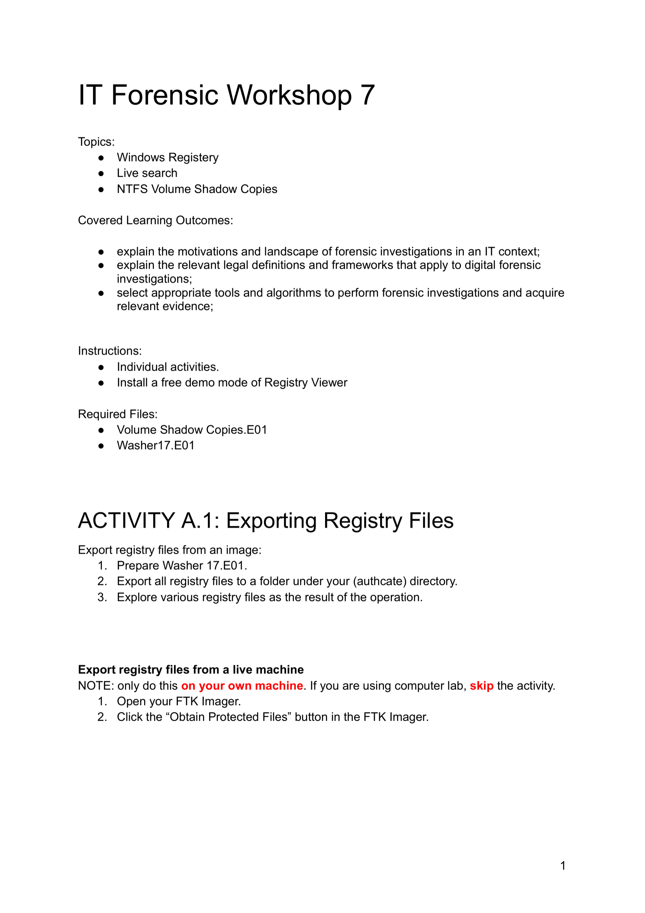
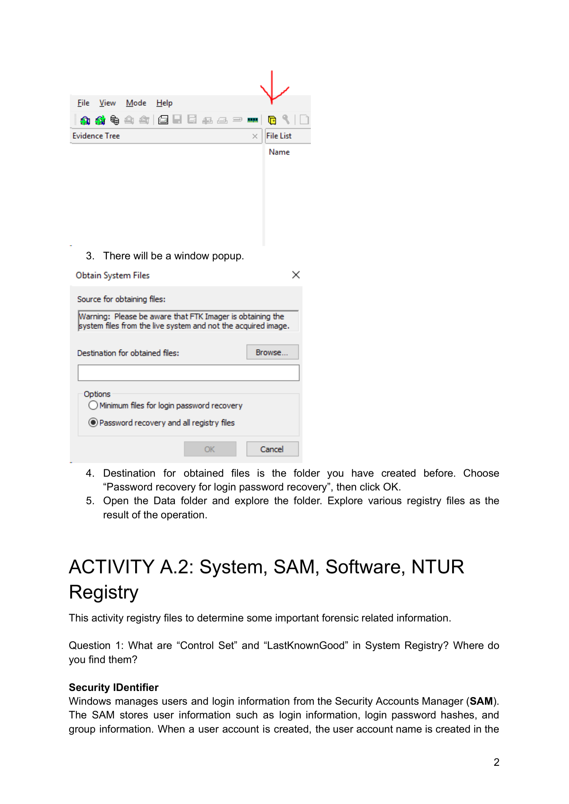
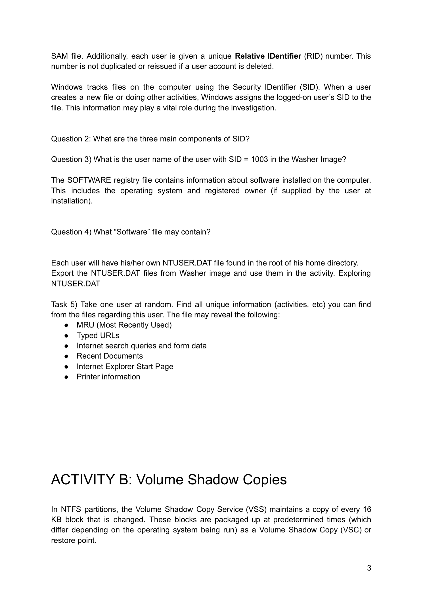
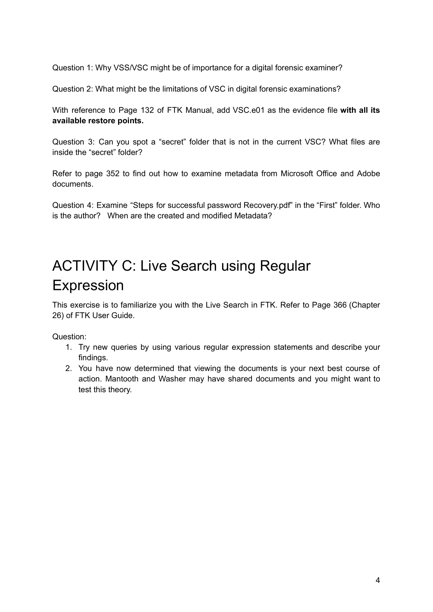
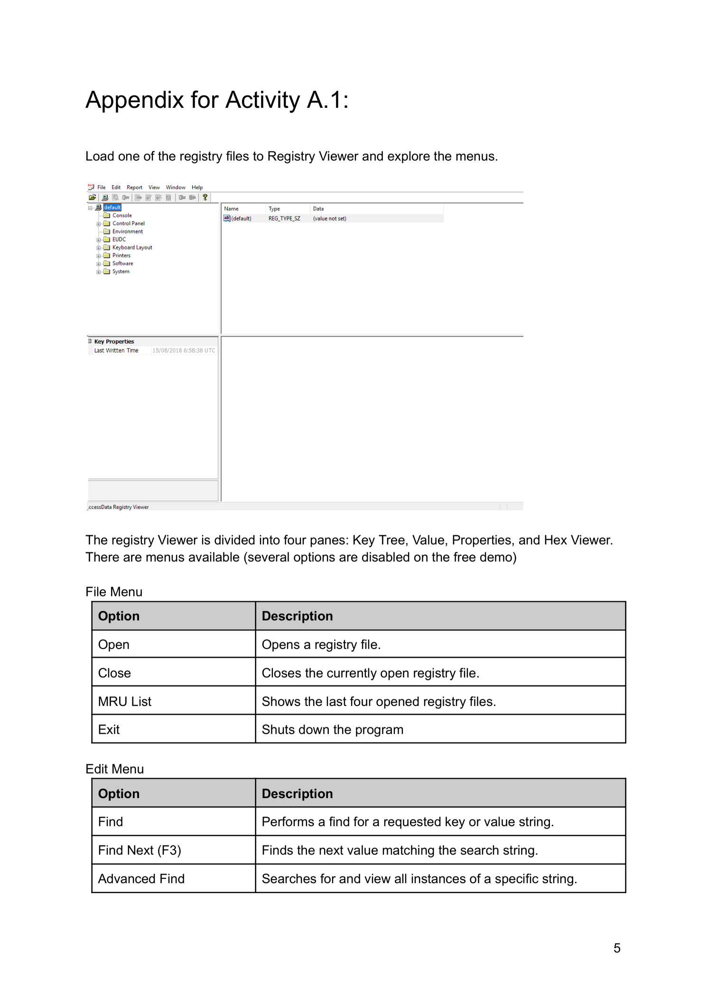
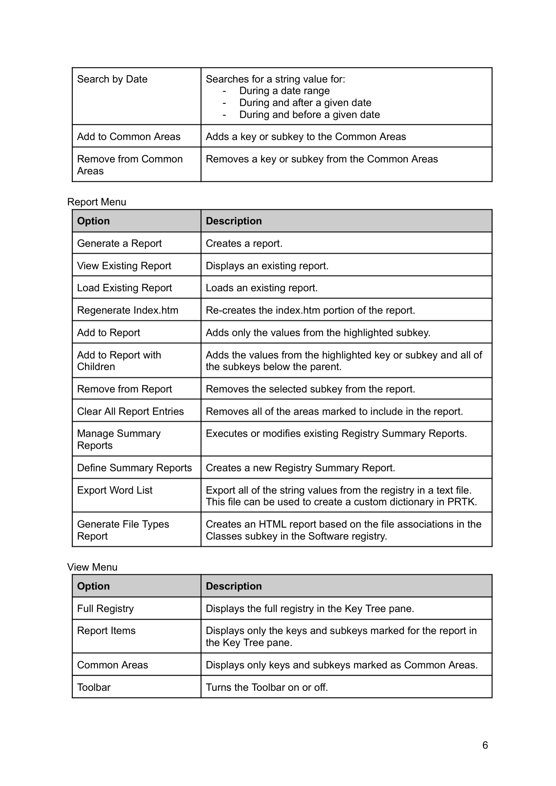
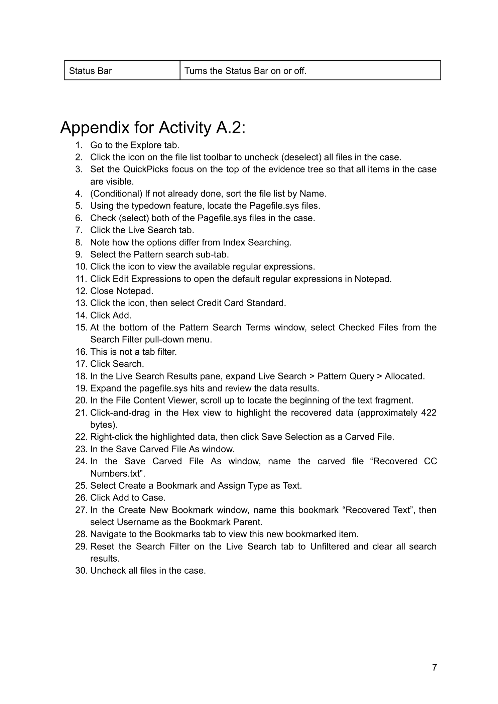
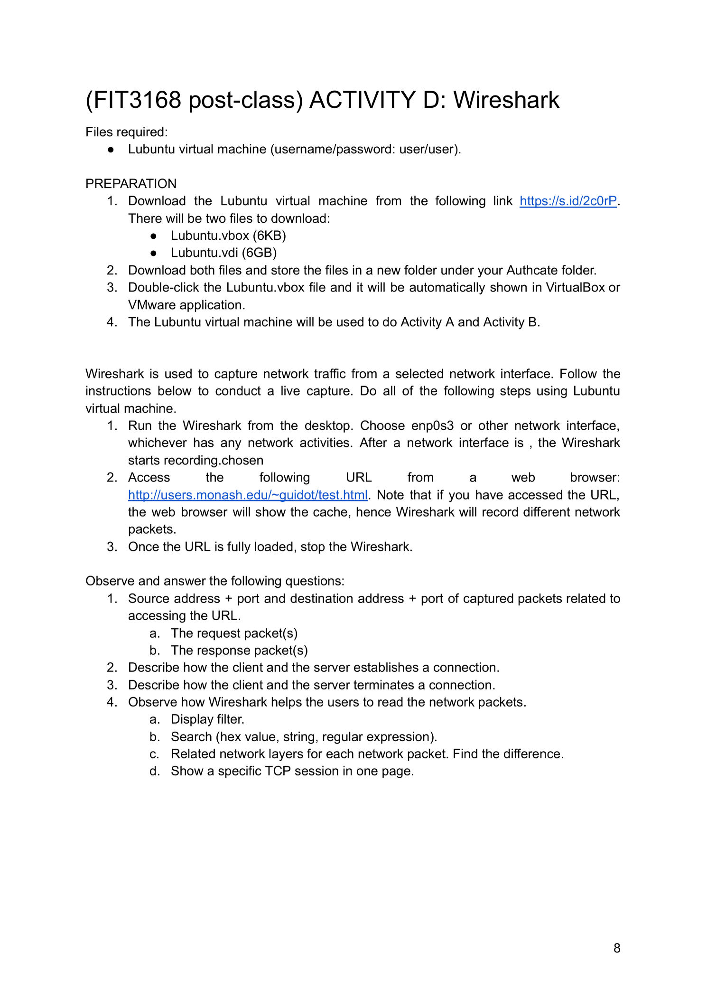

---

## 第 1 页



这是一个“IT Forensic Workshop 7（数字取证工作坊 7）”的作业/练习说明页。它告诉你本次练习的主题、学习目标、需要安装/准备的工具与文件，以及第一个动手活动该怎么做。下面把每一块都拆开解释，并补充背景知识，方便你直接上手。

# 这次 Workshop 在讲什么？

**主题（Topics）**

* **Windows Registry（Windows 注册表）**：Windows 的核心配置数据库，记录系统与用户设置、程序安装信息、最近使用记录等。取证时常见的关键注册表文件包括：

* `SAM`、`SYSTEM`、`SOFTWARE`、`SECURITY`（系统级）
* 用户配置如 `NTUSER.DAT`、`USRCLASS.DAT`（每个用户账号各有一份）
* **Live search（在线/实时采集或搜索）**：在一台正在运行的电脑（“活体”）上，直接采集或搜索证据，而不是只在镜像上进行离线分析。优点是能拿到内存或被系统保护的文件；风险是可能改变现场。
* **NTFS Volume Shadow Copies（卷影副本）**：Windows/NTFS 的“历史快照”，能恢复文件/注册表的历史版本，是取证恢复时间线的重要来源。

**学习成果（Covered Learning Outcomes）**

* 了解 IT 环境下开展取证调查的动机与整体图景；
* 认识数字取证涉及的法律定义与框架（例如证据保全、取证流程、可采性）；
* 能选用合适的工具/算法来获取与分析证据（本次聚焦注册表与卷影副本）。

# 做之前要准备什么？

**Instructions（指引）**

* **个人独立完成**。
* 安装 **Registry Viewer** 的免费演示版（一个专门浏览注册表 hive 的工具，用来打开 `SOFTWARE`、`SYSTEM`、`NTUSER.DAT` 等文件，便于可视化查看键值、时间戳、最近活动等）。

**Required Files（所需文件）**

* `Volume Shadow Copies.E01`
* `Washer17.E01`

> **E01 是什么？**
> `.E01` 是 EnCase 的镜像格式，常用于保存磁盘/分区的取证镜像，带有校验与分段支持。你会把这些镜像挂载/解析后，导出里面的注册表文件进行分析。

# 活动 A.1：导出注册表文件（Exporting Registry Files）

这部分给了两条路径：**从镜像导出**（推荐/主要）和**从活体机器导出**（只在你用自己的电脑时做，机房电脑请跳过）。

## A. 从镜像导出注册表（主要流程）

1. **准备 `Washer17.E01`**
把镜像加载到取证工具（例如 FTK Imager、Arsenal Image Mounter、X-Ways、Autopsy 等）。FTK Imager 免费且常用。
2. **导出所有注册表文件到你的账户目录**
文中写的 “authcate directory” 可以理解为“你的账号/个人工作目录”。在镜像里找到各个注册表 hive 并导出，例如：

* 系统级：`C:\Windows\System32\Config\` 下的 `SAM`、`SYSTEM`、`SOFTWARE`、`SECURITY`、`DEFAULT`
* 用户级：`C:\Users\<用户名>\NTUSER.DAT` 与 `...\AppData\Local\Microsoft\Windows\USRCLASS.DAT`
3. **探索这些注册表文件**
用 **Registry Viewer**（或 Eric Zimmerman's **Registry Explorer** 等）依次打开，观察常见的取证线索：

* 最近打开文档/程序（MUICache、RecentDocs、UserAssist）
* 已安装软件与运行信息（`SOFTWARE`、`SYSTEM\CurrentControlSet\Services`）
* 网络与 USB 设备历史
* 用户账号与登录信息（`SAM`、`SYSTEM` 组合）
* 时间戳（LastWrite）与时间线重建
* 与卷影副本结合，比较同一键在不同快照中的历史变化

## B. 从“活体”机器导出注册表（仅限你自己的电脑）

> **注意（红字部分）**：只在**你自己的电脑**上做；如果在机房/公共电脑，**跳过**这部分以免触犯使用政策或破坏现场证据。

步骤：

1. 打开 **FTK Imager**。
2. 点击 **“Obtain Protected Files”**（获取受保护文件）。
这项功能能从正在运行的 Windows 中复制那些被系统锁定的注册表 hive（例如 `SAM`、`SYSTEM` 等），便于离线分析，同时尽量保持文件一致性。

# 这些工具分别做什么？

* **FTK Imager**：成像与导出工具。可挂载/浏览镜像、校验哈希、导出文件（含受保护的系统文件）。
* **Registry Viewer**：浏览与分析注册表 hive 的查看器，更方便检索键/值、导出报告。
* **E01 镜像**：你要从这里“取证地”导出需要的注册表文件，保证证据链与可验证性（哈希）。

# 课堂期望你“会什么”？

根据页面的学习目标与活动安排，完成后你应能：

1. 说清楚**为什么**在取证调查中要看注册表与卷影副本（它们记录了大量“谁在何时做了什么”的痕迹）；
2. 知道相关**法律与流程**（证据保全、最小化破坏、完整性校验、记录日志等）；
3. 使用 **FTK Imager + Registry Viewer**（或同类工具）从镜像/活体导出注册表，并能在工具里**定位关键痕迹并做基本解读**。

# 小贴士（实操建议）

* 导出后立刻对文件做 **哈希（MD5/SHA-1/SHA-256）**，把值记到你的分析记录里，保证可重复验证。
* 如果给了 `Volume Shadow Copies.E01`，优先挂载镜像后用工具（如 **Shadow Explorer**、**vssadmin** 离线方式、或能解析 VSC 的取证套件）取相同路径下的注册表历史版本，做**历史对比**。
* 分析时多关注：启动项、最近运行程序、USB 历史、网络配置、用户登录与 RDP、浏览器/应用痕迹对应的注册表键。
* 不要在源证据上直接操作；导出到你的工作目录后，在副本上分析。

如果你愿意，我可以按这份练习给你列一个**具体清单**（要导出的文件清单 + 在 Registry Viewer 里要看的关键路径），或者带你一步步做一次演示。


---

## 第 2 页



下面这页是在接着教你**如何用 FTK Imager 抓取“活体”Windows 的受保护系统文件（尤其是注册表）**，以及接下来要做的**活动 A.2 的取证要点**。我把它分段讲清楚：

# 一、上半部分截图 & 第 3–5 步在说什么？

* 红箭头指向的是 **FTK Imager 工具栏里的“Obtain Protected Files / Obtain System Files”** 按钮。点它会弹出下面那个窗口。
* 弹窗标题 **“Obtain System Files”**，含义：**从正在运行的系统**导出被 Windows 锁定的系统文件（比如 `SAM`、`SYSTEM` 等注册表 hive）。注意这与“从镜像提取”不同，它会访问你当前这台机器。
* “Destination for obtained files” 让你**选择保存目录**（建议选你之前创建的工作文件夹）。
* 下面有两个选项：

1. **Minimum files for login password recovery**：只导出做口令恢复最少需要的文件。
2. **Password recovery and all registry files**：导出口令恢复文件 **以及全部注册表文件**。
按本页第 4 步，**选第二个**，然后 **OK**。
* 第 5 步让你打开导出后的 **Data** 目录去看结果。常见会看到：

* 系统级 hive：`SAM`、`SYSTEM`、`SOFTWARE`、`SECURITY`、`DEFAULT`（通常来自 `C:\Windows\System32\Config\`）
* 用户级 hive：各账号下的 `NTUSER.DAT` 与 `USRCLASS.DAT`

> 提醒：只有在**你自己的电脑**上才做这段“活体导出”。机房或公共电脑请跳过（上一页已强调）。

# 二、ACTIVITY A.2：要分析哪些注册表 & 要回答什么？

标题写的是 **“System, SAM, Software, NTUR Registry”**——这里很可能是笔误，通常应为 **NTUSER（NTUSER.DAT）**。这四类 hive 的作用分别是：

* **SYSTEM**：系统配置、服务/驱动、硬件配置、**Control Sets** 等。
* **SAM**：本机账户与组、登录相关信息、**口令哈希**（取证时常配合 `SYSTEM` 读取）。
* **SOFTWARE**：已安装软件、应用配置、开机启动项（`Run` 键）等。
* **NTUSER.DAT**（每个用户一份）：该用户的桌面/应用/最近使用记录等个性化配置。

* （另外常配合 `USRCLASS.DAT` 看每用户的类/扩展关联与 ShellBag 等痕迹。）

## 问题 1：SYSTEM 里的 “Control Set” 和 “LastKnownGood” 是什么？在哪儿找？

**概念**

* **Control Set** 是系统启动配置的一组快照（服务/驱动、控制台设置等）。Windows 会保留多组，如 `ControlSet001`、`ControlSet002`……
* **CurrentControlSet** 并不是独立一份，而是指向“当前正在使用”的那一组 Control Set 的**符号链接**视图。
* **LastKnownGood**（上次成功配置）：Windows 记录“上次成功启动”所用的 Control Set，必要时可用于回退。

**位置（路径）**

* 进入 **`HKLM\SYSTEM\Select`**（SYSTEM hive 里）：
这里有几个关键数值：

* `Current`：当前正在使用的 Control Set 号（如 `1` 表示 `ControlSet001`）
* `Default`：默认将使用的 Control Set 号
* `LastKnownGood`：上次成功启动的 Control Set 号
* `Failed`：上次失败启动使用的 Control Set 号（如有）
* 实际的配置内容在 **`HKLM\SYSTEM\ControlSet00x\...`** 下。
**`HKLM\SYSTEM\CurrentControlSet`** 是一个便利入口，等价于 `ControlSet00x` 中被 `Current` 指向的那一套。

> 取证要点：读取 `Select` 键即可判断系统当前/默认/上次成功使用的是哪一套配置；比对不同 `ControlSet00x` 可看服务/驱动启停变更。

\##（接着的段落）Security Identifier（安全标识符，SID）& SAM 的取证重点
虽然页面在这里被截断，但主题已经转到 **SAM**。你需要知道：

* **SID** 形如 `S-1-5-21-xxxxxxxxx-xxxxxxxxx-xxxxxxxxx-<RID>`，末尾的 **RID** 标识用户或组。

* 常见：`RID 500` 是内置 **Administrator**，`RID 501` 是 **Guest**。
* **在 SAM 中查看用户**（配合 `Registry Viewer`）：

* `HKLM\SAM\SAM\Domains\Account\Users\Names\<用户名>`：可把用户名映射到其 RID。
* 然后到 `...Users\<RID>`：该键里的 `V` 值包含账户创建/修改时间、登录相关字段、口令哈希位置等（哈希解读需配合 `SYSTEM` 的启动密钥）。
* **配合 SOFTWARE/NTUSER.DAT** 可进一步还原：

* 用户最近运行程序（如 `NTUSER.DAT` 的 `UserAssist`、`MUICache`、`RecentDocs` 等）
* 已安装/最近使用的软件（`SOFTWARE\Microsoft\Windows\CurrentVersion\...`）
* 启动项（`...\Run`、`...\RunOnce`）
* 设备/网络痕迹（部分在 SYSTEM、部分在 SOFTWARE/NTUSER）

# 三、你可以怎么答题/操作（给你一个实操路线）

1. 用 Registry Viewer 打开 **SYSTEM**，先到 `SYSTEM\Select` 读出 `Current`、`Default`、`LastKnownGood` 数值；再展开对应的 `ControlSet00x` 看 `Services`、`Control\Session Manager` 等关键位置。
2. 打开 **SAM**，先看 `...\Users\Names\` 找到用户名 → RID；再到 `...\Users\<RID>` 读取时间戳与账户状态字段。
3. 打开 **SOFTWARE**，查看 `...\Microsoft\Windows\CurrentVersion\Run`（启动项）、`...\Uninstall`（已装软件）等。
4. 针对每个用户，打开其 **NTUSER.DAT**，查看 `UserAssist`、`RecentDocs`、`RunMRU`、`TypedPaths` 等使用痕迹。
5. 把关键键路径、时间戳、对应意义记录到你的工作笔记里（连同文件哈希），便于写报告。

如果你把题目后半页也发上来（关于 SID 的那段可能还有具体问题），我可以继续逐条给出**路径 + 怎么看 + 解释**。


---

## 第 3 页



这页在讲三件事：

1. **SID 与 SAM/用户名的关联，及要回答的题目**；
2. **SOFTWARE 和 NTUSER.DAT 里能找到什么取证信息**；
3. **卷影副本（VSS/VSC）是什么，为后续 Activity B 做铺垫**。
我把每条题目都拆成“概念 + 去哪里找 + 实操要点”。

---

# A. SAM / SID 相关（接着 A.2）

**背景**

* 每个本机账户会在 **SAM**（Security Accounts Manager）注册表中有记录，并被分配唯一的 **RID**（Relative ID，末尾编号）。
* Windows 用 **SID**（Security Identifier）来跟踪用户对文件/操作的归属，创建或修改文件时会把**当前登录用户的 SID** 写入元数据；因此在取证里非常关键。

### 问题 2：SID 的三个主要组成部分是什么？

Windows 的 SID 一般长这样：`S-1-5-21-AAAAAAAAA-BBBBBBBBB-CCCCCCCCC-1003`
可把它理解成 **三块**：

1. **前缀/版本**：`S-1`（S = SID，1 = 版本号 Revision）
2. **标识符颁发机构 + 域/计算机标识（SubAuthorities）**：`5-21-AAAAAAAAA-BBBBBBBBB-CCCCCCCCC`

* 其中 `5` 是 **Identifier Authority**（NT Authority），
* 后面的三串 `21-…-…-…` 则表示这台机器/域的唯一标识。
3. **RID（相对标识符）**：最后的数字（如 `1003`），标识具体的**用户或组**。

> 所以：**同一台机器/域上**，前两块通常相同，不同的只是**最后的 RID**。

### 问题 3：在 Washer 镜像里，SID 末尾是 **1003** 的用户叫什么名字？

你需要**在 SAM 里把 RID → 用户名**：

**两种常见查法（在 Registry Viewer/Registry Explorer 中）：**

* 路径 1（Name → RID）：
`HKLM\SAM\SAM\Domains\Account\Users\Names\<用户名>`
选中一个名字可看到其对应的 RID。
* 路径 2（RID → 用户名，适合你这道题）：
`HKLM\SAM\SAM\Domains\Account\Users\<RID>`

* 其中 `<RID>` 用**十六进制**子键名表示。`1003 (十进制)` = `0x3EB (十六进制)`，所以找 **`...Users\000003EB`**。
* 查看该键的 `V` 值（以及旁边的 `F`），工具通常会在界面上解析并显示**用户名、创建/修改时间、是否禁用、密码相关字段**等。
* 把解析到的**用户名**记下来，作为题 3 的答案。

> 小技巧：很多取证工具会直接把 `Users` 下每个 RID 子键旁边显示解析出的用户名，能更直观地看到 `…\000003EB → 某某用户`。

---

# B. SOFTWARE 与 NTUSER.DAT 里能看到什么（题 4 与 Task 5）

### 问题 4：“SOFTWARE” 文件可能包含哪些信息？

**SOFTWARE hive（HKLM\SOFTWARE）** 主要是**系统与已安装软件的配置信息**，常见可取证的点有：

* **系统信息**：版本/构建号、产品名、安装日期、注册所有者（如有）
`HKLM\SOFTWARE\Microsoft\Windows NT\CurrentVersion`
* **已安装软件与卸载信息**：
`HKLM\SOFTWARE\Microsoft\Windows\CurrentVersion\Uninstall\...`（32 位/64 位还要看 Wow6432Node）
* **随系统启动的程序（全部用户级）**：
`HKLM\SOFTWARE\Microsoft\Windows\CurrentVersion\Run`、`RunOnce`
* **应用程序配置**：许多软件会在 `HKLM\SOFTWARE\<厂商>\<产品>` 下写入路径、版本、最近使用等（视具体程序而定）

> 注意区分：很多“最近使用/个人习惯”是**每用户**的，通常在 **NTUSER.DAT** 或 **USRCLASS.DAT**，而不是 HKLM\SOFTWARE。

### Task 5：任选一个用户，利用 **NTUSER.DAT** 找出与该用户有关的独有活动信息

**NTUSER.DAT（HKCU）** 是“当前用户”的注册表蜂巢，能反映该用户的使用痕迹。题目给的提示点及常见路径如下（版本不同可能略有差异）：

* **MRU（Most Recently Used，各类“最近列表”）**
`HKCU\Software\Microsoft\Windows\CurrentVersion\Explorer\RecentDocs`（按扩展名分组）
其他 MRU 如 `RunMRU`、`OpenSavePIDL` 等也很常见
* **Typed URLs（地址栏输入过的 URL）**
`HKCU\Software\Microsoft\Internet Explorer\TypedURLs`（IE/旧版 Edge）
* **Internet 搜索查询与表单数据**
视浏览器/版本而定（IE 可在 `TypedURLs`、`SearchScopes` 等；现代浏览器更多在用户数据目录文件中，注册表痕迹相对少）
* **Recent Documents（最近文档）**
同上 `Explorer\RecentDocs`；还可配合


---

## 第 4 页



这页在讲三件事：

1. **SID 与 SAM/用户名的关联，及要回答的题目**；
2. **SOFTWARE 和 NTUSER.DAT 里能找到什么取证信息**；
3. **卷影副本（VSS/VSC）是什么，为后续 Activity B 做铺垫**。
我把每条题目都拆成“概念 + 去哪里找 + 实操要点”。

---

# A. SAM / SID 相关（接着 A.2）

**背景**

* 每个本机账户会在 **SAM**（Security Accounts Manager）注册表中有记录，并被分配唯一的 **RID**（Relative ID，末尾编号）。
* Windows 用 **SID**（Security Identifier）来跟踪用户对文件/操作的归属，创建或修改文件时会把**当前登录用户的 SID** 写入元数据；因此在取证里非常关键。

### 问题 2：SID 的三个主要组成部分是什么？

Windows 的 SID 一般长这样：`S-1-5-21-AAAAAAAAA-BBBBBBBBB-CCCCCCCCC-1003`
可把它理解成 **三块**：

1. **前缀/版本**：`S-1`（S = SID，1 = 版本号 Revision）
2. **标识符颁发机构 + 域/计算机标识（SubAuthorities）**：`5-21-AAAAAAAAA-BBBBBBBBB-CCCCCCCCC`

* 其中 `5` 是 **Identifier Authority**（NT Authority），
* 后面的三串 `21-…-…-…` 则表示这台机器/域的唯一标识。
3. **RID（相对标识符）**：最后的数字（如 `1003`），标识具体的**用户或组**。

> 所以：**同一台机器/域上**，前两块通常相同，不同的只是**最后的 RID**。

### 问题 3：在 Washer 镜像里，SID 末尾是 **1003** 的用户叫什么名字？

你需要**在 SAM 里把 RID → 用户名**：

**两种常见查法（在 Registry Viewer/Registry Explorer 中）：**

* 路径 1（Name → RID）：
`HKLM\SAM\SAM\Domains\Account\Users\Names\<用户名>`
选中一个名字可看到其对应的 RID。
* 路径 2（RID → 用户名，适合你这道题）：
`HKLM\SAM\SAM\Domains\Account\Users\<RID>`

* 其中 `<RID>` 用**十六进制**子键名表示。`1003 (十进制)` = `0x3EB (十六进制)`，所以找 **`...Users\000003EB`**。
* 查看该键的 `V` 值（以及旁边的 `F`），工具通常会在界面上解析并显示**用户名、创建/修改时间、是否禁用、密码相关字段**等。
* 把解析到的**用户名**记下来，作为题 3 的答案。

> 小技巧：很多取证工具会直接把 `Users` 下每个 RID 子键旁边显示解析出的用户名，能更直观地看到 `…\000003EB → 某某用户`。

---

# B. SOFTWARE 与 NTUSER.DAT 里能看到什么（题 4 与 Task 5）

### 问题 4：“SOFTWARE” 文件可能包含哪些信息？

**SOFTWARE hive（HKLM\SOFTWARE）** 主要是**系统与已安装软件的配置信息**，常见可取证的点有：

* **系统信息**：版本/构建号、产品名、安装日期、注册所有者（如有）
`HKLM\SOFTWARE\Microsoft\Windows NT\CurrentVersion`
* **已安装软件与卸载信息**：
`HKLM\SOFTWARE\Microsoft\Windows\CurrentVersion\Uninstall\...`（32 位/64 位还要看 Wow6432Node）
* **随系统启动的程序（全部用户级）**：
`HKLM\SOFTWARE\Microsoft\Windows\CurrentVersion\Run`、`RunOnce`
* **应用程序配置**：许多软件会在 `HKLM\SOFTWARE\<厂商>\<产品>` 下写入路径、版本、最近使用等（视具体程序而定）

> 注意区分：很多“最近使用/个人习惯”是**每用户**的，通常在 **NTUSER.DAT** 或 **USRCLASS.DAT**，而不是 HKLM\SOFTWARE。

### Task 5：任选一个用户，利用 **NTUSER.DAT** 找出与该用户有关的独有活动信息

**NTUSER.DAT（HKCU）** 是“当前用户”的注册表蜂巢，能反映该用户的使用痕迹。题目给的提示点及常见路径如下（版本不同可能略有差异）：

* **MRU（Most Recently Used，各类“最近列表”）**
`HKCU\Software\Microsoft\Windows\CurrentVersion\Explorer\RecentDocs`（按扩展名分组）
其他 MRU 如 `RunMRU`、`OpenSavePIDL` 等也很常见
* **Typed URLs（地址栏输入过的 URL）**
`HKCU\Software\Microsoft\Internet Explorer\TypedURLs`（IE/旧版 Edge）
* **Internet 搜索查询与表单数据**
视浏览器/版本而定（IE 可在 `TypedURLs`、`SearchScopes` 等；现代浏览器更多在用户数据目录文件中，注册表痕迹相对少）
* **Recent Documents（最近文档）**
同上 `Explorer\RecentDocs`；还可配合


---

## 第 5 页



这页是 **Activity A.1 的附录**，教你怎么用 **Registry Viewer**（注册表查看器）来浏览与检索导出的注册表文件，并解释界面与菜单项的作用。逐条说明如下：

# 界面布局在说什么？

截图下方说明：Registry Viewer 的主界面分为 **四个面板**：

1. **Key Tree（键树）**：左侧像资源管理器一样的树状结构。每个“文件夹”图标是一个注册表“键（Key）”。
2. \*\*Value（值列表）


---

## 第 6 页



这页是 **Activity A.1 的附录**，教你怎么用 **Registry Viewer**（注册表查看器）来浏览与检索导出的注册表文件，并解释界面与菜单项的作用。逐条说明如下：

# 界面布局在说什么？

截图下方说明：Registry Viewer 的主界面分为 **四个面板**：

1. **Key Tree（键树）**：左侧像资源管理器一样的树状结构。每个“文件夹”图标是一个注册表“键（Key）”。
2. \*\*Value（值列表）


---

## 第 7 页



这页是 **“Activity A.2 的附录操作步骤”**——教你在 **FTK** 里从 **pagefile.sys（页面交换文件）** 中用 **Live Search（实时搜索）** + **正则模式** 找到可能的**信用卡号**片段，把命中的数据**切割（carve）**成独立文件并**加书签**。下面把 1–30 步逐条解释，每步都说清“为什么要这么做”。

---

# 附录步骤详解（含目的）

1. **Go to the Explore tab.**
进入 **Explore** 面板（浏览证据树与文件内容的主界面）。

2. **Uncheck all files in the case.**
工具栏点“取消选择所有文件”。避免 Live Search 在整个案件上乱搜，先清空选择。

3. **Set QuickPicks focus so all items are visible.**
把证据树顶端的 **QuickPicks** 焦点设为显示全部项，确保你能看到并选择需要的文件。

4. **(If needed) Sort file list by Name.**
按名称排序便于快速定位目标文件（pagefile.sys）。

5. **Use typedown to locate pagefile.sys.**
使用“键入定位”（输入文件名首字母快速跳转）找到 **pagefile.sys**。
*解释：pagefile.sys 里常残留内存中出现过的明文片段（如卡号/账号）。*

6. **Select both pagefile.sys files in the case.**
若有多个分区/还原点里的 pagefile.sys，都勾选。搜索覆盖更全。

7. **Click the Live Search tab.**
切到 **Live Search**（不依赖预建索引，直接按模式扫描内容）。

8. **Note how options differ from Index Searching.**
认清 Live Search 与 Index Search 的差异：Live 是逐字节扫描（慢但全面），Index 依赖已建索引（快但对二进制/未索引区域可能漏）。

9. **Select the Pattern search sub-tab.**
选择 **Pattern** 子页，用预置/正则模式做匹配。

10. **Click the icon to view available regex.**
查看内置的正则模板列表（信用卡、邮箱等）。

11. **Edit Expressions → open defaults in Notepad.**
点 **Edit Expressions** 可把当前正则集打开到记事本以供查看/修改（了解具体匹配式样）。

12. **Close Notepad.**
看完退出。

13. **Click the icon, select *Credit Card Standard*.**
在模式库里选择 **Credit Card Standard**（信用卡标准格式的正则/模式）。

14. **Click Add.**
把这个模式加入到本次搜索的“搜索词”列表中。

15. **Search Filter pull-down → Checked Files.**
在下拉框把搜索范围选成 **Checked Files**（仅搜索你勾选的文件——我们勾选了 pagefile.sys）。
*这不是文本过滤，而是限定扫描目标。*

16. **This is not a tab filter.**
再次强调：这里选的是“搜索范围”，不是结果面板的筛选页签。

17. **Click Search.**
开始扫描 pagefile.sys，按信用卡模式寻找可能匹配。

18. **In results expand: Live Search > Pattern Query > Allocated.**
在结果窗展开 **Live Search → Pattern Query → Allocated**。
*Allocated 表示命中位于已分配区域（相对更“活”的数据），也可能有 Unallocated 命中。*

19. **Expand pagefile.sys hits and review.**
展开各个命中项，预览命中的上下文。

20. **In File Content Viewer, scroll to the beginning of the fragment.**
切到 **File Content Viewer**，把视图滚到文本片段的起始处，确认完整范围。

21. **Hex view: click-drag \~422 bytes to highlight.**
换到 **Hex 视图**，拖选覆盖这段命中上下文（示例用 \~422 字节，按需要可增减）——确保包含足够上下文便于取证说明。

22. **Right-click → Save Selection as Carved File.**
右键选中的十六进制数据，**保存为切割文件（Carved File）**。
*Carving = 从大文件中把一段字节“抠出来”另存证据。*

23. **Save Carved File As window.**
进入保存对话框。

24. **Name it “Recovered CC Numbers.txt”.**
命名建议：**Recovered CC Numbers.txt**（可按实验要求命名，便于识别内容）。

25. **Select *Create a Bookmark* and set Type=Text.**
勾选 **Create a Bookmark**，类型选 **Text**（告诉 FTK 这是一段文本证据）。

26. **Click Add to Case.**
把这份切割文件和书签加入案件。

27. **Name the bookmark “Recovered Text”, set Parent = Username.**
在新建书签的窗口里把名字设为 **Recovered Text**，并把 **父节点** 选为对应的 **用户名**（将证据归类到相关用户名下）。

28. **Go to Bookmarks tab to view the new item.**
打开 **Bookmarks** 面板确认书签/切割件已出现（便于报告和导出）。

29. **Reset Live Search filter to *Unfiltered* and clear results.**
回到 **Live Search**，把搜索范围重置为 **Unfiltered** 并清空结果，避免影响后续任务。

30. **Uncheck all files in the case.**
取消全选，保持案件处于干净状态，防止下次搜索误用范围。

---

## 关键概念补充与小贴士

* **pagefile.sys 为什么重要？**
它是“内存换页文件”，常含有曾出现在内存里的敏感明文（账号、聊天、文档片段、卡号），被程序释放后仍可能残留在磁盘文件中，适合做关键字/正则扫描。

* **Credit Card Standard 模式**
预置正则一般会结合 **Luhn 校验** 或格式规则减少误报，但仍需**人工复核**上下文（是否像真实卡号、是否伴随持卡人信息/商户票据等）。

* **Carved File & Bookmark**
Carve 让你把证据片段独立存档，**保持原证据不变**；书签用于**结构化整理与报告**。
建议同时记录：来源文件路径、偏移量、时间、操作者、哈希（对 carved 文件）等。

* **合规与隐私**
命中信用卡/个人信息要注意**数据最小化展示**与**合法合规**，在课堂/报告里可做遮罩（只展示末 4 位等），但保留原件在受控证据库。

需要的话，我可以给你做一个**FTK 操作清单模板**（逐步勾选 + 证据记录栏），或提供一份**书签/报告说明模板**，你直接填就能提交作业。


---

## 第 8 页



这页是 **活动 D：Wireshark 抓包** 的完整说明。它让你在一台已准备好的 **Lubuntu 虚拟机** 里，用 Wireshark 抓取访问一个网页时产生的网络流量，然后回答若干与 TCP/HTTP 相关的问题。下面把每一段含义和怎么做都讲清楚，并给出可直接套用的操作与过滤器。

---

# 一、准备（Preparation）讲的是什么？

* 你需要下载一个 **Lubuntu 虚拟机**（账号/密码都是 `user`）。给了两个文件：

* `Lubuntu.vbox`（几 KB，虚拟机的描述文件）
* `Lubuntu.vdi`（\~6GB，虚拟磁盘）
* 把两个文件放到你的 **Authcate**（个人）目录中新建的文件夹里。
* **双击** `Lubuntu.vbox`，VirtualBox（或 VMware）会自动导入虚拟机。
* 这台 Lubuntu VM 会用于本页后面的 **Activity A / B**（你手里这页是 **D**，但同样用它）。

> 小提示
>
> * VirtualBox 默认网卡名在 Linux 里常显示为 **`enp0s3`**（NAT 模式）。
> * 若你的虚机界面不是中文，菜单位置一致但术语是英文。

---

# 二、抓包实操（Wireshark live capture）

1. 在 Lubuntu 桌面启动 **Wireshark**。选择 **`enp0s3`**（或任一有流量的网卡），点开始。
2. 在浏览器访问：`http://users.monash.edu/~guidot/test.html`

* 注意：如果你之前就访问过，这次可能命中**浏览器缓存**，包会少。可用 **Ctrl+Shift+R**（强刷）或清缓存再试。
3. 页面完全加载后，回到 Wireshark，点击 **停止**（红方块）。

> 一般会抓到：
>
> * **DNS 查询**：解析 `users.monash.edu`（UDP/53）
> * **TCP 握手**：和服务器三次握手（SYN/SYN-ACK/ACK）
> * **HTTP 请求/响应**：`GET /~guidot/test.html` → `HTTP/1.1 200 OK`（端口 80）
> * **TCP 终止**：FIN/ACK（可能是双向各一次）

---

# 三、问题逐条怎么答

## 1) 访问该 URL 的“源/目的 IP 与端口”（请求与响应）

**怎么看：**

* 过滤 **HTTP**：`http` 或 `tcp.port == 80`
* 找到 **第一个 HTTP 请求**（`GET`）。在中间的 **Packet Details** 展开 **Internet Protocol / Transmission Control Protocol**：

* **Request（请求报文）**：

* Source（源地址/端口）= 你的虚机 IP（如 `10.0.2.x`） + **临时端口**（ephemeral）
* Destination（目的地址/端口）= 服务器 IP + **80**
* **Response（响应报文）**：

* Source = 服务器 IP + **80**
* Destination = 你的虚机 IP + **同一个临时端口**

**常用显示过滤器：**

* 只看本次会话：先右键任一 HTTP 包 → **Follow → TCP Stream** → Wireshark 自动加上 `tcp.stream == N`
* 只看请求：`http.request.method == "GET"`
* 只看响应：`http.response` 或 `tcp.srcport == 80`

---

## 2) 客户端与服务器如何建立连接（TCP 三次握手）

**怎么看：**

* 过滤：`tcp.flags.syn == 1 && tcp.flags.ack == 0`（SYN）
* 同一个 `tcp.stream` 里会看到顺序：

1. **SYN**（客户端 → 服务器）
2. **SYN, ACK**（服务器 → 客户端）
3. **ACK**（客户端 → 服务器）
* 然后出现 `GET` 请求（在已建立的连接上）。

---

## 3) 客户端与服务器如何终止连接（TCP 终止）

**常见两种：**

* **正常四次挥手**（更常见）：

* 一方发 **FIN, ACK** → 对方回 **ACK**；
* 对方再发 **FIN, ACK** → 第一方回 **ACK**。
* **RST** 复位（有时看到，取决于对端/中间设备行为）。

**过滤：**

* `tcp.flags.fin == 1`（看 FIN 包）
* `tcp.flags.reset == 1`（看 RST 包）

---

## 4) 观察 Wireshark 如何帮助阅读数据包（四小点）

a) **Display filter（显示过滤器）**

* DNS：`dns`
* HTTP：`http` 或 `tcp.port == 80`
* 指定 IP：`ip.addr == <你的虚机IP>` 或 `ip.addr == <服务器IP>`
* 握手：`tcp.flags.syn == 1`
* 本流：`tcp.stream == N`

b) **Search（搜索：十六进制/字符串/正则）**

* 菜单 **Edit → Find Packet**
* 在 **Find** 对话框里选择 **By String / By Hex / By Regex**，在 **Packet bytes** 或 **Packet details** 搜 HTML 文本、Host 头、关键字等（如 `guidot`）。

c) **相关的网络层级（并找差异）**
选任一包看中间窗的各层：

* **DNS 包**：Frame → Ethernet → IP → **UDP** → **DNS**
* **HTTP 包**：Frame → Ethernet → IP → **TCP** → **HTTP**
差异：一个走 UDP/53 的应用层 **DNS**，一个走 TCP/80 的应用层 **HTTP**，传输层不同，负载也不同。

d) **在一页显示一个特定的 TCP 会话**

* 右键任一相关包 → **Follow → TCP Stream**
* 弹窗里会把该 TCP 对话的**全部文本**（请求+响应）串起来显示（红=客户端、蓝=服务器），并在主窗口自动套用 `tcp.stream == N` 过滤器。

---

# 四、可能遇到的细节 & 速查过滤器

* **DNS 先于 HTTP**：先看到 `Standard query A users.monash.edu` → `Standard query response A <server-ip>`，再进行 TCP 握手和 HTTP。
* **端口**：这是 **HTTP 非加密**（`http://`），通常目的端口 **80**（不是 443）。
* **缓存影响**：若浏览器走缓存，你可能只看到少量网络请求。用 **Ctrl+Shift+R** 强刷，或在浏览器开发者工具里勾选“Disable cache”。

**实用过滤器合集：**

```
dns
tcp.port == 80
http
http.request.method == "GET"
ip.addr == <你的IP> || ip.addr == <服务器IP>
tcp.flags.syn == 1 && tcp.flags.ack == 0
tcp.flags.fin == 1
tcp.stream == <编号>
```

---

# 五、答题模板（你可以照此整理）

1. **源/目的 IP+端口**

* 请求：`<源IP>:<临时端口>  ->  <服务器IP>:80`
* 响应：`<服务器IP>:80  ->  <源IP>:<同一临时端口>`
证据：截图 GET 报文详情与响应首行（过滤 `tcp.stream == N`）。

2. **建立连接过程**

* SYN（C→S）/ SYN,ACK（S→C）/ ACK（C→S）顺序与时间戳。
证据：`tcp.flags.syn` 过滤列表截图。

3. **终止连接过程**

* FIN/ACK 四次挥手（或 RST）。
证据：`tcp.flags.fin` 或 `tcp.flags.reset` 过滤截图与说明。

4. **Wireshark 帮助阅读**

* 列出你用过的 Display Filter；
* 展示一次 **Find Packet**（字符串/正则）结果；
* 对比 DNS 与 HTTP 的“层级堆叠”；
* 用 **Follow TCP Stream** 的窗口截图展示“单页会话视图”。

需要的话，我可以给你做一份 **可直接提交的实验报告模板（Markdown/Word）**，含占位的截图位与结论区，你把截图粘上去、补全 IP/端口/时间戳就行。
