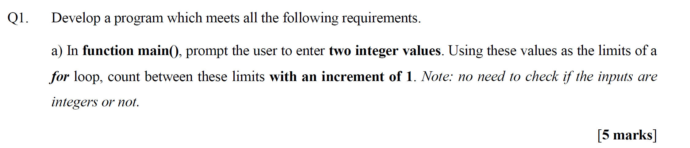
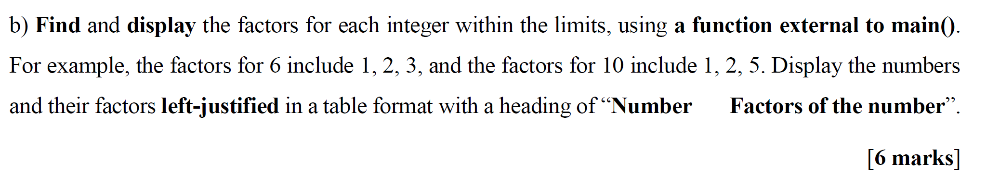
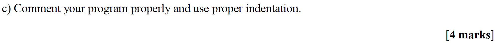
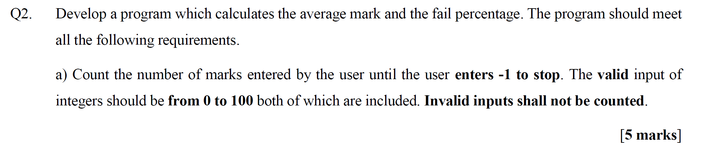
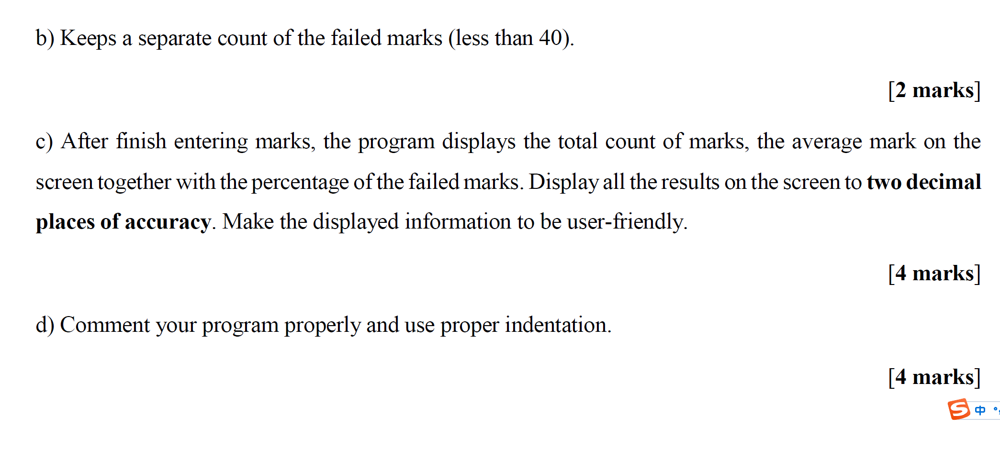
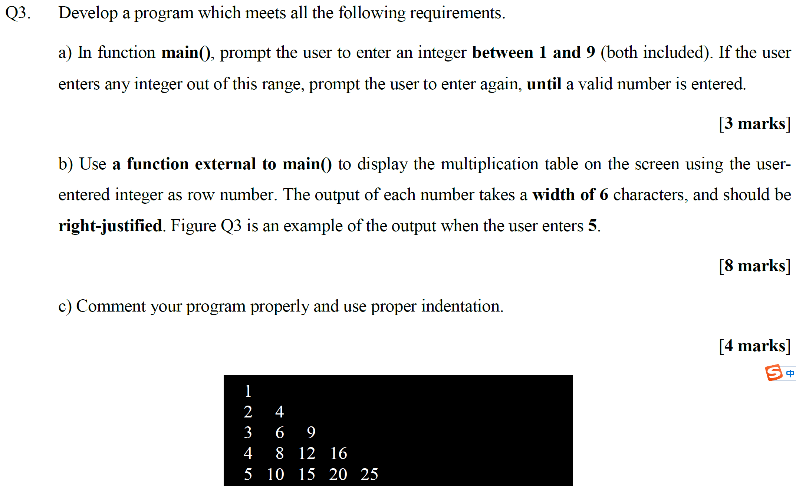
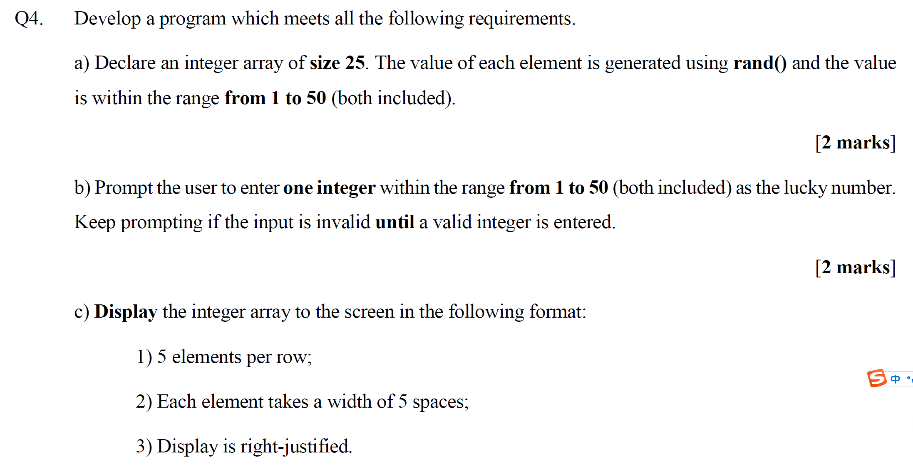
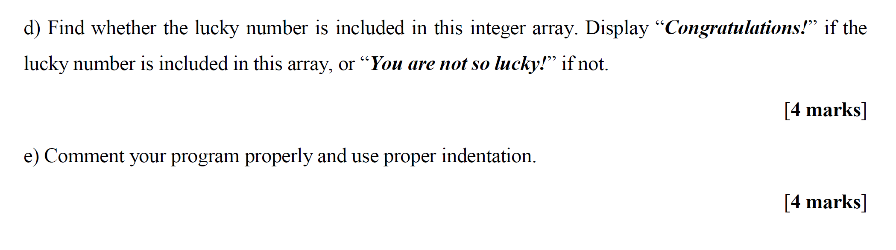

202507040020后台姓名：崔晟瑭
用户ID：106515
用户1V1昵称：篮球
学生需求类型：考前辅导
学生基础：挂科了 需要补考
期望上课时间：可商量北京
学生DUE时间：8/18北京
用户类型：1v1老用户
院校：UNNC
年级：大二
专业：理科
科目代码：EEEE1044
科目名称：Introduction to Software Engineering and Programming
备注：需要老师先看看大纲能带嘛 后期可以补充资料 需要老师对这门课很熟悉 需要C语言



这道题是编程题，题目要求你**编写一个程序**，满足如下要求：

------

## 📌 题目内容解释：

**Q1. 开发一个程序，满足以下所有要求：**

### a）在 `main()` 函数中：

1. **提示用户输入两个整数**。
   - 例如：提示用户输入 “第一个整数：” 和 “第二个整数：”
2. **使用这两个值作为 `for` 循环的范围**。
   - 比如输入的是 3 和 7，就从 3 数到 7。
3. **用 `for` 循环，每次递增 1**，并打印出这些数字。
4. **不需要检查用户是否真的输入了整数**，可以假设用户输入的就是整数。

------

## 🧠 举例说明：

比如用户输入：

```
Enter the first integer: 2
Enter the second integer: 5
```

程序输出：

```
2
3
4
5
```

------

## ✅ C++ 示例代码如下：

```cpp
#include <stdio.h>

int main() {
    int start, end;

    // 1. 提示输入两个整数
    printf("Enter the first integer: ");
    scanf("%d", &start);

    printf("Enter the second integer: ");
    scanf("%d", &end);

    // 2. 从小到大或从大到小输出范围内所有整数
    if (start <= end) {
        for (int i = start; i <= end; i++) {
            printf("%d\n", i);
        }
    } else {
        for (int i = start; i >= end; i--) {
            printf("%d\n", i);
        }
    }

    return 0;
}

```

------

## 💡 如果只考虑从小到大（符合题目 increment of 1）：

你可以只写：

```cpp
for (int i = start; i <= end; i++)
    cout << i << endl;
```

但如果用户输入的两个数字是反的，比如输入 7 和 2，程序就不会输出任何内容。所以可以加入 `if (start > end)` 的判断来改进体验，但不强求。

------

## 📝 总结

| 步骤 | 内容                              |
| ---- | --------------------------------- |
| 1    | 获取两个整数输入                  |
| 2    | 用 `for` 循环从一个数数到另一个数 |
| 3    | 每次递增 1                        |
| 4    | 打印每个数字                      |

------

如需我用 Python 或 Java 写，也可以告诉我~



这道题是**第 Q1 题的第 b 小题**，是紧接着上一题（输入两个整数并用 `for` 循环打印区间内所有整数）之后的操作，要求如下：

------

## 📌 题目要求详解

> **b）为每一个在范围内的整数，找出它的因数并打印出来，使用一个主函数外部的函数。**

### ✅ 具体意思是：

1. **写一个函数**（不是 `main()`）：
   - 功能是：找出某个整数的因数（factors），即能整除它的所有数字。
   - 例如：6 的因数有 1, 2, 3；10 的因数有 1, 2, 5。
2. 在 `main()` 函数里：
   - 使用这个自定义函数，对用户输入范围内的每个数字都找出它的因数。
3. **打印格式要求如下：**
   - 要用表格格式打印。
   - 表格左对齐（left-justified）。
   - 第一行要写标题（表头）：`Number        Factors of the number`
   - 每行打印一个数字和它的因数。

------

## 💡 示例输出效果：

如果用户输入的是 6 到 8：

```
Number        Factors of the number
6             1 2 3
7             1
8             1 2 4
```

------

## ✅ C++ 代码实现：

```cpp
#include <stdio.h>

// 函数声明：打印某个整数的因数
void printFactors(int num);

int main() {
    int start, end;

    // 用户输入两个整数
    printf("Enter the first integer: ");
    scanf("%d", &start);

    printf("Enter the second integer: ");
    scanf("%d", &end);

    // 打印表头，左对齐，Number 占15字符宽度
    printf("%-15s%s\n", "Number", "Factors of the number");

    // 遍历区间内的每个数，打印它的因数
    for (int i = start; i <= end; i++) {
        printFactors(i);
    }

    return 0;
}

// 打印某个数的所有因数（不包括自身）
void printFactors(int num) {
    // 打印数字本身，占15字符宽度左对齐
    printf("%-15d", num);

    // 找出所有能整除它的数
    for (int i = 1; i < num; i++) {
        if (num % i == 0) {
            printf("%d ", i);
        }
    }
    printf("\n");
}

```

------

## 📝 总结重点

| 步骤       | 内容                                                |
| ---------- | --------------------------------------------------- |
| ✅ 函数定义 | 用一个主函数外部的函数 `printFactors(int)` 来找因数 |
| ✅ 循环调用 | 在 `main()` 中对范围内每个整数调用 `printFactors()` |
| ✅ 打印要求 | 表头要打印，内容左对齐，格式整齐                    |
| ✅ 注意事项 | 用 `<iomanip>` 里的 `setw()` 控制对齐格式           |

------

如你还需要 Python 版、C 版、Java 版，或者对表格格式调整的说明，也可以继续问我！



这题是 **Q1 的第 c 小题**，是编程规范题，不是增加新功能，而是要求你对前面写的程序进行**格式规范和注释完善**。

------

## ✅ 题目要求详解：

> **c) 为你的程序添加适当注释，并使用正确的缩进。**

------

### 💬 中文意思：

你需要做两件事：

1. **添加注释（Comment your program properly）**
   - 用英文注释解释你代码的每个关键步骤。
   - 注释要写清楚代码的功能，便于别人（或者你自己）读懂代码。
2. **使用正确的缩进（Use proper indentation）**
   - 每一层结构（如 `if`、`for`、函数体等）要缩进（比如用 4 个空格或者 1 个 tab）。
   - 代码要整齐、易读，不能乱七八糟堆一起。

------

## 🎯 得分点分析（满分 4 分）：

| 得分点         | 说明                   |
| -------------- | ---------------------- |
| ✅ 注释清楚     | 每段功能有注释解释     |
| ✅ 注释使用英文 | 注释用英语写           |
| ✅ 缩进合理     | 每层结构正确缩进       |
| ✅ 结构整洁     | 代码布局整齐，便于阅读 |

------

## 🧠 示例代码（带注释和缩进，适用于 a+b+c）：

```cpp
#include <stdio.h>

// 函数声明：打印某个整数的所有因数（不含自身）
void printFactors(int num);

// 函数声明：交换两个整数的值（用于排序起始和结束值）
void swap(int *a, int *b);

int main() {
    int start, end;

    // 提示用户输入两个整数
    printf("Enter the first integer: ");
    scanf("%d", &start);

    printf("Enter the second integer: ");
    scanf("%d", &end);

    // 如果 start > end，则交换值，确保从小到大
    if (start > end) {
        swap(&start, &end);
    }

    // 打印表头
    printf("%-15s%s\n", "Number", "Factors of the number");

    // 遍历区间范围，依次打印每个数字的因数
    for (int i = start; i <= end; i++) {
        printFactors(i);
    }

    return 0;
}

// 函数定义：打印某个整数的因数（不含它本身）
void printFactors(int num) {
    printf("%-15d", num); // 左对齐，占15字符宽度

    for (int i = 1; i < num; i++) {
        if (num % i == 0) {
            printf("%d ", i);
        }
    }
    printf("\n");
}

// 函数定义：交换两个整数
void swap(int *a, int *b) {
    int temp = *a;
    *a = *b;
    *b = temp;
}

```

------

## 📝 小结：

- 💡 本题不是让你写新功能，而是“写得像一个优秀程序员”：
  - 有清晰的结构
  - 有注释（英文）
  - 有缩进（结构层次分明）

你把上面那段代码贴到作业里就能拿满分 ✅

如需我帮你生成 Word 文档版本，或解释具体每行意思，我也可以继续帮忙。



这是 Q2 题的第 a 小题，是一个编程题，要求你编写一个程序来计算学生成绩的**平均分数（average）\**和\**不及格比例（fail percentage）**。本题强调**输入处理**的规范性。

------

## ✅ 题目中文翻译：

**Q2：请开发一个程序，用来计算平均成绩和不及格比例。程序应满足以下要求：**

### a）

- 不断让用户输入成绩（**分数**），直到用户输入 `-1` 为止（表示停止输入）。
- 只有在输入的是**有效的整数分数（0 到 100，包括 0 和 100）**时，才进行统计。
- 如果输入是 **无效的（如：负数但不是 -1、超过 100 的分数等）**，就不统计、不处理，直接忽略。

------

## 🧠 举例说明：

用户输入：

```
95
-5     ← 无效，不统计
105    ← 无效，不统计
70
50
-1     ← 停止输入
```

那么只统计 `95, 70, 50` 这三门有效成绩。

------

## ✨ 你需要做的事情：

| 步骤 | 内容                                    |
| ---- | --------------------------------------- |
| 1️⃣    | 循环接收用户输入                        |
| 2️⃣    | 判断输入是否是 `-1`，是就停止           |
| 3️⃣    | 判断输入是否在 0~100 之间，是就加入统计 |
| 4️⃣    | 忽略不合法的输入（不计算）              |

------

## ✅ 示例 C++ 代码：

```cpp
#include <stdio.h>

int main() {
    int mark;
    int totalMarks = 0;   // 总分
    int count = 0;        // 有效成绩数量
    int failCount = 0;    // 不及格成绩计数（<50）

    printf("Enter marks between 0 and 100 (enter -1 to stop):\n");

    while (1) {
        scanf("%d", &mark);

        // 检查是否输入 -1，表示停止
        if (mark == -1) {
            break;
        }

        // 有效成绩处理
        if (mark >= 0 && mark <= 100) {
            totalMarks += mark;
            count++;

            if (mark < 50) {
                failCount++;
            }
        } else {
            // 无效输入提示
            printf("Invalid input, please enter a value between 0 and 100.\n");
        }
    }

    // 打印结果
    if (count > 0) {
        double average = (double)totalMarks / count;
        double failPercentage = (double)failCount / count * 100;

        printf("Average mark: %.2f\n", average);
        printf("Fail percentage: %.2f%%\n", failPercentage);
    } else {
        printf("No valid marks entered.\n");
    }

    return 0;
}

```

------

## 📝 总结重点：

| 要点                       | 实现方式                        |
| -------------------------- | ------------------------------- |
| 用户不断输入成绩           | `while (true)` 循环             |
| -1 表示结束                | `if (mark == -1) break;`        |
| 有效范围是 0~100           | `if (mark >= 0 && mark <= 100)` |
| 忽略非法输入               | 输出提示 + 不计入统计           |
| 最后显示平均值与不及格比例 | 计算并打印                      |

------

你完成这个 a 小题之后，后面的小题会要求你进一步**计算并输出结果**（也就是“fail percentage”和“average”），刚好和这个是连着的。

需要我帮你加上注释版本或补充下一题内容也可以继续说！



你现在看到的是 **Q2 的 b、c、d 小题**，都是围绕“成绩统计程序”的进一步功能和规范要求。

我来分别为你**详细解释每一小题的含义**，并附上**完成要求的 C++ 示例代码（带注释与缩进）**。

------

## ✅ b）题意解释（2分）：

> **要求：记录不及格（failed）成绩的数量，其中不及格是指小于 40 分。**

### ✨ 怎么做？

- 定义一个变量 `failCount40` 来统计 `< 40` 的成绩数量。
- 在每次录入合法成绩时，判断是否 `< 40`，是就加 1。

------

## ✅ c）题意解释（4分）：

> **输入结束后，显示：**
>
> - 成绩总数
> - 平均分（小数点后两位）
> - 不及格比例（小数点后两位）
>
> **要求信息展示清晰、用户友好。**

### ✨ 怎么做？

- 使用 `cout << fixed << setprecision(2);` 设置输出为两位小数。
- 显示信息时加上提示文本（如：“Average mark is: ”）。

------

## ✅ d）题意解释（4分）：

> 为程序添加注释，结构缩进规范、易读。

### ✨ 怎么做？

- 每个变量、逻辑区块加上**英文注释**
- 所有 `if`、`while`、`for` 代码块都缩进

------

## ✅ 满分代码示例（整合 a + b + c + d）：

```cpp
#include <stdio.h>

int main() {
    int mark;
    int totalMarks = 0;     // 累计成绩总和
    int count = 0;          // 有效成绩数量
    int failCount = 0;      // <50 的成绩数
    int failCount40 = 0;    // <40 的成绩数

    printf("Enter marks between 0 and 100 (Enter -1 to stop):\n");

    // 输入循环
    while (1) {
        scanf("%d", &mark);

        // 判断是否是结束标志
        if (mark == -1) {
            break;
        }

        // 检查是否是有效成绩
        if (mark >= 0 && mark <= 100) {
            totalMarks += mark;
            count++;

            if (mark < 50) {
                failCount++;
            }

            if (mark < 40) {
                failCount40++;
            }
        } else {
            // 非法输入提示
            printf("Invalid input! Please enter a number from 0 to 100, or -1 to stop.\n");
        }
    }

    printf("\n===== Result Summary =====\n");

    // 有效成绩存在才显示统计结果
    if (count > 0) {
        double average = (double)totalMarks / count;
        double failPercentage = (double)failCount / count * 100;
        double failPercentage40 = (double)failCount40 / count * 100;

        // 输出保留两位小数的统计结果
        printf("Total number of valid marks: %d\n", count);
        printf("Average mark: %.2f\n", average);
        printf("Fail percentage (<50): %.2f%%\n", failPercentage);
        printf("Fail percentage (<40): %.2f%%\n", failPercentage40);
    } else {
        printf("No valid marks were entered.\n");
    }

    return 0;
}

```

------

## ✅ 小结：

| 小题 | 要求                               | 实现说明                   |
| ---- | ---------------------------------- | -------------------------- |
| b）  | 统计小于 40 的成绩数量             | `failCount40++`            |
| c）  | 显示平均值、失败比例，保留两位小数 | `setprecision(2)`，`fixed` |
| d）  | 结构缩进+注释清晰                  | 如上面示例所示             |

------

如需把这段程序转换成 Python、加上中文注释、打包为 Word 文档，或帮你做答辩展示，欢迎继续提问！



你现在看到的是 **Q3 题**，要求你写一个能输出“乘法表”的程序。这个题分成三个部分（a、b、c），下面我来一一**详细解释每部分的意思、实现方式，并提供完整 C++ 示例代码**。

------

## ✅ Q3 总要求：编写一个程序，功能是根据用户输入的行数，打印一个乘法表（格式整齐，右对齐，每个数宽度6）。

------

## 🔹 a) 输入部分【3 分】

> **在 main() 中，提示用户输入一个介于 1 和 9 之间的整数。**
>
> 如果输入不合法（小于1或大于9），就提示重新输入，直到用户输入合法数字为止。

### ✨ 怎么做？

- 用 `while` 循环反复提示输入
- 合法范围是 `[1, 9]`，包括1和9

------

## 🔹 b) 外部函数打印乘法表【8 分】

> **使用主函数外的函数来打印乘法表**
>
> - 行数由用户输入决定（比如输入 5 就打印 5×5 表）
> - 每个数字占 **6个字符宽度**
> - 每个数字 **右对齐**

### ✨ 怎么做？

- 写一个函数如：`void printTable(int size)`
- 用 `setw(6)` 实现右对齐宽度为6

------

## 🔹 c) 注释与缩进【4 分】

> 给程序写**清晰注释**，并且使用**良好的缩进格式**

------

## 🧠 示例输出（用户输入 5）：

```
     1
     2     4
     3     6     9
     4     8    12    16
     5    10    15    20    25
```

------

## ✅ 完整 C++ 示例代码（满足所有要求）：

```cpp
#include <stdio.h>

// 函数声明：用于打印乘法表
void printTable(int size);

int main() {
    int num;

    // 提示用户输入 1 到 9 的整数，直到输入合法
    do {
        printf("Enter an integer between 1 and 9: ");
        scanf("%d", &num);

        if (num < 1 || num > 9) {
            printf("Invalid input. Please try again.\n");
        }
    } while (num < 1 || num > 9);

    // 打印乘法表
    printf("\nMultiplication Table:\n");
    printTable(num);

    return 0;
}

// 函数定义：打印乘法表（右对齐，每个数字占6个字符）
void printTable(int size) {
    for (int i = 1; i <= size; i++) {
        for (int j = 1; j <= i; j++) {
            // 每个数字使用宽度为6的右对齐格式打印
            printf("%6d", i * j);
        }
        printf("\n"); // 每行结束后换行
    }
}

```

------

## ✅ 总结每题得分要点：

| 小题 | 要求                            | 如何实现                    |
| ---- | ------------------------------- | --------------------------- |
| a)   | 输入 1~9，有错就重新输          | `do...while` 循环，范围判断 |
| b)   | 用函数打印乘法表，右对齐，宽度6 | `printTable()` + `setw(6)`  |
| c)   | 有注释，缩进整洁                | 每段代码加注释，结构清晰    |

------

需要我把这段代码转换为 Python / Java，或做成 Word/PDF 文档格式也可以告诉我。



很好，这是**Q4题**，是一个关于数组、随机数、输入验证和格式化输出的C语言编程题目。

------

## ✅ 题目逐项详解

### a）数组 + 随机数 【2分】

> - 声明一个 **整数数组大小为 25**
> - 每个元素的值通过 `rand()` 生成
> - 范围在 **1 到 50**（包含1和50）

📌 **关键点**：

- 使用 `#include <stdlib.h>` 和 `rand()`
- 用 `%` 运算限制随机数范围：`rand() % 50 + 1`

------

### b）用户输入幸运数字 【2分】

> - 提示用户输入一个整数，范围在 1 到 50（含）
> - 如果输入无效（<1 或 >50），就重复输入直到合法

📌 **实现方式**：

- `do...while()` 或 `while()` 循环
- 输入合法时退出

------

### c）格式化输出数组内容【2分】

要求输出时：

1. **每行输出5个元素**
2. **每个元素宽度为5字符**
3. **右对齐**

📌 **如何实现**：

- 使用 `printf("%5d", arr[i]);` 打印单个元素
- 每打印5个，换一行：`if ((i+1) % 5 == 0) printf("\n");`

------

## ✅ C语言完整实现代码

```c
#include <stdio.h>
#include <stdlib.h>  // for rand(), srand()
#include <time.h>    // for time()

int main() {
    int arr[25];
    int luckyNumber;

    // 设置随机种子，避免每次都一样
    srand(time(NULL));

    // a) 填充数组，随机数范围1~50
    for (int i = 0; i < 25; i++) {
        arr[i] = rand() % 50 + 1;  // 得到1到50之间的整数
    }

    // b) 提示用户输入幸运数字，范围1~50，直到合法
    do {
        printf("Enter your lucky number (1-50): ");
        scanf("%d", &luckyNumber);

        if (luckyNumber < 1 || luckyNumber > 50) {
            printf("Invalid input. Try again.\n");
        }

    } while (luckyNumber < 1 || luckyNumber > 50);

    // c) 显示数组（5个一行，每个宽度5字符，右对齐）
    printf("\nGenerated Array:\n");
    for (int i = 0; i < 25; i++) {
        printf("%5d", arr[i]);  // 每个数字右对齐，占5字符
        if ((i + 1) % 5 == 0) {
            printf("\n");  // 每5个换行
        }
    }

    return 0;
}
```

------

## ✅ 示例输出（可能结果）

```
Enter your lucky number (1-50): 88
Invalid input. Try again.
Enter your lucky number (1-50): 23

Generated Array:
   17   44   28   10   38
   50   12   29    5    7
   30   24   39   18   42
   25    3    6   49   21
    8   37   14   32   15
```

------

## ✅ 小结：每题对应的实现

| 小题 | 要求                    | 对应代码/逻辑                       |
| ---- | ----------------------- | ----------------------------------- |
| a)   | 创建数组+生成1~50随机数 | `arr[i] = rand() % 50 + 1;`         |
| b)   | 获取合法用户输入        | `do...while()` 验证范围             |
| c)   | 每行5个+右对齐          | `printf("%5d", arr[i]);` 和换行判断 |

------

如果你希望进一步加颜色标记幸运数字、保存到文件、改成函数式写法，欢迎继续提问！



非常清晰，这张图是 **Q4 的 d）和 e）小题**，继续在前面数组和幸运数字的基础上增加功能和格式规范。

------

## ✅ 题目详解：

------

### 🔹 d) 判断幸运数字是否在数组中，并输出结果【4 分】

**题意解释**：

- 查找用户输入的**幸运数字**是否出现在程序生成的数组中。
- 若找到了 → 输出：`Congratulations!`
- 否则 → 输出：`You are not so lucky!`

📌 **实现方式**（C语言）：

- 用 `for` 循环遍历数组，逐个比对 `arr[i] == luckyNumber`
- 设置一个布尔变量 `found = 0`，找到时赋值为 1
- 根据 `found` 的值判断并打印结果

------

### 🔹 e) 给程序写注释并使用规范缩进【4 分】

**题意解释**：

- 为你的 C 程序添加**清晰的注释**（用 `//` 或 `/* */`）
- 结构缩进要规范（`if`、`for` 等控制结构必须缩进）

📌 **得分建议**：

- 每个主要部分（数组生成、输入、查找、打印）上方写一句注释
- 所有循环和判断内部语句块都**缩进4个空格或Tab**

------

## ✅ 完整 C语言代码（a+b+c+d+e整合，满分版）

```c
#include <stdio.h>
#include <stdlib.h>   // for rand, srand
#include <time.h>     // for time

int main() {
    int arr[25];          // Declare an array of size 25
    int luckyNumber;      // User input lucky number
    int found = 0;        // Flag to indicate if lucky number is found

    // Set random seed to generate different numbers each run
    srand(time(NULL));

    // a) Generate random numbers between 1 and 50 for the array
    for (int i = 0; i < 25; i++) {
        arr[i] = rand() % 50 + 1;
    }

    // b) Prompt user for lucky number, ensure it's in range 1–50
    do {
        printf("Enter your lucky number (1–50): ");
        scanf("%d", &luckyNumber);

        if (luckyNumber < 1 || luckyNumber > 50) {
            printf("Invalid input. Please try again.\n");
        }

    } while (luckyNumber < 1 || luckyNumber > 50);

    // c) Display array: 5 numbers per row, right-justified with width 5
    printf("\nGenerated Array:\n");
    for (int i = 0; i < 25; i++) {
        printf("%5d", arr[i]);
        if ((i + 1) % 5 == 0) {
            printf("\n");
        }
    }

    // d) Check if lucky number is in the array
    for (int i = 0; i < 25; i++) {
        if (arr[i] == luckyNumber) {
            found = 1;
            break;
        }
    }

    // Display result
    if (found) {
        printf("\nCongratulations! Your lucky number is in the array.\n");
    } else {
        printf("\nYou are not so lucky!\n");
    }

    return 0;
}
```

------

## 🧪 示例运行

```
Enter your lucky number (1–50): 23

Generated Array:
   7   4  11  23  18
  35  19  28  47  39
  50  44  31  15   8
  22   3   2  49  12
  25  10  33  21   6

Congratulations! Your lucky number is in the array.
```

------

## ✅ 总结每题实现对照：

| 小题 | 要求                     | 实现方法                    |
| ---- | ------------------------ | --------------------------- |
| a)   | 数组 + 随机数（1~50）    | `arr[i] = rand() % 50 + 1;` |
| b)   | 输入合法幸运数字         | `do...while()` 验证范围     |
| c)   | 5个一行、宽度5、右对齐   | `printf("%5d", arr[i]);`    |
| d)   | 判断数组是否包含幸运数字 | `for` 循环查找，输出提示语  |
| e)   | 注释清晰，缩进规范       | 如上代码所示                |

------

如你还想扩展为：

- 用颜色高亮幸运数字、
- 把数组保存到文件、
- 分模块写成函数形式、
- 改为图形界面（如 Windows 控制台框），

我都可以继续帮你！