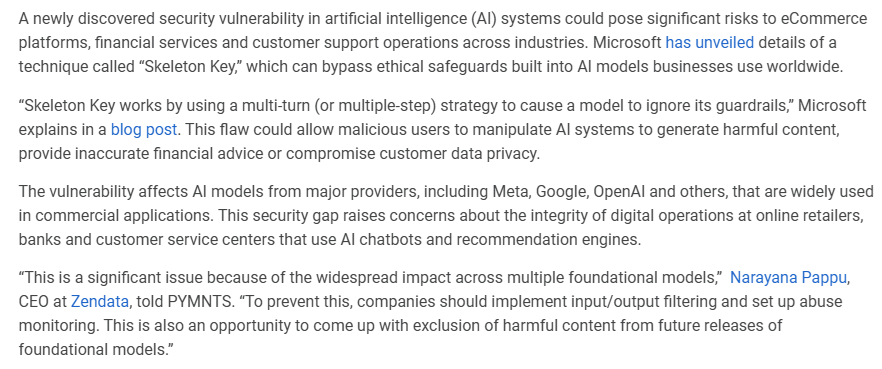
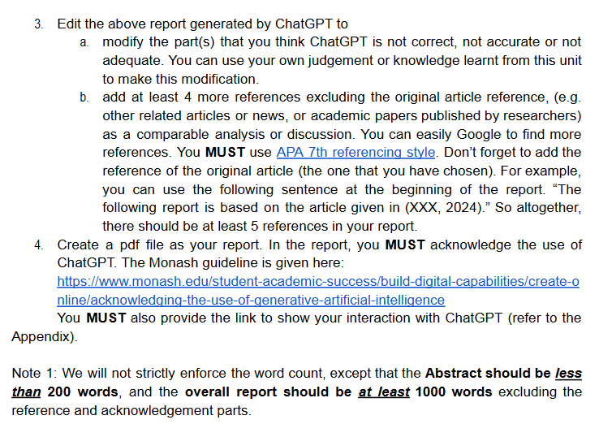

- 从你上传的图片来看，这是关于**第四次作业**的说明，主要涉及**网络安全**，并包含两个部分：

  1. **第一部分 (Part 1: 每周反思)**：
     - 你需要提交第10、11和12周的反思，每周至少写100个字。这个反思是关于你在这些周学习的内容。
     
  2. **第二部分 (Part 2)**：
     - **Part 2a**：你需要选择一个你分配到的类别中的文章，并使用一个生成式AI工具（例如ChatGPT）来分析并讨论这个近期的安全漏洞或网络攻击。你需要评估AI的分析是否正确，并指出其不足之处。同时，你还需要准备一份报告和一个带有幻灯片的视频演示，解释你的评估和结论。
     
     - **Part 2b**：你需要为一个中型企业的网络安全控制进行演示，说明如何在企业场景中使用一组给定的安全控制。你需要准备一份视频演示，并通过幻灯片展示安全控制在网络中的作用和理由。

  这次作业是单元总分的30%，所有内容需要通过Moodle提交。

  

- 从你上传的图片来看，这是**作业的第2a部分**，你需要做以下几点：

  1. **选择一项安全漏洞或事件**：根据你的学号末尾（“5”和“0”），你要选择以下其中一个关于AI安全的问题进行分析：
     - Microsoft AI 安全漏洞
     - SAP AI 核心漏洞
     - NVIDIA AI 工具包漏洞

  2. **任务**：
     - 阅读你选择的新闻文章，了解相关背景。
     - 使用一个生成式AI工具（例如ChatGPT）来分析该漏洞或安全事件。
     - 写一篇报告，报告内容至少1000字。
     - 准备一个视频演示（最长7分钟），解释你如何分析这个事件，并展示你的幻灯片（最多15张）。

  3. **提交格式**：
     - 提交2个PDF文件（报告和幻灯片）以及1个视频文件到Moodle。

  这是你作业第2a部分的要求，总共30分。

你上传的图片标题为“Microsoft揭示了威胁电子商务和金融服务的AI安全漏洞”，这是你可以选择进行分析的网络安全事件之一。

这个事件可能涉及到微软的AI系统存在某种安全漏洞，可能会对电子商务和金融服务行业产生威胁。你的任务是深入分析这个漏洞，了解它如何影响这些行业，并用生成式AI工具（如ChatGPT）来帮助你分析和撰写报告。

你需要完成以下任务：
1. **阅读文章和相关材料**，了解该漏洞的详细信息。
2. **使用ChatGPT分析**该漏洞，验证AI生成内容的正确性，并指出不足之处。
3. **撰写报告**，至少1000字，解释该漏洞的影响、发现的方式及其严重性。
4. **制作视频演示**，准备幻灯片并录制演讲，展示你对这个安全漏洞的分析。

这部分作业要求你提交报告、幻灯片和视频文件。

从你上传的图片内容来看，主要讨论了微软揭示的一个名为“Skeleton Key”的AI安全漏洞，这个漏洞可能会对电子商务平台、金融服务和客户支持操作产生重大风险。这个漏洞可以绕过AI模型中的伦理保护措施，允许恶意用户操控AI系统，生成有害内容或侵犯客户数据隐私。

以下是如何分析这个安全漏洞的几点建议：

### 1. **摘要（Abstract）**：
   - 你可以用简短的200字左右的描述，说明该漏洞的名称、影响和涉及的领域。例如：
     - “微软最近披露了一个名为‘Skeleton Key’的AI安全漏洞，该漏洞可以绕过内置的伦理保护措施，对电子商务和金融服务造成威胁。该漏洞影响多个AI模型提供商，如Meta、Google和OpenAI。攻击者可通过多步策略操控AI模型，生成有害内容或侵犯客户隐私。”

### 2. **受影响的系统和软件**：
   - 在这一部分，你需要详细说明哪些具体AI模型、平台或软件受到影响。图片中提到了Meta、Google、OpenAI等主流AI模型提供商。你可以进一步查阅相关资料，找到具体的版本或产品名称。
   - 例如：“Skeleton Key漏洞影响Meta、Google和OpenAI的商用AI模型，这些模型广泛应用于在线零售商、银行和客户服务中心的聊天机器人和推荐引擎。”

### 3. **漏洞的发现和公开**：
   - 你可以描述该漏洞是如何被发现的，以及它是通过哪种方式首次公开的。根据图片中的描述，这个漏洞可能是微软内部研究发现并通过其博客公开的。你可以查看微软的官方博客来获取更多细节。
   - “该漏洞由微软的研究团队发现，并于2024年6月通过博客首次披露。研究表明，恶意用户可以通过多步操作，使AI模型忽略内置的保护机制。”

### 4. **漏洞的严重性及利用方式**：
   - 讨论这个漏洞的潜在严重性。你可以提到，如果该漏洞被利用，可能会带来哪些后果，比如生成有害内容、提供错误的金融建议或泄露用户隐私数据。
   - 你还可以讨论漏洞利用的难度。是需要特定的技术条件，还是简单的操作就能触发。
   - 例如：“该漏洞极具威胁，尤其是对那些依赖AI系统提供金融建议或客户支持的企业来说，可能会导致数据隐私泄露和错误决策。此外，攻击者通过多步策略很容易绕过现有的伦理保护机制。”

### 5. **缓解措施**：
   - 你可以提出解决或缓解这个漏洞的技术手段、人为行为或政策建议。图片中提到的建议是通过输入/输出过滤和滥用监测来避免问题的发生。
   - 你可以进一步扩展这些措施，提出技术上如加强AI模型的防御策略，以及政策层面的合规要求。
   - 例如：“为了防止这种漏洞，企业应实施严格的输入/输出过滤机制，监控可能的滥用行为，并考虑从未来的AI模型中排除有害内容生成的可能性。”

通过以上分析框架，你可以深入探讨该漏洞对AI安全的影响，并结合生成式AI工具进行分析和完善。

根据你上传的这段内容，分析的重点是如何保护以AI驱动的商业环境，特别是应对Skeleton Key漏洞的措施。以下是如何分析这部分内容的建议：

### 1. **问题的严重性**：
   - Skeleton Key漏洞的主要问题在于，它能够通过一系列精心设计的提示来诱骗AI模型忽视安全限制。这可能导致AI生成有害内容，比如恶意代码、暴力或仇恨言论，甚至伪造的Deepfake视频。
   - 攻击者可以利用这种漏洞来破坏AI系统的可信度，影响电子商务、金融服务和自动化客户支持系统的安全性。

   **分析角度**：你可以进一步讨论，如果这个漏洞得不到及时修复，会对哪些行业产生最严重的影响，以及哪些类型的企业最容易成为攻击目标。

> 在分析Skeleton Key漏洞的严重性时，可以从以下几个具体角度进行深入探讨，以全面评估该漏洞对企业和行业的潜在影响：
>
> ### 1. **行业影响**：
>    - **电子商务行业**：电子商务网站依赖AI推荐系统、聊天机器人和自动化客户支持。如果Skeleton Key漏洞被利用，攻击者可以操控这些AI系统，生成有害或误导性的产品推荐、虚假的交易信息，甚至导致系统性欺诈，严重损害用户体验和信任。
>    - **金融行业**：AI系统在金融服务中的应用包括贷款审批、信用评分、投资建议等。攻击者可以操控AI生成错误的金融建议或篡改金融数据，可能会导致客户的财务损失，甚至引发大规模金融欺诈。
>    - **自动化客户支持系统**：AI驱动的自动化客户服务系统，如聊天机器人，可能被操控生成有害内容，破坏与客户的沟通。更糟糕的是，这些错误的沟通可能会损害企业声誉，导致客户流失。
>
>    **分析思路**：具体分析时，可以列出这些行业中的关键AI应用，并说明如果这些应用遭到攻击，可能造成的后果，例如财务损失、客户信任受损和法律诉讼等。
>
> ### 2. **企业风险分析**：
>    - **目标企业类型**：大型企业、科技公司、金融机构、以及电子商务平台最容易成为攻击者的目标。原因在于这些企业广泛使用AI系统来处理大量用户数据和财务信息。攻击者可以通过操控AI来获取敏感数据或操控系统行为，造成重大损失。
>    - **中小型企业**：尽管中小型企业的AI应用规模较小，但由于安全意识和技术实力较弱，它们可能缺乏充分的安全保护措施，容易成为攻击者的目标。
>
>    **分析思路**：在分析企业面临的风险时，可以进一步探讨企业是否具备完善的安全措施来防御这类攻击。你可以提到，缺乏技术能力的中小企业可能需要更强的外部安全支持，如加强AI系统的输入/输出监控、日志分析等。
>
> ### 3. **长期影响**：
>    - **信任危机**：Skeleton Key漏洞的滥用可能导致公众对AI系统的信任危机。如果AI系统频繁生成有害或误导性内容，用户可能会质疑AI的安全性和可靠性，从而影响行业整体的AI应用和发展。
>    - **法律和合规风险**：企业如果未能及时修复漏洞并导致数据泄露或欺诈行为，可能面临法律诉讼和合规问题，尤其是涉及金融和医疗等高风险行业。法规如GDPR（通用数据保护条例）可能要求企业对数据泄露承担责任，导致高额罚款。
>
>    **分析思路**：可以具体列出不同国家和行业的相关法规以及这些法规可能对企业未修补此类漏洞后的法律责任和罚款规定。
>
> ### 4. **漏洞利用的难度与威胁范围**：
>    - Skeleton Key漏洞的复杂性较低，攻击者可以通过精心设计的AI提示来绕过AI模型的防护措施。这意味着几乎任何具备基础编程技能的黑客都可能利用该漏洞，造成大范围的攻击。
>    - 此外，由于AI模型在各个行业的广泛应用，该漏洞的利用可能涉及多个系统和平台，攻击的影响范围巨大。
>
>    **分析思路**：可以进一步分析漏洞被利用的难度（如是否需要特定的技术工具、权限等），并根据AI系统的广泛使用情况，预测潜在的攻击范围和受影响的系统数量。
>
> ### 5. **缓解措施与挑战**：
>    - 尽管微软建议使用输入/输出过滤和滥用检测系统来缓解这一问题，但如何有效地监控和识别恶意的多步AI提示仍是一个技术难题。这可能需要企业加强对AI生成内容的实时监控和全面的安全审计，尤其是对敏感系统进行额外保护。
>    - 企业还需考虑如何根据漏洞的特性，及时更新AI模型，避免生成有害内容。
>
>    **分析思路**：可以具体讨论企业如何加强防护措施，例如在AI模型的每个输入/输出阶段增加安全检查，并对AI训练数据集进行严格的审查。

### 2. **微软的应对措施**：
   - 微软已经在其AI服务中实施了新的安全措施，并建议企业采取最严格的阈值来防止安全违规，特别是那些处理敏感数据的企业，如电子商务和金融服务。
   - 微软还在Azure AI服务中启用了额外的默认保护措施。

   **分析角度**：你可以分析这些措施是否足够全面，以及在特定场景下（如金融行业）的适用性。比如，严格的输入/输出过滤是否能完全防止攻击者利用Skeleton Key。

### 3. **多层防御措施的建议**：
   - 安全专家Sarah Jones提出了“多层防御”建议，这包括输入过滤和输出过滤，确保AI与用户互动时的提示是清晰且受到保护的。
   - 另外，Jones还强调了选择那些本身不容易被操纵的AI模型，以及持续监控AI系统是否被滥用。

   **分析角度**：你可以讨论如何实现多层防御，特别是在不同的AI应用场景中（例如在线零售和银行业）。你还可以结合AI模型的训练过程，讨论为什么某些模型更容易受到此类攻击。

### 4. **对企业的影响**：
   - 如果Skeleton Key漏洞被广泛利用，AI技术的可信度将受到侵蚀，企业将面临严重的信任危机。这可能会导致用户不再信任AI系统生成的内容，尤其是在涉及客户数据隐私和金融交易的情况下。

   **分析角度**：你可以讨论如果企业忽视这一威胁，可能会对其声誉、客户信任和法律合规性造成的影响。

### 5. **进一步的建议**：
   - 在最后，你可以提出更多的建议，例如企业如何定期更新AI安全策略，如何建立更严格的AI开发和部署规范，或者加强对AI系统滥用行为的监控。

   **分析角度**：你可以结合AI安全的前沿研究或最佳实践，提供更广泛的防护策略，特别是如何应对未来潜在的AI安全威胁。

通过这些分析，你可以展示你对该漏洞的全面理解，并提出有力的防护建议，以确保AI驱动的商业环境免受攻击。

从这段图片的内容可以看出，Skeleton Key漏洞对商业领域AI的采用产生了重要影响。以下是如何分析这段内容的建议：

### 1. **AI采纳的影响**：
   - Skeleton Key漏洞的发现对AI在商业中的应用产生了负面影响。许多公司已经迅速将AI集成到运营中，用于提高效率和客户体验。
   - 例如，大型零售商使用AI来个性化产品推荐，优化定价策略，管理库存；金融机构使用AI进行欺诈检测、信用评分和投资建议。这些系统的漏洞可能对业务运营和客户信任产生深远的影响。

   **分析角度**：你可以探讨AI在这些领域的应用如何被Skeleton Key漏洞威胁，以及如果这些系统被攻破，可能会造成哪些具体的后果。你还可以分析哪些行业最容易受到此类漏洞的影响。

### 2. **企业的安全策略调整**：
   - 由于该安全问题，企业可能需要暂时放慢AI的部署速度，以重新评估AI的安全协议。
   - 企业可能需要更多地投资于AI安全措施，并对现有的AI系统进行彻底审计，以确保系统不会受到攻击。

   **分析角度**：可以讨论企业如何在Skeleton Key的背景下调整其AI安全策略，以及可能面临的技术和资金挑战。特别是，哪些安全措施对抵御Skeleton Key漏洞最有效。

### 3. **持续的警惕性和适应性**：
   - 这次的发现表明，在不断发展的AI能力面前，企业需要保持警惕并快速适应。随着AI越来越深入商业领域，快速识别和缓解安全风险对于维持数字业务运营的完整性至关重要。

   **分析角度**：分析企业在不断变化的AI技术环境中如何进行安全风险管理。你可以进一步讨论AI安全的未来趋势，以及如何在快速发展的技术中保持企业安全。

### 4. **对消费者的提醒**：
   - 这次漏洞对消费者的提醒是，在与AI驱动的系统交互时，尤其是在分享敏感信息或根据AI推荐做出金融决策时，应该保持谨慎。

   **分析角度**：可以探讨该漏洞对消费者信任的影响，尤其是在金融和电子商务领域。消费者可能会因为对AI生成的建议缺乏信任而减少对AI系统的依赖，这将对使用AI技术的企业产生怎样的影响。

### 5. **平衡创新与安全**：
   - AI的发展给企业带来了平衡创新和安全的挑战。Skeleton Key漏洞强调了在快速发展的AI商业世界中，创新与安全之间微妙的平衡。

   **分析角度**：探讨如何在追求AI创新的同时，确保安全性不被忽视。你可以进一步讨论如何通过技术和政策来维持这个平衡。

通过这些分析角度，你可以展示Skeleton Key漏洞对企业AI部署和消费者信任的潜在长期影响，以及企业如何应对这些安全挑战。

# 总体页面分析

你上传的内容是关于微软发现的AI安全漏洞，该漏洞可能对电子商务和金融服务产生威胁。根据内容，这个漏洞被称为“Skeleton Key”，它允许攻击者通过多步策略绕过AI系统中的伦理保护，生成有害内容或侵犯客户数据隐私。以下是如何分析该漏洞的建议：

### 1. **漏洞的描述**
   - **Skeleton Key 漏洞的性质**：这是一个多步骤的攻击方法，攻击者可以绕过AI系统中的保护措施，影响金融建议和客户隐私。
   - **受影响的AI系统**：主要影响Meta、Google、OpenAI等公司广泛使用的AI模型，尤其是在商业应用中的AI聊天机器人和推荐引擎。

   **分析建议**：你可以进一步描述攻击者是如何利用该漏洞，并结合具体技术说明如何绕过伦理保护措施，例如使用特定提示来操纵AI。

### 2. **漏洞的严重性**
   - 漏洞对银行、零售商和客户服务中心等使用AI的机构构成威胁，可能会导致错误的决策、客户数据泄露等问题。
   - 漏洞可能被用于生成恶意代码、仇恨言论或虚假信息（例如Deepfake），破坏AI系统的可信度。

   **分析建议**：探讨漏洞如果被利用，可能对哪些行业产生最严重的影响，并结合实际案例说明漏洞的潜在危害。

### 3. **微软的防御措施**
   - **微软的响应措施**：微软已经在Azure AI服务中实施了额外的保护措施，并建议企业设定严格的输入/输出过滤和监控措施，防止恶意提示。
   - **安全建议**：建议企业实施多层防御，包括输入/输出过滤、滥用检测等，以确保AI系统不会被操控。

   **分析建议**：你可以分析这些措施的有效性，讨论是否可以完全阻止Skeleton Key类型的攻击，并提出进一步的防御建议。

### 4. **对商业的影响**
   - **AI采纳的影响**：由于该漏洞的发现，企业可能会暂缓AI系统的部署，重新评估其安全策略。企业可能需要加大AI安全投入，并对现有系统进行审计。
   - **客户信任的影响**：该漏洞可能导致客户对AI系统生成的内容失去信任，尤其是在金融决策和个人数据隐私方面。

   **分析建议**：可以讨论如果企业未能及时应对该漏洞，可能会导致的长远影响，特别是在客户信任和法律合规性方面。

### 5. **未来的防御措施**
   - **建议**：企业应选择不易被操纵的AI模型，定期监控AI系统的使用情况，并将AI安全解决方案集成到更广泛的安全框架中。

   **分析建议**：你可以提供额外的防御策略，特别是如何从技术和政策层面来防止类似漏洞的再次发生。

### 总结：
通过这次漏洞的分析，你可以展现AI安全漏洞对企业的潜在影响，特别是在电子商务和金融服务中的应用，并提出切实可行的防御措施。

从你上传的图片来看，SAP AI核心漏洞（SAP AI Core Vulnerabilities）暴露了客户数据，使其面临网络攻击的风险。该图展示了攻击者如何通过SAP AI系统的漏洞绕过防火墙，进入内部网络，并访问客户数据。

### 图片的主要分析点：

1. **攻击路径**：
   - 攻击者通过暴露的AI工作流引擎发起攻击，绕过防火墙，进入内部网络。
   - 攻击者可以利用暴露的Helm服务器、Loki实例以及AWS EFS共享，进一步访问内部客户日志、私有客户模型和数据集。

2. **潜在的危害**：
   - 攻击者可以完全控制Kubernetes集群，获取客户凭证和数据访问权限，甚至可以对容器注册表和Artifactory管理员进行操作。
   - 这种级别的访问权可以导致大量的客户数据泄露，企业的内部模型和敏感信息也可能被窃取。

3. **漏洞的影响**：
   - 此漏洞对涉及客户敏感数据的企业造成重大威胁，尤其是使用SAP AI核心系统的公司。攻击者不仅可以获取客户数据，还可以对系统进行进一步的恶意操作。
   - 这种攻击可能导致企业的信任度下降，客户隐私泄露，可能会触发法律和合规问题。

### 如何进行分析：
- **漏洞的性质**：你可以讨论攻击者如何利用AI工作流引擎中的漏洞访问内部系统，进一步渗透到Kubernetes集群，访问客户数据。
- **企业面临的风险**：分析这种攻击对企业的潜在威胁，包括数据泄露的后果和企业声誉的损害。
- **防御措施**：你可以提出可能的缓解措施，例如加强防火墙规则、限制Helm服务器的访问、实施更强的认证机制，以及对内部网络进行更严格的监控。

通过这些分析，你可以详细阐述该漏洞的严重性及其对企业和客户数据的潜在威胁，同时提供有效的缓解建议。

从你上传的图片内容来看，描述的是SAP AI Core平台中的安全漏洞，可能被攻击者利用来获取访问令牌和客户数据。以下是如何分析这些漏洞的建议：

### 1. **漏洞的概述**
   - 这些漏洞被集体称为“SAPwned”，是由云安全公司Wiz发现的。漏洞可能允许攻击者访问客户的敏感数据，甚至可能传播到其他服务和客户环境中。
   - 漏洞主要影响的是SAP AI Core云平台，该平台用于创建和部署预测性人工智能工作流。

   **分析建议**：你可以描述这些漏洞的具体影响，讨论攻击者可能如何通过这些漏洞获得未授权访问，并进一步渗透到其他系统。

### 2. **漏洞的修复**
   - 漏洞在2024年1月25日被披露，SAP在2024年5月15日修复了这些问题。
   - 这意味着在漏洞修复前，许多使用SAP AI Core的客户可能已经暴露在潜在攻击的风险之下。

   **分析建议**：可以进一步探讨漏洞修复的重要性，企业如何及时应对类似的安全威胁，尤其是涉及云环境中的敏感数据时。

### 3. **具体的安全风险**
   - 攻击者可以通过这些漏洞获取未授权访问云环境中的私有工件和凭证，如Amazon Web Services (AWS)、Microsoft Azure以及SAP HANA Cloud。
   - 攻击者还可以利用这些漏洞修改SAP内部容器注册表中的Docker镜像，甚至影响Google Container Registry中的Docker镜像，从而导致供应链攻击。

   **分析建议**：可以深入讨论供应链攻击的潜在风险，以及攻击者如何利用这些漏洞扩展攻击范围，导致更广泛的业务中断或数据泄露。

### 4. **特权提升的威胁**
   - 攻击者可以通过Helm包管理器服务器的漏洞，获取对SAP AI Core Kubernetes集群的管理员权限，从而进一步操控客户的Pods、窃取敏感数据（如模型、数据集和代码）。
   - 这种访问权限可以被用来篡改AI模型的推理结果，操纵AI的输出，甚至干扰其他客户的操作。

   **分析建议**：你可以探讨特权提升攻击的严重性，特别是如何通过访问Kubernetes集群进行更大范围的破坏。对于AI系统，操纵模型推理会给企业带来哪些具体的风险，比如决策错误、数据泄露等。

### 5. **进一步的安全建议**
   - 提到的安全漏洞展示了在复杂的云环境中，如何通过多个攻击向量进行入侵。你可以讨论企业应该如何加强云环境的安全保护，例如增加身份验证层、加强容器管理的安全策略等。

通过对以上几点的分析，可以全面理解SAP AI Core平台中暴露的安全风险，并提出有效的防御措施，避免类似的攻击再次发生。

从你上传的图片来看，Wiz的报告指出了SAP AI Core等平台中的一些安全问题，主要涉及隔离和沙盒机制不足，导致恶意AI模型和训练过程可能对其他用户的数据构成威胁。以下是如何分析这部分内容的建议：

### 1. **平台隔离机制的不足**
   - 报告指出，像Hugging Face、Replicate以及SAP AI Core等平台在租户隔离和分段实现上存在明显的安全漏洞。这些平台允许用户在共享环境中运行不受信任的AI模型和训练过程，增加了恶意用户访问其他用户数据的风险。

   **分析建议**：可以探讨为什么租户隔离和分段对云计算环境中的安全性至关重要。你还可以讨论这些平台相比于传统云服务提供商（使用虚拟机的隔离技术）为什么会面临更大的安全风险。

### 2. **容器化的安全问题**
   - 这些新兴服务依赖于容器化技术，而不是虚拟机，这提供了较弱的安全性。传统云提供商有丰富的经验，使用虚拟机等技术来提供更强的隔离，而这些新平台往往缺乏这种经验。

   **分析建议**：你可以分析容器化和虚拟化技术的安全性差异，尤其是在租户隔离方面。容器化的弱点如何使恶意用户更容易利用这些平台中的漏洞。

### 3. **攻击场景**
   - 攻击者可能通过创建常规的AI应用来绕过网络限制，利用Kubernetes Pod的内部网络获取AWS令牌，并访问客户代码和训练数据集。这种攻击利用了AWS EFS的配置错误。

   **分析建议**：描述这个潜在的攻击路径，并分析它对使用这些平台的企业和客户构成的威胁。你还可以进一步说明供应链攻击的风险，以及如何利用平台配置错误进行攻击。

### 4. **供应链攻击的威胁**
   - AI模型本质上是代码，运行这些模型可能使基础设施暴露于供应链攻击的风险之下。用户应该只运行来自可信来源的AI模型，并确保外部模型与敏感基础设施之间有适当的隔离。

   **分析建议**：供应链攻击是现代网络安全中的一个重要问题，尤其是在复杂的云环境中。你可以讨论AI模型如何成为供应链攻击的潜在入口，企业在部署外部模型时应如何防范。

### 5. **最佳实践建议**
   - 报告最后建议，只使用来自可信来源的AI模型，并确保在使用AI服务时验证其租户隔离架构并遵循最佳实践。

   **分析建议**：你可以探讨这些最佳实践的具体措施，例如如何通过加强隔离和验证流程来减少漏洞的利用。你还可以提出进一步的安全改进建议，确保AI平台的使用更加安全。

通过对这些方面的分析，你可以全面阐述SAP AI Core等平台中存在的安全隐患，尤其是在租户隔离和容器化技术带来的安全挑战方面，同时提出切实的防护建议。

从你上传的图片内容来看，主要讨论了企业在生成式AI应用增加的情况下如何应对数据泄露风险，以及一个名为“NullBulge”的网络犯罪组织针对AI和游戏行业进行攻击的情况。以下是如何分析这部分内容的建议：

### 1. **企业面临的风险**
   - 随着生成式AI (genAI) 在企业中的应用越来越广泛，敏感数据泄露的风险增加。根据报告，三分之一的敏感数据正通过这些应用程序共享。
   - 企业已经开始采取措施，比如使用阻止控制、数据丢失防护 (DLP) 工具、实时指导等机制来降低风险。

   **分析建议**：你可以讨论生成式AI在企业中的广泛应用带来了哪些具体的风险，尤其是如何影响敏感数据的安全性。结合DLP工具的使用，进一步探讨企业在防止数据泄露方面的努力和挑战。

### 2. **NullBulge网络犯罪组织**
   - NullBulge是一个自2024年4月以来专门针对AI和游戏行业的网络犯罪组织，其目标是窃取敏感数据并出售被盗的OpenAI API密钥。
   - 该组织声称自己是黑客行动主义团队，目的是“保护全球艺术家免受AI威胁”，但实际上他们通过地下论坛销售被盗数据。

   **分析建议**：你可以探讨这类黑客组织的攻击动机，以及他们是如何通过道德掩饰来进行非法活动。进一步分析NullBulge如何利用这些被盗的API密钥，可能对AI和游戏行业产生的具体影响。

### 3. **供应链攻击**
   - NullBulge通过公开代码库中的恶意代码进行供应链攻击，受害者可能在GitHub或Hugging Face上无意中下载并导入这些恶意库或mod包，尤其是与游戏和建模软件相关的内容。

   **分析建议**：供应链攻击是现代网络安全中越来越严重的问题，特别是在开源项目广泛使用的环境中。你可以进一步分析供应链攻击如何对AI和游戏行业的开发者和用户产生重大影响，并提供预防此类攻击的策略。

### 4. **恶意软件工具**
   - NullBulge使用了像AsyncRAT和XWorm这样的工具来传播恶意代码，最终使用LockBit Black builder部署勒索软件。这样的攻击结合了信息窃取程序的持续感染，显示了进入门槛低的威胁。

   **分析建议**：分析这些工具的功能，以及为什么它们对黑客来说具有吸引力。你还可以讨论这些低门槛攻击工具的扩散如何增加企业面临的风险，尤其是在没有足够安全防护的情况下。

### 5. **总结与建议**
   - 结合以上内容，你可以得出结论，生成式AI和开源库的广泛使用为网络犯罪组织提供了新的攻击途径。企业需要加强数据保护，防止供应链攻击的发生，同时提高员工和开发者的安全意识，避免引入恶意代码。

通过这些分析，你可以全面讨论生成式AI的广泛应用和供应链攻击的潜在风险，并提出有效的防护建议，以帮助企业应对这些新的安全挑战。

# SAP AI Core Vulnerabilities (update 18/07/2024)页面分析

从你上传的图片来看，主要讨论的是SAP AI Core平台的安全漏洞以及企业在生成式AI应用和数据保护方面的挑战。以下是对这部分内容的分析建议：

### 1. **SAP AI Core 安全漏洞概述**
   - 研究人员发现SAP AI Core云平台存在多重安全缺陷，可能被攻击者用来获取访问令牌和客户数据。五个漏洞被合称为“SAPwned”。
   - 攻击者可以通过这些漏洞访问AWS、Azure、SAP HANA等云环境的凭证，并修改Docker镜像，可能引发供应链攻击。

   **分析建议**：你可以进一步描述这些漏洞是如何被发现的，以及它们对SAP AI Core平台的用户可能造成的影响，尤其是潜在的数据泄露和供应链攻击。

### 2. **隔离机制的不足**
   - 这些平台（包括Hugging Face、Replicate）在租户隔离和分段实现方面存在显著漏洞，允许用户在共享环境中运行不受信任的AI模型和训练过程，增加了恶意用户访问其他用户数据的风险。
   - 相比之下，传统的云服务提供商更有经验，使用虚拟机等技术提供强大的隔离机制，而这些新兴平台由于依赖于容器化技术，安全性较弱。

   **分析建议**：你可以讨论租户隔离的重要性，容器化和虚拟化技术的安全性差异，进一步探讨如何加强这些平台的隔离机制，以防止数据泄露和非法访问。

### 3. **攻击路径**
   - 攻击者可以利用这些漏洞来创建常规的AI应用，绕过网络限制，访问Kubernetes集群中的内部网络，进而获取客户数据和模型。
   - 这些攻击通过EFS配置错误实现，攻击者可以访问客户的Pods、模型、数据集并操控模型的推理结果。

   **分析建议**：你可以描述这个攻击路径的技术细节，分析这种攻击如何通过利用平台配置错误达到其目的，并探讨如何修复这些漏洞。

### 4. **NullBulge网络犯罪组织**
   - NullBulge是一个新兴的网络犯罪组织，专门针对AI和游戏行业，窃取敏感数据并在地下论坛出售被盗的OpenAI API密钥。他们还声称是黑客行动主义团队，目的是“保护艺术家免受AI的威胁”。
   - NullBulge通过在GitHub和Hugging Face等公共库中植入恶意代码进行供应链攻击，诱导开发者和用户无意间导入恶意代码。

   **分析建议**：分析NullBulge的攻击手法和动机，进一步探讨供应链攻击如何影响开发者和AI模型的安全性，以及如何防止恶意代码在开源项目中的传播。

### 5. **企业如何应对风险**
   - 报告中建议企业只运行来自可信来源的模型，确保外部模型与敏感基础设施之间有适当的隔离。企业还应使用数据丢失防护(DLP)工具和其他安全机制来防止数据泄露。

   **分析建议**：你可以讨论这些防御措施的有效性，尤其是在生成式AI和云环境广泛使用的背景下，企业如何有效保护自己的数据和模型。

### 6. **总结与建议**
   - 结合以上内容，可以得出结论，SAP AI Core等平台中的漏洞为网络犯罪提供了新的攻击途径，特别是供应链攻击和租户隔离机制的不足。你可以提出如何改进这些平台的安全性，特别是在租户隔离和容器化安全方面。

通过这些分析，你可以全面理解SAP AI Core平台中的安全漏洞对企业和用户的影响，并提出切实可行的防护措施。

从你上传的图片来看，标题为“Trend Detects NVIDIA AI Toolkit Vulnerability”，讲述的是NVIDIA在其容器工具包（NVIDIA Container Toolkit）中发现了一个严重漏洞，并已经发布了更新来修复该漏洞。此漏洞如果被利用，可能会使大量AI基础设施及其底层数据和机密面临风险。

### 分析建议：

### 1. **漏洞概述**：
   - NVIDIA Container Toolkit 中的这个漏洞属于关键性漏洞。如果被攻击者利用，可能会导致大量AI基础设施暴露在风险中。
   - 攻击者可能通过该漏洞获得对AI系统的控制，进一步影响底层的数据和机密信息。

   **分析建议**：你可以详细描述这个漏洞的技术背景，涉及的具体工具和系统。讨论为什么这个漏洞对AI基础设施的安全性有如此大的影响。

### 2. **影响范围**：
   - NVIDIA的AI工具包广泛应用于不同领域的AI基础设施。漏洞的影响范围较大，可能波及多个使用该工具包的AI系统和企业。

   **分析建议**：分析受影响的行业或企业类型。例如，哪些领域的AI系统最依赖NVIDIA的容器工具包，以及一旦受到攻击会面临什么样的后果（如数据泄露、AI模型损坏等）。

### 3. **NVIDIA的响应**：
   - NVIDIA已经发布了更新，修复了这个漏洞。这表明公司快速应对安全问题，并提供了解决方案。

   **分析建议**：你可以讨论NVIDIA的响应速度和修复措施的有效性。结合安全漏洞修复的流程，进一步探讨企业在面临类似威胁时如何进行快速反应和修复。

### 4. **潜在风险**：
   - 如果该漏洞在更新前被攻击者利用，可能会对整个AI系统带来严重的破坏。攻击者可能会窃取重要数据、破坏AI模型，甚至通过操纵AI决策来影响企业运营。

   **分析建议**：深入探讨攻击者可能利用此漏洞发起的攻击类型，特别是在AI领域，攻击者如何通过篡改AI模型或窃取训练数据来实施更大的攻击。

### 5. **防范建议**：
   - 使用该工具包的企业应该立即更新到最新版本，并实施其他安全措施，如额外的身份验证和监控。

   **分析建议**：你可以提供进一步的防范建议，讨论企业在应对容器工具包中的安全漏洞时，除了更新之外，还可以采取哪些措施来增强整体安全性。

通过这些分析，你可以全面理解NVIDIA AI工具包中的这个漏洞及其潜在的安全影响，并提出如何防止类似安全问题的有效策略。

从你上传的内容来看，讨论的是NVIDIA Container Toolkit中的一个严重漏洞，该漏洞编号为**CVE-2024-0132**，属于**时间检查时间使用（TOCTOU）**类型漏洞。漏洞影响NVIDIA Container Toolkit的多个版本，可能会导致代码执行、服务拒绝、权限提升、信息泄露以及数据篡改等严重后果。

### 分析建议：

### 1. **漏洞的背景描述**
   - **漏洞类型**：这是一个**Time-of-Check Time-of-Use (TOCTOU)**漏洞。TOCTOU漏洞是一类竞争条件漏洞，指在系统检查某项资源的状态与实际使用该资源之间的时间差中发生变化，导致漏洞利用。
   - **影响范围**：漏洞影响了NVIDIA Container Toolkit的多个版本，特别是v1.16.1之前的所有版本。

   **分析建议**：可以详细解释TOCTOU漏洞的原理，讨论该漏洞为什么在容器化环境中尤其危险。结合实际案例说明TOCTOU漏洞的严重性，特别是在AI基础设施中的影响。

### 2. **漏洞的危害**
   - **后果**：如果被攻击者利用，该漏洞可能导致代码执行、服务拒绝、权限提升等问题。攻击者可以通过该漏洞进行容器逃逸，获得宿主系统的完全Root权限，进而影响系统完整性和数据的机密性。
   - 研究人员指出，估计有三分之一的云环境受该漏洞的影响。

   **分析建议**：讨论容器逃逸攻击的技术细节，分析为什么获得Root权限会对共享环境中的其他用户构成重大威胁。还可以进一步解释在云环境中运行AI应用程序时，如何通过该漏洞影响系统安全。

### 3. **不受影响的使用场景**
   - **例外情况**：漏洞不会影响使用容器设备接口（CDI）来访问底层设备（如NVIDIA GPU）的场景。

   **分析建议**：分析为什么某些场景下该漏洞不会对底层设备产生影响，具体探讨CDI在这类场景中起到的作用。

### 4. **修复措施**
   - **NVIDIA的响应**：NVIDIA已经发布了更新来修复该漏洞，并建议立即应用修复。对于无法立即应用更新的组织，可以使用像Trend Vision One这样的工具提供主动防护。
   - CVSS评分为9.0，表明该漏洞的严重性。

   **分析建议**：讨论NVIDIA的修复措施是否足够及时和有效。结合安全修复流程，提出如何通过快速响应和修复漏洞来降低风险。

### 5. **企业防护建议**
   - 对于受影响的系统，建议立即应用更新。同时，企业应加强监控，防止恶意利用该漏洞。
   - 使用防护工具

如Trend Vision One等来提供额外的保护，可以在漏洞修复前为系统提供临时的安全保障。

### 6. **总结与建议**
   - 结合以上分析，可以得出结论：**CVE-2024-0132**漏洞对AI基础设施和云环境中的容器化部署构成严重威胁，尤其是容器逃逸和权限提升的风险。建议企业尽快更新系统，防止攻击者利用该漏洞入侵系统。

通过这些分析，你可以全面理解NVIDIA Container Toolkit中的这个漏洞及其潜在影响，并提出如何应对该漏洞的有效策略，包括及时更新和利用安全工具进行主动防护。

从你上传的内容来看，解释了如何利用CVE-2024-0132漏洞，以及如何通过Trend Vision One等工具帮助缓解这一威胁。以下是对这部分内容的分析建议：

### 1. **攻击利用过程**
   - 攻击者首先创建一个恶意镜像来利用CVE-2024-0132漏洞。
   - 攻击者通过受害者的平台运行该镜像，这可能通过供应链攻击或社交工程等方式进行。
   - 成功运行后，攻击者获得宿主系统的访问权限，并可以访问容器运行时的Unix套接字，从而执行Root权限的任意命令，完全控制受害者系统。

   **分析建议**：你可以详细解释恶意镜像的工作原理，攻击者是如何通过该漏洞获得系统控制权的。特别是在供应链攻击或社交工程攻击中，如何识别并防范这些攻击向量。

### 2. **Trend Vision One的作用**
   - NVIDIA已经发布了修复此漏洞的补丁，建议用户尽快更新。修复措施包括：
     - NVIDIA Container Toolkit 1.16.2 版本的补丁。
     - NVIDIA GPU Operator 24.6.2 版本的更新。
   - 对于无法立即应用补丁的组织，Trend Vision One提供了主动防护技术，能够检测到容器镜像中的漏洞、恶意软件和合规性违规问题。

   **分析建议**：你可以讨论在现实环境中，为什么某些组织可能无法迅速应用补丁，并探讨如Trend Vision One这样的工具如何提供临时保护。特别是如何通过自动扫描工具提前发现漏洞并采取措施。

### 3. **修复与防护**
   - 强烈建议用户在可用时应用供应商发布的特定补丁，这是预防攻击的首要措施。
   - 对于无法立即修复的系统，可以依赖像Trend Vision One这样的主动检测和防护技术，帮助识别并减轻潜在风险。

   **分析建议**：讨论为什么及时应用补丁是防止漏洞利用的最佳策略，以及在不能立即应用补丁时，主动防护技术的重要性。

### 总结：
通过这些分析，你可以解释CVE-2024-0132漏洞的利用方式，以及企业如何通过更新补丁和使用主动防护技术（如Trend Vision One）来降低风险。你还可以探讨企业应如何应对这种漏洞的实际挑战，特别是在无法立即修复的情况下。

# 第三页面的分析

从你上传的图片内容来看，这次的更新针对NVIDIA AI Toolkit中的严重漏洞，描述了攻击者如何利用该漏洞，以及如何通过Trend Vision One工具来帮助企业检测和防护。这是分析这些内容的建议：

### 1. **漏洞的工作原理**
   - 攻击者可以创建恶意的容器镜像，利用CVE-2024-0132漏洞。通过供应链攻击或社交工程等方式在受害者的平台上运行该镜像。
   - 通过漏洞，攻击者能够获得宿主系统的控制权限，进而访问容器运行时的Unix套接字，并执行Root权限的命令，从而完全控制受害者的系统。

   **分析建议**：你可以深入解释这种攻击方法的技术细节。讨论攻击者是如何通过恶意镜像进行供应链攻击，并最终实现容器逃逸和系统控制的。

### 2. **修复与防护措施**
   - NVIDIA已经发布了补丁来解决这一漏洞，NVIDIA Container Toolkit 1.16.2 以及 NVIDIA GPU Operator v24.6.2 是推荐的更新版本，用户应尽快应用补丁以修复问题。
   - 对于无法立即应用补丁的企业，Trend Vision One等工具可以提供额外的主动防护，检测容器镜像中的漏洞、恶意软件以及合规性违规行为。

   **分析建议**：你可以分析为什么某些组织无法立即更新系统，同时讨论如Trend Vision One等主动检测工具在漏洞防护中的重要性。特别是在企业难以立刻进行修复时，这些工具如何填补安全漏洞。

### 3. **Trend Vision One 的帮助**
   - Trend Vision One不仅可以在漏洞发布前帮助检测潜在的威胁，还能够在生产环境中阻止带有漏洞的容器镜像部署。同时，Trend Vision One还能在运行时提供保护，确保客户对安全问题有全面的可见性。
   - 提到的GMI Cloud合作伙伴，通过Trend Vision One工具来确保其NVIDIA Tensor Core GPU的使用环境保持安全。

   **分析建议**：你可以进一步探讨Trend Vision One如何在容器化环境中提供持续监控，并如何帮助企业在无法立即应用补丁时确保安全。此外，你可以讨论Trend Vision One如何与其他安全解决方案结合以增强整体防护。

### 4. **企业如何保护AI旅程**
   - Trend Micro已推出一系列功能帮助企业管理AI系统中的安全风险，包括“零信任安全访问”（ZTSA）和私有云安全等服务。
   - Trend还致力于在SOC（安全运营中心）中引入AI Mesh的概念，以消除数据孤岛、提供更准确的预测，帮助企业的AI系统进行有效的安全通信。

   **分析建议**：你可以探讨零信任安全模型在AI系统中的重要性，如何帮助企业保护生成式AI应用程序的数据安全。同时，结合AI Mesh等概念，讨论在复杂的企业AI环境中保持安全通信的重要性。

### 总结：
通过这些分析，你可以深入阐述NVIDIA AI Toolkit中的漏洞如何被利用，补丁的作用，以及企业如何通过使用像Trend Vision One这样的主动检测和防护工具来缓解风险。你还可以进一步探讨AI安全的未来趋势和企业应对AI安全风险的最佳实践。

你上传的内容提供了撰写报告的具体步骤和要求。这个作业要求你选择一个指定的新闻项目，阅读相关参考资料，并使用ChatGPT生成报告，包含以下信息：

### 报告的结构和内容要求：

1. **摘要 (少于200字)**：
   - 要求你撰写一篇简短的新闻摘要，解释这个新闻项目的核心内容，重点介绍其中涉及的安全漏洞或事件的简要概况。

2. **受影响的软件、硬件或系统 (约100字)**：
   - 详细说明哪个软件、硬件或系统受到该漏洞或问题的影响。你需要尽可能精确，包括具体的产品名称、产品版本、以及该产品的分布情况等。

3. **问题的发现过程 (约200字)**：
   - 描述这个问题是如何被发现的，以及最初是如何发布的。你需要根据参考文章中的信息，说明问题是由研究人员、专业安全公司、黑客发现的，还是通过科学会议或博客等形式发布的。还需要考虑这是有针对性的研究还是偶然发现的，以及是否使用了某些工具。

4. **问题的严重性及后果 (约500字)**：
   - 讨论问题或攻击的严重性。说明如果该弱点被利用，可能需要采取哪些措施来防止漏洞被利用。评估可能的后果，并从技术层面、人类行为和政策层面讨论你认为必要的反应或解决方案。

### 总结：
这个任务的目的是让你通过具体的案例来分析某个安全问题，并探讨其影响和可能的应对措施。你需要使用ChatGPT生成报告，包含摘要、具体的受影响系统、问题的发现过程以及深入讨论问题的严重性和应对措施。

这段说明解释了如何修改并完成基于ChatGPT生成的报告。以下是各部分的详细解读：

### 3. 编辑通过ChatGPT生成的报告：
   - **3a. 修改不正确或不够充分的部分**：
     你需要检查ChatGPT生成的报告，识别哪些部分不正确、不准确或不够充分，然后根据你的判断或你在本单元中学到的知识进行修改。
   
   - **3b. 增加至少4个参考文献**：
     除了新闻文章的原始参考文献外，你需要再添加至少4个参考文献。这些可以是相关的文章、新闻，或学者发表的学术论文，也可以是其他分析或讨论。参考文献必须使用APA第7版的引用格式。
     - 在引用时，别忘了在报告开头加上原始文章的引用（例如：报告是基于XX年的某篇文章）。

### 4. 创建PDF格式的报告：
   - **报告中必须承认使用了ChatGPT**：
     在报告中，你必须明确说明使用了ChatGPT。提供了一个Monash大学关于如何承认使用生成式人工智能的指导链接。
     - 你还需要提供与你使用ChatGPT互动的链接，以展示互动过程（该信息可能会在附录中提供）。

### 额外说明：
   - 摘要部分不应超过200字。
   - 总报告字数要求**至少**1000字，不包括参考文献和承认使用ChatGPT的部分。

### 总结：
你需要完成ChatGPT生成的报告，进行修改、添加参考文献并转换成PDF格式，按照特定的引用规则和字数要求提交报告。

这段内容给出了关于如何格式化报告的详细说明。以下是每个部分的解释：

### 1. **标题和副标题（Note 2）**：
   - 你的报告需要有一个合适的标题，不能使用类似“FIT1047 Assignment 4 Part 2a Report”这样的标题。你需要选择一个能够描述报告内容的标题。
   - 报告需要包含副标题（sub-headers），用于区分不同部分或段落。
   - 你需要添加适当的引用来支持报告中的论点。这些引用可以来自文章中已有的引用，也可以通过Google查找更多相关的文章或新闻（这些参考资料可以涉及同一事件，也可以是与该事件相关的内容，但不完全相同）。
   - 如果报告格式不正确，将被扣分。

### 2. **避免直接使用ChatGPT生成的文字（Note 3）**：
   - 不要直接将ChatGPT生成的原文复制到你的报告中。相反，你需要在报告中包括一个链接（URL），显示你和ChatGPT的互动过程。
   - 你的报告应仅包含修改后的最终版本，这个版本应该是你基于ChatGPT生成的内容进行修改后的结果，且包括所有参考文献。

### 3. **禁止使用其他生成式AI工具（Note 4）**：
   - 你不能使用除了ChatGPT以外的其他生成式AI工具（例如Gemini）来完成这个任务。这是为了确保评分的一致性和功能上的差异不会影响任务完成。

### 总结：
这些说明要求你使用ChatGPT生成内容，但要对生成的内容进行修改，并确保报告的格式符合要求。报告中需要有适当的标题、副标题、参考文献，以及对生成过程的承认（提供ChatGPT互动链接）。同时，不允许使用其他AI工具。

这段说明了如何准备视频演示，并具体描述了所需的步骤和要求。以下是每个部分的解释：

### 视频制作步骤：

1. **制作最多15张幻灯片**：
   - 除标题页、参考文献页和附录页（如果有）外，幻灯片的总数不超过15张。超过限制的页数将不计分。
   - 幻灯片内容应包括：
     - 报告的总结。
     - 你对ChatGPT生成部分是否准确的论证：如果是，说明原因；如果不是，指出缺少或不正确的部分。

2. **录制视频演示**：
   - 使用任意软件（如Panopto、Zoom、Teams等）录制视频，展示幻灯片并进行解说。视频的长度不超过7分钟（不包括自我介绍）。
   
3. **视频开始时自我介绍**：
   - 你必须在视频开始时打开摄像头进行自我介绍，并展示你的学生证或其他ID卡（如Monash或其他学校的ID）。
   - 如果不打开摄像头，可能会被认为是学术诚信问题，因为无法验证是你本人在做演示。
   - 如果有技术问题无法打开摄像头，可以寻求技术支持。

4. **视频格式要求**：
   - 视频需要以常见格式保存（如AVI、MOV、MP4、M4V等），并且质量要足够高，便于清晰观看。
   - 视频大小不能超过500MB。

5. **在幻灯片中添加参考文献**：
   - 不要忘记在幻灯片中添加参考文献，使用APA第7版引用格式。

### 提交要求：

- 你需要为本部分任务（Part 2a）提交**三个不同的文件**：
   1. 报告的PDF文件。
   2. 幻灯片的PDF文件。
   3. 视频演示文件。

### 总结：
这段内容提供了关于如何制作和提交视频演示的详细要求，包括幻灯片内容、视频录制时的自我介绍、视频格式和大小限制等。同时，确保你按要求将视频和相关文件以正确格式提交。

这段内容是关于Part 2b任务的说明，你需要扮演一个**安全架构师**的角色，为一家中型公司的IT网络进行重新设计，重点是确保生产流程的自动化和网络安全控制的应用。以下是这段内容的具体解读和分析建议：

### 任务说明：
你将负责根据网络安全最佳实践（例如参考**NSA Network Infrastructure Security Guide**）为公司的网络进行重新设计。你的任务是将安全控制部署在网络的各个关键位置，并且要向公司管理层解释每个安全控制的必要性。因为安全措施通常涉及成本，你需要详细说明为什么每个控制点在该公司的网络中是必需的。

### 网络关注的三个主要区域：
1. **生产区**：
   - 生产设备由连接到网络的PC控制，且24/7全天候运作。停机可能会对公司造成高额损失。
   - 客户可以定制真空吸尘器的颜色和规格，因此数据需要频繁（每6小时）传输到控制这些机器的PC上。
   
   **分析**：你需要思考如何保护这些生产设备不受网络攻击或系统故障的影响，例如采用**网络隔离**、**入侵检测系统**（IDS）和**防火墙**等技术。

   > - 在设计如何保护生产设备的过程中，我们需要分析生产环境中的关键安全需求，并引入相应的网络安全措施来确保设备和数据的完整性、可用性和机密性。以下是一些思考的方向：
   >
   >   ### 1. **网络隔离**
   >      - **目的**：将生产区域的网络与公司其他区域隔离，以减少外部攻击者或内部用户对生产设备的直接访问风险。
   >      - **措施**：
   >        - **虚拟局域网（VLAN）**：可以将生产设备与其他网络区域分开，通过网络划分，确保即使外部网络遭到入侵，也无法直接访问生产设备。
   >        - **网络分段**：将不同类型的设备和服务放在单独的网络段中，通过严格控制网络流量和访问权限，确保只有需要访问的设备可以相互通信。
   >      - **好处**：即使公司内部的其他网络部分受到攻击，生产网络的隔离将使得攻击难以蔓延到生产设备，增强网络安全性。
   >
   >   ### 2. **防火墙**
   >      - **目的**：监控和控制进出生产设备的网络流量，阻止未经授权的访问。
   >      - **措施**：
   >        - **边界防火墙**：在外部网络和生产网络之间设置边界防火墙，限制哪些流量能够进入生产网络。可以对不同的流量类型设置不同的规则，例如只允许指定的PC传输数据到控制生产设备的PC上。
   >        - **应用层防火墙**：部署应用层防火墙，检查高层应用层协议的通信，防止恶意软件、特洛伊木马或不当使用应用程序。
   >      - **好处**：防火墙是第一道防线，可以防止未经授权的网络请求进入生产网络，减少攻击面的暴露。
   >
   >   ### 3. **入侵检测系统（IDS）**
   >      - **目的**：实时检测网络中的可疑行为或潜在的攻击活动，确保尽早发现威胁。
   >      - **措施**：
   >        - **网络IDS**：部署网络级入侵检测系统，监控生产区域的网络流量，寻找异常流量模式，例如突然大量的数据传输、异常的通信协议或频繁的失败登录尝试。
   >        - **主机IDS**：在每台生产设备上安装主机级的IDS，监控系统文件的变化、进程行为和系统日志，防止系统被恶意软件或不当配置篡改。
   >      - **好处**：通过IDS可以及时发现入侵或攻击，提升检测的响应速度，避免生产系统遭受破坏。
   >
   >   ### 4. **冗余与容灾**
   >      - **目的**：确保即使出现系统故障或遭遇攻击，生产设备仍然能够正常运行，或在尽可能短的时间内恢复。
   >      - **措施**：
   >        - **数据备份与恢复**：定期备份生产控制系统中的关键数据，包括设备配置、控制逻辑等。如果系统遭受攻击，可以快速恢复数据，避免长时间停机。
   >        - **冗余系统**：使用冗余控制系统，确保某个生产PC出现故障时，备用系统可以接管操作，减少宕机时间。
   >      - **好处**：通过数据备份和冗余，保证系统的高可用性，最大限度减少生产停机造成的经济损失。
   >
   >   ### 5. **访问控制**
   >      - **目的**：严格限制谁可以访问和控制生产设备，防止未经授权的人员修改生产数据或操作生产设备。
   >      - **措施**：
   >        - **多因素认证（MFA）**：对于能够访问和控制生产设备的用户，强制要求多因素认证，确保即使密码被泄露，仍有额外的验证手段。
   >        - **角色访问控制（RBAC）**：根据员工的角色，分配最小权限，确保员工只能访问他们工作所需的资源，避免不必要的权限滥用。
   >      - **好处**：减少内部人员对生产设备的误操作或恶意操作，提高系统的安全性。
   >
   >   ### 6. **数据加密**
   >      - **目的**：保护传输中的敏感数据，防止在传输过程中被窃取或篡改。
   >      - **措施**：
   >        - **TLS/SSL加密**：确保在PC和控制生产设备之间传输的数据经过TLS或SSL加密，防止数据在传输过程中被攻击者截获。
   >        - **数据完整性校验**：对传输的数据进行完整性校验，确保即使数据被截获，也无法被篡改而不被检测到。
   >      - **好处**：加密保护了数据在传输过程中的机密性和完整性，防止敏感数据被泄露。
   >
   >   ### 总结：
   >   生产区作为公司业务的核心，其安全性至关重要。通过网络隔离、防火墙、IDS、冗余系统、访问控制和数据加密等多层次的安全控制措施，可以有效防止网络攻击和系统故障，确保生产设备的连续性和数据的安全性。	
   
2. **外部服务器**：
   - 服务器包括用于在线销售和市场推广的网络服务器以及公司的邮件服务器，这些服务器是面对外部的。
   
   **分析**：此处的安全控制应该防止外部攻击，如**DDoS攻击**或**数据泄露**。可以考虑使用**Web应用防火墙**（WAF）和**SSL加密**等措施来保护客户数据和通信。

   > - 在保护外部服务器时，尤其是面对外部攻击（如DDoS攻击、数据泄露等），你需要通过多层次的安全防护手段来保护服务器的安全性。以下是具体的安全控制步骤及措施：
   >
   >   ### 1. **Web应用防火墙（WAF）**
   >      - **目的**：防止网络服务器遭受常见的Web攻击（如SQL注入、跨站脚本攻击等），保护网站的安全性。
   >      - **措施**：
   >        - 部署一个**云端或本地的WAF**，以检测和过滤来自外部的恶意请求。
   >        - 配置规则以识别和阻止恶意流量，例如通过使用OWASP Top 10漏洞检测规则。
   >        - 使用**反爬虫和速率限制**技术，防止恶意用户或脚本发送过多请求。
   >      - **好处**：WAF能够防止Web服务器遭受常见的应用层攻击，确保客户数据和业务逻辑的安全。
   >
   >   ### 2. **DDoS防护**
   >      - **目的**：防止分布式拒绝服务（DDoS）攻击，使网站和邮件服务器能够保持正常运行，即使面对大量恶意流量。
   >      - **措施**：
   >        - **云端DDoS防护**：利用云服务提供商（如Cloudflare或AWS Shield）的DDoS保护服务，自动检测和缓解大量流量。
   >        - **流量监控**：使用网络监控工具实时检测异常流量峰值，及时识别可能的DDoS攻击。
   >        - **速率限制**：配置路由器和防火墙，以限制单一IP地址的连接频率，防止恶意用户过多请求。
   >      - **好处**：DDoS防护能确保服务器即使在受到攻击时，也能持续服务，避免服务中断导致的业务损失。
   >
   >   ### 3. **SSL/TLS加密**
   >      - **目的**：保护客户与服务器之间的通信，确保数据在传输过程中不会被窃取或篡改。
   >      - **措施**：
   >        - **SSL证书**：为网站和邮件服务器启用SSL/TLS加密，确保所有客户与服务器的通信通过安全的HTTPS协议进行。
   >        - **强制HTTPS**：配置服务器将所有HTTP请求自动重定向至HTTPS，确保数据加密传输。
   >        - **定期更新证书**：确保SSL证书是最新的，避免使用过期证书带来的安全隐患。
   >      - **好处**：加密通信可以防止中间人攻击，确保客户数据（如个人信息、支付信息）不会在传输过程中泄露。
   >
   >   ### 4. **入侵检测和防御系统（IDS/IPS）**
   >      - **目的**：监控外部网络流量，实时检测和阻止可疑活动或入侵行为。
   >      - **措施**：
   >        - 部署一个**网络入侵检测系统（IDS）**，分析进出网络的流量，寻找可疑的模式和异常行为（如反复的登录失败、恶意代码传输等）。
   >        - 配置**入侵防御系统（IPS）**，在检测到攻击行为后立即阻止，并生成告警通知安全团队。
   >      - **好处**：IDS/IPS提供实时保护，帮助检测和防御黑客企图通过服务器进行未授权访问的行为。
   >
   >   ### 5. **定期漏洞扫描和安全补丁管理**
   >      - **目的**：确保服务器和应用程序没有已知的安全漏洞，降低被攻击的风险。
   >      - **措施**：
   >        - 使用漏洞扫描工具（如Nessus、OpenVAS）定期扫描Web服务器和邮件服务器，识别潜在漏洞。
   >        - 建立**补丁管理流程**，确保服务器操作系统、Web服务器软件、邮件服务器软件和相关依赖及时更新，修复已知漏洞。
   >      - **好处**：漏洞扫描和及时的补丁管理可以大大降低服务器暴露在已知漏洞下的风险。
   >
   >   ### 6. **访问控制和权限管理**
   >      - **目的**：限制谁可以访问和管理服务器资源，减少由于不当操作或恶意内部人员引发的安全风险。
   >      - **措施**：
   >        - 实施**最小权限原则（Least Privilege）**，确保只有必要的用户拥有管理和操作服务器的权限。
   >        - 启用**多因素认证（MFA）**，为管理员账户增加额外的安全层，防止密码泄露导致的未经授权访问。
   >        - 配置**基于角色的访问控制（RBAC）**，根据用户角色分配不同的权限，防止管理员权限滥用。
   >      - **好处**：通过严格的访问控制和权限管理，可以减少服务器被未经授权用户操作或配置错误的风险。
   >
   >   ### 7. **日志监控和审计**
   >      - **目的**：记录服务器的所有操作和事件，帮助在攻击发生时能够快速回溯并采取修复行动。
   >      - **措施**：
   >        - 启用详细的**日志记录**，包括Web服务器访问日志、邮件服务器传输日志和系统日志。
   >        - 部署**日志分析工具**，对日志进行实时分析，发现异常登录、失败的登录尝试、权限变更等可疑行为。
   >        - 定期**审计日志**，通过对比历史行为模式，识别潜在的内部安全威胁或不当操作。
   >      - **好处**：日志监控为后续的攻击溯源、漏洞修复提供了重要的依据，确保能及时发现安全隐患。
   >
   >   ### 8. **数据备份与恢复**
   >      - **目的**：确保在服务器被攻击或遭受数据泄露时，能快速恢复数据和服务，减少业务中断。
   >      - **措施**：
   >        - **定期备份服务器数据**，包括Web应用数据、数据库以及邮件数据。
   >        - 将备份存储在一个安全的离线环境中，防止备份数据也受到攻击。
   >        - 定期测试备份恢复流程，确保在遇到灾难时，能够快速恢复服务。
   >      - **好处**：通过备份与恢复机制，即使服务器遭受攻击或数据被破坏，依然可以快速恢复，减少业务损失。
   >
   >   ### 9. **防止恶意软件的传播**
   >      - **目的**：防止恶意软件（如勒索软件、木马等）在服务器上执行，保护客户数据不被加密或破坏。
   >      - **措施**：
   >        - 在Web服务器和邮件服务器上部署**防恶意软件（Anti-Malware）**工具，定期扫描服务器上的文件和应用。
   >        - 启用**电子邮件过滤**，通过过滤器检测恶意附件和钓鱼邮件，防止恶意文件通过邮件服务器传播。
   >      - **好处**：防恶意软件工具能够有效防止恶意程序入侵服务器，降低恶意软件对公司和客户数据的威胁。
   >
   >   ### 总结：
   >   通过采用WAF、DDoS防护、SSL/TLS加密、IDS/IPS、漏洞扫描、访问控制、日志监控以及数据备份等多种安全措施，可以有效保护外部服务器免受各种攻击，同时确保客户数据的安全性、完整性和隐私。
   
3. **行政区**：
   
   - 行政人员使用PC和笔记本电脑，连接服务器和无线打印机，员工还会随身携带笔记本电脑用于办公，这部分与生产区域的网络是隔离的。
   
   **分析**：这里的安全控制应重点放在**数据加密**、**远程访问的安全性**（如VPN）和**终端设备管理**，确保员工远程办公时，系统不会受到恶意软件或不安全的网络环境影响。

### 安全控制的选择：
- 你将有一系列的安全控制措施可以使用，并且需要保护这些网络区域不受内部和外部威胁。
- 你需要根据每个网络区域的角色，决定如何保护它们免受攻击。例如：
  - **生产区**需要重点关注**工业控制系统安全**。
  
  - **外部服务器**可能需要加强**网络流量监控**和**应用层安全**。
  
  - **行政区**的安全控制应涵盖**端点安全**和**员工行为监控**。
  
    > - ### 1. **生产区的安全控制措施**
    >      - **网络隔离**：生产区与其他网络区域进行隔离，防止未经授权的设备和人员访问。使用**工业控制系统（ICS）专用网络**，将生产系统和IT网络完全分离，避免IT系统攻击蔓延到生产设备中。
    >        - **防火墙**：配置严格的防火墙规则，仅允许生产设备之间的必要通信，所有不相关的流量都应被拒绝。
    >        - **入侵检测系统（IDS）**：部署专用于工业控制系统的入侵检测系统（如Snort、Suricata）以监控所有进入生产网络的流量，发现异常行为时及时发出告警。
    >      
    >      - **工业控制系统安全（ICS Security）**：生产区的设备（如PLC、SCADA系统）是攻击目标，尤其是外部攻击者通过弱点访问控制系统。因此，使用专门的ICS安全解决方案确保这些设备不受恶意操作。
    >        - **物理访问控制**：对于生产设备的物理访问应设置严格的控制，例如通过**身份验证系统**限制只有授权的人员能够接触到设备。
    >        - **设备固件更新**：定期检查和更新控制设备的固件，以修复任何可能被攻击利用的漏洞。
    >        - **冗余与灾难恢复**：通过建立冗余的控制系统和灾难恢复计划，确保即使受到攻击，也能快速恢复正常生产。
    >
    >   ### 2. **外部服务器的安全控制措施**
    >      - **Web应用防火墙（WAF）**：用于保护外部服务器不受Web应用攻击，尤其是SQL注入、跨站脚本攻击等常见的Web攻击。Web应用防火墙通过在应用层上检查HTTP流量并过滤恶意请求，保护服务器及其数据。
    >        - **监控规则**：定制WAF的规则，确保其根据应用需求过滤可疑流量。通过日志和报告系统定期监控WAF的运行情况。
    >      
    >      - **SSL/TLS加密**：确保所有外部通信都通过安全的SSL/TLS加密进行，从而防止传输过程中的数据被中间人截取或篡改。
    >        - **SSL证书更新**：及时更新SSL证书，防止使用过期证书带来的安全漏洞。
    >        - **强制HTTPS**：在服务器端配置强制所有HTTP请求自动重定向至HTTPS协议，确保所有外部通信均为加密的。
    >
    >      - **DDoS防护**：使用DDoS缓解服务（如Cloudflare、AWS Shield）来防止外部对Web服务器的拒绝服务攻击，确保服务器即使在大量恶意流量涌入时仍能正常工作。
    >        - **流量监控与限制**：通过路由器或防火墙设置流量限制，防止单一来源的过多请求压垮服务器。
    >        - **内容分发网络（CDN）**：利用CDN分布式服务器来减轻DDoS攻击的影响，同时加快全球用户的访问速度。
    >
    >      - **入侵检测和防御系统（IDS/IPS）**：用于实时检测服务器的可疑行为，并在发现威胁时主动阻止。特别是在面对复杂的攻击手法（如APT攻击）时，IDS/IPS能够提供即时保护。
    >        - **日志监控**：配置入侵检测系统生成详细的日志，并定期审计这些日志，以发现潜在的攻击痕迹。
    >
    >   ### 3. **行政区的安全控制措施**
    >      - **端点安全**：由于行政区的PC和笔记本电脑连接到网络中，确保这些终端设备的安全是关键。需要安装并运行**反病毒软件**、**防火墙**和**反恶意软件工具**来防止终端设备被感染恶意软件。
    >        - **防病毒软件**：确保所有终端设备安装更新的防病毒软件，并进行定期的扫描，检测和删除恶意程序。
    >        - **设备管理工具**：部署**移动设备管理（MDM）**系统来管理和保护所有连接网络的设备，尤其是员工的笔记本电脑和移动设备。
    >      
    >      - **员工行为监控**：在行政区域，员工设备可能是恶意攻击的目标。通过**员工行为监控**工具检测异常操作，如访问敏感数据、非正常工作时段的登录行为等。
    >        - **多因素认证（MFA）**：确保员工登录关键系统时使用多因素认证（MFA），增加安全层，防止账户被窃取或不当使用。
    >        - **权限管理**：根据员工角色，限制对特定资源和系统的访问。严格遵守**最小权限原则**，确保员工仅能访问与其工作相关的数据。
    >      
    >      - **网络分段与隔离**：行政区和生产区、外部服务器网络必须进行网络分段，以避免攻击者通过一个区域的漏洞扩展到其他区域。使用虚拟局域网（VLAN）或物理网络隔离来限制不同部门之间的直接通信。
    >        - **VPN访问**：对于远程办公的员工，强制通过**虚拟专用网络（VPN）**接入公司内部网络，并使用加密隧道保护数据传输。
    >      
    >      - **定期安全培训**：对员工进行定期的安全意识培训，确保他们了解当前的安全威胁和防护措施，如识别钓鱼邮件、正确使用密码管理工具等。
    >        - **模拟钓鱼攻击**：通过模拟钓鱼攻击测试员工的安全意识，并提供相应的培训以提高其防范能力。
    >
    >   ### 总结
    >   - **生产区**：重点关注**工业控制系统安全**，通过网络隔离、IDS、物理安全等手段确保24/7持续运作。
    >   - **外部服务器**：需要加强**网络流量监控**和**应用层安全**，采用WAF、DDoS防护、SSL加密等措施，防止外部攻击。
    >   - **行政区**：注重**端点安全**和**员工行为监控**，通过端点防护软件、权限管理、多因素认证等技术，确保内部网络的安全性。
    >
    >   通过针对不同网络区域的角色实施有针对性的安全控制措施，可以有效防范内部和外部的网络威胁，同时确保业务连续性和数据安全。

### 分析建议：
1. **解释每个安全控制的必要性**：在报告中，你需要向管理层解释为什么每个安全控制是必需的。每个控制点的成本和保护效益需要清晰呈现。
2. **针对不同网络区域设计不同的安全策略**：分析每个网络区域面临的具体威胁，并针对这些威胁设计对应的安全控制措施。确保安全策略覆盖了**内部和外部威胁**。
3. **结合实际案例和参考文献**：使用实际的安全事件或已知的网络威胁作为案例，解释某些安全控制措施的重要性，并引用相关的文献或标准（如NIST、NSA指南等）。

通过这些分析，你可以系统化地为公司的每个网络区域设计出符合需求的安全控制方案，并在幻灯片和演示中向管理层展示这些设计的合理性。

、

你提供的图片列出了**需要连接的实体**和可用于**多个地方的安全控制设备**，这些信息可以帮助你为公司的网络设计安全控制方案。以下是每个部分的解释：

### 需要连接的实体：
这些是公司网络中需要连接的关键设备和系统：
- **生产机器控制用的PC**：用于控制生产设备。

- **生产机器**：实际执行生产任务的自动化设备。

- **员工PC和笔记本电脑（行政用）**：员工用于日常行政工作的设备。

- **管理和内部数据库服务器**：存储公司内部数据的服务器。

- **无线打印机和扫描仪**：用于行政工作的打印和扫描设备。

- **认证服务器**：用于管理用户身份验证的服务器。

- **DNS服务器**：负责域名解析的服务器。

- **网络服务器**：用于在线营销和销售的服务器。

- **邮件服务器**：公司内部和外部邮件系统。

- **WiFi接入点**、**路由器**、**交换机**：网络基础设施设备。

- > 为保护这些需要连接的关键设备和系统，需要为每个实体部署适当的安全控制措施。以下是针对每个实体的详细安全措施建议：
  >
  > ### 1. **生产机器控制用的PC** 和 **生产机器**
  >    - **网络隔离**：将这些设备与其他网络（如行政和外部网络）物理或逻辑上隔离，创建**独立的网络分段**，以避免不必要的通信和攻击扩展。
  >    - **防火墙**：为这些PC配置严格的防火墙规则，确保只允许必要的协议和端口之间的通信。阻止所有来自互联网的未授权访问。
  >    - **入侵检测系统（IDS）**：使用IDS监控生产网络中的所有流量，检测任何异常行为或潜在攻击，确保及时响应潜在威胁。
  >    - **网络防护工具**：考虑安装**白名单应用控制**工具，确保这些PC只能运行已授权的应用程序，防止恶意软件的运行。
  >    - **备份与灾难恢复计划**：确保所有生产数据和控制设置定期备份，并制定详细的灾难恢复计划，以防设备遭遇故障或攻击。
  >
  > ### 2. **员工PC和笔记本电脑（行政用）**
  >    - **端点安全软件**：为所有员工PC和笔记本安装防病毒、防火墙和反恶意软件工具，确保设备免受病毒和恶意软件攻击。
  >    - **移动设备管理（MDM）**：使用MDM工具来管理公司员工的设备，确保远程访问时使用加密连接，并防止未经授权的设备接入。
  >    - **权限管理**：实施**最小权限原则**，仅授予员工在其工作范围内所需的访问权限，防止不必要的权限升级和内部威胁。
  >    - **多因素认证（MFA）**：为员工登录系统设置多因素认证，以增加安全性并防止帐户被攻击者窃取。
  >
  > ### 3. **管理和内部数据库服务器**
  >    - **数据库加密**：确保所有数据库中的敏感信息均通过加密存储，防止数据泄露。
  >    - **数据库访问控制**：仅允许经过认证和授权的人员访问数据库，实施基于角色的访问控制（RBAC），进一步限制对敏感数据的访问。
  >    - **定期审计和日志记录**：定期审计数据库的使用情况，并保存访问日志，监控所有查询和操作，确保数据没有被非法操作。
  >
  > ### 4. **无线打印机和扫描仪**
  >    - **设备隔离**：无线打印机和扫描仪应配置在单独的网络VLAN中，防止与其他关键设备直接通信。
  >    - **设备认证**：确保只有经过认证的用户可以访问这些设备，防止打印和扫描过程中发生数据泄露。
  >    - **加密传输**：配置设备支持的加密通信协议，确保发送至打印机或扫描仪的所有数据都经过加密处理，防止中间人攻击。
  >
  > ### 5. **认证服务器**
  >    - **多因素认证（MFA）**：为所有登录认证服务器的用户启用MFA，确保即使密码被泄露，攻击者也无法轻易获取对认证服务器的访问权限。
  >    - **日志审计**：认证服务器应对所有认证和授权请求进行日志记录，并定期审查日志，以检测任何可疑的登录行为。
  >    - **灾难恢复计划**：认证服务器是网络安全的关键，确保其有冗余备份和快速恢复的机制，以应对任何突发情况。
  >
  > ### 6. **DNS服务器**
  >    - **DNSSEC**：启用**DNS安全扩展（DNSSEC）**，防止域名劫持和DNS缓存中毒攻击，确保域名解析的准确性和安全性。
  >    - **访问控制**：限制对DNS服务器的管理访问，仅允许特定的网络管理员通过安全通道（如SSH加密）进行配置修改。
  >    - **DoS防护**：为DNS服务器启用DDoS防护服务，防止大规模请求涌入造成服务中断。
  >
  > ### 7. **网络服务器**
  >    - **Web应用防火墙（WAF）**：部署WAF保护网络服务器不受SQL注入、跨站脚本攻击等常见Web漏洞攻击，过滤所有进入服务器的恶意流量。
  >    - **SSL/TLS加密**：所有外部通信必须使用SSL/TLS加密，确保数据传输过程中不会被拦截或篡改。定期更新SSL证书。
  >    - **DDoS防护**：使用DDoS防护服务确保网络服务器在面对大量恶意流量时不会宕机。
  >
  > ### 8. **邮件服务器**
  >    - **SPF/DKIM/DMARC**：部署**发件人策略框架（SPF）**、**域密钥识别邮件（DKIM）**和**域名消息认证、报告和一致性（DMARC）**协议，确保发出的电子邮件没有被伪造，并能防止钓鱼邮件攻击。
  >    - **邮件加密**：确保所有敏感电子邮件的内容通过端到端加密进行传输，防止邮件内容被拦截和读取。
  >    - **反垃圾邮件过滤器**：部署高级反垃圾邮件和反钓鱼邮件过滤器，减少钓鱼攻击和恶意邮件进入公司网络的机会。
  >
  > ### 9. **网络基础设施设备（WiFi接入点、路由器、交换机）**
  >    - **分段网络**：将公司网络通过路由器和交换机分成多个虚拟局域网（VLAN），将生产网络、办公网络和访客网络隔离开，防止未经授权的通信。
  >    - **加密无线通信**：使用WPA3协议为所有WiFi通信提供加密，确保无线网络数据不会被窃听或破解。
  >    - **安全管理接口**：禁用路由器和交换机的默认管理端口，使用加密协议（如SSH）进行管理，避免被恶意攻击者发现和利用。
  >    - **固件更新**：定期更新所有网络设备的固件，修复已知漏洞，防止攻击者通过利用老旧固件的漏洞来攻击网络。
  >
  > ### 安全控制总结
  > - **生产区**：需要重点关注**工业控制系统的网络隔离**和**入侵检测**，并且设置物理和逻辑隔离以防止任何未经授权的访问。
  > - **外部服务器**：通过部署**WAF**、**SSL加密**、**DDoS防护**等措施，确保外部服务器能够应对各种Web攻击，并保护客户和公司数据。
  > - **行政区**：需要实施**端点保护**、**员工行为监控**、**多因素认证（MFA）**等手段，保护员工使用的PC和笔记本电脑免受网络攻击。
  >
  > 通过这些具体的安全控制，能够有效保护公司网络中关键设备和系统，防止外部攻击者入侵，同时确保生产流程不受干扰，业务持续性和数据完整性得以保障。

### 安全控制和设备（可用于多个地方）：
这些安全控制和设备可以用于保护不同的网络区域，确保网络安全：
- **防火墙**：控制外部流量进入网络的端口号，防止未经授权的访问。

- **VPN网关**：为远程访问提供安全的网络连接。

- **VPN客户端**：允许远程用户通过安全渠道访问公司内部网络。

- **TLS（传输层安全）**：加密网络通信，保护敏感数据传输。

- **认证服务器**：管理身份验证，确保只有经过认证的用户才能访问网络资源。

- **密码的安全存储**：使用种子密码来确保安全存储，防止未经授权的访问。

- **磁盘加密**：保护存储在设备中的数据，防止物理盗窃或丢失。

- **WPA3加密**：用于WiFi网络的高级加密标准，保护无线网络的安全。

- **气隙（Air Gap）**：物理隔离，防止敏感网络与外部连接。

- **入侵检测系统（IDS）**：监控网络中的恶意活动或未经授权的访问尝试。

- > 对于不同的网络区域，我们可以针对每个区域的具体需求，部署适当的安全控制和设备，以确保网络的整体安全性。以下是每项安全控制和设备在公司网络中可能的部署方式及其用途：
  >
  > ### 1. **防火墙**
  >    - **用途**：防火墙通过控制外部流量进入网络的端口号，可以有效地防止未经授权的访问。它是网络的第一道防线，可以阻止恶意流量进入内部网络。
  >    - **部署位置**：可以在生产区、外部服务器、行政区的入口处部署防火墙，尤其要保护生产控制系统和外部服务器免受网络攻击。对于外部服务器，防火墙需要配置严格的规则，防止不必要的端口开放。
  >
  > ### 2. **VPN网关**
  >    - **用途**：VPN网关可以为远程员工或外部合作伙伴提供一个安全的渠道，确保他们能够通过加密通道访问公司内部资源，防止数据在传输过程中被窃听。
  >    - **部署位置**：VPN网关主要部署在外部服务器和行政区，确保远程员工在访问公司资源时通过加密渠道通信，尤其对于销售和市场推广相关的数据，需要额外的安全保障。
  >
  > ### 3. **VPN客户端**
  >    - **用途**：VPN客户端允许远程用户通过安全的虚拟专用网络访问公司内部资源，确保远程连接的安全性。
  >    - **部署位置**：每个需要远程访问的员工设备上都需要安装VPN客户端，特别是对于使用笔记本电脑的远程员工或移动办公的员工。该客户端可确保远程访问的安全性和隐私性。
  >
  > ### 4. **TLS（传输层安全）**
  >    - **用途**：TLS用于加密网络通信，保护敏感数据在传输过程中的安全，防止数据被中间人攻击或窃听。
  >    - **部署位置**：TLS应该用于所有涉及敏感数据传输的地方，尤其是在外部服务器和邮件服务器上。例如，确保所有的Web通信（如客户访问公司网站）通过HTTPS协议加密，同时，所有的电子邮件通信也应通过TLS加密保护。
  >
  > ### 5. **认证服务器**
  >    - **用途**：认证服务器管理用户身份验证，确保只有经过认证的用户才能访问网络资源，从而防止未经授权的访问。
  >    - **部署位置**：认证服务器可以部署在整个网络中，尤其是在行政区和生产区。认证服务器应配合多因素认证（MFA）和严格的访问控制策略，确保访问控制的安全性。
  >
  > ### 6. **密码的安全存储**
  >    - **用途**：使用种子密码等安全机制，确保所有系统的密码安全存储，防止密码泄露和未授权访问。
  >    - **部署位置**：密码的安全存储可以应用在所有需要用户认证的系统中，包括员工PC、认证服务器、管理系统和数据库等。密码管理器可以帮助安全存储和管理密码。
  >
  > ### 7. **磁盘加密**
  >    - **用途**：磁盘加密确保存储在设备上的数据即使在设备被盗或丢失的情况下也无法被访问。
  >    - **部署位置**：磁盘加密应当部署在所有存储敏感数据的设备上，包括生产控制PC、服务器、员工的笔记本电脑和数据库服务器。
  >
  > ### 8. **WPA3加密**
  >    - **用途**：WPA3是用于无线网络的高级加密标准，确保WiFi通信的安全性，防止无线网络被破解或窃听。
  >    - **部署位置**：WPA3加密应该应用于所有公司的WiFi接入点，尤其是在行政区和会议室使用的WiFi网络中，确保无线通信的安全。
  >
  > ### 9. **气隙（Air Gap）**
  >    - **用途**：气隙是一种物理隔离技术，将关键的敏感网络（如生产控制系统）与外部互联网隔离，防止外部攻击。
  >    - **部署位置**：在生产区，尤其是控制生产机器的网络中，可以使用气隙技术，确保该部分网络完全与外界隔离，防止外部攻击者通过互联网入侵。
  >
  > ### 10. **入侵检测系统（IDS）**
  >    - **用途**：IDS可以实时监控网络流量，检测恶意活动或未经授权的访问尝试，并向管理员发出警报。
  >    - **部署位置**：IDS应部署在生产区和外部服务器处，用于检测和应对潜在的网络攻击。生产控制系统尤其需要实时监控，以防止工业网络遭受攻击。外部服务器也应部署IDS，保护Web服务器和邮件服务器免受黑客攻击。
  >
  > ### 总结与分析
  > - **生产区**：生产设备需要强大的隔离和入侵检测保护，建议使用防火墙、IDS、气隙等技术。为防止设备停机，磁盘加密和定期备份也是必要的。
  > - **外部服务器**：由于直接面向互联网，外部服务器容易受到网络攻击，因此应部署Web应用防火墙、VPN网关、TLS加密等，确保网络安全。同时，DDoS防护也是必不可少的。
  > - **行政区**：主要涉及员工设备和管理系统，需要实施端点安全控制和认证机制。VPN和TLS保护远程访问安全，而磁盘加密则确保敏感数据在存储时的安全性。
  >
  > 通过结合以上的安全措施，可以有效地应对内部和外部的网络威胁，确保公司生产过程、数据存储和日常行政工作安全可靠。

### 如何分析和应用：
1. **对每个实体选择适当的安全控制措施**：你需要分析每个实体的功能和角色，并为其选择适当的安全控制。例如：
   - 对于生产设备，可能需要使用**防火墙**、**VPN**、**TLS**和**入侵检测系统**，确保其不受外部网络威胁影响。
   - 对于无线接入点和笔记本电脑，可能需要使用**WPA3加密**和**VPN客户端**，确保员工远程工作时数据传输的安全。
   - 对于管理服务器和数据库，可能需要使用**磁盘加密**和**安全存储**，确保敏感信息不被泄露。

2. **考虑内部和外部威胁**：安全措施不仅要防范外部攻击，还要防止内部员工的误操作或故意破坏。

通过结合这些实体和安全控制设备，你可以为公司设计一个全面的网络安全架构，并向管理层解释为什么这些控制对每个部分都是必要的。

这段内容是为**Part 2b**视频演示做准备的具体步骤说明。你需要制作一份网络安全的演示，展示网络中的安全控制设置。以下是详细解读和分析：

### 步骤解析：
1. **创建网络的图示**：
   - 你需要使用图表工具（如LucidChart等）绘制公司的网络结构图，图中要包括所有需要连接的实体（例如PC、服务器、生产设备等）。
   
   **分析建议**：确保每个网络区域（生产、外部服务器、行政区）都清楚地展示出来，并且每个实体的连接关系明确。

2. **将安全控制应用到图中**：
   - 在网络图中标示出你使用的每个安全控制措施（例如防火墙、VPN、TLS等）。
   
   **分析建议**：考虑每个网络区域的不同需求，将相应的安全控制措施应用到正确的位置上。例如，生产设备可能需要更严格的防火墙和入侵检测系统，而外部服务器则可能需要WAF和TLS。

3. **解释每个安全控制的作用**：
   - 对每个安全控制说明其用途，解释为什么它在这个特定场景下是必要的。
   
   **分析建议**：在幻灯片中详细解释为什么选择特定的安全控制，哪些潜在的威胁可以通过这些控制措施来预防或降低。

4. **制作演示幻灯片**：
   - 幻灯片应包含你创建的网络图（有和没有安全控制的版本）和安全控制的解释。幻灯片不超过15页，不包括标题页、参考文献页和附录。
   
   **分析建议**：确保幻灯片简洁清晰，重点突出网络安全的关键部分和每个控制措施的重要性。

5. **录制视频演示**：
   - 录制演示视频（最长7分钟），你需要展示幻灯片并解释每张幻灯片的内容。视频开始时需要开启摄像头，进行自我介绍并展示学生证或身份证明。
   
   **分析建议**：保持演示的逻辑性，清楚地说明每个安全控制的作用，确保管理层能够理解这些安全措施的必要性。

6. **视频录制注意事项**：
   - 视频必须清晰、音质良好，文件大小不超过500MB。
   
   **分析建议**：确保视频录制时光线充足、声音清晰，并提前测试视频格式是否符合要求。

7. **加入参考文献**：
   - 在演示中加入你使用的参考文献，按照**APA 7th格式**进行引用。
   
   **分析建议**：引用网络安全最佳实践和案例研究，来支持你提出的安全控制措施的合理性。

### 提交：
你需要提交以下两个文件：
1. 一个包含幻灯片的PDF文件。
2. 一个包含视频演示的文件。

通过这些步骤，你将为公司设计一个具有说服力的网络安全方案，并向管理层展示每个安全控制措施的必要性和其防范威胁的能力。

这个页面是关于如何使用ChatGPT生成报告的指南，特别是针对你的作业。下面是对这段文字的详细解释：

1. **登录ChatGPT**：
   - 你需要前往 [chatgpt.com](https://chatgpt.com) 创建一个账户或登录现有账户。如果你没有账户，建议使用Monash的账户来注册。

2. **免费版本的使用说明**：
   - 如果你使用的是ChatGPT的免费版本，你只能输入文本问题。不能上传文件（如PDF或Word文档）。你需要将文章内容复制并粘贴到ChatGPT的输入框中。

3. **付费版本的使用说明**：
   - 如果你使用的是ChatGPT Plus（付费版本），你可以上传Word文档或PDF文件。你可以将文章保存为PDF格式并上传到ChatGPT Plus中。
   - 不过，本次作业使用免费版本已经足够。

4. **复制生成的内容**：
   - 从ChatGPT生成的内容中复制并粘贴到你的报告中。

5. **分享ChatGPT的交互链接**：
   - 你需要将与ChatGPT的交互记录分享出来。点击ChatGPT界面右上角的“Share（分享）”按钮，然后点击“Create link（创建链接）”。这样就会生成一个公开链接，将这个链接粘贴到你的报告中。

6. **修改生成的回答**：
   - 如果你对ChatGPT生成的回答不满意，你可以要求它重新生成或修改答案，直到你对答案满意为止。

总结来说，这段内容告诉你如何使用ChatGPT来辅助完成你的作业，包括生成答案、如何处理生成的内容，以及如何分享你的使用记录。