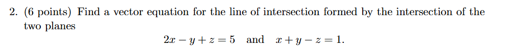
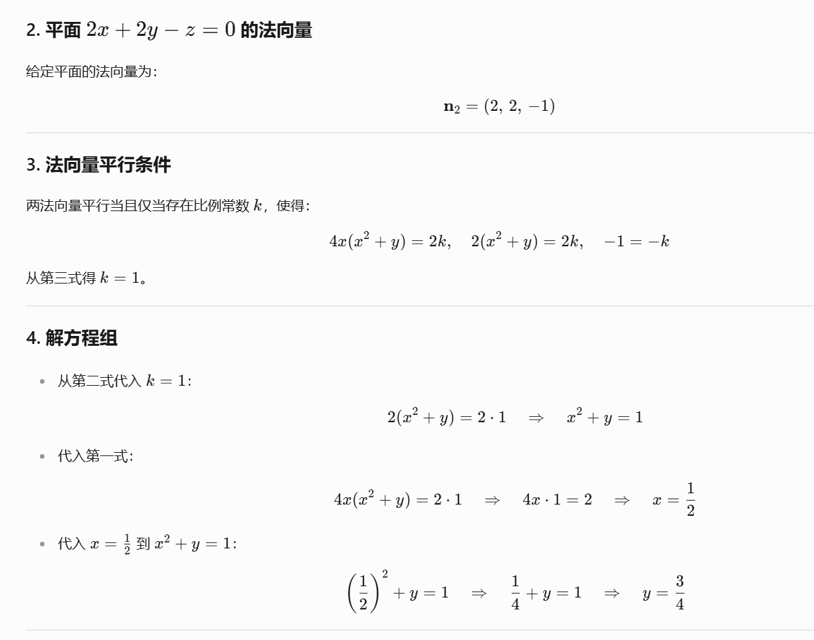
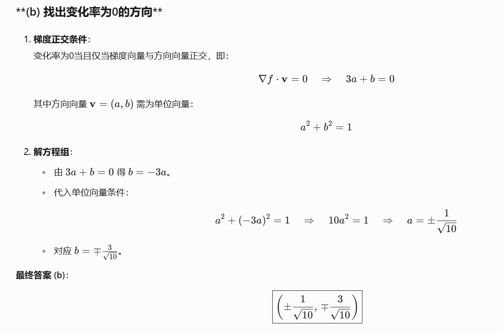
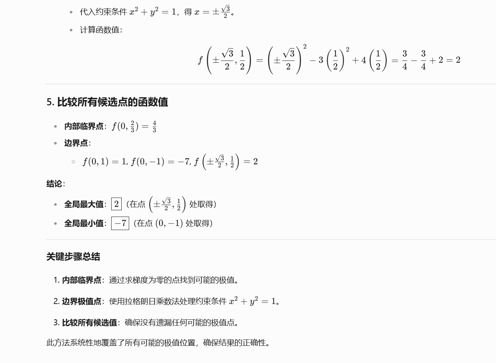
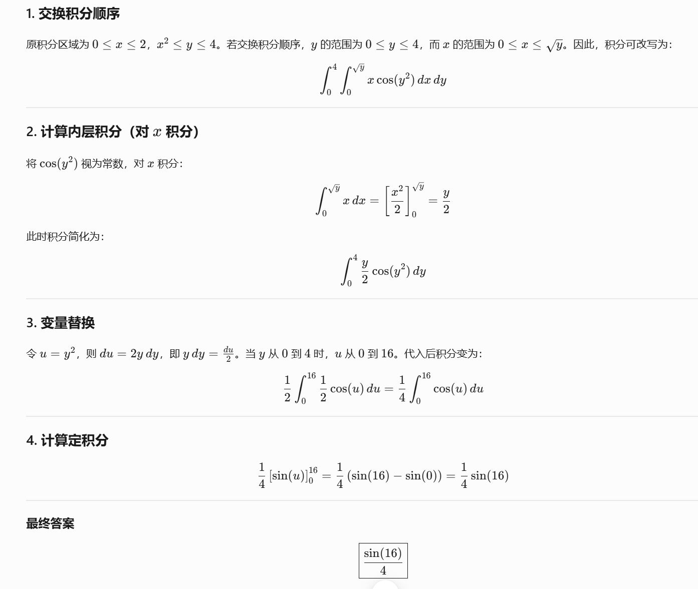

方向导数是**多元函数沿某一特定方向的变化率**。

- **梯度 ∇\*f\***：表示光强度在各方向的最大变化趋势。
- 点积 ∇*f*⋅**v** 将梯度投影到电鳗的移动方向上，得到实际的光强度变化速率。

通常，没有约束的情况下，我们可以直接对目标函数求导，找到临界点。但这里存在一个约束条件，即L + 2(W + H) ≤ 90。这时候，直接求导可能无法满足约束条件，或者需要将约束条件转化为目标函数的一部分，而这可能比较复杂。

首先，我需要回忆一下拉格朗日乘数法的基本原理。这个方法用于在有约束条件下寻找函数的极值。这里的目标是最大化体积V = LWH，而约束条件是L + 2(W + H) ≤ 90。在这种情况下，极值通常出现在约束条件的边界上，也就是当L + 2(W + H) = 90的时候，因为如果还有余量的话，可能还能增大体积，所以最大值应该在边界上。

接下来，梯度的概念。梯度是一个向量，指向函数增长最快的方向，而它的模长表示增长速率。对于目标函数V = LWH，它的梯度∇V应该是对L、W、H的偏导数组成的向量，也就是(WH, LH, LW)。而约束条件函数是g(L, W, H) = L + 2W + 2H - 90，所以它的梯度∇g就是(1, 2, 2)。

根据拉格朗日乘数法，当在约束条件下达到极值时，目标函数的梯度∇V必须与约束条件的梯度∇g成比例，也就是说存在某个λ，使得∇V = λ∇g。这就是所谓的梯度方向相同，或者说两者在同一直线上，方向一致或相反，取决于λ的正负。

为什么会这样呢？直观上想，如果在约束条件的边界上，移动一点位置，如果目标函数的梯度方向不与约束条件的梯度方向一致，那么应该还能沿着某个方向继续增加目标函数的值，同时仍然满足约束条件，这就说明当前点不是极值点。只有当两个梯度方向相同或相反时，无法在不违反约束条件的情况下继续优化目标函数，这时候才达到极值。

回到三维的行李箱问题，这里的约束是一个平面L + 2W + 2H = 90，而目标函数V = LWH是一个三维的曲面。在约束平面上寻找V的最大值，相当于找这个曲面与平面相交的曲线上的最高点。在这个最高点处，曲面的梯度方向必须与平面的梯度方向一致，否则可以沿着某个方向移动，同时保持在平面上，使得体积继续增大。

也就是说，当∇V和∇g方向相同时，任何在约束平面上的移动方向都会导致V的变化率为零或者负值，因此达到了极大值。这时候，拉格朗日乘数λ就是这个比例因子，使得∇V = λ∇g。

第二张卷子

首先，拉格朗日乘数法通常用于等式约束下的优化问题，但这里约束是一个不等式 *x*2+*x**y*+*y*2≤3。这意味着极值可能出现在约束边界的内部或者边界上。

不过，先检查函数在内部的临界点是否存在。即求 *f*(*x*,*y*) 的梯度，并找到梯度为零的点。

第三张试卷

在多元函数极限问题中，若直接代入原点坐标无法确定极限值，通常需要通过**路径测试**验证极限是否存在。

对于二元函数 *f*(*x*,*y*)，若其在点 (0,0) 处的极限存在，则**沿任何路径趋近原点时**，极限值应一致。反之，若沿不同路径得到不同的极限值，则原极限**不存在**。

路径 *y*=*k**x* 是一条经过原点的直线，覆盖了所有可能的斜率 *k*，是最简单的路径之一，适合初步检验极限是否存在。

**计算变化率**：方向的变化率是梯度向量与单位方向向量的点积。但题目中的方向向量u是(-3,4)，不是单位向量。不过根据变化率的定义，是否应该使用单位向量呢？

这里可能需要澄清：通常，方向导数的定义是梯度与单位方向向量的点积，

