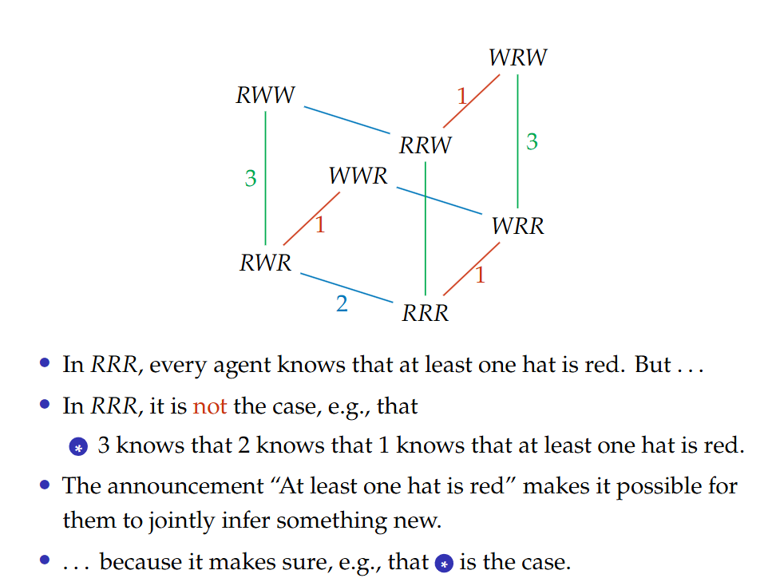

这张图片展示的是一个关于共同知识（common knowledge）的逻辑推理问题，类似于上一张图片的思路。具体解释如下：

1. **RRR 状态下的已知信息**：在 RRR 状态（即所有特工都戴红色帽子）下，每个特工都知道至少有一顶帽子是红色的，因为他们能看到其他人戴着红色的帽子。然而，单凭这个知识，特工们无法得出更多的结论。

2. **复杂的推理链**：在 RRR 状态下，每个特工不仅知道至少有一顶帽子是红色的，还可以进一步推理。例如，特工 3 知道特工 2 知道特工 1 知道至少有一顶红帽子。这一层层的推理展示了“共同知识”的概念：每个人不仅知道信息本身，还知道其他人知道这个信息，并且知道其他人知道其他人也知道，依此类推。

3. **宣告的影响**：宣告“至少有一顶帽子是红色的”这一信息使得所有特工在已有的基础上共同推理出新的信息。这一宣告让特工们明确可以开始新的推理，从而最终得出每个人的帽子颜色。

4. **新信息的得出**：由于这个宣告，使得特工们能确定每个人的帽子情况，比如让特工们确认到了某些原本不明确的状态（比如标注的星号部分）。这个过程展示了在一个复杂的共同知识网络中，如何通过宣告和推理链来逐步揭示信息。

这种题目主要目的是展示“共同知识”的力量，在所有人都知道并且所有人都知道其他人也知道的情况下，通过有限的信息和推理可以得出看似无法直接观察到的结论。

好的，让我详细解释一下图中的符号和它们的含义：

1. **RRW, RRR 等符号**：
   - 这些符号代表三个人（我们可以称他们为“特工”或“玩家”）所戴帽子的颜色组合。
   - `R` 表示红色帽子，`W` 表示白色帽子。
   - 比如，`RRW` 表示三个人中有两个人戴红色帽子，一个人戴白色帽子。
   - 图中的这些组合就是所有可能的帽子颜色排列。

2. **数字 1, 2, 3 的含义**：
   - 这些数字代表不同特工之间的“知识层次”。
   - 数字 1 表示“直接可见的知识”，也就是说，一个特工可以直接看到其他人戴的帽子。
   - 数字 2 和 3 表示更高层次的知识。例如：
     - “2” 表示二层的知识链，即某个特工知道另一个特工所知道的信息。
     - “3” 表示三层的知识链，即某个特工知道另一个特工知道第三个特工所知道的信息。

3. **连线的意义**：
   - 图中的连线表示从一种帽子颜色组合可以通过“观察和推理”得到另一种组合。
   - 不同颜色的连线代表不同的知识层次（1层、2层或3层）。
   - 比如，在 `RRR` 的状态下，每个人都可以看到其他人都戴着红色帽子，所以他们知道至少有一个人戴的是红色帽子。这就是第一层的知识。
   - 然后通过不断的推理，他们可以逐步得出关于自己帽子颜色的更深入的结论。

4. **逻辑推理链的作用**：
   - 每个特工可以根据自己看到的帽子颜色，以及“至少有一顶帽子是红色的”这个公开的信息，推断出更高层次的知识，从而得知自己帽子的颜色。

所以，图中的帽子组合（如 `RRR`、`RRW` 等）代表了不同的帽子分布，而数字和连线则展示了特工们之间的知识推理链。

好的，我们可以一步一步来解释图中关于数字 1、2、3 的推理过程。

假设这是一个“三人戴帽子”推理问题，三个人分别记为 A、B 和 C。每个人头上戴的是红色（R）或白色（W）的帽子，且每个人只能看到别人的帽子，不能看到自己的帽子。同时，所有人都知道帽子的规则（比如至少有一顶帽子是红色的）。

我们以“RRW”的组合为例，解释数字 1、2、3 表示的推理层次：

### 1 层推理（直接观察到的知识）
- **在 RRW 情况下**：
  - A、B、C 三个人分别戴的是：A 戴红色帽子，B 戴红色帽子，C 戴白色帽子。
  - **A 和 B 都能看到 C 戴的是白色帽子**。
  - **A 和 B 看到的情况**：每人都能看到另一个人戴红色帽子和一个人戴白色帽子。
  - 对于 A 或 B 来说，单纯从看到的情况无法立即推断出自己的帽子颜色，他们只能知道“至少有一顶帽子是红色的”，但还无法确定自己的帽子颜色。
  - **这一层是每个人的直接观察结果**。

### 2 层推理（基于他人的观察推理）
- **在 RRW 情况下，A 的思考**：
  - A 知道 B 可以看到 A 和 C 的帽子颜色，看到的组合是“R 和 W”（A 戴红色、C 戴白色）。
  - B 的推理过程是这样的：“如果我自己戴的是白色，那么 A 看到的将是 WW，A 就会知道自己戴的是红色。”但因为 A 并没有立刻作出判断，所以 B 推断自己戴的是红色。
  - 因此，A 可以通过 B 没有立刻作出判断这一点，进一步推断 B 戴的是红色。
  - 这是**第二层次的推理**，即 A 可以根据 B 的反应来推断 B 的推理逻辑。

### 3 层推理（基于他人对他人观察的推理）
- **在 RRW 情况下，A 的进一步推理**：
  - A 看到 B 和 C 的帽子颜色（分别是红和白），并且通过第二层推理知道 B 认为 A 也戴着红色。
  - A 可以继续想：“如果我自己戴的是白色，那么 B 应该立刻能够判断出我戴的是白色，因为 B 已经知道至少有一顶帽子是红色。”
  - 但是，因为 B 也没有立刻作出判断，而是进行更深入的思考，这表明 B 把 A 当成了红色。
  - 因此，A 可以进一步得出结论，自己戴的是红色。
  - **第三层推理**就是这样逐步通过观察他人的反应和推理来确定自己的帽子颜色。

### 总结
1. **1 层推理**：每个人看到他人帽子的颜色（直接观察）。
2. **2 层推理**：每个人知道其他人也在进行观察和推理，并考虑到其他人的反应。
3. **3 层推理**：通过更高层次的逻辑链，结合他人没有立刻得出结论的反应，从而得出更深入的判断。

这个逻辑链条展示了如何通过不同层次的推理，逐步从基础的观察，得出自己帽子颜色的结论。

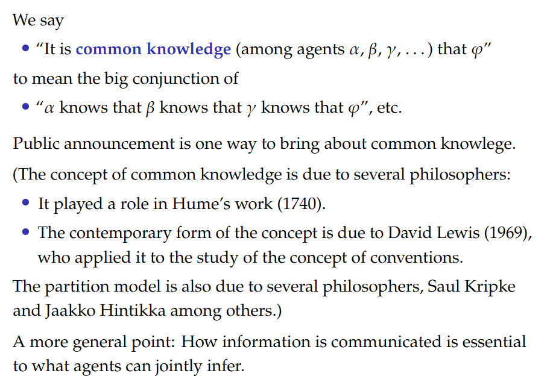

这段文字主要解释了“共同知识”（common knowledge）的概念及其在逻辑推理和信息传递中的作用。以下是具体内容的解释：

1. **共同知识的定义**：
   - 当我们说“某事是 α、β、γ...之间的共同知识”，意思是所有相关的个体都知道这个信息，并且知道其他人也知道这个信息，并且知道其他人知道他们知道这个信息，以此类推。这是一种层层嵌套的“知道”关系。
   - 例如，“α 知道 β 知道 γ 知道某事”就是一种共同知识的具体形式。

2. **共同知识的形成**：
   
   - 公开宣告（public announcement）是一种产生共同知识的方式。当一个信息被公开宣告后，每个人都知道这个信息，并且知道其他人也知道这个信息，从而形成共同知识。
   
3. **哲学背景**：
   - 共同知识的概念由多位哲学家提出。例如，休谟（Hume）在 1740 年的作品中提到过这个概念。
   
   - 现代形式的共同知识理论是由哲学家戴维·路易斯（David Lewis）在 1969 年提出的，他将其应用于研究约定（conventions）的概念。

   - 分区模型（partition model），也是共同知识的分析方法之一，由索尔·克里普克（Saul Kripke）和雅科·欣蒂卡（Jaakko Hintikka）等哲学家提出。
   
     > - 分区模型（Partition Model）是一种用来表示和分析知识状态的逻辑模型，主要用于研究如何在不确定的情况下，通过信息交流达到共同知识。分区模型的核心思想是将可能的“世界”（即可能的情况）分成不同的“分区”（partition），并分析个体如何通过观察或交流逐渐缩小这些分区，最终确定真实的世界。
     >
     >   ### 分区模型的基本概念
     >
     >   1. **可能世界**：
     >      - 在分区模型中，每个“可能世界”代表一个可能的情况或状态。例如，三人帽子问题中，每种帽子组合（如 `RRR`、`RRW`）都可以看作一个“可能世界”。
     >      
     >   2. **知识分区**：
     >      - 分区模型将这些“可能世界”按照个体的知识划分成不同的“分区”。在同一个分区内的“世界”是某个个体无法区分的，这意味着对于这个个体而言，这些世界都是“可能的”。
     >      - 例如，假设在三人帽子问题中，A 看到 B 和 C 戴的是红帽子。在分区模型中，A 可能无法确定自己的帽子颜色，所以对于 A 来说，“RRR”和“RRW”这两个世界在他的视角下是无法区分的，属于同一个分区。
     >
     >   3. **公共知识和缩小分区**：
     >      - 当一个信息被公开时（例如“至少有一个人戴红色帽子”），每个人都可以使用这个信息来缩小他们的分区，从而排除掉不符合的“世界”。
     >      - 随着信息的逐步传递和推理，个体们的分区逐渐变小，最终所有人可能会达到共同的认识，即每个人都知道自己和他人的帽子颜色。
     >
     >   ### 举例说明
     >
     >   以三人帽子问题为例：
     >
     >   - 初始时，A、B、C 各自对可能的“世界”有不同的分区，因为他们各自看不到自己头上的帽子。
     >   - 假设真实情况是 `RRW`（A 和 B 戴红色，C 戴白色）。
     >     - 对于 A 来说，可能的分区是 `RRR` 和 `RRW`，因为他不确定自己的帽子是否是红色。
     >     - 对于 B 来说，可能的分区也是 `RRR` 和 `RRW`。
     >     - 对于 C 来说，可能的分区是 `RRW` 和 `WRW`，因为 C 看到 A 和 B 都是红色，不确定自己是否是白色。
     >   - 如果有一个公共声明“至少有一个人戴红色帽子”，这个信息不会改变当前的分区，因为他们都知道至少有一个红色。但如果增加新的信息（比如看到别人的反应），每个人可以进一步缩小自己的分区。
     >     
     >
     >   最终，分区模型帮助我们理解每个人如何通过公共信息和他人的反应来逐步缩小自己可能的“世界”，直到确定真实的世界是什么样的。
     >
     >   ### 分区模型的应用
     >
     >   分区模型在以下场景中非常有用：
     >
     >   - **逻辑推理**：分区模型被用来分析逻辑推理中的知识状态和不确定性，特别是在多层次的“知道”关系中。
     >   - **博弈论**：在博弈论中，分区模型帮助分析玩家在不同策略下的知识状态和选择。
     >   - **分布式系统**：在分布式系统中，不同节点可能持有不同的信息，通过分区模型可以分析信息共享的效果。
     >
     >   ### 总结
     >
     >   分区模型提供了一种框架，通过分区的方式来表示个体在不确定环境中的知识状态。它能帮助我们分析在多层推理下，个体如何逐渐缩小可能的选项（分区），直到达到共同知识或确定真实的情况。
   
4. **信息传递的关键性**：
   
   - 这段文字的最后提到了一点重要的结论：信息如何传递直接影响个体能够得出的共同推理。也就是说，信息传递的方式决定了大家能够共同推理出什么结论。

简单来说，这段文字阐述了“共同知识”概念的定义、形成方式以及其在哲学和逻辑学中的历史背景，同时强调了信息传递对共同推理的重要性。

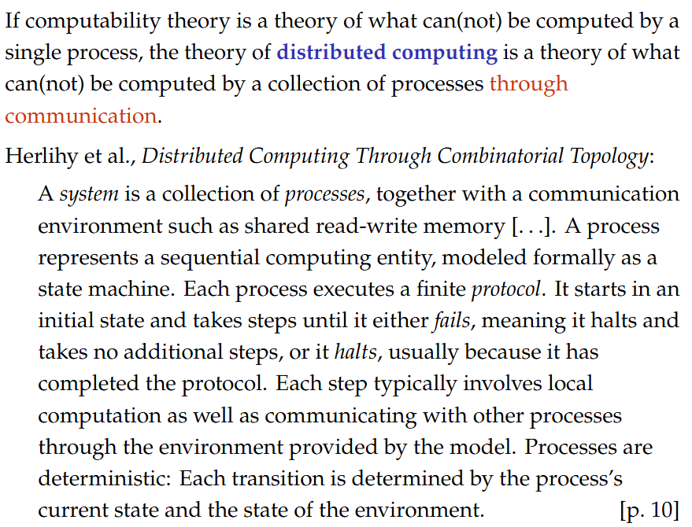

这段文字解释了**分布式计算**的基本概念，以及它与**计算理论**的关系。以下是逐句的解读和解释：

1. **分布式计算理论 vs 计算理论**：
   - 计算理论主要研究单个计算过程（process）能（或不能）计算出什么。
   - 而分布式计算理论则研究由多个计算过程通过通信（communication）合作，能够（或不能）计算出什么。这就是说，分布式计算侧重于在多个相互通信的进程之间完成计算任务。

2. **系统和进程的定义**：
   - 书中提到，一个**系统（system）**是由多个**进程（processes）**组成的集合，这些进程通过共享的通信环境进行交互。例如，可以通过共享的读写内存来实现通信。
   - 一个进程被视为一个顺序执行的计算实体（可以理解为一个“状态机”），这意味着它会按一定的顺序执行操作，并在每一步保持某个状态。

3. **进程的操作过程（protocol）**：
   - 每个进程都会执行一个有限的**协议（protocol）**，也就是一组规定的操作步骤。
   - 每个进程从一个初始状态开始，逐步执行步骤，直到它遇到以下两种情况之一：
     - **失败（fails）**：进程遇到错误或停止，不再继续执行。
     - **停机（halts）**：进程完成了协议中规定的所有步骤，正常停止。

4. **进程的步骤和通信**：
   - 在执行过程中，每个步骤通常会涉及两个部分：
     - 本地计算：进程在不依赖其他进程的情况下执行某些操作。
     - 与其他进程通信：进程通过系统中的通信环境（如共享内存）与其他进程交换信息。
   - 每个进程的行为是**确定性的（deterministic）**，也就是说，在相同的初始状态和环境状态下，进程的行为是可预测的、不会变化的。

### 总结
这段文字说明了分布式计算系统的基本构成。分布式计算由多个进程组成，这些进程通过通信环境（如共享内存）进行协作，每个进程按一个有限协议执行计算步骤，直到它们完成任务或停止。

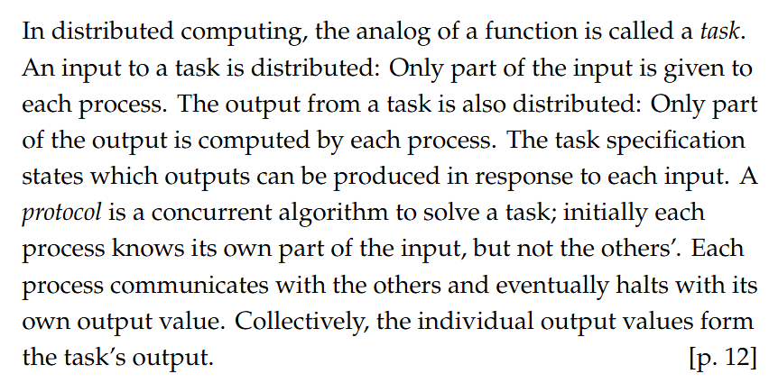

这段文字解释了**分布式计算**中的一些基本概念，尤其是“任务”（task）的概念，以及它如何通过多个进程的协作来完成。以下是逐句的详细解读：

1. **任务的定义**：
   - 在分布式计算中，函数的类比被称为**任务（task）**。与单个函数不同，任务在分布式系统中是由多个进程协同完成的。

2. **任务的输入是分布式的**：
   - 任务的输入数据是分布式的，意思是任务的输入被分割成不同的部分，每个进程只接收到其中的一部分。
   - 这意味着没有一个进程拥有整个任务的输入数据，而是各自只知道自己那部分的信息。

3. **任务的输出也是分布式的**：
   - 任务的输出也是分布式的，即每个进程只计算出整体输出的一个部分。
   - 任务的具体说明（task specification）会规定在每种输入下，哪些输出是可接受的结果。

4. **协议（protocol）**：
   - **协议**是一个并发算法，用于解决该任务。每个进程按照协议执行操作，来完成任务。
   - 在执行时，每个进程最初只知道自己部分的输入，不知道其他进程的输入内容。
   - 每个进程通过通信环境与其他进程进行信息交换，最终完成自己的输出计算并停止（halt）。

5. **输出的组合**：
   - 最终，所有进程的输出值组合在一起，形成整个任务的输出。这些输出值相互关联，共同构成了任务的完整解。

### 总结
这段文字描述了分布式计算中任务的执行过程。任务的输入和输出都被分布在多个进程之间，单个进程无法独立完成任务的全部，而是通过遵循协议（一个并发算法）并相互通信，逐步计算并产生自己的部分输出。最终，所有进程的输出组合成任务的完整结果。

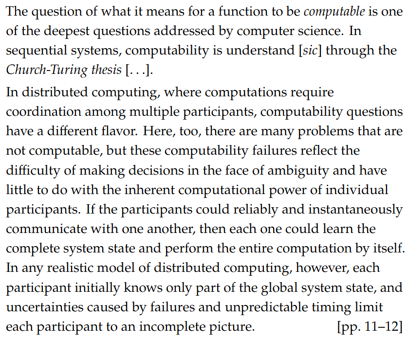

这段文字探讨了**可计算性（computability）**在分布式计算中的独特挑战，并比较了分布式系统与传统顺序系统（单一计算过程）在可计算性问题上的区别。以下是逐句的详细解释：

1. **可计算性问题的基本含义**：
   - 可计算性是计算机科学的一个核心问题，即如何定义一个函数是可计算的（可以通过某种计算方法得到结果）。
   - 在传统的顺序计算系统中，可计算性通常基于**丘奇-图灵论题（Church-Turing Thesis）**，即一个函数是否可以通过图灵机来计算。

2. **分布式计算中的可计算性挑战**：
   - 在分布式计算中，多个参与者（进程）需要相互协调才能完成计算任务，因此可计算性问题具有不同的特点。
   - 在这里，也有许多问题是不可计算的，但这种“不可计算性”并不是因为单个参与者计算能力不足，而是因为**决策中的不确定性和信息不完全**。

3. **不确定性和决策困难**：
   - 在分布式系统中，每个参与者必须在信息不完全的情况下做出决策。这种不确定性增加了问题的复杂性，导致某些计算任务变得不可计算。
   - 这种不可计算性与每个参与者的计算能力无关，而是由于在系统中面对模糊性和不完整信息所带来的决策困难。

4. **理想的通信情况下的可计算性**：
   - 如果参与者之间可以可靠且即时地通信，那么每个参与者可以获取整个系统的状态，并独立完成整个计算。这时，分布式系统的计算过程就与顺序系统相似了，计算的可行性不再是问题。
   
5. **现实中的限制**：
   - 在现实的分布式计算模型中，每个参与者最初只能知道全局系统状态的一部分。
   - 系统中不可避免的**故障和不确定的通信时间**（例如消息延迟或丢失）限制了每个参与者对系统整体状态的了解，从而导致每个参与者只能获得不完整的信息。

### 总结
这段文字说明了在分布式计算中，可计算性问题不仅仅与每个进程的计算能力相关，而更受限于参与者之间的信息交流和系统状态的模糊性。在理想的情况下（即时可靠通信），每个参与者可以了解系统全局状态，从而完成计算。但在现实中，由于通信延迟、故障等问题，每个参与者只能获得部分信息，这使得一些计算任务变得不可行。

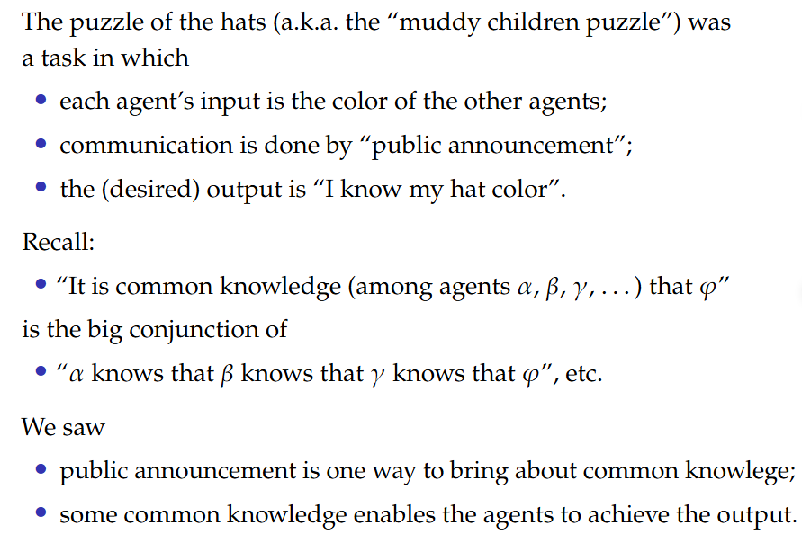

这段文字讨论了“帽子谜题”或“泥孩子谜题”的推理过程，特别是如何通过**共同知识**和**公开宣布**来帮助个体（代理人）得出自己的帽子颜色。以下是逐句的解释：

1. **帽子谜题的描述**：
   - **输入**：每个代理人（参与者）可以看到其他代理人帽子的颜色（即每个人知道别人的帽子颜色，但不知道自己的帽子颜色）。
   - **通信方式**：信息通过“公开宣布”来传递，即宣布“至少有一个人戴了红色的帽子”之类的公共信息。
   - **目标输出**：每个代理人最终都能够说出“我知道我帽子的颜色”。

2. **共同知识的回顾**：
   - 共同知识的定义：当我们说“某事是 α、β、γ...之间的共同知识”时，意味着每个人都知道这个信息，并且知道其他人也知道这个信息，而且知道其他人知道其他人也知道，以此类推。这形成了一个嵌套的“知道”关系。
   - 这种层层嵌套的知识关系最终构成了共同知识，使得每个代理人可以基于他人的反应逐步推理。

3. **共同知识和公开宣布的作用**：
   - **公开宣布**：公开宣布是形成共同知识的一种方式。例如，在帽子谜题中，宣布“至少有一个人戴着红色的帽子”后，每个人都知道这一点，并且每个人都知道其他人也知道，依此类推，形成了共同知识。
   - **共同知识帮助代理人推理**：通过这种共同知识，代理人可以逐步推理，最终得知自己的帽子颜色。

### 总结
这段文字阐述了“帽子谜题”的推理过程如何利用共同知识来得出结论。通过“公开宣布”来形成共同知识，使得每个参与者可以利用他人的反应和推理链条，最终确认自己的帽子颜色。这说明了共同知识的重要性，以及公开宣布如何帮助参与者在信息不完全的情况下做出推断。

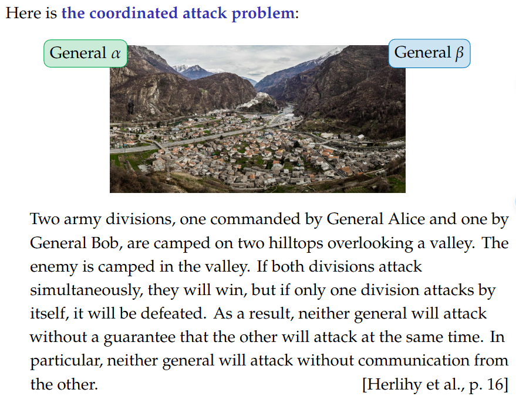

这段文字描述了**协调攻击问题（Coordinated Attack Problem）**，这是一个经典的分布式系统中的沟通和决策难题。以下是该问题的详细解释：

1. **问题背景**：
   - 有两支军队驻扎在山顶上，这两支军队分别由两位将军指挥：**将军 Alice** 和 **将军 Bob**。
   - 敌军驻扎在山谷中，如果这两支军队同时发起攻击，他们将取得胜利；但是，如果只有一支军队单独发起攻击，这支军队会被敌人击败。

2. **问题的核心挑战**：
   - 由于需要同时攻击才能成功，所以两位将军必须确保对方会在同一时间发起攻击。
   - 但是，这两位将军无法直接见面交流，只能通过通信手段（如派信使）来传递信息。
   - 由于通信可能不可靠（信使可能被敌军截获），任何一方都无法完全确定对方是否收到了消息并能同时行动。

3. **决策困境**：
   - 在这种情况下，如果没有明确的保证对方会在同一时刻行动，将军们不会冒险单独发起攻击。
   - 因此，即使有通信手段，在缺乏**共同知识**的情况下，两位将军也无法完全确定对方的行动，导致他们无法同时发起攻击。

### 解释
**协调攻击问题**展示了在不可靠通信环境中达成同步的难度。即使双方互相传递“准备好攻击”的消息，由于不确定对方是否确认自己收到了所有消息，他们始终无法确信对方会在同一时刻行动。这是分布式系统中**共识问题**的一个典型例子。

### 总结
协调攻击问题说明了在分布式系统中，缺乏可靠的通信和共同知识会导致个体难以做出同步决策。在这种情况下，即使双方想要合作，由于无法确定对方的状态，导致双方无法协作成功。

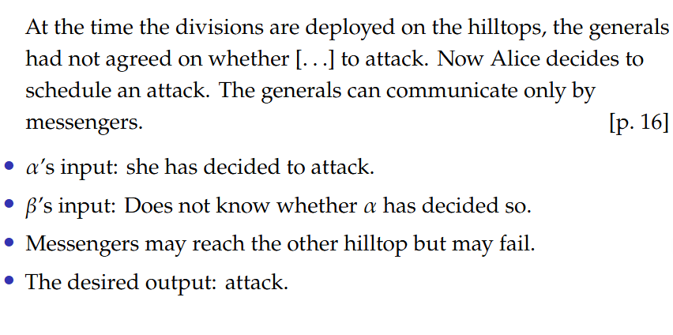

这段文字进一步解释了**协调攻击问题**中的细节，描述了将军们在不确定的通信条件下试图协调攻击的场景。以下是逐句的解释：

1. **初始情况**：
   - 两支部队已经部署在山顶上，但将军们还没有就是否发动攻击达成一致。

2. **Alice 的决定**：
   - Alice（记为将军 α）决定发起攻击，并准备通知另一位将军 Bob（记为将军 β）。

3. **信息状态**：
   - Alice 的输入是：“她已经决定发动攻击。”也就是说，Alice 已经做好了进攻的准备。
   - Bob 的输入是：“他不知道 Alice 是否已经决定进攻。”这意味着 Bob 还没有收到任何来自 Alice 的确认消息，因此不确定她的计划。

4. **通信限制**：
   - 将军们只能通过信使（messenger）来进行沟通，信使可能成功将信息传递到另一个山顶，但也有可能失败（例如信使被敌军截获或无法送达）。

5. **期望的结果**：
   - 理想情况下，希望达成的结果是双方能够同步发起攻击。

### 解释
这个描述展示了一个分布式系统中的**信息不完全和通信不可靠**的问题。虽然 Alice 决定发起攻击并通过信使传递消息给 Bob，但由于通信可能失败，Bob 无法确定是否收到最新的指令。这导致双方难以同步行动，因为 Bob 可能会等待确认，以免单独发起攻击导致失败。

### 总结
协调攻击问题揭示了在通信不可靠的环境下，个体难以达成共同决策的困境。即使一方（Alice）决定了行动，由于另一方（Bob）无法确定是否收到信息，双方在没有共同知识的情况下难以达成一致并同步行动。这是分布式系统中**共识问题**和**信息不对称**的经典案例。

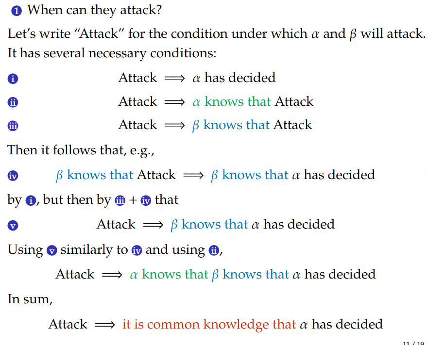

这段文字分析了**协调攻击问题**中将军们可以**同时发起攻击**的条件，并展示了在分布式系统中达成“共同知识”所需的多层次推理。以下是逐步的解释：

1. **问题目标**：
   - 讨论的是在什么条件下两位将军（α 和 β）能够同时发起攻击。
   - 假设“Attack”表示两位将军都决定同时攻击的条件。为了达成这个条件，有一系列必要条件。

2. **必要条件**：
   - **条件 (i)**：要发起攻击，α 必须已经做出攻击的决定。
   - **条件 (ii)**：要发起攻击，α 必须知道双方要进行攻击的决定。
   - **条件 (iii)**：要发起攻击，β 必须知道双方要进行攻击的决定。

3. **层层推理**：
   - **条件 (iv)**：如果 β 知道即将攻击，则 β 必须知道 α 已经决定攻击。这是因为只有在 α 做出决定后，才能逐层传递给 β，β 才能得知。
   - **条件 (v)**：最终，我们得出，若要发起攻击，则 β 必须知道 α 已经决定了攻击。这意味着信息必须传播到 β 的层次，β 才能做出同步行动的决策。

4. **多层次共同知识**：
   - 使用类似的推理，经过逐层的反向验证和确认，最终可以得出 α 必须知道 β 知道 α 已经决定了攻击，反过来也是如此。
   - 最终结论是，发起攻击的条件是**α 已决定攻击这一事实已经成为共同知识**。

### 总结
为了保证双方同时发起攻击，信息必须达到共同知识的层次。也就是说，α 和 β 不仅要知道攻击的决定，还要知道对方知道，并且知道对方知道自己知道，以此类推。这种多层次的知识称为**共同知识**，在分布式系统中，缺少共同知识会导致无法同步决策。这也是为什么在不可靠的通信条件下，协调攻击非常困难，因为很难达到这种共同知识的状态。

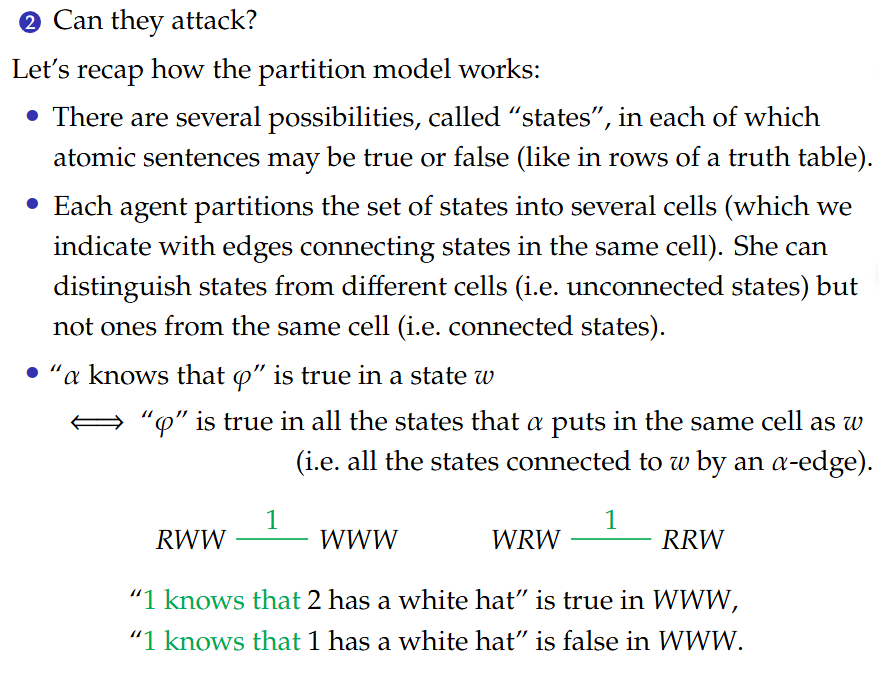

这段文字解释了**分区模型（partition model）**在多代理人推理中的应用。具体来说，分区模型帮助我们理解代理人在不同状态下的知识和不确定性，以及如何用这种模型来判断他们是否具备足够的知识来采取行动（例如“是否可以攻击”）。

以下是分区模型的关键要点及图示的解释：

1. **状态（states）**：
   - 系统中有多个可能的状态（称为“状态”），每个状态可以表示不同的真实情况。这些状态类似于真值表中的行，每一行（状态）中某些原子命题可能为真或假。
   - 比如在帽子问题中，不同的状态可以是不同的帽子颜色组合（如 RWW、WRW 等）。

2. **代理人的分区**：
   - 每个代理人（如 α 或 β）将这些状态划分为若干个“单元”或“分区”。分区中的状态是通过边连接的（例如图中连接 RWW 和 WWW 的绿色边）。
   - 每个代理人可以区分不同分区中的状态（即不同单元），但不能区分同一分区中的状态（即连接在一起的状态）。

3. **知识的定义**：
   - “α 知道 φ 在状态 w 中为真”当且仅当在 α 的分区中，w 所在的所有状态都使得 φ 为真。
   - 换句话说，如果一个命题在所有与 w 连接的状态中都成立，那么 α 在状态 w 中就知道这个命题。
   
4. **图示中的例子**：
   - 图示显示了四种状态的分区和连接：
     - RWW 和 WWW 之间有一条绿色的边（表示 α 的分区），同样的，WRW 和 RRW 之间也有一条绿色的边。
   - 示例命题：
     - “1 知道 2 戴白帽子”在状态 WWW 中为真，因为在 WWW 的状态中，1 可以看到 2 的帽子颜色。
     - “1 知道 1 戴白帽子”在 WWW 中为假，因为 1 在该状态中无法确定自己的帽子颜色。

### 总结
分区模型帮助我们理解在不同的状态下代理人（如 α 和 β）能区分的知识范围。通过将状态划分为多个分区并连接同一单元的状态，可以分析代理人在特定状态下的知识和不确定性。这个模型可以用于分析多代理系统中的**共同知识**和决策条件，例如是否具备足够的知识来进行同步行动（如攻击）。

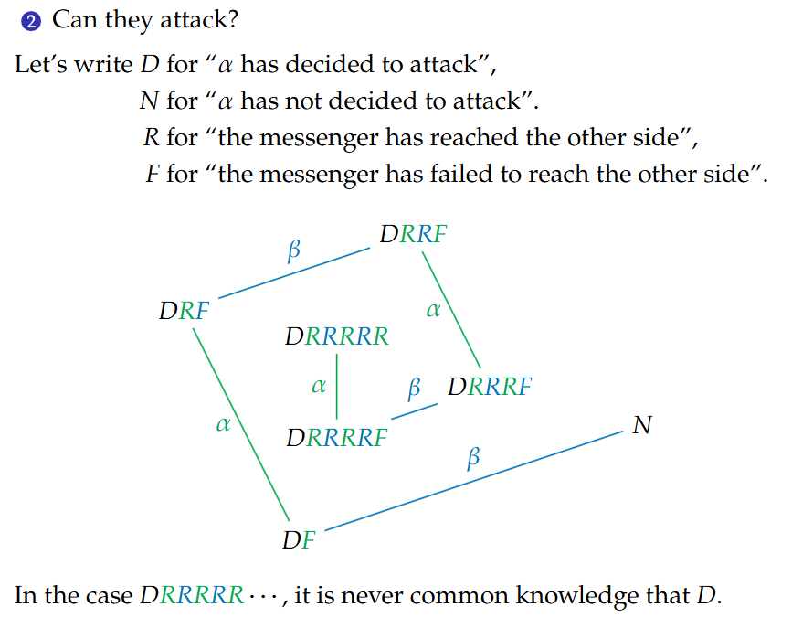

这段文字继续讨论了**协调攻击问题**，并通过分区模型分析了在不可靠通信条件下，将军们是否能够达到“共同知识”并决定同时发动攻击。

以下是逐步解释：

1. **符号定义**：
   - **D** 表示“α 已经决定发动攻击”。
   - **N** 表示“α 尚未决定攻击”。
   - **R** 表示“信使成功传递消息到另一方”。
   - **F** 表示“信使未能将消息传递到另一方”。

2. **图示的含义**：
   - 图中展示了几种状态组合，例如 `DRF`、`DRRRRF` 等，代表不同的情景。
   - 例如，`DRF` 表示 α 已决定攻击（D），信使成功传递了一次（R），然后一次传递失败（F）。
   - **α 和 β 的分区**：绿色和蓝色的线分别表示 α 和 β 的分区。连线连接的状态表示在该分区内，α 或 β 无法区分这些状态。
   - 在图中，`DRRRR...` 表示信使多次成功传递消息的情景。

3. **信息传递的局限性**：
   - 在分布式环境中，即使信使成功多次传递消息，α 和 β 仍然无法达到“共同知识”，即双方都确定对方也知道自己将要攻击的决策。
   - 图中所示的 `DRRRR...` 状态说明了这一点，即即便信使多次成功，因通信的潜在不可靠性，无法确保消息到达并被对方确认，从而无法形成共同知识。

4. **结论**：
   - 在 `DRRRR...` 的情况下，共同知识始终无法形成，因此将军们无法确信对方会在同一时间发动攻击。
   - 这说明在不可靠通信条件下，由于无法形成共同知识，协调攻击（即同步攻击）是不可能的。

### 总结
这段文字通过分区模型分析了在不确定的通信环境中（信使可能失败），将军们难以达成同步行动的决策。尽管可以多次传递消息（例如 `DRRRR...`），但由于每次通信都存在失败的可能性，他们始终无法形成“共同知识”，这导致他们无法保证同步发起攻击。这是分布式系统中共识问题的一个经典例子。

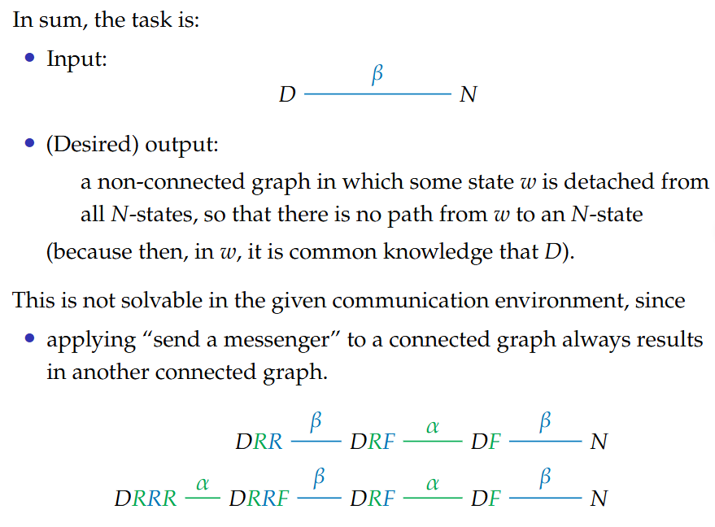

这段文字总结了**协调攻击问题**的解决目标和困难，特别是为什么在给定的通信环境下无法达成共同知识并同时发动攻击。

以下是逐步解释：

1. **任务描述**：
   - **输入**：图示中，状态 `D` 表示“α 已决定攻击”，状态 `N` 表示“α 尚未决定攻击”。连接 `D` 和 `N` 的蓝色边表示 β 的分区，即 β 不能区分这些状态。
   
   - **期望的输出**：期望得到一个**非连通图**，其中某个状态 \( w \) 与所有 `N` 状态（`α 尚未决定攻击`）断开连接。
     - 如果图中有一个状态 \( w \) 与所有 `N` 状态断开连接，这意味着在 \( w \) 中达成了共同知识，即双方都确信“α 已决定攻击”，可以同步发起攻击。

2. **问题所在**：
   - **不可解决性**：在当前的通信环境下，这个问题是无法解决的。
   - 每次发送信使（即传递消息）都会产生一个新的连通图，意味着无论信使成功与否，都会有路径连接状态 `w` 与 `N` 状态。因此，在任何状态下，都存在连接使得 β 无法确认 α 是否已决定攻击，因而无法达成共同知识。

3. **原因**：
   - 每次通信尝试都无法“切断”图中的连通性。信使的发送结果总是产生一个连通的图，即状态间仍然有路径相连。
   - 由于图始终保持连通性，β 始终无法区分状态 `D` 与 `N`，从而无法确定 α 的决策，导致无法达成共同知识，也无法同时发动攻击。

### 总结
协调攻击问题在当前通信环境下无法解决的原因在于：无论进行多少次通信尝试，图中的状态总是连通的，这意味着 β 无法在任何状态下确认 α 已决定攻击，因此双方无法形成共同知识。在这种情况下，将军们无法保证同时发起攻击。

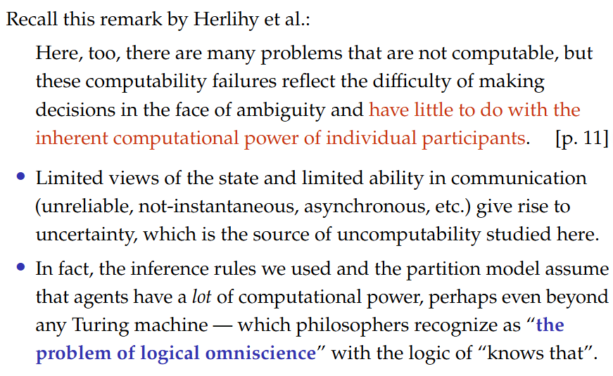

这段文字引用了 Herlihy 等人关于**可计算性问题**的观点，特别是分布式系统中一些问题不可计算的原因。这段话主要关注在分布式环境下的决策困难，以及这种困难与个体计算能力的关系。

以下是逐步解释：

1. **不可计算性的来源**：
   - 许多问题之所以不可计算，并不是因为参与者的计算能力不足，而是因为在**信息不完整**和**模糊性**的情况下，决策变得非常困难。
   - 这段话指出，分布式系统中的不可计算性问题，与个体参与者的计算能力无关（即使参与者的计算能力很强，这些问题依然难以解决）。

2. **信息视角和通信的限制**：
   - 在分布式系统中，每个参与者对全局状态的了解有限（即每个参与者只能看到系统的部分状态）。
   - 同时，参与者之间的通信也受到限制，例如通信可能是不可靠的、非即时的，或是异步的。这些限制会导致**不确定性**，也就是在有限信息和不可靠通信的条件下，参与者难以判断系统的全局状态。
   - 正是这些不确定性造成了分布式系统中的不可计算性，而不是因为个体的计算能力不够强。

3. **逻辑全知问题（problem of logical omniscience）**：
   - 事实上，分区模型和使用的推理规则假设参与者拥有很强的计算能力，甚至超过了图灵机的计算能力。
   - 这种假设导致了一个哲学上的问题，称为**逻辑全知问题**（problem of logical omniscience）。这个问题指的是，如果我们假设参与者可以无限制地进行推理（即“知道”所有可能的推论），那么参与者似乎会“全知”所有事实，但在现实中这是不切实际的。
   - 换句话说，分区模型假设参与者能够完成非常复杂的推理，但现实中，参与者的推理能力和信息获取能力是有限的，因此达不到“全知”的状态。

### 总结
这段文字说明了在分布式系统中，一些问题的不可计算性并不是因为个体计算能力不足，而是因为信息不完整和通信不可靠导致了不确定性。同时，分区模型和推理规则假设参与者拥有超强的推理能力，这引发了逻辑全知问题，即假设参与者能无限制地推导出一切信息。这提醒我们，在实际的分布式系统中，由于参与者的视角和通信限制，完全的“共同知识”往往是难以实现的。

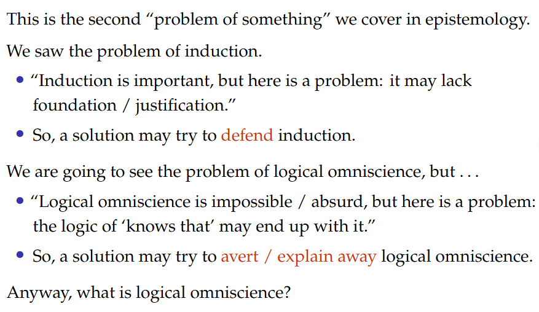

这段文字讨论了**逻辑全知问题（problem of logical omniscience）**，并将其与**归纳问题（problem of induction）**作了对比。这两个问题都是知识论（epistemology）中常见的“某种问题”。

以下是逐句的解释：

1. **归纳问题**：
   - **归纳的重要性**：归纳推理是非常重要的，因为它帮助我们从有限的观察中得出一般性结论。
   - **归纳的问题**：归纳推理可能缺乏坚实的基础或正当性。换句话说，我们没有充分的理由相信归纳推理永远是可靠的。
   - **可能的解决方案**：针对归纳问题的一个解决方案是为归纳进行辩护（defend induction），也就是说，试图找到合理的理由来证明归纳推理的可靠性。

2. **逻辑全知问题**：
   - **逻辑全知的不可能性**：逻辑全知是指假设一个人知道所有可能的推论，即如果一个人知道某些前提，就能推导出所有相关的结论。然而，这在实际中是不可能的或荒谬的，因为没有人可以知道所有的推论。
   - **逻辑全知的问题**：尽管逻辑全知是不现实的，某些知识逻辑（如“知道”运算符的逻辑）可能会引入逻辑全知的假设，即假设一个人知道所有从已知信息中推导出来的结论。
   - **可能的解决方案**：针对逻辑全知问题的解决方案可能是回避或解释逻辑全知的假设，以使知识逻辑更符合实际情况。

3. **逻辑全知的定义**：
   - 最后一句提到“什么是逻辑全知？”，表明接下来将详细解释这个概念。

### 总结
这段文字指出，归纳问题和逻辑全知问题都是知识论中的难题。归纳问题在于缺乏基础，而逻辑全知问题在于假设人们能够推导出所有可能的结论，这是不现实的。解决这些问题的方法分别是为归纳辩护，或者回避和解释逻辑全知的假设。逻辑全知问题的讨论提醒我们，在知识逻辑中，假设人们“全知”是不合理的。

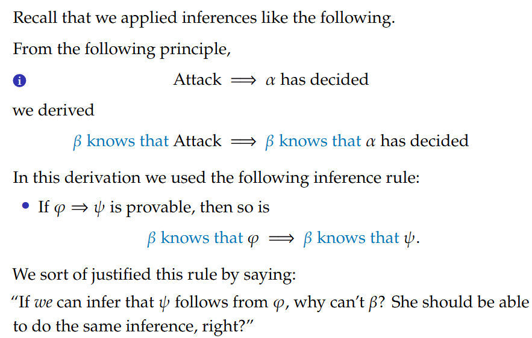

这段文字解释了推理规则在“协调攻击问题”中的应用，特别是如何利用这些规则来推导知识状态，并探讨了这种推理的合理性。

以下是逐步解释：

1. **推理过程的回顾**：
   - 在之前的推理中，我们使用了一个原理：
     - 如果“攻击”成立，那么意味着“α 已经决定攻击”。
   - 从这个原理，我们推导出：
     - 如果“β 知道要攻击”，那么“β 知道 α 已经决定攻击”。

2. **推理规则的使用**：
   - 在上述推导中，我们应用了一个推理规则：
     - **如果 φ ⇒ ψ 是可证明的**，那么“**β 知道 φ** ⇒ **β 知道 ψ**”也是成立的。
   - 换句话说，如果我们可以从 φ 推导出 ψ，那么 β 也应该能够从“知道 φ”推导出“知道 ψ”。

3. **对规则的解释**：
   - 为了合理化这个规则，作者提供了一种直观的解释：
     - “如果我们能从 φ 推导出 ψ，那为什么 β 不能呢？她也应该能够做出相同的推理，对吧？”
   - 这种解释基于一个假设，即 β 拥有足够的推理能力，可以从已知的事实（如“知道 φ”）中推导出进一步的知识（如“知道 ψ”）。

### 总结
这段文字讨论了在知识推理中的一种推理规则：如果一个命题 φ 可以推导出另一个命题 ψ，那么知道 φ 的人也应该能够推导出 ψ。这种推理规则在“协调攻击问题”中被应用，用于帮助 β 推断 α 的决定。作者通过一种直观的解释为这一推理提供合理性，即如果我们能够进行这种推理，那么 β 也应该能够完成同样的推理。这涉及到**逻辑全知问题**中的假设，即代理人能够进行复杂的推理来获得进一步的知识。

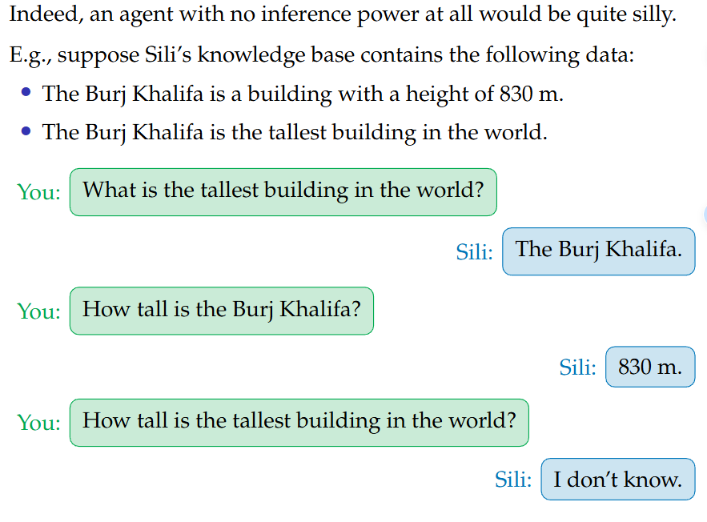

这段对话展示了**逻辑推理能力**在知识系统中的重要性。通过一个名叫 “Sili” 的虚构智能助手的例子，说明了一个缺乏推理能力的代理会显得非常“愚蠢”。

以下是逐步解释：

1. **Sili 的知识库**：
   - Sili 已经知道以下两条信息：
     - 哈利法塔（Burj Khalifa）是一座高度为 830 米的建筑。
     - 哈利法塔是世界上最高的建筑。

2. **对话内容**：
   - 用户首先问 “世界上最高的建筑是什么？”，Sili 正确回答 “哈利法塔”。
   - 用户接着问 “哈利法塔有多高？”，Sili 也正确回答 “830 米”。
   - 最后，用户问 “世界上最高的建筑有多高？”，但 Sili 却回答 “我不知道”。

3. **问题的核心**：
   - Sili 已经具备了所有必要的信息，即：
     - 哈利法塔是世界上最高的建筑。
     - 哈利法塔的高度是 830 米。
   - 但是，由于缺乏推理能力，Sili 无法将这两条信息联系起来，从而无法回答“世界上最高的建筑有多高”的问题。
   - 一个有推理能力的系统应当能够将这两条信息综合得出结论：“世界上最高的建筑（哈利法塔）的高度是 830 米”。

4. **逻辑推理能力的重要性**：
   - 这个例子展示了逻辑推理的必要性：代理人不仅要存储知识，还需要能够进行推理，以将已知信息联系起来。
   - 没有推理能力的系统即使具备所有必要的信息，也无法做出简单的结论，从而显得“愚蠢”。

### 总结
这个例子强调了在知识系统中，逻辑推理的重要性。Sili 的回答揭示了一个没有推理能力的代理的局限性，即使拥有所有相关信息，也无法回答一个基于这些信息的合理问题。这也说明了在知识论中，如何赋予代理人推理能力，以便他们能够将已知信息进行关联，是设计智能系统的关键。

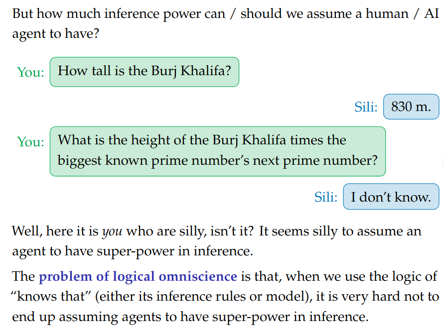

这段文字探讨了我们应当赋予人类或人工智能代理多大的推理能力，同时解释了**逻辑全知问题**。以下是具体解释：

1. **对话内容**：
   - 用户首先问 Sili “哈利法塔有多高？”，Sili 正确地回答“830 米”。
   - 然后，用户问了一个非常复杂的问题：“哈利法塔的高度乘以已知最大质数的下一个质数是多少？” Sili 回答“我不知道”。
   
2. **推理能力的假设问题**：
   - 这里，文字指出其实是用户的提问不合理，因为假设 Sili 能够立即回答这样复杂的推理问题是很荒谬的。
   - 假设代理人具备“超级推理能力”是不现实的，因为代理人并不能在瞬间进行复杂的数学运算或推理。

3. **逻辑全知问题**：
   - **逻辑全知问题**指的是，当我们在知识逻辑中使用“知道”这一逻辑运算时，可能会隐含地假设代理人拥有无所不知的推理能力，即能够推导出任何可能的结论。
   - 这种假设不合理，因为人类和 AI 的推理能力有限，不可能在瞬间得出所有复杂结论。

4. **结论**：
   - 期望一个代理人拥有超强的推理能力是不合理的，因为这会导致我们认为他们可以立即解答所有复杂问题，这显然不切实际。
   - 逻辑全知问题提醒我们：在设计知识系统时，我们需要考虑到代理人推理能力的局限性，不要不切实际地期望他们能“全知”。

### 总结
这段话通过 Sili 的例子，说明逻辑全知问题的核心：假设代理人能立即完成所有可能的推理是荒谬的。代理人推理能力有限，因此在设计知识系统时，我们需要合理设定他们的推理能力，避免不切实际的期望。

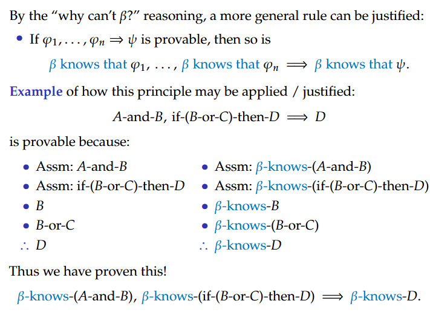

这段文字阐述了一种推理规则的应用，目的是证明代理人 β 能够通过自己的知识推导出某个结论。该推理规则可以被理解为“如果某些前提能够证明一个结论，那么代理人 β 知道所有前提时，应该也能够得出该结论”。这被称为“为什么 β 不能？”（"why can't β?"）的推理。

以下是逐步解释：

1. 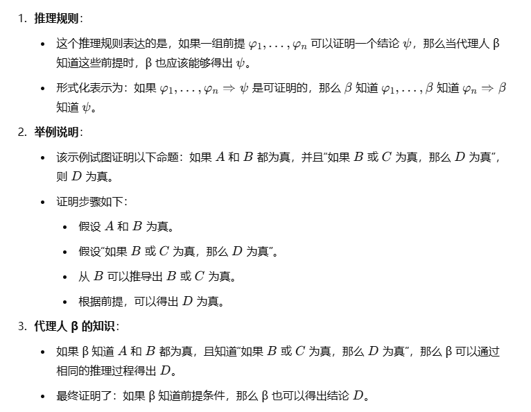
   
4. **总结**：
   - 通过这个例子，证明了推理规则的有效性：如果一个结论可以通过一组前提推导出来，那么当代理人 β 知道所有前提时，β 也能够得出该结论。

这个规则的背后是逻辑全知的假设，即代理人 β 能够进行复杂的推理，只要前提都在 β 的知识范围内。

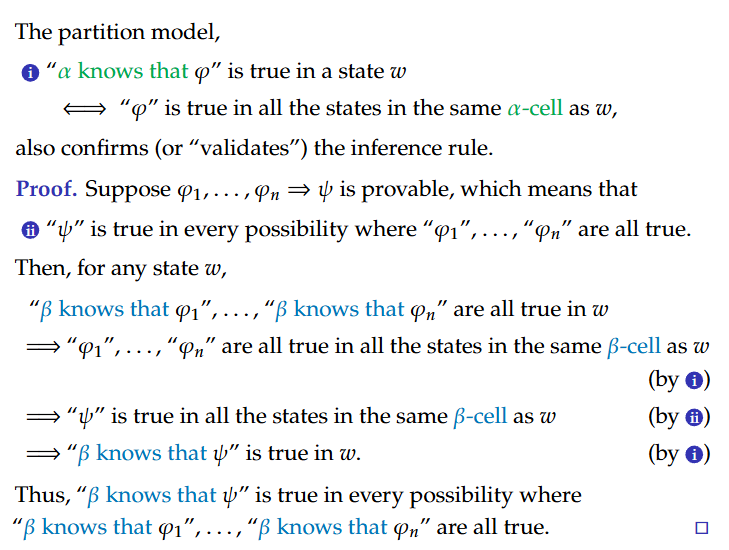

1. - 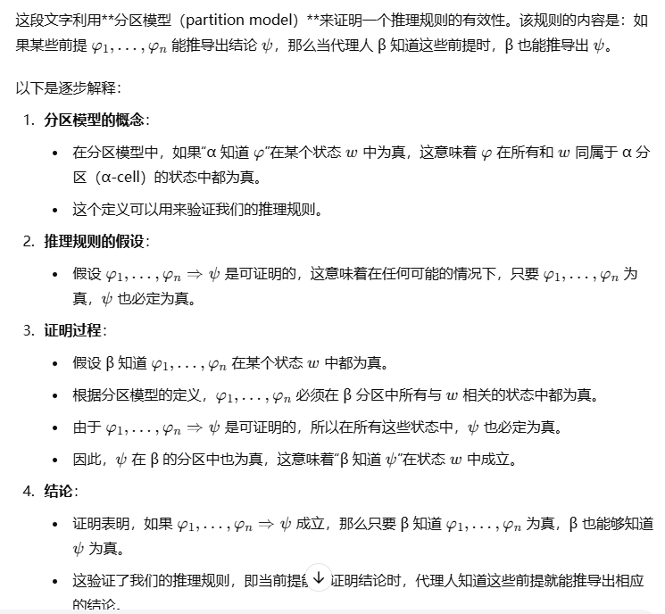

### 总结
通过分区模型的分析，这段文字证明了一个推理规则的有效性：在所有相关状态中，如果前提成立且能推出结论，那么代理人 β 知道前提也意味着 β 能够得出该结论。这一规则在知识推理和逻辑全知问题的讨论中非常重要，因为它描述了代理人如何在分区模型中运用已有知识推导新结论的方式。

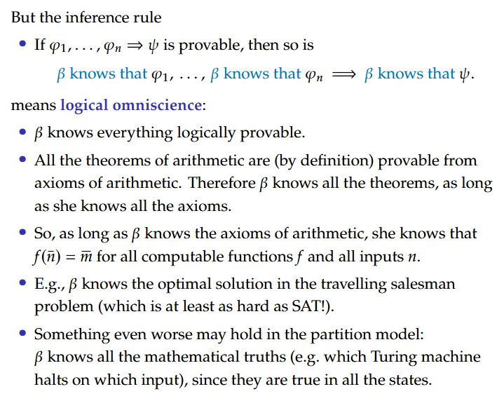

这段文字讨论了**逻辑全知问题（logical omniscience problem）**，以及推理规则在知识推理中带来的不现实假设。具体而言，如果我们假设代理人 β 可以应用特定的推理规则，就会导致 β 知道所有逻辑上可以证明的真理，这是一种不切实际的假设。

以下是逐步解释：

1. **推理规则的含义**：
   - 该推理规则指出，如果 \( \varphi_1, \ldots, \varphi_n \Rightarrow \psi \) 是可证明的，那么“β 知道 \( \varphi_1 \)，…，β 知道 \( \varphi_n \)”也可以推出“β 知道 \( \psi \)”。
   - 然而，这样的规则隐含了逻辑全知的问题，因为它假设 β 能够知道一切逻辑上可推导的真理。

2. **逻辑全知的含义**：
   - **逻辑全知**意味着 β 能知道所有的逻辑真理，只要它们是可以从基本公理中推导出来的。
   - 例如，在算术中，所有定理都是由算术的公理推导出来的。因此，如果 β 知道所有的公理，她就知道所有算术定理。

3. **不切实际的后果**：
   - 假设 β 拥有逻辑全知会导致一些不现实的推论：
     - β 可以知道任何可计算函数 \( f \) 在任意输入 \( n \) 上的结果，因为这是可证明的。
     - β 能够知道复杂的计算问题（如旅行商问题的最优解），尽管这些问题的计算难度极高（至少达到 SAT 问题的难度）。
     - 更极端的是，在分区模型中，这意味着 β 可以知道所有数学真理（例如，某台图灵机在特定输入下是否停机），因为这些真理在所有状态下都是成立的。

4. **结论**：
   - 逻辑全知假设是不现实的，因为它假设代理人可以瞬间推导出所有可能的真理，甚至包括复杂的计算问题和数学难题。
   - 因此，这种推理规则在实际应用中存在局限性，我们不应假设代理人具备这样的“超强推理能力”。

### 总结
这段文字说明了推理规则导致的逻辑全知问题，即假设代理人 β 能够推导出所有逻辑真理。这种假设过于理想化，因为它暗示 β 可以知道所有数学和计算上的真理，这是不现实的。逻辑全知问题提醒我们，在设计知识系统和推理模型时，需要避免这种不切实际的全知假设。

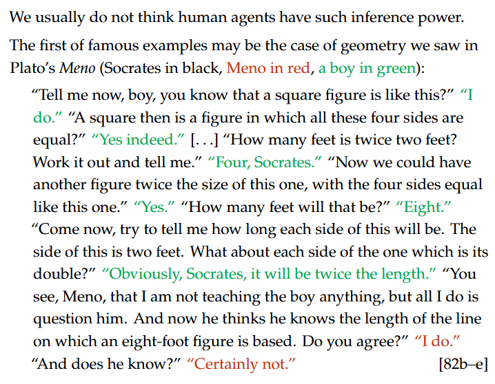

这段文字引用了柏拉图的《美诺篇》（*Meno*）中的一个著名对话，用来讨论**推理能力的限制**，并举例说明人类并不具备“逻辑全知”或无限推理能力。

### 对话内容：
- 在这个对话中，苏格拉底（以黑色字体显示）和一个男孩（以绿色字体显示）进行了一场关于几何的讨论，美诺（以红色字体显示）在旁边观察。
- 苏格拉底引导男孩思考一个关于正方形的几何问题，男孩回答了一些基础问题。
  - 首先，苏格拉底确认男孩知道什么是正方形，以及四边相等的特性。
  - 然后，苏格拉底提出一个问题：如果边长为 2 英尺的正方形面积为 4 平方英尺，那么如果构造一个面积为 8 平方英尺的正方形，边长应该是多少？
  - 男孩很快回答边长会“翻倍”，即边长应为 4 英尺，得出答案是 8。

### 解释：
- 通过这个对话，苏格拉底向美诺展示了**人类推理的局限性**。苏格拉底引导男孩推导出结论，但并没有直接教他，只是通过问题引发他的思考。
- 但最终，美诺和苏格拉底都承认，男孩实际上并不知道问题的正确答案，只是在简单推理的基础上得出错误结论。实际上，面积为 8 平方英尺的正方形的边长应为大约 2.83 英尺（即 \(\sqrt{8}\) 英尺），而不是 4 英尺。

### 结论：
- 这个对话说明了人类并不具备无限推理能力或“逻辑全知”。
- 男孩在简单推理的基础上做出错误结论，这表明我们在推理中可能会缺乏对复杂情况的理解。
- 柏拉图通过这一对话向读者展示了，尽管人们可能拥有一些基本知识，但在没有深入理解的情况下，推理很容易出错。

### 总结
这段引用展示了苏格拉底通过提问的方式，引导男孩做出推理，但这也暴露了人类推理的局限性。人类并非逻辑全知，且容易在复杂推理中出错。这个例子与“逻辑全知问题”相关，提醒我们在知识推理时不要假设人类或代理人具备无限推理能力。

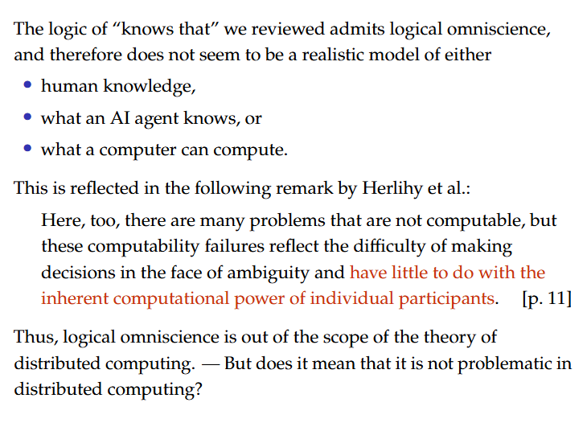

这段文字引用了柏拉图的《美诺篇》（*Meno*）中的一个著名对话，用来讨论**推理能力的限制**，并举例说明人类并不具备“逻辑全知”或无限推理能力。

### 对话内容：
- 在这个对话中，苏格拉底（以黑色字体显示）和一个男孩（以绿色字体显示）进行了一场关于几何的讨论，美诺（以红色字体显示）在旁边观察。
- 苏格拉底引导男孩思考一个关于正方形的几何问题，男孩回答了一些基础问题。
  - 首先，苏格拉底确认男孩知道什么是正方形，以及四边相等的特性。
  - 然后，苏格拉底提出一个问题：如果边长为 2 英尺的正方形面积为 4 平方英尺，那么如果构造一个面积为 8 平方英尺的正方形，边长应该是多少？
  - 男孩很快回答边长会“翻倍”，即边长应为 4 英尺，得出答案是 8。

### 解释：
- 通过这个对话，苏格拉底向美诺展示了**人类推理的局限性**。苏格拉底引导男孩推导出结论，但并没有直接教他，只是通过问题引发他的思考。
- 但最终，美诺和苏格拉底都承认，男孩实际上并不知道问题的正确答案，只是在简单推理的基础上得出错误结论。实际上，面积为 8 平方英尺的正方形的边长应为大约 2.83 英尺（即 \(\sqrt{8}\) 英尺），而不是 4 英尺。

### 结论：
- 这个对话说明了人类并不具备无限推理能力或“逻辑全知”。
- 男孩在简单推理的基础上做出错误结论，这表明我们在推理中可能会缺乏对复杂情况的理解。
- 柏拉图通过这一对话向读者展示了，尽管人们可能拥有一些基本知识，但在没有深入理解的情况下，推理很容易出错。

### 总结
这段引用展示了苏格拉底通过提问的方式，引导男孩做出推理，但这也暴露了人类推理的局限性。人类并非逻辑全知，且容易在复杂推理中出错。这个例子与“逻辑全知问题”相关，提醒我们在知识推理时不要假设人类或代理人具备无限推理能力。

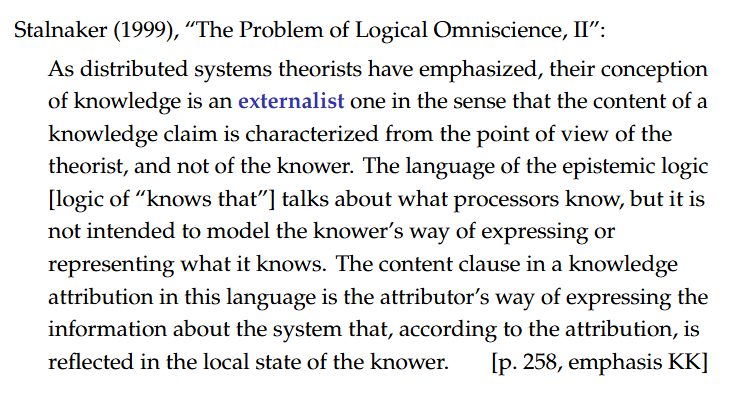

这段文字引用了 Stalnaker 在 1999 年的著作《逻辑全知问题 II》（*The Problem of Logical Omniscience, II*），讨论了**分布式系统中的知识观**，特别是“外在主义”（externalist）视角在知识归属中的作用。

以下是逐步解释：

1. **知识的外在主义观点**：
   - 在分布式系统理论中，知识的概念是从“外在主义”视角来定义的。**外在主义**意味着知识的内容是从理论家（观察者）的角度来定义的，而不是从“知道者”（知识持有者）的角度出发。
   - 也就是说，知识的定义是基于外部观察的，而不是考虑知道者自身如何表达或理解其知识。

2. **认知逻辑的语言**：
   - 这里提到了“知道”逻辑（epistemic logic），即“知道某事”的逻辑语言。这种逻辑关注的是系统中的进程“知道什么”，而不是试图模拟知道者如何表达或呈现其知识。
   - 也就是说，这种语言描述了一个外部观察者如何归属知识，而不是知道者本身的视角。

3. **知识归属中的内容条款**：
   - 在这种语言中，知识归属中的“内容条款”是由观察者（归属者）来表达的，即是由理论家描述系统中某个进程的知识状态，而不是让知道者本身去表达。
   - 因此，当归属者描述一个进程的知识时，这种描述反映了在归属者的观察下，该进程的“局部状态”所能反映的知识，而不是该进程如何感知或理解自己的知识。

### 总结
Stalnaker 通过这段话解释了在分布式系统中，知识的归属是通过外在主义的角度来理解的，即从外部观察者的视角去定义进程“知道什么”，而不是从进程本身的视角去理解它的知识。这种方法可以帮助我们从整体上理解系统中的知识分布，而不需要考虑每个进程如何主观地表达或体验其知识状态。这种外在主义的知识观在分布式系统理论中被广泛采用，因为它可以更方便地分析和归属系统中的知识状态。

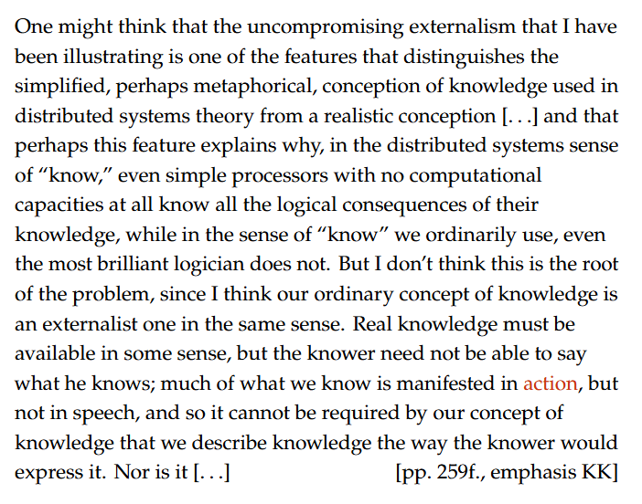

这段文字进一步讨论了**分布式系统中的外在主义知识观**，并探讨了这种知识观与我们日常概念中的“知识”之间的区别。作者指出，分布式系统理论中的知识概念更具“简化”或“隐喻”性质，与实际生活中更现实的知识概念有所不同。

以下是逐步解释：

1. **分布式系统中的知识观**：
   - 作者提到，分布式系统中的“外在主义”知识观是一种简化的、可能带有隐喻性质的知识概念。这种知识观不同于我们日常生活中的现实知识概念。
   - 在分布式系统中，甚至那些没有计算能力的简单处理器都被视为“知道”其知识的所有逻辑后果，尽管我们通常不认为人类（即使是最聪明的逻辑学家）可以做到这一点。

2. **与日常“知道”概念的对比**：
   - 在日常生活中，我们所说的“知道”并不意味着必须知道所有可能的逻辑后果。即使是最优秀的逻辑学家，也不可能知道所有关于知识的推论。
   - 这表明分布式系统中的“知道”是一种更抽象的定义，而不代表真正的理解或意识。

3. **作者的观点**：
   - 尽管分布式系统中的“知道”概念似乎与我们普通的知识观有所不同，但作者并不认为这是问题的根源。
   - 作者认为，实际上我们的日常知识观也是一种外在主义的知识观。换句话说，知识是存在的，但知道者并不需要能够明确地表达或说出他所知道的内容。

4. **知识的表现形式**：
   - 作者指出，许多知识体现在**行动**中，而不是通过语言表达出来的。因此，我们不需要要求知识的表达必须与知道者的主观意识相符。
   - 这意味着知识可以存在于行为中，而不是仅仅体现在言语上。这也解释了为何在分布式系统中，知识的定义不需要处理器或参与者具备主观的理解能力。

### 总结
这段文字探讨了分布式系统中知识的外在主义视角，即知识是基于观察者的定义，而不是基于主体的主观意识。尽管这种“知道”概念在分布式系统中更具隐喻性和抽象性，但作者认为这与我们日常知识观并无本质差异，因为现实中的知识很多是通过行动来表现，而不是通过语言表达的。这段话强调了在分布式系统中理解知识的方式以及与日常概念的联系与差异。

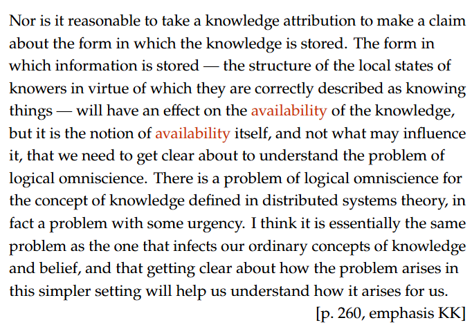

这段文字探讨了**逻辑全知问题（logical omniscience problem）**，特别是在分布式系统中的知识概念如何引发该问题。作者认为，要理解逻辑全知问题，关键在于明确知识的**可用性（availability）**概念，而不是知识的存储形式或影响它的因素。

以下是逐步解释：

1. **知识的归属与存储形式**：
   - 作者指出，知识归属的概念并不一定意味着我们要对知识的存储形式进行说明。也就是说，知道某人“知道某件事”并不要求我们了解他们具体如何存储或组织这方面的信息。
   - 信息的存储形式，即知道者的“局部状态结构”，确实会影响知识的可用性，但这只是间接因素。换句话说，存储的结构可能影响一个人如何利用和获取知识，但本质上知识的可用性才是我们需要关注的核心。

2. **可用性的概念**：
   - **可用性**在这里指的是知识是否能够被访问和利用，而不是它的存储方式。
   - 要理解逻辑全知问题，需要明确可用性，而不是去探讨影响可用性的各种存储或结构性因素。

3. **逻辑全知问题的紧迫性**：
   - 在分布式系统的知识定义中，确实存在一个**逻辑全知问题**，而且这是一个需要认真对待的问题。
   - 逻辑全知问题指的是：如果某个主体知道某些前提，那么它也应该知道所有从这些前提推导出来的结论。然而，在现实中，这样的推理要求不合理，因为它假设了过于强大的推理能力。

4. **日常知识概念中的问题**：
   - 作者认为，分布式系统中的逻辑全知问题与日常生活中关于知识和信念的概念也存在相似的问题。这意味着逻辑全知不仅是分布式系统的问题，也影响我们对知识的普遍理解。
   - 因此，通过在分布式系统这一较为简单的场景中分析逻辑全知问题，可以帮助我们更好地理解在日常知识观中出现的类似问题。

### 总结
这段文字强调了在分布式系统中，逻辑全知问题与知识的**可用性**密切相关，而不在于知识的存储形式。作者指出，这一问题在日常生活中的知识概念中也普遍存在，因此，通过在分布式系统中探讨这一问题，有助于我们更深入地理解和处理逻辑全知问题。

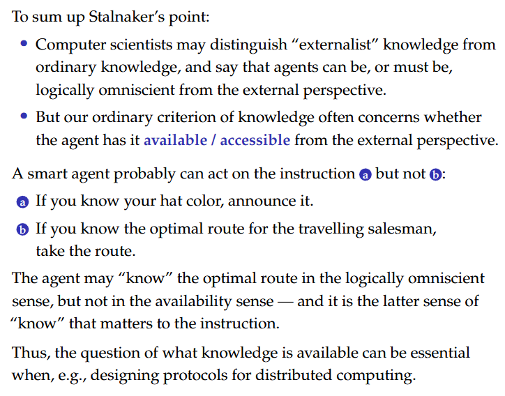

这段文字总结了 Stalnaker 的观点，特别是关于分布式系统中知识的“外在主义”视角与日常知识概念的区别。主要探讨了知识的**可用性（availability）**在分布式系统中的重要性。

以下是逐步解释：

1. **外在主义知识与逻辑全知**：
   - 计算机科学家将“外在主义”知识与普通知识区分开来，认为代理人可以或必须从外在的角度达到逻辑全知的状态。这意味着，从观察者的角度来看，代理人拥有所有相关的知识推论。
   - 但是，日常的知识标准通常关注代理人是否能够“获得”或“访问”这些知识，而不仅仅是从外在角度来看它们是否拥有知识。

2. **可用性与可访问性**：
   - 在日常情况下，我们更关注知识是否对代理人**可用**或**可访问**，而不仅仅是代理人是否在外在意义上“知道”。
   - 换句话说，即便代理人“逻辑全知”，如果这些知识对其不可用，那么它仍然无法采取行动。

3. **例子：指令的可执行性**：
   - 给代理人的两个指令：
     - (a) 如果你知道你的帽子颜色，请宣布。
     - (b) 如果你知道旅行商问题的最优路线，请采取该路线。
   - 对于指令 (a)，一个智能代理很可能能够执行，因为帽子颜色的信息是直接可用的。
   - 但对于指令 (b)，即使代理人在逻辑上“知道”旅行商问题的最优解，若该知识不可用或无法实际获得，那么代理人无法执行指令。

4. **知识的可用性对于分布式计算的意义**：
   - 代理人是否能执行某个指令，取决于知识的可用性，而不仅仅是从外在角度是否“知道”。
   - 在分布式计算中，设计协议时，了解哪些知识对代理人是可用的非常重要，因为这决定了代理人能否有效执行任务。

### 总结
这段文字强调了在分布式系统中知识的“可用性”概念的重要性。虽然代理人可能在逻辑上“知道”所有可推导的真理，但是否能实际获得这些知识对任务执行更为关键。在设计分布式系统协议时，必须考虑代理人实际可用的知识，而不仅仅是理论上的“逻辑全知”。

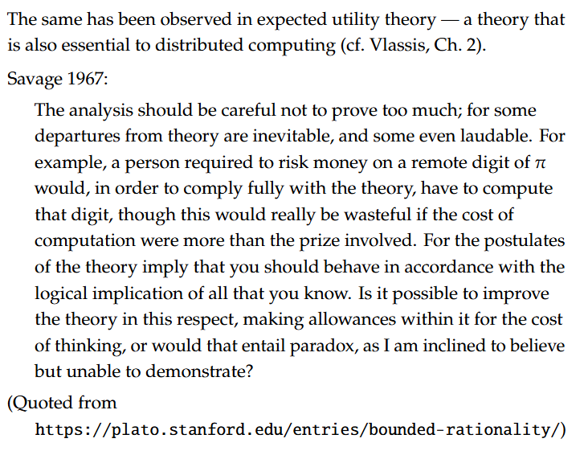

这段文字引用了 Savage 在 1967 年对**期望效用理论（expected utility theory）**的批评，并指出了理论在实际应用中的局限性。这种批评也适用于分布式计算中的一些情况，尤其是关于在有限资源下做出理性决策的问题。

以下是逐步解释：

1. **谨慎对待理论的适用性**：
   - Savage 认为，在实际情况中，有些偏离理论的做法是不可避免的，甚至是有益的。
   - 理论的严格适用在某些情况下反而可能不合理，尤其是当理论要求的计算或推理过程比实际收益更高时。

2. **示例：π 的远位数字**：
   - Savage 给出了一个示例：假设有人需要根据 π 的一个远位数字来决定是否投注。如果严格遵循理论，个人需要计算该位数字，但这可能是浪费时间的，因为计算的成本可能远远超过潜在的收益。
   - 这个例子展示了如果理论要求人们基于“所有已知的逻辑推论”来行事，可能会导致不合理的计算负担。

3. **对理论改进的思考**：
   - Savage 提出一个问题：是否可以改进理论，使其在考虑“思维成本”的情况下仍然有效？
   - 他怀疑这样做是否会导致理论上的悖论。也就是说，如果我们允许理论考虑计算成本，那么理论可能无法自洽。

4. **与分布式计算的关系**：
   - 期望效用理论的这种局限性同样适用于分布式计算中的决策问题。在分布式系统中，代理人也面临着资源（如时间和计算能力）的限制，因此并不能总是遵循所有逻辑推论来得出“最佳”决策。

### 总结
这段话揭示了期望效用理论和分布式计算中的一个共同问题：在有限资源下做出完全理性的决策是不现实的。理论上的严格推论可能会导致不合理的计算负担。因此，考虑资源和计算成本的限制，对理论的应用进行适当的简化或偏离可能是必要的。这种对理论应用的反思在分布式计算和决策理论中都很重要。

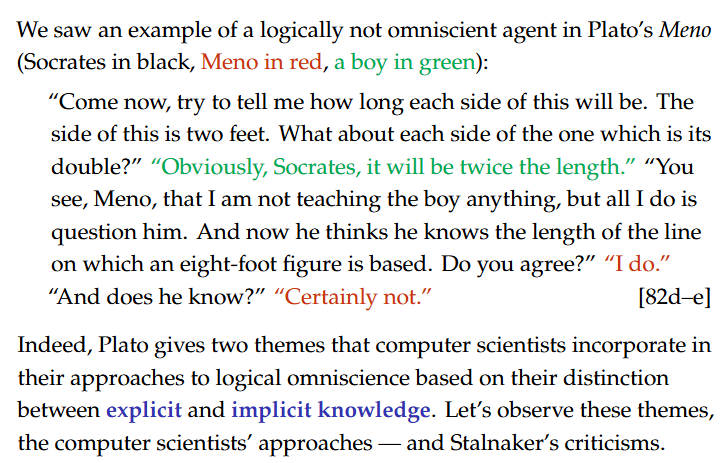

这段文字讨论了柏拉图在《美诺篇》中的一个例子，通过苏格拉底与男孩的对话展示了一个**逻辑上非全知的代理**，并引出了计算机科学中关于显性知识（explicit knowledge）和隐性知识（implicit knowledge）的主题。

以下是逐步解释：

1. **《美诺篇》中的例子**：
   - 在柏拉图的对话中，苏格拉底引导一个男孩进行推理，尝试让他理解几何知识。
   - 苏格拉底提问男孩，如果一个正方形的边长是 2 英尺，那么边长加倍会得到多大的正方形。男孩回答“长度会加倍”（即边长为 4 英尺），但实际上他错误地认为这会导致面积也加倍，而真正的面积应为 8 平方英尺的正方形边长约为 2.83 英尺（即 \(\sqrt{8}\) 英尺）。
   - 苏格拉底指出，男孩并未真正理解几何知识，即使他觉得自己知道答案。

2. **逻辑非全知的例子**：
   - 男孩的推理表明他并不是逻辑上全知的，即他没有掌握所有逻辑推论所需的知识或能力。虽然他拥有一些几何知识，但缺乏深入的理解。
   - 这个例子说明了人类的知识往往是不完全的，即使我们有一些信息，也未必能得出所有相关的推论。

3. **计算机科学中的启示**：
   - 柏拉图的这个例子启发了计算机科学家去思考显性知识和隐性知识之间的区别。
   - **显性知识**是明确表达、存储或获得的信息，而**隐性知识**则是没有明确表达或需要通过推理才能得出的信息。
   - 计算机科学在处理逻辑全知问题时，往往通过区分显性和隐性知识，避免要求系统具备所有逻辑后果的知识（即避免逻辑全知假设）。

4. **Stalnaker 的批评**：
   - Stalnaker 对逻辑全知问题的批评在于，计算机科学的处理方法可能无法充分反映现实中的知识状态。柏拉图的例子提供了对这些主题的经典理解，计算机科学家可以从中获取灵感，并认识到显性和隐性知识的重要性。

### 总结
这段文字通过柏拉图的《美诺篇》中的例子，展示了一个逻辑上非全知的案例，并引出了计算机科学中显性知识和隐性知识的概念。计算机科学家在处理逻辑全知问题时，通过区分显性和隐性知识，试图避免不切实际的逻辑全知假设。柏拉图的这个经典例子提醒我们，真实的知识体系中总是存在未知和不确定，无法通过简单的推理得出所有结论。

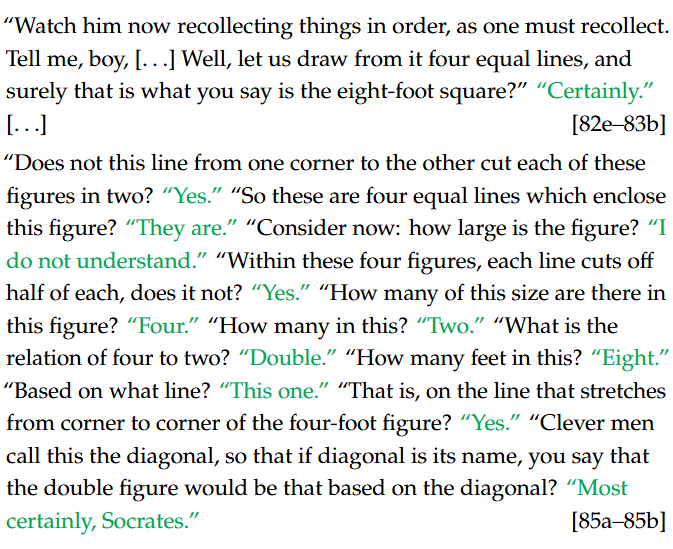

这段文字是柏拉图《美诺篇》中的一段对话，苏格拉底引导一个男孩通过几何推理来理解一个面积为 8 平方英尺的正方形的构造方式。通过这个过程，苏格拉底试图展示**知识的回忆过程**以及**逻辑推理的限制**。

以下是对话的逐步解释：

1. **绘制和观察**：
   - 苏格拉底让男孩观察四条相等的线，并称之为一个“八平方英尺的正方形”。男孩确认这确实是一个八平方英尺的正方形。

2. **对角线的讨论**：
   - 苏格拉底进一步提问男孩，从对角线将正方形分为两部分。通过这个分割，每一部分都是相等的。苏格拉底带领男孩观察这些分割出的四个区域，并确认它们是相等的。

3. **推理过程**：
   - 苏格拉底带领男孩一步步推理，通过对“二对二的关系是加倍的”这一逻辑的理解，最终得出面积为 8 的正方形的边应当是原正方形对角线的长度，而不是简单地加倍边长。
   - 在对角线的概念下，男孩理解了如果将正方形的边长度翻倍，面积并不是简单地加倍，而是基于对角线形成新的边长。

4. **得出结论**：
   - 苏格拉底让男孩意识到，面积加倍的正方形的边长实际上是基于原正方形的对角线，而不是直接通过边长加倍得出。
   - 最后，男孩认可了这个结论。

### 总结
通过这段对话，苏格拉底引导男孩重新思考“加倍”这个概念，并得出面积为 8 的正方形的边长是原正方形对角线的长度。这个对话展示了人类推理的过程和逻辑非全知的特点。即使一个人拥有一些基础知识，他们仍然需要通过指导来理解更复杂的推论。在分布式计算或知识论中，这个例子表明人们的理解和推理常常依赖外部引导，而不是先天的全知全能。

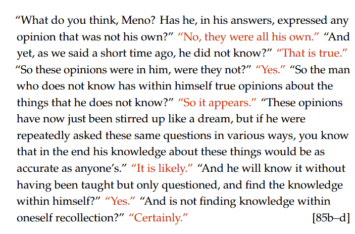

这段对话是柏拉图《美诺篇》中的内容，苏格拉底和美诺讨论了**知识和回忆的关系**。苏格拉底通过引导男孩得出几何结论，进一步解释了他的**“回忆论”（Theory of Recollection）**。

以下是逐步解释：

1. **苏格拉底的问题**：
   - 苏格拉底问美诺，男孩在回答中是否表达了属于他自己的观点。美诺回答说：“是的，都是他自己的观点。”
   - 但同时，美诺也承认，男孩在一开始并不知道这些几何知识。

2. **真意见的存在**：
   - 苏格拉底指出，这些“真意见”实际上已经存在于男孩心中，尽管他在一开始并不知道它们。
   - 也就是说，一个人即使表面上不知道某些事物的答案，但内心深处可能已经拥有这些“真意见”或正确的观念。

3. **知识的唤醒**：
   - 苏格拉底用“像做梦一样被唤醒”来形容男孩的学习过程。通过提问和引导，男孩的潜在知识被激活并显现出来。
   - 苏格拉底进一步解释，如果男孩反复被问到类似的问题，他最终对这些知识的理解会和任何人一样精确。

4. **回忆与知识的获取**：
   - 苏格拉底提出，这种知识的获取不是通过教授而是通过“提问”来实现的，这说明知识本来就在男孩心中，只是被提问引导出来。
   - 最后，美诺承认，这种“发现内心中的知识”即是“回忆”。

### 总结
苏格拉底通过这段对话向美诺展示了“回忆论”的核心：知识是内在的，只需通过适当的提问和引导来唤醒。即使一个人表面上不知道某些事物的答案，但在内心深处可能已有“真意见”，只需要被“回忆”出来。这段话强调了知识的内在性和通过自我反思或引导唤醒知识的可能性，这也是苏格拉底教学法的一部分。

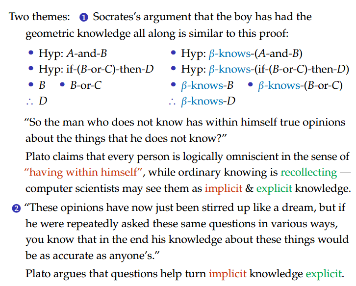

这段文字探讨了柏拉图《美诺篇》中的主题，并将苏格拉底的回忆论与计算机科学中的**显性知识和隐性知识**概念联系起来。文字从两个主题出发，阐述了柏拉图和苏格拉底关于知识的观点，以及计算机科学家如何将这些观点转化为知识表示的模型。

### 两个主题的解释：

1. **苏格拉底的论点与逻辑证明的相似性**：
   - 苏格拉底认为男孩一直都拥有几何知识，但这种知识是潜在的，只需通过提问引导出来。这一观点类似于逻辑证明。
   - 左侧的推理步骤展示了一般的逻辑推理过程：假设 \( A \land B \) 和 “如果 \( B \lor C \) 则 \( D \)”为真，通过逐步推导，最终可以证明 \( D \) 为真。
   - 右侧则展示了类似的过程，但在此过程中加入了“知识”的概念：代理人 \( \beta \) 知道 \( A \land B \) 和 “如果 \( B \lor C \) 则 \( D \)”，从而得出“\( \beta \) 知道 \( D \)”的结论。
   - 这个证明表明：即使知识尚未显现出来，通过提问或推理可以逐渐引导代理人获得这些知识。

2. **隐性知识和显性知识的转化**：
   - 柏拉图认为，即使是“未曾知道”的人内心也拥有关于事物的“真意见”，这种“真意见”只需通过问题的引导便可以显现出来。
   - 计算机科学家将此类观点解释为隐性知识（implicit knowledge）和显性知识（explicit knowledge）。隐性知识是潜在的知识，而显性知识是可以表达或获取的知识。
   - 通过不断地提问和引导，可以将一个人的隐性知识转化为显性知识。

### 关键引用和总结：
   - 柏拉图声称每个人都拥有“内在的知识”，这种知识通过“回忆”而变得显性化。计算机科学家通过将此类“内在知识”视为隐性知识，通过交互或查询将其显性化。
   - 最后一句话总结了柏拉图的观点：问题和引导可以将隐性知识转化为显性知识。这种观点对知识表示和学习有重要启发，因为它表明即使代理人并非全知全能，通过适当的引导仍可以获得有价值的知识。

### 总结
这段文字结合了柏拉图的哲学观和计算机科学的知识表示，将“回忆”理解为隐性知识的显现过程。苏格拉底通过引导男孩逐渐揭示其内在知识，类似于将隐性知识转化为显性知识。这个观点表明，通过提问可以帮助人们从潜在的知识中推导出明确的理解，对学习和推理过程有重要的启示。

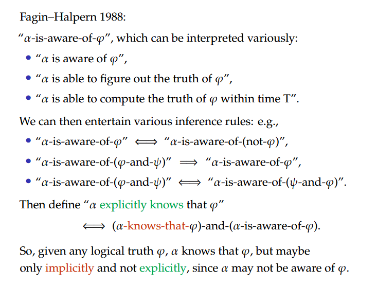

这段文字引用了 Fagin 和 Halpern 在 1988 年的研究，讨论了代理人 \( \alpha \) 对知识的“显性”与“隐性”理解。**“\( \alpha \)-is-aware-of-φ”** 的概念在这里被详细定义，用于区分代理人是否真正意识到某个命题（命题 φ）的含义。

### 逐步解释：

1. **“\( \alpha \)-is-aware-of-φ” 的定义**：
   - 这个表达式可以有多种解释，具体视情况而定，例如：
     - “\( \alpha \) 对 φ 是意识到的”，即 \( \alpha \) 知道 φ 的存在。
     - “\( \alpha \) 能够确定 φ 的真值”，即 \( \alpha \) 可以理解 φ 是否为真。
     - “\( \alpha \) 能够在某个时间 T 内计算出 φ 的真值”，即 \( \alpha \) 在给定时间内可以处理或验证 φ。
   - 这些解释强调了意识到某个命题与真正知道命题之间的不同含义。

2. **推理规则**：
   - 引入了一些推理规则来操作“\( \alpha \)-is-aware-of-φ”：
     - \( \alpha \)-is-aware-of-φ 当且仅当 \( \alpha \)-is-aware-of-(not-φ)，即如果 \( \alpha \) 意识到 φ，那么 \( \alpha \) 也意识到非 φ 的可能性。
     - \( \alpha \)-is-aware-of-(φ-and-ψ) 意味着 \( \alpha \)-is-aware-of-φ，即如果 \( \alpha \) 意识到 φ 和 ψ，那么他也意识到 φ。
     - \( \alpha \)-is-aware-of-(φ-and-ψ) 当且仅当 \( \alpha \)-is-aware-of-(ψ-and-φ)，即 \( \alpha \) 对两个命题的组合是对称的。

3. **显性知识的定义**：
   - 定义了“显性知识”或“\( \alpha \) 显性地知道 φ”：
     - 如果 \( \alpha \) 知道 φ 的真值，并且 \( \alpha \) 对 φ 是意识到的，那么称为“显性知识”。
     - 即 \( \alpha \) 显性知道 φ 的条件是 \( \alpha \) 已经知道 φ 的真值，同时意识到 φ 本身。

4. **隐性和显性知识的区分**：
   - \( \alpha \) 可能在逻辑上知道 φ，但这种知识可能只是隐性的（implicitly），而非显性的（explicitly），因为 \( \alpha \) 并不一定对 φ 有意识。
   - 换句话说，\( \alpha \) 在某种程度上“知道” φ 的真值，但可能并未意识到自己知道该信息。

### 总结
Fagin 和 Halpern 的理论区分了隐性知识和显性知识。即使 \( \alpha \) 在逻辑上知道某个真命题 φ，但如果他并未意识到 φ 的存在或含义，这种知识便是隐性的。显性知识则要求代理人不仅知道 φ 的真值，还要意识到 φ 本身。这种区分在知识理论和分布式系统中具有重要意义，帮助理解不同层次的知识状态。

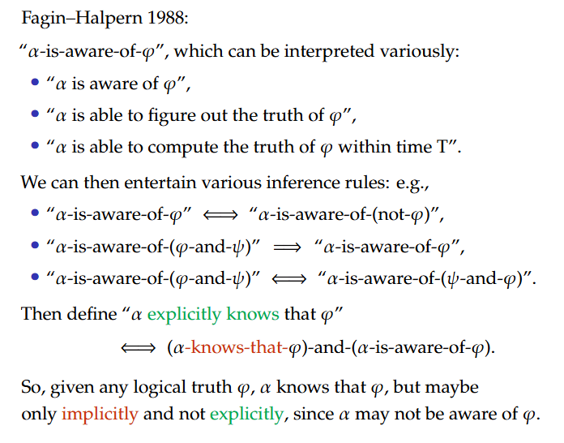

这段文字探讨了 Fagin 和 Halpern 在 1988 年提出的关于“意识到（aware-of）”的概念，并通过推理规则引入了**显性知识（explicit knowledge）**与**隐性知识（implicit knowledge）**的区别。

### 逐步解释：

1. **“\( \alpha \)-is-aware-of-φ” 的定义**：
   - 这里的“\( \alpha \)-is-aware-of-φ”可以有多种解释，包括：
     - \( \alpha \) 对 φ 是“有意识”的，换句话说，\( \alpha \) 知道 φ 的存在。
     - \( \alpha \) 能够确定 φ 的真值，即 \( \alpha \) 可以通过推理或计算得出 φ 是否为真。
     - \( \alpha \) 可以在某个限定时间 \( T' \) 内计算出 φ 的真值。
   - 这些定义都表达了“意识到 φ”并不仅仅是简单的知识，而是需要在某种程度上能够理解、处理或获取 φ 的真值。

2. **推理规则**：
   - 文中提供了一些关于“\( \alpha \)-is-aware-of-φ” 的推理规则：
     - 如果 \( \alpha \) 意识到 φ，那么 \( \alpha \) 也意识到“非 φ”。
     - 如果 \( \alpha \) 意识到 \( \varphi \land \psi \)（φ 和 ψ），那么 \( \alpha \) 也意识到 φ。
     - 如果 \( \alpha \) 意识到 \( \varphi \land \psi \)，则等价于 \( \alpha \) 意识到 \( \psi \land \varphi \)，表明组合命题的对称性。

3. **显性知识的定义**：
   - 这里定义了“显性知识”：如果 \( \alpha \) 显性地知道 φ，意味着两件事同时成立：
     - \( \alpha \) 知道 φ 的真值（即 \( \alpha \)-knows-that-φ）。
     - \( \alpha \) 对 φ 是意识到的（即 \( \alpha \)-is-aware-of-φ）。
   - 换句话说，显性知识不仅需要知道真值，还需要对该知识有意识的理解或可获取性。

4. **隐性知识与显性知识的区别**：
   - 一个代理人可能逻辑上“知道”某个真命题 φ（即它可以从其他知识推理出来），但如果 \( \alpha \) 没有意识到 φ，则这种知识是隐性的。
   - 只有当 \( \alpha \) 知道 φ 并且意识到 φ 时，才称为显性知识。

### 总结
Fagin 和 Halpern 通过定义“意识到”来区分显性和隐性知识。他们指出，即使一个代理人逻辑上知道 φ 的真值，如果没有意识到 φ 的存在，则这种知识只是隐性知识。显性知识则需要代理人对 φ 有意识的理解和获取。

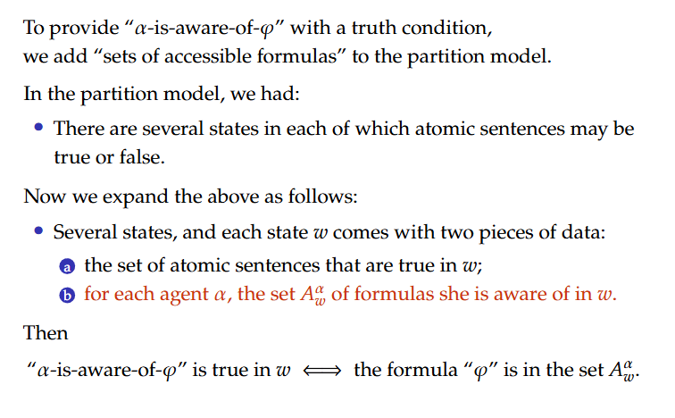

这段文字进一步解释了如何在**分区模型（partition model）**中为“\( \alpha \)-is-aware-of-φ”提供一个**真值条件**，通过引入“可访问公式集合”来扩展分区模型。

### 逐步解释：

1. **分区模型的基本结构**：
   - 在分区模型中，有多个状态，每个状态中的原子命题可能为真或假。也就是说，每个状态表示一种可能的世界情况，在该状态中，某些命题是真，另一些命题是假。

2. **扩展后的分区模型**：
   - 为了引入“\( \alpha \)-is-aware-of-φ”的概念，现在对每个状态 \( w \) 添加两个数据项：
     - **(a)** \( w \) 中为真的原子命题的集合，即在该状态下哪些命题是真实的。
     - **(b)** 对于每个代理 \( \alpha \)，定义一个公式集合 \( A^\alpha_w \)，表示代理 \( \alpha \) 在状态 \( w \) 中“意识到”的所有公式。换句话说，\( A^\alpha_w \) 是 \( \alpha \) 在状态 \( w \) 下可以“访问”或“意识到”的命题集合。

3. **真值条件**：
   - 在状态 \( w \) 下，“\( \alpha \)-is-aware-of-φ” 为真，当且仅当 φ 属于 \( A^\alpha_w \)。即，如果公式 φ 在 \( A^\alpha_w \) 中，则说明 \( \alpha \) 在状态 \( w \) 下意识到 φ。
   - 这就为“意识到”提供了一个明确的真值条件：只有当 φ 在 \( \alpha \) 的意识集合中，它才被认为是“被意识到的”。

### 总结
通过在分区模型中引入可访问公式集合 \( A^\alpha_w \)，这段文字定义了“意识到”的真值条件。即在特定状态 \( w \) 下，若某个公式 φ 属于代理 \( \alpha \) 的意识集合 \( A^\alpha_w \)，则说明 \( \alpha \) 在该状态下“意识到” φ。这种方法使得我们可以精确地描述一个代理在特定状态下所意识到的命题集合，有助于区分代理在逻辑上“知道”的命题和实际“意识到”的命题。

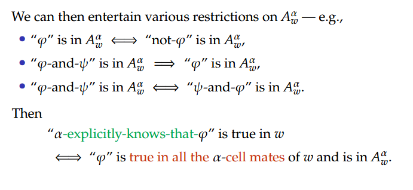

这段文字讨论了在分区模型中，对代理 \( \alpha \) 在特定状态 \( w \) 下“意识到”的公式集合 \( A^\alpha_w \) 施加的一些**限制条件**，并定义了“显性知识”（explicit knowledge）的真值条件。

### 逐步解释：

1. **对 \( A^\alpha_w \) 的限制条件**：
   - 为了描述 \( \alpha \) 所意识到的公式集合 \( A^\alpha_w \)，我们可以施加一些逻辑上的限制。例如：
     - **第一条**：如果 φ 属于 \( A^\alpha_w \)，则非 φ（not-φ）也属于 \( A^\alpha_w \)。这意味着如果 \( \alpha \) 意识到 φ，那么 \( \alpha \) 也应该意识到 φ 的否定。
     - **第二条**：如果 φ 和 ψ 的合取（φ-and-ψ）在 \( A^\alpha_w \) 中，那么 φ 也必须在 \( A^\alpha_w \) 中。这表明如果 \( \alpha \) 意识到 φ 和 ψ 的同时成立，那么他也应该意识到 φ 单独成立。
     - **第三条**：类似地，如果 φ-and-ψ 在 \( A^\alpha_w \) 中，那么 ψ-and-φ 也应该在 \( A^\alpha_w \) 中。这意味着对合取的意识是对称的，即无论顺序如何，代理 \( \alpha \) 都应该意识到相同的内容。

2. **显性知识的定义**：
   - “\( \alpha \)-explicitly-knows-that-φ” 在状态 \( w \) 中为真，若且仅若以下两个条件同时成立：
     - φ 在所有 \( \alpha \) 的“细胞伙伴”（α-cell mates）中都为真。
       - “α-cell mates” 是指与状态 \( w \) 处于同一分区（或细胞）中的状态，即这些状态是 \( \alpha \) 无法区分的。
       - 如果 φ 在所有这些状态中都为真，说明 \( \alpha \) 对 φ 的知识在这些状态下是一致的。
     - φ 属于 \( A^\alpha_w \)，即 \( \alpha \) 在状态 \( w \) 下意识到 φ。
   - 换句话说，要让 \( \alpha \) 在状态 \( w \) 下显性地知道 φ，φ 必须在 \( \alpha \) 能够意识到的集合 \( A^\alpha_w \) 中，并且 φ 在所有 \( \alpha \) 无法区分的状态中都为真。

### 总结
这段文字通过施加逻辑条件来规范 \( \alpha \) 意识到的公式集合 \( A^\alpha_w \)，并定义了“显性知识”的条件。若要说 \( \alpha \) 在状态 \( w \) 下显性地知道 φ，必须满足两个条件：φ 对 \( \alpha \) 可见（在 \( A^\alpha_w \) 中）且 φ 在所有 \( \alpha \) 无法区分的状态中都为真。

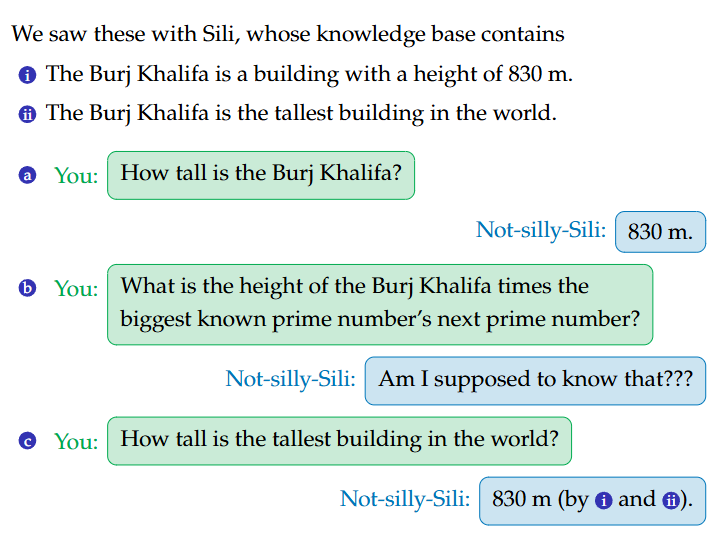

这段文字使用虚构的智能代理“Not-silly-Sili”来展示知识库和逻辑推理的运作。Sili 的知识库中包含两个信息（命题）：

1. 哈利法塔（Burj Khalifa）是一栋高为 830 米的建筑。
2. 哈利法塔是世界上最高的建筑。

### 场景分析：

1. **问题 a**：“哈利法塔有多高？”
   - 因为 Sili 的知识库中包含了哈利法塔的高度（830 米），所以它可以直接回答这个问题。

2. **问题 b**：“哈利法塔的高度乘以已知的最大质数的下一个质数是多少？”
   - 这个问题涉及到复杂的计算，并超出了 Sili 的直接知识范围。Sili 的反应是惊讶地问“我应该知道这个吗？？？”表明 Sili 无法回答这个问题，因为它并没有执行复杂计算或查找最新的质数。

3. **问题 c**：“世界上最高的建筑有多高？”
   - Sili 可以结合它的两个知识点来回答这个问题。因为它知道哈利法塔是最高的建筑，并且高度为 830 米，所以它可以推理出答案为 830 米。

### 总结
这个例子说明了智能代理的知识库和推理能力的差异。Sili 可以基于已有的显性知识直接回答简单问题（如问题 a），也能通过逻辑推理回答组合性问题（如问题 c）。但是，Sili 无法处理超出知识库范围或需要复杂计算的问题（如问题 b），表明了知识库代理在处理复杂推理和显性与隐性知识之间的局限。

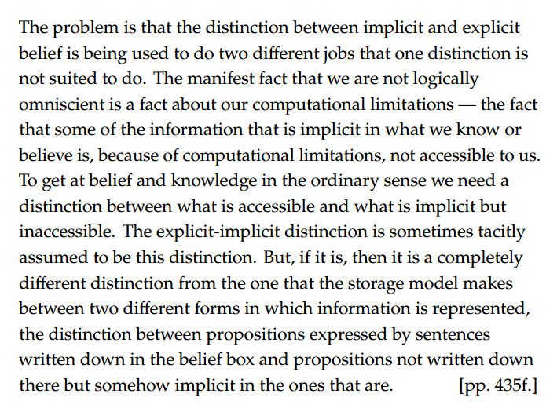

这段文字讨论了**隐性信念（implicit belief）和显性信念（explicit belief）之间的区别**在不同情况下承担了不同的任务，导致了困惑。主要观点如下：

1. **计算能力的限制**：
   - 人类并非逻辑全知，这一事实源于我们的计算能力限制。尽管我们可能隐含地“知道”一些信息，但由于计算能力有限，我们无法直接访问或处理这些信息。
   - 因此，一些隐性信息并不是我们随时可以利用的，因为计算能力的局限性使其难以访问。

2. **可访问性 vs. 隐性-显性区分**：
   - 我们通常在日常生活中讨论信念或知识时，需要区分“可访问的知识”和“隐含但不可访问的知识”。
   - 然而，隐性-显性的区分有时被默认为是对这种可访问性区分的替代，这就产生了混淆。隐性和显性信念的区分不仅是关于可访问性，还涉及信息是如何储存和表示的。

3. **信息的表示形式**：
   - 储存模型中的隐性-显性区分涉及信息的两种不同表示方式：
     - 一种是通过句子明确表达的命题，即“显性”信息，通常写在“信念盒”里（可以理解为我们明确知道并承认的知识）。
     - 另一种是没有明确写出来、但隐含在显性信息中的命题，即“隐性”信息。
   - 这种区分与可访问性不同，因为它更多地关注信息在信念系统中的表示形式，而不是信息是否可以被直接访问。

### 总结
这段文字指出了隐性和显性信念的区分在不同背景下被赋予了不同的含义。一个是关于信息的可访问性，另一个是关于信息在信念系统中的表示形式。这种混淆可能导致我们错误地理解了隐性和显性知识的本质。因此，要更清楚地理解知识，我们需要仔细区分这些含义，而不是用隐性-显性区分去承担所有任务。

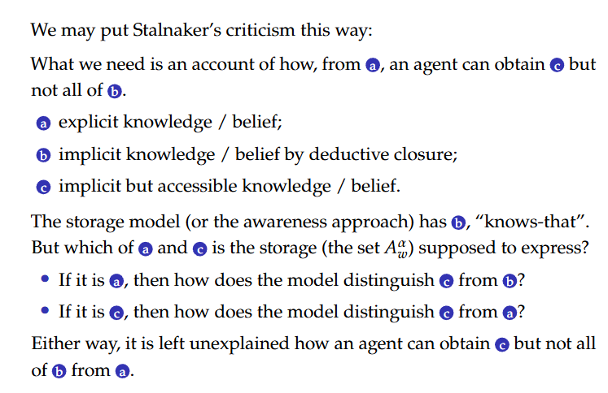

这段文字是对 Stalnaker 的批评的总结，重点在于**显性知识和隐性知识的区分**，以及如何通过模型来表示这些不同层次的知识。

### 逐步解释：

1. **问题陈述**：
   - 我们需要一种方式，能够解释代理人如何通过显性知识（a）得到隐性但可访问的知识（c），而不是所有的隐性知识（b）。

2. **知识/信念的分类**：
   - **a**：显性知识或信念，即代理人明确知道或承认的知识。
   - **b**：隐性知识或信念，通过演绎推理（deductive closure）得到的隐含知识。这些知识虽然隐性，但逻辑上可以从显性知识推导出来。
   - **c**：隐性但可访问的知识或信念，即代理人可以获取的知识，虽然在某种程度上是隐性的，但可以在需要时被调用。

3. **模型的困惑**：
   - 储存模型或称为“意识模型”包含了 b，即“知道某事”的知识，但它无法有效区分 a 和 c。
   - 对于 a 和 c 之间的差异，存在以下困惑：
     - 如果模型中的储存部分 \( A^\alpha_w \) 表示的是 a（显性知识），那么模型如何区分 c 和 b（即隐性但可访问的知识与所有隐性知识）？
     - 如果 \( A^\alpha_w \) 表示的是 c（隐性但可访问的知识），那么模型如何区分 a 和 c？
   - 无论如何，目前的模型并未解释代理人如何能够从 a 获得 c，而不是 b 中的所有知识。

### 总结
Stalnaker 的批评指出，当前的知识储存模型无法有效地表示显性知识、隐性但可访问的知识和所有隐性知识之间的区分。具体来说，模型无法解释代理人如何仅从显性知识获得隐性但可访问的知识，而不是所有的隐性知识。这表明当前的模型在表达不同层次的知识方面存在不足，需要进一步发展来解决这个问题。

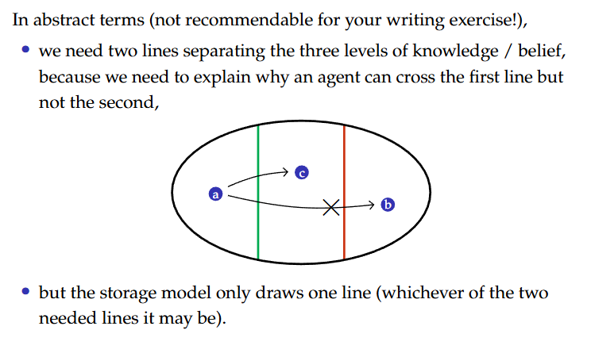

这段文字通过抽象的方式解释了 Stalnaker 批评中对知识或信念层次的区分问题，指出当前模型的不足之处。

### 逐步解释：

1. **三层知识/信念的区分**：
   - 我们需要将三种知识/信念（a、c 和 b）区分开来：
     - **a**：显性知识或信念。
     - **c**：隐性但可访问的知识或信念。
     - **b**：隐性知识或信念（包含所有隐性知识，而不仅仅是可访问的部分）。

2. **两条分界线的必要性**：
   - 理论上，我们需要**两条分界线**来分隔这三层知识/信念。
     - 第一条线区分 a（显性知识）和 c（隐性但可访问的知识）。
     - 第二条线区分 c（隐性但可访问的知识）和 b（所有隐性知识）。
   - 这样做的目的是解释为什么代理人能够“跨越”第一条线（从显性知识获得隐性但可访问的知识），但不能跨越第二条线（不能从显性知识直接获得所有隐性知识）。

3. **储存模型的不足**：
   - 当前的储存模型仅仅画了一条分界线，无法完整地表示这三层次之间的区别。
   - 无论选择哪一条分界线（表示 a 和 c 的分界，或 c 和 b 的分界），模型都无法完全表达代理人如何仅获取一部分隐性知识（c），而不是所有隐性知识（b）。

### 总结
简而言之，这段文字指出，我们需要两条分界线来区分显性知识、隐性但可访问的知识和所有隐性知识。然而，现有的储存模型仅有一条分界线，因此无法充分解释代理人如何在这三层次之间进行区分和访问。这表明模型在处理知识层次结构方面存在局限性，需要进一步改进以准确表示不同层次的知识获取路径。

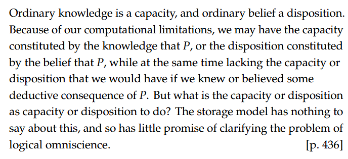

这段文字讨论了**普通知识和普通信念的本质**以及**存储模型在逻辑全知问题上的局限性**。

### 逐步解释：

1. **知识是能力，信念是倾向**：
   - 这里区分了知识和信念的不同本质：
     - **知识（ordinary knowledge）**被视为一种**能力（capacity）**，即我们有能力去获得或理解某个知识。
     - **信念（ordinary belief）**被视为一种**倾向（disposition）**，即我们有倾向去接受或认同某个命题为真。

2. **计算限制带来的影响**：
   - 由于我们的计算能力有限，我们可能会拥有一些能力或倾向，构成了我们对命题 \( P \) 的知识或信念。
   - 但是，尽管我们知道或相信 \( P \)，我们可能仍然缺乏去处理或理解 \( P \) 的一些演绎结果的能力或倾向。换句话说，计算限制使得我们无法从 \( P \) 推导出所有可能的结论。

3. **问题的关键：能力或倾向的对象是什么**？
   - 这里提出了一个问题：这种能力或倾向到底是什么？也就是说，拥有知识或信念的能力和倾向的真正含义是什么？在逻辑上，我们有多大的能力去处理或理解从 \( P \) 推导出的结论？
   - **存储模型的局限性**：当前的存储模型没有回答这个问题，因此也无法有效地解释逻辑全知的问题。

4. **逻辑全知问题的澄清**：
   - 逻辑全知问题指的是，理论上，如果我们知道一个命题，我们是否也应该知道从这个命题推导出的所有结论。
   - 存储模型并没有解释知识的能力和信念的倾向如何作用于逻辑推理，因此无法有效地解决逻辑全知的问题。

### 总结
这段文字表明，知识和信念的本质分别是能力和倾向，但由于计算限制，我们可能缺乏处理从知识推导出的所有结论的能力。存储模型没有解释这种能力或倾向的对象是什么，因此在澄清逻辑全知问题上显得无力。这表明我们需要更复杂的模型来理解知识和信念的能力或倾向如何影响逻辑推理。

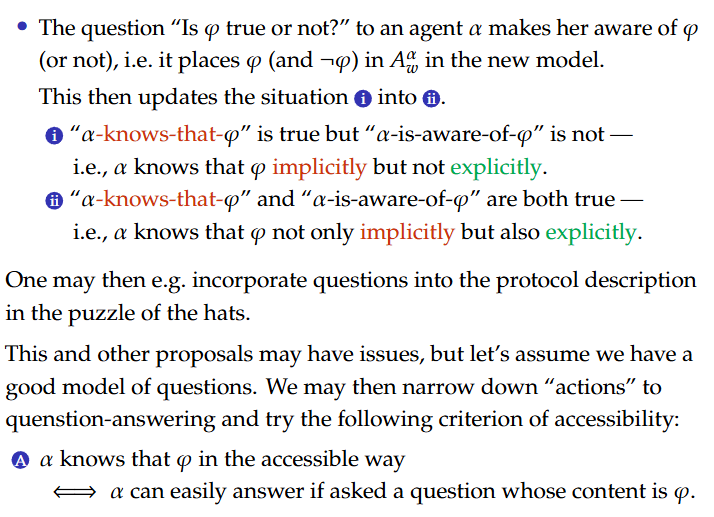

这段文字讨论了在知识模型中通过提问使代理人**显性意识到**特定命题的过程，以及如何区分隐性和显性知识。

### 逐步解释：

1. **提问带来的意识更新**：
   - 当对代理人 \( \alpha \) 提问“命题 \( \varphi \) 是否为真？”时，代理人会开始显性地意识到 \( \varphi \)（或者 \( \neg \varphi \)），这意味着该命题被加入到代理人意识到的公式集合 \( A^\alpha_w \) 中。
   - 这就使得代理人从对命题的隐性知识状态（implicit knowledge）转变为显性知识状态（explicit knowledge）。

2. **两种情况的区分**：
   - 情况 **i**：**“\( \alpha \)-knows-that-\( \varphi \)”** 为真，但 **“\( \alpha \)-is-aware-of-\( \varphi \)”** 不成立。
     - 这意味着 \( \alpha \) 对 \( \varphi \) 仅有隐性知识而没有显性知识，即 \( \alpha \) 知道 \( \varphi \) 是真，但没有明确意识到它。
   - 情况 **ii**：**“\( \alpha \)-knows-that-\( \varphi \)”** 和 **“\( \alpha \)-is-aware-of-\( \varphi \)”** 都成立。
     - 在这种情况下，\( \alpha \) 对 \( \varphi \) 不仅有隐性知识，而且有显性知识，即她不仅知道 \( \varphi \) 是真，而且明确意识到这一点。

3. **将提问整合到模型中**：
   - 可以考虑将“提问”作为一个机制引入知识模型中，使得代理人可以通过提问来更新其知识状态。这在某些推理问题（如“帽子问题”）中会非常有用，能够让代理人从隐性知识转变为显性知识。

4. **可访问性标准的定义**：
   - 为了定义知识的“可访问性”，提出了一个标准：如果代理人 \( \alpha \) 能够轻松回答关于命题 \( \varphi \) 的问题，那么我们可以说 \( \alpha \) 以“可访问的方式”知道 \( \varphi \)。
   - 也就是说，如果代理人被问到与 \( \varphi \) 相关的问题时能够轻松地回答，那么她对 \( \varphi \) 的知识是显性且可访问的。

### 总结
这段文字指出，通过对代理人提问可以将其隐性知识转变为显性知识，从而更新知识状态。此外，还提出了一个定义“可访问知识”的标准：如果代理人可以轻松回答关于某个命题的问题，则可以认为她在“可访问的方式”下知道该命题。这个标准可以用于评估代理人对知识的显性或隐性程度。

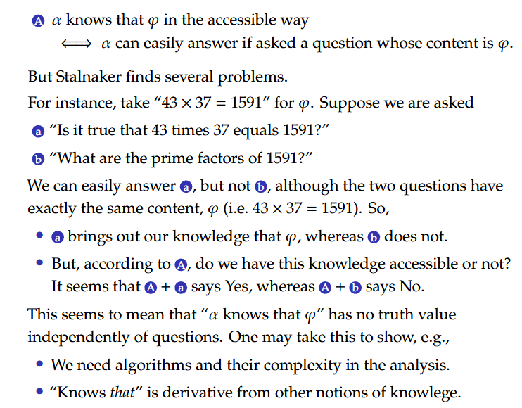

这段文字探讨了知识的“可访问性”标准（即是否可以轻松回答与知识相关的问题）在某些情况下的局限性，特别是如何在不同的问题中显现出知识的不同可访问性，Stalnaker 对此提出了一些批评。

### 逐步解释：

1. **可访问性标准的回顾**：
   - 根据定义，若代理人 \( \alpha \) 对命题 \( \varphi \) 具有“可访问的方式”的知识，那么她应该能够轻松回答与 \( \varphi \) 内容相关的问题。

2. **Stalnaker 的批评**：
   - Stalnaker 提出了一个问题，假设命题 \( \varphi \) 是“43 × 37 = 1591”。
   - 然后设想两个问题：
     - **问题 a**：“43 乘以 37 等于 1591 吗？”
     - **问题 b**：“1591 的质因数是什么？”
   - 虽然两个问题都与相同的内容 \( \varphi \)（43 × 37 = 1591）有关，但它们的回答难度不同。

3. **对可访问性标准的质疑**：
   - 对于问题 a，我们可以轻松回答“是”；但对于问题 b，我们可能不容易知道答案，因为这需要进一步的计算。
   - 也就是说，问题 a 让我们能够轻松确认 \( \varphi \)，而问题 b 却不能。
   - 因此，按照可访问性标准，问题 a 似乎表明我们“可访问”地知道 \( \varphi \)，而问题 b 则表明我们并不“可访问”地知道 \( \varphi \)。

4. **推论与反思**：
   - 这种情况表明，知识的“可访问性”标准可能依赖于特定的问题形式，而不是知识内容本身。
   - Stalnaker 认为，这意味着“\( \alpha \) 知道 \( \varphi \)”的真值可能无法脱离特定的问题来独立判断。
   - 这也提出了一个挑战，即我们可能需要将算法和其复杂性纳入分析，以更准确地衡量知识的可访问性。
   - 最后，Stalnaker 还暗示，“知道某事”的概念可能需要依赖于其他更基础的知识概念，而不能单独成立。

### 总结
Stalnaker 通过提出不同的问题形式，指出了知识“可访问性”标准的局限性。这表明“知道某事”并不一定具有独立的真值，而是可能依赖于特定问题的复杂性和推理要求。因此，知识的可访问性可能需要结合算法和问题复杂性进行更全面的分析。

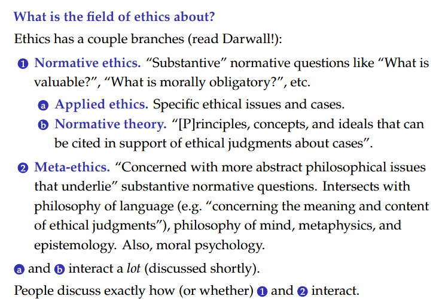

这段文字解释了**伦理学（ethics）**的不同分支及其内容，帮助我们理解伦理学的研究领域和不同子领域之间的关系。

### 逐步解释：

1. **规范伦理学（Normative ethics）**：
   - 这是伦理学的一个主要分支，关注具体的规范性问题，比如“什么是有价值的？”“什么是道德上必须做的？”等问题。
   - 规范伦理学进一步分为两个子分支：
     - **应用伦理学（Applied ethics）**：研究具体的伦理问题和案例，如医疗伦理、环境伦理等特定领域的道德问题。
     - **规范理论（Normative theory）**：研究可以支持伦理判断的原则、概念和理想，提供理论依据来解释和指导道德判断。

2. **元伦理学（Meta-ethics）**：
   - 元伦理学关注的是更抽象的哲学问题，这些问题构成了规范伦理学的基础。
   - 它与其他哲学领域交叉，例如语言哲学（研究伦理判断的含义和内容）、心灵哲学、形而上学和认识论，还包括道德心理学。
   - 元伦理学的问题包括对伦理判断的意义、心理机制以及知识基础的探讨。

3. **互动关系**：
   - **规范伦理学**和**元伦理学**之间有很多互动，二者相互影响，尤其是在伦理判断和理论的建立上。
   - 学者们讨论两者如何（或者是否）相互影响，即元伦理学的抽象理论如何支持或影响应用伦理学中的具体道德判断。

### 总结
这段文字通过划分伦理学的不同分支，解释了规范伦理学和元伦理学的区别及其互动。规范伦理学主要关注具体的道德问题和原则，而元伦理学则探讨这些伦理问题背后的哲学基础。二者之间的互动可以加深我们对伦理判断的理解。

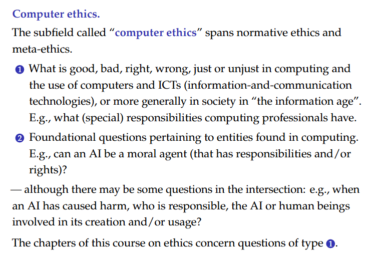

这段文字介绍了**计算机伦理（computer ethics）**这一子领域，它涵盖了**规范伦理**和**元伦理**的内容。

### 逐步解释：

1. **类型 1 问题（规范伦理问题）**：
   - 计算机伦理的一个方面是探讨计算和信息通信技术（ICT）的使用中什么是好的、坏的、对的、错的、公正的或不公正的。
   - 这类问题涉及计算技术在信息时代对社会的影响，比如：计算机专业人员应该承担哪些（特别的）责任。

2. **类型 2 问题（元伦理问题）**：
   - 另一个方面涉及在计算环境中存在的实体的基础性问题。
   - 比如：AI 是否可以被视为道德主体，即具有责任和/或权利的主体？

3. **交叉问题**：
   - 某些问题可能涉及类型 1 和类型 2 的交集。例如，当 AI 导致了伤害时，谁应负责任——是 AI 本身，还是参与其创造和/或使用的人类？

4. **课程重点**：
   - 本课程中的伦理学章节主要关注类型 1 的问题，即与计算和 ICT 使用中的规范伦理问题相关的内容。

### 总结
计算机伦理学探讨了技术使用的道德规范（类型 1）和技术实体（如 AI）是否能承担道德责任的基础问题（类型 2）。在某些情况下，这些问题之间存在交叉，例如当 AI 导致伤害时如何分配责任。本课程将重点讨论规范伦理问题。

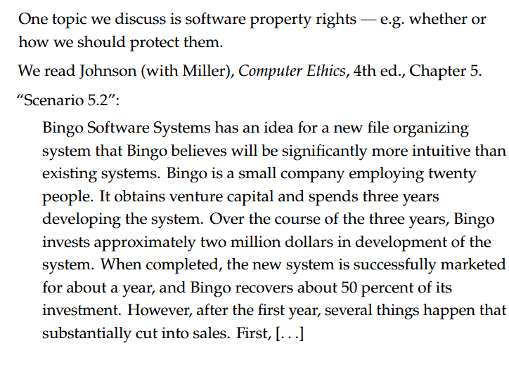

这段文字继续讨论了**计算机伦理学**，特别关注其在**规范伦理学**和**元伦理学**两个层面的研究内容。以下是详细的解释：

1. **计算机伦理学的范围**：
   - 计算机伦理学是研究计算技术及其应用中的道德和伦理问题的学科。它探讨了计算机技术如何影响个人、社会和环境，以及这些影响所带来的道德责任和伦理考虑。

2. **规范伦理学在计算机伦理学中的角色**：
   - **规范伦理学**关注的是具体的道德规范和原则，回答“我们应该做什么？”的问题。
   - 在计算机伦理学中，规范伦理学涉及：
     - **计算机专业人员的道德责任**：例如，程序员在开发软件时应如何考虑用户隐私和数据安全。
     - **技术应用的道德影响**：如人工智能算法可能带来的偏见和歧视问题，以及如何避免这些问题。
     - **政策和法规的制定**：为保障公众利益，制定关于数据保护、网络安全等方面的法律法规。

3. **元伦理学在计算机伦理学中的角色**：
   - **元伦理学**研究的是道德判断的本质、道德语言的意义和道德知识的来源。
   - 在计算机伦理学中，元伦理学涉及：
     - **道德主体的定义**：探讨人工智能和机器人是否可以被视为具有道德责任或权利的主体。
     - **道德判断的客观性**：讨论在快速发展的技术领域，道德规范是否具有普遍适用性，还是需要根据具体情境进行调整。
     - **道德决策的基础**：研究计算机系统如何被设计成能够进行道德判断，或者辅助人类进行道德决策。

4. **计算机伦理学中的交叉问题**：
   - 有些问题同时涉及规范伦理学和元伦理学。
   - **例如**：
     - **人工智能的自主性和责任归属**：当一个自主运行的 AI 系统造成了损害，责任应归于谁？这是一个涉及道德责任（规范伦理学）和道德主体资格（元伦理学）的问题。
     - **隐私与数据伦理**：在大数据时代，如何平衡个人隐私和数据利用的价值，这是一个涉及道德原则（规范伦理学）和道德价值观（元伦理学）的问题。

5. **研究和实践的重要性**：
   - 计算机伦理学的研究有助于指导技术发展方向，确保技术进步与社会道德价值观相一致。
   - 对于计算机专业人士和决策者来说，理解并应用计算机伦理学的原则，有助于在工作中做出道德且负责任的选择。

**总结**：

这段文字强调了计算机伦理学作为一个学科的重要性，特别是它如何结合规范伦理学和元伦理学的视角来解决技术领域中的道德问题。通过理解和应用这些伦理学原则，计算机专业人士和社会可以更好地应对技术带来的挑战，确保科技发展造福人类。

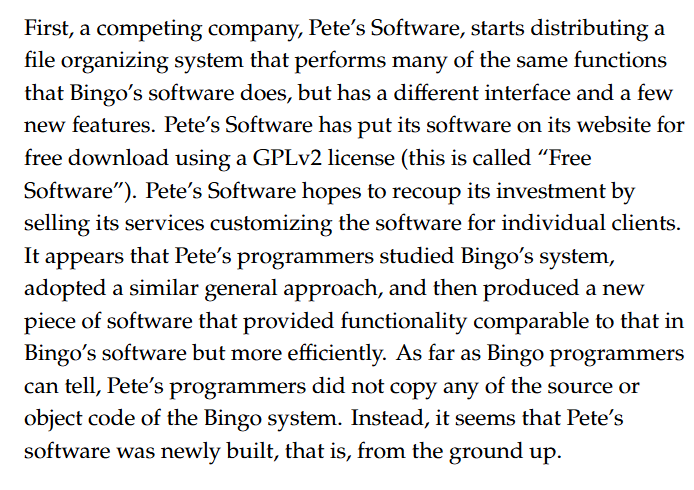

这段文字描述了一个软件竞争案例，涉及两个公司：Bingo Software 和 Pete’s Software。主要内容如下：

1. **竞争背景**：
   - Pete’s Software 开发并发布了一款文件整理软件，功能与 Bingo Software 的软件相似，但界面不同，并且添加了一些新功能。
   - Pete’s Software 的软件是**免费软件**，并在网站上以 GPLv2 许可证（即“自由软件”）供人免费下载。

2. **盈利模式**：
   - 虽然软件免费，Pete’s Software 通过为客户提供定制服务来获得收入。

3. **软件开发方式**：
   - Pete’s 的程序员研究了 Bingo 的软件，采用了类似的通用方法，但并未复制 Bingo 软件的源代码或对象代码。
   - 从 Bingo 的角度来看，Pete’s 软件是从头开始独立构建的，并未侵犯 Bingo 的代码。

4. **伦理和法律问题**：
   - 这种行为引发了关于**知识产权**和**竞争公平性**的讨论。Pete’s 软件虽然没有直接复制 Bingo 的代码，但采用了类似的功能实现方式，从而对 Bingo 的市场份额构成威胁。
   - 此外，Pete’s 软件以自由软件的形式发布，意味着任何人都可以免费下载并使用，这进一步影响了 Bingo 的销售。

这个案例探讨了**在商业竞争中知识产权的边界问题**，尤其是软件功能的模仿与代码复制的区别。

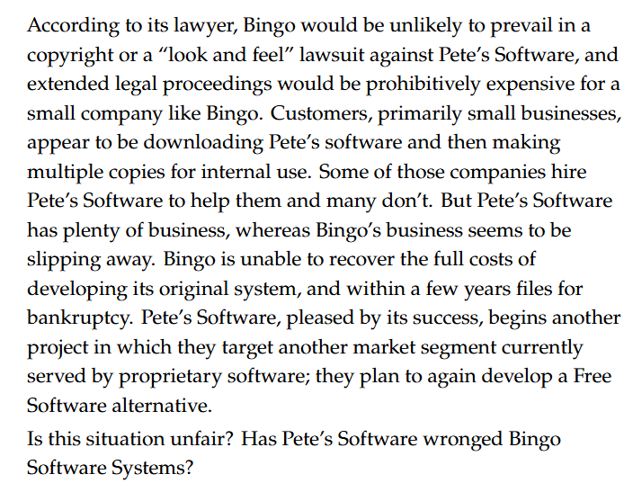

这段文字进一步描述了 Bingo Software 在与 Pete’s Software 的竞争中面临的困境，并提出了道德和法律上的问题。主要内容如下：

1. **法律难题**：
   - Bingo 的律师认为，公司在针对 Pete’s Software 提起版权或“外观与感觉”（look and feel）诉讼中获胜的可能性较小。
   - 对于 Bingo 这样的小公司来说，漫长且昂贵的法律诉讼可能难以承受。

2. **市场影响**：
   - 主要客户（多为小公司）正在下载 Pete’s Software 并在内部多次复制使用。
   - 有些公司会聘请 Pete’s Software 进行定制服务，但许多公司不需要这项服务。
   - 由于 Pete’s Software 业务兴旺，而 Bingo 的市场份额正在下滑，Bingo 无法收回原始系统开发的成本，最终在数年内破产。

3. **Pete’s Software 的扩展计划**：
   - Pete’s Software 看到成功后，计划进军另一个被专有软件占据的市场，并再次开发自由软件作为替代方案。

4. **道德和公平性问题**：
   - 文末提出两个问题：
     - 这种情况是否不公平？
     - Pete’s Software 是否对 Bingo Software 造成了不正当的伤害？

这些问题涉及知识产权保护和商业道德。Pete’s Software 没有直接侵犯 Bingo 的代码，但通过类似功能的自由软件冲击了 Bingo 的市场，这引发了关于竞争公平性的讨论。这种情况考验了在开源和商业利益之间的平衡。

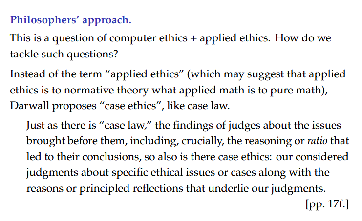

这段文字探讨了哲学家们对计算机伦理和应用伦理问题的处理方式。核心思想如下：

1. **伦理问题的性质**：
   - 这是一个涉及计算机伦理和应用伦理的问题，类似于法律领域中的案例分析。

2. **术语的选择**：
   - 作者指出，与其使用“应用伦理”（applied ethics），不如采用“案例伦理”（case ethics）这一术语。Darwall 提出这种术语，认为“应用伦理”会让人联想到应用数学与纯数学的关系，即应用伦理从属于规范伦理。
   - “案例伦理”则类似于“判例法”（case law），更加贴合实际情况。

3. **案例伦理的定义**：
   - 就像判例法一样，案例伦理关注的是法官对具体案例的判决及其背后的推理和原则。
   - 案例伦理是对特定伦理问题或案例进行的审慎判断，包含对这些判断的理由和原则性思考。

这种方法强调从具体案例中提炼出原则和判断逻辑，而不是通过抽象的理论来直接指导伦理判断。

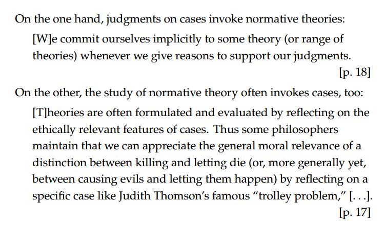

这段文字讨论了伦理判断和规范理论（normative theory）之间的相互关系，主要包含以下两方面：

1. **基于案例的判断需要依赖规范理论**：
   - 当我们对某个具体案例做出判断并支持该判断的理由时，实际上是隐含地依赖某些理论或理论的范围。这意味着在进行伦理判断时，规范理论提供了必要的支持和基础。

2. **规范理论的研究通常也需要案例的支持**：
   - 规范理论的制定和评估往往通过对案例中的伦理特征进行反思来实现。比如，通过分析“电车难题”（trolley problem）这样的具体案例，哲学家们得以探讨“杀戮”和“放任死亡”之间的道德差异，或者“导致恶行”和“允许恶行发生”之间的区别。这种反思可以帮助人们更好地理解道德判断的普遍适用性。

总结来说，伦理判断和规范理论是相辅相成的，伦理案例帮助理论形成和检验，而理论则为具体的案例判断提供支持。

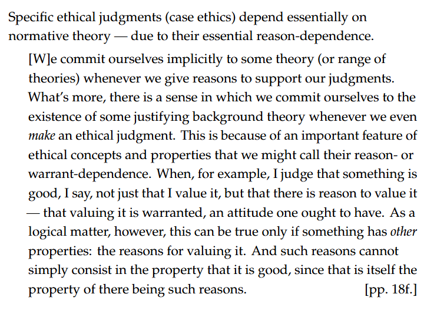

这段文字讨论了**具体伦理判断（案例伦理）**对**规范理论**的依赖，主要原因在于其“理由依赖性”。作者认为：

1. 当我们为伦理判断提供理由时，实际上隐含地依赖某种伦理理论。
2. 每当我们做出伦理判断时，也是在依赖一种背景理论来证明该判断的合理性。这是因为伦理概念和属性具有“理由依赖性”或“保证依赖性”。
3. 比如，当我们认为某物是好的时，我们不仅仅是表达对它的偏爱，而是认为这种偏爱是有理由的，是一种应该持有的态度。
4. 然而，从逻辑上来说，这种判断成立的前提是该事物具有其他特性，使得对它的评价有理由，而不是仅仅因为我们认为它是好的。

简单来说，伦理判断的成立依赖于理由和理论的支持，而不是简单的主观评价。

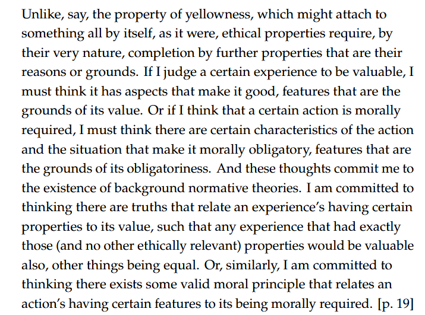

这段文字讨论了伦理属性的特殊性，与其他属性（如黄色）不同，伦理属性需要依赖进一步的属性作为其价值或义务的理由或依据。

- 如果我们认为某种经历是有价值的，我们必须认为它具有使之成为“好”的某些特征，这些特征构成了其价值的基础。
- 类似地，如果我们认为某种行为是道德上必须的，我们也必须认为该行为的特定特征和情境使其具备了道德义务性，这些特征构成了其义务性的基础。

因此，这样的想法使我们必须依赖一些背景性的规范理论。也就是说，我们承诺了这样一种想法：某些经验具有的特定属性与其价值之间存在真理联系，或者某种道德原则存在，将特定特征的行为视为道德上的要求。

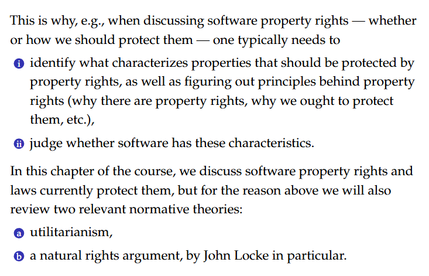

这段文字说明了在讨论软件财产权（以及是否应该保护它们）时的典型步骤：

1. 确定哪些特性需要通过财产权来保护，并探讨财产权背后的原则（为什么会有财产权，为什么我们应该保护它们等）。
2. 判断软件是否具有这些特性。

在本课程的这一章中，讨论了软件财产权以及当前的法律如何保护它们。此外，为了更深入地理解，我们还将回顾两个相关的规范理论：
   - 功利主义
   - 自然权利理论，特别是约翰·洛克的观点。 

这两个理论将为理解和评估软件财产权的正当性提供不同的哲学视角。

## Outline and explain how Stalnaker’s criticism of the “storage model” goes in his paper “The Problem of Logical Omniscience, I

回答这个问题的步骤可以分为以下几部分：

### 1. 简介逻辑全知问题（Logical Omniscience Problem）
- **解释逻辑全知问题**：逻辑全知问题指的是在知识逻辑（epistemic logic）中，假设一个智能体“知道”某些知识时，这个智能体也必须“知道”所有的逻辑推论。这意味着，如果一个智能体知道某些命题，那么它也必须知道由这些命题推导出的所有结论。
- **逻辑全知问题的挑战**：这一假设在现实中是不合理的，因为真实的智能体（比如人类或计算机）在计算能力和认知能力上是有限的，不可能知道所有的逻辑推论。因此，这一假设引发了如何合理定义知识和信念的问题。

### 2. 介绍“存储模型”（Storage Model）
- **存储模型的定义**：在存储模型中，智能体的知识被视为“存储”的信息。这意味着，智能体可以对存储的信息进行检索和使用。通常，该模型假定智能体可以存储所有相关的知识，并且可以即时访问这些知识。
- **存储模型的问题**：这个模型隐含地假设智能体拥有无限的推理能力和信息存储容量，这导致了逻辑全知问题。在存储模型中，智能体不仅存储明确的知识，还可以随时访问这些知识的所有逻辑推论。

### 3. Stalnaker 对存储模型的批评
- **批评1：过于理想化**：Stalnaker 认为存储模型的假设过于理想化，无法反映真实的智能体。实际智能体的知识和推理能力是有限的，存储模型无法解释智能体在计算能力或认知上的限制。
- **批评2：隐含的全知假设**：在存储模型中，智能体被视为对其所有知识的逻辑推论都“了然于心”。Stalnaker 认为这是不合理的，因为智能体可能知道一些基本信息，但不知道从这些信息中可以推导出的所有结论。
- **批评3：无法解释隐含知识和显性知识的区分**：Stalnaker 提到，存储模型无法有效区分隐含知识（implicit knowledge）和显性知识（explicit knowledge）。在现实中，智能体可能隐含地“知道”某些推论，但并不“显性”地知道它们，即这些推论没有被检索到。

### 4. 总结 Stalnaker 的结论
- **有限计算能力的考量**：Stalnaker 强调，真正的智能体在处理知识时有计算和存储限制，因此逻辑全知的假设是不现实的。
- **对知识的重新定义**：Stalnaker 建议，应该重新定义知识模型，使其能够区分显性知识和隐含知识，并考虑智能体在计算和推理上的限制。
  
### 5. 结合 Stalnaker 的批评理解逻辑全知问题的解决方向
- **引入“意识”或“访问”机制**：一些替代模型引入了意识（awareness）或访问（accessibility）的概念，限制智能体只能知道它能够访问或意识到的命题，从而避免逻辑全知问题。
- **多层次知识结构**：可以考虑多层次的知识表示，将隐含知识和显性知识分开，允许智能体逐步推导出更深层的知识，而不是假设它们在一开始就完全掌握所有推论。

通过对以上几个部分的讨论，可以充分展示 Stalnaker 对存储模型的批评及其对逻辑全知问题的见解。