后台姓名：宇宸
用户ID：117108
用户1V1昵称：
学生需求类型：知识点辅导
学生基础：一般
期望上课时间：美中时间9.18
学生DUE时间：
用户类型：1v1老用户
院校：uiuc
年级：大二
专业：未定
科目代码：Phil222
科目名称：Philosophical Foundations of Computer Science
备注：讲解lec的内容,过一遍

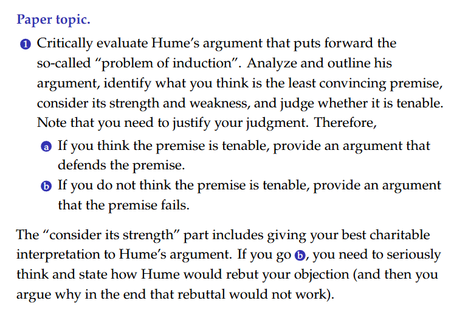

这张图片中的哲学论文题目要求你对休谟关于“归纳问题”（the problem of induction）的论证进行批判性评估。以下是题目的主要内容和要求：

1. **任务概述**：你需要批判性地评估休谟关于归纳问题的论证，该问题质疑我们基于过去经验预测未来事件的逻辑基础。具体任务是：
   - 分析并概述他的论证。
   - 识别你认为最不令人信服的前提。
   - 考虑这个前提的优点和缺点。
   - 判断该前提是否有效（站得住脚），并为你的判断提供依据。
2. **如果你认为前提是成立的（选项a）**：
   - 如果你认为前提是有效的，你需要提供一个支持和捍卫该前提的论证。
3. **如果你认为前提不成立（选项b）**：
   - 如果你认为该前提不成立，你需要提供一个论据，解释为什么该前提失败。
   - 同时，你还需要解释休谟可能会如何反驳你的观点，然后你再论证为什么他的反驳是无效的。
4. **附加说明（“考虑其强度”）**：
   - 即使你选择批评休谟的论证（选项b），你仍然需要从最有利的角度来解释他的论点。你必须认真思考休谟可能会如何为他的观点辩护，并准备反驳他的辩护。

简单来说，这道题目要求你评估归纳问题，选择一个特定的前提并判断其是否站得住脚，然后提供详细的论据支持或反驳这一前提。如果你选择批判该前提，还需要考虑休谟可能的反驳并进行反驳他的论点。

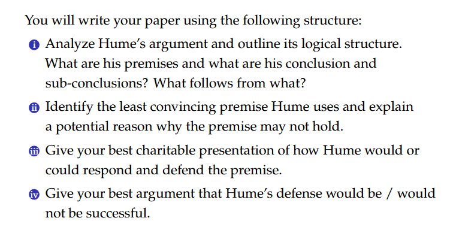

这张图片提供了写作哲学论文的结构说明，具体如下：

1. **分析休谟的论证并概述其逻辑结构**：
   - 你需要分析休谟的论证，明确他的前提是什么，结论和次结论是什么，以及这些结论是如何从前提中推导出来的。
2. **找出休谟使用的最不令人信服的前提，并解释为什么该前提可能不成立**：
   - 你需要识别一个你认为休谟论证中最薄弱的前提，并给出这个前提可能无效的理由。
3. **给出最有利于休谟的解读，展示他会如何或可能如何为该前提出辩**：
   - 你需要站在休谟的立场上，以最有利的方式为他的前提进行辩护，解释他可能会如何回应对该前提的批评。
4. **给出你的最佳反驳，说明为什么休谟的辩护不成功或不能成功**：
   - 最后，你需要提供论据，解释为什么休谟的辩护是站不住脚的，或者为什么他的辩护最终会失败。

简而言之，这个写作结构要求你先分析并批判休谟的论证，找出其中的薄弱之处，提供最强有力的批评，然后预测休谟可能的辩护，最后对他的辩护进行反驳。

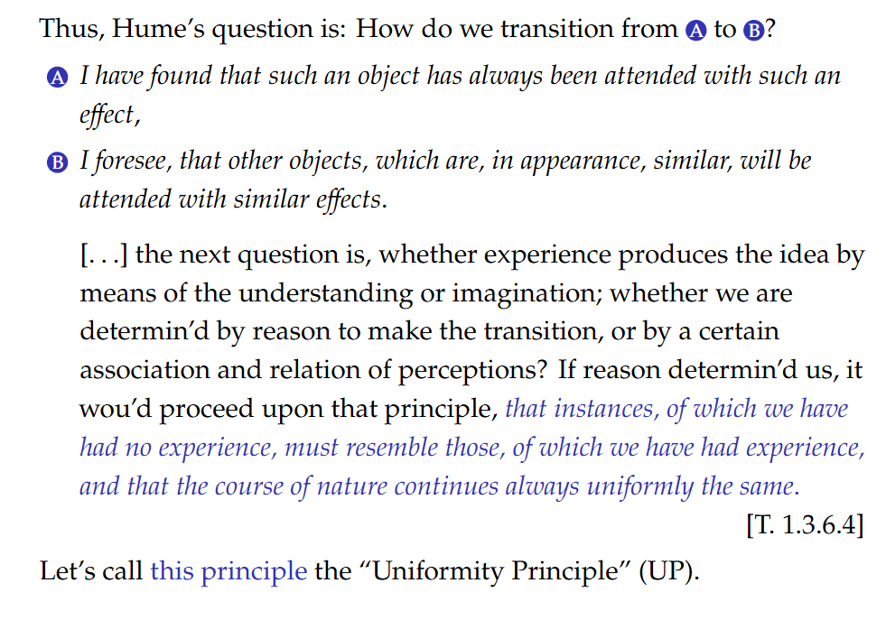

这段文字讨论的是休谟关于归纳推理的核心问题，即**我们如何从A过渡到B**。具体解释如下：

- **A**: “我发现某个对象总是伴随着这样的效果”，意思是基于过去的经验，我们观察到某种现象总是与某种结果同时发生。
  
- **B**: “我预见到，其他在外观上相似的对象也将伴随着相似的效果”，即我们推测未来会发生相似的事情，尽管我们还没有真正观察到这些未来的现象。

休谟的问题是，**我们如何从观察到的过去经验（A）过渡到对未来的预测（B）？** 也就是说，从我们经历过的事情推断我们没有经历过的事情，是否可以通过理性或想象来进行？他进一步质疑是否是**理性**促使我们进行这种推理，还是仅仅是一种**知觉的联想和关系**。

休谟指出，如果是理性决定我们做这种推理，那么它应该依据某个原则，即“我们没有经验的实例必须类似于我们已经有过经验的实例，并且自然的进程总是保持一致”。这种假设即是所谓的**一致性原则（Uniformity Principle，UP）**。

总结来说，休谟认为我们如何从经验中推断未来并不是理性驱动的，而是一种基于联想的心理习惯。同时，他质疑一致性原则的合理性，即我们是否有充分的理由相信未来会像过去那样发展。

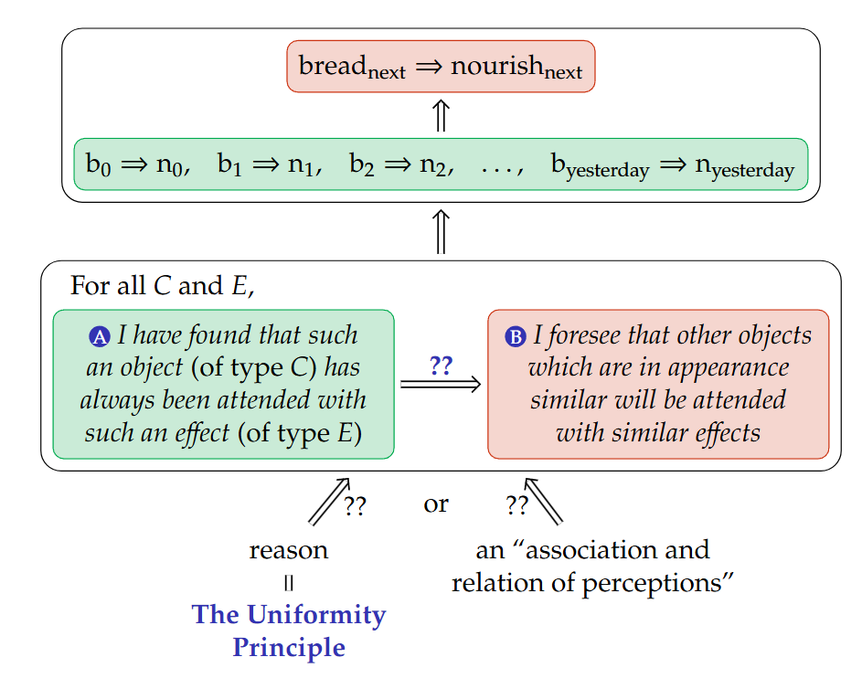

这张图片通过一个图示进一步解释了休谟关于归纳推理的思想。

1. **上层部分**展示了一个例子：我们从过去的经验中得出“**吃面包会带来营养**”，因为我们过去的面包都产生了类似的效果。因此，我们预测未来的面包（“bread_next”）也会有相同的结果，即带来营养（“nourish_next”）。

2. **中层部分**描述了从特定经验中如何形成一个普遍性结论：
   - 我们的经验是，某个对象（类型C，比如面包）总是与某个效果（类型E，比如带来营养）一起出现。
   - 基于此经验，我们推测其他类似的对象（类型C）也将伴随相似的效果（类型E）。

3. **下层部分**展示了归纳推理中的关键问题：
   - 从**A**（我发现某种类型的对象总是伴随着某种效果）推导到**B**（我预见其他外观相似的对象也会有类似效果）之间有一个推理的跳跃。
   - 休谟提出的问题是：我们如何从A得出B？是基于**理性**（依赖于一致性原则，Uniformity Principle），还是仅仅基于**知觉的联想与关系**？

简而言之，这个图示说明了我们如何从过去的经验中得出未来的预测（归纳推理），并指出其中的关键问题是：这种推理是否有坚实的理性基础，或者仅仅是一种心理上的联想。休谟质疑的是这种推理背后的合理性，特别是所谓的“一致性原则”，即假设未来的自然规律会像过去一样。

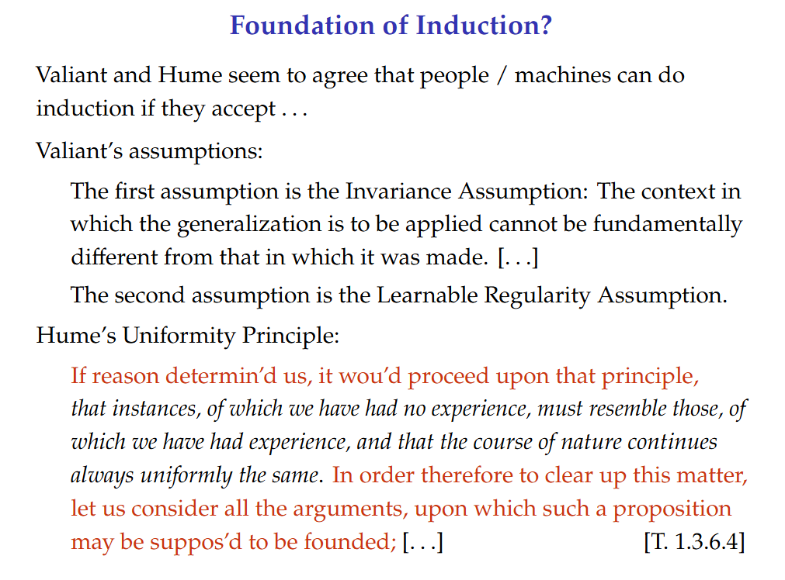

这段文字探讨了归纳推理的基础，并将瓦利安特（Valiant）和休谟的观点进行了对比。

1. **瓦利安特的假设**：
   - **不变性假设（Invariance Assumption）**：这个假设认为，用于归纳推理的背景与进行推理时的背景不能有根本的不同。也就是说，归纳推理的背景条件在应用时应保持一致。
   - **可学习的规则性假设（Learnable Regularity Assumption）**：这假设在某些情况下存在可学习的规则性，这种规则性可以被归纳和利用。

2. **休谟的一致性原则（Uniformity Principle）**：
   - 休谟在这里提出，如果我们的推理是由理性决定的，那么它会基于这样一个原则：“我们没有经验过的实例必须类似于我们已有经验的实例，而且自然的进程总是保持一致。” 
   - 这段引用暗示了休谟对这个原则持有怀疑态度，他提出我们应当考虑这种假设成立的所有可能论据，以便弄清楚它的合理性。

总结来说，瓦利安特和休谟在某种程度上都认为，归纳推理需要某些假设来支持。瓦利安特的假设强调背景的稳定性和规则性，而休谟则提出“一致性原则”作为理性推理的潜在基础，但他对这一原则的合理性表示质疑，认为需要进一步分析。

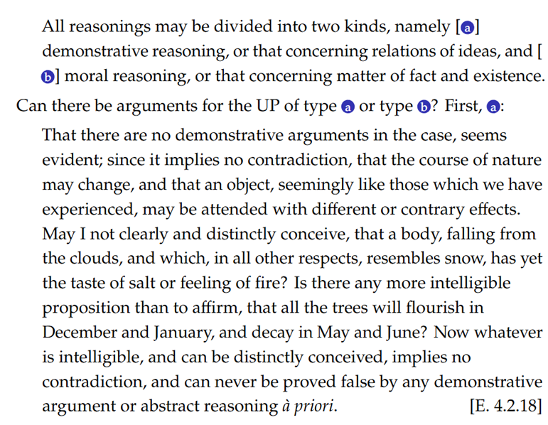

这段文字讨论了两种推理方式，并质疑是否可以为“一致性原则（UP）”提供论据。

1. **推理的两种类型**：
   - **a. 演绎推理（demonstrative reasoning）**：这是关于**观念之间的关系**的推理，类似于数学或逻辑中的推理，它基于先验的真理，强调必然性和不可辩驳性。
   - **b. 道德推理（moral reasoning）**：这是关于**事实和存在问题**的推理，类似于日常生活中的归纳推理，依赖于经验和事实，并不具备必然性。

2. **质疑演绎推理是否支持“一致性原则”**：
   - 休谟认为，无法通过演绎推理为一致性原则提供论据，因为没有任何矛盾可以证明自然的规律不会改变，也没有必然性表明看起来相似的物体（与我们经验过的物体相似）必须产生相同的效果。
   - 他提出，即使一个物体看起来像雪，但却尝起来像盐或感觉像火，这种想法也不包含逻辑上的矛盾。因此，演绎推理无法证明自然现象一定会按过去的方式继续发生。
   - 休谟还通过例子说明，想象树木在不同的季节繁茂或枯萎也是合理的，没有逻辑上的矛盾，因此我们无法通过纯粹的推理来断定自然规律总是保持不变。

3. **结论**：
   - 休谟的结论是，基于演绎推理（先验推理），我们无法证明“一致性原则”是正确的。因为一切可被清晰地设想和理解的事物不包含矛盾，因此，演绎推理无法提供关于自然规律不变性的必然性证据。

简而言之，休谟在这段文字中质疑我们能否通过演绎推理来支持“一致性原则”，并给出了反例，说明自然的规律可能并不像我们想象的那样不可变。

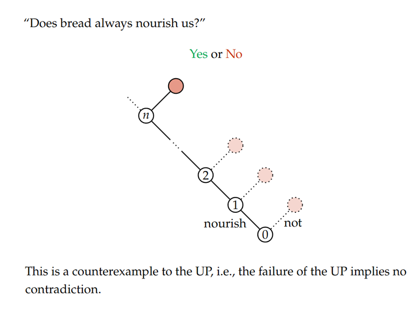

这张图片展示了一个关于“一致性原则”（UP）的反例，用来说明一致性原则的失败并不会带来逻辑上的矛盾。

1. **问题**：“面包总是能滋养我们吗？”——图中给出了**是（Yes）**或者**否（No）**的选项。

2. **树形图**：图中展示了一种可能性：
   - 从根节点开始（“n”表示面包滋养我们的现象），这个现象在过去的多次观察中是成立的。
   - 然而，随着时间推移，可能会出现不同的情况，逐渐分叉出“nourish”（滋养）或者“not”（不滋养）的结果。
   - 图中的圆圈表示结果，带有虚线的分支表示可能的变化，表明某一时刻面包可能不再滋养我们。

3. **结论**：这幅图作为“一致性原则”的反例展示了这样一个观点——即使面包在某些时候滋养我们，但在其他情况下可能不再如此，这种不一致的情况并不会引发逻辑上的矛盾。也就是说，自然界的规律可能会改变，而我们无法仅通过归纳推理得出其必然不变的结论。

**总结**：这个例子是对“一致性原则”的挑战，说明即使自然规律发生变化，不再像我们过去所经验的那样运作，这种变化也不会导致逻辑上的矛盾。这进一步支持了休谟对归纳推理可靠性的质疑。

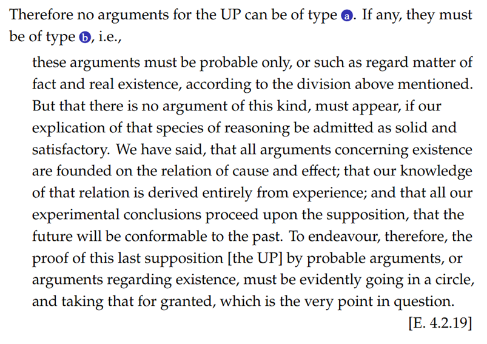

这段文字进一步讨论了“一致性原则”（UP）的论证方式，特别是探讨了是否可以为该原则提供有力的支持。

1. **演绎推理无法支持UP**：
   - 休谟明确指出，无法通过类型 **a**（演绎推理）来为一致性原则提供论据。因为演绎推理关注的是观念之间的关系，而一致性原则属于关于事实和存在的问题，不能通过演绎方式证明。

2. **经验性的推理只能是概率性的**：
   - 如果有任何关于UP的论据，它们只能是类型 **b**（道德推理，即经验性推理）。这种推理只是概率性的，涉及的是关于事实和存在的问题（如因果关系）。
   - 休谟强调，我们关于因果关系的所有知识都源自经验，并且我们所有的实验性结论都基于这样一个假设：未来会与过去相一致。但这只是一个假设，并没有必然的证明。

3. **循环论证的风险**：
   - 休谟指出，试图通过概率性的论据来证明一致性原则是一个**循环论证**，即这种论证依赖于我们已经假定了未来会像过去一样的假设，而这个假设本身正是需要证明的内容。这是一种自我验证的逻辑，因而不成立。

**总结**：
休谟在这段文字中表明，任何支持一致性原则的论据都只能是基于经验的、概率性的推理，无法通过演绎推理来证明。而这种经验性的推理实际上是一个循环论证，因为它预设了需要证明的内容，即未来与过去一致的假设。这进一步加强了休谟对归纳推理可靠性的怀疑。

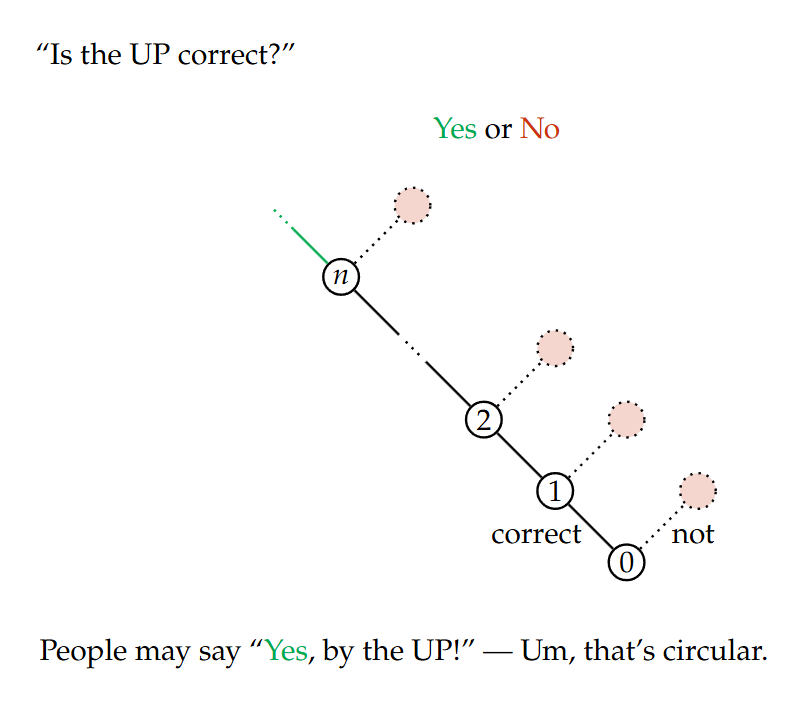

这张图片展示了关于“一致性原则（UP）”的一个问题，并指出了**循环论证**的逻辑错误。

1. **问题**：“一致性原则（UP）是正确的吗？” —— 图中提供了“**是（Yes）**”或“**否（No）**”的选项。

2. **图示说明**：
   - 这个图类似于之前的分支结构，从根节点开始推导出两个可能的结果：**correct（正确）**或者**not（不正确）**。
   - 其中，“Yes”分支假设一致性原则是正确的。

3. **结论中的循环论证**：
   - 在图示下方，指出了一种常见的逻辑错误：**“人们可能会说：‘是的，通过一致性原则证明它是正确的！’”**——这实际上是一个循环论证。
   - 这种回答意味着人们在试图证明一致性原则时，实际上依赖于该原则本身的正确性，即用一致性原则证明一致性原则，这是一个逻辑上的循环，无法提供有效的证明。

**总结**：
这张图强调了一个逻辑上的错误，叫做循环论证。它指出了人们在试图证明一致性原则时，可能会犯的错误：即依赖该原则本身的假设来证明其正确性，这在逻辑上是不成立的。

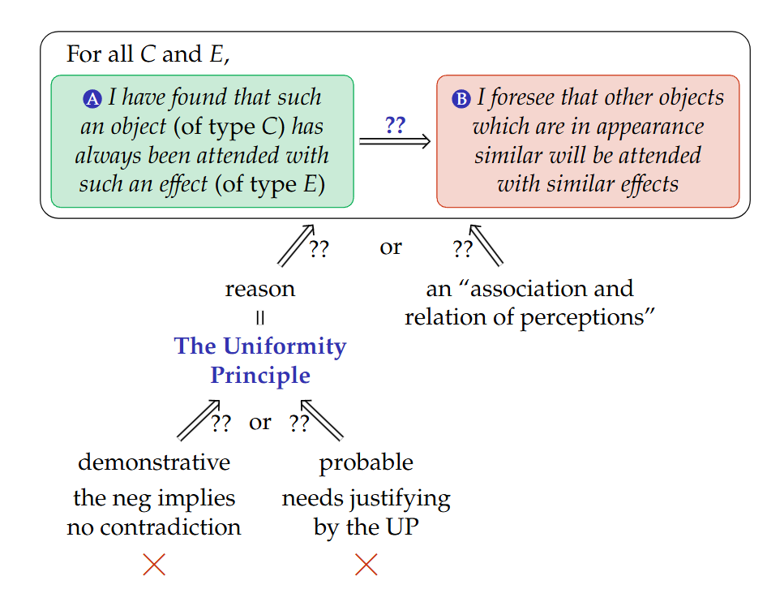

这张图表解释了**归纳问题**中的推理结构，并进一步探讨了“一致性原则”（UP）的局限性。

1. **A 和 B 的过渡**：
   - **A**：描述我们基于过去的经验得出某种对象（类型C）总是伴随着某种效果（类型E）。
   - **B**：推测外观相似的其他对象将会伴随着类似的效果。
   - 问题是，我们如何从 **A** 过渡到 **B**？图中的 “??” 表示这个推理过程存在不确定性。

2. **推理的两种可能性**：
   - 我们可以通过**理性**来推理，即基于**一致性原则（The Uniformity Principle，UP）**。
   - 或者，通过**知觉的联想和关系**来进行推理（即简单的经验联想）。

3. **一致性原则的支持方式**：
   - 一致性原则的合理性可以通过两种方式尝试支持：
     - **演绎推理（demonstrative reasoning）**：如果否定UP并不引发矛盾，那么UP无法通过演绎推理证明。图中的 “×” 表明这条路径被否定了。
     - **概率推理（probable reasoning）**：需要一致性原则本身来证明一致性原则是有效的，这导致了**循环论证**，也是不成立的。图中的“×”也否定了这条路径。

4. **结论**：
   - 无论是演绎推理还是概率推理，都不能有效地为一致性原则提供证明。这意味着我们在从 A 推导到 B 的过程中，无法通过理性证明一致性原则是正确的。

**总结**：
这张图展示了我们从经验推理到未来预测时的困难，即归纳推理的合理性依赖于“一致性原则”。但无论通过演绎还是概率的方式，这个原则都无法得到逻辑上的坚实支持，进一步加强了休谟对归纳推理的怀疑。

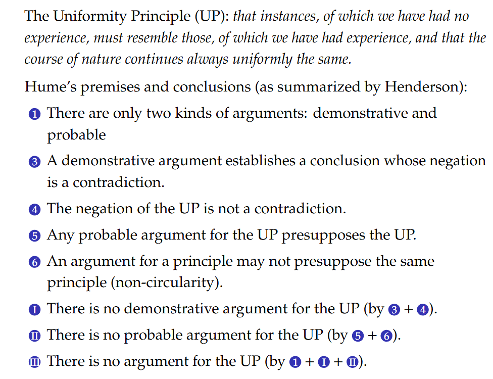

这张图片总结了休谟关于“一致性原则（UP）”的论证过程，并展示了其推理的关键前提和结论。具体解释如下：

### **一致性原则的定义**：
一致性原则（UP）指的是：“我们没有经验过的实例必须类似于我们已经有过经验的实例，并且自然的进程总是保持一致。” 也就是说，它假设未来会与过去相同。

### **休谟的前提和结论（根据 Henderson 的总结）**：

1. **只有两种类型的论证**：演绎论证和概率论证。
   - **演绎论证**：基于逻辑必然性，推导出结论的否定会导致矛盾。
   - **概率论证**：基于经验和可能性推理，不能得出必然的结论。

2. **演绎论证的否定意味着矛盾**：演绎推理的结论的否定必须会导致逻辑上的矛盾。

3. **一致性原则的否定不是矛盾**：否定一致性原则不会导致任何逻辑矛盾。这意味着一致性原则不能通过演绎论证来证明。

4. **任何对UP的概率论证都依赖于UP本身**：也就是说，用概率推理证明UP会导致循环论证，因为这种推理已经预设了UP的有效性。

5. **证明一个原则不能依赖于该原则本身（非循环论证）**：原则的证明不能依赖于该原则本身，这就是循环论证的逻辑错误。

### **结论**：
- **没有演绎论证可以支持UP**：因为否定UP不会导致矛盾（基于前提 3 和 4）。
- **没有概率论证可以支持UP**：因为任何概率论证都预设了UP，导致循环论证（基于前提 5 和 6）。
- **因此，UP没有论据支持**：基于以上推论，既没有演绎论证，也没有概率论证能够证明一致性原则。

### **总结**：
休谟通过逻辑推导指出，一致性原则无法通过任何类型的推理（演绎或概率）得到证明。这进一步说明了归纳推理的根本问题，即我们不能合理地证明未来一定会像过去一样运作。

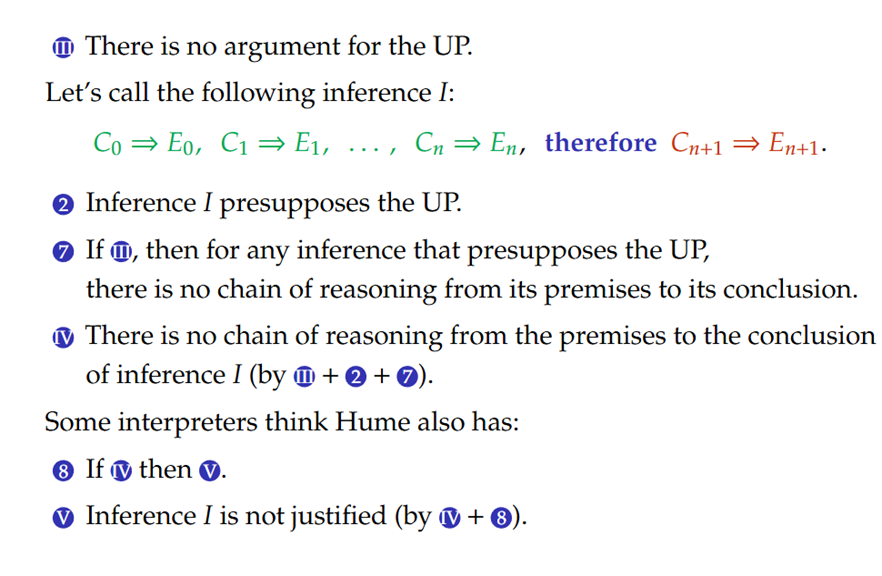

这张图片讨论了休谟关于归纳推理的进一步推理过程，特别是探讨如何从过去的经验推导出未来的推理，即归纳推理的合理性，并揭示了它的逻辑问题。以下是具体解释：

### **推理 I** 的定义：
推理 I 是这样一个推理过程：
- 如果在过去的每个实例 \( C_0 \Rightarrow E_0 \), \( C_1 \Rightarrow E_1 \), ..., \( C_n \Rightarrow E_n \) 中，某种对象 \( C \) 总是伴随着某种效果 \( E \)，那么我们推测：**\( C_{n+1} \Rightarrow E_{n+1} \)**，即未来的类似对象也会伴随相同的效果。

### **推理过程的分析**：
1. **推理 I 假设了一致性原则（UP）**：
   - 要得出未来会像过去一样的结论，推理 I 需要依赖于一致性原则，即假设未来的规律与过去一致。

2. **如果没有对UP的论证，则任何基于UP的推理没有推理链**：
   - 如果一致性原则无法通过论证（如之前已经证明的那样），那么任何依赖一致性原则的推理，例如推理 I，就没有从前提到结论的合理推理链。

3. **推理 I 没有从前提到结论的推理链**：
   - 因为推理 I 依赖一致性原则，而一致性原则本身是没有论证支持的，因此推理 I 无法合理地从前提推导出结论。

4. **一些解释者认为休谟还提出了以下推论**：
   - **如果推理 I 没有推理链，那么推理 I 不成立**：即推理 I 是不合理的、没有依据的。

### **结论**：
推理 I（从过去经验推导未来）的合理性取决于一致性原则的正确性。然而，一致性原则没有得到逻辑论证的支持，因此，推理 I 也无法成立。这进一步加强了休谟对归纳推理的不信任，因为它缺乏一个合理的推理链。

**总结**：
这张图强调了归纳推理的循环性和不成立性，表明我们不能仅仅依赖过去的经验来预测未来，因为这样的推理依赖于一致性原则，而一致性原则本身无法得到证明。

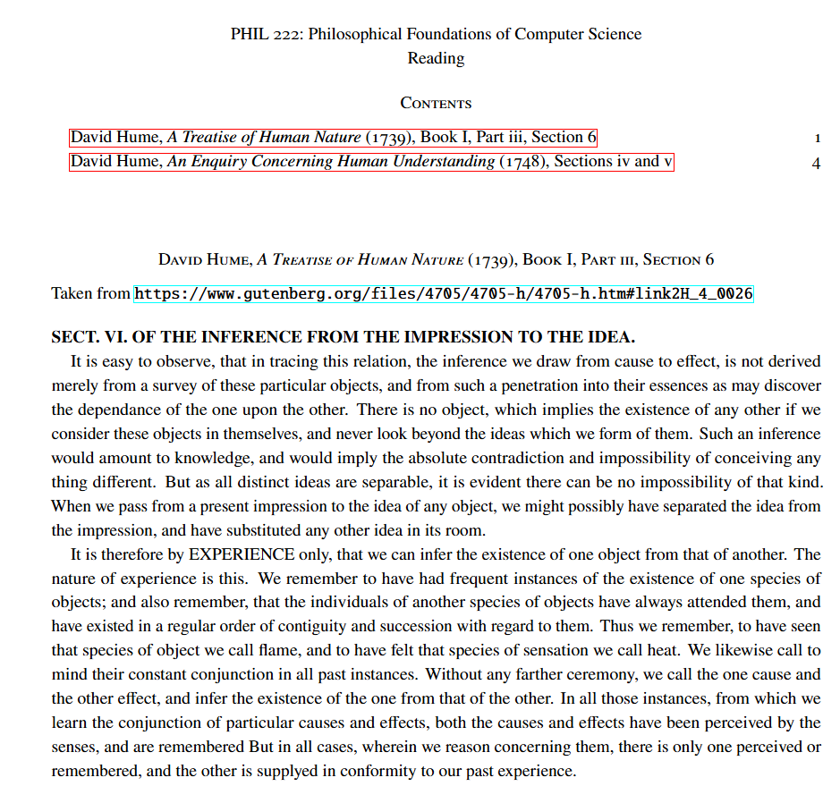

这张图片展示了关于休谟《人性论》（**A Treatise of Human Nature**）中第六节的内容，讨论了**从印象到观念的推理**。

### 主要内容总结：

1. **因果关系的推理不是来自事物本身**：
   - 休谟指出，因果关系的推理并不是通过观察事物的本质而得出的。我们无法仅通过观察一个物体就推断出另一个物体的存在。

2. **观念的可分离性**：
   - 他强调观念是可分离的，意味着我们可以在思维中轻易地将两个事物分开，并不存在逻辑上的矛盾。因此，没有任何物体能够必然地暗示另一个物体的存在。

3. **经验的作用**：
   - 休谟认为，只有通过**经验**，我们才能推断出一个对象的存在可以暗示另一个对象的存在。人类通过反复的经验，逐渐学会了将某些事件与特定的结果联系在一起。我们观察到某些物体和事件的连续性和相互联系（如火与热），并形成了因果关系的观念。

4. **习惯与归纳推理**：
   - 在所有的因果推理中，我们并不是通过逻辑或必然性得出结论，而是通过经验所带来的习惯形成了因果联系。这种习惯让我们在看到一个现象时，自动推断出另一个与之相关的现象。

### 结论：
休谟在这里的观点是，因果关系的推理并非源于事物的本质或必然联系，而是基于长期经验所产生的心理习惯。我们依赖过去的观察和经验来形成对未来的推测，但这种推测没有必然的逻辑基础，只是习惯的产物。

这个段落重点在于展示经验在休谟因果推理中的重要性，以及推理过程中印象和观念的关系。

这段文字是对因果关系的深入讨论，特别是**常相连接（constant conjunction）**的概念，它是休谟因果推理中的一个关键元素。

### 主要内容解释：

1. **常相连接的发现**：
   - 休谟指出，我们发现了因果关系中存在的一种新关系，即“常相连接”。它意味着我们总是观察到某些物体和事件之间的紧密联系和连续性。例如，当我们看到某种现象多次发生，我们会自然地将其与另一现象联系起来，认为它们有因果关系。

2. **接近性和连续性不足以推导因果关系**：
   - 仅仅依靠物体的**接近性（contiguity）**和**连续性（succession）**不足以让我们认定两个物体之间存在因果关系，除非我们多次观察到这种关系的重复。在多个实例中观察到这些关系后，我们才会形成因果推断。

3. **常相连接的局限**：
   - 休谟认为，尽管“常相连接”能帮助我们理解因果关系，但它并不能帮助我们生成全新的观念或理解因果关系的“必然联系”。这种推理只能让我们不断积累关于物体之间相互关系的实例，而无法真正揭示它们之间的必要因果联系。

4. **经验的局限性**：
   - 休谟强调，通过经验，我们可以看到无数相似的例子，但这些例子并不会产生新的原始观念，比如“必要的连接”这一概念。即使有无数的重复经验，这些经验也只是重复了先前的印象，而没有进一步揭示因果关系的根本性质。

5. **推理与必要联系**：
   - 最后，休谟提出，我们可能最终会发现，所谓的“必要联系”并不是基于客观的因果事实，而是我们根据经验所做出的推论。因此，必要联系可能更多依赖于我们如何从印象中推理出观念，而非实际存在于事物本身的客观性质。

### 总结：
这段文字表明，休谟对因果关系的理解强调**经验的局限性**和**习惯性推理**的作用。我们之所以认为某些现象具有因果关系，主要是基于我们多次观察到这些现象同时发生，但这种联系并不等同于逻辑上的必然性，而是通过重复经验形成的“常相连接”。

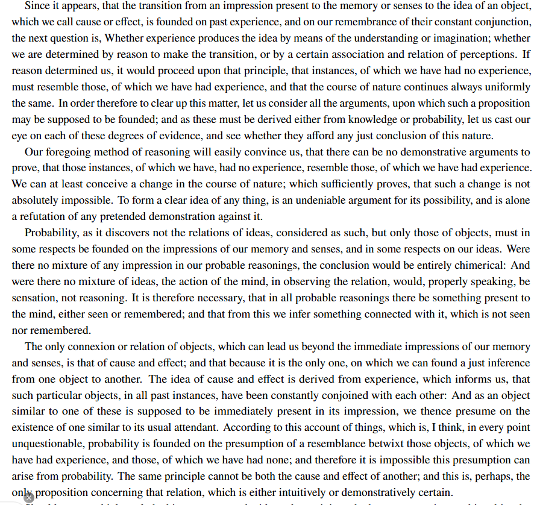

这段文字探讨了休谟关于因果关系和归纳推理的进一步思考，特别是讨论了从印象到观念的过渡，以及我们如何通过经验形成因果关系的观念。以下是具体解释：

### 1. **印象到观念的过渡**：
   - 休谟指出，我们从当下的感官印象或记忆过渡到一个对象的观念，这种推理是基于过去的经验和对现象**常相连接**（constant conjunction）的记忆。我们观察到某些现象之间有规律的关联，因此推断出因果关系。

### 2. **经验与理性的角色**：
   - 休谟质疑这种推理是由**理解**还是**想象**引发的，或者是通过知觉的联想和关联来完成的。如果理性来决定这种推理过程，那么它会基于“未来必须与过去相似”的原则。然而，休谟指出，这一原则没有明确的理性证明，因为我们可以设想自然规律的改变，这并不构成逻辑上的不可能 。

### 3. **演绎证明的局限**：
   - 休谟接着讨论了演绎推理的局限性，认为没有任何演绎论证可以证明“未来的实例必须与过去的经验相似”。事实上，我们完全可以设想自然界会发生变化，这足以证明这样的变化是可能的，而不是必然的 。

### 4. **概率推理的基础**：
   - 在讨论概率推理时，休谟解释道，概率推理依赖于记忆中的感官印象以及我们的观念。我们从过去的印象中推导出未来的结果，这种推理是基于对过去经验的联想和关联，而非基于逻辑推理。

### 5. **因果关系的唯一连接**：
   - 休谟强调，因果关系是我们超越直接感官印象和记忆的唯一连接。我们从过去经验中形成了因果观念，即某一现象总是伴随着另一个现象，因此我们推断出未来类似的现象也会有类似的结果。这个推理过程是通过观察和记忆过去的因果关系而形成的 。

### 6. **概率推理的假设**：
   - 休谟指出，概率推理基于一种假设，即未来的对象与过去相似，这也是为什么我们会假设未来的因果关系会与过去的类似。这种假设并没有逻辑上的必然性，而是基于过去经验的推断 。

### 总结：
这段文字继续探讨了休谟的因果推理理论，强调了经验在我们理解因果关系中的重要性。他认为，因果关系并不是通过理性或逻辑必然性得出的，而是基于对过去经验的记忆和联想。尽管我们无法演绎出未来与过去相同的必然性，但我们仍然依赖过去经验进行推理，形成对未来的预期。这种推理并不是理性必然的，而是基于心理习惯和经验积累。

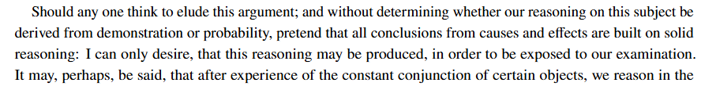

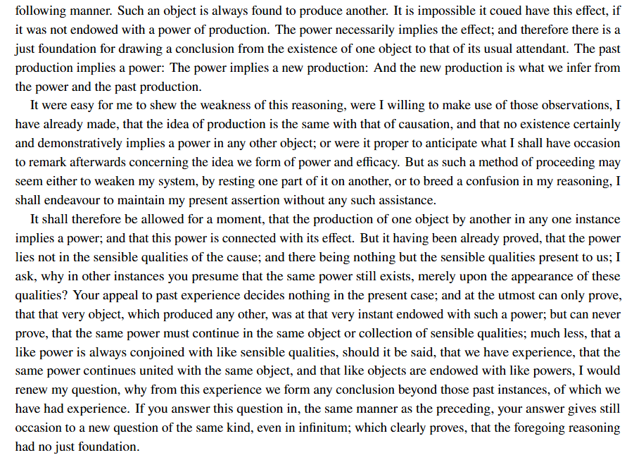

这段文字讨论了对因果推理的质疑，特别是我们如何从一个事件推断出另一个事件的发生。以下是主要内容的解释：

### 1. **质疑因果推理的依据**：
   - 休谟提到，有人可能会试图回避他的论证，声称所有因果关系的结论都是基于坚实的推理。他对此表示怀疑，并希望这种推理能够被公开，以便接受检验。

### 2. **因果推理中的“生产力”概念**：
   - 有人可能会说，某一对象总是能够产生另一个对象（如某一原因总是导致某一结果），而且这个效果的产生依赖于一种内在的生产力。换句话说，这种“生产力”被认为是因果推理的基础。
   - 休谟指出，这种推理认为“过去的生产力意味着未来的生产”，这是一种循环推理。他认为，这种推理并没有真正解释“生产力”的概念，只是通过假设过去的生产力推断出未来的结果。

### 3. **对“生产力”推理的反驳**：
   - 休谟进一步反驳了这种基于“生产力”的推理，指出我们只能从**过去的经验**中推断出某个对象在过去的实例中具备“生产力”，但这并不能证明该对象在未来仍然具备同样的“生产力”。
   - 他质疑为什么我们要假设“生产力”会继续存在，仅仅基于该对象在过去的表现。他指出，过去的经验并不能为未来的结论提供坚实的基础。

### 4. **无法证明“生产力”的延续性**：
   - 休谟强调，即使我们有无数次的经验，这也无法证明某一对象的“生产力”会一直延续下去，甚至无法证明这种“生产力”与对象的表面特征（如感官属性）之间有任何必然的关系。

### 5. **循环论证的风险**：
   - 休谟最后指出，任何基于过去经验的推理都面临循环论证的风险。我们不能因为过去某种对象产生了某种结果，就推断出它在未来也会产生相同的结果。每次推理都是基于假设，而不是理性必然性。

### 总结：
休谟在这段文字中批评了因果推理中的“生产力”概念，指出过去的经验无法证明未来的因果关系是必然的。这种推理陷入了循环论证，因为它依赖于过去的经验来推断未来，但经验本身并不能提供理性的基础来证明未来一定与过去相同。

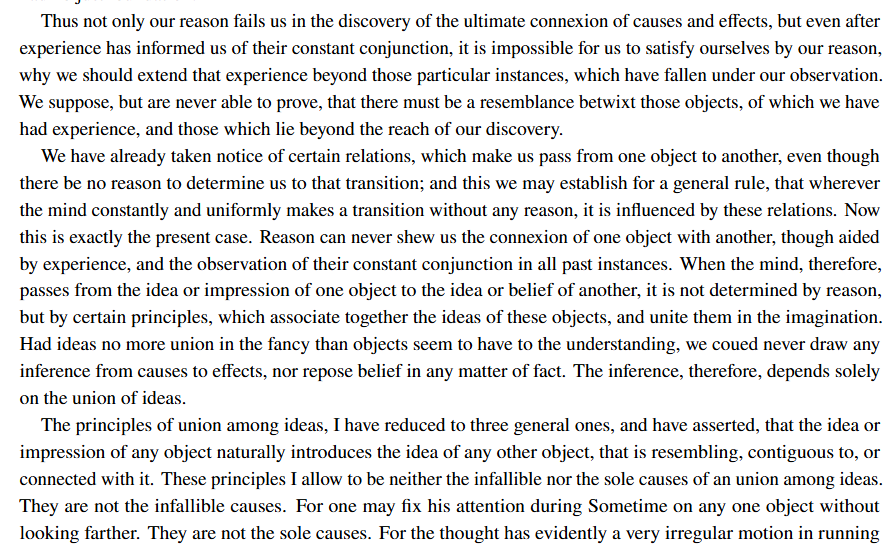

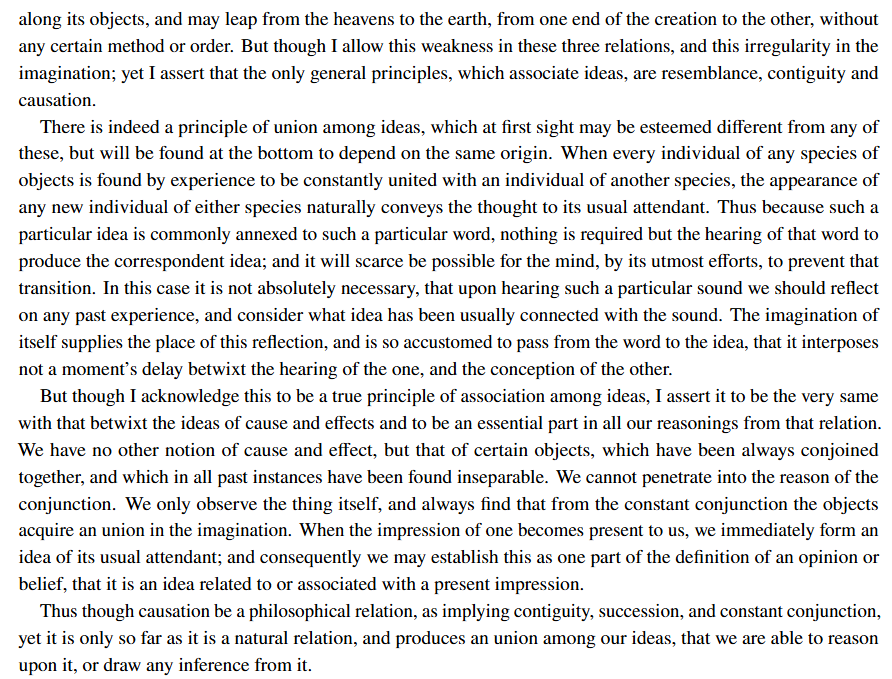

这段文字进一步解释了休谟关于因果关系和**观念的联合原则**（principles of union among ideas）的一些看法。以下是主要内容的解释：

### 1. **经验与因果关系的限制**：
   - 休谟指出，虽然我们的经验告诉我们某些现象之间存在“**常相连接**”（constant conjunction），但我们并不能通过理性发现这些现象背后的终极因果联系。即使我们反复观察到某些现象的关联，也无法证明未来这些现象一定会持续存在同样的关联。

### 2. **从印象到观念的过渡**：
   - 我们在观察到现象之间的关联后，大脑会自动、不断地将这些现象联系在一起，形成从一个印象到另一个观念的过渡。休谟指出，这种过渡并不是由理性引导的，而是通过经验和知觉联想实现的。当我们在过去的经验中反复观察到某些现象一起发生，我们的大脑就习惯性地将它们联系起来。

### 3. **观念的联合原则**：
   - 休谟将**观念的联合**归结为三个基本原则：**相似性**（resemblance）、**接近性**（contiguity）、**因果性**（causation）。这些原则使得我们的观念自然地相互关联，当我们感知到一个现象时，就自然地联想到与其关联的其他现象。

### 4. **观念联合的本质**：
   - 观念的联合不仅仅是随机的，而是有其根源。休谟认为，当我们在经验中反复看到某种现象（如两个现象经常同时发生），大脑就会将这些现象自然而然地联系在一起，形成固定的观念。这一联想过程并不需要任何反思，而是大脑的自动反应。

### 5. **因果推理的本质**：
   - 休谟指出，我们关于因果关系的观念，实际上是基于我们对经验中的常相连接的观察。我们无法穿透这些现象的表面，去发现它们之间的真正原因。我们看到的只是事物之间的重复关联，因此我们的因果推理也依赖于这种现象的重复。

### 总结：
休谟在这段文字中进一步强调了**经验与观念的关联性**。他认为，因果关系并不是通过理性推导出来的，而是通过**经验的反复观察**，大脑将观念自动关联起来。因果性、相似性和接近性是观念联合的三大基本原则，它们帮助我们理解世界，但这种理解并没有揭示事物的最终原因。

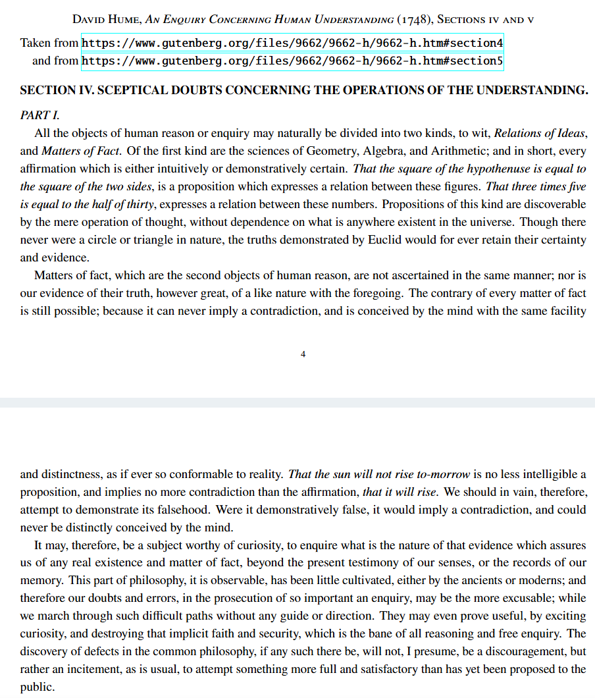

这段文字是休谟在《人类理解研究》中的讨论，涉及人类推理与认知的两种对象，即**观念的关系**和**事实的关系**。以下是具体解释：

### 1. **推理的两种对象**：
   - 休谟将人类推理的对象分为两类：
     - **观念的关系**（Relations of Ideas）：这是数学、几何、代数等领域的推理，它们的命题可以通过逻辑演绎得到，具有必然性。例如，勾股定理（三角形的斜边平方等于两条直角边的平方和）就是一种观念的关系。这类命题不依赖于实际的存在，是通过纯粹的思维得到的，且永远正确。
     - **事实的关系**（Matters of Fact）：这类命题涉及到现实世界中的事实，比如“太阳明天会升起”。这些命题不能通过逻辑演绎来得到，它们基于经验观察，因此不能像观念的关系那样具有必然性。相反，它们是可能的，但其否定也不会导致逻辑矛盾。

### 2. **事实的可否定性**：
   - 休谟指出，关于事实的命题与观念的命题不同。事实的否定并不会造成逻辑上的矛盾。例如，“太阳明天不会升起”这个命题虽然违背我们的经验，但它并不包含逻辑上的矛盾。因此，我们不能通过逻辑推理来证明事实的命题是否为真。

### 3. **事实推理的局限性**：
   - 我们推理事实的真相，依赖于经验和观察，而非必然的逻辑。关于事实的知识只能来自于我们的感官或记忆，超出这些直接证据的部分，我们的推论是没有理性支持的。

### 4. **质疑经验的可靠性**：
   - 休谟指出，我们应当质疑经验所提供的知识的可靠性。我们对事实的推理，依赖于当前的感官或记忆的证据，但这并不能为未来提供绝对的保证。因此，像“太阳明天会升起”这样的命题虽然符合我们习惯的推理，但并不能通过逻辑证明它一定为真。

### 总结：
这段文字阐明了休谟对人类推理和知识的两种类型的区分：**观念的关系**是通过逻辑推导出的必然真理，而**事实的关系**则基于经验，不能通过逻辑必然性来证明。因此，关于事实的推理，虽然经验告诉我们某事可能会发生，但它没有必然的逻辑支持。休谟在这里质疑了我们对事实的认知以及经验推理的可靠性。

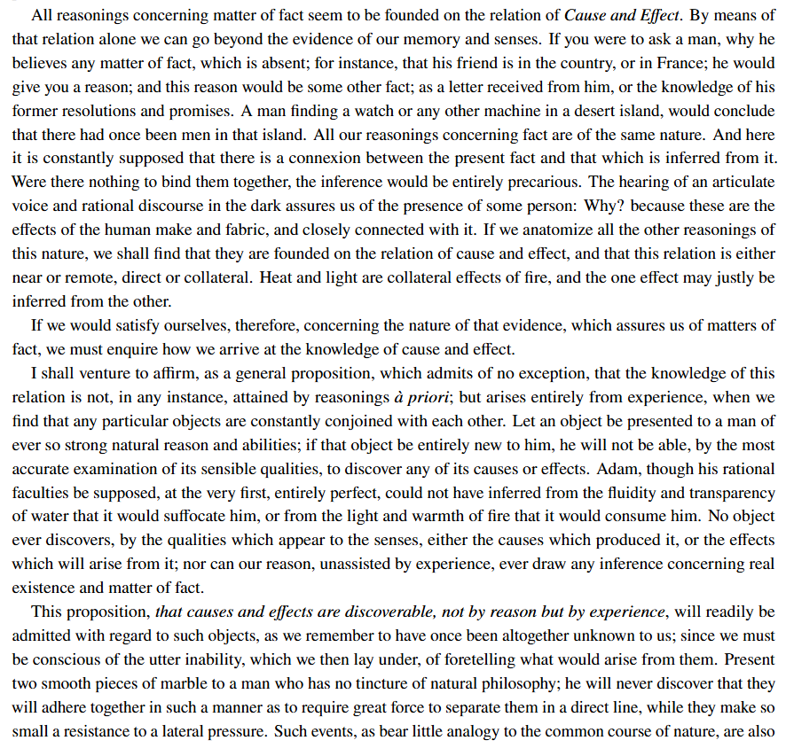

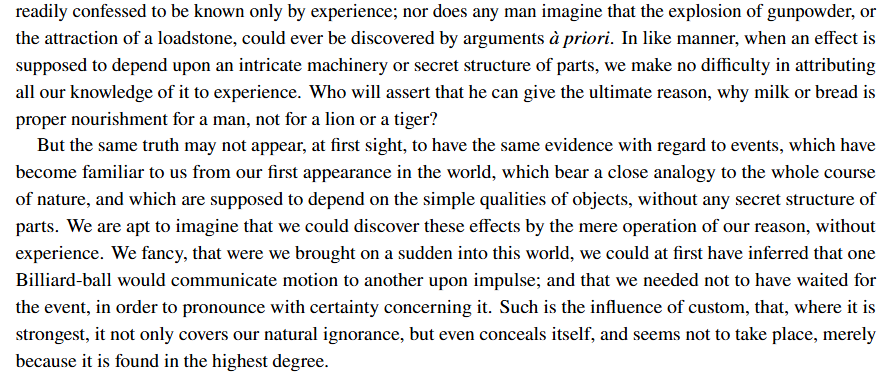

这段文字继续探讨休谟关于因果关系和事实推理的观点，特别是强调**因果关系的知识来源于经验，而非理性推理**。以下是具体解释：

### 1. **事实推理基于因果关系**：
   - 休谟指出，我们所有关于事实的推理都是基于**因果关系**。我们通过因果推理超越了直接的感官和记忆证据。例如，如果有人相信他的朋友在另一个国家，通常他会基于收到的信件或朋友的承诺等其他事实来推论。这些推理都是基于因果关系的，假设过去的承诺或信件与现实情况有某种联系。

### 2. **因果关系的不可分割性**：
   - 休谟进一步解释，我们在推理时总是假设某种联系绑定了现在的事实和推论的结果。所有的推理都源自因果关系，无论这种关系是直接的还是间接的。例如，通过听到一个人在黑暗中讲话，我们推断出那里有一个人，因为我们知道声音的来源通常与人类活动相关。

### 3. **因果关系的知识来自经验**：
   - 休谟明确指出，我们对因果关系的知识并不是通过**先验推理（a priori reasoning）**获得的，而是通过经验积累的。换句话说，我们不是通过理性直接推导出因果关系，而是通过观察事物在时间和空间上的常相连接，得出因果关系。

### 4. **经验的局限性**：
   - 休谟举例说明，即使是理性再强大的人，如果遇到完全新奇的事物，他也无法通过观察其外部特征推导出它的因果关系。例如，一个从未见过火的人不会知道火能燃烧，或者一个从未见过水的人不会知道水会淹死人。这表明，所有的因果知识都必须通过经验获得。

### 5. **经验与理性推理的区分**：
   - 休谟强调，我们不能通过理性来预测事物的因果关系。例如，炸药的爆炸或磁铁的吸引力并不能通过简单的理性推理得出。我们只能通过经验观察来了解这些事物的因果关系。

### 6. **习惯的影响**：
   - 休谟还提到，习惯在我们的推理中起着重要作用。由于我们从小就被教导并经历某些现象的常相连接，因此我们习惯性地认为这些现象是必然的。例如，我们习惯性地认为一个台球球撞击另一个台球球时会传递运动，而不需要等待事件发生来确认。

### 总结：
这段文字进一步强调了休谟的经验主义观点，即**因果关系的知识只能通过经验获得，而不是通过理性推理**。我们无法通过对物体外在特性的观察来推导出它们的因果关系，所有的因果知识都依赖于观察和经验的积累。同时，习惯在我们的因果推理中起着关键作用，使我们习惯于相信某些因果关系是必然的。

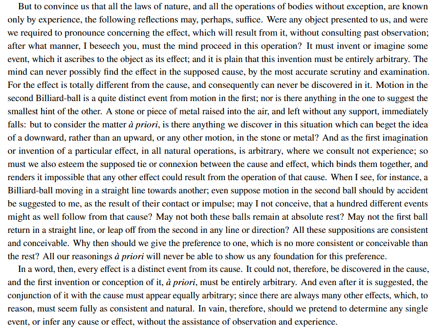

这段文字进一步解释了休谟对**因果关系的批判**，尤其是通过**理性推理（a priori reasoning）**来推导因果关系的不足之处。以下是具体内容的解释：

### 1. **理性无法推导因果关系**：
   - 休谟首先指出，如果我们只依赖理性推理，而不参考过去的经验，我们根本无法预见某个事件会产生什么结果。例如，如果我们看到一个物体而不知道它的历史或过去的表现，我们不可能仅仅通过推理得出它会产生什么效果。

### 2. **原因与结果的差异**：
   - 他进一步解释，**结果与原因**是完全不同的。以台球为例，第一颗台球的运动和第二颗台球的运动是完全不同的，后者的运动不能从前者中直接推导出来。即使我们仔细观察原因，也无法在其中发现任何能明确暗示结果的东西。这说明，**原因与结果之间的关系**并不是显而易见的，它需要通过观察和经验来获得。

### 3. **经验的重要性**：
   - 休谟用一个例子进一步说明经验的重要性：当一块金属被抬到空中并落下时，我们无法通过单纯的理性推理得出它会下落的结论。只有通过经验，我们才知道物体会下落。因此，所有自然操作的初步想象和推论都是**任意的**，只有通过经验，我们才能建立原因与结果的关系。

### 4. **可能的多种结果**：
   - 他还指出，基于原因，我们可以推测出许多不同的结果，但这些推测都是**合理的**，并且没有一种推测比其他推测更有道理。例如，台球的碰撞可能会导致多个不同的结果，比如第二个球保持静止、反弹，或者沿不同方向移动。所有这些结果在逻辑上都是可行的，没有任何一种比其他结果更具逻辑优先性。

### 5. **理性推理的局限性**：
   - 休谟强调，理性推理无法提供我们对因果关系的任何理解。每一个结果都是与原因完全不同的，并且从原因中无法通过理性推导出结果。因此，任何初步对因果关系的推测，若没有经验的帮助，都是完全**任意的**。

### 总结：
这段文字表明休谟的观点，即**理性推理无法揭示因果关系**。原因和结果是完全不同的，无法从原因中直接推导出结果。我们只能通过观察和经验得出因果关系，而不是通过纯粹的逻辑推理。这表明了因果推理的局限性，强调了经验在理解世界中的关键作用。

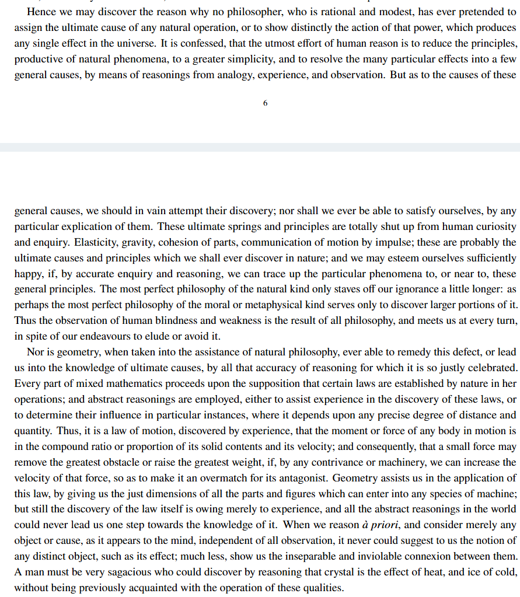

这段文字探讨了**人类理性对自然现象最终原因的局限性**，以及通过**经验、观察和类比**得出自然现象解释的过程。休谟在这里强调了我们无法通过纯粹的理性推理来发现世界的终极因果关系，以下是详细解释：

### 1. **理性不能发现自然现象的终极原因**：
   - 休谟指出，没有哪位理性和谦虚的哲学家声称能够揭示任何自然现象的最终原因。尽管人类理性可以通过简化和归纳将自然界的多种现象归结为几条普遍原则（如重力、弹性等），但对于这些原则背后的终极原因，我们永远无法通过理性得出确切的结论。

### 2. **最终原因的不可知性**：
   - 我们对于自然界“终极动力”和“原理”的探究是注定无解的。无论是弹性、重力、部分的凝聚，还是通过碰撞传递的运动，这些现象的背后原因是人类无法完全知晓的。休谟认为，这些终极原理超出了人类理性和经验的范畴，无法通过探究获得。

### 3. **观察和类比的有限性**：
   - 我们可以通过**经验、观察和类比**去追踪自然现象背后的普遍原则，例如通过实验确定物体在运动中的规律和力的作用，但这些都是在有限的范围内的推测，无法揭示更深层次的因果关系或终极原因。

### 4. **数学和哲学的局限性**：
   - 休谟还讨论了**几何学**和**自然哲学**在探索自然界时的局限性。尽管数学和几何学帮助我们描述和分析物体的运动和力的大小等，但它们仍无法揭示物体之间的根本因果关系。例如，通过几何学我们可以得知物体运动时的速度和力，但我们无法通过这些推导出热与冷的本质原因，或水晶是如何冷却而产生冰的。

### 5. **人类无知与局限**：
   - 休谟认为，所有哲学的最终结果就是揭示了人类**无知与局限**的事实。无论通过道德哲学、形而上学，还是自然哲学，我们只是在更大范围内发现了我们无知的本质。

### 总结：
休谟在这段文字中强调了人类理性和经验在理解世界中的局限性。尽管我们可以通过观察和类比发现一些自然现象的规律和一般原则，但我们无法得知这些现象背后的**终极原因**。哲学和几何学可以帮助我们理解现象的表面特征，但不能揭示事物本质的因果关系。最终，我们必须接受自己在许多方面的无知。

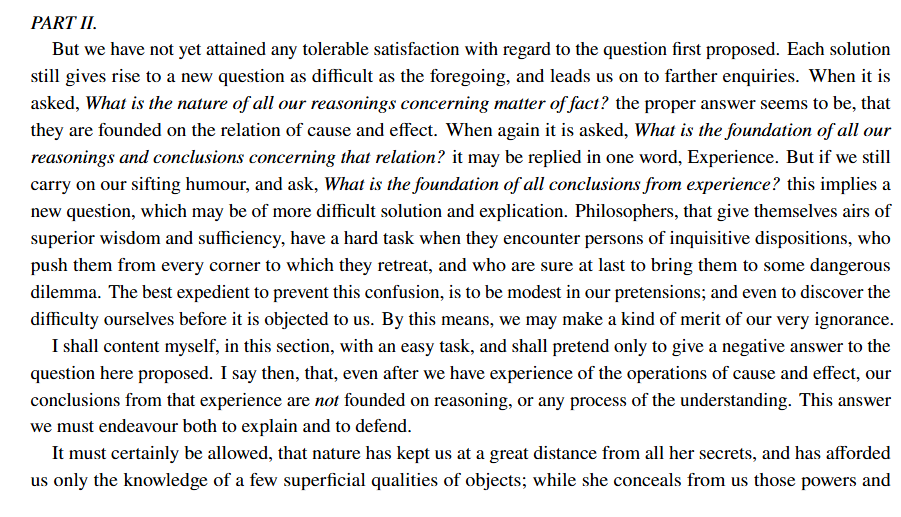

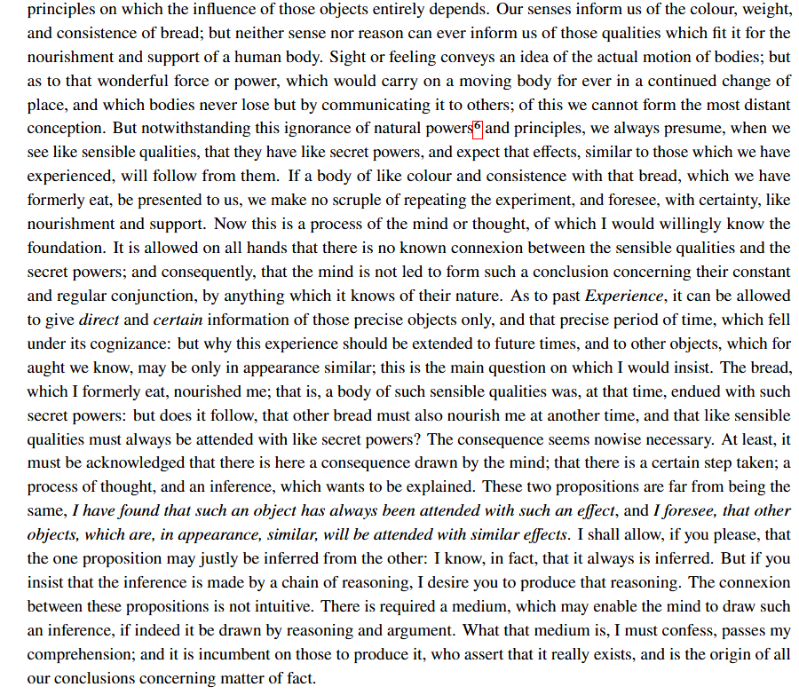

这段文字继续讨论了休谟对**经验推理的怀疑**，特别是针对因果推理的基础问题进行了详细的分析。以下是详细解释：

### 1. **经验推理的不足**：
   - 休谟指出，尽管我们依靠经验得出关于因果关系的推论，但这种推论并不基于**理性推理**或**理解的过程**。当我们看到某一现象与某一结果之间的联系时，我们总是假设这一联系会持续存在，但这种推理实际上没有充分的理性依据。

### 2. **关于因果关系的终极问题**：
   - 休谟进一步追问：**所有因果推理的基础是什么？** 这里的核心问题是：我们如何从经验中得出未来的结论？这种推理的基础到底是什么？他认为，这个问题比初步提出的还要复杂得多，哲学家们在面临这类深入探讨时，通常会变得谨慎，甚至可能回避。

### 3. **自然隐藏的力量和原则**：
   - 休谟指出，自然只向我们揭示了表面的特征，比如物体的颜色、重量和形状，但隐藏了它们真正的**力量和原则**。例如，我们可以通过感官得知面包的形状和质地，但我们不知道是什么真正赋予了面包营养的能力。我们的感官无法揭示这些深层次的力量，而这些力量是我们推理所依赖的关键。

### 4. **推理中的不确定性**：
   - 休谟进一步解释道，我们的推理只是基于过去的经验，而非对事物本质的理解。例如，如果一块面包曾经提供了营养，我们通常会推断另一块看起来相似的面包也会具有相同的效果。但这种推理并没有确定性。过去的经验并不能保证未来的相似物会产生相同的结果。

### 5. **经验的局限性**：
   - 尽管经验可以为我们提供一些具体对象的信息，但这种经验无法直接告诉我们未来的情况，或其他对象的行为。推理的过程不是通过明确的逻辑链条连接起来的，而是依赖于**习惯性**的联想。

### 6. **因果推理的空白连接**：
   - 休谟提到，我们总是发现某一现象总是伴随着另一现象（例如，面包总是提供营养），然后得出结论：未来相似的现象也会产生类似的结果。这种推理实际上是一个推断过程，但缺乏一个明确的、理性的基础。

### 总结：
这段文字揭示了休谟对因果推理的根本性怀疑。他认为，尽管我们基于经验做出许多推论，但这些推论并没有理性的基础。我们对未来的推测并不是通过理解事物的本质得出的，而是基于过去经验的**习惯性**联想。自然界隐藏了许多我们无法通过感官或理性直接理解的力量，这使得我们的推理充满了不确定性。

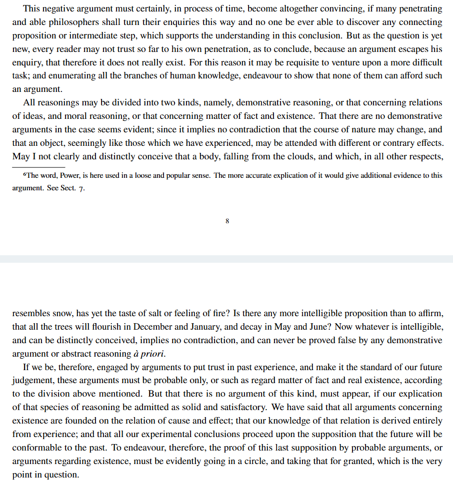

这段文字继续探讨休谟对**因果推理和经验主义**的怀疑，尤其是对我们如何信任过去经验的讨论。以下是详细解释：

### 1. **负面论证的说服力**：
   - 休谟认为，随着时间的推移，如果更多的哲学家深入探讨因果推理的基础，并且没有人能够找到一种能够支持这种推理的中间步骤，那么他的“负面论证”将变得更加令人信服。这个负面论证指的是：我们无法通过逻辑或理性证明未来一定会像过去一样。

### 2. **人类推理的分类**：
   - 休谟再次将人类推理分为两种：
     - **演绎推理（demonstrative reasoning）**：关于观念的关系，如数学和逻辑推理。
     - **道德推理（moral reasoning）或事实推理**：关于事实和存在的问题，依赖于经验而非逻辑必然性。

### 3. **自然规律的变化可能性**：
   - 休谟指出，关于事实的推理并不能通过逻辑演绎得出，因此，自然规律的变化是可以设想的，没有逻辑上的矛盾。例如，他提到一个物体从云中掉落，看起来像雪，但却有盐的味道或火的触感。这说明，自然的变化虽然违背我们的常识，但它并不构成逻辑矛盾。

### 4. **经验的循环论证**：
   - 休谟进一步指出，我们对事实的所有推理都基于**过去的经验**，并且这种推理预设了未来会与过去相同。但这种预设本身无法通过逻辑证明，因此，如果我们试图用过去的经验来证明未来的结果，就陷入了**循环论证**。也就是说，我们依赖过去的经验来推断未来，但同时，我们也假设未来会像过去一样。

### 5. **对经验主义的挑战**：
   - 休谟总结说，所有关于事实和存在的推理都依赖于因果关系，而因果关系本质上是从经验中得出的。由于我们无法通过逻辑证明未来必定与过去一致，我们的推理就陷入了不确定性。因此，我们依赖过去经验得出的结论无法真正为未来提供逻辑支持。

### 总结：
这段文字表明，休谟对因果推理的批判核心在于**经验的循环论证**问题。我们用过去的经验来推测未来，但这种推测本身预设了未来会像过去一样，这就导致了逻辑上的循环。休谟认为，我们不能通过逻辑或经验证明自然规律不会改变，因此我们对未来的推测总是充满不确定性。

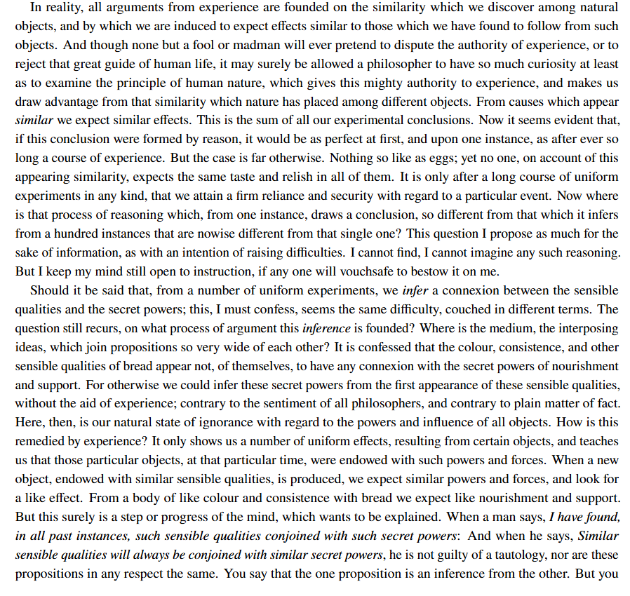

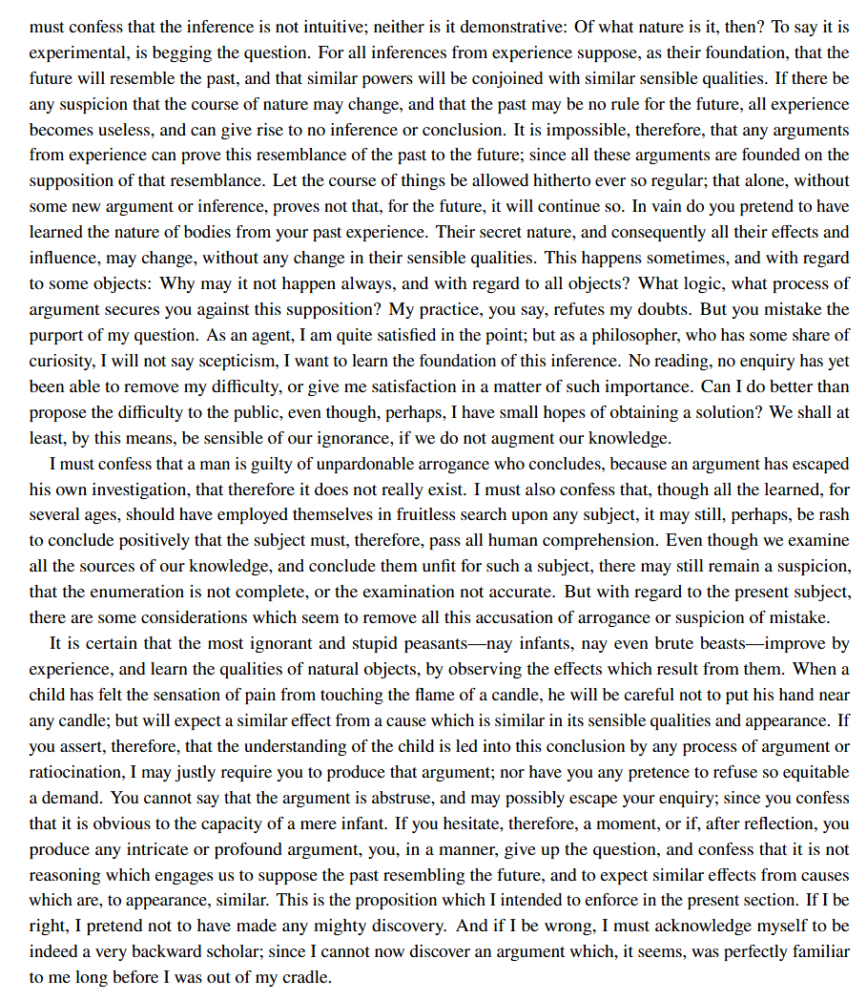

这段文字继续深入探讨了**因果推理的基础**，尤其是我们如何从经验中得出未来的结论。以下是内容解释：

### 1. **经验推理中的相似性**：
   - 休谟指出，所有的经验推理都是基于我们在自然对象中观察到的**相似性**。我们期待相似的对象会产生相似的效果，例如我们观察到某种现象与结果的关联，然后期望未来类似的现象也会产生相同的结果。休谟质疑这种推理的合理性，认为我们并没有理性的基础来证明这种关联是必然的。

### 2. **相似性的局限性**：
   - 尽管我们通过长期的经验建立了对相似性的依赖，但休谟指出，即使在观察了大量的实验之后，我们依然无法得出一个单一的实例推论出未来必然的结果。例如，不同的鸡蛋可能外表相似，但它们的内部可能大不相同。因此，我们从经验中得出的推论，实际上并没有理性支持的基础。

### 3. **经验与推理的缺失**：
   - 休谟承认，经验确实教会了我们一些关于物体的知识，但这种知识更多依赖于我们观察到的**表面特征**，而非事物的深层本质。例如，面包的颜色和质地可能表面上与其“营养支持”的功能相关，但我们无法通过观察这些特征直接得知它们的因果关系。

### 4. **经验推理中的疑问**：
   - 休谟进一步指出，即便我们通过一系列统一的实验观察到某些现象与某些结果的关联，这并不能解决一个核心问题：**我们如何从经验中推导出因果关系**？他认为，没有任何“中间步骤”可以解释我们如何从表面特征推导出深层的因果联系。

### 5. **循环论证的质疑**：
   - 休谟质疑基于过去经验的推理是一个**循环论证**。我们无法通过经验证明未来会与过去相同，因此所有基于经验的推理在逻辑上都是不完整的。即使我们观察到了大量的现象与结果的关联，这也不能确保未来同样的现象会产生相同的结果。

### 6. **对人类推理的最终怀疑**：
   - 休谟总结道，我们在人类推理中的某些习惯，实际上是基于**习惯和经验**的，而不是基于理性的推理。即使最无知的农民或小孩通过经验学会避免火焰带来的疼痛，这也不是通过理性推导出来的，而是通过观察到的相似性。这使得我们对于因果关系的理解变得更加复杂和不确定。

### 总结：
休谟在这段文字中探讨了人类**因果推理的根本问题**，即我们如何从过去的经验中得出对未来的结论。他质疑我们对相似性的依赖，并指出经验并不能为未来的推测提供坚实的基础。通过这种批判，他揭示了经验主义中的循环论证问题，并最终对我们如何从经验中得出因果推理提出了深刻的怀疑。

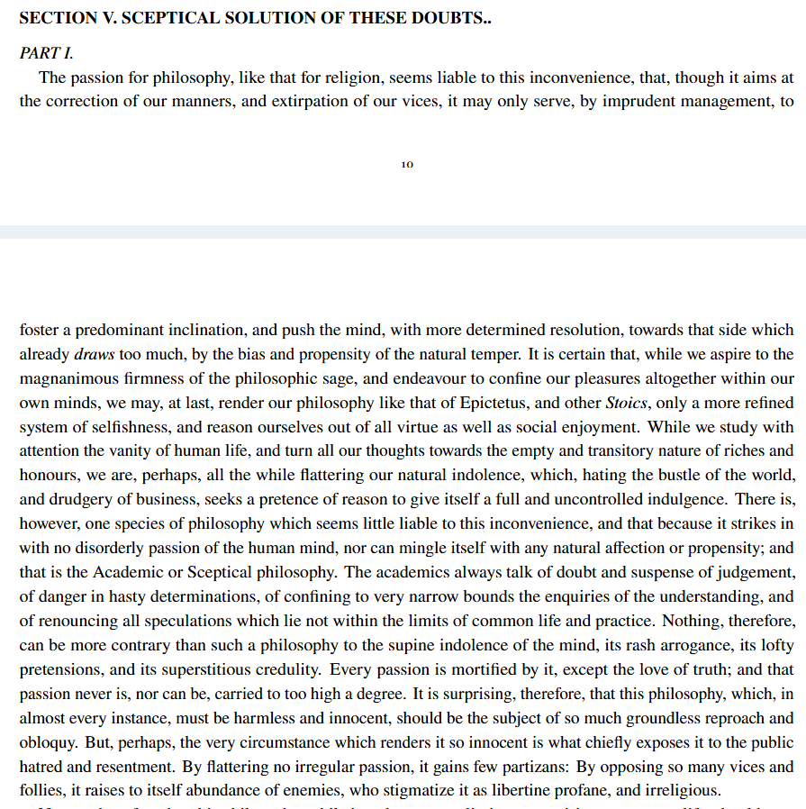

这段文字来自《人类理解研究》中的**第五节：怀疑主义解决这些疑问**部分。休谟在这段文字中探讨了**哲学和怀疑主义**的性质，特别是它们可能带来的影响和潜在问题。以下是详细解释：

### 1. **哲学和宗教的相似性与问题**：
   - 休谟指出，哲学与宗教一样，可能存在一个问题，即尽管它们的目的是为了**纠正我们的行为和消除我们的恶习**，但如果处理不当，它们可能会导致相反的结果。哲学的追求可能让人过度专注于某种倾向，而这种倾向已经在我们天性中有很强的偏向性。

### 2. **斯多葛派哲学的潜在危险**：
   - 休谟特别提到了**斯多葛派哲学**，例如爱比克泰德的哲学。他认为，斯多葛派哲学可能是一种过于**自私的系统**，鼓励人们将所有的快乐限制在自己的思想中，进而排斥一切社会和道德上的享受。这种哲学可能让我们“理性地”推理出，所有的**美德**和**社会享受**都是无关紧要的，甚至不值得追求。

### 3. **哲学对人类生活的影响**：
   - 休谟批评这种过度的哲学思考可能使我们**忽视人类生活的价值**，转而关注**财富和荣誉的虚无性**。这种过度的哲学沉思可能会让我们对现实生活失去兴趣，认为这些世俗事务毫无意义，而这可能实际上是在**助长懒惰和逃避现实**。

### 4. **怀疑主义哲学的优势**：
   - 然而，休谟也提到一种不太容易陷入这种问题的哲学，即**怀疑主义哲学**（Academic or Sceptical philosophy）。怀疑主义哲学没有强烈的**人类情感或偏见**的驱使，它也不与任何自然倾向或感情结合在一起。这种哲学鼓励人们保持**怀疑态度**，避免过于武断的判断，要求哲学家们限制他们的思考范围，只探讨那些在**常识和实践范围内**的问题。

### 5. **怀疑主义的力量与批评**：
   - 休谟认为，怀疑主义哲学的每一种激情都与**追求真理**有关，它并没有产生极端的、不合理的影响。因此，怀疑主义的哲学家不会犯下“无知和傲慢”的错误，而是对人类知识的局限保持清醒的认识。休谟感到惊讶的是，尽管怀疑主义哲学并不带来负面的情感或混乱，却常常受到人们的**批评和误解**，这种批评源于人们对其**怀疑态度**的抵触。

### 总结：
休谟在这段文字中讨论了哲学，尤其是**怀疑主义哲学**的本质。他认为，哲学虽然追求真理和美德，但如果处理不当，可能会引导人们走向过度的自私或忽视现实生活的倾向。相比之下，怀疑主义哲学更强调**理性的怀疑**，帮助人们避免武断的判断，保持对人类知识的局限性的清醒认识。这种哲学被休谟认为是更为理智且不容易导致负面后果的。

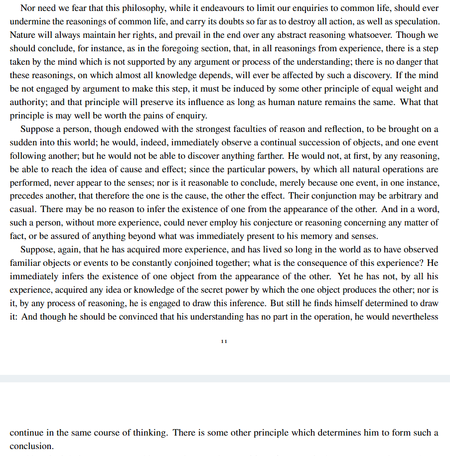

这段文字继续探讨了休谟关于**因果关系和经验推理的局限性**，特别是关于我们如何通过经验得出因果推理的本质问题。以下是详细解释：

### 1. **哲学对日常生活推理的影响**：
   - 休谟首先表示，尽管怀疑主义哲学可能会限制我们对抽象推理的探讨，但它不会破坏我们在日常生活中的推理能力。即便哲学质疑经验推理的基础，日常生活中的推理仍然依赖于习惯和本能，而不会受到这种怀疑的威胁。**自然的力量**仍将主导我们的行为和推理，即使哲学家揭示了理性推理的局限性。

### 2. **因果推理的本质不依赖理性**：
   - 休谟提出，虽然在所有的经验推理中，有一步是无法通过理性或理解的过程来解释的，但人类心智依然会接受这种推理。这种推理不是基于逻辑或理性的演绎，而是通过某种强大的**本能或原则**，这个原则在人的天性中发挥着作用。

### 3. **假设一个有理性能力的人来到世间**：
   - 休谟假设一个具有强大理性和反思能力的人突然来到这个世界，他会观察到事件的持续发生和物体的不断更替，但仅凭这些观察，他无法发现事件之间的因果关系。因为自然界中执行因果关系的“力量”是无法通过感官直接观察到的，因此这个人不会仅仅因为看到某个事件总是跟随另一个事件，就得出因果关系的结论。

### 4. **因果推理的习惯性**：
   - 如果这个人获得了更多的经验，并在世界上观察到相同的事件经常一起发生，他会开始通过**习惯性推理**来得出因果关系的结论。即使他没有任何关于物体如何产生作用的具体知识，他依然会推断出一个物体的出现会引发另一个物体的反应。换句话说，尽管理性没有发挥作用，他仍然会本能地得出因果推论。

### 5. **隐藏的原则和力量**：
   - 休谟指出，即使经过大量经验观察，我们仍然无法掌握物体之间相互作用的“秘密力量”。我们无法通过理性解释为什么这些现象会持续发生，但我们仍然被某种隐藏的**原则或习惯**所引导，继续相信因果推理。

### 总结：
这段文字表明，休谟认为我们对因果关系的理解并不是通过理性推导得出的，而是通过经验积累的**习惯性联想**。即使我们不能通过理性发现隐藏在自然现象背后的力量，我们的思想仍然会自动得出因果结论。这种推理不是基于理解或逻辑，而是由更深层次的心理机制或原则所驱动。

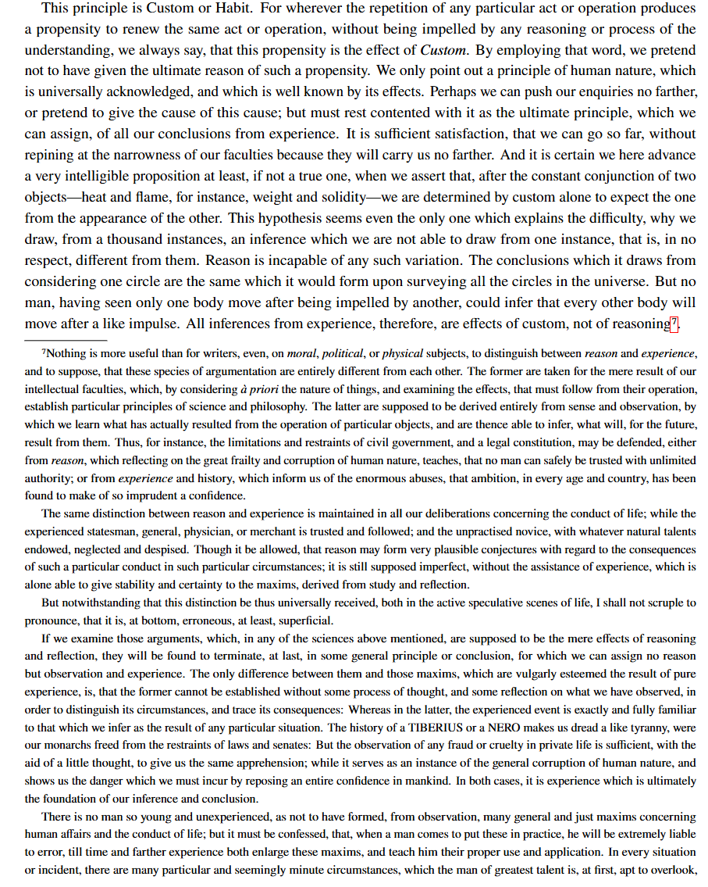

这段文字讨论了休谟关于**习惯或习俗**（Custom or Habit）的重要性，以及它如何在我们的推理和经验中发挥关键作用。以下是详细解释：

### 1. **习惯是因果推理的基础**：
   - 休谟指出，我们基于经验得出的所有推理并不是通过理性或理解，而是通过**习惯**（Custom）或**习俗**（Habit）。当某个操作或事件反复发生时，我们的心灵会倾向于期待同样的事件再次发生。这种期望不是通过理性推导出来的，而是通过习惯形成的。换句话说，**习惯推动了我们的因果推理**，让我们相信未来会与过去类似。

### 2. **习惯掩盖了终极原因**：
   - 休谟承认，当我们谈论习惯时，我们实际上是在掩盖对事物终极原因的无知。通过使用“习惯”这个词，我们仅仅指出了一个人类行为的原则，这个原则被广泛承认，并通过其效果为人所知。我们并没有解释为什么这些现象会不断重复发生，只是满足于习惯性地接受它们的重复。

### 3. **习惯的重要性**：
   - 休谟强调，习惯是**人类推理的基础**，尤其是在因果关系方面。当我们观察到两件事物（例如热与火、重量与固体）总是一起出现时，我们通过习惯得出结论，认为它们将来还会继续一起出现。休谟指出，理性本身无法从一个圆推导出宇宙中所有圆的性质，而习惯却让我们通过有限的经验得出广泛的结论。

### 4. **经验与理性的区分**：
   - 休谟进一步区分了**理性**和**经验**的作用。理性通常被认为是推导未来结果的工具，但实际上，经验通过**观察**和**反思**，为我们的推理提供了基础。经验告诉我们过去的现象如何发生，而习惯让我们根据这些经验推断未来。

### 5. **习惯在日常生活中的作用**：
   - 休谟认为，习惯不仅在科学推理中起作用，而且在**生活的实践中**也同样重要。无论是在政治、商业还是个人生活中，经验所获得的习惯性结论为我们的行为提供了指导。休谟引用历史人物如提比略和尼禄的例子，表明我们对他们的认识不是通过纯粹的理性得出的，而是通过观察和习惯。

### 6. **实践中的经验和习惯**：
   - 休谟指出，即使是最有才华的人，在实际生活中运用经验和习惯时，最初也会感到困惑。因为现实生活中的情况非常复杂，只有通过反复实践，才能学会如何在各种具体的情况下应用这些习惯性推理。

### 总结：
这段文字强调了**习惯和经验**在我们推理中的重要作用。休谟认为，我们的因果推理不是基于理性的，而是基于我们通过习惯和经验学到的知识。习惯为我们提供了关于未来的推断，而不是理性推理本身。同时，休谟还指出，无论是在科学还是在日常生活中，习惯和经验都是我们行为和决策的基础。

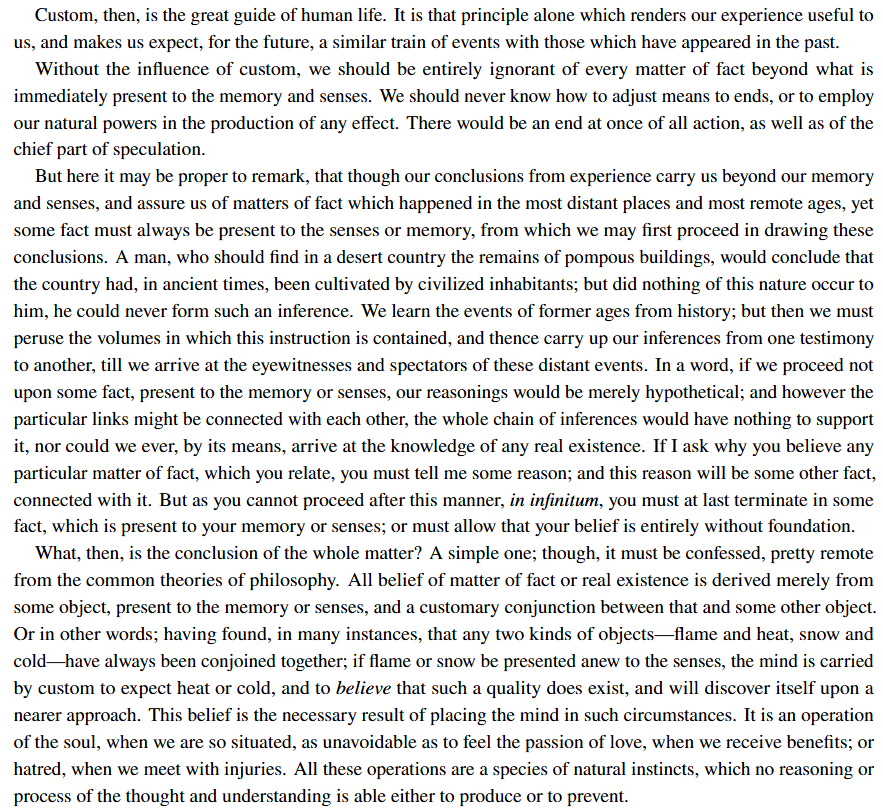

这段文字进一步探讨了**习惯（Custom）**在我们推理和行为中的重要性，特别是在我们如何得出**事实信念**和**实际存在**的结论方面。以下是详细解释：

### 1. **习惯是人类生活的伟大指南**：
   - 休谟认为，**习惯**是人类生活的核心，它使我们的经验具有实用性。习惯让我们能够推测未来会与过去相似，这使得我们能够预期未来会发生的事情。如果没有习惯的影响，我们将无法得出任何超出感官和记忆的结论，并且我们的行为将失去方向。

### 2. **习惯在推理中的作用**：
   - 休谟指出，虽然我们通过经验可以得出一些超越我们直接感知的结论（例如，推测遥远的过去发生的事情），但这些推论仍然依赖于某些**直接的事实**。例如，如果一个人在荒漠中发现了宏伟的建筑遗迹，他会推测这里曾被文明人居住过。但这种推论必须基于某些直接可见的事实。没有感官或记忆的支撑，我们的推理只能是**假设性的**，没有任何现实基础。

### 3. **历史推理中的习惯**：
   - 当我们通过**历史**了解过去的事件时，我们实际上是通过证人的记忆或证据来得出结论。休谟强调，我们最终必须依赖于某些**真实存在的事实**，这些事实可以通过感官或记忆直接接触到。如果我们不这样做，我们的所有推理都将失去根基，变得毫无根据。

### 4. **推理链条的终结**：
   - 休谟指出，推理的链条最终必须停止于某个我们可以直接感知的事实。我们不能无限制地推理下去，否则最终我们将得出一个没有基础的信念。我们所有关于**事实存在**的信念，最终都必须与某些真实的、可以感知的事实相联系。

### 5. **习惯与信念的形成**：
   - 休谟总结道，所有关于**事实和实际存在的信念**，最终都是源自于我们的感官或记忆，并且是通过习惯性关联建立起来的。例如，当我们看到火焰，我们习惯性地期待热，当我们看到雪，我们习惯性地期待冷。这种信念是**自然而然形成的**，并不是通过理性推理得出的。我们的头脑自动形成这些联想，就像我们自然地感受到快乐或痛苦一样。

### 总结：
这段文字强调了**习惯**在我们推理和信念形成中的核心作用。休谟认为，我们的所有关于**事实和存在的信念**，都依赖于我们感官或记忆中的直接经验，并且通过习惯性关联来形成推理。没有这些直接的感知支持，我们的推理就会失去根基，变得毫无依据。

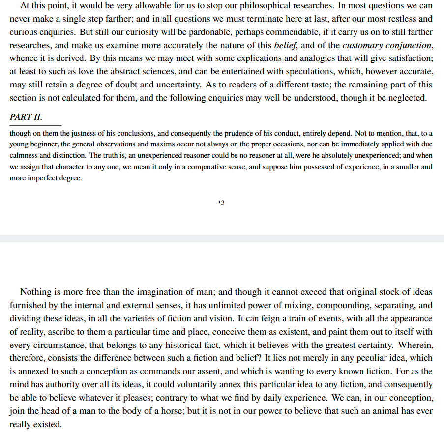

这段文字继续探讨了**人类想象力**的力量以及其与**信念**的区别。以下是详细解释：

### 1. **停止哲学探讨的许可**：
   - 休谟首先指出，在哲学探讨中，我们可以选择在某个点停下，并且不再继续深究。对于大多数问题，我们可能在某个时刻停止进一步的推理。尽管如此，他承认，**好奇心**可能会驱使我们继续追问，尤其是关于**信念的本质**以及**习惯性联系的形成**。这种进一步的探究可能会提供一些解释和类比，尽管它们可能并不完全解答所有问题。

### 2. **信念的探究**：
   - 休谟认为，如果我们继续探讨信念的本质，可能会发现一些解释，但仍然会保留某种程度的**疑虑和不确定性**。这种探索可能会吸引那些喜欢抽象科学的人，但对于其他人来说，休谟建议他们可以忽略这些复杂的讨论。

### 3. **想象力的力量**：
   - 休谟接着讨论了**人类的想象力**，认为没有什么比想象力更自由的了。想象力可以混合、分离和重新组合我们通过感官得到的所有观念，并在这个过程中产生各种**虚构的情景**。例如，想象力可以创造出一系列事件，赋予它们所有现实的外表，并将它们描绘成像历史事实一样真实。

### 4. **信念与虚构的区别**：
   - 休谟指出，想象力可以创造出任何情景，并赋予它们看似真实的细节，但这些**虚构的情景与信念之间存在根本区别**。这种区别并不在于某个特别的观念，而在于**信念带有一种命令我们接受的力量**，而虚构的情景则缺乏这种力量。尽管我们可以在想象中创造出一个**人头马身**的形象，但我们不能真的相信这种生物存在过。

### 5. **经验的限制**：
   - 休谟最后总结道，虽然我们可以通过想象创造出任何东西，但**信念**是由经验所限定的。我们只能相信那些与我们的实际经验相符的东西，而那些超越经验的虚构情景，虽然可以被想象，但永远不会成为我们真正的信念。

### 总结：
这段文字讨论了**信念**与**想象力**的区别。休谟认为，人类的想象力极其强大，可以创造出虚构的情景，但信念并不仅仅依赖于想象，而是由我们的经验所引导。信念具有一种“强制我们接受”的力量，而虚构的情景则缺乏这种力量。我们可以想象很多东西，但最终我们的信念仍然必须与我们实际的经验相一致。

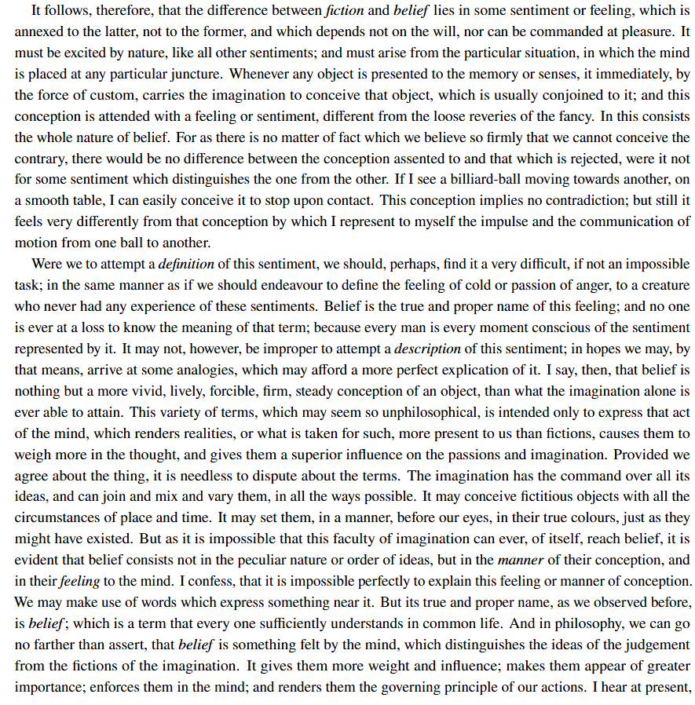

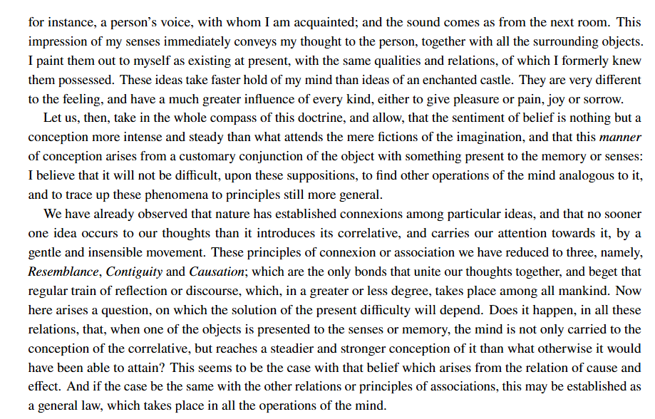

这段文字进一步探讨了**信念与虚构**之间的区别，特别是它们在心理上引发的不同**感情或感受**。以下是详细解释：

### 1. **信念与虚构的区别**：
   - 休谟指出，**信念与虚构**的区别在于信念带有一种附加的**感情或感受**，这种感受不依赖于我们的意志，也不能随意产生。它必须由**自然**激发，并且与具体情况相关联。信念与虚构的根本区别在于，信念通过这种感情或感受使我们更深刻地接受某些观念，而虚构则不具备这种力量。

### 2. **感受的不同**：
   - 休谟进一步说明，当我们看到两个台球相互碰撞时，我们可以想象它们的运动，但这并没有包含任何逻辑矛盾。然而，这种想象与我们观察实际物体运动时所感受到的东西不同。信念带有一种更加强烈的感受，使我们认为这个现象是真实发生的。

### 3. **信念的定义**：
   - 休谟承认，**定义信念的感受**是非常困难的，就像试图向从未体验过某种情感（例如寒冷或愤怒）的人解释这种情感一样。他将信念描述为一种**更生动、更强烈、更坚定的观念**，相比之下，虚构只是较弱的心理现象。

### 4. **信念的作用**：
   - 信念使得某些观念比虚构的内容**更真实**，并在我们的思维中产生更大的影响力。信念不仅影响我们的思维，还影响我们的**情感和行动**，使得我们对信念的事物有更强烈的反应。

### 5. **联想原则**：
   - 休谟总结说，**信念的强烈感受**是源自于对象与我们的记忆或感官经验之间的习惯性联系。这种联系会使得我们的思维从一个对象自动转移到另一个相关的对象。这种联想过程的背后有三大原则：**相似性**、**邻近性**和**因果关系**。

### 总结：
这段文字探讨了信念的本质及其与虚构的区别。休谟认为，信念之所以比虚构更有力，是因为它带有一种更强烈的感情或感受，而这种感受源自于对象与我们记忆或感官经验之间的**习惯性联系**。他提出了三大联想原则——相似性、邻近性和因果关系——解释了我们如何在心理上从一个对象自然地联想到另一个对象。

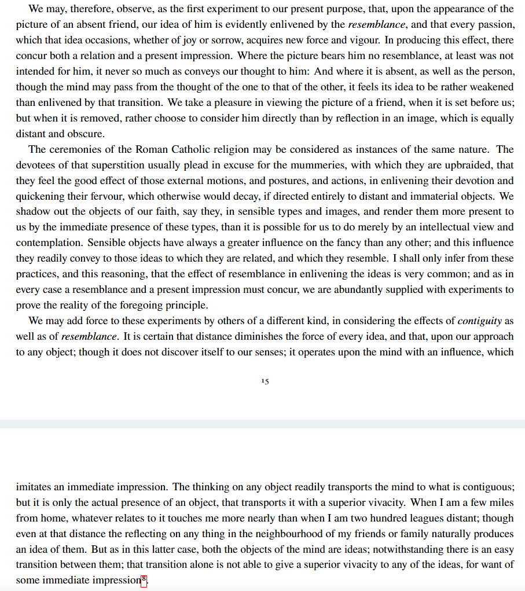

这段文字探讨了**相似性**和**接近性**如何影响我们的思想、感觉和信念，尤其是在心理联想中的作用。以下是详细解释：

### 1. **相似性对思想的影响**：
   - 休谟指出，当我们看到一张不在场的朋友的照片时，由于照片与朋友本人的**相似性**，我们的思想会自然而然地联想到这个朋友。相似性会增强我们对这个人或事物的情感，哪怕他们并不在场。比如，看到朋友的照片时，我们的情感、喜悦或悲伤会变得更加生动。

### 2. **天主教仪式的例子**：
   - 休谟以天主教的宗教仪式为例，解释了**相似性**如何增强信仰的力量。宗教的仪式、姿态、符号和物品可以通过相似性使得信仰更加生动，使得教徒感到更加接近他们所崇拜的神圣对象。这些感官的物品帮助增强了对抽象概念的感知和体验，尽管这些概念本身是看不见的。

### 3. **联想原则的实验验证**：
   - 休谟认为，通过相似性和一个当前的印象之间的结合，我们可以通过心理实验来验证这种**联想原则**的真实性。他进一步指出，这种现象很常见，并且可以通过日常经验得到广泛验证。

### 4. **接近性的影响**：
   - 除了相似性，休谟还探讨了**接近性（或邻近性）**的影响。他指出，**距离**会削弱我们对事物的感觉。当我们接近某物时，它对我们的影响更为直接和强烈，尽管这种影响并不总是通过感官觉察到，但它确实对我们的思想产生作用。

### 5. **接近性与思想活力**：
   - 当我们思考某个对象时，**接近性**会让我们的思想自然转向与之相邻的其他对象。物理上的接近性增强了对象对我们的情感影响。例如，当我们离家较近时，想到家人或朋友的感觉比离家很远时要更强烈。尽管这些对象都是我们的心理观念，但接近性会让这些观念更加生动和有力。

### 总结：
这段文字探讨了**相似性**和**接近性**如何增强我们思想中的观念和感受。休谟通过实例说明了相似性如何使思想更加生动，并指出距离的接近性会进一步增强某些观念的**活力**。这些联想原则——相似性和接近性——在我们的日常生活中起到了重要作用，并影响了我们的情感和思维。

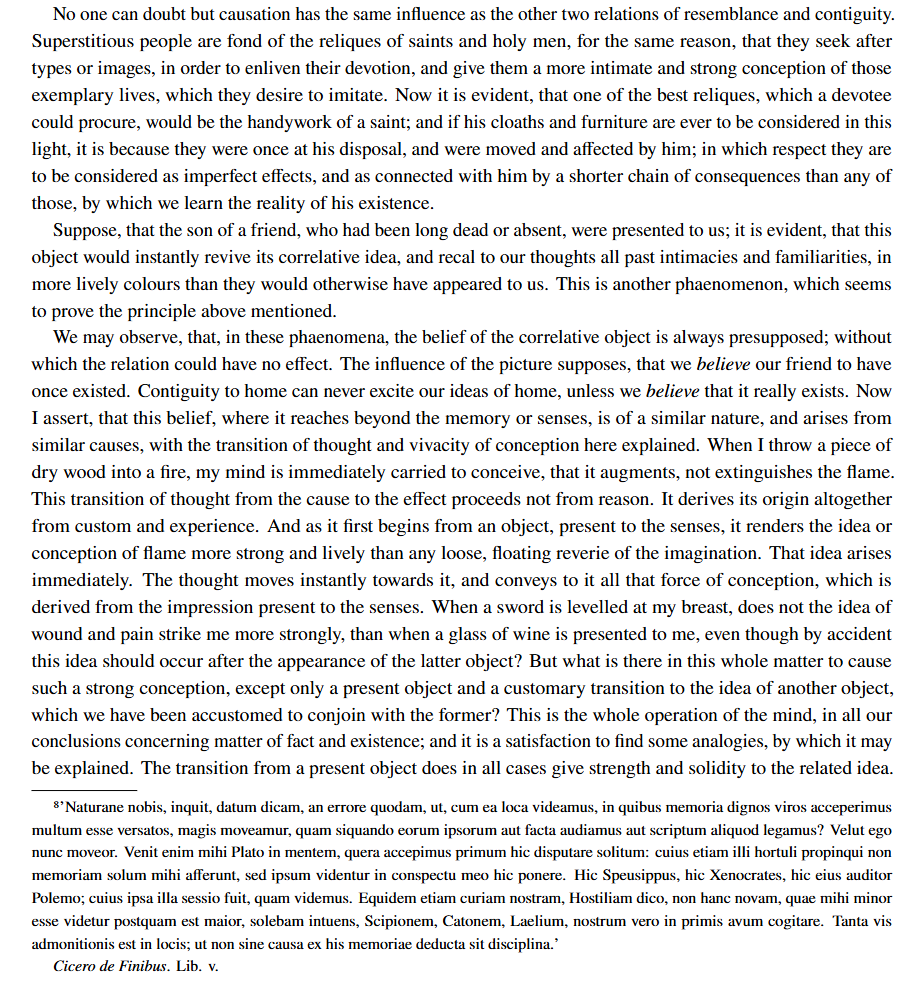

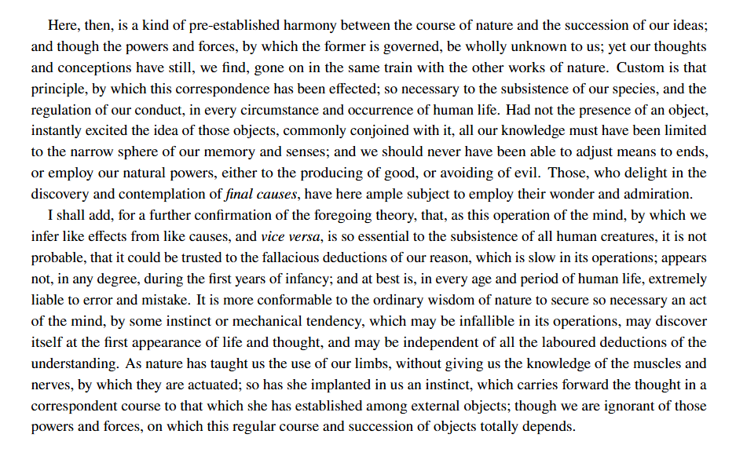

这段文字探讨了**相似性、接近性**和**因果关系**在我们思想和信念形成中的作用，并进一步解释了**习惯**（或**习俗**）如何在我们的人类生活中扮演至关重要的角色。以下是详细解释：

### 1. **相似性和接近性的影响**：
   - 休谟指出，相似性和接近性与因果关系一样，都能影响我们的思想。例如，迷信者通过触摸圣人的遗物或与圣人相关的物品，体验到一种与圣人更为紧密的联系，这种联系源于相似性和物理上的接近性。
   - 当我们看到某个熟悉的物体时，这会唤起我们与该物体相关的过往回忆和情感。例如，当看到已故或不在场的朋友的物品时，我们会想起与他们相处的时光。这种现象展示了**联想**在我们心理中的作用。

### 2. **因果关系和思维的过渡**：
   - 休谟解释道，因果关系的过渡并非出自理性，而是源于**习惯和经验**。当一个事物出现时，它自然而然地使我们联想到与之相关的另一事物。例如，当我们看到干柴投进火中时，我们的思想会立即联想到火势增强的效果。这种从原因到结果的思想转移源于**习惯**，而不是出自理性推理。

### 3. **预先存在的和谐**：
   - 休谟认为，我们的思想与自然的运行之间似乎存在一种**预先建立的和谐**，尽管我们无法理解这种和谐背后的力量和原因。这种和谐的存在使得我们的思想与感官观察相一致，从而使我们能够从经验中学习和推理。**习惯**是这种和谐的基础，它帮助我们在日常生活中调节行为，使我们能够从经验中得出结论。

### 4. **习惯的作用**：
   - 休谟指出，习惯不仅是人类生存的重要机制，而且也是人类生活中推理和行动的关键。例如，在婴儿期，人类通过习惯和反复的经验学习因果关系，而不是通过理性推理。习惯确保我们从类似的原因中推导出类似的结果，并在日常生活中避免错误。

### 5. **自然本能与理性推理的区别**：
   - 休谟还指出，习惯类似于一种**自然本能**，它帮助我们在经验的基础上进行推理，而不依赖理性的推理过程。这种习惯性的思维模式帮助我们迅速做出反应，并确保我们的推理能够应对不断变化的外部世界。

### 总结：
这段文字强调了**习惯**在我们生活中推理和行为中的重要性。休谟认为，虽然我们无法理解自然界中事件之间的真正因果关系，但通过习惯和经验，我们能够从类似的现象中推导出类似的结果。这种习惯性的推理帮助我们在日常生活中做出合理的决策，确保我们能够有效地适应周围的环境。

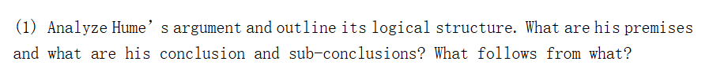

休谟的论证主要围绕“归纳推理”的问题，特别是通过经验推理得出未来的结论是否合理。以下是他的逻辑结构分析：

### **前提**：

1. **经验与归纳推理**：
   - 休谟认为，我们对自然现象的推断是基于过去的经验。例如，过去观察到某些对象之间总是有特定的因果关系，于是我们推断未来相似的对象也会有类似的因果关系 。
   
2. **演绎推理与概率推理的区分**：
   - 他将推理分为两种：**演绎推理**（关于观念的关系）和**概率推理**（关于事实和存在）。演绎推理无法证明未来一定会像过去一样，因为我们能够想象自然规律会改变而不产生任何逻辑矛盾【49:1†source】。

3. **一致性原则**：
   - 归纳推理的核心依赖于“一致性原则”，即假设“我们没有经历的实例必须类似于我们已有的经验，且自然的过程总是保持一致”。然而，休谟指出，演绎推理无法证明这一原则【49:5†source】。

4. **循环论证的风险**：
   - 任何基于经验的推理都需要假设未来会像过去一样。这意味着，所有通过经验推导一致性原则的论证实际上都是循环论证，依赖于需要证明的内容本身【49:2†source】【49:8†source】。

### **结论**：

1. **否定演绎推理的有效性**：
   - 休谟的结论是，无法通过演绎推理证明一致性原则，因为它并不导致矛盾。也就是说，我们不能用逻辑必然性证明自然规律会永远保持不变【49:4†source】。

2. **否定概率推理的有效性**：
   - 同样，任何依赖过去经验的概率推理也无法证明一致性原则，因为这会导致逻辑上的循环【49:10†source】。

3. **归纳推理的局限性**：
   - 因此，休谟认为我们对未来的任何推测都没有坚实的理性基础，只能依赖于习惯和心理上的联想，而非逻辑或经验的必然推导【49:3†source】【49:12†source】。

### **小结**：
休谟的核心论点是，我们无法通过逻辑或经验合理地证明未来一定会像过去一样。因此，归纳推理并没有强有力的理性基础，而只是基于习惯的推断。这一论点挑战了人们对因果关系和自然规律的理解，揭示了归纳推理的局限性。

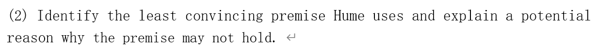

休谟论证中最不具说服力的前提是关于“未来将类似于过去”的假设，也就是所谓的**一致性原则（Uniformity Principle, UP）**。休谟认为，我们推导出未来与过去类似的结论，是基于经验的，但是他同时指出，这种推理实际上是**循环论证**，因为我们只能通过经验来证明未来会与过去一致，而这种经验本身就是我们希望证明的内容【55:2†source】【55:3†source】。

### 为什么这个前提可能站不住脚？
1. **循环论证的风险**：
   - 休谟指出，我们不能通过概率推理来证明一致性原则，因为这会导致循环论证——即我们需要假设未来会像过去一样，才能推断出未来会像过去一样。这种推理显然是无效的【55:2†source】【55:3†source】。

2. **逻辑不成立**：
   - 一致性原则的否定并不会导致逻辑上的矛盾。例如，自然规律的变化是可以设想的，没有任何逻辑推理能够证明自然必须遵循过去的规律【55:0†source】。

### 总结：
这个前提的最大问题在于它无法逃脱循环论证，休谟认为这种推理不仅不具有逻辑必然性，而且可能完全依赖于我们的习惯或心理联想。因此，一致性原则缺乏足够的理性基础，无法有效支撑归纳推理。

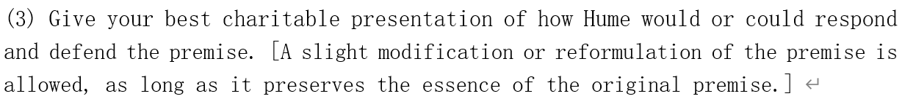

为了更好地为“一致性原则”辩护，休谟可能会从以下几个角度进行合理的解释和调整：

### 1. **归纳推理作为习惯和本能**：
   - 休谟指出，人类推断未来会与过去相似，实际上是出于一种深植于我们心中的**习惯**或**本能**。这种习惯性联想超越了理性的推导，成为我们认知世界的基本方式【55:7†source】。 
   - 他可能会辩解说，尽管一致性原则没有逻辑上的证明，但它是我们行为的自然基础，也是生存所必需的。

### 2. **一致性原则的实用性**：
   - 虽然一致性原则没有逻辑上的强制性证明，但它具有高度的实用性。休谟可能会强调，我们生活的方方面面都依赖于过去与未来相似的假设：无论是自然现象、社会运作，还是个人行动，都离不开这种假设【55:19†source】。
   - 这种假设帮助我们处理日常生活中的复杂性，使我们能够预测和规划，尽管这些预测不具有绝对的必然性。

### 3. **基于经验的实用证据**：
   - 休谟可能进一步指出，虽然我们无法证明未来一定像过去一样，但我们通过长期的经验发现，自然规律通常是稳定的。因此，一致性原则尽管无法在理论上严格证明，却在**实践**中得到了有效的支持和验证【55:19†source】。

### 4. **与自然法则的和谐**：
   - 休谟可能会将一致性原则视为一种与自然本身和谐运作的表现。他指出，我们的推理方式实际上与外部世界的运作方式相一致，尽管我们对其中的奥秘知之甚少【55:14†source】。

### 总结：
通过这些方式，休谟可以辩护说，一致性原则虽然缺乏严格的逻辑论证，但它作为一种根植于我们本能的习惯，具有高度的实用性和经验支持。

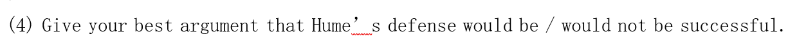

### 休谟防卫“一致性原则”的有效性分析：

#### 1. **防御的成功之处**
   - **习惯和实用性**：休谟强调，人类推断未来将类似于过去是基于长期经验和习惯，而不是理性推理【67:0†source】。这种防御是有力的，因为它解释了我们在日常生活中对经验的依赖，无论是否存在理性的逻辑链条，经验已经证明其在实践中的有效性。
   - **行动导向的哲学**：休谟可能进一步辩护说，即便这一推理并不具有严格的逻辑支持，它依然是人类不可避免的思维方式。日常生活和科学都基于这种推理方式，且它在指导行动方面表现得相当有效【67:0†source】。这种哲学使得怀疑并不会完全摧毁日常生活的行动和推断。

#### 2. **防御的不足**
   - **逻辑上不可避免的循环论证**：尽管休谟的辩护在实用性上是有效的，但他无法逃脱这样一个事实，即“一致性原则”的推理本质上是循环的【67:5†source】。即便习惯使我们期望未来会类似于过去，但这一推论本身依然需要假设过去的规律不会变化。这个循环论证是其防御难以彻底成立的原因。
   - **缺乏理性支持**：即使一致性原则在实践中有用，休谟依然承认，这种基于经验的推断并非源自逻辑推理或因果关系的理性理解。推测未来像过去的这种思维是基于“心理的习惯”，而非理性和必然性【67:9†source】。

#### **结论**：
   - 休谟的辩护在解释我们为何继续依赖一致性原则时是有效的，特别是在日常生活和科学实践中。然而，逻辑上的循环论证使得他的防御缺乏坚实的理性基础。因此，尽管一致性原则在实践中被广泛接受，但休谟的防御在严格的逻辑上仍然不完全成功。