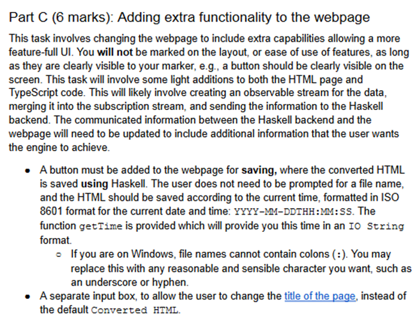

202410160020

后台姓名：贾雨轩
用户ID：135096
用户1V1昵称：Lynz
学生需求类型：作业辅导
学生基础：一般
期望上课时间：墨尔本时间 都行 和老师沟通
学生DUE时间：10.20
用户类型：1v1老用户
院校：Monash University
年级：大二
专业：Computer science
科目代码：FIT2102
科目名称：Programming Paradigms 2024
备注：
1、20号due，期望最近上课，目前暂时没有思路。
2、优先本校辅导过或者学过这门课的老师，或者非本校老师很熟悉的也可以。
3、学生希望老师预估一下课时。


这段文字是关于你需要如何提交这个作业的详细说明。主要内容如下：

### 1. 作业的基本信息

- **截止日期**：10月18日，星期五，晚上11:55。
- **占总成绩的比例**：作业占单元总成绩的30%。
- **面试**：会在 SWOTVAC 周和第13周进行。

### 2. 作业概述

你需要独立完成一个解析器，将 Markdown 文本转换为 HTML，使用函数式编程技术（Haskell 实现）。目标是展示你对课程中所学的函数式编程技术的理解，包括设计决策和功能特性方面的文档说明。

### 3. 提交要求

- 提交一个名为 `<studentNo>_<name>.zip` 的压缩文件，解压后文件夹名为 `<studentNo>_<name>`。
- 压缩文件必须包含所有将被评分的代码，包括报告和所有代码文件。
- 报告的命名格式为 `<studentNo>_<name>.pdf`，并且必须描述你的设计决策。
- **不允许**使用额外的 Haskell 库，除了用于测试目的的库。
- 压缩前运行 `stack clean --full` 来确保提交的包比较小。
- **不要**提交 `node_modules` 或 `.git` 文件夹。
- 确保提交的代码能够正确执行。

### 4. 评分过程

- 评分流程包括以下步骤：
  1. 解压 `<studentNo>_<name>.zip`。
  2. 将提交的文件夹内容复制到作业代码提交文件夹中。
  3. 执行 `stack build`, `stack test`（用于自动化测试），并执行 `stack exec main/npm run dev` 用于前端测试。
- **请务必在提交之前测试这个流程**，确保代码能够正确运行。如果在这个过程中出现问题，会导致评分者不满意，可能会被扣分。

### 5. 迟交处理

- 每天迟交将被扣除5%的分数，向上取整。
- 迟交超过7天将会得零分，且没有反馈。

总结起来，这些要求包括了提交文件的命名、内容、测试和评分流程的说明。确保在提交之前你已经按照这些步骤测试了你的代码，这样可以避免因提交问题而被扣分。


这段引言是关于你的作业的总体说明。它概述了任务的目标和要求。具体内容如下：

### 作业目标

你需要使用 **Haskell** 开发一个**转换器**，将 Markdown 文本转换为 **HTML**。这个任务涉及到解析 Markdown 语法并生成相应的 HTML 输出。具体流程包括：

1. 一个网页将通过基于 HTML 的 WebSocket 连接将 Markdown 文本发送到 Haskell 后端服务器。
2. Haskell 服务器会解析 Markdown，并将其转换为对应的 HTML，最后返回给网页。
3. 作业中提供了一些框架代码，用于处理网页与后端之间的基本通信。

### 使用资源

- 你可以使用前几周课程中学到的内容，包括**教程题的解决方案**，帮助你开发转换器。
- **必须引用或注明从外部来源获得的代码和想法**，这包括独立研究中找到的内容，以防止抄袭。

### 作业分为三个部分

1. **Part A（解析）**：实现 Markdown 的解析。
2. **Part B（格式化输出）**：将解析后的结果转换为 HTML 格式。
3. **Part C（附加功能）**：为网页增加额外的功能。

建议你在实现的时候**同时完成 Part A 和 Part B**，这样可以更好地理解解析和转换的整体过程。

### 语言解析范围

- 解析的 Markdown 语法是基于特定的 Markdown 规范，但是为了减少歧义，作业对 Markdown 的具体用法有一些额外的限制。
- 你需要仔细阅读每个部分的要求，以免做不必要的工作。

总结起来，你的任务是编写一个使用 Haskell 的 Markdown 到 HTML 的转换器，主要关注解析和 HTML 生成的两个阶段，并可能添加一些额外的功能。完成作业时，你需要遵循 Haskell 的函数式编程方法，并确保引用所有外部的内容和代码。


### 学习目标 (Goals / Learning Outcomes)

作业的目的是让你在实践中应用所学的技能（特别是解析相关的内容）。主要目标包括：

1. **有效地使用函数式编程和解析**：
   - 学习如何使用函数式编程的技术来进行数据解析。
2. **理解并掌握关键的函数式编程原则**：
   - 包括**高阶函数**（例如函数作为参数传递或返回值）、**纯函数**（没有副作用的函数）、**不可变数据结构**（数据不可修改）、以及**抽象**（将常见功能抽象为模块化代码）的概念。
3. **将 Haskell 和函数式编程技术应用于解析复杂的 Markdown 文本**：
   - 你需要应用 Haskell 以及函数式编程的技术来解析一些相对复杂的 Markdown 文本。

### 作业范围 (Scope of Assignment)

- 你只需要**解析**表达式，将其转换为所需的数据类型，然后再将结果转换为 HTML 字符串，使其可以通过现有的解释器进行渲染。
- **不需要**实际渲染 Markdown 或 HTML 字符串。也就是说，你的任务只是实现从 Markdown 到 HTML 的转换逻辑，具体的渲染（显示）工作由解释器负责。

简而言之，这次作业的重点在于利用函数式编程的方法解析 Markdown 文本，并通过 Haskell 的工具将它们转换为 HTML。作业会考察你对函数式编程原则的理解，并且要求你对数据进行有效的抽象和转换。


### 1. 作业分数分配和要求

作业被分为几个部分，每部分的分数如下：

- **Part A (12 分)**：解析 Markdown 字符串。
- **Part B (6 分)**：将 Markdown 转换为 HTML。
- **Part C (6 分)**：为网页增加额外功能。
- **Part E (扩展，额外加分)**：为作业增加扩展功能以获得额外的分数。

### 2. 中间表示 (ADT) 的使用

- 你需要将输入解析为一个**中间表示**（例如**抽象语法树** - Abstract Syntax Tree, ADT），以便转换为 HTML。这样做可以让 ADT 和 HTML 之间的转换更为容易。
- **ADT 的实现**需要添加 `deriving Show`，以方便测试代码是否正确。你不能覆盖这个默认的 `Show` 实例，因为评分者会依赖这个功能来测试你的代码。

### 3. 必须实现的函数

你需要在 `Assignment.hs` 文件中导出以下两个函数：

- **`markdownParser :: Parser ADT`**：这个函数负责将 Markdown 文本解析为 ADT。
- **`convertADTHTML :: ADT -> String`**：这个函数负责将 ADT 转换为 HTML 字符串。

### 4. 示例脚本和测试

- 你会被提供一系列 Markdown 文件来测试你的解析器。通过运行 `stack test`，它将尝试解析 Markdown 并将输出保存到文件夹中。你可以手动查看生成的 HTML 是否正确。
- 在评分时，评分者会用更复杂的 Markdown 示例来测试你的代码，因此你必须自己编写额外的测试用例，以确保解析器能够处理更复杂的 Markdown。
- 评分时可能会生成一个 `git diff`，即你的输出和预期输出之间的差异，这需要你安装 Git 命令行工具。

### 5. 推荐的测试方法

- 更推荐的方法是使用 `npm run dev` 结合 `stack run main` 来测试代码，这样可以在网页上实时运行你的代码，方便调试和查看输出。

### 总结

你需要创建一个 Haskell 程序，能够解析 Markdown 文本并将其转换为 HTML，分为多个部分完成。同时，需要编写测试用例确保代码的正确性，并且要通过工具进行测试和调试。


这段内容描述了 **Part A** 的具体要求，你需要编写一个解析器来解析 Markdown 文本，并且将其转换为相应的数据结构（ADT，代数数据类型），然后再将其转换为 HTML。这部分的具体细节如下：

### Part A: 解析 Markdown (12 分)

这个部分要求你将 Markdown 字符串解析为 **代数数据类型（ADT）**。你需要定义自己的 ADT，来表示不同的 Markdown 元素，并定义一系列解析函数，将 Markdown 的不同部分解析为 ADT 的相应部分。解析的内容会用于之后的 HTML 转换，因此你的 ADT 需要包含足够的信息来支持后续的 HTML 生成

### 解析 Markdown 中的文本修饰符（2 分）

Markdown 中有六种不同的修饰符，它们用于改变文本的显示方式。你不需要处理任何的转义字符，并且所有的文本修饰符内容都不能是空的。具体的修饰符如下：

1. **斜体文本**：
   - 由单个下划线 `_` 包裹。
   - 示例：`_italics_`。
2. **粗体文本**：
   - 由两个星号 `**` 包裹。
   - 示例：`**bold**`。
3. **删除线文本**：
   - 由两个波浪号 `~~` 包裹。
   - 示例：`~~strikethrough~~`。
4. **链接**：
   - 使用 `[链接文本](URL)` 的格式表示。
   - 示例：`[click here](www.google.com)`。
   - 你不需要考虑链接内部还有其他链接的情况。
5. **行内代码**：
   - 使用反引号 ``` 包裹。
   - 示例：``code``。
6. **脚注**：
   - 使用 `[^ℤ+]` 格式，其中 ℤ+ 表示正整数（如 `1, 2, 3...`）。
   - 示例：`[^1]`、`[^2]` 等等。注意，脚注的数字不需要按顺序，也不需要验证引用的顺序。
   - 例如，可能出现只有一个脚注 `[^10]` 的情况。
   - 注意，`[` 和 `]` 之间不允许有空格，如 `[^ 1]`、`[^2 ]`、`[ ^3]` 都是不合法的。

### 其他注意事项

- 你**不需要处理嵌套修饰符**的情况，例如 `**_bold and italics_**`。
- 除非另有说明，修饰符中的文本可以包含任意数量的空白字符（不包括换行符）。例如，`_ italics _`、`**bold **`、`~~ strikethrough~~`、`` inline code `` 以及 `[ link text](example.com)` 都是合法的。

### 实现要求

你需要编写解析器来识别这些修饰符，并将它们解析为相应的代数数据类型（ADT），然后在后续的部分中使用这些数据生成 HTML 输出。每个修饰符都有其特定的语法格式，确保解析逻辑能够严格匹配这些格式。


这段代码定义了一个名为 `MarkdownElement` 的数据类型，用于表示不同类型的 Markdown 元素结构。它使用 Haskell 的代数数据类型 (Algebraic Data Type, ADT) 来定义各种 Markdown 语法元素，如标题、段落、块引用等。以下是逐行的解释：

### 逐行解释
1. **`data MarkdownElement =`**  
   这行定义了一个数据类型 `MarkdownElement`，用于表示 Markdown 文档的不同元素。每种元素类型对应一个不同的构造器（类似“子类型”）。

2. **`Heading Int String`**  
   - 表示标题元素，例如 `# Heading` 或 `## Subheading`。
   - `Heading` 是构造器，`Int` 表示标题的级别（例如 1 表示一级标题，2 表示二级标题等）。
   - `String` 表示标题的内容，例如 `"Introduction"`。
   - 例如：`Heading 2 "Overview"` 表示一个二级标题，标题内容为 `"Overview"`。

3. **`Paragraph String`**  
   - 表示段落元素。
   - `Paragraph` 是构造器，`String` 表示段落的文本内容。
   - 例如：`Paragraph "This is the first paragraph."` 表示一个包含 `"This is the first paragraph."` 内容的段落。

4. **`Blockquote String`**  
   - 表示块引用元素，例如 Markdown 中以 `>` 开头的引用内容。
   - `Blockquote` 是构造器，`String` 表示引用的文本内容。
   - 例如：`Blockquote "This is a quote."` 表示一个包含 `"This is a quote."` 的块引用。

5. **`OrderedList [String]`**  
   - 表示有序列表元素。
   - `OrderedList` 是构造器，`[String]` 表示一个列表，包含多个字符串，每个字符串代表一个列表项。
   - 例如：`OrderedList ["Item 1", "Item 2", "Item 3"]` 表示一个包含三个列表项的有序列表。

6. **`CodeBlock String String`**  
   - 表示代码块元素，例如 Markdown 中以三重反引号包裹的代码块（```` ``` ````）。
   - `CodeBlock` 是构造器，包含两个 `String`：
     - 第一个 `String` 表示代码块的语言类型，例如 `"haskell"` 或 `"python"`。
     - 第二个 `String` 表示代码的实际内容。
   - 例如：`CodeBlock "python" "print('Hello World')"` 表示一个 Python 代码块，内容为 `print('Hello World')`。

7. **`deriving (Show)`**  
   - 这部分表示为 `MarkdownElement` 派生 `Show` 类型类。
   - 这样做的好处是，可以让 `MarkdownElement` 自动实现 `Show`，从而可以将 `MarkdownElement` 类型的值打印到控制台，便于调试和输出。
   - 例如：`show (Heading 2 "Overview")` 会返回 `"Heading 2 \"Overview\""`。

### 总结
- `MarkdownElement` 数据类型包含了 Markdown 的多种元素，包括标题、段落、块引用、有序列表和代码块。
- 通过定义不同的构造器，可以方便地将 Markdown 文档的不同部分结构化，便于后续的处理和转换（如将 Markdown 转换为 HTML）。
- `deriving (Show)` 可以让我们直接打印这些数据类型的值，方便调试。


这段代码实现了一个解析 Markdown 标题的解析器 `headingParser`，其目的是解析以 `#` 开头的标题（类似 Markdown 中的 `# Heading 1`）。

### 逐行解释
1. **`headingParser :: String -> Maybe (MarkdownElement, String)`**  
   这行定义了 `headingParser` 的类型签名：
   - 它接受一个 `String` 类型的输入，表示要解析的文本。
   - 返回一个 `Maybe (MarkdownElement, String)`，即：
     - 如果成功解析标题，则返回 `Just (Heading, String)`，其中 `Heading` 是解析到的标题，`String` 是剩余的未解析部分。
     - 如果解析失败，则返回 `Nothing`。

2. **`headingParser input =`**  
   定义 `headingParser` 函数，其中 `input` 是待解析的输入字符串。

3. **`let (hashes, rest) = span (=='#') input`**  
   使用 `span` 函数来处理输入字符串：
   - `span` 会将输入字符串从头开始划分为两部分，第一部分是连续的 `#` 字符，第二部分是剩余的字符。
   - 这里，`hashes` 是连续的 `#`，`rest` 是剩余的内容。
   
   例如，对于输入 `### Title`，结果是：
   - `hashes = "###"`
   - `rest = " Title"`

4. **`in if not (null hashes) && not (null rest) && head rest == ' '`**  
   使用 `if` 语句判断是否符合标题的条件：
   - `not (null hashes)`：确保 `hashes` 不是空的，即至少存在一个 `#` 字符。
   - `not (null rest)`：确保 `#` 之后还有其他内容。
   - `head rest == ' '`：确保 `#` 后面紧跟一个空格，这是 Markdown 标题的规则。
   
   如果这三个条件都满足，就可以认为该行是一个有效的标题。

5. **`then Just (Heading (length hashes) (drop 1 rest), "")`**  
   如果上述条件成立，构造一个 `Just` 值：
   - `(Heading (length hashes) (drop 1 rest), "")`：
     - `Heading (length hashes)`：用 `length hashes` 确定标题的级别（例如 `###` 表示三级标题）。
     - `(drop 1 rest)`：跳过空格，取标题的文本内容。
     - `""` 表示当前没有未解析的部分，因为这个函数处理的是完整的一行。
   
   例如，对于输入 `### Title`，结果是：
   
- `Heading 3 "Title"`：表示一个三级标题，内容为 `"Title"`。
   
6. **`else Nothing`**  
   如果上述条件不成立，说明输入不符合标题格式，返回 `Nothing` 表示解析失败。

### 总结
- **`headingParser`** 函数的作用是检查输入字符串是否是 Markdown 标题，并解析出标题的级别和内容。
- 它使用 `#` 的数量来确定标题的级别，`#` 后面必须有一个空格，之后的内容才是标题的文本。
- 如果条件不满足，则返回 `Nothing`，表示解析失败。


在这部分作业中，你需要为图像、脚注引用和自由文本编写解析器函数。下面是详细的实现指导：

### 1. 图像解析 (0.5 分)
Markdown 中的图像由三部分组成：
1. **Alt Text（替代文本）**：图片加载失败时显示的文本。
2. **URL**：图片的 URL 或路径。URL 不能包含空格。
3. **Caption Text（标题文本）**：图片的标题。

Markdown 图像的格式为：
```

```
**实现要求**：
- 替代文本、标题文本和 URL 中都不应包含其他文本修饰符。
- 图像必须位于行的开头，可以在感叹号 `!` 前有空格，但不能是换行符。
- 在 URL 和标题文本之间必须有至少一个非换行空格。例如，`` 是无效的。
- `!` 和 `[` 之间不能有任何空格。

**代码实现建议**：

- 使用 Haskell 的 **解析器组合器**（parser combinators）编写一个图像解析函数，确保满足所有条件，例如：
  ```haskell
  imageParser :: Parser MarkdownElement
  imageParser = do
    optional (many (char ' '))  -- 可选的空格
    char '!'
    char '['
    altText <- many (noneOf "]")
    char ']'
    char '('
    url <- many (noneOf " \"")
    char ' '
    char '"'
    captionText <- many (noneOf "\"")
    char '"'
    char ')'
    return $ Image altText url captionText
  ```

> 这段代码实现了一个用于解析 Markdown 图像的解析器 `imageParser`，其目的是解析 Markdown 中表示图片的语法，例如：
>
> ```markdown
> 
> ```
>
> 下面是逐行的详细解释：
>
> ### 逐行解释
> 1. **`imageParser :: Parser MarkdownElement`**  
>    - 这行定义了 `imageParser` 的类型签名：
>      - 它是一个 `Parser`，返回 `MarkdownElement` 类型，用于表示解析得到的 Markdown 元素。
>      - 解析的结果是 `Image altText url captionText`，其中 `altText` 是图片的替代文本，`url` 是图片的链接，`captionText` 是图片的描述文本。
>
> 2. **`imageParser = do`**  
>    - 使用 `do` 语法来组合多个解析动作。
>
> 3. **`optional (many (char ' '))`**  
>    - `optional` 表示这部分是可选的，不一定存在。
>    - **`many (char ' ')`**：尝试解析零个或多个空格字符。
>    - 这一步的作用是允许图像前存在任意数量的空格，但不强制要求。
>
> 4. **`char '!'`**  
>    - 解析字符 `'!'`，它是 Markdown 中表示图片的开始符号。
>
> 5. **`char '['`**  
>    - 解析字符 `'['`，它是 Markdown 中图像描述文本（alt text）的开始符号。
>
> 6. **`altText <- many (noneOf "]")`**  
>    - 解析 `altText`（替代文本），直到遇到字符 `']'` 为止。
>    - **`many (noneOf "]")`**：解析并收集所有不是 `']'` 的字符。
>    - 例如，对于输入 ``，`altText` 解析结果为 `"example"`。
>
> 7. **`char ']'`**  
>    - 解析字符 `']'`，它是 Markdown 中图像描述文本的结束符号。
>
> 8. **`char '('`**  
>    - 解析字符 `'('`，它是 Markdown 中图像链接（URL）的开始符号。
>
> 9. **`url <- many (noneOf " \"")`**  
>    - 解析 `url`（图片的链接）。
>    - **`many (noneOf " \"")`**：解析并收集所有不是空格或者引号的字符。
>    - 例如，对于输入 ``，`url` 解析结果为 `"https://example.com"`。
>
> 10. **`char ' '`**  
>     - 解析字符 `' '`，在 URL 和描述文本之间需要有一个空格。
>
> 11. **`char '"'`**  
>     - 解析字符 `'"'`，它是描述文本的开始符号。
>
> 12. **`captionText <- many (noneOf "\"")`**  
>     - 解析 `captionText`（描述文本），直到遇到字符 `'"'` 为止。
>     - **`many (noneOf "\"")`**：解析并收集所有不是 `'"'` 的字符。
>     - 例如，对于输入 ``，`captionText` 解析结果为 `"caption text"`。
>
> 13. **`char '"'`**  
>     - 解析字符 `'"'`，它是描述文本的结束符号。
>
> 14. **`char ')'`**  
>     - 解析字符 `')'`，它是 Markdown 中图像的结束符号。
>
> 15. **`return $ Image altText url captionText`**  
>     - 返回解析得到的 `MarkdownElement`，即 `Image altText url captionText`：
>       - `altText` 是替代文本。
>       - `url` 是图片的链接。
>       - `captionText` 是图片的描述文本。
>
> ### 总结
> - **`imageParser`** 是一个用于解析 Markdown 图像的解析器。
> - 它依次解析 Markdown 中的图像语法，包括 `!`，`[]` 中的替代文本，`()` 中的 URL 和描述文本。
> - 最终返回一个 `Image` 数据类型，包含图像的替代文本、链接和描述文本。
>
> 例如，对于 Markdown 语法 ``，解析器会返回一个 `Image` 元素，其内容为：
> - 替代文本（`altText`）为 `"example"`。
> - 链接（`url`）为 `"https://example.com"`。
> - 描述文本（`captionText`）为 `"caption text"`。

### 2. 脚注引用解析 (0.5 分)

脚注引用的格式类似于脚注，具体为：
- 行首有若干个空格，然后是 `[^ℤ+]`，其中 `ℤ+` 表示正整数，后面跟着一个冒号 `:`，再接着是文本内容。

例如：
```
[^1]: My reference.
```
**实现要求**：
- 脚注引用不能包含其他的文本修饰符。
- 引用文本前的空格应被忽略。

**代码实现建议**：
- 编写一个解析器函数来解析脚注引用，例如：
  ```haskell
  footnoteRefParser :: Parser MarkdownElement
  footnoteRefParser = do
    optional (many (char ' '))  -- 可选的空格
    string "[^"
    refNumber <- many1 digit
    string "]:"
    optional (char ' ')
    content <- many (noneOf "\n")
    return $ FootnoteReference (read refNumber) content
  ```

> 这段代码实现了一个用于解析 Markdown 脚注引用的解析器 `footnoteRefParser`，它解析类似于脚注的 Markdown 语法，如 `[^1]: 这是脚注内容`。以下是逐行的详细解释：
>
> ### 逐行解释
>
> 1. **`footnoteRefParser :: Parser MarkdownElement`**
>    - 这是 `footnoteRefParser` 的类型签名：
>      - 它是一个 `Parser`，用于解析 Markdown，并返回 `MarkdownElement` 类型的结果。
>      - 具体来说，这里解析得到的是 `FootnoteReference` 类型的元素。
>
> 2. **`footnoteRefParser = do`**
>    - 使用 `do` 语法块来组合多个解析动作。
>
> 3. **`optional (many (char ' '))`**
>    - `optional` 表示这部分是可选的，不一定存在。
>    - **`many (char ' ')`**：尝试解析零个或多个空格字符。
>    - 这一步的作用是允许脚注引用的开头存在任意数量的空格，但不强制要求。
>
> 4. **`string "[^"`**
>    - 解析字符串 `"[^"`，这是 Markdown 中脚注引用的标记部分。
>    - `"[^"` 表示脚注的开始符号，其中 `[` 是开始，`^` 表示这是一个脚注。
>
> 5. **`refNumber <- many1 digit`**
>    - 解析脚注引用的编号，保存为 `refNumber`：
>    - **`many1 digit`**：解析一个或多个数字字符 (`digit`)，这些数字表示脚注的编号。
>    - 例如，对于输入 `[^1]: 这是脚注内容`，`refNumber` 解析结果为 `"1"`。
>
> 6. **`string "]:"`**
>    - 解析字符串 `"]:"`，这部分表示脚注引用的结束和脚注内容的开始。
>    - 例如，输入 `[^1]:` 中，这部分解析 `]` 和 `:`。
>
> 7. **`optional (char ' ')`**
>    - 尝试解析一个空格字符，这是可选的。
>    - 在 `]:` 后面可能会有一个空格，以便与脚注内容之间分隔开。
>
> 8. **`content <- many (noneOf "\n")`**
>    - 解析 `content`，即脚注的实际内容，直到遇到换行符为止。
>    - **`many (noneOf "\n")`**：解析并收集所有不是换行符 (`\n`) 的字符，这些字符就是脚注的内容。
>    - 例如，对于输入 `[^1]: 这是脚注内容`，`content` 解析结果为 `"这是脚注内容"`。
>
> 9. **`return $ FootnoteReference (read refNumber) content`**
>    - 使用 `return` 将解析结果封装为 `MarkdownElement` 类型。
>    - **`FootnoteReference (read refNumber) content`**：
>      - 使用 `read refNumber` 将字符串类型的编号 `refNumber` 转换为整数。
>      - 例如，对于 `[^1]: 这是脚注内容`，`refNumber` 是 `"1"`，`read refNumber` 会将其转换为 `1`。
>      - `content` 是脚注的文本内容。
>    - 返回一个 `FootnoteReference`，其包含编号和脚注内容。
>
> ### 总结
> - **`footnoteRefParser`** 函数用于解析 Markdown 脚注引用。
> - 它解析的目标是类似于 `[^1]: 这是脚注内容` 的格式：
>   - `[^` 表示脚注的开始。
>   - `1` 是脚注的编号，可以是任意一个或多个数字。
>   - `]:` 表示脚注的结束部分。
>   - 接下来是脚注的内容，例如 `"这是脚注内容"`。
> - 解析成功后，返回一个 `FootnoteReference`，其中包含编号和内容的 Markdown 元素。
>   
>
> 通过这个解析器，可以将 Markdown 文档中的脚注引用部分结构化为 `MarkdownElement`，以便进一步处理或转换为其他格式（例如 HTML）。

### 3. 自由文本解析 (1 分)

自由文本是指不属于其他任何类型的文本。它可以包含文本修饰符，例如斜体、粗体、删除线等。

**实现要求**：
- 自由文本可以包含修饰符。
- 例如：`Here is some **markdown**` 是合法的自由文本。

**代码实现建议**：
- 编写一个自由文本解析器来处理这些情况，例如：
  ```haskell
  freeTextParser :: Parser MarkdownElement
  freeTextParser = do
    content <- many1 (noneOf "\n")
    return $ FreeText content
  ```
  
  > 这段代码实现了一个用于解析 Markdown 自由文本内容的解析器 `freeTextParser`，用于解析 Markdown 中不属于特定格式（如标题、引用等）的普通文本行。
  >
  > ### 逐行解释
  >
  > 1. **`freeTextParser :: Parser MarkdownElement`**
  >    - 这是 `freeTextParser` 的类型签名：
  >      - 它是一个 `Parser`，用于解析 Markdown 文本并返回 `MarkdownElement` 类型的结果。
  >      - 返回的结果是 `FreeText` 类型，用于表示一般的文本内容。
  >
  > 2. **`freeTextParser = do`**
  >    - 使用 `do` 语法块来组合多个解析动作。
  >
  > 3. **`content <- many1 (noneOf "\n")`**
  >    - 解析 `content`，表示自由文本内容。
  >    - **`many1 (noneOf "\n")`**：
  >      - `many1` 表示匹配并解析**至少一个**符合条件的字符。
  >      - **`noneOf "\n"`** 表示解析所有**不是换行符**的字符，这意味着它会读取一行文本内容，直到遇到换行符为止。
  >      - 例如，对于输入 `"This is a line of text"`，`content` 解析结果为 `"This is a line of text"`。
  >
  > 4. **`return $ FreeText content`**
  >    - 使用 `return` 将解析结果封装为 `MarkdownElement` 类型。
  >    - **`FreeText content`**：创建一个 `FreeText` 元素，其内容为 `content`，表示一般的文本内容。
  >    - 例如，对于输入 `"This is a line of text"`，返回的结果是 `FreeText "This is a line of text"`。
  >
  > ### 总结
  > - **`freeTextParser`** 用于解析 Markdown 文档中的普通文本内容，这些文本不属于其他特定的 Markdown 语法（如标题、引用、代码块等）。
  > - 它解析直到遇到换行符为止的文本内容，且至少匹配一个字符。
  > - 最终返回一个 `FreeText` 数据类型，用于表示该行的文本内容。
  >
  > 通过这个解析器，可以将 Markdown 文档中普通文本行的部分提取并结构化为 `MarkdownElement`，便于后续的处理或转换操作（例如将其转换为 HTML）。

### 总结

- **图像解析**需要考虑替代文本、URL 和标题文本之间的格式和约束。
- **脚注引用解析**需要处理行首的空格、脚注编号和引用内容。
- **自由文本解析**需要捕获那些不属于其他元素的文本，并支持包含修饰符。

你可以将这些解析函数结合起来使用，以构建一个完整的 Markdown 解析器，将所有这些元素解析为代数数据类型 (ADT)，供后续转换为 HTML 时使用。


这部分描述了如何解析 Markdown 中的标题。Markdown 标题可以通过不同的方式表示，需要根据这些规则来编写相应的解析器。

### 标题解析的要求 (1 分)
Markdown 中的标题有两种格式：

1. **井号 (#) 标记**：
   - 标题由行首的若干空格（非换行符）和一个或多个井号 `#` 组成，然后至少有一个空格，再加上标题文本。
   - 最多可以有 6 个 `#`，代表从一级标题到六级标题。例如：
     ```
     # Heading 1
     ## Heading 2
     ### Heading 3
     #### Heading 4
     ##### Heading 5
     ###### Heading 6
     ```
   - **注意**：至少需要一个非换行空格字符，因此 `#Heading 1` 是无效的标题。
   - 行首必须是 `#` 或空格，因此例如 `abc # Heading` 不是合法的标题。

2. **替代语法**：
   - 一级和二级标题可以使用替代语法：
     - 在标题文本下一行添加至少两个等号 `=`（一级标题）或至少两个短横线 `-`（二级标题）。
     - 这行只允许包含等号或短横线，不能有其他字符。例如：
       ```
       Alternative Heading 1
       ======
       
       Heading level 2
       ---------------
       ```
   - **注意**：没有其他标题级别（如三级及以下）可以使用这种替代语法。

### 实现要求
你需要编写一个 Haskell 解析器函数来处理这两种标题格式。以下是实现建议：

1. **定义标题解析器函数**：
   - 解析井号形式的标题：
     ```haskell
     headingParser :: Parser MarkdownElement
     headingParser = do
       optional (many (char ' '))   -- 可选的行首空格
       hashes <- many1 (char '#')   -- 至少一个井号
       char ' '                     -- 一个空格
       content <- many (noneOf "\n") -- 标题内容
       return $ Heading (length hashes) content
     ```
   - 解析替代语法的标题：
     ```haskell
     alternativeHeadingParser :: Parser MarkdownElement
     alternativeHeadingParser = do
       content <- many1 (noneOf "\n") -- 标题内容
       newline
       line <- many1 (char '=' <|> char '-') -- 解析等号或短横线
       let level = if '=' `elem` line then 1 else 2
       return $ Heading level content
     ```

2. **组合解析器**：
   
   - 将不同格式的标题解析器结合起来，以处理所有可能的标题形式：
     ```haskell
     fullHeadingParser :: Parser MarkdownElement
     fullHeadingParser = try headingParser <|> try alternativeHeadingParser
     ```

### 总结
- 井号 `#` 标记的标题需要解析井号的数量，以确定标题的级别，然后解析标题文本。
- 替代语法的标题需要解析标题文本，然后确认下一行是否是等号或短横线，以确定是否是一级或二级标题。
- 通过组合解析器处理两种不同的标题格式，确保能够匹配所有有效的 Markdown 标题。

通过这些解析器函数，你可以识别和解析 Markdown 中的标题，并将它们转换为你定义的代数数据类型（ADT），用于后续的 HTML 转换。


要完成这些部分的解析器，需要分别为块引用（Blockquotes）和代码块（Code）编写解析函数。以下是每个部分的具体实现思路和 Haskell 代码示例。

### 1. Blockquotes (块引用) - 解析器实现
块引用以符号 `>` 开头，可能前面有零个或多个空格，紧接着是引用的内容。块引用可以包含多行，每行都需要以 `>` 开头。

**实现思路：**
- 首先解析可能存在的空格，然后解析 `>`。
- 解析 `>` 之后的空格，紧接着解析块引用的内容，直到遇到换行符。
- 可以使用递归或循环来处理多行的块引用。

**Haskell 代码示例：**
```haskell
blockquoteParser :: Parser MarkdownElement
blockquoteParser = do
  optional (many (char ' '))  -- 可选的空格
  char '>'                    -- 匹配 '>' 符号
  optional (char ' ')         -- '>' 后面的可选空格
  content <- many (noneOf "\n")  -- 解析直到换行符的文本
  return $ Blockquote content  -- 返回 Blockquote 类型
```
- 这个代码段会解析一个块引用元素，它会跳过开头的空格，匹配 `>` 符号后面跟随的内容。
- 需要在主解析器中添加递归逻辑以处理多行的块引用。

### 2. Code Block (代码块) - 解析器实现
代码块由三重反引号 (```) 包围，可以有可选的语言标识符。

**实现思路：**
- 解析以三个反引号 (```) 开始的部分，可能有空格。
- 接下来可能会有一个语言标识符（如 `haskell`）。
- 解析代码内容，直到遇到三个反引号结束代码块。

**Haskell 代码示例：**
```haskell
codeBlockParser :: Parser MarkdownElement
codeBlockParser = do
  optional (many (char ' '))  -- 可选的空格
  string "```"                -- 匹配代码块的开始符号 ```
  lang <- optional (many (noneOf "\n")) -- 可选的语言标识符
  newline                     -- 匹配换行符
  code <- manyTill anySingle (string "```") -- 解析代码内容直到结尾的 ```
  return $ CodeBlock (maybe "" id lang) code -- 返回 CodeBlock，语言可能为空
```
- `optional (many (noneOf "\n"))` 用来解析可能的语言标识符，例如 `haskell`。
- `manyTill anySingle (string "```")` 用来解析代码内容，直到遇到结束的反引号。

### 3. 主解析器的调整
在主解析器 `markdownParser` 中，需要将新实现的 `blockquoteParser` 和 `codeBlockParser` 添加到可选的解析器列表中，以便它们可以在解析 Markdown 文本时被调用。

**主解析器调整示例：**
```haskell
markdownParser :: Parser [MarkdownElement]
markdownParser = many (choice [headingParser, blockquoteParser, codeBlockParser, orderedListParser, freeTextParser])
```
- 在 `choice` 中添加了 `blockquoteParser` 和 `codeBlockParser`。
- `many` 会一直重复调用这些解析器，直到所有内容都被处理完。

### 小结
1. **块引用解析器 (`blockquoteParser`)** 处理以 `>` 开头的引用文本，并且可以递归处理多行引用。
2. **代码块解析器 (`codeBlockParser`)** 处理以三重反引号包围的代码块，包括可选的语言标识符。
3. 将这两个解析器集成到主解析器 `markdownParser` 中，确保能够解析完整的 Markdown 文档。

完成这些部分的解析器后，可以用这些解析器将 Markdown 中的块引用和代码块转换为 `MarkdownElement`，以便进一步处理或转换为 HTML 格式。


### Ordered Lists (2 Marks)
这部分要求你解析 Markdown 中的**有序列表**。以下是你需要考虑的要求和实现建议。

#### 解析有序列表的规则
1. **有序列表项的格式**：
   - 列表项以正整数开头，紧跟着一个点号 `.`，再至少有一个空格，接着是列表项的内容。
   - 有序列表必须从数字 `1` 开始，后续的项可以是任意的数字。

2. **嵌套列表**：
   - 子列表必须以 4 个空格开头，且必须从数字 `1` 开始。
   - 列表项中可以包含其他的**文本修饰符**。

3. **不需要处理无序列表**。

4. **格式限制**：
   - 列表项前面不能有空格，除非是 4 个空格（用于子列表的缩进）。
   - 例如，`1. 这是一个有序列表项` 是合法的，而 `1. 这是一个无效的有序列表项（前面有2个空格）`。

#### 实现建议
- **编写解析器函数**来识别列表项，确保数字、点号和空格的格式正确。
- **处理嵌套列表**，需要检测到 4 个空格的缩进。
  

**代码示例**：
```haskell
orderedListParser :: Parser MarkdownElement
orderedListParser = do
  items <- many1 listItemParser
  return $ OrderedList items

listItemParser :: Parser ListItem
listItemParser = do
  optional (many (char ' '))     -- 可选的空格（用于检测嵌套）
  number <- digit
  char '.'                       -- 必须有点号
  char ' '                       -- 必须有一个空格
  content <- many (noneOf "\n")  -- 列表项的内容
  newline
  return $ ListItem content
```
- 你可以使用 `many1` 来确保至少有一个列表项。

### Tables (3 Marks)
Markdown 中的表格通过使用管道符 `|` 分隔列，且每列至少有三个短横线 `---` 表示标题行和内容行之间的分隔。下面是解析表格的要求和实现建议。

#### 解析表格的规则
1. **表格格式**：
   - 使用管道符 `|` 分隔每一列。
   - 标题行和内容行之间至少有三个短横线 `---`。
   - 每一行的开头和结尾都必须有管道符。
   - 每一行都必须具有相同数量的列。

2. **单元格内容**：
   - 每个单元格可能包含文本修饰符（例如粗体、斜体等）。
   - 单元格中的前导和尾随空格应该被忽略。

3. **每行可以有空格**：
   - 每一行的开头和结尾可以有若干个空格。

#### 实现建议
- 解析表格时，需要先解析标题行，然后解析内容行。
- 可以使用管道符来分隔每一列，注意处理前导和尾随空格。

**代码示例**：
```haskell
tableParser :: Parser MarkdownElement
tableParser = do
  header <- tableRowParser      -- 解析标题行
  separator <- tableSeparator   -- 解析分隔符行（至少有三个短横线）
  rows <- many tableRowParser   -- 解析内容行
  return $ Table (header : rows)

tableRowParser :: Parser [String]
tableRowParser = do
  char '|'
  cells <- sepBy cellParser (char '|')  -- 使用 `|` 分隔单元格
  char '|'
  optional newline
  return cells

cellParser :: Parser String
cellParser = do
  content <- many (noneOf "|\n")
  return (trim content)  -- 去掉前后的空格

tableSeparator :: Parser String
tableSeparator = do
  char '|'
  many1 (char '-')       -- 至少有一个短横线
  many (char ' ') <|> char '|' -- 可选的空格或下一列
  newline
  return "separator"
```
- **`tableRowParser`** 解析每一行的单元格，使用管道符 `|` 分隔。
- **`cellParser`** 解析每个单元格的内容，并去掉前后的空格。
- **`tableSeparator`** 解析表格的分隔符行，以确保分隔符行符合格式。

### 总结
- **有序列表**解析器需要识别数字、点号和空格的正确组合，同时处理嵌套列表。
- **表格**解析器需要处理每行的列分隔符 `|` 和标题行与内容行之间的分隔符 `---`。
- 这些解析器需要确保严格遵循 Markdown 的格式，解析后的数据结构可以用于后续的 HTML 转换。

通过这些解析器函数，你可以准确地解析 Markdown 中的有序列表和表格，并将它们转换为你定义的代数数据类型（ADT），以供后续生成 HTML。


 在 **Part B (6 分)** 部分，你需要将先前的代数数据类型 (ADT) 转换为 HTML 格式的字符串。以下是详细的步骤和实现建议：

### HTML 转换的目标
- 将你在 Part A 中生成的 ADT 转换为 HTML 表示。
- 最终生成的 HTML 文件必须符合格式要求，具有正确的缩进（每个级别缩进 4 个空格），确保 HTML 有效且可以正确渲染 Markdown。
- 生成的 HTML 页面应是一个自包含网页，包含基本的 HTML 结构，例如 `<!DOCTYPE html>`、`<html>`、`<head>` 和 `<body>` 标签，所有生成的内容都应放置在 `<body>` 标签内。

### HTML 结构
- HTML 文件应包含以下结构：
  ```html
  <!DOCTYPE html>
  <html lang="en">
  <head>
    <meta charset="UTF-8">
    <title>Test</title>
  </head>
  <body>
    GENERATED CONTENT GOES HERE
  </body>
  </html>
  ```
- 在 `<body>` 标签内，插入你生成的 HTML 内容。

### Markdown 到 HTML 的转换规则
以下是 Markdown 修饰符和它们对应的 HTML 标签：

1. **斜体文本 (`_`)**:
   - Markdown: `_italics_`
   - HTML: `<em>italics</em>`

2. **粗体文本 (`**`)**:
   - Markdown: `**bold**`
   - HTML: `<strong>bold</strong>`

3. **删除线 (`~~`)**:
   - Markdown: `~~strikethrough~~`
   - HTML: `<del>strikethrough</del>`

4. **链接 (`[link text](URL)`)**:
   - Markdown: `[link text](URL)`
   - HTML: `<a href="URL">link text</a>`

5. **行内代码 (`` `code` ``)**:
   - Markdown: `` `code` ``
   - HTML: `<code>code</code>`

### 实现建议
1. **定义转换函数**：
   - 为你的每个 ADT 类型定义一个转换函数，这些函数将生成相应的 HTML 代码。
   - 例如，假设你有一个名为 `MarkdownElement` 的 ADT，定义的转换函数可能如下所示：
     ```haskell
     convertADTHTML :: MarkdownElement -> String
     convertADTHTML (Italic text) = "<em>" ++ text ++ "</em>"
     convertADTHTML (Bold text) = "<strong>" ++ text ++ "</strong>"
     convertADTHTML (Strikethrough text) = "<del>" ++ text ++ "</del>"
     convertADTHTML (Link text url) = "<a href=\"" ++ url ++ "\">" ++ text ++ "</a>"
     convertADTHTML (InlineCode code) = "<code>" ++ code ++ "</code>"
     convertADTHTML (Heading level text) = "<h" ++ show level ++ ">" ++ text ++ "</h" ++ show level ++ ">"
     ```

2. **组合转换**：
   - 如果你的 Markdown 文档包含多个元素，可以递归地转换每个元素。例如：
     ```haskell
     convertDocument :: [MarkdownElement] -> String
     convertDocument elements = concatMap convertADTHTML elements
     ```

3. **生成完整的 HTML 页面**：
   - 最后，将生成的内容插入到 HTML 页面模板中：
     ```haskell
     generateHTML :: [MarkdownElement] -> String
     generateHTML elements =
       "<!DOCTYPE html>\n" ++
       "<html lang=\"en\">\n" ++
       "<head>\n" ++
       "  <meta charset=\"UTF-8\">\n" ++
       "  <title>Test</title>\n" ++
       "</head>\n" ++
       "<body>\n" ++
       indent (convertDocument elements) ++
       "\n</body>\n" ++
       "</html>"
     ```

4. **缩进格式**：
   
   - 确保 HTML 内容正确缩进，尤其是嵌套结构。例如，可以写一个辅助函数来处理缩进：
     ```haskell
     indent :: String -> String
     indent = unlines . map ("    " ++) . lines
     ```

### 总结
- 你需要从 ADT 转换为 HTML，每个元素（如斜体、粗体、链接等）都有相应的转换函数。
- 生成的 HTML 需要符合规范，每个嵌套级别缩进 4 个空格，确保 HTML 的可读性和正确性。
- 最后生成一个完整的 HTML 页面，将所有内容嵌入到 `<body>` 标签中。

通过这些步骤，你可以将解析得到的 Markdown 结构转换为有效的 HTML 页面，确保正确的格式和语义结构。这样，你的转换器可以将 Markdown 文件完整转换为一个可在浏览器中显示的网页。


在这部分作业中，你需要将不同类型的 Markdown 元素转换为对应的 HTML 结构，确保每个元素的 HTML 输出符合规范。以下是详细的实现建议：

### 1. 图像 (0.5 分)
- **Markdown 转换为 HTML**：
  - Markdown 图像格式：``
  - 对应的 HTML 格式：
    ```html
    
    ```
  - 你需要提取 `Alt Text`、`URL` 和 `Caption Text`，并将它们转换为 `` 标签中的相应属性。

**代码实现**：
```haskell
convertADTHTML :: MarkdownElement -> String
convertADTHTML (Image altText url captionText) =
  ""
```

### 2. 脚注引用 (0.5 分)
- **Markdown 转换为 HTML**：
  
  - 脚注需要用 `<p>` 标签包裹，并且具有唯一的 `id`。
  - 例如：
    ```html
    <p id="fn1">My reference.</p>
    <p id="fn2">Another reference.</p>
    ```
  - `id` 应根据脚注的编号生成，例如 `fn1`、`fn2`。

**代码实现**：
```haskell
convertADTHTML (FootnoteReference id content) =
  "<p id=\"fn" ++ show id ++ "\">" ++ content ++ "</p>"
```

### 3. 自由文本 (0.5 分)
- **Markdown 转换为 HTML**：
  - 每一行自由文本必须被 `<p>` 标签包裹。
  - 例如：
    ```html
    <p>Here is some <strong>markdown</strong></p>
    <p>More lines here</p>
    <p>Text</p>
    ```
  - 自由文本可能包含文本修饰符，因此需要处理这些修饰符。

**代码实现**：
```haskell
convertADTHTML (FreeText content) =
  "<p>" ++ content ++ "</p>"
```
如果自由文本中包含修饰符（例如斜体、粗体），你可以在 `content` 的转换过程中调用相应的转换函数。

### 4. 标题 (0.5 分)
- **Markdown 转换为 HTML**：
  - 标题的级别通过 `h` 标签来表示，其中的数字表示标题的级别。
  - 例如：
    ```html
    <h1>Heading 1</h1>
    <h2>Heading 2</h2>
    <h3>Heading 3</h3>
    <h4>Heading 4</h4>
    <h5>Heading 5</h5>
    <h6>Heading 6</h6>
    ```
  - `Heading` 的级别由井号 `#` 的数量决定。

**代码实现**：
```haskell
convertADTHTML (Heading level text) =
  "<h" ++ show level ++ ">" ++ text ++ "</h" ++ show level ++ ">"
```

### 综合转换函数
你可以将所有的这些具体转换函数组合到一个通用的 `convertADTHTML` 函数中，以便处理所有不同类型的 Markdown 元素。例如：

```haskell
convertADTHTML :: MarkdownElement -> String
convertADTHTML (Italic text) = "<em>" ++ text ++ "</em>"
convertADTHTML (Bold text) = "<strong>" ++ text ++ "</strong>"
convertADTHTML (Strikethrough text) = "<del>" ++ text ++ "</del>"
convertADTHTML (Link text url) = "<a href=\"" ++ url ++ "\">" ++ text ++ "</a>"
convertADTHTML (InlineCode code) = "<code>" ++ code ++ "</code>"
convertADTHTML (Image altText url captionText) = 
  ""
convertADTHTML (FootnoteReference id content) = 
  "<p id=\"fn" ++ show id ++ "\">" ++ content ++ "</p>"
convertADTHTML (FreeText content) = "<p>" ++ content ++ "</p>"
convertADTHTML (Heading level text) = 
  "<h" ++ show level ++ ">" ++ text ++ "</h" ++ show level ++ ">"
```

### 总结
- 为每个 Markdown 元素定义相应的转换函数，将其转换为对应的 HTML 标签。
- 确保输出的 HTML 符合规范，例如缩进格式和正确的标签结构。
- 脚注和自由文本需要用 `<p>` 标签包裹，并且脚注需要具有唯一的 `id`。

这样，你可以将 Markdown 的解析结果转换为 HTML 格式，并生成完整的网页内容。


在这部分中，你需要将 Markdown 中的块引用、代码块和有序列表转换为 HTML。以下是详细的转换实现建议：

### 1. 块引用 (Blockquotes) (0.5 分)
- **Markdown 转换为 HTML**：
  - 每个块引用必须用 `<blockquote>` 标签包裹，且块引用中的每一行必须用 `<p>` 标签包裹。
  - 示例：
    ```html
    <blockquote>
      <p>This is a block quote.</p>
      <p>It can <strong>span</strong> multiple lines.</p>
    </blockquote>
    ```
  

**代码实现**：
```haskell
convertADTHTML :: MarkdownElement -> String
convertADTHTML (Blockquote paragraphs) =
  "<blockquote>\n" ++ concatMap (\p -> "  <p>" ++ p ++ "</p>\n") paragraphs ++ "</blockquote>"
```
- `Blockquote` 类型可以包含一个段落列表 (`paragraphs`)。
- 使用 `<blockquote>` 标签包裹段落，并用 `<p>` 标签包裹每个段落。

### 2. 代码块 (Code) (0.5 分)
- **Markdown 转换为 HTML**：
  
  - 代码块需要用 `<pre>` 和 `<code>` 标签包裹。
  - 如果代码块有语言标识符（例如 `haskell`），它应该包含在 `class` 属性中，前缀为 `language-`。
  - 示例：
    ```html
    <pre><code class="language-haskell">main :: IO ()
    main = do
      putStrLn "Never gonna give you up"
      putStrLn "Never gonna let you down"
    </code></pre>
    ```
  

**代码实现**：
```haskell
convertADTHTML (CodeBlock maybeLang code) =
  let classAttr = case maybeLang of
                    Just lang -> " class=\"language-" ++ lang ++ "\""
                    Nothing -> ""
  in "<pre><code" ++ classAttr ++ ">\n" ++ code ++ "\n</code></pre>"
```
- `CodeBlock` 类型可以包含可选的语言标识符 (`maybeLang`) 和代码内容 (`code`)。
- 如果有语言标识符，则添加 `class` 属性，格式为 `language-<lang>`。
- 保留代码块中的换行和缩进。

### 3. 有序列表 (Ordered Lists) (1 分)
- **Markdown 转换为 HTML**：
  - 有序列表用 `<ol>` 标签包裹，列表项用 `<li>` 标签包裹。
  - 列表项可以嵌套子列表，子列表也必须用 `<ol>` 和 `<li>` 标签包裹。
  - 示例：
    ```html
    <ol>
      <li>Item 1
        <ol>
          <li>Sub Item 1</li>
          <li>Sub Item 2</li>
          <li>Sub Item 3</li>
        </ol>
      </li>
      <li>Item 2</li>
    </ol>
    ```

**代码实现**：
```haskell
convertADTHTML (OrderedList items) =
  "<ol>\n" ++ concatMap (\item -> "  " ++ convertListItem item ++ "\n") items ++ "</ol>"

convertListItem :: ListItem -> String
convertListItem (ListItem content sublist) =
  "<li>" ++ content ++ maybe "" (("\n" ++) . convertADTHTML) sublist ++ "</li>"
```
- `OrderedList` 类型包含一个 `items` 列表，每个 `ListItem` 可以有子列表。
- 每个列表项都用 `<li>` 标签包裹，如果有子列表则递归调用转换函数。
- 确保正确的缩进，子列表也需要包裹在 `<ol>` 标签中。

### 总结
- **块引用**：将块引用包裹在 `<blockquote>` 标签中，且每行用 `<p>` 标签。
- **代码块**：代码块用 `<pre>` 和 `<code>` 标签包裹，保持原始缩进和换行。如果有语言标识符，则添加 `class` 属性。
- **有序列表**：将有序列表用 `<ol>` 标签包裹，列表项用 `<li>` 标签。如果有嵌套列表，则递归地处理子列表。

通过这些转换函数，你可以将 Markdown 的块引用、代码块和有序列表准确地转换为 HTML 结构，确保其格式和缩进符合规范。


在这部分作业中，你需要将 Markdown 中的表格转换为 HTML 格式。以下是实现的详细建议：

### 表格解析与转换 (1 分)
Markdown 中的表格需要转换为 HTML 的 `<table>` 结构，包含以下元素：

- **HTML 表格结构**：
  - `<table>`：整个表格用 `<table>` 标签包裹。
  - `<tr>`：每一行用 `<tr>` 标签表示。
  - `<th>`：表格的表头单元格用 `<th>` 标签表示。
  - `<td>`：表格的普通数据单元格用 `<td>` 标签表示。
  - 你可以选择使用 `<thead>` 和 `<tbody>` 标签来进一步结构化表格，但这不是必需的。

以下是你需要转换的 Markdown 到 HTML 的示例：

```html
<table>
  <tr>
    <th>Tables</th>
    <th>Are</th>
    <th>Cool</th>
  </tr>
  <tr>
    <td>here</td>
    <td>is</td>
    <td>data</td>
  </tr>
  <tr>
    <td>here</td>
    <td>is</td>
    <td>data</td>
  </tr>
  <tr>
    <td>here</td>
    <td>is also</td>
    <td><strong>bolded data</strong></td>
  </tr>
  <tr>
    <td>also</td>
    <td>part of the</td>
    <td>table</td>
  </tr>
</table>
```

### 实现建议
1. **定义表格的 ADT（代数数据类型）**：
   - 你可能已经定义了一个类似的 ADT 来表示 Markdown 中的表格，例如：
     ```haskell
     data MarkdownElement
       = Table [[String]]        -- 表格，包含表头和内容
       | ...                     -- 其他类型的元素
     ```

2. **编写转换函数**：
   - 将 ADT 中的 `Table` 类型转换为 HTML 代码。
   - 你需要处理表格的标题行（用 `<th>` 包裹）和普通数据行（用 `<td>` 包裹）。
   
   
   **代码实现**：
   ```haskell
   convertADTHTML :: MarkdownElement -> String
   convertADTHTML (Table rows) = 
    "<table>\n" ++ convertTableRows rows ++ "</table>"
   
   convertTableRows :: [[String]] -> String
   convertTableRows (header:body) =
     "  <tr>\n" ++ concatMap (\cell -> "    <th>" ++ cell ++ "</th>\n") header ++ "  </tr>\n" ++
    concatMap convertTableRow body
   
   convertTableRow :: [String] -> String
   convertTableRow row =
     "  <tr>\n" ++ concatMap (\cell -> "    <td>" ++ cell ++ "</td>\n") row ++ "  </tr>\n"
   ```
   - `convertTableRows`：用于转换表格的所有行。第一行被视为标题行，剩余的行是普通内容。
- `convertTableRow`：将每一行的内容用 `<tr>` 和 `<td>` 包裹。
  
3. **详细解释**：
   - 表格中的每一行使用 `<tr>` 标签。
   - 表头行的每个单元格用 `<th>`，其余行中的单元格用 `<td>`。
   - 需要注意的是，HTML 中的缩进和换行可以帮助生成更具可读性的 HTML 代码，但在功能上并非必须。

### 处理选项：使用 `<thead>` 和 `<tbody>`（可选）
- 如果你想进一步将表格结构化，你可以选择将表头包裹在 `<thead>` 中，将其余行包裹在 `<tbody>` 中。例如：
  ```html
  <table>
    <thead>
      <tr>
        <th>Tables</th>
        <th>Are</th>
        <th>Cool</th>
      </tr>
    </thead>
    <tbody>
      <tr>
        <td>here</td>
        <td>is</td>
        <td>data</td>
      </tr>
      <!-- 更多行 -->
    </tbody>
  </table>
  ```
- 这种结构使得 HTML 更具语义性，方便不同设备或屏幕阅读，但这部分是可选的。

### 总结
- 将 Markdown 表格转换为 HTML 需要处理表头和表格内容。
- 使用 `<table>`、`<tr>`、`<th>`、和 `<td>` 标签构建 HTML 表格。
- 你可以选择使用 `<thead>` 和 `<tbody>` 标签来增强 HTML 表格的语义，但不是必须的。

通过这些函数，你可以将 Markdown 中的表格元素转换为正确的 HTML 代码，并确保其结构符合规范，从而在浏览器中正常显示。



在 **Part C (6 分)** 中，你需要为网页添加一些额外的功能，以使网页的用户界面更加丰富和有用。这部分涉及到 Haskell 后端和网页的交互。以下是详细的实现建议：

### 额外功能的要求
1. **保存 HTML 的按钮**：
   - 你需要在网页上添加一个按钮，点击后将保存生成的 HTML 文件。
   - **文件名格式**：
     - 文件应以 **ISO 8601** 格式保存：`YYYY-MM-DDTHH:MM:SS`。
     - 例如，如果当前时间是 2024 年 10 月 17 日 14:35:22，文件名应为：`2024-10-17T14:35:22.html`。
     - 如果你在 Windows 上，无法使用冒号 `:`，可以替换为下划线 `_` 或连字符 `-`。

2. **输入框用于更改页面标题**：
   - 添加一个单独的输入框，让用户可以更改页面的标题（而不是使用默认的“Converted HTML”）。

### 实现建议
**1. 保存 HTML 的按钮**
- 你需要实现一个按钮，点击按钮时，页面上的内容被发送到 Haskell 后端，并且后端会保存这个内容为 HTML 文件。

**前端部分 (JavaScript/TypeScript)**：
- 在前端页面中添加一个按钮：
  ```html
  <button id="save-button">Save HTML</button>
  ```
- 使用 JavaScript 监听按钮点击事件，并通过 WebSocket 将生成的 HTML 内容发送到 Haskell 后端：
  ```javascript
  document.getElementById("save-button").addEventListener("click", function() {
    const htmlContent = document.body.innerHTML; // 获取整个页面的 HTML 内容
    const timestamp = new Date().toISOString().replace(/:/g, "-"); // ISO 8601 格式，替换冒号
    const data = { filename: `${timestamp}.html`, content: htmlContent };

    // 假设 WebSocket 已连接为 `socket`
    socket.send(JSON.stringify(data));
  });
  ```

**后端部分 (Haskell)**：
- 在 Haskell 后端，接收前端发送的数据，然后将 HTML 内容保存为文件。
- 假设你使用的是 `Network.WebSockets`，可以这样处理消息：
  ```haskell
  import qualified Data.Text as T
  import qualified Data.Text.IO as TIO
  import Data.Time.Clock
  import Data.Time.Format
  import System.IO

  handleSaveRequest :: FilePath -> T.Text -> IO ()
  handleSaveRequest filename content = TIO.writeFile filename content

  handleWebSocket :: Connection -> IO ()
  handleWebSocket conn = forever $ do
    msg <- receiveData conn
    let (filename, content) = parseMessage msg  -- 解析消息，获取文件名和内容
    handleSaveRequest filename content

  parseMessage :: T.Text -> (FilePath, T.Text)
  parseMessage msg = -- 实现 JSON 解析，提取 `filename` 和 `content`
  ```
- 使用 `getCurrentTime` 获取当前时间，并以 ISO 8601 格式生成文件名。

**2. 更改页面标题的输入框**
- 在网页上添加一个输入框，允许用户输入新的标题：
  ```html
  <input type="text" id="title-input" placeholder="Enter new title">
  <button id="change-title-button">Change Title</button>
  ```
- 使用 JavaScript 监听输入框和按钮的操作：
  ```javascript
  document.getElementById("change-title-button").addEventListener("click", function() {
    const newTitle = document.getElementById("title-input").value;
    if (newTitle.trim() !== "") {
      document.title = newTitle; // 修改网页的标题
      document.querySelector("title").textContent = newTitle; // 更新页面中的 <title> 标签
    }
  });
  ```

### 额外的实现细节和建议
1. **WebSocket 连接的建立**：
   - 如果你还没有建立 WebSocket 连接，需要实现与 Haskell 后端的 WebSocket 通信。
   - 可以使用 `Network.WebSockets` 库来建立 Haskell 端的 WebSocket 服务器。
   - JavaScript 前端可以通过 `new WebSocket("ws://localhost:port")` 来连接到 Haskell 服务器。

2. **文件命名约定**：
   - 确保文件名的格式符合要求，尤其是在 Windows 系统上，不能包含冒号 `:`。
   - 你可以使用 `replace` 方法，将时间戳中的冒号替换为连字符或下划线。

3. **错误处理**：
   - 在保存文件和更改标题时，最好添加一些错误处理，例如，文件保存失败时提示用户或者输入标题为空时给出警告。

### 总结
- 在前端添加**保存 HTML 的按钮**，并使用 JavaScript 和 WebSocket 将内容发送到 Haskell 后端保存为 HTML 文件。
- 在前端添加一个**输入框**，用于修改页面的标题。
- 使用 Haskell 实现后端逻辑，处理来自 WebSocket 的消息，将接收到的 HTML 内容保存为文件。
- 确保生成的文件名符合 ISO 8601 格式，并注意操作系统对文件名的约束。

通过这些步骤，你可以将网页生成的 HTML 保存为文件，并且用户可以通过前端交互更改页面的标题。这将使网页更加动态和用户友好。


在 **Part D (最多 6 分的加分项)** 中，你可以实现一些有趣或复杂的功能，展示你对 Haskell、函数式编程和解析的理解。以下是一些建议，以及实现这些扩展的思路。

### 1. Markdown 验证 (Validation)
- **验证 Markdown 的合法性**：
  
  - 例如，确保所有表格列的宽度相同，这意味着每行的单元格数量必须一致。
- **实现建议**：
  - 你可以编写一个函数，在解析 Markdown 之后对表格进行检查。确保表格的每一行都有相同数量的列，并给出相应的错误提示。
  - 例如，检查 `Table` 类型的 ADT，确保所有行的长度一致：
    ```haskell
    validateTable :: MarkdownElement -> Maybe String
    validateTable (Table rows) =
      let columnCounts = map length rows
      in if all (== head columnCounts) columnCounts
         then Nothing
         else Just "Table columns have inconsistent widths."
    validateTable _ = Nothing
    ```

### 2. 使用 BNF 描述 Markdown 的语法
- **为 Markdown 定义 BNF (巴科斯范式) 规则**：
  
  - 在报告中，使用 BNF 描述你正在解析的 Markdown 语法。BNF 是一种常见的形式化语法定义，用于描述语言的语法结构。
- **实现建议**：
  - 为 Markdown 中的每种元素（如标题、列表、表格等）定义 BNF 规则。
  - 示例：
    ```
    <markdown> ::= <block> | <block> <markdown>
    <block> ::= <heading> | <paragraph> | <list> | <table> | <blockquote>
    <heading> ::= "#" <text>
    ```
  - 通过描述每个元素的语法，你可以在报告中详细展示你对解析器设计的理解。

### 3. 网页扩展功能
- **为网页添加额外的功能，使用 RxJS**：
  - 你可以扩展前端网页的功能，使之更加交互。
  - **RxJS** 是一个用于处理异步事件序列的库，可以用来增强网页的反应能力。例如，可以在用户输入时实时更新 Markdown 预览，或者实现更复杂的交互效果。
- **实现建议**：
  - 使用 RxJS 创建一个可观测的输入流，当用户在编辑器中输入 Markdown 时，实时更新 HTML 预览。
  - 例如：
    ```javascript
    const inputElement = document.getElementById('markdown-input');
    const outputElement = document.getElementById('html-output');

    Rx.Observable.fromEvent(inputElement, 'input')
      .map(event => event.target.value)
      .subscribe(markdown => {
        // 假设 convertMarkdownToHTML 是你的转换函数
        outputElement.innerHTML = convertMarkdownToHTML(markdown);
      });
    ```

### 4. 解析嵌套的文本修饰符
- **解析嵌套的 Markdown 修饰符**：
  - 例如，处理嵌套的粗体和斜体：`**_bold and italics_**` 或者处理链接中的嵌套文本修饰符 `[click **here**](https://example.com)`。
- **实现建议**：
  - 扩展你的 Markdown 解析器，能够识别并处理嵌套的修饰符。
  - 你可以通过递归调用解析函数，确保正确解析嵌套结构。

### 5. 扩展 Markdown 解析的范围
- **解析更多的 Markdown 语法**：
  
  - 实现一些当前未解析的 Markdown 特性，例如任务列表、定义列表等。
- **实现建议**：
  - 你可以在 Markdown 中实现 `- [ ]` 和 `- [x]` 的任务列表格式，将它们转换为 HTML 的复选框形式。
  - 例如：
    ```haskell
    convertADTHTML (TaskList checked content) =
      let checkbox = if checked then "<input type='checkbox' checked disabled>" else "<input type='checkbox' disabled>"
      in "<li>" ++ checkbox ++ " " ++ content ++ "</li>"
    ```

### 6. 编写全面的测试用例
- **为解析器和 HTML 转换编写综合测试用例**：
  - 为你的解析器编写一组全面的测试用例，确保处理各种边界情况和特殊输入。
- **实现建议**：
  - 使用 Haskell 的 `QuickCheck` 或其他测试框架，为 Markdown 各种特性（标题、列表、表格等）编写测试用例。
  - 你可以覆盖大量可能的输入组合，以确保解析器的健壮性和正确性。

### 总结
- 你可以选择上述建议中的一个或多个，具体实现取决于你的时间和精力。
- **复杂性建议**：为了获得最高的加分，选择一个与 Part C 的实现复杂度相似的功能。例如，Markdown 验证或嵌套修饰符解析可能比单纯的 BNF 描述更复杂，因而更可能获得高分。
- **注意**：加分最多只能达到 30 分（即总成绩的 100%），所以不需要实现所有的扩展功能，只需要选择一些能够展示你能力的复杂特性。

通过这些扩展功能的实现，你可以在展示 Haskell 编程、函数式编程和解析技术的理解方面脱颖而出，取得加分。

## 代码分析：parser.hs

### Part A: Markdown Parsing

- **目标**：使用 Haskell 解析 Markdown 文本，并将其转换为抽象数据类型 (ADT)。
- **现有实现**：在 `Parser.hs` 中，已经使用 Megaparsec 编写了用于解析 Markdown 各种元素（如标题、代码块、引用等）的函数。
- 需要完成的部分
  - 如果 Markdown 的其他元素还没有实现（例如，图片、脚注等），你需要补充这些解析器。
  - 在已上传的  文件中，可能包含对 Parser.hs 的修补，你需要应用这些修补以扩展功能。例如：
    - `headings.diff`：可能改进了标题解析的逻辑。
    - `tables.diff`：可能包含解析 Markdown 表格的逻辑。