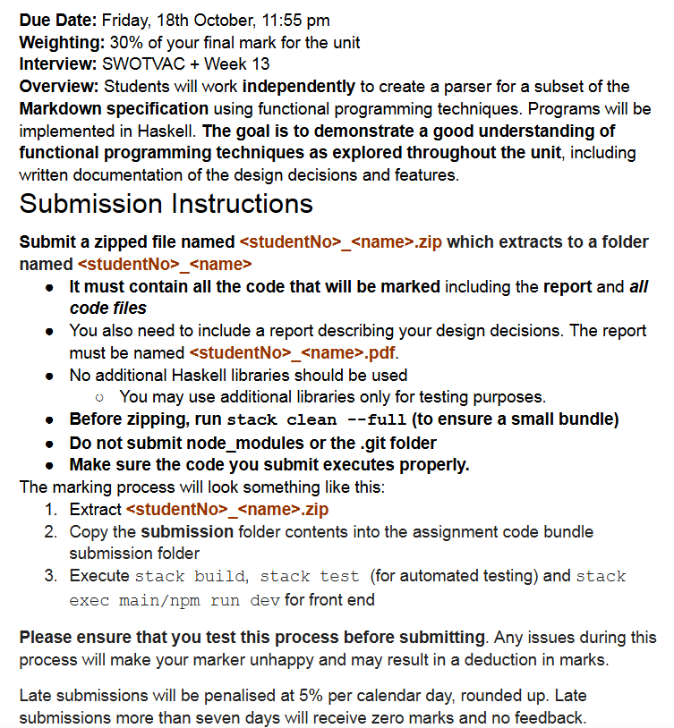

202410160020

后台姓名：贾雨轩
用户ID：135096
用户1V1昵称：Lynz
学生需求类型：作业辅导
学生基础：一般
期望上课时间：墨尔本时间 都行 和老师沟通
学生DUE时间：10.20
用户类型：1v1老用户
院校：Monash University
年级：大二
专业：Computer science
科目代码：FIT2102
科目名称：Programming Paradigms 2024
备注：
1、20号due，期望最近上课，目前暂时没有思路。
2、优先本校辅导过或者学过这门课的老师，或者非本校老师很熟悉的也可以。
3、学生希望老师预估一下课时。



这段文字是关于你需要如何提交这个作业的详细说明。主要内容如下：

### 1. 作业的基本信息

- **截止日期**：10月18日，星期五，晚上11:55。
- **占总成绩的比例**：作业占单元总成绩的30%。
- **面试**：会在 SWOTVAC 周和第13周进行。

### 2. 作业概述

你需要独立完成一个解析器，将 Markdown 文本转换为 HTML，使用函数式编程技术（Haskell 实现）。目标是展示你对课程中所学的函数式编程技术的理解，包括设计决策和功能特性方面的文档说明。

### 3. 提交要求

- 提交一个名为 `<studentNo>_<name>.zip` 的压缩文件，解压后文件夹名为 `<studentNo>_<name>`。
- 压缩文件必须包含所有将被评分的代码，包括报告和所有代码文件。
- 报告的命名格式为 `<studentNo>_<name>.pdf`，并且必须描述你的设计决策。
- **不允许**使用额外的 Haskell 库，除了用于测试目的的库。
- 压缩前运行 `stack clean --full` 来确保提交的包比较小。
- **不要**提交 `node_modules` 或 `.git` 文件夹。
- 确保提交的代码能够正确执行。

### 4. 评分过程

- 评分流程包括以下步骤：
  1. 解压 `<studentNo>_<name>.zip`。
  2. 将提交的文件夹内容复制到作业代码提交文件夹中。
  3. 执行 `stack build`, `stack test`（用于自动化测试），并执行 `stack exec main/npm run dev` 用于前端测试。
- **请务必在提交之前测试这个流程**，确保代码能够正确运行。如果在这个过程中出现问题，会导致评分者不满意，可能会被扣分。

### 5. 迟交处理

- 每天迟交将被扣除5%的分数，向上取整。
- 迟交超过7天将会得零分，且没有反馈。

总结起来，这些要求包括了提交文件的命名、内容、测试和评分流程的说明。确保在提交之前你已经按照这些步骤测试了你的代码，这样可以避免因提交问题而被扣分。


这段引言是关于你的作业的总体说明。它概述了任务的目标和要求。具体内容如下：

### 作业目标

你需要使用 **Haskell** 开发一个**转换器**，将 Markdown 文本转换为 **HTML**。这个任务涉及到解析 Markdown 语法并生成相应的 HTML 输出。具体流程包括：

1. 一个网页将通过基于 HTML 的 WebSocket 连接将 Markdown 文本发送到 Haskell 后端服务器。
2. Haskell 服务器会解析 Markdown，并将其转换为对应的 HTML，最后返回给网页。
3. 作业中提供了一些框架代码，用于处理网页与后端之间的基本通信。

### 使用资源

- 你可以使用前几周课程中学到的内容，包括**教程题的解决方案**，帮助你开发转换器。
- **必须引用或注明从外部来源获得的代码和想法**，这包括独立研究中找到的内容，以防止抄袭。

### 作业分为三个部分

1. **Part A（解析）**：实现 Markdown 的解析。
2. **Part B（格式化输出）**：将解析后的结果转换为 HTML 格式。
3. **Part C（附加功能）**：为网页增加额外的功能。

建议你在实现的时候**同时完成 Part A 和 Part B**，这样可以更好地理解解析和转换的整体过程。

### 语言解析范围

- 解析的 Markdown 语法是基于特定的 Markdown 规范，但是为了减少歧义，作业对 Markdown 的具体用法有一些额外的限制。
- 你需要仔细阅读每个部分的要求，以免做不必要的工作。

总结起来，你的任务是编写一个使用 Haskell 的 Markdown 到 HTML 的转换器，主要关注解析和 HTML 生成的两个阶段，并可能添加一些额外的功能。完成作业时，你需要遵循 Haskell 的函数式编程方法，并确保引用所有外部的内容和代码。


### 学习目标 (Goals / Learning Outcomes)

作业的目的是让你在实践中应用所学的技能（特别是解析相关的内容）。主要目标包括：

1. **有效地使用函数式编程和解析**：
   - 学习如何使用函数式编程的技术来进行数据解析。
2. **理解并掌握关键的函数式编程原则**：
   - 包括**高阶函数**（例如函数作为参数传递或返回值）、**纯函数**（没有副作用的函数）、**不可变数据结构**（数据不可修改）、以及**抽象**（将常见功能抽象为模块化代码）的概念。
3. **将 Haskell 和函数式编程技术应用于解析复杂的 Markdown 文本**：
   - 你需要应用 Haskell 以及函数式编程的技术来解析一些相对复杂的 Markdown 文本。

### 作业范围 (Scope of Assignment)

- 你只需要**解析**表达式，将其转换为所需的数据类型，然后再将结果转换为 HTML 字符串，使其可以通过现有的解释器进行渲染。
- **不需要**实际渲染 Markdown 或 HTML 字符串。也就是说，你的任务只是实现从 Markdown 到 HTML 的转换逻辑，具体的渲染（显示）工作由解释器负责。

简而言之，这次作业的重点在于利用函数式编程的方法解析 Markdown 文本，并通过 Haskell 的工具将它们转换为 HTML。作业会考察你对函数式编程原则的理解，并且要求你对数据进行有效的抽象和转换。


### 1. 作业分数分配和要求

作业被分为几个部分，每部分的分数如下：

- **Part A (12 分)**：解析 Markdown 字符串。
- **Part B (6 分)**：将 Markdown 转换为 HTML。
- **Part C (6 分)**：为网页增加额外功能。
- **Part E (扩展，额外加分)**：为作业增加扩展功能以获得额外的分数。

### 2. 中间表示 (ADT) 的使用

- 你需要将输入解析为一个**中间表示**（例如**抽象语法树** - Abstract Syntax Tree, ADT），以便转换为 HTML。这样做可以让 ADT 和 HTML 之间的转换更为容易。
- **ADT 的实现**需要添加 `deriving Show`，以方便测试代码是否正确。你不能覆盖这个默认的 `Show` 实例，因为评分者会依赖这个功能来测试你的代码。

### 3. 必须实现的函数

你需要在 `Assignment.hs` 文件中导出以下两个函数：

- **`markdownParser :: Parser ADT`**：这个函数负责将 Markdown 文本解析为 ADT。
- **`convertADTHTML :: ADT -> String`**：这个函数负责将 ADT 转换为 HTML 字符串。

### 4. 示例脚本和测试

- 你会被提供一系列 Markdown 文件来测试你的解析器。通过运行 `stack test`，它将尝试解析 Markdown 并将输出保存到文件夹中。你可以手动查看生成的 HTML 是否正确。
- 在评分时，评分者会用更复杂的 Markdown 示例来测试你的代码，因此你必须自己编写额外的测试用例，以确保解析器能够处理更复杂的 Markdown。
- 评分时可能会生成一个 `git diff`，即你的输出和预期输出之间的差异，这需要你安装 Git 命令行工具。

### 5. 推荐的测试方法

- 更推荐的方法是使用 `npm run dev` 结合 `stack run main` 来测试代码，这样可以在网页上实时运行你的代码，方便调试和查看输出。

### 总结

你需要创建一个 Haskell 程序，能够解析 Markdown 文本并将其转换为 HTML，分为多个部分完成。同时，需要编写测试用例确保代码的正确性，并且要通过工具进行测试和调试。


这段内容描述了 **Part A** 的具体要求，你需要编写一个解析器来解析 Markdown 文本，并且将其转换为相应的数据结构（ADT，代数数据类型），然后再将其转换为 HTML。这部分的具体细节如下：

### Part A: 解析 Markdown (12 分)

这个部分要求你将 Markdown 字符串解析为 **代数数据类型（ADT）**。你需要定义自己的 ADT，来表示不同的 Markdown 元素，并定义一系列解析函数，将 Markdown 的不同部分解析为 ADT 的相应部分。解析的内容会用于之后的 HTML 转换，因此你的 ADT 需要包含足够的信息来支持后续的 HTML 生成

### 解析 Markdown 中的文本修饰符（2 分）

Markdown 中有六种不同的修饰符，它们用于改变文本的显示方式。你不需要处理任何的转义字符，并且所有的文本修饰符内容都不能是空的。具体的修饰符如下：

1. **斜体文本**：
   - 由单个下划线 `_` 包裹。
   - 示例：`_italics_`。
2. **粗体文本**：
   - 由两个星号 `**` 包裹。
   - 示例：`**bold**`。
3. **删除线文本**：
   - 由两个波浪号 `~~` 包裹。
   - 示例：`~~strikethrough~~`。
4. **链接**：
   - 使用 `[链接文本](URL)` 的格式表示。
   - 示例：`[click here](www.google.com)`。
   - 你不需要考虑链接内部还有其他链接的情况。
5. **行内代码**：
   - 使用反引号 ``` 包裹。
   - 示例：``code``。
6. **脚注**：
   - 使用 `[^ℤ+]` 格式，其中 ℤ+ 表示正整数（如 `1, 2, 3...`）。
   - 示例：`[^1]`、`[^2]` 等等。注意，脚注的数字不需要按顺序，也不需要验证引用的顺序。
   - 例如，可能出现只有一个脚注 `[^10]` 的情况。
   - 注意，`[` 和 `]` 之间不允许有空格，如 `[^ 1]`、`[^2 ]`、`[ ^3]` 都是不合法的。

### 其他注意事项

- 你**不需要处理嵌套修饰符**的情况，例如 `**_bold and italics_**`。
- 除非另有说明，修饰符中的文本可以包含任意数量的空白字符（不包括换行符）。例如，`_ italics _`、`**bold **`、`~~ strikethrough~~`、`` inline code `` 以及 `[ link text](example.com)` 都是合法的。

### 实现要求

你需要编写解析器来识别这些修饰符，并将它们解析为相应的代数数据类型（ADT），然后在后续的部分中使用这些数据生成 HTML 输出。每个修饰符都有其特定的语法格式，确保解析逻辑能够严格匹配这些格式。


这段代码定义了一个名为 `MarkdownElement` 的数据类型，用于表示不同类型的 Markdown 元素结构。它使用 Haskell 的代数数据类型 (Algebraic Data Type, ADT) 来定义各种 Markdown 语法元素，如标题、段落、块引用等。以下是逐行的解释：

### 逐行解释
1. **`data MarkdownElement =`**  
   这行定义了一个数据类型 `MarkdownElement`，用于表示 Markdown 文档的不同元素。每种元素类型对应一个不同的构造器（类似“子类型”）。

2. **`Heading Int String`**  
   - 表示标题元素，例如 `# Heading` 或 `## Subheading`。
   - `Heading` 是构造器，`Int` 表示标题的级别（例如 1 表示一级标题，2 表示二级标题等）。
   - `String` 表示标题的内容，例如 `"Introduction"`。
   - 例如：`Heading 2 "Overview"` 表示一个二级标题，标题内容为 `"Overview"`。

3. **`Paragraph String`**  
   - 表示段落元素。
   - `Paragraph` 是构造器，`String` 表示段落的文本内容。
   - 例如：`Paragraph "This is the first paragraph."` 表示一个包含 `"This is the first paragraph."` 内容的段落。

4. **`Blockquote String`**  
   - 表示块引用元素，例如 Markdown 中以 `>` 开头的引用内容。
   - `Blockquote` 是构造器，`String` 表示引用的文本内容。
   - 例如：`Blockquote "This is a quote."` 表示一个包含 `"This is a quote."` 的块引用。

5. **`OrderedList [String]`**  
   - 表示有序列表元素。
   - `OrderedList` 是构造器，`[String]` 表示一个列表，包含多个字符串，每个字符串代表一个列表项。
   - 例如：`OrderedList ["Item 1", "Item 2", "Item 3"]` 表示一个包含三个列表项的有序列表。

6. **`CodeBlock String String`**  
   - 表示代码块元素，例如 Markdown 中以三重反引号包裹的代码块（```` ``` ````）。
   - `CodeBlock` 是构造器，包含两个 `String`：
     - 第一个 `String` 表示代码块的语言类型，例如 `"haskell"` 或 `"python"`。
     - 第二个 `String` 表示代码的实际内容。
   - 例如：`CodeBlock "python" "print('Hello World')"` 表示一个 Python 代码块，内容为 `print('Hello World')`。

7. **`deriving (Show)`**  
   - 这部分表示为 `MarkdownElement` 派生 `Show` 类型类。
   - 这样做的好处是，可以让 `MarkdownElement` 自动实现 `Show`，从而可以将 `MarkdownElement` 类型的值打印到控制台，便于调试和输出。
   - 例如：`show (Heading 2 "Overview")` 会返回 `"Heading 2 \"Overview\""`。

### 总结
- `MarkdownElement` 数据类型包含了 Markdown 的多种元素，包括标题、段落、块引用、有序列表和代码块。
- 通过定义不同的构造器，可以方便地将 Markdown 文档的不同部分结构化，便于后续的处理和转换（如将 Markdown 转换为 HTML）。
- `deriving (Show)` 可以让我们直接打印这些数据类型的值，方便调试。


这段代码实现了一个解析 Markdown 标题的解析器 `headingParser`，其目的是解析以 `#` 开头的标题（类似 Markdown 中的 `# Heading 1`）。

### 逐行解释
1. **`headingParser :: String -> Maybe (MarkdownElement, String)`**  
   这行定义了 `headingParser` 的类型签名：
   - 它接受一个 `String` 类型的输入，表示要解析的文本。
   - 返回一个 `Maybe (MarkdownElement, String)`，即：
     - 如果成功解析标题，则返回 `Just (Heading, String)`，其中 `Heading` 是解析到的标题，`String` 是剩余的未解析部分。
     - 如果解析失败，则返回 `Nothing`。

2. **`headingParser input =`**  
   定义 `headingParser` 函数，其中 `input` 是待解析的输入字符串。

3. **`let (hashes, rest) = span (=='#') input`**  
   使用 `span` 函数来处理输入字符串：
   - `span` 会将输入字符串从头开始划分为两部分，第一部分是连续的 `#` 字符，第二部分是剩余的字符。
   - 这里，`hashes` 是连续的 `#`，`rest` 是剩余的内容。
   
   例如，对于输入 `### Title`，结果是：
   - `hashes = "###"`
   - `rest = " Title"`

4. **`in if not (null hashes) && not (null rest) && head rest == ' '`**  
   使用 `if` 语句判断是否符合标题的条件：
   - `not (null hashes)`：确保 `hashes` 不是空的，即至少存在一个 `#` 字符。
   - `not (null rest)`：确保 `#` 之后还有其他内容。
   - `head rest == ' '`：确保 `#` 后面紧跟一个空格，这是 Markdown 标题的规则。
   
   如果这三个条件都满足，就可以认为该行是一个有效的标题。

5. **`then Just (Heading (length hashes) (drop 1 rest), "")`**  
   如果上述条件成立，构造一个 `Just` 值：
   - `(Heading (length hashes) (drop 1 rest), "")`：
     - `Heading (length hashes)`：用 `length hashes` 确定标题的级别（例如 `###` 表示三级标题）。
     - `(drop 1 rest)`：跳过空格，取标题的文本内容。
     - `""` 表示当前没有未解析的部分，因为这个函数处理的是完整的一行。
   
   例如，对于输入 `### Title`，结果是：
   
- `Heading 3 "Title"`：表示一个三级标题，内容为 `"Title"`。
  
6. **`else Nothing`**  
   如果上述条件不成立，说明输入不符合标题格式，返回 `Nothing` 表示解析失败。

### 总结
- **`headingParser`** 函数的作用是检查输入字符串是否是 Markdown 标题，并解析出标题的级别和内容。
- 它使用 `#` 的数量来确定标题的级别，`#` 后面必须有一个空格，之后的内容才是标题的文本。
- 如果条件不满足，则返回 `Nothing`，表示解析失败。


在这部分作业中，你需要为图像、脚注引用和自由文本编写解析器函数。下面是详细的实现指导：

### 1. 图像解析 (0.5 分)
Markdown 中的图像由三部分组成：
1. **Alt Text（替代文本）**：图片加载失败时显示的文本。
2. **URL**：图片的 URL 或路径。URL 不能包含空格。
3. **Caption Text（标题文本）**：图片的标题。

Markdown 图像的格式为：
```

```
**实现要求**：
- 替代文本、标题文本和 URL 中都不应包含其他文本修饰符。
- 图像必须位于行的开头，可以在感叹号 `!` 前有空格，但不能是换行符。
- 在 URL 和标题文本之间必须有至少一个非换行空格。例如，`` 是无效的。
- `!` 和 `[` 之间不能有任何空格。

**代码实现建议**：

- 使用 Haskell 的 **解析器组合器**（parser combinators）编写一个图像解析函数，确保满足所有条件，例如：
  ```haskell
  imageParser :: Parser MarkdownElement
  imageParser = do
    optional (many (char ' '))  -- 可选的空格
    char '!'
    char '['
    altText <- many (noneOf "]")
    char ']'
    char '('
    url <- many (noneOf " \"")
    char ' '
    char '"'
    captionText <- many (noneOf "\"")
    char '"'
    char ')'
    return $ Image altText url captionText
  ```

> 这段代码实现了一个用于解析 Markdown 图像的解析器 `imageParser`，其目的是解析 Markdown 中表示图片的语法，例如：
>
> ```markdown
> 
> ```
>
> 下面是逐行的详细解释：
>
> ### 逐行解释
> 1. **`imageParser :: Parser MarkdownElement`**  
>    - 这行定义了 `imageParser` 的类型签名：
>      - 它是一个 `Parser`，返回 `MarkdownElement` 类型，用于表示解析得到的 Markdown 元素。
>      - 解析的结果是 `Image altText url captionText`，其中 `altText` 是图片的替代文本，`url` 是图片的链接，`captionText` 是图片的描述文本。
>
> 2. **`imageParser = do`**  
>    - 使用 `do` 语法来组合多个解析动作。
>
> 3. **`optional (many (char ' '))`**  
>    - `optional` 表示这部分是可选的，不一定存在。
>    - **`many (char ' ')`**：尝试解析零个或多个空格字符。
>    - 这一步的作用是允许图像前存在任意数量的空格，但不强制要求。
>
> 4. **`char '!'`**  
>    - 解析字符 `'!'`，它是 Markdown 中表示图片的开始符号。
>
> 5. **`char '['`**  
>    - 解析字符 `'['`，它是 Markdown 中图像描述文本（alt text）的开始符号。
>
> 6. **`altText <- many (noneOf "]")`**  
>    - 解析 `altText`（替代文本），直到遇到字符 `']'` 为止。
>    - **`many (noneOf "]")`**：解析并收集所有不是 `']'` 的字符。
>    - 例如，对于输入 ``，`altText` 解析结果为 `"example"`。
>
> 7. **`char ']'`**  
>    - 解析字符 `']'`，它是 Markdown 中图像描述文本的结束符号。
>
> 8. **`char '('`**  
>    - 解析字符 `'('`，它是 Markdown 中图像链接（URL）的开始符号。
>
> 9. **`url <- many (noneOf " \"")`**  
>    - 解析 `url`（图片的链接）。
>    - **`many (noneOf " \"")`**：解析并收集所有不是空格或者引号的字符。
>    - 例如，对于输入 ``，`url` 解析结果为 `"https://example.com"`。
>
> 10. **`char ' '`**  
>     - 解析字符 `' '`，在 URL 和描述文本之间需要有一个空格。
>
> 11. **`char '"'`**  
>     - 解析字符 `'"'`，它是描述文本的开始符号。
>
> 12. **`captionText <- many (noneOf "\"")`**  
>     - 解析 `captionText`（描述文本），直到遇到字符 `'"'` 为止。
>     - **`many (noneOf "\"")`**：解析并收集所有不是 `'"'` 的字符。
>     - 例如，对于输入 ``，`captionText` 解析结果为 `"caption text"`。
>
> 13. **`char '"'`**  
>     - 解析字符 `'"'`，它是描述文本的结束符号。
>
> 14. **`char ')'`**  
>     - 解析字符 `')'`，它是 Markdown 中图像的结束符号。
>
> 15. **`return $ Image altText url captionText`**  
>     - 返回解析得到的 `MarkdownElement`，即 `Image altText url captionText`：
>       - `altText` 是替代文本。
>       - `url` 是图片的链接。
>       - `captionText` 是图片的描述文本。
>
> ### 总结
> - **`imageParser`** 是一个用于解析 Markdown 图像的解析器。
> - 它依次解析 Markdown 中的图像语法，包括 `!`，`[]` 中的替代文本，`()` 中的 URL 和描述文本。
> - 最终返回一个 `Image` 数据类型，包含图像的替代文本、链接和描述文本。
>
> 例如，对于 Markdown 语法 ``，解析器会返回一个 `Image` 元素，其内容为：
> - 替代文本（`altText`）为 `"example"`。
> - 链接（`url`）为 `"https://example.com"`。
> - 描述文本（`captionText`）为 `"caption text"`。

### 2. 脚注引用解析 (0.5 分)

脚注引用的格式类似于脚注，具体为：
- 行首有若干个空格，然后是 `[^ℤ+]`，其中 `ℤ+` 表示正整数，后面跟着一个冒号 `:`，再接着是文本内容。

例如：
```
[^1]: My reference.
```
**实现要求**：

- 脚注引用不能包含其他的文本修饰符。
- 引用文本前的空格应被忽略。

**代码实现建议**：

- 编写一个解析器函数来解析脚注引用，例如：
  ```haskell
  footnoteRefParser :: Parser MarkdownElement
  footnoteRefParser = do
    optional (many (char ' '))  -- 可选的空格
    string "[^"
    refNumber <- many1 digit
    string "]:"
    optional (char ' ')
    content <- many (noneOf "\n")
    return $ FootnoteReference (read refNumber) content
  ```

> 这段代码实现了一个用于解析 Markdown 脚注引用的解析器 `footnoteRefParser`，它解析类似于脚注的 Markdown 语法，如 `[^1]: 这是脚注内容`。以下是逐行的详细解释：
>
> ### 逐行解释
>
> 1. **`footnoteRefParser :: Parser MarkdownElement`**
>    - 这是 `footnoteRefParser` 的类型签名：
>      - 它是一个 `Parser`，用于解析 Markdown，并返回 `MarkdownElement` 类型的结果。
>      - 具体来说，这里解析得到的是 `FootnoteReference` 类型的元素。
>
> 2. **`footnoteRefParser = do`**
>    - 使用 `do` 语法块来组合多个解析动作。
>
> 3. **`optional (many (char ' '))`**
>    - `optional` 表示这部分是可选的，不一定存在。
>    - **`many (char ' ')`**：尝试解析零个或多个空格字符。
>    - 这一步的作用是允许脚注引用的开头存在任意数量的空格，但不强制要求。
>
> 4. **`string "[^"`**
>    - 解析字符串 `"[^"`，这是 Markdown 中脚注引用的标记部分。
>    - `"[^"` 表示脚注的开始符号，其中 `[` 是开始，`^` 表示这是一个脚注。
>
> 5. **`refNumber <- many1 digit`**
>    - 解析脚注引用的编号，保存为 `refNumber`：
>    - **`many1 digit`**：解析一个或多个数字字符 (`digit`)，这些数字表示脚注的编号。
>    - 例如，对于输入 `[^1]: 这是脚注内容`，`refNumber` 解析结果为 `"1"`。
>
> 6. **`string "]:"`**
>    - 解析字符串 `"]:"`，这部分表示脚注引用的结束和脚注内容的开始。
>    - 例如，输入 `[^1]:` 中，这部分解析 `]` 和 `:`。
>
> 7. **`optional (char ' ')`**
>    - 尝试解析一个空格字符，这是可选的。
>    - 在 `]:` 后面可能会有一个空格，以便与脚注内容之间分隔开。
>
> 8. **`content <- many (noneOf "\n")`**
>    - 解析 `content`，即脚注的实际内容，直到遇到换行符为止。
>    - **`many (noneOf "\n")`**：解析并收集所有不是换行符 (`\n`) 的字符，这些字符就是脚注的内容。
>    - 例如，对于输入 `[^1]: 这是脚注内容`，`content` 解析结果为 `"这是脚注内容"`。
>
> 9. **`return $ FootnoteReference (read refNumber) content`**
>    - 使用 `return` 将解析结果封装为 `MarkdownElement` 类型。
>    - **`FootnoteReference (read refNumber) content`**：
>      - 使用 `read refNumber` 将字符串类型的编号 `refNumber` 转换为整数。
>      - 例如，对于 `[^1]: 这是脚注内容`，`refNumber` 是 `"1"`，`read refNumber` 会将其转换为 `1`。
>      - `content` 是脚注的文本内容。
>    - 返回一个 `FootnoteReference`，其包含编号和脚注内容。
>
> ### 总结
> - **`footnoteRefParser`** 函数用于解析 Markdown 脚注引用。
> - 它解析的目标是类似于 `[^1]: 这是脚注内容` 的格式：
>   - `[^` 表示脚注的开始。
>   - `1` 是脚注的编号，可以是任意一个或多个数字。
>   - `]:` 表示脚注的结束部分。
>   - 接下来是脚注的内容，例如 `"这是脚注内容"`。
> - 解析成功后，返回一个 `FootnoteReference`，其中包含编号和内容的 Markdown 元素。
>   
>
> 通过这个解析器，可以将 Markdown 文档中的脚注引用部分结构化为 `MarkdownElement`，以便进一步处理或转换为其他格式（例如 HTML）。

### 3. 自由文本解析 (1 分)

自由文本是指不属于其他任何类型的文本。它可以包含文本修饰符，例如斜体、粗体、删除线等。

**实现要求**：
- 自由文本可以包含修饰符。
- 例如：`Here is some **markdown**` 是合法的自由文本。

**代码实现建议**：
- 编写一个自由文本解析器来处理这些情况，例如：
  ```haskell
  freeTextParser :: Parser MarkdownElement
  freeTextParser = do
    content <- many1 (noneOf "\n")
    return $ FreeText content
  ```
  
  > 这段代码实现了一个用于解析 Markdown 自由文本内容的解析器 `freeTextParser`，用于解析 Markdown 中不属于特定格式（如标题、引用等）的普通文本行。
  >
  > ### 逐行解释
  >
  > 1. **`freeTextParser :: Parser MarkdownElement`**
  >    - 这是 `freeTextParser` 的类型签名：
  >      - 它是一个 `Parser`，用于解析 Markdown 文本并返回 `MarkdownElement` 类型的结果。
  >      - 返回的结果是 `FreeText` 类型，用于表示一般的文本内容。
  >
  > 2. **`freeTextParser = do`**
  >    - 使用 `do` 语法块来组合多个解析动作。
  >
  > 3. **`content <- many1 (noneOf "\n")`**
  >    - 解析 `content`，表示自由文本内容。
  >    - **`many1 (noneOf "\n")`**：
  >      - `many1` 表示匹配并解析**至少一个**符合条件的字符。
  >      - **`noneOf "\n"`** 表示解析所有**不是换行符**的字符，这意味着它会读取一行文本内容，直到遇到换行符为止。
  >      - 例如，对于输入 `"This is a line of text"`，`content` 解析结果为 `"This is a line of text"`。
  >
  > 4. **`return $ FreeText content`**
  >    - 使用 `return` 将解析结果封装为 `MarkdownElement` 类型。
  >    - **`FreeText content`**：创建一个 `FreeText` 元素，其内容为 `content`，表示一般的文本内容。
  >    - 例如，对于输入 `"This is a line of text"`，返回的结果是 `FreeText "This is a line of text"`。
  >
  > ### 总结
  > - **`freeTextParser`** 用于解析 Markdown 文档中的普通文本内容，这些文本不属于其他特定的 Markdown 语法（如标题、引用、代码块等）。
  > - 它解析直到遇到换行符为止的文本内容，且至少匹配一个字符。
  > - 最终返回一个 `FreeText` 数据类型，用于表示该行的文本内容。
  >
  > 通过这个解析器，可以将 Markdown 文档中普通文本行的部分提取并结构化为 `MarkdownElement`，便于后续的处理或转换操作（例如将其转换为 HTML）。

### 总结

- **图像解析**需要考虑替代文本、URL 和标题文本之间的格式和约束。
- **脚注引用解析**需要处理行首的空格、脚注编号和引用内容。
- **自由文本解析**需要捕获那些不属于其他元素的文本，并支持包含修饰符。

你可以将这些解析函数结合起来使用，以构建一个完整的 Markdown 解析器，将所有这些元素解析为代数数据类型 (ADT)，供后续转换为 HTML 时使用。


这部分描述了如何解析 Markdown 中的标题。Markdown 标题可以通过不同的方式表示，需要根据这些规则来编写相应的解析器。

### 标题解析的要求 (1 分)
Markdown 中的标题有两种格式：

1. **井号 (#) 标记**：
   - 标题由行首的若干空格（非换行符）和一个或多个井号 `#` 组成，然后至少有一个空格，再加上标题文本。
   - 最多可以有 6 个 `#`，代表从一级标题到六级标题。例如：
     ```
     # Heading 1
     ## Heading 2
     ### Heading 3
     #### Heading 4
     ##### Heading 5
     ###### Heading 6
     ```
   - **注意**：至少需要一个非换行空格字符，因此 `#Heading 1` 是无效的标题。
   - 行首必须是 `#` 或空格，因此例如 `abc # Heading` 不是合法的标题。

2. **替代语法**：
   - 一级和二级标题可以使用替代语法：
     - 在标题文本下一行添加至少两个等号 `=`（一级标题）或至少两个短横线 `-`（二级标题）。
     - 这行只允许包含等号或短横线，不能有其他字符。例如：
       ```
       Alternative Heading 1
       ======
       
       Heading level 2
       ---------------
       ```
   - **注意**：没有其他标题级别（如三级及以下）可以使用这种替代语法。

### 实现要求
你需要编写一个 Haskell 解析器函数来处理这两种标题格式。以下是实现建议：

1. **定义标题解析器函数**：
   - 解析井号形式的标题：
     ```haskell
     headingParser :: Parser MarkdownElement
     headingParser = do
       optional (many (char ' '))   -- 可选的行首空格
       hashes <- many1 (char '#')   -- 至少一个井号
       char ' '                     -- 一个空格
       content <- many (noneOf "\n") -- 标题内容
       return $ Heading (length hashes) content
     ```
     
     - 这段 Haskell 代码定义了一个名为 `headingParser` 的解析器，用于解析 Markdown 格式中的标题（Heading）。以下是对代码的逐行解释：
       
       ```haskell
       headingParser :: Parser MarkdownElement
       headingParser = do
         optional (many (char ' '))   -- 可选的行首空格
         hashes <- many1 (char '#')   -- 至少一个井号
         char ' '                     -- 一个空格
         content <- many (noneOf "\n") -- 标题内容
      return $ Heading (length hashes) content
       ```
       
       ### 详细解释
       
       1. **类型签名**
          ```haskell
          headingParser :: Parser MarkdownElement
          ```
          - `headingParser` 是一个解析器（`Parser`），它的输出类型是 `MarkdownElement`。这意味着解析器成功解析后，会生成一个 `MarkdownElement` 类型的值。
       
       2. **解析过程**
          ```haskell
          headingParser = do
          ```
          - 使用 `do` 语法糖来顺序执行一系列解析操作。
       
       3. **可选的行首空格**
          ```haskell
          optional (many (char ' '))
          ```
          - `many (char ' ')`：匹配零个或多个空格字符。
          - `optional`：表示这一部分是可选的，即标题行前可以有也可以没有空格。
          - 这一步确保解析器能够处理有缩进或没有缩进的标题。
       
       4. **匹配至少一个井号（#）**
          ```haskell
          hashes <- many1 (char '#')
          ```
          - `many1 (char '#')`：匹配至少一个 `#` 字符，并将匹配到的所有 `#` 存储在变量 `hashes` 中。
          - 在 Markdown 中，`#` 的数量表示标题的级别（例如，`#` 是一级标题，`##` 是二级标题，依此类推）。
       
       5. **匹配一个空格**
          ```haskell
          char ' '
          ```
          - 确保在 `#` 字符后面有一个空格，这是 Markdown 标题语法的要求。
       
       6. **匹配标题内容**
          ```haskell
          content <- many (noneOf "\n")
          ```
          - `many (noneOf "\n")`：匹配除了换行符之外的任意字符，直到行尾。
          - 将匹配到的内容存储在变量 `content` 中，这就是标题的文本内容。
       
       7. **返回解析结果**
          ```haskell
          return $ Heading (length hashes) content
          ```
          - 创建一个 `Heading` 类型的值，其中：
            - `length hashes`：计算 `#` 字符的数量，确定标题的级别。
            - `content`：标题的文本内容。
          - 例如，对于 `### 示例标题`，`length hashes` 将是 `3`，`content` 将是 `"示例标题"`，生成的 `Heading` 对象表示三级标题。
       
       ### 总结
       
       `headingParser` 解析器的功能是识别 Markdown 格式的标题行，提取标题的级别和内容。例如：
       
       - 输入 `# 一级标题` 将被解析为一级标题，内容为 `"一级标题"`。
       - 输入 `### 三级标题` 将被解析为三级标题，内容为 `"三级标题"`。
       
       这个解析器可以作为更复杂的 Markdown 解析器的一部分，用于构建抽象语法树（AST）或其他结构化表示形式。
     
   - 解析替代语法的标题：
     
     ```haskell
     alternativeHeadingParser :: Parser MarkdownElement
     alternativeHeadingParser = do
       content <- many1 (noneOf "\n") -- 标题内容
       newline
       line <- many1 (char '=' <|> char '-') -- 解析等号或短横线
       let level = if '=' `elem` line then 1 else 2
       return $ Heading level content
     ```
     - 这段代码定义了另一个解析器 `alternativeHeadingParser`，用于解析 Markdown 中另一种表示标题的方式，主要针对的是「Setext-style」标题。这种标题在 Markdown 中是用一行 `=` 或 `-` 符号表示不同级别的标题。以下是对这段代码的详细解释：
     
       ```haskell
       alternativeHeadingParser :: Parser MarkdownElement
       alternativeHeadingParser = do
         content <- many1 (noneOf "\n") -- 标题内容
         newline
         line <- many1 (char '=' <|> char '-') -- 解析等号或短横线
         let level = if '=' `elem` line then 1 else 2
         return $ Heading level content
       ```
     
       ### 逐行解释
     
       1. **类型签名**
          ```haskell
          alternativeHeadingParser :: Parser MarkdownElement
          ```
          - `alternativeHeadingParser` 是一个解析器（`Parser`），它输出 `MarkdownElement` 类型的值。
          - 这表明该解析器会解析出一个 Markdown 标题元素。
     
       2. **解析标题内容**
          ```haskell
          content <- many1 (noneOf "\n")
          ```
          - `many1 (noneOf "\n")`：匹配除换行符以外的一个或多个字符。
          - 这一步解析的是标题的实际文本内容，并将其存储在 `content` 变量中。
          - 例如，输入 `这是标题`，它将捕获 `这是标题` 作为内容。
     
       3. **匹配换行符**
          ```haskell
          newline
          ```
          - `newline`：匹配并消耗一个换行符。
          - 这一行表示标题的文本结束，并且下一行应该是 `=` 或 `-`，用来表示标题级别。
     
       4. **解析 `=` 或 `-` 行**
          ```haskell
          line <- many1 (char '=' <|> char '-')
          ```
          - `many1 (char '=' <|> char '-')`：匹配一个或多个 `=` 或 `-` 字符。
          - `char '=' <|> char '-'` 使用 `Alternative` 操作符 `<|>`，表示可以匹配等号或短横线。
          - 在 Markdown 中：
            - 如果标题下面的装饰行是等号 `=`，表示这是一级标题（h1）。
            - 如果装饰行是短横线 `-`，表示这是二级标题（h2）。
     
       5. **确定标题级别**
          ```haskell
          let level = if '=' `elem` line then 1 else 2
          ```
          - 使用 `if` 语句来判断装饰行中是否包含等号 `=`：
            - 如果有等号，`level` 被设为 `1`，表示一级标题。
            - 否则，`level` 被设为 `2`，表示二级标题。
          - 例如：
            - 如果装饰行是 `===`，则标题级别为 `1`。
            - 如果装饰行是 `---`，则标题级别为 `2`。
     
       6. **返回解析结果**
          ```haskell
          return $ Heading level content
          ```
          - 返回一个 `Heading` 类型的值，包含两个部分：
            - `level`：根据装饰行确定的标题级别（1 或 2）。
            - `content`：标题的文本内容。
          - 例如，对于输入：
            ```
            标题内容
            -----
            ```
            解析器将返回 `Heading 2 "标题内容"`，表示二级标题。
     
       ### 总结
     
       `alternativeHeadingParser` 是一个解析器，用于处理 Markdown 中的 Setext-style 标题，这种标题格式是由一行文本和下一行的等号 `=`（一级标题）或短横线 `-`（二级标题）组成的。它会解析标题的文本内容以及对应的标题级别，输出结果类似于：
     
       - 对于输入：
         ```
         一级标题
         ===
         ```
         返回的是 `Heading 1 "一级标题"`，表示一级标题。
     
       - 对于输入：
         ```
         二级标题
         ---
         ```
         返回的是 `Heading 2 "二级标题"`，表示二级标题。
   
2. **组合解析器**：

   - 将不同格式的标题解析器结合起来，以处理所有可能的标题形式：
     ```haskell
     fullHeadingParser :: Parser MarkdownElement
     fullHeadingParser = try headingParser <|> try alternativeHeadingParser
     ```

### 总结
- 井号 `#` 标记的标题需要解析井号的数量，以确定标题的级别，然后解析标题文本。
- 替代语法的标题需要解析标题文本，然后确认下一行是否是等号或短横线，以确定是否是一级或二级标题。
- 通过组合解析器处理两种不同的标题格式，确保能够匹配所有有效的 Markdown 标题。

通过这些解析器函数，你可以识别和解析 Markdown 中的标题，并将它们转换为你定义的代数数据类型（ADT），用于后续的 HTML 转换。


要完成这些部分的解析器，需要分别为块引用（Blockquotes）和代码块（Code）编写解析函数。以下是每个部分的具体实现思路和 Haskell 代码示例。

### 1. Blockquotes (块引用) - 解析器实现
块引用以符号 `>` 开头，可能前面有零个或多个空格，紧接着是引用的内容。块引用可以包含多行，每行都需要以 `>` 开头。

**实现思路：**
- 首先解析可能存在的空格，然后解析 `>`。
- 解析 `>` 之后的空格，紧接着解析块引用的内容，直到遇到换行符。
- 可以使用递归或循环来处理多行的块引用。

**Haskell 代码示例：**
```haskell
blockquoteParser :: Parser MarkdownElement
blockquoteParser = do
  optional (many (char ' '))  -- 可选的空格
  char '>'                    -- 匹配 '>' 符号
  optional (char ' ')         -- '>' 后面的可选空格
  content <- many (noneOf "\n")  -- 解析直到换行符的文本
  return $ Blockquote content  -- 返回 Blockquote 类型
```
- 这段 Haskell 代码定义了一个名为 `blockquoteParser` 的解析器，用于解析 Markdown 中的引用块（Blockquote），即以 `>` 开头的行。以下是对这段代码的逐行解释：

  ```haskell
  blockquoteParser :: Parser MarkdownElement
  blockquoteParser = do
    optional (many (char ' '))  -- 可选的空格
    char '>'                    -- 匹配 '>' 符号
    optional (char ' ')         -- '>' 后面的可选空格
    content <- many (noneOf "\n")  -- 解析直到换行符的文本
    return $ Blockquote content  -- 返回 Blockquote 类型
  ```

  ### 详细解释

  1. **类型签名**
     ```haskell
     blockquoteParser :: Parser MarkdownElement
     ```
     - `blockquoteParser` 是一个解析器（`Parser`），它的输出类型是 `MarkdownElement`。这个解析器解析出一个 `Blockquote` 元素。

  2. **解析过程**
     ```haskell
     blockquoteParser = do
     ```
     - 使用 `do` 语法糖来顺序执行多个解析操作。

  3. **可选的空格**
     ```haskell
     optional (many (char ' '))
     ```
     - `many (char ' ')`：匹配零个或多个空格字符。
     - `optional`：表示这一部分是可选的，即在 `>` 之前可以有一些空格。这是为了支持行首缩进。

  4. **匹配 `>` 符号**
     ```haskell
     char '>'
     ```
     - `char '>'`：匹配 `>` 字符，这是 Markdown 中引用块的开头符号。

  5. **可选的空格（在 `>` 后面）**
     ```haskell
     optional (char ' ')
     ```
     - `optional (char ' ')`：表示在 `>` 符号后面可以有一个空格。Markdown 中通常在 `>` 后面有一个空格，但这并不是强制要求，因此用 `optional` 使其可选。

  6. **解析引用内容**
     ```haskell
     content <- many (noneOf "\n")
     ```
     - `many (noneOf "\n")`：匹配任意多个字符，直到遇到换行符（`'\n'`）为止。
     - 这一部分用于解析引用块的实际内容，并将其存储在变量 `content` 中。

  7. **返回解析结果**
     ```haskell
     return $ Blockquote content
     ```
     - 返回一个 `Blockquote` 类型的值，包含解析出的引用内容。
     - `Blockquote content` 表示一个引用块，`content` 是引用块中的文本内容。
     - 例如，对于输入：
       ```
       > 这是一个引用
       ```
       `content` 将是 `"这是一个引用"`，返回的结果是一个 `Blockquote "这是一个引用"`。

  ### 总结

  `blockquoteParser` 是一个用于解析 Markdown 引用块的解析器。它识别以 `>` 开头的行，并提取引用块的内容，生成一个 `Blockquote` 元素。该解析器能处理引用前后的可选空格，并且能够正确解析单行引用的内容。

  例如：

  - 输入 `> 这是一个引用`，解析器将返回 `Blockquote "这是一个引用"`。

- 这个代码段会解析一个块引用元素，它会跳过开头的空格，匹配 `>` 符号后面跟随的内容。

- 需要在主解析器中添加递归逻辑以处理多行的块引用。

### 2. Code Block (代码块) - 解析器实现
代码块由三重反引号 (```) 包围，可以有可选的语言标识符。

**实现思路：**
- 解析以三个反引号 (```) 开始的部分，可能有空格。
- 接下来可能会有一个语言标识符（如 `haskell`）。
- 解析代码内容，直到遇到三个反引号结束代码块。

**Haskell 代码示例：**
```haskell
codeBlockParser :: Parser MarkdownElement
codeBlockParser = do
  optional (many (char ' '))  -- 可选的空格
  string "```"                -- 匹配代码块的开始符号 ```
  lang <- optional (many (noneOf "\n")) -- 可选的语言标识符
  newline                     -- 匹配换行符
  code <- manyTill anySingle (string "```") -- 解析代码内容直到结尾的 ```
  return $ CodeBlock (maybe "" id lang) code -- 返回 CodeBlock，语言可能为空
```
- 这段 Haskell 代码定义了一个名为 `codeBlockParser` 的解析器，用于解析 Markdown 中的代码块。Markdown 中的代码块以三个反引号（```` ``` ````）标识，且可以指定代码块的语言。以下是对这段代码的逐行解释：

  ```haskell
  codeBlockParser :: Parser MarkdownElement
  codeBlockParser = do
    optional (many (char ' '))  -- 可选的空格
    string "```"                -- 匹配代码块的开始符号 ```
    lang <- optional (many (noneOf "\n")) -- 可选的语言标识符
    newline                     -- 匹配换行符
    code <- manyTill anySingle (string "```") -- 解析代码内容直到结尾的 ```
    return $ CodeBlock (maybe "" id lang) code -- 返回 CodeBlock，语言可能为空
  ```

  ### 逐行解释

  1. **类型签名**
     ```haskell
     codeBlockParser :: Parser MarkdownElement
     ```
     - `codeBlockParser` 是一个解析器（`Parser`），其输出类型为 `MarkdownElement`，表示它解析 Markdown 代码块并返回一个 `MarkdownElement` 类型的值。

  2. **解析器开始**
     ```haskell
     optional (many (char ' '))
     ```
     - `many (char ' ')`：匹配零个或多个空格字符。
     - `optional`：这部分是可选的，意味着代码块起始标志前面可以有一些空格，通常是缩进。

  3. **匹配代码块起始标志**
     ```haskell
     string "```"
     ```
     - `string "```"`：匹配 Markdown 代码块的开始标志，也就是三个反引号（```` ``` ````）。

  4. **可选的语言标识符**
     ```haskell
     lang <- optional (many (noneOf "\n"))
     ```
     - `many (noneOf "\n")`：匹配直到换行符为止的任意字符，表示代码块的语言标识符。
     - `optional`：这部分是可选的，因为在 Markdown 中，代码块的语言标识符可以省略。
     - 例如，代码块可能会写成：
       ```
       ​```python
       print("Hello, world!")
       ```
       ```
       在这种情况下，`lang` 将会匹配 `"python"`。如果没有指定语言（例如只是 ```` ``` ````），则 `lang` 为空。
       ```
    ```
     
  5. **匹配换行符**
     ```haskell
     newline
    ```
     - `newline`：匹配换行符，以确保语言标识符之后是代码内容的开始。

  6. **解析代码内容**
     ```haskell
     code <- manyTill anySingle (string "```")
     ```
     - `manyTill anySingle (string "```")`：从当前行开始，解析任意字符（`anySingle`），直到遇到闭合的三个反引号（```` ``` ````）为止。这一步提取整个代码块的内容。
     - `anySingle` 表示匹配任意单个字符，而 `manyTill` 会一直解析字符，直到遇到结束标志 `string "```"`。

  7. **返回解析结果**
     ```haskell
     return $ CodeBlock (maybe "" id lang) code
     ```
     - `CodeBlock` 是解析后返回的类型，包含两个字段：
       - `maybe "" id lang`：使用 `maybe` 函数将可选的语言标识符转换为实际值。如果 `lang` 是 `Nothing`（表示没有语言标识符），则使用空字符串 `""` 作为默认值；如果有值，则直接返回语言标识符。
       - `code`：就是代码块的实际内容。

  ### 例子

  假设输入的 Markdown 代码块是：

  ```markdown
  ​```python
  def hello():
      print("Hello, world!")
  ```
  ```
  
  解析器将会：
  1. 匹配起始的三个反引号 ```` ``` ````。
  2. 识别语言标识符 `"python"`。
  3. 解析代码内容 `def hello():\n    print("Hello, world!")`。
  4. 匹配结束的三个反引号 ```` ``` ````。
  5. 返回一个 `CodeBlock` 对象，其语言为 `"python"`，代码内容为 `"def hello():\n    print(\"Hello, world!\")"`。
  
  ### 总结
  
  `codeBlockParser` 是一个 Markdown 代码块的解析器，它能解析用三个反引号包裹的代码块，并能处理可选的语言标识符。返回的 `CodeBlock` 对象包含代码的内容和语言标识符（如果有的话）。
  ```

- `optional (many (noneOf "\n"))` 用来解析可能的语言标识符，例如 `haskell`。

- `manyTill anySingle (string "```")` 用来解析代码内容，直到遇到结束的反引号。

### 3. 主解析器的调整
在主解析器 `markdownParser` 中，需要将新实现的 `blockquoteParser` 和 `codeBlockParser` 添加到可选的解析器列表中，以便它们可以在解析 Markdown 文本时被调用。

**主解析器调整示例：**
```haskell
markdownParser :: Parser [MarkdownElement]
markdownParser = many (choice [headingParser, blockquoteParser, codeBlockParser, orderedListParser, freeTextParser])
```
- 在 `choice` 中添加了 `blockquoteParser` 和 `codeBlockParser`。
- `many` 会一直重复调用这些解析器，直到所有内容都被处理完。

### 小结
1. **块引用解析器 (`blockquoteParser`)** 处理以 `>` 开头的引用文本，并且可以递归处理多行引用。
2. **代码块解析器 (`codeBlockParser`)** 处理以三重反引号包围的代码块，包括可选的语言标识符。
3. 将这两个解析器集成到主解析器 `markdownParser` 中，确保能够解析完整的 Markdown 文档。

完成这些部分的解析器后，可以用这些解析器将 Markdown 中的块引用和代码块转换为 `MarkdownElement`，以便进一步处理或转换为 HTML 格式。


### Ordered Lists (2 Marks)
这部分要求你解析 Markdown 中的**有序列表**。以下是你需要考虑的要求和实现建议。

#### 解析有序列表的规则
1. **有序列表项的格式**：
   - 列表项以正整数开头，紧跟着一个点号 `.`，再至少有一个空格，接着是列表项的内容。
   - 有序列表必须从数字 `1` 开始，后续的项可以是任意的数字。

2. **嵌套列表**：
   - 子列表必须以 4 个空格开头，且必须从数字 `1` 开始。
   - 列表项中可以包含其他的**文本修饰符**。

3. **不需要处理无序列表**。

4. **格式限制**：
   - 列表项前面不能有空格，除非是 4 个空格（用于子列表的缩进）。
   - 例如，`1. 这是一个有序列表项` 是合法的，而 `1. 这是一个无效的有序列表项（前面有2个空格）`。

#### 实现建议
- **编写解析器函数**来识别列表项，确保数字、点号和空格的格式正确。
- **处理嵌套列表**，需要检测到 4 个空格的缩进。
  

**代码示例**：
```haskell
orderedListParser :: Parser MarkdownElement
orderedListParser = do
  items <- many1 listItemParser
  return $ OrderedList items

listItemParser :: Parser ListItem
listItemParser = do
  optional (many (char ' '))     -- 可选的空格（用于检测嵌套）
  number <- digit
  char '.'                       -- 必须有点号
  char ' '                       -- 必须有一个空格
  content <- many (noneOf "\n")  -- 列表项的内容
  newline
  return $ ListItem content
```
- ​	这段代码定义了两个解析器 `orderedListParser` 和 `listItemParser`，用于解析 Markdown 中的有序列表。Markdown 中的有序列表通常是由数字、点号和内容组成的行。以下是对这段代码的详细解释：

  ### 解析器 `orderedListParser`

  ```haskell
  orderedListParser :: Parser MarkdownElement
  orderedListParser = do
    items <- many1 listItemParser
    return $ OrderedList items
  ```

  #### 详细解释

  1. **类型签名**
     ```haskell
     orderedListParser :: Parser MarkdownElement
     ```
     - `orderedListParser` 是一个解析器，它输出的是 `MarkdownElement` 类型的值，这里专门处理有序列表，并返回一个 `OrderedList` 元素。

  2. **解析多个列表项**
     ```haskell
     items <- many1 listItemParser
     ```
     - `many1 listItemParser`：使用 `listItemParser` 解析一个或多个列表项（`ListItem`），并将这些列表项存储在 `items` 中。
     - `many1` 保证至少有一个列表项被解析。

  3. **返回解析结果**
     ```haskell
     return $ OrderedList items
     ```
     - 返回一个 `OrderedList` 类型的值，其中包含解析到的 `items`（多个列表项）。
     - `OrderedList` 是一个 Markdown 元素，用于表示有序列表。
     - 例如，输入如下 Markdown：
       ```
       1. 第一项
       2. 第二项
       ```
       解析后会返回 `OrderedList [ListItem "第一项", ListItem "第二项"]`。

  ---

  ### 解析器 `listItemParser`

  ```haskell
  listItemParser :: Parser ListItem
  listItemParser = do
    optional (many (char ' '))     -- 可选的空格（用于检测嵌套）
    number <- digit
    char '.'                       -- 必须有点号
    char ' '                       -- 必须有一个空格
    content <- many (noneOf "\n")  -- 列表项的内容
    newline
    return $ ListItem content
  ```

  #### 详细解释

  1. **类型签名**
     ```haskell
     listItemParser :: Parser ListItem
     ```
     - `listItemParser` 是一个解析器，它输出的是 `ListItem` 类型的值，用于解析 Markdown 列表中的每一项。

  2. **解析可选的空格**
     ```haskell
     optional (many (char ' '))
     ```
     - `many (char ' ')`：匹配零个或多个空格字符。
     - `optional`：表示这一部分是可选的，即列表项前面可能有缩进空格。空格用于表示嵌套的列表。

  3. **解析数字**
     ```haskell
     number <- digit
     ```
     - `digit`：匹配一个数字字符，通常表示列表的序号。例如，`1. 第一项` 中的 `1` 就会被匹配到 `number` 中。

  4. **匹配点号**
     ```haskell
     char '.'
     ```
     - `char '.'`：匹配点号 `.`，这是有序列表项的格式要求。例如，`1.`、`2.`。

  5. **匹配空格**
     ```haskell
     char ' '
     ```
     - `char ' '`：匹配一个空格字符，点号后必须有一个空格，表示列表项的开始。

  6. **解析列表项内容**
     ```haskell
     content <- many (noneOf "\n")
     ```
     - `many (noneOf "\n")`：匹配直到换行符为止的所有字符，表示列表项的内容，并将其存储在 `content` 中。
     - 例如，对于 `1. 第一项`，`content` 将是 `"第一项"`。

  7. **匹配换行符**
     ```haskell
     newline
     ```
     - `newline`：匹配一个换行符，表示列表项的结束。

  8. **返回解析结果**
     ```haskell
     return $ ListItem content
     ```
     - 返回一个 `ListItem`，其内容是解析到的 `content`。
     - 例如，输入 `1. 第一项`，解析器将返回 `ListItem "第一项"`。

  ---

  ### 总结

  这段代码定义了两个解析器：
  - `orderedListParser` 用于解析 Markdown 中的有序列表，它由一个或多个列表项组成。
  - `listItemParser` 用于解析每一个列表项，要求每个列表项的格式是数字、点号、空格，然后是内容。

  例如，对于如下 Markdown 输入：
  ```
  1. 第一项
  2. 第二项
  3. 第三项
  ```

  `orderedListParser` 将会返回一个 `OrderedList`，其包含的列表项为 `[ListItem "第一项", ListItem "第二项", ListItem "第三项"]`。

- 你可以使用 `many1` 来确保至少有一个列表项。

### Tables (3 Marks)
Markdown 中的表格通过使用管道符 `|` 分隔列，且每列至少有三个短横线 `---` 表示标题行和内容行之间的分隔。下面是解析表格的要求和实现建议。

#### 解析表格的规则
1. **表格格式**：
   - 使用管道符 `|` 分隔每一列。
   - 标题行和内容行之间至少有三个短横线 `---`。
   - 每一行的开头和结尾都必须有管道符。
   - 每一行都必须具有相同数量的列。

2. **单元格内容**：
   - 每个单元格可能包含文本修饰符（例如粗体、斜体等）。
   - 单元格中的前导和尾随空格应该被忽略。

3. **每行可以有空格**：
   - 每一行的开头和结尾可以有若干个空格。

#### 实现建议
- 解析表格时，需要先解析标题行，然后解析内容行。
- 可以使用管道符来分隔每一列，注意处理前导和尾随空格。

**代码示例**：
```haskell
tableParser :: Parser MarkdownElement
tableParser = do
  header <- tableRowParser      -- 解析标题行
  separator <- tableSeparator   -- 解析分隔符行（至少有三个短横线）
  rows <- many tableRowParser   -- 解析内容行
  return $ Table (header : rows)

tableRowParser :: Parser [String]
tableRowParser = do
  char '|'
  cells <- sepBy cellParser (char '|')  -- 使用 `|` 分隔单元格
  char '|'
  optional newline
  return cells

cellParser :: Parser String
cellParser = do
  content <- many (noneOf "|\n")
  return (trim content)  -- 去掉前后的空格

tableSeparator :: Parser String
tableSeparator = do
  char '|'
  many1 (char '-')       -- 至少有一个短横线
  many (char ' ') <|> char '|' -- 可选的空格或下一列
  newline
  return "separator"
```
- ​	这段 Haskell 代码定义了一个解析 Markdown 表格的解析器，解析由标题行、分隔符行（用 `-` 表示）、以及内容行组成的 Markdown 表格。以下是对这段代码的逐行解释：

  ### 解析器 `tableParser`

  ```haskell
  tableParser :: Parser MarkdownElement
  tableParser = do
    header <- tableRowParser      -- 解析标题行
    separator <- tableSeparator   -- 解析分隔符行（至少有三个短横线）
    rows <- many tableRowParser   -- 解析内容行
    return $ Table (header : rows)
  ```

  #### 详细解释

  1. **类型签名**
     ```haskell
     tableParser :: Parser MarkdownElement
     ```
     - `tableParser` 是一个解析器，返回一个 `MarkdownElement` 类型的值，这里用于解析 Markdown 中的表格结构，并返回一个 `Table` 元素。

  2. **解析表格标题行**
     ```haskell
     header <- tableRowParser
     ```
     - 使用 `tableRowParser` 解析表格的标题行，即 Markdown 表格中的第一行。

  3. **解析分隔符行**
     ```haskell
     separator <- tableSeparator
     ```
     - 使用 `tableSeparator` 解析分隔符行。Markdown 中表格的分隔符行通常由多个 `-`（短横线）组成，并且位于标题行和内容行之间，标识表格的边界。

  4. **解析内容行**
     ```haskell
     rows <- many tableRowParser
     ```
     - 使用 `many tableRowParser` 解析表格的内容行，`many` 表示可以有零个或多个内容行。

  5. **返回解析结果**
     ```haskell
     return $ Table (header : rows)
     ```
     - 返回一个 `Table`，包含标题行和多个内容行的集合，表格的内容由 `header : rows` 组成，其中 `header` 是标题行，`rows` 是内容行。

  ---

  ### 解析器 `tableRowParser`

  ```haskell
  tableRowParser :: Parser [String]
  tableRowParser = do
    char '|'
    cells <- sepBy cellParser (char '|')  -- 使用 `|` 分隔单元格
    char '|'
    optional newline
    return cells
  ```

  #### 详细解释

  1. **类型签名**
     ```haskell
     tableRowParser :: Parser [String]
     ```
     - `tableRowParser` 是一个解析器，它返回一个由多个字符串组成的列表 `[String]`，其中每个字符串表示表格中的一个单元格内容。

  2. **匹配行的开头**
     ```haskell
     char '|'
     ```
     - 匹配一行的开头标志 `|`，这是 Markdown 表格中单元格的分隔符。

  3. **解析单元格内容**
     ```haskell
     cells <- sepBy cellParser (char '|')
     ```
     - 使用 `cellParser` 解析单元格内容，`sepBy` 表示使用 `|` 来分隔单元格。`sepBy` 会解析多个单元格，并将每个单元格的内容存储到 `cells` 列表中。

  4. **匹配行的结尾**
     ```haskell
     char '|'
     ```
     - 再次匹配 `|`，表示行的结束标志。

  5. **可选的换行符**
     ```haskell
     optional newline
     ```
     - 匹配行尾的可选换行符，表示表格行的结束。

  6. **返回单元格内容**
     ```haskell
     return cells
     ```
     - 返回解析出的单元格内容 `cells`，它是一个字符串列表。

  ---

  ### 解析器 `cellParser`

  ```haskell
  cellParser :: Parser String
  cellParser = do
    content <- many (noneOf "|\n")
    return (trim content)  -- 去掉前后的空格
  ```

  #### 详细解释

  1. **类型签名**
     ```haskell
     cellParser :: Parser String
     ```
     - `cellParser` 是一个解析器，返回一个字符串，表示单元格的内容。

  2. **解析单元格内容**
     ```haskell
     content <- many (noneOf "|\n")
     ```
     - `many (noneOf "|\n")`：匹配直到遇到 `|` 或换行符为止的所有字符，表示单元格的内容。
     - `noneOf "|\n"`：匹配不是 `|` 或 `\n` 的字符。

  3. **返回去除空格后的内容**
     ```haskell
     return (trim content)
     ```
     - 返回去除前后空格后的内容 `trim content`，因为在 Markdown 表格中，单元格内容前后可能会有不必要的空格。

  ---

  ### 解析器 `tableSeparator`

  ```haskell
  tableSeparator :: Parser String
  tableSeparator = do
    char '|'
    many1 (char '-')       -- 至少有一个短横线
    many (char ' ') <|> char '|' -- 可选的空格或下一列
    newline
    return "separator"
  ```

  #### 详细解释

  1. **类型签名**
     ```haskell
     tableSeparator :: Parser String
     ```
     - `tableSeparator` 是一个解析器，返回一个字符串 `String`，用于解析表格的分隔符行。

  2. **匹配开头的竖线**
     ```haskell
     char '|'
     ```
     - 匹配分隔符行开头的竖线 `|`。

  3. **匹配至少一个短横线**
     ```haskell
     many1 (char '-')
     ```
     - `many1 (char '-')`：匹配至少一个短横线 `-`，Markdown 表格的分隔符行至少有一个或多个短横线。

  4. **匹配空格或竖线**
     ```haskell
     many (char ' ') <|> char '|'
     ```
     - `many (char ' ') <|> char '|'`：匹配可选的空格，或者匹配一个竖线 `|`，以支持列分隔符。

  5. **匹配换行符**
     ```haskell
     newline
     ```
     - 匹配换行符，表示分隔符行的结束。

  6. **返回分隔符行**
     ```haskell
     return "separator"
     ```
     - 返回一个字符串 `"separator"`，表示这是分隔符行。

  ---

  ### 总结

  - `tableParser` 用于解析 Markdown 中的表格，它会解析表格的标题行、分隔符行和内容行。
  - `tableRowParser` 解析表格中的每一行，并将每个单元格的内容作为字符串列表返回。
  - `cellParser` 解析单个单元格的内容，并去除前后空格。
  - `tableSeparator` 解析表格的分隔符行，要求每个分隔符行至少有一个短横线。

  例如，给定 Markdown 表格：
  ```
  | Header 1 | Header 2 |
  | -------- | -------- |
  | Cell 1   | Cell 2   |
  | Cell 3   | Cell 4   |
  ```

  解析后将返回一个 `Table`，其内容为：
  ```
  Table [["Header 1", "Header 2"], ["Cell 1", "Cell 2"], ["Cell 3", "Cell 4"]]
  ```

- **`tableRowParser`** 解析每一行的单元格，使用管道符 `|` 分隔。

- **`cellParser`** 解析每个单元格的内容，并去掉前后的空格。

- **`tableSeparator`** 解析表格的分隔符行，以确保分隔符行符合格式。

### 总结
- **有序列表**解析器需要识别数字、点号和空格的正确组合，同时处理嵌套列表。
- **表格**解析器需要处理每行的列分隔符 `|` 和标题行与内容行之间的分隔符 `---`。
- 这些解析器需要确保严格遵循 Markdown 的格式，解析后的数据结构可以用于后续的 HTML 转换。

通过这些解析器函数，你可以准确地解析 Markdown 中的有序列表和表格，并将它们转换为你定义的代数数据类型（ADT），以供后续生成 HTML。


 在 **Part B (6 分)** 部分，你需要将先前的代数数据类型 (ADT) 转换为 HTML 格式的字符串。以下是详细的步骤和实现建议：

### HTML 转换的目标
- 将你在 Part A 中生成的 ADT 转换为 HTML 表示。
- 最终生成的 HTML 文件必须符合格式要求，具有正确的缩进（每个级别缩进 4 个空格），确保 HTML 有效且可以正确渲染 Markdown。
- 生成的 HTML 页面应是一个自包含网页，包含基本的 HTML 结构，例如 `<!DOCTYPE html>`、`<html>`、`<head>` 和 `<body>` 标签，所有生成的内容都应放置在 `<body>` 标签内。

### HTML 结构
- HTML 文件应包含以下结构：
  ```html
  <!DOCTYPE html>
  <html lang="en">
  <head>
    <meta charset="UTF-8">
    <title>Test</title>
  </head>
  <body>
    GENERATED CONTENT GOES HERE
  </body>
  </html>
  ```
- 在 `<body>` 标签内，插入你生成的 HTML 内容。

### Markdown 到 HTML 的转换规则
以下是 Markdown 修饰符和它们对应的 HTML 标签：

1. **斜体文本 (`_`)**:
   - Markdown: `_italics_`
   - HTML: `<em>italics</em>`

2. **粗体文本 (`**`)**:
   - Markdown: `**bold**`
   - HTML: `<strong>bold</strong>`

3. **删除线 (`~~`)**:
   - Markdown: `~~strikethrough~~`
   - HTML: `<del>strikethrough</del>`

4. **链接 (`[link text](URL)`)**:
   - Markdown: `[link text](URL)`
   - HTML: `<a href="URL">link text</a>`

5. **行内代码 (`` `code` ``)**:
   - Markdown: `` `code` ``
   - HTML: `<code>code</code>`

### 实现建议
1. **定义转换函数**：
   - 为你的每个 ADT 类型定义一个转换函数，这些函数将生成相应的 HTML 代码。
   - 例如，假设你有一个名为 `MarkdownElement` 的 ADT，定义的转换函数可能如下所示：
     ```haskell
     convertADTHTML :: MarkdownElement -> String
     convertADTHTML (Italic text) = "<em>" ++ text ++ "</em>"
     convertADTHTML (Bold text) = "<strong>" ++ text ++ "</strong>"
     convertADTHTML (Strikethrough text) = "<del>" ++ text ++ "</del>"
     convertADTHTML (Link text url) = "<a href=\"" ++ url ++ "\">" ++ text ++ "</a>"
     convertADTHTML (InlineCode code) = "<code>" ++ code ++ "</code>"
     convertADTHTML (Heading level text) = "<h" ++ show level ++ ">" ++ text ++ "</h" ++ show level ++ ">"
     ```

   - 这段代码实现了一个函数 `convertADTHTML`，用于将 `MarkdownElement` 数据类型的不同元素转换为相应的 HTML 格式。它通过模式匹配 `MarkdownElement` 的构造器来将各类 Markdown 元素转成对应的 HTML 标签。以下是逐行的详细解释：
   
     ### 逐行解释
   
     1. **`convertADTHTML :: MarkdownElement -> String`**
   
        - 这是 
   
          ```
          convertADTHTML
          ```
   
           的类型签名：
   
          - 它接受一个 `MarkdownElement` 类型的输入，返回一个 `String` 类型的输出。
          - 这个函数的目的是将一个 Markdown 数据类型转换为对应的 HTML 字符串。
   
     2. **`convertADTHTML (Italic text) = "<em>" ++ text ++ "</em>"`**
   
        - 这个函数分支用于处理斜体文本元素。
        - **`(Italic text)`**：匹配到 `MarkdownElement` 中的 `Italic` 构造器，提取文本内容 `text`。
        - 返回的 HTML 字符串为 `<em>...</em>`，其中 `text` 是被包裹的内容。
        - 例如，`Italic "hello"` 会被转换为 `"<em>hello</em>"`。
   
     3. **`convertADTHTML (Bold text) = "<strong>" ++ text ++ "</strong>"`**
   
        - 这个函数分支用于处理加粗文本元素。
        - **`(Bold text)`**：匹配到 `MarkdownElement` 中的 `Bold` 构造器，提取文本内容 `text`。
        - 返回的 HTML 字符串为 `<strong>...</strong>`，其中 `text` 是被包裹的内容。
        - 例如，`Bold "hello"` 会被转换为 `"<strong>hello</strong>"`。
   
     4. **`convertADTHTML (Strikethrough text) = "<del>" ++ text ++ "</del>"`**
   
        - 这个函数分支用于处理删除线文本元素。
        - **`(Strikethrough text)`**：匹配到 `MarkdownElement` 中的 `Strikethrough` 构造器，提取文本内容 `text`。
        - 返回的 HTML 字符串为 `<del>...</del>`，其中 `text` 是被包裹的内容。
        - 例如，`Strikethrough "hello"` 会被转换为 `"<del>hello</del>"`。
   
     5. **`convertADTHTML (Link text url) = "<a href=\"" ++ url ++ "\">" ++ text ++ "</a>"`**
   
        - 这个函数分支用于处理链接元素。
        - **`(Link text url)`**：匹配到 `MarkdownElement` 中的 `Link` 构造器，提取链接的文本 `text` 和链接地址 `url`。
        - 返回的 HTML 字符串为 `<a href="url">text</a>`。
        - 例如，`Link "OpenAI" "https://openai.com"` 会被转换为 `"<a href=\"https://openai.com\">OpenAI</a>"`。
   
     6. **`convertADTHTML (InlineCode code) = "<code>" ++ code ++ "</code>"`**
   
        - 这个函数分支用于处理内联代码元素。
        - **`(InlineCode code)`**：匹配到 `MarkdownElement` 中的 `InlineCode` 构造器，提取代码内容 `code`。
        - 返回的 HTML 字符串为 `<code>...</code>`，其中 `code` 是被包裹的内容。
        - 例如，`InlineCode "print('hello')"` 会被转换为 `"<code>print('hello')</code>"`。
   
     7. **`convertADTHTML (Heading level text) = "<h" ++ show level ++ ">" ++ text ++ "</h" ++ show level ++ ">"`**
   
        - 这个函数分支用于处理标题元素。
        - **`(Heading level text)`**：匹配到 `MarkdownElement` 中的 `Heading` 构造器，提取标题的级别 `level` 和标题内容 `text`。
        - 返回的 HTML 字符串为 `<hN>...</hN>`，其中 `N` 是标题的级别（1 到 6），`text` 是标题内容。
        - **`show level`** 将标题级别转换为字符串形式，以构造 `<hN>` 标签。
        - 例如，`Heading 2 "Introduction"` 会被转换为 `"<h2>Introduction</h2>"`。
   
     ### 总结
   
     - **`convertADTHTML`** 是一个用于将 MarkdownElement 转换为 HTML 字符串的函数。
     - 通过模式匹配 `MarkdownElement` 的不同构造器（如 `Italic`、`Bold`、`Link` 等），将每种 Markdown 元素转换为相应的 HTML 标签。
     - 这使得可以将结构化的 Markdown 数据（如 `Italic "text"`）直接转换为标准的 HTML 表现形式（如 `<em>text</em>`），从而支持 Markdown 到 HTML 的转换。
   
     该函数为 Markdown 文档中的各种元素提供了一种直接转换为 HTML 格式的方法，便于最终将 Markdown 文档整体转换为可展示的网页。
   
2. **组合转换**：

   - 如果你的 Markdown 文档包含多个元素，可以递归地转换每个元素。例如：
     ```haskell
     convertDocument :: [MarkdownElement] -> String
     convertDocument elements = concatMap convertADTHTML elements
     ```

   - 这段代码实现了一个函数 `convertDocument`，用于将由 `MarkdownElement` 类型元素组成的列表转换为一个完整的 HTML 字符串。以下是逐行的详细解释：

     ### 逐行解释

     1. **`convertDocument :: [MarkdownElement] -> String`**
        - 这是 `convertDocument` 的类型签名：
          - 它接受一个 `MarkdownElement` 类型的列表作为输入，表示多个 Markdown 元素。
          - 返回一个 `String`，即转换后的 HTML 字符串。

     2. **`convertDocument elements = concatMap convertADTHTML elements`**
        - 这是 `convertDocument` 函数的实现部分。
        - **`concatMap convertADTHTML elements`**：
          - **`concatMap`** 是 Haskell 中的一个标准库函数，它的功能是将一个映射函数 (`convertADTHTML`) 应用到列表中的每个元素，然后将所有生成的列表连接成一个单一的列表（或字符串）。
          - **`convertADTHTML`** 是一个将单个 `MarkdownElement` 转换为 HTML 字符串的函数。
          - **`elements`** 是输入的 `MarkdownElement` 列表，代表一组要转换的 Markdown 元素。
        - **`concatMap convertADTHTML elements`** 的作用是：
          - 对 `elements` 中的每一个 `MarkdownElement`，应用 `convertADTHTML` 函数，将其转换为相应的 HTML 字符串。
          - 然后将所有这些 HTML 字符串连接在一起，形成一个完整的 HTML 文档。

     ### 示例
     假设有一个 `MarkdownElement` 列表：
     ```haskell
     elements = [Heading 1 "Title", Paragraph "This is a paragraph.", Bold "Important!"]
     ```
     那么 `convertDocument elements` 的执行过程如下：
     - 对每个元素应用 `convertADTHTML`：
       - `convertADTHTML (Heading 1 "Title")` 生成 `"<h1>Title</h1>"`。
       - `convertADTHTML (Paragraph "This is a paragraph.")` 生成 `"<p>This is a paragraph.</p>"`。
       - `convertADTHTML (Bold "Important!")` 生成 `"<strong>Important!</strong>"`。
     - 将这些 HTML 片段连接在一起，得到最终的 HTML 字符串：
       ```html
       <h1>Title</h1><p>This is a paragraph.</p><strong>Important!</strong>
       ```

     ### 总结
     - **`convertDocument`** 函数用于将一个 `MarkdownElement` 列表转换为一个完整的 HTML 文档字符串。
     - 它通过对每个 Markdown 元素调用 `convertADTHTML`，将其转换为对应的 HTML，然后使用 `concatMap` 将所有 HTML 字符串连接起来，形成最终的 HTML 输出。
     - 这种实现方式能够将包含多种不同元素的 Markdown 文档完整地转换为 HTML 格式，方便展示和处理。

3. **生成完整的 HTML 页面**：

   - 最后，将生成的内容插入到 HTML 页面模板中：
     ```haskell
     generateHTML :: [MarkdownElement] -> String
     generateHTML elements =
       "<!DOCTYPE html>\n" ++
       "<html lang=\"en\">\n" ++
       "<head>\n" ++
       "  <meta charset=\"UTF-8\">\n" ++
       "  <title>Test</title>\n" ++
       "</head>\n" ++
       "<body>\n" ++
       indent (convertDocument elements) ++
       "\n</body>\n" ++
       "</html>"
     ```

   - 这段代码定义了一个函数 `generateHTML`，用于生成一个完整的 HTML 文档，将 Markdown 的各个元素转换为 HTML 格式并嵌入到 HTML 文档结构中。以下是逐行的详细解释：

     ### 逐行解释

     1. **`generateHTML :: [MarkdownElement] -> String`**
        - 这是 `generateHTML` 的类型签名：
          - 它接受一个 `MarkdownElement` 类型的列表作为输入，表示多个 Markdown 元素。
          - 返回一个 `String`，即生成的完整 HTML 文档。

     2. **`generateHTML elements =`**
        - 定义 `generateHTML` 函数，它用于生成完整的 HTML 文档。

     3. **`"<!DOCTYPE html>\n"`**
        - 添加 `DOCTYPE` 声明，指定这是一个 HTML 文档。
        - **`\n`** 表示换行符。

     4. **`"<html lang=\"en\">\n"`**
        - 定义 HTML 文档的根元素 `<html>`，并设置 `lang="en"` 属性，表示文档语言为英文。

     5. **`"<head>\n"`**
        - 开始 `<head>` 标签，表示 HTML 文档的头部内容。

     6. **`"  <meta charset=\"UTF-8\">\n"`**
        - 在 `<head>` 中添加 `<meta charset="UTF-8">` 标签，设置字符编码为 UTF-8，确保文档中能正确显示各种字符。

     7. **`"  <title>Test</title>\n"`**
        - 在 `<head>` 中添加 `<title>` 标签，设置 HTML 文档的标题为 "Test"。

     8. **`"</head>\n"`**
        - 关闭 `<head>` 标签。

     9. **`"<body>\n"`**
        - 开始 `<body>` 标签，表示 HTML 文档的主体内容。

     10. **`indent (convertDocument elements) ++`**
         - 调用 `convertDocument elements`，将输入的 `MarkdownElement` 列表转换为对应的 HTML 字符串。
         - **`convertDocument`** 函数会对 `elements` 中的每个 `MarkdownElement` 调用 `convertADTHTML`，将它们转换为 HTML，然后将这些 HTML 片段连接在一起。
         - **`indent`** 是一个函数，用于给输出的 HTML 字符串添加缩进，以增加可读性（假设 `indent` 是一个用于格式化字符串的函数，它会给每行添加缩进，便于阅读）。

     11. **`"\n</body>\n"`**
         - 关闭 `<body>` 标签。
         - 使用换行符将 `<body>` 标签与 HTML 结构分隔开。

     12. **`"</html>"`**
         - 关闭 `<html>` 标签，表示 HTML 文档的结束。

     ### 示例
     假设 `elements` 列表如下：
     ```haskell
     elements = [Heading 1 "Welcome", Paragraph "This is a sample document.", Bold "Important!"]
     ```
     那么调用 `generateHTML elements` 会生成如下的 HTML 文档字符串：
     ```html
     <!DOCTYPE html>
     <html lang="en">
     <head>
       <meta charset="UTF-8">
       <title>Test</title>
     </head>
     <body>
       <h1>Welcome</h1>
       <p>This is a sample document.</p>
       <strong>Important!</strong>
     </body>
     </html>
     ```
     - 该文档包含标准的 HTML 头部 (`<head>`) 和主体 (`<body>`)，其中主体部分内容是由 `convertDocument` 函数生成的，包含了从 Markdown 转换得到的 HTML 元素。

     ### 总结
     - **`generateHTML`** 函数的作用是生成一个完整的 HTML 文档。
     - 它首先生成文档的基本结构，包括 `<!DOCTYPE html>`、`<html>`、`<head>` 和 `<body>` 标签。
     - 然后调用 `convertDocument` 函数将 Markdown 元素列表转换为 HTML 片段，并嵌入到 `<body>` 中。
     - 最终输出一个完整的 HTML 字符串，可以用于展示 Markdown 文档的 HTML 形式。

     该函数通过结合文档的基本 HTML 框架和 `convertDocument` 的内容转换，可以方便地将结构化的 Markdown 数据呈现为一个网页格式。

4. **缩进格式**：

   - 确保 HTML 内容正确缩进，尤其是嵌套结构。例如，可以写一个辅助函数来处理缩进：
     ```haskell
     indent :: String -> String
     indent = unlines . map ("    " ++) . lines
     ```

### 总结
- 你需要从 ADT 转换为 HTML，每个元素（如斜体、粗体、链接等）都有相应的转换函数。
- 生成的 HTML 需要符合规范，每个嵌套级别缩进 4 个空格，确保 HTML 的可读性和正确性。
- 最后生成一个完整的 HTML 页面，将所有内容嵌入到 `<body>` 标签中。

通过这些步骤，你可以将解析得到的 Markdown 结构转换为有效的 HTML 页面，确保正确的格式和语义结构。这样，你的转换器可以将 Markdown 文件完整转换为一个可在浏览器中显示的网页。


在这部分作业中，你需要将不同类型的 Markdown 元素转换为对应的 HTML 结构，确保每个元素的 HTML 输出符合规范。以下是详细的实现建议：

### 1. 图像 (0.5 分)
- **Markdown 转换为 HTML**：
  - Markdown 图像格式：``
  - 对应的 HTML 格式：
    ```html
    
    ```
  - 你需要提取 `Alt Text`、`URL` 和 `Caption Text`，并将它们转换为 `` 标签中的相应属性。

**代码实现**：
```haskell
convertADTHTML :: MarkdownElement -> String
convertADTHTML (Image altText url captionText) =
  ""
```

- 这段代码定义了一个函数 `convertADTHTML`，用于将 `MarkdownElement` 中的 `Image` 类型元素转换为对应的 HTML `` 标签。这可以用于将 Markdown 格式中的图像元素转换为标准的 HTML 格式。以下是逐行的详细解释：

  ### 逐行解释

  1. **`convertADTHTML :: MarkdownElement -> String`**
     - 这是 `convertADTHTML` 的类型签名：
       - 它接受一个 `MarkdownElement` 类型的输入，并返回一个 `String` 类型的输出。
       - 具体来说，这个函数用于将不同类型的 Markdown 元素转换为相应的 HTML 字符串。

  2. **`convertADTHTML (Image altText url captionText) =`**
     - 这是函数的一个分支，它用于处理 `MarkdownElement` 数据类型中的 `Image` 构造器。
     - **`(Image altText url captionText)`**：
       - 通过模式匹配将 `MarkdownElement` 中的 `Image` 元素进行匹配，提取出三个属性：
         - `altText`：图像的替代文本（用于描述图像）。
         - `url`：图像的链接地址。
         - `captionText`：图像的标题文字。

  3. **`""`**
     - 这行代码返回一个 HTML 格式的字符串，用于表示一个 `` 标签。
     - **`"` 标签，`src` 属性用于指定图像的路径。
     - **`url`**：这是图像的 URL（从 `Image` 构造器中提取出来），用于指向图像的位置。
     - **`"\" alt=\""`**：添加 `alt` 属性，指定替代文本，该文本在图像无法加载时显示，用于增强可访问性。
     - **`altText`**：这是替代文本的内容。
     - **`"\" title=\""`**：添加 `title` 属性，指定图像的标题，通常用于在鼠标悬停在图像上时显示的提示信息。
     - **`captionText`**：这是图像的标题内容。
     - **`"\">"`**：关闭 `` 标签。

  ### 示例
  假设调用 `convertADTHTML` 函数，并传入一个 `Image` 类型的 Markdown 元素：
  ```haskell
  convertADTHTML (Image "An example image" "https://example.com/image.png" "Example Image")
  ```
  - **`altText`** 是 `"An example image"`，用于描述图像。
  - **`url`** 是 `"https://example.com/image.png"`，表示图像的链接地址。
  - **`captionText`** 是 `"Example Image"`，用于显示图像的标题。

  该函数的返回值是一个 HTML 字符串：
  ```html
  
  ```
  - 这个 `` 标签包含了图像的路径、替代文本和标题。

  ### 总结
  - **`convertADTHTML (Image altText url captionText)`** 是一个用于将 Markdown 中的图像元素 (`Image`) 转换为 HTML `` 标签的函数。
  - 生成的 HTML 标签包含 `src`、`alt` 和 `title` 属性，分别用于指定图像的路径、替代文本和标题信息。
  - 这种转换使得 Markdown 格式中的图像可以被转换为标准的 HTML 形式，方便在网页上展示。

### 2. 脚注引用 (0.5 分)

- **Markdown 转换为 HTML**：
  
  - 脚注需要用 `<p>` 标签包裹，并且具有唯一的 `id`。
  - 例如：
    ```html
    <p id="fn1">My reference.</p>
    <p id="fn2">Another reference.</p>
    ```
  - `id` 应根据脚注的编号生成，例如 `fn1`、`fn2`。

**代码实现**：
```haskell
convertADTHTML (FootnoteReference id content) =
  "<p id=\"fn" ++ show id ++ "\">" ++ content ++ "</p>"
```

- 这段代码定义了一个函数 `convertADTHTML`，用于将 `MarkdownElement` 中的 `FootnoteReference`（脚注引用）类型元素转换为对应的 HTML `<p>` 标签。这可以用于将 Markdown 格式中的脚注元素转换为标准的 HTML 格式。以下是逐行的详细解释：

  ### 逐行解释

  1. **`convertADTHTML :: MarkdownElement -> String`**
     - 这是 `convertADTHTML` 的类型签名：
       - 它接受一个 `MarkdownElement` 类型的输入，并返回一个 `String` 类型的输出。
       - 这个函数的目的是将不同类型的 Markdown 元素转换为相应的 HTML 字符串。

  2. **`convertADTHTML (FootnoteReference id content) =`**
     - 这是函数的一个分支，用于处理 `MarkdownElement` 数据类型中的 `FootnoteReference` 构造器。
     - **`(FootnoteReference id content)`**：
       - 使用模式匹配匹配 `MarkdownElement` 中的 `FootnoteReference`，并提取两个属性：
         - **`id`**：脚注的标识符（通常是一个整数，用于唯一标识脚注）。
         - **`content`**：脚注的内容。

  3. **`"<p id=\"fn" ++ show id ++ "\">" ++ content ++ "</p>"`**
     - 返回一个 HTML 格式的字符串，表示一个带有特定 ID 的 `<p>` 标签。
     - **`"<p id=\"fn"`**：
       - 创建一个 `<p>` 标签，包含 `id` 属性，用于标识脚注引用。
       - **`id="fn"`**：`fn` 是用于标识脚注的前缀。
     - **`show id`**：
       - **`id`** 是脚注的标识符，`show` 函数用于将 `id` 转换为字符串形式，以便与其他字符串进行连接。
       - 例如，如果 `id` 是 `1`，则 `show id` 返回 `"1"`。
     - **`"\">"`**：
       - 关闭 `<p>` 标签的开始部分。
     - **`content`**：
       - 脚注的内容，包含具体的文本信息。
     - **`"</p>"`**：
       - 关闭 `<p>` 标签，表示段落结束。

  ### 示例
  假设调用 `convertADTHTML` 函数，并传入一个 `FootnoteReference` 类型的 Markdown 元素：
  ```haskell
  convertADTHTML (FootnoteReference 1 "This is a footnote.")
  ```
  - **`id`** 是 `1`，用于标识脚注。
  - **`content`** 是 `"This is a footnote."`，表示脚注的具体内容。

  返回的 HTML 字符串为：
  ```html
  <p id="fn1">This is a footnote.</p>
  ```
  - `<p>` 标签的 `id` 属性设置为 `"fn1"`，以便在 HTML 文档中唯一标识这个脚注。
  - `<p>` 标签包含了脚注的内容 `"This is a footnote."`。

  ### 总结
  - **`convertADTHTML (FootnoteReference id content)`** 是一个用于将 Markdown 脚注引用元素转换为 HTML `<p>` 标签的函数。
  - 生成的 `<p>` 标签包含一个 `id` 属性，用于唯一标识脚注，ID 前缀为 `fn`，后面跟随脚注的编号。
  - 脚注内容被包含在 `<p>` 标签中，便于在 HTML 页面上展示脚注，且通过 `id` 可以在文档中定位到具体的脚注位置。

### 3. 自由文本 (0.5 分)

- **Markdown 转换为 HTML**：
  - 每一行自由文本必须被 `<p>` 标签包裹。
  - 例如：
    ```html
    <p>Here is some <strong>markdown</strong></p>
    <p>More lines here</p>
    <p>Text</p>
    ```
  - 自由文本可能包含文本修饰符，因此需要处理这些修饰符。

**代码实现**：
```haskell
convertADTHTML (FreeText content) =
  "<p>" ++ content ++ "</p>"
```
如果自由文本中包含修饰符（例如斜体、粗体），你可以在 `content` 的转换过程中调用相应的转换函数。

- 这段代码定义了一个函数 `convertADTHTML`，用于将 `MarkdownElement` 数据类型中的 `FreeText` 类型元素转换为相应的 HTML `<p>` 标签。这可以用于将 Markdown 中的普通文本段落转换为 HTML 格式。以下是逐行的详细解释：

  ### 逐行解释

  1. **`convertADTHTML :: MarkdownElement -> String`**
     - 这是 `convertADTHTML` 的类型签名：
       - 它接受一个 `MarkdownElement` 类型的输入，返回一个 `String` 类型的输出。
       - 这个函数的目的是将不同类型的 Markdown 元素转换为相应的 HTML 字符串。

  2. **`convertADTHTML (FreeText content) =`**
     - 这是函数的一个分支，用于处理 `MarkdownElement` 数据类型中的 `FreeText` 构造器。
     - **`(FreeText content)`**：
       - 使用模式匹配来匹配 `MarkdownElement` 中的 `FreeText` 构造器，并提取内容 `content`。
       - **`content`**：表示段落中的自由文本内容。

  3. **`"<p>" ++ content ++ "</p>"`**
     - 返回一个 HTML 格式的字符串，表示一个 `<p>` 标签，用于段落。
     - **`"<p>"`**：
       - 创建一个 `<p>` 标签的开始部分，用于定义一个段落。
     - **`content`**：
       - 段落中的具体文本内容。
     - **`"</p>"`**：
       - 关闭 `<p>` 标签，表示段落结束。

  ### 示例
  假设调用 `convertADTHTML` 函数，并传入一个 `FreeText` 类型的 Markdown 元素：
  ```haskell
  convertADTHTML (FreeText "This is a paragraph.")
  ```
  - **`content`** 是 `"This is a paragraph."`，表示段落的文本内容。

  返回的 HTML 字符串为：
  ```html
  <p>This is a paragraph.</p>
  ```
  - 这个 `<p>` 标签包含了 `"This is a paragraph."` 作为段落内容。

  ### 总结
  - **`convertADTHTML (FreeText content)`** 是一个用于将 Markdown 中的自由文本（段落）转换为 HTML `<p>` 标签的函数。
  - 生成的 `<p>` 标签用于表示一个 HTML 段落，包含自由文本内容。
  - 这种转换使得 Markdown 中的段落可以以标准 HTML 的形式呈现，便于网页展示内容。

### 4. 标题 (0.5 分)
- **Markdown 转换为 HTML**：
  - 标题的级别通过 `h` 标签来表示，其中的数字表示标题的级别。
  - 例如：
    ```html
    <h1>Heading 1</h1>
    <h2>Heading 2</h2>
    <h3>Heading 3</h3>
    <h4>Heading 4</h4>
    <h5>Heading 5</h5>
    <h6>Heading 6</h6>
    ```
  - `Heading` 的级别由井号 `#` 的数量决定。

**代码实现**：
```haskell
convertADTHTML (Heading level text) =
  "<h" ++ show level ++ ">" ++ text ++ "</h" ++ show level ++ ">"
```

- 这段代码定义了一个函数 `convertADTHTML`，用于将 `MarkdownElement` 数据类型中的 `Heading`（标题）类型元素转换为相应的 HTML 标题标签 (`<h1>` 到 `<h6>`)。它将 Markdown 格式中的标题元素转换为标准的 HTML 标题格式。以下是逐行的详细解释：

  ### 逐行解释

  1. **`convertADTHTML :: MarkdownElement -> String`**
     - 这是 `convertADTHTML` 的类型签名：
       - 它接受一个 `MarkdownElement` 类型的输入，返回一个 `String` 类型的输出。
       - 这个函数的目的是将不同类型的 Markdown 元素转换为相应的 HTML 字符串。

  2. **`convertADTHTML (Heading level text) =`**
     - 这是函数的一个分支，用于处理 `MarkdownElement` 数据类型中的 `Heading` 构造器。
     - **`(Heading level text)`**：
       - 使用模式匹配来匹配 `MarkdownElement` 中的 `Heading` 构造器，并提取出两个属性：
         - **`level`**：标题的级别（通常是从 1 到 6 的整数，用于表示 `<h1>` 到 `<h6>`）。
         - **`text`**：标题的内容。

  3. **`"<h" ++ show level ++ ">" ++ text ++ "</h" ++ show level ++ ">"`**
     - 返回一个 HTML 格式的字符串，表示一个 HTML 标题标签 (`<h1>` 到 `<h6>`)。
     - **`"<h"`**：
       - 创建一个 `<h>` 标签的开始部分，接下来会根据级别设置标题的类型。
     - **`show level`**：
       - **`level`** 是标题的级别，`show` 函数用于将 `level` 转换为字符串形式，以便与其他字符串连接。
       - 例如，如果 `level` 是 `2`，那么 `show level` 返回 `"2"`，表示 `<h2>`。
     - **`">"`**：
       - 闭合标题标签的开始部分，形成 `<hN>`，其中 `N` 为标题级别。
     - **`text`**：
       - 标题的具体内容，即显示在 HTML 标题标签中的文本。
     - **`"</h"`**：
       - 开始构造结束标签，表示这个 HTML 标签的结束部分。
     - **`show level`**：
       - 使用 `show level` 再次将标题级别转换为字符串形式，以生成正确的结束标签。
     - **`">"`**：
       - 闭合结束标签，形成 `</hN>`。

  ### 示例
  假设调用 `convertADTHTML` 函数，并传入一个 `Heading` 类型的 Markdown 元素：
  ```haskell
  convertADTHTML (Heading 3 "This is a heading")
  ```
  - **`level`** 是 `3`，表示标题的级别。
  - **`text`** 是 `"This is a heading"`，表示标题的具体内容。

  返回的 HTML 字符串为：
  ```html
  <h3>This is a heading</h3>
  ```
  - 生成了一个 `<h3>` 标签，内容为 `"This is a heading"`。

  ### 总结
  - **`convertADTHTML (Heading level text)`** 是一个用于将 Markdown 标题元素转换为 HTML 标题标签 (`<h1>` 到 `<h6>`) 的函数。
  - 根据 `level` 的值，生成相应的 HTML 标题标签 (`<hN>`)，并包含标题内容 `text`。
  - 这种转换使得 Markdown 标题可以被转化为 HTML 标准的格式，便于在网页上展示内容，并且通过标题级别标识文本的层次结构。

### 综合转换函数

你可以将所有的这些具体转换函数组合到一个通用的 `convertADTHTML` 函数中，以便处理所有不同类型的 Markdown 元素。例如：

```haskell
convertADTHTML :: MarkdownElement -> String
convertADTHTML (Italic text) = "<em>" ++ text ++ "</em>"
convertADTHTML (Bold text) = "<strong>" ++ text ++ "</strong>"
convertADTHTML (Strikethrough text) = "<del>" ++ text ++ "</del>"
convertADTHTML (Link text url) = "<a href=\"" ++ url ++ "\">" ++ text ++ "</a>"
convertADTHTML (InlineCode code) = "<code>" ++ code ++ "</code>"
convertADTHTML (Image altText url captionText) = 
  ""
convertADTHTML (FootnoteReference id content) = 
  "<p id=\"fn" ++ show id ++ "\">" ++ content ++ "</p>"
convertADTHTML (FreeText content) = "<p>" ++ content ++ "</p>"
convertADTHTML (Heading level text) = 
  "<h" ++ show level ++ ">" ++ text ++ "</h" ++ show level ++ ">"
```

- 这段代码定义了一个函数 `convertADTHTML`，用于将不同类型的 Markdown 元素 (`MarkdownElement`) 转换为相应的 HTML 表示形式。每种 Markdown 元素都会被转换为与其对应的 HTML 标签。这段代码通过模式匹配来处理每个不同类型的 Markdown 元素，并返回它们的 HTML 字符串。以下是逐行的详细解释：

  ### 逐行解释

  1. **`convertADTHTML :: MarkdownElement -> String`**
     - 这是 `convertADTHTML` 的类型签名：
       - 它接受一个 `MarkdownElement` 类型的输入，并返回一个 `String` 类型的输出。
       - 这个函数的目的是将不同类型的 Markdown 元素转换为相应的 HTML 字符串。

  2. **`convertADTHTML (Italic text) = "<em>" ++ text ++ "</em>"`**
     - 处理 `Italic`（斜体）元素，将其转换为 HTML 的 `<em>` 标签。
     - **`text`** 表示斜体文本的内容。

  3. **`convertADTHTML (Bold text) = "<strong>" ++ text ++ "</strong>"`**
     - 处理 `Bold`（粗体）元素，将其转换为 HTML 的 `<strong>` 标签。
     - **`text`** 表示粗体文本的内容。

  4. **`convertADTHTML (Strikethrough text) = "<del>" ++ text ++ "</del>"`**
     - 处理 `Strikethrough`（删除线）元素，将其转换为 HTML 的 `<del>` 标签。
     - **`text`** 表示需要加删除线的文本内容。

  5. **`convertADTHTML (Link text url) = "<a href=\"" ++ url ++ "\">" ++ text ++ "</a>"`**
     - 处理 `Link`（链接）元素，将其转换为 HTML 的 `<a>` 标签。
     - **`url`** 是链接地址，**`text`** 是显示的链接文本。

  6. **`convertADTHTML (InlineCode code) = "<code>" ++ code ++ "</code>"`**
     - 处理 `InlineCode`（行内代码）元素，将其转换为 HTML 的 `<code>` 标签。
     - **`code`** 表示代码的内容。

  7. **`convertADTHTML (Image altText url captionText) = ""`**
     - 处理 `Image`（图像）元素，将其转换为 HTML 的 `` 标签。
     - **`altText`** 是图像的替代文本，**`url`** 是图像的链接，**`captionText`** 是图像的标题。

  8. **`convertADTHTML (FootnoteReference id content) = "<p id=\"fn" ++ show id ++ "\">" ++ content ++ "</p>"`**
     - 处理 `FootnoteReference`（脚注引用）元素，将其转换为 HTML 的 `<p>` 标签。
     - **`id`** 是脚注的编号，**`content`** 是脚注的内容。
     - **`id="fn"`**：通过 `show id` 将编号转换为字符串形式，以创建唯一的脚注 ID。

  9. **`convertADTHTML (FreeText content) = "<p>" ++ content ++ "</p>"`**
     - 处理 `FreeText`（自由文本）元素，将其转换为 HTML 的 `<p>` 标签。
     - **`content`** 是自由文本的内容。

  10. **`convertADTHTML (Heading level text) = "<h" ++ show level ++ ">" ++ text ++ "</h" ++ show level ++ ">"`**
      - 处理 `Heading`（标题）元素，将其转换为 HTML 的 `<hN>` 标签，其中 `N` 表示标题级别（1 到 6）。
      - **`level`** 是标题的级别，**`text`** 是标题的内容。
      - **`show level`** 将级别转换为字符串形式，以便用于 `<hN>` 标签中。

  ### 示例
  假设调用 `convertADTHTML` 函数，并传入不同的 `MarkdownElement` 类型的元素：

  1. **`convertADTHTML (Italic "Hello")`**：
     - 返回：`"<em>Hello</em>"`。

  2. **`convertADTHTML (Bold "Important!")`**：
     - 返回：`"<strong>Important!</strong>"`。

  3. **`convertADTHTML (Link "Click here" "https://example.com")`**：
     - 返回：`"<a href=\"https://example.com\">Click here</a>"`。

  4. **`convertADTHTML (Heading 2 "This is a Heading")`**：
     - 返回：`"<h2>This is a Heading</h2>"`。

  ### 总结
  - **`convertADTHTML`** 函数用于将不同类型的 Markdown 元素（如斜体、粗体、链接、代码、标题等）转换为对应的 HTML 标签。
  - 每种类型的 Markdown 元素都有其对应的 HTML 标签，例如：
    - 斜体文本转换为 `<em>`。
    - 粗体文本转换为 `<strong>`。
    - 链接转换为 `<a>`。
    - 标题根据级别转换为 `<h1>` 到 `<h6>`。
  - 这种转换使得 Markdown 文档中的各类元素能够以标准的 HTML 格式呈现，以便在网页上显示。

### 总结

- 为每个 Markdown 元素定义相应的转换函数，将其转换为对应的 HTML 标签。
- 确保输出的 HTML 符合规范，例如缩进格式和正确的标签结构。
- 脚注和自由文本需要用 `<p>` 标签包裹，并且脚注需要具有唯一的 `id`。

这样，你可以将 Markdown 的解析结果转换为 HTML 格式，并生成完整的网页内容。


在这部分中，你需要将 Markdown 中的块引用、代码块和有序列表转换为 HTML。以下是详细的转换实现建议：

### 1. 块引用 (Blockquotes) (0.5 分)
- **Markdown 转换为 HTML**：
  - 每个块引用必须用 `<blockquote>` 标签包裹，且块引用中的每一行必须用 `<p>` 标签包裹。
  - 示例：
    ```html
    <blockquote>
      <p>This is a block quote.</p>
      <p>It can <strong>span</strong> multiple lines.</p>
    </blockquote>
    ```
  

**代码实现**：
```haskell
convertADTHTML :: MarkdownElement -> String
convertADTHTML (Blockquote paragraphs) =
  "<blockquote>\n" ++ concatMap (\p -> "  <p>" ++ p ++ "</p>\n") paragraphs ++ "</blockquote>"
```
- `Blockquote` 类型可以包含一个段落列表 (`paragraphs`)。

- 使用 `<blockquote>` 标签包裹段落，并用 `<p>` 标签包裹每个段落。

- 这段代码定义了一个函数 `convertADTHTML`，用于将 `MarkdownElement` 数据类型中的 `Blockquote`（块引用）元素转换为相应的 HTML 表示形式。这可以用于将 Markdown 中的块引用转换为标准的 HTML `<blockquote>` 标签。以下是逐行的详细解释：

  ### 逐行解释

  1. **`convertADTHTML :: MarkdownElement -> String`**
     - 这是 `convertADTHTML` 的类型签名：
       - 它接受一个 `MarkdownElement` 类型的输入，并返回一个 `String` 类型的输出。
       - 这个函数的目的是将不同类型的 Markdown 元素转换为相应的 HTML 字符串。

  2. **`convertADTHTML (Blockquote paragraphs) =`**
     - 这是函数的一个分支，用于处理 `MarkdownElement` 数据类型中的 `Blockquote` 构造器。
     - **`(Blockquote paragraphs)`**：
       - 使用模式匹配来匹配 `MarkdownElement` 中的 `Blockquote` 构造器，并提取出 `paragraphs`。
       - **`paragraphs`** 是一个包含块引用内容的列表，每个元素是一个段落。

  3. **`"<blockquote>\n"`**
     - 创建一个 HTML 的 `<blockquote>` 标签，用于表示块引用，并且在标签后添加一个换行符。
     - `<blockquote>` 标签通常用于引用块文本，通常有独立的格式和缩进。

  4. **`++ concatMap (\p -> "  <p>" ++ p ++ "</p>\n") paragraphs`**
     - **`concatMap`**：使用 `concatMap` 函数将每个段落转换为 HTML 的 `<p>` 标签，并将所有段落连接起来。
     - **`(\p -> "  <p>" ++ p ++ "</p>\n")`**：
       - 这是一个匿名函数，接收参数 `p`，表示 `paragraphs` 中的一个段落内容。
       - **`"  <p>"`**：生成 `<p>` 标签的开始部分，并在前面加上两个空格进行缩进，保持代码的可读性。
       - **`++ p`**：将段落内容 `p` 添加到 `<p>` 标签中。
       - **`++ "</p>\n"`**：生成 `<p>` 标签的结束部分，并添加一个换行符。
     - **`paragraphs`**：`concatMap` 会将上述操作应用于 `paragraphs` 列表中的每一个段落，将每个段落转换为 `<p>` 标签形式，并将所有段落连接为一个整体。

  5. **`++ "</blockquote>"`**
     - 生成块引用的结束标签 `</blockquote>`，表示块引用的结束。

  ### 示例
  假设调用 `convertADTHTML` 函数，并传入一个 `Blockquote` 类型的 Markdown 元素：
  ```haskell
  convertADTHTML (Blockquote ["This is the first line.", "This is the second line."])
  ```
  - **`paragraphs`** 是一个包含两个段落的列表：`["This is the first line.", "This is the second line."]`。

  返回的 HTML 字符串为：
  ```html
  <blockquote>
    <p>This is the first line.</p>
    <p>This is the second line.</p>
  </blockquote>
  ```
  - 生成了一个 `<blockquote>` 标签，其中每个段落都被包裹在 `<p>` 标签中，并且每个段落有两个空格的缩进以增强可读性。

  ### 总结
  - **`convertADTHTML (Blockquote paragraphs)`** 是一个用于将 Markdown 中的块引用元素转换为 HTML `<blockquote>` 标签的函数。
  - 每个段落都被包裹在 `<p>` 标签中，块引用内容以 HTML 格式呈现。
  - 生成的 HTML 代码使用适当的缩进和换行符，使得生成的代码更加整齐易读。
  - 这种转换使得 Markdown 中的块引用可以被呈现为标准的 HTML 块引用格式，便于网页上展示内容。

### 2. 代码块 (Code) (0.5 分)
- **Markdown 转换为 HTML**：
  
  - 代码块需要用 `<pre>` 和 `<code>` 标签包裹。
  - 如果代码块有语言标识符（例如 `haskell`），它应该包含在 `class` 属性中，前缀为 `language-`。
  - 示例：
    ```html
    <pre><code class="language-haskell">main :: IO ()
    main = do
      putStrLn "Never gonna give you up"
      putStrLn "Never gonna let you down"
    </code></pre>
    ```
  

**代码实现**：
```haskell
convertADTHTML (CodeBlock maybeLang code) =
  let classAttr = case maybeLang of
                    Just lang -> " class=\"language-" ++ lang ++ "\""
                    Nothing -> ""
  in "<pre><code" ++ classAttr ++ ">\n" ++ code ++ "\n</code></pre>"
```
- `CodeBlock` 类型可以包含可选的语言标识符 (`maybeLang`) 和代码内容 (`code`)。

- 如果有语言标识符，则添加 `class` 属性，格式为 `language-<lang>`。

- 保留代码块中的换行和缩进。

- 这段代码定义了一个函数 `convertADTHTML`，用于将 `MarkdownElement` 数据类型中的 `CodeBlock`（代码块）元素转换为相应的 HTML 表示形式。代码块可以包含可选的编程语言信息，最终会转换为标准的 HTML `<pre><code>` 标签。以下是逐行的详细解释：

  ### 逐行解释

  1. **`convertADTHTML :: MarkdownElement -> String`**
     - 这是 `convertADTHTML` 的类型签名：
       - 它接受一个 `MarkdownElement` 类型的输入，返回一个 `String` 类型的输出。
       - 这个函数的目的是将不同类型的 Markdown 元素转换为相应的 HTML 字符串。

  2. **`convertADTHTML (CodeBlock maybeLang code) =`**
     - 这是函数的一个分支，用于处理 `MarkdownElement` 数据类型中的 `CodeBlock` 构造器。
     - **`(CodeBlock maybeLang code)`**：
       - 使用模式匹配来匹配 `MarkdownElement` 中的 `CodeBlock` 构造器，并提取两个属性：
         - **`maybeLang`**：可能包含编程语言的标识符，类型为 `Maybe String`，用于表示代码的语言类型（例如 `"haskell"`、`"python"` 等）。
         - **`code`**：表示代码块的实际内容。

  3. **`let classAttr = case maybeLang of`**
     - 使用 `let` 绑定一个局部变量 `classAttr`，它将存储代码块的 CSS 类属性。
     - **`case maybeLang of`**：使用 `case` 表达式来对 `maybeLang` 进行模式匹配，以确定是否存在代码语言。

  4. **`Just lang -> " class=\"language-" ++ lang ++ "\""`**
     - 如果 `maybeLang` 是 `Just lang`，说明代码块有指定的编程语言：
       - **`lang`** 是语言的名称，例如 `"haskell"`、`"python"` 等。
       - **`" class=\"language-" ++ lang ++ "\""`**：生成 HTML 的 `class` 属性字符串，以 `"language-"` 为前缀，后面跟上语言的名称。
       - 例如，如果语言是 `"python"`，则 `classAttr` 为 `" class=\"language-python\""`。

  5. **`Nothing -> ""`**
     - 如果 `maybeLang` 是 `Nothing`，说明代码块没有指定语言类型：
       - **`""`**：设置 `classAttr` 为一个空字符串，即没有语言的 `class` 属性。

  6. **`in "<pre><code" ++ classAttr ++ ">\n" ++ code ++ "\n</code></pre>"`**
     - 生成最终的 HTML 字符串，用于表示代码块。
     - **`"<pre><code"`**：生成 `<pre><code>` 标签的开头部分，其中 `<pre>` 标签用于预格式化文本，`<code>` 标签用于包含代码内容。
     - **`++ classAttr`**：将之前生成的 `classAttr` 添加到 `<code>` 标签中。如果 `classAttr` 为空，则省略 `class` 属性，否则会包含语言类型的信息。
     - **`">\n"`**：关闭 `<code>` 标签的开头部分并换行。
     - **`++ code`**：添加代码块的实际内容。
     - **`++ "\n</code></pre>"`**：生成代码块的结束标签，包含换行符和关闭的 `</code></pre>` 标签。

  ### 示例
  假设调用 `convertADTHTML` 函数，并传入一个 `CodeBlock` 类型的 Markdown 元素：
  ```haskell
  convertADTHTML (CodeBlock (Just "python") "print('Hello, World!')")
  ```
  - **`maybeLang`** 是 `Just "python"`，表示代码的编程语言是 Python。
  - **`code`** 是 `"print('Hello, World!')"`，表示代码的内容。

  返回的 HTML 字符串为：
  ```html
  <pre><code class="language-python">
  print('Hello, World!')
  </code></pre>
  ```
  - `<pre>` 标签用于表示预格式化文本。
  - `<code>` 标签包含了代码的内容，并且设置了 `class="language-python"` 以便用于代码高亮。

  如果调用 `convertADTHTML` 时 `maybeLang` 是 `Nothing`：
  ```haskell
  convertADTHTML (CodeBlock Nothing "print('Hello, World!')")
  ```
  返回的 HTML 字符串为：
  ```html
  <pre><code>
  print('Hello, World!')
  </code></pre>
  ```
  - 在这种情况下，`<code>` 标签中没有 `class` 属性，因为没有指定代码语言。

  ### 总结
  - **`convertADTHTML (CodeBlock maybeLang code)`** 是一个用于将 Markdown 中的代码块元素转换为 HTML `<pre><code>` 标签的函数。
  - 根据是否有指定编程语言，生成的 HTML 代码块中可能包含一个 `class` 属性（例如 `"language-python"`），以便在渲染时对代码进行高亮。
  - `<pre>` 和 `<code>` 标签的组合确保代码格式不变，并可以正确显示在 HTML 文档中，具有代码块的外观和风格。

### 3. 有序列表 (Ordered Lists) (1 分)
- **Markdown 转换为 HTML**：
  - 有序列表用 `<ol>` 标签包裹，列表项用 `<li>` 标签包裹。
  - 列表项可以嵌套子列表，子列表也必须用 `<ol>` 和 `<li>` 标签包裹。
  - 示例：
    ```html
    <ol>
      <li>Item 1
        <ol>
          <li>Sub Item 1</li>
          <li>Sub Item 2</li>
          <li>Sub Item 3</li>
        </ol>
      </li>
      <li>Item 2</li>
    </ol>
    ```

**代码实现**：
```haskell
convertADTHTML (OrderedList items) =
  "<ol>\n" ++ concatMap (\item -> "  " ++ convertListItem item ++ "\n") items ++ "</ol>"

convertListItem :: ListItem -> String
convertListItem (ListItem content sublist) =
  "<li>" ++ content ++ maybe "" (("\n" ++) . convertADTHTML) sublist ++ "</li>"
```
- `OrderedList` 类型包含一个 `items` 列表，每个 `ListItem` 可以有子列表。

- 每个列表项都用 `<li>` 标签包裹，如果有子列表则递归调用转换函数。

- 确保正确的缩进，子列表也需要包裹在 `<ol>` 标签中。

- 这段代码定义了一个函数 `convertADTHTML` 和一个辅助函数 `convertListItem`，用于将 `MarkdownElement` 中的有序列表 (`OrderedList`) 和列表项 (`ListItem`) 转换为对应的 HTML 表示形式。以下是逐行的详细解释：

  ### `convertADTHTML` 函数解释

  1. **`convertADTHTML :: MarkdownElement -> String`**
     - 这是 `convertADTHTML` 的类型签名：
       - 它接受一个 `MarkdownElement` 类型的输入，并返回一个 `String` 类型的输出。
       - 这个函数的目的是将不同类型的 Markdown 元素转换为相应的 HTML 字符串。

  2. **`convertADTHTML (OrderedList items) =`**
     - 这是函数的一个分支，用于处理 `MarkdownElement` 数据类型中的 `OrderedList` 构造器。
     - **`(OrderedList items)`**：
       - 使用模式匹配来匹配 `OrderedList` 构造器，并提取 `items`。
       - **`items`** 是一个列表，包含了有序列表中的每个项。

  3. **`"<ol>\n"`**
     - 创建一个 HTML `<ol>` 标签，用于表示有序列表，并添加一个换行符。
     - `<ol>` 标签表示一个有序列表，列表中的每一项通常是以数字排序的。

  4. **`++ concatMap (\item -> "  " ++ convertListItem item ++ "\n") items`**
     - **`concatMap`**：使用 `concatMap` 函数将每个列表项转换为 HTML 的 `<li>` 标签，并将所有项连接在一起。
     - **`(\item -> "  " ++ convertListItem item ++ "\n")`**：
       - 这是一个匿名函数，接收参数 `item`，表示 `items` 列表中的一个列表项。
       - **`"  "`**：在每个列表项的 HTML 表示前面加上两个空格进行缩进，以增加代码的可读性。
       - **`convertListItem item`**：调用辅助函数 `convertListItem` 将每个列表项转换为 HTML 格式。
       - **`\n`**：在每个列表项后面添加一个换行符。
     - **`items`**：`concatMap` 会将上述操作应用于 `items` 列表中的每一个项，将每个项转换为 `<li>` 标签形式，并将所有项连接为一个整体。

  5. **`++ "</ol>"`**
     - 生成有序列表的结束标签 `</ol>`，表示列表的结束。

  ### `convertListItem` 函数解释

  1. **`convertListItem :: ListItem -> String`**
     - 这是 `convertListItem` 的类型签名：
       - 它接受一个 `ListItem` 类型的输入，并返回一个 `String` 类型的输出。
       - 这个函数的目的是将单个列表项转换为相应的 HTML `<li>` 标签。

  2. **`convertListItem (ListItem content sublist) =`**
     - 这是函数的定义，用于处理 `ListItem` 数据类型中的 `ListItem` 构造器。
     - **`(ListItem content sublist)`**：
       - 使用模式匹配来匹配 `ListItem` 构造器，并提取 `content` 和 `sublist`。
       - **`content`** 表示列表项的主要内容。
       - **`sublist`** 表示可能存在的嵌套列表，类型是 `Maybe MarkdownElement`，可能是 `Nothing`（没有子列表）或者 `Just`（有子列表）。

  3. **`"<li>" ++ content`**
     - 生成 HTML 的 `<li>` 标签，并添加列表项的内容。
     - **`<li>` 标签** 用于表示列表中的单个项目。

  4. **`++ maybe "" (("\n" ++) . convertADTHTML) sublist`**
     - **`maybe "" (("\n" ++) . convertADTHTML) sublist`**：
       - 使用 `maybe` 函数来处理可能存在的子列表。
       - 如果 `sublist` 是 `Nothing`，返回 `""`（即不添加任何内容）。
       - 如果 `sublist` 是 `Just`，则：
         - **`("\n" ++)`**：在子列表前面添加一个换行符。
         - **`convertADTHTML`**：将子列表转换为相应的 HTML 表示（通常是嵌套的 `<ol>` 或 `<ul>`）。
         - **`.`** 表示函数组合，将换行符与 `convertADTHTML` 组合起来。
     - 这样做的目的是为了处理可能嵌套的列表结构。

  5. **`++ "</li>"`**
     - 生成列表项的结束标签 `</li>`，表示列表项的结束。

  ### 示例
  假设调用 `convertADTHTML` 函数，并传入一个包含两个列表项的 `OrderedList` 类型的 Markdown 元素，其中一个列表项有子列表：
  ```haskell
  convertADTHTML (OrderedList [ListItem "Item 1" Nothing, ListItem "Item 2" (Just (OrderedList [ListItem "Subitem 2.1" Nothing]))])
  ```
  - **`items`** 列表包含两个 `ListItem`：
    - **`ListItem "Item 1" Nothing`**：列表项 1，没有嵌套列表。
    - **`ListItem "Item 2" (Just (OrderedList [ListItem "Subitem 2.1" Nothing]))`**：列表项 2，有一个嵌套的有序列表，包含一个子项 `"Subitem 2.1"`。

  返回的 HTML 字符串为：
  ```html
  <ol>
    <li>Item 1</li>
    <li>Item 2
    <ol>
      <li>Subitem 2.1</li>
    </ol></li>
  </ol>
  ```
  - `<ol>` 表示有序列表。
  - `<li>` 表示列表项。
  - 嵌套的 `<ol>` 和 `<li>` 表示子列表。

  ### 总结
  - **`convertADTHTML (OrderedList items)`** 将 Markdown 中的有序列表转换为 HTML 的 `<ol>` 标签。
  - **`convertListItem (ListItem content sublist)`** 将单个列表项转换为 HTML 的 `<li>` 标签，并处理可能的嵌套列表。
  - 生成的 HTML 代码使用合适的缩进和换行符，使得生成的代码更加整齐和易于阅读。
  - 通过这种转换，可以将 Markdown 文档中的有序列表结构化并转换为 HTML，以便在网页上展示列表内容。

### 总结
- **块引用**：将块引用包裹在 `<blockquote>` 标签中，且每行用 `<p>` 标签。
- **代码块**：代码块用 `<pre>` 和 `<code>` 标签包裹，保持原始缩进和换行。如果有语言标识符，则添加 `class` 属性。
- **有序列表**：将有序列表用 `<ol>` 标签包裹，列表项用 `<li>` 标签。如果有嵌套列表，则递归地处理子列表。

通过这些转换函数，你可以将 Markdown 的块引用、代码块和有序列表准确地转换为 HTML 结构，确保其格式和缩进符合规范。


在这部分作业中，你需要将 Markdown 中的表格转换为 HTML 格式。以下是实现的详细建议：

### 表格解析与转换 (1 分)
Markdown 中的表格需要转换为 HTML 的 `<table>` 结构，包含以下元素：

- **HTML 表格结构**：
  - `<table>`：整个表格用 `<table>` 标签包裹。
  - `<tr>`：每一行用 `<tr>` 标签表示。
  - `<th>`：表格的表头单元格用 `<th>` 标签表示。
  - `<td>`：表格的普通数据单元格用 `<td>` 标签表示。
  - 你可以选择使用 `<thead>` 和 `<tbody>` 标签来进一步结构化表格，但这不是必需的。

以下是你需要转换的 Markdown 到 HTML 的示例：

```html
<table>
  <tr>
    <th>Tables</th>
    <th>Are</th>
    <th>Cool</th>
  </tr>
  <tr>
    <td>here</td>
    <td>is</td>
    <td>data</td>
  </tr>
  <tr>
    <td>here</td>
    <td>is</td>
    <td>data</td>
  </tr>
  <tr>
    <td>here</td>
    <td>is also</td>
    <td><strong>bolded data</strong></td>
  </tr>
  <tr>
    <td>also</td>
    <td>part of the</td>
    <td>table</td>
  </tr>
</table>
```

### 实现建议
1. **定义表格的 ADT（代数数据类型）**：
   - 你可能已经定义了一个类似的 ADT 来表示 Markdown 中的表格，例如：
     ```haskell
     data MarkdownElement
       = Table [[String]]        -- 表格，包含表头和内容
       | ...                     -- 其他类型的元素
     ```

2. **编写转换函数**：
   - 将 ADT 中的 `Table` 类型转换为 HTML 代码。
   - 你需要处理表格的标题行（用 `<th>` 包裹）和普通数据行（用 `<td>` 包裹）。
   
   
   **代码实现**：
   ```haskell
   convertADTHTML :: MarkdownElement -> String
   convertADTHTML (Table rows) = 
    "<table>\n" ++ convertTableRows rows ++ "</table>"
   
   convertTableRows :: [[String]] -> String
   convertTableRows (header:body) =
     "  <tr>\n" ++ concatMap (\cell -> "    <th>" ++ cell ++ "</th>\n") header ++ "  </tr>\n" ++
    concatMap convertTableRow body
   
   convertTableRow :: [String] -> String
   convertTableRow row =
     "  <tr>\n" ++ concatMap (\cell -> "    <td>" ++ cell ++ "</td>\n") row ++ "  </tr>\n"
   ```
   - `convertTableRows`：用于转换表格的所有行。第一行被视为标题行，剩余的行是普通内容。
- `convertTableRow`：将每一行的内容用 `<tr>` 和 `<td>` 包裹。
  
  - 这段代码定义了一个函数 `convertADTHTML`，用于将 `MarkdownElement` 数据类型中的 `Table`（表格）元素转换为相应的 HTML 表示形式。同时，它还使用了辅助函数 `convertTableRows` 和 `convertTableRow` 来处理表格的行和单元格。以下是逐行的详细解释：
  
    ### 逐行解释
  
    #### `convertADTHTML` 函数
    1. **`convertADTHTML :: MarkdownElement -> String`**
       - 这是 `convertADTHTML` 的类型签名：
         - 它接受一个 `MarkdownElement` 类型的输入，并返回一个 `String` 类型的输出。
         - 这个函数的目的是将不同类型的 Markdown 元素转换为相应的 HTML 字符串。
  
    2. **`convertADTHTML (Table rows) = "<table>\n" ++ convertTableRows rows ++ "</table>"`**
       - 这是函数的一个分支，用于处理 `MarkdownElement` 数据类型中的 `Table` 构造器。
       - **`(Table rows)`**：通过模式匹配提取表格的内容 `rows`，`rows` 是一个二维列表，表示表格的每一行。
       - **`"<table>\n"`**：生成 HTML 的 `<table>` 标签，用于定义一个表格结构，并在标签后面加上换行符。
       - **`++ convertTableRows rows`**：调用辅助函数 `convertTableRows` 将表格的行转换为相应的 HTML 格式。
       - **`++ "</table>"`**：生成表格的结束标签 `</table>`，表示表格的结束。
  
    #### `convertTableRows` 函数
    1. **`convertTableRows :: [[String]] -> String`**
       - 这是 `convertTableRows` 的类型签名：
         - 它接受一个 `[[String]]` 类型的输入，表示一个二维列表，每个子列表是表格的一行，包含单元格的内容。
         - 返回一个 `String` 类型的输出，表示整个表格的行结构。
  
    2. **`convertTableRows (header:body) =`**
       - 通过模式匹配将 `rows` 分为表头和表体：
         - **`header`**：是第一个子列表，表示表头行。
         - **`body`**：是剩余的列表，表示表体的各行。
  
    3. **`"  <tr>\n" ++ concatMap (\cell -> "    <th>" ++ cell ++ "</th>\n") header ++ "  </tr>\n"`**
       - **`"  <tr>\n"`**：生成表头行的开始标签 `<tr>`，并在标签前加两个空格用于缩进。
       - **`concatMap (\cell -> "    <th>" ++ cell ++ "</th>\n") header`**：
         - 使用 `concatMap` 对 `header` 中的每个单元格 `cell` 进行操作。
         - **`\cell -> "    <th>" ++ cell ++ "</th>\n"`**：这是一个匿名函数，生成表头单元格 `<th>` 标签并包含单元格内容 `cell`。
         - 在 `<th>` 标签前加上四个空格，用于缩进，并在结束后加换行符。
         - 将所有表头单元格连接成一个完整的表头行。
       - **`"  </tr>\n"`**：生成表头行的结束标签 `</tr>`，并加换行符。
  
    4. **`++ concatMap convertTableRow body`**
       - 使用 `concatMap` 对 `body` 中的每一行调用 `convertTableRow` 函数，将表体的每一行转换为 HTML 格式。
       - 将所有表体行连接在一起，形成整个表格的行结构。
  
    #### `convertTableRow` 函数
    1. **`convertTableRow :: [String] -> String`**
       - 这是 `convertTableRow` 的类型签名：
         - 它接受一个 `[String]` 类型的输入，表示一行中的每个单元格的内容。
         - 返回一个 `String`，表示该行的 HTML 结构。
  
    2. **`convertTableRow row = "  <tr>\n" ++ concatMap (\cell -> "    <td>" ++ cell ++ "</td>\n") row ++ "  </tr>\n"`**
       - **`"  <tr>\n"`**：生成表体行的开始标签 `<tr>`，并在标签前加两个空格用于缩进。
       - **`concatMap (\cell -> "    <td>" ++ cell ++ "</td>\n") row`**：
         - 使用 `concatMap` 对 `row` 中的每个单元格 `cell` 进行操作。
         - **`\cell -> "    <td>" ++ cell ++ "</td>\n"`**：这是一个匿名函数，生成表体单元格 `<td>` 标签，并包含单元格内容 `cell`。
         - 在 `<td>` 标签前加上四个空格用于缩进，并在结束后加换行符。
         - 将所有表体单元格连接成一个完整的表体行。
       - **`"  </tr>\n"`**：生成表体行的结束标签 `</tr>`，并加换行符。
  
    ### 示例
    假设调用 `convertADTHTML` 函数，并传入一个 `Table` 类型的 Markdown 元素：
    ```haskell
    convertADTHTML (Table [["Header 1", "Header 2"], ["Row 1 Col 1", "Row 1 Col 2"], ["Row 2 Col 1", "Row 2 Col 2"]])
    ```
    - **`rows`** 是一个二维列表：
      - 第一行是表头 `["Header 1", "Header 2"]`。
      - 后面两行为表体 `["Row 1 Col 1", "Row 1 Col 2"]` 和 `["Row 2 Col 1", "Row 2 Col 2"]`。
  
    返回的 HTML 字符串为：
    ```html
    <table>
      <tr>
        <th>Header 1</th>
        <th>Header 2</th>
      </tr>
      <tr>
        <td>Row 1 Col 1</td>
        <td>Row 1 Col 2</td>
      </tr>
      <tr>
        <td>Row 2 Col 1</td>
        <td>Row 2 Col 2</td>
      </tr>
    </table>
    ```
    - `<table>` 表示表格。
    - `<tr>` 表示表格的行。
    - `<th>` 表示表头单元格，包含表头的内容。
    - `<td>` 表示表体单元格，包含表格内容。
  
    ### 总结
    - **`convertADTHTML (Table rows)`** 将 Markdown 中的表格元素转换为 HTML 的 `<table>` 标签。
    - **`convertTableRows`** 负责处理整个表格的行，包括表头和表体，将它们转换为相应的 HTML。
    - **`convertTableRow`** 负责将表格的每一行转换为 `<tr>` 标签，并生成表格的每个单元格。
    - 通过这种转换，可以将 Markdown 表格的内容结构化并转换为 HTML 表格，以便在网页上展示。
3. **详细解释**：
   - 表格中的每一行使用 `<tr>` 标签。
   - 表头行的每个单元格用 `<th>`，其余行中的单元格用 `<td>`。
   - 需要注意的是，HTML 中的缩进和换行可以帮助生成更具可读性的 HTML 代码，但在功能上并非必须。

### 处理选项：使用 `<thead>` 和 `<tbody>`（可选）
- 如果你想进一步将表格结构化，你可以选择将表头包裹在 `<thead>` 中，将其余行包裹在 `<tbody>` 中。例如：
  ```html
  <table>
    <thead>
      <tr>
        <th>Tables</th>
        <th>Are</th>
        <th>Cool</th>
      </tr>
    </thead>
    <tbody>
      <tr>
        <td>here</td>
        <td>is</td>
        <td>data</td>
      </tr>
      <!-- 更多行 -->
    </tbody>
  </table>
  ```
- 这种结构使得 HTML 更具语义性，方便不同设备或屏幕阅读，但这部分是可选的。

### 总结
- 将 Markdown 表格转换为 HTML 需要处理表头和表格内容。
- 使用 `<table>`、`<tr>`、`<th>`、和 `<td>` 标签构建 HTML 表格。
- 你可以选择使用 `<thead>` 和 `<tbody>` 标签来增强 HTML 表格的语义，但不是必须的。

通过这些函数，你可以将 Markdown 中的表格元素转换为正确的 HTML 代码，并确保其结构符合规范，从而在浏览器中正常显示。


在 **Part C (6 分)** 中，你需要为网页添加一些额外的功能，以使网页的用户界面更加丰富和有用。这部分涉及到 Haskell 后端和网页的交互。以下是详细的实现建议：

### 额外功能的要求
1. **保存 HTML 的按钮**：
   - 你需要在网页上添加一个按钮，点击后将保存生成的 HTML 文件。
   - **文件名格式**：
     - 文件应以 **ISO 8601** 格式保存：`YYYY-MM-DDTHH:MM:SS`。
     - 例如，如果当前时间是 2024 年 10 月 17 日 14:35:22，文件名应为：`2024-10-17T14:35:22.html`。
     - 如果你在 Windows 上，无法使用冒号 `:`，可以替换为下划线 `_` 或连字符 `-`。

2. **输入框用于更改页面标题**：
   - 添加一个单独的输入框，让用户可以更改页面的标题（而不是使用默认的“Converted HTML”）。

### 实现建议
**1. 保存 HTML 的按钮**
- 你需要实现一个按钮，点击按钮时，页面上的内容被发送到 Haskell 后端，并且后端会保存这个内容为 HTML 文件。

**前端部分 (JavaScript/TypeScript)**：
- 在前端页面中添加一个按钮：
  ```html
  <button id="save-button">Save HTML</button>
  ```
- 使用 JavaScript 监听按钮点击事件，并通过 WebSocket 将生成的 HTML 内容发送到 Haskell 后端：
  ```javascript
  document.getElementById("save-button").addEventListener("click", function() {
    const htmlContent = document.body.innerHTML; // 获取整个页面的 HTML 内容
    const timestamp = new Date().toISOString().replace(/:/g, "-"); // ISO 8601 格式，替换冒号
    const data = { filename: `${timestamp}.html`, content: htmlContent };

    // 假设 WebSocket 已连接为 `socket`
    socket.send(JSON.stringify(data));
  });
  ```

- 这段代码是 JavaScript 用于处理按钮点击事件的事件监听器，通过 WebSocket 将整个页面的 HTML 内容保存为文件。以下是逐行的详细解释：

  ### 逐行解释

  1. **`document.getElementById("save-button").addEventListener("click", function() {`**
     - **`document.getElementById("save-button")`**：查找 HTML 文档中 `id` 为 `"save-button"` 的元素，通常这是一个按钮。
     - **`.addEventListener("click", function() { ... })`**：
       - 为这个按钮添加一个点击事件的监听器，当用户点击该按钮时，执行指定的函数（事件处理器）。
       - **`function() { ... }`**：这是一个匿名函数，包含点击按钮时要执行的代码。

  2. **`const htmlContent = document.body.innerHTML;`**
     - **`document.body.innerHTML`**：获取整个页面 `<body>` 标签内的所有 HTML 内容，包括子元素和文本。
     - **`const htmlContent`**：将获取到的 HTML 内容存储在名为 `htmlContent` 的常量中。

  3. **`const timestamp = new Date().toISOString().replace(/:/g, "-");`**
     - **`new Date()`**：创建一个新的 `Date` 对象，表示当前的日期和时间。
     - **`.toISOString()`**：将日期对象转换为 ISO 8601 格式的字符串，例如 `"2024-10-17T08:30:00.000Z"`。
     - **`.replace(/:/g, "-")`**：使用正则表达式将所有冒号 (`:`) 替换为连字符 (`-`)。在文件名中保留冒号可能会导致文件名无效，因此需要替换掉。
     - **`const timestamp`**：将转换后的时间戳存储在名为 `timestamp` 的常量中。
     - 例如，如果当前时间为 `"2024-10-17T08:30:00.000Z"`，经过替换后，`timestamp` 会是 `"2024-10-17T08-30-00.000Z"`。

  4. **`const data = { filename: `${timestamp}.html`, content: htmlContent };`**
     - 创建一个名为 `data` 的对象，包含两个键值对：
       - **`filename: `${timestamp}.html``**：文件名，以时间戳为基础，后缀为 `.html`，用于保存文件。
       - **`content: htmlContent`**：文件的内容为之前获取的整个页面的 HTML 内容。
     - 例如，如果 `timestamp` 是 `"2024-10-17T08-30-00.000Z"`，`filename` 就会是 `"2024-10-17T08-30-00.000Z.html"`。

  5. **`socket.send(JSON.stringify(data));`**
     - **`JSON.stringify(data)`**：将 `data` 对象转换为 JSON 格式的字符串，以便通过 WebSocket 发送。
     - **`socket.send(...)`**：使用 WebSocket 发送数据。
       - **`socket`** 是一个已经连接的 WebSocket 对象，假设在代码中已经提前建立了连接。
       - `socket.send(JSON.stringify(data))` 会将包含文件名和 HTML 内容的数据发送到服务器端。

  ### 示例分析
  假设网页上有一个保存按钮，其 `id` 是 `"save-button"`，当用户点击按钮时：
  - **HTML 内容**：`htmlContent` 变量会保存整个页面的 HTML 内容。
  - **时间戳**：使用 `new Date()` 获取当前时间，并将其转换为 ISO 格式的字符串，然后替换掉其中的冒号。
  - **文件名和内容**：创建包含 `filename` 和 `content` 的对象 `data`，`filename` 为基于时间戳生成的 `.html` 文件名，`content` 为页面的 HTML 内容。
  - **WebSocket 发送**：通过 `socket.send` 方法将数据发送给服务器，以便在服务器端保存整个页面的 HTML。

  ### 总结
  - 这段代码的主要作用是：
    - 当用户点击按钮时，获取整个网页 `<body>` 内的 HTML 内容。
    - 使用当前时间生成唯一的文件名。
    - 通过 WebSocket 将包含 HTML 内容和文件名的数据发送到服务器，以便进行保存。
  - 这段代码适用于实现一个简单的网页内容保存功能，常见于允许用户保存页面快照或提交整个页面内容的应用场景。

**后端部分 (Haskell)**：

- 在 Haskell 后端，接收前端发送的数据，然后将 HTML 内容保存为文件。

- 假设你使用的是 `Network.WebSockets`，可以这样处理消息：
  ```haskell
  import qualified Data.Text as T
  import qualified Data.Text.IO as TIO
  import Data.Time.Clock
  import Data.Time.Format
  import System.IO

  handleSaveRequest :: FilePath -> T.Text -> IO ()
  handleSaveRequest filename content = TIO.writeFile filename content

  handleWebSocket :: Connection -> IO ()
  handleWebSocket conn = forever $ do
    msg <- receiveData conn
    let (filename, content) = parseMessage msg  -- 解析消息，获取文件名和内容
    handleSaveRequest filename content

  parseMessage :: T.Text -> (FilePath, T.Text)
  parseMessage msg = -- 实现 JSON 解析，提取 `filename` 和 `content`
  ```
  
- 使用 `getCurrentTime` 获取当前时间，并以 ISO 8601 格式生成文件名。

- 这段代码实现了一个 WebSocket 服务器端的功能，其中主要的任务是处理客户端的保存请求，将收到的数据（包含文件名和内容）保存到文件中。代码使用了 `Data.Text` 来处理文本内容，并且包含几个主要函数：`handleSaveRequest`、`handleWebSocket` 和 `parseMessage`。以下是逐行的详细解释：

  ### 逐行解释

  1. **`import qualified Data.Text as T`**
     - 导入 `Data.Text` 模块，并将其作为别名 `T` 来使用。
     - `Data.Text` 提供了高效的 Unicode 文本处理功能，比标准的 `String` 更节省内存和效率更高。

  2. **`import qualified Data.Text.IO as TIO`**
     - 导入 `Data.Text.IO` 模块，并将其作为别名 `TIO` 来使用。
     - `Data.Text.IO` 提供了与 `Text` 类型相关的 I/O 操作，比如读取和写入文件。

  3. **`import Data.Time.Clock`**
     - 导入 `Data.Time.Clock` 模块，用于处理时间和日期。
     - 这个模块提供了获取当前时间等相关功能。

  4. **`import Data.Time.Format`**
     - 导入 `Data.Time.Format` 模块，用于格式化时间。
     - 可以将 `UTCTime` 格式化为字符串以便在保存文件时使用。

  5. **`import System.IO`**
     - 导入 `System.IO` 模块，用于与系统的输入输出进行交互。

  ### `handleSaveRequest` 函数
  1. **`handleSaveRequest :: FilePath -> T.Text -> IO ()`**
     - 这是 `handleSaveRequest` 的类型签名：
       - 它接受两个参数：
         - **`FilePath`**：文件路径或文件名，表示要保存的文件的路径。
         - **`T.Text`**：要保存的内容，以 `Text` 类型表示。
       - 函数执行 I/O 操作，因此返回类型是 `IO ()`，表示一个 I/O 操作。

  2. **`handleSaveRequest filename content = TIO.writeFile filename content`**
     - 使用 `TIO.writeFile` 将文本内容写入文件：
       - **`filename`**：保存文件的路径或名称。
       - **`content`**：保存到文件中的文本内容。
     - 这个函数的作用是根据客户端发送的请求，将接收到的内容保存到指定的文件中。

  ### `handleWebSocket` 函数
  1. **`handleWebSocket :: Connection -> IO ()`**
     - 这是 `handleWebSocket` 的类型签名：
       - 它接受一个 `Connection` 类型的参数，表示一个 WebSocket 连接。
       - 函数返回类型是 `IO ()`，表示这个函数是一个 I/O 操作，用于与 WebSocket 交互。

  2. **`handleWebSocket conn = forever $ do`**
     - **`forever`** 是一个高阶函数，它会不断重复执行给定的操作，形成一个无限循环。
     - 这里表示服务器会不断等待接收 WebSocket 客户端发送的消息。
    
  3. **`msg <- receiveData conn`**
     - 使用 WebSocket 库中的 `receiveData` 函数来从连接 `conn` 中接收消息，并将其存储在 `msg` 中。
     - **`msg`** 通常是以 `Text` 格式表示的接收到的数据。

  4. **`let (filename, content) = parseMessage msg`**
     - 使用 `parseMessage` 函数解析接收到的消息 `msg`，并提取出文件名和内容。
     - **`let`** 语法用于定义局部变量。
     - **`(filename, content)`**：`parseMessage` 返回一个元组，包含文件名和文件内容。

  5. **`handleSaveRequest filename content`**
     - 调用 `handleSaveRequest` 函数，将解析出来的文件名和内容保存到指定的文件中。

  ### `parseMessage` 函数
  1. **`parseMessage :: T.Text -> (FilePath, T.Text)`**
     - 这是 `parseMessage` 的类型签名：
       - 它接受一个 `T.Text` 类型的输入，表示接收到的消息内容。
       - 返回一个元组，包含两个值：
         - **`FilePath`**：文件路径或文件名。
         - **`T.Text`**：文件内容。
    
  2. **`parseMessage msg = -- 实现 JSON 解析，提取 filename 和 content`**
     - **`parseMessage msg`**：这是函数的定义，用于解析 WebSocket 发送过来的 JSON 消息。
     - 注释中提到要实现 JSON 解析来提取 `filename` 和 `content`。
     - 这个函数的实现可能会使用 JSON 解析库来解析 `msg`（假设 `msg` 是一个 JSON 格式的字符串）。
     - 例如，使用 `Aeson` 库可以解析 `msg`，提取出 `filename` 和 `content` 的字段。

  ### 示例分析
  1. **客户端发送消息**：
     - 例如，客户端通过 WebSocket 发送一条 JSON 格式的消息：
       ```json
       {
         "filename": "2024-10-17T08-30-00.html",
         "content": "<html><body><h1>Hello, World!</h1></body></html>"
       }
       ```
  2. **`handleWebSocket` 函数接收消息**：
     
     - 服务器通过 `handleWebSocket` 函数接收这条消息，并调用 `parseMessage` 函数进行解析。
  3. **解析消息**：
     - `parseMessage` 函数会提取 `filename` 和 `content`，例如：
       - `filename = "2024-10-17T08-30-00.html"`
       - `content = "<html><body><h1>Hello, World!</h1></body></html>"`
  4. **保存文件**：
     
     - 调用 `handleSaveRequest` 函数，将内容保存到文件中。

  ### 总结
  - **`handleSaveRequest`**：用于将收到的内容保存到指定的文件中。
  - **`handleWebSocket`**：持续监听 WebSocket 连接中的消息，当接收到数据时调用保存函数。
  - **`parseMessage`**：用于解析接收到的 JSON 格式消息，从中提取文件名和内容。
  - 整体逻辑是：通过 WebSocket 接收来自客户端的保存请求，解析请求中的文件名和内容，然后将内容保存到服务器的文件系统中。这在网页内容保存、日志记录等场景中非常有用。

**2. 更改页面标题的输入框**
- 在网页上添加一个输入框，允许用户输入新的标题：
  ```html
  <input type="text" id="title-input" placeholder="Enter new title">
  <button id="change-title-button">Change Title</button>
  ```
- 使用 JavaScript 监听输入框和按钮的操作：
  ```javascript
  document.getElementById("change-title-button").addEventListener("click", function() {
    const newTitle = document.getElementById("title-input").value;
    if (newTitle.trim() !== "") {
      document.title = newTitle; // 修改网页的标题
      document.querySelector("title").textContent = newTitle; // 更新页面中的 <title> 标签
    }
  });
  ```

- 这段代码实现了在网页上通过按钮来修改页面标题的功能。用户输入新的标题，点击按钮后，网页的标题将被更新。以下是逐行的详细解释：

  ### 逐行解释

  1. **`document.getElementById("change-title-button").addEventListener("click", function() {`**
     - **`document.getElementById("change-title-button")`**：
       - 查找 HTML 文档中 `id` 为 `"change-title-button"` 的元素，通常这是一个按钮。
     - **`.addEventListener("click", function() { ... })`**：
       - 为该按钮添加一个点击事件的监听器，当用户点击按钮时，执行指定的函数。
       - **`function() { ... }`**：这是一个匿名函数，包含当按钮被点击时要执行的代码。

  2. **`const newTitle = document.getElementById("title-input").value;`**
     - **`document.getElementById("title-input")`**：
       - 查找 `id` 为 `"title-input"` 的输入框元素，通常这是一个文本输入框，用户可以在其中输入新的标题。
     - **`.value`**：
       - 获取输入框的内容，即用户输入的文本。
     - **`const newTitle`**：
       - 将输入框中的内容存储在名为 `newTitle` 的常量中。

  3. **`if (newTitle.trim() !== "") {`**
     - **`newTitle.trim()`**：
       - 使用 `trim()` 方法去除 `newTitle` 两边的空格。
     - **`!== ""`**：
       - 检查输入的内容是否为空字符串（排除只有空格的情况）。
     - **`if`** 语句用来确保只有在用户输入了有效的内容时才执行后续的逻辑，防止标题为空或只有空格。

  4. **`document.title = newTitle;`**
     - **`document.title`**：
       - 修改页面的文档标题，显示在浏览器的标签页上。
     - **`= newTitle`**：
       - 将用户输入的新标题赋值给页面的 `title` 属性，更新浏览器标签页的显示。
    
  5. **`document.querySelector("title").textContent = newTitle;`**
     - **`document.querySelector("title")`**：
       - 使用 `querySelector` 查找页面中的 `<title>` 元素，这个元素位于 `<head>` 部分，用于定义页面的标题。
     - **`.textContent = newTitle`**：
       - 修改 `<title>` 标签的内容，将其更新为用户输入的新标题。
     - 这样做是为了确保 `<title>` 标签中的内容和 `document.title` 保持一致，更新后的标题不仅体现在浏览器的标签页中，还体现在 HTML 的 `<head>` 标签里。

  ### 示例分析
  假设网页上有以下元素：
  - 一个文本输入框，`id` 为 `"title-input"`，用户在此处输入新的标题。
  - 一个按钮，`id` 为 `"change-title-button"`，用户点击此按钮来修改标题。

  #### 使用步骤：
  1. 用户在输入框中输入一个新标题，例如 `"New Page Title"`。
  2. 用户点击按钮（`change-title-button`）。
  3. **事件处理逻辑**：
     - 获取输入框的内容，存储在 `newTitle` 中。
     - 检查 `newTitle` 是否为空字符串，如果不是空，则：
       - 使用 `document.title = newTitle` 更新浏览器标签页的标题。
       - 使用 `document.querySelector("title").textContent = newTitle` 更新 HTML 文档中的 `<title>` 标签内容。
     
  #### 更新效果：
  - 浏览器标签页的标题会变成 `"New Page Title"`。
  - 网页源代码中的 `<title>` 标签也会被更新为：
    ```html
    <title>New Page Title</title>
    ```

  ### 总结
  - **`document.getElementById("change-title-button").addEventListener("click", function() { ... })`**：
    - 为按钮添加一个点击事件，当按钮被点击时执行函数。
  - **`document.title = newTitle`**：
    - 更新页面的文档标题，显示在浏览器的标签页上。
  - **`document.querySelector("title").textContent = newTitle`**：
    - 更新 HTML 文档中的 `<title>` 标签内容，使其与浏览器标签页显示的标题保持一致。
  - 这段代码可以让用户动态地通过输入框和按钮来更改网页的标题，这是网页交互中的一个常见功能。

### 额外的实现细节和建议

1. **WebSocket 连接的建立**：
   - 如果你还没有建立 WebSocket 连接，需要实现与 Haskell 后端的 WebSocket 通信。
   - 可以使用 `Network.WebSockets` 库来建立 Haskell 端的 WebSocket 服务器。
   - JavaScript 前端可以通过 `new WebSocket("ws://localhost:port")` 来连接到 Haskell 服务器。

2. **文件命名约定**：
   - 确保文件名的格式符合要求，尤其是在 Windows 系统上，不能包含冒号 `:`。
   - 你可以使用 `replace` 方法，将时间戳中的冒号替换为连字符或下划线。

3. **错误处理**：
   - 在保存文件和更改标题时，最好添加一些错误处理，例如，文件保存失败时提示用户或者输入标题为空时给出警告。

### 总结
- 在前端添加**保存 HTML 的按钮**，并使用 JavaScript 和 WebSocket 将内容发送到 Haskell 后端保存为 HTML 文件。
- 在前端添加一个**输入框**，用于修改页面的标题。
- 使用 Haskell 实现后端逻辑，处理来自 WebSocket 的消息，将接收到的 HTML 内容保存为文件。
- 确保生成的文件名符合 ISO 8601 格式，并注意操作系统对文件名的约束。

通过这些步骤，你可以将网页生成的 HTML 保存为文件，并且用户可以通过前端交互更改页面的标题。这将使网页更加动态和用户友好。


在 **Part D (最多 6 分的加分项)** 中，你可以实现一些有趣或复杂的功能，展示你对 Haskell、函数式编程和解析的理解。以下是一些建议，以及实现这些扩展的思路。

### 1. Markdown 验证 (Validation)
- **验证 Markdown 的合法性**：
  
  - 例如，确保所有表格列的宽度相同，这意味着每行的单元格数量必须一致。
- **实现建议**：
  - 你可以编写一个函数，在解析 Markdown 之后对表格进行检查。确保表格的每一行都有相同数量的列，并给出相应的错误提示。
  - 例如，检查 `Table` 类型的 ADT，确保所有行的长度一致：
    ```haskell
    validateTable :: MarkdownElement -> Maybe String
    validateTable (Table rows) =
      let columnCounts = map length rows
      in if all (== head columnCounts) columnCounts
         then Nothing
         else Just "Table columns have inconsistent widths."
    validateTable _ = Nothing
    ```
  
  - 这段代码的作用是验证一个 Markdown 表格（`Table`），检查表格的所有行是否具有相同的列数。如果表格列宽不一致，则返回一个错误消息；如果一致，则返回 `Nothing` 表示没有问题。具体解释如下：
  
    ```haskell
    validateTable :: MarkdownElement -> Maybe String
    validateTable (Table rows) =
      let columnCounts = map length rows -- 计算每一行的列数
      in if all (== head columnCounts) columnCounts -- 检查每一行的列数是否与第一行的列数相同
         then Nothing -- 如果列数一致，返回 Nothing，表示表格是有效的
         else Just "Table columns have inconsistent widths." -- 如果列数不一致，返回错误信息
    validateTable _ = Nothing -- 如果传入的不是 Table 类型，则直接返回 Nothing
    ```
  
    ### 逐行解释
  
    1. **类型签名**
       ```haskell
       validateTable :: MarkdownElement -> Maybe String
       ```
       - `validateTable` 是一个函数，它接受一个 `MarkdownElement` 类型的输入，并返回一个 `Maybe String` 类型。返回值可能是 `Nothing`（表格没有问题），也可能是 `Just "error message"`（表示表格有问题，并给出相应的错误消息）。
  
    2. **处理 `Table rows` 的情况**
       ```haskell
       validateTable (Table rows) =
       ```
       - 当传入的 `MarkdownElement` 是一个 `Table` 时，解析出表格中的 `rows`，即表格的所有行，每一行由一组单元格组成。
  
    3. **计算每一行的列数**
       ```haskell
       let columnCounts = map length rows
       ```
       - `map length rows`：计算表格中每一行的列数，将其存储在 `columnCounts` 中。`columnCounts` 是一个列表，每个元素对应于表格中某一行的列数。
  
    4. **检查列数是否一致**
       ```haskell
       in if all (== head columnCounts) columnCounts
       ```
       - `head columnCounts`：取出表格第一行的列数。
       - `all (== head columnCounts) columnCounts`：检查所有行的列数是否都与第一行的列数相同。如果所有行的列数都一致，则返回 `True`，否则返回 `False`。
  
    5. **返回验证结果**
       ```haskell
       then Nothing
       else Just "Table columns have inconsistent widths."
       ```
       - 如果所有行的列数一致，返回 `Nothing`，表示表格没有问题。
       - 如果某一行的列数与其他行不一致，返回 `Just "Table columns have inconsistent widths."`，表示表格的列宽不一致，并提示错误消息。
  
    6. **处理非表格的情况**
       ```haskell
       validateTable _ = Nothing
       ```
       - 如果传入的 `MarkdownElement` 不是一个 `Table`，直接返回 `Nothing`，表示不需要进行验证。
  
    ### 总结
  
    这段代码是一个表格验证函数，确保 Markdown 表格的每一行具有相同的列数。如果所有列数一致，函数返回 `Nothing`；否则返回一个错误消息，指出表格的列宽不一致。

### 2. 使用 BNF 描述 Markdown 的语法

- **为 Markdown 定义 BNF (巴科斯范式) 规则**：
  
  - 在报告中，使用 BNF 描述你正在解析的 Markdown 语法。BNF 是一种常见的形式化语法定义，用于描述语言的语法结构。
- **实现建议**：
  - 为 Markdown 中的每种元素（如标题、列表、表格等）定义 BNF 规则。
  - 示例：
    ```
    <markdown> ::= <block> | <block> <markdown>
    <block> ::= <heading> | <paragraph> | <list> | <table> | <blockquote>
    <heading> ::= "#" <text>
    ```
  - 通过描述每个元素的语法，你可以在报告中详细展示你对解析器设计的理解。

### 3. 网页扩展功能
- **为网页添加额外的功能，使用 RxJS**：
  - 你可以扩展前端网页的功能，使之更加交互。
  - **RxJS** 是一个用于处理异步事件序列的库，可以用来增强网页的反应能力。例如，可以在用户输入时实时更新 Markdown 预览，或者实现更复杂的交互效果。
- **实现建议**：
  - 使用 RxJS 创建一个可观测的输入流，当用户在编辑器中输入 Markdown 时，实时更新 HTML 预览。
  
  - 例如：
    ```javascript
    const inputElement = document.getElementById('markdown-input');
  const outputElement = document.getElementById('html-output');
  
    Rx.Observable.fromEvent(inputElement, 'input')
      .map(event => event.target.value)
      .subscribe(markdown => {
        // 假设 convertMarkdownToHTML 是你的转换函数
        outputElement.innerHTML = convertMarkdownToHTML(markdown);
      });
    ```
    
  - 这段代码使用了 `RxJS`（Reactive Extensions for JavaScript）库来监听用户在文本输入框中的输入事件，并将输入的 Markdown 文本实时地转换为 HTML 内容，然后将其显示在网页的特定部分。以下是逐行的详细解释：
  
    ### 逐行解释
  
    1. **`const inputElement = document.getElementById('markdown-input');`**
       - **`document.getElementById('markdown-input')`**：
         - 获取 HTML 文档中 `id` 为 `'markdown-input'` 的元素，通常这是一个文本输入框，用户可以在其中输入 Markdown 文本。
       - **`const inputElement`**：
         - 将获取到的输入元素存储在常量 `inputElement` 中。
  
    2. **`const outputElement = document.getElementById('html-output');`**
       - **`document.getElementById('html-output')`**：
         - 获取 HTML 文档中 `id` 为 `'html-output'` 的元素，通常这是一个用于显示 HTML 输出的区域（例如 `<div>`）。
       - **`const outputElement`**：
         - 将获取到的输出元素存储在常量 `outputElement` 中。
  
    3. **`Rx.Observable.fromEvent(inputElement, 'input')`**
       - **`Rx.Observable.fromEvent`**：
         - 使用 `RxJS` 中的 `fromEvent` 操作符创建一个可观察对象 (`Observable`)，监听特定元素上的事件。
       - **`inputElement`**：
         - 指定要监听事件的元素，即输入框 `inputElement`。
       - **`'input'`**：
         - 指定要监听的事件类型，这里是 `'input'` 事件，表示每当用户在输入框中输入或修改内容时，都会触发这个事件。
       - 最终这行代码会创建一个 `Observable`，它在输入框的内容发生变化时发出事件。
  
    4. **`.map(event => event.target.value)`**
       - **`.map(...)`**：
         - 使用 `RxJS` 的 `map` 操作符将输入事件转换为用户输入的值。
       - **`event => event.target.value`**：
         - `event` 表示输入事件对象。
         - **`event.target.value`**：通过事件对象获取输入框的当前值（即用户输入的内容）。
       - 通过 `map` 操作符，`Observable` 将输入事件对象映射为输入框的当前内容（即 Markdown 文本）。
  
    5. **`.subscribe(markdown => { ... })`**
       - **`.subscribe(...)`**：
         - 订阅这个 `Observable`，当有新的输入内容时，执行提供的回调函数。
       - **`markdown => { ... }`**：
         - `markdown` 表示用户当前在输入框中输入的 Markdown 文本内容。
       - **`outputElement.innerHTML = convertMarkdownToHTML(markdown);`**：
         - 假设存在一个函数 `convertMarkdownToHTML`，它负责将 Markdown 文本转换为 HTML。
         - 将转换后的 HTML 内容赋值给 `outputElement` 的 `innerHTML` 属性，以便在页面中显示转换后的 HTML。
  
    ### 示例分析
    假设网页包含以下元素：
    - 一个 `id` 为 `'markdown-input'` 的输入框，用于输入 Markdown 文本。
    - 一个 `id` 为 `'html-output'` 的输出区域，例如一个 `<div>`，用于显示转换后的 HTML。
  
    #### 使用步骤：
    1. 用户在输入框中输入或修改 Markdown 文本。
    2. **`fromEvent`**：`Observable` 监听输入事件，每当用户输入内容时，会发出一个新的事件。
    3. **`map` 操作符**：将输入事件映射为输入框的内容，即用户输入的 Markdown 文本。
    4. **`subscribe`**：订阅这个 `Observable`，每当有新的内容时，调用 `convertMarkdownToHTML` 将 Markdown 转换为 HTML。
    5. **`outputElement.innerHTML`**：将转换后的 HTML 内容设置为输出区域的 `innerHTML`，在网页上显示。
  
    ### 示例过程：
    假设用户输入以下 Markdown 文本：
    ```markdown
    # Hello World
    This is **bold** text.
    ```
    - **`convertMarkdownToHTML(markdown)`**：将 Markdown 转换为 HTML，结果可能为：
      ```html
      <h1>Hello World</h1>
      <p>This is <strong>bold</strong> text.</p>
      ```
    - **`outputElement.innerHTML`**：将转换后的 HTML 显示在页面上。
  
    ### 总结
    - 这段代码使用 `RxJS` 库来监听用户输入，并将输入内容实时转换为 HTML。
    - **`Rx.Observable.fromEvent`** 创建一个 `Observable` 来监听输入框的 `'input'` 事件。
    - **`.map`** 操作符将输入事件转换为输入的 Markdown 文本。
    - **`.subscribe`** 订阅这个 `Observable`，在每次输入时调用 `convertMarkdownToHTML` 进行转换，并将转换后的 HTML 显示在页面中。
    - 这种方式提供了一种实时预览 Markdown 转 HTML 的功能，常用于富文本编辑器、Markdown 编辑器等应用场景。

### 4. 解析嵌套的文本修饰符

- **解析嵌套的 Markdown 修饰符**：
  - 例如，处理嵌套的粗体和斜体：`**_bold and italics_**` 或者处理链接中的嵌套文本修饰符 `[click **here**](https://example.com)`。
- **实现建议**：
  - 扩展你的 Markdown 解析器，能够识别并处理嵌套的修饰符。
  - 你可以通过递归调用解析函数，确保正确解析嵌套结构。

### 5. 扩展 Markdown 解析的范围
- **解析更多的 Markdown 语法**：
  
  - 实现一些当前未解析的 Markdown 特性，例如任务列表、定义列表等。
- **实现建议**：
  - 你可以在 Markdown 中实现 `- [ ]` 和 `- [x]` 的任务列表格式，将它们转换为 HTML 的复选框形式。
  - 例如：
    ```haskell
    convertADTHTML (TaskList checked content) =
      let checkbox = if checked then "<input type='checkbox' checked disabled>" else "<input type='checkbox' disabled>"
      in "<li>" ++ checkbox ++ " " ++ content ++ "</li>"
    ```

### 6. 编写全面的测试用例
- **为解析器和 HTML 转换编写综合测试用例**：
  - 为你的解析器编写一组全面的测试用例，确保处理各种边界情况和特殊输入。
- **实现建议**：
  - 使用 Haskell 的 `QuickCheck` 或其他测试框架，为 Markdown 各种特性（标题、列表、表格等）编写测试用例。
  - 你可以覆盖大量可能的输入组合，以确保解析器的健壮性和正确性。

### 总结
- 你可以选择上述建议中的一个或多个，具体实现取决于你的时间和精力。
- **复杂性建议**：为了获得最高的加分，选择一个与 Part C 的实现复杂度相似的功能。例如，Markdown 验证或嵌套修饰符解析可能比单纯的 BNF 描述更复杂，因而更可能获得高分。
- **注意**：加分最多只能达到 30 分（即总成绩的 100%），所以不需要实现所有的扩展功能，只需要选择一些能够展示你能力的复杂特性。

通过这些扩展功能的实现，你可以在展示 Haskell 编程、函数式编程和解析技术的理解方面脱颖而出，取得加分。

## 代码分析：parser.hs

### Part A: Markdown Parsing

- **目标**：使用 Haskell 解析 Markdown 文本，并将其转换为抽象数据类型 (ADT)。
- **现有实现**：在 `Parser.hs` 中，已经使用 Megaparsec 编写了用于解析 Markdown 各种元素（如标题、代码块、引用等）的函数。
- 需要完成的部分
  - 如果 Markdown 的其他元素还没有实现（例如，图片、脚注等），你需要补充这些解析器。
  - 在已上传的  文件中，可能包含对 Parser.hs 的修补，你需要应用这些修补以扩展功能。例如：
    - `headings.diff`：可能改进了标题解析的逻辑。
    - `tables.diff`：可能包含解析 Markdown 表格的逻辑。

- ```haskell
  {-# OPTIONS_GHC -Wno-missing-export-lists #-} -- 关闭 GHC 编译器的缺少导出列表警告。
  
  -- 实现一个解析器组合子模块。
  module Parser where
  
  import Control.Applicative -- 导入 Applicative 相关类，用于解析器的组合。
  import Data.Char (isAlpha, isDigit, isLower, isSpace, isUpper) -- 导入字符处理函数，用于不同类型字符的判断。
  import Instances (ParseError(..), ParseResult(..), Parser(..), readInt) -- 导入自定义类型和解析器。
  
  -- $setup
  -- >>> import Instances (isErrorResult, parse) -- 用于测试的导入。
  
  -- | -------------------------------------------------
  -- | --------------- 核心解析器 ------------------------
  -- | -------------------------------------------------
  
  -- 返回一个始终失败并给定错误的解析器。
  -- >>> isErrorResult (parse (failed UnexpectedEof) "abc")
  -- True
  failed :: ParseError -> Parser a
  failed = Parser . const . Error -- 创建一个解析器，总是返回指定的错误。
  
  -- 创建一个解析器，始终失败并返回 'UnexpectedChar' 错误。
  unexpectedCharParser :: Char -> Parser a
  unexpectedCharParser = Parser . const . Error . UnexpectedChar -- 用给定字符创建一个 UnexpectedChar 错误。
  
  -- 返回一个成功解析输入中的第一个字符的解析器，如果输入为空则返回错误。
  -- >>> parse char "abc"
  -- Result >bc< 'a'
  -- >>> isErrorResult (parse char "")
  -- True
  char :: Parser Char
  char = Parser f
    where
      f ""       = Error UnexpectedEof -- 如果输入为空，则返回 UnexpectedEof 错误。
      f (x : xs) = Result xs x         -- 否则返回第一个字符和剩余输入。
  
  -- 解析连续的数字并返回整数，直到遇到非数字字符。
  -- >>> parse int "123abc"
  -- Result >abc< 123
  -- >>> isErrorResult (parse int "")
  -- True
  -- >>> isErrorResult (parse int "a")
  -- True
  int :: Parser Int
  int = Parser f
    where
      f "" = Error UnexpectedEof -- 如果输入为空，则返回 UnexpectedEof 错误。
      f x = case readInt x of
        Just (v, rest) -> Result rest v -- 如果成功读取整数，返回整数和剩余输入。
        Nothing        -> Error $ UnexpectedChar (head x) -- 如果读取失败，返回 UnexpectedChar 错误。
  
  -- 编写一个解析器，断言没有剩余输入。
  -- >>> parse eof ""
  -- Result >< ()
  -- >>> isErrorResult (parse eof "abc")
  -- True
  eof :: Parser ()
  eof = Parser f
    where
      f "" = Result "" () -- 如果输入为空，则成功解析并返回空元组。
      f x  = Error $ ExpectedEof x -- 如果有剩余输入，则返回 ExpectedEof 错误。
  
  -- | -------------------------------------------------
  -- | --------------- 满足条件的解析器 ------------------
  -- | -------------------------------------------------
  
  -- 使用 `satisfy` 解析器返回一个解析特定条件字符的解析器。
  -- 如果输入为空或字符不满足条件，则失败。
  -- >>> parse (satisfy isUpper) "Abc"
  -- Result >bc< 'A'
  -- >>> isErrorResult (parse (satisfy isUpper) "abc")
  -- True
  satisfy :: (Char -> Bool) -> Parser Char
  satisfy f = char >>= f' -- 先解析一个字符，然后应用条件函数。
    where
      f' c
        | f c = pure c -- 如果字符满足条件，则返回该字符。
        | otherwise = unexpectedCharParser c -- 否则返回 UnexpectedChar 错误。
  
  -- 返回一个解析器，用于解析特定字符。如果输入为空或字符不匹配，则失败。
  -- >>> parse (is 'c') "c"
  -- Result >< 'c'
  -- >>> isErrorResult (parse (is 'c') "")
  -- True
  -- >>> isErrorResult (parse (is 'c') "b")
  -- True
  is :: Char -> Parser Char
  is = satisfy . (==) -- 使用 satisfy 检查字符是否匹配。
  
  -- 返回一个解析器，解析任何字符但不能是给定字符。
  -- >>> parse (isNot 'c') "b"
  -- Result >< 'b'
  -- >>> isErrorResult (parse (isNot 'c') "")
  -- True
  -- >>> isErrorResult (parse (isNot 'c') "c")
  -- True
  isNot :: Char -> Parser Char
  isNot = satisfy . (/=) -- 使用 satisfy 检查字符是否不等于给定字符。
  
  -- 编写一个函数，解析给定字符串中的任意字符。
  -- >>> parse (oneof "abc") "bcdef"
  -- Result >cdef< 'b'
  -- >>> isErrorResult (parse (oneof "abc") "def")
  -- True
  oneof :: String -> Parser Char
  oneof = satisfy . flip elem -- 检查字符是否存在于给定字符串中。
  
  -- 编写一个函数，解析不在给定字符串中的任意字符。
  -- >>> parse (noneof "bcd") "abc"
  -- Result >bc< 'a'
  -- >>> isErrorResult (parse (noneof "abcd") "abc")
  -- True
  noneof :: String -> Parser Char
  noneof = satisfy . flip notElem -- 检查字符是否不在给定字符串中。
  
  -- 返回一个解析器，解析一个数字字符，失败条件为输入为空或不是数字。
  -- >>> parse digit "123"
  -- Result >23< '1'
  digit :: Parser Char
  digit = satisfy isDigit -- 使用 isDigit 判断字符是否为数字。
  
  -- 返回一个解析器，解析空格字符，失败条件为输入为空或不是空格。
  -- >>> parse space " abc"
  -- Result >abc< ' '
  space :: Parser Char
  space = satisfy isSpace -- 使用 isSpace 判断字符是否为空格。
  
  -- 返回一个解析器，解析小写字母，失败条件为输入为空或字符不是小写字母。
  -- >>> parse lower "abc"
  -- Result >bc< 'a'
  lower :: Parser Char
  lower = satisfy isLower -- 使用 isLower 判断字符是否为小写字母。
  
  -- 返回一个解析器，解析大写字母，失败条件为输入为空或字符不是大写字母。
  -- >>> parse upper "Abc"
  -- Result >bc< 'A'
  upper :: Parser Char
  upper = satisfy isUpper -- 使用 isUpper 判断字符是否为大写字母。
  
  -- 返回一个解析器，解析字母字符，失败条件为输入为空或字符不是字母。
  -- >>> parse alpha "abc"
  -- Result >bc< 'a'
  alpha :: Parser Char
  alpha = satisfy isAlpha -- 使用 isAlpha 判断字符是否为字母。
  
  -- 编写一个解析器，解析零个或多个空格（包括换行符）。
  -- >>> parse spaces " abc"
  -- Result >abc< " "
  spaces :: Parser String
  spaces = many space -- 使用 many 解析零个或多个空格。
  
  -- 返回一个解析器，解析一个或多个空格字符，直到遇到非空格字符。
  -- >>> parse spaces1 " abc"
  -- Result >abc< " "
  spaces1 :: Parser String
  spaces1 = some space -- 使用 some 解析一个或多个空格。
  
  -- 编写一个解析器，解析零个或多个不包括换行符的空格字符。
  -- >>> parse inlineSpace " abc"
  -- Result >abc< " "
  inlineSpace :: Parser String
  inlineSpace = many (oneof "\t\r\f\v ") -- 使用 oneof 解析特定类型的空格字符。
  
  -- 编写一个函数，解析给定的字符串。
  -- >>> parse (string "abc") "abcdef"
  -- Result >def< "abc"
  string :: String -> Parser String
  string = traverse is -- 使用 traverse 对字符串中的每个字符应用解析。
  
  -- | -------------------------------------------------
  -- | --------------- Token 解析器 ---------------------
  -- | -------------------------------------------------
  
  -- 编写一个函数，应用给定的解析器，然后解析零个或多个空格，并返回原始解析器的结果。
  -- >>> parse (tok (is 'a')) "a bc"
  -- Result >bc< 'a'
  tok :: Parser a -> Parser a
  tok = (<* spaces) -- 应用解析器后解析空格。
  
  -- tok p = do
  --   r <- p
  --   spaces
  --   pure r -- 使用 do 记法的另一种实现方式。
  
  -- 编写一个函数，解析给定的字符并且跟随零个或多个空格。
  -- >>> parse (charTok 'a') "abc"
  -- Result >bc< 'a'
  charTok :: Char -> Parser Char
  charTok = tok . is -- 使用 tok 解析特定字符和随后的空格。
  
  -- 编写一个解析逗号且跟随零个或多个空格的解析器。
  -- >>> parse commaTok ",123"
  -- Result >123< ','
  commaTok :: Parser Char
  commaTok = charTok ',' -- 使用 charTok 解析逗号。
  
  -- 编写一个函数，解析给定的字符串，并且跟随零个或多个空格。
  -- >>> parse (stringTok "abc") "abc  "
  -- Result >< "abc"
  stringTok :: String -> Parser String
  stringTok = tok . string -- 使用 tok 解析给定字符串和随后的空格。
  
  ```

  

- ## Instances.hs分析

  ```haskell
  {-# LANGUAGE InstanceSigs #-} -- 启用 InstanceSigs 扩展，允许在实例中显式地定义类型签名。
  
  module Instances (ParseResult (Result, Error), Parser (..), readInt, ParseError(..), isErrorResult) where
  
  import Control.Applicative (Alternative (..)) -- 导入 Control.Applicative，用于实现 Alternative 类。
  
  -- $setup
  -- >>> let p = \n -> Parser (\x -> Result x n) -- 设置一个测试用例，用于测试 Parser。
  -- >>> let add = \n -> \m -> Parser (\x -> Result x (n+m)) -- 设置一个测试用例，定义一个函数用于 Parser 的加法。
  
  -- 定义 ParseError 数据类型，表示解析时可能遇到的错误类型。
  data ParseError
    = UnexpectedEof                -- 表示遇到意外的文件结尾。
    | ExpectedEof Input            -- 表示期望文件结尾，但遇到了输入。
    | UnexpectedChar Char          -- 表示遇到意外的字符。
    | UnexpectedString String      -- 表示遇到意外的字符串。
    deriving (Eq, Show)            -- 实现 Eq 和 Show 实例，使得 ParseError 可以比较和显示。
  
  -- 定义 ParseResult 数据类型，表示解析的结果。
  data ParseResult a
    = Error ParseError             -- 解析失败，包含解析错误信息。
    | Result Input a               -- 解析成功，包含剩余输入和解析值。
    deriving (Eq)                  -- 实现 Eq 实例，使得 ParseResult 可以进行比较。
  
  type Input = String              -- 定义 Input 类型为 String，表示输入内容。
  
  -- 定义 Parser 类型，通过 newtype 包装 Input -> ParseResult a。
  newtype Parser a = Parser {parse :: Input -> ParseResult a}
  
  -- 实现 ParseResult 的 Show 实例。
  instance Show a => Show (ParseResult a) where
    show :: ParseResult a -> String
    show (Result i a) = "Result >" ++ i ++ "< " ++ show a -- 解析成功，显示剩余输入和解析值。
    show (Error UnexpectedEof) = "Unexpected end of stream" -- 解析失败，意外的文件结尾。
    show (Error (UnexpectedChar c)) = "Unexpected character: " ++ show [c] -- 解析失败，意外的字符。
    show (Error (UnexpectedString s)) = "Unexpected string: " ++ show s -- 解析失败，意外的字符串。
    show (Error (ExpectedEof i)) = "Expected end of stream, but got >" ++ show i ++ "<" -- 解析失败，期望结尾但有剩余输入。
  
  -- 实现 ParseResult 的 Functor 实例。
  instance Functor ParseResult where
    fmap :: (a -> b) -> ParseResult a -> ParseResult b
    fmap f (Result i a) = Result i (f a) -- 解析成功，应用函数 f。
    fmap _ (Error e)    = Error e        -- 解析失败，保持错误不变。
  
  -- 实现 Parser 的 Functor 实例。
  instance Functor Parser where
    fmap :: (a -> b) -> Parser a -> Parser b
    fmap f (Parser p) = Parser (fmap f . p) -- 为 Parser 包装的解析函数应用 Functor 映射。
  
  -- 实现 Parser 的 Monad 实例。
  instance Monad Parser where
    (>>=) :: Parser a -> (a -> Parser b) -> Parser b
    (>>=) (Parser p) f = Parser $ \i -> case p i of
      Result rest x -> parse (f x) rest -- 如果解析成功，应用函数 f 生成新的解析器。
      Error e       -> Error e          -- 如果解析失败，保持错误不变。
  
  -- 实现 Parser 的 Applicative 实例。
  instance Applicative Parser where
    pure :: a -> Parser a
    pure = Parser . flip Result -- 创建一个始终成功的解析器，返回给定的值。
  
    (<*>) :: Parser (a -> b) -> Parser a -> Parser b
    (<*>) p q = p >>= (<$> q) -- 将解析器 p 和解析器 q 组合，通过 Monad 实例实现。
  
  -- 实现 Parser 的 Alternative 实例。
  instance Alternative Parser where
    empty :: Parser a
    empty = Parser $ const (Error UnexpectedEof) -- 创建一个始终失败的解析器，错误为意外的文件结尾。
  
    (<|>) :: Parser a -> Parser a -> Parser a
    (<|>) pa pb = Parser $ \x -> case parse pa x of
      Error _ -> parse pb x -- 如果第一个解析器失败，则尝试第二个解析器。
      r       -> r          -- 如果第一个解析器成功，返回成功结果。
  
  -- 辅助函数，判断解析结果是否为错误。
  isErrorResult :: ParseResult a -> Bool
  isErrorResult (Error _) = True -- 如果是 Error，返回 True。
  isErrorResult _         = False -- 如果是 Result，返回 False。
  
  -- 辅助函数，将字符串转换为整数。
  readInt :: String -> Maybe (Int, String)
  readInt s = case reads s of
    [(x, rest)] -> Just (x, rest) -- 如果读取成功，返回整数和剩余字符串。
    _           -> Nothing        -- 如果读取失败，返回 Nothing。
  
  ```

### 总结

- 这段代码实现了各种解析器组合子，用于解析特定类型的输入，例如字符、数字、空格等。
- `satisfy` 解析器用于根据特定条件解析字符，例如数字、字母等。
- `tok`、`charTok`、`stringTok` 等解析器用于解析输入并处理随后的空格，这在处理标记（token）时非常常见。
- 通过这种组合，可以灵活地解析复杂的输入结构，形成一个强大的解析框架。

- ## spec.hs

- ```haskell
  import           Assignment           (convertADTHTML, markdownParser) -- 导入 Assignment 模块中的 `convertADTHTML` 和 `markdownParser` 函数。
  import           Control.Exception    (IOException, try) -- 导入异常处理函数，用于捕获 I/O 错误。
  import           Control.Monad        (mapM_, (>>), (>>=)) -- 导入 Monad 函数，用于遍历列表和链式操作。
  import           Data.List            (isPrefixOf) -- 导入 `isPrefixOf` 函数，用于检查字符串前缀。
  import           Instances            (ParseResult (Error, Result), parse) -- 导入 `ParseResult` 类型和 `parse` 函数。
  import           System.FilePath      (joinPath, replaceExtension, splitDirectories, splitFileName, takeFileName, (</>)) -- 导入文件路径处理相关函数。
  
  import           System.Directory     (createDirectoryIfMissing) -- 导入函数，用于创建目录。
  import           System.FilePath.Glob (glob) -- 导入 `glob` 函数，用于文件路径模式匹配。
  import           System.IO            (IOMode (WriteMode), withFile) -- 导入 I/O 操作函数，用于文件处理。
  import           System.IO.Error      (isDoesNotExistError) -- 导入错误处理函数，用于判断文件是否不存在。
  import           System.Process       (StdStream (UseHandle), createProcess, proc, std_out, waitForProcess) -- 导入系统进程管理函数。
  
  -- 替换字符串中的子字符串。
  replaceSubstring :: String -> String -> String -> String
  replaceSubstring _ _ [] = [] -- 如果输入字符串为空，返回空列表。
  replaceSubstring from to str@(x : xs) -- 用 from 替换为 to，递归处理字符串。
    | from `isPrefixOf` str = to ++ replaceSubstring from to (drop (length from) str) -- 如果字符串以 `from` 开头，替换为 `to` 并继续处理剩余部分。
    | otherwise = x : replaceSubstring from to xs -- 否则保留当前字符并递归处理。
  
  -- 处理输入文件并将解析结果输出到输出文件。
  processFile :: FilePath -> FilePath -> IO ()
  processFile inputFile outputFile  = do
    putStrLn $ "Starting " ++ inputFile -- 打印开始处理的文件名。
    result <- try (readFile inputFile) :: IO (Either IOException String) -- 尝试读取输入文件，捕获可能的 I/O 异常。
    case result of
      Left e
        | isDoesNotExistError e -> putStrLn $ "File not found: " ++ inputFile -- 如果文件不存在，打印错误信息。
        | otherwise -> putStrLn $ "Error reading file " ++ inputFile ++ ": " ++ show e -- 其他读取错误，打印错误信息。
      Right contents -> do
        let parsed = parse markdownParser contents -- 使用 `markdownParser` 解析文件内容。
        case parsed of
          Result _ adt -> do
            let prettyOutput = convertADTHTML adt -- 将解析后的 ADT 转换为 HTML。
            writeFile outputFile prettyOutput -- 将生成的 HTML 写入输出文件。
            putStrLn $ "Processed: " ++ inputFile -- 打印成功处理的文件信息。
          _ -> putStrLn $ "Invalid ParseResult for file " ++ inputFile -- 如果解析结果无效，打印错误信息。
  
  -- 如果文件夹不存在则创建。
  mkFolderIfNotExists :: FilePath -> IO ()
  mkFolderIfNotExists = createDirectoryIfMissing True -- 递归创建目录路径。
  
  -- 使用 `git diff --no-index` 比较两个文件的内容。
  gitDiffNoIndex :: FilePath -> FilePath -> IO ()
  gitDiffNoIndex file1 file2 = do
      mkFolderIfNotExists "./examples/diff_output" -- 确保 diff 输出文件夹存在。
      let outputFile = genOutputName "diff_output" "diff" file1 -- 生成 diff 文件的输出路径。
  
      withFile outputFile WriteMode $ \handle -> do -- 使用 `withFile` 创建文件句柄。
        -- 创建一个用于执行 `git diff --no-index` 的进程。
        (_, _, _, processHandle) <- createProcess (proc "git" ["--no-pager", "diff", "--no-index", "--no-ext-diff", file1, file2])
                                                     { std_out = UseHandle handle } -- 将标准输出重定向到文件句柄。
  
        -- 等待进程完成，但忽略退出代码。
        _ <- waitForProcess processHandle
        return ()
  
  -- 生成输出文件的名称。
  genOutputName :: FilePath -> String -> String -> FilePath
  genOutputName outputFolder extension file = replaceExtension (replaceFolderAtIndex file 1 outputFolder) extension
  
  -- 替换文件路径中的某个目录。
  replaceFolderAtIndex :: FilePath -> Int -> String -> FilePath
  replaceFolderAtIndex filePath index newFolder = joinPath (replaceAtIndex index newFolder (splitDirectories dirPath)) </> fileName
    where
      -- 将文件路径拆分为目录和文件名部分。
      dirPath = fst $ splitFileName filePath
      fileName = takeFileName filePath
  
      -- 使用 zipWith 替换指定索引的文件夹。
      replaceAtIndex :: Int -> String -> [FilePath] -> [FilePath]
      replaceAtIndex idx newVal = zipWith (\i folder -> if i == idx then newVal else folder) [0..]
  
  -- 测试 ADT 的 `Show` 实例。
  checkADTShow :: IO ()
  checkADTShow = do
    let markdownStr = "test **bold**" -- 定义测试字符串。
    putStrLn "Testing ADT's Show instance:" -- 打印测试开始信息。
    putStrLn $ "Input string: " ++ markdownStr -- 打印输入字符串。
    putStrLn $ case parse markdownParser markdownStr of
      Error _      -> "Parse error" -- 如果解析失败，打印错误信息。
      Result _ adt -> "Result: " ++ show adt -- 如果解析成功，打印解析结果。
  
  -- 主函数，程序入口。
  main :: IO ()
  main = do
    checkADTShow -- 调用 `checkADTShow` 进行 ADT 测试。
  
    putStrLn ""
    putStrLn "Testing example inputs:" -- 打印测试输入示例信息。
    files <- glob "examples/input/*.md" -- 查找匹配 `examples/input/*.md` 的所有文件。
    let outputFiles = map (genOutputName "output" "html") files -- 为每个输入文件生成输出文件名。
    let expectedOutput = map (genOutputName "expected_output" "html") files -- 生成期望的输出文件名。
  
    mapM_ (uncurry processFile) (zip files outputFiles) -- 处理每个输入文件并生成输出。
    mapM_ (uncurry gitDiffNoIndex) (zip expectedOutput outputFiles) -- 比较生成的输出和期望的输出。
  
  ```

  ### 总结

  - **`replaceSubstring`**：用于替换字符串中的子字符串。
  - **`processFile`**：读取输入文件，解析内容并将结果保存到输出文件。如果文件读取失败，会打印相应错误。
  - **`mkFolderIfNotExists`**：确保指定的文件夹存在，若不存在则创建它。
  - **`gitDiffNoIndex`**：使用 `git diff --no-index` 比较两个文件并保存结果。
  - **`genOutputName` 和 `replaceFolderAtIndex`**：生成文件输出路径，便于统一处理生成的文件位置。
  - **`checkADTShow`**：用于测试 ADT 的 `Show` 实例，验证解析器的正确性。
  - **`main` 函数**：执行主要的测试逻辑，包括解析示例输入和比较生成的输出。

  这些函数组合在一起，可以实现对 Markdown 文件的解析、转换为 HTML 以及输出结果的比较。在处理过程中，尽可能地捕获错误，以保证程序的稳健性。

- JS/src/main.ts

  ```js
  import { fromEvent, merge } from "rxjs"; // 导入 `rxjs` 库中的 `fromEvent` 和 `merge` 函数，用于创建可观察对象。
  import { map, mergeScan, first } from "rxjs/operators"; // 导入 `rxjs` 的操作符，包含 `map`、`mergeScan` 和 `first`。
  import { ajax } from "rxjs/ajax"; // 导入 `rxjs` 的 `ajax` 模块，用于发起 HTTP 请求。
  import { type Observable } from "rxjs"; // 导入 `Observable` 类型。
  import { State } from "./types"; // 导入 `State` 类型。
  
  import hljs from "highlight.js/lib/core"; // 导入 `highlight.js` 库核心，用于代码高亮。
  
  import javascript from "highlight.js/lib/languages/javascript"; // 导入 JavaScript 语言的高亮规则。
  import python from "highlight.js/lib/languages/python"; // 导入 Python 语言的高亮规则。
  import haskell from "highlight.js/lib/languages/haskell"; // 导入 Haskell 语言的高亮规则。
  
  // 从库中加载这些语言的高亮支持。
  hljs.registerLanguage("javascript", javascript); // 注册 JavaScript 语言。
  hljs.registerLanguage("python", python); // 注册 Python 语言。
  hljs.registerLanguage("haskell", haskell); // 注册 Haskell 语言。
  
  // 获取页面上的 Markdown 输入框。
  const markdownInput = document.getElementById(
      "markdown-input",
  ) as HTMLTextAreaElement;
  // 获取页面上的复选框。
  const checkbox = document.querySelector('input[name="checkbox"]')!;
  
  type Action = (_: State) => State; // 定义 `Action` 类型，表示一个函数，接受 `State` 并返回新的 `State`。
  
  // 定义一个函数用于重置状态中的某些变量。
  const resetState: Action = (s) => {
      return { ...s, save: false }; // 返回新的状态，将 `save` 设置为 `false`。
  };
  
  // 定义一个组合函数用于将两个函数组合起来。
  const compose =
      <T, U>(g: (_: T) => U) =>
      <V>(f: (_: U) => V) =>
      (t: T): V =>
          f(g(t)); // 组合函数 g 和 f，使得结果函数依次应用 g 和 f。
  
  // 创建一个可观察对象，用于监听键盘输入事件。
  const input$: Observable<Action> = fromEvent<KeyboardEvent>(
      markdownInput,
      "input", // 监听 `markdownInput` 输入框的输入事件。
  ).pipe(
      map((event) => (event.target as HTMLInputElement).value), // 从事件中获取输入框的值。
      map((value) => (s) => ({ ...s, markdown: value })), // 将输入的值映射到状态中的 `markdown` 属性。
  );
  
  // 创建一个可观察对象，用于监听复选框的更改事件。
  const checkboxStream$: Observable<Action> = fromEvent(checkbox, "change").pipe(
      map((event) => (event.target as HTMLInputElement).checked), // 获取复选框的选中状态。
      map((value) => (s) => ({ ...s, renderHTML: value })), // 将选中状态映射到状态中的 `renderHTML` 属性。
  );
  
  // 定义一个函数，用于获取转换后的 HTML 并返回为可观察对象。
  function getHTML(s: State): Observable<State> {
      // 获取 HTML 作为一个流。
      return ajax<{ html: string }>({
          url: "/api/convertMD", // 请求的 URL。
          method: "POST", // 使用 POST 方法。
          headers: {
              "Content-Type": "application/x-www-form-urlencoded", // 请求头，指定内容类型。
          },
          body: s.markdown, // 请求体中包含用户输入的 Markdown 内容。
      }).pipe(
          map((response) => response.response), // 提取响应数据。
          map((data) => {
              return {
                  ...s,
                  HTML: data.html, // 更新状态中的 `HTML` 字段。
              };
          }),
          first(), // 只取第一个响应。
      );
  }
  
  // 定义初始状态。
  const initialState: State = {
      markdown: "", // 初始 Markdown 内容为空。
      HTML: "", // 初始 HTML 内容为空。
      renderHTML: true, // 初始设置为渲染 HTML。
      save: false, // 初始设置为不保存。
  };
  
  // 主函数，用于设置订阅和事件处理。
  function main() {
      // 订阅输入可观察对象，监听变化。
      const subscription = merge(input$, checkboxStream$)
          .pipe(
              map((reducer: Action) => {
                  // 在每个状态更新时重置某些变量。
                  const newReducer = compose(reducer)(resetState); // 组合重置状态和当前的 reducer。
                  return newReducer;
              }),
              mergeScan((acc: State, reducer: Action) => {
                  const newState = reducer(acc); // 使用 reducer 更新当前状态。
                  // `getHTML` 返回一个只有一个元素的可观察对象。
                  // 因此我们将 `getHTML` 的结果合并到流中。
                  return getHTML(newState); // 将新状态传递给 `getHTML`，返回新状态的流。
              }, initialState), // 使用初始状态开始。
          )
          .subscribe((value) => {
              const htmlOutput = document.getElementById("html-output"); // 获取 HTML 输出的 DOM 元素。
              if (htmlOutput) {
                  htmlOutput.innerHTML = ""; // 清空之前的 HTML 内容。
                  htmlOutput.textContent = ""; // 清空之前的文本内容。
                  if (value.renderHTML) { // 如果状态要求渲染 HTML。
                      const highlight =
                          '<link rel="stylesheet" href="https://unpkg.com/@highlightjs/cdn-assets@11.3.1/styles/default.min.css" />'; // 加载代码高亮的 CSS。
                      htmlOutput.innerHTML = highlight + value.HTML; // 添加高亮样式和转换后的 HTML。
                      // 对代码块应用代码高亮。
                      const blocks = htmlOutput.querySelectorAll("pre code"); // 获取所有代码块。
                      blocks.forEach((block) =>
                          hljs.highlightElement(block as HTMLElement), // 使用 highlight.js 对代码块进行高亮处理。
                      );
                  } else {
                      htmlOutput.textContent = value.HTML; // 如果不渲染 HTML，则将 HTML 内容作为文本显示。
                  }
              }
          });
  }
  
  // 确保代码在浏览器中运行。
  if (typeof window !== "undefined") {
      window.onload = function () {
          main(); // 当页面加载完成时，调用 `main` 函数。
      };
  }
  
  ```

  ### 总结

  - **`fromEvent`、`merge` 和 `mergeScan`**：用于将多个事件流合并和处理，监听输入框和复选框的变化。
  - **`getHTML`**：通过 Ajax 将用户输入的 Markdown 内容发送到服务器进行转换，返回转换后的 HTML。
  - **`highlight.js`**：用于对转换后的 HTML 中的代码部分进行高亮显示。
  - **`main` 函数**：设置对输入和复选框的监听，将变化的结果渲染到页面中。通过组合操作符，逐步更新应用的状态。
  - 代码实现了一个互动性强的前端页面，用户输入 Markdown，页面会动态地将其转换为 HTML 并显示。通过复选框，用户可以选择是否渲染 HTML 内容。

### 总结思路

根据你提供的作业要求和代码文件，我对如何完成并修改你的作业给出以下建议和分析。首先来看一下每个部分的要求和需要做的事情：

### 作业要求总结
1. **Part A (12 分): 解析 Markdown**
   - 需要实现一个解析器，将 Markdown 文本解析为代数数据类型（ADT）。
   - 解析需要覆盖不同的 Markdown 元素，包括文本修饰符、图片、脚注引用、自由文本、标题、块引用、代码块、有序列表和表格等。

2. **Part B (6 分): 转换为 HTML**
   - 将解析的 ADT 转换为 HTML，确保生成的 HTML 文件符合正确的 HTML 语法和结构。

3. **Part C (6 分): 增加网页的额外功能**
   - 修改网页 UI，比如添加保存按钮，将转换后的 HTML 保存到文件，并允许用户更改网页标题等。

4. **Part D (最多 6 分): 额外加分**
   - 扩展 Markdown 解析功能，展示你对 Haskell、函数式编程和解析器的理解。

### 你代码的部分分析
你给出的代码包括 Haskell 和 TypeScript 部分，以及一系列 Markdown 相关功能模块。下面我对这些文件的每个部分需要修改的地方提供一些指导。

#### Haskell 部分
1. **ADT 数据类型定义**：在 `Assignment.hs` 文件中定义一个通用的 ADT 来表示 Markdown 元素，比如标题、段落、图片等。建议使用代数数据类型来清晰表示不同类型的 Markdown 元素，比如：
   ```haskell
   data MarkdownElement = Heading Int String
                        | Paragraph String
                        | Blockquote String
                        | OrderedList [String]
                        | CodeBlock String String
                        | Image String String String
                        | FootnoteReference Int String
                        | FreeText String
                        deriving (Show)
   ```
   这样定义的 ADT 可以方便地用于解析和后续的 HTML 转换。

2. **Markdown 解析器 (`Parser.hs`)**：根据作业要求，你需要编写解析器，将 Markdown 文本解析为上述定义的 ADT。
   - 使用 Haskell 的基本 `Parser` 函数，例如 `char`, `many`, `some`, `satisfy` 等来实现 Markdown 各种元素的解析。
   - 你已经有了像 `headingParser`, `blockquoteParser`, `imageParser` 等解析器，需要确保每个解析器都符合作业中的要求。例如，标题解析需要考虑最多六个级别的 `#`，图片解析要符合特定格式等。
   - 修改 `markdownParser`，使其能处理所有要求的 Markdown 元素并生成 ADT 列表。

3. **HTML 转换 (`convertADTHTML` 函数)**：一旦 Markdown 被解析成 ADT，就需要转换为 HTML。
   - `convertADTHTML` 函数用于将每个 Markdown 元素转换为 HTML。例如：
     ```haskell
     convertADTHTML :: MarkdownElement -> String
     convertADTHTML (Heading level text) = "<h" ++ show level ++ ">" ++ text ++ "</h" ++ show level ++ ">"
     convertADTHTML (Paragraph content) = "<p>" ++ content ++ "</p>"
     ```
   - 需要特别注意生成 HTML 时的正确缩进和格式，以确保输出符合 HTML 规范。

4. **保存功能**：为了实现保存功能，需要在 `Main.hs` 中创建一个 HTTP 端点来处理保存 HTML 的请求。你可以利用 `handleSaveRequest` 来将 HTML 内容保存到文件中，文件名使用当前时间戳。

#### TypeScript 部分 (`main.ts`)
1. **实现 Markdown 实时转换**：你给出的 TypeScript 代码使用 RxJS 实现了 Markdown 实时转换的功能。
   - `input$` 和 `checkboxStream$` 分别监听输入框和复选框的事件，通过 Observable 对输入的 Markdown 文本进行处理。
   - 使用了 `getHTML` 函数向后端请求 Markdown 转换后的 HTML。

2. **修改网页标题**：作业中要求用户可以修改网页的标题。在你的 TypeScript 文件中，可以通过监听标题输入框的变化事件，然后设置 `document.title` 和页面中的 `<title>` 标签。

3. **保存按钮**：需要添加一个按钮，用于将转换后的 HTML 保存到服务器。在 `save-button` 监听器中，获取当前 HTML 内容，并通过 WebSocket 或 POST 请求将其发送到后端。

### 具体建议
1. **解析器的改进**：
   - 确保每个解析器符合 Markdown 的格式要求，例如图片格式、脚注引用的格式等。
   - 为了解析器添加单元测试，确保所有的 Markdown 特性都被正确解析。

2. **移除不必要的库**：
   - 根据作业要求，除了测试目的之外，不允许使用额外的 Haskell 库。请检查代码中是否有不必要的外部库引用，并将其移除。
   - 如果有使用如 `highlight.js` 这样的库来处理网页部分，尽量只保留基本功能代码，确保符合作业规范。

3. **增加功能和可扩展性**：
   - 完成基本功能后，考虑 Part D 中的扩展，比如支持更多的 Markdown 特性或实现一些更复杂的嵌套解析。
   - 可通过设计函数组合器来增强代码的灵活性和可复用性。

4. **报告的撰写**：
   - 强调代码设计的关键点，例如为什么选择某种解析策略，如何利用函数式编程特性简化代码结构。
   - 可以讨论如何使用 `Monad` 和 `Applicative` 提高代码的表达能力，并避免不必要的复杂性。

希望这些建议能帮助你明确作业的修改方向，并成功完成作业的所有要求。如果你有任何具体的部分需要详细说明，欢迎继续提问。