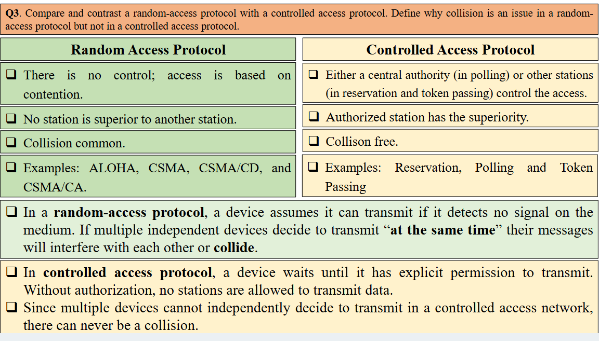

202411090001

后台姓名：高逸洋
用户ID：92127
用户1V1昵称：高逸洋
学生需求类型：考前辅导
学生基础：一般
期望上课时间：可安排，悉尼时间
学生DUE时间：11.18
用户类型：1v1老用户
院校：USYD
年级：大三
专业：EE
科目代码：ELEC3506
科目名称：Communication Networks
备注：学生需要考前辅导，知识点梳理+题目讲解
1、需要老师备课，针对期末复习做课件
2、同学这边提供题目，需要老师做总结
3、需要预估一下课时

根据提供的PDF文件内容，以下是重点知识点及其所在的PPT页数：

### Lecture 1: Internet Overview
- **页数 4-10**：互联网的定义、网络类型（LAN、MAN、WAN）的概述、网络的分层结构（OSI和TCP/IP模型）。
- **重点**：理解互联网的定义和分层结构的原理，熟悉不同网络类型及其特征。

### Lecture 2: Physical Layer
- **页数 5-10**：信号和数据传输的基本概念，香农定理和奈奎斯特定理，数字信号与模拟信号的区别。
- **重点**：物理层的信号传输概念、带宽和信噪比、信道容量的计算方法。

### Lecture 3: Data Link Layer
- **页数 3-12**：数据链路层的服务，包括数据成帧、差错检测和纠正、协议等。
- **重点**：熟悉数据链路层的功能，如帧结构、差错检测方法（如CRC）、数据传输的可靠性。

### Lecture 4: MAC Protocols & Wired LAN Standards
- **页数 5-18**：多路访问协议（如CSMA/CD、CSMA/CA）、以太网标准、Token Ring协议等。
- **重点**：理解CSMA/CD和CSMA/CA的机制和差异，掌握局域网标准（如以太网）的工作原理。

### Lecture 5: Network Layer - Data Transfer
- **页数 6-20**：网络层的数据传输，包括IP地址的分类、子网划分、数据报格式、NAT和地址转换等。
- **重点**：掌握IP地址的分类、子网掩码和数据包路由的基础知识，理解网络层在主机间的通信角色。

### Lecture 6: Network Layer - Routing Protocols
- **页数 7-11**：路由协议的基本概念、内部和外部网关协议（如RIP和OSPF）。
- **重点**：了解不同的路由协议及其工作原理，尤其是RIP和OSPF的应用场景。

### Lecture 7: Transport Layer
- **页数 9-25**：传输层的功能，端到端的传输协议（如TCP和UDP）的区别，差错控制和流量控制机制。
- **重点**：理解TCP与UDP的区别及传输层的可靠性保障机制，尤其是流量控制和差错控制的实现方法。

### Lecture 8: Application Layer
- **页数 9-20**：应用层协议（HTTP、FTP、DNS等），客户端-服务器和P2P模型。
- **重点**：熟悉常见的应用层协议及其功能，理解客户端-服务器和P2P架构的差异。

### Lecture 9: WAN Technologies
- **页数 10-15**：广域网（WAN）的概述及其技术（如DSL、SDH、ATM），局域网与广域网的区别。
- **重点**：掌握WAN的技术及其在广域网和互联网连接中的应用场景。

### Lecture 10: Quality of Service (QoS) in IP Networks
- **页数 9-20**：服务质量（QoS）概念、QoS指标（如带宽、延迟、抖动等）及其管理方法。
- **重点**：理解QoS的作用及实现服务质量的关键指标，掌握流量管理和资源分配策略。

这些重点涵盖了考试涉及的核心概念和应用方法，建议重点复习这些知识点并理解其原理和应用。

这张幻灯片主要解释了“互联网”是什么：

1. **互联网是大量互联的计算机和通信网络及节点**：互联网由许多互相连接的计算机和通信网络组成，这些网络可以传输和交换数据。
  
2. **互联网包含传输系统和交换系统**：这些系统提供了不同网络之间的互连，使得数据可以在不同的网络之间传递。

3. **互联网使用一套协议来传输数据并控制操作**：协议是一组规则，用于规范数据如何在网络间移动、如何控制网络操作。这些规则确保网络之间的通信能够顺利进行。

简单来说，这张幻灯片在描述互联网的本质，即由不同的网络、传输和交换系统以及一系列通信协议构成的全球互联网络。

这张幻灯片解释了“网络”的概念：

- **网络是计算机的互连**：网络由一组互相连接的计算机组成，可以共享资源和信息。
- **网络类型**：
  - **局域网 (LAN)**：通常覆盖较小的地理区域，如校园或办公楼。
  - **城域网 (MAN)**：覆盖一个城市或较大的区域。
  - **广域网 (WAN)**：跨越大范围的地理区域，例如城市间、国家间，甚至全球。

总结：网络通过连接多台计算机来实现数据共享，按覆盖范围可分为局域网、城域网和广域网。

这张幻灯片解释了局域网 (LAN) 的概念：

- **局域网 (LAN)**：用于让设备在有限的地理区域内（如校园、建筑物）进行通信。
- **流行的LAN技术**：包括以太网（Ethernet）、令牌环（Token ring）、光纤分布数据接口（FDDI）和无线局域网（WLAN）。
- **LAN设备**：包括桥接器（bridges）、交换机（switches），有时也使用路由器（routers）。

总结：局域网用于在小范围内连接设备，采用各种技术和设备来实现网络通信。

以下是关于城域网 (MAN) 的更详细解释：

- **城域网 (MAN)**：城域网专为覆盖整个城市区域而设计，适用于需要在较大范围内连接多个局域网 (LAN) 的情况，例如城市的企业、政府机构、大学校园等。MAN 可以通过各种网络技术实现大范围的高速连接，支持高带宽和稳定性。

- **常用技术**：
  - **多兆位数据服务 (SMDS)**：提供一种无连接的高性能分组交换数据传输方式。SMDS 是一种基于 IEEE 802.6 分布式队列双总线 (DQDB) 标准的服务，适合高带宽需求的环境，如视频、数据共享等。
  - **异步传输模式 (ATM)**：ATM 技术使用固定长度的53字节单元进行传输，适合于传输语音、视频和数据，提供低延迟和高效的网络服务。
  - **光纤分布式数据接口 (FDDI)**：FDDI 是一种高速网络技术，通常用于连接大型计算机和服务器网络，支持可靠的数据传输和容错功能。
  - **无线网状网络 (MESH) 和自组织网络 (Ad Hoc Networks)**：这些网络结构灵活，可以快速部署，适用于临时或难以布线的环境，通过多跳路径来实现稳定连接。

- **SMDS 的特点**：作为无连接的分组交换技术，SMDS 提供高性能的数据传输，适合不需要建立专用通道的场景。这种技术在数据丢失后不提供重传机制，但能够保证较高的数据传输速度和低延迟。

- **扩展研究**：目前，有关以太网技术扩展到城域网 (MAN) 的研究正在进行，以便更好地满足城域网对成本、兼容性和效率的需求。以太网的扩展能使MAN的建设和维护更加经济、便捷。

- **主要设备**：
  - **路由器**：在 MAN 中，路由器是关键设备，用于管理网络数据的传输路径，确保数据能够在不同的局域网和设备之间高效地传输。路由器通过选择最佳路径来优化网络资源，减少延迟和网络拥塞。

总结：城域网 (MAN) 是一种覆盖整个城市的大范围网络，适合城市范围内的企业和机构之间的数据通信需求。它利用 SMDS、ATM、FDDI 等技术和路由器设备，实现高效的城市级互联，满足了大范围、高带宽的数据传输需求，同时具备一定的容错性和扩展性。

这张幻灯片介绍了广域网 (WAN) 的概念：

- **广域网 (WAN)**：广域网用于在大范围内（例如国家、洲际甚至全球）传输数据、语音或视频。它可以将地理位置分散的网络连接在一起，使远程用户和系统能够共享信息和资源。广域网通常用于企业的多个办公室或数据中心之间的连接。

- **常用技术**：
  - **X.25**：一种早期的分组交换技术，提供可靠的数据传输服务，通常用于银行和政府机构。
  - **帧中继 (Frame Relay)**：一种分组交换协议，用于在广域网中快速传输数据，适合于局域网和广域网之间的互连。
  - **异步传输模式 (ATM)**：一种高效的分组交换技术，采用固定长度的53字节单元，支持语音、视频和数据的高速传输。
  - **多协议标签交换 (MPLS)**：一种现代的WAN技术，通过添加标签来加快数据包的转发速度，支持多种协议的互操作，通常用于提高网络性能和优化流量。

- **设备**：
  - **路由器 (Routers)**：路由器是广域网中的关键设备，用于管理不同网络之间的数据传输路径。路由器会根据最佳路径选择规则，将数据包从一个网络转发到另一个网络，从而确保网络通信的效率和稳定性。

总结：广域网 (WAN) 主要用于大范围的网络连接，通过使用X.25、帧中继、ATM和MPLS等技术，以及路由器等设备，实现数据、语音和视频的远距离传输。这使得广域网能够连接地理位置分散的办公室或数据中心，提供可靠且高效的通信。

这张幻灯片正式定义了“互联网”的概念，主要内容包括：

- **定义日期**：1995年10月24日，美国联邦网络委员会 (FNC) 一致通过了一项决议，正式定义了“互联网”一词。
  
- **互联网的三大特征**：
  1. **唯一地址空间**：互联网是一个全球信息系统，使用全球唯一的地址空间，通过互联网协议 (IP) 或其扩展版本进行逻辑连接。这意味着每台连接到互联网的设备都有一个唯一的IP地址，确保其可以被识别和访问。
  
  2. **通信支持**：互联网支持通过传输控制协议/互联网协议 (TCP/IP) 套件或其他兼容协议进行通信。TCP/IP 是互联网的核心协议，用于数据的发送和接收，保证设备之间的有效通信。
  
  3. **服务层级**：互联网提供了多层级服务，用户可以在其上实现公共或私人的高层次服务。这些服务依赖于互联网的通信基础设施，包括网页浏览、电子邮件、文件传输等。

- **来源**：该定义来源于《互联网简史》，具体网址也提供在幻灯片中。

总结来说，这张幻灯片阐明了互联网的核心特点：全球唯一地址空间、基于TCP/IP协议的通信支持，以及建立在该通信基础设施上的各种公共和私人服务。这些特性共同构成了互联网作为全球信息系统的基础。

这张幻灯片讨论了数字通信中两种编码方式的选择，即如何通过有线或无线方式发送字母“A”给接收方：

- **Option 1**：每个字母（A到Z）都有独立的信号。这种方法需要26种不同的信号来区分每个字母。
- **Option 2**：用“0”和“1”的组合来表示每个字母。即将字母转换为二进制编码，以减少需要的信号数量。

然后提出了四个问题来引导讨论：

1. **哪个方式更高效？**  
   - **Option 2** 更高效，因为它使用二进制编码，减少了信号种类并且便于数据压缩和处理。

2. **哪个方式对噪声更具抗扰性？**  
   - **Option 2** 更具抗噪性。二进制编码仅依赖于“0”和“1”，在信号处理和错误校正上更容易实现抗噪。

3. **是否可以将多个字母组合在一起发送？如果可以，哪种方式更好？**  
   - 是的，可以将多个字母组合并一起发送。**Option 2** 更适合，因为二进制数据可以轻松组合成数据包，而无需为每个字母单独发送信号。

4. **对于Option 2，需要多少位来表示所有字母？**  
   - 使用二进制表示26个字母，至少需要5位（二进制的2^5=32，足够表示26个字母）。

总结：Option 2（二进制编码）在效率、抗噪性和数据组合上都优于独立信号编码方法，因此更适合数字通信。

这张幻灯片提出了一个基础问题：是否可以在任意速率下通过通信信道进行可靠的传输？如果可以，怎么实现？

- **问题的关键**：这是关于通信信道的可靠性问题，探讨在不同传输速率下，如何保证数据在噪声环境中能够被可靠地传输和接收。
  
- **答案**：1948年，信息理论之父克劳德·香农（Claude E. Shannon）证明了，在一定条件下，可靠传输是可能的，但前提是传输速率必须低于某个特定阈值。这个阈值称为**信道容量**（Channel Capacity）。

- **信道容量**：信道容量是指在一定带宽和噪声水平下，信道所能支持的最高数据传输速率。在该速率以下，误码率可以接近于零，实现可靠通信；而超过信道容量，误码率会显著增加，无法保证数据的可靠传输。

总结：香农的理论指出，要实现可靠通信，数据传输速率必须低于信道容量。这个概念为现代通信系统的设计奠定了理论基础，帮助工程师们在带宽和噪声限制下设计高效的传输方案。

这张幻灯片讨论了在通信信道中传输数据的目标与限制：

- **信道容量假设**：假设信道容量为 \( C \)，当传输速率 \( R \) 小于 \( C \) 时，可以实现接近零的误码率。这意味着在信道容量内，传输数据可以可靠进行。

- **通信信道的两个主要目标**：
  1. **最大化传输速率 \( R \)**：在不超过信道容量的情况下，尽量提高数据传输速率。
  2. **最小化误码率**：在既定传输速率 \( R \) 下，尽量降低数据传输中的错误概率，确保数据准确传输。

- **总结**：目标是将尽可能多的比特嵌入信号中，使接收端能清晰区分这些比特，同时保持极低的误码率。

这张幻灯片的核心是，在有限带宽的情况下，合理控制传输速率以实现可靠通信。

这张幻灯片解释了**信道容量公式**，用于计算在有限带宽和噪声影响下的最大数据传输速率：

- **公式**：\(
  $$
  C = B \log_2(1 + \frac{P}{N})
  $$
   \)

  - **\( C \)**：信道容量，即数据传输的最大速率（单位：比特每秒）。
  - **\( B \)**：信道带宽，指信号的频率范围（单位：赫兹）。
  - **\( P \)**：接收到的信号功率（信号强度）。
  - **\( N \)**：噪声功率（干扰信号强度）。
  
- **影响因素**：
  
  - **带宽 \( B \)** 增加时，信道容量 \( C \) 增加。
  - **信号功率 \( P \)** 增加时，信噪比 \( \frac{P}{N} \) 增加，信道容量 \( C \) 增加。
  - **噪声功率 \( N \)** 增加时，信噪比降低，信道容量减少。

总结：此公式表明，信道容量与带宽和信噪比相关。在更宽的带宽和更高的信噪比下，数据传输速率可以更高。

这张幻灯片讨论了在**无噪声信道**情况下的最大传输速率问题，使用**奈奎斯特定理**进行计算：

- **无噪声信道**：假设信道中没有任何噪声干扰，因此理论上可以达到更高的传输速率。

- **奈奎斯特定理**：奈奎斯特定理提供了无噪声条件下的最大比特率公式。
  
  - **公式**：比特率（Bit rate）= \( 
    $$
    2B \times \log_2(L)
  $$
     \)
    
    - **\( B \)**：信道带宽（赫兹）。
    - **\( L \)**：信号的电平数（或位数），即不同信号状态的数量。
  
- **解释**：该公式表明，当信道无噪声时，传输速率取决于带宽和信号电平数量。增加带宽或信号电平数，可以提高传输速率。

总结：奈奎斯特定理用于计算无噪声信道中的最大比特率，通过调节带宽和信号电平，可以在理想环境中实现更高的速率。

这张幻灯片讨论了通过数字通信发送字母“A”的两种方法，并提出了几个分析问题：

- **Option 1**：为每个字母使用一个独立的信号。由于有26个字母，每个字母都需要一个唯一的信号来区分。
- **Option 2**：使用0和1的组合来表示每个字母，即将字母编码成二进制数据。

**分析问题**：

1. **哪个方法更高效？**
   - **Option 2** 更高效，因为它通过二进制编码，减少了所需的信号种类和传输资源。

2. **哪个方法更抗噪声？**
   - **Option 2** 更抗噪声。二进制信号只需区分0和1，抗干扰能力更强。

3. **是否可以将多个字母组合在一起发送？哪种方法更适合？**
   - 可以组合多个字母发送，**Option 2** 更适合，因为二进制编码的数据易于打包传输。

4. **Option 2 需要多少位来表示所有字母？**
   - 使用二进制表示26个字母，至少需要5位（\(2^5 = 32\)，可以覆盖26个字母）。

总结：**Option 2**（二进制编码）在效率、抗噪性和数据组合上都优于独立信号编码。

这张幻灯片进一步分析了发送字母“A”的两种编码方案，并对比了它们的效率、抗噪性、数据组合能力和所需位数：

1. **哪个更高效？**
   - **Option 1**：效率更高，因为使用模拟信号，每个字母用一个信号元素（波特）表示。26个字母对应26个信号等级。

2. **哪个更抗噪？**
   - **Option 2**：抗噪性更好，因为仅使用两级信号（0和1），减少了噪声的影响。

3. **是否可以组合多个字母发送？哪种方案更好？**
   - 可以组合，**Option 2** 更适合，因为二进制位更容易进行复用。

4. **Option 2需要多少位来表示所有字母？**
   - **Option 2** 需要5个数据位（表示26个字母）和5个信号元素。

**总结**：Option 2 尽管比 Option 1 慢5倍，但抗噪性更好，传输更可靠，体现了效率与可靠性的权衡。

这张幻灯片列出了**OSI模型的七层**及其描述，同时指出了每层的数据类型：

1. **应用层 (Application Layer)**：提供人机交互界面，应用程序可以在此层访问网络服务。数据类型为**Data**。

2. **表示层 (Presentation Layer)**：确保数据格式正确，处理数据加密、解密。数据类型为**Data**。

3. **会话层 (Session Layer)**：负责维护会话连接，控制端口和会话。数据类型为**Data**。

4. **传输层 (Transport Layer)**：通过TCP和UDP等传输协议传输数据。数据类型为**Segment**。

5. **网络层 (Network Layer)**：决定数据的物理传输路径。数据类型为**Packets**。

6. **数据链路层 (Data Link Layer)**：定义网络上数据的格式。数据类型为**Frames**。

7. **物理层 (Physical Layer)**：负责通过物理介质传输比特流。数据类型为**Bits**。

**总结**：OSI模型的每一层都有不同的功能，从物理传输到数据的应用处理，各层分别处理不同类型的数据。

这张幻灯片详细描述了**网络层 (Network Layer)** 的三项主要职责：

1. **移动数据包 (Moving Packets)**：
   - 网络层负责将各个数据包从源主机传输到目标主机。它在整个网络路径上移动数据包，实现从源到目的地的传递。

2. **逻辑地址分配 (Logical Addressing)**：
   - 网络层使用逻辑地址（如IP地址）来区分源系统和目标系统。每个数据包都会添加一个包含发送者和接收者地址的头部信息，以便在网络中准确传递到目标。

3. **路由 (Routing)**：
   - 在由多个独立网络或链路组成的大型网络中，网络层负责数据包的路由选择。它确保数据包通过最佳路径抵达最终目的地，从而实现高效的网络传输。

**图示说明**：
- 图示展示了网络层在多跳传输中的作用，每一跳都是从一个网络节点（如路由器）传递到下一个节点，直到最终到达目标节点。

**总结**：网络层的核心职责包括数据包的移动、逻辑地址的处理和路由选择，确保数据包能有效且准确地从源传输到目的地。

这张幻灯片描述了**传输层 (Transport Layer)** 的五项主要职责：

1. **消息传递 (Moving Message)**：
   - 传输层负责从一个进程到另一个进程的消息传递。它确保数据从发送方的特定进程传输到接收方的相应进程。

2. **端口地址 (Port Addressing)**：
   - 在主机中可能运行多个进程，因此需要识别目标进程。传输层通过在每个段的头部添加服务端口地址来实现此功能。例如，HTTP端口是80，SMTP端口是25。端口地址帮助确定数据应传递到的应用程序进程。

3. **分段与重组 (Segmentation and Reassembly)**：
   - 消息在传输层被分割成多个小段，每个段都有一个序列号，便于接收方按顺序重新组装。这确保了数据以正确的顺序接收，即使在传输过程中段的顺序被改变。

4. **流量控制 (Flow Control)**：
   - 传输层控制数据流量，确保发送方的发送速率不会超过接收方的处理能力，从而防止接收方因数据过多而崩溃。这有助于保持数据传输的稳定性和可靠性。

5. **差错控制 (Error Control)**：
   - 传输层提供端到端的差错控制，确保数据从发送方到接收方的整个路径中不受错误影响。这与数据链路层的单链路差错控制不同，是一种跨越整个通信路径的控制。

**总结**：传输层的主要职责是管理消息的传递、标识进程、分段重组、控制流量和处理差错，以确保可靠的端到端数据传输。

这张幻灯片介绍了**异步串行数据传输模式**的原理和特点：

1. **数据分组**：在异步传输中，整个比特流被分为8位一组（即一个字节）。每个字节独立处理，数据可以在任何时间发送，不需要与时钟同步。

2. **起始位和停止位**：为了让接收方知道字节的开始和结束，每个字节前后添加“起始位”和“停止位”。通常，起始位为0，表示字节的开始；停止位为1，表示字节的结束。

3. **同步需求**：虽然是异步传输，但在每个字节内部需要一定的同步。接收方在检测到起始位后启动计时器，并计数比特，直到检测到停止位。

4. **传输速度**：异步传输较慢，因为每个字节需要额外的起始和停止位，增加了传输的数据量。

5. **成本和效率**：异步传输较为便宜，适合不需要高实时性的数据传输场景，具有成本效益。

**总结**：异步串行传输通过起始和停止位实现每个字节的独立传输，虽然增加了额外的比特，降低了传输速度，但成本较低，适合非实时应用。

这张幻灯片描述了四种**数字到模拟转换**技术，每种技术通过改变载波信号的不同特性来表示数字信号：

1. **幅移键控 (Amplitude Shift Keying, ASK)**：
   - 通过改变载波信号的**幅度**来表示数字信号，而保持频率和相位不变。例如，“1”可以由高幅度信号表示，“0”由低幅度信号表示。

2. **频移键控 (Frequency Shift Keying, FSK)**：
   - 通过改变载波信号的**频率**来表示数字信号，而保持幅度和相位不变。例如，使用不同的频率来分别代表“1”和“0”。

3. **相移键控 (Phase Shift Keying, PSK)**：
   - 通过改变载波信号的**相位**来表示数字信号，而保持幅度和频率不变。例如，两个不同的相位（如0度和180度）可分别代表“1”和“0”。

4. **正交幅度调制 (Quadrature Amplitude Modulation, QAM)**：
   - 结合了ASK和PSK，既改变载波的**幅度**又改变**相位**来传输信息。这样可以同时传输更多数据，因此QAM常用于高速数据传输。

**总结**：
- **ASK**：改变幅度。
- **FSK**：改变频率。
- **PSK**：改变相位。
- **QAM**：改变幅度和相位。

这张幻灯片展示了将三个语音信道组合到一个带宽为12 kHz的链路中的配置方案。假设每个语音信道占用4 kHz带宽且没有保护带（guard band）。

**具体配置**：

1. **语音信道规范**：
   - 每个语音信道占用4 kHz的带宽。

2. **总带宽**：
   - 链路总带宽为12 kHz，频率范围从20 kHz到32 kHz。

3. **信道组合**：
   - 需要将每个4 kHz的语音信道分配到链路的特定频率范围。
   
   - **信道1**：分配到20 kHz到24 kHz范围。
   - **信道2**：分配到24 kHz到28 kHz范围。
   - **信道3**：分配到28 kHz到32 kHz范围。

**信道分配过程**：
- 每个电话信号通过调制器进行频率上移，以适配指定的频率范围。
- 然后，这些信号组合在一起，通过一个较宽带宽的链路传输。
- 在接收端，每个信道通过带通滤波器（Bandpass Filter）过滤，分离出各自的频率范围，恢复原始信号。

**总结**：通过将三个4 kHz语音信道分配到12 kHz链路中的不同频率范围（20-32 kHz），可以实现多路复用。

这张幻灯片比较了**随机访问协议 (Random Access Protocol)** 与**受控访问协议 (Controlled Access Protocol)** 的特性，并解释了随机访问协议中为什么会发生冲突，而在受控访问协议中不会。

> **访问协议**是网络通信中规定设备如何共享通信介质的规则和方法。它们定义了在网络上多个设备如何协调发送数据的过程，以避免冲突或数据丢失。访问协议的目的是确保数据在多台设备之间高效且可靠地传输。
>
> 主要类型包括：
>
> 1. **随机访问协议 (Random Access Protocol)**：
>    - 没有集中控制，设备在检测到空闲后可以随机发送数据，可能会导致冲突。
>    - 常见的随机访问协议有 ALOHA、CSMA、CSMA/CD 等。
>
> 2. **受控访问协议 (Controlled Access Protocol)**：
>    - 由集中或分布式方式控制传输权，只有获得授权的设备才能发送数据，避免冲突。
>    - 常见的受控访问协议有轮询、令牌传递等。
>
> 不同类型的访问协议适用于不同的网络环境，根据网络规模、带宽需求和冲突容忍度选择合适的访问协议，可以提高网络的传输效率和数据可靠性。

### 随机访问协议 (Random Access Protocol)
1. **无集中控制**：设备之间没有中央控制，所有设备基于竞争来获得传输机会。
2. **平等地位**：所有设备在网络中都是平等的，没有优先权。
3. **冲突常见**：因为设备随机传输，当多个设备同时传输时，容易发生冲突。
4. **示例**：包括 ALOHA、CSMA、CSMA/CD 和 CSMA/CA 协议。
5. **冲突原因**：设备检测到没有信号就会开始传输，若多个设备同时传输，它们的信号会相互干扰，导致冲突（即“碰撞”）。

### 受控访问协议 (Controlled Access Protocol)
1. **有集中控制**：通过中央控制（如轮询）或分布式控制（如预留和令牌传递）来管理设备的传输。
2. **授权优先**：某些设备或已获得授权的设备拥有优先权。
3. **无冲突**：由于传输权是被控制的，因此不会发生冲突。
4. **示例**：包括预留、轮询和令牌传递协议。
5. **无冲突原因**：设备需要等待明确的传输许可才能传输数据，因此多个设备不会同时传输，避免了冲突的发生。

### 总结
- 在**随机访问协议**中，设备没有传输控制，因此容易发生冲突。
- 在**受控访问协议**中，设备获得明确授权才传输，避免了冲突。

这张幻灯片介绍了**CSMA/CD（载波监听多路访问/冲突检测）**协议中的**碰撞和中止**机制，解释了发生冲突的过程以及如何检测和处理冲突。

### 关键概念

1. **传播延迟 (\( T_P \))**：
   - 指一个比特从链路一端传到另一端所需的时间。
   
2. **帧传输延迟 (\( T_{Fr} \))**：
   - 把整个帧放在链路上所需的时间。

### 碰撞检测过程

- **发送前检测**：在发送最后一个比特之前，发送站需要检测是否有冲突发生。

- **最远距离影响**：如果发生冲突的两个站点距离最远，那么第一个站点的信号需要传播时间 \( T_P \) 才能到达第二个站点。而冲突信号返回第一个站点又需要 \( T_P \) 时间。因此，总共需要 \( 
  $$
  2 \times T_P
  $$
   \) 时间来检测冲突。

- **CSMA/CD要求**：为了确保检测到冲突，帧传输时间 \( 
  $$
  T_{Fr}
  $$
   \) 必须至少是传播延迟的两倍，因此 \( 
  $$
  T_{Fr} = 2 \times T_P
  $$
   \)。

### 示例解释

- 在图示中，站点A和站点C同时发送数据，由于没有检测到其他信号，结果导致冲突。
- 站点A和站点C分别感知到冲突后，立刻停止发送并中止传输，避免进一步的信号干扰。

**总结**：CSMA/CD通过设置足够长的帧传输时间，以确保冲突可以被及时检测并中止，从而保证数据传输的稳定性和效率。

在**CSMA/CD（载波监听多路访问/冲突检测）网络**中，帧传输时间 \( T_{Fr} \) 必须至少为传播延迟 \( T_p \) 的两倍，主要原因是为了确保所有站点能够**及时检测到冲突**。以下是详细原因：

1. **冲突检测需求**：
   - 当两个或多个站点几乎同时开始发送数据时，它们的信号在链路中可能会相遇并产生冲突。
   - 为了让发出帧的站点能够检测到冲突，它必须在**整个帧传输的过程中监控信道**，并能在传输的任何时刻检测到冲突。

2. **传播延迟**：
   - 传播延迟 \( 
     $$
     T_p
     $$
     \) 是信号从链路一端传播到另一端所需的时间。
   
   - 如果两个站点在链路的最远两端，信号传播到另一端的时间为 \( 
     $$
     T_p
     $$
      \)。
   
3. **冲突传播时间**：
   - 如果在传播过程中发生冲突，则冲突信号从发生位置返回到发送站点还需要 \( 
     $$
  T_p
     $$
     \) 时间。
   
   - 因此，总传播时间为 \( 
     $$
     2 \times T_p
     $$
      \)，才能确保最远距离的两个站点检测到冲突。
   
4. **帧传输时间与传播延迟关系**：
   - 为了保证站点在发送帧时能够检测到潜在的冲突，帧传输时间 \( T_{Fr} \) 必须至少等于 \( 
     $$
     2 \times T_p
     $$
      \)。
   
   - 这样，即使在发送最后一个比特时发生冲突，发送站点仍然有足够的时间检测到冲突信号并中止传输。

**总结**：在CSMA/CD网络中，设置帧传输时间 \( 
$$
T_{Fr}
$$
\) 至少为 \(
$$
2 \times T_p
$$
\) 是为了确保即使在最大传播延迟下发生冲突，发送站点也能及时检测到，从而停止传输，避免错误数据发送。

