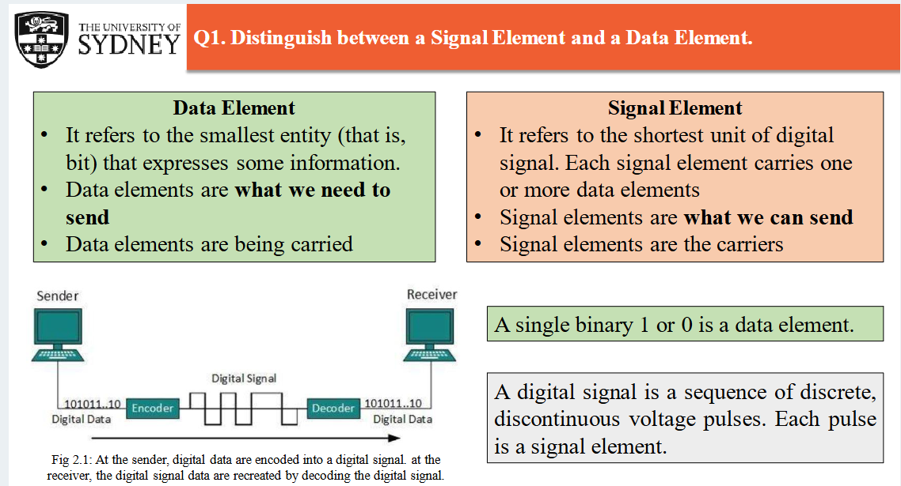
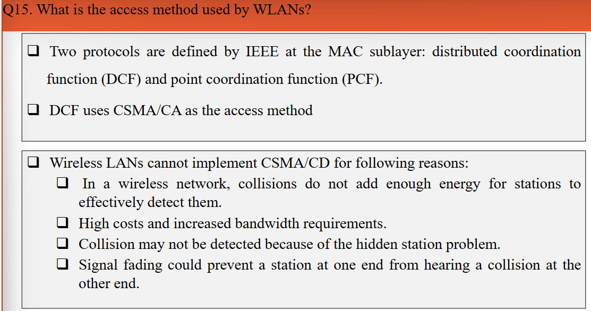
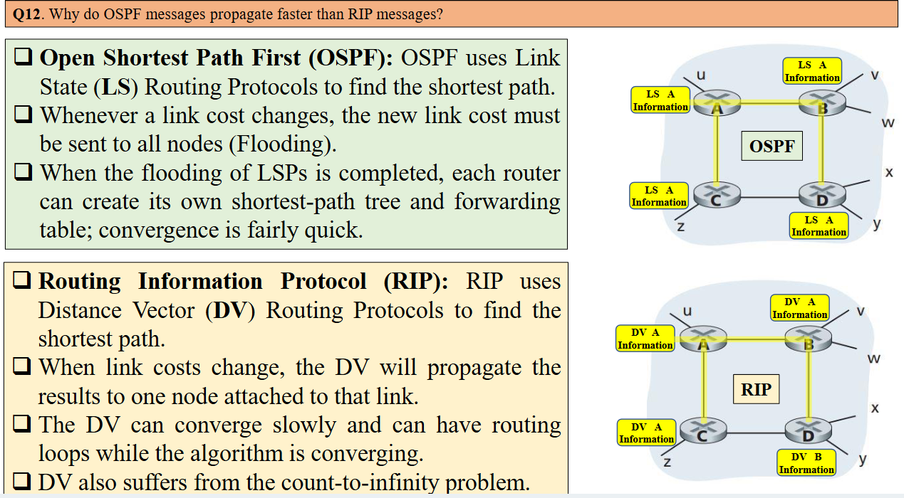
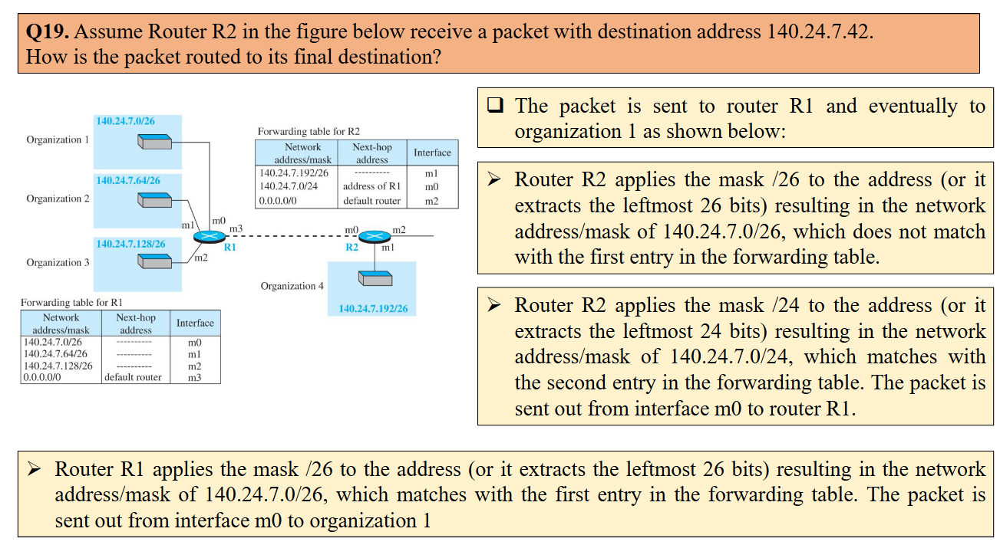

202411090001

后台姓名：高逸洋
用户ID：92127
用户1V1昵称：高逸洋
学生需求类型：考前辅导
学生基础：一般
期望上课时间：可安排，悉尼时间
学生DUE时间：11.18
用户类型：1v1老用户
院校：USYD
年级：大三
专业：EE
科目代码：ELEC3506
科目名称：Communication Networks
备注：学生需要考前辅导，知识点梳理+题目讲解
1、需要老师备课，针对期末复习做课件
2、同学这边提供题目，需要老师做总结
3、需要预估一下课时


根据提供的PDF文件内容，以下是重点知识点及其所在的PPT页数：

### Lecture 1: Internet Overview
- **页数 4-10**：互联网的定义、网络类型（LAN、MAN、WAN）的概述、网络的分层结构（OSI和TCP/IP模型）。
- **重点**：理解互联网的定义和分层结构的原理，熟悉不同网络类型及其特征。

### Lecture 2: Physical Layer
- **页数 5-10**：信号和数据传输的基本概念，香农定理和奈奎斯特定理，数字信号与模拟信号的区别。
- **重点**：物理层的信号传输概念、带宽和信噪比、信道容量的计算方法。

### Lecture 3: Data Link Layer
- **页数 3-12**：数据链路层的服务，包括数据成帧、差错检测和纠正、协议等。
- **重点**：熟悉数据链路层的功能，如帧结构、差错检测方法（如CRC）、数据传输的可靠性。

### Lecture 4: MAC Protocols & Wired LAN Standards
- **页数 5-18**：多路访问协议（如CSMA/CD、CSMA/CA）、以太网标准、Token Ring协议等。
- **重点**：理解CSMA/CD和CSMA/CA的机制和差异，掌握局域网标准（如以太网）的工作原理。

### Lecture 5: Network Layer - Data Transfer
- **页数 6-20**：网络层的数据传输，包括IP地址的分类、子网划分、数据报格式、NAT和地址转换等。
- **重点**：掌握IP地址的分类、子网掩码和数据包路由的基础知识，理解网络层在主机间的通信角色。

### Lecture 6: Network Layer - Routing Protocols
- **页数 7-11**：路由协议的基本概念、内部和外部网关协议（如RIP和OSPF）。
- **重点**：了解不同的路由协议及其工作原理，尤其是RIP和OSPF的应用场景。

### Lecture 7: Transport Layer
- **页数 9-25**：传输层的功能，端到端的传输协议（如TCP和UDP）的区别，差错控制和流量控制机制。
- **重点**：理解TCP与UDP的区别及传输层的可靠性保障机制，尤其是流量控制和差错控制的实现方法。

### Lecture 8: Application Layer
- **页数 9-20**：应用层协议（HTTP、FTP、DNS等），客户端-服务器和P2P模型。
- **重点**：熟悉常见的应用层协议及其功能，理解客户端-服务器和P2P架构的差异。

### Lecture 9: WAN Technologies
- **页数 10-15**：广域网（WAN）的概述及其技术（如DSL、SDH、ATM），局域网与广域网的区别。
- **重点**：掌握WAN的技术及其在广域网和互联网连接中的应用场景。

### Lecture 10: Quality of Service (QoS) in IP Networks
- **页数 9-20**：服务质量（QoS）概念、QoS指标（如带宽、延迟、抖动等）及其管理方法。
- **重点**：理解QoS的作用及实现服务质量的关键指标，掌握流量管理和资源分配策略。


这张幻灯片比较了 **OSI模型** 和 **TCP/IP协议模型** 的层次结构，并展示了从源到目标的通信路径，说明了数据在网络中的传输过程。

### 详细解释

1. **模型发展背景**：
   - **OSI模型** 是一个理论模型，定义了7层网络结构。
   - **TCP/IP模型** 是美国国防部（DoD）开发的实际协议模型，用于确保网络的互联和数据完整性，分为4层或5层。

2. **OSI模型层次**：
   - **应用层**（Application Layer）：为应用程序提供网络服务。
   - **表示层**（Presentation Layer）：处理数据格式、加密、解密。
   - **会话层**（Session Layer）：建立和管理会话。
   - **传输层**（Transport Layer）：负责端到端的传输和流控制。
   - **网络层**（Network Layer）：负责路由选择和逻辑地址。
   - **数据链路层**（Data Link Layer）：负责帧的传输和物理寻址。
   - **物理层**（Physical Layer）：负责比特流的传输。

3. **TCP/IP模型层次**：
   - **应用层**：结合了OSI模型的应用层、表示层和会话层。
   - **传输层**：提供传输服务，包括TCP和UDP协议。
   - **网络层**：负责IP寻址和路由。
   - **数据链路层**：处理帧的传输。
   - **物理层**：负责比特流的传输。

4. **数据包传输过程**：
   - 数据从源（如设备A）通过各层封装，逐步经过交换机、路由器等网络设备传输，最终到达目标（如设备B）。
   - 每一层对数据进行不同的处理，例如物理层传输比特，数据链路层传输帧，网络层传输数据报，传输层传输段或数据报文。

### 总结
- OSI模型是一个理论框架，有7层，而TCP/IP模型为实际应用设计，具有较少的层数。
- 数据从源设备到目标设备的传输路径展示了各层如何协同工作，以确保数据的可靠传输。


这张幻灯片主要解释了OSI模型和TCP/IP模型之间的层次对应关系，具体说明如下：

1. **OSI模型的7层结构**：
   - 包含应用层、表示层、会话层、传输层、网络层、数据链路层和物理层。

2. **TCP/IP模型的简化结构**：
   - 只有4层：应用层、传输层、网络层和网络接口（数据链路层和物理层合并）。

3. **层次对应关系**：
   - OSI模型的应用层、表示层、会话层在TCP/IP模型中合并为一个应用层。
   - OSI模型的传输层和网络层在TCP/IP模型中对应相同名称的层。
   - 数据链路层和物理层在TCP/IP模型中合并为网络接口层。

4. **TCP/IP模型简化的原因**：
   - TCP/IP模型更注重实际应用，简化了OSI模型的层次结构，主要关注网络通信的关键部分。

总之，这张幻灯片解释了在TCP/IP模型中如何将OSI模型的多层合并为更少的层，以实现更简单和更有效的网络通信结构。


这张幻灯片讨论了为什么即使数据链路层可以检测跳间（节点之间）的错误，仍然需要在传输层引入额外的错误控制机制：

1. **错误控制需求**：错误控制在数据链路层和传输层都存在，保证数据在不同层级的可靠传输。
   
2. **数据链路层的错误检测**：数据链路层可以检测节点之间的错误，但无法检测更远路径中的错误（图中黑色路径）。因此，某些中间路径的错误可能会被忽略。

3. **网络层的可靠性问题**：互联网中的网络层不可靠，因此需要在传输层中增加额外的错误控制，以确保整体传输的可靠性。

4. **错误控制的不同层次作用**：
   - 数据链路层的错误控制在数据包或流级别进行，适用于较小范围。
   - 传输层的错误控制在消息级别进行，覆盖更广范围。
   - 数据链路层不负责数据包的顺序，而传输层会确保数据包按正确顺序到达。

这种设计确保了即使网络层中出现未检测的错误，传输层仍能提供纠正机制，从而实现数据的可靠传输。


这张幻灯片解释了端口地址、逻辑地址和物理地址之间的区别：

1. **端口地址**：用于标识主机上不同的进程。传输层通过源端口和目标端口地址封装数据，以便将数据发送到正确的进程。例如，Host A 上的进程 a 向 Host B 上的进程 j 发送数据时，会在数据段中包含进程 a 和 j 的端口地址。

2. **逻辑地址**：即 IP 地址，用于在网络层标识主机位置。网络层将主机 A 和主机 B 的逻辑地址（IP 地址）添加到数据段中，形成数据报，以便在网络中定位主机。

3. **物理地址**：指的是数据链路层中用于实际传输的 MAC 地址。数据链路层在数据报中添加源和下一跳的物理地址（MAC 地址），以形成帧，从而实现实际的数据传输。

通过这种分层处理，数据可以从一个进程传输到另一台主机的特定进程。


这张幻灯片列出了应用层提供的服务，具体包括：

1. **远程文件访问与传输服务 (FTP)**：允许用户通过网络上传和下载文件。
2. **电子邮件服务 (SMTP)**：用于在网络上发送和接收电子邮件。
3. **网络虚拟终端服务 (TELNET)**：支持远程登录，用户可以控制远程设备。
4. **网页浏览服务 (HTTP)**：用于访问和浏览网页内容。
5. **主机名解析服务 (DNS)**：将域名转换为IP地址，帮助定位网络资源。
6. **网络管理与监控 (SNMP)**：监控和管理网络设备状态。

这些服务直接面向用户，为网络通信提供必要的支持。


这张幻灯片列出了应用层的一些常见服务及其端口号：

1. **FTP (文件传输协议)**：端口 20（数据）和 21（控制），用于文件传输。
2. **SSH (安全外壳协议)**：端口 22，用于加密的远程登录。
3. **Telnet (非加密远程登录)**：端口 23。
4. **SMTP (简单邮件传输协议)**：端口 25，用于发送邮件。
5. **DNS (域名系统)**：端口 53，将域名解析为IP地址。
6. **DHCP (动态主机配置协议)**：端口 67/68，用于动态分配IP地址。
7. **HTTP (超文本传输协议)**：端口 80，用于网页浏览。
8. **NTP (网络时间协议)**：端口 123，用于时间同步。
9. **SNMP (简单网络管理协议)**：端口 161/162，用于网络设备管理。
10. **LDAP (轻量级目录访问协议)**：端口 389，用于目录服务。
11. **HTTPS (安全超文本传输协议)**：端口 443，用于安全的网页浏览。

这些服务通过不同端口提供特定的应用层功能。


这张幻灯片比较了 OSI 模型与 TCP/IP 模型中应用层的整合优势，详细解释如下：

1. **整合层级**：
   - 在 TCP/IP 模型中，应用层整合了 OSI 模型的会话层、表示层和应用层。
   - OSI 模型有 7 层，而 TCP/IP 模型精简为 4 层，省去了独立的会话和表示层。

2. **原因**：
   - **会话层功能**：会话层的某些功能在传输层中已实现，因此不需要独立层。
   - **表示层功能**：数据格式化、加密等功能可以直接在应用层中处理。

3. **整合优势**：
   - **灵活性**：简化了应用开发，开发者可以灵活处理数据格式和会话控制。
   - **减少冗余**：合并层级减少了重复功能，实现更高效的协议栈。
   - **更快的处理**：减少层数，加快了数据处理速度。
   - **减少处理和能耗**：简化层级结构降低了处理需求和能耗。
   - **结构更简单**：简化了网络模型，使理解和实现更为简单。

总结：TCP/IP 模型通过整合简化了网络协议的复杂性，提高了效率。



分点简要总结如下：

1. **数据元素（Data Element）**：
   - 最小的信息单位（例如，一个位）。
   - 表示我们**需要传送**的内容。
   - 是被**携带的内容**。

2. **信号元素（Signal Element）**：
   - 数字信号的最小单位，每个信号元素可以携带一个或多个数据元素。
   - 表示我们**可以发送**的内容。
   - 是**数据元素的载体**。

3. **区别**：
   - **数据元素**是一种信息内容，**信号元素**则是传输该内容的物理形式。


该幻灯片讲解了信号元素和数据元素之间的区别，重点是它们的比例。

### 关键内容：
1. **数据元素**是最小的信息单位（通常是一个比特），表示需要传送的信息。
2. **信号元素**是最小的数字信号单位，每个信号元素可以携带一个或多个数据元素。
3. **数据元素与信号元素的比例** (r) 计算公式：
   - **r = 数据元素数量 / 信号元素数量**

### 示例：
- **1个数据元素 / 1个信号元素**：表示每个信号元素携带一个数据元素。
- **2个数据元素 / 1个信号元素**：表示每个信号元素携带两个数据元素。
- **4个数据元素 / 3个信号元素**：表示每个信号元素携带四个数据元素。

这展示了不同配置下，信号元素和数据元素之间的关系，以及它们如何影响数据的传输。


图片展示了脉冲编码调制（PCM）的三个主要步骤，用于将模拟信号转换为数字信号。PCM的过程包括：

1. **采样（Sampling）**：
   - 将连续的模拟信号转换为离散的时间信号。
   - 通过定期采样模拟信号的幅度值，得到一系列样本点。

2. **量化（Quantizing）**：
   - 将采样得到的幅度值四舍五入为离散的、可管理的级别。
   - 量化的目的是将每个采样值限制在特定数量的电平上，以便后续的数字编码。

3. **编码（Encoding）**：
   - 将量化后的样本值转换为二进制数（即比特流）。
   - 每个量化样本用特定的m位二进制编码来表示。

### 分点缩略
- **PCM步骤**：
  - 采样：从模拟信号中提取离散时间样本。
  - 量化：将样本值归一化到有限的电平。
  - 编码：将量化值转为二进制比特流。


图片展示了三种主要的多路复用技术：

1. **频分多路复用（FDM）**：
   - 将信号在频域上组合。
   - 仅适用于链路带宽大于传输信号的总带宽时。
   - 通道/频率之间需用保护带隔离，防止信号重叠。

2. **同步时分多路复用（Sync TDM）**：
   - 各信号按照固定的时间间隔传输，无论是否有数据。

3. **异步时分多路复用（Async TDM 或统计时分多路复用）**：
   - 仅在有数据时分配时隙，更有效利用带宽。

### 分点缩略
- **三种技术**：
  - FDM：频域组合，需要保护带。
  - Sync TDM：固定时隙，无数据也占用。
  - Async TDM：按需分配时隙，提高效率。


图片解释了**同步时分多路复用（Synchronous TDM）**的概念：

1. **原理**：将高容量链路分为固定时间槽，每个设备分配一个时间槽，无论是否有数据传输。
2. **使用限制**：只能用于数字信号。
3. **别名**：又称为同步时分复用。

### 图示解释
- 左侧展示了多设备（A、B、C）数据在时间槽中的排列，按照固定顺序进行传输。
- 数据流经过多路复用器（MUX）组合并传输，再由解复用器（DEMUX）分配给相应设备。

### 关键特点
- 固定时间槽分配，简化实现。
- 可能造成带宽浪费，需严格同步。

### 分点缩略
- **定义**：将链路分成时间槽，各设备固定分配时间槽。
- **特性**：只用于数字信号，需严格同步。
- **优势**：简单实现，但带宽可能浪费。


这张图片介绍了**统计时分多路复用（STDM）**或称**异步时分多路复用（Asynchronous TDM）**的概念。

### 解释内容
1. **工作原理**：
   - STDM 通过统计分析各输入信号的传输概率，动态分配时间槽以确保链路的全部容量得到充分利用。
   - 多路复用器（MUX）会持续扫描输入信号，当所有输入填满帧时即发送该帧。

2. **特点**：
   - **动态时间槽分配**：时间槽不固定，依据数据需求分配。
   - **复杂实现**：因需统计分析和动态分配，实施较复杂。
   - **高效带宽利用**：未使用的时间槽可分配给有需求的信号，避免浪费。

### 图示解释
- 图中展示了输入信号 A、B、C 动态填充在多个帧中。每一帧中的时间槽分配依据实际数据需求，而非固定分配。

### 分点缩略
- **定义**：通过统计分析动态分配时间槽，确保链路的高效利用。
- **特点**：不固定时间槽，更复杂的实现，高效带宽使用。
- **优点**：提高带宽利用率，避免不必要的时间槽空闲。


这张幻灯片解释了用于组合模拟信号的复用技术，主要讨论了**频分复用（FDM）**。

### 详细说明
1. **频分复用（Frequency Division Multiplexing, FDM）**：
   - 是一种模拟技术，用于将多个信号通过不同频率的载波组合传输。
   - 适用条件是链路的带宽（以赫兹为单位）大于所有传输信号的总带宽。
   - 各个信号被调制到不同频率的载波上，通过频率区分，不会互相干扰。

2. **使用方法**：
   - 每个模拟信号都有自己专属的载波频率（如图所示的 \( f_1 \)、\( f_2 \)、\( f_3 \)）。
   - 调制后，所有信号通过一个总带宽大的传输介质传输，并在接收端解调还原。

### 图示说明
- 左侧展示了原始信号通过不同频率的载波进行调制，右侧则显示了它们如何组合传输。

### 分点缩略
- **FDM** 是用于模拟信号的复用技术。
- 每个信号分配一个独立的频率，以避免干扰。
- 要求传输链路的带宽必须大于各信号的总带宽。


这张幻灯片讨论了用于组合数字信号的复用技术，主要集中在**时分复用（TDM）**。

### 详细说明
1. **TDM（时分复用）**：
   - 是一种数字复用技术，通过将多个低速率信道的数据流组合到一个高速率信道中。
   - 每个信道在不同的时间片上发送数据，以避免信号之间的干扰。

2. **两种时分复用类型**：
   - **同步时分复用（Sync TDM）**：每个信道分配固定的时间片，即使信道没有数据也保留其时间片。
   - **异步时分复用（Async TDM）**：也称为统计时分复用，仅在信道有数据时分配时间片，带宽利用率更高。

### 图示说明
- 图示展示了多个信道的数据流按时间顺序组合并在一个数据流中传输，接收端再将数据分配到对应的信道。

### 分点缩略
- **TDM** 用于组合数字信号的复用技术。
- 分为 **同步 TDM**（固定时间片）和 **异步 TDM**（按需分配时间片）。
- 提高带宽利用率，用于低速信道组合成高速信道。


这张幻灯片解释了**波分复用（WDM）**在光纤通信中的应用及其优势。

### 详细说明
1. **波分复用 (Wavelength Division Multiplexing, WDM)**：
   - WDM 是一种模拟信号复用技术，允许多个数据通道使用不同波长的光同时传输。
   - 适用于光纤，因为光纤能够承载多种波长的光信号。

2. **WDM 在光纤中的常见应用**：
   - WDM 允许在单根光纤上以不同波长的光同时传输多个数据通道。
   - 通过这种方式，可以大幅增加光纤链路的数据容量。

3. **优势**：
   - **高带宽**：可以传输更多数据。
   - **高效**：充分利用光纤的带宽资源。
   - **灵活**：可根据需要增加或减少波长通道。
   - **长距离传输**：适合远距离、大容量的数据传输。

### 图示说明
- 图示展示了通过多路复用器和解复用器，多个波长的信号在单根光纤中合并和分离的过程。

### 分点缩略
- WDM 是一种模拟信号复用技术。
- 适用于光纤传输，通过不同波长的光同时传输多通道数据。
- 提高了光纤的带宽利用率，适合高效、灵活、长距离传输。


这张幻灯片解释了**同步时分复用（Sync TDM）**和**统计时分复用（Statistical TDM）**之间的区别。

### 详细分析
#### 同步时分复用（Sync TDM）
- **固定时隙分配**：每个输入通道都被分配了固定的时隙，无论该通道是否有数据传输。
- **时序可预测**：接收方能够准确地知道何时会收到来自每个通道的数据，时序一致。
- **带宽浪费**：如果某个通道没有数据要传输，它的时隙会被浪费，造成带宽利用率低。
- **适用场景**：适用于数据传输持续且稳定的应用场景，如语音通信系统。

#### 统计时分复用（Statistical TDM）
- **动态时隙分配**：根据统计分析结果，动态地分配时隙，只有在通道有数据时才分配时隙。
- **更高的带宽利用率**：由于只有在有数据时才分配时隙，因此几乎没有带宽浪费，比同步TDM更高效。
- **不固定的时隙时序**：时隙分配没有固定的顺序，接收方需要使用寻址等方法来确定每个时隙的数据源。
- **适用场景**：更适用于传输突发性、不连续的数据的通信系统，如计算机网络。

### 分点缩略
- **同步TDM**：固定时隙、时序一致、可能带宽浪费，适合稳定的传输。
- **统计TDM**：动态时隙、高效带宽利用、时隙分配不固定，适合突发性传输。


这张幻灯片计算了通过频分复用（FDM）合并10个语音通道所需的总带宽。

### 详细分析
1. **单个语音通道的带宽**：每个语音通道占用4 kHz带宽。

2. **通道数量**：共有10个语音通道。

3. **保护带宽**：每对相邻通道之间需要500 Hz的保护带宽，以避免信号相互干扰。

4. **语音通道的总带宽**：10个通道的总带宽为：
   $$
   \[
   10 \times 4 \, \text{kHz} = 40 \, \text{kHz}
   \]
   $$
   
5. **保护带宽的总带宽**：由于10个通道有9个间隔，因此总保护带宽为：
   $$
   \[
   9 \times 500 \, \text{Hz} = 4.5 \, \text{kHz}
   \]
   $$
   
6. **所需的总带宽**：语音通道带宽加上保护带宽，总带宽为：
   $$
   \[
   40 \, \text{kHz} + 4.5 \, \text{kHz} = 44.5 \, \text{kHz}
   \]
   $$
   
   

### 分点缩略
- 每个语音通道带宽：4 kHz
- 通道数量：10
- 保护带宽：500 Hz（9个）
- 语音通道总带宽：40 kHz
- 保护带宽总带宽：4.5 kHz
- 总带宽需求：44.5 kHz


这张幻灯片计算了在没有保护带宽的情况下，使用20 kHz带宽通道来传输100个数字化语音通道时的位/赫兹比率。

### 详细分析
1. **通道数量**：需要传输100个数字化语音通道。

2. **带通信道带宽**：20 kHz。

3. **每通道带宽**：将20 kHz均分给100个通道，每个通道分配到的带宽为：
   $$
   \[
   \frac{20 \, \text{kHz}}{100} = 200 \, \text{Hz}
   \]
   $$
   
4. **采样率和量化位数**：假设采样率为8 kHz，量化位数为8位/采样（这是电话通信中常用的标准）。

5. **每个数字化语音通道的速率**：计算每个通道的速率：
   $$
   \[
   8 \, \text{bits/sample} \times 8 \, \text{kHz} = 64 \, \text{kbps}
   \]
   $$
   
6. **位/赫兹比率**：将64 kbps除以每通道200 Hz带宽，得到位/赫兹比率：
   $$
   \[
   \frac{64 \, \text{kbps}}{200 \, \text{Hz}} = 320 \, \text{bits/s/Hz}
   \]
   $$
   
   

### 分点缩略
- 通道数量：100
- 带通信道带宽：20 kHz
- 每通道带宽：200 Hz
- 采样率：8 kHz，量化位数：8位/采样
- 每通道速率：64 kbps
- 位/赫兹比率：320 bits/s/Hz


这张幻灯片列出了三种传统的交换方式：

### 详细分析
1. **电路交换 (Circuit Switching)**：创建一个持续的物理连接，直到通信结束。这种方式常用于电话网络。
2. **分组交换 (Packet Switching)**：数据被分割成小包，每个包独立传输。分组交换又可以分为两类：
   - **虚电路网络 (Virtual-circuit networks)**：建立一个逻辑路径，数据包按照路径顺序传输。
   - **数据报网络 (Datagram networks)**：数据包独立传输，不保证顺序。
3. **报文交换 (Message Switching)**：整个报文在传输时被存储并转发，直到到达目的地。这种方式较少使用。

### 分点缩略
- 三种传统交换方式：
  - **电路交换**：创建持久连接
  - **分组交换**：数据分包传输，分为虚电路网络和数据报网络
  - **报文交换**：报文存储转发


这张幻灯片解释了分组交换的两种方法：数据报网络和虚电路网络。

### 详细分析
1. **数据报网络 (Datagram Networks)**：
   - 是无连接的网络。
   - 不需要源和目的地之间建立虚拟连接。
   - 不需要任何连接的设置或拆除阶段。
   - 常用于数据包独立传输的情况，数据包可以通过不同路径到达目的地。

2. **虚电路网络 (Virtual-Circuit Networks)**：
   - 结合了电路交换和数据报网络的特性，在数据链路层进行交换。
   - 在数据传输之前，需要在通信节点之间建立虚拟连接。
   - 适合需要确定路径的数据传输，所有数据包按照建立的虚拟路径传输，顺序到达。

### 分点缩略
- 分组交换的两种方法：
  - **数据报网络**：无连接，不需建立虚拟连接，每个数据包独立传输。
  - **虚电路网络**：需建立虚拟连接，数据按固定路径传输。


这张幻灯片比较了电路交换网络和分组交换网络的特点。

### 详细分析

1. **电路交换 (Circuit Switching)**：
   - 在传输开始前会建立一个物理电路。
   - 传输的数据是连续比特流。
   - 传输过程包括三个阶段：建立、数据传输和拆除。
   - 资源利用效率较低，因为连接建立后即使无数据传输资源也会被占用。
   - 发生在物理层。
   - 常用于双向、实时数据传输，如电话网络。

2. **分组交换 (Packet Switching)**：
   - 不需要在传输前建立物理电路。
   - 传输的数据被分成小数据包。
   - 无需建立和拆除通信链路的阶段。
   - 资源利用效率较高，因为没有数据传输时不占用资源。
   - 可以在数据链路层（虚电路）或网络层（数据报）实现。
   - 主要用于互联网的数据传输。

### 分点缩略

- **电路交换**：
  - 需要建立物理电路。
  - 数据以连续流的形式传输。
  - 包含建立、传输、拆除三阶段。
  - 资源利用率低。
  - 用于电话网络的双向、实时传输。

- **分组交换**：
  - 不需要物理电路。
  - 数据以包的形式传输。
  - 无需连接建立和拆除阶段。
  - 资源利用率高。
  - 用于互联网数据传输。


这张幻灯片简要描述了数据链路层提供的主要服务。

### 详细分析

1. **Framing Data Bits (帧数据位)**：
   - 将来自网络层的数据流分成可管理的帧，以便进行传输。
   
2. **Moving Frames (帧转移)**：
   - 在网络中将帧从一个节点传输到下一个节点，确保数据逐跳传递。

3. **Physical Addressing (物理寻址)**：
   - 提供物理地址（如MAC地址），用于标识发送方和接收方。

4. **Flow Control (流量控制)**：
   - 防止发送方发送的数据过多而使接收方不堪重负，有助于协调数据传输速度。

5. **Error Control (差错控制)**：
   - 提高可靠性，通过检测并纠正物理层传输数据中的错误来保障数据准确性。

6. **Access Control (访问控制)**：
   - 管理在给定时间内哪个设备可以访问网络链路，以避免冲突。

### 分点缩略

- **帧数据位**：将网络层数据流分成帧。
- **帧转移**：逐跳传递数据帧。
- **物理寻址**：提供发送方和接收方的MAC地址。
- **流量控制**：防止数据传输过载。
- **差错控制**：检测并纠正数据传输错误。
- **访问控制**：管理设备的网络访问权限以避免冲突。


这张幻灯片介绍了三种常见的错误检测方法之一——**奇偶校验（垂直冗余校验 - VRC）**。

### 详细分析

1. **Parity Checking (奇偶校验)**：
   - 这是最古老和最简单的错误检测方法之一。
   - 在每个消息字节中添加一个额外的比特，用于表示奇偶性。
   
2. **奇偶类型**：
   - **偶校验**：使所有比特的总和为偶数。
   - **奇校验**：使所有比特的总和为奇数。

3. **可靠性**：
   - 这种方法简单，但可靠性较低，约为50%。

4. **示例**：
   - 右侧表格展示了偶校验的例子，通过添加一个比特使消息符合偶校验规则。

### 分点缩略

- **奇偶校验（VRC）**：古老且简单的错误检测方法。
- **工作原理**：每字节添加一个比特，确保奇偶性。
- **校验类型**：
   - **偶校验**：比特和为偶数。
   - **奇校验**：比特和为奇数。
- **优缺点**：方法简单，但只有约50%的可靠性。


这张幻灯片介绍了另一种常见的错误检测方法，称为**纵向冗余校验（Longitudinal Redundancy Checking，LRC）**。

### 详细分析

1. **LRC 方法**：
   - 将一个比特块分成多行，并添加一行冗余比特，用于对整个块进行校验。

2. **接收端处理**：
   - 接收端会重新计算 LRC 并与附加到数据末尾的 LRC 进行比较。如果两个 LRC 匹配，则说明没有检测到错误；如果不匹配，则检测到错误。

3. **特点**：
   - 与 VRC 相比，LRC 增加了检测突发错误（连续多个比特错误）的概率。

4. **图示解释**：
   - 左下图展示了原始数据如何划分成行并计算出一个 LRC 行，最终生成一个带有 LRC 行的数据块。

### 分点缩略

- **纵向冗余校验（LRC）**：将比特块分成多行，并添加一行冗余比特。
- **错误检测**：接收端计算并比较 LRC，判断数据块是否出错。
- **优点**：相比 VRC，更适合检测突发错误。
- **图解**：展示了如何计算和添加 LRC 行。


这张幻灯片介绍了**循环冗余校验码（Cyclic Redundancy Check Codes, CRC）**，这是三种常见的错误检测方法之一。

### 详细分析

1. **CRC 的主要概念**：
   
   - 信息长度为 \( k \)，编码后长度为 \( n \)。
   
2. **编码过程**：
   - 将信息多项式 \( u(x) \) 乘以 \( 
     $$
     x^{n-k}
$$
      \)，即增加 \( n-k \) 个零比特。
   
   - 将 \( 
$$
     u(x) \cdot x^{n-k}
     $$
      \) 除以生成多项式 \( g(x) \)，获得余数 \( b(x) \)。

   - 形成码字 \( 
     $$
     v(x) = b(x) + u(x) \cdot x^{n-k}
     $$
      \)。

3. **解码过程**：
   
   - 通过将收到的码字 \( v(x) \) 除以 \( g(x) \) 来检查错误。
- 如果余数为零，则没有错误；否则，存在错误。
  
4. **特点**：
   
   - CRC 可以检测比 VRC 和 LRC 更多类型的错误。

### 分点缩略

- **循环冗余校验（CRC）**：一种比 VRC 和 LRC 更有效的错误检测方法。
- **编码步骤**：
  - 将信息多项式乘以 \( x^{n-k} \)。
  - 通过生成多项式 \( g(x) \) 计算余数 \( b(x) \)。
  - 构建码字 \( v(x) = b(x) + u(x) \cdot x^{n-k} \)。
- **解码步骤**：
  - 通过 \( g(x) \) 检查码字是否有余数。
  - 余数为零表示无错误，否则有错误。


这张幻灯片展示了**循环冗余校验码（CRC）**的编码和解码过程，使用CRC来检测数据传输中的错误。

### 详细分析

1. **编码过程**：
   - 输入数据字（Dataword）进行编码。
   - 数据字与除数进行多次异或操作（XOR），得到余数（Remainder）。
   - 最终的码字由数据字和余数组合而成（Dataword plus remainder）。

2. **解码过程**：
   - 通过将收到的码字（Codeword）与除数进行异或操作，检测是否有错误。
   - 如果解码得到的综合码（Syndrome）为零，表示数据未被破坏。
   - 如果综合码非零，表示数据已损坏。

3. **示例**：
   - 左侧编码示例展示了如何将数据字编码为码字。
   - 中间的解码示例展示了数据未损坏的情况（Syndrome为零）。
   - 右侧的解码示例展示了数据损坏的情况（Syndrome为非零），此时数据会被丢弃。

### 分点缩略

- **CRC编码**：
  - 输入数据字与除数通过异或操作计算余数。
  - 码字由数据字和余数组合而成。
- **CRC解码**：
  - 接收的码字与除数进行异或操作得到综合码（Syndrome）。
  - **Syndrome为零**：数据无损坏，接受。
  - **Syndrome非零**：数据损坏，丢弃。


这张幻灯片展示了**在噪声信道中用于错误控制的三种协议**：

### 详细分析

1. **Stop-and-Wait ARQ**（停止等待自动重传请求）：
   - 每次仅发送一个帧。
   - 发送方在发送一个帧后等待接收方的确认。
   - 简单但效率低，因为每次只能发送一个帧。

2. **Go-Back-N ARQ**（回退 N 自动重传请求）：
   - 一次发送多个帧。
   - 如果某个帧未被确认，发送方将重新发送从该帧开始的所有帧。
   - 增加了效率，但重传的帧可能会有冗余。

3. **Selective-Repeat ARQ**（选择性重传自动重传请求）：
   - 一次发送多个帧。
   - 只重传未被确认的帧，而不是回退重传所有帧。
   - 最为高效，但需要接收方具备更多的缓存和处理能力。

### 分点缩略

- **Stop-and-Wait ARQ**：一次发送一个帧，等待确认，简单但低效。
- **Go-Back-N ARQ**：一次发送多个帧，遇到丢失则回退重传所有帧，效率高但可能有冗余。
- **Selective-Repeat ARQ**：一次发送多个帧，仅重传未确认帧，高效但需更高缓存。


这张图展示了在 CSMA/CD 网络中碰撞发生时，站点 A 和站点 C 在检测到碰撞之前发送的比特数计算过程。详细分析如下：

### 问题解答
1. **问题 (c)：站点 A 在检测到碰撞前发送的比特数**
   - 计算公式：
     $$
     \( F_A = (t_4 - t_1) \times B \)
$$
     
   
   - $$
     \( t_4 = 13\ \mu s \)，\( t_1 = 0\ \mu s \)，数据速率 \( B = 10 \times 10^6\ bps \)
$$

​     

   - $$
     \( F_A = (13 - 0) \times 10^{-6} \times 10 \times 10^6 = 130\ \text{bits} \)
     $$
   
     

2. **问题 (d)：站点 C 在检测到碰撞前发送的比特数**
   
   - 计算公式：\( 
     $$
     F_C = (t_3 - t_2) \times B
     $$
      \)
   
   - \( 
     $$
     t_3 = 10\ \mu s \)，\( t_2 = 3\ \mu s \)，数据速率 \( B = 10 \times 10^6\ bps
     $$
      \)
   
   - $$
     \( F_C = (10 - 3) \times 10^{-6} \times 10 \times 10^6 = 70\ \text{bits} \)
     $$
   
     

### 分点缩略
- **站点 A 检测到碰撞前发送的比特数**：130 bits
- **站点 C 检测到碰撞前发送的比特数**：70 bits


这张图解释了以太网 MAC 层在接收到 42 字节的数据后，需要添加的填充字节数。

### 分析
- 以太网的帧长度最小为 64 字节，最大为 1518 字节。
- 帧结构包括：
  - 6 字节的目标地址
  - 6 字节的源地址
  - 2 字节的类型/长度字段
  - 4 字节的 CRC 校验字段
  - 数据区的大小范围为 46 到 1500 字节

- 在本例中，数据区仅有 42 字节，因此小于最小数据区长度（46 字节）。
- 为满足最小帧长度的要求，需添加 4 字节的填充数据（46 - 42 = 4 字节）。

### 分点缩略
- **最小帧长度**：64 字节
- **数据部分最小长度**：46 字节
- **当前数据长度**：42 字节
- **需要的填充字节数**：4 字节


这张图解答了一个以太网 MAC 层接收到 1510 字节数据的情况。因为以太网标准规定的最大帧数据大小是 1500 字节，超过了这一限制的数据需要拆分成两个帧进行传输。

### 分析
- **以太网最大帧数据大小**：1500 字节
- **收到的数据大小**：1510 字节
- **拆分成两个帧**：
  - 第一个帧包含 1500 字节数据。
  - 第二个帧包含剩下的 10 字节数据，同时为了满足以太网帧的最小数据大小要求（46 字节），需要加上填充字节，总共 46 字节。

### 分点缩略
- **第一个帧**：1500 字节数据
- **第二个帧**：10 字节数据 + 36 字节填充


这张图解释了无线局域网（WLAN）中的基本服务集合（BSS）和拓展服务集合（ESS）的区别。

### 详细说明
- **BSS（基本服务集合）**：是无线局域网的基础构建模块。
  - **无接入点（AP）的 BSS**：称为临时（Ad hoc）网络，设备间直接通信，无需中介设备。
  - **有接入点（AP）的 BSS**：称为基础设施网络，AP 充当设备之间的通信中介。

### 分点缩略
- BSS 是 WLAN 的基础单元。
- 无 AP 的 BSS 是 Ad hoc 网络。
- 有 AP 的 BSS 是基础设施网络。


这张图解释了基本服务集合（BSS）和扩展服务集合（ESS）的区别，重点在于 ESS 的构成和结构。

### 详细说明
- **扩展服务集合（ESS）**：由两个或多个带接入点（AP）的 BSS 组成。
  - ESS 中的 BSS 通过一个分布系统连接在一起，通常是有线局域网（LAN）。
  - 分布系统（Distribution System）连接多个 BSS，并连接到服务器或网关，使得设备可以在整个 ESS 中通信。

### 分点缩略
- ESS 由多个有 AP 的 BSS 组成。
- BSS 在 ESS 中通过分布系统连接，一般为有线 LAN。
- ESS 支持在多个 BSS 间的跨区域通信。



这张图解释了 WLAN（无线局域网）中使用的访问方法，并解释了为什么不能使用传统的 CSMA/CD 机制。

### 详细说明
- **WLAN 使用的协议**：
  - IEEE 在 MAC 子层定义了两个协议：分布式协调功能（DCF）和点协调功能（PCF）。
  - DCF 使用 CSMA/CA（载波侦听多路访问/冲突避免）作为访问方法。
  
- **无法使用 CSMA/CD 的原因**：
  - 在无线网络中，冲突不会产生足够的能量让站点有效检测到它们。
  - 使用 CSMA/CD 会增加成本和带宽需求。
  - 隐藏节点问题可能导致冲突无法被检测。
  - 信号衰减可能导致一个端的站点无法听到另一个端的冲突。

### 分点缩略
- IEEE 定义了 DCF 和 PCF 协调功能。
- DCF 使用 CSMA/CA 访问方法。
- 无法使用 CSMA/CD 的原因：
  - 冲突检测困难。
  - 成本高、带宽需求高。
  - 隐藏节点问题。
  - 信号衰减问题。


这张图解释了 WLAN 中 CSMA/CA 方法在 DCF（分布式协调功能）中的工作流程。

### 详细说明
1. **信道空闲检测**：源站（发送端）在检测到空闲信道后，等待 DIFS（分布式帧间间隔）。
2. **请求发送（RTS）**：源站发送 RTS（发送请求）控制帧到目的站（接收端）。
3. **接收 CTS（清除发送）**：目的站在接收到 RTS 后，等待 SIFS（短帧间间隔）并发送 CTS（清除发送）控制帧到源站。
4. **数据传输**：源站在接收到 CTS 后，等待 SIFS，然后发送数据。
5. **确认（ACK）**：目的站在接收到数据后，等待 SIFS，然后发送确认帧（ACK）给源站。
6. **冲突避免（CA）**：使用持久性方法随机选择一个争用窗口（CW），并逐渐减少它。
7. **ACK 确认**：CSMA/CA 等待 ACK 确认以确保数据传输的完整性。
8. **时间间隔定义**：DIFS、SIFS 和时隙分别为 50 μs、20 μs 和 10 μs。

### 分点缩略
- 源站等待 DIFS，检测到空闲信道后发送 RTS。
- 目的站收到 RTS，等待 SIFS 后发送 CTS。
- 源站等待 SIFS 后发送数据。
- 目的站接收数据，等待 SIFS 后发送 ACK。
- 冲突避免：使用争用窗口并逐渐减少它。
- CSMA/CA 等待 ACK 确认帧。


这张图解释了 CSMA/CD 与 CSMA/CA 之间的对比及差异。

### 详细说明
- **CSMA/CD（载波监听多路访问/碰撞检测）**:
  - 使用环境：用于有线网络（例如以太网）。
  - 功能：在碰撞发生后检测碰撞。
  - 碰撞处理：在碰撞发生后停止传输，并在随机退避时间后重试。
  - 效率：在低流量情况下表现良好，但在高流量情况下性能下降。

- **CSMA/CA（载波监听多路访问/碰撞避免）**:
  - 使用环境：用于无线网络（例如 Wi-Fi）。
  - 功能：在碰撞发生前避免碰撞。
  - 碰撞处理：使用退避计时器并在传输前等待清晰信道。
  - 效率：无线通信中必不可少，但开销可能会降低吞吐量。

### 原因分析
- CSMA/CD 无法用于无线介质的原因：
  - 无线碰撞无法产生足够能量以供有效检测。
  - 隐藏节点问题导致碰撞可能无法被检测到。
  - 站点之间的距离可能很大，信号衰减可能会导致一端的站点无法听到另一端的碰撞。

### 分点缩略
- **CSMA/CD**:
  - 用于有线网络，检测碰撞后重试，适合低流量。
- **CSMA/CA**:
  - 用于无线网络，避免碰撞，依赖清晰信道，必要但有开销。
- **无线不适用 CSMA/CD 的原因**：
  - 无法有效检测到碰撞、隐藏节点问题和信号衰减


这张图解释了网络中的桥接设备如何过滤流量，以及过滤的重要性。

### 详细分析
- **桥接的工作原理**：
  - 桥接设备（Bridge）可以访问设备的物理地址（MAC 地址），并根据目的地址将数据包转发到相应的网络段，从而实现流量过滤。
  - 桥接设备使用“桥表”（Bridge Table）来存储每个设备的 MAC 地址和对应的端口，以确定数据包的转发路径。

- **过滤的作用**：
  - **减少拥塞**：过滤可以防止数据包到达不需要的网络段，减轻网络负担和拥塞情况。
  - **提高安全性**：过滤可以限制流量进入特定端口，提高网络安全性，防止未经授权的访问。

### 分点缩略
- 桥接设备通过物理地址转发数据包，控制流量。
- 过滤可以减少网络拥塞和提高安全性。


该图描述了IPv4中分类（Classful）地址分配方式的特点和分类。主要内容包括分类地址系统的机制、地址范围划分、以及每个类别的详细信息。

### 详细分析
- **分类地址分配机制**：
  - 将IP地址空间分为五类：A、B、C、D、E。
  - A、B、C类用于分配给组织机构，而D类用于组播，E类保留供将来使用。

- **每类地址的特点**：
  - **A类**：前8位为网络前缀，共128个网络，每个网络可以有1677万台设备，范围是0到127。
  - **B类**：前16位为网络前缀，共16384个网络，每个网络65536台设备，范围是128到191。
  - **C类**：前24位为网络前缀，共2097152个网络，每个网络256台设备，范围是192到223。
  - **D类**：用于组播，前缀为“1110”，范围是224到239。
  - **E类**：保留供未来使用，范围是240到255。

### 分点缩略
- 分类地址将IP分为五类：A、B、C、D、E。
- A、B、C类用于普通分配，D类用于组播，E类保留。
- 各类地址范围不同：A类（0-127），B类（128-191），C类（192-223）。


该图展示了IPv4中无分类（Classless）地址分配的特点。无分类地址分配是一种不基于特定类别划分的地址机制，以应对地址短缺问题。

### 详细分析
- **无分类地址分配**：
  - 不再根据A、B、C类划分，而是使用前缀长度来标识网络块。
  - 地址包含一个前缀长度“n”（0到32之间），用来确定一个IP地址所属的特定块。

- **示例**：
  - 例如，地址`128.11.3.31/28`中的前缀长度为28，表示前28位用于网络部分。
  - 通过前缀长度，可以计算该块中的可用地址数。对于`/28`前缀，块中有`2^(32-28) = 16`个地址。
  - 块的首地址为`128.11.3.16`，末地址为`128.11.3.31`。

### 总结
- 无分类地址分配通过前缀长度灵活地划分网络资源，提供更多的可用IP地址，有效缓解了IP地址短缺的问题。


该图展示了一个关于无类别（Classless）地址分配的示例，计算一个指定地址块的第一个地址、最后一个地址以及该块中的地址数量。

### 解决方案分析
- 给定地址为 `205.16.37.39/28`，前缀长度为 28。
- **二进制表示**：将地址转换为二进制以便进行地址块范围的计算。

#### 步骤：
1. **计算第一个地址**：
   
- 将最后 4 位（32 - 28 = 4）设置为 0，即 `205.16.37.32`。
  
2. **计算最后一个地址**：
   
- 将最后 4 位设置为 1，即 `205.16.37.47`。
  
3. **计算地址数量**：
   
   - 地址数量为 
     $$
     \(2^{(32 - 28)} = 2^4 = 16\)。
     $$
     

### 总结
- 地址块的范围为 `205.16.37.32` 至 `205.16.37.47`，总共有 16 个地址。


此幻灯片深入解释了**子网划分（subnetting）**的概念，并说明了子网掩码与类地址默认掩码之间的区别。以下是具体内容的详细解读：

### 子网划分定义
- **子网划分**是指将一个大的IP地址块进一步划分为多个更小的连续地址块（即子网），并将这些子网分配给较小的网络。这种划分方法能够有效地管理IP地址，避免地址浪费。
- 子网划分使得IP地址不仅包括**网络部分**和**主机部分**，还多了一个**子网部分**，从而形成了三级结构：
  - **网络部分**：标识主要的网络（如Class A、B、C的主要网络）。
  - **子网部分**：用于在主要网络内进一步细分，以实现更精细的地址管理。
  - **主机部分**：标识子网中的具体设备。

### 子网掩码与类地址默认掩码的区别
1. **子网掩码（Subnet Mask）**:
   - 子网掩码是一个32位的数字，通过设置一串连续的1和0，用来区分IP地址的网络部分和主机部分。
   - 在子网划分中，子网掩码有更多的连续1位来表示网络和子网部分，从而减少了主机部分的位数。
   - 例如，对于Class C地址，其默认掩码是255.255.255.0，但在子网划分后，掩码可能变成255.255.255.192，这增加了子网位，从而支持更多的子网。

2. **默认掩码（Default Mask）**:
   - 类地址（Class A、B、C）的默认掩码用于划分网络和主机部分，没有子网部分。
   - 默认掩码分别为：
     - Class A：255.0.0.0（前8位为网络，24位为主机）
     - Class B：255.255.0.0（前16位为网络，16位为主机）
     - Class C：255.255.255.0（前24位为网络，8位为主机）
   - 由于没有子网部分，默认掩码只能划分出一个网络，适用于不需要进一步划分的简单网络结构。

3. **子网划分的优势**:
   - **灵活性**：通过调整子网掩码的位数，可以根据需要划分出大小不同的子网，适应不同规模的网络需求。
   - **减少IP地址浪费**：通过将大的网络地址块分配给多个子网，每个子网可以有效利用地址，避免了未使用地址的浪费。
   - **提高网络安全和管理效率**：不同子网可以隔离通信，提升安全性，并且可以更方便地管理不同部门或分支机构的网络。

### 子网划分示例
- **主机数计算**：每个子网内可用的主机数为 \(2^x - 2\)，其中x表示主机部分的位数。之所以要减去2，是因为一个地址被用于网络地址，一个被用于广播地址。
- **子网掩码的表示方式**：子网掩码通常以CIDR（无类别域间路由）格式表示，例如`/28`表示前28位为网络和子网部分，剩余的4位为主机部分。

### 图表说明
- 幻灯片中的图表展示了Class A、B、C在子网划分后的IP地址结构。
  - 例如，在Class C地址中，网络位数为24位，通过子网划分可以将其中的一部分位分配给子网部分，而剩余的位用于主机部分，从而实现更精细的地址管理。

通过子网划分，IP地址的使用更加高效灵活，且能适应不同网络规模的需求。


这张幻灯片解释了网络地址转换（NAT）的概念及其在解决IP地址短缺问题中的作用。以下是详细解释：

### NAT的定义
- NAT，即网络地址转换，是一种使内部网络中的多个设备共享一个或少量外部IP地址的技术。这样，内部网络中的每个设备都可以使用私有IP地址，而对外通信时，NAT路由器将私有IP地址映射为公共IP地址。
- 比如，家庭用户和小型企业通常会建立一个包含多个设备的小型局域网，每个设备都需要一个IP地址来连接互联网。由于IPv4地址有限，分配每个设备一个唯一的公网IP是不现实的。NAT提供了一个快速的解决方案，通过转换地址，允许多个设备共享同一个外部IP。

### NAT如何帮助解决地址耗尽的问题
1. **内部网络使用私有IP**：在使用NAT的网络中，内部网络的设备使用私有IP地址（如192.168.x.x, 172.16.x.x等），这些地址仅在内部网络中有效，不会消耗全球唯一的公共IP地址资源。
2. **共享公共IP**：NAT路由器分配一个或少量的公共IP地址给外部通信。当内部设备需要访问互联网时，NAT路由器会将它们的私有IP地址转换成公共IP，并替设备传递数据。
3. **地址映射**：当数据返回时，NAT路由器能够将数据包中的公共IP地址重新映射回设备的私有IP地址，确保数据能够准确地传输到原始请求设备上。

### 图示解释
- 图中展示了NAT的工作方式：
  - **上图**：展示了一个局域网，内部的计算机使用的是172.18.x.x系列的私有IP地址，而路由器通过一个公共IP（如200.24.5.8）连接到互联网。
  - **下图**：描述了数据包从内部私有地址（172.18.3.1）发送到外部公共网络（如200.24.5.8）的过程。NAT路由器将源地址转换为公共IP，并将其发送至目的地。


这张幻灯片展示了从IPv4到IPv6的过渡策略，并解释了隧道和双栈策略之间的区别。以下是详细解释：

### IPv4和IPv6的区别
- **IPv4**
  - 使用32位地址，可以提供约43亿个唯一IP地址。
  - 地址资源有限，必须重复使用和掩码。
  - 在面对新的应用需求时，IPv4的安全性和灵活性较差。
- **IPv6**
  - 使用128位地址，可以提供约7.9×10²⁸个唯一IP地址，足够给每个设备分配一个独特的IP。
  - 提供更高的安全性，并且支持更新的应用程序和服务。

### 过渡策略
由于IPv4地址空间不足，而IPv6的普及需要时间，因此需要采用过渡策略，以便IPv4和IPv6能够共存。常用的过渡策略包括：

1. **隧道技术（Tunneling）**
   - IPv6数据包可以通过IPv4网络进行传输。隧道技术封装了IPv6数据包，使其能够在IPv4网络中路由。
   - 适用于IPv6网络之间的通信，但这些网络之间有IPv4的中间网络。
   - 此技术的优点是无缝过渡，但需要路由器支持隧道协议。

2. **双栈策略（Dual Stack）**
   - 在设备或网络上同时启用IPv4和IPv6协议栈，使设备可以同时处理IPv4和IPv6数据包。
   - 适用于支持两种协议的网络设备，可以灵活选择使用IPv4或IPv6进行通信。
   - 双栈策略的优势是灵活性高，可以根据目标网络的IP版本选择合适的协议，但对设备的资源需求较高。

### 图解
- **IPv4数据包格式**：IPv4的数据包头较短，包含了源和目标IP地址、协议类型、服务类型、TTL（生存时间）等信息。
- **IPv6数据包格式**：IPv6的数据包头较大，采用了固定长度40字节的头部，包含了源和目标128位地址、流标签（用于QoS）、跳数限制等字段。IPv6去掉了IPv4中的一些字段（如校验和），以减少处理时间。 

这两种过渡策略可以帮助在IPv4和IPv6之间平滑迁移，直到IPv6完全取代IPv4为止。


这张幻灯片介绍了**RIP（Routing Information Protocol）**的目的和工作原理。以下是详细解释：

### RIP概述
- **RIP（路由信息协议）**是一种常用的**域内路由协议**，用于基于距离矢量（distance-vector）算法的路由选择。
- 它通过**跳数（hop count）**来确定到达目的地的最短路径。

### 跳数计算示例
- 图中展示了一个网络拓扑结构，每条路径都有相应的跳数。跳数代表数据包从一个路由器到达目标子网需要经过的中间路由器数目。
- 例如，从源路由器A到不同子网的跳数不同，A到U的跳数是1，A到Z的跳数是2。

### RIP的作用
1. **数据包转发**：当需要选择路径时，RIP根据跳数来选择最短的路径。
2. **最佳路径选择**：如果有多条路径可以到达同一子网，RIP会选择跳数最少的路径，确保数据通过最短路径传输。
3. **链路故障时的转发**：当某条路径不可用时，RIP会尝试通过其他路径来转发数据包，以保持网络的连通性。
4. **路由信息的通告**：RIP会将本地子网的路由信息通告给相邻路由器，以确保网络内所有路由器都能获取到最新的路由信息。

### 总结
RIP是一种简单的路由协议，通过跳数来选择最佳路径，适合中小型网络。它通过定期通告路由信息，确保网络中的每个路由器都能够更新到最新的路由表，从而优化数据包的传输路径。


这张图展示了一个使用RIP（路由信息协议）的网络域的示例。通过RIP协议，各路由器能够共享和更新其路由表，以便找到到达每个目的地的最短路径。以下是详细的解释：

### 网络拓扑结构
- 图中有四个路由器：R1、R2、R3和R4，每个路由器连接到不同的网络。
- 每个路由器都有自己的路由表，记录了到达不同目的地的跳数（Hop）和下一跳（Next）路由器的信息。

### 路由表
每个路由器的路由表包含以下信息：
1. **Destination（目标地址）**：列出了可以到达的网络地址。
2. **Hop（跳数）**：到达该目标地址所需的跳数（即经过的路由器数量）。
3. **Next（下一跳）**：下一跳路由器的地址，表示数据包应通过哪个路由器继续转发。

#### 路由表示例
- **R1的路由表**：
  - 例如，到达网络`130.10.0.0`的跳数为1，下一跳是`130.10.0.1`。
  - 到达`205.5.5.0`的跳数为2，下一跳是`130.11.0.1`。

- **R2的路由表**：
  - 到达`130.10.0.0`的跳数为1，下一跳是`130.10.0.2`。
  - 到达`195.2.6.0`的跳数为3，下一跳是`195.2.5.2`。

### RIP协议的工作原理
1. **跳数计算**：每个路由器计算到达每个网络的跳数。RIP的最大跳数为15，超过15跳的路径会被认为是不可达的。
2. **周期性更新**：路由器定期向相邻路由器广播其路由表，使整个网络中的路由信息保持更新。
3. **选择最短路径**：每个路由器会选择跳数最少的路径作为优选路径，以确保数据包通过最短路径到达目的地。
4. **故障处理**：当某条路径不可用时，RIP协议会更新路由表，并尝试寻找替代路径。

### 总结
通过RIP协议，网络中的每个路由器能够了解并更新到达所有子网的最短路径，从而实现数据包的高效转发。


这张图解释了RIP（路由信息协议）消息的功能以及RIP网络中的节点如何逐步建立稳定的路由表。以下是详细解释：

### RIP消息的类型
RIP协议定义了两种消息类型，用于在网络节点之间交换路由信息：

1. **请求消息（Request Message）**：
   - 由刚启动的路由器或有超时条目的路由器发送，向其他路由器请求路由表信息。
   - 例如，如果一个节点刚加入网络，它会发送请求消息，以获取其邻居的路由信息，帮助它建立初始路由表。

2. **响应消息（Response Message）**：
   - 用于响应请求消息，或者在没有请求的情况下定期发送，以确保路由信息在网络中保持最新。
   - **响应消息分为两种类型**：
     - **Solicited（请求的响应）**：这是对请求消息的直接回应，发送完整或部分的路由表信息。
     - **Unsolicited（非请求的响应）**：即使没有请求，路由器也会每30秒发送一次更新消息，或当路由表有更新时发送。这种机制确保了路由信息的持续传播，使每个节点的路由信息保持最新。

### RIP的初始化过程
1. **初始化阶段**：
   - 在初始化时，每个节点只知道与它直接相连的节点的路由信息。
   - 在网络的早期阶段，各节点之间的连接尚未稳定，每个节点只拥有与直接连接的邻居的成本信息。
   
2. **逐步更新**：
   - 随着节点不断接收其他节点的响应消息，逐渐更新其路由表，包含更多的节点信息和到达这些节点的路径成本。
   - 每个节点都会不断向邻居广播自己的路由表，并接收邻居的路由表信息，更新其到达其他节点的最短路径。

3. **稳定状态**：
   - 最终，所有节点都达成一致，每个节点的路由表都包含网络中所有节点的最短路径信息。
   - 图中展示了五个节点（A、B、C、D、E）的最终状态，每个节点的路由表列出了到达其他节点的成本和下一跳。
   - 例如，A节点可以通过C以成本2到达E节点，而E节点通过C以成本4到达A节点。

### 图中的解释
- 中央部分展示了五个节点和它们之间的连接及路径成本。
- 各节点旁边的表格展示了它们的路由表，包括到其他节点的成本（Cost）和下一跳（Next）。
- 这种表格结构帮助每个节点选择最短路径，从而提高数据传输的效率。

### RIP的核心思想
RIP协议的核心在于通过定期的请求和响应消息，使得所有节点共享路由信息，逐步达到网络的路由表一致状态，确保数据通过最优路径传输。



这张图解释了为什么OSPF（开放最短路径优先）消息的传播速度比RIP（路由信息协议）快。以下是详细解释：

### 1. OSPF（开放最短路径优先）
- **协议类型**：OSPF使用的是链路状态（Link State，LS）路由协议。每个节点（路由器）在网络中维护关于所有其他节点的拓扑视图。
- **传播机制**：当网络中某条链路的成本发生变化时，OSPF会立即将这个新的链路成本信息发送给网络中的所有节点。这个过程称为**泛洪（Flooding）**。
- **收敛速度**：一旦所有节点都接收到最新的链路状态信息，每个路由器就可以根据全网的链路信息构建自己的最短路径树和路由表。这个过程非常快，因此OSPF的收敛速度较快。
- **优势**：OSPF的这种链路状态传播机制使得它在网络拓扑变化时能够迅速更新路由信息，确保数据能够快速找到新的最短路径。

### 2. RIP（路由信息协议）
- **协议类型**：RIP使用的是距离向量（Distance Vector，DV）路由协议。每个节点只知道邻接节点的距离，而非全网的拓扑。
- **传播机制**：当链路成本发生变化时，RIP会将这些变化通过距离向量信息逐步传播给与该链路相连的节点。每个节点只向相邻节点传播变化，而不是整个网络。
- **收敛速度**：RIP的收敛速度较慢，因为每个节点都需要等待相邻节点传递的信息才能更新自身的路由表。这种传播方式可能导致**路由环路**，在收敛过程中数据包可能会在环路中循环。此外，RIP的距离向量算法还存在**“数到无穷”问题**（Count-to-Infinity Problem），进一步影响了收敛速度。
- **劣势**：由于RIP的传播方式比较缓慢，导致在链路变化时不能及时更新全网的路由信息，可能影响数据传输效率。

### 总结对比
- **OSPF采用链路状态协议**，在链路变化时能够快速传播到全网，并且快速收敛，适合大规模网络。
- **RIP采用距离向量协议**，传播方式相对缓慢，且容易出现路由环路和“数到无穷”问题，适合小规模网络。

因此，OSPF的消息传播速度比RIP更快，主要因为OSPF在拓扑变化时，能够迅速地将链路状态更新传递到网络中的所有节点，从而快速建立起新的路由表。


这张图解释了在RIP（路由信息协议）中出现的“数到无穷”（Count-to-Infinity）问题。这是一个常见的路由协议问题，尤其在距离向量协议（如RIP）中，导致路由更新在节点间无限循环，最终影响网络性能。

以下是该过程的详细解释：

1. **初始状态**：
   - 在开始时，节点A和节点B都知道如何到达节点X（假设A和X之间直接连接）。
   - A到X的距离是2，B到X的距离是4（经过A）。

2. **故障发生后**：
   - A和X之间的链路断开，节点A检测到它无法再访问节点X。
   - 节点A更新它的路由表，将X的距离标记为无穷大（∞），表示不可达。
   - 如果此时A能立即将其表更新给B，那么B就会知道X不可达，问题就解决了。但RIP的更新机制会产生延迟，导致问题继续。

3. **节点A接收到来自节点B的更新**：
   - B在未收到A的更新之前，发送了自己的路由表给A。由于B的表中仍然显示它可以通过A到达X（距离为4），A错误地认为B知道到X的路径。
   - A更新其表，认为可以通过B到达X，距离为10（4+当前到B的距离4+2的误差累积）。

4. **节点B接收到来自节点A的更新**：
   - 接着，A将这个新信息发给B，而B此时也认为它可以通过A到达X。


这张图详细解释了**BGP（边界网关协议，Border Gateway Protocol）**的用途以及其如何在自治系统（AS）之间进行路由信息的交换。BGP是用于互联网中的外部网关协议，主要用于在多个自治系统（AS）之间传递路由信息。

### BGP的主要功能和用途
1. **连接自治系统（AS）**：BGP是一种域间路由协议，它通过路径向量路由机制连接不同的AS，以确保数据在不同的AS之间流通。
2. **路由信息的交换**：BGP的核心目的是在互联网中的各AS之间交换路由信息，使得不同AS可以互相通信。

### BGP中的自治系统类型
在BGP中，AS根据它们的连接和流量处理方式分为三种主要类型：

1. **Stub AS（端AS）**：
   - **特点**：只有一个连接到其他AS的点。
   - **数据流向**：流量只能在该AS内启动或终止，数据流无法通过该AS中转。
   - **实例**：AS2、AS3和AS4就是端AS，它们只能与一个外部AS连接。

2. **Multihomed AS（多宿主AS）**：
   - **特点**：与多个其他AS相连，但不允许数据流通过它。
   - **数据流向**：流量只能进入或离开，但无法中转。
   - **用途**：通常用于增强网络的可靠性，提供多条路径以防止单点故障。

3. **Transient AS（中转AS）**：
   - **特点**：连接了多个其他AS，并允许数据流通过它中转。
   - **数据流向**：可以在多个AS之间传递数据。
   - **实例**：AS1是一个中转AS，允许流量在其他AS之间通过它进行中转。

### 图例说明
- 图中的AS1作为中转AS，连接了AS2、AS3和AS4，并且允许数据从一个AS通过AS1传输到其他AS。
- AS2、AS3、AS4则是端AS，只与AS1连接，数据仅能在其内部流动或者通过AS1进出。

### BGP的实际应用
- BGP的这种结构和分类确保了数据能够通过合适的路径在全球互联网中传输，同时实现了不同类型的AS在互联网中的角色分配和路由策略。


这张图详细说明了**BGP（边界网关协议）**如何利用**路径向量路由（Path Vector Routing）**来进行自治系统（AS）之间的路由管理，特别是在多AS环境下如何共享和更新路由信息。

### 主要概念

1. **路径向量路由（Path Vector Routing）**：
   - 用于域间路由，尤其在BGP中被广泛应用。
   - 每个AS的“讲话者节点”（Speaker Node）会生成一张路由表，并将其路径信息（而非具体的节点度量）通告给邻居的AS。
   - 路径信息包括从源到目的地节点经过的所有AS路径，而不涉及每条路径的开销或度量值。

2. **讲话者节点（Speaker Node）**：
   - 在每个AS中，特定的路由器或节点被指定为讲话者节点，如图中的A1、B1、C1和D1。
   - 这些节点负责在自治系统之间共享路由表。

### 初始化（Initialization）
- 在初始阶段，每个讲话者节点仅了解自己AS内部节点的可达性。
- 比如，AS1的A1节点知道自己AS内的A2、A3等节点的路径，但不清楚其他AS内的节点。

### 共享（Sharing）
- 讲话者节点会与其邻居共享其路由表。
- 如图，节点A1将其表共享给节点B1和C1，使邻居了解如何通过AS1到达A1控制的节点。

### 更新过程（Updating）

1. **AS1的A1讲话者节点**：
   - 当路由器A1接收到一个发往A3的包时，它知道A3在自己AS内，不需传出。
   - 如果是发往D1的包，A1则会知道需要经过AS1到AS2，再到AS3，最后到达AS4中的D1。

2. **AS4的D1讲话者节点**：
   - 如果D1接到一个发往A2的包，它知道要经过AS4、AS3，再到AS1。

### 路由表示例
- 每个AS的讲话者节点都会维护一张包含目的地和路径的表。例如：
  - **A1表**：包含从A1出发到达其他节点的路径信息。
  - **B1、C1和D1表**：类似地记录各自控制的路径。

通过这种方式，BGP实现了AS之间的高效路由，同时避免了循环路径和不必要的路由更新，从而确保了网络的稳定性和效率。


### 题目分析：

1. 图（左上角）

   ：

   - 图中有节点（U, V, W, X, Y, Z）以及带权重的边。

2. 表格

   ：

   - **Step**：算法的迭代步骤。
   - **N'**：表示已确定最短路径的节点集合。
   - **D(v), D(w), D(x), D(y), D(z)**：记录从起点（可能是U）到各节点的当前最短距离。
   - **p(v), p(w), p(x), p(y), p(z)**：记录每个节点的前驱节点，用于回溯最短路径。

3. 下方的1-5步骤图解

   ：

   - 图解帮助展示Dijkstra算法的每一步如何处理节点和边的权重。


这道题目主要涉及 **子网划分 (Subnetting)** 和 **IP地址计算**，根据题目信息计算出子网的第一个地址、最后一个地址、广播地址，以及子网内总共有多少个IP地址。以下是具体解释和解题步骤：


这道题目涉及路由器的包转发和路由表查找，核心在于分析目标地址 `140.24.7.194` 如何通过路由器 R1 和 R2 被路由到最终目的地。

---

### **问题解析**
1. **问题描述**：
   - 是否路由器 R1 能收到目标地址为 `140.24.7.194` 的包？
   - 包如何被路由到最终目的地？

2. **关键信息**：
   - **目标地址**：`140.24.7.194`。
   - **子网掩码**：`/26`，对应子网掩码 `255.255.255.192`。
   - **R1 和 R2 的路由表**：题目中给出了 R1 和 R2 的路由表，用于决定如何处理传入的包。
   - **网络分配**：
     - Organization 1: `140.24.7.0/26`
     - Organization 2: `140.24.7.64/26`
     - Organization 3: `140.24.7.128/26`
     - Organization 4: `140.24.7.192/26`

---

### **解题步骤**

#### **1. 判断目标地址属于哪个子网**
目标地址为 `140.24.7.194`，将其与 `/26` 子网掩码进行计算：

- 二进制表示：
  ```
  140.24.7.194 = 10001100.00011000.00000111.11000010
  /26 子网掩码 = 11111111.11111111.11111111.11000000
  ```
- 子网计算：
  ```
  网络地址 = IP地址 AND 子网掩码
  网络地址 = 10001100.00011000.00000111.11000000
  网络地址 = 140.24.7.192
  ```
- 结论：目标地址 `140.24.7.194` 属于子网 `140.24.7.192/26`。

#### **2. 检查 R1 的路由表**
根据 R1 的路由表：
- 路由器接口有：
  - `140.24.7.0/26` → m0
  - `140.24.7.64/26` → m1
  - `140.24.7.128/26` → m2
  - 默认路由 → m3
- 目标地址 `140.24.7.194` 不匹配任何明确子网规则，因此将被转发到默认路由。

---

#### **3. 分析包如何被转发**
- R1 将包通过默认路由发送到 R2。
- R2 的路由表中：
  - `140.24.7.192/26` → m1（接口 m1 是目标子网的入口）。
- R2 接收到包后，发现目标地址 `140.24.7.194` 属于 `140.24.7.192/26`，因此包被转发到接口 m1，最终到达组织 4。

---

### **结论**
1. **R1 是否可以接收目标地址为 `140.24.7.194` 的包？**
   - 可以通过 R1，但无法直接匹配路由表中任何明确的子网规则，因此包通过默认路由发送到 R2。

2. **包的路由路径**：
   - 包从 R1 被发送到 R2。
   - 在 R2，根据路由表，包被转发到接口 m1，最终到达组织 4（`140.24.7.192/26` 子网）。

如果有进一步问题，请告诉我！



这道题目分析的是一个路由器如何根据目标地址和路由表进行路由选择。以下是对题目的分析和解题步骤：

---

### **题目解析**
1. **目标地址**：`140.24.7.42`
2. **核心问题**：
   - 假设路由器 R2 收到了一个目标地址为 `140.24.7.42` 的数据包，R2 如何转发此数据包？
   - 数据包如何到达最终目的地？

3. **关键信息**：
   - R2 的转发表：
     - `140.24.7.192/26` → 接口 m1
     - `140.24.7.0/24` → 接口 m0
     - 默认路由 → 接口 m2
   - R1 的转发表：
     - `140.24.7.0/26` → 接口 m0
     - `140.24.7.64/26` → 接口 m1
     - `140.24.7.128/26` → 接口 m2
     - 默认路由 → 接口 m3
   - 网络划分：
     - `140.24.7.0/26` 属于 Organization 1
     - `140.24.7.64/26` 属于 Organization 2
     - `140.24.7.128/26` 属于 Organization 3
     - `140.24.7.192/26` 属于 Organization 4

---

### **解题步骤**
#### **1. 判断目标地址属于哪个网络**
目标地址是 `140.24.7.42`。将其与子网掩码 `/26` 和 `/24` 进行匹配。

- **与 `/26` 比较**：
  ```
  140.24.7.42 = 10001100.00011000.00000111.00101010
  /26 子网掩码 = 11111111.11111111.11111111.11000000
  网络地址 = 10001100.00011000.00000111.00000000
  网络地址 = 140.24.7.0
  ```
  **结论**：目标地址 `140.24.7.42` 属于子网 `140.24.7.0/26`（Organization 1）。

- **与 `/24` 比较**：
  ```
  /24 子网掩码 = 11111111.11111111.11111111.00000000
  网络地址 = 10001100.00011000.00000111.00000000
  网络地址 = 140.24.7.0
  ```
  **结论**：目标地址也属于网络 `140.24.7.0/24`。

#### **2. R2 的路由选择**
- R2 的路由表有两条匹配规则：
  - `140.24.7.192/26`：与目标地址无匹配。
  - `140.24.7.0/24`：目标地址匹配，下一跳是 R1 的地址，通过接口 m0 转发。

- **结果**：R2 将包通过接口 m0 转发到路由器 R1。

#### **3. R1 的路由选择**
- 数据包到达 R1，R1 根据目标地址 `140.24.7.42` 和路由表选择下一跳：
  - `140.24.7.0/26`：目标地址匹配，数据包通过接口 m0 转发到 Organization 1。

---

### **总结**
1. **数据包的路由路径**：
   - 包从 R2 的接口 m0 转发到 R1。
   - 在 R1，数据包通过接口 m0 转发到 Organization 1 的设备。

2. **关键点**：
   - R2 的路由规则中，`140.24.7.0/24` 优先于默认路由。
   - R1 的路由规则中，`140.24.7.0/26` 是更精确的匹配，因此最终将包转发到 Organization 1。

如果还有其他不明白的地方，请告诉我！


这道题目是关于 **IPv4数据报** 的结构与字段解析，要求计算数据报的 **Payload长度** 和 **效率**。以下是详细解释和解答步骤：

---

### **题目内容分析**
1. **已知信息**：
   - **Total Length Field (总长度字段)**：`(00A0)_16`，表示整个数据报的总长度，包括头部和载荷（Payload）。
   - **Header Length Field (头部长度字段)**：`(5)_16`，表示IPv4头部的长度，以32-bit字为单位。

2. **求解内容**：
   - **Payload长度**：数据报载荷部分的大小。
   - **效率**：Payload长度占总长度的比例。

---

### **解题步骤**

#### **1. 总长度 (Total Length)**
- 已知总长度字段为 `(00A0)_16`，转换为十进制：
  $$
  \[
  (00A0)_{16} = (160)_{10}
  \]
  $$
  **总长度**为 **160字节**。
  
  **总长度**为 **160字节**。

#### **2. 头部长度 (Header Length)**
- 头部长度字段为 `(5)_16`，转换为十进制：
  $$
  \[
  (5)_{16} = (5)_{10}
  \]
  $$
  
  
- IPv4头部长度是以32-bit字为单位，每个字为4字节：
  $$
  \[
  头部长度 = 5 \times 4 = 20 \text{字节}
  \]
  $$
  

#### **3. Payload长度**
- Payload长度是总长度减去头部长度：
  $$
  \[
  Payload长度 = 总长度 - 头部长度
  \]
  $$
  代入数据：
  $$
  \[
  Payload长度 = 160 - 20 = 140 \text{字节}
  \]
  $$
  代入数据：
  $$
  \[
  Payload长度 = 160 - 20 = 140 \text{字节}
  \]
  $$
  

#### **4. 效率计算**
- 效率是Payload长度占总长度的比例：
  $$
  \[
  \text{效率} = \frac{\text{Payload长度}}{\text{总长度}}
  \]
  $$
  代入数据：
  $$
  \[
  \text{效率} = \frac{140}{160} = 0.875 = 87.5\%
  \]
  $$
  代入数据：
  $$
  \[
  \text{效率} = \frac{140}{160} = 0.875 = 87.5\%
  \]
  $$
  

---

### **结果总结**
1. **Payload长度**：140字节
2. **头部长度**：20字节
3. **总长度**：160字节
4. **效率**：87.5%

---

### **解释**
1. **IPv4结构**：
   - 总长度字段表示整个IPv4数据报的大小。
   - 头部长度字段表示IP头部的大小，它决定了实际用于数据传输的Payload大小。

2. **效率分析**：
   - 效率表示传输数据的部分相对总数据报大小的比例。
   - 越高的效率表示头部占用比例越低，更多的字节用于数据传输。

如果有其他不清楚的地方，可以进一步提问！


这道题目是基于上一题的扩展，重点在于计算 **IPv4数据报的效率 (Efficiency)**，即 **Payload长度** 占 **总长度** 的比例。以下是具体分析与步骤：

---

### **题目解析**
1. **已知信息**：
   - **总长度字段 (Total Length Field)**：`(00A0)_16`，即数据报总长度为 **160字节**。
   - **头部长度字段 (HLEN)**：`(5)_16`，头部长度为 **20字节**。
   - **Payload长度** = 总长度 - 头部长度。

2. **目标**：
   - 计算数据报的 **Payload长度**。
   - 计算数据报的 **效率 (Efficiency)**，即 Payload长度与总长度的比例。

---

### **解题步骤**
#### **1. 计算 Payload长度**
根据题目已知：
$$
\[
\text{Payload长度} = \text{总长度} - \text{头部长度}
\]
$$
代入数据：
$$
\[
\text{Payload长度} = 160 - 20 = 140 \text{字节}
\]
$$
代入数据：
$$
\[
\text{Payload长度} = 160 - 20 = 140 \text{字节}
\]
$$


---

#### **2. 计算效率**
效率公式：
$$
\[
\eta = \frac{\text{Payload长度}}{\text{总长度}} \times 100\%
\]
$$
代入数据：
$$
\[
\eta = \frac{140}{160} \times 100\% = 87.5\%
\]

---
$$


### **结果总结**
1. **Payload长度**：140字节
2. **头部长度**：20字节
3. **总长度**：160字节
4. **效率**：87.5%

---

### **解释**
- **效率** 表示数据报中有多少比例的字节用于传输实际数据（Payload），而不是协议开销（头部）。
- 在本例中，头部占用总长度的 12.5%，效率为 87.5%。

如果还有疑问，可以告诉我具体的部分！


这道题目是关于 **IP 分片** 的问题，需要计算数据包的第一个字节和最后一个字节的序号，基于 **偏移量 (Offset)**、**总长度 (Total Length)** 和 **头部长度 (HLEN)**。以下是解析和解题步骤：

------

### **题目解析**

1. **已知信息**：
   - **偏移量 (Offset)**：100
   - **总长度 (Total Length)**：100字节
   - **头部长度 (HLEN)**：5（单位为32-bit字）
2. **目标**：
   - 计算数据包的 **第一个字节序号** 和 **最后一个字节序号**。
3. **IP 分片的关键点**：
   - 偏移量 (Offset) 的单位是 **8字节**。
   - 第一个字节序号可以通过偏移量计算得到。
   - 最后一个字节序号由第一个字节序号加上数据包长度减1得到。


### **结果总结**

1. **第一个字节序号**：800
2. **最后一个字节序号**：879

------

### **解释**

- 偏移量表示分片的起始位置，通过乘以 8 转换为字节序号。
- 总长度减去头部长度得到有效载荷长度，用来计算数据包的范围。

如果有进一步的疑问，可以告诉我具体的部分，我会详细解答！


这道题讨论了 **用户数据报协议（UDP）** 的特性、适用场景以及其在特定情况下的优点。以下是详细解释：

---

### **UDP是什么？**
UDP（User Datagram Protocol）是一种 **无连接** 的 **不可靠传输协议**，其主要特点包括：

1. **无连接 (Connectionless)**：
   - 数据报直接从发送端发送到接收端，无需建立连接。
   - 每个数据报独立传输，接收方不需要确认或保持连接状态。

2. **不可靠 (Unreliable)**：
   - 不执行错误控制、流量控制或重传机制。
   - 数据报可能丢失、重复或顺序错误，但UDP不会对此进行处理。

3. **轻量级**：
   - 头部仅有8字节，包含源端口、目标端口、总长度和校验和。
   - 相比TCP，UDP的开销较小。

---

### **为什么使用UDP？**

UDP的设计适用于以下场景：

1. **实时通信（无需高可靠性）**：
   - 例如：实时视频/音频流（如视频会议、直播）。
   - 在这些场景中，延迟比丢包更重要。即使数据丢失，也不会重传，从而保证实时性。

2. **请求-响应应用**：
   - 例如：DNS（域名解析）、DHCP（动态主机配置协议）。
   - 通信简单，通常只需发送一个请求并接收一个响应。

3. **需要低延迟**：
   - 例如：在线游戏、语音聊天。
   - UDP比TCP快，因为它没有连接建立和拥塞控制的额外开销。

4. **数据流量小**：
   - 如果应用程序发送的数据量较少，UDP的简单性和低开销更适合。

---

### **总结：UDP的优点**
1. **低延迟**：
   - 无需连接建立，适用于对速度要求高的场景。
2. **简单性**：
   - 不需要维护状态，发送和接收数据更直接。
3. **低开销**：
   - 头部小，减少了协议带来的传输成本。

---

### **示例应用**
- **视频流**：YouTube直播、Zoom视频会议。
- **在线游戏**：需要快速传输游戏状态，而不在意偶尔的丢包。
- **网络服务**：DNS查询、SNMP网络监控。

如果你对某部分仍有疑问，欢迎进一步提问！


这道题目讨论了 **UDP（用户数据报协议）** 和 **IP（互联网协议）** 在可靠性方面的比较，并解释为什么 UDP 在某种程度上比 IP 更可靠。以下是详细解释：

---

### **题目核心**
**问题**：UDP 和 IP 是否具有相同程度的不可靠性？为什么？

---

### **解析**
#### **1. 相同点：UDP 和 IP 都是不可靠协议**
- **无连接 (Connectionless)**：
  - UDP 和 IP 都是无连接协议，数据报被直接发送到目标地址，无需建立连接。
  - 不保证数据报是否会按顺序到达，甚至可能丢失。

- **不可靠 (Unreliable)**：
  - 两者都不保证数据的可靠交付。
  - 一旦数据报丢失或损坏，协议本身不会执行重传或纠错机制。

---

#### **2. 不同点：UDP 在数据完整性方面更可靠**
- **IP校验范围**：
  - IP协议只对 **IP头部** 计算校验和，确保头部信息（如源地址、目标地址）未被篡改。
  - IP **不校验数据部分**，因此数据的完整性无法保障。

- **UDP校验范围**：
  - UDP协议对 **整个数据报（头部 + 数据部分）** 计算校验和。
  - 这意味着 UDP 不仅检查头部，还会检测数据部分是否损坏，数据完整性更有保障。

---

### **结论**
- **UDP 和 IP 的共同点**：
  - 都是不可靠协议，无连接且不提供重传或纠错。
  
- **不同点**：
  - UDP通过校验和覆盖整个数据报（头部+数据），在数据完整性方面比 IP 更可靠。
  - **结论**：从数据完整性角度看，UDP 更可靠。

---

### **总结**
UDP 虽然不提供传输可靠性，但校验了数据完整性；而 IP 的校验范围仅限头部，因此在数据完整性方面不如 UDP。如果仍有疑问，可以进一步探讨！


这道题目是关于 **可靠服务 (Reliable Services)** 和 **不可靠服务 (Unreliable Services)** 的区别，主要解释它们的特性和适用场景。以下是详细分析：

---

### **可靠服务 (Reliable Services)**
- **定义**：数据从发送方传输到接收方，必须准确无误地传递到目标设备，确保数据完整性和顺序性。
- **特点**：
  1. **确认机制 (Acknowledgment Mechanism)**：
     - 每次发送数据后，接收方需要发送确认信息（ACK）。
  2. **流量控制 (Flow Control)**：
     - 控制发送数据的速率，确保接收方不会因为数据过快而无法处理。
  3. **错误控制 (Error Control)**：
     - 检测并修复传输中的错误（如丢包、乱序）。
  4. **复杂性**：
     - 服务较慢且复杂，但提供高安全性和可靠性。
- **示例**：传输控制协议（TCP）。

---

### **不可靠服务 (Unreliable Services)**
- **定义**：数据被直接发送到接收方，不保证数据是否能准确到达目标，也不保证顺序和完整性。
- **特点**：
  1. **无确认机制 (No Delivery Confirmation)**：
     - 发送方不需要接收方的确认。
  2. **无流量控制 (No Flow Control)**：
     - 不关心接收方的处理能力或传输速率。
  3. **有限错误控制 (Limited or No Error Control)**：
     - 不提供错误检测和修复机制。
  4. **简单快速**：
     - 服务速度快，开销低，适用于对可靠性要求不高的场景。
- **示例**：用户数据报协议（UDP）。

---

### **总结对比**

| 特性         | 可靠服务 (TCP)                   | 不可靠服务 (UDP)               |
| ------------ | -------------------------------- | ------------------------------ |
| **确认机制** | 有，确保数据成功传递             | 无，不确认数据是否到达         |
| **流量控制** | 有，避免接收方超载               | 无，发送方不考虑接收方处理能力 |
| **错误控制** | 有，支持错误检测和数据重传       | 无或有限，可能丢失或乱序数据   |
| **速度**     | 较慢，适合需要高可靠性的数据传输 | 快速，适合对实时性要求高的场景 |
| **示例**     | TCP                              | UDP                            |

---

### **适用场景**
1. **可靠服务**：
   - 文件传输、电子邮件、Web浏览等需要数据完整性的场景。
2. **不可靠服务**：
   - 实时视频流、在线游戏、DNS请求等对速度要求高但容忍少量错误的场景。

如果有具体问题需要进一步解释，可以继续提问！


这道题目讨论了 **TCP（三次握手）** 过程，即如何建立一个可靠的传输控制协议连接。以下是详细的解释和步骤：

---

### **三次握手（Three-Way Handshake）过程**
TCP 的三次握手用于在客户端和服务器之间建立可靠的连接，确保双方都准备好通信，同时同步序列号。

---

### **步骤解析**
#### **1. 第一步：连接请求 (SYN)**
- **动作**：
  - 客户端发送一个 TCP 段，设置 **SYN 标志位**（同步标志）。
  - 客户端选择一个初始序列号（ISN，Initial Sequence Number，例如 8000）。
  - 此段用于请求建立连接，并同步序列号。
- **目的**：
  - 通知服务器希望建立连接，同时发送初始序列号。

#### **2. 第二步：连接确认 (SYN + ACK)**
- **动作**：
  - 服务器收到客户端的 SYN 后，发送一个带 **SYN 和 ACK 标志** 的 TCP 段。
  - 服务器：
    1. 选择自己的初始序列号（例如 15000）。
    2. 对客户端的 SYN 做出确认（ACK = 客户端的序列号 + 1，例如 8001）。
- **目的**：
  - 向客户端确认收到连接请求（ACK）。
  - 同时发送自己的初始序列号（SYN），请求客户端确认。

#### **3. 第三步：确认 (ACK)**
- **动作**：
  - 客户端收到服务器的 SYN + ACK 后，发送一个带 **ACK 标志** 的 TCP 段。
  - 客户端对服务器的 SYN 做出确认（ACK = 服务器的序列号 + 1，例如 15001）。
- **目的**：
  - 确认连接建立，双方可以正式通信。

---

### **三次握手总结**
1. **第一步**：客户端发送 SYN，请求建立连接并同步序列号。
2. **第二步**：服务器返回 SYN + ACK，确认连接并同步自己的序列号。
3. **第三步**：客户端发送 ACK，确认服务器的序列号，连接建立成功。

---

### **图解说明**
- 图中展示了：
  - 客户端和服务器之间的消息传递。
  - 每次握手的具体内容（例如 SYN 标志、ACK 标志、序列号）。
  - 最终连接建立后的状态。

---

### **三次握手的目的**
1. **确保双方可以通信**：验证客户端和服务器都准备好了。
2. **同步序列号**：为后续的可靠数据传输提供基础。
3. **防止重复连接**：通过序列号避免旧连接的混淆。

---

如果还有具体问题或不理解的部分，可以继续提问！


这道题目解释了 **流量控制 (Flow Control)** 的概念及其在通信中的作用。以下是详细解析：

---

### **什么是流量控制？**
- **定义**：
  - **流量控制** 是一组协议和机制，用于限制发送方在等待接收确认之前可以发送的数据量。
  - 目的是防止接收方因处理能力有限而被数据淹没（即缓冲区溢出）。

---

### **流量控制的工作原理**
1. **接收窗口 (Receive Window, rwnd)**：
   - 接收方通过一个变量 `rwnd` 来通知发送方它当前可以接收的数据量。
   
   - **公式**：
     $$
     \[
  rwnd = \text{缓冲区大小 (Buffer size)} - \text{已接收但未被处理的数据量}
     \]
     $$
     
     
   
2. **窗口大小的动态调整**：
   - 当接收方处理完一部分数据后，`rwnd` 会变大，允许发送方发送更多数据。
   - 如果接收方处理速度较慢，`rwnd` 会变小，限制发送方的数据传输速率。

3. **发送方遵守接收方的窗口限制**：
   
   - 发送方根据 `rwnd` 决定可发送的最大数据量，确保不会超过接收方的处理能力。

---

### **图中解释**
- **图示含义**：
  1. **缓冲区结构**：
     - 左边（200-260）：已经被接收方拉取并处理的数据。
     - 中间（261-300）：接收方可以接收的数据（受 `rwnd` 限制）。
     - 右边（>300）：接收方无法接收的数据（超出 `rwnd` 范围）。
  2. **rwnd的动态变化**：
     - 如果数据积压，`rwnd` 会减少。
     - 如果数据被处理，`rwnd` 会增加。

- **流量控制如何生效**：
  - 发送方发送数据后等待 ACK 确认。
  - 接收方通过 ACK 更新 `rwnd`，通知发送方当前可以发送多少数据。

---

### **流量控制的目的**
1. **防止缓冲区溢出**：
   - 接收方控制数据流量，避免处理不过来的数据占满缓冲区。
2. **确保稳定通信**：
   - 在发送方和接收方之间保持平衡，避免因处理速度差异导致通信中断。

---

### **总结**
- 流量控制通过 **接收窗口大小 (rwnd)** 来动态调整发送方的传输速率，确保接收方不会因数据量过大而无法处理。
- **TCP协议** 是一个典型实现流量控制的协议，通过滑动窗口机制管理发送和接收的数据量。

如果还有具体问题，可以进一步提问！


这道题目讨论了 **数据链路层** 和 **传输层** 所提供的流量控制机制之间的区别。以下是详细解释：

---

### **流量控制的层次和机制**
流量控制在不同层次的实现方式有所不同，具体来看：

#### **1. 数据链路层的流量控制**
- **帧为单位 (Frame-Oriented)**：
  - 数据链路层的流量控制基于帧（Frame），即发送和接收的数据单元是帧。
  - 每个帧的大小固定，流量控制以帧为单位进行管理。

- **固定窗口大小**：
  - 数据链路层使用固定大小的滑动窗口（Sliding Window）。
  - 窗口大小在连接建立时定义，并且在传输过程中通常不会动态变化。

#### **2. 传输层的流量控制**
- **字节为单位 (Byte-Oriented)**：
  - 传输层的流量控制基于字节（Byte），即发送的数据单元是字节。
  - 滑动窗口机制按字节进行管理，可以细粒度地调整数据流。

- **动态窗口大小**：
  - 传输层使用的滑动窗口大小是可变的。
  - **TCP协议** 中，窗口大小会根据网络状况动态调整（如接收窗口大小 `rwnd` 和发送方的拥塞窗口 `cwnd`），以实现更高效的数据传输。

---

### **具体对比**

| **特性**     | **数据链路层 (Data Link Layer)** | **传输层 (Transport Layer)**       |
| ------------ | -------------------------------- | ---------------------------------- |
| **单位**     | 帧（Frame）                      | 字节（Byte）                       |
| **窗口大小** | 固定大小                         | 动态大小                           |
| **协议示例** | HDLC, PPP                        | TCP                                |
| **主要目的** | 控制链路上的帧流量，防止链路溢出 | 控制端到端数据流量，防止接收方溢出 |

---

### **总结**
- 数据链路层的流量控制以帧为单位，使用固定窗口大小。
- 传输层的流量控制以字节为单位，使用动态窗口大小以适应不同的网络状况。
- **传输层更关注端到端的流量控制，而数据链路层关注的是本地链路的流量控制。**

如果有进一步的问题，欢迎随时提问！

这道题目讨论了 **数据链路层 (Data Link Layer)** 和 **传输层 (Transport Layer)** 在错误控制方面的区别。以下是详细解析：

---

### **错误控制的层次与作用**

#### **1. 数据链路层的错误控制**
- **作用范围**：节点到节点之间的可靠性（即相邻两节点之间）。
- **错误检测和恢复**：
  - 数据链路层通过 **帧检验序列 (Frame Check Sequence, FCS)** 或 **循环冗余校验 (CRC)** 检测传输过程中发生的比特级错误。
  - 如果发现错误，链路层可能要求重传帧（基于协议，如 ARQ）。
- **特点**：
  - 错误控制仅限于两个相邻节点之间。
  - 当数据跨多个节点时，数据链路层的错误控制无法保证端到端的完整性。

---

#### **2. 传输层的错误控制**
- **作用范围**：端到端之间的可靠性（即从发送方到接收方）。
- **错误检测和恢复**：
  - 传输层（如 TCP）会对整个数据段（Segment）执行错误检测，通过校验和字段检查数据完整性。
  - 如果检测到错误，TCP 会请求重新传输丢失或损坏的数据段。
- **特点**：
  - 错误控制覆盖整个通信路径，从发送方到接收方。
  - 传输层会处理中间节点网络层的潜在问题（如数据包丢失或错误）。

---

### **数据链路层与传输层错误控制的区别**
| **特性**         | **数据链路层**     | **传输层**                   |
| ---------------- | ------------------ | ---------------------------- |
| **作用范围**     | 两个相邻节点之间   | 发送方与接收方之间（端到端） |
| **错误检测单元** | 帧（Frame）        | 段（Segment）                |
| **典型协议**     | HDLC、PPP          | TCP                          |
| **错误恢复机制** | 重传帧             | 重传段                       |
| **适用场景**     | 局部链路的错误检测 | 整个网络路径的错误检测       |

---

### **示意图解释**
- 图中显示了：
  - **粉色线**：表示数据链路层在相邻节点之间检查错误。
  - **黑色线**：表示在网络层中，数据可能穿越多个节点，而数据链路层在每段链路上进行错误检查。
  - 因此，需要传输层（例如 TCP）来实现端到端的可靠性。

---

### **结论**
- 数据链路层的错误控制主要用于局部链路，确保相邻节点间的数据传输可靠。
- 传输层的错误控制负责端到端的可靠性，因为网络层（如 IP）本质上是不可靠的。
- **端到端的可靠性必须由传输层提供（如 TCP）。**

如果还有疑问，可以进一步提问！


这道题目讨论了 **拥塞控制 (Congestion Control)** 的概念及其在 **TCP协议** 中的实现方式。以下是详细解析：

---

### **什么是拥塞控制？**
- **定义**：
  - 拥塞控制是指一组技术和机制，用于在通信网络中防止或缓解网络拥塞。
  - 拥塞可能发生在网络中的任何节点，特别是当发送方的数据流量超过网络或接收方的处理能力时。

- **目标**：
  - 确保网络资源被公平和高效地利用。
  - 避免丢包、延迟等性能问题。

---

### **两种拥塞控制方法**
1. **开放环 (Open-Loop)**：
   - **作用**：在拥塞发生之前采取预防措施。
   - **机制**：
     - **重传策略**：限制不必要的数据重传。
     - **窗口策略**：控制数据发送窗口的大小。
     - **确认策略**：通过接收方的反馈优化传输。
     - **丢弃策略**：丢弃低优先级数据包。
     - **接入策略**：限制进入网络的数据流量。

2. **闭环 (Closed-Loop)**：
   - **作用**：在拥塞发生之后进行检测和缓解。
   - **机制**：
     - **背压 (Back Pressure)**：通知发送方减缓发送速率。
     - **限制数据包 (Choke Packet)**：发送信号告诉发送方减少流量。
     - **隐式信号 (Implicit Signaling)**：通过数据丢包或延迟隐式检测拥塞。
     - **显式信号 (Explicit Signaling)**：明确通知网络中存在拥塞。

---

### **TCP如何实现拥塞控制？**
- **TCP的拥塞控制机制**：
  1. **隐式信号**：
     - TCP根据丢包、超时等隐式指标判断网络是否拥塞。
  2. **拥塞窗口 (Congestion Window)**：
     - TCP通过调整拥塞窗口大小（`cwnd`）控制发送速率。
  3. **具体算法**：
     - **慢启动 (Slow Start)**：从小的拥塞窗口开始，逐步增加数据发送量。
     - **拥塞避免 (Congestion Avoidance)**：当接近网络容量时，线性增长发送量。
     - **快速重传和恢复 (Fast Retransmit & Fast Recovery)**：在检测到轻微拥塞时快速重传丢失的数据。

---

### **图示解读**
- 图中展示了开放环和闭环两种机制的不同特点：
  1. **开放环**：预防拥塞，如窗口和确认策略。
  2. **闭环**：检测和缓解拥塞，如背压和限制数据包。

---

### **总结**
1. 拥塞控制用于防止和缓解网络拥塞问题。
2. TCP通过隐式信号和动态调整拥塞窗口实现拥塞控制。
3. 两种主要方法：
   - 开放环：预防措施。
   - 闭环：检测和响应。

如果有其他疑问，可以进一步探讨！


这张图展示了 **TCP 拥塞控制机制** 的第一阶段：**慢启动 (Slow Start)**，以及其核心机制和原理。以下是详细解析：

---

### **慢启动 (Slow Start)**
- **定义**：
  - 在 TCP 拥塞控制中，慢启动是连接建立初期用来缓慢增大发送速率的阶段。
  - 目的是逐步探测网络的容量，避免突然发送大量数据引发拥塞。

---

### **慢启动的特点与机制**
1. **初始窗口 (Congestion Window, cwnd)**：
   - 开始时，拥塞窗口大小 (`cwnd`) 为 **一个最大分段大小 (MSS)**。
   - 这是 TCP 用来决定发送数据量的关键参数。

2. **指数增长**：
   - 每当收到一个 **ACK (Acknowledgment)** 确认，`cwnd` 增加一个 MSS。
   
   - 换句话说，**每个 RTT (Round-Trip Time)** 后，`cwnd` 的大小会翻倍。
   
   - 增长公式：
     $$
  \[
     cwnd = cwnd \times 2
     \]
     $$
     
   
3. **慢启动阈值 (Slow Start Threshold, ssthresh)**：
   - TCP 在慢启动阶段会持续指数增长，直到 `cwnd` 达到 **慢启动阈值 (ssthresh)**。
   - 一旦 `cwnd` 超过 `ssthresh`，TCP 进入下一阶段 **拥塞避免 (Congestion Avoidance)**。

4. **触发条件**：
   
   - 慢启动阶段在以下情况启动：
     - TCP 连接刚建立时。
     - 数据包丢失后重新传输时（可能伴随 ssthresh 的调整）。

---

### **图解说明**
- **图中含义**：
  1. **X轴**：时间线。
  2. **Y轴**：发送窗口（`cwnd`）的大小。
  3. 每次收到 ACK，窗口大小翻倍：
     - **第1个 RTT**：`cwnd = 1 MSS`
     - **第2个 RTT**：`cwnd = 2 MSS`
     - **第3个 RTT**：`cwnd = 4 MSS`
     - **第4个 RTT**：`cwnd = 8 MSS`

---

### **慢启动的优点**
1. **避免网络过载**：
   - 初始发送速率较低，逐步探测网络的可用带宽。
2. **快速适应网络容量**：
   - 通过指数增长，快速达到接近网络的容量。

---

### **慢启动的结束条件**
- **达到 ssthresh**：进入 **拥塞避免** 阶段。
- **检测到拥塞**：数据包丢失或超时时，`cwnd` 减小并重新进入慢启动。

---

### **总结**
- **慢启动** 是 TCP 的第一阶段，发送速率从低到高指数增长。

- 增长受限于 **慢启动阈值 (ssthresh)**，以避免过早拥塞。

- **公式关键点**：
  $$
  \[
  cwnd = cwnd + MSS \quad \text{(每次ACK)}
  \]
  $$
  
  
  $$
  \[
  cwnd = cwnd \times 2 \quad \text{(每个RTT)}
  \]
  $$
  
  

如果有进一步问题，可以随时提问！


这张图展示了 **TCP 拥塞控制机制** 的第二阶段：**拥塞避免 (Congestion Avoidance)**，以及它的工作原理。以下是详细解释：

---

### **拥塞避免 (Congestion Avoidance)**
- **定义**：
  - 当 `cwnd`（拥塞窗口）达到慢启动阈值 (`ssthresh`) 后，TCP 从 **慢启动 (Slow Start)** 阶段进入 **拥塞避免** 阶段。
  - 在拥塞避免阶段，TCP **线性增加** 发送窗口的大小，以更加谨慎的方式探测网络容量，避免拥塞。

---

### **拥塞避免的特点与机制**
1. **线性增长 (Additive Increase)**：
   - 在每个 RTT（Round Trip Time）中，发送方会接收 ACK 确认。
   
   - 每当确认了一个完整窗口的数据，`cwnd` 增加 **1 MSS**（最大分段大小）。
   
   - 增长公式：
     $$
     \[
     cwnd = cwnd + \frac{\text{MSS}}{\text{cwnd}}
     \]
     $$
  
     
   - 在每个完整 RTT 中：
     $$
     \[
     cwnd = cwnd + 1
     \]
     $$
     
   
2. **与慢启动的区别**：
   - **慢启动**：`cwnd` 指数增长。
   - **拥塞避免**：`cwnd` 线性增长，增速减缓。

3. **目标**：
   
   - 保持较高的网络利用率，同时防止因过度发送导致的网络拥塞。

---

### **图解说明**
- 图中展示了在拥塞避免阶段，`cwnd` 的增长过程：
  - **X轴**：时间线。
  - **Y轴**：发送窗口（`cwnd`）的大小。
  - 发送方在每个 RTT 中发送数据并等待 ACK，成功收到 ACK 后，`cwnd` 增加 1 MSS。
  - 例如：
    - 初始：`cwnd = i`
    - **第1个 RTT 后**：`cwnd = i + 1`
    - **第2个 RTT 后**：`cwnd = i + 2`
    - **第3个 RTT 后**：`cwnd = i + 3`

---

### **拥塞避免的终止条件**
1. **检测到拥塞**：
   - 当网络中发生丢包或 ACK 超时，TCP 会判断发生了拥塞，进入第三阶段（拥塞发生）。
2. **网络稳定时持续增长**：
   - 如果没有检测到拥塞，`cwnd` 将继续线性增长。

---

### **总结**
- 拥塞避免阶段采用 **线性增长** 的方式调整发送速率，以避免网络拥塞。

- 增长公式：
  $$
  \[
  cwnd = cwnd + 1 \quad \text{（每个完整RTT）}
  \]
  $$
  
  
- 与慢启动相比，拥塞避免更加谨慎，适合高带宽低延迟的网络场景。

如果有进一步问题，请随时提问！


这张图解释了 **TCP 拥塞控制机制** 的第三阶段：**拥塞检测 (Congestion Detection)**，以及如何通过乘性减小（Multiplicative Decrease）来缓解拥塞。以下是详细解析：

---

### **拥塞检测 (Congestion Detection)**
- **定义**：
  - 拥塞检测是当网络中发生拥塞（如数据包丢失或延迟增加）时，TCP通过调整拥塞窗口（`cwnd`）大小来控制发送速率，从而缓解拥塞的阶段。

---

### **拥塞检测的触发方式**
1. **超时 (Timeout)**：
   - 如果发送方在一定时间内未收到 ACK 确认，认为网络中发生了严重拥塞。
2. **重复 ACK (Duplicate ACK)**：
   - 如果发送方连续收到三个重复的 ACK，表明某个数据段丢失，但网络仍然可以传输部分数据。

---

### **TCP 的反应机制**
#### **1. 超时触发的反应**
   - **假设**：网络可能严重拥塞。
   - **操作**：
     1. 将慢启动阈值（`ssthresh`）设置为当前拥塞窗口的一半：
        $$
        \[
        ssthresh = \frac{\text{cwnd}}{2}
        \]
        $$
        
        
     2. 将拥塞窗口（`cwnd`）重置为 1 MSS：
        $$
        \[
        cwnd = 1
        \]
        $$
        
        
     3. TCP 重新进入 **慢启动阶段 (Slow Start)**。

#### **2. 三个重复 ACK 触发的反应**
   - **假设**：网络存在轻微拥塞。
   - **操作**：
     1. 将慢启动阈值（`ssthresh`）设置为当前拥塞窗口的一半：
        $$
        \[
        ssthresh = \frac{\text{cwnd}}{2}
        \]
        $$
        
        
     2. 将拥塞窗口（`cwnd`）设置为 `ssthresh` 的值：
        $$
        \[
        cwnd = ssthresh
        \]
        $$
        
        
     3. TCP 直接进入 **拥塞避免阶段 (Congestion Avoidance)**。

---

### **图解说明**
- **图中含义**：
  1. **红叉**：代表数据段 4 丢失。
  2. **重复 ACK**：
     - 由于数据段 4 丢失，接收方持续为段 3 发送重复的 ACK。
     - 当发送方收到 3 个重复 ACK 时，进入拥塞检测。
  3. **调整 `ssthresh` 和 `cwnd`**：
     - 根据反应机制，减少拥塞窗口，重新进入适当的阶段（慢启动或拥塞避免）。

---

### **总结**
1. **拥塞检测的核心机制**：
   - 根据拥塞程度（超时 vs 重复 ACK）动态调整 `cwnd` 和 `ssthresh`。
2. **反应策略**：
   - **超时**：更强烈的反应（`cwnd` 重置为 1，进入慢启动）。
   - **重复 ACK**：较温和的反应（`cwnd` 调整为 `ssthresh`，进入拥塞避免）。

如果有进一步问题，可以随时提问！


这张图完整地展示了 **TCP 拥塞控制机制的三个阶段**（慢启动、拥塞避免和拥塞检测）在不同情况下的动态调整过程。以下是详细解析：

---

### **图中内容解析**

#### **1. 阶段 1：慢启动 (Slow Start)**（区域 1，蓝色）
- **特点**：
  - 拥塞窗口（`cwnd`）从 1 开始，以 **指数增长** 的方式增加。
  - 每个 RTT（Round-Trip Time）后，`cwnd` 的值翻倍。
  - 当 `cwnd` 达到慢启动阈值（`ssthresh`，例如 16）时，慢启动结束。
- **图中表示**：
  - **第 1 到 4 个 RTT**：`cwnd` 以指数形式增长。
  - 到第 5 RTT 时，`cwnd = ssthresh = 16`，进入拥塞避免阶段。

---

#### **2. 阶段 2：拥塞避免 (Congestion Avoidance)**（区域 2，黄色）
- **特点**：
  - `cwnd` 增加变为 **线性增长**，每个 RTT 增加 1 MSS（最大分段大小）。
  - 逐步探测网络容量，避免过度发送引发拥塞。
- **图中表示**：
  - **第 5 到 7 个 RTT**：`cwnd` 线性增加，直到 RTT 7 时，`cwnd = 20`。

---

#### **3. 阶段 3：拥塞检测 (Congestion Detection)**（区域 3 和 4）
##### **情况 1：超时 (Timeout)**（区域 3，蓝色）
- **触发条件**：
  - 当 RTT 8 时，发送方未收到任何 ACK（超时）。
- **反应**：
  - 设置新的 `ssthresh = cwnd / 2 = 20 / 2 = 10`。
  - 将 `cwnd` 重置为 1。
  - 重新进入慢启动阶段。
- **图中表示**：
  - 在 RTT 9 开始，`cwnd` 从 1 开始重新指数增长。

##### **情况 2：重复 ACK (Duplicate ACK)**（区域 4，黄色）
- **触发条件**：
  - 在 RTT 13，某些数据段丢失，导致发送方连续收到 3 个重复 ACK。
- **反应**：
  - 设置新的 `ssthresh = cwnd / 2 = 12 / 2 = 6`。
  - 将 `cwnd` 设置为 `ssthresh` 的值（`cwnd = 6`）。
  - 返回到拥塞避免阶段。
- **图中表示**：
  - RTT 14 以后，`cwnd` 再次进入线性增长。

---

### **总结**

1. **TCP 拥塞控制的三个阶段**：
   - **慢启动**：指数增长，快速适应网络。
   - **拥塞避免**：线性增长，更谨慎地探测网络容量。
   - **拥塞检测**：
     - **超时触发**：大幅减少发送速率，回到慢启动。
     - **重复 ACK 触发**：适度减少速率，返回拥塞避免。

2. **图中关键点**：
   - **慢启动阈值（`ssthresh`）** 是调控发送速率的关键，发生拥塞后会被调整。
   - 不同类型的拥塞（超时 vs 重复 ACK）会触发不同程度的速率调整。

如果有更多疑问，可以进一步探讨！


这张图讨论了 **IP 数据分片 (Fragmentation)** 的过程，以及如何计算每个分片的 **偏移值 (Fragmentation Offset)**。以下是详细解析：

---

### **IP 分片的背景**
1. **IP 数据分片**：
   - 如果一个 IP 数据报的大小超过了网络的最大传输单元 (MTU)，数据报需要被分片。
   - 每个分片会携带原始数据的一部分，并包含额外的标头信息，如 **偏移值 (Offset)**，以指示每个分片在原始数据中的位置。

2. **偏移值的单位**：
   - 偏移值以 **8字节 (64位)** 为单位，而不是字节单位。
   
   - 因此，偏移值可以通过以下公式计算：
     $$
     \[
     \text{Offset} = \frac{\text{字节偏移}}{8}
     \]
     $$
     

---

### **题目条件**
- 总数据报大小：2400 字节。
- 分片数量：3 个。
- 每个分片大小：
  - 第 1 个分片：0-799 字节（800 字节）。
  - 第 2 个分片：800-1599 字节（800 字节）。
  - 第 3 个分片：1600-2399 字节（800 字节）。

---

### **计算每个分片的偏移值**

#### **分片 1：**
- 数据范围：0 到 799 字节。

- 起始偏移值：
  $$
  \[
  \text{Offset} = \frac{0}{8} = 0
  \]
  $$
  

#### **分片 2：**
- 数据范围：800 到 1599 字节。

- 起始偏移值：
  $$
  \[
  \text{Offset} = \frac{800}{8} = 100
  \]
  $$
  

#### **分片 3：**
- 数据范围：1600 到 2399 字节。

- 起始偏移值：
  $$
  \[
  \text{Offset} = \frac{1600}{8} = 200
  \]
  $$
  

---

### **总结**
- **每个分片的偏移值如下**：
  1. **第一个分片**：偏移值 = 0
  2. **第二个分片**：偏移值 = 100
  3. **第三个分片**：偏移值 = 200

- 偏移值用于指示分片在原始数据中的位置，接收方根据偏移值和分片标志将数据重新组装为完整的 IP 数据报。

如果还有其他问题，欢迎继续提问！


这张图探讨了 **距离向量路由算法 (Distance Vector Routing Algorithm)** 的一个场景，主要讨论节点 **b** 如何计算其到其他节点的最短路径，并解释为什么某些距离向量信息没有被发送到特定节点。以下是详细解析：

---

### **问题背景**
1. **距离向量表 (DV Table)**：
   - 每个节点维护一个表，记录到网络中其他节点的当前最短路径估计。
   - 距离向量算法通过相邻节点之间定期交换距离向量表来更新路径信息。

2. **关键点**：
   - 节点 **b** 从其他节点（如 **a**, **c**, **e**）接收距离向量信息。
   - 在更新自己的距离向量表后，节点 **b** 决定是否将更新后的信息发送回这些节点。

---

### **图中的主要问题**
- **黄色部分**：
  - **b 到 c 的最优路径** 被标记为 `min(∞, 1, ∞) = 1`。
  - **b 到 d 的路径通过 c** 计算为 `min(∞, 2, ∞) = 2`。

#### **问题 1**：为什么黄色部分的最优路径没有被发送给节点 **e**？
- **解释**：
  - 距离向量算法的一个优化策略是：**避免将通过某个节点计算出的最优路径发回给该节点**。
  - 例如：
    - 节点 **b 到 c 的最优路径** 是通过 **c** 计算得出的，因此不需要将该路径发送给 **c**。
    - 如果将路径信息发回给 **c**，会导致冗余信息的传播，甚至可能形成环路。

#### **问题 2**：节点 **b** 的哪些路径没有发送到节点 **c**？
- **解释**：
  - 节点 **b** 不会将通过 **c** 计算出的路径（例如到节点 **d** 的路径）发送回给 **c**。
  - 这些路径在图中也被标记为黄色部分。

---

### **图示中的计算**
1. **到节点 c 的最优路径**：
   $$
   \[
   D_b(c) = \min(c_{b,c} + D_c(a), c_{b,e} + D_e(c)) = \min(\infty, 1, \infty) = 1
   \]
$$
   
   
   - 这条路径没有发送回 **e**，因为最优路径已经通过 **e** 确定。
   
2. **到节点 d 的路径通过 c**：
   \[
   $$
   D_b(d) = \min(c_{b,c} + D_c(d), c_{b,e} + D_e(d)) = \min(2, \infty) = 2
   \]
   $$
   
   
   - 这条路径通过 **c** 计算，因此不发送回 **c**。

---

### **总结**
1. **距离向量优化规则**：
   - 节点不会将通过某个相邻节点计算出的最优路径发送回该节点。
   - 这样做可以减少冗余信息和避免可能的环路。

2. **答案解析**：
   - 黄色部分是通过相邻节点（如 **c** 或 **e**）计算出的最优路径，因此不会被发送回这些节点。
   - 距离向量算法的这种设计提高了效率，同时确保了路径更新的稳定性。

如果有其他疑问，欢迎继续讨论！


这张图描述了一个网络设置，旨在评估**使用 Web 缓存 (Web Caching)** 的好处。以下是对题目及其背景的解析：

------

### **问题背景**

1. **网络场景**：

   - 用户请求数据通过**访问链路 (Access Link)** 或**局域网 (LAN)**。

   - 缓存命中率 (Cache Hit Rate)

      是 0.4：

     - 40% 的请求通过本地缓存满足。
     - 60% 的请求直接发送到原始服务器（**Origin Servers**）。

2. **参数定义**：

   - **访问链路速率 (Access Link Rate)**：1.54 Mbps。
   - **访问链路到原始服务器的 RTT**：2 秒。
   - **Web 对象大小**：100 Kbits。
   - **平均请求率**：每秒 15 次请求。
   - **局域网速率 (LAN Rate)**：1 Gbps。

3. **需要计算的内容**：

   - **局域网利用率 (LAN Utilization)**。
   - **访问链路利用率 (Access Link Utilization)**。
   - **平均端到端延迟 (Average End-to-End Delay)**。

------

### **计算细节**

#### **1. 局域网利用率 (LAN Utilization)**：

- 40% 的请求通过本地缓存满足，因此流量只在 LAN 内传输。
- LAN 利用率公式：


### **总结**

- **LAN 利用率**：0.0006。
- **访问链路利用率**：0.584。
- **平均端到端延迟**：1.284 秒。

------

### **Web 缓存的好处**

1. 减少了访问链路的压力（降低访问链路利用率）。
2. 显著降低了延迟，提升了用户体验。

如果有其他疑问，可以继续探讨！


