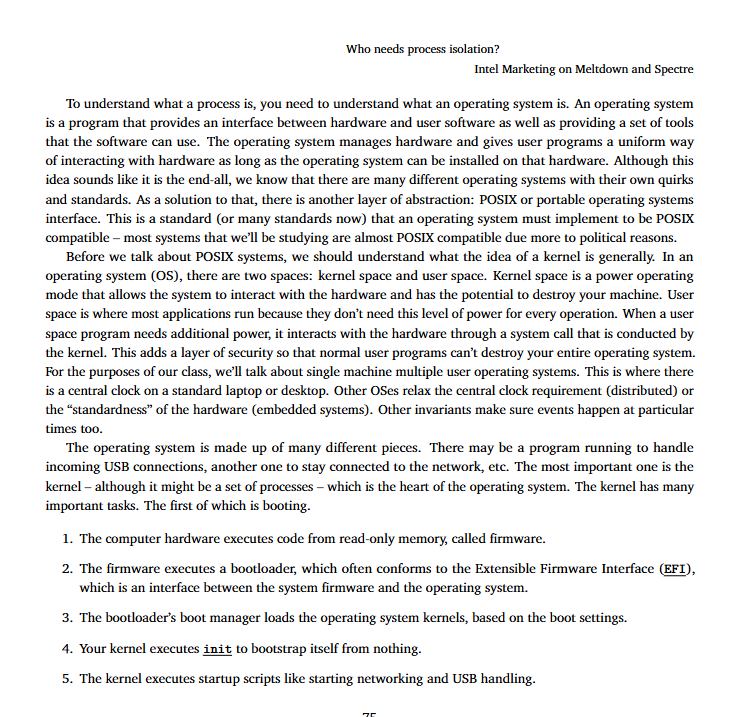

这页英文内容是计算机操作系统基础知识的一部分，主要讲解了操作系统的作用、内核的概念、用户空间与内核空间的区别，以及启动过程的基本流程。下面我为你逐段详细翻译并解释其含义：

------

### 标题：

**Who needs process isolation?**
 谁需要进程隔离？

**Intel Marketing on Meltdown and Spectre**
 （关于“熔断”和“幽灵”漏洞的）英特尔市场宣传内容

------

### 第一段：操作系统的概念

**To understand what a process is, you need to understand what an operating system is.**
 要理解什么是“进程”，你首先需要理解什么是“操作系统”。

**An operating system is a program that provides an interface between hardware and user software as well as providing a set of tools that the software can use.**
 操作系统是一个程序，它在硬件和用户软件之间提供接口，同时也提供一套供软件使用的工具。

**The operating system manages hardware and gives user programs a uniform way of interacting with hardware...**
 操作系统负责管理硬件，并为用户程序提供一种统一的方式来访问硬件。

**Although this idea sounds like it is the end-all, we know that there are many different operating systems with their own quirks and standards.**
 虽然听起来操作系统能做所有事，但实际上它们有很多种，每种都有自己的一套规则和标准。

**As a solution to that, there is another layer of abstraction: POSIX...**
 为了解决多样性问题，人们引入了POSIX（可移植操作系统接口）这一抽象层。

**This is a standard...that an operating system must implement to be POSIX compatible...**
 这是一个标准（或者说一系列标准），操作系统实现它才能称为POSIX兼容系统。

**Most systems that we’ll be studying are almost POSIX compatible due more to political reasons.**
 我们要学习的大多数系统基本都兼容POSIX，部分原因是出于“政治因素”（即业界广泛采用该标准）。

------

### 第二段：内核空间 vs 用户空间

**In an operating system (OS), there are two spaces: kernel space and user space.**
 操作系统有两个空间：内核空间 和 用户空间。

- **Kernel space**（内核空间）是系统运行在高权限模式下的区域，能够直接控制硬件。如果出了问题，可能会损坏整台机器。
- **User space**（用户空间）则是运行普通应用程序的区域，这些程序不需要高权限。

**When a user space program needs additional power, it interacts with the hardware through a system call...**
 当用户空间程序需要访问硬件，就必须通过“系统调用”向内核请求。

**This adds a layer of security so that normal user programs can’t destroy your entire operating system.**
 这样做是为了安全，防止普通程序破坏整个系统。

**We'll talk about single machine multiple user operating systems...**
 本文讲的是“单台机器、多用户”的操作系统（如常见的Linux桌面系统）。

**This is where there is a central clock on a standard laptop or desktop...**
 这种系统通常有一个中央时钟（用于同步系统内的事件）。

------

### 第三段：操作系统的组成和启动过程

**The operating system is made up of many different pieces...**
 操作系统由很多组成部分构成，比如：

- 处理USB设备的程序、
- 保持网络连接的程序等。
   但最核心的部分是 **kernel（内核）**。

**The kernel – although it might be a set of processes – is the heart of the operating system.**
 内核可能由多个进程组成，但它是操作系统的“核心”。

------

### 启动流程详解（Booting Process）

1. **The computer hardware executes code from read-only memory, called firmware.**
    计算机开机后，首先从只读存储器（ROM）中执行一段叫做“固件”（firmware）的代码。

2. **The firmware executes a bootloader...EFI**
    固件接着执行一个“引导加载程序”（bootloader），它通常符合 EFI 标准。EFI 是固件与操作系统之间的接口标准。

   > 1. Bootloader（引导加载程序）是计算机启动过程中至关重要的组件，其存在的原因可以归结为以下几个关键点：
   >
   >    ---
   >
   >    ### 1. **初始化硬件环境**
   >       - **硬件检测与准备**：现代计算机硬件复杂多样，BIOS/UEFI只能完成基本初始化（如内存检测、磁盘识别）。Bootloader（如GRUB、U-Boot）会进一步初始化硬件（如显卡、网络设备），确保内核能运行在稳定的环境中。
   >       - **示例**：嵌入式系统中，U-Boot需配置CPU时钟、内存控制器等，否则操作系统可能无法启动。
   >
   >    ---
   >
   >    ### 2. **加载操作系统内核**
   >       - **定位并加载内核**：操作系统内核通常存储在硬盘、网络或镜像文件中，Bootloader负责找到内核映像（如`vmlinuz`），并将其加载到内存中。
   >       - **多阶段加载**：某些Bootloader（如GRUB）分阶段加载，先加载一个小型模块，再从磁盘或网络获取完整内核。
   >
   >    ---
   >
   >    ### 3. **支持多操作系统共存**
   >       - **启动菜单管理**：在一台电脑上安装多个操作系统（如Windows和Linux）时，Bootloader（如GRUB）提供交互式菜单，允许用户选择启动哪个系统。
   >       - **分区识别**：自动检测其他操作系统所在分区，并生成启动项（例如通过`os-prober`工具）。
   >
   >    ---
   >
   >    ### 4. **传递启动参数**
   >       - **自定义内核行为**：Bootloader允许用户通过命令行向内核传递参数（如`root=/dev/sda1`指定根文件系统，或`nomodeset`禁用显卡驱动），解决兼容性问题。
   >       - **调试支持**：开发人员可通过Bootloader启用内核调试模式（如`kgdb`）或单用户模式。
   >
   >    ---
   >
   >    ### 5. **错误恢复与容错**
   >       - **故障处理**：若内核损坏或启动失败，Bootloader可提供修复选项（如进入恢复模式、挂载文件系统或使用Live CD修复）。
   >       - **安全模式**：部分Bootloader支持回滚到旧版本内核，避免系统因更新失败而无法启动。
   >
   >    ---
   >
   >    ### 6. **安全启动（Secure Boot）**
   >       - **防止恶意篡改**：现代Bootloader（如UEFI模式下的GRUB）支持数字签名验证，确保只有经过认证的内核和引导程序运行，抵御Rootkit攻击。
   >       - **合规性**：Windows 11等系统强制要求Secure Boot，Bootloader需符合TPM 2.0等规范。
   >
   >    ---
   >
   >    ### 7. **适配不同硬件架构**
   >       - **跨平台支持**：不同CPU架构（x86、ARM、RISC-V）需要专用Bootloader。例如：
   >         - **x86**：GRUB、LILO。
   >         - **ARM嵌入式设备**：U-Boot。
   >         - **树莓派**：U-Boot或定制固件。
   >
   >    ---
   >
   >    ### 8. **优化启动速度**
   >       - **并行初始化**：高级Bootloader（如systemd-boot）通过并行加载驱动和服务，缩短启动时间。
   >       - **轻量化**：在资源受限的环境中（如IoT设备），精简的Bootloader（如eBoot）可减少内存占用。
   >
   >    ---
   >
   >    ### 实际应用场景
   >    - **系统修复**：当GRUB损坏时，需通过Live USB执行`grub-install`或`boot-repair`恢复引导。
   >    - **自定义内核**：开发者编译新内核后，需更新Bootloader配置（如修改`grub.cfg`）以包含新内核条目。
   >    - **磁盘加密**：BitLocker/LUKS等全盘加密方案依赖Bootloader解密数据后才能挂载系统。
   >
   >    ---
   >
   >    ### 总结
   >    Bootloader是操作系统与硬件之间的桥梁，解决了硬件多样性、多系统共存、安全启动和错误恢复等问题。没有它，现代计算机的复杂启动流程将无法实现灵活性和可靠性。

3. **The bootloader’s boot manager loads the operating system kernels, based on the boot settings.**
    引导程序会根据启动设置加载操作系统的“内核”部分。

4. **Your kernel executes `init` to bootstrap itself from nothing.**
    内核加载后会运行 `init` 程序来完成初始化。

5. **The kernel executes startup scripts like starting networking and USB handling.**
    然后内核会运行一系列启动脚本，例如开启网络、处理USB设备等。

------

如果你还想了解 “进程隔离（Process Isolation）” 是怎么和上面这些概念关联起来的，或者想让我做成中文笔记文档，我可以继续帮你整理。是否需要？

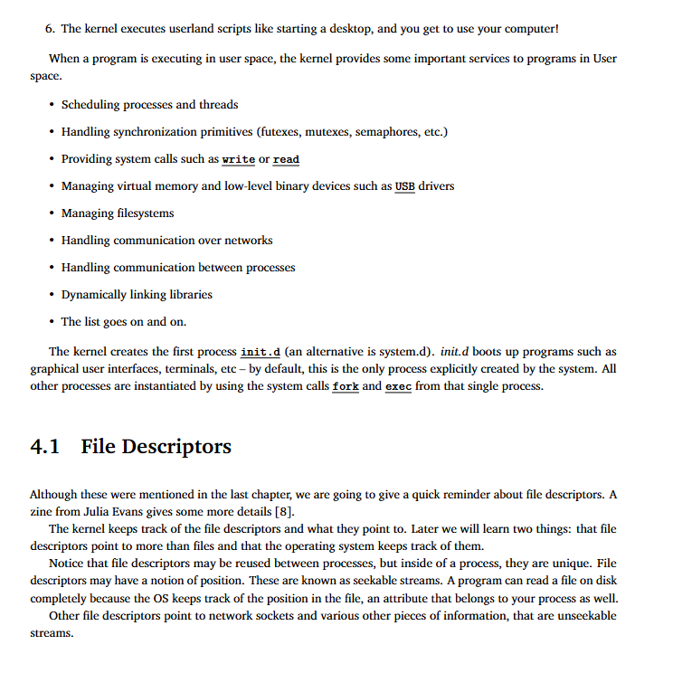

这页内容继续讲解操作系统启动后的工作重点，特别是内核为用户空间程序提供的服务，以及“文件描述符（File Descriptors）”的概念。下面是详细中文解释与翻译：

------

## 第六步：桌面启动（续上页）

**6. The kernel executes userland scripts like starting a desktop, and you get to use your computer!**
 第六步：内核执行用户空间的启动脚本，比如启动桌面系统，然后你就可以开始使用电脑了！

------

## 用户空间服务（User Space Services）

**When a program is executing in user space, the kernel provides some important services to programs in User space.**
 当程序在用户空间中运行时，内核会为它们提供一些重要的服务，比如：

- **Scheduling processes and threads**
   调度进程和线程（决定哪个程序什么时候运行）
- **Handling synchronization primitives (futexes, mutexes, semaphores, etc.)**
   处理同步机制（如快速互斥锁、互斥量、信号量等，用于线程/进程之间的协作）
- **Providing system calls such as `write` or `read`**
   提供系统调用，如 `write`（写入）或 `read`（读取）
- **Managing virtual memory and low-level binary devices such as USB drivers**
   管理虚拟内存和底层设备（如USB驱动程序）
- **Managing filesystems**
   管理文件系统（比如ext4、NTFS）
- **Handling communication over networks**
   处理网络通信（例如通过TCP/IP协议）
- **Handling communication between processes**
   处理进程间通信（IPC）
- **Dynamically linking libraries**
   动态链接库（加载如 `.so` 或 `.dll` 文件）
- **The list goes on and on.**
   列举不完（说明内核的职责很多）

------

## 初始进程 `init.d`

**The kernel creates the first process `init.d` (an alternative is `system.d`).**
 内核创建的第一个用户进程是 `init.d`（也可能是 `systemd`）。

**`init.d` boots up programs such as graphical user interfaces, terminals, etc.**
 它会启动图形界面、终端等程序。

**By default, this is the only process explicitly created by the system.**
 默认情况下，这是系统唯一主动创建的进程。

**All other processes are instantiated by using the system calls `fork` and `exec` from that single process.**
 所有其他进程都是由这个进程通过 `fork`（复制进程） 和 `exec`（加载新程序）系统调用创建的。

------

## 4.1 文件描述符（File Descriptors）

### 概念回顾：

**Although these were mentioned in the last chapter, we are going to give a quick reminder about file descriptors.**
 虽然我们在上一章已经提到文件描述符，这里再简单回顾一下。

**A zine from Julia Evans gives some more details [8].**
 Julia Evans 有个小册子讲得很详细（文献[8]）。

------

### 什么是文件描述符？

**The kernel keeps track of the file descriptors and what they point to.**
 内核会跟踪每个文件描述符指向的对象。

**We will learn two things: that file descriptors point to more than files and that the operating system keeps track of them.**
 有两点值得注意：

1. 文件描述符不只指向“文件”；
2. 操作系统会记录这些描述符的信息。

------

### 文件描述符的特性：

**File descriptors may be reused between processes, but inside of a process, they are unique.**
 不同进程可以使用相同编号的描述符，但在同一个进程内，每个描述符编号是唯一的。

**Some are seekable (e.g., disk files), some are unseekable (e.g., network sockets).**

- 某些文件描述符“可定位”（可seek），比如磁盘文件，你可以跳转到文件任意位置读写；
- 有些“不可定位”（unseekable），如网络socket，只能顺序读取。

**The OS tracks the position in the file, an attribute that belongs to your process.**
 操作系统会记录文件当前读取位置，这个位置信息属于你的“进程”。

------

**总结**：

- 文件描述符是用户程序与文件、设备或网络等资源交互的统一接口；
- 内核为每个进程维护一张“文件描述符表”；
- `0`、`1`、`2` 分别是标准输入（stdin）、标准输出（stdout）和标准错误（stderr）；
- 它是进程与外部世界交流的窗口。

------

如果你需要我把这一部分内容整理成中文笔记文档（例如PDF格式），或者想配图解读（流程图/示意图），可以继续告诉我。

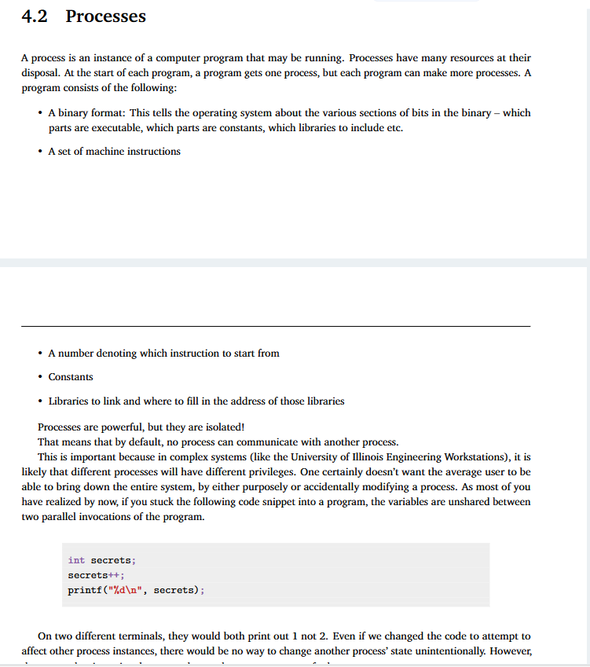

这页内容介绍了“进程（Processes）”的概念、构成、作用以及它们之间的隔离特性。下面是详细的翻译与解释：

------

## **4.2 Processes（进程）**

### **英文原文节选 + 中文解释翻译**

------

### **第一段：什么是进程？**

> A process is an instance of a computer program that may be running.
>  进程是计算机程序在运行时的一个实例。

> Processes have many resources at their disposal.
>  每个进程拥有一套自己的资源（如内存、文件描述符、权限等）。

> At the start of each program, a program gets one process, but each program can make more processes.
>  每当程序启动时，系统会为它创建一个进程；但程序也可以创建其他进程（例如通过`fork`）。

> A program consists of the following:
>  程序包含以下内容：

- **A binary format:**
   二进制格式：告诉操作系统程序中哪些是可执行代码、哪些是常量、需要包含哪些库等。
- **A set of machine instructions**
   一组机器指令：即CPU能理解并执行的最低层次指令。

------

### **程序还包括：**

- **A number denoting which instruction to start from**
   表示程序从哪条指令开始执行的编号（入口点，比如`main()`函数）。
- **Constants**
   常量：在程序中定义的不可变数据。
- **Libraries to link and where to fill in the address of those libraries**
   链接的库及其地址信息：告诉程序在运行时该使用哪些外部库，以及如何调用它们。

------

### **第二段：进程的隔离特性**

> Processes are powerful, but they are isolated!
>  进程非常强大，但它们是“隔离的”！

> That means that by default, no process can communicate with another process.
>  默认情况下，一个进程不能与另一个进程直接通信。

------

### **这很重要，因为：**

> In complex systems... different processes will have different privileges.
>  在复杂系统中，不同的进程拥有不同的权限。

> One certainly doesn’t want the average user to be able to bring down the entire system...
>  系统不允许普通用户有机会破坏整个系统（通过改动别的进程）。

> modifying a process...unintentionally
>  意外地修改别的进程也会导致严重后果，所以系统通过“进程隔离”防止这种情况。

------

### **代码示例说明：**

```c
int secrets;
secrets++;
printf("%d\n", secrets);
```

> 如果你把上面的代码写进一个程序，并在两个终端中分别运行，输出都是 `1`，而不是 `2`。
>  说明什么？每个进程拥有自己的变量副本，**变量不会在进程之间共享**。

------

### **总结：**

- 每个运行的程序都有自己的进程，进程包含指令、常量、变量、库等资源。
- 进程之间默认不能互相访问或干扰（隔离性），这提供了安全性。
- 即便是运行相同代码的两个程序副本，它们内部的变量也是独立的。

------

是否需要我进一步画图或整理为讲义式笔记？也可以解释代码行为背后的内存原理。

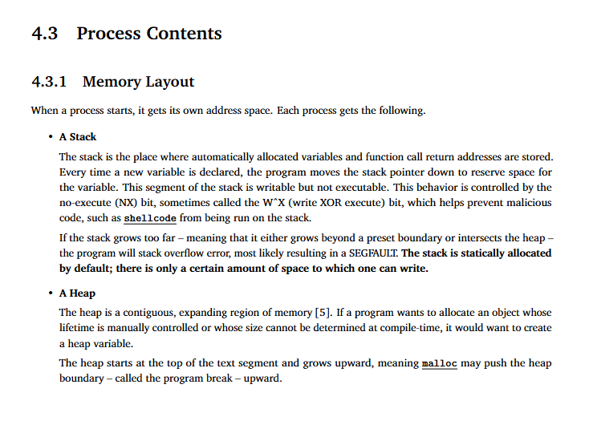

这页内容是关于**进程内存布局（Memory Layout）**的详细讲解。它主要解释了在一个进程启动后，操作系统如何为它分配内存空间，特别是其中的**栈（Stack）**和**堆（Heap）**这两个关键区域。下面是详细的中文解释与翻译：

------

## **4.3 进程内容（Process Contents）**

### **4.3.1 内存布局（Memory Layout）**

> **When a process starts, it gets its own address space. Each process gets the following.**
>  当一个进程启动时，它会被分配一个独立的地址空间（即它自己的内存空间）。这个空间包含以下两部分：

------

### **1. Stack（栈）**

> **The stack is the place where automatically allocated variables and function call return addresses are stored.**
>  栈是自动分配变量（如局部变量）和函数调用返回地址的存储区域。

> **Every time a new variable is declared, the program moves the stack pointer down to reserve space for the variable.**
>  每声明一个新变量，程序就会将“栈指针”向下移动，为该变量预留内存。

> **This segment of the stack is writable but not executable.**
>  栈内存可以写入数据，但不能执行代码。

> **This behavior is controlled by the no-execute (NX) bit, sometimes called the W^X (write XOR execute) bit...**
>  这个限制由“NX位”（禁止执行）控制，也叫“W^X”（要么可写，要么可执行，但不能两者都可），目的是防止恶意代码如 shellcode 在栈上运行。

> **If the stack grows too far... likely resulting in a SEGFAULT.**
>  如果栈增长过多，比如超出预设界限或与堆重叠，会导致**栈溢出（stack overflow）**，通常会触发**段错误（Segmentation Fault）**。

> **The stack is statically allocated by default; there is only a certain amount of space to which one can write.**
>  栈空间在程序开始时**静态分配**，大小固定，不能无限扩展。

------

### **2. Heap（堆）**

> **The heap is a contiguous, expanding region of memory.**
>  堆是一块连续的、**可以动态扩展**的内存区域。

> **If a program wants to allocate an object whose lifetime is manually controlled... it would want to create a heap variable.**
>  如果程序想分配一个生命周期可控、或运行时大小不确定的变量，就会用堆空间（通常通过 `malloc()` 函数实现）。

> **The heap starts at the top of the text segment and grows upward...**
>  堆从程序代码段（text segment）顶部开始，**向上增长**。

> **malloc may push the heap boundary – called the program break – upward.**
>  使用 `malloc` 分配内存时，可能会将堆边界（称为“程序断点”program break）向上移动。

------

### **图示理解（逻辑内存结构简图）**：

```text
地址高
   |
   | <- 栈（向下增长）
   |
   |        <- 空闲空间
   |
   | <- 堆（向上增长）
   |
代码段、数据段
   |
地址低
```

------

### **总结重点：**

| 区域        | 特点               | 作用                                 | 增长方向 |
| ----------- | ------------------ | ------------------------------------ | -------- |
| Stack（栈） | 自动分配，空间有限 | 存放局部变量、返回地址等             | 向下增长 |
| Heap（堆）  | 手动分配，可扩展   | 存放动态创建的数据结构，如链表、树等 | 向上增长 |

------

如果你还想了解“代码段（text segment）”、“数据段（data segment）”、“BSS段”等内存布局部分，也可以继续帮你解释或画一张完整的内存结构图。需要吗？

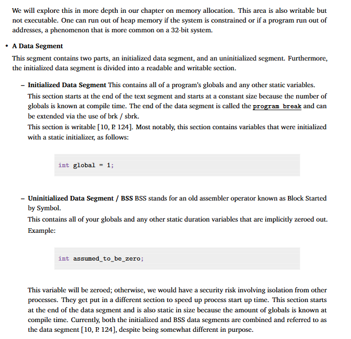

这页内容介绍了进程内存中的 **数据段（Data Segment）**，尤其是它的两个子部分：**已初始化数据段（Initialized Data Segment）** 和 **未初始化数据段（Uninitialized Data Segment）或 BSS 段**。以下是详细中英文对照解释：

------

## **A Data Segment（数据段）**

数据段是进程地址空间中的一个区域，**专门用于存放全局变量（global variables）和静态变量（static variables）**。它可以进一步分为两个子区域：

------

### **1. Initialized Data Segment（已初始化数据段）**

> **This contains all of a program’s globals and any other static variables.**
>  这个部分存放程序中**所有带初始值的全局变量**和**静态变量**。

> **This section starts at the end of the text segment...**
>  它紧接在程序代码段（text segment）之后，大小在编译时就确定，因为编译器已知有哪些变量。

> **The end of the data segment is called the `program break`...**
>  数据段的尾部称为“程序断点（program break）”，可以通过 `brk` / `sbrk` 系统调用扩展堆区。

> **This section is writable... contains variables that were initialized with a static initializer:**
>  该区域是可写的，常见的如：

```c
int global = 1;
```

这个变量就会被放入“已初始化数据段”。

------

### **2. Uninitialized Data Segment / BSS（未初始化数据段）**

> **BSS stands for Block Started by Symbol.**
>  BSS 是老式汇编语言中的术语，全称是“以符号开始的区块（Block Started by Symbol）”。

> **This contains all of your globals and any other static duration variables that are implicitly zeroed out.**
>  这个区域用于存放**未赋初始值的全局变量或静态变量**，系统默认会将它们**初始化为0**。

示例：

```c
int assumed_to_be_zero;
```

变量没有被显式赋值，系统会自动置零。

> **This variable will be zeroed; otherwise, we would have a security risk...**
>  系统必须将它初始化为0，否则可能带来进程间的安全隐患。

> **They get put in a different section to speed up process start up time.**
>  BSS段和数据段分开，有助于加快程序启动速度。

> **This section starts at the end of the data segment and is also static in size...**
>  BSS段紧接在已初始化数据段之后，大小在编译时也已固定。

------

### **总结**

| 区域           | 英文名                           | 特点                                           | 示例                      |
| -------------- | -------------------------------- | ---------------------------------------------- | ------------------------- |
| 已初始化数据段 | Initialized Data Segment         | 带初值的全局或静态变量，编译时分配，运行时可写 | `int global = 1;`         |
| 未初始化数据段 | BSS / Uninitialized Data Segment | 未初始化的全局或静态变量，系统默认初始化为0    | `int assumed_to_be_zero;` |

- 两者最终都属于“数据段”，但用途不同；
- 都是进程独占的私有内存区域；
- 操作系统确保初始化安全性、防止数据泄露或异常行为。

------

如果你需要，我可以将整个进程内存结构总结成一张图（如逻辑内存示意图），帮助你更直观理解。需要吗？

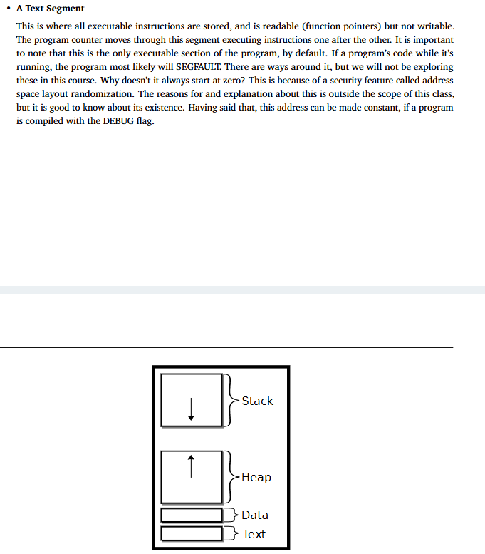

这页内容讲解了**Text Segment（代码段）**，并用一个简图总结了进程的内存结构布局。下面是详细解释与中英文翻译：

------

## **Text Segment（代码段）**

> **This is where all executable instructions are stored, and is readable (function pointers) but not writable.**
>  **代码段**是存放所有“可执行指令”的区域，可以读取（比如访问函数指针），**但不能写入**。

> **The program counter moves through this segment executing instructions one after the other.**
>  程序计数器（Program Counter, PC）在此区域逐条执行指令。

> **It is important to note that this is the only executable section of the program, by default.**
>  重要的是：**默认情况下，代码段是程序中唯一可以执行代码的内存区域**。

------

### **运行时修改代码的后果**

> **If a program’s code while it’s running, the program most likely will SEGFAULT.**
>  如果运行中的程序尝试修改它的代码（写入代码段），很可能会引发**段错误（Segmentation Fault）**。

------

### **地址随机化与调试**

> **Why doesn’t it always start at zero?**
>  为什么代码段地址不是总从0开始？

> **This is because of a security feature called address space layout randomization (ASLR).**
>  因为有一个安全机制叫做**地址空间布局随机化（ASLR）**，它会在运行时随机安排各段地址，以防攻击者预测内存位置（提高安全性）。

> **This address can be made constant, if a program is compiled with the DEBUG flag.**
>  但如果用调试标志（如 `-g` 或 `-no-pie`）编译，系统可能会禁用地址随机化，从而让地址固定（便于调试）。

------

## **总结图解说明**

右下方的图展示了一个典型进程的**逻辑内存结构**：

```
高地址
│
│ Stack    <-- 向下增长，用于函数调用、本地变量
│
│ Heap     <-- 向上增长，用于动态分配内存（如 malloc）
│
│ Data     <-- 存放已初始化和未初始化的全局/静态变量
│ Text     <-- 存放可执行代码（指令），只读、可执行
└───> 低地址
```

------

### **各段作用对比表**

| 段名  | 作用                      | 是否可写 | 是否可执行 | 增长方向 |
| ----- | ------------------------- | -------- | ---------- | -------- |
| Text  | 存放代码                  | 否       | 是         | 固定     |
| Data  | 存放全局/静态变量         | 是       | 否         | 固定     |
| Heap  | 动态分配内存（如 malloc） | 是       | 否         | 向上     |
| Stack | 局部变量、函数调用栈帧    | 是       | 否         | 向下     |

------

如需我将完整“进程内存结构讲解”整理为笔记或PPT风格资料，也可以继续为你处理。是否需要？

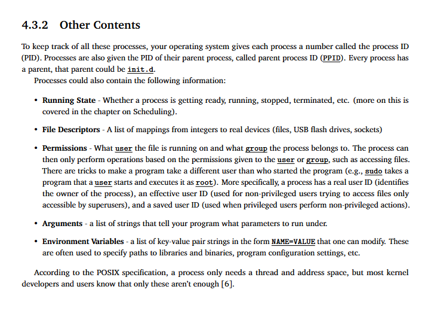

这页内容讲的是**一个进程除了内存和线程以外，还包含的其他重要信息（Other Contents）**，对理解操作系统中进程的结构非常关键。下面是详细中英对照解释：

------

## **4.3.2 进程的其他内容（Other Contents）**

> **To keep track of all these processes, your operating system gives each process a number called the process ID (PID).**
>  操作系统会为每个进程分配一个编号，称为**进程ID（PID）**，用于唯一标识进程。

> **Processes are also given the PID of their parent process, called parent process ID (PPID).**
>  每个进程还会记录其“父进程”的 PID，称为**父进程ID（PPID）**。

> **Every process has a parent, that parent could be `init.d`.**
>  所有进程都来源于另一个“父进程”，比如系统初始化时启动的 `init.d`。

------

### 一个进程还包含以下内容：

------

### **1. Running State（运行状态）**

> 如：准备就绪（ready）、运行中（running）、已停止（stopped）、终止（terminated）等。
>  这些状态在操作系统调度章节中有更详细的介绍。

------

### **2. File Descriptors（文件描述符）**

> 是一张“整数 → 文件/设备”的映射表，用于表示进程打开的文件、USB设备、网络套接字等。

------

### **3. Permissions（权限）**

> 一个进程运行在某个用户（user）和用户组（group）下。
>  进程只能根据这些身份权限访问资源，比如文件读写权限。

- 比如用户用 `sudo` 提权时：程序最初由普通用户启动，但会以 root 身份执行。
- 一个进程通常有三个用户ID：
  - **真实用户ID（Real UID）**：进程的真正拥有者。
  - **有效用户ID（Effective UID）**：用于权限判断（是否有权限访问资源）。
  - **保存用户ID（Saved UID）**：用于在特权执行后恢复权限。

------

### **4. Arguments（参数）**

> 是传递给程序的命令行参数，比如运行 `python script.py arg1 arg2`，这些 `arg1 arg2` 就是 arguments。

------

### **5. Environment Variables（环境变量）**

> 是一组“键=值”形式的字符串，比如：
>  `PATH=/usr/bin`、`JAVA_HOME=/usr/lib/jvm/...`
>  程序用它们来查找库路径、配置项等，也可以在运行时修改。

------

### **POSIX标准与实际应用的差异：**

> **According to the POSIX specification, a process only needs a thread and address space...**
>  根据 POSIX 规范，一个进程理论上只需要线程和地址空间即可。

> **...but most kernel developers and users know that only these aren’t enough.**
>  但实际开发中，仅靠线程和地址空间**远远不够**。上述这些状态和信息对于管理、调度、安全都至关重要。

------

### **总结表格：**

| 内容                  | 含义                                               |
| --------------------- | -------------------------------------------------- |
| PID / PPID            | 唯一标识进程 / 父进程                              |
| Running State         | 运行状态                                           |
| File Descriptors      | 当前进程打开的文件、设备                           |
| Permissions           | 用户权限信息（Real UID、Effective UID、Saved UID） |
| Arguments             | 启动参数                                           |
| Environment Variables | 环境变量（配置信息）                               |

------

如果你需要，我可以将整个“进程结构内容”制作成一页完整思维导图或中文笔记，也可结合系统调用与实际代码案例进一步说明。是否继续？

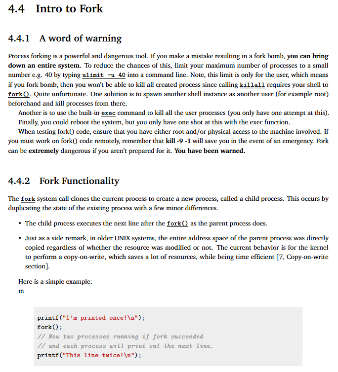

这页内容介绍了 Unix 系统中非常重要的概念和函数：**`fork()`**，包括它的风险与用法。以下是详细的中文解释和翻译：

------

## **4.4 fork 简介（Intro to Fork）**

### **4.4.1 警告（A word of warning）**

> **Process forking is a powerful and dangerous tool.**
>  `fork()` 是一种非常强大但也可能非常危险的工具。

> **If you make a mistake resulting in a fork bomb, you can bring down an entire system.**
>  如果你误写了造成无限递归的 `fork()`（称为 fork 炸弹），**整个系统都可能崩溃**。

------

#### **如何避免 fork 炸弹：**

- 使用 `ulimit -u 40` 限制当前用户最多只能启动 40 个进程；
- `killall` 命令无法解决 fork 炸弹，因为你的 shell 也可能被“炸”出来的子进程占用；
- 可以用 `exec` 替换当前进程为 `killall`，一次性杀死全部用户进程（但只能试一次）；
- 最终手段是重启系统（但不是所有环境都能重启）；
- 如果是远程调试，建议准备好 `kill -9 -1`（杀死所有属于当前用户的进程）；
- 最好提前准备好 root 用户或另一个 shell 窗口来杀进程。

> **Fork can be extremely dangerous if you aren’t prepared for it. You have been warned.**
>  如果没有做好准备，`fork()` 非常危险。**这不是开玩笑！**

------

### **4.4.2 fork 的功能（Fork Functionality）**

> **The `fork` system call clones the current process to create a new process, called a child process.**
>  `fork()` 系统调用会复制当前进程，生成一个新的进程，称为**子进程（child process）**。

------

#### **fork() 的行为特点：**

- 子进程从 `fork()` 之后的下一行开始执行，与父进程一致；

- 所有数据都是复制的，但现代系统使用 **写时复制（Copy-on-write）** 技术来节省资源：

  > 即：只有在子进程或父进程修改内存内容时，才真正复制内存页。

------

#### **示例代码讲解：**

```c
printf("I'm printed once!\n");
fork(); // 复制当前进程
// 现在有两个进程同时运行
printf("This line twice!\n");
```

- **输出结果：**

```text
I'm printed once!
This line twice!
This line twice!
```

- **解释：**
  - 第一条 `printf` 被父进程执行一次；
  - `fork()` 之后，父子进程都执行第二条 `printf`，所以输出两次。

------

### **总结**

| 概念          | 解释                                           |
| ------------- | ---------------------------------------------- |
| `fork()`      | 复制当前进程，生成子进程                       |
| fork 炸弹     | 无限递归调用 `fork()` 导致系统进程爆满         |
| Copy-on-write | 父子进程共用内存，只有在写入时才复制，提高性能 |
| kill -9 -1    | 杀掉当前用户的所有进程，用于紧急情况           |

------

是否需要我提供更复杂的 `fork()` 示例，比如父子进程间通信（管道 pipe）、结合 `exec()` 使用等？我可以帮你逐步搭建更完整的理解结构。

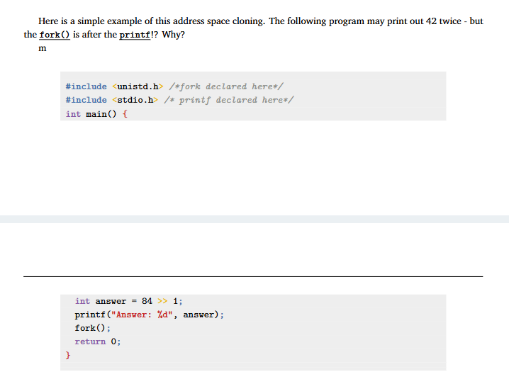

这页内容讲解了一个关于 `fork()` 行为的小陷阱：**为什么 `printf()` 在 `fork()` 前执行，但输出却出现两次？**

我们来详细解释一下：

------

## **程序原文：**

```c
#include <unistd.h>  // fork() 函数定义
#include <stdio.h>   // printf() 函数定义

int main() {
    int answer = 84 >> 1;  // 右移1位，相当于除以2，结果是 42
    printf("Answer: %d", answer);  // 打印 42
    fork();   // 创建子进程
    return 0;
}
```

------

## **你可能观察到的输出：**

```
Answer: 42Answer: 42
```

这令人困惑，因为 `printf()` 明明写在 `fork()` **前面**，为什么会出现 **两次输出**？

------

## **关键原因：缓冲机制 + fork 的地址空间克隆**

### **1. printf 有缓冲（Buffering）**

- 默认情况下，`printf()` 输出到 **终端** 时，使用的是 **行缓冲（line-buffered）**；
- 如果末尾**没有换行符 `\n`**，数据不会立刻写入终端，而是**暂存在缓冲区**；
- 所以 `printf("Answer: %d", answer);` 实际上只是把 `"Answer: 42"` 放入输出缓冲区，并没有立即打印。

------

### **2. fork 会复制整个地址空间，包括缓冲区**

- 调用 `fork()` 会把父进程的地址空间 **完整复制** 给子进程，包括 **输出缓冲区的内容**；
- 因此，**父子进程都持有一份 “Answer: 42” 的缓冲数据**；
- 然后两个进程都进入 `return 0;`，程序退出时，系统会自动 **刷新输出缓冲区**；
- 所以就出现了两次 `"Answer: 42"` 的打印结果。

------

### **如何修复/验证？**

在 `printf()` 后加上 `\n` 或手动刷新缓冲区，比如：

```c
printf("Answer: %d\n", answer);  // 加换行符
// 或
fflush(stdout);  // 手动刷新标准输出
```

这样 `printf` 就在 `fork()` 前真正输出，缓冲不会被复制，就只会看到一次输出。

------

## **总结：**

| 机制       | 解释                                            |
| ---------- | ----------------------------------------------- |
| `fork()`   | 创建子进程，复制所有内存（包括缓冲区）          |
| `printf()` | 默认行缓冲，未加 `\n` 不会立刻输出              |
| 现象       | `fork()` 后两个进程各自刷新缓冲区，导致输出重复 |

------

是否需要我写一个更完整的例子，展示如何在父子进程中输出不同内容、区分谁是谁？可以顺便讲讲 `fork()` 的返回值含义。

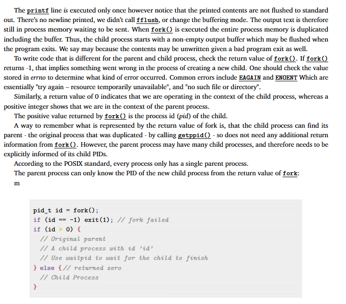

这页内容深入讲解了 `fork()` 的返回值含义，以及父子进程之间如何区分身份。还结合了代码示例，帮助我们正确使用 `fork()`。以下是逐段详细解释与中英文对照：

------

## **缓冲机制再解释：**

> **The `printf` line is executed only once however notice that the printed contents are not flushed to standard out.**
>  虽然 `printf` 只执行了一次，但输出并没有立刻显示在屏幕上，是因为没有刷新（flush）。

> **When `fork()` is executed the entire process memory is duplicated including the buffer.**
>  `fork()` 复制了整个进程的内存，包括 **输出缓冲区**，所以子进程也“继承”了那段待输出的文本。

------

### **解决方法：**

> **flush the buffer before `fork()`**
>  可以在 `fork()` 前用 `fflush(stdout);` 来强制输出已缓冲的内容，避免重复打印。

------

## **fork() 的返回值详解：**

### **三种返回值的意义：**

1. **`-1`**：表示创建子进程失败，常见错误原因包括：
   - `EAGAIN`：资源暂时不可用
   - `ENOENT`：找不到文件或目录（通常是环境问题）
2. **`0`**：表示当前运行在 **子进程** 中
3. **大于 0 的值**：表示当前运行在 **父进程** 中，返回的是子进程的 PID

------

### **为什么返回值是这样设计？**

> **The child process can find its parent using `getppid()`, so it doesn’t need extra info from `fork()`.**
>  子进程可以通过 `getppid()` 获取父进程 ID，不需要从 `fork()` 得知自己是谁。

> **The parent may have many children, so it must know the PID of the one it just created.**
>  父进程可能会产生多个子进程，因此需要通过 `fork()` 的返回值来区分每个子进程。

------

## **POSIX 标准：**

> **每个进程只能有一个父进程，但一个父进程可以拥有多个子进程。**
>  这意味着子进程能追溯父亲，但父进程要自己记录每个孩子的 PID。

------

## **代码示例分析：**

```c
pid_t id = fork();

if (id == -1) exit(1);  // fork失败，程序退出

if (id > 0) {
    // 父进程分支
    // 子进程的 pid 是 id
    // 可使用 waitpid(id, ...) 等待子进程结束
} else {
    // 子进程分支
    // fork() 返回0
}
```

### **解释：**

- `pid_t` 是一个表示进程ID的类型；
- 调用 `fork()` 之后，**父子进程会继续并发执行各自的代码路径**；
- 使用 `if (id > 0)` 可以判断当前是否为父进程；
- 可在父进程中调用 `waitpid(id, NULL, 0);` 等待子进程执行完毕，防止出现僵尸进程。

------

## **总结：fork() 的三种返回情况**

| fork() 返回值 | 所在进程 | 意义                        |
| ------------- | -------- | --------------------------- |
| `-1`          | 父进程   | 创建失败                    |
| `0`           | 子进程   | fork 成功，当前是子进程     |
| `>0`          | 父进程   | fork 成功，返回子进程的 PID |

------

如果你想进一步学习 `fork()` 结合 `exec()` 使用（比如创建新的程序），或者了解父子进程通信方式（管道 pipe、信号 signal），可以继续问我。是否需要？

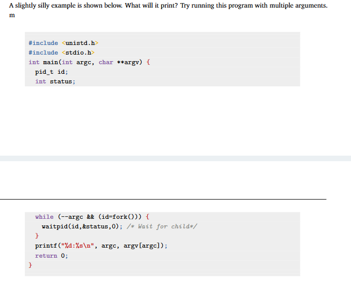

这段代码是一个关于 `fork()` 和递归式子进程创建的有趣实验。它的行为取决于你输入的参数个数。下面是详细的中文解释与行为分析：

------

## **代码解析**

```c
#include <unistd.h>
#include <stdio.h>

int main(int argc, char **argv) {
    pid_t id;
    int status;

    while (--argc && (id = fork())) {
        waitpid(id, &status, 0);  // 等待子进程退出
    }

    printf("%d: %s\n", argc, argv[argc]);
    return 0;
}
```

------

## **关键逻辑逐句解释**

### 1. `while (--argc && (id = fork()))`

- `--argc`：每轮循环减少一个参数（注意：`argv[0]` 是程序名）
- `id = fork()`：创建一个子进程
  - 如果 `fork()` 成功，父进程接到子进程 PID（>0），进入循环体执行 `waitpid`
  - 子进程接到返回值 0，不满足 `(id = fork())` 条件，**跳出循环**，执行 `printf`

### 2. `waitpid(id, &status, 0);`

- 父进程等待子进程退出（同步行为，确保输出顺序从小到大）

### 3. `printf("%d: %s\n", argc, argv[argc]);`

- 当某一进程跳出 `while` 循环后，打印当前 `argc` 和对应的 `argv[argc]`

------

## **举例演示**

假设你运行程序的命令为：

```bash
./a.out A B C
```

那么：

- `argc = 4` （包含程序名）
- `argv = {"./a.out", "A", "B", "C"}`

执行流程如下：

1. `argc = 3`，父进程 fork 创建子进程1

2. 父进程等待，子进程1继续

3. `argc = 2`，子进程1 fork 创建子进程2

4. 子进程1等待，子进程2继续

5. `argc = 1`，子进程2 fork 创建子进程3

6. 子进程2等待，子进程3继续

7. `argc = 0`，不满足条件，子进程3跳出循环，输出：

   ```bash
   0: ./a.out
   ```

8. 子进程2收到子进程3结束，继续执行 `printf`：

   ```bash
   1: A
   ```

9. 子进程1继续执行：

   ```bash
   2: B
   ```

10. 父进程继续执行：

    ```bash
    3: C
    ```

------

## **最终输出：**

```
0: ./a.out
1: A
2: B
3: C
```

顺序从最深的子进程往上“回溯式”输出，像是一棵递归子进程树的回溯过程。

------

## **总结：**

| 概念        | 解释                               |
| ----------- | ---------------------------------- |
| `fork()`    | 创建子进程，父子同时继续执行       |
| `waitpid()` | 父进程等待子进程结束               |
| `--argc`    | 控制递归深度                       |
| 输出顺序    | 从最深的子进程（argc最小）向上传播 |

这其实是一个“递归式进程链”+“等待链”，非常适合演示进程控制流。如果你想我改写成图示或加入 `getpid()`/`getppid()` 观察进程层级，也可以继续帮你处理。是否需要？

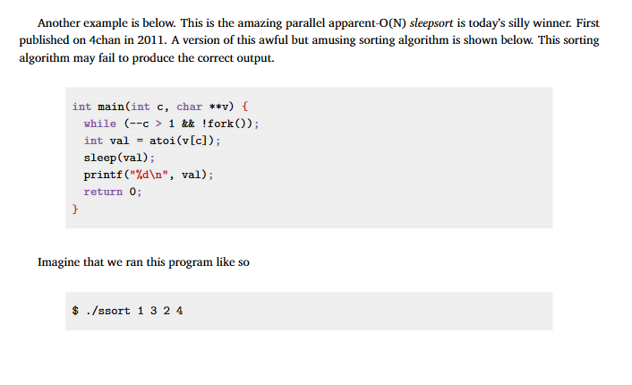

这页展示了一个经典的“**用睡眠排序的玩笑程序**”，在2011年最早出现在 4chan 上的一个“平行 O(N) 排序算法” —— **sleepsort**，它逻辑荒唐但趣味性十足。下面是详细解释：

------

## **程序代码分析：**

```c
int main(int c, char **v) {
    while (--c > 1 && !fork());
    int val = atoi(v[c]);
    sleep(val);
    printf("%d\n", val);
    return 0;
}
```

------

## **逐句中文解释：**

1. `while (--c > 1 && !fork());`
   - 每次循环减少参数数量 `c`，直到 `c <= 1` 停止。
   - `fork()` 用于生成一个子进程，如果 `fork()` 成功返回0（子进程），就跳出循环。
   - 所以这个 `while` 实际上是：为每一个参数（除了程序名和第一个参数）都创建一个**子进程**，每个子进程只负责处理一个数字。
2. `int val = atoi(v[c]);`
   - 将对应参数字符串转为整数，比如 `"3"` → `3`
3. `sleep(val);`
   - 让当前进程睡眠 `val` 秒。
   - 谁的数字小谁醒得早，意味着小的数先执行下一步。
4. `printf("%d\n", val);`
   - 醒来后输出该数值。

------

## **程序调用方式：**

```bash
$ ./ssort 1 3 2 4
```

- 程序名是 `./ssort` → `argv[0]`
- 参数依次为 `"1"`, `"3"`, `"2"`, `"4"`
- 实际进入排序逻辑的是后3个参数：**3, 2, 4**

------

## **执行行为：**

每个参数被一个子进程处理：

| 数值 | 睡眠时间（秒） | 输出顺序（大概率） |
| ---- | -------------- | ------------------ |
| 2    | sleep(2)       | 第一个醒来并输出   |
| 3    | sleep(3)       | 第二个             |
| 4    | sleep(4)       | 第三个             |

所以可能的输出顺序是：

```
2
3
4
```

（但不保证稳定，系统调度可能打乱顺序）

------

## **这是排序吗？**

从**用户的角度看输出顺序**，是的，它“好像”完成了排序。

### **但这其实是极其低效、不可预测的“排序”方式：**

- 利用**睡眠时间映射为值的大小**；
- 谁数值小，谁先醒来；
- 借此达到“较小数先打印”的假象排序。

------

## **为什么叫“Parallel O(N) sleepsort”？**

- 它同时启动多个子进程（理论上是并行的），所以叫 Parallel；
- 每个数只处理一次，理论上是 O(N)；
- 但实质上是：
  - 系统资源消耗巨大（一个子进程一个数）；
  - 完全不可控（受调度器干扰）；
  - 输出顺序不稳定；
  - 在实际场景毫无用处，仅作娱乐。

------

## **总结一句话：**

> 这是一个通过睡觉“排序”的有趣玩笑程序，用来恶搞或教学解释 `fork()` 和 `sleep()` 的并发行为，非常 **不可靠但充满创意**。

------

是否需要我为这个程序写一个图示流程（进程树 + 时间线）帮助你更好理解？

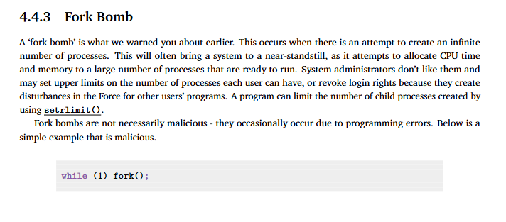

这页内容讲解的是一种**非常危险的编程错误或攻击方式：`fork bomb`（叉炸弹）**。下面是详细的中文解释与分析：

------

## **4.4.3 Fork Bomb（叉炸弹）**

### **英文解释：**

> A ‘fork bomb’ is what we warned you about earlier. This occurs when there is an attempt to create an infinite number of processes.

### **中文解释：**

所谓 **fork 炸弹**，就是程序**无限制地调用 `fork()`**，从而不断产生新进程。这会：

- 快速耗尽系统资源（CPU、内存、进程表）；
- 导致系统变慢甚至完全卡死；
- 使其他用户或系统程序无法正常运行；
- 可能需要重启系统才能恢复。

------

## **示例代码：**

```c
while (1) fork();
```

### **说明：**

- 这行代码意味着：每个进程永远不断地创建新子进程；
- 由于每个新进程也会继续执行 `fork()`，数量呈**指数级爆炸**（2、4、8、16...）；
- 一会儿整个系统就被淹没在进程海洋里。

------

## **系统管理员对策：**

> **System administrators don’t like them... may set upper limits... using `setrlimit()`.**

- 管理员通常会使用命令如：

  ```bash
  ulimit -u 100
  ```

  限制某个用户最多创建 100 个进程；

- 或通过编程接口 `setrlimit()` 限制进程数量，防止误炸或恶意行为。

------

## **不是所有 fork 炸弹都是恶意的：**

> **They occasionally occur due to programming errors.**

有时 `fork bomb` 也可能是**程序员错误写出的死循环 + fork()**，不是出于恶意，但后果一样严重。

------

## **总结（重要警告）**

| 特点     | fork 炸弹                                 |
| -------- | ----------------------------------------- |
| 本质     | 无限递归创建子进程                        |
| 后果     | 系统资源耗尽、严重卡顿                    |
| 表现     | CPU爆满、内存告急、命令行无响应           |
| 预防     | 使用 `ulimit` 或 `setrlimit()` 限制进程数 |
| 是否恶意 | 可恶意，也可能是编程失误                  |

------

### **一句话总结：**

> `fork bomb` 就像病毒：一行代码就能让操作系统崩溃。严禁运行不明 `fork()` 循环，尤其是在 root 或服务器环境中！

------

如你有兴趣，我可以展示如何通过 `setrlimit()` 编写防炸代码或解释它的系统调用结构，是否继续？

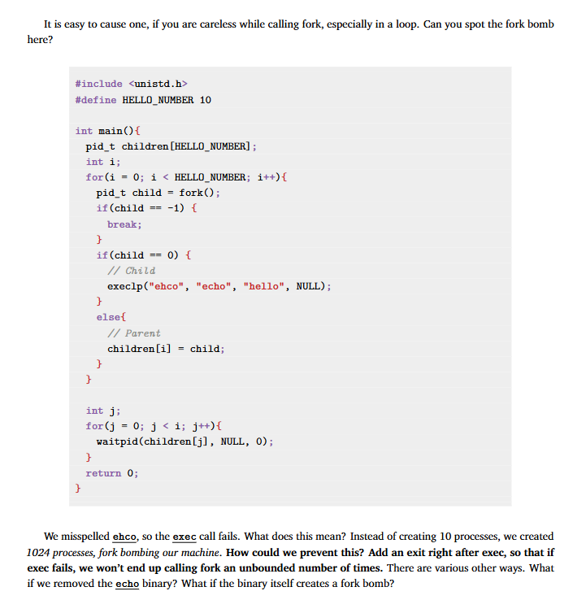

这页展示了一个**非常典型的隐蔽 fork bomb（叉炸弹）陷阱**：本意是创建10个子进程执行 `echo` 命令，结果因为拼写错误造成了**爆炸式进程增长**。我们来详细解释：

------

## **代码概览**

```c
#include <unistd.h>
#define HELLO_NUMBER 10

int main() {
    pid_t children[HELLO_NUMBER];
    int i;

    for (i = 0; i < HELLO_NUMBER; i++) {
        pid_t child = fork();
        if (child == -1) break;

        if (child == 0) {
            execlp("ehco", "echo", "hello", NULL);  // 拼错：应该是 "echo"
        } else {
            children[i] = child;
        }
    }

    int j;
    for (j = 0; j < i; j++) {
        waitpid(children[j], NULL, 0);
    }

    return 0;
}
```

------

## **逐段解释**

### `execlp("ehco", ...)`

- 原意是让子进程执行系统命令 `echo hello`；
- 但 `"ehco"` 拼错了，导致 `execlp()` **执行失败**；
- 注意：**`exec` 执行失败不会终止子进程**，子进程会**继续执行原始代码流**，即从 `execlp()` 返回后继续向下执行。

------

## **问题出现在哪里？**

### 子进程没退出！

- 正常情况下，`exec()` 成功后**当前进程会被替换**，代码不会返回；
- 现在失败了，子进程会**继续执行主函数中的循环和 `fork()` 调用**；
- 也就是说，每个子进程又开始复制自己，再失败，再复制……

### 结果：**指数级增长**的子进程数量

- 本来应该只有 10 个子进程；
- 结果因为每个子进程继续跑循环 + fork，形成“树状炸弹”；
- 很快系统就会被炸满（例子中提到 **创建了 1024 个进程**）；

------

## **如何修复？**

> **Add an `exit()` right after `exec()`.**

改成这样：

```c
if (child == 0) {
    execlp("ehco", "echo", "hello", NULL);
    exit(1);  // exec失败时立刻终止子进程，防止继续fork
}
```

------

## **其它潜在危险**

> What if the binary itself creates a fork bomb?
>  What if we removed the echo binary?

- 如果你运行的程序本身就是一个 fork bomb（比如伪装的恶意程序），就算 `exec` 成功，也会炸；
- 如果系统删除了 `echo` 命令，`execlp("echo", ...)` 同样会失败，从而触发 fork 炸弹；
- 所以，**即使你用了 `exec()`，也应该对失败情况做防护处理**。

------

## **总结表格：**

| 问题点            | 说明                                |
| ----------------- | ----------------------------------- |
| 拼写错误          | "ehco" 错误拼写导致 exec 失败       |
| exec 失败后未退出 | 子进程继续运行原主函数，进入死循环  |
| fork 炸弹         | 子进程不停 fork，指数增长，炸死系统 |
| 解决方法          | 在 exec 后立即 `exit()`，即便失败   |

------

如果你想我画一张“进程树爆炸图”或改写成防炸模板版本，可以继续告诉我。是否需要？

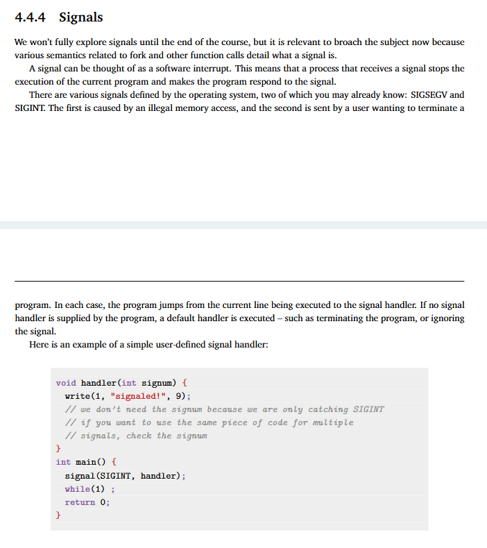

这页内容介绍的是**信号（signals）**机制，是 UNIX/Linux 操作系统中进程间通信与异常处理的重要方式。以下是详细中文解释：

------

## **4.4.4 Signals（信号）**

### **什么是信号？**

> A signal can be thought of as a software interrupt.
>  信号可以理解为一种**软件中断**：当某个进程接收到信号时，它会**暂停当前执行**，转而响应这个信号。

------

### **信号的作用：**

- 让系统或用户能与进程交互（比如：强制终止、暂停、恢复）；
- 让程序能响应特定事件，如非法访问内存、用户按下 `Ctrl+C`；
- 用于错误处理、进程控制、通信等场景。

------

### **常见信号举例：**

| 信号      | 名称       | 说明                                     |
| --------- | ---------- | ---------------------------------------- |
| `SIGSEGV` | 段错误信号 | 程序访问非法内存（如访问 NULL 指针）     |
| `SIGINT`  | 中断信号   | 用户按下 `Ctrl+C` 触发，表示希望终止程序 |

------

### **程序如何响应信号？**

1. **默认行为**（没有用户定义的处理函数）：
   - 终止程序；
   - 忽略信号；
   - 或执行默认中断操作。
2. **自定义行为**：程序可以注册一个“信号处理函数”来自定义对特定信号的响应。

------

## **代码示例解释：**

```c
void handler(int signum) {
    write(1, "signaled!", 9);
}

int main() {
    signal(SIGINT, handler);  // 捕捉 Ctrl+C 信号
    while(1);  // 无限循环，等待信号
    return 0;
}
```

------

### **逐句解释：**

- `signal(SIGINT, handler);`
   告诉系统：当程序接收到 **`SIGINT`**（如 Ctrl+C）时，不要直接终止程序，而是执行 `handler()` 函数。
- `write(1, "signaled!", 9);`
   使用低级系统调用 `write()` 向标准输出写出提示。注意这里没有用 `printf()`，因为 `printf` 不是信号安全的函数（会用缓冲）。
- `while(1);`
   程序将一直循环运行，直到用户发出中断信号（Ctrl+C），此时跳转到 `handler()` 执行打印。

------

### **执行效果：**

```bash
$ ./a.out
^Csignaled!
```

用户按下 Ctrl+C 后，屏幕上不会结束程序，而是打印 `signaled!`。

------

### **小结：**

| 项目     | 内容                                        |
| -------- | ------------------------------------------- |
| 信号定义 | 一种软件中断机制                            |
| 用途     | 控制、通知、处理异常                        |
| 默认处理 | 终止或忽略                                  |
| 自定义   | 使用 `signal(signum, handler)` 设置处理函数 |
| 示例中   | 捕捉 Ctrl+C，打印信息而不退出               |

------

是否需要我补充信号编号清单或介绍高级用法（如 `sigaction()`、`kill()`、父子进程通信中的信号机制）？可以继续帮你拓展。

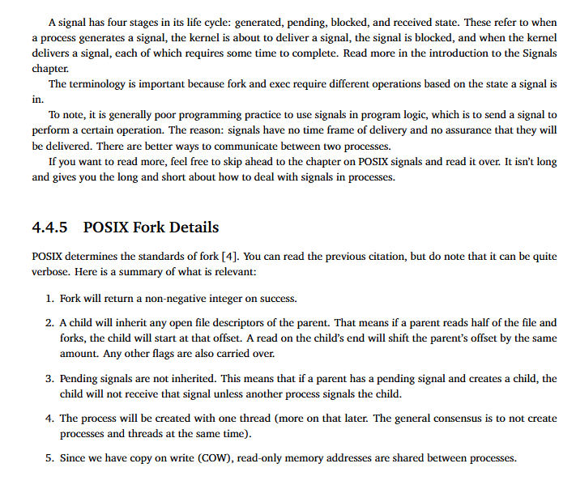

这页内容分为两部分，分别讲解了：

1. **信号（Signal）的生命周期和使用建议**；
2. **POSIX 标准中 `fork()` 的详细行为**。

下面是详细中文翻译和解释：

------

## **信号机制补充说明（延续上页）**

### **信号的四个阶段：**

> A signal has four stages in its life cycle: **generated, pending, blocked, and received state**.

信号生命周期的四个状态：

1. **generated（生成）**：进程或内核发出了信号；
2. **pending（待处理）**：信号已发出，但还没传递；
3. **blocked（阻塞）**：进程当前屏蔽了该信号；
4. **received（接收）**：信号被交付给进程，进入信号处理函数或默认行为。

------

### **为什么这很重要？**

> Fork 和 exec 的行为可能受信号状态影响
>  如果在 `fork()` 时父进程有挂起信号，它不会被继承给子进程（详见后文第 3 点）。

------

### **建议：**

> 不推荐将信号当作程序逻辑的主要机制
>  因为信号没有可靠的**传送时间**或**送达保障**。有更好的方式可以让进程间通信（如管道、消息队列、共享内存等）。

------

## **4.4.5 POSIX Fork 细节**

POSIX 是类 Unix 系统的标准，规定了 `fork()` 调用的行为。

### **重点总结如下：**

#### **1. `fork()` 成功返回非负整数**

> 父进程收到子进程的 PID；子进程返回 0；失败返回 -1。

#### **2. 文件描述符（FD）继承**

> 子进程会继承父进程打开的文件描述符，且**共享偏移量**。
>  例如：父进程读了一半的文件后 `fork()`，子进程再读文件会从相同位置继续。

#### **3. 挂起信号不会继承**

> 父进程若有“待处理”的信号，`fork()` 出的子进程不会收到，除非另一个进程显式发送信号给它。

#### **4. 子进程只有一个线程**

> 即使父进程是多线程，`fork()` 产生的子进程也是**单线程**，这是为了避免资源同步问题。

#### **5. 内存使用 Copy-on-Write（写时复制，COW）**

> 初始时父子进程共享同一块内存区域（只读），只有当某一方修改数据时才会复制。
>  这能节省内存、加快进程启动。

------

## **总结图示：**

| 编号 | 行为                    | 含义简述             |
| ---- | ----------------------- | -------------------- |
| 1    | fork 成功返回子进程 PID | 父子进程据此区分身份 |
| 2    | 继承父进程的文件描述符  | 包括读写位置         |
| 3    | 不继承挂起信号          | 避免信号混淆         |
| 4    | 子进程仅有一个线程      | 防止多线程同步问题   |
| 5    | 使用 COW 共享内存       | 节省资源、性能优化   |

------

如你需要，我可以举例演示 Copy-on-Write 的实际效果或结合 `vfork()`、`exec()` 展示更完整流程。是否继续？

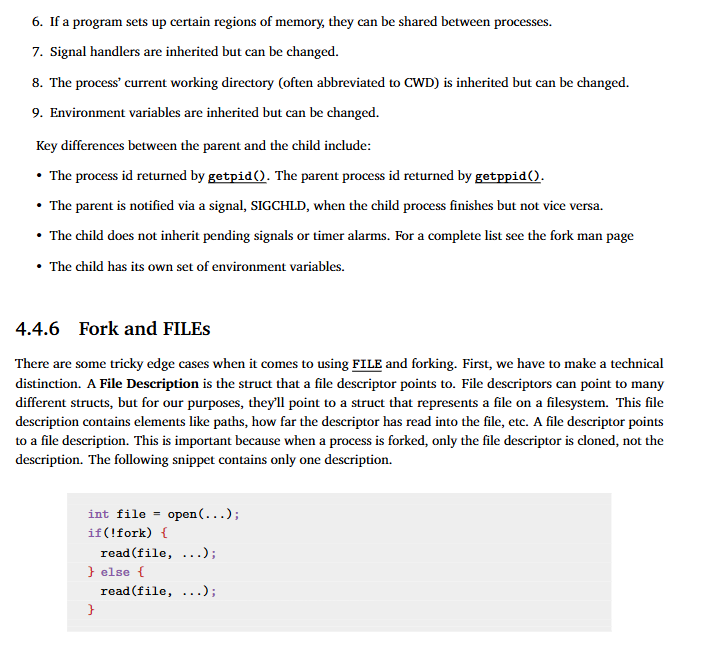

这页内容继续讲解 **`fork()` 的继承特性** 和 **`FILE`/文件描述符在 `fork()` 后的行为**，这是理解进程如何共享/隔离文件操作的关键。

------

## **第6-9点：`fork()` 后子进程继承的其他内容**

### **6. 共享内存区域：**

如果父进程提前映射了共享内存（如通过 `mmap()`），则父子进程都可以访问。

### **7. 信号处理函数（Signal Handlers）：**

父进程安装的信号处理器会被子进程继承，但子进程可以自行修改。

### **8. 当前工作目录（CWD）：**

父子进程初始目录相同（即父进程 `chdir` 的效果对子有效），但之后可以各自改变。

### **9. 环境变量：**

父进程的环境变量会复制给子进程（**值复制**，**地址不共享**），所以子进程修改不会影响父进程。

------

## **父子进程之间的关键区别：**

- **PID / PPID：**
  - 子进程的 PID 由 `getpid()` 获取；
  - 父进程通过 `getppid()` 获取其父 PID（通常是自己创建的子进程）。
- **SIGCHLD 通知：**
  - 当子进程结束时，系统向父进程发送 `SIGCHLD` 信号；
  - 但子进程不会自动知道父进程终止。
- **不继承挂起信号或定时器：**
  - 子进程不会自动收到父进程中尚未处理的信号或定时任务。
- **环境变量是复制的：**
  - 父子拥有各自的一套环境变量空间。

------

## **4.4.6 Fork and FILEs：fork 后文件描述符的行为**

### **核心概念：File Descriptor vs File Description**

| 名称                 | 含义                                             |
| -------------------- | ------------------------------------------------ |
| **File Descriptor**  | 程序中看到的数字句柄（如 `fd=3`）                |
| **File Description** | 该描述符指向的底层结构，包括路径、偏移量、权限等 |

> 当你 `fork()` 一个进程时，**File Descriptor 是复制的**，但它们 **都指向同一个 File Description**。因此**读写位置是共享的**。

------

### **代码示例：**

```c
int file = open(...);      // 打开文件，获得文件描述符 fd

if (!fork()) {
    read(file, ...);       // 子进程读取文件
} else {
    read(file, ...);       // 父进程读取文件
}
```

- 两个 `read(file,...)` 其实共享一个底层文件状态（偏移量等）；
- **如果父进程先读了一段内容，子进程读取的位置就会跟着改变**；
- 这会引发数据错位、重复读或漏读，除非使用 `lseek()` 分别设置偏移。

------

## **总结重点：**

| 行为                             | 是否共享                        |
| -------------------------------- | ------------------------------- |
| 文件描述符编号                   | 否（子进程有独立 `fd` 数字）    |
| 文件描述符底层信息（偏移、路径） | 是                              |
| 文件读写位置                     | 是，除非使用 `dup()` 或重新打开 |
| 环境变量                         | 否（复制值，但独立）            |

------

如果你希望我画出 File Descriptor 与 File Description 的关系图，或者展示父子进程同时读取文件的冲突实例，也可以继续为你拓展。是否继续？