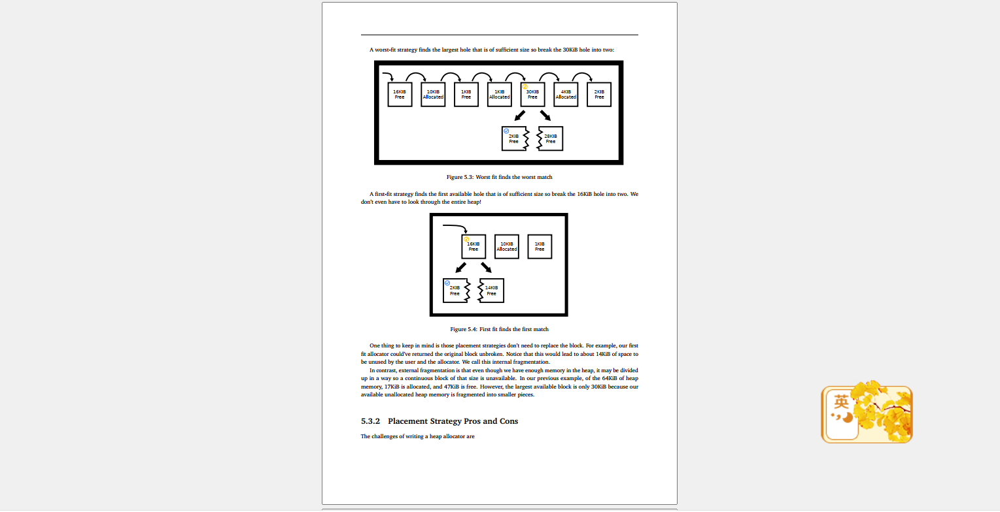

这张图片讲的是一个非常微妙但重要的**文件与 fork() 的交互问题**，特别是**fork 前后文件指针的共享行为，以及如何安全地管理文件描述符（FILE\*）**。我们来详细逐行解析并说明其中的问题和解决方案。

------

## ✅ 图片代码总结与解释

### 📄 假设的文件内容：

```bash
$ cat test.txt
A
B
C
```

------

## 🔍 第一段有问题的代码解释

```c
size_t buffer_cap = 0;
char * buffer = NULL;
ssize_t nread;
FILE * file = fopen("test.txt", "r");
int count = 0;

while ((nread = getline(&buffer, &buffer_cap, file)) != -1) {
    printf("#%s", buffer);
    if (fork() == 0) {
        exit(0);
    }
    wait(NULL);
}
```

### 表面上看：

程序逐行读取 `test.txt`，每读取一行就输出，加上一个 `#` 前缀，并 fork 一个子进程（它什么也不干就 exit）。

------

### 实际上：

这个代码行为是 **未定义的（undefined behavior）**！

因为它在使用 `FILE *` 时没有妥善处理 **fork 后父子进程共享的文件状态**。

------

## 🚨 为什么会有问题？

### 🎯 原因在于：**`FILE \*` 是带缓冲的（buffered）结构体**

`FILE * file` 是一个标准 I/O 流（如 `fopen()` 打开的），它内部维护了：

- 文件描述符（fd）
- 缓冲区（buffer）
- 读取进度、文件位置指针
- 锁、状态等

#### ➤ 在 `fork()` 之后：

- **父子进程都共享文件描述符（fd），但拥有各自独立的 `FILE \*` 缓冲状态**。
- 如果你没在 fork 之前 `fflush()` 或关闭文件，就会导致：
  - 父子进程都以为自己“接着读下一行”，结果读取错乱或重复。
  - 子进程可能读取了同一行或跳过行，甚至父子同时读取，结果不可预知。
  - > #### 1. 文件描述符（fd）
    >
    > - 是内核中的资源句柄。
    > - 每个文件描述符对应一个 **打开文件表项**，其中包括文件偏移（file offset）等信息。
    > - **在 `fork()` 后，父子进程会共享这些打开文件表项**，也就是共享同一个 offset。
    >
    > #### ✅ 2. `FILE *` 是 C 标准库中的抽象
    >
    > - 是对 fd 的**包装**，包括：
    >   - 自己的一套**缓冲区**
    >   - 一些状态变量（例如 EOF、错误码等）
    > - `FILE *` 的偏移其实是依赖底层 fd 的偏移 + 缓冲区的读取/写入位置。
    > - **fork 后，`FILE \*` 被复制**（浅拷贝），父子各自持有一份，互不影响。
    > - 

------

## 😵‍💫 示例行为（未定义的结果）可能包括：

- 某一行打印两次（父子都读了）
- 某一行被跳过（父读完，子又从缓冲区之后开始）
- 文件读错位，文件描述符位置被多个进程修改，混乱

------

## ✅ 如何修复？

### 官方建议（见下半部分说明）：

1. **在 fork() 之前刷新（flush）所有 `FILE \*` 缓冲区**，即调用：

   ```c
   fflush(file);
   ```

2. 或者更干脆：**使用低级文件描述符 `int fd = open(...)` + `read()`**，这种是无缓冲的，更安全（但复杂）。

3. 或者改进为如下形式（fork 后不再读文件）：

```c
size_t buffer_cap = 0;
char * buffer = NULL;
ssize_t nread;
FILE * file = fopen("test.txt", "r");
int count = 0;

while ((nread = getline(&buffer, &buffer_cap, file)) != -1) {
    printf("#%s", buffer);
}
```

------

## 📋 图片下方英文总结要点翻译：

1. **你要保证所有的文件描述符在 fork 前准备好**（flush 或关闭）。
2. **裸的文件描述符或无缓冲 FILE\* 是安全的**。
3. **文件打开且读完则默认准备好**（缓冲区为空）。
4. 否则，必须 `fflush()`。
5. 如果父子进程都使用同一个文件描述符而没协调好，结果就可能**未定义**。

------

## 🧠 总结一句话：

> **在使用 `fork()` 之前，必须处理好文件的缓冲状态，否则父子进程可能混淆文件的读写位置，导致数据错误或未定义行为。**

------

需要我给你写一个完整的修复版本代码示例，或者画一张 fork 前后文件状态示意图，帮助你理解更直观吗？


好的！我来帮你逐句**中英文互译+详细解释**，让你可以清楚地讲解给学生听。我们分为三部分：

------

## 🧠 一、代码块讲解（fork、wait、waitpid）

### **原始代码块 1：**

```c
fflush(file);
if(fork() == 0) {
    exit(0);
}
wait(NULL);
```

### ✅ 中文翻译：

```c
fflush(file); // 刷新文件缓冲区
if(fork() == 0) { // 如果是子进程
    exit(0);      // 子进程立即退出
}
wait(NULL); // 父进程等待子进程结束
```

### 🔍 详细解释：

- `fflush(file)`：**确保文件内容从内存写入到磁盘**，防止因缓冲区没清空导致数据丢失。
- `fork()`：创建子进程。返回值为0表示在子进程中。
- `exit(0)`：子进程什么也不做，直接退出。
- `wait(NULL)`：父进程**阻塞**，等待子进程退出，避免形成“僵尸进程”。

> **What if the parent process and the child process need to perform asynchronously and need to keep the file handle open?**

**如果父进程和子进程都需要**并发执行（异步地做各自的事），**而且又都要保持文件句柄（file handle）是打开的，怎么办？**

> **Due to event ordering, we need to make sure that parent process knows that the child is finished using `wait`.**

**由于事件的顺序性（比如父子谁先完成，谁先退出的问题），我们需要确保父进程知道子进程什么时候结束。**
 为此我们可以使用 `wait()` 系统调用，**让父进程等待子进程结束。**

> **We'll talk about Inter-Process communication in a later chapter, but now we can use the double fork method.**

**关于进程间通信（IPC）的内容我们将在后面章节详细讲，但现在我们可以使用“双重 fork（double fork）”的方法来解决这个问题。**

------

## 🧠 二、改进版代码（双fork解决异步+文件描述符问题）

### ✅ 中文翻译与解释：

```c
fflush(file); // 刷新文件缓冲区，防止父子进程共享脏数据

pid_t child = fork(); // 父进程创建一个子进程（child）

if(child == 0) { // 这是在子进程中
    fclose(file); // 子进程关闭文件，避免之后子孙进程误操作文件

    if(fork() == 0) { // 子进程再次 fork，生成孙子进程（做异步任务）
        // 执行异步任务，比如网络请求、后台计算等
        // 这个孙子进程对文件描述符毫无感知（之前已经被关闭）
        exit(0); // 异步任务完成后退出
    }

    exit(0); // 子进程不再参与异步任务，立即退出
}

waitpid(child, NULL, 0); // 父进程等待子进程退出（不等待孙子进程）
```

### 💡 讲解重点（给学生）：

1. **为什么双 fork？**
   - 因为我们希望做异步任务，但又不希望父进程被阻塞。
   - 使用双 fork 技巧可以让孙子进程“脱离”父进程，成为后台任务。
2. **fclose(file) 为什么重要？**
   - 防止子进程或孙子进程还保留文件描述符，导致写文件重复或错误。
   - 类似于“一人一把钥匙”，不清除会有安全风险。
3. **为什么 waitpid 只等 child，不等孙子？**
   - 孙子进程由操作系统 `init` 管理，不影响我们主流程。

------

## 🧠 三、4.5 节正文讲解 “Waiting and Executing”

### 📌 英文原文节选：

> If the parent process wants to wait for the child to finish, it must use `waitpid` (or `wait`), both of which wait for a child to change process states, which can be one of the following:
>
> 1. The child terminated
> 2. The child was stopped by a signal
> 3. The child was resumed by a signal

### ✅ 中文翻译：

> 如果父进程想等待子进程完成，必须使用 `waitpid()`（或 `wait()`），它们会等待子进程发生“状态变化”。这些状态变化包括：
>
> 1. 子进程终止（正常退出或异常退出）
> 2. 子进程被某个信号暂停（比如 Ctrl+Z）
> 3. 子进程被信号恢复（比如 `SIGCONT`）
>
> 

------

### 📌 补充说明：

> Note that `waitpid` can be set to be non-blocking, which means they will return immediately, letting a program know if the child has exited.

### ✅ 中文翻译：

> 注意：`waitpid()` 可以设置为**非阻塞**（non-blocking）模式。也就是说，它会**立即返回**，不会卡住程序，可以用来**检查子进程是否结束**。

------

## 🧾 总结给学生的话术：

> 在 Unix/Linux 系统中，一个进程使用 `fork()` 复制出一个子进程。当你希望子进程执行完之后再继续执行父进程的内容，就要用 `wait()` 或 `waitpid()` 等待它。
>
> 但如果你想让子进程执行一些**异步任务**，而父进程立刻继续自己的逻辑，就可以用“双 fork 技巧”：子进程再 fork 出一个孙子进程，让孙子继续执行任务，而子进程立即退出，这样父进程就不会阻塞太久。
>
> 同时别忘了：子进程如果继承了文件描述符，可能会影响文件的写入。所以一定要记得 `fclose()`！

------

如果你需要 PPT、黑板板书、示意图或者思维导图来辅助教学，我也可以帮你生成！需要吗？


非常好！这页内容继续讲解的是 `fork()`、`waitpid()` 和子进程的**退出状态码（exit status）获取机制**，是操作系统或系统编程中极其重要的一环。下面我会**逐段进行中英对照翻译+详细解释**，方便你直接讲给学生听。

------

## 📘 1. 代码讲解：子进程退出状态的获取

### ✅ 中文翻译与讲解：

```c
pid_t child_id = fork(); // 创建一个子进程
if (child_id == -1) {
    perror("fork"); // fork失败，输出错误
    exit(EXIT_FAILURE); // 退出并返回失败
}
if (child_id == 0) {
    // 这是父进程，因为 child_id > 0
    int status;
    waitpid(child_id, &status, 0); // 等待子进程退出，并将其退出状态放入 status
    // 下面可以从 status 中提取子进程返回值（exit status）
} else {
    // 这是子进程，因为 child_id == 0
    // 执行某些计算
    exit(123); // 返回值为 123（随意写的一个例子）
}
```

------

## 📘 2. 概念解释（中英互译）

### **英文原文：**

> `wait` is a simpler version of `waitpid`. `wait` accepts a pointer to an integer and waits on any child process.

### **中文解释：**

- `wait()` 是 `waitpid()` 的简化版。
- 它只能等待**任意一个子进程**结束，并把退出状态放入传入的整型指针中。
- `waitpid()` 更强大，可以指定要等待的**特定子进程**，还能设置更多选项。

------

### **英文原文：**

> Here is the behavior of `waitpid`:

> 1. A program can wait on a specific process, or it can pass in special values for the pid to do different things.

### ✅ 中文翻译：

1. 程序可以通过 `waitpid()` 等待一个**指定的进程**，也可以通过特殊的 `pid` 值实现不同功能（见 man 手册）。

> 1. The last parameter to `waitpid` is an option parameter.

> Options:

- `WNOHANG`: 不阻塞，如果没有子进程退出就立即返回；
- `WUNTRACED`: 等待也被信号中断的子进程；
- `WEXITED`: 等待正常退出的子进程；
- `WSTOPPED`: 等待暂停（stopped）的子进程；
- `WCONTINUED`: 等待继续运行（continued）的子进程。

------

## 🧪 3. 子进程退出状态码详解（Exit Status）

### **英文原文：**

> Exit statuses or the value stored in the integer pointer for both of the calls are explained below.

> To find the return value of `main()` or value included in `exit()` from a child process, use the **Wait macros**: typically, `WIFEXITED()` and `WEXITSTATUS()`.

------

### ✅ 中文解释：

如果你想知道子进程是怎么退出的，有没有正常结束，以及它 `exit()` 返回了什么值，可以用两个宏：

| 宏函数名              | 含义说明                       |
| --------------------- | ------------------------------ |
| `WIFEXITED(status)`   | 判断子进程是否是**正常退出**   |
| `WEXITSTATUS(status)` | 获取 `exit()` 返回的**具体值** |

------

## 📘 4. 最后一段代码讲解（完整获取退出码）

### ✅ 中文翻译与详细讲解：

```c
int status;
pid_t child = fork(); // 创建子进程
if (child == -1) {
    return 1; // 创建失败
}
if (child > 0) {
    // 父进程部分：等待子进程结束
    pid_t p = waitpid(child, &status, 0); // status 会记录退出信息
    if (p != -1 && WIFEXITED(status)) {
        // 如果成功等待并且子进程正常退出
        int exit_status = WEXITSTATUS(status); // 取出 exit 返回的值
        printf("Process %d returned %d\n", pid, exit_status); // 打印退出码
    }
}
```

------

## 📚 教学建议总结（可用于课堂讲解）

🧑‍🏫 你可以这样讲给学生听：

1. 操作系统中每个进程都有一个退出码（exit status），可以通过 `exit(x)` 设置。
2. 父进程可以使用 `wait()` 或 `waitpid()` 等待子进程结束，并获取这个退出码。
3. `waitpid()` 更灵活，可以指定哪个子进程、要不要阻塞、还可以处理各种状态。
4. 状态值保存在一个 `int status` 中，**不是直接数字**，而是包含多个信息的编码，所以需要用宏函数解码：
   - `WIFEXITED(status)` 检查是否正常退出；
   - `WEXITSTATUS(status)` 提取出 `exit(x)` 中的 `x`。
5. 实际开发中，父进程一般会记录子进程的退出情况，便于日志分析、异常处理等。

------

需要我再帮你把这两页内容整理成一张讲课用的图文 PPT 或板书结构吗？也可以做成知识导图哦~


非常棒！这页内容是对 **子进程退出状态解析** 以及 **“僵尸进程（Zombie）”与“孤儿进程（Orphan）”** 的深入讲解。

我将内容分成两部分为你做出完整的**中英互译 + 原理解析 + 教学讲解建议**，适合你直接对学生教学使用。

------

## 🧠 第 1 部分：exec() + 退出状态信息编码（Exit Code Bit Layout）

------

### ✅ 代码片段（子进程替换为 ls 命令）

```c
execl("/bin/ls", "/bin/ls", ".", (char *) NULL); // "ls ."
```

### 🔍 中文解释：

- 这表示子进程会被替换为执行 `/bin/ls .` 命令，列出当前目录内容。
- `execl()` 会**用新程序覆盖当前进程映像**，原程序的代码不再执行。

------

### ✅ 英文原文翻译与详细解释：

#### 英文原文：

> A process can only have 256 return values, the rest of the bits are informational...

#### 中文翻译：

- 一个进程的退出状态只能有 256 种（即 0–255），因为 exit code 只能返回 8 位值（1 个字节）。
- 状态值的其他位用于传递附加信息，比如是否是被信号杀死的、是否被暂停等。
- 内核会通过位运算（bit shifting）来封装这些状态，而我们通过宏函数来提取。

------

### 🧾 举例讲解给学生：

> 当你调用 `waitpid()` 得到一个 `status`，其实这个整数不仅包含退出码，还可能包含子进程是否被信号杀死、中断或暂停的状态。我们通过宏函数（如 `WIFEXITED()`、`WEXITSTATUS()`）来提取这些信息。

------

### ✅ 宏定义解释（翻译+注释）

| 宏名称           | 英文含义                       | 中文说明               |
| ---------------- | ------------------------------ | ---------------------- |
| `_WSTATUS(x)`    | 取出低 8 位（退出码）          | 提取 `exit()` 的返回值 |
| `WIFSTOPPED(x)`  | 是否被信号暂停                 | 例如 Ctrl+Z            |
| `WSTOPSIG(x)`    | 如果暂停，哪一个信号造成的     |                        |
| `WIFSIGNALED(x)` | 是否被信号杀死（如 `kill -9`） |                        |
| `WTERMSIG(x)`    | 被哪个信号杀死                 |                        |
| `WIFEXITED(x)`   | 是否是调用 `exit()` 正常退出   |                        |

------

## 🧠 第 2 部分：4.5.2 Zombies and Orphans（僵尸与孤儿进程）

------

### ✅ 英文原文翻译与解释：

> It is good practice to wait on your process’ children...

### ✅ 中文翻译 + 精讲：

- **父进程如果不等待子进程（不调用 `wait()` / `waitpid()`），子进程退出后就变成了“僵尸进程（Zombie）”。**
  - 僵尸进程只是留了一个“壳”，占用进程表项，不会消失，容易导致系统资源耗尽。
  - 只有父进程调用 `wait()` 取走它的退出码，这个进程才会完全清除。
- **孤儿进程（Orphan）：**
  - 如果父进程先结束，子进程还在运行，就变成了“孤儿进程”。
  - 孤儿进程会被操作系统中的 “init” 进程收养。
  - `init` 会自动调用 `wait()` 清理这些孤儿子进程，防止变成僵尸。

------

### 🧾 举例讲解学生更容易懂：

👩‍🏫 你可以这么讲：

- 假设你开了一个子进程去打印文件，然后你不等它执行完就关机了（没有调用 `wait()`），这个子进程虽然已经完成了工作，但它的信息还“挂在”系统中，没有清除，变成了**僵尸**。
- 如果你是那个先死掉的家长（父进程先退出），那小孩（子进程）会被“街道办”（系统的 `init`）收养，最终也会被清理。

------

## ✅ 总结性中文讲解（可直接课堂使用）：

> 1. 子进程结束时会返回一个状态码，这个状态不仅有 `exit()` 返回的值，还有是否被信号终止或暂停的信息。
> 2. `wait()` 和 `waitpid()` 是父进程用来**清除子进程**和获取状态的方式。
> 3. 如果不这样做，子进程变成“僵尸进程”，会占用系统资源，危害系统稳定性。
> 4. 如果父进程比子进程先退出，子进程变成“孤儿”，会被 `init` 进程收养并正确清理。

------

需要我把这页内容做成**图示流程图**、PPT 页面或课堂小测题，来辅助你讲解这部分吗？我可以帮你整理成完整教案形式。


这页内容讲的是**进阶的异步等待（Advanced: Asynchronously Waiting）**，也就是如何使用信号机制（signal）来优雅处理子进程结束事件，避免僵尸进程。你讲课时可以围绕 **信号处理（Signal Handling）** + **异步等待原理** 来展开。

我将内容分成**3段**来中英翻译和讲解，方便你直接讲给学生听。

------

## 🔧 第 1 部分：用 `SIGCHLD` 信号异步清理子进程

------

### ✅ 英文原文：

> The parent gets the signal SIGCHLD when a child completes...

### ✅ 中文翻译：

父进程在子进程退出时会收到一个 `SIGCHLD` 信号。我们可以注册一个信号处理函数（signal handler）来响应这个信号并调用 `waitpid()` 清理子进程（防止变成僵尸）。

------

### ✅ 代码解释（中英讲解）：

```c
pid_t child;

void cleanup(int signal) {
    int status;
    waitpid(child, &status, 0); // 等待指定子进程退出并清理
    write(1, "cleanup!\n", 9);  // 写输出（使用 write 而不是 printf）
}

int main() {
    signal(SIGCHLD, cleanup); // 注册 SIGCHLD 的信号处理函数

    child = fork(); // 创建子进程
    if (child == -1) { exit(EXIT_FAILURE); }

    if (child == 0) {
        // 子进程：执行后台任务
    } else {
        // 父进程
        sleep(4); // 等待清理消息输出
        puts("Parent is done"); // 输出结束
    }

    return 0;
}
```

------

### 🧠 教学提示（对学生讲）：

- `SIGCHLD` 是子进程退出时系统发给父进程的信号。
- `signal(SIGCHLD, cleanup)` 注册了一个清理函数 `cleanup`，在收到这个信号时自动执行。
- 注意：信号处理函数是**异步执行**的！需要小心数据一致性问题。
- `write()` 更适合在信号处理函数中使用（`printf()` 不是异步安全）。

------

## ⚠️ 第 2 部分：上面的做法有几个问题

------

### ✅ 英文原文摘要：

> The above example misses a couple of subtle points...

### ✅ 中文翻译与讲解：

1. **多个子进程同时退出，只触发一次 SIGCHLD**：
   - 信号不会排队，所以如果两个子进程几乎同时退出，可能漏掉其中一个的清理。
2. **`SIGCHLD` 不仅代表退出，也可能是子进程被暂停（如 Ctrl+Z）**：
   - 所以不能仅靠收到 `SIGCHLD` 就认为子进程退出。
3. **使用的是旧的 `signal()` 接口**：
   - 更推荐用 `sigaction()`，更安全、更灵活。

------

## ✅ 第 3 部分：更健壮的异步清理方式

------

```c
void cleanup(int signal) {
    int status;
    while (waitpid((pid_t)(-1), &status, WNOHANG) > 0);
}
```

### ✅ 中文翻译与讲解：

```c
void cleanup(int signal) {
    int status;
    // 循环等待所有已经结束的子进程（非阻塞方式）
    while (waitpid(-1, &status, WNOHANG) > 0);
}
```

- `-1`：表示等待**任意子进程**。
- `WNOHANG`：非阻塞模式，如果没有子进程退出就立即返回。
- 这个写法能避免僵尸进程，即使有多个子进程同时退出。

------

## 🧾 教学总结建议（课堂话术）：

> 同学们，处理子进程退出的一个现代方法是使用信号 `SIGCHLD`。当子进程退出时，系统会自动通知父进程。
>
> 我们可以注册一个**信号处理函数**来异步清理子进程，防止它们变成“僵尸进程”。
>
> 但需要注意：信号不是排队的，如果多个子进程几乎同时退出，只有一个 `SIGCHLD` 被发送。因此我们在处理函数中需要用 `while (waitpid(-1, ..., WNOHANG))` 的方式**循环清理所有已退出的子进程**。
>
> 最后，我们要用 `sigaction()` 来替代旧式的 `signal()`，让程序更可靠。

------

如果你希望我帮你把这页内容做成教学**PPT、流程图、板书结构图、练习题**等形式，也可以告诉我，随时可以输出！


非常好！这一页是第 4.6 节，主题是 **exec 系列函数的使用（exec）**，讲解如何通过 `exec` 系列函数在子进程中执行另一个程序，比如运行 `ls`。

我会为你分段进行**中英文对照翻译 + 原理讲解 + 课堂讲解建议**，帮助你讲清楚这页内容。

------

## 🧠 第 1 部分：exec 的定义和作用

------

### ✅ 英文原文：

> To make the child process execute another program, use one of the `exec` functions after forking...

### ✅ 中文翻译：

要让子进程执行另一个程序，可以在 `fork()` 之后调用 `exec` 系列函数。

- `exec` 会用新程序的代码**完全替换**当前进程的代码和内存空间。
- 所以，**`exec` 之后的代码不会再执行**（除非失败）。
- 常用来让子进程替换为新的命令，如执行 `ls`、`gcc` 等。

------

### 🔍 举例讲解：

> `fork()` + `exec()` 是经典组合：先复制一个子进程，再让它去做新的事。

比如：

```c
pid = fork();
if (pid == 0) {
    execl("/bin/ls", "ls", "-alh", NULL);
}
```

表示：父进程继续原来的逻辑，子进程去执行 `ls -alh`。


------

## 🧠 第 2 部分：exec 的变体说明

------

### ✅ 原文翻译：

1. `e` — 使用环境变量数组 `envp[]` 显式传给新程序（如 `execle`）
2. `l` — 命令行参数一个个单独传入（如 `execl`）
3. `p` — 通过环境变量 PATH 查找程序（如 `execlp`）
4. `v` — 命令行参数通过数组传入（如 `execv`）

------

### ✅ 中文口诀教学：

你可以这样教学生记：

- **`l` 是 list（逐个参数）**
- **`v` 是 vector（数组形式）**
- **`p` 是 path（自动找路径）**
- **`e` 是 env（传入环境变量）**

------

## 🧠 第 3 部分：代码例子解析（执行 ls 命令）

------

### ✅ 代码（逐行解释）：

```c
#include <unistd.h>
#include <sys/types.h>
#include <sys/wait.h>
#include <stdlib.h>
#include <stdio.h>

int main(int argc, char* argv[]) {
    pid_t child = fork(); // 创建子进程
    if (child == -1) return EXIT_FAILURE;

    if (child) {
        // 父进程等待子进程结束
        int status;
        waitpid(child, &status, 0);
        return EXIT_SUCCESS;
    } else {
        // 子进程调用 exec 替换自己
        execl("/bin/ls", "/bin/ls", "-alh", (char *) NULL);
        // 如果 exec 成功，这一行不会执行
        perror("exec failed!");
    }
}
```

------

### ✅ 中文说明：

- `execl("/bin/ls", "/bin/ls", "-alh", NULL)`：
  - 执行 `/bin/ls` 命令
  - 第一个参数是程序路径
  - 第二个参数是命令行中显示的程序名（`argv[0]`）
  - 后面是传给该命令的参数（这里是 `-alh`）
  - 最后必须用 `NULL` 结尾
- 如果 `exec` 成功：当前进程就变成 `ls`，不会再返回。
- 如果 `exec` 失败：继续执行后面的 `perror()`，输出错误。

------

## 📘 补充教学建议（课堂话术）：

> 同学们，在 Linux 下进程可以通过 `exec` 家族函数来**变身**为另一个程序。
>
> 比如你开了一个子进程，想让它不做原来父进程的事，而是去执行一个新的命令，比如 `ls`、`ps` 或者你自己写的程序，那就可以用 `exec()`。
>
> 注意：`exec` 不会返回！它会彻底把当前进程的代码段、数据段都替换掉。如果你看到 `exec()` 后的代码还能执行，那说明它失败了。

------

## 📌 重点复习知识点：

| 点             | 内容                                |
| -------------- | ----------------------------------- |
| `fork()`       | 创建子进程                          |
| `exec*()`      | 用另一个程序替换当前进程            |
| `waitpid()`    | 父进程等待子进程退出                |
| `execl()`      | 参数逐个传递，适合少量参数          |
| `execv()`      | 参数数组传递，适合不定长参数        |
| `exec*()` 成功 | 永不返回，子进程变成了新程序        |
| `exec*()` 失败 | 返回 -1，可通过 `perror()` 打印原因 |

------

需要我把这页内容整理成 PPT、流程图、思维导图或小练习题辅助教学吗？随时为你生成！


很好！这页继续讲解 `exec` 的高级用法，展示了如何使用 `exec` 配合文件描述符和 `chdir()` 改变进程行为，还附带了 `POSIX exec` 的语义细节说明。

我将内容分成两个部分，为你进行**中英文对照翻译 + 细节解释 + 课堂讲解建议**，帮助你讲清楚这页内容。

------

## 🧠 第 1 部分：示例代码解析 —— 文件重定向 + chdir + exec

------

### ✅ 示例代码分析：

```c
#include <unistd.h>
#include <fcntl.h> // O_CREAT, O_APPEND 等定义在这里

int main() {
    close(1); // 关闭标准输出（stdout）

    open("log.txt", O_WRONLY | O_CREAT | O_APPEND, S_IRUSR | S_IWUSR);
    // 打开 log.txt，并将其分配为文件描述符 1（也就是 stdout）

    chdir("/usr/include"); // 切换工作目录

    execl("/bin/ls", "/bin/ls", ".", (char *) NULL); 
    // 执行 ls .，输出内容会写入 log.txt 中

    perror("exec failed!"); // 如果 exec 失败则打印错误信息
    return 0;
}
```

------


### ✅ 中文逐句讲解：

1. `close(1);`
    → 关闭标准输出。此时文件描述符 1（即 stdout）变成空闲。
2. `open(...)`
    → 重新打开文件 `log.txt`，系统会分配最低编号的可用文件描述符，也就是 `1`。
    → 所以之后的标准输出 `stdout` 就被**重定向到 log.txt**。
3. `chdir("/usr/include")`
    → 改变当前工作目录为 `/usr/include`，之后 `ls .` 会列出该目录内容。
4. `execl(...)`
    → 执行 `ls` 命令，把当前进程替换成 `ls`，输出写入 log.txt。
5. `perror(...)`
    → 如果 `exec` 失败，打印错误信息。

------

### ✅ 总结一句话：

> 这个程序会将 `/usr/include` 目录下的内容通过 `ls .` 输出到 `log.txt` 文件中。

------

### 👩‍🏫 教师课堂建议讲法：

> 我们可以通过 `close(1)` + `open(...)` 重定向 stdout，然后再用 `exec()` 启动一个新程序，比如 `ls`，从而把这个新程序的输出写到我们指定的文件中。这种技术在编写 shell、后台任务或日志记录程序时非常常见。

------

## 🧠 第 2 部分：4.6.1 POSIX Exec 语义细节说明

------

### ✅ 英文原文节选翻译 + 讲解：

> POSIX defines how exec works under the hood. Here are the main points:

------

### 🔢 细节 1：

**英文：**

> File descriptors are preserved after an exec...

**中文：**

- `exec` 调用后，**原来的文件描述符会被保留**，除非设置了 `FD_CLOEXEC` 标志。
- 例如：父进程打开了一个文件，`fork` 后子进程继承，再 `exec` 也不会关闭它。
- 如果你不想让这些描述符继续存在，应设置 `close-on-exec` 标志。

------

### 🔢 细节 2：

**英文：**

> Signal semantics...

**中文：**

- 执行 `exec` 后，**信号处理函数会被重置**。
- 原因是新程序的内存映像不同，不再共享信号处理逻辑。
- 注意：并非所有信号行为都保留（例如 `SIGCHLD` 处理器不会传过去）。

------

### 🔢 细节 3：

**英文：**

> Environment variables are preserved...

**中文：**

- 环境变量（如 PATH、HOME 等）会被保留，除非你使用 `execve()` 明确指定新的环境变量数组。

------

### 🔢 细节 4：

**英文：**

> The OS may close open descriptors 0, 1, 2...

**中文：**

- 如果标准输入/输出/错误（fd 0、1、2）在执行 `exec` 前被关闭了，新的程序可能在这些位置分配新的 fd，可能导致输入输出行为异常。

------

### 🧾 教师课堂总结：

你可以这样总结讲给学生：

> 执行 `exec` 虽然看起来像“启动一个新程序”，但它继承了很多“老进程”的信息，比如：
>
> - 打开的文件不会自动关闭；
> - 环境变量会保留；
> - 一些信号会被重置（因为程序换了）；
>
> 所以写程序时，一定要清楚 exec 后 **什么会保留，什么会丢失**，才能避免 bug，比如写日志、做重定向、构造 daemon（守护进程）时都要注意这些行为。

------

需要我把这页内容整理成图示讲义、课堂练习或板书结构图，帮助你课堂展示更清晰吗？随时可以！


当然可以，下面是对你给出的两句话的详细解释，并提供**逐句中英互译**、术语说明及背景补充，帮助你彻底理解：

------

### 🟠 第一句

**英文原文：**

> 5. The executed process runs as the same PID and has the same parent and process group as the previous process.

**中文翻译：**

> 5. 被执行的进程具有与原进程相同的 PID（进程ID）、相同的父进程和相同的进程组。

------

#### ✅ 详细解释：

这句话描述的是 **`exec` 系列函数（如 `execl`、`execv`）调用后的行为**：

- 在 Unix/Linux 中，调用 `exec()` 并不会创建新进程。
- 它只是 **用新的程序“替换”当前进程的内容**。
- 所以：

| 特性                    | 保持不变 | 说明             |
| ----------------------- | -------- | ---------------- |
| PID（进程号）           | 是       | 没有创建新进程   |
| Parent（父进程）        | 是       | 还是原来的父进程 |
| Process Group（进程组） | 是       | 所属进程组不变   |

##### 举个例子：

```c
int main() {
    printf("PID before exec: %d\n", getpid());
    execl("/bin/ls", "ls", NULL);
    // 如果 exec 成功，这之后的语句不会再执行
}
```

运行前后，`ls` 命令进程用 **当前进程替代自己**，所以 PID 和父进程保持不变。

------

### 🟢 第二句

**英文原文：**

> 6. The executed process is run on the same user and group with the same working directory.

**中文翻译：**

> 6. 被执行的进程在相同的用户与用户组权限下运行，且工作目录也保持不变。

------

#### ✅ 详细解释：

继续讲 `exec()` 特性——虽然程序内容被换掉了，但运行环境中的 **部分信息仍然保持不变**，包括：

| 属性          | 保持不变 | 说明                                |
| ------------- | -------- | ----------------------------------- |
| 用户（UID）   | 是       | 仍然是原来的用户身份                |
| 用户组（GID） | 是       | 所属的组也不变                      |
| 工作目录      | 是       | `getcwd()` 得到的当前目录还是原来的 |

##### 这意味着：

- 执行权限、访问文件权限仍由原来的用户决定；
- 如果原进程在 `/home/user/` 目录中执行，那么新程序也在这个目录下运行；
- 如果新程序依赖某个路径或配置文件，它仍然可以正常访问。

------

### 🔍 总结对比（中英表格）

| 英文内容               | 中文解释           | 说明                   |
| ---------------------- | ------------------ | ---------------------- |
| Same PID               | 相同的进程号       | 表明不是新创建的进程   |
| Same parent            | 相同的父进程       | 不会重新建立父子关系   |
| Same process group     | 相同的进程组       | 控制终端等逻辑保持一致 |
| Same user & group      | 相同的用户与用户组 | 权限不发生改变         |
| Same working directory | 相同的工作目录     | 当前路径不变           |

------

如果你需要，我也可以帮你画一张流程图来直观展示 `exec()` 之后哪些会保留、哪些会被替换。是否需要？

------

### ✅ 第一部分：4.6.2 Shortcuts（快捷方式）

### ✅ 第二部分：4.7 The fork-exec-wait Pattern（fork-exec-wait 编程模式）

我将依次为你**中英互译 + 代码解释 + 教学讲法总结**，方便你讲给学生听。

------

## 🧠 第一部分：4.6.2 Shortcuts — 使用 `system()` 作为快捷方式

------

### ✅ 示例代码：

```c
#include <unistd.h>
#include <stdlib.h>

int main(int argc, char* argv[]) {
    system("ls"); // 执行 shell 命令，相当于 exec("/bin/sh", "-c", "ls", NULL)
    return 0;
}
```

------

### ✅ 中文解释：

- `system("ls");` 实际上：
  - 内部会调用 `fork()` 创建一个子进程；
  - 子进程再执行 `/bin/sh -c "ls"`；
  - 等待子进程执行完毕（**阻塞型调用**）。

------

### ✅ 英文原文翻译与讲解：

> `system()` 会自动帮我们完成 `fork()` → `exec("/bin/sh", "-c", "...")` → `wait()` 这三件事。

- 这使得它很方便，但是有几个问题：
  1. **阻塞**：父进程必须等待命令完成才能继续执行；
  2. **调用 `/bin/sh` 开销大**：比直接用 `exec` 多一层 shell；
  3. **安全性问题**：如果传入的命令字符串来自用户输入，可能被注入恶意代码（如 `"; sudo rm -rf /"`）。

------

### ✅ 教学总结讲法：

👩‍🏫你可以这样讲：

> 如果你只是想快速执行个命令，比如 `ls` 或 `mkdir`，用 `system()` 很方便。但如果你关心**安全性、效率、可控性**，建议学会用 `fork()` + `exec()` + `wait()` 这种标准组合。比如做 shell、守护进程、任务调度时，直接用 `exec` 更稳更安全。

------

## 🧠 第二部分：4.7 The fork-exec-wait Pattern（标准进程控制模式）

------

### ✅ 英文原文翻译：

> A common programming pattern is:
>
> 1. `fork()`：父进程创建一个子进程；
> 2. 子进程使用 `exec()` 执行新程序；
> 3. 父进程使用 `wait()` 或 `waitpid()` 等待子进程退出。

------

### ✅ 中文总结：

这种三步模式就是经典的：

```c
fork → exec → wait
```

- `fork()` 创建子进程；
- 子进程 `exec()` 执行外部命令（替换自己）；
- 父进程 `wait()` 等待它执行完毕。

------

### ✅ 教师课堂讲法建议：

> 同学们，在 Unix 编程中，处理子进程最常见的写法就是 “**fork-exec-wait**” 三部曲：
>
> 1. `fork()` 复制出一个子进程；
> 2. 子进程调用 `exec()`，去执行新程序；
> 3. 父进程使用 `waitpid()` 等待子进程结束，避免僵尸进程。
>
> 这个模式是构建 shell、调度器、守护进程等的**基础骨架**，一定要熟练掌握！

------

### ✅ 示例对比图（讲解建议）：

| 方法                 | 本质调用                                   | 优点               | 缺点                   |
| -------------------- | ------------------------------------------ | ------------------ | ---------------------- |
| `system("cmd")`      | fork + exec("/bin/sh", "-c", "cmd") + wait | 简单、快速         | 慢、安全性差、不能控制 |
| `fork + exec + wait` | 手动写出流程                               | 灵活、安全、可控制 | 稍复杂，但是专业写法   |

------

需要我为你将这部分做成讲义 PDF、PPT 幻灯片或小练习题辅助你授课吗？也可以将 fork-exec-wait 画成流程图帮学生更好理解。随时告诉我！


非常好！这一页继续讲解经典的进程控制模式 **fork → exec → wait**，并引入了**环境变量（Environment Variables）**的概念。

我将内容分为两部分，逐段为你进行中英互译 + 细致解释，方便你直接讲给学生听。

------

## 🧠 第 1 部分：Fork → Exec → Wait 模式图解与代码讲解

------

### ✅ 图示说明：

图中箭头清晰展示了标准的进程创建和控制流程：

- **父进程**先执行 `fork()` 创建子进程；
- **子进程**执行 `exec()`，加载并运行另一个程序；
- **父进程**使用 `wait()` 等待子进程执行完成。

------

### ✅ 代码逐句翻译与讲解：

```c
#include <unistd.h>

int main() {
    pid_t pid = fork();          // 创建子进程
    if (pid < 0) {               // fork 失败
        exit(1);
    } else if (pid > 0) {        // 父进程
        int status;
        waitpid(pid, &status, 0); // 等待子进程退出
    } else {                     // 子进程
        execl("/bin/ls", "/bin/ls", NULL); // 执行 ls 命令
        exit(1); // 如果 exec 执行失败，就退出
    }
}
```

------

### ✅ 中文解说（适合课堂讲）：

> fork-exec-wait 是 Linux 中最基本的**进程控制三步走策略**：
>
> - 第一步 `fork()`：父亲造孩子；
> - 第二步 `exec()`：孩子换灵魂（变成新程序）；
> - 第三步 `wait()`：父亲等孩子干完活回来交差。
>
> 如果你直接用 `exec()` 而不用 `fork()`，原进程就会被替换，**无法再控制子进程的执行和退出状态**。

------

## 🧠 第 2 部分：4.7.1 Environment Variables（环境变量）

------

### ✅ 英文原文 + 中文翻译：

> Environment variables are variables that the system keeps for all processes to use.

**翻译：**
 环境变量是系统为所有进程保存的一些变量信息。

> Your system has these set up right now! In Bash, some are already defined.

**翻译：**
 系统启动时就会设定一些默认的环境变量，比如：

```bash
$ echo $HOME
/home/user

$ echo $PATH
/usr/local/sbin:/usr/bin:...
```

------

### ✅ 讲解要点：

| 环境变量 | 说明               |
| -------- | ------------------ |
| `$HOME`  | 当前用户主目录     |
| `$PATH`  | 可执行文件搜索路径 |

------

### ✅ 程序中如何获取和修改？

C 语言中可以使用两个函数：

| 函数名     | 作用           |
| ---------- | -------------- |
| `getenv()` | 获取环境变量值 |
| `setenv()` | 设置环境变量值 |

------

### 👩‍🏫 教师讲课建议：

> 我们的程序运行时也可以使用系统的环境变量，比如查看 `$PATH` 来决定 `execvp()` 到底去哪找命令。
>
> 举个例子：你想让程序执行 `ls`，但不写绝对路径 `/bin/ls`，那就依赖 `PATH` 来查找。这就是 `execvp()` 与 `execv()` 的差别。
>
> 环境变量还可以存 API 密钥、语言设置（如 `LANG=zh_CN.UTF-8`）等，对系统编程和服务器配置非常重要。

------

## 📘 小结（适合板书）：

```
经典模式：fork() → exec() → wait()

为什么不用 exec 直接执行？
✅ 父进程还要监控子进程
✅ 可以等待结果、收集状态
✅ 可以同时创建多个子任务

环境变量（Environment Variables）
- 存在于操作系统中，影响所有进程
- 用 getenv(), setenv() 获取或修改
- 如：$PATH, $HOME, $LANG
```

------

需要我将这些内容整理为 **教学PPT、练习题、黑板板书图、流程图或C语言演示程序包** 吗？可以让你讲得更轻松、学生更易吸收。欢迎告诉我你需要的具体格式！


非常好！这一页是本章的**总结与拓展阅读（4.8 Further Reading）**部分，并补充了环境变量的 `getenv()` / `setenv()` 的 C 语言用法。

我将为你完整做出以下结构说明：

1. ✅ 上方代码含义（中英文翻译+讲解）
2. 📘 环境变量简要补充说明
3. 📚 4.8 拓展阅读问题列表翻译（可用于学生讨论）
4. 🧾 4.8.1 小结知识点（Topics）整理教学要点

------

## ✅ 上方代码解释

```c
char* home = getenv("HOME");    // 返回 /home/user
setenv("HOME", "/home/user", 1); // 设置 HOME 变量，1 表示强制覆盖
```

### 🧠 中文讲解：

- `getenv("HOME")`：读取环境变量 HOME 的值，返回字符串（如 `/home/user`）。
- `setenv("HOME", "/home/user", 1)`：设置环境变量：
  - 第一个参数是变量名；
  - 第二个参数是值；
  - 第三个参数是是否允许覆盖（1 表示强制覆盖，0 表示如果变量已存在就不改）。

------

## 📘 环境变量说明补充（英文翻译）：

> Environment variables are important because they are inherited between processes...

### ✅ 中文翻译：

- 环境变量很重要，因为它们会在父子进程之间传递；
- 可以用于指定系统行为（如 `LANG`, `PATH`, `HOME` 等）；
- 一些安全风险也来自环境变量（例如：恶意程序可能试图从你这里读出敏感信息）；
- 环境变量**默认是私有的**，外部程序无法读取，除非你暴露它。

------

## 📚 4.8 Further Reading — 拓展阅读与思考题（建议用于课堂讨论）

### 📌 指导性问题翻译如下：

| 英文                                                         | 中文翻译                                                 | 答案                                                         |
| ------------------------------------------------------------ | -------------------------------------------------------- | ------------------------------------------------------------ |
| What is one reason fork may fail?                            | `fork()` 可能失败的原因有哪些？                          | 系统资源不足（如内存耗尽或达到最大进程数限制 `ulimit -u`）。 |
| Does fork copy all pages to the child?                       | `fork()` 是否复制所有内存页？（涉及写时复制）            | 不会。现代操作系统使用 **写时复制（Copy-On-Write）** 技术，仅在写入时才复制页。 |
| Are file descriptors cloned between parent and child?        | 父子进程会共享文件描述符吗？                             | 会复制文件描述符表（整数句柄相同），指向相同的文件描述项（file description）。所以两个进程**共享文件偏移量和文件状态标志**。 |
| Are file descriptions cloned?                                | 文件“描述符”和“描述项”有何区别？是否共享？               | 共享。**文件描述符（fd）** 是整数，而 **文件描述项（file description）** 是内核结构体（如 `struct file`）。fork 后父子进程的 fd 指向同一个文件描述项。 |
| What is the difference between exec calls ending in an `l` and `v`? | `exec` 中 `l` 和 `v` 的区别是什么？（参数传递方式）      | `l`（list）系列以参数列表形式传参，`v`（vector）系列以参数数组形式传参。例如 `execl(path, "arg1", "arg2", NULL)` vs `execv(path, argv)`。 |
| Difference between `exec` with `e` and `without e`?          | `execle()` 与 `execl()` 区别是什么？（环境变量是否传递） | `e` 代表 environment：`execle()` 可以显式传入环境变量数组，`execl()` 使用当前进程的环境变量。 |
| When does `exec` error? What happens?                        | `exec` 失败会发生什么？                                  | 当目标文件不存在、无执行权限或参数非法时会失败，返回 `-1`，`errno` 会被设置，原程序继续执行。 |
| Does `wait` only notify if a child has exited?               | `wait()` 是否只在子进程退出时返回？                      | 是。`wait()` 和 `waitpid()` 只会在**子进程终止（exit）或收到信号终止**时返回。 |
| Is it an error to pass a negative value into `wait`?         | 给 `wait()` 传负值会怎样？                               | `wait()` 不接受参数；但 `waitpid()` 接受负值，代表等待属于该进程组的任一子进程，并不是错误。 |
| How does one extract information out of the status?          | 如何从 `wait()` 的 `status` 中获取退出码？               | 使用宏：`WIFEXITED(status)` 判断是否正常退出，`WEXITSTATUS(status)` 获取退出码。 |
| Why may `wait` fail?                                         | `wait()` 可能失败的原因有哪些？                          | 主要是：没有可等待的子进程（`ECHILD`），或调用被信号中断（`EINTR`）。 |
| What happens when a parent doesn't wait?                     | 父进程如果不 `wait()`，子进程会变成什么？（僵尸进程）    | 子进程终止后会成为 **僵尸进程**（Zombie），直到父进程调用 `wait()` 获取其退出状态。若父进程提前退出，子进程将被 `init`（PID 1）接管。 |

最后是三大关键词回顾：

- `fork`
- `exec`
- `wait`

------

## 🧾 4.8.1 Topics — 教学重点总结

这是老师可以讲给学生的**掌握重点清单**：

1. ✅ 正确使用 `fork()`、`exec()` 和 `waitpid()`。
2. ✅ 如何使用 `PATH`（环境变量）来寻找程序路径。
3. ✅ 理解 `fork` 和 `waitpid` 是如何协同工作的（返回值怎么用？）。
4. ✅ 信号的对比：
   - `SIGKILL`（立即杀死） vs
   - `SIGSTOP`（挂起） vs
   - `SIGINT`（中断，如 Ctrl+C）

------

## 👩‍🏫 教师课堂建议：

你可以这样讲结尾部分：

> 同学们，`fork-exec-wait` 是每一个系统程序员的必修基础。它是 shell、任务调度器、守护进程的底层实现模型。
>
> 这一章节我们学习了：
>
> - 如何创建进程（fork）；
> - 如何加载外部程序（exec）；
> - 如何等待进程退出（wait/waitpid）；
> - 如何管理环境变量、文件描述符与信号。
>
> 请大家回顾课后问题，思考它们，并尝试编写你自己的 shell 命令执行器作为练习。

------

如需我帮你整理一份**可打印的复习清单、问题练习题、章节思维导图、可交互PPT**，请随时告诉我，我可以帮你快速整理！


非常好！这页是本章最后一部分 **4.9 Questions / Exercises**，主要是复习和练习题，用来加深理解 `fork`、`exec`、`wait`、信号、进程管理等内容。

我会按**中英互译 + 教师讲解建议**的方式，逐条翻译并解释，方便你带学生逐题讲解或布置作业。

------

## 📘 上半部分补充内容：考点提醒（非问题）

------

### ✅ 英文原文摘选 & 中文翻译：

- **What signal is sent when press CTRL-C at a terminal?**
   当你在终端按下 Ctrl+C，会发送什么信号？
   ✅ 答：SIGINT（中断）
- **Using kill from the shell or the kill POSIX call.**
   如何使用 shell 的 `kill` 命令或 C 语言中的 `kill()` 系统调用
- **Process memory isolation.**
   进程的内存隔离机制（每个进程的地址空间是独立的）
- **Process memory layout (heap, stack, text...)**
   进程内存结构：堆区、栈区、代码区、数据区…
- **What is a fork bomb, zombie, and orphan?**
   什么是 fork 炸弹？什么是僵尸进程？孤儿进程？如何防止它们？
- **`getpid()` vs `getppid()`**
   进程ID 和 父进程ID 的区别
- **How to use the `wait` exit status macros like `WIFEXITED()`**
   如何使用宏判断子进程是正常退出还是被信号杀死

------

## 📚 4.9 Questions / Exercises 全部中英互译 + 解释

------

### 1.

**Q:** What is the difference between execs with a `p` and without a `p`?
 **A:** 带 `p` 的 `exec`（如 `execlp`, `execvp`）会自动使用环境变量 PATH 查找命令，而不带 `p` 的需要你提供完整路径。

> | 特性         | `execlp`                           | `execvp`                         |
> | ------------ | ---------------------------------- | -------------------------------- |
> | p 含义       | 在 `$PATH` 中查找命令              | 同上                             |
> | 参数格式     | 一个个列出参数（像 `printf` 那样） | 用一个 `char *argv[]` 数组传参数 |
> | 是否以数组传 | ❌ 否                               | ✅ 是                             |
> | 用法场景     | 参数少、写死时方便                 | 参数动态生成或来源于数组更合适   |

------

### 2.

**Q:** How does a program pass in command line arguments to `execle()`? How about `execv()`?
 **A:** `execle()` 参数逐个传；`execv()` 通过数组传。注意首个参数 convention 是程序名（argv[0]）。

------

### 3.

**Q:** How does a program know if `exec()` or `fork()` failed?
 **A:** 如果 `fork()` 返回 -1，说明失败；`exec()` 失败会返回 -1，并且程序不会被替换。

------

### 4.

**Q:** What is the `int status` passed into `wait()` used for? When does `wait()` fail?
 **A:** `status` 用于获取子进程退出信息。`wait()` 在没有子进程或信号中断时可能失败。

------

### 5.

**Q:** What are some differences between `SIGKILL`, `SIGSTOP`, `SIGCONT`, `SIGINT`?
 **A:**

- `SIGKILL`: 强制杀死（不可捕获）
- `SIGSTOP`: 暂停
- `SIGCONT`: 继续
- `SIGINT`: 中断（如 Ctrl+C）

------

### 6.

**Q:** What signal is sent when you press CTRL+C?
 **A:** `SIGINT`

------

### 7.

**Q:** Terminal assigned to PID = 1337, becomes unresponsive. Write a terminal + C code to send `SIGQUIT`.
 **A:**

> kill -SIGQUIT 1337
> 🔹 这是在 终端命令行 里发送 SIGQUIT 信号到 PID 为 1337 的进程。
>
> kill 是系统自带命令，用于向进程发送信号；
>
> -SIGQUIT 表示发送的是 SIGQUIT 信号（通常会让进程退出，并生成 core dump）；
>
> 1337 是目标进程的 PID。
>
> c
> 复制
> 编辑
> kill(1337, SIGQUIT);
> 🔹 这是在 C 语言代码中 发送同样的信号：
>
> kill(pid_t pid, int sig) 是系统调用；
>
> 1337 是目标进程；
>
> SIGQUIT 是信号（需要包含 <signal.h>）。
>
> ##  那么，`SIGQUIT` 是什么？
>
> - `SIGQUIT`（信号编号通常是 3）是一种可以让进程退出的信号；
>
> - 默认行为：**终止进程并生成 core dump**（用于调试）；
>
> - 用户可以通过键盘 `Ctrl + \`（反斜杠）发送这个信号给前台进程。
>
> - ## 终端“失控”或“卡死”时为什么用它？
>
>   - 有些程序（如无限循环的 shell、交互脚本）可能忽略 `SIGINT`（Ctrl+C）；
>   - 但默认不会忽略 `SIGQUIT`，所以可以用它来**强制退出并调试问题**。

```bash
kill -SIGQUIT 1337
kill(1337, SIGQUIT);
```

------

### 8.

**Q:** Can one process alter another’s memory? Why or why not?
 **A:** 正常情况下不行，因为每个进程有自己的独立地址空间；只有通过 `ptrace()` 或共享内存等特殊机制。

------

### 9.

**Q:** Where are heap, stack, text, and data segments? 哪些是可写的？哪些是只读的？
 **A:**

- `.text`：只读，代码段；
- `.data/.bss`：可写，已初始化或未初始化的全局变量；
- `heap`：动态分配，malloc；
- `stack`：函数调用使用，局部变量。

------

### 10.

**Q:** Can you do a fork bomb? （请不要这么做）
 **A:** fork 炸弹 = 无限创建子进程，导致系统崩溃。例：`:(){ :|:& };:` （不要运行）

------

### 11.

**Q:** What is a zombie? Orphan? How to create / avoid?
 **A:**

- **Zombie（僵尸）**：子进程退出但父进程没 `wait()`
- **Orphan（孤儿）**：父进程先死，子进程被 `init` 收养
- 用 `wait()` 避免僵尸；不要随便 `exit()` 父进程避免孤儿

------

### 12.

**Q:** Write a program that sends `SIGSTOP` to a process saying “you can’t do that!”
 **A:** 类似父进程控制子进程行为：

```c
kill(child_pid, SIGSTOP);
printf("You can't do that!\n");
```

------

### 13.

**Q:** 写一个程序：

- fork 出一个子进程；
- 子进程执行 exec；
- 父进程用 wait 宏判断子进程：
  - 正常退出 → 打印退出值；
  - 被信号杀死 → 打印信号编号。

**示例代码：**

```c
#include <sys/wait.h>
#include <unistd.h>
#include <stdio.h>
#include <stdlib.h>

int main() {
    pid_t pid = fork();
    if (pid == 0) {
        execl("/bin/ls", "ls", NULL); // or use invalid command to simulate error
        exit(1); // if exec fails
    } else {
        int status;
        waitpid(pid, &status, 0);
        if (WIFEXITED(status)) {
            printf("Child exited with code %d\n", WEXITSTATUS(status));
        } else if (WIFSIGNALED(status)) {
            printf("Child terminated by signal %d\n", WTERMSIG(status));
        }
    }
}
```

------

## ✅ 总结建议（课堂建议）：

你可以将这些练习设计为：

1. 课后自测题（全部）；
2. 小组讨论题（第 10、11、13 题）；
3. 机考编程题（第 13 题）；
4. 课堂提问互动（第 4、5、6、7 题）。

------


这张图片展示的是一页**参考文献目录（Bibliography）**，出现在技术文档、论文、教材等资料的最后，用于列出撰写过程中引用过的资料来源。

------

## 📘 标题含义解释

### 📌 英文：“**Bibliography**”

- 意为“参考文献”或“文献目录”；
- 用来列出文章中引用、参考或提到的书籍、文章、网页链接等来源。

------

## 📚 文献编号逐条中英文解释

我将参考文献按顺序进行**中英对照翻译与讲解**，可用于你给学生讲清楚每条资源的来源及用途：

------

### 🔢 [1]

**英文：**

> Source to sys/wait.h. URL: http://unix.superglobalmegacorp.com/Net2/usrsrc/sys/wait.h.html

**中文翻译与解释：**

> `sys/wait.h` 的源码地址。
>  该头文件包含处理子进程的等待操作相关的定义，如 `wait()` 和 `waitpid()`。

------

### 🔢 [2]

**英文：**

> Environment variables, Jul 2018. URL: https://pubs.opengroup.org/onlinepubs/9699919799/basedefs/V1_chap08.html

**中文翻译与解释：**

> 环境变量的官方标准文档，2018年7月发布。
>  描述了 POSIX 环境变量的定义与使用，如 `PATH`, `HOME`, `LANG` 等。

------

### 🔢 [3]

**英文：**

> exec, Jul 2018. URL: https://pubs.opengroup.org/onlinepubs/9699919799/functions/exec.html

**中文翻译与解释：**

> `exec` 系列函数的官方定义，2018年7月发布。
>  详细说明了 `exec()` 相关函数（如 `execl`, `execv` 等）的语义与参数要求。

------

### 🔢 [4]

**英文：**

> fork, Jul 2018. URL: https://pubs.opengroup.org/onlinepubs/9699919799/functions/fork.html

**中文翻译与解释：**

> `fork()` 函数的官方文档。
>  说明其用于复制当前进程，创建子进程，并返回子/父进程标识。

------

### 🔢 [5]

**英文：**

> Overview of malloc. Mar 2018. URL: https://www.secureware.org/glibc/wiki/MallocInternals

**中文翻译与解释：**

> `malloc` 内存分配函数的内部机制概述，2018年3月。
>  用于理解堆内存分配在 Linux 系统底层的工作方式。

------

### 🔢 [6]

**英文：**

> Definitions, Jul 2018. URL: https://pubs.opengroup.org/onlinepubs/9699919799/basedefs/V1_chap03.html#tag_03_210

**中文翻译与解释：**

> POSIX 基本定义章节中的一个小节，2018年7月。
>  提供了标准术语和行为说明，例如 `exit status` 等关键术语定义。

------

### 🔢 [7]

**英文：**

> Daniel Bovet and Marco Cesati. *Understanding The Linux Kernel*. O'Reilly & Associates Inc, 2005. ISBN 0596005652.

**中文翻译与解释：**

> 《深入理解Linux内核》，作者 Daniel Bovet 与 Marco Cesati，O'Reilly 出版社，2005 年。
>  经典教材，用于学习 Linux 内核原理，包含进程管理、内存、调度等。

------

### 🔢 [8]

**英文：**

> Julia Evans. File descriptors, Apr 2018. URL: https://drawings.jvns.ca/file-descriptors/

**中文翻译与解释：**

> Julia Evans 创作的“文件描述符”图解教程，2018年4月发布。
>  用图像方式讲解 Linux 中文件描述符的工作机制，适合教学使用。

------

### 🔢 [9]

**英文：**

> Larry Jones. WG14 n1539 committee draft iso/iec 9899: 201x, 2010.

**中文翻译与解释：**

> C 语言标准委员会草案（ISO/IEC 9899:201x），2010年版，作者 Larry Jones。
>  提供了关于 C 标准语言行为的规范，涵盖 `main()`、`exit()` 等行为。

------

### 🔢 [10]

**英文：**

> Peter Van der Linden. *Expert C programming: deep C secrets*. Prentice Hall Professional, 1994.

**中文翻译与解释：**

> 《专家级C编程：深入C语言的秘密》，Peter Van der Linden 著，1994 年出版。
>  幽默而深入的 C 语言进阶书籍，讲解语言陷阱、内存细节等。

------

## ✅ 教师课堂总结建议：

你可以这样讲给学生听：

> 同学们，参考文献（Bibliography）是每篇技术文档最后的重要部分，表示作者对哪些资料进行了引用和学习。
>  它不仅提升学术诚信，也是我们继续深入学习的宝藏路线图。本页列出了从 C 语言标准到 Linux 系统函数的官方文档，都是高质量可靠的信息源。

------

需要我根据这些参考资料为你整理一个“推荐阅读顺序表”或“分主题学习路径”来辅助学生深入学习吗？例如：

- **第一阶段**：读 [8]、[10]，打好 C 基础；
- **第二阶段**：读 [3]–[4]，学习进程控制；
- **第三阶段**：读 [7]、[5]、[9]，深入 Linux 内核与规范；

我可以帮你整理出来！需要的话请告诉我～


这页是讲解操作系统和编程中“内存分配器（Memory Allocators）”的章节，内容涵盖了**堆内存的分配原理**以及 **C 语言的内存分配函数**。适合用于系统编程、操作系统课程或内存管理专题教学。

------

## 📖 标题解释

### **章节号：5**

> 表示本书第五章，主题是：

### **Memory Allocators（内存分配器）**

> 内存分配器是系统中负责管理动态内存（堆内存）的机制，用于处理 `malloc`、`free` 等函数背后的内存分配策略。

------

## 📌 副标题句解释

> “Memory memory everywhere but not an allocation to be made”
>  “到处是内存，却没有能分配的一块”——形象比喻“**内存碎片化**”问题，即明明内存总量足够，但无法连续分配一块大内存。

------

## 🔢 5.1 Introduction（引言）

### ✅ 中文翻译与详细讲解：

> 内存分配很重要！分配与释放堆内存是几乎所有程序都会用到的操作。
>  在系统层面，堆是一个连续的地址空间，程序可以根据需要扩展或收缩（比如用 `brk()` 系统调用控制系统的“堆指针”）。

- POSIX 系统（如 Linux）将这种可扩展的堆称为 system break；
- 程序不会直接使用 `brk()`，而是调用 `malloc()`、`free()` 等函数，背后有专门的内存分配器系统负责处理；
- 这些系统会“分块（chunking）”并追踪哪些内存被分配、哪些被释放。

**补充说明：**

- 文中提到还有其他内存分配方法，例如 `mmap()` 分配匿名内存；
- 或者像 `jemalloc` 这种高级内存分配器。

👩‍🏫 **课堂建议：**
 你可以举例说明内存分配器的工作方式，如动态分配数组、管理缓存、构建对象池等。

------

## 🔢 5.2 C Memory Allocation API（C 语言内存分配接口）

### 📌 小节 1：`malloc(size_t bytes)`

### ✅ 中文翻译：

- `malloc(size_t bytes)` 是一个 C 库函数，用于分配一块“未初始化”的连续内存；
- 和栈内存不同，堆内存不会自动回收，必须手动调用 `free()`；
- `malloc()` 的返回值可能为：
  - 成功：返回内存指针；
  - 失败：返回 `NULL`（即使系统还有空闲内存，也可能因碎片等原因失败）；
- 所以**必须检查返回值是否为 `NULL`**；
- 不初始化的内存意味着：
  - 你必须自己清零；
  - 读取未初始化的内容会有安全问题；
- `malloc` 也可能导致“垃圾内存”（memory leaks），因为没有及时 `free()`；
- 性能方面：`malloc()` 比栈慢，适合较大、长期存在的内存对象。

👩‍🏫 **课堂建议讲法：**

> 你可以拿“借书”和“还书”类比：`malloc()` 就是借书（内存），`free()` 是还书。不还书=占空间。每次借书还有可能失败（图书馆没库存）。使用前要检查是否成功。

------

### 📌 小节 2：`realloc(void* space, size_t bytes)`

### ✅ 中文翻译：

- `realloc()` 允许你**调整一块已有内存的大小**；
- 比如把之前用 `malloc()` 分配的空间变大或缩小；
- `realloc()` 的两种常见用途：
  1. 原来内存不够，想扩展；
  2. 节省内存，缩小大小；
- 其行为取决于系统内存布局：
  - 如果原处足够大，直接扩展；
  - 否则会**分配新内存 → 拷贝旧数据 → 释放旧内存**；
- 所以：`realloc()` 返回的地址**可能会变化**！

👩‍🏫 **课堂讲法建议：**

> 想象你租了一张桌子放资料，但资料变多放不下了，可以试着加长桌子（原址扩展）；实在不行，就换一张更大的桌子，把资料搬过去。这就是 `realloc()` 的行为。

------

## ✅ 结尾页码：第 99 页

说明这可能是一本系统编程类教材的后半部分章节。

------

## 🧾 总结：你可以这样教学生

> 本页讲的是 C 语言中堆内存的使用：
>
> - `malloc` 用于动态申请一块未初始化内存；
> - `realloc` 用于修改原来那块内存的大小；
> - 内存分配是操作系统提供的重要机制；
> - 正确使用这些函数需要考虑：是否成功、是否初始化、何时释放等；
> - 还介绍了底层机制如 system break、chunk、内存碎片等问题。

------

如果你希望我：

- 帮你做成教学PPT或黑板图示；
- 给出代码示例（如 malloc + realloc 的用法）；
- 或出几道练习题帮助学生巩固记忆；

都可以继续告诉我！我可以快速生成全套教学辅助资料。


这页内容是上一节关于 `realloc()` 的继续，深入讲解了：

1. 如何手动实现一个简单的 `realloc()`；
2. 为什么直接使用 `realloc()` 有潜在风险；
3. 如何写出**更健壮的代码**来避免内存泄漏（memory leak）。

我将分段为你进行中英文翻译、详细解释、课堂教学建议：

------

## 🧱 第一部分：手动实现简化版 `realloc()`（上方灰色框）

### ✅ 原代码解释（已注释）：

```c
void * realloc(void * ptr, size_t newsize) {
    // 简单实现：总是分配新的内存，不检查错误
    void *result = malloc(newsize);        // 分配新的内存空间
    size_t oldsize = ...;                  // 原来的大小（依赖于内部机制）

    if (ptr)                               // 如果旧指针存在
        memcpy(result, ptr, newsize < oldsize ? newsize : oldsize); 
        // 复制数据，防止越界

    free(ptr);                             // 释放旧内存
    return result;                         // 返回新指针
}
```

### ✅ 中文解释：

> 这个 `realloc()` 实现方式很简单，但**有很多问题**：

- 总是重新分配（没有尝试扩展原空间）；
- **没有任何错误检查**；
- 必须知道 `oldsize` 才能做 `memcpy`（真实实现中通常在堆元数据里记录）；
- 是教学用例，不适合生产环境。

------

## 🧪 第二部分：示例代码一（fragile，不安全写法）

```c
int *array = malloc(sizeof(int) * 2);
array[0] = 10; array[1] = 20;

array = realloc(array, 3 * sizeof(int)); // 扩展空间

array[2] = 30;
```

### ❗ 问题：

> 如果 `realloc()` 失败（返回 NULL），原始 `array` 指针就**丢失了**，造成内存泄漏！

------

### 📌 课下注解原文翻译：

> 上面的代码是不安全的（fragile）。如果 `realloc` 失败，程序将丢失原内存并导致内存泄漏。健壮的程序应先用临时变量保存返回值，只有在不为 `NULL` 时才覆盖原指针。

------

## 🛠️ 第三部分：示例代码二（安全写法）

```c
int *array = malloc(sizeof(int) * 2);
array[0] = 10; array[1] = 20;

void *tmp = realloc(array, 3 * sizeof(int));
if (tmp == NULL) {
    // realloc 失败，不动原指针
} else if (tmp == array) {
    // realloc 成功，并在原地址扩展
    array[2] = 30;
} else {
    // realloc 返回了新地址
    array = tmp;
    array[2] = 30;
}
```

------

### ✅ 中文解释：

> 这个版本是推荐写法：

- 使用 `tmp` 存储 `realloc()` 的返回值；
- 只有当 `tmp != NULL` 时，才更新 `array`；
- 如果 `tmp == array`，说明系统扩展了原内存；
- 如果 `tmp != array`，说明分配了新内存并复制了数据，要更新 `array`；
- 避免了因失败导致的内存泄漏或空指针错误。

------

## 👩‍🏫 教师课堂讲法建议：

你可以这样对学生讲：

> 同学们，`realloc()` 是一个非常强大的内存管理函数，但也非常危险。它有可能失败、返回 NULL、也有可能搬家（改变地址）。
>  所以正确的写法不是直接 `array = realloc(array, newsize)`，而应该：
>
> 1. 用临时变量接住；
> 2. 判断是否为 NULL；
> 3. 成功后再赋值给原指针。

------

## 🧾 总结（黑板板书建议）：

```
❌ 错误写法：
    ptr = realloc(ptr, newsize);

✅ 正确写法：
    tmp = realloc(ptr, newsize);
    if (tmp != NULL) ptr = tmp;
```

或者更完整一点写出：

```c
void *tmp = realloc(ptr, newsize);
if (tmp != NULL) {
    ptr = tmp;
    // 可以使用 ptr
} else {
    // 不能使用 ptr，保留原内存以防泄漏
}
```

------

如果你希望我进一步：

- 把这页内容整理成可投影的教学PPT；
- 加入图示（如 `realloc()`前后内存结构对比）；
- 出几道代码练习题供学生练习；

都可以告诉我，我可以快速帮你生成教学资料！


这页内容继续讲的是 C 语言中的内存分配函数，特别是：

- `calloc()` 的行为和底层原理；
- `free()` 的作用与注意事项；
- 系统堆（heap）与 `sbrk()` 系统调用的关系。

我为你进行**中英文对照翻译 + 教学讲解建议**，可以直接用于课堂教学。

------

## 🔹 第一部分：calloc 与 memset 的关系

------

### ✅ 英文原文节选：

> `calloc(size_t num, size_t size)` initializes memory contents to zero...

### ✅ 中文翻译：

- `calloc(num, size)` 是一个 C 语言库函数，用于申请**并初始化为全 0 的内存**；
- 它接收两个参数：元素个数 `num`，每个元素的字节数 `size`；
- 本质行为 = `malloc(num * size)` + `memset(0)`；
- 一些程序员喜欢用 `calloc` 来代替 `malloc + memset`，因为写法更简洁；
- 不过要注意乘积可能导致**整数溢出**，真实实现需注意这一点。

------

### ✅ 示例代码解释：

```c
void *calloc(size_t t, size_t t_size) {
    size_t total = t * t_size;
    void *result = malloc(total);
    if (!result) return NULL;

    return memset(result, 0, total);
}
```

### 📌 中文讲解：

> 上面是 `calloc` 的简化实现，用 `malloc` 分配，然后手动把所有字节清零（`memset`）。

------

## 🔹 第二部分：free 的用法和重要性

------

### ✅ 英文原文节选：

> `free()` takes a pointer to the start of a piece of memory and makes it available for reuse...

### ✅ 中文翻译：

- `free(ptr)` 用于释放通过 `malloc`/`calloc`/`realloc` 分配的内存；
- **释放后内存可以被系统或程序重新使用**；
- 如果你忘记 `free()`，那内存会一直占着，造成**内存泄漏（memory leak）**；
- 一旦你 `free` 了内存，就**不能再访问该内存内容**（否则是“未定义行为”）！

------

### ✅ 示例代码：

```c
int *ptr = malloc(sizeof(*ptr));
do_something(ptr);
free(ptr); // 正确释放
```

👩‍🏫 你可以这样讲：

> malloc 是“借”，free 是“还”，不还就是资源泄露；还完再用，就是非法访问，可能导致程序崩溃。

------

## 🔹 第三部分：5.2.1 Heaps and sbrk（堆与 sbrk 系统调用）

------

### ✅ 中文翻译与解释：

- 堆（heap）是程序使用的动态内存区域，其大小可以扩展；
- `malloc()`、`calloc()`、`realloc()` 背后会调用系统底层机制来申请更多内存；
- 最早的系统是通过 `sbrk()` 来**向上扩展堆空间**；
- 栈（stack）是从高地址向低地址生长；堆从低地址向高地址；
- 如果不加管理，堆和栈可能“撞车”；
- 现代操作系统已经不直接用 `sbrk()`，而是通过 `mmap()` 等更灵活的机制申请虚拟内存。

------

## 📘 教师课堂总结建议：

你可以这样讲这页内容：

> 今天我们介绍了两个新的内存函数：
>
> - `calloc()`：申请内存并全部置 0，适合数组初始化；
> - `free()`：释放内存，释放后不能再使用；
>
> 然后我们还了解了操作系统层面的堆空间，它可以通过 `sbrk()` 或 `mmap()` 方式申请新的物理页，支撑我们的动态内存使用。

------

## ✅ 可板书提炼要点如下：

```
calloc(n, size)
= malloc(n * size) + memset(0)

free(ptr)
- 必须释放 malloc/calloc 的内存
- 释放后不能再用 ptr

堆（heap）：
- 动态内存区，从低地址向上增长
- 底层曾用 sbrk，现在多用 mmap()
```

------

如你需要我：

- 制作一页 PPT 展示内存布局（stack vs heap）；
- 出练习题测试学生是否理解 `free` 和 `calloc`；
- 提供 C 代码例子对比 `malloc` 与 `calloc` 使用场景；

欢迎告诉我，我可以快速生成相应教学资料！


很好！这页内容承接前面关于堆（heap）和内存分配器（allocator）的讨论，讲解了：

1. 底层的 `sbrk()` 系统调用如何扩展堆；
2. 为什么 `malloc()` 得到的内存**未必是清零的**；
3. 引入了 5.3 小节：自己实现简化版 `malloc()` 的初始尝试。

我会逐段进行**中英互译 + 深度讲解 + 课堂讲法建议**，方便你给学生清晰地讲授。

------

## 🔹 第一部分：操作系统提供的 sbrk()

------

### ✅ 英文原文简述：

> Programs don’t need to call `sbrk()`... but calling it can be interesting...

### ✅ 中文翻译与解释：

- 通常程序**不需要**直接调用 `sbrk()`，因为标准库里的 `malloc()` 等函数会自动调用它；
- 但出于学习目的，调用 `sbrk()` 可以观察**当前堆顶的位置**；
- 示例代码：

```c
void *top_of_heap = sbrk(0);       // 查看当前堆顶地址
malloc(16384);                     // 分配 16KB
void *new_top = sbrk(0);           // 再次查看堆顶

printf("The top of heap went from %p to %p\n", top_of_heap, new_top);
```

------

### 📌 中文课堂解释建议：

> `sbrk(0)` 不申请内存，只是返回当前的堆顶指针。这个方法适合调试或教学观察堆空间的增长情况。

------

## 🔹 第二部分：关于内存是否初始化为零（Zeroed Memory）

------

### ✅ 英文原文精要：

> The memory obtained by the OS must be zeroed out. If not, it could leak data...

### ✅ 中文翻译与讲解：

- 出于安全考虑，操作系统通常会将新分配的物理页清零；
- 但如果你用 `malloc()` 连续申请两次内存，第二次可能重用之前释放的区域，那**就不一定是全0了**；
- 初学者往往误以为 `malloc` 分配的内存总是清零，其实不是；
- 如果你想保证是0，应该用 `calloc()`。

------

### ✅ 示例对比代码（灰框）：

```c
char *ptr = malloc(300);
// 可能是全新的空内存，所以写入没问题
free(ptr);

char *ptr2 = malloc(300);
// 可能重用了旧内存 → 内部有“脏数据”
```

------

### 👩‍🏫 教学提示：

你可以举例说：

> 就像新买的U盘通常是空的，但你回收站里删除的东西，只是被“标记为可覆盖”，并不代表内容清除。如果再次申请回来，原内容可能还在！

------

## 🔹 第三部分：5.3 小节引入 —— 手动实现 malloc()

------

### ✅ 小节标题：

> **5.3 Intro to Allocating**
>  自定义内存分配器的初步尝试

------

### ✅ 示例代码翻译与解释：

```c
void* malloc(size_t size) {
    // 向系统申请 size 字节
    void *p = sbrk(size);     // 通过系统调用扩展堆
    if ((long)p == -1) return NULL; // 如果失败，返回 NULL
    return p;
}

void free(void* p) {
    // 目前什么也不做（空实现）
}
```

------

### 📌 中文解释：

- 这是一个最简单版的 `malloc()` 实现；
- 直接调用 `sbrk()` 让堆空间增加；
- 没有任何内存管理策略，没有释放、重用、对齐等处理；
- `free()` 函数只是占位，并没有释放任何资源。

------

### 👩‍🏫 教师讲法建议：

你可以说：

> 这是我们实现内存分配器的第一步：直接用系统调用 `sbrk()` 来分配内存。这个版本很原始，但它清楚地展示了 malloc 的本质：向操作系统**要内存**！

------

## 🧾 总结适合课堂板书或PPT：

```
✅ sbrk(0)：查看当前堆顶
✅ malloc() 不保证清零 → 用 calloc()
✅ 简化 malloc = sbrk() 分配
✅ free() 初始未实现
```

------

如果你需要我继续帮你：

- 制作后续 malloc 分配器的教学动画或流程图；
- 出几道题帮学生理解 malloc 行为；
- 或画出堆空间在 sbrk 调用前后的结构图；

请随时告诉我！我可以一步步帮你构建完整的教学内容。


很好！这页内容进入了非常重要的主题：**内存分配策略（Placement Strategies）**，也就是在内存中**怎么选择合适的位置来分配内存块**。

我们来逐段进行**中英文对照翻译 + 图解说明 + 教学建议**，帮助你清晰地讲给学生听。

------

## 🧱 页首说明：简易版 malloc 的缺点

------

### ✅ 英文原文摘录：

> Above is the simplest implementation of malloc, there are a few drawbacks though...

### ✅ 中文翻译：

前面展示的是最简版的 `malloc()`，但存在一些严重缺点：

1. **每次都调用系统函数（如 sbrk）性能低**
    系统调用很慢，应该只在必要时调用，最好预留一大片内存自行管理。
2. **不支持内存重用（没有 free）**
    前面的实现只分配，不释放。这样会造成堆空间越来越大，浪费内存。

------

### 📌 教学建议：

你可以提醒学生：真正的 `malloc()` 实现必须**能重用释放的内存块**，不能像前面那样一直往后堆，否则系统很快就会被吃满。

------

## 📘 小节标题：**5.3.1 Placement Strategies（内存放置策略）**

------

### ✅ 英文翻译：

> During program execution, memory is allocated and deallocated...

### ✅ 中文解释：

在程序运行期间，内存会被频繁**分配和释放**，这会导致堆中出现“空洞”。

我们称这些空洞为“空闲块（Free blocks）”。

内存分配器需要跟踪：

- 哪些区域已分配；
- 哪些区域空闲；
- 哪块空闲区域**最适合**新请求的大小。

------

## 🔍 图 5.1 说明：堆中混合的空闲与分配块

这张图展示一个总大小为 64KB 的堆，里面有一些空闲和已分配的内存块：

```
| 16KB Free | 10KB Allocated | 1KB Free | 30KB Allocated | 4KB Free | 2KB Free |
```

------

## 🤔 例子引出的问题：

> 如果我们要 `malloc(2KB)`，应该把它放在哪块空闲区域？

- 可以放到 2KB 空闲块（刚好够）；
- 也可以放到 4KB 或 16KB 等更大的空块中；
- 但这样会浪费空间。

------

## 📌 这就是“放置策略”的意义：

### 常见策略包括：

| 策略名称              | 描述                                           |
| --------------------- | ---------------------------------------------- |
| First Fit（首次适应） | 找到第一个能放下的空块就用                     |
| Best Fit（最佳适应）  | 找到**刚好合适**或最小能放下的空块（最少浪费） |
| Worst Fit（最坏适应） | 总是用最大的空块                               |
| Next Fit（下次适应）  | 从上一次分配的位置继续找                       |

------

## 📊 图 5.2 说明：Best Fit 策略选中 2KB 空块

在该策略下，**6 个空闲块中找到了“刚刚好”的 2KB 空块**，于是把新内存放进去。

```
| 16KB Free | 10KB Allocated | 1KB Free | 30KB Allocated | 4KB Free | 2KB → Allocated |
```

------

## 👩‍🏫 教学建议总结（你可以这样讲）：

> 同学们，堆内存不像数组那样整整齐齐，而是充满了“打补丁”的空洞。
>
> 所以，内存分配器必须聪明地选择“把新内存放在哪个洞里”，这就叫“放置策略”。
>
> - Best Fit 是找最合适最小的洞（省空间）；
> - First Fit 是找第一个能放的洞（省时间）；
> - Worst Fit 是选最大洞（避免碎片但效率差）；
>
> 学习放置策略是理解 malloc 的核心之一，真实系统可能会根据不同场景选择不同策略。

------

## ✅ 黑板/讲义总结可写：

```
内存放置策略（Placement Strategies）

问题：malloc 时空闲块很多，该放哪一块？

常见策略：
- First Fit：从头找第一个能放的空洞
- Best Fit：找最小但足够的空洞（最省）
- Worst Fit：找最大的空洞
- Next Fit：从上次找的位置继续

目标：减少碎片、提升效率、节省空间
```

------

如果你希望我继续：

- 画出不同策略的动画演示图；
- 提供模拟 malloc 放置行为的代码例子；
- 出几道题目练习“哪个策略会选哪个块”；

随时告诉我，我可以为你生成整套教学资料。

很好！这页是对上节内容的延续，进一步解释了内存分配中的**Worst Fit（最坏适应）**和**First Fit（首次适应）**策略的图示与行为，还引出了**碎片化（fragmentation）**的问题。

我会逐段为你**中英文对照翻译 + 详细讲解 + 适合课堂讲授**，帮助你带学生深入理解这页内容。

------

## 🔶 图 5.3：Worst Fit 策略示意图（最坏适应）

------

### ✅ 英文原文：

> A worst-fit strategy finds the largest hole...

### ✅ 中文翻译：

> “最坏适应策略（Worst Fit）”会找**最大的空洞**，然后从里面切出需要的大小。
>
> 比如当前堆中最大的空闲块是 **30KB**，要分配一个 **2KB** 内存块，那就把 30KB 拆成：
>
> - 2KB 分配出去；
> - 剩下 28KB 继续留着。

### ✅ 图示说明：

```
| 16KB Free | 10KB Alloc | 1KB Free | 30KB Free → [2KB alloc + 28KB free] | 4KB Free | 2KB Free |
```

------

### 👩‍🏫 教学建议：

> 虽然 Worst Fit 看起来能保留很多大块空闲，但它可能造成大量的“小空块”，变成碎片。适合“未来可能会有大请求”的情况。

------

## 🔷 图 5.4：First Fit 策略示意图（首次适应）

------

### ✅ 英文原文：

> A first-fit strategy finds the first available hole...

### ✅ 中文翻译：

> “首次适应策略（First Fit）”会从前往后找第一个够用的空闲块，比如堆里前面的 **16KB Free** 就够用 2KB，它就直接使用这个空块，而不往后找更合适的。

> 所以 16KB 会被切成：

- 2KB 分配出去；
- 剩余 14KB 继续留着。

------

### ✅ 图示说明：

```
| [2KB Alloc + 14KB Free] | 10KB Alloc | 1KB Free | ...（其余未动） |
```

------

### 👩‍🏫 教学建议：

你可以这样讲：

> First Fit 的速度通常最快，因为它从前往后找，一旦找到合适的块就停止。但这样做可能导致堆前段被频繁切割，变成碎片。

------

## ⚠️ 注意事项与碎片化（Fragmentation）

------

### ✅ 英文原文要点翻译：

1. **分配时不一定需要“替换整个块”**：
   - 上面的例子中，我们完全可以保留原来的 16KB 块不拆，只分配 2KB，让剩余 14KB 留作下一次使用；
   - 这种做法虽然灵活，但也会导致**堆被切碎**，留下很多用不了的小块。
2. **内部碎片（Internal Fragmentation）**：
   - 分配的内存比实际用的多（比如程序只用了 10KB，却分了 16KB），浪费了里面的一部分空间。
3. **外部碎片（External Fragmentation）**：
   - 总内存够用，但**分散在很多小块里**，找不到一个足够连续的大块。
   - 比如：你总共有 64KB 空闲，但都是 1KB、2KB、4KB 的小碎块，无法一次分配 32KB。

------

### 👩‍🏫 教师讲法总结：

你可以用以下方式给学生总结：

> - Worst Fit 会保留大块空闲，但容易留下难用的小碎片；
> - First Fit 查找快，但容易把堆前面切碎，留下空洞；
> - 所有策略都必须面对一个问题：**碎片化**！
>
> 内部碎片是浪费空间，外部碎片是让你“有空间但没法用”。

------

## 📘 小节标题：5.3.2 Placement Strategy Pros and Cons

为接下来要讲“不同策略的优缺点”做铺垫。

------

## ✅ 可板书内容（适合黑板 or PPT）

```
分配策略示意：

▶ Worst Fit：
   - 找最大的空闲块
   - 剩下小块容易浪费（外部碎片）

▶ First Fit：
   - 从前往后找第一个能放下的
   - 简单快速，但会切碎前段堆空间

碎片化问题：
- 内部碎片：分得多，用得少
- 外部碎片：堆中空间总量足够，但分散得无法使用
```

------


非常好！这一页是小节 **5.3.2 Placement Strategy Pros and Cons（放置策略的优劣分析）** 的正文内容，讨论了不同内存放置策略（如 First Fit、Best Fit、Worst Fit）在实际使用中的表现、问题和优化建议。

我将逐段进行中英文翻译与解释，帮助你用通俗语言讲给学生听。

------

## ✅ 第一部分：内存分配器设计的挑战（页面开头几行）

------

### 📌 英文原文摘录：

> - Need to minimize fragmentation (i.e. maximize memory utilization)
> - Need high performance
> - Fiddly implementation – lots of pointer manipulation...

------

### ✅ 中文翻译与讲解：

设计一个好的内存分配器必须面对以下挑战：

1. **减少碎片化**，提高内存利用率；
2. **性能高**，不能分配一次等半天；
3. **实现复杂**，需要大量指针操作和链表管理；
4. **分配模式不可预测**，不能提前知道程序什么时候、会要多少内存；
5. 有些**专用分配器（如数据库引擎专用）**，在特定场景中表现会优于通用分配器。

------

## ✅ 第二部分：学术研究对 First Fit / Best Fit 的分析（中段段落）

------

### 📌 中文要点总结：

研究表明：

- **First Fit 和 Best Fit 的理想利用率下限大约是 1.7 倍于最优理论值**；
- 如果你试图分配很多内存块，这些策略都可能在堆中留下小碎块；
- 有些论文建议在某些应用中使用**预留内存池**来避免碎片，比如给数据库或游戏引擎预分配一块内存用于热点数据。

------

### 📌 教师讲法建议：

你可以这样说：

> 理论上讲，First Fit 和 Best Fit 都是可以接受的通用策略，但现实中可能会造成浪费。尤其是没有提前清理和整理（coalescing）的时候，会出现很多“鸡肋内存”：小又不能用，留着浪费，丢了心疼。

------

## ✅ 第三部分：列举的 4 个研究结论（编号列表）

------

### 🔢 结论 1：Best Fit 易产生不可用碎片

> Best Fit 可能切割得太精细，剩下的小块没人要，形成外部碎片。

🧠 举例说明：就像裁剪布料一样，把布条切得刚刚好，剩下边角料太多，反而浪费。

------

### 🔢 结论 2：First Fit 有多种“变体”

> First Fit 有很多版本：从头扫、从上次分配点继续扫（Next Fit）、按块大小排序扫描等。
>  不同实现对性能影响较大。有的研究发现：**按块大小+使用频率排序**性能更优。

------

### 🔢 结论 3：实验表明 Best Fit 和 First Fit 差不多

> 在模拟环境下，Best Fit 和 First Fit 区别并不大；加入合并（coalescing）后效果更相近。

------

### 🔢 结论 4：实际系统更倾向使用分层堆或空闲链表

> 实际分配器不会只用一个空闲链表，而是会**按块大小、频率等进行分组管理**，比如：

- 多条空闲链表；
- 每条链表管理某个范围的块；
- 使用二叉堆、红黑树、Fibonacci 堆等结构。

------

## ✅ 最后总结段落翻译（底部）：

> Some additional notes...

1. Best Fit 如果找不到完美块，应该有个阈值机制允许返回较大的块；
2. Worst Fit 同样要用合理的数据结构，比如分级链表或堆；
3. 所有策略都应支持内存合并（coalescing）；
4. 用 Fibonacci heap 虽然理论最强，但实际可能过于复杂，不划算。

------

## 👩‍🏫 教学建议（你可以这样总结）：

> 今天我们从 Best Fit、First Fit、Worst Fit 出发，研究了这些策略的优缺点。
>
> 实际系统中，**不会只靠某一个策略**，而是根据程序特点、使用频率、块大小、重用程度来做“分级链表+动态合并+快速查找”。
>
> 结论是：**理论最优 ≠ 实际最好**，工程中的 malloc 更关注“速度+可维护性+空间稳定”。

------

## ✅ 可板书总结如下：

```
内存放置策略的挑战：

✅ 要求：
- 少碎片
- 快速度
- 能回收（free + 合并）
- 可扩展（适应不同程序）

📌 结论：
- Best Fit 最省但易碎片
- First Fit 简单但扫描多
- 实验表明：效果接近，选谁看场景
- 实际使用分级空闲表、合并机制、哈希/堆/红黑树等结构优化

🎯 工程原则：
比起完美，选择“足够好 + 可维护”的策略最重要
```

------


非常好！这一页进入了新小节 **5.4 Memory Allocator Tutorial（内存分配器教程）**，是关于如何**自己实现 malloc/free** 的核心内容开篇。

本页主要讲了三件事：

1. First-Fit 策略的进一步扩展（前两条未完结内容）；
2. 分配器实现的核心目标：追踪哪些内存被用、哪些空闲；
3. 用 ASCII 图解释堆中内存块的结构关系（free/used/free 相邻块）。

我将为你逐段进行中英互译与讲解，适合你直接教学使用。

------

## 🧠 第一部分（编号3和4）继续讲 Placement 策略的技巧扩展

------

### ✅ 3. First-Fit 策略通常需要“块顺序管理”

> First-Fit 需要能顺序遍历内存块，程序员一般用链表来表示空闲块列表；
>  虽然使用“最近使用/最少使用”策略能改善性能，但提升有限；
>  如果用 skip list（跳表）替代链表，可以把查找时间从 O(n) 降到 O(log n)。

------

### ✅ 中文解释：

你可以告诉学生：

> 链表虽然好用，但慢。高级做法会用“跳表”提升查找速度。它像是在链表上打索引，查找新插入位置只需 logn 时间，非常适合动态分配系统。

------

### ✅ 4. 还有很多其他策略，比如“Next-Fit”（下次适应）

> Next-Fit 是从上次分配成功的位置继续找；
>  它具有**伪随机性（pseudo-randomness）**，有助于降低碎片。

------

## 🔰 进入新小节：**5.4 Memory Allocator Tutorial**

------

### 📌 英文原文节选：

> A memory allocator needs to keep track of which bytes are currently allocated...

### ✅ 中文翻译与讲解：

一个内存分配器要能追踪哪些字节是**已使用的（used）**，哪些是**空闲的（free）**。

这一小节将介绍实现内存分配器的“概念细节”，包括如何实现类似 `malloc()` 和 `free()` 的函数。

我们将使用**链表**来管理“内存块（memory blocks）”。

------

### ✅ 图 5.5 ASCII 图讲解：三个相邻的内存块

```
| Free Space | → | Used Space | → | Free Space |
```

图中表示：

- 堆内是由多个连续的“内存块”组成；
- 每个块都记录了大小与状态（空闲/已使用）；
- 块之间通过“隐式指针”连接，可以通过**地址+偏移**跳转到下一个块；
- 不需要专门设置 `next` 指针字段，只要知道每个块的长度就可以定位下一个块。

------

### 🧠 教学重点讲法：

你可以这样给学生讲：

> 同学们，真正的 malloc/free 并不是操作单个字节，而是对“块”进行操作。每块内存都有一段元数据（metadata）记录它的大小和状态。

> 比如这个堆是：

```
|16字节空闲块|20字节已用块|8字节空闲块|
```

> 我们只需知道每个块的大小，就能推算下一个块的位置。**这就是隐式链接（implicit pointer）机制**，比显示指针更节省空间。

------

### ✅ 关键术语：

| 术语             | 解释                                |
| ---------------- | ----------------------------------- |
| Block            | 堆中的一段内存单元                  |
| Metadata         | 块头，记录大小、是否空闲等信息      |
| Implicit Pointer | 用“地址偏移”代替 `next` 指针        |
| Boundary Tag     | 块头+块尾都存有 size 信息，用于合并 |

------

## ✅ 板书总结建议：

```
🧱 内存分配器实现思路：

1. 把堆看作由多个 Block 构成
2. 每个 Block 结构：
   | metadata | data区 |
3. Block 链接方式：
   - 显式链表（有 next 指针）
   - 隐式链表（用 block size 算下一个位置）
4. 用 metadata 记录：
   - 块大小
   - 是否空闲
5. free() 时可合并相邻空闲块（用 boundary tag）
```

------

如你需要我接着帮你：

- 展示每个 Block 的结构图（含头/尾/数据区）；
- 输出完整简化版 malloc/free 分配器 C 代码；
- 设计一套“实现简化版内存分配器”的教学实验题；

都可以告诉我，我可以帮你逐步搭建一整套可教学资料！


非常好！这一页深入解释了**如何在堆中遍历内存块（blocks）**，是实现 `malloc()` 和 `free()` 的关键思想之一。

这一页包含三个核心内容：

1. **图 5.6**：堆中一个内存块的结构，解释什么是“隐式链表（implicit list）”；
2. 如何用地址+大小跳转到下一个块；
3. 用结构体 `block` 来表示堆中一个块的元信息（metadata）和数据区。

我会逐段为你**中英互译 + 详细解释 + 教学建议**，方便你直接讲解给学生听。

------

## 📘 图 5.6：Malloc Addition（内存块结构）

------

### ✅ 图形说明：

图中展示了一个典型内存块的布局：

```
+-------------+-------------------+----------+
|  Metadata   |   Usable Space    |  BTag    |
+-------------+-------------------+----------+
 ^            ^                   ^
 p         p+sizeof(meta)      p+sizeof(meta)+p->size
```

------

### ✅ 中文讲解：

1. 每个内存块都包含：

   - `Metadata`：块头信息，如大小、是否空闲等；
   - `Usable Space`：用户真正可以用的空间；
   - `BTag`：块尾标记（可选），通常用于合并时验证前一个块大小。

2. `p` 是当前块的起始地址，想访问下一个块，只需：

   ```
   p_next = p + sizeof(metadata) + p->block_size + sizeof(BTag);
   ```

------

## 🔁 “隐式链表”的核心思想（implicit list）

------

### ✅ 英文原文：

> One can grab the next block by finding the end of the current one...

### ✅ 中文翻译与解释：

我们不需要给每个块加上一个显式 `next` 指针，而是：

- 用当前块的地址 + 块的大小；
- 就可以“算出”下一个块在哪里。

这就是“隐式链表”概念：只要你知道块大小，就能跳到下一个块。

------

## 📦 结构体 `block` 定义与堆内分配示例

------

```c
typedef struct {
    size_t block_size;
    char data[0];   // 占位符，指向可用空间
} block;
```

> 通过调用 `sbrk(100)` 分配 100 字节，block 的元数据存在前部，data 为后部。

```c
block *p = sbrk(100);
p->size = 100 - sizeof(*p) - sizeof(BTag); // 减去头尾
```

------

### 🧠 教学重点讲法：

你可以讲：

> 一个堆块就像一个“装东西的盒子”，它前面贴着标签（大小信息），后面是真正能放东西的部分。我们只要知道盒子的总长度，就能推断下一个盒子在哪，不需要写 `next` 指针，这样更节省内存。

------

## 🧠 注意事项与边界标记（BTag）

------

### ✅ 英文原文：

> Make sure to get your casting right! Otherwise...

### ✅ 中文翻译：

- 要注意类型转换（指针强转）；
- 用户是**看不到**这些 metadata 和 BTag 的，它们是 malloc/free 内部实现的一部分；
- 比如 `malloc(80)`，实际上分配 80 字节用户数据 + 若干字节元信息。

------

## ✅ 可板书/讲义总结内容如下：

```
堆块结构（Block Structure）：

+------------------+------------------+----------------+
| Metadata (头)    | User Data 区     | BTag (尾)      |
+------------------+------------------+----------------+
 ^ p              ^ p+sizeof(meta)  ^ 下一块地址推算

隐式链表（Implicit List）原理：
- 不用 next 指针，靠 p+块大小 跳转下一个块
- 节省空间、结构清晰

struct Block:
- block_size：记录块大小
- data[0]：柔性数组起点（实际数据空间）
```

------

## 👩‍🏫 教师建议（课堂讲法）：

> 我们的 malloc 实现就是通过把“内存分成很多带有头的盒子”，来管理堆空间。
>
> 每个盒子都记着“我多大”、“我被用了没”、“我之后的盒子在哪”。通过地址运算就能知道怎么走。
>
> 这样，我们可以快速实现 `malloc` 和 `free`，后面还可以扩展为合并空块、分裂块、做 Best Fit 等。

------

如你希望我继续帮你：

- 编写完整的 malloc/free 最小实现；
- 设计教学代码模拟堆结构；
- 可视化展示 implicit list 分配/释放过程；

都可以告诉我，我可以继续扩展这一节内容为完整的教学方案！


非常好！这一页是小节 **5.4.1 Implementing a Memory Allocator（实现一个内存分配器）** 的核心部分，详细说明了：

- 如何在堆中遍历查找空闲块（用 First-Fit）；
- 如何使用结构体设计内存块；
- 如何用位域节省空间；
- 分配器如何管理堆空间；

我将为你逐段进行**中英翻译 + 详细讲解 + 教学建议**，方便你清晰地讲给学生听。

------

## 🧠 标题：5.4.1 实现内存分配器（Implementing a Memory Allocator）

------

### ✅ 英文原文：

> The simplest implementation uses First-Fit...

### ✅ 中文翻译与讲解：

我们最简单的内存分配器可以采用 **First-Fit 策略**，做法如下：

1. 从堆的起始地址开始，顺序查找每个块；
2. 如果块是空闲的，并且大小足够，就使用这个块；
3. 如果没有合适的块，就调用 `sbrk()` 请求更多堆空间（比如多分配 100 字节）；
4. 有时我们会多分一点点堆（提前准备），避免频繁扩堆；
5. 分配器维护的是“隐式链表”：所有块按地址顺序排列。

------

## 🧩 示例结构体定义：内存块 Block

```c
typedef struct {
    size_t block_size;
    int is_free;
    char data[0];  // 数据区起点
} block;
block *p = sbrk(100);
p->size = 100 - sizeof(*p) - sizeof(boundary_tag);
```

### ✅ 中文解释：

- 每个 `block` 包含两个信息：
  1. block_size：当前块的数据区大小；
  2. is_free：是否空闲（1 表示可用，0 表示已用）；
- `data[0]` 是 C 语言中的**柔性数组**，用于表示实际用户数据的开始位置；
- 分配内存时，还要减去结构体头和尾的大小（metadata + boundary tag）。

------

## 🧠 讲给学生听的方式：

> 每一个内存块，除了用户看到的数据空间，其实还有“隐藏头部”，里面保存着这个块有多大、是否被占用。这就是 `malloc()` 和 `free()` 能管理内存的秘密。

------

## 🧠 用位域优化结构（节省空间）

------

```c
typedef struct {
    unsigned int block_size : 7;
    unsigned int is_free    : 1;
} size_free;
typedef struct {
    size_free info;
    char data[0];
} block;
```

### ✅ 中文解释：

- `block_size : 7` 表示用 7 位来表示块大小；
- `is_free : 1` 表示用 1 位表示是否空闲；
- 这就把两个字段压缩进了一个 `unsigned int`，节省内存空间。

------

### 👩‍🏫 教师建议：

你可以这样讲：

> 这就是位域（bit field）的用法：只用我们需要的那几位，节省空间。
>
> 比如你只需要判断某个块是不是空的，不用一个完整的 `int`，只用 1 个 bit 就够了，这样能大大减少额外开销。

------

## 🧾 小节总结（板书建议）：

```
🎯 分配器设计重点：

1. 每个内存块包含：
   - 大小字段（block_size）
   - 是否空闲（is_free）
   - 数据起点 data[0]
   - （可选）尾部 boundary_tag

2. 查找策略：First-Fit（从头开始，找到就用）

3. 分配空间：sbrk() 扩堆

4. 内存优化技巧：
   - 使用柔性数组表示数据
   - 用位域（bit field）压缩标记字段
```

------

## 🧠 补充讲解（堆块遍历逻辑）：

```c
while (p is not NULL) {
    if (p->is_free && p->size >= requested_size) {
        // 分配这个块
    }
    p = p + sizeof(metadata) + p->block_size + sizeof(boundary_tag); // 跳到下一个块
}
```

------


非常好！这页内容是关于内存分配中非常重要但容易忽视的问题：**对齐（Alignment）与向上取整（Rounding）**。这是系统编程和操作系统课中讲 `malloc()` 实现必须涵盖的知识。

我将为你逐段**中英互译 + 原理讲解 + 教学建议**，帮助你清晰地讲给学生听。

------

## 🧠 小节标题：5.4.2 Alignment and rounding up considerations

中文标题：对齐与向上取整的考虑

------

## 🖼 图 5.7：Malloc Split

图中展示了一个内存块被切分后的情况，地址从 0x0 到 0x34，切分出两个部分：

- 原始大块空间为 40B（含 metadata）；
- 用户申请了 16B，被从中间切割出来；
- 切出 16B 后剩下的部分也重新形成一个 block；

⚠️ 图下方备注强调：“这还未处理对齐问题” —— 也就是说图中只是逻辑切割，并未确保地址对齐。

------

## 🧠 第一段翻译与解释：为什么要对齐？

### ✅ 英文原文：

> Many architectures expect multibyte primitives to be aligned...

### ✅ 中文翻译：

许多 CPU 架构要求多字节数据类型（如 int、double）必须按某种字节数对齐存储（如 2、4、8、16）。

例如：

- `int`（4 字节）必须位于 4 字节边界；
- `double`（8 字节）必须位于 8 字节边界。

如果没有正确对齐，可能导致：

- 性能下降（访问慢）；
- 程序崩溃（总线错误 Bus Error）；
- 在某些架构上甚至无法运行。

------

### 👩‍🏫 教师讲法建议：

> 你可以这样讲学生听：
>
> CPU 就像搬货的机器，如果你让它每次都从歪歪斜斜的地板上搬砖（不对齐），它速度就会很慢，甚至直接罢工（程序崩溃）。

------

## 🧠 第二段：malloc 如何确保返回地址是对齐的？

### ✅ 英文原文：

> As malloc does not know how the user will use the allocated memory...

### ✅ 中文翻译：

因为 malloc 并不知道用户会存放什么类型的数据，所以它必须保证最坏情况也对齐。

比如在 GNU/Linux 系统上：

- 32 位机器上要求 8 字节对齐； （double）
- 64 位机器上要求 16 字节对齐；

因此 malloc 内部会用如下技巧：

```c
int s = (requested_bytes + tag_overhead_bytes + 15) / 16;
```

这段代码将所需内存大小向上取整为 16 的倍数，以确保地址对齐。

------

### ✅ 中文说明：

- `requested_bytes`：用户申请的大小；
- `tag_overhead_bytes`：分配器内部元数据大小（如块头/尾）；
- `+15 /16`：实现“向上取整到 16 字节对齐”。

------

### 👩‍🏫 教师讲法建议：

> 可以告诉学生，malloc 的设计者要考虑“未来用户可能存放任意类型”，所以它干脆每次都保守一点，把分配结果向上取整到 16 的倍数，确保任何类型都能对齐。

------

## 🧠 第三段补充：不对齐可能引发的额外碎片（Internal Fragmentation）

### ✅ 英文原文：

> Another added effect could be that...

### ✅ 中文翻译与讲解：

如果你申请的内存小于块大小，那么剩下部分会浪费。

例如：

- 内部有一个 block 的总大小是 16B；
- 你只申请了 7B；
- 系统还是会返回 16B 空间，其中 9B 被浪费（称为“内部碎片”）。

------

## ✅ 板书总结建议：

```
📦 对齐（Alignment）要点总结：

1. 多字节数据类型（int, double）必须对齐存储
2. malloc 默认返回对齐好的地址（一般为 8 或 16 字节）
3. 实现方式：
   s = (size + overhead + 15) / 16  × 16
4. 不对齐后果：
   - 性能下降（CPU访存慢）
   - 程序崩溃（总线错误）
5. 对齐带来的代价：内部碎片（internal fragmentation）
```

------

如果你需要：

- 展示 malloc 对齐前 vs 对齐后的对比图；
- 写个 C 程序让学生亲自验证对齐地址；
- 做对齐与内存碎片的实验模拟（带统计输出）；

我可以继续帮你扩展教学材料！需要就告诉我即可。


非常好！这一页是节 **5.4.3 Implementing `free`（实现 free 函数）**，主题是内存释放的机制，尤其聚焦于 **合并（coalescing）空闲块** 的实现策略。

我们将整页内容分为三个部分来详细讲解：

------

## 🧩 一、free 的基本行为与操作（标记为“未使用”）

------

### ✅ 英文原文：

> When `free` is called we need to re-apply the offset to get back...

### ✅ 中文翻译：

当调用 `free()` 时，我们需要**根据当前指针偏移量**找回当前内存块的起始地址，也就是 `malloc()` 时加上了 metadata 的那一部分。

如果我们使用了结构体位域来存储块状态（如是否空闲），那么最基本的释放操作是：

```c
p->info.is_free = 0;
```

这表示将当前块标记为未被使用。

------

## 🧠 教学要点（讲给学生听）：

> `free()` 并不是“删除”内存，而是告诉分配器：“我这个内存块不再用了，你可以回收利用。”
>
> 它最小的操作就是：把某个块的 `is_free` 标志设为 0。

------

## 🔁 二、合并相邻空闲块（Coalescing Blocks）

------

### ✅ 英文原文：

> However, we have a bit more work to do. If the current block and...

### ✅ 中文翻译：

我们还需要处理更多工作。如果当前块与**相邻的前后块**（如果存在）也都是空闲的，那我们应该把它们合并成一个大块，避免内存碎片。

- 合并规则：
  - **前向合并**：如果下一个块是空闲的，也合并；
  - **后向合并**：如果上一个块也是空闲的，继续合并。

但问题是：我们怎么找到前一个块？

- 解决办法：使用块尾的 `boundary tag` 来记录每个块的大小；
- 这样我们可以从当前块往前跳出前一个块，反向合并。

------

## 🖼 图 5.8 Free Double Coalesce 解释

图中展示了典型的“双向合并”示意图：

- 原有结构：Free + Used + Free
- 合并后结构：变成一个大的 Free 块

你会看到中间原来是三个块，释放后中间块变空，与左右两个合并，组成一个大块。

------

## 📘 教学总结建议（可板书）：

```
free() 的两件大事：

1️⃣ 标记为可用：
    p->info.is_free = 0;

2️⃣ 尝试合并：
    - 向前合并：需要读取上一个块的大小（需要 boundary tag）
    - 向后合并：读取下一个块是否空闲

📦 boundary tag = 块尾部信息，记录当前块大小，用于回跳找前一个块

🎯 优势：
    - 减少内存碎片（fragmentation）
    - 提高再分配成功率
```

------

## 👩‍🏫 教师讲法建议：

> 我们为什么要合并？想象你原来有一张纸被撕成三段，虽然都没人用了，但你不能把它们拼起来，那别人想用一整张纸也用不了。

> 所以 free 不只是标记空闲，还要看邻居是不是空闲，一起回收成大块。

------

如果你希望我：

- 编写可运行的 `malloc` + `free` 最简实现；
- 提供动态图展示内存合并前后；
- 出一套课堂实验代码（学生能自由调试、打日志）；

随时告诉我，我可以继续输出！


很好！这一页内容涉及两个非常关键的主题：

------

## ✅ 5.4.4 Performance（性能）

## ✅ 5.4.5 Explicit Free Lists Allocators（显式空闲链表分配器）

我将分别为你进行**中英逐句翻译、原理讲解与教学建议**，帮助你清楚地讲给学生听。

------

## 🧠 第一部分：5.4.4 性能（Performance）

------

### ✅ 英文原文：

> With the above description, it's possible to build a memory allocator...

### ✅ 中文翻译：

根据前面的设计，我们可以构建一个简单的内存分配器，其主要优点是简单（相比于其他复杂的分配器）。

- 分配操作：最坏情况下需要遍历链表寻找一个足够大的空闲块；
- 释放操作：只需检查不多于 3 个块来完成合并（coalescing）；
- 使用最近释放的块作为搜索起点可以提高效率；
- 但如果指针失效（释放后指向变化），可能造成危险。

------

### 🧾 教学讲解建议：

> 同学们，一个简单的 malloc 实现就是：用一个链表管理所有内存块，释放时合并，分配时遍历。
>
> 它的好处是**结构清晰、易于实现**，但也存在性能瓶颈 —— 特别是分配需要线性扫描。

------

## 🧠 第二部分：5.4.5 显式空闲链表分配器（Explicit Free Lists）

------

### ✅ 英文原文：

> Better performance can be achieved by implementing...

### ✅ 中文翻译：

我们可以通过实现“显式双向空闲链表”来提升性能。也就是说：

- **只把空闲块**链接起来；
- 每个空闲块中包含两个指针：`next` 和 `prev`，构成双向链表；
- 这样我们可以：
  - 快速跳到下一个/前一个空闲块；
  - 控制链表插入顺序（如大小顺序、最近使用等策略）；
  - 减少查找时间；

### ✅ 结构体代码解释：

```c
typedef struct {
    size_t info;     // 大小或标志
    struct block *next;  // 指向下一个空闲块
    struct block *prev;  // 指向前一个空闲块
    char data[0];    // 真正用户可用数据的起点
} block;
```

------

### 🖼 图 5.9 Free list（图解说明）

图中展示了两个世界：

- 实体内存块：free / used / free...
- 空闲链表结构：自由跳跃连接空闲块（而非顺序排列）

------

## 🧠 中文教学要点总结：

| 模式     | 描述                                    | 优点                               | 缺点                   |
| -------- | --------------------------------------- | ---------------------------------- | ---------------------- |
| 隐式链表 | 所有块顺序排列，是否空闲通过 flag 判断  | 简单，直观                         | 搜索慢，不能跳过已用块 |
| 显式链表 | 只链接空闲块，空闲块内有 next/prev 指针 | 查找快，可自定义策略（如最优匹配） | 管理复杂，占用额外空间 |

------

### 👩‍🏫 教师课堂讲法建议：

> 我们平时用 `malloc` 根本看不见内部实现，但实际上，它维护了一条“内存空闲高速公路” —— 一条只连接空闲块的链表。
>
> 这样做的好处是查找更快，而且我们可以控制


非常好！你展示的这一页主要内容包括两部分：

------

## ✅ 图示说明：图 5.10 - Free list 的好与坏合并（coalesce）方式

## ✅ 概念解释：显式链表插入策略（Explicit linked list insertion policy）

## ✅ 引入新章节：5.5 Buddy Allocator 案例分析（分离列表分配器的一种）

下面我来逐段**中英文翻译 + 深入解释 + 教师讲课建议**，帮你讲清楚这一页。

------

## 🖼 图 5.10：Free list 的好/坏合并示意图

### ✅ 英文原文：

> We recommend when trying to implement malloc that you draw out all the cases conceptually and then write the code.

### ✅ 中文翻译：

我们建议在实现 `malloc` 时，先**概念性地画出所有情况**，再编写代码。这样能避免遗漏 corner case。

### ✅ 图解说明：

图中有两种策略：

- ✅ **正确合并方式**：指针顺序、空闲链表结构正确，合并后的空闲块完整表示；
- ❌ **错误合并方式**：free list 指针混乱，可能遗漏空闲块或引发 memory leak。

------

### 👩‍🏫 教学建议：

> 如果学生想自己写个 `malloc/free`，一定要提醒他们：**free list 的更新+合并逻辑必须非常小心**，一个指针错了就整个内存结构崩了！

------

## 📌 概念部分：显式链表插入策略（Explicit linked list insertion policy）

------

### ✅ 英文原文：

> The newly deallocated block can be inserted... at the beginning or in address order...

### ✅ 中文翻译：

新释放的内存块可以插入链表中的两个位置：

1. **插入开头（LIFO / 后进先出）**
   - 优点：插入快；
   - 缺点：容易形成**碎片（fragmentation）**，浪费内存； “容易形成碎片”并不是指**物理地址**上的不连续，而是指**逻辑上相邻、却迟迟无法合并**的小空闲块变多，最终让 malloc 难以满足哪怕并不算大的请求。
2. **按地址顺序插入（Address-ordered）**
   - 优点：更容易进行合并（因为相邻块容易靠近）；
   - 缺点：查找/插入速度慢，因为要排序；

------

### 👩‍🏫 教师课堂讲法建议：

> 我们的 free list 不仅仅是“链表”而已，更像一个内存调度器。
>
> 所以你释放一块内存之后，是放到队头？队尾？还是插在中间？每一种策略背后都藏着不同的**性能与空间权衡**。

------

## 🧠 新节引入：5.5 Buddy Allocator 案例

------

### ✅ 英文原文摘要：

> A segregated allocator is one that divides the heap into different areas handled by different suballocators...

### ✅ 中文翻译：

**分离列表分配器（segregated allocator）**：将堆空间划分为多个区域，每个区域由不同的子分配器处理。

其中一种著名方法叫做 **Buddy Allocator（伙伴系统分配器）**，它的核心是：

- 所有内存块大小为 2 的幂次方（2^n）；
- 每次分配/释放时，通过“合并/拆分”伙伴块（buddy block）实现管理；
- 也有类似 Fibonacci 分配等高级策略，但 Buddy 是最经典。

------

### 👩‍🏫 教师课堂导入建议：

> 同学们，我们刚刚学的是显式 free list，接下来介绍更高效的分配器 —— Buddy Allocator。
>
> 它用“2 的幂”来划分内存，用起来就像是打“俄罗斯方块”：整齐、合并方便、不容易碎片化。

------

## ✅ 本页讲解重点复习板书建议：

```
🧱 Free List 合并逻辑
- Coalescing：相邻空闲块合并，防止碎片
- 指针管理必须精准（free、prev、next）

📌 插入策略
- LIFO 插入（快，但碎片重）
- 地址顺序插入（合并效率高，但慢）

🧠 预告：Buddy Allocator
- 分块方式：2^n 大小
- 支持快速合并/拆分
- 用于高效内存管理系统
```

------

是否需要我为你把 Buddy Allocator 的原理 + 实现代码 + 动画图解整理成教案、PPT 或交互练习？可以直接用于教学展示！只要告诉我就行~


这页是内存分配章节的最后部分，主要讲解：

------

## ✅ 5.6 案例研究：SLUB 分配器（Slab 分配策略）

## ✅ 5.7 拓展阅读与思考问题（进一步探索）

下面我为你中英文对照逐段讲解，并加上讲课建议，帮助学生深入理解操作系统中的高级内存分配技术。

------

## ✳️ 5.6 Case Study: SLUB Allocator，Slab allocation

**案例研究：SLUB 分配器（Linux 中的 slab 分配机制）**

------

### ✅ 英文原文（第1段）：

> The SLUB allocator is a slab allocator... Linux kernel SLUB...

### ✅ 中文翻译：

SLUB 分配器是一种 slab 类型的内存分配器，用于 Linux 内核。它的设计是为了满足内核的一些特定需求。我们可以想象你现在要为内核设计一个分配器，你会考虑哪些要求？

------

### 🎯 设计 SLUB 的三个目标如下：

------

### ① **目标一：尽可能少地占用内存**

> First and foremost is to want a low memory footprint...

**翻译：** 内核必须运行在各种设备上（比如嵌入式系统），所以占用内存要尽可能少。

------

### ② **目标二：尽可能保持连续的物理内存**

> You want the actual memory to be as contiguous as possible...

**翻译：** 访问内存时，越连续越能提高缓存命中率。页表也更容易维护。

------

### ③ **目标三：分配速度要快**

> You want your allocations to be fast.

**翻译：** 系统调用频繁触发内存分配，必须保证快速响应。

------

### ✅ 英文原文（第2段）：

> Enter the SLUB allocator `kmalloc`... rather than slab caches...

**中文解释：**

SLUB 的核心思路就是使用 **分离列表（segregated lists）** 来管理不同大小的内存块，而不是维护成块的 slab 缓存。具体来说：

- 它不像 slab 一样管理 slab 实体，而是直接对每种大小分类维护多个链表；
- 它会自动舍弃不能完全匹配的页大小，而选择最接近的页大小来填充；
- 它使用页为单位（4KB、8KB等）来管理缓存，这和虚拟内存页大小一致。

------

### 👩‍🏫 教师讲解建议：

你可以这样跟学生比喻 SLAB 和 SLUB：

- SLAB 就像“整盘上菜”——一次准备一整块固定格式内存；
- SLUB 更像“点菜小碟”——每个对象按需独立配备，节省内存但灵活度更高；
- **SLUB 是为了解决 SLAB 的碎片问题而提出的改进版**，特别适合频繁分配小对象的场景（比如 Linux 内核结构体）；

------

## ✳️ 5.7 Further Reading 拓展阅读

------

### 📌 指导性问题：

这部分是建议学生进一步思考和查阅的问题，可以用于小测验或作业：

1. `malloc` 分配的内存会初始化吗？`calloc` 和 `realloc` 呢？
2. `realloc` 的第二个参数到底是“元素个数”还是“总字节数”？
3. 为什么这些内存函数要这样设计？
4. SLAB 和 SLUB 有什么不同？适用场景？
5. Buddy Allocator 适合哪些场景？它怎么避免碎片？

------

### 👩‍🏫 课堂互动建议：

你可以将这一页用来做课后讨论，让学生思考这些问题并查阅 `man malloc` 或《CS:APP》等操作系统教材相关章节，作为内存管理课程的结课复习内容。

------

## 📘 小结板书建议（适用于白板或PPT）

```
📌 SLUB 分配器设计目标：
- 内存占用少、访问连续、分配速度快
- 使用分离链表代替 slab 缓存结构
- 页粒度管理（4KB, 8KB 等）

📚 拓展阅读：
- malloc/calloc/realloc 初始化规则？
- realloc(size) 是元素数还是字节数？
- SLAB vs SLUB
- Buddy Allocator 特点

🎓 推荐阅读：
- malloc man page（man 3 malloc）
- Linux kernel memory allocators（SLUB源码）
```

------

是否需要我把 SLUB/Buddy/Free List 做成一页页配图讲解的教学PPT？或者生成可打印的小测练习题也可以。只要告诉我需求~


这页是整个《Memory Allocators（内存分配器）》章节的总结与思考练习题，对应的是：

------

## 📌 5.8 Topics（主题回顾）

## 📌 5.9 Questions/Exercises（问题与练习）

下面我将为你 **中英对照+讲解建议**，方便你用于学生复习串讲和课后测试。

------

## ✅ 5.8 Topics

**本章关键术语汇总：**

| 序号 | 英文术语                      | 中文解释                                  |
| ---- | ----------------------------- | ----------------------------------------- |
| 1    | Best Fit                      | 最佳适配策略（选最刚好放下的空闲块）      |
| 2    | Worst Fit                     | 最差适配策略（选最大的空闲块）            |
| 3    | First Fit                     | 首次适配策略（从头找第一个能放的）        |
| 4    | Buddy Allocator               | 伙伴分配器（按2的幂次进行分配）           |
| 5    | Internal Fragmentation        | 内部碎片（分配多了用不到）                |
| 6    | External Fragmentation        | 外部碎片（内存够但不连续）                |
| 7    | `sbrk`                        | 系统调用，用来增长堆空间                  |
| 8    | Natural Alignment             | 自然对齐（结构体按类型对齐）              |
| 9    | Boundary Tag                  | 边界标记（记录块大小，辅助合并）          |
| 10   | Coalescing                    | 合并空闲块                                |
| 11   | Splitting                     | 拆分大块内存                              |
| 12   | Slab Allocation / Memory Pool | slab分配器 / 内存池（适用于固定大小对象） |

------

## ✅ 5.9 Questions/Exercises

**思考题和练习题（建议配合讲解/分组讨论使用）**

------

### 🧠 Q1. What is Internal Fragmentation? When does it become an issue?

**什么是内部碎片？何时会成为问题？**

- 🧾 内部碎片是：你分配了比实际需要更多的空间（比如要8字节，分到16字节）。
- 🚨 影响大：在高频小对象分配时，浪费大量内存。

------

### 🧠 Q2. What is External Fragmentation? When does it become an issue?

**什么是外部碎片？何时会成为问题？**

- 🧾 外部碎片是：你虽然有足够空间但被分散成小块，无法一次性满足大的分配请求。
- 📉 最佳适配策略使用过度容易导致外部碎片。

------

### 🧠 Q3. What is Best Fit? How is it with External Fragmentation? Time Complexity?

**最佳适配是什么？是否容易引起外部碎片？时间复杂度？**

- Best Fit = 找最小刚好能用的空闲块
- ❗更容易产生外部碎片
- ⏱️ 时间复杂度较高：需要遍历整个空闲表找最优解

------

### 🧠 Q4. What is Worst Fit? 是否能避免外部碎片？复杂度如何？

- Worst Fit = 找最大空闲块再拆分
- ❗也可能浪费内存，不一定减少碎片
- 🚫 实际效果通常不好

------

### 🧠 Q5. First Fit 是否更高效？缺点是什么？

- ✅ 通常速度更快
- ❗但可能早期内存区域碎片化严重
- 🔄 与 LRU 或 next-fit 策略可结合优化

------

### 🧠 Q6. Buddy allocator 如果用一个 64KB 的 slab 分配 1.5KB，怎么做？

- 👯 先找到最小大于1.5KB的块 → 2KB
- 然后继续往下分成 1KB → 最后给出 2KB 块

------

### 🧠 Q7. `sbrk` 系统调用的 5 行实现，有什么作用？

- 🚀 模拟堆空间增长
- 是 malloc 等分配器的底层接口

------

### 🧠 Q8. 什么是自然对齐？

- 🔁 指变量/结构体地址必须是其类型字节数的倍数（比如 `int` 为4字节对齐）
- ⚠️ 不对齐会降低性能甚至导致异常

------

### 🧠 Q9. 什么是 Coalescing / Splitting？它们如何影响碎片？

- **Coalescing（合并）** 减少外部碎片
- **Splitting（拆分）** 提高内存利用率，但可能产生内部碎片

------

### 🧠 Q10. Boundary Tag 有什么用？怎么帮助合并/拆分？

- 👉 边界标签记录块大小信息，支持从后向前找块（反向合并）

------

## 👩‍🏫 教师教学建议：

| 用法       | 建议做法                                                     |
| ---------- | ------------------------------------------------------------ |
| ✅ 小测练习 | 选择 Q1–Q5 做选择题，Q6–Q10 做简答题                         |
| ✅ 分组讨论 | 每组解释一种策略（Best / Worst / First）并用图画出来         |
| ✅ 拓展作业 | 要求学生写一个简化版 malloc/free 代码实现（支持 splitting 和 free） |

------

如果你需要我为这些题目出一份 Word版练习题 + 答案（适合教学或自测），可以直接告诉我~
 或者我也可以为这些术语和策略出一页PPT视觉卡片式总结图示。


这页是本章《Memory Allocators（内存分配器）》的最后一页，标题是：

------

## 📚 Bibliography

**参考文献**

------

### 🧾 中英对照详细解释如下：

| 编号    | 引用原文（英文）                                             | 中文解释与用途说明                                           |
| ------- | ------------------------------------------------------------ | ------------------------------------------------------------ |
| **[1]** | Virtual memory allocation and paging, May 2001. URL: https://ftp.gnu.org/old-gnu/Manuals/glibc-2.2.3/html_chapter/libc_3.html | **虚拟内存分配与分页机制（Glibc手册）**：讲解C语言标准库glibc中malloc等函数在虚拟内存下的实现方式。✅ 用于理解系统级内存管理原理。 |
| **[2]** | Overview of malloc, Mar 2018. URL: https://sourceware.org/glibc/wiki/MallocInternals | **malloc函数内部实现概览（官方Wiki）**：展示glibc中malloc背后的设计思路。✅ 教师可结合图示讲解堆结构、元数据等内容。 |
| **[3]** | M. R. Garey, R. L. Graham, and J. D. Ullman. Worst-case analysis of memory allocation algorithms. In *Proceedings of the Fourth Annual ACM Symposium on Theory of Computing*, 1972. DOI: 10.1145/800152.804097 | **经典论文：内存分配算法的最坏情况分析**。提出了内存分配中NP难问题的理论基础。✅ 建议讲解Best Fit/Worst Fit时引入，说明“最优策略并不代表最优结果”。 |
| **[4]** | Larry Jones. WG14 n1539 committee draft iso/iec 9899: 201x, 2010. | **C语言标准草案 WG14 N1539**：有关 malloc, calloc, realloc, free 的标准定义。✅ 用于讲解标准行为与实现细节区别。 |
| **[5]** | D. E. Knuth. *The Art of Computer Programming: Fundamental Algorithms*, Addison-Wesley, 1972. ISBN: 9780201032871. | **《计算机程序设计艺术》第一卷：基础算法**。Knuth提出了著名的边界标记（boundary tag）概念。✅ 强烈推荐作为课外拓展经典阅读材料。 |
| **[6]** | CR Rangan, V. Ramesh, and R. Ramanujam. *Foundations of Software Technology and Theoretical Computer Science*, 1999. ISBN: 9783540663867. | **软件技术与理论计算机科学基础会议论文**。介绍了动态内存分配策略中的结构组织形式。✅ 与显式空闲链表和分离链表相关。 |
| **[7]** | Paul R. Wilson 等，《Dynamic storage allocation: A survey and critical review》，发表于 *Memory Management*, Springer, 1995. ISBN: 978-3-540-45511-0. | **动态存储分配的综述与批判性回顾**。包含对 Best/Worst/First Fit 的全面实验评估。✅ 建议在讲解“分配策略优劣比较”时使用，辅助学生进行实际性能分析。 |

------

### 🧑‍🏫 教师讲解建议：

1. **用途区分**：帮助学生区分标准文档（如[1][4]）与研究论文（如[3][7]）的侧重点。
2. **教学拓展**：
   - 推荐将 [3][5][7] 用于“研究方法论”或“高级操作系统”课程拓展阅读；
   - 鼓励学生用 [2] 和 [6] 探索 malloc 实现源码。
3. **考核运用**：
   - 在论文写作或实验报告中，学生可以参考这些资料进行引用；
   - 可设计问题：引用[7]指出 First Fit 和 Best Fit 在性能实验中哪种更优？

------

如你需要我帮你整理一份 Word 格式的参考文献（按APA/IEEE/哈佛等格式排版），也可以告诉我！